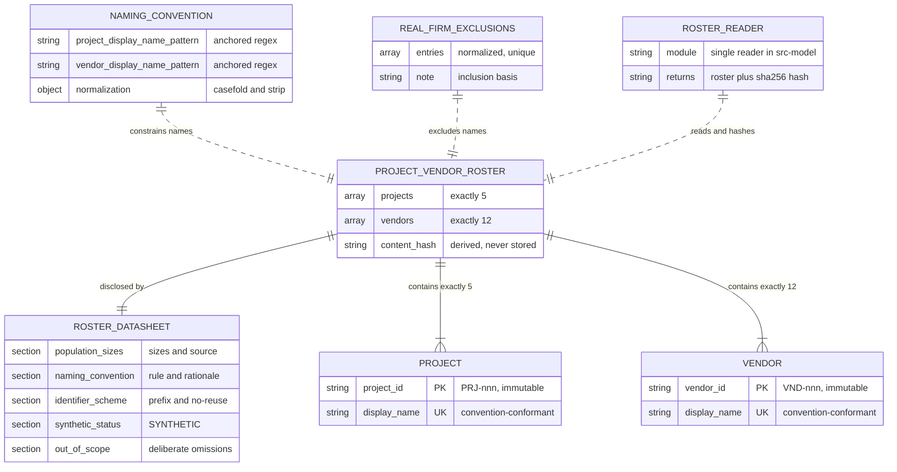

# Data Model — Monorepo Scaffold and Contracts

> Feature: `00001-monorepo-scaffold-and-contracts` | Storage: **none** — committed files, not a database | Consumers: E002 (corpus), E005 (procurement history)

## Scope

| Aspect | Position |
|--------|----------|
| Persistence | None. The entities below are a **committed file fixture** and its disclosure document, read by offline generator jobs. |
| Out of scope here | Tables, DDL, migrations, indexes, foreign keys, ORM models. **E003 owns the PostgreSQL schema in full**; this epic's Excluded section ships no schema, and emitting DDL here would pre-empt it. |
| Also out of scope | Lifecycle values, dates, quantities, categories, criticality — E005 generates those against the identifiers declared here. |
| Also out of scope | Any Project↔Vendor association. The M:N relation arrives with E005's purchase-order lines; this epic declares two independent populations and no join. |

## Physical Artifacts

| Artifact | Path | Format | Written by | Read by |
|----------|------|--------|-----------|---------|
| ProjectVendorRoster | `data/roster/project-vendor-roster.json` | JSON (UTF-8, no BOM) | Authored by hand in this epic | The single roster reader in `/src/model` |
| RosterDatasheet | `data/roster/roster-datasheet.md` | Markdown | Authored by hand in this epic | Humans; completeness asserted by test |
| NamingConvention | `data/roster/naming-convention.json` | JSON | Authored by hand in this epic | Roster validation |
| RealFirmExclusionList | `data/roster/real-firm-exclusions.json` | JSON | Authored by hand in this epic | Roster validation |
| Roster reader | `/src/model/<package>/roster/reader.py` (`<package>` fixed by `plan.md`) | Python module | This epic | E002 and E005 generator jobs, by import |

**Format choice**: JSON, because `json` is in the Python standard library, so the modeling boundary parses the roster without adding a dependency beyond its existing manifest (TR-016, OBJ6 VC4). YAML would require `PyYAML` — an added dependency, and therefore disqualified. The reader is neither the reserved computation package nor the reserved model-facing package (TR-009), so it trips no boundary contract. The fixture lives under `data/`, outside the provider-name source scan's stated root (TR-010), so it cannot perturb that check.

## Access Boundary

Do not model roster access from every entry — TR-016 narrowed it to one reader.

| Entry | Reads the roster | Reason |
|-------|------------------|--------|
| `/src/model` | **Yes — the single reader** | Hosts the offline generators that consume it (TR-016) |
| `/src/api` | Never | Its build context reaches the serving boundary and gateway only; `data/` is unreachable (TR-011) |
| `/src/web` | Never | No consumer of synthetic population data |
| `/src/gateway` | Never | Provider client and validation only (TR-003) |
| E002 / E005 jobs | Via the `/src/model` reader | They import the reader; they do not re-parse the file, and they do not redeclare projects or vendors |

**Detection and its bound**: the constraint "no consumer redefines projects or vendors" (spec Technical Constraints) is observed by VR-013 for the half that lives in this repository — exactly one module opens the roster path, so a second reader is a check failure rather than a convention breach. The other half is observed by nothing here: a later consumer that hardcodes its own projects or vendors opens no roster path and produces no import edge, so no E001 check can see it. That half is carried by IP-001 and IP-003, which name E002 and E005 as reader consumers, and is disclosed as uncovered rather than claimed as enforced.

## Entities

| Entity | Attributes (name: type, constraints) | Relationships | State Transitions |
|--------|--------------------------------------|---------------|-------------------|
| **ProjectVendorRoster** | `projects: array<Project>` NOT NULL, `CHECK(count = 5)`; `vendors: array<Vendor>` NOT NULL, `CHECK(count = 12)`; `CHECK(top-level keys = {projects, vendors})` — strict, no additional keys; **no `version` field** (`CHECK(absent)`, see VR-011); `content_hash: string` **DERIVED, never stored** — `sha256:` + 64 lowercase hex over the canonical serialization, computed by the reader on every read | composes 5 `Project`; composes 12 `Vendor`; disclosed by 1 `RosterDatasheet`; validated against `NamingConvention` and `RealFirmExclusionList` | `Absent → Committed(H₁) → Amended(Hₙ)` — see State & Lifecycle |
| **Project** | `project_id: string` PK, `CHECK(matches ^PRJ-[0-9]{3}$)`, UNIQUE, immutable, never reused; `display_name: string` NOT NULL, non-empty, UNIQUE under normalization, `CHECK(matches convention)`, `CHECK(not in exclusion list)`, `CHECK(≠ any identifier)`; `CHECK(object keys = {project_id, display_name})` | belongs to `ProjectVendorRoster`; later referenced by E002 documents and E005 purchase-order lines **by `project_id`** (those references are E002/E005 artifacts, not modelled here) | — (no lifecycle fields in this epic; E005 owns dates, quantities, and states) |
| **Vendor** | `vendor_id: string` PK, `CHECK(matches ^VND-[0-9]{3}$)`, UNIQUE, immutable, never reused; `display_name: string` NOT NULL, non-empty, UNIQUE under normalization, `CHECK(matches convention)`, `CHECK(not in exclusion list)`, `CHECK(≠ any identifier)`; `CHECK(object keys = {vendor_id, display_name})` | belongs to `ProjectVendorRoster`; later referenced by E005 purchase-order lines and E014/E019 vendor-level grouping **by `vendor_id`** | — (same; no lifecycle fields here) |
| **RosterDatasheet** | `population_sizes: section` REQUIRED — states 5 projects and 12 vendors **and their source** (`specs/sad.md` Scale/Scope, `specs/prd.md`); `naming_convention: section` REQUIRED — the rule and its rationale, including the provenance-and-fairness reason names are invented, **and the Stated limit below** (pattern conformance plus exclusion-list non-membership do not establish a name as invented), so a consumer of the roster meets that limit in the document written for them rather than only in this design note; `identifier_scheme: section` REQUIRED — prefix, zero-padding, opacity, no-reuse; `synthetic_status: section` REQUIRED — literal token `SYNTHETIC`; `out_of_scope: section` REQUIRED — enumerates what the roster deliberately omits; `hash_method: section` OPTIONAL — a non-normative human summary of the canonicalization. Reproducing the digest depends on CS-1…CS-6 in this document, which are normative and complete on their own, so the section's absence cannot make the digest irreproducible and OPTIONAL does not undercut the reproducibility claim. **Carries no literal digest** (a committed digest would go stale, reintroducing the hand-maintained marker this design rejected; asserted by VR-016) | 1:1 with `ProjectVendorRoster`; ships in the same directory and in the same commit | `Absent → Published → Revised-with-roster` (never revised independently of the roster) |

### Datasheet Provenance Coverage

The five required sections are mapped against the recognised dataset-documentation categories (research.md, *Datasheets for Datasets*), so an absent category is a justified omission rather than an oversight. The section count stays at five (TR-018, VR-010, SC-012); the omitted categories are answered by artifacts this document already fixes.

| Category | Where disclosed, or why omitted |
|----------|--------------------------------|
| Motivation | `synthetic_status` and `naming_convention` — why the population is invented, and the provenance-and-fairness reason names must not resemble real firms (spec OBJ6 Rationale) |
| Composition | `population_sizes` (five projects, twelve vendors, with their source) and `identifier_scheme` |
| Generation process | `naming_convention` — the rule names were coined under; the fixture is hand-authored (Physical Artifacts), not sampled, scraped, or model-generated |
| Preprocessing | **Omitted — none exists.** The roster is authored directly, so there is no source dataset to clean, filter, label, or sample from |
| Uses | `out_of_scope` plus the Stated limit; the consumers are E002 and E005 (IP-001, IP-003), which read it through the single reader |
| Distribution | **Omitted as a section** — the dataset is committed in-repo at `data/roster/` (Physical Artifacts) and is neither distributed, licensed, nor exported separately; there is no third party to disclose terms to |
| Maintenance | **Omitted as a section** — maintenance is fixed by policy rather than described per-datasheet: the roster is frozen for the E002/E005 generation window and any content change is a regeneration event (Policy). The reader-computed hash is the currency signal, and no literal digest is committed (VR-016), so the datasheet cannot itself go stale against the fixture |

### Validation Input Artifacts

Supporting artifacts the validation reads. Not part of the roster payload, and not covered by its content hash.

| Artifact | Attributes (name: type, constraints) | Relationships |
|----------|--------------------------------------|---------------|
| **NamingConvention** | `project_display_name_pattern: string` — anchored, RE2-safe regex; `vendor_display_name_pattern: string` — anchored, RE2-safe regex; `identifier_patterns: {project: string, vendor: string}`; `normalization: {casefold: bool, strip_punctuation: bool, collapse_whitespace: bool, strip_legal_suffixes: array<string>}`; `rationale: string` — one line, full text lives in the datasheet | Constrains every `Project.display_name` and `Vendor.display_name`; committed alongside the fixture (TR-017) |
| **RealFirmExclusionList** | `entries: array<string>` — already-normalized real-firm names and distinctive tokens, non-empty, UNIQUE, sorted ascending; `note: string` — what qualifies for inclusion | Every `display_name` must fail membership; committed alongside the fixture (TR-017) |

**Drift story for these two artifacts.** They sit outside the canonical scope, so no edit to either moves the roster hash — each therefore needs its own account of how a change is noticed, and it is asymmetric:

| Direction of edit | Detected by | Consequence |
|-------------------|-------------|-------------|
| Tightening — narrowing a pattern, adding an exclusion entry that an existing name matches | The next read. VR-005 and VR-006 re-validate all seventeen display names against the *current* artifacts, so the roster fails to read | Loud and immediate; the read exits non-zero naming the offending display name |
| Loosening — widening a pattern, removing an exclusion entry, relaxing the normalization | **Nothing.** No existing name fails, and the roster hash does not move because these files are outside its scope | What validation permits has changed without any recorded signal. A later name that should have been rejected is admitted silently |

The loosening direction is why both artifacts are normative and changeable only together with the fixture and the datasheet, and why `RealFirmExclusionList.note` records what qualifies for inclusion — a reviewer reading the diff is the only control this epic ships for it, and it is recorded as uncovered rather than claimed as enforced.

**Committed convention content** (normative; changeable only together with the fixture and datasheet):

- Vendor: `^[A-Z][a-z]{4,11} (?:Fabrication|Mechanical|Electrical|Steel|Glazing|Millwork|Controls|Precast|Systems|Supply|Industries|Works)$` — a coined stem plus a suffix from a closed trade vocabulary (e.g. `Ironvale Fabrication`).
- Project: `^[A-Z][a-z]{4,11}(?: [A-Z][a-z]{3,11})? (?:Hall|Center|Terminal|Pavilion|Annex|Plant|Depot|Campus|Library|Laboratory)$` — a coined place stem, an optional qualifier, and a facility noun (e.g. `Ashgrove Transit Center`).
- Normalization — the single committed form, `NamingConvention.normalization`, applied identically by VR-004 for display-name uniqueness and by VR-006 for exclusion matching: NFC, casefold, strip punctuation, strip legal suffixes (`inc`, `llc`, `ltd`, `corp`, `co`, `plc`, `gmbh`), collapse whitespace. There is one normalization, not two, so a pair of names cannot be unique under one rule and colliding under the other.
- Exclusion match: a name violates if its normalized form **equals** an entry, or **contains an entry as a whole token**. Whole token is determinable, not a judgement call: normalization has already stripped punctuation and collapsed whitespace, so both the name and the entry split on a single space into token lists, and containment means the entry's token list appears in the name's token list as a **contiguous subsequence starting at a token boundary**. A match inside a token does not violate — normalized `ironvalefabrication` does not contain the entry `vale` — and a non-contiguous scatter of an entry's tokens does not violate either.

**Stated limit** (disclosed in the datasheet, per Publish the Miss): the regex enforces *form* and the exclusion list enforces *non-collision*. Neither proves a name is invented. A coined stem that happens to match an unlisted real firm passes both checks.

## Canonical Serialization and Content Hash

The reader computes the hash; the file carries no version field, because a forgotten bump makes drift recordable but not detectable (TR-027, Clarifications 2026-07-25).

| Step | Rule |
|------|------|
| CS-1 | Read the file as UTF-8 text with `encoding="utf-8"`. A BOM is a parse failure, not a tolerated variant. |
| CS-2 | Parse with `json.loads` into `dict`/`list`/`str` only, under an `object_pairs_hook` that **rejects duplicate keys**. A duplicate key is a read failure (VR-014), not a last-wins merge: the parser's default silently discards the earlier value, so two files differing only in that discarded content would produce the same digest and VR-008c's sensitivity claim would be false. Rejection also matches the strictness VR-007 already applies to unexpected keys. |
| CS-3 | Normalize every key and string value to Unicode NFC. |
| CS-4 | Sort `projects` by `project_id` and `vendors` by `vendor_id`, ascending codepoint order. |
| CS-5 | Serialize with `json.dumps(obj, sort_keys=True, ensure_ascii=False, separators=(",", ":"))` — no indentation, no trailing newline. |
| CS-6 | Encode UTF-8, hash with `hashlib.sha256`, emit `"sha256:" + hexdigest()` in lowercase. |

**Determinism properties** (each one a test case for the VR-008 assertion it names):

- **VR-008b** — Invariant to file indentation, key order in the file, entry order in the file, line endings (LF vs CRLF — load-bearing on Windows, where `core.autocrlf` may rewrite the working copy), and trailing newline. The hash tracks roster *content*, not file bytes; reformatting is not drift.
- **VR-008c** — Sensitive to any added, removed, renamed, or re-identified entity, and to any display-name change including case. Bounded to content inside the canonical scope: a change to a file outside that scope moves no hash, which is what the Validation Input Artifacts drift story exists to cover.
- **VR-008a** — Independent of `PYTHONHASHSEED` (`sort_keys=True`) and of platform float repr (the payload holds strings only — no numbers, booleans, or nulls), so repeated reads of an unchanged file agree across processes and platforms.
- Algorithm named in the value (`sha256:` prefix) so a future algorithm change is visible in already-recorded consumer data rather than ambiguous. What that visibility obliges is stated as the algorithm-change row under State & Lifecycle — visibility alone is not a procedure.

**Consumer contract**: E002 and E005 record the value under the field name `roster_hash` (string, `sha256:` + 64 **lowercase** hex, exactly as CS-6 emits it) alongside every artifact they generate, and TR-027 carries that field name, type, and format at requirement level so the two epics cannot diverge on it. This document fixes the value's *format and field name* only; where that field is persisted is E003's schema decision.

## Validation Rules

Validation is a function of the single reader module, exercised by `/src/model`'s test suite. It counts toward the aggregated coverage denominator (TR-006).

| ID | Rule | Applies to | Requirement |
|----|------|-----------|-------------|
| VR-001 | Exactly 5 projects and exactly 12 vendors — equality, not minimum or maximum. Either count off by one fails the read. | Roster | TR-016, OBJ6 VC1 |
| VR-002 | Identifiers match `^PRJ-[0-9]{3}$` / `^VND-[0-9]{3}$`, are unique within their kind, and are opaque — they encode no category, order, or meaning. | Project, Vendor | TR-016 |
| VR-003 | Identifier and display name are distinct value spaces: no display name matches an identifier pattern, and no identifier appears as a display name. Later epics join on identifiers; display names appear in generated documents. | Project, Vendor | TR-016 |
| VR-004 | Display names are unique under normalization, within kind and across kinds. The normalization is the single committed `NamingConvention.normalization` form — NFC, casefold, strip punctuation, strip legal suffixes, collapse whitespace — the same one VR-006 applies for exclusion matching, stated here rather than left to inference. | Project, Vendor | TR-017 |
| VR-005 | Every display name matches the committed `NamingConvention` pattern for its kind. | Project, Vendor | TR-017, OBJ6 VC2 |
| VR-006 | No display name matches a `RealFirmExclusionList` entry under the normalized equality-or-whole-token-containment rule. | Project, Vendor | TR-017, OBJ6 VC2 |
| VR-007 | Strict shape: exactly two top-level keys; each record carries exactly its two fields; all values are non-empty strings. An unexpected key fails the read rather than being ignored. | Roster, Project, Vendor | TR-016 |
| VR-008 | Hash determinism, as three assertions that pass and fail independently, are exercised by their own test cases, and are named separately in failure output: **VR-008a** repeated reads of an unchanged file yield an identical hash; **VR-008b** formatting-only mutations (indentation, key order, entry order, line endings, trailing newline) yield an identical hash; **VR-008c** any content mutation — an added, removed, renamed, or re-identified entity, or any display-name change including case — yields a different hash. Sensitivity is bounded to content inside the canonical scope of CS-1…CS-6; one assertion passing is not evidence for another. | Roster | TR-027, OBJ6 VC4 |
| VR-009 | The reader imports standard library only (`json`, `hashlib`, `unicodedata`, `pathlib`, `re`). Asserted against `/src/model`'s manifest, which must be unchanged by this feature's roster work. | Reader | TR-016, OBJ6 VC4 |
| VR-010 | The datasheet contains all five required disclosures, each present as a level-2 Markdown heading named for its declared attribute — `Population Sizes`, `Naming Convention`, `Identifier Scheme`, `Synthetic Status`, `Out of Scope` (heading match, case-insensitive) — so presence is a heading check rather than a reading. Adequacy is checked as stated sub-conditions rather than reader judgement: Population Sizes names both counts and cites its source document path; Naming Convention cites the committed convention file and carries the Stated limit; Identifier Scheme names both identifier prefixes; Synthetic Status contains the literal token `SYNTHETIC`; Out of Scope is non-empty. | RosterDatasheet | TR-018, OBJ6 VC5 |
| VR-011 | The roster carries no hand-maintained `version`, `revision`, or `updated` field. Asserted as an explicit absence so the rejected design cannot be reintroduced by a well-meaning edit. | Roster | TR-027 |
| VR-012 | `NamingConvention` and `RealFirmExclusionList` exist, parse, and are non-empty; exclusion entries are unique and already normalized. | Validation artifacts | TR-017 |
| VR-013 | Exactly one module opens the roster path. Checked by a source scan over all four entries under `/src`, excluding `/tests` and `/data`, mirroring TR-010's mechanism and root; a second opener exits non-zero naming every offending file. Boundary check, not a data check. | Reader | TR-016 |
| VR-014 | The roster file exists at its committed path, is non-empty, and parses under CS-1 and CS-2. Absence, an unreadable file, a BOM, malformed JSON, or a duplicate key is a **read failure**, reported as such and distinctly from a validation failure, and no hash is returned. Read failures precede VR-001…VR-013, which have no payload to evaluate without a successful parse. | Roster | TR-016 |
| VR-015 | Ordering: the reader evaluates VR-001…VR-013 before emitting any hash, and returns a hash only for a roster that passes every one of them. A roster failing any rule yields a non-zero exit and no hash, so no consumer can record a value for a roster that never validated. This generalizes what VR-001's added-entity case states for one rule to the whole rule set. | Roster, Reader | TR-027 |
| VR-016 | The datasheet carries no literal digest of the roster — no `sha256:` value and no hexadecimal digest in any section. Asserted as an explicit absence for the same reason as VR-011: a committed digest goes stale, reintroducing by way of documentation the hand-maintained marker this design rejected. | RosterDatasheet | TR-018, TR-027 |

Every failure exits non-zero and names the violated rule (TR-019). Where the violation is attributable to a record it also names the offending identifier or display name; where it is attributable to a source location — VR-009, VR-013 — it names the offending module or file. The rules whose violation has no offending record to name — VR-001, VR-008, VR-010, VR-011, VR-012, VR-014, VR-015, VR-016 — report the rule together with the observed and required condition (for example `VR-001: 6 projects, expected exactly 5`), so the failure-output obligation is adequate for every rule rather than only for the record-level ones.

**Attribute coverage**: every attribute declared in the Entities table is covered by at least one rule above, with one stated exception. The identifiers' `immutable, never reused` constraint is a cross-revision property no single-read rule can observe: a changed identifier surfaces only as a hash mismatch (State & Lifecycle), and reuse of a retired identifier surfaces as nothing at all. It is held by policy and review rather than by a check, and is recorded here as uncovered rather than counted as covered.

## State & Lifecycle

Roster states are file states, not row states.

| State | Meaning | Exit condition |
|-------|---------|----------------|
| `Absent` | No fixture committed; E002 and E005 are blocked on IP-001 / IP-003. | Fixture, datasheet, convention, and exclusion list land in one commit. |
| `Committed(H₁)` | Fixture passes VR-001…VR-015; the reader returns `H₁`. Consumers generate data and record `roster_hash = H₁`. | An edit to `projects` or `vendors` content. |
| `Amended(Hₙ)` | Content changed; the reader now returns `Hₙ ≠ H₁`. Every artifact recording an earlier hash is **stale by definition**. | Consumers regenerate and re-record, or the change is reverted. |

**What it means for the roster to change after a consumer has generated data.** There is no reconciliation mechanism in this epic — only detection. The hash mismatch is the entire signal, and it is a *detector*, not a repair:

| Change | Detected by | Consequence for already-generated data |
|--------|-------------|-----------------------------------------|
| Reformat or reorder only | Nothing — hash unchanged **by design** | None. Not drift. |
| Display name edited | Hash mismatch | E002's synthesized documents contain the old name verbatim; identifiers still join, so the corpus text and the roster disagree while every foreign reference stays valid. Silent in the data, visible only in the hash. |
| Identifier changed or entity removed | Hash mismatch | E005 procurement lines and E002 document links reference an identifier that no longer exists. Highest severity — this is why identifiers are immutable and never reused; a retired identifier stays retired rather than being reassigned. |
| Entity added (6th project, 13th vendor) | VR-001 fails the read outright | The read fails before any hash is returned. Population size is fixed at 5/12 by spec and PRD; changing it is a spec amendment, not a data edit. |
| Consumer omits `roster_hash` | Nothing | Drift becomes undetectable for that consumer's output. Recording the hash is the consumer's half of the contract, and its absence is the one failure mode this design cannot see. **Owner**: E002 and E005 under IP-001 and IP-003 — each owns its own generation output, and TR-027 states the recording obligation. **Acceptance**: no E001 check can observe a later epic's artifacts, so E001 accepts this exposure explicitly rather than claiming coverage; closing it means the generating epic asserting the field's presence on its own output, which is that epic's to add. |
| Hash algorithm changed (the `sha256:` prefix becomes another algorithm) | Prefix comparison — a recorded value whose prefix differs from the algorithm the reader now emits | Values recorded under the superseded prefix are **not comparable**: they may not be read as agreement, and a difference between them and a current value is not evidence of content drift. They are stale by definition, exactly as an outdated digest is. The reader retains no superseded algorithm for verification, so the procedure is regeneration and re-recording under the new algorithm, never re-hashing history to manufacture a match. A prefix change is therefore a regeneration event for every recorded value, and a spec amendment against TR-027 rather than an implementation tweak. |

**Policy**: the roster is frozen for the duration of E002 and E005 generation. Any content change is a regeneration event affecting every artifact whose recorded `roster_hash` no longer matches — the spec's edge case "the roster changes after a consumer has generated data from it" is resolved to *mechanically detectable*, not *automatically corrected*. The freeze itself is a **convention that no check observes**: nothing in this epic watches the fixture during a generation window, and the hash mismatch is an after-the-fact detector rather than a preventer. It is labelled as such rather than presented as enforcement.

ER Diagram (visual reference)

## Requirement Traceability

| Requirement | Covered by |
|-------------|-----------|
| TR-016 | Roster, Project, Vendor entities; VR-001, VR-002, VR-003, VR-007, VR-009, VR-013, VR-014; Access Boundary; Physical Artifacts (committed path, JSON, UTF-8 without BOM) |
| TR-027 | Canonical Serialization CS-1…CS-6; VR-008 (VR-008a–VR-008c), VR-011, VR-015, VR-016; consumer `roster_hash` contract; State & Lifecycle, including the algorithm-change row |
| TR-017 | NamingConvention, RealFirmExclusionList; VR-004, VR-005, VR-006, VR-012; their drift story under Validation Input Artifacts |
| TR-018 | RosterDatasheet entity; Datasheet Provenance Coverage; VR-010, VR-016 |
| TR-019 | Failure output rule under Validation Rules |
| SC-011 | VR-001, VR-002, VR-005, VR-006, VR-008, VR-009, VR-014, VR-015 |
| SC-012 | VR-010, VR-016 |
