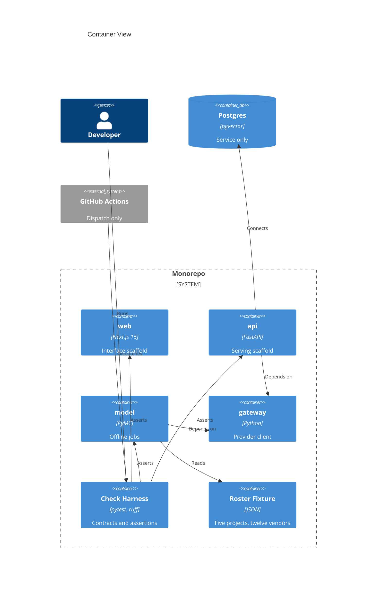

# Implementation Plan: Monorepo Scaffold and Contracts

**Branch**: `00001-monorepo-scaffold-and-contracts` | **Date**: 2026-07-25 | **Spec**: [spec.md](spec.md)

## Summary

**Goal**: Scaffold four entries under `/src` and the build-time machinery that turns three architectural rules into failures.
**Approach**: Per-entry `uv` projects invoked via `uv run --directory`, contracts configured in each entry's own `pyproject.toml`, one aggregated coverage gate at the root.
**Key Constraint**: Every enforcement mechanism must be honest about its blind spot — topology guarantees, checks only detect.

## Technical Context

**Language/Version**: TypeScript 5.x on Node 22 (web); Python 3.12 (api, model, gateway)
**Primary Dependencies**: Next.js 15 App Router; FastAPI; PyMC/ArviZ; Anthropic SDK (gateway); uv 0.8.14; npm 11.6.1
**Storage**: PostgreSQL 16 + pgvector — service provisioned only; schema owned by E003
**Testing**: pytest + pytest-cov + Hypothesis (api, model); pytest (gateway); Vitest (web); import-linter (contracts)
**Target Platform**: Linux containers under Docker Compose; host is Windows 10 with Git Bash
**Project Type**: web
**Project Mode**: greenfield
**Performance Goals**: None this epic — latency, RSS, and image size are unmeasurable until E008/E010 give them a workload to measure
**Constraints**: Four entries under `/src`; three standalone uv projects, not workspace members; one JS lockfile; ports 5434/8001/3000; serving build context excludes `/src/model`
**Scale/Scope**: 4 entries, 27 requirements, 7 objectives, 17-row roster fixture

## Instructions Check

*GATE: Must pass before Phase 0 research. Re-check after Phase 1 design.*

| Principle / Section | Gate | Status |
|---|---|---|
| I. Traceable or It Does Not Ship | Roster hash derived by the reader and recorded by consumers | PASS |
| II. Uncertainty Is the Product | No forecast, metric, or interface in this epic | N/A |
| III. Precision Over Recall | Contracts bias to refusal; blind spots disclosed not claimed | PASS |
| IV. Agent Output Style | Tables throughout; prose confined to Summary | PASS |
| V. Model Extracts, Code Computes | Reserved compute/llm packages + forbidden contract, indirect on. Two separate gaps: inline computation produces no import edge, and — per the CI deviation at the Development Workflow row — no trigger runs the contract automatically, so the principle's "fails the build" clause is not met this epic | PASS (partial enforcement, disclosed — see Development Workflow / CI) |
| VI. Evaluate Before You Tune | No evaluation set in this epic; E014 owns the harness | N/A |
| VII. Publish the Miss | The dispatch-only deviation was disclosed in six places, then closed during analyze by adding `on: push` rather than carried to E002 | PASS |
| VIII. Honest Opponents | No model claim or baseline in this epic | N/A |
| Technology Stack | TypeScript 5.x on Node 22 (web); Python 3.12 (api, model, gateway); Next.js 15, FastAPI, PyMC/ArviZ; PostgreSQL 16 + pgvector | PASS |
| Testing & Quality Policy | Coverage 80% aggregated; both required categories — linting (covering lint, static analysis, and code quality) and coverage — delivered for all four entries | PASS |
| Source Code Layout | Four entries under `/src` per ADR-0010, instructions v1.1.2; the cross-entry check harness under `/tests` is covered by the scoped exception v1.1.2 added for verification with no single owning entry | PASS |
| Development Workflow / CI | `on: push` plus `workflow_dispatch`; contract violations fail the build. PR triggering and branch protection remain with E002 | PASS |
| Data Provenance | Roster is SYNTHETIC with a five-section datasheet and an enforced real-firm exclusion list | PASS |
| Governance | AD-001…AD-005 all feature-local. Single-path model invocation and the computation boundary are both **specified** but neither is automatically enforced this epic — see the CI deviation. Whether that relaxes the constraints or only defers their automation is the judgment the Development Workflow row puts to the user | PASS (qualified — see Development Workflow / CI) |

## Architecture



## Architecture Decisions

Feature-local tradeoffs only. Project-wide decisions live in `specs/adrs/` — see ADR-0010 (four-entry layout), ADR-0007 (single traced import), ADR-0008 (computation boundary), ADR-0003 (offline jobs).

| ID | Decision | Options Considered | Chosen | Rationale |
|----|----------|--------------------|--------|-----------|
| AD-001 | Roster fixture format | JSON / YAML / TOML | JSON | `json` is stdlib, so the modeling boundary parses it without touching its manifest (TR-016). YAML would add a dependency. |
| AD-002 | Coverage aggregation mechanism | `parallel = true` / distinct `COVERAGE_FILE` per entry | `COVERAGE_FILE` | pytest-cov overrides coverage's `parallel` setting, so it cannot be relied on; distinct data files then `coverage combine` at root. Check logic lives in importable helpers under `tests/checks/helpers/` imported by thin test modules — logic inline in test functions would be tautologically covered and could mask a low-coverage roster reader. Per-file rows are emitted so dilution stays visible. |
| AD-003 | Image assertion driver | container-structure-test / pytest + `docker run` | pytest + `docker run` | Only an in-image check survives a multi-stage build, and Python check scripts stay inside TR-006's measured denominator. |
| AD-004 | Fixture contract invocation | Exclusions in production config / separate config via `--config` | Separate config | An exclusion in a production config is a hole that can drift; a separate config leaves production contracts unmodified. |
| AD-005 | Property-based test scope | All Python entries / api + model only | api + model only | Only those two hold the reserved computation packages policy requires property tests for; the gateway holds none **in this epic**. E004 adds cost computation from token counts to the gateway — a pure function warranting property tests — so E004 must add Hypothesis there. |

## Complexity Tracking

| Violation | Why Needed | Simpler Alternative Rejected Because |
|-----------|------------|--------------------------------------|
| ~~CI Requirements state contract violations must fail the build; this epic ships a dispatch-only workflow that gates nothing automatically~~ **Closed during analyze** | The deviation was disclosed here for two phases as a scope decision rather than a technical blocker: `workflow_dispatch` genuinely requires the file on the default branch, but `on: push` does not. Once the analyze phase restated that in front of the user, the one-line trigger was added instead of deferred — the disclosure is what made the cheapness of the fix visible. Retained rather than deleted because Principle VII is about the miss being published, and a row that vanishes on being fixed teaches nothing. | **Still deferred to E002**: `pull_request` triggering, required status checks, and branch protection on `main`. `on: push` reports a violation after the fact; only branch protection blocks a violating merge, so the forge-level guarantee remains E002's to deliver. |

## Data Model Summary

| Entity | Key Fields | Relationships | Notes |
|--------|-----------|---------------|-------|
| ProjectVendorRoster | `projects` (exactly 5), `vendors` (exactly 12), `content_hash` (derived, never stored) | Composes Project and Vendor; disclosed by RosterDatasheet | `data/roster/project-vendor-roster.json`; no version field by design; read only by the `/src/model` reader |
| Project | `project_id` `^PRJ-[0-9]{3}$`, `display_name` unique | Referenced by E002 documents, E005 lines | Identifier is the join key; display name is document text |
| Vendor | `vendor_id` `^VND-[0-9]{3}$`, `display_name` unique | Referenced by E005 lines and vendor grouping | Identifiers opaque, never reused |
| RosterDatasheet | population sizes, naming convention, identifier scheme, synthetic status, out-of-scope | 1:1 with roster, same commit | Documents the hash method, carries no literal digest |
| NamingConvention | display-name patterns, normalization | Constrains every display name | Validation input; not covered by the content hash |
| RealFirmExclusionList | normalized entries | Every display name must fail membership | Validation input; not covered by the content hash |

**Detail**: [data-model.md](data-model.md)

## API Surface Summary

N/A — no API surface. This epic scaffolds the serving boundary but ships no routes; E003 onward add them.

## Testing Strategy

| Tier | Tool | Scope | Mock Boundary | Install |
|------|------|-------|---------------|---------|
| Unit | pytest + Hypothesis | Roster reader, source scan, name-convention validation | None — pure functions | `uv add --dev pytest pytest-cov hypothesis` in api and model; `uv add --dev pytest pytest-cov` in gateway — Hypothesis is scoped to the two entries holding reserved computation packages per AD-005 |
| Unit (web) | Vitest | Component scaffolding | jsdom | `npm install -D vitest @vitejs/plugin-react jsdom @testing-library/react vite-tsconfig-paths` |
| Integration | pytest + `docker run` | Built serving image: lock-derived allowlist, modeling-import failure | Real image, no mocks | Docker already present |
| Static analysis (Python) | ruff, import-linter | Lint, format, import contracts | — | `uv add --dev ruff import-linter` per Python entry |
| Static analysis (web) | ESLint + Prettier, tsc | Lint, format, type check | — | `npm install -D eslint eslint-config-next prettier eslint-config-prettier`; `npx tsc --noEmit` |
| Security | pip-audit, `npm audit` | Dependency vulnerabilities | — | Reported, not gated — the project declined security as an enforced category |
| Coverage | coverage.py | Aggregated over source scan, image checks, roster reader | — | `uv tool install coverage`; root `coverage combine && coverage report --fail-under=80` |

## Error Handling Strategy

N/A — scaffold epic. Every failure mode is a build-time check exiting non-zero and naming the violated rule (TR-019). There is no request path, no runtime external call, and no user-facing error surface until E010.

## Integration Points

| Spec Reference | System/Service | Technical Approach | Contract |
|----------------|----------------|--------------------|----------|
| IP-001 | E002 corpus generation | Imports the `/src/model` roster reader | `data-model.md` |
| IP-002 | E002 CI ownership | Adds `push`/`pull_request` triggers to `verify.yml` | Workflow file |
| IP-003 | E005 procurement history | Same reader; records `roster_hash` alongside generated data | `data-model.md` |
| IP-004 | E003 schema | Consumes the Compose Postgres service on 5434 | `docker-compose.yml` |
| IP-005 | E004 gateway module | Implements inside `/src/gateway`, the contract's sole allowlisted importer | `[tool.importlinter]` in gateway |
| IP-006 | E006, E011 | Both depend on the gateway package; neither depends on the other | `pyproject.toml` path deps |
| IP-007 | All later epics | Extend the contract harness; gates only when invoked until E002 | Per-entry configs |
| IP-008 | pgvector image | Pulled on first `docker compose up`, ~450 MB cold | Compose service definition |

## Risk Mitigation

| Risk (from spec) | Likelihood | Impact | Mitigation | Owner |
|-------------------|------------|--------|------------|-------|
| Deferred triggers leave the enforcement epic itself unenforced | H | H | Land `verify.yml` on the default branch (TR-021) and dispatch both runs before close (TR-022); E002 adds automatic triggers | Check harness |
| Contracts appear stronger than they are | H | M | `protected` contract for direct imports, source scan for re-export laundering, five blind spots enumerated in Edge Cases rather than claimed as covered | Check harness |
| First orchestration start pulls a large image | H | L | Pull `pgvector/pgvector:pg16` — digest-pinned per TR-026 — as an explicit first task; treat pull failure as epic-blocking, not transient | Compose |

## Requirement Coverage Map

| Req ID | Component(s) | File Path(s) | Notes |
|--------|--------------|--------------|-------|
| TR-001 | Layout | `/src/{web,api,model,gateway}` | Entry-count assertion in check harness |
| TR-002 | uv projects | `src/*/pyproject.toml`, `src/*/uv.lock` | Standalone, not workspace members |
| TR-003 | Gateway manifest | `src/gateway/pyproject.toml` | No web framework, no modeling stack |
| TR-004 | Dep comparison | `tests/checks/test_dependency_isolation.py` | Third-party only; first-party path deps excluded |
| TR-005 | Toolchain | `src/*/pyproject.toml`, `src/web/{package.json,eslint.config.mjs,.prettierrc}` | ruff + import-linter; ESLint + Prettier + tsc; pytest, Vitest |
| TR-006 | Coverage | root `pyproject.toml`, `tests/checks/helpers/` | Aggregated; per-entry reports do not gate; per-file rows emitted |
| TR-007 | Fixtures | `tests/fixtures/`, `*.importlinter.toml` | Outside every production contract root |
| TR-008 | Import contract | `src/gateway/pyproject.toml` | `protected`, direct imports only |
| TR-009 | Boundary contract | `src/{api,model}/pyproject.toml` | `forbidden`, indirect detection on |
| TR-010 | Source scan | `tests/checks/test_single_import_site.py` | Scanned root excludes fixtures and configs |
| TR-011 | Build context | `src/api/Dockerfile`, `.dockerignore` | Reaches api + gateway only |
| TR-012 | Allowlist check | `tests/checks/test_image_allowlist.py` | `uv export` vs `importlib.metadata` |
| TR-013 | In-image denylist | `tests/checks/test_image_denylist.py` | Derived minus first-party path deps |
| TR-014 | Compose profiles | `docker-compose.yml` | Jobs under non-default profile |
| TR-015 | Postgres service | `docker-compose.yml` | pgvector image, host port 5434 |
| TR-016 | Roster + reader | `data/roster/*.json`, `src/model/src/model/roster/` | Single reader, offline consumers only |
| TR-027 | Content hash | `src/model/src/model/roster/reader.py` | Canonical serialization, SHA-256 |
| TR-017 | Name validation | `data/roster/naming-convention.json`, `real-firm-exclusions.json` | Regex + exclusion membership |
| TR-018 | Datasheet | `data/roster/roster-datasheet.md` | Five required disclosure sections |
| TR-019 | All checks | `tests/checks/`, per-entry configs | Non-zero exit naming rule and location |
| TR-020 | Workflow | `.github/workflows/verify.yml` | `workflow_dispatch`, per-check reporting |
| TR-021 | Workflow landing | `.github/workflows/verify.yml` on default branch | Prerequisite for dispatch |
| TR-022 | Violated-run evidence | `verify.yml` input or throwaway branch | Avoids committing to a production root |
| TR-023 | Lock verification | `src/*/uv.lock`, `src/web/package-lock.json` | `uv lock --check` / `uv sync --locked` per Python entry; `npm ci` for web; each against its own manifest |
| TR-024 | Resolution source | `src/*/pyproject.toml`, `src/web/package.json` | Default public index per ecosystem, none configured otherwise; gateway resolves by path only |
| TR-025 | Credential boundary | `src/api/Dockerfile`, `.dockerignore` | No provider credential in source, build context, or layers; supply and redaction are E004's |
| TR-026 | Image digest pinning | `src/api/Dockerfile`, `docker-compose.yml` | Base image and `pgvector/pgvector:pg16` pinned by digest alongside the tag |

## Project Structure

### Source Code

```text
/src
├── web/                       # Next.js 15, npm, exactly one lockfile
│   ├── app/                   # App Router — not src/app, one wins silently
│   ├── __tests__/             # Vitest
│   ├── eslint.config.mjs      # ESLint + Prettier
│   ├── next.config.ts         # turbopack.root + outputFileTracingRoot pinned
│   └── package.json
├── api/
│   ├── src/api/{compute,llm}/ # reserved, empty this epic
│   ├── tests/
│   ├── Dockerfile             # build context: api + gateway only
│   ├── pyproject.toml         # [tool.importlinter] forbidden contract
│   └── uv.lock
├── model/
│   ├── src/model/{compute,llm}/
│   ├── src/model/roster/      # reader + canonical hash
│   ├── tests/
│   ├── pyproject.toml
│   └── uv.lock
└── gateway/
    ├── src/gateway/           # sole provider import site
    ├── tests/
    ├── pyproject.toml         # [tool.importlinter] protected contract
    └── uv.lock

/data/roster/                  # roster, datasheet, convention, exclusions
/tests/checks/                 # coverage-measured check scripts
/tests/fixtures/               # violating modules, outside contract roots
/.github/workflows/verify.yml  # workflow_dispatch
/docker-compose.yml            # services + jobs profile
/pyproject.toml                # root: coverage combine only
```

## Implementation Hints

- **[HINT-001]** Order: land `verify.yml` on the default branch before attempting any dispatch — `workflow_dispatch` is unavailable until the file exists there, and the repository has zero commits. This constraint is specific to dispatch; `on: push` would fire from the first commit carrying the workflow, so the trigger deferral is scope, not necessity.
- **[HINT-002]** Gotcha: `uv export` resolves environment markers for the *running* platform. Exporting on this Windows host and comparing against a Linux image mismatches on marker-conditional distributions — export with an explicit Linux platform and normalize names per PEP 503 before comparing.
- **[HINT-003]** Compatibility: pin one identical `coverage` version across all three Python entries and the root combine step; data files carry a schema version and `combine` rejects mismatches.
- **[HINT-004]** Gotcha: `docker run --entrypoint python` may resolve the system interpreter rather than the copied venv. Pin the venv interpreter path, assert `ModuleNotFoundError` specifically rather than any non-zero exit, and include a positive control asserting the web framework *does* import.
- **[HINT-005]** Constraint: run every Python tool as `uv run --directory src/<entry> …`. Bare `pytest` or `ruff` from the repo root resolves against whichever environment happens to be active, silently crossing the boundary the contracts exist to enforce. Three environment settings are also required rather than optional on a workstation where TLS is intercepted locally — each was found by a failure during implementation, and none is needed on a hosted Linux runner. **`UV_NATIVE_TLS=1`**: security software that scans HTTPS (Avast, on the machine this was built on) re-signs every connection with a root it installs into the **Windows certificate store**. Tools that read that store — pip, browsers, and `uv` under this flag — work; tools carrying their own CA list do not, so plain `uv` dies with `invalid peer certificate: UnknownIssuer`. The same cause breaks `git` unless `http.sslBackend=schannel` is set, and breaks anything using `requests`/`certifi`, which is why `pip-audit` cannot run there. **`PYTHONUTF8=1`** when invoking `lint-imports` on Windows — `rich` renders an emoji in its progress spinner and falls back to a cp1252 legacy console encoder whenever stdout is not a terminal, so the contract raises `UnicodeEncodeError` and **exits 1 with no visible output**, which reads as a broken contract rather than a broken terminal (Linux runners are unaffected, so CI hides it and local wrapper scripts hit it every time); and **`MSYS_NO_PATHCONV=1`** for `docker run` under Git Bash, which otherwise rewrites `/app/.venv/bin/python` into a Windows path and fails to start the container. Also required in `src/gateway/pyproject.toml`: `include_external_packages = true`, without which the graph holds only internal modules and the `protected` contract fails with `"anthropic" not present in the graph`.
