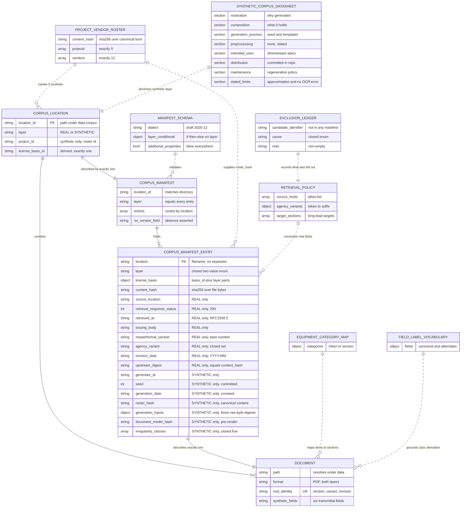

# Data Model — Public Corpus and Manifest

> Feature: `00002-public-corpus-and-manifest` | Storage: **none** — committed files, not a database | Consumers: E006 (ingestion), E008/E009 (extraction and retrieval), E014 (evaluation)

## Scope

| Aspect | Position |
|--------|----------|
| Persistence | None. The entities below are **committed files under `data/`** and the per-location JSON manifests that describe them, read by offline jobs in `/src/model`. |
| Out of scope here | Tables, DDL, migrations, indexes, foreign keys, ORM models. **E003 owns the PostgreSQL schema in full**; this epic's Excluded section ships no schema, and emitting DDL here would pre-empt it. This document's `PK`, `UNIQUE`, and `CHECK` notation describes *validator assertions over JSON and files*, not columns. |
| Also out of scope | Chunks, page-metadata rows, and any parse product — E006 owns ingestion. This epic ships files; nothing here becomes a row. |
| Also out of scope | Purchase-order lines, events, need-by dates, criticality — E005's. No purchase-order document is synthesized, so no such entity appears. |
| Also out of scope | Frozen evaluation sets and golden questions — E014's. Nothing here freezes or hashes an evaluation artifact. |
| Consumed, not redefined | `ProjectVendorRoster` — E001's committed fixture, reached only through `model.roster.reader.read_roster()`. This epic declares no project and no vendor. |

## Physical Artifacts

Corpus root is `data/corpus/`, fixed by FR-018 rather than only here. A **corpus location** is any directory under that root containing a file named `manifest.json`; the root and its intermediate directories contain none and are therefore not locations. That definition is mechanical, so "is this file inside a location" is a directory test rather than a judgement — and it is the definition the spec's Glossary now carries, in place of one phrased over the license basis, which cannot be evaluated until the manifest inside the location has already been read. Outside every location, the corpus root holds only the seven supporting artifacts FR-018a enumerates (VR-065); locations themselves are flat (VR-064).

| Artifact | Path | Format | Written by | Read by |
|----------|------|--------|-----------|---------|
| Manifest JSON Schema | `data/corpus/manifest.schema.json` | JSON Schema **draft 2020-12** | Authored by hand in this epic | The validator, via `jsonschema.Draft202012Validator` |
| Real corpus location | `data/corpus/real/ufgs/` | Directory | Retrieval work in this epic | Validator; E006 |
| Real manifest | `data/corpus/real/ufgs/manifest.json` | JSON | Authored at retrieval | Validator; evaluators |
| Real documents | `data/corpus/real/ufgs/*.pdf` (≥ 20) | PDF, byte-for-byte as published | Vendored, never rewritten | E006 |
| Retrieval policy | `data/corpus/real/retrieval-policy.json` | JSON | Authored by hand | Validator (VR-021, VR-022, VR-023, VR-025) |
| Exclusion ledger | `data/corpus/real/exclusions.json` | JSON | Appended at retrieval | Validator (VR-026); humans |
| Synthetic corpus locations | `data/corpus/synthetic/PRJ-001/` … `PRJ-005/` | Directories, one per roster project | Generator | Validator; E006 |
| Synthetic manifests | `data/corpus/synthetic/PRJ-00N/manifest.json` | JSON | Generator | Validator; evaluators |
| Synthetic documents | `data/corpus/synthetic/PRJ-00N/*.pdf` (≥ 25 total) | PDF | Generator | Validator; E006, E008, E009 |
| SyntheticCorpusDatasheet | `data/corpus/synthetic/datasheet.md` | Markdown | Authored by hand | Humans; completeness asserted by VR-051…VR-055 |
| Generation config | `data/corpus/synthetic/generation-config.json` | JSON | Authored by hand | Generator and validator (VR-030) |
| Equipment category map | `data/corpus/synthetic/equipment-category-map.json` | JSON | Authored by hand | Generator and validator (VR-048) |
| Field label vocabulary | `data/corpus/synthetic/field-label-vocabulary.json` | JSON | Authored by hand | Injector and validator (VR-035b) |
| Generator | `src/model/src/model/corpus/generate.py` | Python module | This epic | Invoked explicitly; not on any serving path |
| Validator | `src/model/src/model/corpus/validate.py`, console entry `corpus-validate` | Python module + console script | This epic | The verification workflow (FR-017) |

Module split beyond `generate.py` / `validate.py` is `plan.md`'s to fix; the two paths above are load-bearing because FR-018 names the boundary and requires a console entry point.

**Format choice**: JSON against a committed draft 2020-12 schema, because required-versus-absent is exactly what a JSON Schema expresses and FR-010 turns every absence into a failure rather than a default. `jsonschema` is a declared dependency of the modeling boundary rather than a stdlib module — unlike E001's roster, which stayed stdlib-only. The cost is deliberate: the layer-dependent field asymmetry of FR-008/FR-009 is a conditional-subschema problem, and hand-rolling it in Python would make the contract source code rather than a committed artifact an evaluator can read (SC-006).

**No aggregate index** (FR-006a). Discovery is a directory walk for `manifest.json`. The exposure that creates — a whole location could be deleted and simply not be discovered — is closed by two population rules rather than by an index: VR-005 fixes exactly five synthetic locations in bijection with the roster's projects, and VR-025 fixes a document floor and a section floor on the real layer. A missing location fails one of those two.

## Access Boundary

| Entry | Reads `data/corpus/` | Reason |
|-------|----------------------|--------|
| `/src/model` | **Yes — writes the synthetic layer, validates the whole corpus** | Both jobs must read the roster, and it is the only entry permitted to (FR-018, FR-019) |
| `/src/api` | Never | `data/` is outside its build context (E001 TR-011); a serving-side reader fails inside the image, not at review |
| `/src/web` | Never | No consumer of corpus files |
| `/src/gateway` | Never | Provider client and validation only |
| E006 ingestion | Yes, later | Reads files and manifests; adds no field and rewrites no manifest |

The roster is reached only through E001's single reader. The existing repo-root scan `tests/checks/test_single_import_site.py` asserts that exactly one source file under `/src` names `project-vendor-roster`; adding the generator must leave that count at one (VR-045).

## Consumed Interface — E001 Roster Reader

Cited from source (`src/model/src/model/roster/reader.py`), not assumed.

| Symbol | Signature / shape | Used here for |
|--------|-------------------|---------------|
| `read_roster(path: Path \| None = None) -> Roster` | Parses, validates, and hashes in one call; raises `RosterError` on any failure | The generator's only source of projects and vendors (FR-019) |
| `Roster.content_hash: str` | `"sha256:"` + 64 lowercase hex over a canonical re-serialization of parsed content | The literal recorded as `roster_hash` (FR-020), and the current value VR-029 compares against |
| `Roster.projects: tuple[Entry, ...]` | Exactly 5 | Bijection with the five synthetic corpus locations (VR-005) |
| `Roster.vendors: tuple[Entry, ...]` | Exactly 12 | Vendor coverage over the document model (VR-047) |
| `Entry.id`, `Entry.name` | `str`, `str` | Identifier and display name. **Note the field names**: the shipped reader uses `id` and `name`, not the `project_id` / `display_name` that E001's `data-model.md` declared. This document cites the implementation. |
| `RosterError` | `ValueError` subclass, one type for every failure | Generation aborts; no document is emitted from a roster that did not validate |

`read_roster()` returns the roster and its hash together, so no code path here can obtain identifiers without the hash it must record.

## The Digest Kinds, Kept Distinct

Five kinds of digest-shaped value appear in this model. They are computed over five different things and must not be substituted for one another. All share the surface form `^sha256:[0-9a-f]{64}$`, fixed at requirement level by FR-007 rather than only here.

| Field | Layer | Computed over | Computed by | Independently re-derived by | Purpose |
|-------|-------|---------------|-------------|-----------------------------|---------|
| `content_hash` | Both | The committed file's **raw bytes**, exactly as on disk — no parsing, no canonicalization | Validator, on every run, recomputed and never trusted | VR-012, from the file | Detects modification of a file after it was manifested (FR-007) |
| `upstream_digest` | REAL only | The **bytes as retrieved** from the source, at the moment of retrieval (FR-008c) | Retrieval work, once; thereafter a historical constant | **Nothing.** VR-018 compares it to `content_hash`, which is a consistency check, not a re-derivation — see Uncovered Requirements | Makes the verbatim-vendoring claim checkable offline (FR-008, FR-008a) |
| `document_model_hash` | SYNTHETIC only | The canonical serialization of the **pre-render document model** (DM-1…DM-6) — never rendered bytes | Generator | VR-040, by re-running the generator | The reproducibility comparison (FR-021) |
| `roster_hash` | SYNTHETIC only | The E001 roster's **canonical re-serialization of parsed content** — not the roster file's bytes | `read_roster()`, consumed verbatim | VR-029, by calling `read_roster()` again | Roster-drift detection (FR-016, FR-020) |
| `generation_inputs.*` | SYNTHETIC only | Each remaining generation input's **raw bytes** — equipment-category map, field-label vocabulary, generation config | Generator | VR-061, from the files | Supporting-artifact drift detection (FR-009b, SC-023) |

**The distinction that is easiest to lose**: `content_hash` and every `generation_inputs` value are over bytes; `roster_hash` is over *content re-serialized canonically*, so reformatting the roster file moves nothing while reformatting a corpus PDF moves everything. The two are not the same kind of digest and a reader who assumes they are will draw the wrong conclusion from a match.

**Why the roster is not a `generation_inputs` key.** It is the fourth generation input, and FR-009b covers it — but through `roster_hash`, not through the mapping. A mapping whose values were computed by two different procedures depending on the key is precisely the conflation the paragraph above warns against: the roster's digest must stay the reader's canonical-content value so that VR-029 compares against a live `read_roster()` and a roster reformat stays invariant by design (State & Lifecycle), while every mapping value is a raw-byte digest a reader can recompute with `sha256sum`. Splitting them by field name is what makes the computation legible from the name.

**Why `content_hash` and `upstream_digest` are both recorded when FR-008a requires them equal.** The redundancy *is* the check. One field alone records a value nothing can disagree with. Its limit is stated under Uncovered Requirements: the validator cannot tell an `upstream_digest` recorded at retrieval from one back-filled out of the committed file, and that distinction is the whole force of the claim.

## Entities

| Entity | Attributes (name: type, constraints) | Relationships | State Transitions |
|--------|--------------------------------------|---------------|-------------------|
| **CorpusLocation** | `location_id: string` PK — POSIX path relative to `data/corpus/`, `CHECK(matches ^(real\|synthetic)/[A-Za-z0-9][A-Za-z0-9-]*$)`, UNIQUE; `layer: enum{REAL, SYNTHETIC}` NOT NULL; `project_id: string` — `CHECK(present ⟺ layer = SYNTHETIC)`, `CHECK(= final segment of location_id)`, `CHECK(∈ roster project ids)`; `license_basis_id: string` **DERIVED** — `CHECK(cardinality of distinct basis_id across entries = 1)`, the whole content of the no-mixed-licenses rule; `manifest_path` **DERIVED** = `<location_id>/manifest.json`, `CHECK(exists)`; flat — `CHECK(no subdirectory)` | contains 1 `CorpusManifest`; contains 1..N `Document`; SYNTHETIC locations are in **bijection** with the roster's 5 projects | `Absent → Populated → Regenerated` (SYNTHETIC) / `Absent → Vendored` (REAL) |
| **CorpusManifest** | `location_id: string` `CHECK(= containing directory's path relative to data/corpus/)`; `layer: enum{REAL, SYNTHETIC}` `CHECK(= every entry's layer)`; `project_id: string` `CHECK(present ⟺ layer = SYNTHETIC)`; `entries: array<CorpusManifestEntry>` NOT NULL, `CHECK(count ≥ 1)`, `CHECK(unique by location)`, `CHECK(sorted ascending by location)`; `CHECK(top-level keys = {location_id, layer, entries} ∪ {project_id if SYNTHETIC})` — strict, `additionalProperties: false`; **no `version`, `revision`, `generated_at`, or `updated` field** (`CHECK(absent)`, VR-058) | 1:1 with `CorpusLocation`; validated against the committed `manifest.schema.json`; the manifest **set** has no index above it | `Absent → Committed → Rewritten-by-regeneration` (SYNTHETIC only; the real manifest is written once) |
| **CorpusManifestEntry** | **Common (FR-007, both layers)** — `location: string` PK-within-manifest, `CHECK(matches ^[A-Za-z0-9][A-Za-z0-9._-]*\.pdf$)`, `CHECK(contains no path separator and no "..")`, UNIQUE within manifest; `layer: enum{REAL, SYNTHETIC}` NOT NULL, closed set, no third value; `license_basis: object` NOT NULL (below); `content_hash: string` NOT NULL, `CHECK(matches ^sha256:[0-9a-f]{64}$)`, `CHECK(= sha256 of the named file's bytes)`. **REAL-only (FR-008)** — `source_location: string` `CHECK(absolute https URL)`, `CHECK(host ∈ retrieval-policy allow-list)`; `retrieval_response_status: integer` `CHECK(= 200)`; `retrieved_at: string` `CHECK(RFC 3339, UTC, "Z" suffix)`; `issuing_body: string` non-empty, `CHECK(= the issuing body retrieval-policy records for this entry's agency_variant)` — FR-008d, VR-062; `masterformat_section: string` `CHECK(matches ^[0-9]{2} [0-9]{2} [0-9]{2}$)` — the bare number, so agency variants of one number count once toward coverage; `agency_variant: string` `CHECK(∈ closed set in retrieval-policy)`; `revision_date: string` `CHECK(matches ^[0-9]{4}-[0-9]{2}$)` — month precision, which is the precision UFGS publishes at; `upstream_digest: string` `CHECK(matches ^sha256:[0-9a-f]{64}$)`, `CHECK(= content_hash)`. **SYNTHETIC-only (FR-009)** — `generator_id: string` `CHECK(= generation-config value)`; `seed: integer` `CHECK(= generation-config value)`; `generation_date: string` `CHECK(matches ^[0-9]{4}-[0-9]{2}-[0-9]{2}$)`, `CHECK(= generation-config constant)` — never a wall-clock read; `roster_hash: string` `CHECK(matches ^sha256:[0-9a-f]{64}$)`, `CHECK(= read_roster().content_hash)` — a digest over the roster's **canonical re-serialized content**, never over the roster file's bytes (FR-020); it is the first of the four generation inputs FR-009b covers, carried in its own field precisely because its computation differs; `generation_inputs: object` NOT NULL — repository-relative path → `sha256:` digest, `CHECK(keys = exactly the three remaining committed artifacts the generator reads: `equipment-category-map.json`, `field-label-vocabulary.json`, `generation-config.json`)`, `CHECK(each value = sha256 of that file's raw bytes)`, `CHECK(the roster is not a key here — it is `roster_hash`'s)` — FR-009b, closing the loosening exposure the supporting-artifact drift story records; `document_model_hash: string` same pattern; `irregularity_classes: array<enum>` `CHECK(⊆ the closed five)`, `CHECK(unique)`, `CHECK(sorted ascending)`, may be empty. **Asymmetry, both directions** — a SYNTHETIC entry carrying any of the eight REAL-only fields `source_location`, `retrieval_response_status`, `retrieved_at`, `issuing_body`, `masterformat_section`, `agency_variant`, `revision_date`, `upstream_digest`, **and** a REAL entry carrying any of the seven SYNTHETIC-only fields `generator_id`, `seed`, `generation_date`, `roster_hash`, `generation_inputs`, `document_model_hash`, `irregularity_classes`, is a **validation failure**, not a tolerated blank: `additionalProperties: false` under the layer conditional, plus explicit prohibited-key assertions in both directions (VR-017, VR-027) so the intent survives a schema edit. The prohibition is over entry fields only — the specification section a synthetic document answers is document content under FR-023, asserted over the regenerated model by VR-046, never a manifest field. An entry's applicable set is the four common fields plus its layer's set, no more and no fewer; every field in it is required and non-empty; there is no default (FR-010) | 1:1 with exactly one `Document`; belongs to 1 `CorpusManifest`; SYNTHETIC entries reference `ProjectVendorRoster` **by hash only**, never by copied identifier | — (an entry has no lifecycle of its own; it is rewritten with its manifest) |
| **Document** | `path` **DERIVED** = `data/corpus/<location_id>/<location>`, `CHECK(real path resolved first, then asserted to stay under the entry's own location directory — VR-009)`, `CHECK(is a regular file under a non-following stat)`, `CHECK(is not a symbolic link — VR-067)` — the link test is separate deliberately, because a link to a regular file elsewhere satisfies a link-following regular-file test exactly; `format: PDF` `CHECK(begins with %PDF-)`, `CHECK(opens under the PDF reader)` — extension is not evidence; `bytes` — for REAL, `CHECK(byte-identical to the published file)` (**stated, not checkable offline**; see Uncovered Requirements); **real identity** = (`masterformat_section`, `agency_variant`, `revision_date`) `CHECK(UNIQUE across the real layer)` — FR-003, two agency variants of one number are two documents; **synthetic content** carries transmittal number, referenced specification section, submittal descriptor code, approving-authority marker, revision suffix, reviewer action stamp (asserted over the regenerated model, VR-046, not over the manifest — none of the six is a manifest field); filenames carry **no** semantics validation depends on, so partitioning is by recorded field and never by name (US4 AS4) | described by exactly 1 `CorpusManifestEntry`; lives in exactly 1 `CorpusLocation`; a SYNTHETIC document's material items map to a REAL document's `masterformat_section` via `EquipmentCategoryMap` | `Absent → Committed → Modified(detected)` — modification is detected by VR-012, never permitted |
| **SyntheticCorpusDatasheet** | Eight REQUIRED level-2 sections (FR-027): `Motivation`, `Composition`, `Generation Process`, `Preprocessing`, `Intended Uses`, `Distribution`, `Maintenance`, `Stated Limits`. `Preprocessing` is REQUIRED and non-empty even though no source dataset was preprocessed — it must say so, which is the opposite of E001's roster datasheet, where the category was omitted with a reason. `Stated Limits` MUST carry two specific disclosures: the transmittal codes and field labels are a **documented approximation** of federal practice, not a reproduction of a live form (FR-023a — the form revision returned 403 to automated retrieval, so the codes could not be verified), and the retained text layer carries **no recognition error**, so the corpus evidences no robustness to genuine scan noise (FR-032a). **Carries no literal digest** (`CHECK(no "sha256:" and no 64-hex run)`, VR-054) | 1:1 with the synthetic layer as a whole, not with any one location; ships under `data/corpus/synthetic/`, outside every corpus location; revised with the layer | `Absent → Published → Revised-with-layer` |
| **ProjectVendorRoster** | **Consumed from E001, not redefined here.** Reached only via `read_roster()`. Supplies `Entry.id` for the five projects that name the synthetic locations, `Entry.name` for the twelve vendors that appear in generated documents, and `Roster.content_hash` recorded verbatim as `roster_hash`. This epic declares no project, no vendor, and no roster field | referenced by every SYNTHETIC `CorpusManifestEntry` (by hash) and by every synthetic `Document` (by identifier and display name in rendered text) | Owned by E001; see that epic's `Committed(H₁) → Amended(Hₙ)` |

### License Basis

FR-011 makes the REAL license basis carry the *document identifier with its revision date*, which is per-document. FR-013 forbids more than one license basis per location. Read literally together, those two make every real location illegal, because every document's basis differs. **Resolution**: the no-mixed-licenses rule is expressed over `basis_id` — the governing-basis component mandated by FR-012a — and the per-document components are expected to differ. This is recorded as a resolved ambiguity rather than applied silently, and the narrowing is stated in FR-011, FR-012a, FR-013, SC-005, and the Glossary rather than only inside FR-013.

| Field | Layer | Constraints |
|-------|-------|-------------|
| `basis_id` | Both | `enum{us-gov-17usc105-ufgs, project-generated-no-third-party-rights}` — closed, required in both layers by FR-012a. The **only** component FR-013 compares within a location |
| `statute` | REAL | **Closed, not free text** — `enum{17 U.S.C. §105(a)}`, the single statute the one REAL `basis_id` denotes, and `CHECK(agrees with basis_id)`. Non-empty alone would admit a citation conferring no public-domain status while satisfying every stated rule, which is the failure mode FR-012a already closed for the basis identifier; the same treatment is applied here rather than left asymmetric. A bare "public domain (federal work)" is not a basis (research). Extending the closed `basis_id` set is what extends this one, in the same change |
| `document_identifier` | REAL | `CHECK(= "UFGS " + masterformat_section + suffix(agency_variant) + " (" + revision_date + ")")` — composed from the entry's own fields and checked for equality, so the FR-011 restatement cannot drift from the FR-008 fields it restates. `suffix(...)` comes from `retrieval-policy.json`, populated from what the source actually shows rather than guessed |
| `point_of_use_check` | REAL | `enum{NO_COPYRIGHTED_EXCERPT_FOUND}` — a single admissible value, which FR-011 now states at requirement level rather than leaving the enum unsupported. Any other outcome means the candidate was excluded, and its record belongs in the exclusion ledger, not a manifest (FR-005, VR-024). An enum rather than prose because a prose outcome is not checkable |
| `generated_by_this_project` | SYNTHETIC | `const true` — required by FR-012, which now names the machine-checkable half rather than leaving it to design |
| `third_party_rights` | SYNTHETIC | `const "NONE"` — required by FR-012 |
| `statement` | SYNTHETIC | Non-empty human-readable restatement. The two `const` fields above carry FR-012's machine-checkable half; free text alone would assert the statement without anything able to test it |

### Irregularity Class — Closed Enum

| Value | Structural? | How the record is verified |
|-------|-------------|---------------------------|
| `INCONSISTENT_FIELD_LABEL` | Yes | Re-derived (VR-035b) against `field-label-vocabulary.json` |
| `MISSING_OR_BLANK_FIELD` | Yes | Re-derived (VR-035a) |
| `OUT_OF_ORDER_DATE` | Yes | Re-derived (VR-035c) |
| `PAGE_SPLIT_FIELD` | Yes | Re-derived (VR-035d) |
| `SCAN_DEGRADATION` | **No** | Not derivable from structure (FR-031b). Injector unit tests are the evidence path (VR-050); VR-036 adds a *necessary* condition only |

The comparison in FR-031a is therefore `derived == recorded ∩ {the four structural classes}`, not `derived == recorded`. Comparing against the whole recorded set would fail every degraded document for a reason that is not a defect.

### Supporting Artifacts

Inputs the validator reads. Not corpus documents, not covered by any `content_hash`, and deliberately outside every corpus location.

| Artifact | Attributes (name: type, constraints) | Used by |
|----------|--------------------------------------|---------|
| **ManifestSchema** | JSON Schema draft 2020-12; `$schema` NOT NULL; `additionalProperties: false` at every object level; layer asymmetry expressed as `if/then/else` on `entry.layer` with disjoint `required` sets and `not: {required: [...]}` for the prohibited retrieval fields | VR-002, VR-003 |
| **RetrievalPolicy** | Mandated by **FR-002a**, not merely designed here. `source_hosts: array<string>` — allow-listed hosts, non-empty, **enumerating every host a retrieval may land on across a redirect chain** rather than first-hop hosts only: the WBDG UFGS URLs 301 to a public storage origin (research §Retrieving and vendoring the real layer), so that origin is an entry here or FR-002b rejects the hop and the epic's one documented redirect would be unrepresentable in the policy governing it. Matched by exact lowercased host equality, never by suffix (VR-022). Every listed host serves its targets anonymously — a host requiring authentication is not allow-listable (FR-002a); `agency_variants: object` — closed variant token → `{section_suffix: string` (`UNIFIED` → empty string)`, issuing_body: string}`, the second member being what FR-008d/VR-062 hold `issuing_body` to, so a variant and an issuing body naming different agencies cannot both stand; `target_sections: array<string>` — long-lead Division 26 / 23 sections with their lead-time justification; `anchor_section: string` = `01 33 00` | VR-021, VR-022, VR-023, VR-025, VR-062 |
| **ExclusionLedger** | `exclusions: array<object>`; each carries `candidate_identifier: string`, `source_location: string`, `cause: enum{LICENSE_BASIS_NOT_ESTABLISHABLE, REPRODUCES_COPYRIGHTED_STANDARD, WITHDRAWN_OR_UNRETRIEVABLE, RETRIEVAL_FAILED}`, `decided_on: string` (date), `note: string` non-empty; `CHECK(no candidate_identifier also appears in the real manifest)` | VR-026 |
| **GenerationConfig** | `generator_id: string`; `seed: integer`; `generation_date: string` — **a committed constant** (FR-009a); `renderer_requirement: string` — the renderer distribution name whose lockfile pin VR-041 reports | VR-030, VR-041 |
| **EquipmentCategoryMap** | `categories: object` — equipment-category token → MasterFormat section; `CHECK(every value ∈ masterformat_section values in the real manifest)`, so the map cannot point at a section the corpus does not hold | VR-048 |
| **FieldLabelVocabulary** | `fields: object` — canonical field key → `{canonical_label: string, alternate_labels: array<string>}`; `CHECK(alternate_labels non-empty and disjoint from every canonical_label)`, so an alternate can never be mistaken for a canonical one | VR-035a, VR-035b, VR-035c, VR-035d |

**Drift story for these six.** None is a corpus document, so none is covered by a `content_hash`. Three of the six — `GenerationConfig`, `EquipmentCategoryMap`, `FieldLabelVocabulary` — are read by the generator and are therefore digested into every entry built from them via `generation_inputs` (FR-009b, VR-061), which moves the loosening exposure below off them. The other three — `ManifestSchema`, `RetrievalPolicy`, `ExclusionLedger` — are read only by the validator, sit outside every recorded digest, and are where the exposure remains. The asymmetry E001 recorded for its convention files applies unchanged to those three:

| Direction of edit | Detected by | Consequence |
|-------------------|-------------|-------------|
| Tightening — adding a target section, narrowing the host allow-list, adding a canonical field | The next validation run. VR-025, VR-022, VR-035 re-evaluate the whole corpus against the *current* artifacts, so the corpus fails | Loud and immediate; the run exits non-zero naming the offending document |
| Loosening — removing a target section, widening the allow-list, adding an alternate label, adding a category to the map | **Nothing.** No existing document fails and no digest moves | What validation permits has changed with no recorded signal. A document that should have been rejected is admitted silently |

The loosening direction is why all six are normative and changeable only alongside the corpus, and why `ExclusionLedger.note` and `RetrievalPolicy.target_sections`' justifications are required text. For the three the generator reads, VR-061 now makes a loosening edit move a recorded digest and fail. For the three the validator reads, the only control this epic ships is the **pull-request review gate FR-036 names** — explicit reviewer sign-off on the loosening direction of any edit to `manifest.schema.json`, `retrieval-policy.json`, or `exclusions.json`, with the epic owner accountable for it. Named and assigned, still not mechanical: no committed check observes the sign-off, so this stays recorded as uncovered rather than claimed as enforced.

## Canonical Serializations

Two canonicalizations, for two different jobs. Both mirror E001's CS-1…CS-6 in form so the repository has one style of digest, not three.

### Document Model (input to `document_model_hash`)

| Step | Rule |
|------|------|
| DM-1 | The model is a JSON object: document identity fields, the ordered field values of the transmittal, per-page text as an ordered array of strings, and the per-page **render directives** (template id, degradation profile id and parameters). |
| DM-2 | Render directives are included deliberately, even though degradation is a render-stage operation that leaves page text unchanged. Excluding them would leave the seed's degradation decisions outside the hash the reproducibility criterion compares, so a generator that degraded different pages on each run would still pass FR-021. |
| DM-3 | No wall-clock value appears anywhere in the model. `generation_date` is the committed constant (FR-009a). |
| DM-4 | Rendered-file properties are excluded by construction — creation and modification timestamps, the `/ID` trailer pair, producer and creator strings, font subset prefix tags, XMP UUIDs, object ordering. These are what FR-021 exists to keep out of the comparison. |
| DM-5 | Normalize every key and string value to Unicode NFC; serialize with `json.dumps(model, sort_keys=True, ensure_ascii=False, separators=(",", ":"))`; no indentation, no trailing newline. |
| DM-6 | Encode UTF-8, hash with `hashlib.sha256`, emit `"sha256:" + hexdigest()` lowercase. |

### Manifest File (what makes SC-012's byte-identity achievable)

| Step | Rule |
|------|------|
| MS-1 | `entries` sorted ascending by `location`, codepoint order. |
| MS-2 | `irregularity_classes` sorted ascending, deduplicated. |
| MS-3 | `json.dumps(manifest, indent=2, sort_keys=True, ensure_ascii=False)` plus exactly one trailing `\n`. |
| MS-4 | Written as **bytes** with `Path.write_bytes`, or with `newline="\n"`. Load-bearing on Windows: manifests are compared byte-for-byte by VR-042, and a `core.autocrlf` rewrite or a default text-mode write would fail that comparison for a line-ending reason unrelated to content. For the same reason the **platform of record** for every byte-identity claim — VR-041, VR-042, SC-012, SC-024 — is the Linux verification runner, the only automatically triggered one; a development machine whose checkout is rewritten on the way out of git is not where these comparisons are judged. |
| MS-5 | No field holds a value read at run time. `generation_date` is the committed constant; `retrieved_at` is a historical constant recorded once. This is what makes a re-run a no-op on the file system. |
| MS-6 | The real manifest is written once, at retrieval. Regeneration rewrites only the five synthetic manifests, so a generator defect cannot perturb the real layer's record. |

**The invariant these six steps exist to hold**, stated as a property rather than left as a sequence a reader is asked to trust: *two manifests with equal content serialize to byte-identical files, whatever order their entries and keys were supplied in; and two manifests differing in any recorded value serialize to different bytes.* VR-042 and VR-063 assert the first over the committed set, where content is held fixed and the writer is the variable; the property tests (`plan.md` §Property-Based Test Specification, PB-5) assert both directions over generated manifests, which is where the second direction — that the serialization does not collapse distinct content — can be exercised at all.

## Validation Rules

Two runners, deliberately split. Both execute in the verification workflow, so both are automatic (FR-017).

| Runner | Owns | Why |
|--------|------|-----|
| `corpus-validate` console entry (`src/model/src/model/corpus/validate.py`) | VR-001…VR-039, VR-051…VR-068 — manifest↔file integrity, schema conformance, roster and generation-input drift, corpus-root closure, re-derivation from emitted PDFs, path containment and the link prohibition, and the empty-population guard | Reads only committed artifacts. FR-031a requires re-derivation to be **independent of what the generator recorded**, so it must not run inside the generator |
| Modeling-boundary test suite (`src/model/tests/`) | VR-040…VR-050 — determinism, boundary contracts, and every property of the document model. `plan.md` §Testing Strategy assigns each to a tier: VR-050 to the unit tier, VR-040a/VR-040b, VR-041, VR-042, VR-043, VR-046, VR-047, VR-048, and VR-049 to the integration tier, with VR-044 discharged by the workflow's `lint-imports` step plus its committed negative fixture and VR-045 by the existing repository-root scan | These require *re-running the generator*, which is a different failure mode from reading a corpus. A validator that regenerated to validate could not tell a corpus defect from a generator defect |

| ID | Rule | Applies to | Requirement |
|----|------|-----------|-------------|
| VR-001 | Every corpus location holds exactly one `manifest.json`, which reads as UTF-8 without BOM and parses as JSON under an `object_pairs_hook` that **rejects duplicate keys** — a last-wins merge would silently discard content the schema then never sees. | CorpusManifest | FR-006a |
| VR-002 | Every manifest validates against `data/corpus/manifest.schema.json` under `Draft202012Validator`, with all errors collected (`iter_errors`) rather than the first raised. | CorpusManifest | FR-006a, SC-006 |
| VR-003 | The schema file is itself a valid draft 2020-12 schema (`check_schema`). A malformed schema must fail loudly rather than silently accept every manifest. | ManifestSchema | FR-006a |
| VR-004 | Locations discovered by walking `data/corpus/` for `manifest.json` equal the locations declared by the `location_id` values found; each `location_id` equals its directory's POSIX path relative to `data/corpus/`. | CorpusLocation | FR-018, FR-006a |
| VR-005 | Exactly five SYNTHETIC locations, whose `project_id` values are a **bijection** onto `read_roster().projects` ids. Neither a missing nor a sixth location passes. | CorpusLocation | FR-017a, SC-010 |
| VR-006 | `project_id` is present iff `layer == SYNTHETIC`, equals the final segment of `location_id`, and is a roster project id. | CorpusLocation, CorpusManifest | FR-017a |
| VR-007 | Every entry's `layer` equals its manifest's declared `layer`, so a corpus location holds exactly one layer. | CorpusManifestEntry, CorpusManifest | FR-014, FR-014a, SC-005 |
| VR-008 | Within one manifest, the set of distinct `license_basis.basis_id` has cardinality exactly 1. The mixed-license condition, expressed over the governing-basis component FR-012a mandates, for the reason given under License Basis. | CorpusLocation | FR-012a, FR-013, SC-005 |
| VR-009 | **Containment, with its order of operations fixed.** `location` is a single filename — no path separator, no `..`, no leading `/`, and not otherwise absolute (a drive-letter or UNC prefix is absolute too and fails here). The path is then **resolved to its real path first** — symbolic links resolved, `.` and `..` collapsed by the filesystem rather than by string arithmetic — and **only then** compared against the declared base. A comparison performed before resolution is defeated by segments the filesystem evaluates afterwards, which is why the order is stated rather than left to the implementation (CWE-22, CWE-23, CWE-36). **The declared base is one value: the entry's own corpus location directory**, itself resolved the same way. `data/corpus/` and `data/` are not alternative bases; they are consequences of that one — a real path under the location directory is under the corpus root and under `data/` by construction, which is what makes FR-018's and SC-007's statements true rather than competing with this rule. A resolved path that leaves the location directory fails naming the entry, the recorded value, and the resolved path. Symbolic links are rejected outright by VR-067 rather than followed to somewhere admissible. | CorpusManifestEntry | FR-018, SC-007 |
| VR-010 | Every entry names an existing regular file. | Document | FR-006 |
| VR-011 | Every file in a corpus location other than `manifest.json` has exactly one entry, and every entry has exactly one file. Both directions fail; `location` values are unique within a manifest. The manifest is the single exemption FR-006 names, and VR-064's flatness is what makes "every file in a corpus location" a non-recursive, determinable set. | Document, CorpusManifestEntry | FR-006, SC-004 |
| VR-012 | `content_hash` is **recomputed** from the file's raw bytes and compared; the recorded value is never trusted as evidence of itself. | Document | FR-007 |
| VR-013 | Every corpus file begins with `%PDF-` and opens under the PDF reader. A `.pdf` extension is not evidence of format. | Document | FR-021b, SC-017 |
| VR-014 | `layer ∈ {REAL, SYNTHETIC}` exactly — a closed enum at schema level, so a third value fails before any semantic rule runs. | CorpusManifestEntry | FR-014 |
| VR-015 | No field in an entry's applicable set is absent, null, empty, or whitespace-only. Schema `required` plus `minLength: 1`, plus a semantic strip-check for whitespace-only strings, which `minLength` alone admits. No value is defaulted. | CorpusManifestEntry | FR-010, SC-004 |
| VR-016 | Every digest field matches `^sha256:[0-9a-f]{64}$`. Uppercase hex fails, because the recorded form must be the one `read_roster()` emits and the one a downstream comparison assumes. | CorpusManifestEntry | FR-007, FR-008, FR-009, FR-020 |
| VR-017 | A REAL entry carries exactly the four common fields plus the eight FR-008 fields — no more, no fewer — and carries **none** of `generator_id`, `seed`, `generation_date`, `roster_hash`, `generation_inputs`, `document_model_hash`, `irregularity_classes`. Asserted twice, exactly as VR-027 is on the other side: by the schema's layer conditional and by an explicit prohibited-key check, so the asymmetry is enforced in both directions rather than only against the synthetic layer. | CorpusManifestEntry | FR-008, FR-010, SC-005 |
| VR-018 | `content_hash == upstream_digest` for every REAL entry; any divergence fails naming the document and both values. | CorpusManifestEntry | FR-008a, SC-002 |
| VR-019 | `retrieval_response_status == 200`. A non-200 means the document was not retrieved, and its record belongs in the exclusion ledger. | CorpusManifestEntry | FR-008 |
| VR-020 | `retrieved_at` parses as RFC 3339, is UTC with a `Z` suffix, and is not in the future. A historical constant, never re-read. | CorpusManifestEntry | FR-008 |
| VR-021 | `(masterformat_section, agency_variant, revision_date)` is UNIQUE across the real layer; `masterformat_section` matches the bare six-digit pattern; `agency_variant` is in the closed set; `revision_date` matches `^[0-9]{4}-[0-9]{2}$`. Two agency variants of one number are two documents. | Document | FR-003 |
| VR-022 | `source_location` is an absolute `https://` URL whose host is in `RetrievalPolicy.source_hosts`. **Membership is exact host equality**, compared after lowercasing the parsed host — never suffix or substring containment, so `wbdg.org.example.invalid` is not admitted by an allow-listed `wbdg.org` and a reader is not left to assume which comparison was meant. The recorded value is the URL that was **requested** (the first-hop URL), not the final target of a redirect (FR-008); the storage origin the documented cross-host 301 lands on is allow-listed too, so the per-hop re-evaluation FR-002b requires during the fetch and this assertion over the recorded field agree rather than governing different hosts. | CorpusManifestEntry | FR-008, FR-002a, FR-002b |
| VR-023 | A REAL `license_basis` carries `basis_id`, `statute`, `document_identifier`, and `point_of_use_check`, all non-empty, and `document_identifier` **equals** the canonical composition of the entry's own section, variant suffix, and revision date. The restatement cannot drift from what it restates. `statute` is additionally checked against its **closed set** and against `basis_id`: a statute outside the set, or one naming a different basis from the identifier beside it, fails — non-emptiness alone would let a citation that confers no public-domain status pass every rule (FR-011). | CorpusManifestEntry | FR-011, FR-012a |
| VR-024 | `point_of_use_check == NO_COPYRIGHTED_EXCERPT_FOUND`. Any other outcome in a manifest is a contradiction of FR-005 — the document should have been excluded. | CorpusManifestEntry | FR-005 |
| VR-025 | The real layer holds ≥ 20 documents spanning ≥ 6 distinct `masterformat_section` values drawn from `RetrievalPolicy.target_sections`, and includes `01 33 00`. Distinct sections are counted by section number, so agency variants count once. | CorpusLocation | FR-002, SC-001 |
| VR-026 | The exclusion ledger parses; every record carries a non-empty `candidate_identifier`, `source_location`, closed-enum `cause`, `decided_on`, and `note`; no excluded candidate identifier appears in the real manifest. | ExclusionLedger | FR-004, FR-005, SC-003 |
| VR-027 | A SYNTHETIC entry carries exactly the four common fields plus the seven FR-009 fields — `generator_id`, `seed`, `generation_date`, `roster_hash`, `generation_inputs`, `document_model_hash`, `irregularity_classes` — and carries **none** of the eight `source_location`, `retrieval_response_status`, `retrieved_at`, `issuing_body`, `masterformat_section`, `agency_variant`, `revision_date`, `upstream_digest`. The prohibited list is FR-009's, field for field. Asserted twice — by the schema's layer conditional and by an explicit prohibited-key check — so removing the conditional does not silently remove the prohibition. A prohibited field present is a failure, not a blank to ignore. `masterformat_section` is prohibited as an *entry field* only; the specification section the document answers is content, checked by VR-046. | CorpusManifestEntry | FR-009, FR-010, SC-005 |
| VR-028 | A SYNTHETIC `license_basis` has `basis_id == project-generated-no-third-party-rights`, `generated_by_this_project == true`, `third_party_rights == "NONE"`, and a non-empty `statement`. | CorpusManifestEntry | FR-012, FR-012a |
| VR-029 | Every SYNTHETIC entry's `roster_hash` equals `read_roster().content_hash` as evaluated now. On mismatch the run **names every stale document** and fails; it does not stop at the first. | CorpusManifestEntry | FR-016, FR-020, SC-013 |
| VR-030 | `generator_id`, `seed`, and `generation_date` equal the committed values in `generation-config.json`, and `generation_date` matches `^[0-9]{4}-[0-9]{2}-[0-9]{2}$`. A wall-clock read fails here on the first run after the constant's date. | CorpusManifestEntry | FR-009a, SC-012 |
| VR-031 | `irregularity_classes` is a subset of the closed five, with unique values in ascending order. An unknown class fails on the closed-enum condition. | CorpusManifestEntry | FR-030, FR-031 |
| VR-032 | All five classes appear at least once across the synthetic layer, so no class's requirements are left with nothing to assert against. | CorpusLocation | FR-030, SC-019 |
| VR-033 | At least 80% of SYNTHETIC entries carry at least one irregularity class. | CorpusLocation | SC-019 |
| VR-034 | The synthetic layer holds ≥ 25 documents across the five locations. | CorpusLocation | SC-010 |
| VR-035 | For each synthetic document, the structural class set derived from the emitted PDF equals `recorded ∩ {INCONSISTENT_FIELD_LABEL, MISSING_OR_BLANK_FIELD, OUT_OF_ORDER_DATE, PAGE_SPLIT_FIELD}`. Disagreement in **either** direction fails, naming the document, the derived set, and the recorded set. Derivation reads the emitted file, never the generator's state. **What that independence does and does not reach**: the injector and the deriver both read `field-label-vocabulary.json`, so independence holds against generator state and against every value the generator computed — but not against that shared artifact, and a misreading common to both would make this comparison agree for the wrong reason. What excludes that is a test condition rather than a property of the corpus comparison: VR-035a…VR-035d are additionally exercised against **hand-authored fixture documents** whose expected class sets are written in the test and whose vocabulary is a fixture rather than the committed file, so the deriver is checked against an expectation the injector did not produce. Each structural class carries both a positive and a negative fixture — a document holding the class and one not — since set equality alone is satisfied by a deriver that echoes the entry. The residual is recorded under Uncovered Requirements. | Document, CorpusManifestEntry | FR-031a, SC-019 |
| VR-035a | `MISSING_OR_BLANK_FIELD` derived when a canonical label from `FieldLabelVocabulary` appears with no value text in its value region, or a required canonical field's label is absent from the document entirely. | Document | FR-031a |
| VR-035b | `INCONSISTENT_FIELD_LABEL` derived when a label token from a field's `alternate_labels` appears in place of its `canonical_label`. Determinable because the vocabulary requires the two sets disjoint. | Document | FR-031a |
| VR-035c | `OUT_OF_ORDER_DATE` derived when the document's parsed date fields violate the committed chronological ordering of those fields. | Document | FR-031a |
| VR-035d | `PAGE_SPLIT_FIELD` derived when a field's label is the last text object on page *n* and its value's first text object is on page *n+1*. Geometry comes from `extract_words()` with **explicitly pinned** `x_tolerance`, `y_tolerance`, `keep_blank_chars`, and `use_text_flow` values held in one module-level constant, never the library defaults: the defaults are not a stable contract across versions (research §Extraction for independent validation) and this derived set is the oracle FR-031a judges the recorded set against, so a silent tolerance change would move the oracle rather than the corpus. A deliberate tolerance change is a change to the oracle and is treated as one. | Document | FR-031a |
| VR-036 | **Necessary condition only.** An entry recording `SCAN_DEGRADATION` must have ≥ 1 page carrying a full-page raster image; a document not recording it must have none. This closes the case of a class recorded on a document with no raster page at all. It does **not** establish that the image is degraded and does **not** satisfy FR-031b, whose evidence remains VR-050. | Document, CorpusManifestEntry | FR-031b (partial) |
| VR-037 | Citation anchor: for every page of every synthetic document, extracted text is non-empty, contains the document identifier and the page number as text objects, and those words' bounding boxes do **not** intersect any raster image bbox on that page. No page requires optical character recognition. | Document | FR-032, SC-020 |
| VR-038 | At least one page in the layer carries injected degradation. Non-vacuity: without it, VR-037's "100% of degraded pages" is true over an empty set. | CorpusLocation | SC-020, FR-030 |
| VR-039 | Per-page extracted text, NFC-normalized and whitespace-collapsed, equals the regenerated document model's per-page text. Ties the retained text layer to the model rather than merely asserting the layer is complete. | Document | FR-032, FR-021 |
| VR-040 | Reproducibility of `document_model_hash`, as **two assertions that pass and fail independently**, are exercised by their own cases, and are named separately in failure output — E001 VR-008's reasoning, that one passing is not evidence for the other. **VR-040a — stability**: re-running the generator from the committed seed against the current roster reproduces, for **every** synthetic document, a `document_model_hash` equal to **the value recorded in the committed manifest**, which is this rule's reference artifact; the compared runs differ in a named set of environment dimensions — a different absolute working directory, a different process, a distinct `PYTHONHASHSEED`, a non-UTC `TZ`, a non-C `LC_ALL`, and a shuffled directory-enumeration order — so the assertion cannot be satisfied by running one command twice in one directory. US3 AS1's run-against-run comparison is retained beside it, because the two fail on different defects: run-against-run catches a nondeterministic generator whose commit is current, run-against-committed additionally catches a corpus committed from a generator that no longer produces it. **VR-040b — sensitivity**: mutating any single hashed component — an identity field, an ordered field value, a page's text, or a per-page render directive (template id, degradation profile, or a degradation parameter) — yields a **different** hash. Without it, DM-2's reason for putting the directives inside the hash is asserted and never tested, and a hash that silently dropped them would pass VR-040a forever. | Document, CorpusManifestEntry | FR-021, SC-011 |
| VR-041 | Under the renderer version pinned in the modeling boundary's lockfile, re-rendered bytes equal the committed file bytes. A mismatch is reported **together with the observed and pinned renderer versions**, so a pin change reads as a regeneration event rather than a corpus defect. The three outcomes are a stated pass/fail rule rather than a reader's inference: observed **==** pinned and bytes equal → **pass**; observed **==** pinned and bytes differ → **fail**, naming the document and both digests; observed **≠** pinned → **neither** — a regeneration event, reported with both versions and excluded from SC-024's population until the re-render lands. Byte comparison is performed on the Linux verification runner, the platform of record (MS-4). | Document | FR-021a, SC-024 |
| VR-042 | A re-run under an unchanged seed and roster leaves every manifest **byte-identical** to its committed state; zero entries change. The re-run writes into a **temporary tree**, never the repository working copy, and each emitted manifest's bytes are compared against the committed file's — an in-place rewrite would compare a file against itself and pass whatever the writer did, which is the one way this rule can be made vacuous. Judged on the Linux verification runner (MS-4). Depends on MS-1…MS-6. | CorpusManifest | FR-006b, FR-009a, SC-012 |
| VR-043 | The generator performs no network I/O, asserted by running it under a socket guard that raises on any connect attempt. The **observation window is stated rather than assumed**: the guard is installed before the generator package is imported and stays installed until the process exits, so an import-time fetch is inside the window and not only a call made during the run. | Generator | FR-022, SC-014 |
| VR-044 | The generator invokes no language model, asserted by an `import-linter` forbidden contract from `model.corpus` to `model.llm` and to `gateway`, with `allow_indirect_imports = false` — laundering through an intermediate module is the evasion the contract exists to catch. Static over the module graph, so it covers import-time edges by construction. Its own failing direction has an evidence path: a **committed negative fixture** under `tests/fixtures/corpus_offline/`, exercised by `tests/checks/test_contract_fixtures.py` on every triggering run, following E001's TR-007 / SC-004 mechanism rather than the workflow's dispatch-only injection input, which offers no payload for this contract. | Generator | FR-022, SC-014 |
| VR-045 | The generator obtains projects and vendors **solely** through `model.roster.reader.read_roster`, declaring none of its own. Asserted by the existing repo-root scan `tests/checks/test_single_import_site.py`, which must still find exactly one source file under `/src` naming `project-vendor-roster` after this epic lands. | Generator | FR-019, US3 AS9 |
| VR-046 | Every regenerated document model carries a non-empty transmittal number, referenced specification section, submittal descriptor code, approving-authority marker, revision suffix, and reviewer action stamp. | Document | FR-023 |
| VR-047 | Over the regenerated models: all 5 roster projects are covered; all 12 roster vendors appear on ≥ 1 submittal; every project has ≥ 1 resubmittal chain — two or more documents sharing a submittal number with a strictly incremented revision suffix and a differing action code. | Document | FR-024, FR-025, SC-010 |
| VR-048 | Every material item's equipment category is a key in `EquipmentCategoryMap`, and every map value is a `masterformat_section` present in the real manifest. Both halves are needed: the first without the second would let items map to sections the corpus does not hold. | Document | FR-026, SC-015 |
| VR-049 | Layout variety: at least two distinct template ids, and no template id whose vendor set equals all twelve. | Document | FR-029, SC-019 |
| VR-050 | Injector unit tests cover all five irregularity classes and pass. **Covering a class is an assertion over the injector's effect on the emitted artifact**, not a test named for the class: for each of the four structural classes, the deriver recovers exactly that class from the emitted document and does **not** recover it from an undegraded control built from the same model. For `SCAN_DEGRADATION` the oracle is that control — the same page rendered with the degradation profile disabled — and the degraded page passes when its body raster differs from the control, its extracted text layer is identical to the control's, and its citation anchor's text objects lie outside every raster rectangle. Those last two conditions are asserted across the injector's **declared parameter domain** — the profiles and parameter ranges the generation configuration admits, sampled by the property generator — not only the values the committed layer happens to use, which is what makes FR-032's "bounded" a property of the injector rather than an observation about pages that were emitted. The evidence path for `SCAN_DEGRADATION`, which no structural derivation confirms. | Generator | FR-031b, FR-032, SC-021 |
| VR-051 | The datasheet contains all eight required disclosures, each present as a level-2 Markdown heading (case-insensitive match): `Motivation`, `Composition`, `Generation Process`, `Preprocessing`, `Intended Uses`, `Distribution`, `Maintenance`, `Stated Limits`. Presence is a heading check, not a reading. | SyntheticCorpusDatasheet | FR-027, SC-018 |
| VR-052 | `Stated Limits` carries both required disclosures as stated sub-conditions rather than reader judgement: the approximation disclosure names the codes and labels as an approximation and denies reproduction of a live form (FR-023a), and the text-layer disclosure states that the retained layer carries no recognition error (FR-032a). | SyntheticCorpusDatasheet | FR-023a, FR-032a, SC-018 |
| VR-053 | `Preprocessing` is non-empty and states that no source dataset was cleaned, filtered, labelled, or sampled — the section is required here even though the answer is "none", unlike E001's datasheet where the category was omitted with a reason. | SyntheticCorpusDatasheet | FR-027 |
| VR-054 | The datasheet carries no literal digest — no `sha256:` value and no 64-character hexadecimal run. Design-added on E001 VR-016's reasoning: a committed digest goes stale and reintroduces a hand-maintained marker by way of documentation. | SyntheticCorpusDatasheet | FR-027 |
| VR-055 | The datasheet resolves under `data/` and lies outside every corpus location, so it is not itself a corpus document requiring a manifest entry. | SyntheticCorpusDatasheet | FR-018, SC-007 |
| VR-056 | Every failure exits non-zero and reports the rule ID, the offending `location_id` and `location` where a document is attributable, and the observed versus required condition where it is not (for example `VR-032: classes present {…}, expected all five`). **All** failures are collected and reported, not only the first. | Runner | FR-015, SC-004 |
| VR-057 | Read failures — VR-001, VR-002, VR-003 — are reported distinctly from validation failures and short-circuit the affected location, which has no payload to evaluate without a successful parse. | Runner | FR-015 |
| VR-058 | Manifests carry no `version`, `revision`, `generated_at`, or `updated` field. Asserted as an explicit absence, on E001 VR-011's reasoning: a hand-maintained marker makes drift recordable but not detectable, and a `generated_at` would additionally break VR-042. | CorpusManifest | FR-009a, SC-012 |
| VR-059 | Every corpus file and every manifest is tracked by git and not ignored. A clone that has never run the generator must hold the complete synthetic layer, and an untracked or ignored output would satisfy every other rule locally while shipping nothing. | Document, CorpusManifest | FR-028, SC-016 |
| VR-060 | No `*.pdf` exists anywhere under `data/corpus/` outside a corpus location. Without it, a stray document placed in an intermediate directory would require no entry and sit unmanifested indefinitely. VR-065 closes the same hole for every non-PDF format. | Document | FR-006, FR-018a, SC-004 |
| VR-061 | Every SYNTHETIC entry's `generation_inputs` names exactly the three committed supporting artifacts the generator reads — `generation-config.json`, `equipment-category-map.json`, `field-label-vocabulary.json` — and each recorded digest equals the current sha256 of that file's **raw bytes**. **These keys are path-valued and externally controlled, so containment applies to them too** (CWE-73): each key is compared as a literal string against that closed three-value set of repository-relative paths *before* any filesystem access, and the path it denotes is resolved and asserted under `data/corpus/` by VR-009's order of operations and VR-067's link prohibition. A key outside the closed set fails on set equality and is never opened, so no traversal sequence in a manifest-supplied key reaches a resolution step. The supporting-artifact paths the validator itself reads are validator-owned literals enumerated by VR-065, not manifest-supplied, and are subject to the same resolution and link rules. The roster is the fourth generation input and is not a key here; its digest is `roster_hash` and its comparison is VR-029's, because the reader's value is over canonical content rather than bytes. A mismatch fails naming the drifted input and every document generated from it, not merely the first; attribution is by recorded field — a document is generated from an input exactly when its own entry records that input — never by assuming every synthetic document shares every input. | CorpusManifestEntry | FR-009b, SC-023 |
| VR-062 | `issuing_body` equals the issuing body `RetrievalPolicy.agency_variants` records for that entry's `agency_variant`. An entry naming one agency's variant and another's issuing body describes two different documents; both fields are otherwise well-formed, so nothing else catches the contradiction. | CorpusManifestEntry | FR-008d, FR-002a |
| VR-063 | Each manifest's `entries` array is sorted ascending by `location` in codepoint order. Asserted directly rather than left to MS-1, because VR-042's byte comparison covers only the five synthetic manifests — the real manifest is written once (MS-6) and would otherwise have its declared ordering checked by nothing. | CorpusManifest | FR-006b, SC-012 |
| VR-064 | Every corpus location is flat: it contains no subdirectory. Without this, "every file in a corpus location" in VR-011 is ambiguous and a nested directory could hold an unmanifested document that VR-060 does not reach. The test is over directory entries **without following links**, so a link-shaped entry is decided rather than left undecided: a symbolic link to a directory is not a subdirectory under a link-following test and would slip past this rule, so it fails under VR-067 instead of being read as a permitted flat entry. | CorpusLocation | FR-006, FR-018 |
| VR-065 | Under `data/corpus/` and outside every corpus location, the only files present are the seven committed supporting artifacts — `manifest.schema.json`, `retrieval-policy.json`, `exclusions.json`, `generation-config.json`, `equipment-category-map.json`, `field-label-vocabulary.json`, `datasheet.md`. Any other file fails, whatever its extension. VR-060 closes the same hole for `*.pdf` specifically; this closes it for every other format, so a stray non-PDF cannot sit outside a location requiring no entry. | Document, CorpusLocation | FR-018a, FR-006 |
| VR-066 | **Non-vacuity, generalized.** Every rule that quantifies over a population reports that population's observed size and **fails when the population is empty**, rather than passing over nothing. A rule over an empty set passes silently — the defect STF-001 found once already, and the reason VR-038 exists for degraded pages; this states it for every population rather than for one. Zero locations discovered, zero entries in a manifest, zero REAL documents, zero SYNTHETIC documents, or zero documents carrying a class a rule is asserted over is a failure naming the rule and the observed count. It is also the **entry criterion for the corpus-validation step**: an empty or partially fetched checkout fails here and is therefore distinguishable from a passing one, which a per-rule "every member satisfies P" formulation alone would not be. | Runner, CorpusLocation | FR-015, SC-004 |
| VR-067 | **No symbolic link anywhere under the corpus root.** Every path the validator touches beneath `data/corpus/` — each corpus file, each `manifest.json`, each supporting artifact, and every directory on the path from the corpus root to any of them — is tested with a **non-following** stat (`lstat`, or `Path.is_symlink()` before any other test) and fails if it is a link. This is stated because `CHECK(is a regular file)` does **not** exclude it: under a link-following stat a symbolic link to a regular file elsewhere on the machine satisfies that test exactly, and its `content_hash` would then be computed over bytes that live outside the repository and are not what a clone receives (CWE-59, CWE-61, CWE-64, CWE-73). For the same reason the **location-discovery walk does not follow links** and does not descend into them, so a symlinked directory cannot introduce a location outside the root and a link cycle cannot arise for the walk to loop on. A link is a validation failure naming the path, never a silently resolved indirection. | Document, CorpusLocation, CorpusManifest | FR-006, FR-018, SC-007 |
| VR-068 | **Unicode form and case, fixed before file lookup.** Every `location` value is NFC-normalized and matched against the directory's entries by **exact codepoint equality after that normalization** — never by case-insensitive or locale-aware collation, which is what MS-1's codepoint ordering already assumes. Additionally, no two `location` values within one manifest may be equal under Unicode case-folding of their NFC forms while differing in codepoint order. Without the second half the entry↔file bijection of VR-011 is decided by the filesystem rather than by this model: on a case-folding or NFD-normalizing filesystem two codepoint-distinct entries can name one file, which makes VR-011 pass on one platform and fail on another over identical committed content. A collision fails naming both entries and the folded form they share. | CorpusManifestEntry, Document | FR-006, FR-006b, SC-004 |

**Attribute coverage**: every attribute declared in the Entities table is covered by at least one rule above, with exactly one exception — `Document.bytes` for a REAL document, whose byte-identity to the *published* file no offline rule can establish (recorded under Uncovered Requirements as FR-001). The Uncovered Requirements table below is a separate list with a different unit: it records **requirements** whose coverage is partial, not attributes with no rule, and its row count is unrelated to this exception count.

## Uncovered Requirements

Stated as gaps rather than counted as coverage.

| Requirement | What is covered | What is not, and why |
|-------------|-----------------|----------------------|
| **FR-001** — verbatim, byte-for-byte vendoring | VR-018 checks `content_hash == upstream_digest`; VR-012 detects any later modification of the committed file | No offline check can establish that the committed bytes equal the **published** bytes. VR-018 is an internal-consistency check, not a provenance proof. Only FR-008b's re-fetch reaches the source, and it is deliberately excluded from the required check. **The substitute now has a stated cadence and owner** rather than being an opt-in job nobody is obliged to run: the repository administrator invokes it before each release tag and records its outcome in the release record (FR-008b, SC-009), the same boundary the project's CI requirements put the evaluation reproduction job at. That is an assigned control, not an automatic one — nothing committed observes whether it ran, so this row stays a disclosed gap |
| **FR-008a / FR-008c** — the equality's force | VR-018 evaluates the equality; FR-008c states the procedure the equality depends on, and FR-008a now names that dependence rather than reading as unconditional | The validator cannot distinguish an `upstream_digest` recorded from the retrieved bytes at retrieval from one back-filled out of the committed file. Back-filled, VR-018 is a tautology that always passes. The distinction is held by the retrieval procedure FR-008c mandates and by FR-008b's re-fetch, not by any committed check — which is why FR-008c is stated as an obligation and published here rather than counted as coverage. **Trust on first use is the deeper half and is stated in FR-002b**: at the moment of first retrieval there is no pre-recorded digest to compare against at all, so the authenticity of those bytes rested on TLS and the host allow-list alone (CWE-345). Every digest recorded afterwards establishes continuity from that moment, never authenticity at it, and nothing in this model can close that — only a second, independent observation of the source can, which is what FR-008b's re-fetch is |
| **FR-004 / SC-003** — every exclusion recorded | VR-026 checks that every ledger record is well-formed and carries a cause | Nothing can observe a candidate that was dropped *without* being written to the ledger — it leaves no artifact. The covered half is the ledger's integrity; the uncovered half is its completeness |
| **FR-005 / FR-011** — point-of-use copyright check | VR-024 requires the recorded outcome to be the only admissible value; VR-026 requires the opposite outcome to appear in the ledger; FR-011 now fixes the check's **scope, party, and moment** — whole document, every page, by the retriever with the epic owner accountable, at retrieval before the entry is written | The outcome is a recorded human judgement. No check re-derives whether a document reproduces a copyrighted standard's text, and no check observes that the whole document was read rather than a sample. The enum makes the judgement *stated and closed*, not *verified*; fixing the scope removes the ambiguity about what was claimed, not the need to trust the claim. Discovery after commit has a stated remediation path (State & Lifecycle) rather than none |
| **FR-002** — "weighted toward" long-lead equipment | VR-025 checks a document floor, a distinct-section floor drawn from the committed target list, and the anchor section | "Weighted" carries no threshold. The committed `target_sections` list with per-section lead-time justification is where the weighting judgement lives; it is reviewable, not checkable |
| **FR-031b** — scan degradation per document | VR-050 (injector unit tests) and VR-037 (citation anchor) are the spec's assigned evidence; VR-036 adds a necessary condition | That *this specific document* carries visually degraded content remains generator-asserted. VR-036 rejects a record on a document with no raster page; it cannot reject a record on a document whose raster page is a clean render |
| **FR-031a** — independence of the re-derivation | VR-035 and VR-035a…VR-035d read the emitted PDF and never the generator's state, and are additionally exercised against hand-authored fixtures whose expected class sets are written in the test and whose vocabulary is a fixture rather than the committed file | The injector and the deriver both read `field-label-vocabulary.json`. A misreading common to both — an alternate label recorded under the wrong canonical key, say — makes the corpus comparison agree for the wrong reason, and no committed check observes that. The fixture tests stand in for a second, independently authored vocabulary; nothing re-derives the vocabulary itself, and it is one of the three inputs `generation_inputs` does cover, so a *change* to it is detectable even though a *mistake* in it is not |
| **FR-023a** — documented approximation | VR-052 checks the disclosure is present and says what it must | Whether the approximation is a *good* one is unverifiable here: the live form revision returned 403 to automated retrieval (research), which is precisely why the requirement demands disclosure rather than fidelity |
| **Supporting-artifact loosening** | Four generation inputs are covered: the roster by `roster_hash` and VR-029, and the equipment-category map, field-label vocabulary, and generation config by `generation_inputs` and VR-061 — recorded per entry and recompared on every validation run | Narrowed, not closed. **Three** of the six supporting artifacts in that table sit outside every recorded digest, not two: `manifest.schema.json`, `retrieval-policy.json`, and `exclusions.json`, all read by the *validator* rather than the generator. A loosening edit to any of the three moves nothing and fails nothing. Held by the **pull-request review gate of FR-036**, not by an unassigned expectation that someone reads the diff: an edit to any of the three requires explicit reviewer sign-off on its loosening direction, with the **epic owner accountable**. That is an assigned control, not a mechanical one — no committed check observes the sign-off, which is why this row stays in this table rather than moving into the covered set |
| **FR-009b** — enumeration currentness | VR-061 checks that the recorded mapping names exactly the three enumerated supporting artifacts and that each digest is current; VR-029 does the same for the roster | The enumeration itself is closed by maintenance, not derivation. Nothing reads the generator's source to confirm the list still equals what it opens, so a generator that gains a fifth committed input while the enumeration stays at four would record a complete-looking mapping over an incomplete set. FR-009b states the obligation to extend the list in the same change, and **FR-036 assigns it**: adding a generator input to the enumeration requires explicit reviewer sign-off on the loosening direction, with the epic owner accountable. Named and owned, still not derived — nothing reads the generator's source to confirm the list, so this remains an assigned control rather than a check |
| **FR-008b** — currentness | The opt-in job re-fetches recorded sources and compares them against `upstream_digest`, and its invocation is now scheduled rather than open: **before each release tag, by the repository administrator, with the outcome recorded in the release record** (FR-008b, SC-009) | It is excluded from the per-push run by design, so nothing automatic observes currentness at all, and nothing committed observes that the pre-release run happened either — the release record is the only evidence, which is why cause, owner, and discharging condition are stated in the form the branch-protection exclusion uses. A divergence it reports means the **source** changed, never that the committed copy did: the vendored copy stays authoritative and its `revision_date` stays truthful (State & Lifecycle). Reading a divergence as corpus drift is the misinterpretation this row exists to prevent |
| **SC-027** — exact pin plus artifact hash | The committed `src/model/uv.lock` records an exact version and an artifact hash for every distribution in the epic's transitive closure, each resolving from its ecosystem's default public index; `uv lock --check` confirms the lockfile agrees with `pyproject.toml`, and `uv sync --locked` fails rather than silently re-resolving | Nothing asserts that the installer **verified a downloaded artifact against its recorded hash**. Both commands compare a lockfile against a manifest — not fetched bytes against a digest — so a run that received a substituted artifact would still satisfy every check this epic states. Hash-checked installation is an installer posture spanning all three Python entries and is owned at **project level**, not at this epic's; it is deliberately not required here, so this row is a recorded exposure rather than a closure, and not a drafting gap to re-file against E002. SC-027 is therefore a claim about what the lockfile contains, never an install-time guarantee |
| **FR-017, FR-034, FR-035** | — | Not data-model concerns. The three workflow-trigger requirements are `plan.md`'s |

## State & Lifecycle

Corpus states are file states, not row states.

| Entity | State | Meaning | Exit condition |
|--------|-------|---------|----------------|
| Real layer | `Absent` | No documents vendored; E006 blocked | Documents, manifest, policy, and ledger land together |
| Real layer | `Vendored` | VR-010…VR-026 pass; the committed copy is authoritative regardless of what the source now serves | A file edit (VR-012 fails) or a policy tightening (VR-025 fails) |
| Synthetic layer | `Absent` | Locations empty | Generator run, output committed |
| Synthetic layer | `Generated(M, R₁)` | Document-model hashes `M`, `roster_hash = R₁ = read_roster().content_hash` | Roster content edit, seed edit, or renderer pin change |
| Synthetic layer | `Stale(R₁ ≠ Rₙ)` | VR-029 fails, naming every stale document | Regeneration and re-commit, or reverting the roster |
| Synthetic layer | `Regeneration-pending` | VR-041 mismatch under a changed renderer pin | Re-render and re-commit; the manifest set is unchanged, since `document_model_hash` does not move |

**What each change actually does.** Detection, not reconciliation — the same posture E001 took, inherited deliberately.

| Change | Detected by | Consequence |
|--------|-------------|-------------|
| Roster reformatted or reordered only | Nothing — `roster_hash` is invariant to file layout **by design** (E001 CS-1…CS-6), and the roster is deliberately not a `generation_inputs` key, so no raw-byte digest moves either | None. Not drift. This is the reason the roster's digest is kept out of the byte-digest mapping: a byte digest over the roster file would move on a reformat and report drift where this table declares there is none |
| Roster content edited (name, identifier, entity) | VR-029 | Every synthetic entry is stale. Rendered documents contain the old display name verbatim; the manifests still record `R₁`. Regeneration is the only resolution |
| A generation input other than the roster edited — equipment-category map, field-label vocabulary, or generation config | VR-061 | Fails naming the drifted input and every document whose own entry records it. Attribution is per entry, so a document built before the input existed is not implicated by an assumption that every synthetic document shares every input |
| A corpus PDF edited in place | VR-012, and for REAL also VR-018 | Fails naming the document and both digests. A file cannot be silently amended after manifesting |
| A REAL PDF edited **and** both digests updated to match | **Nothing offline** | Indistinguishable from a correct record. Only FR-008b's opt-in re-fetch reaches the source. Recorded as an exposure, not as coverage |
| `seed` or `generation_date` edited without regenerating | VR-030 | Fails immediately — the entry no longer agrees with the committed constant |
| Generator run with a wall-clock date instead of the constant | VR-030, then VR-042 | The manifest set changes on a re-run, which is exactly the regression FR-009a exists to prevent |
| Renderer pin bumped in the lockfile | VR-041 | Reported as a **regeneration event** with both versions named, not as a validation failure. `document_model_hash` and the manifest set are unaffected, so the re-render touches PDFs only |
| Upstream publishes a newer revision of a vendored section | Nothing here; FR-008b's job reports a digest divergence at the URL when the repository administrator runs it before the next release tag | **Not a corpus defect.** The vendored copy stays authoritative and its `revision_date` stays truthful. A re-verification divergence means the *source* changed, never that the committed copy did — reading it the other way is the misinterpretation this row exists to prevent |
| A generated document added without its entry, or an entry without a file | VR-011 | Fails in whichever direction the asymmetry falls |
| A whole corpus location deleted | VR-005 (synthetic) or VR-025 (real) | The absence of an aggregate index means the location is simply not discovered; the two population rules are what make its absence visible |
| A manifest hand-edited | VR-042 on the next re-run | The re-run rewrites it and the byte comparison fails. Manifests are generated artifacts, not editable records |
| A copyrighted excerpt found in an **already-committed** real section | **Nothing here.** The point-of-use check is a human judgement made once at retrieval (FR-011) and re-derived by no rule, so discovery comes from a person — a later reading, a rights holder's notice, or a downstream reader — never from a run | **Remediation, stated rather than improvised**, because this was the one post-commit defect with a detection path and no consequence. In one change: the document and its entry are removed together (removing either alone fails VR-011 in one direction or the other), the exclusion ledger gains a record with cause `REPRODUCES_COPYRIGHTED_STANDARD` — legal only after the entry is gone, since VR-026 forbids an excluded identifier from appearing in a manifest — and the coverage shortfall is refilled by vendoring another section rather than by lowering VR-025's floors, matching the spec's edge case that a shortfall is published rather than absorbed. Any downstream result already measured over that document is reported as measured over a corpus that no longer exists |

**Policy**: the roster is frozen for this epic's generation window, and the corpus is frozen for E006's ingestion window. Both freezes are **conventions no check observes** — VR-029 and VR-012 are after-the-fact detectors, not preventers, and they are labelled as such rather than presented as enforcement.

ER Diagram (visual reference)

## Requirement Traceability

| Requirement | Covered by |
|-------------|-----------|
| FR-001 | VR-012, VR-018 — **partial**; see Uncovered Requirements |
| FR-001a | VR-013 (the reader must open the file, so an unopenable document fails rather than being skipped); VR-067 (the bytes read are the committed bytes, not a link's target); `plan.md` §Error Handling Strategy, which carries the unopenable-document response. The posture itself is a stated constraint on how components treat corpus bytes, not a rule over recorded values |
| FR-002 | VR-025; RetrievalPolicy.target_sections — **partial** on "weighted" |
| FR-002a | RetrievalPolicy (Supporting Artifacts); VR-021, VR-022, VR-023, VR-025, VR-062 |
| FR-002b | VR-022 covers only the recorded field; the client behaviour it constrains — scheme restriction, per-hop allow-list re-evaluation, the 5-hop bound, the 50 MB body bound, the zero-credential posture — is exercised by the retrieval and re-verification fixture tests (`plan.md` §Testing Strategy Unit), not by any corpus rule. Trust on first use is disclosed under Uncovered Requirements rather than covered |
| FR-003 | Document real identity; VR-021 |
| FR-004 | ExclusionLedger; VR-026 — **partial** on completeness |
| FR-005 | VR-024, VR-026 — **partial**; the outcome is stated, not re-derived |
| FR-006 | VR-010, VR-011, VR-060, VR-064, VR-065, VR-067, VR-068 |
| FR-006a | Physical Artifacts (per-location JSON, no index); VR-001, VR-002, VR-003, VR-004 |
| FR-006b | MS-1…MS-6; VR-042, VR-063, VR-068 |
| FR-007 | CorpusManifestEntry common set; VR-012, VR-014, VR-016 |
| FR-008 | CorpusManifestEntry REAL set and its prohibitions; VR-017, VR-019, VR-020, VR-021, VR-022 |
| FR-008a | VR-018 — **partial**; the tautology exposure is disclosed |
| FR-008b | Not a validation rule here; consumes `source_location` and `upstream_digest`, excluded from the required check by design, invoked before each release tag by the repository administrator with the outcome in the release record — **partial**, the currentness bound is disclosed |
| FR-008c | No committed check; held by the retrieval procedure and disclosed under Uncovered Requirements — **uncovered by construction** |
| FR-008d | VR-062; RetrievalPolicy.agency_variants |
| FR-009 | CorpusManifestEntry SYNTHETIC set and its prohibitions; VR-027 |
| FR-009a | GenerationConfig; MS-5, DM-3; VR-030, VR-042, VR-058 |
| FR-009b | `roster_hash` and `generation_inputs`; VR-029, VR-061 — **partial**; the enumeration's currentness is disclosed and assigned to FR-036's review gate |
| FR-010 | VR-015, VR-017, VR-027 |
| FR-011 | License Basis table; VR-023, VR-024 |
| FR-012 | License Basis table (`const` fields); VR-028 |
| FR-012a | License Basis `basis_id`; VR-008, VR-023, VR-028 |
| FR-013 | CorpusLocation.license_basis_id; VR-008; the FR-011/FR-013 ambiguity resolution |
| FR-014 | VR-007, VR-014 |
| FR-014a | CorpusManifest.layer; VR-007, VR-006 |
| FR-015 | VR-056, VR-057, VR-066 |
| FR-016 | VR-029 |
| FR-017 | Runner split table (both runners execute in the workflow); otherwise `plan.md`'s |
| FR-017a | CorpusLocation.project_id; VR-005, VR-006 |
| FR-018 | Physical Artifacts; Access Boundary; VR-004, VR-009, VR-055, VR-064, VR-067 |
| FR-018a | Physical Artifacts; Supporting Artifacts; VR-060, VR-065 |
| FR-019 | Consumed Interface table; VR-045 |
| FR-020 | `roster_hash` field; Digest Kinds table; VR-016, VR-029 |
| FR-021 | DM-1…DM-6; VR-040 (VR-040a stability, VR-040b sensitivity), VR-039 |
| FR-021a | VR-041 |
| FR-021b | VR-013 |
| FR-022 | VR-043, VR-044 |
| FR-023 | Document synthetic content; VR-046 |
| FR-023a | VR-052 — disclosure only; fidelity is disclosed as unverifiable |
| FR-024 | VR-047 |
| FR-025 | VR-047 |
| FR-026 | EquipmentCategoryMap; VR-048 |
| FR-027 | SyntheticCorpusDatasheet; VR-051, VR-053, VR-054 |
| FR-028 | VR-059 |
| FR-029 | VR-049 |
| FR-030 | Irregularity Class enum; VR-031, VR-032, VR-038 |
| FR-031 | `irregularity_classes` field; VR-031 |
| FR-031a | VR-035, VR-035a, VR-035b, VR-035c, VR-035d |
| FR-031b | VR-050 (oracle stated: the undegraded control render); VR-036 (necessary condition only) — **partial**, disclosed |
| FR-032 | VR-037, VR-039, VR-050 (the bounded-parameter-domain half) |
| FR-032a | VR-052 |
| FR-033 | `layer` and `irregularity_classes` as recorded fields; VR-014, VR-031; filenames explicitly not load-bearing |
| FR-034, FR-034a, FR-035 | Workflow triggers and the pull-request run's execution surface — no data-model surface; `plan.md`'s |
| FR-036 | No validation rule and none possible: a pull-request review gate over the three validator-read supporting artifacts and FR-009b's enumeration, with the epic owner accountable. Recorded under Uncovered Requirements (Supporting-artifact loosening, FR-009b) as an **assigned control** — **uncovered by construction**, like FR-008c |
| SC-001 | VR-025 |
| SC-002 | VR-018 |
| SC-003 | VR-026 |
| SC-004 | VR-011, VR-015, VR-056, VR-060, VR-066, VR-068 |
| SC-005 | VR-008, VR-017, VR-027, VR-007 |
| SC-006 | VR-002; CorpusManifestEntry REAL set (every evaluator-facing field is an entry field) |
| SC-007 | VR-009, VR-055, VR-067 |
| SC-008 | Runner split table |
| SC-009 | Disclosed as out of the required check; its cadence half — the pre-release-tag run and the release record's entry — is evidenced outside the repository, per FR-008b |
| SC-010 | VR-005, VR-034, VR-047 |
| SC-011 | VR-040a (stability, against the committed value), VR-040b (sensitivity) |
| SC-012 | MS-1…MS-6; VR-030, VR-042, VR-058, VR-063 |
| SC-013 | VR-029 |
| SC-014 | VR-043, VR-044 |
| SC-015 | VR-048 |
| SC-016 | VR-059 |
| SC-017 | VR-013 |
| SC-018 | VR-051, VR-052, VR-053 |
| SC-019 | VR-032, VR-033, VR-035, VR-049 |
| SC-020 | VR-037, VR-038 |
| SC-021 | VR-050 |
| SC-022 | Workflow trigger — no data-model surface |
| SC-023 | VR-029 (roster half), VR-061 (the three supporting artifacts) |
| SC-024 | VR-041, including its three-outcome pass/fail rule |
| SC-025 | VR-056 supplies the obligation each rule's failing case observes; the cases themselves are a test-suite obligation carried by `plan.md` §Testing Strategy, not a rule of their own |
| SC-026 | Coverage gate — no data-model surface; `plan.md` §Testing Strategy Coverage |
| SC-027, SC-028 | Supply-chain posture over `src/model/uv.lock` — no data-model surface; `plan.md` §Testing Strategy Security. SC-027's install-time limit — lock-versus-manifest verification is not artifact-versus-hash verification — is disclosed under Uncovered Requirements rather than counted here |
