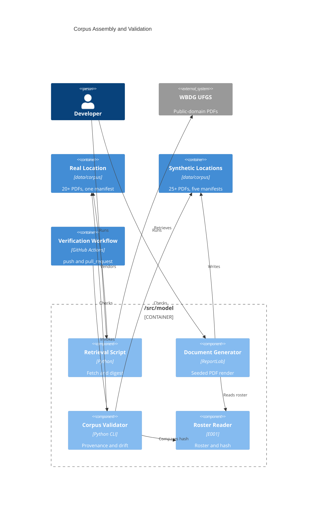

# Implementation Plan: Public Corpus and Manifest

**Branch**: `00002-public-corpus-and-manifest` | **Date**: 2026-07-25 | **Spec**: [spec.md](spec.md)

## Summary

**Goal**: Ship a legally clean, provenance-audited corpus of 45–50 PDFs — a vendored public-domain federal specification layer plus a seeded synthetic submittal layer — with per-location manifests that fail validation rather than defaulting.  
**Approach**: One new package in the modeling boundary carrying four console entry points (retrieve, generate, validate, reverify), ReportLab for byte-reproducible rendering, and a corpus-validation step wired into the verification workflow alongside a new `pull_request` trigger.  
**Key Constraint**: Generation must be offline, model-free, and reproducible from a committed seed — so every digest, date, and identifier that a renderer would otherwise stamp from the clock has to be pinned or excluded from the hash.

## Technical Context

**Language/Version**: Python 3.12 — `/src/model` entry only; this feature writes no TypeScript  
**Primary Dependencies**: ReportLab (deterministic PDF rendering), Pillow (page-image degradation — declared **directly**, not left transitive), pdfplumber (word-level extraction for validation), `jsonschema[format-nongpl]` (manifest schema, draft 2020-12)  
**Storage**: N/A — committed files under `data/`; E003 owns the PostgreSQL schema in full  
**Testing**: pytest with Hypothesis; coverage aggregated at the repository root; `import-linter` for architecture contracts  
**Target Platform**: Linux containers under Docker Compose for the persistent services; corpus jobs run as console entry points through the modeling entry's own uv-managed environment, the same way `verify.yml` already drives that entry (ADR-0011)  
**Project Type**: web (four-entry monorepo) — this feature touches `/src/model`, `data/`, and `.github/workflows/` only  
**Project Mode**: brownfield  
**Performance Goals**: N/A — no request-time path. Size, weight, page-count, and validation-runtime bounds are deliberately unstated per the spec's Excluded section  
**Constraints**: Offline generation, zero model invocation, byte-reproducible under a lockfile-pinned renderer, one governing license basis per corpus location, `/src/model` the sole roster reader  
**Scale/Scope**: 45–50 PDFs (≥20 REAL, ≥25 SYNTHETIC), 6 corpus locations, 5 projects, 12 vendors, 5 irregularity classes

## Instructions Check

*GATE: Must pass before Phase 0 research. Re-check after Phase 1 design.*

*Audited against `project-instructions.md` v1.2.0 (2026-07-25). Re-run after the v1.2.0 amendment under the Governance rule requiring a feature audited against a superseded version to re-run its gate.*

| Gate | Assessment | Status |
|------|-----------|--------|
| I. Traceable or It Does Not Ship | Every document carries a manifest entry whose fields are required per layer (FR-010). All **five** digest kinds — `content_hash`, `upstream_digest`, `document_model_hash`, `roster_hash`, `generation_inputs.*` — are computed by code from bytes or from a canonical serialization, never asserted by a model, which this epic does not invoke at all | PASS |
| II. Uncertainty Is the Product | No forecast, interval, or metric is published by this epic | N/A |
| III. Precision Over Recall Where a Mistake Is Silent | A document whose license basis cannot be established is excluded and recorded (FR-004); a SYNTHETIC entry may not carry a retrieval field at all rather than carry a plausible placeholder (FR-009) | PASS |
| IV. Agent Output Style | Plan is table-first; artifacts emit required sections only | PASS |
| V. The Model Extracts, Code Computes | No language-model invocation anywhere in this epic (FR-022). Generation is templates plus seeded randomness; all hashing and validation is deterministic code | PASS |
| VI. Evaluate Before You Tune | Evaluation sets are E014's, excluded here by explicit scope decision so corpus assembly cannot reach the test set | N/A |
| VII. Publish the Miss | Exclusions recorded with cause (FR-004); the datasheet discloses both the approximated transmittal codes (FR-023a) and the zero-error text layer (FR-032a); the decision to state no size or runtime bounds is recorded in Scope with its reversal trigger. The two controls no committed check can observe are named with owners rather than left as expectations, and are still published as gaps: FR-008b's re-verification run before each release tag (repository administrator, evidenced in the release record) and FR-036's loosening-direction sign-off on the three validator-read supporting artifacts and FR-009b's enumeration (epic owner, evidenced in the pull request) | PASS |
| VIII. Honest Opponents | No model claim is made or compared | N/A |
| Technology Stack | ReportLab, Pillow, pdfplumber, and `jsonschema` are additions to `/src/model`'s manifest, not stack changes — they sit inside the declared Python boundary and bring no web framework (AD-001, AD-004, AD-005). Infrastructure now admits console entry points for modeling-owned jobs alongside the container profile (v1.2.0, propagating ADR-0011), which is what this feature does | PASS |
| Testing & Quality Policy | Test-after for retrieval and rendering. The canonical serialization and the digest functions are held to **strict test-first with property-based tests** — voluntarily: the policy's strict-first mandate enumerates risk arithmetic, fusion ranking, and scoring functions, none of which this epic contains, and applying the stricter tier is not a deviation. The ordering has an **observable exit condition** rather than being an assertion no reviewer can check after the fact: the branch carries a commit that adds `src/model/tests/test_corpus_model_hash.py` with no `corpus/model.py` beside it, whose workflow run fails, and that commit precedes the one adding the module; the two are not squashed together on the branch, so the red state is a fact in the branch history rather than a claim. Coverage target 80%, aggregated at root. The new `import-linter` contract is treated as a build-gating test | PASS |
| Source Code Layout | Generator, validator, and retrieval script all under `/src/model`; corpus, manifests, schema, and datasheet under `data/`; no new entry under `/src` | PASS |
| Data Provenance | Public-domain or synthetic only; copyrighted standards cited never included (FR-005); no mixed licenses per basis identifier within a location (FR-013); datasheet ships with the synthetic layer (FR-027). The section's per-layer requirement is met on both halves: FR-008 covers source, issuing body, and retrieval date for retrieved documents; FR-009 and FR-009b cover generator identity, seed, generation date, and a content hash per generation input for generated ones, with retrieval fields prohibited outright | PASS |
| Governance | All items raised by this plan are closed. The v1.2.0 amendment carried the provenance wording, the Infrastructure clause (propagating ADR-0011), and the stale E002 trigger narrative; a follow-up amendment carried the SAD's deployment view. One residual is deliberately not fixed: E001's own workspace still describes E002 as owning both triggers, and that workspace is `.qc-passed` and left as a historical record rather than edited after closure | PASS |

## Complexity Tracking

None. This plan carried two justified deviations from the registered instructions — the universal provenance mandate and the container-profile job invocation. Both were closed by `project-instructions.md` v1.2.0 rather than carried: provenance is now stated per layer, and Infrastructure now admits console entry points for modeling-owned jobs, propagating ADR-0011. No deviation remains outstanding.

## Architecture



## Architecture Decisions

Feature-local tradeoffs only. Project-wide architectural decisions belong in standalone ADRs under `specs/adrs/` — reference them by ID instead of duplicating here.

| ID | Decision | Options Considered | Chosen | Rationale |
|----|----------|--------------------|--------|-----------|
| AD-001 | Which PDF generator gives byte-reproducible output? | ReportLab / fpdf2 / WeasyPrint | ReportLab with `invariant=True` | `invariant` feeds one fixed timestamp into `CreationDate`, `ModDate`, and the md5 that becomes the `/ID` trailer, so the identifier is content-derived rather than clock- or path-seeded. WeasyPrint's reproducibility breaks once a CSS background image is present — exactly the degraded-scan case. fpdf2 leaves its default file-id path internal and verifies through qpdf normalization rather than raw bytes |
| AD-002 | What does the reproducibility hash cover? | Rendered file bytes / pre-render document model | Document model primary, bytes secondary | A renderer stamps metadata into bytes, so byte comparison fails for reasons unrelated to content and a routine dependency bump would read as corpus drift. Byte-identity is retained as a secondary check under the pinned renderer (FR-021, FR-021a) |
| AD-003 | How is a page both degraded and text-extractable? | Full raster requiring OCR / raster body with invisible text layer / no rasterization | Raster body, invisible text at render mode 3, header as real text outside the raster rectangle | The searchable-scan construction mirrors a genuinely filed scan. Keeping the header outside the image rectangle makes the undegraded citation anchor a structural property of the layout rather than a masking trick that could regress silently (FR-032) |
| AD-004 | What extracts structure back out of the emitted PDFs? | pypdf / pdfplumber / pdfminer.six directly | pdfplumber, pinned exactly, with **word-splitting tolerances pinned explicitly** | Only word-level bounding boxes can prove a label and its value landed on opposite sides of a page break, which FR-031a requires the validator to re-derive independently. The library's `extract_words()` defaults are not a stable contract across versions (research §Extraction for independent validation), and the derived set is the oracle FR-031a compares the recorded set against — so `x_tolerance`, `y_tolerance`, `keep_blank_chars`, and `use_text_flow` are passed explicitly from one module-level constant in `derive.py` rather than taken from the defaults, and `extract_text()` is called with `layout` fixed. A tolerance change is a change to the oracle and is treated as one, not as a library upgrade. Records a reviewed transitive addition of `charset-normalizer` and `cryptography` to the modeling entry |
| AD-005 | How are manifests validated and how do failures read? | `jsonschema` / fastjsonschema / pydantic | `jsonschema[format-nongpl]`, draft 2020-12, reporting via `iter_errors()` | FR-015 requires naming both the offending document and the violated rule; `iter_errors()` yields `json_path`, `validator`, and `message` per failure, while `best_match()` collapses siblings and would hide concurrent defects. The `format-nongpl` extra supplies `date-time` and `uri` assertions without a GPL dependency |
| AD-006 | How are the corpus jobs invoked? | — | — | **Not a feature-local decision.** Changing the invocation path departs from ADR-0003's chosen option, so it is recorded as ADR-0011, which supersedes ADR-0003 on that clause only. See ADR-0011 |
| AD-007 | How is the real layer retrieved? | Committed script / manual only / script only | Committed script with manual fallback | WBDG's `robots.txt` allows all and its UFGS URLs redirect to a public bucket that serves PDFs to scripted clients; the earlier 403 was specific to the USACE forms host. Hosts that block get a manual record carrying **exactly** the eight FR-008 provenance fields and no others — VR-017 admits no extra key and the schema sets `additionalProperties: false`, so a `retrieved-by` field would be an unschema'd addition that fails validation on the very entry it was meant to annotate. Who performed a manual fetch is recorded in the commit that lands the document, not in the manifest. FR-008c binds both paths equally: the digest is taken from the response body at retrieval, before the file is written, whether a script or a person retrieves it. The script is an out-of-band provenance tool, excluded from the test path and from generation |
| AD-008 | How are corpus locations laid out? | One synthetic location / one per project / one per document type | One real location plus five synthetic, one per roster project | Each location carries exactly one license basis either way, so the subdivision is organizational; per-project grouping makes a single project's paper trail browsable and matches FR-017a |
| AD-009 | Where does the manifest schema live? | Inside each location / packaged with the validator / at the corpus root | `data/corpus/manifest.schema.json` | Sits adjacent to what it governs so an evaluator finds it without reading code, and above every location so it is never mistaken for a corpus document by the file-without-entry rule (FR-006) |

## Data Model Summary

No database. Storage is committed files under `data/corpus/`; `PK`/`UNIQUE`/`CHECK` notation below describes validator assertions over JSON and files, not DDL. E003 owns the PostgreSQL schema in full.

| Entity | Key Fields | Relationships | Notes |
|--------|------------|---------------|-------|
| CorpusLocation | `location_id` PK (path under `data/corpus/`), `layer`, `project_id` (SYNTHETIC only), derived `license_basis_id` | contains 1 CorpusManifest, 1..N Document | A location is any directory containing `manifest.json`, so "inside a location" is a directory test. Flat — no subdirectory. Six in total: `real/ufgs/` plus `synthetic/PRJ-001…005/`, the synthetic five in bijection with the roster's projects |
| CorpusManifest | `location_id`, `layer`, `project_id`, `entries[]` sorted and unique by location | 1:1 with CorpusLocation | Strict keys, `additionalProperties: false`. Carries **no** `version`, `revision`, or `generated_at` field — the same rejected-design guard E001 applied to the roster |
| CorpusManifestEntry | Common: `location`, `layer`, `license_basis`, `content_hash`. REAL adds eight — `source_location`, `retrieval_response_status`, `retrieved_at`, `issuing_body`, `masterformat_section`, `agency_variant`, `revision_date`, `upstream_digest`. SYNTHETIC adds seven — `generator_id`, `seed`, `generation_date`, `roster_hash`, `generation_inputs` (repository-relative path → raw-byte digest, covering the equipment-category map, field-label vocabulary, and generation config), `document_model_hash`, `irregularity_classes[]` | 1:1 with one Document; belongs to 1 CorpusManifest | The asymmetry is enforced in **both** directions, not conventional: a SYNTHETIC entry carrying any of the eight retrieval fields, or a REAL entry carrying any of the seven generation fields, fails validation rather than holding a blank. `masterformat_section` stores the bare number so agency variants count once toward coverage, and it is prohibited on a SYNTHETIC *entry* only — the section a synthetic document answers is document content (FR-023) |
| Document | derived `path`, `format: PDF` (checked by magic bytes, not extension); real identity = (`masterformat_section`, `agency_variant`, `revision_date`) UNIQUE | described by exactly 1 entry; lives in exactly 1 location | Filenames carry no semantics validation depends on — partitioning is always by recorded field |
| SyntheticCorpusDatasheet | Eight required level-2 sections; `Stated Limits` must carry the approximated-codes and zero-recognition-error disclosures | 1:1 with the synthetic layer, not with a location | Ships at `data/corpus/synthetic/`, outside every location. Carries no literal digest, so it cannot go stale against the corpus |
| ProjectVendorRoster | Consumed from E001 via `read_roster()` — `Entry.id`, `Entry.name`, `Roster.content_hash` | referenced by every SYNTHETIC entry by hash only | This epic declares no project, vendor, or roster field |

**Supporting artifacts** (outside every corpus location, so not corpus documents): `manifest.schema.json`, `retrieval-policy.json`, `exclusions.json`, `generation-config.json`, `equipment-category-map.json`, `field-label-vocabulary.json`. FR-018a closes the corpus root over exactly these plus the datasheet, so nothing else can sit outside a location. Three of the six are read by the generator and are hashed into every entry built from them via `generation_inputs` (FR-009b), which closes the drift hole the data model disclosed. The remaining **three** — `manifest.schema.json`, `retrieval-policy.json`, `exclusions.json`, all read by the validator rather than the generator — stay outside every recorded digest and remain disclosed as uncovered, held by the named pull-request review gate of FR-036 with the epic owner accountable for the loosening-direction sign-off, which is an assigned control rather than a check.

**Five digest kinds, kept distinct**: `content_hash` (committed file bytes) · `upstream_digest` (bytes as retrieved, REAL only) · `document_model_hash` (pre-render model, SYNTHETIC only) · `roster_hash` (E001's reader output, over canonical content) · `generation_inputs.*` (raw bytes of the three remaining generation inputs, SYNTHETIC only). Conflating any two would collapse a real check into a tautology — and the roster is kept out of `generation_inputs` for exactly that reason: its digest is over canonical content, so mixing it into a byte-digest mapping would report a roster reformat as drift, which the data model's lifecycle table declares it is not.

**Detail**: `specs/00002-public-corpus-and-manifest/data-model.md`

## API Surface Summary

N/A — no API surface. This epic ships committed files and command-line entry points; E003 owns persistence and later epics own the serving path.

## Testing Strategy

| Tier | Tool | Test Basis | Scope (test conditions and coverage items) | Mock Boundary | Entry / Exit Criterion | Install |
|------|------|-----------|--------------------------------------------|---------------|------------------------|---------|
| Unit | pytest + Hypothesis | MS-1…MS-6 and DM-1…DM-6; VR-015, VR-017, VR-027 (layer field sets); VR-035a…VR-035d at fixture level; VR-050 (the five injectors); VR-048's map half; VR-061's digest computation; the retrieval and re-verification paths standing in for FR-008b and FR-008c | Canonical serialization and the **five** digest functions — `content_hash`, `upstream_digest`, `document_model_hash`, the `roster_hash` the reader emits and this package records verbatim, and `generation_inputs.*` — property-based and test-first, specified in **Property-Based Test Specification** below. Layer-dependent field-set validation as the **field-by-direction matrix**, not as one condition: each of the eight REAL-only fields asserted to fail on a SYNTHETIC entry and each of the seven SYNTHETIC-only fields asserted to fail on a REAL entry — fifteen prohibited-field conditions, plus the two required-set conditions and the whitespace-only case VR-015 adds. Each of the five irregularity injectors (VR-050's coverage criterion, which is an assertion per injected effect rather than one test per class name). Structural re-derivation with, **per structural class, both a positive and a negative fixture** — a document carrying the class and one not — because set equality over the committed layer alone is satisfied by a deriver that echoes what the entry recorded. Equipment-category mapping. The retrieval and re-verification fixture tests, which must reach **every condition FR-002b states, against both clients**: a redirect hop re-checked against the host allow-list, a hop landing on a host outside it, a host that merely *ends in* an allow-listed name (rejected — matching is exact equality, not suffix), a redirect into a non-`https` scheme, a non-200 status, a sixth redirect hop, a response body past the 50 MB bound, and a digest that diverges from the recorded `upstream_digest` (research §Security criteria for path fields and redirect-following retrieval). Path containment likewise as failing cases rather than as a described rule: a `location` carrying a separator or `..`, an absolute `location`, a `location` naming a symbolic link that points at a regular file outside the corpus (VR-067 — the case a link-following regular-file test admits), a symlinked directory under the corpus root, and two `location` values within one manifest colliding under case folding (VR-068) | Filesystem via `tmp_path`; no network — the retrieval script's HTTP call is the only network path and is exercised against a local fixture | **Entry**: `model.py`'s canonical serialization and its property tests exist and are red before any renderer, PDF, or manifest is committed (HINT-001, a gate rather than advice). **Exit**: every rule in this tier's basis has at least one test exercising it in its **failing** direction and naming it (SC-025); the property specification's example budget and every named boundary case run | configured |
| Integration | pytest | VR-040a, VR-040b, VR-041, VR-042, VR-043, VR-046, VR-047, VR-048, VR-049 — the modeling-boundary half of the data model's runner split — plus an end-to-end `corpus-validate` run, which discharges VR-001…VR-039 and VR-051…VR-068. The two remaining rules of that split are assigned rather than left unplaced: VR-044 is discharged by `lint-imports` in the workflow's architecture-contract step together with its committed negative fixture, and VR-045 by the existing repository-root scan `tests/checks/test_single_import_site.py` | End-to-end generate → validate over the committed corpus. The re-run determinism check, whose **compared runs differ in named environment dimensions** — a different absolute checkout path, a different process, a distinct `PYTHONHASHSEED`, a non-UTC `TZ`, a non-C `LC_ALL`, and a shuffled directory-enumeration order — so the check is not one command run twice from one directory. The re-run writes into a **temporary tree** (`tmp_path`) and never the repository working copy: VR-042 compares each emitted manifest against its committed bytes, and an in-place rewrite would compare a file against itself and pass whatever the writer did. The **reference artifact** for the hash comparison is the value recorded in the committed manifest (VR-040a); US3 AS1's run-against-run comparison is retained beside it as the stability assertion that separates a nondeterministic generator from a stale commit, and is not the criterion's oracle. Roster-drift detection against a mutated fixture. **The two runners are split deliberately**: `corpus-validate` owns manifest↔file integrity, schema conformance, roster drift, and PDF re-derivation; anything requiring the generator to be re-run lives in this suite, because a validator that regenerated in order to validate could not distinguish a corpus defect from a generator defect | None — real ReportLab output, real pdfplumber extraction, real manifests | **Entry**: the checkout holds a complete corpus — six locations discovered, the five synthetic ones in bijection with the roster's projects, ≥ 20 REAL and ≥ 25 SYNTHETIC documents (VR-004, VR-005, VR-025, VR-034); an empty or partially fetched corpus fails as a zero population under VR-066 rather than passing silently. **Exit**: every rule in this tier's basis passes over the committed corpus and each has a failing-direction case (SC-025). Byte-identity claims (VR-041, VR-042, SC-012, SC-024) are judged on the **Linux verification runner**, which is the platform of record; the Windows development machine is not, because `core.autocrlf` rewrites the working copy (HINT-004, MS-4) | configured |
| Security | `tests/checks/test_supply_chain.py`; `src/model/uv.lock` | The repository-root supply-chain checks; SC-027, SC-028; research §Supply-chain criteria for new dependencies | **What the existing repository-root check does and does not reach, stated rather than assumed.** It asserts two things relevant here: that all three Python entries — `model` included — configure no alternate package index and carry no `uv.toml`, and that externally pulled *images* are digest-pinned. It asserts **nothing** about exact version pins or artifact hashes for the four distributions this epic adds, and nothing about their licences; those are carried by the committed lockfile itself, by `uv lock --check` in the workflow's Lock verification step, and by SC-027 and SC-028. Saying the file "needs no change to cover the four new dependencies" is true only of the index parametrization. **The closure is enumerated from the lockfile, not by hand**: the four direct additions are ReportLab, Pillow, pdfplumber, and `jsonschema[format-nongpl]`, and the packages named in AD-004 and AD-005 — `charset-normalizer` and `cryptography` via pdfplumber, `rfc3339-validator` and the non-GPL URI validator via the extra — are **examples of the review surface, not the closure itself**, which reaches further through pdfminer.six, `cffi`, and the extra's own chain. SC-027 and SC-028 therefore quantify over every distribution `src/model/uv.lock` gains in this epic, so a package no artifact names by hand is inside the obligation rather than outside it. No dependency-vulnerability scanner is configured project-wide and none is introduced here; the spec's Excluded section records that absence with its consequence and reversal trigger rather than leaving it as a silent omission. **Two limits of this tier are disclosed rather than left to be discovered.** First, `uv lock --check` and `uv sync --locked` verify that the lockfile agrees with its manifest, not that a *downloaded artifact* matched its recorded hash — hash-verified installation is a project-level installer posture and is not required by this epic, which is why SC-027 states its own scope and `data-model.md` §Uncovered Requirements carries the gap. Second, this epic amends `verify.yml` but does not pin its third-party actions by commit SHA; that is a recorded scope decision in the spec's Excluded section with cause, consequence, owner, and reversal trigger, so no task here is expected to carry it | — | **Exit**: every added distribution, direct and transitive as enumerated from the committed lockfile, resolves from its ecosystem's default public index, is pinned to an exact version with an artifact hash in `src/model/uv.lock`, and carries no licence incompatible with redistributing this repository (SC-027, SC-028); `uv lock --check` passes for the model entry; no alternate index and no `uv.toml` appears under any entry. Neither this exit criterion nor SC-027 asserts install-time artifact-hash verification, and neither asserts action pinning — both are disclosed exposures, not unmet obligations | configured |
| Coverage | coverage.py | `project-instructions.md` §Testing & Quality Policy (80%); HINT-002 | Aggregated at the repository root, gated at 80%. The model entry's runner currently scopes to `--source=src/model/roster` and widens to `--source=src/model/roster,src/model/corpus`, so **the denominator after widening is exactly those two packages' statements** from the model entry's run, combined at the root with the repository-root check harness's data file; the gateway and web entries are untouched and nothing leaves the denominator. Widening pulls in `retrieve.py` and `reverify.py`, whose network paths never execute under test — both get unit tests against local fixtures rather than a coverage-scope exclusion, and those tests must reach the conditions the Unit tier's scope names (per-hop allow-list re-check, a hop outside the allow-list, a suffix-match near-miss, a non-`https` scheme, a non-200 status, a sixth redirect hop, an over-size response body, and a digest mismatch against the recorded `upstream_digest`), so the widened denominator is covered by assertions rather than merely by import | — | **Exit**: `coverage combine` succeeds and `coverage report --fail-under=80` passes at the root, **and** `model.corpus` measured alone is at or above the same 80% floor, so an already-covered package cannot carry an uncovered new one across the aggregate threshold (SC-026) | configured |

### Property-Based Test Specification

Hypothesis, `max_examples=200`, `derandomize=True`, `deadline=None`, registered as a profile in `src/model/tests/conftest.py` and selected in CI, so two runs of the same commit generate the same examples. A determinism gate that is itself nondeterministic between two CI runs reports defects nobody can reproduce.

**Generator domain** — the `document_model()` and `manifest()` strategies construct: identity fields drawn from roster-shaped identifiers; ordered transmittal field values as text; per-page text as one to six strings; per-page render directives drawn from the closed template-id set and the closed degradation-profile set with parameters inside their committed ranges; `irregularity_classes` as any subset of the closed five. Explicitly **inside** the domain: non-NFC strings and combining marks, an empty per-page text string, and an empty class list. Explicitly **outside**: any wall-clock value, and floats, booleans, and nulls — the payload is strings, integers, and containers only (DM-3, and E001's CS-5 for the same reason).

| # | Property | Relation class | Over |
|---|----------|----------------|------|
| PB-1 | A model and its NFD-equivalent yield the same `document_model_hash` | Metamorphic | DM-5 |
| PB-2 | The serialization is invariant to the order in which the model's keys were constructed and to `PYTHONHASHSEED` | Invariant | DM-5 |
| PB-3 | Mutating any one hashed component — identity field, ordered field value, page text, or a per-page render directive including a degradation parameter — changes the digest | Metamorphic (sensitivity) | DM-2, VR-040b |
| PB-4 | `parse(serialize(m)) == m` for every model in the domain, and re-serializing the parse is a fixpoint | Round-trip | DM-5, MS-3 |
| PB-5 | Two manifests with equal content serialize to byte-identical files whatever order their entries and keys were supplied in; two differing in any recorded value serialize to different bytes | Invariant, then metamorphic | MS-1…MS-6, FR-006b |
| PB-6 | Every emitted digest matches `^sha256:[0-9a-f]{64}$` | Invariant | FR-007, VR-016 |

**Boundary cases, named separately from the generated population** because generated coverage is not systematic: an NFC/NFD equivalent pair; a duplicate manifest key, which is a read failure under VR-001 and not a last-wins merge; two entry `location` values that collide under case-insensitive or locale collation but differ in codepoint order, since MS-1 is codepoint order; the empty `irregularity_classes` list; a single-page document; an empty per-page text string; and a pair of models differing only in one degradation parameter, which is PB-3's narrowest case and the one DM-2 exists for.

## Error Handling Strategy

| Error Category | Pattern | Response | Retry |
|----------------|---------|----------|-------|
| Manifest schema or field violation | fail-fast | Non-zero exit naming the offending document and the violated rule, one line per failure via `iter_errors()` | no |
| Roster drift (recorded hash ≠ reader's current value) | fail-fast | Non-zero exit naming every stale document, not just the first; no reconciliation is attempted | no |
| Generation precondition (project or vendor absent from roster) | fail-fast before emitting | Non-zero exit naming the unknown identifier; no partial layer is written | no |
| Retrieval HTTP failure or block (403, redirect failure) | fail-fast per document, continue the batch | Records the observed status in the retrieval log and leaves the document unvendored, to be handled by the manual-provenance path | no — the script is out-of-band and a required check never depends on it |
| Retrieval policy violation during the fetch — a redirect into a non-`https` scheme, a hop whose host is outside the allow-list, a sixth redirect hop, or a response body past the 50 MB bound (FR-002b) | fail-fast per document, continue the batch | The document is **not** vendored and no partial file is written; the retrieval log records which of the four conditions fired, the offending hop's scheme and host, and the hop index. A rejected hop is a retrieval failure that belongs in the exclusion ledger, never a document admitted because its first hop was allow-listed | no — retrying an allow-list or scheme rejection would only repeat it, and a retry loop around a redirect chain is how a hop bound gets defeated |
| Corpus document the reader cannot open or extract from — a truncated, malformed, or hostile PDF (FR-001a) | fail-fast for that document, all failures collected | Non-zero exit naming the location, the file, and the rule: VR-013 for a file that does not open, and the relevant VR-035x for one that opens but whose structural derivation raises. The document is **never skipped so the run can continue** — skipping would silently exempt it from every rule asserted over emitted documents and turn an unreadable corpus into a passing one. The extraction step runs inside the merge-gating check, so a document that never returns blocks that gate; no per-document time or memory bound is set, which the spec's Excluded section records with that consequence and its reversal trigger | no |
| Renderer version differs from the lockfile pin | not an error | Byte-identity is treated as unmet and a regeneration event is declared; the document-model hash comparison still governs (FR-021a) | no |
| Corpus file present with no manifest entry, or entry naming a missing file | fail-fast | Non-zero exit naming the path and which side is missing | no |

## Risk Mitigation

| Risk (from spec) | Likelihood | Impact | Mitigation | Owner |
|-------------------|------------|--------|------------|-------|
| Copyrighted excerpt inside a vendored section — a reproduced reference-standard excerpt would make the repository's provenance claim false at its foundation | L | H | Point-of-use check recorded as the third component of every REAL license basis, with validation failing when it is absent (FR-011); exclusion on doubt, with the cause recorded rather than the document silently dropped | Retrieval script + manifest schema |
| Synthetic layer still too clean despite injection — uniform generated documents inflate downstream extraction results, and the inflation is invisible in a pooled metric | M | M | Per-vendor layout templates with no template spanning every vendor (FR-029); all five irregularity classes required across the layer (FR-030); classes recorded per document and re-derived independently by validation (FR-031a) so results stay partitionable | Generator + validator |
| Roster changes during the generation window — E001 disclosed that nothing watches the fixture while a consumer generates from it | L | M | The drift comparison is a validation rule that runs in the verification workflow (FR-016, FR-017), so a mismatch surfaces on the next triggering push rather than by hand | Validator |

## Requirement Coverage Map

| Req ID | Component(s) | File Path(s) | Notes |
|--------|--------------|--------------|-------|
| FR-001 | Retrieval script | `src/model/src/model/corpus/retrieve.py` | Writes upstream bytes unmodified; digest taken from the response body before the write, per FR-008c, and recomputed from the file after it |
| FR-001a | Validator, extractor, error handling | `.../corpus/validate.py`, `.../corpus/derive.py` | Untrusted-input posture toward the vendored PDFs. No sanitization pass exists or may be added between the committed bytes and the extractor — FR-001 forbids one, so the extractor reads third-party structure directly. Its failure response is the Error Handling row above; its version pin is FR-031a's |
| FR-002 | Retrieval policy | `data/corpus/real/retrieval-policy.json` | Target sections with per-section lead-time justification; validated as a document floor, a distinct-section floor, and the `01 33 00` anchor. "Weighted" carries no threshold — the judgement lives in the committed list and is reviewable, not checkable |
| FR-002a | Retrieval policy, validator | `data/corpus/real/retrieval-policy.json`, `.../corpus/validate.py` | The policy is required as an artifact, not merely assumed by four rules. Carries host allow-list, the closed agency-variant map to section suffix **and** issuing body, and the justified target sections |
| FR-002b | Retrieval client, re-verification client | `.../corpus/retrieve.py`, `.../corpus/reverify.py`, `data/corpus/real/retrieval-policy.json` | One client policy shared by both network paths rather than two implementations that can drift: automatic redirect following is **disabled** and the chain is walked explicitly, so each hop's scheme and host are evaluated before the next request is issued — `https` only, exact lowercased host equality against `source_hosts`, at most 5 hops, at most 50 MB of body, no credential or cookie. Exercised by the fixture tests the Unit tier names; no committed check observes the live behaviour, since no required check reaches the network |
| FR-003 | Manifest schema, retrieval script | `data/corpus/manifest.schema.json`, `.../corpus/retrieve.py` | Section number, agency variant, and revision date are three required REAL fields; identity is their tuple, unique across the real layer |
| FR-004 | Retrieval script, exclusion ledger | `.../corpus/retrieve.py`, `data/corpus/real/exclusions.json` | Closed cause enum. Ledger *integrity* is checked; its *completeness* cannot be — a candidate dropped without a record leaves no artifact |
| FR-005 | Retrieval script, license basis | `.../corpus/retrieve.py`, `data/corpus/manifest.schema.json` | Point-of-use outcome is a single-value enum in the license basis; the opposite outcome belongs in the ledger. The enum makes the judgement stated and closed, not verified |
| FR-006 | Validator | `src/model/src/model/corpus/validate.py` | Bidirectional file↔entry reconciliation per location; `manifest.json` is the single exempt file |
| FR-006a | Manifest schema, validator | `data/corpus/manifest.schema.json`, `.../corpus/validate.py` | One JSON manifest per location; no aggregate index is written or read |
| FR-006b | Manifest writer, validator | `.../corpus/manifest.py`, `.../corpus/validate.py` | Canonical serialization MS-1…MS-6 raised to requirement level, since SC-012's byte-identity claim rests on it. Entry order and sortedness checked directly, so the once-written real manifest is covered too |
| FR-007 | Manifest model, schema | `src/model/src/model/corpus/manifest.py`, `data/corpus/manifest.schema.json` | Common field set on the base schema object, plus the `^sha256:[0-9a-f]{64}$` form applied to every digest field in either layer |
| FR-008 | Manifest schema | `data/corpus/manifest.schema.json` | REAL-only fields via a conditional subschema keyed on `layer`, plus `not`/`required` clauses forbidding the seven generation fields |
| FR-008a | Validator | `.../corpus/validate.py` | Recomputes the file digest and compares to `upstream_digest`. **Force is conditional on FR-008c**: the check is a tautology if the digest was back-filled from the committed file, and no offline check can tell that apart — only FR-008b's re-fetch closes it |
| FR-008b | Re-verification entry point | `.../corpus/reverify.py`, `src/model/tests/test_corpus_reverify.py` | Separate console script; never referenced by `verify.yml`, so no required check reaches the network. Unit-tested against a local fixture, reaching the conditions the Unit tier's basis names — redirect hop re-checked against the allow-list, a hop outside it, a non-`https` scheme, a non-200 status, the hop-count bound, and a digest divergence from the recorded `upstream_digest`, which is the one outcome this job exists to report. **Cadence and owner are stated, not left open**: the repository administrator runs it before each release tag and records the outcome in the release record (FR-008b, SC-009) — the boundary `project-instructions.md` already places the evaluation reproduction job at. Nothing in `verify.yml` invokes it and no committed artifact can assert that it ran; the release record is the evidence, and the gap stays published |
| FR-008c | Retrieval script (procedure) | `.../corpus/retrieve.py` | Digest computed from the response body before the write, never re-read from the committed file. Applies to the manual fallback identically. **No committed check observes a violation** — disclosed as uncovered rather than counted |
| FR-008d | Validator, retrieval policy | `.../corpus/validate.py`, `data/corpus/real/retrieval-policy.json` | `issuing_body` must equal the issuing body the policy records for the entry's `agency_variant`; both fields are otherwise well-formed, so nothing else catches the contradiction |
| FR-009 | Manifest schema | `data/corpus/manifest.schema.json` | SYNTHETIC-only fields plus `not`/`required` clauses forbidding all eight retrieval fields |
| FR-009a | Generation config, generator | `data/corpus/synthetic/generation-config.json`, `.../corpus/generate.py` | Generation date read from committed config, never from the clock |
| FR-009b | Generator, validator, manifest schema | `.../corpus/generate.py`, `.../corpus/validate.py`, `data/corpus/manifest.schema.json` | Two fields, two procedures: `roster_hash` carries the roster's canonical-content digest (FR-020) and `generation_inputs` maps repository-relative path to a **raw-byte** digest for the equipment-category map, field-label vocabulary, and generation config. Validation recomputes each and fails naming the drifted input and every document whose own entry records it. FR-016 stays the roster-specific rule; the split is what keeps a roster reformat from reading as drift |
| FR-010 | Manifest schema, validator | `data/corpus/manifest.schema.json`, `.../corpus/validate.py` | `required` plus `minLength: 1`; no schema default anywhere. The applicable set is enumerated per layer, so an extra field fails rather than being ignored |
| FR-011 | Manifest schema, validator | `data/corpus/manifest.schema.json`, `.../corpus/validate.py` | License basis is an object of four required components, not a free string; the point-of-use outcome is a single-value enum fixed at requirement level |
| FR-012 | Manifest schema | `data/corpus/manifest.schema.json` | SYNTHETIC license basis is a fixed-shape object: two `const` assertions plus a required statement field |
| FR-012a | Manifest schema, validator | `data/corpus/manifest.schema.json`, `.../corpus/validate.py` | `basis_id` as a closed two-value enum required in both layers — the field FR-013's comparison needs in order to be evaluable |
| FR-013 | Validator | `.../corpus/validate.py` | Compared over `license_basis.basis_id` only — a closed two-value set. Comparing whole bases would fail every real location, since FR-011's document identifier is per-document by construction |
| FR-014 | Manifest schema | `data/corpus/manifest.schema.json` | `enum: ["REAL", "SYNTHETIC"]` |
| FR-014a | Manifest schema, validator | `data/corpus/manifest.schema.json`, `.../corpus/validate.py` | Manifest declares its layer; every entry must match it, so a location holds exactly one layer |
| FR-015 | Validator CLI | `.../corpus/validate.py`, `src/model/pyproject.toml` | Console entry `corpus-validate`; non-zero exit; one line per failure |
| FR-016 | Validator, E001 roster reader | `.../corpus/validate.py`, `src/model/src/model/roster/reader.py` | Compares every SYNTHETIC `roster_hash` to `read_roster().content_hash`. Not redundant with FR-009b: this comparison is against a live reader call over canonical content, while FR-009b's mapping is over raw bytes |
| FR-017 | Verification workflow | `.github/workflows/verify.yml` | New corpus-validation step; existing path filter and cancellation preserved |
| FR-017a | Generator, path layout | `.../corpus/paths.py`, `data/corpus/synthetic/PRJ-00N/` | Five locations derived from roster project identifiers |
| FR-018 | Package placement | `src/model/src/model/corpus/`, `data/corpus/` | No new `/src` entry; validator ships a console entry point. Corpus root fixed at `data/corpus/`, which every path rule and the file-tree reconciliation already assume |
| FR-018a | Validator | `.../corpus/validate.py`, `data/corpus/` | Corpus root closed over the seven supporting artifacts outside locations, so a stray file of any format cannot sit unmanifested — the non-PDF half of the hole VR-060 closes for PDFs |
| FR-019 | Generator | `.../corpus/generate.py` | Roster obtained only via the E001 reader; no local project or vendor literals |
| FR-020 | Generator, manifest model | `.../corpus/generate.py`, `.../corpus/manifest.py` | Records the reader's emitted string verbatim, no re-formatting. The requirement now states that this digest is over canonical content rather than file bytes, which is where a reader comparing it against `content_hash` encounters the difference |
| FR-021 | Document model, hashing | `src/model/src/model/corpus/model.py` | Canonical serialization plus `document_model_hash`; property-based tests, written first. The model covers **per-page render directives** (template id, degradation profile and parameters) as well as ordered field values and per-page text — degradation leaves the text layer unchanged, so a generator degrading different pages each run would otherwise still pass |
| FR-021a | Renderer, lockfile | `src/model/src/model/corpus/render.py`, `src/model/uv.lock` | `invariant=True`, explicit producer, exact ReportLab and Pillow pins |
| FR-021b | Renderer | `.../corpus/render.py` | PDF is the only emitted format |
| FR-022 | Generator, import contract | `.../corpus/generate.py`, `src/model/pyproject.toml` `[tool.importlinter]`, `tests/fixtures/corpus_offline/`, `tests/checks/test_contract_fixtures.py` | Enforced, not asserted: a new **forbidden** contract from `model.corpus` to `model.llm` and to `gateway` with `allow_indirect_imports = false`, which `verify.yml`'s existing `lint-imports` step gates. Its **failing direction has an evidence path of its own**: a committed negative fixture under `tests/fixtures/corpus_offline/` exercised by `tests/checks/test_contract_fixtures.py`, which runs automatically in `tests/checks` on every triggering push and pull request — the E001 TR-007 / SC-004 mechanism. Not a new `workflow_dispatch` payload: that input offers only `provider-import` and `computation-boundary`, is reachable only on manual dispatch, and evidences the harness rather than the contract. Paired with a socket-guard test that fails the generator run on any outbound connection attempt, installed before the generator package is imported (VR-043) |
| FR-023 | Document model, templates | `.../corpus/model.py`, `src/model/src/model/corpus/templates.py` | Six structural fields on every emitted document |
| FR-023a | Code vocabulary, datasheet | `src/model/src/model/corpus/codes.py`, `data/corpus/synthetic/datasheet.md` | Approximated code set defined in one place and disclosed as approximate |
| FR-024 | Generator | `.../corpus/generate.py` | Coverage assertion over five projects and twelve vendors before writing |
| FR-025 | Generator | `.../corpus/generate.py` | Resubmittal chain construction per project |
| FR-026 | Equipment mapping | `.../corpus/equipment.py`, `data/corpus/synthetic/equipment-category-map.json` | Every mapped value must exist as a `masterformat_section` in the real manifest, so the map cannot point at a section the corpus does not hold |
| FR-027 | Datasheet | `data/corpus/synthetic/datasheet.md` | Eight required disclosures; presence asserted by heading check |
| FR-028 | Committed output | `data/corpus/synthetic/PRJ-00N/` | Rendered PDFs and manifests committed, not generated on clone |
| FR-029 | Templates | `.../corpus/templates.py` | Per-vendor template assignment; no template covers every vendor |
| FR-030 | Irregularity module | `src/model/src/model/corpus/irregularity.py` | Closed five-value enum; layer-level presence assertion for all five |
| FR-031 | Manifest model | `.../corpus/manifest.py` | Classes recorded per SYNTHETIC entry |
| FR-031a | Structural re-derivation | `.../corpus/derive.py`, `data/corpus/synthetic/field-label-vocabulary.json`, `src/model/uv.lock` | pdfplumber word boxes, **pinned exactly in the modeling boundary's lockfile the way the renderer is** (FR-021a's treatment applied to the component that reads third-party bytes under FR-001a), with the tolerances below as part of the same pin. The comparison is `derived == recorded ∩ {the four structural classes}` — comparing against the whole recorded set would fail every degraded document for a non-defect |
| FR-031b | Injector unit tests | `src/model/tests/test_corpus_irregularity.py` | Degradation evidenced by injector tests plus a necessary condition (a full-page raster must exist on a document recording the class). **The injector test's oracle is the same page rendered with the degradation profile disabled**: the degraded page passes when its body raster differs from that control, its extracted text layer is identical to the control's, and its citation anchor lies outside every raster rectangle — asserted across the injector's declared parameter domain, not only the values the committed layer uses (VR-050). That *this* document is visually degraded stays generator-asserted — recorded as uncovered, not claimed |
| FR-032 | Renderer, degradation | `.../corpus/render.py`, `src/model/src/model/corpus/degrade.py` | Raster body with invisible text; header drawn outside the raster rectangle |
| FR-032a | Datasheet | `data/corpus/synthetic/datasheet.md` | Zero-recognition-error limit stated |
| FR-033 | Manifest schema | `data/corpus/manifest.schema.json` | Layer and irregularity classes are first-class machine-readable fields |
| FR-034 | Verification workflow, workflow-trigger check | `.github/workflows/verify.yml`, `tests/checks/test_workflow_triggers.py` | `pull_request` added alongside `push` and dispatch. **SC-022's evidence is split, because no committed artifact can assert that a run occurred**: the checkable half is the declared trigger itself, asserted by a committed check that parses `verify.yml` and requires `pull_request` against the default branch — a file assertion needing no run, living at the repository root because the workflow belongs to no `/src` entry; the "a run happened" half is the pull-request run of this epic's own branch, recorded by URL in the QC report rather than claimed in a committed file |
| FR-034a | Verification workflow, workflow-trigger check | `.github/workflows/verify.yml`, `tests/checks/test_workflow_triggers.py` | The execution-surface half of the trigger, checkable without a run: the same committed check that asserts `pull_request` is declared additionally asserts that `pull_request_target` is **not** declared and that the workflow's `permissions` block is `contents: read` — three file assertions over one parse. The head-content property and the lockfile exposure are stated posture, not assertions: no committed check can observe what a future pull request's lockfile contains, which is why FR-034a bounds the consequence (no secret, no write scope) rather than claiming to prevent it |
| FR-035 | Verification workflow | `.github/workflows/verify.yml`, `tests/checks/test_contract_fixtures.py` | Existing architecture-contract step reports on the pull-request run. The failing half is evidenced by the committed negative fixtures, which plant a real violation against each contract and execute **inside** the pull-request run — E001 SC-013's posture, where automatic evidence replaced a manual dispatch that could be forgotten |
| FR-036 | Pull-request review gate (process, no component) | `data/corpus/manifest.schema.json`, `data/corpus/real/retrieval-policy.json`, `data/corpus/real/exclusions.json`, and FR-009b's enumeration in `.../corpus/generate.py` | **No code artifact, and none is proposed.** A change touching any of those three files, or adding a generation input to FR-009b's enumeration, requires explicit reviewer sign-off on its loosening direction in the pull request that lands it, with the **epic owner accountable**. This is the gate the data model's two "held by review of the diff" rows now point at. No `CODEOWNERS` file and no platform review rule: that would move the control outside the repository boundary and duplicate the branch-protection deviation (spec §Scope → Excluded). Recorded honestly as an **assigned control, not a mechanical one** — nothing committed observes the sign-off, so this row generates no verification task and claims no coverage |

## Project Structure

### Source Code

```text
+ src/model/src/model/corpus/__init__.py
+ src/model/src/model/corpus/paths.py            # corpus root, location discovery
+ src/model/src/model/corpus/manifest.py         # entry model, layer-dependent field sets, I/O
+ src/model/src/model/corpus/model.py            # document model, canonical serialization, hash
+ src/model/src/model/corpus/codes.py            # approximated descriptor and action codes
+ src/model/src/model/corpus/equipment.py        # equipment category to MasterFormat section
+ src/model/src/model/corpus/templates.py        # per-vendor layout templates
+ src/model/src/model/corpus/irregularity.py     # closed enum, structural injectors
+ src/model/src/model/corpus/degrade.py          # Pillow page-image degradation
+ src/model/src/model/corpus/render.py           # deterministic ReportLab canvas
+ src/model/src/model/corpus/derive.py           # pdfplumber structural re-derivation
+ src/model/src/model/corpus/generate.py         # console entry: corpus-generate
+ src/model/src/model/corpus/validate.py         # console entry: corpus-validate
+ src/model/src/model/corpus/retrieve.py         # console entry: corpus-retrieve
+ src/model/src/model/corpus/reverify.py         # console entry: corpus-reverify
+ src/model/src/model/corpus/sources.py          # committed target-section list

+ src/model/tests/test_corpus_model_hash.py      # property-based, written first
+ src/model/tests/test_corpus_manifest.py
+ src/model/tests/test_corpus_validate.py
+ src/model/tests/test_corpus_generate.py
+ src/model/tests/test_corpus_render.py          # determinism and text-layer retention
+ src/model/tests/test_corpus_irregularity.py    # all five injectors
+ src/model/tests/test_corpus_derive.py
+ src/model/tests/test_corpus_equipment.py
+ src/model/tests/test_corpus_retrieve.py        # local fixture, no network
+ src/model/tests/test_corpus_reverify.py        # local fixture; keeps reverify.py out of the uncovered set
+ src/model/tests/conftest.py                    # Hypothesis profile: 200 examples, derandomized

+ tests/fixtures/corpus_offline/                 # negative fixture for the new forbidden contract
+ tests/checks/test_workflow_triggers.py         # verify.yml declares pull_request, declares no
                                                 # pull_request_target, and scopes permissions to
                                                 # contents: read (SC-022's checkable half, FR-034a)

+ data/corpus/manifest.schema.json                    # draft 2020-12, layer asymmetry via if/then/else
+ data/corpus/real/retrieval-policy.json              # host allow-list, agency variants, target sections
+ data/corpus/real/exclusions.json                    # exclusion ledger with closed cause enum
+ data/corpus/real/ufgs/manifest.json
+ data/corpus/real/ufgs/*.pdf                         # 20+ vendored sections
+ data/corpus/synthetic/generation-config.json        # generator id, seed, committed generation date
+ data/corpus/synthetic/equipment-category-map.json   # category to MasterFormat section
+ data/corpus/synthetic/field-label-vocabulary.json   # canonical and alternate field labels
+ data/corpus/synthetic/datasheet.md                  # outside every location, by construction
+ data/corpus/synthetic/PRJ-001/manifest.json         # one location per roster project
+ data/corpus/synthetic/PRJ-001/*.pdf
+ data/corpus/synthetic/PRJ-002/ … PRJ-005/

~ src/model/pyproject.toml                       # reportlab, pillow, pdfplumber, jsonschema;
                                                 # [project.scripts]; new [tool.importlinter] contract
~ src/model/uv.lock                              # exact pins for reportlab and pillow
~ tests/checks/test_supply_chain.py              # credential scan widened to the model entry and data/
~ .github/workflows/verify.yml                   # pull_request trigger, corpus-validate step, coverage scope
```

**Patterns to reuse**: E001's roster reader is the model for this package — a single module owning a file format, returning a frozen dataclass together with its content hash, raising one error type, and validated by rules with numbered identifiers. `src/model/tests/test_roster_reader.py` and `test_roster_datasheet.py` show the expected test shape, including the datasheet heading-presence check this epic repeats for the synthetic datasheet.

**Tests to extend**: `tests/checks/test_contract_fixtures.py` gains one case for the new forbidden contract's negative fixture — the same shape as the two it already carries. `tests/checks/test_workflow_triggers.py` asserts `pull_request` declared, `pull_request_target` absent, and `permissions: contents: read` (FR-034, FR-034a).

`tests/checks/test_supply_chain.py` needs **one** change, and the earlier claim that it is unmodified was true of only part of it. Its index parametrization already covers the `model` entry, so the four new dependencies need nothing there. Its **credential scan is a different population**: `test_no_credential_material_in_the_serving_build_context` iterates `("api", "gateway")` only, so `/src/model` — where this epic's whole package lands — and `data/` — where 45–50 committed files land — are outside what it reads today. That entry tuple widens to include `model`, and the scanned roots gain `data/`, so this epic's new committed surface is inside the population rather than assumed clean. Two things are stated plainly about that change: it passes vacuously on the day it lands, because this epic introduces no credential at all and FR-002a forbids allow-listing a source that would need one — it exists to fail the moment one appears, which is E001's own framing for the same check; and the file is a **repository-root cross-entry check**, so widening it touches a shared assertion rather than a feature-local one, proposed here because this epic is what puts new committed surface outside its reach.

**Naming conventions**: `snake_case` modules, frozen dataclasses for value objects, one `*Error(ValueError)` per module family, numbered validation rules referenced from docstrings, `from __future__ import annotations` at the top of every module, Ruff line length 100.

## Implementation Hints

- **[HINT-001]** Order — **an entry criterion, not advice**: no rendered PDF and no manifest is committed until `model.py`'s canonical serialization and its property-based tests (PB-1…PB-6) pass. Write the serialization and its tests before anything renders. Every other component's determinism claim reduces to that function, and discovering it wrong after 25 PDFs are committed means regenerating all of them. The Unit tier carries this as its stated entry criterion so the ordering gates the rendering work rather than merely recommending itself to it.
- **[HINT-002]** Gotcha: `verify.yml` runs the model tests as `coverage run --source=src/model/roster`. Left alone, none of this epic's code enters the coverage denominator and the 80% gate passes while measuring nothing new. Widen the source scope to `--source=src/model/roster,src/model/corpus` in the same change that adds the validation step — those two packages, plus the repository-root check harness's own data file, are the whole denominator after widening.
- **[HINT-003]** Constraint: do not add `!model` to `src/.dockerignore`. Two E001 checks — `test_only_the_serving_boundary_and_the_gateway_are_admitted` and `test_excluded_entries_are_unreachable_from_the_build` — assert its absence, and E002 has no container requirement that would justify breaking them.
- **[HINT-004]** Gotcha: write every manifest as bytes, or with `newline="\n"` explicitly. The development machine is Windows, `core.autocrlf` rewrites the working copy, and SC-012's byte-identity comparison would then fail for a line-ending reason unrelated to content — the same trap E001 documented for the roster hash.
- **[HINT-005]** Compatibility: ReportLab assigns font subset prefixes by subset order, so changing the glyph set reshuffles tags across the whole file and moves every byte-level hash. Pin Pillow as tightly as ReportLab, prefer lossless image encoding, and treat a glyph-set change as a regeneration event rather than a validation failure.
