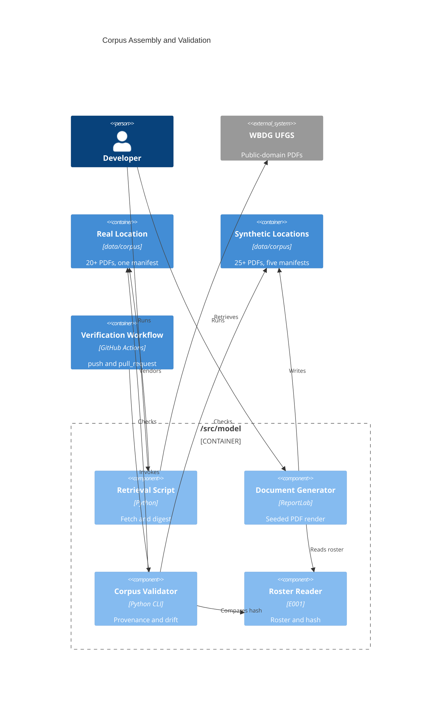

# Implementation Plan: Public Corpus and Manifest

**Branch**: `00002-public-corpus-and-manifest` | **Date**: 2026-07-25 | **Spec**: [spec.md](spec.md)

## Summary

**Goal**: Ship a legally clean, provenance-audited corpus of 45–50 PDFs — a vendored public-domain federal specification layer plus a seeded synthetic submittal layer — with per-location manifests that fail validation rather than defaulting.  
**Approach**: One new package in the modeling boundary carrying four console entry points (retrieve, generate, validate, reverify), ReportLab for byte-reproducible rendering, and a corpus-validation step wired into the verification workflow alongside a new `pull_request` trigger.  
**Key Constraint**: Generation must be offline, model-free, and reproducible from a committed seed — so every digest, date, and identifier that a renderer would otherwise stamp from the clock has to be pinned or excluded from the hash.

## Technical Context

**Language/Version**: Python 3.12 — `/src/model` entry only; this feature writes no TypeScript  
**Primary Dependencies**: ReportLab (deterministic PDF rendering), Pillow (page-image degradation — declared **directly**, not left transitive), pdfplumber (word-level extraction for validation), `jsonschema[format-nongpl]` (manifest schema, draft 2020-12)  
**Storage**: N/A — committed files under `data/`; E003 owns the PostgreSQL schema in full  
**Testing**: pytest with Hypothesis; coverage aggregated at the repository root; `import-linter` for architecture contracts  
**Target Platform**: Linux containers under Docker Compose for the persistent services; corpus jobs run as console entry points through the modeling entry's own uv-managed environment, the same way `verify.yml` already drives that entry (ADR-0011)  
**Project Type**: web (four-entry monorepo) — this feature touches `/src/model`, `data/`, and `.github/workflows/` only  
**Project Mode**: brownfield  
**Performance Goals**: N/A — no request-time path. Size, weight, page-count, and validation-runtime bounds are deliberately unstated per the spec's Excluded section  
**Constraints**: Offline generation, zero model invocation, byte-reproducible under a lockfile-pinned renderer, one governing license basis per corpus location, `/src/model` the sole roster reader  
**Scale/Scope**: 45–50 PDFs (≥20 REAL, ≥25 SYNTHETIC), 6 corpus locations, 5 projects, 12 vendors, 5 irregularity classes

## Instructions Check

*GATE: Must pass before Phase 0 research. Re-check after Phase 1 design.*

*Audited against `project-instructions.md` v1.2.0 (2026-07-25). Re-run after the v1.2.0 amendment under the Governance rule requiring a feature audited against a superseded version to re-run its gate.*

| Gate | Assessment | Status |
|------|-----------|--------|
| I. Traceable or It Does Not Ship | Every document carries a manifest entry whose fields are required per layer (FR-010). All three digests are computed by code from bytes or from a canonical serialization — never asserted by a model, which this epic does not invoke at all | PASS |
| II. Uncertainty Is the Product | No forecast, interval, or metric is published by this epic | N/A |
| III. Precision Over Recall Where a Mistake Is Silent | A document whose license basis cannot be established is excluded and recorded (FR-004); a SYNTHETIC entry may not carry a retrieval field at all rather than carry a plausible placeholder (FR-009) | PASS |
| IV. Agent Output Style | Plan is table-first; artifacts emit required sections only | PASS |
| V. The Model Extracts, Code Computes | No language-model invocation anywhere in this epic (FR-022). Generation is templates plus seeded randomness; all hashing and validation is deterministic code | PASS |
| VI. Evaluate Before You Tune | Evaluation sets are E014's, excluded here by explicit scope decision so corpus assembly cannot reach the test set | N/A |
| VII. Publish the Miss | Exclusions recorded with cause (FR-004); the datasheet discloses both the approximated transmittal codes (FR-023a) and the zero-error text layer (FR-032a); the decision to state no size or runtime bounds is recorded in Scope with its reversal trigger | PASS |
| VIII. Honest Opponents | No model claim is made or compared | N/A |
| Technology Stack | ReportLab, Pillow, pdfplumber, and `jsonschema` are additions to `/src/model`'s manifest, not stack changes — they sit inside the declared Python boundary and bring no web framework (AD-001, AD-004, AD-005). Infrastructure now admits console entry points for modeling-owned jobs alongside the container profile (v1.2.0, propagating ADR-0011), which is what this feature does | PASS |
| Testing & Quality Policy | Test-after for retrieval and rendering. The canonical serialization and the digest functions are held to **strict test-first with property-based tests** — voluntarily: the policy's strict-first mandate enumerates risk arithmetic, fusion ranking, and scoring functions, none of which this epic contains, and applying the stricter tier is not a deviation. Coverage target 80%, aggregated at root. The new `import-linter` contract is treated as a build-gating test | PASS |
| Source Code Layout | Generator, validator, and retrieval script all under `/src/model`; corpus, manifests, schema, and datasheet under `data/`; no new entry under `/src` | PASS |
| Data Provenance | Public-domain or synthetic only; copyrighted standards cited never included (FR-005); no mixed licenses per basis identifier within a location (FR-013); datasheet ships with the synthetic layer (FR-027). The section's per-layer requirement is met on both halves: FR-008 covers source, issuing body, and retrieval date for retrieved documents; FR-009 and FR-009b cover generator identity, seed, generation date, and a content hash per generation input for generated ones, with retrieval fields prohibited outright | PASS |
| Governance | All items raised by this plan are closed. The v1.2.0 amendment carried the provenance wording, the Infrastructure clause (propagating ADR-0011), and the stale E002 trigger narrative; a follow-up amendment carried the SAD's deployment view. One residual is deliberately not fixed: E001's own workspace still describes E002 as owning both triggers, and that workspace is `.qc-passed` and left as a historical record rather than edited after closure | PASS |

## Complexity Tracking

None. This plan carried two justified deviations from the registered instructions — the universal provenance mandate and the container-profile job invocation. Both were closed by `project-instructions.md` v1.2.0 rather than carried: provenance is now stated per layer, and Infrastructure now admits console entry points for modeling-owned jobs, propagating ADR-0011. No deviation remains outstanding.

## Architecture



## Architecture Decisions

Feature-local tradeoffs only. Project-wide architectural decisions belong in standalone ADRs under `specs/adrs/` — reference them by ID instead of duplicating here.

| ID | Decision | Options Considered | Chosen | Rationale |
|----|----------|--------------------|--------|-----------|
| AD-001 | Which PDF generator gives byte-reproducible output? | ReportLab / fpdf2 / WeasyPrint | ReportLab with `invariant=True` | `invariant` feeds one fixed timestamp into `CreationDate`, `ModDate`, and the md5 that becomes the `/ID` trailer, so the identifier is content-derived rather than clock- or path-seeded. WeasyPrint's reproducibility breaks once a CSS background image is present — exactly the degraded-scan case. fpdf2 leaves its default file-id path internal and verifies through qpdf normalization rather than raw bytes |
| AD-002 | What does the reproducibility hash cover? | Rendered file bytes / pre-render document model | Document model primary, bytes secondary | A renderer stamps metadata into bytes, so byte comparison fails for reasons unrelated to content and a routine dependency bump would read as corpus drift. Byte-identity is retained as a secondary check under the pinned renderer (FR-021, FR-021a) |
| AD-003 | How is a page both degraded and text-extractable? | Full raster requiring OCR / raster body with invisible text layer / no rasterization | Raster body, invisible text at render mode 3, header as real text outside the raster rectangle | The searchable-scan construction mirrors a genuinely filed scan. Keeping the header outside the image rectangle makes the undegraded citation anchor a structural property of the layout rather than a masking trick that could regress silently (FR-032) |
| AD-004 | What extracts structure back out of the emitted PDFs? | pypdf / pdfplumber / pdfminer.six directly | pdfplumber | Only word-level bounding boxes can prove a label and its value landed on opposite sides of a page break, which FR-031a requires the validator to re-derive independently. Records a reviewed transitive addition of `charset-normalizer` and `cryptography` to the modeling entry |
| AD-005 | How are manifests validated and how do failures read? | `jsonschema` / fastjsonschema / pydantic | `jsonschema[format-nongpl]`, draft 2020-12, reporting via `iter_errors()` | FR-015 requires naming both the offending document and the violated rule; `iter_errors()` yields `json_path`, `validator`, and `message` per failure, while `best_match()` collapses siblings and would hide concurrent defects. The `format-nongpl` extra supplies `date-time` and `uri` assertions without a GPL dependency |
| AD-006 | How are the corpus jobs invoked? | — | — | **Not a feature-local decision.** Changing the invocation path departs from ADR-0003's chosen option, so it is recorded as ADR-0011, which supersedes ADR-0003 on that clause only. See ADR-0011 |
| AD-007 | How is the real layer retrieved? | Committed script / manual only / script only | Committed script with manual fallback | WBDG's `robots.txt` allows all and its UFGS URLs redirect to a public bucket that serves PDFs to scripted clients; the earlier 403 was specific to the USACE forms host. Hosts that block get a manual record carrying the same provenance fields plus retrieved-by. The script is an out-of-band provenance tool, excluded from the test path and from generation |
| AD-008 | How are corpus locations laid out? | One synthetic location / one per project / one per document type | One real location plus five synthetic, one per roster project | Each location carries exactly one license basis either way, so the subdivision is organizational; per-project grouping makes a single project's paper trail browsable and matches FR-017a |
| AD-009 | Where does the manifest schema live? | Inside each location / packaged with the validator / at the corpus root | `data/corpus/manifest.schema.json` | Sits adjacent to what it governs so an evaluator finds it without reading code, and above every location so it is never mistaken for a corpus document by the file-without-entry rule (FR-006) |

## Data Model Summary

No database. Storage is committed files under `data/corpus/`; `PK`/`UNIQUE`/`CHECK` notation below describes validator assertions over JSON and files, not DDL. E003 owns the PostgreSQL schema in full.

| Entity | Key Fields | Relationships | Notes |
|--------|------------|---------------|-------|
| CorpusLocation | `location_id` PK (path under `data/corpus/`), `layer`, `project_id` (SYNTHETIC only), derived `license_basis_id` | contains 1 CorpusManifest, 1..N Document | A location is any directory containing `manifest.json`, so "inside a location" is a directory test. Flat — no subdirectory. Six in total: `real/ufgs/` plus `synthetic/PRJ-001…005/`, the synthetic five in bijection with the roster's projects |
| CorpusManifest | `location_id`, `layer`, `project_id`, `entries[]` sorted and unique by location | 1:1 with CorpusLocation | Strict keys, `additionalProperties: false`. Carries **no** `version`, `revision`, or `generated_at` field — the same rejected-design guard E001 applied to the roster |
| CorpusManifestEntry | Common: `location`, `layer`, `license_basis`, `content_hash`. REAL adds `source_location`, `retrieval_response_status`, `retrieved_at`, `issuing_body`, `masterformat_section`, `agency_variant`, `revision_date`, `upstream_digest`. SYNTHETIC adds `generator_id`, `seed`, `generation_date`, `generation_inputs` (repository-relative path → content hash, covering the roster, equipment-category map, field-label vocabulary, and generation config), `document_model_hash`, `irregularity_classes[]` | 1:1 with one Document; belongs to 1 CorpusManifest | The asymmetry is enforced, not conventional: a SYNTHETIC entry carrying any retrieval field fails validation rather than holding a blank. `masterformat_section` stores the bare number so agency variants count once toward coverage |
| Document | derived `path`, `format: PDF` (checked by magic bytes, not extension); real identity = (`masterformat_section`, `agency_variant`, `revision_date`) UNIQUE | described by exactly 1 entry; lives in exactly 1 location | Filenames carry no semantics validation depends on — partitioning is always by recorded field |
| SyntheticCorpusDatasheet | Eight required level-2 sections; `Stated Limits` must carry the approximated-codes and zero-recognition-error disclosures | 1:1 with the synthetic layer, not with a location | Ships at `data/corpus/synthetic/`, outside every location. Carries no literal digest, so it cannot go stale against the corpus |
| ProjectVendorRoster | Consumed from E001 via `read_roster()` — `Entry.id`, `Entry.name`, `Roster.content_hash` | referenced by every SYNTHETIC entry by hash only | This epic declares no project, vendor, or roster field |

**Supporting artifacts** (outside every corpus location, so not corpus documents): `manifest.schema.json`, `retrieval-policy.json`, `exclusions.json`, `generation-config.json`, `equipment-category-map.json`, `field-label-vocabulary.json`. The four the generator reads are hashed into every entry built from them via `generation_inputs` (FR-009b), which closes the drift hole the data model disclosed — a loosening edit to one of them previously moved no digest and failed nothing.

**Four digests, kept distinct**: `content_hash` (committed file bytes) · `upstream_digest` (bytes as retrieved, REAL only) · `document_model_hash` (pre-render model, SYNTHETIC only) · `roster_hash` (E001's reader output). Conflating any two would collapse a real check into a tautology.

**Detail**: `specs/00002-public-corpus-and-manifest/data-model.md`

## API Surface Summary

N/A — no API surface. This epic ships committed files and command-line entry points; E003 owns persistence and later epics own the serving path.

## Testing Strategy

| Tier | Tool | Scope | Mock Boundary | Install |
|------|------|-------|---------------|---------|
| Unit | pytest + Hypothesis | Canonical serialization and the three digest functions (property-based, test-first); layer-dependent field-set validation; each of the five irregularity injectors; structural re-derivation from a rendered page; equipment-category mapping | Filesystem via `tmp_path`; no network — the retrieval script's HTTP call is the only network path and is exercised against a local fixture | configured |
| Integration | pytest | End-to-end generate → validate over the committed corpus; the re-run determinism check (same seed and roster → identical document-model hashes, byte-identical files, unchanged manifest set); roster-drift detection against a mutated fixture. **The two runners are split deliberately**: `corpus-validate` owns manifest↔file integrity, schema conformance, roster drift, and PDF re-derivation; anything requiring the generator to be re-run lives in this suite, because a validator that regenerated in order to validate could not distinguish a corpus defect from a generator defect | None — real ReportLab output, real pdfplumber extraction, real manifests | configured |
| Security | `tests/checks/test_supply_chain.py` | Existing repository-root checks already assert that all three Python entries — `model` included — configure no alternate package index and carry no `uv.toml`, which covers the three dependencies this epic adds. No dependency-vulnerability scanner is configured project-wide, and the required QC categories are linting and coverage, so no scanner is introduced here | — | configured |
| Coverage | coverage.py | Aggregated at the repository root, gated at 80%. The model entry's runner currently scopes to `--source=src/model/roster` and must widen to include the new corpus package, or none of this epic's code enters the denominator. Widening pulls in `retrieve.py` and `reverify.py`, whose network paths never execute under test — both get unit tests against local fixtures rather than a coverage-scope exclusion, so the gate is not discovered failing during Implement | — | configured |

## Error Handling Strategy

| Error Category | Pattern | Response | Retry |
|----------------|---------|----------|-------|
| Manifest schema or field violation | fail-fast | Non-zero exit naming the offending document and the violated rule, one line per failure via `iter_errors()` | no |
| Roster drift (recorded hash ≠ reader's current value) | fail-fast | Non-zero exit naming every stale document, not just the first; no reconciliation is attempted | no |
| Generation precondition (project or vendor absent from roster) | fail-fast before emitting | Non-zero exit naming the unknown identifier; no partial layer is written | no |
| Retrieval HTTP failure or block (403, redirect failure) | fail-fast per document, continue the batch | Records the observed status in the retrieval log and leaves the document unvendored, to be handled by the manual-provenance path | no — the script is out-of-band and a required check never depends on it |
| Renderer version differs from the lockfile pin | not an error | Byte-identity is treated as unmet and a regeneration event is declared; the document-model hash comparison still governs (FR-021a) | no |
| Corpus file present with no manifest entry, or entry naming a missing file | fail-fast | Non-zero exit naming the path and which side is missing | no |

## Risk Mitigation

| Risk (from spec) | Likelihood | Impact | Mitigation | Owner |
|-------------------|------------|--------|------------|-------|
| Copyrighted excerpt inside a vendored section — a reproduced reference-standard excerpt would make the repository's provenance claim false at its foundation | L | H | Point-of-use check recorded as the third component of every REAL license basis, with validation failing when it is absent (FR-011); exclusion on doubt, with the cause recorded rather than the document silently dropped | Retrieval script + manifest schema |
| Synthetic layer still too clean despite injection — uniform generated documents inflate downstream extraction results, and the inflation is invisible in a pooled metric | M | M | Per-vendor layout templates with no template spanning every vendor (FR-029); all five irregularity classes required across the layer (FR-030); classes recorded per document and re-derived independently by validation (FR-031a) so results stay partitionable | Generator + validator |
| Roster changes during the generation window — E001 disclosed that nothing watches the fixture while a consumer generates from it | L | M | The drift comparison is a validation rule that runs in the verification workflow (FR-016, FR-017), so a mismatch surfaces on the next triggering push rather than by hand | Validator |

## Requirement Coverage Map

| Req ID | Component(s) | File Path(s) | Notes |
|--------|--------------|--------------|-------|
| FR-001 | Retrieval script | `src/model/src/model/corpus/retrieve.py` | Writes upstream bytes unmodified; digest taken before and after write |
| FR-002 | Retrieval policy | `data/corpus/real/retrieval-policy.json` | Target sections with per-section lead-time justification; validated as a document floor, a distinct-section floor, and the `01 33 00` anchor. "Weighted" carries no threshold — the judgement lives in the committed list and is reviewable, not checkable |
| FR-003 | Manifest schema, retrieval script | `data/corpus/manifest.schema.json`, `.../corpus/retrieve.py` | Section number, agency variant, and revision date are three required REAL fields; identity is their tuple, unique across the real layer |
| FR-004 | Retrieval script, exclusion ledger | `.../corpus/retrieve.py`, `data/corpus/real/exclusions.json` | Closed cause enum. Ledger *integrity* is checked; its *completeness* cannot be — a candidate dropped without a record leaves no artifact |
| FR-005 | Retrieval script, license basis | `.../corpus/retrieve.py`, `data/corpus/manifest.schema.json` | Point-of-use outcome is a single-value enum in the license basis; the opposite outcome belongs in the ledger. The enum makes the judgement stated and closed, not verified |
| FR-006 | Validator | `src/model/src/model/corpus/validate.py` | Bidirectional file↔entry reconciliation per location |
| FR-006a | Manifest schema, validator | `data/corpus/manifest.schema.json`, `.../corpus/validate.py` | One JSON manifest per location; no aggregate index is written or read |
| FR-007 | Manifest model, schema | `src/model/src/model/corpus/manifest.py`, `data/corpus/manifest.schema.json` | Common field set on the base schema object |
| FR-008 | Manifest schema | `data/corpus/manifest.schema.json` | REAL-only fields via a conditional subschema keyed on `layer` |
| FR-008a | Validator | `.../corpus/validate.py` | Recomputes the file digest and compares to `upstream_digest`. **Force is conditional**: the check is a tautology if the digest was back-filled from the committed file, and no offline check can tell that apart — only FR-008b's re-fetch closes it |
| FR-008b | Re-verification entry point | `.../corpus/reverify.py`, `src/model/tests/test_corpus_reverify.py` | Separate console script; never referenced by `verify.yml`, so no required check reaches the network. Unit-tested against a local fixture |
| FR-009 | Manifest schema | `data/corpus/manifest.schema.json` | SYNTHETIC-only fields plus `not`/`required` clauses forbidding retrieval fields |
| FR-009a | Generation config, generator | `data/corpus/synthetic/generation-config.json`, `.../corpus/generate.py` | Generation date read from committed config, never from the clock |
| FR-009b | Generator, validator, manifest schema | `.../corpus/generate.py`, `.../corpus/validate.py`, `data/corpus/manifest.schema.json` | `generation_inputs` maps repository-relative path to content hash for the roster, equipment-category map, field-label vocabulary, and generation config. Validation recomputes each and fails naming the drifted input and every document built from it. Generalizes FR-016, which stays as the roster-specific rule because it compares against the E001 reader's emitted form |
| FR-010 | Manifest schema, validator | `data/corpus/manifest.schema.json`, `.../corpus/validate.py` | `required` plus `minLength: 1`; no schema default anywhere |
| FR-011 | Manifest schema, validator | `data/corpus/manifest.schema.json`, `.../corpus/validate.py` | License basis is an object of three required components, not a free string |
| FR-012 | Manifest schema | `data/corpus/manifest.schema.json` | SYNTHETIC license basis is a fixed-shape object with a required statement field |
| FR-013 | Validator | `.../corpus/validate.py` | Compared over `license_basis.basis_id` only — a closed two-value set. Comparing whole bases would fail every real location, since FR-011's document identifier is per-document by construction |
| FR-014 | Manifest schema | `data/corpus/manifest.schema.json` | `enum: ["REAL", "SYNTHETIC"]` |
| FR-015 | Validator CLI | `.../corpus/validate.py`, `src/model/pyproject.toml` | Console entry `corpus-validate`; non-zero exit; one line per failure |
| FR-016 | Validator, E001 roster reader | `.../corpus/validate.py`, `src/model/src/model/roster/reader.py` | Compares every SYNTHETIC `roster_hash` to `read_roster().content_hash` |
| FR-017 | Verification workflow | `.github/workflows/verify.yml` | New corpus-validation step; existing path filter and cancellation preserved |
| FR-017a | Generator, path layout | `.../corpus/paths.py`, `data/corpus/synthetic/PRJ-00N/` | Five locations derived from roster project identifiers |
| FR-018 | Package placement | `src/model/src/model/corpus/`, `data/corpus/` | No new `/src` entry; validator ships a console entry point |
| FR-019 | Generator | `.../corpus/generate.py` | Roster obtained only via the E001 reader; no local project or vendor literals |
| FR-020 | Generator, manifest model | `.../corpus/generate.py`, `.../corpus/manifest.py` | Records the reader's emitted string verbatim, no re-formatting |
| FR-021 | Document model, hashing | `src/model/src/model/corpus/model.py` | Canonical serialization plus `document_model_hash`; property-based tests, written first. The model covers **per-page render directives** (template id, degradation profile and parameters) as well as ordered field values and per-page text — degradation leaves the text layer unchanged, so a generator degrading different pages each run would otherwise still pass |
| FR-021a | Renderer, lockfile | `src/model/src/model/corpus/render.py`, `src/model/uv.lock` | `invariant=True`, explicit producer, exact ReportLab and Pillow pins |
| FR-021b | Renderer | `.../corpus/render.py` | PDF is the only emitted format |
| FR-022 | Generator, import contract | `.../corpus/generate.py`, `src/model/pyproject.toml` `[tool.importlinter]` | Enforced, not asserted: a new **forbidden** contract from `model.corpus` to `model.llm` and to `gateway` with `allow_indirect_imports = false`, which `verify.yml`'s existing `lint-imports` step gates. Paired with a socket-guard test that fails the generator run on any outbound connection attempt |
| FR-023 | Document model, templates | `.../corpus/model.py`, `src/model/src/model/corpus/templates.py` | Six structural fields on every emitted document |
| FR-023a | Code vocabulary, datasheet | `src/model/src/model/corpus/codes.py`, `data/corpus/synthetic/datasheet.md` | Approximated code set defined in one place and disclosed as approximate |
| FR-024 | Generator | `.../corpus/generate.py` | Coverage assertion over five projects and twelve vendors before writing |
| FR-025 | Generator | `.../corpus/generate.py` | Resubmittal chain construction per project |
| FR-026 | Equipment mapping | `.../corpus/equipment.py`, `data/corpus/synthetic/equipment-category-map.json` | Every mapped value must exist as a `masterformat_section` in the real manifest, so the map cannot point at a section the corpus does not hold |
| FR-027 | Datasheet | `data/corpus/synthetic/datasheet.md` | Eight required disclosures; presence asserted by heading check |
| FR-028 | Committed output | `data/corpus/synthetic/PRJ-00N/` | Rendered PDFs and manifests committed, not generated on clone |
| FR-029 | Templates | `.../corpus/templates.py` | Per-vendor template assignment; no template covers every vendor |
| FR-030 | Irregularity module | `src/model/src/model/corpus/irregularity.py` | Closed five-value enum; layer-level presence assertion for all five |
| FR-031 | Manifest model | `.../corpus/manifest.py` | Classes recorded per SYNTHETIC entry |
| FR-031a | Structural re-derivation | `.../corpus/derive.py`, `data/corpus/synthetic/field-label-vocabulary.json` | pdfplumber word boxes. The comparison is `derived == recorded ∩ {the four structural classes}` — comparing against the whole recorded set would fail every degraded document for a non-defect |
| FR-031b | Injector unit tests | `src/model/tests/test_corpus_irregularity.py` | Degradation evidenced by injector tests plus a necessary condition (a full-page raster must exist on a document recording the class). That *this* document is visually degraded stays generator-asserted — recorded as uncovered, not claimed |
| FR-032 | Renderer, degradation | `.../corpus/render.py`, `src/model/src/model/corpus/degrade.py` | Raster body with invisible text; header drawn outside the raster rectangle |
| FR-032a | Datasheet | `data/corpus/synthetic/datasheet.md` | Zero-recognition-error limit stated |
| FR-033 | Manifest schema | `data/corpus/manifest.schema.json` | Layer and irregularity classes are first-class machine-readable fields |
| FR-034 | Verification workflow | `.github/workflows/verify.yml` | `pull_request` added alongside `push` and dispatch |
| FR-035 | Verification workflow | `.github/workflows/verify.yml` | Existing architecture-contract step reports on the pull-request run |

## Project Structure

### Source Code

```text
+ src/model/src/model/corpus/__init__.py
+ src/model/src/model/corpus/paths.py            # corpus root, location discovery
+ src/model/src/model/corpus/manifest.py         # entry model, layer-dependent field sets, I/O
+ src/model/src/model/corpus/model.py            # document model, canonical serialization, hash
+ src/model/src/model/corpus/codes.py            # approximated descriptor and action codes
+ src/model/src/model/corpus/equipment.py        # equipment category to MasterFormat section
+ src/model/src/model/corpus/templates.py        # per-vendor layout templates
+ src/model/src/model/corpus/irregularity.py     # closed enum, structural injectors
+ src/model/src/model/corpus/degrade.py          # Pillow page-image degradation
+ src/model/src/model/corpus/render.py           # deterministic ReportLab canvas
+ src/model/src/model/corpus/derive.py           # pdfplumber structural re-derivation
+ src/model/src/model/corpus/generate.py         # console entry: corpus-generate
+ src/model/src/model/corpus/validate.py         # console entry: corpus-validate
+ src/model/src/model/corpus/retrieve.py         # console entry: corpus-retrieve
+ src/model/src/model/corpus/reverify.py         # console entry: corpus-reverify
+ src/model/src/model/corpus/sources.py          # committed target-section list

+ src/model/tests/test_corpus_model_hash.py      # property-based, written first
+ src/model/tests/test_corpus_manifest.py
+ src/model/tests/test_corpus_validate.py
+ src/model/tests/test_corpus_generate.py
+ src/model/tests/test_corpus_render.py          # determinism and text-layer retention
+ src/model/tests/test_corpus_irregularity.py    # all five injectors
+ src/model/tests/test_corpus_derive.py
+ src/model/tests/test_corpus_equipment.py
+ src/model/tests/test_corpus_retrieve.py        # local fixture, no network
+ src/model/tests/test_corpus_reverify.py        # local fixture; keeps reverify.py out of the uncovered set

+ data/corpus/manifest.schema.json                    # draft 2020-12, layer asymmetry via if/then/else
+ data/corpus/real/retrieval-policy.json              # host allow-list, agency variants, target sections
+ data/corpus/real/exclusions.json                    # exclusion ledger with closed cause enum
+ data/corpus/real/ufgs/manifest.json
+ data/corpus/real/ufgs/*.pdf                         # 20+ vendored sections
+ data/corpus/synthetic/generation-config.json        # generator id, seed, committed generation date
+ data/corpus/synthetic/equipment-category-map.json   # category to MasterFormat section
+ data/corpus/synthetic/field-label-vocabulary.json   # canonical and alternate field labels
+ data/corpus/synthetic/datasheet.md                  # outside every location, by construction
+ data/corpus/synthetic/PRJ-001/manifest.json         # one location per roster project
+ data/corpus/synthetic/PRJ-001/*.pdf
+ data/corpus/synthetic/PRJ-002/ … PRJ-005/

~ src/model/pyproject.toml                       # reportlab, pillow, pdfplumber, jsonschema;
                                                 # [project.scripts]; new [tool.importlinter] contract
~ src/model/uv.lock                              # exact pins for reportlab and pillow
~ .github/workflows/verify.yml                   # pull_request trigger, corpus-validate step, coverage scope
```

**Patterns to reuse**: E001's roster reader is the model for this package — a single module owning a file format, returning a frozen dataclass together with its content hash, raising one error type, and validated by rules with numbered identifiers. `src/model/tests/test_roster_reader.py` and `test_roster_datasheet.py` show the expected test shape, including the datasheet heading-presence check this epic repeats for the synthetic datasheet.

**Tests to extend**: none are modified. `tests/checks/test_supply_chain.py` already parametrizes over the `model` entry and needs no change to cover the new dependencies.

**Naming conventions**: `snake_case` modules, frozen dataclasses for value objects, one `*Error(ValueError)` per module family, numbered validation rules referenced from docstrings, `from __future__ import annotations` at the top of every module, Ruff line length 100.

## Implementation Hints

- **[HINT-001]** Order: write `model.py`'s canonical serialization and its property-based tests before anything renders. Every other component's determinism claim reduces to that function, and discovering it wrong after 25 PDFs are committed means regenerating all of them.
- **[HINT-002]** Gotcha: `verify.yml` runs the model tests as `coverage run --source=src/model/roster`. Left alone, none of this epic's code enters the coverage denominator and the 80% gate passes while measuring nothing new. Widen the source scope in the same change that adds the validation step.
- **[HINT-003]** Constraint: do not add `!model` to `src/.dockerignore`. Two E001 checks — `test_only_the_serving_boundary_and_the_gateway_are_admitted` and `test_excluded_entries_are_unreachable_from_the_build` — assert its absence, and E002 has no container requirement that would justify breaking them.
- **[HINT-004]** Gotcha: write every manifest as bytes, or with `newline="\n"` explicitly. The development machine is Windows, `core.autocrlf` rewrites the working copy, and SC-012's byte-identity comparison would then fail for a line-ending reason unrelated to content — the same trap E001 documented for the roster hash.
- **[HINT-005]** Compatibility: ReportLab assigns font subset prefixes by subset order, so changing the glyph set reshuffles tags across the whole file and moves every byte-level hash. Pin Pillow as tightly as ReportLab, prefer lossless image encoding, and treat a glyph-set change as a regeneration event rather than a validation failure.
