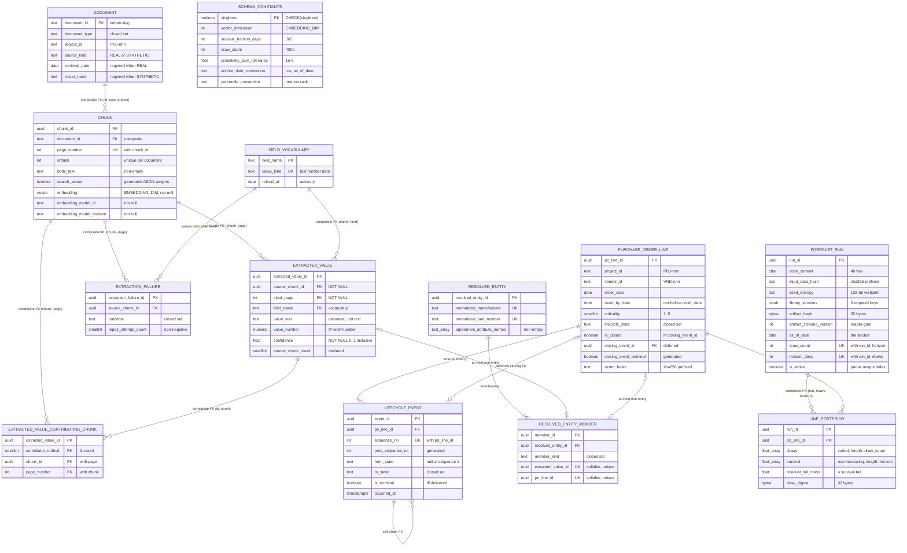

# Data Model — Core Data Schema

> Feature: `00003-core-data-schema` (E003) | Storage: **PostgreSQL 16 + `pgvector`**, single instance, schema `public` | Migrations: forward-only Alembic in `/src/model`, filename block `0001`–`0099`

This epic **is** the schema. Every table, column, named constraint, index, seeded row, and state transition below is normative: the migrations are expected to reproduce these names verbatim, because later migrations, tests, and epics reference them by name.

## Conventions

| Aspect | Rule |
|--------|------|
| Schema | `public`. A dedicated schema was rejected: E001 froze `DATABASE_URL` (`postgresql://procurement:…@db:5432/procurement`) with no `options=-csearch_path`, and TR-037 forbids changing it. |
| Table names | Singular `snake_case`. Views prefixed `v_`. |
| Constraint names | `pk_<table>`, `uq_<table>__<purpose>`, `fk_<table>__<purpose>`, `ck_<table>__<rule>`, `ix_<table>__<purpose>`. Every constraint is explicitly named — an unnamed constraint cannot be referenced by a later forward migration (research: *Invariants as database constraints*). |
| Surrogate keys | `uuid` for rows a job generates; natural `text` keys where an upstream artifact already owns the identifier (`document.document_id`, `field_vocabulary.field_name`). |
| Timestamps | `timestamptz`, never `timestamp`. Calendar anchors are `date`. |
| Money / measured quantities | `numeric`. Probabilities and posterior draws are `double precision` (array arithmetic). |
| Text-search configuration | Always the two-argument form with the literal `'pg_catalog.english'`. The one-argument form is not `IMMUTABLE` and is rejected in generated columns (TR-038, OBJ2 VC6). |
| Composite FKs | Declared `MATCH FULL` unless a deliberate all-null or partially-null case is documented, per the research warning about partial-match semantics silently skipping the check. One exception exists **in the objects E003 creates**, `fk_lifecycle_event__chain`, declared `MATCH SIMPLE` because `MATCH FULL` refuses a partially-null referencing row outright and would make every line's opening event unrepresentable — recorded in full under §`lifecycle_event`. A second `MATCH SIMPLE` edge is added to `resolved_entity_member` by E009's `0505` under {SAD:ADR-0024} — `fk_rem__run_record_section`, for the same partially-null reason — so "one exception" is no longer true of the migrated schema; see §`resolved_entity` / `resolved_entity_member` › Extended by E009. |
| Deferrability | Exactly one constraint in the schema is deferrable: `fk_purchase_order_line__closing_event`. No `CHECK` or `NOT NULL` is deferred — PostgreSQL does not permit it (TR-051). |

## Declared Constants

Named symbols, not literals scattered across call sites. Each is published in `schema_constants` (TR-043) and read over the connection by `/src/api` (TR-047).

| Symbol | Value | Also appears as a DDL literal in | Notes |
|--------|-------|----------------------------------|-------|
| `EMBEDDING_DIM` | `384` — fixed by [ADR-0012](../adrs/0012-embedding-model-and-vector-dimension.md), accepted 2026-07-25 (TR-050, IP-013) | `chunk.embedding vector(384)` | A compact open sentence-embedding model generated locally, chosen against the 400 MB serving envelope already dominated by the reranker session. pgvector's HNSW index caps at **2000 dimensions**, recorded in the ADR as a standing constraint on any future model change. The ADR names a model class but no pinned revision hash — E003/E006 must pin the concrete repository revision and store identity and revision per chunk. |
| `SURVIVAL_HORIZON_DAYS` | `365` | none — carried per-run in `forecast_run.horizon_days` | Whole days from the run anchor. Raising it is a forward migration plus a refit, never a silent truncation (Risk: horizon too short). |
| `DRAW_COUNT` | `4000` | none — carried per-run in `forecast_run.draw_count` | Spec Technical Constraints: "approximately 4,000 posterior draws per line". |
| `PROB_SUM_TOLERANCE` | `1e-9` | `ck_line_posterior__residual_matches_grid_tail` | Both compared quantities are `count/4000` ratios, so realised error is ~1e-16; 1e-9 is deliberately slack. |
| `ANCHOR_DATE_CONVENTION` | `'run_as_of_date'` | none | One as-of date per run, on the run row (TR-033, TR-049). |
| `PERCENTILE_CONVENTION` | `'nearest_rank_one_based_no_interpolation'` | none | `draws[ceil(p * draw_count)]`, integer index, no interpolation (TR-033, OBJ5 VC10). |

**Direction of authority (TR-076, ADR-0013)**: where a constant exists both as a DDL literal and as a published row, **the DDL literal governs**. The migration that declares `chunk.embedding` cannot read its dimension from a table the same migration set is still creating, so the literal is the source and the row is the published copy. A drift failure is therefore repaired by correcting the `schema_constants` row, never by altering the column the literal declared.

**Drift control (TR-048, SC-019)**: only two constants are duplicated as DDL literals — `EMBEDDING_DIM` and `PROB_SUM_TOLERANCE`. A test reads `schema_constants`, then reads `information_schema` / `pg_attribute` for the declared `vector` typmod and `pg_get_constraintdef` for the tolerance literal, and asserts equality. `SURVIVAL_HORIZON_DAYS` and `DRAW_COUNT` are asserted against the active run's `horizon_days` and `draw_count` when a run exists. Nothing is duplicated behind a comment asking a future reader to keep it aligned.

**Both sentences above are corrected 2026-07-29, on E007's obligations `P-1` and `P-2`.** *(a)* The count is no longer two. E007's migration `0302` adds a third and fourth DDL occurrence of `PROB_SUM_TOLERANCE`, and E003's drift test reads exactly one constraint, so the new occurrences are unguarded rather than checked. *(b)* **`SURVIVAL_HORIZON_DAYS` and `DRAW_COUNT` are not asserted against the active run by anything.** `test_constants_agreement.py` contains no such assertion and never did; the sentence describes a check that was never written. `specs/sad.md` now states the governing rule directly — declared schema constants are fixed *by decision, not by check*, and `forecast_run.draw_count` and `.horizon_days` carry per-run values no constraint binds to the declared 4,000 and 365 — so this sentence contradicted a registered document as well as the code. E007 added its own assertion (AD-009) rather than editing this claim, which is why it stood this long. Whoever widens the drift test to the `0302` constraints should retire the second sentence or write the check it promises; a claim of enforcement is worse than a disclosed gap, because it stops anyone looking.

### Scope-decision record for the three values fixed during planning (TR-056, AD-005, Principle VII)

Each value was chosen rather than measured, so each is recorded as a scope decision with its evidence, the condition that reverses it, and what a production-scale system would do instead.

| Value | Supporting evidence | Reversal trigger | Production-scale alternative |
|-------|---------------------|------------------|------------------------------|
| `SURVIVAL_HORIZON_DAYS = 365` | Procurement lead times in the modelled corpus sit well inside a year; a one-year grid at whole-day resolution is 365 doubles per line, which is free at 200 lines | Residual tail mass exceeds a reported threshold on any line, or a planning-relevant percentile falls outside the grid — both visible in data because the residual is stored explicitly rather than truncated | A per-run horizon chosen from the fitted posterior (for example the 99.9th percentile rounded up), or a variable-resolution grid: daily for the first quarter, weekly thereafter |
| `DRAW_COUNT = 4000` | The architecture document's stated scale, and the conventional 4 chains × 1000 retained draws; ~35 KB per artifact row at 200 lines per run | Posterior tail percentiles prove unstable between runs at the same seed entropy, or an evaluation arm needs finer tail resolution than 1/4000 | Draw count set per run from a convergence diagnostic rather than fixed, with the run row already carrying the value so no schema change is needed |
| `PROB_SUM_TOLERANCE = 1e-9` | Both compared quantities are `count/4000` ratios, so realised error is ~1e-16 — the tolerance is roughly seven orders of magnitude slack | The residual-agreement check fails on data believed correct, indicating the producer computes the residual by a path with real accumulation error | Tolerance derived from the draw count and the accumulation path (for example `draw_count × machine epsilon`) rather than fixed, published in the same constants row |

## Entities

The compact artifact. Detail sections follow; downstream agents that read only this table have the shape.

| Entity | Attributes (name: type, constraints) | Relationships | State Transitions |
|--------|--------------------------------------|---------------|-------------------|
| **schema_constants** | `singleton: boolean` PK `CHECK(singleton)`; `vector_dimension: int` NOT NULL `CHECK(>0)`; `survival_horizon_days: int` NOT NULL `CHECK(>0)`; `draw_count: int` NOT NULL `CHECK(>0)`; `probability_sum_tolerance: double precision` NOT NULL `CHECK(>0 AND <1)`; `anchor_date_convention: text` NOT NULL `CHECK(='run_as_of_date')`; `percentile_convention: text` NOT NULL `CHECK(='nearest_rank_one_based_no_interpolation')` | none — read by `/src/api` and `/src/model` over the connection | — (seeded once by migration `0002`; second insert impossible) |
| **document** | `document_id: text` PK `CHECK(~ '^[a-z0-9]+(-[a-z0-9]+)*$' AND length 3..128)`; `document_type: text` NOT NULL `CHECK(IN 7 values)`; `project_id: text` NOT NULL `CHECK(~ '^PRJ-[0-9]{3}$')`; `title: text` NOT NULL non-empty; `source_kind: text` NOT NULL `CHECK(IN ('REAL','SYNTHETIC'))`; `license_basis: text` NOT NULL non-empty; **layer-conditional, each required on its own layer and rejected on the other** — `source_ref: text` NULL, `issuing_body: text` NULL, `retrieval_date: date` NULL (`REAL` only) and `generator_id: text` NULL, `generation_seed: text` NULL, `generated_at: date` NULL, `fixture_hashes: text[]` NULL (`SYNTHETIC` only, every element `~ '^sha256:[0-9a-f]{64}$'` via `fn_all_sha256_prefixed`); `roster_hash: text` NULL `CHECK(SYNTHETIC ⇒ ~ '^sha256:[0-9a-f]{64}$')`; `loaded_at: timestamptz` NOT NULL DEFAULT `now()`; UNIQUE `(document_id, document_type, project_id)` | has_many: `chunk` | — |
| **chunk** | `chunk_id: uuid` PK; `document_id: text` NOT NULL; `document_type: text` NOT NULL; `project_id: text` NOT NULL `CHECK(~ '^PRJ-[0-9]{3}$')`; `page_number: int` NOT NULL `CHECK(>=1)`; `ordinal: int` NOT NULL `CHECK(>=0)`; `spec_section: text` NULL; `heading: text` NULL; `part_numbers: text` NULL; `body_text: text` NOT NULL `CHECK(btrim<>'')`; `search_vector: tsvector` GENERATED STORED, weighted A/B/C/D; `embedding: vector(EMBEDDING_DIM)` NOT NULL; `embedding_model_id: text` NOT NULL; `embedding_model_revision: text` NOT NULL; UNIQUE `(chunk_id, page_number)`; UNIQUE `(document_id, ordinal)` | belongs_to: `document` via composite FK `(document_id, document_type, project_id)`; has_many: `extracted_value`, `extraction_failure`, `extracted_value_contributing_chunk` | — |
| **field_vocabulary** | `field_name: text` PK `CHECK(~ '^[a-z][a-z0-9_]{2,63}$')`; `value_kind: text` NOT NULL `CHECK(IN ('text','number','date'))`; `label: text` NOT NULL non-empty; `description: text` NOT NULL non-empty; `retired_at: date` NULL; UNIQUE `(field_name, value_kind)` | referenced_by: `extracted_value`, `extraction_failure` | — (22 rows seeded by migration `0005`; grows by INSERT, never by type change) |
| **extracted_value** | `extracted_value_id: uuid` PK; `source_chunk_id: uuid` **NOT NULL**; `cited_page: int` **NOT NULL** `CHECK(>=1)`; `field_name: text` NOT NULL; `value_kind: text` NOT NULL; `value_text: text` NOT NULL `CHECK(btrim<>'')`; `value_number: numeric` NULL; `confidence: double precision` **NOT NULL** `CHECK(>=0 AND <=1)`; `provenance_kind: text` NOT NULL `CHECK(IN ('single_chunk','multi_chunk'))`; `source_chunk_count: smallint` NOT NULL `CHECK(>=1)`; `extracted_at: timestamptz` NOT NULL; UNIQUE `(extracted_value_id, source_chunk_count)` | belongs_to: `chunk` via composite FK `(source_chunk_id, cited_page)`; belongs_to: `field_vocabulary` via composite FK `(field_name, value_kind)`; has_many: `extracted_value_contributing_chunk`; **no FK to `purchase_order_line`** (TR-045, SC-023) | — |
| **extracted_value_contributing_chunk** | `extracted_value_id: uuid` NOT NULL; `contributor_ordinal: smallint` NOT NULL `CHECK(>=2)`; `source_chunk_count: smallint` NOT NULL; `chunk_id: uuid` NOT NULL; `page_number: int` NOT NULL `CHECK(>=1)`; PK `(extracted_value_id, contributor_ordinal)`; UNIQUE `(extracted_value_id, chunk_id)` | belongs_to: `extracted_value` via composite FK `(extracted_value_id, source_chunk_count)` ON DELETE CASCADE; belongs_to: `chunk` via composite FK `(chunk_id, page_number)` | — |
| **extraction_failure** | `extraction_failure_id: uuid` PK; `source_chunk_id: uuid` NOT NULL; `attempted_page: int` NOT NULL `CHECK(>=1)`; `field_name: text` NOT NULL; `outcome: text` NOT NULL `CHECK(IN 7 values)`; `repair_attempt_count: smallint` NOT NULL `CHECK(>=0)`; `detail: text` NOT NULL non-empty; `failed_at: timestamptz` NOT NULL | belongs_to: `chunk` via composite FK `(source_chunk_id, attempted_page)`; belongs_to: `field_vocabulary` | — |
| **purchase_order_line** | `po_line_id: uuid` PK; `project_id: text` NOT NULL `CHECK(~ '^PRJ-[0-9]{3}$')`; `vendor_id: text` NOT NULL `CHECK(~ '^VND-[0-9]{3}$')`; `po_number: text` NOT NULL; `line_number: int` NOT NULL `CHECK(>=1)`; `material_category: text` NOT NULL non-empty; `description: text` NOT NULL; `manufacturer: text` NOT NULL; `part_number: text` NOT NULL; `quantity: numeric` NOT NULL `CHECK(>0)`; `unit_of_measure: text` NOT NULL; `order_date: date` NOT NULL; `need_by_date: date` NOT NULL `CHECK(>= order_date)`; `criticality: smallint` NOT NULL `CHECK(BETWEEN 1 AND 5)`; `lifecycle_state: text` NOT NULL `CHECK(IN 7 values)`; `is_closed: boolean` NOT NULL; `closing_event_id: uuid` NULL; `closing_event_po_line_id: uuid` GENERATED STORED; `closing_event_terminal: boolean` GENERATED STORED; `roster_hash: text` NOT NULL `CHECK(~ '^sha256:[0-9a-f]{64}$')`; UNIQUE `(project_id, po_number, line_number)` | has_many: `lifecycle_event`; belongs_to (deferred): `lifecycle_event` as closing event; referenced_by: `resolved_entity_member`, `line_posterior` | See **State Machines** — 7 states with a rework cycle |
| **lifecycle_event** | `event_id: uuid` PK; `po_line_id: uuid` NOT NULL; `sequence_no: int` NOT NULL `CHECK(>=1)`; `prev_sequence_no: int` GENERATED STORED; `from_state: text` NULL; `to_state: text` NOT NULL `CHECK(IN 7 values)`; `is_terminal: boolean` NOT NULL `CHECK(= (to_state='delivered'))`; `occurred_at: timestamptz` NOT NULL; `note: text` NULL; UNIQUE `(po_line_id, sequence_no)`; UNIQUE `(po_line_id, sequence_no, to_state)`; UNIQUE `(event_id, po_line_id, is_terminal)` | belongs_to: `purchase_order_line`; self-FK `(po_line_id, prev_sequence_no, from_state)` → `(po_line_id, sequence_no, to_state)` chains the sequence | See **State Machines** |
| **resolved_entity** | `resolved_entity_id: uuid` PK; `normalized_manufacturer: text` NOT NULL `CHECK(btrim<>'' AND = lower(...))`; `normalized_part_number: text` NOT NULL `CHECK(btrim<>'')`; `agreement_attribute_names: text[]` NOT NULL `CHECK(cardinality>=1)`; `created_at: timestamptz` NOT NULL; UNIQUE `(normalized_manufacturer, normalized_part_number)`; **extended by E009's `0505`** — `resolution_run_id: uuid` NOT NULL, `project_id: text` NOT NULL, `uq_resolved_entity__normalized_identity` dropped and replaced by `uq_resolved_entity__run_identity`, plus `uq_resolved_entity__id_run` and `fk_resolved_entity__run_project` | has_many: `resolved_entity_member` | — |
| **resolved_entity_member** | `member_id: uuid` PK; `resolved_entity_id: uuid` NOT NULL; `member_kind: text` NOT NULL `CHECK(IN ('extracted_value','purchase_order_line'))`; `extracted_value_id: uuid` NULL UNIQUE; `po_line_id: uuid` NULL UNIQUE; `CHECK(num_nonnulls(...)=1)`; `CHECK(member_kind agrees)`; **extended by E009's `0505`** — `resolution_run_id: uuid` NOT NULL, `specification_section: text` NULL, `member_record_id: uuid` GENERATED STORED NOT NULL, `uq_rem__extracted_value` / `uq_rem__po_line` dropped and replaced by `uq_rem__run_extracted_value` / `uq_rem__run_po_line`, plus `uq_rem__entity_kind_record`, `fk_rem__entity_run`, `fk_rem__run_record`, `fk_rem__run_record_section`, `ix_rem__entity_section`, `ix_rem__run` | belongs_to: `resolved_entity` ON DELETE CASCADE; belongs_to: `extracted_value` XOR `purchase_order_line` | — |
| **forecast_run** | `run_id: uuid` PK; `code_commit: char(40)` NOT NULL `CHECK(~ '^[0-9a-f]{40}$')`; `code_worktree_dirty: boolean` NOT NULL; `input_data_hash: text` NOT NULL `CHECK(~ '^sha256:[0-9a-f]{64}$')`; `seed_entropy: text` NOT NULL `CHECK(~ '^[0-9]{1,39}$')`; `chain_count: int` NOT NULL `CHECK(>0)`; `draw_count: int` NOT NULL `CHECK(>0)`; `tuning_count: int` NOT NULL `CHECK(>=0)`; `library_versions: jsonb` NOT NULL `CHECK(object AND ?& 6 required keys)`; `artifact_hash: bytea` NOT NULL `CHECK(octet_length=32)`; `draw_serialization: text` NOT NULL `CHECK(='float64-le-c-contiguous')`; `artifact_schema_version: int` NOT NULL `CHECK(>=1)`; `model_version: text` NOT NULL; `as_of_date: date` NOT NULL; `horizon_days: int` NOT NULL `CHECK(>0)`; `wall_clock_seconds: double precision` NOT NULL `CHECK(>=0)`; `roster_hash: text` NOT NULL `CHECK(sha256 format)`; `is_active: boolean` NOT NULL DEFAULT false; `created_at: timestamptz` NOT NULL; UNIQUE `(run_id, draw_count, horizon_days)`; partial UNIQUE INDEX on `(is_active) WHERE is_active` | has_many: `line_posterior` ON DELETE CASCADE | `Created → Active → Superseded` (flip of `is_active`; at most one Active) |
| **line_posterior** | PK `(run_id, po_line_id)`; `run_id: uuid` NOT NULL; `po_line_id: uuid` NOT NULL; `draw_count: int` NOT NULL; `horizon_days: int` NOT NULL; `draws: double precision[]` NOT NULL, 1-D, sorted ascending, `length = draw_count`, `draws[1] >= 0`; `survival: double precision[]` NOT NULL, 1-D, non-increasing, all in `[0,1]`, `length = horizon_days`; `residual_tail_mass: double precision` NOT NULL `CHECK(>=0 AND <=1)` and `= survival[horizon_days] ± 1e-9`; `draw_digest: bytea` NOT NULL `CHECK(octet_length=32)` | belongs_to: `forecast_run` via composite FK `(run_id, draw_count, horizon_days)`; belongs_to: `purchase_order_line` | — (both arrays share one row, so the pair cannot half-exist — TR-031, SC-014) |

---

## Table Detail

### `schema_constants` — TR-043, TR-047, OBJ1 VC8

Exactly one row, guaranteed structurally: the primary key is a boolean that a `CHECK` forces to `true`, so a second row collides on the key.

| Column | Type | Null | Constraint |
|--------|------|------|-----------|
| `singleton` | `boolean` | NOT NULL | `pk_schema_constants` PRIMARY KEY; `ck_schema_constants__singleton CHECK (singleton)` |
| `vector_dimension` | `integer` | NOT NULL | `ck_schema_constants__vector_dimension_positive CHECK (vector_dimension > 0)` |
| `survival_horizon_days` | `integer` | NOT NULL | `ck_schema_constants__horizon_positive CHECK (survival_horizon_days > 0)` |
| `draw_count` | `integer` | NOT NULL | `ck_schema_constants__draw_count_positive CHECK (draw_count > 0)` |
| `probability_sum_tolerance` | `double precision` | NOT NULL | `ck_schema_constants__tolerance_range CHECK (probability_sum_tolerance > 0 AND probability_sum_tolerance < 1)` |
| `anchor_date_convention` | `text` | NOT NULL | `ck_schema_constants__anchor_convention CHECK (anchor_date_convention = 'run_as_of_date')` |
| `percentile_convention` | `text` | NOT NULL | `ck_schema_constants__percentile_convention CHECK (percentile_convention = 'nearest_rank_one_based_no_interpolation')` |

### `document` — TR-041, TR-046, IP-012

| Column | Type | Null | Constraint |
|--------|------|------|-----------|
| `document_id` | `text` | NOT NULL | `pk_document` PRIMARY KEY; `ck_document__id_format CHECK (document_id ~ '^[a-z0-9]+(-[a-z0-9]+)*$' AND char_length(document_id) BETWEEN 3 AND 128)` |
| `document_type` | `text` | NOT NULL | `ck_document__type CHECK (document_type IN ('specification','submittal','purchase_order','rfi','transmittal','drawing','reference_standard'))` |
| `project_id` | `text` | NOT NULL | `ck_document__project_id_format CHECK (project_id ~ '^PRJ-[0-9]{3}$')` |
| `title` | `text` | NOT NULL | `ck_document__title_present CHECK (btrim(title, E' \t\n\r\f\u000B') <> '')` |
| `source_kind` | `text` | NOT NULL | `ck_document__source_kind CHECK (source_kind IN ('REAL','SYNTHETIC'))` |
| `source_ref` | `text` | NULL | `ck_document__real_has_source_ref CHECK (source_kind <> 'REAL' OR btrim(coalesce(source_ref, '')) <> '')`; `ck_document__synthetic_has_no_source_ref CHECK (source_kind <> 'SYNTHETIC' OR source_ref IS NULL)` |
| `issuing_body` | `text` | NULL | `ck_document__real_has_issuing_body CHECK (source_kind <> 'REAL' OR btrim(coalesce(issuing_body, '')) <> '')`; `ck_document__synthetic_has_no_issuing_body CHECK (source_kind <> 'SYNTHETIC' OR issuing_body IS NULL)` |
| `generator_id` | `text` | NULL | `ck_document__synthetic_has_generator CHECK (source_kind <> 'SYNTHETIC' OR btrim(coalesce(generator_id, '')) <> '')`; `ck_document__real_has_no_generator CHECK (source_kind <> 'REAL' OR generator_id IS NULL)` |
| `generation_seed` | `text` | NULL | `ck_document__synthetic_has_seed CHECK (source_kind <> 'SYNTHETIC' OR btrim(coalesce(generation_seed, '')) <> '')`; `ck_document__real_has_no_seed CHECK (source_kind <> 'REAL' OR generation_seed IS NULL)` |
| `generated_at` | `date` | NULL | `ck_document__synthetic_has_generated_at CHECK (source_kind <> 'SYNTHETIC' OR generated_at IS NOT NULL)`; `ck_document__real_has_no_generated_at CHECK (source_kind <> 'REAL' OR generated_at IS NULL)` |
| `fixture_hashes` | `text[]` | NULL | `ck_document__synthetic_has_fixture_hashes CHECK (source_kind <> 'SYNTHETIC' OR (coalesce(array_length(fixture_hashes,1), 0) >= 1 AND fn_all_sha256_prefixed(fixture_hashes)))`; `ck_document__real_has_no_fixture_hashes CHECK (source_kind <> 'REAL' OR fixture_hashes IS NULL)` — a `CHECK` admits no subquery, so element-wise format validation goes through an `IMMUTABLE` helper, as sortedness does |
| `license_basis` | `text` | NOT NULL | `ck_document__license_basis_present CHECK (btrim(license_basis, E' \t\n\r\f\u000B') <> '')` |
| `retrieval_date` | `date` | NULL | `ck_document__real_has_retrieval_date CHECK (source_kind <> 'REAL' OR retrieval_date IS NOT NULL)`; `ck_document__synthetic_has_no_retrieval_date CHECK (source_kind <> 'SYNTHETIC' OR retrieval_date IS NULL)` |
| `roster_hash` | `text` | NULL | `ck_document__synthetic_has_roster_hash CHECK (source_kind <> 'SYNTHETIC' OR coalesce(roster_hash, '') ~ '^sha256:[0-9a-f]{64}$')`; `ck_document__real_has_no_roster_hash CHECK (source_kind <> 'REAL' OR roster_hash IS NULL)` — generation provenance, so it is a pair like every other field in that group: a retrieved document was not generated from a roster, and is refused one for the same reason it is refused a `generator_id` |
| `loaded_at` | `timestamptz` | NOT NULL | DEFAULT `now()` |

- `uq_document__id_type_project UNIQUE (document_id, document_type, project_id)` — the FK target that lets `chunk` carry `document_type` and `project_id` without either being able to disagree with its document.
- Provenance implements the project-instructions v1.2.0 Data Provenance rule **per layer** at the storage boundary rather than in the manifest alone. Every field is covered in **both** directions — one check requiring it on its own layer, one rejecting it on the other — because TR-075 requires absence on the wrong layer to be *enforced*, not merely permitted. `retrieval_date` is retrieval provenance, so `ck_document__synthetic_has_no_retrieval_date` is part of that set; `roster_hash` is generation provenance, so `ck_document__real_has_no_roster_hash` is too.
- **Every presence check reads `coalesce(col, '')`, never the bare column.** A `CHECK` rejects a row only when its expression evaluates to *false*, and `btrim(NULL, E' \t\n\r\f\u000B') <> ''` is NULL — so `source_kind <> 'REAL' OR btrim(source_ref, E' \t\n\r\f\u000B') <> ''` yields `false OR NULL` = NULL on a `REAL` row with no source reference and **accepts** it, which is the one row the check exists to catch. The same applies to `NULL ~ pattern` (`roster_hash`) and to `array_length('{}'::text[], 1)`, which is NULL rather than 0. Mapping absent to blank makes the comparison a definite false. Checks already phrased `IS NOT NULL` need no wrapper.
- **`document_id` format is declared here** (lowercase kebab slug) because TR-041 requires a declared format and E002's manifest key space is not yet frozen. E002/E006 must adopt it; recorded as an integration obligation under **Disclosed Gaps**.
- **`project_id` is NOT NULL on every document**, including public reference standards, because SC-006 requires 100% of chunks to carry a project identifier and the chunk inherits it by composite FK. A standard referenced by several projects is loaded once per project.

### `chunk` — TR-009 … TR-014, TR-038

| Column | Type | Null | Constraint |
|--------|------|------|-----------|
| `chunk_id` | `uuid` | NOT NULL | `pk_chunk` PRIMARY KEY |
| `document_id` | `text` | NOT NULL | part of `fk_chunk__document` |
| `document_type` | `text` | NOT NULL | part of `fk_chunk__document` |
| `project_id` | `text` | NOT NULL | `ck_chunk__project_id_format CHECK (project_id ~ '^PRJ-[0-9]{3}$')`; part of `fk_chunk__document` |
| `page_number` | `integer` | NOT NULL | `ck_chunk__page_positive CHECK (page_number >= 1)` |
| `ordinal` | `integer` | NOT NULL | `ck_chunk__ordinal_non_negative CHECK (ordinal >= 0)` |
| `spec_section` | `text` | NULL | none — deliberately uncontrolled; not every document type has one |
| `heading` | `text` | NULL | none |
| `part_numbers` | `text` | NULL | none |
| `body_text` | `text` | NOT NULL | `ck_chunk__body_text_present CHECK (btrim(body_text, E' \t\n\r\f\u000B') <> '')` — the "no searchable text" rejection |
| `search_vector` | `tsvector` | GENERATED ALWAYS … STORED | expression below |
| `embedding` | `vector(EMBEDDING_DIM)` | NOT NULL | dimension enforced by the type, not by a check (TR-011) |
| `embedding_model_id` | `text` | NOT NULL | `ck_chunk__embedding_model_id_present CHECK (btrim(embedding_model_id, E' \t\n\r\f\u000B') <> '')` |
| `embedding_model_revision` | `text` | NOT NULL | `ck_chunk__embedding_model_revision_present CHECK (btrim(embedding_model_revision, E' \t\n\r\f\u000B') <> '')` |
| `created_at` | `timestamptz` | NOT NULL | DEFAULT `now()` |

Generated search vector (TR-010, TR-038, OBJ2 VC1, OBJ2 VC6):

```
search_vector tsvector GENERATED ALWAYS AS (
    setweight(to_tsvector('pg_catalog.english', coalesce(heading, '')),      'A') ||
    setweight(to_tsvector('pg_catalog.english', coalesce(part_numbers, '')), 'B') ||
    setweight(to_tsvector('pg_catalog.english', coalesce(spec_section, '')), 'C') ||
    setweight(to_tsvector('pg_catalog.english', body_text),                  'D')
) STORED
```

Each field is `coalesce`d — one NULL field would otherwise null the whole concatenation. Weights are labels; the numeric weighting is `ts_rank`'s default array `{0.1, 0.2, 0.4, 1.0}` for `{D, C, B, A}`, so heading > part number > section > body. **Relevance tuning is a query-time weight-array change, never a migration** — a property E008 should rely on.

Constraints and indexes:

| Name | Definition | Purpose |
|------|-----------|---------|
| `fk_chunk__document` | `FOREIGN KEY (document_id, document_type, project_id) REFERENCES document (document_id, document_type, project_id) MATCH FULL ON DELETE RESTRICT ON UPDATE CASCADE` | TR-014, TR-046, SC-018. Also makes the chunk's denormalized `document_type` and `project_id` unable to disagree with the document. |
| `uq_chunk__chunk_page` | `UNIQUE (chunk_id, page_number)` | **The citation FK target** (TR-017, STF-006). Redundant against the PK by design. |
| `uq_chunk__document_ordinal` | `UNIQUE (document_id, ordinal)` | Ordinal position is unique within a document. |
| `ix_chunk__search_vector` | `USING gin (search_vector)` | TR-010 lexical arm. |
| `ix_chunk__embedding_hnsw` | `USING hnsw (embedding vector_cosine_ops) WITH (m = 16, ef_construction = 64)` | ADR-0005 serving arm. Exact scan is the same table with the index disabled, so TR-013 holds with no schema change. Set `hnsw.ef_search = 100` at query time — the default 40 is below the 50 candidates per arm the retrieval design fetches. |
| `ix_chunk__document_page` | `(document_id, page_number)` | Detail-view citation resolution. |
| `ix_chunk__project` | `(project_id)` | Per-project filtering in fusion. |

### `field_vocabulary` — TR-044, SC-021

| Column | Type | Null | Constraint |
|--------|------|------|-----------|
| `field_name` | `text` | NOT NULL | `pk_field_vocabulary` PRIMARY KEY; `ck_field_vocabulary__name_format CHECK (field_name ~ '^[a-z][a-z0-9_]{2,63}$')` |
| `value_kind` | `text` | NOT NULL | `ck_field_vocabulary__value_kind CHECK (value_kind IN ('text','number','date'))` |
| `label` | `text` | NOT NULL | `ck_field_vocabulary__label_present CHECK (btrim(label, E' \t\n\r\f\u000B') <> '')` |
| `description` | `text` | NOT NULL | `ck_field_vocabulary__description_present CHECK (btrim(description, E' \t\n\r\f\u000B') <> '')` |
| `retired_at` | `date` | NULL | none — advisory; see Disclosed Gaps |

- `uq_field_vocabulary__name_kind UNIQUE (field_name, value_kind)` — the FK target that lets `extracted_value` carry `value_kind` and reduce "the typed numeric column is populated exactly for numeric fields" to a single-row check.
- A lookup table, not an enum: an enum value cannot be retired under a forward-only chain, and a value added by `ALTER TYPE` is unusable until the transaction commits, which breaks any migration that adds a term and backfills with it (research: *Closed vocabularies*).

### `extracted_value` — TR-015 … TR-018, TR-045

| Column | Type | Null | Constraint |
|--------|------|------|-----------|
| `extracted_value_id` | `uuid` | NOT NULL | `pk_extracted_value` PRIMARY KEY |
| `source_chunk_id` | `uuid` | **NOT NULL** | part of `fk_extracted_value__chunk_page` (TR-015) |
| `cited_page` | `integer` | **NOT NULL** | `ck_extracted_value__cited_page_positive CHECK (cited_page >= 1)`; part of `fk_extracted_value__chunk_page` (TR-015) |
| `field_name` | `text` | NOT NULL | part of `fk_extracted_value__field` |
| `value_kind` | `text` | NOT NULL | part of `fk_extracted_value__field` |
| `value_text` | `text` | NOT NULL | `ck_extracted_value__value_text_present CHECK (btrim(value_text, E' \t\n\r\f\u000B') <> '')` |
| `value_number` | `numeric` | NULL | `ck_extracted_value__numeric_iff_number_kind CHECK ((value_kind = 'number') = (value_number IS NOT NULL))` |
| `confidence` | `double precision` | **NOT NULL** | `ck_extracted_value__confidence_range CHECK (confidence >= 0.0 AND confidence <= 1.0)` — inclusive both ends (TR-016) |
| `provenance_kind` | `text` | NOT NULL | `ck_extracted_value__provenance_kind CHECK (provenance_kind IN ('single_chunk','multi_chunk'))` |
| `source_chunk_count` | `smallint` | NOT NULL | `ck_extracted_value__source_count_positive CHECK (source_chunk_count >= 1)`; `ck_extracted_value__provenance_agrees_with_count CHECK ((source_chunk_count > 1) = (provenance_kind = 'multi_chunk'))` |
| `extracted_at` | `timestamptz` | NOT NULL | DEFAULT `now()` |

| Name | Definition | Purpose |
|------|-----------|---------|
| `fk_extracted_value__chunk_page` | `FOREIGN KEY (source_chunk_id, cited_page) REFERENCES chunk (chunk_id, page_number) MATCH FULL ON DELETE RESTRICT ON UPDATE CASCADE` | TR-017, OBJ3 VC5, SC-008. **No trigger.** A citation whose page differs from its source chunk's page has no referent. |
| `fk_extracted_value__field` | `FOREIGN KEY (field_name, value_kind) REFERENCES field_vocabulary (field_name, value_kind) MATCH FULL ON DELETE RESTRICT ON UPDATE CASCADE` | TR-044 membership, and carries the declared kind into the row so the numeric-column rule is single-row. |
| `uq_extracted_value__id_source_count` | `UNIQUE (extracted_value_id, source_chunk_count)` | FK target for contributor rows. |
| `ix_extracted_value__chunk` | `(source_chunk_id)` | Reverse lookup from a chunk. |
| `ix_extracted_value__field` | `(field_name)` | Per-field scans. |

**No foreign key to `purchase_order_line` or any other target record** (TR-045, SC-023). The value's only outbound references are its source chunk and its field name; `resolved_entity_member` is the sanctioned join surface, populated by E009.

### `extracted_value_contributing_chunk` — TR-018, OBJ3 VC3

Multi-source provenance. **The anchor `(source_chunk_id, cited_page)` on `extracted_value` is contributor 1**; this table holds contributors 2..N. That removes the "is the anchor also a row here?" ambiguity and keeps TR-015's non-nullable citation meaningful for multi-source values too.

| Column | Type | Null | Constraint |
|--------|------|------|-----------|
| `extracted_value_id` | `uuid` | NOT NULL | part of `pk_extracted_value_contributing_chunk` |
| `contributor_ordinal` | `smallint` | NOT NULL | part of PK; `ck_evcc__ordinal_min CHECK (contributor_ordinal >= 2)`; `ck_evcc__ordinal_within_declared_count CHECK (contributor_ordinal <= source_chunk_count)` |
| `source_chunk_count` | `smallint` | NOT NULL | part of `fk_evcc__value_count` |
| `chunk_id` | `uuid` | NOT NULL | part of `fk_evcc__chunk_page` |
| `page_number` | `integer` | NOT NULL | `ck_evcc__page_positive CHECK (page_number >= 1)`; part of `fk_evcc__chunk_page` |

| Name | Definition |
|------|-----------|
| `pk_extracted_value_contributing_chunk` | `PRIMARY KEY (extracted_value_id, contributor_ordinal)` |
| `fk_evcc__value_count` | `FOREIGN KEY (extracted_value_id, source_chunk_count) REFERENCES extracted_value (extracted_value_id, source_chunk_count) MATCH FULL ON DELETE CASCADE ON UPDATE CASCADE` |
| `fk_evcc__chunk_page` | `FOREIGN KEY (chunk_id, page_number) REFERENCES chunk (chunk_id, page_number) MATCH FULL ON DELETE RESTRICT ON UPDATE CASCADE` |
| `uq_evcc__value_chunk` | `UNIQUE (extracted_value_id, chunk_id)` — one contributor row per chunk |

Together these make it impossible to record more contributors than the value declares, to duplicate an ordinal, to duplicate a chunk, or to cite a page the chunk does not have. The one residual — an ordinal *gap* (declared 3, rows at 2 and 4 absent… i.e. only ordinal 2 present) — is a cross-row count and is listed under **Disclosed Gaps**.

Read the complete provenance of a value through:

```
v_extracted_value_provenance:
  SELECT extracted_value_id, 1::smallint AS contributor_ordinal, source_chunk_id AS chunk_id, cited_page AS page_number FROM extracted_value
  UNION ALL
  SELECT extracted_value_id, contributor_ordinal, chunk_id, page_number FROM extracted_value_contributing_chunk
```

### `extraction_failure` — TR-019, OBJ3 VC4

| Column | Type | Null | Constraint |
|--------|------|------|-----------|
| `extraction_failure_id` | `uuid` | NOT NULL | `pk_extraction_failure` PRIMARY KEY |
| `source_chunk_id` | `uuid` | NOT NULL | part of `fk_extraction_failure__chunk_page` |
| `attempted_page` | `integer` | NOT NULL | `ck_extraction_failure__page_positive CHECK (attempted_page >= 1)`; part of the same FK |
| `field_name` | `text` | NOT NULL | `fk_extraction_failure__field FOREIGN KEY (field_name) REFERENCES field_vocabulary (field_name)` |
| `outcome` | `text` | NOT NULL | `ck_extraction_failure__outcome CHECK (outcome IN ('no_value_found','unparseable_value','type_coercion_failed','schema_violation','missing_citation','confidence_below_threshold','repair_budget_exhausted'))` |
| `repair_attempt_count` | `smallint` | NOT NULL | `ck_extraction_failure__repair_count_non_negative CHECK (repair_attempt_count >= 0)` — the repair *budget* is E006's policy, not a schema bound |
| `detail` | `text` | NOT NULL | `ck_extraction_failure__detail_present CHECK (btrim(detail, E' \t\n\r\f\u000B') <> '')` |
| `failed_at` | `timestamptz` | NOT NULL | DEFAULT `now()` |

- `ix_extraction_failure__chunk_field (source_chunk_id, field_name)`.
- "No partial value row exists" is half structural and half tested: `extracted_value.value_text` is NOT NULL and non-empty, so a value row with nothing in it is unrepresentable. The remaining half — that the writer chose exactly one of the two tables — is a test (Disclosed Gaps).

### Reader-facing semantics of the provenance tables — TR-081, TR-082, TR-085

Three requirements over `extracted_value` and `extraction_failure` constrain what a reader may conclude, not what the database accepts. No constraint can carry any of them, so they are recorded here, where TR-083 makes them normative. Asserted against this document by `src/model/tests/schema/test_extraction.py`; no schema assertion is invented for them.

- **TR-081 — confidence is a computed score, never a calibrated probability.** `extracted_value.confidence` is derived deterministically by the producing epic from parse signals recorded alongside the value, at the time recorded in `extracted_at`. No reader may interpret it as a frequency, and no reader may compare it across fields as one. The schema carries the type and the closed interval; it cannot carry calibration, and nothing here claims it does. *(Amended 2026-07-27. The original read "a self-reported score … a score the extracting agent asserted about its own output". E006 computes it in code from parse signals — whether the printed label was canonical or a known alternate, whether the value was assembled across a page break, and whether the invocation validated only after a repair — because a number the model asserts about its own output is not reproducible and sits on the wrong side of Principle V. The non-calibration half stands unchanged; only the source of the number moved. Evidence: E006 FR-031, FR-057, FR-063 and its `extracted_value_parse_signal` record.)*
- **TR-082 — agent identity is recorded at ingestion-run granularity, not on the value row.** E006's ingestion run names the agent that wrote a citation. `extracted_at` is therefore the only per-row temporal fact on `extracted_value`, and the absence of an agent column is by design rather than an omission — adding one would put the same fact at two granularities with nothing to say which a given row was written under.
- **TR-085 — every provenance row is retained for the life of the database.** Retention policy is out of scope and the full dataset is regenerable from the repository and its jobs, so no row expires or is pruned. `RESTRICT` on every citation edge, plus migration `0009` revoking `UPDATE` and `DELETE` from the application role (TR-084), means no deletion path is declared for these three tables at all.

### `purchase_order_line` — TR-020 … TR-025

| Column | Type | Null | Constraint |
|--------|------|------|-----------|
| `po_line_id` | `uuid` | NOT NULL | `pk_purchase_order_line` PRIMARY KEY |
| `project_id` | `text` | NOT NULL | `ck_pol__project_id_format CHECK (project_id ~ '^PRJ-[0-9]{3}$')` |
| `vendor_id` | `text` | NOT NULL | `ck_pol__vendor_id_format CHECK (vendor_id ~ '^VND-[0-9]{3}$')` |
| `po_number` | `text` | NOT NULL | `ck_pol__po_number_present CHECK (btrim(po_number, E' \t\n\r\f\u000B') <> '')` |
| `line_number` | `integer` | NOT NULL | `ck_pol__line_number_positive CHECK (line_number >= 1)` |
| `material_category` | `text` | NOT NULL | `ck_pol__material_category_present CHECK (btrim(material_category, E' \t\n\r\f\u000B') <> '')` |
| `description` | `text` | NOT NULL | `ck_pol__description_present CHECK (btrim(description, E' \t\n\r\f\u000B') <> '')` |
| `manufacturer` | `text` | NOT NULL | `ck_pol__manufacturer_present CHECK (btrim(manufacturer, E' \t\n\r\f\u000B') <> '')` |
| `part_number` | `text` | NOT NULL | `ck_pol__part_number_present CHECK (btrim(part_number, E' \t\n\r\f\u000B') <> '')` |
| `quantity` | `numeric` | NOT NULL | `ck_pol__quantity_positive CHECK (quantity > 0)` |
| `unit_of_measure` | `text` | NOT NULL | `ck_pol__uom_present CHECK (btrim(unit_of_measure, E' \t\n\r\f\u000B') <> '')` |
| `order_date` | `date` | NOT NULL | — |
| `need_by_date` | `date` | NOT NULL | `ck_pol__need_by_not_before_order CHECK (need_by_date >= order_date)` (TR-023, OBJ4 VC1) |
| `criticality` | `smallint` | NOT NULL | `ck_pol__criticality_band CHECK (criticality BETWEEN 1 AND 5)` — ordinal band, **5 = most critical** |
| `lifecycle_state` | `text` | NOT NULL | `ck_pol__lifecycle_state CHECK (lifecycle_state IN ('submitted','under_review','revise_and_resubmit','approved','released_for_fabrication','shipped','delivered'))` |
| `is_closed` | `boolean` | NOT NULL | `ck_pol__closed_iff_closing_event CHECK (is_closed = (closing_event_id IS NOT NULL))`; `ck_pol__closed_iff_delivered CHECK (is_closed = (lifecycle_state = 'delivered'))` |
| `closing_event_id` | `uuid` | NULL | part of `fk_purchase_order_line__closing_event` |
| `closing_event_po_line_id` | `uuid` | GENERATED ALWAYS AS `(CASE WHEN closing_event_id IS NULL THEN NULL ELSE po_line_id END)` STORED | part of the same FK |
| `closing_event_terminal` | `boolean` | GENERATED ALWAYS AS `(CASE WHEN closing_event_id IS NULL THEN NULL ELSE true END)` STORED | part of the same FK |
| `roster_hash` | `text` | NOT NULL | `ck_pol__roster_hash_format CHECK (roster_hash ~ '^sha256:[0-9a-f]{64}$')` (TR-024, OBJ4 VC5) |
| `created_at` | `timestamptz` | NOT NULL | DEFAULT `now()` |

| Name | Definition | Purpose |
|------|-----------|---------|
| `uq_purchase_order_line__natural` | `UNIQUE (project_id, po_number, line_number)` | Natural key for E005's generator and for idempotent reloads. |
| `fk_purchase_order_line__closing_event` | `FOREIGN KEY (closing_event_id, closing_event_po_line_id, closing_event_terminal) REFERENCES lifecycle_event (event_id, po_line_id, is_terminal) MATCH FULL ON DELETE NO ACTION ON UPDATE NO ACTION DEFERRABLE INITIALLY DEFERRED` | **TR-021, OBJ4 VC2.** The only deferrable constraint in the schema. |
| `ix_purchase_order_line__vendor` | `(vendor_id)` | Per-vendor aggregation (TR-020 rationale, E014/E019). |
| `ix_purchase_order_line__project_need_by` | `(project_id, need_by_date)` | Worklist ordering. |
| `ix_purchase_order_line__open` | `(need_by_date) WHERE NOT is_closed` | Right-censored set — the worklist's default filter. |

**How the closed-line invariant is actually carried.** All three referencing columns are null exactly when `closing_event_id` is null, because the other two are generated from it. `MATCH FULL` therefore accepts the all-null (open) case and enforces the full triple for the closed case, with no partial-match skip. The immediate `ck_pol__closed_iff_closing_event` forces a closed line to name an event; the deferred FK forces that event, at commit, to exist, to belong to *this* line, and to carry `is_terminal = true` — and `ck_lifecycle_event__terminal_iff_delivered` makes `is_terminal` unforgeable. Insert order inside a transaction is line → events → commit.

**Two verification items for implementation.** (1) PostgreSQL forbids `ON DELETE SET NULL` / `SET DEFAULT` against generated columns; `NO ACTION` is declared for exactly that reason and must not be changed. (2) If a generated column proves unusable as an FK referencing column in PG 16, the fallback is two plain nullable columns with `ck_pol__closing_terminal_true CHECK (closing_event_terminal)` and `ck_pol__closing_triple_null_together CHECK (num_nonnulls(closing_event_id, closing_event_po_line_id, closing_event_terminal) IN (0, 3))`. That fallback introduces a check on a nullable column and must then be registered in the **Nullable-Column Checks** table below. The **named fallback of last resort** remains a `CONSTRAINT TRIGGER … DEFERRABLE INITIALLY DEFERRED` named `ctr_purchase_order_line__closed_has_terminal_event` (spec Risk, TR-021) — accepted only if both declarative shapes fail, with its cost recorded: per-row firing, non-replaceable in place, and a data-only restore with triggers disabled loads straight past it.

**Both verification items resolved — outcome recorded (TR-065, migration `0007`).** The shape taken is **rung 1, the generated-column deferrable foreign key, exactly as specified above. No fallback was needed and neither lower rung was taken**, so `ck_pol__closing_terminal_true` and `ck_pol__closing_triple_null_together` do not exist, the **Nullable-Column Checks** table gains no new row, and the schema still contains **zero triggers**.

| Item | Result, verified against PostgreSQL 16 with pgvector |
|------|------------------------------------------------------|
| (1) `ON DELETE` must stay `NO ACTION` | **Confirmed, and now evidenced.** Re-declaring the same FK with `ON DELETE SET NULL` is rejected at DDL time: `invalid ON DELETE action for foreign key constraint containing generated column`, SQLSTATE **42601**. `pg_constraint` reports the delivered constraint as `confdeltype = 'a'`, `confupdtype = 'a'` (both `NO ACTION`), `confmatchtype = 'f'` (`MATCH FULL`), `condeferrable = true`, `condeferred = true`. This is not a preference a later revision may tidy up — the generated-column shape and `NO ACTION` come as a pair. |
| (2) Are generated columns usable as FK referencing columns in PG 16? | **Yes.** The `ALTER TABLE … ADD CONSTRAINT` succeeds, an open line's all-null triple is accepted with no referent under `MATCH FULL`, and a closed line naming a nonexistent terminal event is **accepted mid-transaction** and then rejected by `SET CONSTRAINTS ALL IMMEDIATE` with `ForeignKeyViolation` (SQLSTATE 23503) naming `fk_purchase_order_line__closing_event`. Both halves matter: the first is the deferral, the second the enforcement. Also verified rejected at the forced check — a pointer at a non-terminal (`shipped`) event, and one line pointing at another line's terminal event. |

### `lifecycle_event` — TR-021, TR-022

| Column | Type | Null | Constraint |
|--------|------|------|-----------|
| `event_id` | `uuid` | NOT NULL | `pk_lifecycle_event` PRIMARY KEY |
| `po_line_id` | `uuid` | NOT NULL | `fk_lifecycle_event__line FOREIGN KEY (po_line_id) REFERENCES purchase_order_line (po_line_id) ON DELETE RESTRICT` |
| `sequence_no` | `integer` | NOT NULL | `ck_lifecycle_event__sequence_positive CHECK (sequence_no >= 1)` |
| `prev_sequence_no` | `integer` | GENERATED ALWAYS AS `(CASE WHEN sequence_no = 1 THEN NULL ELSE sequence_no - 1 END)` STORED | part of `fk_lifecycle_event__chain` |
| `from_state` | `text` | NULL | `ck_lifecycle_event__first_has_no_predecessor CHECK ((sequence_no = 1) = (from_state IS NULL))`; `ck_lifecycle_event__first_is_submitted CHECK (from_state IS NOT NULL OR to_state = 'submitted')`; `ck_lifecycle_event__legal_transition CHECK (from_state IS NULL OR fn_is_legal_lifecycle_transition(from_state, to_state))` |
| `to_state` | `text` | NOT NULL | `ck_lifecycle_event__to_state CHECK (to_state IN ('submitted','under_review','revise_and_resubmit','approved','released_for_fabrication','shipped','delivered'))` |
| `is_terminal` | `boolean` | NOT NULL | `ck_lifecycle_event__terminal_iff_delivered CHECK (is_terminal = (to_state = 'delivered'))` |
| `occurred_at` | `timestamptz` | NOT NULL | — |
| `note` | `text` | NULL | none |

| Name | Definition | Purpose |
|------|-----------|---------|
| `uq_lifecycle_event__line_sequence` | `UNIQUE (po_line_id, sequence_no)` | One event per position; rework loops repeat *states*, not positions (TR-022, OBJ4 VC3). |
| `uq_lifecycle_event__line_sequence_state` | `UNIQUE (po_line_id, sequence_no, to_state)` | Target of the chain FK. |
| `uq_lifecycle_event__id_line_terminal` | `UNIQUE (event_id, po_line_id, is_terminal)` | Target of the closing FK — this is where the terminal flag gets carried into the referenced key. |
| `fk_lifecycle_event__chain` | `FOREIGN KEY (po_line_id, prev_sequence_no, from_state) REFERENCES lifecycle_event (po_line_id, sequence_no, to_state) MATCH SIMPLE ON DELETE RESTRICT ON UPDATE RESTRICT` | Self-referencing composite FK: `from_state` must be the `to_state` of the immediately preceding event **on the same line**. Makes a broken or forged history unrepresentable. **`MATCH SIMPLE`, corrected from `MATCH FULL` during implementation of `0007`** — see the note below. |
| `ix_lifecycle_event__line_occurred` | `(po_line_id, occurred_at)` | Per-line event retrieval in time order. |
| `ix_lifecycle_event__terminal` | `(po_line_id) WHERE is_terminal` | Terminal-event lookup for closure. |

**Cost of `fk_lifecycle_event__chain`**: it is not deferrable, so a line's events must be inserted in ascending `sequence_no` and deleted in descending order. That is a reasonable demand on a generator (E005) and buys a fully declarative event chain. If E005 needs unordered bulk load, this is the one constraint to drop — dropping it costs the chain guarantee and nothing else.

**Match type of `fk_lifecycle_event__chain` — corrected to `MATCH SIMPLE` (implementation of `0007`).** This document previously declared `MATCH FULL`, which makes **the opening event unrepresentable, and with it every line's entire history**. On a sequence-1 event `prev_sequence_no` is NULL (generated) and `from_state` is NULL (forced by `ck_lifecycle_event__first_has_no_predecessor`), while `po_line_id` is NOT NULL — so the referencing triple is *partially* null. `MATCH FULL` permits all-null and requires all-matching and **rejects everything between**: it does not skip a partially-null row, it refuses it. Verified against PostgreSQL 16 — under `MATCH FULL` the sequence-1 insert is rejected with `ForeignKeyViolation` naming this constraint (SQLSTATE 23503); under `MATCH SIMPLE` it is accepted, the chained sequence-2 event is accepted, and a forged `from_state` at sequence 3 is still rejected by this constraint.

The partial-match skip the §Conventions rule warns about is confined here **by a constraint, not by argument**: `po_line_id` is NOT NULL, `prev_sequence_no` is generated and null iff `sequence_no = 1`, and `from_state` is null iff `sequence_no = 1` by the immediate biconditional `ck_lifecycle_event__first_has_no_predecessor`. The null pattern is therefore a function of `sequence_no` alone, a writer cannot produce a null `from_state` at any later position, and the skipped rows are exactly those for which "the previous event" does not exist — where `ck_lifecycle_event__first_is_submitted` closes what the FK cannot see.

The named strengthening, if that biconditional is ever relaxed: add a third generated column `prev_po_line_id GENERATED ALWAYS AS (CASE WHEN sequence_no = 1 THEN NULL ELSE po_line_id END) STORED` and restore `MATCH FULL`, making the triple all-null together the way `fk_purchase_order_line__closing_event`'s triple already is. Not taken now — it adds a column to guard against the removal of a constraint in the same table.

### `resolved_entity` / `resolved_entity_member` — TR-034, TR-035 (P2)

**Both tables are extended by E009 under {SAD:ADR-0024}, and this section now states two things rather than one.** The two column tables and the constraint bullets that follow are **as delivered by migration `0010`** — the shape E003 created, tested, and had audited. §**Extended by E009 — revisions `0505` and `0509`** below states what the database carries once E009's revisions are applied, which is the shape a reader of the live schema meets. Where the two disagree the delivered declaration is marked in place rather than overwritten, so the change stays legible. Nothing here reopens E003's QC verdict: `.qc-passed` was earned against `0010`'s schema and remains true of it.

`resolved_entity`:

| Column | Type | Null | Constraint |
|--------|------|------|-----------|
| `resolved_entity_id` | `uuid` | NOT NULL | `pk_resolved_entity` PRIMARY KEY |
| `normalized_manufacturer` | `text` | NOT NULL | `ck_resolved_entity__manufacturer_normalized CHECK (normalized_manufacturer = lower(normalized_manufacturer) AND btrim(normalized_manufacturer, E' \t\n\r\f\u000B') <> '')` |
| `normalized_part_number` | `text` | NOT NULL | `ck_resolved_entity__part_number_normalized CHECK (normalized_part_number = lower(normalized_part_number) AND btrim(normalized_part_number, E' \t\n\r\f\u000B') <> '')` |
| `agreement_attribute_names` | `text[]` | NOT NULL | `ck_resolved_entity__agreement_non_empty CHECK (cardinality(agreement_attribute_names) >= 1 AND array_position(agreement_attribute_names, NULL) IS NULL AND btrim(array_to_string(agreement_attribute_names, ''), E' \t\n\r\f\u000B') <> '')` — **strengthened against null and blank elements during implementation of `0010`**; see the note below |
| `created_at` | `timestamptz` | NOT NULL | DEFAULT `now()` |

- `uq_resolved_entity__normalized_identity UNIQUE (normalized_manufacturer, normalized_part_number)`. **Dropped by E009's `0505` and replaced by `uq_resolved_entity__run_identity UNIQUE (resolution_run_id, normalized_manufacturer, normalized_part_number)`** — see §Extended by E009.
- `lower()` is used rather than a collation-dependent normalization because a `CHECK` must stay true across OS and ICU upgrades; existing rows are never rechecked (research: *Cross-table and cross-row invariants*).
- `agreement_attribute_names` elements are field-vocabulary terms, but PostgreSQL has no array-element foreign key — see **Disclosed Gaps**.

**Agreement-attribute check strengthened against element nulls — corrected above and recorded here (TR-083, implementation of `0010`).** The declared form is right about the empty array: `cardinality('{}')` is `0`, where the natural-looking `array_length(agreement_attribute_names, 1) >= 1` would have been NULL and the `CHECK` would have *accepted* an entity agreeing on nothing — the same trap `0008` records against `ck_line_posterior__draws_length`. It was wrong one subscript deeper: `cardinality(ARRAY[NULL]::text[])` is `1`, so an array holding a single NULL passed, as did `ARRAY['']`. Both are an entity declaring one agreement attribute that names nothing. Verified against PostgreSQL 16 by inserting each row the declared form would have taken. The strengthening adds no constraint name — it extends a check already declared, so the object inventory T052 audits is unchanged. What it does **not** close is a blank element *alongside* a real one (`ARRAY['manufacturer', '']`): refusing that needs a per-element scan, which a `CHECK` cannot do without a helper function, and a new function would be an object absent from this document. Such an element names no vocabulary term, which is the runtime consequence **G-6** already discloses.

`resolved_entity_member`:

| Column | Type | Null | Constraint |
|--------|------|------|-----------|
| `member_id` | `uuid` | NOT NULL | `pk_resolved_entity_member` PRIMARY KEY |
| `resolved_entity_id` | `uuid` | NOT NULL | `fk_rem__entity FOREIGN KEY … REFERENCES resolved_entity (resolved_entity_id) ON DELETE CASCADE` |
| `member_kind` | `text` | NOT NULL | `ck_rem__member_kind CHECK (member_kind IN ('extracted_value','purchase_order_line'))`; `ck_rem__kind_agrees CHECK ((member_kind = 'extracted_value') = (extracted_value_id IS NOT NULL))` |
| `extracted_value_id` | `uuid` | NULL | `fk_rem__extracted_value … ON DELETE RESTRICT`; `uq_rem__extracted_value UNIQUE (extracted_value_id)` — **dropped by E009's `0505`, replaced by `uq_rem__run_extracted_value UNIQUE (resolution_run_id, extracted_value_id)`** |
| `po_line_id` | `uuid` | NULL | `fk_rem__po_line … ON DELETE RESTRICT`; `uq_rem__po_line UNIQUE (po_line_id)` — **dropped by E009's `0505`, replaced by `uq_rem__run_po_line UNIQUE (resolution_run_id, po_line_id)`** |
| — | — | — | `ck_rem__exactly_one_target CHECK (num_nonnulls(extracted_value_id, po_line_id) = 1)` |
| `added_at` | `timestamptz` | NOT NULL | DEFAULT `now()` |

**"A record cannot belong to two entities" (TR-035, OBJ6 VC2) is a plain `UNIQUE`**, not a partial index — PostgreSQL's default `NULLS DISTINCT` means the many rows whose `extracted_value_id` is NULL (because they are line members) do not collide, while any two rows naming the same extracted value do. A single-member entity is representable trivially (OBJ6 VC3). Index `ix_rem__entity (resolved_entity_id)` for recovering all members (OBJ6 VC1).

#### Extended by E009 — revisions `0505` and `0509` (TR-083, P-6, P-9, {SAD:ADR-0024})

**What this is, and why it is admitted rather than refused.** E009 (Cross-Document Identity Resolution) is the first and only writer of these two tables, and it cannot satisfy its own requirements against them as `0010` delivered them: no column carries a resolution run, so a second run collides with the first on all three unique constraints, and no column carries a project, so "no cluster spans projects" is neither expressible nor readable from the row. Under {SAD:ADR-0024} a consuming epic may additively extend a table another epic owns when the tables are empty and it is their first writer, when the extension drops no column and narrows no type, when the diff is asserted against a hardcoded expected set, and when the ownership change is recorded as an obligation against the owning epic's documents and discharged on the default branch. All four hold here; E009 carries the diff assertion as its **VR-028** and **VR-029**, and this section plus **TR-083** discharges the fourth. Recorded here because {SAD:ADR-0017} makes this document normative, so leaving it stating `0010`'s shape as the current shape would leave a normative document confidently wrong.

**Both `ALTER`s are affordable only because both tables are empty.** `ADD COLUMN … NOT NULL` with no default and `ADD COLUMN … GENERATED … STORED NOT NULL` both succeed on a zero-row table and both fail on a populated one. That is not background — it is {SAD:ADR-0024}'s first admitting condition, it is asserted by E009's own migration as a precondition, and it stops being true the first time E009 runs. No later epic inherits this permission on these tables.

Columns added by `0505`. **Five, and the enumeration is exhaustive** (E009 FR-045); no column is dropped and no type narrowed:

| Table | Column | Type / null | Purpose |
|-------|--------|-------------|---------|
| `resolved_entity` | `resolution_run_id` | `uuid` NOT NULL, **no default** | The run that produced the entity |
| `resolved_entity` | `project_id` | `text` NOT NULL, **no default** | The project the cluster belongs to, readable on the row |
| `resolved_entity_member` | `resolution_run_id` | `uuid` NOT NULL, **no default** | Carries the entity's run down to the member |
| `resolved_entity_member` | `specification_section` | `text` **NULL** | The transmittal-printed section the member inherits, denormalized from its run record and pinned by `fk_rem__run_record_section` so the copy cannot disagree. NULL on every purchase-order line member |
| `resolved_entity_member` | `member_record_id` | `uuid` GENERATED ALWAYS AS `coalesce(extracted_value_id, po_line_id)` STORED NOT NULL | The populated side of the existing XOR as one column, so a composite FK can reference it. Adds no rule the XOR did not already carry |

Constraints dropped and re-created run-scoped by `0505`. **Three, and they are the only `DROP CONSTRAINT` statements in the whole delivered chain** — every other revision in this repository is purely additive. Each drop is possible only because E003 named the constraint rather than letting the server generate it; the §Conventions naming rule is cashed here for the first time:

| Dropped | Re-created as | The rule after the re-scope |
|---------|---------------|-----------------------------|
| `uq_resolved_entity__normalized_identity UNIQUE (normalized_manufacturer, normalized_part_number)` | `uq_resolved_entity__run_identity UNIQUE (resolution_run_id, normalized_manufacturer, normalized_part_number)` | One run may not emit an entity for one normalized manufacturer-and-part pair twice; two runs may each emit it |
| `uq_rem__extracted_value UNIQUE (extracted_value_id)` | `uq_rem__run_extracted_value UNIQUE (resolution_run_id, extracted_value_id)` | TR-035's "a record cannot belong to two entities" holds **per run**, and the same record may belong to a different entity in a later run |
| `uq_rem__po_line UNIQUE (po_line_id)` | `uq_rem__run_po_line UNIQUE (resolution_run_id, po_line_id)` | Same, on the line side |

**A widened unique key guarantees less at the old scope, and that is why the admitting conditions matter.** `UNIQUE (a)` implies `UNIQUE (b, a)` and not the converse, so each re-creation is weaker than what it replaces read globally. It is admissible here on {SAD:ADR-0024}'s three sub-conditions and on nothing else: the tables are empty, so no written row ever relied on the narrower scope; the added key column is `NOT NULL`, so the wider key cannot be satisfied vacuously; and E009 states and asserts the replacement guarantee at the new scope in its own requirements (FR-039, FR-020, SC-033). Absent the third this would be a removal wearing an addition's clothes.

**The re-created member constraints still rely on `NULLS DISTINCT`, and a `NOT NULL` leading column does not change that.** The mechanism the `0010` docstring records is unchanged: a unique index treats a row with a NULL in **any** indexed column as distinct from every other row, so every line member of a run — `resolution_run_id` populated, `extracted_value_id` NULL — still coexists freely, while two rows naming the same run *and* the same extracted value still collide immediately. Written `UNIQUE NULLS NOT DISTINCT`, the re-created form would hold at most one line member **per run** rather than one in the entire database — a smaller blast radius for the same one-keyword defect, and still unusable. E009 asserts `indnullsnotdistinct = false` on both new indexes exactly as E003 asserted it on the two they replace.

Objects added by `0505` beyond the three re-creations — all additive, none replacing anything:

| Object | Kind | Purpose |
|--------|------|---------|
| `uq_resolved_entity__id_run` | `UNIQUE (resolved_entity_id, resolution_run_id)` | Redundant against `pk_resolved_entity` **by design**: an FK target, so a referencing row cannot name an entity from a different run |
| `fk_resolved_entity__run_project` | `FOREIGN KEY (resolution_run_id, project_id) → resolution_run` `MATCH FULL`, RESTRICT / UPDATE CASCADE | The entity's project cannot disagree with its run's |
| `uq_rem__entity_kind_record` | `UNIQUE (resolved_entity_id, member_kind, member_record_id)` | FK target for E009's induced-pair endpoints |
| `fk_rem__entity_run` | `FOREIGN KEY (resolved_entity_id, resolution_run_id) → resolved_entity` `MATCH FULL`, **CASCADE** / UPDATE CASCADE | A member's run cannot disagree with its entity's. Second cascade on this table, alongside `fk_rem__entity` |
| `fk_rem__run_record` | `FOREIGN KEY (resolution_run_id, member_kind, member_record_id) → resolution_run_record` `MATCH FULL`, RESTRICT / UPDATE CASCADE | A member must be a record the run actually read |
| `fk_rem__run_record_section` | `FOREIGN KEY (resolution_run_id, member_kind, member_record_id, specification_section) → resolution_run_record` **`MATCH SIMPLE`**, RESTRICT / UPDATE CASCADE | Pins the denormalized section to the record it came from. `MATCH SIMPLE` is a **documented exception** to §Conventions on the same footing as `fk_lifecycle_event__chain`'s: `specification_section` is legitimately NULL, and a member with no section has no section to pin |
| `ix_rem__entity_section` | `CREATE INDEX … ON resolved_entity_member (resolved_entity_id, specification_section) WHERE specification_section IS NOT NULL` | Partial and **non-unique deliberately** — it serves E009's distinct-section cap and does not enforce it; a unique index here would forbid two members sharing one section, the ordinary case |
| `ix_rem__run` | `CREATE INDEX … (resolution_run_id)` | Referencing-side index for the new run edges |

The four foreign keys above are recorded in §Referential Actions with the rest.

**Privileges — `0509` revokes `UPDATE` and `DELETE`, and `0010`'s recorded rationale for granting them is superseded (P-9).** This is the more serious half of the extension, because it reverses a *decision* of this document rather than extending a column list. `0010` grants all four verbs on both tables and this document's §Migration Sequence records why, in these words: *"All four verbs, and nothing revoked afterwards: a resolved entity is a revisable judgement about identity, not a provenance row."* **That rationale is superseded, and the sentence is kept rather than deleted so the reversal stays legible.** Its reasoning was sound on its own premise — that withdrawing an unsupported merge requires a verb with which to withdraw it — and the premise is what E009 replaces. E009's FR-039 makes a resolution run append-only: a later run must not alter or delete an earlier run's entities. So `0509` revokes `UPDATE` and `DELETE` on both tables from `procurement_app`, leaving `SELECT` and `INSERT`.

**The replacement mechanism, stated because a revoke without one is just a capability removed.** Withdrawing a merge is now **a new run that does not emit it**, never an edit to the run that did. The earlier run's rows stay exactly as written and the active-run pointer moves, so "what does the system currently claim" is answered by which run is active rather than by what has been edited out of history. That substitution is the whole content of the reversal, and it is what makes E009's **SC-033** — *a second resolution run leaves the first run's resolved entities unaltered* — a checkable statement at all. Under `0010`'s grant it was uncheckable by construction, because any run held the verbs to alter any other's rows.

Three consequences of the extension, each verified against the delivered code rather than inferred:

1. **Migration `0010`'s stated droppability is withdrawn.** `0010_resolved_entity.py`'s docstring records that this document puts these two tables last in the chain by design — P2 is droppable and every P1 objective has completed by `0009`, *"so this revision can be removed from the chain without taking an objective with it."* Once `0505` `ALTER`s these tables and `0509` re-grants on them, removing `0010` breaks the chain. **That property is lost, and it is recorded here as lost** rather than left to a reader who tries the removal. Nothing else about the P1/P2 split changes: no P1 objective ever depended on `0010`, and none does now.
2. **The revoke is latent, not permanent, and for two independent reasons.** *(a)* **PostgreSQL records no negative grant** — the point `0010` itself makes about `0009` when it declines `ON ALL TABLES IN SCHEMA public`. A later `GRANT … ON ALL TABLES IN SCHEMA public` silently re-grants `UPDATE` and `DELETE` on both tables and undoes `0509` with no error and no trace, because there is nothing in the catalog for it to contradict. Only a test over the delivered privilege set catches that; the append-only guarantee is therefore *asserted-at-build-time*, not *enforced-forever*, and must not be read as permanent. *(b)* The reach limit **G-11** already discloses applies unchanged: the deployed connection role is the SUPERUSER `procurement`, which bypasses every privilege check, so the revoke binds the role the application is *intended* to use and not the one it *does* use. No new gap ID is minted for either half — *(a)* is a property of the mechanism G-11 already describes and *(b)* is G-11 itself, and E009 carries both as its own **G-13**.
3. **The ownership guard that would have reported this alteration is blind to it.** `E003_OWNED_TABLES` in `src/model/tests/schema/test_table_ownership.py` holds six names — `chunk`, `document`, `extracted_value`, `extracted_value_contributing_chunk`, `extraction_failure`, `field_vocabulary` — and **neither `resolved_entity` nor `resolved_entity_member` is among them**, so `test_e006_adds_no_column_constraint_or_index_to_a_table_e003_owns` passes on this change without having looked at it. That guard is also scoped to E006's FR-065, which binds E006 to the six tables E006 populates and says nothing about `resolved_entity` or about a later epic. The blindness is not a licence — it is why {SAD:ADR-0024} requires the diff to be asserted rather than reviewed, and E009's **VR-028** and **VR-029** are that assertion. Widening the guard's table list and pinning its revision window per epic remain open; neither is done by this amendment.

**E003's QC verdict is not reopened.** `.completed` and `.qc-passed` stand. QC audited the schema `0010` leaves behind, and every claim it verified is still true of that schema; what this section admits is a change a later epic made to the database afterwards, under an exception recorded before it was made. A reader should not take the presence of this section as evidence that E003's QC missed something.

### `forecast_run` — TR-026, TR-027, TR-032, TR-033, TR-040, TR-049

| Column | Type | Null | Constraint |
|--------|------|------|-----------|
| `run_id` | `uuid` | NOT NULL | `pk_forecast_run` PRIMARY KEY |
| `code_commit` | `char(40)` | NOT NULL | `ck_forecast_run__commit_format CHECK (code_commit ~ '^[0-9a-f]{40}$')` |
| `code_worktree_dirty` | `boolean` | NOT NULL | — |
| `input_data_hash` | `text` | NOT NULL | `ck_forecast_run__input_hash_format CHECK (input_data_hash ~ '^sha256:[0-9a-f]{64}$')` |
| `seed_entropy` | `text` | NOT NULL | `ck_forecast_run__seed_entropy_format CHECK (seed_entropy ~ '^[0-9]{1,39}$')` — the 128-bit root entropy recorded verbatim as decimal; per-chain streams are spawned, never derived by arithmetic |
| `chain_count` | `integer` | NOT NULL | `ck_forecast_run__chain_count_positive CHECK (chain_count > 0)` |
| `draw_count` | `integer` | NOT NULL | `ck_forecast_run__draw_count_positive CHECK (draw_count > 0)` |
| `tuning_count` | `integer` | NOT NULL | `ck_forecast_run__tuning_count_non_negative CHECK (tuning_count >= 0)` |
| `library_versions` | `jsonb` | NOT NULL | `ck_forecast_run__library_versions_shape CHECK (jsonb_typeof(library_versions) = 'object' AND library_versions ?& array['pymc','arviz','numpy','pandas','pytensor','blas'])` |
| `artifact_hash` | `bytea` | NOT NULL | `ck_forecast_run__artifact_hash_length CHECK (octet_length(artifact_hash) = 32)` |
| `draw_serialization` | `text` | NOT NULL | `ck_forecast_run__draw_serialization CHECK (draw_serialization = 'float64-le-c-contiguous')` — TR-040, OBJ5 VC8: the digest is taken over bytes, never over a text rendering |
| `artifact_schema_version` | `integer` | NOT NULL | `ck_forecast_run__schema_version_positive CHECK (artifact_schema_version >= 1)` — TR-032, OBJ5 VC6 |
| `model_version` | `text` | NOT NULL | `ck_forecast_run__model_version_present CHECK (btrim(model_version, E' \t\n\r\f\u000B') <> '')` |
| `as_of_date` | `date` | NOT NULL | TR-049, OBJ5 VC9 — the anchor for every `line_posterior` grid in this run. **Not the anchor for `held_out_prediction`** ({SAD:ADR-0018}, E007's `P-7`): that table is anchored per row at the line's own order date, and its draws are total durations rather than conditional remaining ones. The column and its `anchor_date_convention` constant are correct and unchanged; what was incomplete is what a reader of them was told. A consumer that assumes one anchor across both tables mis-scores every row of one of them, and nothing in the schema can detect it |
| `horizon_days` | `integer` | NOT NULL | `ck_forecast_run__horizon_positive CHECK (horizon_days > 0)` — STF-008: recorded here so the survival array's length is enforceable |
| `wall_clock_seconds` | `double precision` | NOT NULL | `ck_forecast_run__wall_clock_non_negative CHECK (wall_clock_seconds >= 0)` |
| `roster_hash` | `text` | NOT NULL | `ck_forecast_run__roster_hash_format CHECK (roster_hash ~ '^sha256:[0-9a-f]{64}$')` |
| `is_active` | `boolean` | NOT NULL | DEFAULT `false` |
| `created_at` | `timestamptz` | NOT NULL | DEFAULT `now()` |

| Name | Definition | Purpose |
|------|-----------|---------|
| `uq_forecast_run__shape` | `UNIQUE (run_id, draw_count, horizon_days)` | **The artifact-row FK target.** Carries both array lengths into the referenced key (TR-028, TR-029, STF-008). |
| `ix_forecast_run__single_active` | `CREATE UNIQUE INDEX … ON forecast_run (is_active) WHERE is_active` | **TR-027, OBJ5 VC2, SC-013.** At most one active run, as a database fact. |
| `ix_forecast_run__created_at` | `(created_at DESC)` | Operational listing only — **never** the selection mechanism. |

`v_active_forecast_run` is `SELECT * FROM forecast_run WHERE is_active`. With no active run it returns zero rows, which is the required behaviour (OBJ5 VC3): "no current forecast" must be distinguishable from "stale forecast". No `ORDER BY created_at DESC LIMIT 1` appears anywhere in the schema or its views.

### `line_posterior` — TR-028 … TR-031, ADR-0004

One row per line per run, holding **both** arrays (TR-031, SC-014). Names `PosteriorDraws` and `SurvivalArray` in the spec's Key Entities are two column groups of this one row, not two tables.

| Column | Type | Null | Constraint |
|--------|------|------|-----------|
| `run_id` | `uuid` | NOT NULL | part of PK and of `fk_line_posterior__run_shape` |
| `po_line_id` | `uuid` | NOT NULL | part of PK; `fk_line_posterior__line FOREIGN KEY … REFERENCES purchase_order_line (po_line_id) ON DELETE RESTRICT` |
| `draw_count` | `integer` | NOT NULL | part of `fk_line_posterior__run_shape` |
| `horizon_days` | `integer` | NOT NULL | part of `fk_line_posterior__run_shape` |
| `draws` | `double precision[]` | NOT NULL | `ck_line_posterior__draws_1d CHECK (array_ndims(draws) = 1 AND array_lower(draws, 1) = 1)`; `ck_line_posterior__draws_length CHECK (coalesce(array_length(draws, 1), 0) = draw_count)`; `ck_line_posterior__draws_sorted CHECK (fn_is_sorted_ascending(draws))`; `ck_line_posterior__draws_non_negative CHECK (draws[1] >= 0.0)` |
| `survival` | `double precision[]` | NOT NULL | `ck_line_posterior__survival_1d CHECK (array_ndims(survival) = 1 AND array_lower(survival, 1) = 1)`; `ck_line_posterior__survival_length CHECK (coalesce(array_length(survival, 1), 0) = horizon_days)`; `ck_line_posterior__survival_monotone CHECK (fn_is_non_increasing(survival))`; `ck_line_posterior__survival_unit_interval CHECK (fn_all_within_unit_interval(survival))` |
| `residual_tail_mass` | `double precision` | NOT NULL | `ck_line_posterior__residual_range CHECK (residual_tail_mass >= 0.0 AND residual_tail_mass <= 1.0)`; `ck_line_posterior__residual_matches_grid_tail CHECK (abs(survival[horizon_days] - residual_tail_mass) <= 1e-9)` |
| `draw_digest` | `bytea` | NOT NULL | `ck_line_posterior__draw_digest_length CHECK (octet_length(draw_digest) = 32)` |

| Name | Definition |
|------|-----------|
| `pk_line_posterior` | `PRIMARY KEY (run_id, po_line_id)` |
| `fk_line_posterior__run_shape` | `FOREIGN KEY (run_id, draw_count, horizon_days) REFERENCES forecast_run (run_id, draw_count, horizon_days) MATCH FULL ON DELETE CASCADE ON UPDATE CASCADE` |
| `ix_line_posterior__po_line` | `(po_line_id)` |

**Array semantics (normative — E007 writes, E010 reads):**

| Element | Meaning |
|---------|---------|
| `draws[i]`, `i = 1..draw_count` | Posterior predictive **delivery duration in days measured from `forecast_run.as_of_date`**, ascending. Non-negative. |
| `survival[k]`, `k = 1..horizon_days` | `P(delivery has not occurred by end of day as_of_date + k)`. Non-increasing, in `[0,1]`. |
| `residual_tail_mass` | `P(T > horizon_days)`, i.e. mass beyond the grid, stored explicitly rather than truncated (TR-030, OBJ5 VC5). Definitionally equal to `survival[horizon_days]`; the producer computes it independently from the draws, so the check is a genuine agreement test between two computations, not a tautology. |
| Probability of lateness for a line with `need_by_date d` | `survival[d - as_of_date]`, clamped: if `d <= as_of_date` the line is already late; if `d - as_of_date > horizon_days` the answer is bounded above by `residual_tail_mass`. Computed by E010 in SQL. **No complement.** `survival[k]` is defined one row above as the probability that delivery has *not* occurred by day `k`, which is the probability of lateness itself; `1 - survival[k]` is the probability of arriving on time. An earlier revision of this row carried that inversion and was corrected during E010's planning, before any code consumed it — the migration's own comment always stated the correct semantics. |
| Percentile `p` (0 < p ≤ 1) | `draws[ceil(p * draw_count)]` — nearest rank, one-based, no interpolation (TR-033, OBJ5 VC10). |

**Length enforcement chain (SC-025)**: the composite FK proves `draw_count` and `horizon_days` on the artifact row are the run's own values; the two single-row `array_length` checks then prove each array matches. Neither check reads another row, so nothing here depends on a trigger and nothing breaks under dump-and-restore.

**Two array checks strengthened against NULL — corrected above and recorded here (TR-083, implementation of `0008`).** Both were previously declared in a form that PostgreSQL evaluates to NULL on the very input the check exists to refuse, and a `CHECK` rejects only on *false*, so both **accepted** that input. Each was verified by inserting the row the declared form would have taken, and each strengthens an existing check rather than adding one — the constraint names and the object inventory are unchanged.

| Check | Declared | Delivered | Why |
|-------|----------|-----------|-----|
| `ck_line_posterior__draws_length`, `ck_line_posterior__survival_length` | `array_length(…, 1) = N` | `coalesce(array_length(…, 1), 0) = N` | `array_length('{}', 1)` is **NULL, not 0** — an empty array has no dimensions — so the declared form is NULL on `'{}'` and admits an artifact row with no draws at all. `ck_forecast_run__draw_count_positive` and `ck_forecast_run__horizon_positive` keep the substituted 0 from ever matching. |
| `ck_line_posterior__draws_1d`, `ck_line_posterior__survival_1d` | `array_ndims(…) = 1` | `array_ndims(…) = 1 AND array_lower(…, 1) = 1` | PostgreSQL array subscripts need not start at 1, and both read conventions above subscript directly — `draws[ceil(p * draw_count)]` and `survival[horizon_days]`. A legal lower-bound-0 array of the declared length puts the last element out of subscript reach, so `survival[horizon_days]` is NULL, so `ck_line_posterior__residual_matches_grid_tail` is NULL and satisfied. |

## Immutable Helper Functions

All are `IMMUTABLE STRICT PARALLEL SAFE`, take arguments only, and perform no lookups, no `current_setting`, and no collation-dependent comparison. That is what makes them sound inside a `CHECK`: a validated check constraint is emitted with the table ahead of the data, so a restore re-proves the invariant row by row, and the constraint records the function's identity rather than its text.

| Function | Signature | Body summary |
|----------|-----------|--------------|
| `fn_is_sorted_ascending` | `(double precision[]) → boolean` | `true` when no element is strictly less than its predecessor (ties allowed). Numeric comparison only. |
| `fn_is_non_increasing` | `(double precision[]) → boolean` | `true` when no element is strictly greater than its predecessor. |
| `fn_all_within_unit_interval` | `(double precision[]) → boolean` | `true` when every element is in `[0, 1]`. |
| `fn_all_sha256_prefixed` | `(text[]) → boolean` | `true` when every element matches `^sha256:[0-9a-f]{64}$`. Exists because a `CHECK` admits no subquery, so element-wise array validation needs an `IMMUTABLE` helper. Created in migration `0003`. |
| `fn_is_legal_lifecycle_transition` | `(text, text) → boolean` | `true` when the ordered pair appears in the transition table under **State Machines**. Pure `VALUES` list, no table read. |

**Restriction to record with the migration**: `CREATE OR REPLACE FUNCTION` on any of these does not re-validate existing rows. Changing one is therefore a two-step forward migration — new function under a new name, new check, drop the old — never an in-place replace.

## Invariant → Mechanism Map

The audit surface for OBJ1 VC12, SC-024, and TR-051. Every non-trivial invariant, and what carries it. **Zero triggers in the delivered schema.**

| # | Invariant | Mechanism | Kind |
|---|-----------|-----------|------|
| 1 | A chunk's document reference resolves | `fk_chunk__document` | composite FK |
| 2 | A chunk's `document_type` / `project_id` agree with its document | same composite FK | composite FK |
| 3 | An extracted value's cited page is its source chunk's page | `fk_extracted_value__chunk_page` on `(chunk_id, page_number)` | composite FK |
| 4 | A contributing chunk's page is that chunk's page | `fk_evcc__chunk_page` | composite FK |
| 5 | A value's field name is in the vocabulary | `fk_extracted_value__field` | FK |
| 6 | The typed numeric column is populated exactly for numeric fields | `value_kind` carried by `fk_extracted_value__field` + `ck_extracted_value__numeric_iff_number_kind` | composite FK + single-row CHECK |
| 7 | No more contributor rows than the value declares | `fk_evcc__value_count` + `ck_evcc__ordinal_within_declared_count` | composite FK + single-row CHECK |
| 8 | Citation and confidence always present | `NOT NULL` | column constraint |
| 9 | Confidence in `[0, 1]` inclusive | `ck_extracted_value__confidence_range` + `NOT NULL` | CHECK paired with NOT NULL |
| 10 | An event's terminal flag cannot be forged | `ck_lifecycle_event__terminal_iff_delivered` | single-row CHECK |
| 11 | An event's `from_state` is the previous event's `to_state`, same line | `fk_lifecycle_event__chain` | self-referencing composite FK |
| 12 | Only legal state transitions exist | `ck_lifecycle_event__legal_transition` via `fn_is_legal_lifecycle_transition` | IMMUTABLE-function CHECK |
| 13 | **A closed line has a terminal delivery event** | `fk_purchase_order_line__closing_event`, `DEFERRABLE INITIALLY DEFERRED`, terminal flag carried into the referenced key. **Shape achieved: rung 1 — the generated-column deferrable FK, exactly as specified, with no fallback taken** (TR-065, recorded by migration `0007`) | **the one deferred FK** |
| 14 | An open line is right-censored (no delivery event) | `ck_pol__closed_iff_closing_event` + `ck_pol__closed_iff_delivered` | single-row CHECKs |
| 15 | Need-by not before order date | `ck_pol__need_by_not_before_order` | single-row CHECK |
| 16 | Frozen identifier and roster-hash formats | regex CHECKs on NOT NULL columns | CHECK paired with NOT NULL |
| 17 | At most one active run | `ix_forecast_run__single_active` partial unique index | partial unique index |
| 18 | Draw array length equals the run's draw count | `fk_line_posterior__run_shape` + `ck_line_posterior__draws_length` | composite FK + single-row CHECK |
| 19 | Survival array length equals the run's horizon | same FK + `ck_line_posterior__survival_length` | composite FK + single-row CHECK |
| 20 | Draw array is sorted | `ck_line_posterior__draws_sorted` via `fn_is_sorted_ascending` | IMMUTABLE-function CHECK |
| 21 | The two arrays cannot half-exist | they are two NOT NULL columns of one row | table design |
| 22 | Array + residual account for the full distribution | `ck_line_posterior__residual_matches_grid_tail` | single-row CHECK |
| 23 | A record belongs to at most one resolved entity | `uq_rem__extracted_value`, `uq_rem__po_line` (`NULLS DISTINCT`) | UNIQUE |
| 24 | Exactly one row in `schema_constants` | boolean PK + `ck_schema_constants__singleton` | PK + CHECK |
| 25 | **A document carries exactly the provenance its layer has** — retrieval fields on `REAL`, generation fields on `SYNTHETIC`, each rejected on the other layer | seven `ck_document__real_*` / `ck_document__synthetic_*` pairs keyed on the NOT NULL closed-set `source_kind`, with `fn_all_sha256_prefixed` for the array | paired single-row CHECKs + IMMUTABLE-function CHECK |

### Range / Domain Checks and Their Paired NOT NULL (TR-039, OBJ3 VC6, SC-024)

Every `CHECK` that constrains a **single column's value domain** sits on a `NOT NULL` column, so none can be silently satisfied by a null:

`schema_constants.vector_dimension`, `.survival_horizon_days`, `.draw_count`, `.probability_sum_tolerance`, `.anchor_date_convention`, `.percentile_convention`; `document.document_id`, `.document_type`, `.project_id`, `.title`, `.source_kind`, `.license_basis`; `chunk.project_id`, `.page_number`, `.ordinal`, `.body_text`, `.embedding_model_id`, `.embedding_model_revision`; `field_vocabulary.field_name`, `.value_kind`, `.label`, `.description`; `extracted_value.cited_page`, `.value_text`, `.confidence`, `.provenance_kind`, `.source_chunk_count`; `extracted_value_contributing_chunk.contributor_ordinal`, `.page_number`; `extraction_failure.attempted_page`, `.outcome`, `.repair_attempt_count`, `.detail`; `purchase_order_line.project_id`, `.vendor_id`, `.po_number`, `.line_number`, `.material_category`, `.description`, `.manufacturer`, `.part_number`, `.quantity`, `.unit_of_measure`, `.criticality`, `.lifecycle_state`, `.roster_hash`; `lifecycle_event.sequence_no`, `.to_state`; `resolved_entity.normalized_manufacturer`, `.normalized_part_number`, `.agreement_attribute_names`; `resolved_entity_member.member_kind`; `forecast_run.code_commit`, `.input_data_hash`, `.seed_entropy`, `.chain_count`, `.draw_count`, `.tuning_count`, `.library_versions`, `.artifact_hash`, `.draw_serialization`, `.artifact_schema_version`, `.model_version`, `.horizon_days`, `.wall_clock_seconds`, `.roster_hash`; `line_posterior.draws`, `.survival`, `.residual_tail_mass`, `.draw_digest`.

**Nullable-column checks** — the complete list. None is a domain check; each is a biconditional or conditional whose null branch is separately closed, so it cannot pass vacuously:

| Check | Nullable column | Why the null case is closed |
|-------|-----------------|-----------------------------|
| `ck_document__real_has_source_ref`, `ck_document__synthetic_has_no_source_ref` | `source_ref` | A pair conditional on `source_kind`, which is NOT NULL and closed-set, so exactly one branch is active per row and neither layer leaves the column unchecked. Presence is `btrim(coalesce(...)) <> ''`, so the null case is a definite false rather than NULL. |
| `ck_document__real_has_issuing_body`, `ck_document__synthetic_has_no_issuing_body` | `issuing_body` | Same shape. This is the pair that makes a fabricated issuing body unrepresentable. |
| `ck_document__real_has_retrieval_date`, `ck_document__synthetic_has_no_retrieval_date` | `retrieval_date` | Same shape, phrased `IS NOT NULL` / `IS NULL`. |
| `ck_document__synthetic_has_generator`, `ck_document__real_has_no_generator` | `generator_id` | Same shape, other layer. |
| `ck_document__synthetic_has_seed`, `ck_document__real_has_no_seed` | `generation_seed` | Same shape, other layer. |
| `ck_document__synthetic_has_generated_at`, `ck_document__real_has_no_generated_at` | `generated_at` | Same shape, other layer. |
| `ck_document__synthetic_has_fixture_hashes`, `ck_document__real_has_no_fixture_hashes` | `fixture_hashes` | Same shape. `coalesce(array_length(...), 0) >= 1` closes both NULL and the empty array, whose `array_length` is also NULL. |
| `ck_document__synthetic_has_roster_hash`, `ck_document__real_has_no_roster_hash` | `roster_hash` | Same shape as the generation-provenance pairs above, which is what this field is: required and well-formed on `SYNTHETIC`, rejected on `REAL`, where there is no roster to hash. Presence is `coalesce(roster_hash, '') ~ pattern`, so the null case is a definite false rather than NULL. |
| `ck_extracted_value__numeric_iff_number_kind` | `value_number` | Biconditional against NOT NULL `value_kind`. |
| `ck_lifecycle_event__first_has_no_predecessor` | `from_state` | Biconditional against NOT NULL `sequence_no`. |
| `ck_lifecycle_event__first_is_submitted` | `from_state` | The `from_state IS NULL` branch forces `to_state = 'submitted'`. |
| `ck_lifecycle_event__legal_transition` | `from_state` | The NULL branch is exhausted by the two checks above. |
| `ck_pol__closed_iff_closing_event` | `closing_event_id` | Biconditional against NOT NULL `is_closed`. |
| `ck_rem__member_kind`, `ck_rem__kind_agrees`, `ck_rem__exactly_one_target` | `extracted_value_id`, `po_line_id` | `num_nonnulls(...) = 1` plus the biconditional against NOT NULL `member_kind`. |

**Zero deferrable checks and zero deferrable NOT NULLs** — PostgreSQL rejects both, and none is attempted. Exactly one deferrable constraint exists, and it is a foreign key (row 13 above).

## State Machines

### Purchase-order line lifecycle

Seven states with one rework cycle, so it exceeds the inline threshold.

```
                        ┌──────────────────────────┐
                        ↓                          │
  (start) ──► submitted ──► under_review ──► revise_and_resubmit
                               │
                               ▼
                           approved ──► released_for_fabrication ──► shipped ──► delivered ▣
```

`▣` = terminal (`is_terminal = true`).

**Legal transitions** — the exact contents of `fn_is_legal_lifecycle_transition`:

| # | From | To | Meaning |
|---|------|----|---------|
| — | *(NULL, sequence 1)* | `submitted` | Only legal opening event |
| 1 | `submitted` | `under_review` | Reviewer picks it up |
| 2 | `under_review` | `approved` | Clean pass |
| 3 | `under_review` | `revise_and_resubmit` | Rejected |
| 4 | `revise_and_resubmit` | `submitted` | **Rework loop** — repeats freely (OBJ4 VC3) |
| 5 | `approved` | `released_for_fabrication` | Released to the vendor |
| 6 | `released_for_fabrication` | `shipped` | Left the plant |
| 7 | `shipped` | `delivered` | Terminal |

- **Right-censored line** = no `delivered` event, `is_closed = false`, `closing_event_id IS NULL`. Persists freely (OBJ4 VC2 first half).
- **Rework loops** are recoverable in order by reading `lifecycle_event` for the line ordered by `sequence_no`; two rejections produce two `revise_and_resubmit → submitted` pairs at distinct sequence numbers.
- **Approval-cycle count** and **days in state** are *derived* from this table by E007, never stored.
- `cancelled` is deliberately absent. Adding it is an additive forward migration touching `ck_lifecycle_event__to_state`, `ck_pol__lifecycle_state`, `ck_lifecycle_event__terminal_iff_delivered`, and `fn_is_legal_lifecycle_transition`.

### Forecast run lifecycle

`Created (is_active = false) → Active (is_active = true) → Superseded (is_active = false)`. Publication is a single atomic flip inside one transaction; the partial unique index makes a second `Active` impossible, and the flip is also the rollback mechanism. There is no state column — `is_active` plus the index is the whole machine.

## Seeded Data

Migration-seeded reference data only. No domain rows (spec Scope Excluded, STF-002).

### `schema_constants` — one row, migration `0002`

| singleton | vector_dimension | survival_horizon_days | draw_count | probability_sum_tolerance | anchor_date_convention | percentile_convention |
|---|---|---|---|---|---|---|
| `true` | `EMBEDDING_DIM` *(literal supplied by the embedding-model ADR; migration `0002` must land after it, or be amended by `0004` in the same wave)* | `365` | `4000` | `1e-9` | `run_as_of_date` | `nearest_rank_one_based_no_interpolation` |

### `field_vocabulary` — 22 rows, migration `0005`

Terms are drawn from the three document worlds the product reconciles: the specification (what was required), the submittal (what was proposed), and the purchase order (what was bought). `value_kind` drives which of `extracted_value`'s two value columns is populated.

| field_name | value_kind | label | description |
|---|---|---|---|
| `manufacturer` | text | Manufacturer | Manufacturer or brand named for the material item. |
| `part_number` | text | Part Number | Vendor or manufacturer catalogue number as printed. |
| `model_number` | text | Model Number | Model designation where distinct from the part number. |
| `product_description` | text | Product Description | Free-text description of the material item. |
| `specification_section` | text | Specification Section | MasterFormat division and section reference. |
| `material_category` | text | Material Category | Trade-level grouping of the item. |
| `finish_or_grade` | text | Finish or Grade | Surface finish, alloy, or material grade. |
| `compliance_standard` | text | Compliance Standard | Referenced standard the item must satisfy (cited, never reproduced). |
| `quantity` | number | Quantity | Ordered or specified count. |
| `unit_of_measure` | text | Unit of Measure | Unit the quantity is expressed in. |
| `unit_price` | number | Unit Price | Price per unit as stated on the source document. |
| `extended_price` | number | Extended Price | Line total as stated on the source document. |
| `quoted_lead_time_days` | number | Quoted Lead Time (days) | The single optimistic integer this product replaces with a distribution. |
| `warranty_period_months` | number | Warranty Period (months) | Stated warranty duration. |
| `submittal_number` | text | Submittal Number | Submittal register identifier. |
| `submittal_status` | text | Submittal Status | Review outcome as stated on the submittal. |
| `submittal_date` | date | Submittal Date | Date the submittal was transmitted, ISO-8601 in `value_text`. |
| `approval_date` | date | Approval Date | Date review was completed, ISO-8601 in `value_text`. |
| `purchase_order_number` | text | Purchase Order Number | Purchase order identifier as printed. |
| `order_date` | date | Order Date | Date the order was placed, ISO-8601 in `value_text`. |
| `promised_delivery_date` | date | Promised Delivery Date | Vendor-stated delivery date, ISO-8601 in `value_text`. |
| `required_on_site_date` | date | Required On-Site Date | Need-by date as stated on the source document. |

`date`-kind terms store an ISO-8601 string in `value_text` and leave `value_number` NULL: TR-045 permits exactly two value columns, text plus **one** optional typed numeric, and adding a third typed column would contradict SC-023. Date arithmetic happens in deterministic code against the parsed value, per Principle V.

Adding a term is `INSERT INTO field_vocabulary …` in a new forward migration — no column type changes, no rewrite (SC-021, OBJ3 VC7).

## Migration Sequence

Filename prefixes `0001`–`0099` are E003's reserved block; `0100`–`0199` is E004's (TR-004). The prefix is a labelling convention over Alembic's own partial-GUID revision identifiers, which remain the ordering mechanism. All migrations are forward-only; each `downgrade()` raises (TR-002).

| Prefix | Contents | Gate |
|--------|----------|------|
| `0001` | `CREATE EXTENSION IF NOT EXISTS vector` | TR-006 — extension enablement is a migration, never a manual setup step |
| `0002` | `schema_constants` + the single seeded row | Must follow the embedding-model ADR (TR-050, IP-013) |
| `0003` | `document` | — |
| `0004` | `chunk`, its generated search vector, GIN index, HNSW index | **Blocked until the embedding-model ADR is accepted** (TR-050, SC-020, OBJ1 VC11) |
| `0005` | `field_vocabulary` + 22 seeded rows | — |
| `0006` | `extracted_value`, `extracted_value_contributing_chunk`, `extraction_failure`, `v_extracted_value_provenance` | After `0004` and `0005` |
| `0007` | `fn_is_legal_lifecycle_transition`, `purchase_order_line`, `lifecycle_event`, the deferred closing FK, `v_purchase_order_line_current_state` | Line and event must be created in one migration — the FK cycle cannot be split |
| `0008` | `fn_is_sorted_ascending`, `fn_is_non_increasing`, `fn_all_within_unit_interval`, `forecast_run`, `line_posterior`, `v_active_forecast_run` | After `0007` |
| `0009` | Revoke `UPDATE` and `DELETE` on `extracted_value`, `extracted_value_contributing_chunk` and `extraction_failure` from the application role; retain them for the migration role | TR-084, TR-086, SC-028 — append-only becomes a privilege fact rather than caller discipline. Grants against tables `0006` creates, so it could sit anywhere after `0006`; placed before the P2 migration so no P1 obligation depends on P2 work having landed. **The contributor table is the third named table and was added during implementation**: with it left mutable, a citation set can be truncated without a statement touching either other table, which reaches G-1's runtime shape by privilege. `ALTER DEFAULT PRIVILEGES` is deliberately not used, so every later revision grants to `procurement_app` explicitly or the role cannot touch its tables — `0010` does |
| `0010` | `resolved_entity`, `resolved_entity_member`, `ix_rem__entity`, and an explicit `GRANT SELECT, INSERT, UPDATE, DELETE` on both to `procurement_app` (P2) | After `0006` and `0007`. Last in the chain by design: P2 is droppable, and every P1 objective completes at `0009`. The grants are explicit because `0009` declined `ALTER DEFAULT PRIVILEGES` — without them the application role could not read either table. All four verbs, and nothing revoked afterwards: a resolved entity is a revisable judgement about identity, not a provenance row. **Two clauses of this cell are superseded by E009 under {SAD:ADR-0024} (P-6, P-9) and are kept in place rather than deleted so the reversal stays legible.** *(a)* **"Last in the chain by design: P2 is droppable"** no longer holds: E009's `0505` `ALTER`s both tables and `0509` re-grants on them, so `0010` cannot be removed from the chain, and the droppability `0010_resolved_entity.py`'s own docstring records — *"this revision can be removed from the chain without taking an objective with it"* — is withdrawn. No P1 objective is affected; the lost property was the removability, not a guarantee. *(b)* **"All four verbs, and nothing revoked afterwards"** is **reversed**: `0509` revokes `UPDATE` and `DELETE` on both tables from `procurement_app`. The rationale was sound on its premise — that withdrawing an unsupported merge needs a verb to withdraw it — and E009's FR-039 replaces the premise: withdrawing a merge is now **a new run that does not emit it**, not an edit to the old one. See §`resolved_entity` / `resolved_entity_member` › Extended by E009 for the full record |

**One object in the migrated set is not created by any migration above**: `alembic_version`, a single-column table Alembic itself creates on first upgrade to record which revisions have been applied, together with its primary key `alembic_version_pkc`. It is recorded here because TR-083 admits no undocumented object in the schema, and because it is not incidental — it is the mechanism that makes re-application a no-op (TR-003) and it is the only object in the schema no revision in this chain owns. Nothing reads or writes it but Alembic; no epic may reference it.

Verification the epic ships: apply-from-empty against the Compose `db` service; re-apply-at-head is a no-op; `alembic heads` returns exactly one; every filename prefix falls in `0001`–`0099`; no `downgrade()` carries a body; the migrated object set contains none of the six other-epic tables (TR-036, SC-017); and every object the chain leaves behind is named in this document (TR-083, asserted by `src/model/tests/schema/test_table_ownership.py`).

## Referential Actions

`RESTRICT` is the default so a teardown is an explicit, ordered operation rather than a silent cascade. `CASCADE` appears only where the child is definitionally owned by its parent.

| Child → Parent | ON DELETE | Rationale |
|---|---|---|
| `chunk` → `document` | RESTRICT | Dropping a document must not silently orphan citations. |
| `extracted_value` → `chunk` | RESTRICT | Same — a citation is the product's core claim. |
| `extracted_value_contributing_chunk` → `extracted_value` | **CASCADE** | Contributor rows have no meaning without their value. |
| `extracted_value_contributing_chunk` → `chunk` | RESTRICT | — |
| `extraction_failure` → `chunk` | RESTRICT | — |
| `extraction_failure` → `field_vocabulary` | RESTRICT | — |
| `extracted_value` → `field_vocabulary` | RESTRICT | Vocabulary terms are retired, not deleted. |
| `lifecycle_event` → `purchase_order_line` | RESTRICT | — |
| `purchase_order_line` → `lifecycle_event` (closing) | NO ACTION, deferred | Required: `SET NULL`/`SET DEFAULT` cannot target generated columns. Deleting a line means deleting its events and the line in one transaction. |
| `resolved_entity_member` → `resolved_entity` | **CASCADE** | Membership has no meaning without the entity. |
| `resolved_entity_member` → `extracted_value` / `purchase_order_line` | RESTRICT | — |
| `line_posterior` → `forecast_run` | **CASCADE** | Artifacts belong to their run; discarding a run discards its posteriors. |
| `line_posterior` → `purchase_order_line` | RESTRICT | — |

`ON UPDATE CASCADE` is set on the composite FKs whose parent key includes a mutable column (`document`, `field_vocabulary`, `forecast_run` shape, `extracted_value` count) so a legitimate parent-side correction propagates rather than deadlocking. `fk_lifecycle_event__chain` is `ON UPDATE RESTRICT` — renumbering a sequence is a rewrite, not an update.

**Four edges are added to these two tables by E009's `0505` under {SAD:ADR-0024} (P-6), and are recorded here so the table above is not read as the complete edge set of the migrated schema.** `resolved_entity` → `resolution_run` (`fk_resolved_entity__run_project`) is **RESTRICT**: a run is superseded, never dropped, and dropping one must not silently take its entities. `resolved_entity_member` → `resolved_entity` on the run pair (`fk_rem__entity_run`) is **CASCADE**, matching `fk_rem__entity` for the reason already given — membership has no meaning without the entity — so this table now carries two cascading edges to the same parent rather than one. `resolved_entity_member` → `resolution_run_record` (`fk_rem__run_record` and `fk_rem__run_record_section`) are both **RESTRICT**, on the same reasoning as the existing `RESTRICT` on the value and line targets: a merge must not go on asserting an identity whose evidence has been deleted underneath it. All four are `ON UPDATE CASCADE`, consistent with the rule stated above. Their parents are E009-owned tables and are declared in E009's `data-model.md`, which is normative for them.

## Disclosed Gaps

Enforcement this schema does **not** carry, recorded as uncovered rather than claimed. Each is covered by a test in `/src/model/tests/`, per TR-042.

| # | Gap | Why the database cannot carry it | Covered by |
|---|-----|----------------------------------|-----------|
| G-1 | Contributor-ordinal **gaps** (`source_chunk_count = 3` with only ordinal 2 present) | Cross-row count; a `CHECK` cannot see sibling rows and a deferred `CHECK` is impossible | Test over `v_extracted_value_provenance` asserting the recovered contributor count equals `source_chunk_count` |
| G-2 | An anchor chunk also appearing as a contributor row | Cross-row comparison between parent and child | Test |
| G-3 | `purchase_order_line.lifecycle_state` agreeing with the highest-sequence event's `to_state` **for open lines** | Cross-row; the closed case is already covered by `ck_pol__closed_iff_delivered` plus the deferred FK | Test against `v_purchase_order_line_current_state` |
| G-4 | `lifecycle_event.occurred_at` increasing with `sequence_no` | Cross-row | Test |
| G-5 | A failed extraction having **no** value row (OBJ3 VC4 second half) | Cross-table absence. The structural half — a value row cannot be partial, since `value_text` is NOT NULL and non-empty — is carried | Test |
| G-6 | `resolved_entity.agreement_attribute_names` elements existing in `field_vocabulary` | PostgreSQL has no array-element foreign key | Test; a child table is the alternative if enforcement is later required |
| G-7 | A retired vocabulary term still being usable | A FK checks existence, not a sibling column's value | Test; E006 filters on `retired_at IS NULL` |
| G-8 | Chunk vectors sharing one embedding model across the corpus | Cross-row agreement on `embedding_model_id` / `embedding_model_revision`; recorded per chunk so retrieval can **refuse to serve** on a mismatch rather than silently mixing spaces (OBJ2 VC5) | Test; E008 refusal logic |
| G-9 | `document_id` format agreement with E002's manifest key space | E002 has not frozen it; E003 declares the format under TR-041 and E002/E006 must adopt it | **Integration obligation on IP-012** — raise in the plan; test asserts every loaded manifest key matches |
| G-10 | Reader-side rejection of an unrecognised `artifact_schema_version` | The schema can expose the version; it cannot make a reader check it | Test in E010's reader (research: *Versioned artifact contract*) |
| G-11 | TR-084's `UPDATE`/`DELETE` revoke **binding the connection the application actually opens** | The database carries the revoke and migration `0009` applies it — to `procurement_app`, a non-superuser role that revision creates. What it cannot carry is who connects: the deployment declares exactly one role, `procurement`, it is a SUPERUSER, and a superuser bypasses every privilege check, so revoking from it would be catalogued and inert. `docker-compose.yml` is frozen by TR-037 and `DATABASE_URL` by E001, so neither the role set nor the connection string is this epic's to change | Tests in `test_extraction.py` (T049): all **six** refusals — `UPDATE` and `DELETE` on each of `extracted_value`, `extracted_value_contributing_chunk` and `extraction_failure` — under `SET LOCAL ROLE procurement_app`, which drops superuser status, asserted rather than assumed; plus `INSERT`/`SELECT` shown still to work on all three, the revoke read back out of `information_schema.role_table_grants` and `has_table_privilege`, the migration role shown to retain both verbs (TR-086), and no dependent view auto-updatable around the revoke |

### Gap disclosure record (TR-063, Principle VII)

Each gap above is a scope decision, not an oversight. The covering test makes it a build-time failure; the runtime column states what a reader sees if the rule is nonetheless violated in a live database, since no gap is carried by a constraint.

| # | Outcome on violation | Reversal trigger | Production-scale alternative |
|---|----------------------|------------------|------------------------------|
| G-1 | Build-time test failure. At runtime the provenance view returns fewer contributors than `source_chunk_count` declares, so a reader sees an incomplete citation set rather than a wrong one | A contributor gap reaches a stored value despite the test — that is, ingestion writes contributors outside a single transaction | Deferred constraint trigger comparing the recovered contributor count with the declared count at commit |
| G-2 | Build-time test failure. At runtime the anchor chunk appears twice in the provenance view, overstating the number of distinct sources | Duplicate anchors observed in loaded data | Move the anchor into the contributor table as ordinal 1 and drop the anchor columns, making duplication a primary-key collision |
| G-3 | Build-time test failure. At runtime an open line's `lifecycle_state` may disagree with its latest event, so worklist filters on state and history reads disagree | A worklist filter and a detail view are observed disagreeing on the same line | Drop `lifecycle_state` from the line and derive current state from the event table through `v_purchase_order_line_current_state` |
| G-4 | Build-time test failure. At runtime events ordered by `occurred_at` and by `sequence_no` can differ, so days-in-state derivations become negative | A negative days-in-state value reaches the fit job | Deferred constraint trigger, or a generated `prev_occurred_at` carried through the chain FK so monotonicity becomes a single-row check |
| G-5 | Build-time test failure. At runtime both a value row and a failure row could exist for one attempt, so a field reads as extracted and as failed at once | Any attempt found present in both tables | Single attempt table with a nullable value and a discriminator, making both states mutually exclusive by construction |
| G-6 | Build-time test failure. At runtime `agreement_attribute_names` may name a term absent from the vocabulary, so a reader resolving it finds nothing | A resolved entity is stored naming an unknown attribute | Child table `resolved_entity_agreement_attribute` with a real foreign key, replacing the array |
| G-7 | Build-time test failure. At runtime a retired term stays insertable, so retirement is advisory only | A retired term is used after retirement | Partial foreign-key target — a unique index on `(field_name, value_kind) WHERE retired_at IS NULL` — so retirement removes the referent |
| G-8 | Build-time test failure. At runtime a corpus can hold two vector spaces; retrieval refuses to serve on a detected mismatch rather than returning distances computed across both | Chunks with disagreeing `embedding_model_id` or `embedding_model_revision` are found in one corpus | Model identity and revision promoted to a one-row corpus table and carried into the chunk by composite foreign key, making a second space unrepresentable |
| G-9 | Build-time test failure in E006's loader. At runtime a manifest key outside the declared format is rejected by `ck_document__id_format`, so the load fails rather than storing an unresolvable citation | E002 freezes a key space that does not match `^[a-z0-9]+(-[a-z0-9]+)*$` at 3–128 characters | Forward migration updating `document_id` in place, cascading to `chunk.document_id` through `ON UPDATE CASCADE`; extracted-value citations reference `chunk_id` and are untouched, so no reload of loaded rows is required (TR-078) |
| G-10 | Build-time test failure in E010's reader. At runtime an unrecognised version must make the reader report no usable forecast rather than read array offsets under an assumed layout (TR-064) | A reader is found reading arrays under a version it does not recognise | Reader-side version gate promoted to a shared contract test run against every consumer of the artifact, not only E010 |
| G-11 | Build-time test failure if the revoke is undone. At runtime the guarantee is **latent, not active**: the six refusals are facts about `procurement_app`, and the deployed process connects as the superuser `procurement`, which bypasses them. So today TR-084 is enforced against the role the application is *intended* to use and not against the one it *does* use, and an in-place edit of a stored citation, page, confidence, or outcome — or a deletion of contributor rows that silently truncates a citation set — remains possible for the connecting role exactly as it was before `0009`. Nothing degrades silently — the privilege fact is real and asserted, and only its reach is short. TR-084 must not be reported as fully enforced in the deployed configuration | The application's connection role changes: `DATABASE_URL` names a non-superuser, or `docker-compose.yml` is unfrozen and provisions one. At that point the revoke becomes operative with no schema change — the follow-on migration grants `procurement_app` `LOGIN` and nothing else moves. The reversal also fires the other way: if `procurement` ever loses SUPERUSER, `test_set_local_role_genuinely_drops_superuser_status` fails and points here | Role separation at provisioning — the application connects as `procurement_app` with its own credential, `procurement` is reserved for migrations, and the superuser is used for neither. That is the arrangement `0009` is written against, which is why its grants are authored now rather than deferred to the epic that changes the connection: the schema-side half is done and reviewable, and what remains is one line of deployment configuration outside this epic's boundary |

## Scale Assumptions

| Object | Expected volume | Consequence |
|--------|-----------------|-------------|
| `chunk` | ~15,000 rows | GIN index trivial; HNSW build is seconds. Exact scan is viable, so the HNSW index is a demonstration-and-ablation choice per ADR-0005, not a performance necessity. |
| `chunk.embedding` | ~15,000 × `EMBEDDING_DIM` × 4 bytes | Above the out-of-line threshold, so stored away from the row: it costs nothing on queries that do not select it. **Never `SELECT *` in lexical-only or list queries.** |
| `purchase_order_line` | ~200 rows | Every index here is effectively free. |
| `lifecycle_event` | ~1,500 rows | — |
| `line_posterior` | ~200 rows per run | Each row holds ~4,000 + 365 doubles ≈ 35 KB, compressed and stored out of line; a few megabytes per run. |
| Concurrency | ~1 user | No partitioning, no sharding, no connection-pool tuning in scope. |

## Requirement Traceability

| Requirement | Carried by |
|-------------|-----------|
| TR-001 – TR-008 | **Migration Sequence** (plan/tasks own the tooling; this document fixes the object set each prefix creates) |
| TR-009 | `chunk` columns |
| TR-010, TR-038 | `chunk.search_vector` generated column, `ix_chunk__search_vector` |
| TR-011 | `chunk.embedding vector(EMBEDDING_DIM)` — dimension enforced by the type |
| TR-012 | `chunk.embedding_model_id`, `.embedding_model_revision` (both NOT NULL) |
| TR-013 | Same table for both arms; `ix_chunk__embedding_hnsw` used or bypassed by configuration only |
| TR-014 | `ck_chunk__body_text_present`, `ck_chunk__page_positive`, `ck_chunk__project_id_format`, `fk_chunk__document` |
| TR-015 | `extracted_value.source_chunk_id`, `.cited_page`, `.confidence` all NOT NULL |
| TR-016 | `ck_extracted_value__confidence_range` (inclusive) + NOT NULL |
| TR-017 | `fk_extracted_value__chunk_page` + `uq_chunk__chunk_page` |
| TR-018 | `extracted_value_contributing_chunk`, `v_extracted_value_provenance` |
| TR-019 | `extraction_failure` |
| TR-020 | `purchase_order_line` columns |
| TR-021 | `fk_purchase_order_line__closing_event` (deferred) + `uq_lifecycle_event__id_line_terminal` + `ck_lifecycle_event__terminal_iff_delivered` |
| TR-022 | `lifecycle_event` sequence + `fk_lifecycle_event__chain` + State Machines |
| TR-023 | `ck_pol__need_by_not_before_order` |
| TR-024 | `ck_pol__roster_hash_format` (also on `document` and `forecast_run`) |
| TR-025 | `ck_pol__project_id_format`, `ck_pol__vendor_id_format`, `ck_chunk__project_id_format`, `ck_document__project_id_format` |
| TR-026 | `forecast_run` — every reproducibility column NOT NULL |
| TR-027 | `ix_forecast_run__single_active`, `v_active_forecast_run` |
| TR-028 | `fk_line_posterior__run_shape`, `ck_line_posterior__draws_length`, `ck_line_posterior__draws_sorted`, `fn_is_sorted_ascending` |
| TR-029 | `forecast_run.horizon_days`, `forecast_run.as_of_date`, `ck_line_posterior__survival_length`, array semantics table |
| TR-030 | `line_posterior.residual_tail_mass`, `ck_line_posterior__residual_matches_grid_tail` |
| TR-031 | `line_posterior` holds both arrays as NOT NULL columns of one row |
| TR-032 | `forecast_run.artifact_schema_version` |
| TR-033 | `schema_constants.anchor_date_convention`, `.percentile_convention`; percentile formula in array semantics |
| TR-034 | `resolved_entity`, `resolved_entity_member` — extended by E009's `0505` with `resolution_run_id` and `project_id` on the entity and `resolution_run_id`, `specification_section` and generated `member_record_id` on the member ({SAD:ADR-0024}, P-6) |
| TR-035 | `uq_rem__extracted_value`, `uq_rem__po_line` — **dropped by E009's `0505` and re-created run-scoped** as `uq_rem__run_extracted_value`, `uq_rem__run_po_line`. The rule holds per run rather than globally and still depends on `NULLS DISTINCT` ({SAD:ADR-0024}, P-6) |
| TR-036 | Object set above contains no model-invocation, response-fixture, price-table-version, candidate-pair, review-queue, or criticality-override table |
| TR-037 | `docker-compose.yml` unchanged entirely — no service added. Migrations run as the `migrate` console entry point on the modeling entry (ADR-0011); there is no migration job, no image, and no build context |
| TR-039 | **Range / Domain Checks and Their Paired NOT NULL** + **Nullable-Column Checks** |
| TR-040 | `forecast_run.draw_serialization`, `artifact_hash bytea`, `line_posterior.draw_digest bytea` |
| TR-041, TR-046 | `document` table, `ck_document__id_format`, `fk_chunk__document` |
| TR-042 | Disclosed Gaps table names `/src/model/tests/` as the owner |
| TR-043, TR-047 | `schema_constants` |
| TR-044 | `field_vocabulary` + `fk_extracted_value__field` + seeded rows |
| TR-045 | `value_text` + `value_number` only; no FK to `purchase_order_line` |
| TR-048 | **Declared Constants → Drift control** |
| TR-049 | `forecast_run.as_of_date` NOT NULL |
| TR-050 | Migration `0004` gate |
| TR-051 | **Invariant → Mechanism Map** — one deferrable FK, zero deferred checks, zero triggers |
| TR-052 | Plan-level action on `specs/project-plan.md`; not a schema object |
| TR-053 | **Array semantics** — the beyond-horizon row: `residual_tail_mass` as an upper bound |
| TR-054, TR-081 | `extracted_value.confidence double precision` + `ck_extracted_value__confidence_range` (inclusive) |
| TR-055 | `ck_line_posterior__residual_matches_grid_tail` at `1e-9`, both operands `double precision` |
| TR-056 | **Declared Constants** + **Scope-decision record for the three values fixed during planning** |
| TR-057, TR-078 | `document.document_id` PK, `ck_document__id_format`, `fk_chunk__document ON UPDATE CASCADE`; gap disclosure record G-9 |
| TR-058 | `chunk.page_number` NOT NULL (one page per chunk) + `extracted_value_contributing_chunk` |
| TR-059, TR-060 | `extracted_value_contributing_chunk` — anchor is contributor 1, `ck_evcc__ordinal_min` starts at 2, `v_extracted_value_provenance` unions without ordering |
| TR-061 | `extracted_value.source_chunk_id` / `.cited_page` NOT NULL + `extraction_failure.outcome = 'missing_citation'` |
| TR-062 | `forecast_run.code_commit`, `.input_data_hash`, `.seed_entropy`; no lineage table by design |
| TR-063 | **Invariant → Mechanism Map** + the declared defaults on `loaded_at`, `created_at`, `extracted_at`, `failed_at`, `added_at`, `is_active` |
| TR-064 | `forecast_run.artifact_schema_version` + gap disclosure record G-10 |
| TR-065 | `purchase_order_line` — **Two verification items for implementation**; **Invariant → Mechanism Map** row 13 records the shape taken |
| TR-066 | `ck_pol__closed_iff_closing_event`, `ck_pol__closed_iff_delivered`, `ix_purchase_order_line__open` |
| TR-067 | `fk_purchase_order_line__closing_event` + `uq_lifecycle_event__id_line_terminal` |
| TR-068 | `line_posterior.draws` + `.draw_digest`; percentile formula in **Array semantics** |
| TR-069 | `ck_line_posterior__draws_length` |
| TR-070 | `ck_line_posterior__draws_sorted` via `fn_is_sorted_ascending` (**Immutable Helper Functions**) |
| TR-071 | `forecast_run.horizon_days` |
| TR-072 | `ck_line_posterior__survival_length` |
| TR-073 | `fk_line_posterior__run_shape` + `uq_forecast_run__shape` (**Length enforcement chain**) |
| TR-074 | `document.project_id` NOT NULL + `uq_document__id_type_project` |
| TR-075 | `document.source_kind`, `.license_basis` on every row; `.source_ref`, `.issuing_body`, `.retrieval_date` REAL-only; generator columns and `.roster_hash` SYNTHETIC-only — each layer's fields rejected on the other |
| TR-087 | `document.generator_id`, `.generation_seed`, `.generated_at`, `.fixture_hashes`, `.roster_hash`, guarded by `ck_document__synthetic_has_*` / `ck_document__real_has_no_*`; `fn_all_sha256_prefixed` |
| TR-076 | **Declared Constants → Direction of authority** |
| TR-077 | `ck_document__id_format` + gap disclosure record G-9 |
| TR-079 | Seeded Data — migrations `0002` and `0005`; `fk_extracted_value__field ON DELETE RESTRICT` |
| TR-080 | `forecast_run.as_of_date`; no age column by design |
| TR-082 | `extracted_value.extracted_at` as the only per-row temporal fact; no agent column by design |
| TR-083 | This document — every table, column, constraint, index, and seeded row above is normative. **Amended 2026-07-29 (P-6):** the requirement now admits a later epic's additive extension of a table E003 created under {SAD:ADR-0024}, documented in the extending epic's own data model and *admitted* here; E003 itself still may create no object absent from this document. §`resolved_entity` / `resolved_entity_member` › Extended by E009 is that admission |
| TR-084, TR-085 | **Referential Actions** — `RESTRICT` on every citation edge; no delete or update path declared for provenance rows. Migration `0009` revokes `UPDATE` and `DELETE` from `procurement_app` on **all three** provenance tables — `extracted_value`, `extracted_value_contributing_chunk`, `extraction_failure` — leaving `SELECT` and `INSERT`; the migration role retains both verbs (TR-086). Reach disclosed as **G-11**. **TR-084 remains true of what it asserts and is no longer the complete list of tables from which those verbs are withheld**: E009's `0509` revokes `UPDATE` and `DELETE` on `resolved_entity` and `resolved_entity_member` too (P-9), so `0010`'s claim that the provenance tables are *the only* such tables in this schema is superseded. The three provenance tables are still append-only and TR-084 is not otherwise amended |

<details><summary>ER Diagram (visual reference)</summary>



</details>

## Data Model Summary

Paste target for `plan.md`.

| Entity | Key Fields | Relationships | Notes |
|--------|-----------|---------------|-------|
| `schema_constants` | `singleton` PK (boolean, `CHECK(singleton)`) | none | Exactly one row, seeded by migration `0002`. Publishes `vector_dimension`, `survival_horizon_days`, `draw_count`, `probability_sum_tolerance`, `anchor_date_convention`, `percentile_convention` so `/src/api` reads them over the connection instead of importing (TR-043, TR-047). |
| `document` | `document_id` PK (manifest key); UK `(document_id, document_type, project_id)` | 1:N `chunk` | Corpus manifest referent with full provenance (source, issuing body, retrieval date, license basis, REAL/SYNTHETIC). Loaded by E006 from E002's manifest (TR-041, TR-046). |
| `chunk` | `chunk_id` PK; UK `(chunk_id, page_number)`; UK `(document_id, ordinal)` | N:1 `document` (composite FK on id+type+project); 1:N `extracted_value`, `extraction_failure` | Generated weighted `tsvector` on `'pg_catalog.english'` (A heading / B part number / C section / D body) + GIN; `vector(EMBEDDING_DIM)` NOT NULL + HNSW cosine. Same table serves exact and approximate arms (TR-009…TR-014, TR-038). |
| `field_vocabulary` | `field_name` PK; UK `(field_name, value_kind)` | 1:N `extracted_value`, `extraction_failure` | 22 rows seeded by migration `0005`. Lookup table, not an enum — grows by INSERT, can retire terms, and is a join surface (TR-044). |
| `extracted_value` | `extracted_value_id` PK; UK `(extracted_value_id, source_chunk_count)` | N:1 `chunk` via composite FK `(source_chunk_id, cited_page)`; N:1 `field_vocabulary` via `(field_name, value_kind)`; 1:N contributing chunks | Citation, page, and confidence NOT NULL; confidence `[0,1]` inclusive; value = canonical text + optional numeric. **No FK to `purchase_order_line`** (TR-015…TR-018, TR-045). |
| `extracted_value_contributing_chunk` | PK `(extracted_value_id, contributor_ordinal)` | N:1 `extracted_value` via `(id, source_chunk_count)`; N:1 `chunk` via `(chunk_id, page_number)` | Contributors 2..N; the anchor on `extracted_value` is contributor 1. Read the full set through `v_extracted_value_provenance` (TR-018). |
| `extraction_failure` | `extraction_failure_id` PK | N:1 `chunk` via `(source_chunk_id, attempted_page)`; N:1 `field_vocabulary` | Records the absence: attempted field, source chunk, outcome, repair-attempt count. A value row cannot be partial, so failure is the only representation (TR-019). |
| `purchase_order_line` | `po_line_id` PK; UK `(project_id, po_number, line_number)` | 1:N `lifecycle_event`; deferred N:1 closing event; referenced by `resolved_entity_member`, `line_posterior` | `PRJ-###` / `VND-###` / `sha256:`+64hex formats; `need_by_date >= order_date`; criticality 1–5. Open = right-censored. **The schema's one `DEFERRABLE INITIALLY DEFERRED` FK** carries "a closed line has a terminal delivery event" (TR-020…TR-025). |
| `lifecycle_event` | `event_id` PK; UK `(po_line_id, sequence_no)`; UK `(event_id, po_line_id, is_terminal)` | N:1 `purchase_order_line`; self composite FK chains `from_state` to the previous event | 7 states, one rework loop; `is_terminal` unforgeable via `CHECK(is_terminal = (to_state='delivered'))`. See State Machines (TR-021, TR-022). |
| `resolved_entity` | `resolved_entity_id` PK; UK `(normalized_manufacturer, normalized_part_number)` — **re-scoped by E009's `0505` to `uq_resolved_entity__run_identity (resolution_run_id, …)`** | 1:N `resolved_entity_member`; N:1 `resolution_run` (E009, RESTRICT) | **P2.** Confirmed cross-document identity; agreement attributes as `text[]` (TR-034). **Extended by E009 under {SAD:ADR-0024}** with `resolution_run_id` and `project_id`, both NOT NULL; `UPDATE` and `DELETE` revoked at `0509`. |
| `resolved_entity_member` | `member_id` PK; UNIQUE `extracted_value_id`; UNIQUE `po_line_id` — **both dropped by E009's `0505` and re-created run-scoped** as `uq_rem__run_extracted_value` / `uq_rem__run_po_line`; plus `uq_rem__entity_kind_record` | N:1 `resolved_entity` (CASCADE); XOR to `extracted_value` / `purchase_order_line`; N:1 `resolution_run_record` (E009, RESTRICT) | **P2.** Plain `UNIQUE` (NULLS DISTINCT) prevents a record joining two entities — **per run** after `0505`, and still by `NULLS DISTINCT`. The only sanctioned join between values and lines; E009 populates it (TR-035, TR-045). **Extended by E009 under {SAD:ADR-0024}** with `resolution_run_id`, nullable `specification_section`, and generated `member_record_id`; `UPDATE` and `DELETE` revoked at `0509`. |
| `forecast_run` | `run_id` PK; UK `(run_id, draw_count, horizon_days)`; partial unique index on `is_active` | 1:N `line_posterior` (CASCADE) | All nine reproducibility fields NOT NULL, plus `as_of_date` anchor, `horizon_days`, `artifact_schema_version`, byte-serialization name. At most one active run; none active returns no row (TR-026, TR-027, TR-032, TR-040, TR-049). |
| `line_posterior` | PK `(run_id, po_line_id)` | N:1 `forecast_run` via composite FK `(run_id, draw_count, horizon_days)`; N:1 `purchase_order_line` | **One row holds both arrays**, so the pair cannot half-exist. Sorted `draws` (IMMUTABLE helper in a CHECK), day-grid `survival`, explicit `residual_tail_mass`, 32-byte digest. Both array lengths enforced against the run row (TR-028…TR-031, SC-025). |
