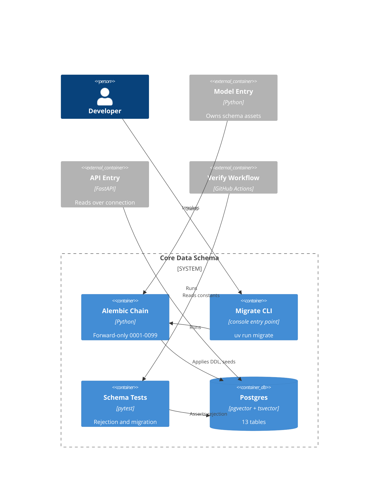

# Implementation Plan: Core Data Schema

**Branch**: `00003-core-data-schema` | **Date**: 2026-07-25 | **Spec**: [spec.md](spec.md)

## Summary

**Goal**: Establish the single-datastore PostgreSQL schema with traceability enforced by constraints and a versioned forecast contract between the offline and serving boundaries.
**Approach**: A forward-only Alembic chain owned by `/src/model`, with cross-table invariants carried by composite foreign keys rather than triggers, and shared constants published in a one-row table so neither Python boundary imports the other.
**Key Constraint**: Exactly four `/src` entries and no boundary-to-boundary dependency (ADR-0010) — which is what forces schema assets into one entry and constants into the database.

## Technical Context

**Language/Version**: Python 3.12 (this epic touches no TypeScript)
**Primary Dependencies**: Alembic, psycopg, SQLAlchemy Core — declared in `/src/model` only
**Storage**: PostgreSQL 16 with `pgvector` and native `tsvector` — single instance, no second datastore
**Testing**: pytest with Hypothesis; `pytest-alembic` for migration properties; integration tests against the Compose `db` service
**Target Platform**: Linux containers under Docker Compose; GitHub Actions service container in CI
**Project Type**: web (four-entry monorepo — `/src/web`, `/src/api`, `/src/model`, `/src/gateway`)
**Project Mode**: brownfield
**Performance Goals**: N/A at this tier — no request path in scope; array reads are subscript lookups by construction
**Constraints**: Forward-only migrations; citation and confidence `NOT NULL`; no deferred check or non-null constraint; no fifth `/src` entry; existing Compose service definitions unchanged
**Scale/Scope**: ~15k chunks, 200 purchase-order lines, ~4k draws per line, effectively one concurrent user

## Instructions Check

*GATE: Must pass before Phase 0 research. Re-check after Phase 1 design.*

**Governing document**: `project-instructions.md` **v1.2.0** · audited 2026-07-26. Recording the audited version is what makes amendment drift detectable at the next gate, per the v1.2.0 Governance clause.

| Gate | Status | Evidence |
|------|--------|----------|
| I. Traceable or It Does Not Ship | PASS | Citation and confidence `NOT NULL`; cited page carried into a composite FK so it cannot disagree with its chunk; document table gives every citation a named referent |
| II. Uncertainty Is the Product | PASS | Full sorted draw array plus day-grid survival array stored; no summary-quantile-only path; residual tail mass explicit |
| III. Precision Over Recall | PASS | Failed extraction recorded as absence, never a partial row; a record cannot join two resolved entities |
| V. Model Extracts, Code Computes | PASS | No model-provider surface; provenance is a storage fact; risk arithmetic deferred to E010 |
| VI / VIII | N/A | No evaluation sets or baselines in scope |
| VII. Publish the Miss | PASS | AD-005's three fixed constants and all eleven disclosed gaps (G-1 … G-11) each carry evidence, a reversal trigger, and a production-scale alternative in `data-model.md`'s scope-decision and gap-disclosure records. The count was ten when this row was written; G-11 was disclosed during implementation, when TR-084's privilege claim turned out to be inert against a single superuser role, and this verdict is restated against eleven rather than left standing on the count it was reached with |
| Technology Stack | PASS | PostgreSQL 16 + pgvector, single instance, matches the declared stack |
| Source Code Layout (ENFORCE_SRC_ROOT) | PASS | All assets under `/src/model`; no fifth entry; entry-local tests stay entry-local (ADR-0013) |
| Testing & Quality Policy | PASS | Two QC categories honoured — lint (Ruff, with `S` rules folded in) and coverage at 80% |
| Data Provenance | PASS | Layer-dependent per v1.2.0: license basis and layer label mandatory on every document row; source, issuing body, and retrieval date required on `REAL` and **rejected** on `SYNTHETIC`; generator identity, seed, generation date, and fixture hashes required on `SYNTHETIC` and rejected on `REAL`. A fabricated issuing body is unrepresentable, not merely discouraged. Beyond that the epic writes only migration-seeded reference data |
| Governance — amendment serialization | PASS | No registered document is amended from this branch. The two `specs/project-plan.md` corrections are recorded as AR-1 below and applied on `main`, per the v1.2.0 clause that a feature branch records the need and does not perform it |
| Governance — registered docs win | PASS | Two project-wide decisions raised as ADR-0012 and ADR-0013 rather than AD rows. TR-052 edits a registered document, which is permitted here because that document is **internally self-inconsistent**: its E003 epic entry already lists ResolvedEntity and the posterior artifacts as E003 key entities while its Shared Data Entities rows credit E009/E007. TR-052 aligns the table to the epic entry — the registered document still wins, against itself |

**Re-check after Phase 1**: PASS — see Compliance Check result reported with this plan.

## Architecture



## Architecture Decisions

Feature-local tradeoffs only. Project-wide decisions are recorded as standalone ADRs and referenced here.

| ID | Decision | Options Considered | Chosen | Rationale |
|----|----------|--------------------|--------|-----------|
| AD-001 | How do integration tests reach PostgreSQL? | Compose `db` service / testcontainers-python / pytest-postgresql | Compose `db` service, CI service container, savepoint rollback | One digest-pinned image in one place; testcontainers duplicates the pin in Python, pytest-postgresql needs local binaries that lack pgvector |
| AD-002 | How are migration properties tested? | Hand-written schema assertions / `pytest-alembic` built-ins / manual runbook | `pytest-alembic` `test_single_head_revision` + `test_upgrade`, plus `alembic check` | Built-ins cover single-head and apply-from-empty directly; `alembic check` catches drift without assertions that rot. Forward-only makes the downgrade built-ins meaningless |
| AD-003 | Where does the security QC tier live? | Separate tier / folded into lint / none | Ruff `S` ruleset inside the existing lint category | Surface is DDL and migrations — no request handling or untrusted input. A third category would breach the two-category policy for near-zero detection |
| AD-004 | How is draw-array sortedness enforced? | Application-side check / immutable helper in a `CHECK` / unenforced | Immutable numeric helper in a named `CHECK` | Sortedness is what makes a percentile a subscript; enforcing it converts a silent wrong answer into a write failure. Numeric comparison is genuinely immutable, unlike a text sort |
| AD-005 | Values for the three unfixed schema constants | Ask per value / adopt informed defaults with a reversal path | Horizon 365 days, draw count 4000, probability-sum tolerance 1e-9 | Draw count matches the architecture document's stated scale; residual tail mass makes a too-short horizon visible rather than silent, and raising it is a forward migration. See Risk Mitigation. Carried into **TR-056**; each value's reversal trigger and production-scale alternative are recorded in data-model.md's scope-decision record |
| — | Embedding model and vector dimension | — | See **ADR-0012** — compact 384-dimension local model, so `EMBEDDING_DIM = 384` and the chunk column is `vector(384)` | Project-wide: binds E006, E008, E014 to one vector space. Chosen against the 400 MB serving envelope already dominated by the reranker; pgvector's HNSW 2000-dimension ceiling constrains any later change |
| — | Schema ownership and constant sharing | — | See **ADR-0013** | Project-wide: every later schema-touching epic inherits it, and it is what lets ADR-0010 stand unamended |

## Data Model Summary

| Entity | Key Fields | Relationships | Notes |
|--------|-----------|---------------|-------|
| `schema_constants` | `singleton` PK with `CHECK(singleton)` | none | Exactly one row, seeded by migration `0002`. Publishes vector dimension, survival horizon, draw count, probability-sum tolerance, anchor-date and percentile conventions (TR-043, TR-047) |
| `document` | `document_id` PK; UK `(document_id, document_type, project_id)` | 1:N `chunk` | Corpus manifest referent with source, issuing body, retrieval date, license basis, REAL/SYNTHETIC. Loaded by E006 (TR-041, TR-046) |
| `chunk` | `chunk_id` PK; UK `(chunk_id, page_number)`; UK `(document_id, ordinal)` | N:1 `document`; 1:N `extracted_value`, `extraction_failure` | Generated weighted `tsvector` (A heading / B part number / C section / D body) + GIN; `vector(EMBEDDING_DIM)` + HNSW cosine. One table serves exact and approximate arms (TR-009–TR-014, TR-038) |
| `field_vocabulary` | `field_name` PK; UK `(field_name, value_kind)` | 1:N `extracted_value`, `extraction_failure` | 22 rows seeded by migration `0005`. Lookup table, not an enum — grows by insert, can retire terms, is a join surface (TR-044) |
| `extracted_value` | `extracted_value_id` PK; UK `(extracted_value_id, source_chunk_count)` | N:1 `chunk` via `(source_chunk_id, cited_page)`; N:1 `field_vocabulary` | Citation, page, confidence `NOT NULL`; confidence inclusive 0–1; canonical text plus optional numeric. **No FK to `purchase_order_line`** (TR-015–TR-018, TR-045) |
| `extracted_value_contributing_chunk` | PK `(extracted_value_id, contributor_ordinal)` | N:1 `extracted_value`; N:1 `chunk` | Contributors 2..N; the anchor value row is contributor 1. Composite FK caps rows at the declared count (TR-018) |
| `extraction_failure` | `extraction_failure_id` PK | N:1 `chunk`; N:1 `field_vocabulary` | Attempted field, source chunk, outcome, repair-attempt count. A value row cannot be partial, so failure is the only representation (TR-019) |
| `purchase_order_line` | `po_line_id` PK; UK `(project_id, po_number, line_number)` | 1:N `lifecycle_event`; deferred N:1 closing event | Frozen `PRJ-###` / `VND-###` / `sha256:`+64hex formats; `need_by_date >= order_date`. Carries the schema's **one** deferrable FK (TR-020–TR-025) |
| `lifecycle_event` | `event_id` PK; UK `(po_line_id, sequence_no)`; UK `(event_id, po_line_id, is_terminal)` | N:1 `purchase_order_line`; self composite FK chains `from_state` | 7 states with one rework loop; `is_terminal` unforgeable via `CHECK` (TR-021, TR-022) |
| `resolved_entity` | `resolved_entity_id` PK; UK `(normalized_manufacturer, normalized_part_number)` | 1:N `resolved_entity_member` | **P2.** Agreement attributes as a text array (TR-034) |
| `resolved_entity_member` | `member_id` PK; UNIQUE `extracted_value_id`; UNIQUE `po_line_id` | N:1 `resolved_entity` CASCADE; XOR to value / line | **P2.** Plain uniqueness prevents a record joining two entities. The only sanctioned value-to-line join; E009 populates (TR-035, TR-045) |
| `forecast_run` | `run_id` PK; UK `(run_id, draw_count, horizon_days)`; partial unique on `is_active` | 1:N `line_posterior` CASCADE | Nine reproducibility fields `NOT NULL`, plus `as_of_date`, `horizon_days`, artifact schema version, byte-serialization name (TR-026, TR-027, TR-032, TR-040, TR-049) |
| `line_posterior` | PK `(run_id, po_line_id)` | N:1 `forecast_run` via `(run_id, draw_count, horizon_days)`; N:1 `purchase_order_line` | **One row holds both arrays**, so the pair cannot half-exist. Sorted draws, day-grid survival, explicit residual tail mass, 32-byte digest. Both lengths enforced against the run row (TR-028–TR-031, SC-025) |

**Detail**: [data-model.md](data-model.md) — 13 tables, 5 immutable helpers, 3 views, 10 migration prefixes, an invariant→mechanism map, and 11 disclosed gaps.

## API Surface Summary

N/A — no API surface. The spec carries no `NEW-API` signal, and it explicitly excludes the fused retrieval statement and read-time risk arithmetic, which E008 and E010 own. This epic delivers only the shapes those queries will read.

## Testing Strategy

| Tier | Tool | Scope | Mock Boundary | Install |
|------|------|-------|---------------|---------|
| Unit | pytest + Hypothesis | Immutable helper functions (sortedness, hash serialization); constants agreement logic | None — pure functions | configured |
| Integration | pytest against the Compose `db` service | Apply-from-empty, idempotence at head, single head, every constraint rejection, index presence, deferred-constraint behaviour at commit | None — real PostgreSQL with pgvector, the same digest-pinned image the app runs | `uv add --group dev --directory src/model pytest-alembic` |
| Security | Ruff `S` ruleset inside the lint category | Credentials in a connection string (S105–S107), SQL built by concatenation (S608) | — | `configured` (enable `S` in `[tool.ruff.lint] select`, with `per-file-ignores` for `S101` under tests) |
| Coverage | coverage 7.15.2 + pytest-cov | `/src/model` schema package, combined repo-wide at `--fail-under=80` | — | Tool configured, **config not**: root `[tool.coverage.run] source` lists only `tests/checks/helpers` and `src/model/src/model/roster`, so the schema package must be added there and to `[tool.coverage.paths]` or the new code is silently uncounted |

## Error Handling Strategy

N/A — no request path, no external service call, and no user-facing error state in scope. The epic's entire error surface is constraint rejection at the storage boundary, which is specified as validation criteria and asserted by the integration tier above.

## Integration Points

| Spec Reference | System/Service | Technical Approach | Contract |
|----------------|----------------|--------------------|----------|
| IP-001 | E001 repository layout | Assets land in the existing `/src/model` entry; no new entry, so the four-entry check is untouched | `tests/checks/test_layout.py` |
| IP-002 | E001 Compose `db` service | Consumed unchanged via `DATABASE_URL`; **no Compose change at all** — migrations run as a console entry point per ADR-0011 | `tests/checks/test_orchestration.py` |
| IP-003 | E001 frozen identifier formats | `PRJ-###`, `VND-###`, and `sha256:`+64hex enforced as named `CHECK` constraints | [data-model.md](data-model.md) |
| IP-004 | E004 migration numbering | `0100`–`0199` reserved; prefix-range check fails a migration outside the owning block | `src/model/tests/schema/test_migration_chain.py` |
| IP-005 | E005 procurement tables | `purchase_order_line` and `lifecycle_event` plus the roster-hash column | [data-model.md](data-model.md) |
| IP-006 | E006 chunk and extraction tables | Chunk, document, field vocabulary, extracted value, extraction failure with page-citation constraints | [data-model.md](data-model.md) |
| IP-007 | E007 forecast contract | `forecast_run` plus the single `line_posterior` row per line-run; composite FK carries draw count and horizon | [data-model.md](data-model.md) |
| IP-008 | E008 retrieval | Weighted `tsvector` + GIN and `vector` + HNSW on one table; both arms query the same rows | [data-model.md](data-model.md) |
| IP-009 | E010 risk reads | Survival array, run-level `as_of_date`, nearest-rank percentiles, active-run pointer; constants read over the connection | [data-model.md](data-model.md) |
| IP-010 | E009 identity resolution | `resolved_entity` + `resolved_entity_member`; candidate-pair and review-queue tables deliberately absent | [data-model.md](data-model.md) |
| IP-011 | E017 criticality override | `purchase_order_line` left extensible; override is additive, no alteration required | [data-model.md](data-model.md) |
| IP-012 | E002 corpus manifest | `document_id` format declared by E003 (lowercase kebab slug, 3–128) because E002 has not frozen its key space — **open obligation**, E002/E006 adopt or E003 amends | data-model.md gap G-9 |
| IP-013 | Embedding-model decision record | ADR-0012 accepted 2026-07-25, fixing `EMBEDDING_DIM = 384`; HNSW 2000-dimension ceiling recorded as a standing constraint on future changes | [ADR-0012](../adrs/0012-embedding-model-and-vector-dimension.md) |
| IP-014 | `/src/api` constants access | Single-row `schema_constants` read over the connection; no import across the boundary | ADR-0013 |

## Risk Mitigation

| Risk (from spec) | Likelihood | Impact | Mitigation | Owner |
|-------------------|------------|--------|------------|-------|
| The schema-constants table drifts from the migrated DDL | M | H | TR-048 agreement test asserts the recorded vector dimension equals the declared column dimension and the recorded tolerance equals the DDL literal; exactly two assertions plus two active-run assertions, run in the integration tier | `src/model/tests/schema/test_constants_agreement.py` |
| The closing-event foreign key may not be expressible as specified | M | M | Both extra referencing columns are generated `STORED`, so the triple is null exactly when the line is open and full-match semantics apply with no partial-match skip. `ON DELETE` must stay `NO ACTION` — PostgreSQL forbids `SET NULL` against generated columns. Plain-column variant and constraint trigger both named as fallbacks | `purchase_order_line` DDL |
| The fixed survival horizon is chosen too short | M | M | Residual tail mass stored explicitly rather than truncated, so the condition is visible in data; horizon recorded on the run row, so raising it is a forward migration plus a refit, not a schema redesign | `forecast_run`, `line_posterior` |
| *(Assumption)* `vector` extension enablable by the migration role | L | H | Migration `0001` runs `CREATE EXTENSION IF NOT EXISTS vector` against the digest-pinned image that already ships it; apply-from-empty test fails loudly if the role lacks privilege | Migration `0001` |
| *(Assumption)* E004 accepts the reserved `0100`–`0199` block | M | M | Prefix-range check fails any migration numbered outside the owning epic's block, so a collision is a build failure rather than a merge surprise | `test_migration_chain.py` |

## Requirement Coverage Map

| Req ID | Component(s) | File Path(s) | Notes |
|--------|--------------|--------------|-------|
| TR-001 | Alembic chain | `src/model/alembic.ini`, `src/model/src/model/schema/env.py` | `upgrade head` from empty |
| TR-002 | Alembic chain | `src/model/src/model/schema/versions/` | Downgrade raises, never a body |
| TR-003 | Alembic chain | `src/model/src/model/schema/env.py` | Version table gives idempotence |
| TR-004 | Migration naming | `src/model/src/model/schema/versions/0001_*.py` … | Prefix over revision id |
| TR-005 | Chain check | `src/model/tests/schema/test_migration_chain.py` | Single head + prefix range |
| TR-006 | Migration `0001` | `.../versions/0001_enable_extensions.py` | `CREATE EXTENSION` |
| TR-007 | Console entry point | `src/model/pyproject.toml` | `[project.scripts] migrate`; ADR-0011 |
| TR-008 | Entry layout | `src/model/pyproject.toml` | Only entry with DB client |
| TR-009 | `chunk` | `.../versions/0004_chunk.py` | All structure metadata |
| TR-010 | `chunk` tsvector | `.../versions/0004_chunk.py` | setweight A–D + GIN |
| TR-011 | `chunk` vector | `.../versions/0004_chunk.py` | `vector(EMBEDDING_DIM)` |
| TR-012 | `chunk` | `.../versions/0004_chunk.py` | Model identity + revision |
| TR-013 | `chunk` indexes | `.../versions/0004_chunk.py` | HNSW present, exact scan available |
| TR-014 | `chunk` constraints | `.../versions/0004_chunk.py` | Four rejection cases |
| TR-015 | `extracted_value` | `.../versions/0006_extraction.py` | Three `NOT NULL` |
| TR-016 | `extracted_value` | `.../versions/0006_extraction.py` | Inclusive 0–1 |
| TR-017 | `extracted_value` | `.../versions/0006_extraction.py` | Composite FK to `(chunk, page)` |
| TR-018 | contributing-chunk table | `.../versions/0006_extraction.py` | Composite FK caps at declared count |
| TR-019 | `extraction_failure` | `.../versions/0006_extraction.py` | Absence, not partial row |
| TR-020 | `purchase_order_line` | `.../versions/0007_procurement.py` | Plus match fields for E009 |
| TR-021 | line + event | `.../versions/0007_procurement.py` | Deferrable FK, generated columns |
| TR-022 | `lifecycle_event` | `.../versions/0007_procurement.py` | Self composite FK chains states |
| TR-023 | `purchase_order_line` | `.../versions/0007_procurement.py` | Date ordering `CHECK` |
| TR-024 | `purchase_order_line` | `.../versions/0007_procurement.py` | Roster-hash format `CHECK` |
| TR-025 | `purchase_order_line` | `.../versions/0007_procurement.py` | Identifier format `CHECK` |
| TR-026 | `forecast_run` | `.../versions/0008_forecast.py` | Nine fields `NOT NULL` |
| TR-027 | `forecast_run` | `.../versions/0008_forecast.py` | Partial unique on active |
| TR-028 | `line_posterior` | `.../versions/0008_forecast.py` | Sortedness helper + composite FK |
| TR-029 | `line_posterior` | `.../versions/0008_forecast.py` | Horizon on run row |
| TR-030 | `line_posterior` | `.../versions/0008_forecast.py` | Residual mass column |
| TR-031 | `line_posterior` | `.../versions/0008_forecast.py` | One row, both arrays |
| TR-032 | `forecast_run` | `.../versions/0008_forecast.py` | Artifact schema version |
| TR-033 | `schema_constants` | `.../versions/0002_schema_constants.py` | Both conventions recorded |
| TR-034 | `resolved_entity` | `.../versions/0010_resolved_entity.py` | P2 |
| TR-035 | `resolved_entity_member` | `.../versions/0010_resolved_entity.py` | Uniqueness on each side |
| TR-036 | Absence check | `src/model/tests/schema/test_table_ownership.py` | Six named tables absent |
| TR-037 | Compose | `docker-compose.yml` | Unchanged entirely — no service added |
| TR-038 | `chunk` tsvector | `.../versions/0004_chunk.py` | Named text-search configuration |
| TR-039 | All migrations | `src/model/tests/schema/test_constraint_audit.py` | Range check ⇒ paired `NOT NULL` |
| TR-040 | `line_posterior` | `.../versions/0008_forecast.py` | Byte serialization named on run |
| TR-041 | `chunk` → `document` | `.../versions/0003_document.py` | Declared key format |
| TR-042 | Test placement | `src/model/tests/schema/` | Entry-local, not repo root |
| TR-043 | `schema_constants` | `.../versions/0002_schema_constants.py` | Six values, one row |
| TR-044 | `field_vocabulary` | `.../versions/0005_field_vocabulary.py` | 22 seeded rows |
| TR-045 | `extracted_value` | `.../versions/0006_extraction.py` | Text + optional numeric, no line FK |
| TR-046 | `document` | `.../versions/0003_document.py` | Manifest-keyed referent |
| TR-047 | `schema_constants` | `.../versions/0002_schema_constants.py` | Read over connection |
| TR-048 | Agreement test | `src/model/tests/schema/test_constants_agreement.py` | Two assertions |
| TR-049 | `forecast_run` | `.../versions/0008_forecast.py` | `as_of_date` `NOT NULL` |
| TR-050 | ADR-0012 | `specs/adrs/0012-*.md` | Gates the chunk migration |
| TR-051 | Constraint audit | `src/model/tests/schema/test_constraint_audit.py` | No deferred check or non-null |
| TR-052 | Amendment request | `specs/00003-core-data-schema/plan.md` | Recorded, not performed (v1.2.0) |
| TR-087 | `document` generator columns | `.../versions/0003_document.py` | SYNTHETIC-only, rejected on REAL |
| TR-053 | Array semantics contract | [data-model.md](data-model.md) | Beyond-horizon answer is `1 - residual_tail_mass`; E010 reads it |
| TR-054 | `extracted_value` | `.../versions/0006_extraction.py` | `double precision`, closed interval, no coarser scale |
| TR-055 | `line_posterior` | `.../versions/0008_forecast.py` | Residual agrees with the survival tail within `1e-9` |
| TR-056 | `schema_constants` seed | `.../versions/0002_schema_constants.py` | 365 / 4000 / 1e-9, with the scope-decision record in data-model.md |
| TR-057 | `document` | `.../versions/0003_document.py` | Manifest key identifies one revision |
| TR-058 | `chunk`, contributing-chunk table | `.../versions/0004_chunk.py`, `.../0006_extraction.py` | One page per chunk; multi-page ⇒ multi-source |
| TR-059 | contributing-chunk table | `.../versions/0006_extraction.py` | Anchor is contributor 1; 2..N in the child table |
| TR-060 | contributing-chunk table | `.../versions/0006_extraction.py` | Ordinal is a stable key, not a precedence order |
| TR-061 | `extraction_failure` | `.../versions/0006_extraction.py` | No-page value ⇒ `missing_citation` failure row |
| TR-062 | `forecast_run` | `.../versions/0008_forecast.py` | Run-granularity provenance; no per-line lineage |
| TR-063 | Constraint audit | `src/model/tests/schema/test_constraint_audit.py` | Rejection is the only outcome; defaults enumerated |
| TR-064 | Reader contract | [data-model.md](data-model.md) gap G-10 | E010's reader refuses on an unrecognised version |
| TR-065 | line + event | `.../versions/0007_procurement.py` | Ordered fallback ladder; shape recorded in the mechanism map |
| TR-066 | `purchase_order_line` | `.../versions/0007_procurement.py` | Open line persists, identifiable as censored |
| TR-067 | line + event | `.../versions/0007_procurement.py` | Deferrable FK carrying the terminal flag |
| TR-068 | `line_posterior` | `.../versions/0008_forecast.py` | Draws are canonical; survival and percentiles derive from them |
| TR-069 | `line_posterior` | `.../versions/0008_forecast.py` | Draw-array length equals the run's draw count |
| TR-070 | Immutable helper | `src/model/src/model/schema/helpers.py` | `fn_is_sorted_ascending` inside a named check |
| TR-071 | `forecast_run` | `.../versions/0008_forecast.py` | `horizon_days` on the run row |
| TR-072 | `line_posterior` | `.../versions/0008_forecast.py` | Survival-array length equals the run's horizon |
| TR-073 | `line_posterior` | `.../versions/0008_forecast.py` | Composite FK carries both lengths from the run |
| TR-074 | `document` | `.../versions/0003_document.py` | One row per source-and-project pair |
| TR-075 | `document` | `.../versions/0003_document.py` | Five provenance columns; license basis per row |
| TR-076 | Agreement test | `src/model/tests/schema/test_constants_agreement.py` | DDL literal governs; the row is the published copy |
| TR-077 | E002/E006 obligation | data-model.md gap G-9 | Acceptance: every manifest key matches the declared format |
| TR-078 | `document` → `chunk` | `.../versions/0003_document.py` | Key-space change cascades; citations untouched |
| TR-079 | Seeded reference data | `.../versions/0002_schema_constants.py`, `.../0005_field_vocabulary.py` | Recovery is re-apply-from-empty; loss is detected, not repaired in place |
| TR-080 | `forecast_run` | `.../versions/0008_forecast.py` | `as_of_date` exposed; no maximum age imposed here |
| TR-081 | `extracted_value` | `.../versions/0006_extraction.py` | Self-reported score, not a calibrated probability |
| TR-082 | `extracted_value` | `.../versions/0006_extraction.py` | Agent identity at ingestion-run granularity (E006) |
| TR-083 | Schema documentation | [data-model.md](data-model.md) | Normative per-column semantics; no undocumented object |
| TR-084 | Provenance tables, role grants | `.../versions/0009_provenance_privileges.py` | Append-only enforced by revoking `UPDATE`/`DELETE` from the application role |
| TR-085 | Provenance tables | [data-model.md](data-model.md) | Retained for the life of the database; dataset regenerable |
| TR-086 | Role grants | `.../versions/0009_provenance_privileges.py` | Migration role keeps remove-and-reload; application role does not |

## Project Structure

### Source Code

```text
+ src/model/alembic.ini
+ src/model/src/model/schema/__init__.py
+ src/model/src/model/schema/env.py
+ src/model/src/model/schema/helpers.py                     immutable SQL helper definitions
+ src/model/src/model/schema/versions/0001_enable_extensions.py
+ src/model/src/model/schema/versions/0002_schema_constants.py
+ src/model/src/model/schema/versions/0003_document.py
+ src/model/src/model/schema/versions/0004_chunk.py
+ src/model/src/model/schema/versions/0005_field_vocabulary.py
+ src/model/src/model/schema/versions/0006_extraction.py              extracted_value + contributing_chunk + extraction_failure + view
+ src/model/src/model/schema/versions/0007_procurement.py             line + event + deferred closing FK, one migration (FK cycle)
+ src/model/src/model/schema/versions/0008_forecast.py
+ src/model/src/model/schema/versions/0009_provenance_privileges.py   revoke UPDATE/DELETE from the application role (P1, OBJ3)
+ src/model/src/model/schema/versions/0010_resolved_entity.py         P2 — last in the chain, so dropping P2 leaves every P1 objective complete
+ src/model/src/model/schema/script.py.mako                           forward-only revision template whose downgrade() raises (TR-002, TR-004)
+ src/model/tests/schema/conftest.py                        DATABASE_URL fixture, savepoint rollback
+ src/model/tests/schema/test_migration_chain.py
+ src/model/tests/schema/test_constants_agreement.py
+ src/model/tests/schema/test_constraint_audit.py
+ src/model/tests/schema/test_chunk.py
+ src/model/tests/schema/test_extraction.py
+ src/model/tests/schema/test_procurement.py
+ src/model/tests/schema/test_forecast.py
+ src/model/tests/schema/test_resolved_entity.py
+ src/model/tests/schema/test_table_ownership.py
~ src/model/pyproject.toml                                  + alembic, psycopg, sqlalchemy, pytest-alembic; Ruff S rules
~ .github/workflows/verify.yml                              + postgres service container for the model entry
~ pyproject.toml                                            (root) coverage source + paths gain the schema package
  specs/adrs/0012-embedding-model-and-vector-dimension.md   DONE — accepted 2026-07-25
  specs/adrs/0013-schema-ownership-in-the-modeling-entry.md DONE — accepted 2026-07-25
  specs/sad.md                                              DONE — catalog rows and baseline entries added
  specs/project-plan.md                                     NOT edited — amendment recorded, applied on main (v1.2.0)
```

**Patterns to reuse**: the `src/<entry>/src/<pkg>/` layout and per-entry `pyproject.toml`; the roster reader's module shape in `src/model/src/model/roster/`; the `tests/checks/helpers/` style of small named helpers behind assertions.
**Tests to extend**: none of E001's cross-entry checks change — the console entry point touches no Compose service, no build context, and no image pin, so orchestration, build-context, image-contents, and supply-chain all pass unmodified.
**Naming conventions**: snake_case modules; tests as `test_*.py` inside the owning entry; Ruff line-length 100, target py312, select `E,F,I,UP,B,SIM` — add `S`.

## Amendment Requests

Recorded by this branch under TR-052 and SC-027. **Applied on `main`** via `.github/skills/amend-project/SKILL.md`. This branch performs none of them — v1.2.0 serializes amendments on the default branch.

> **All four are now discharged**, on `main`, after E003 merged. Per-request status is on each entry below. AR-1, AR-2 and AR-4 were applied as three separate serialized commits, each landing before the next began; AR-3 turned out to need no slot at all. Kept as a record of what was requested and why rather than deleted, so the reasoning survives with the outcome.

### AR-1 — `specs/project-plan.md`, Shared Data Entities table

Two "Introduced by" cells are inconsistent with the same document's own E003 epic entry, which already lists these as E003 key entities:

| Row | From | To |
|---|---|---|
| `ResolvedEntity` | `E009` | `E003 (schema), E009 (populated)` |
| `PosteriorDraws / SurvivalArray` | `E007` | `E003 (schema), E007 (populated)` |

Both "Consumed by" cells unchanged. The convention is the one the `Chunk` row already uses.

**APPLIED** on `main` in `f4f4517`. The `Chunk` row was checked rather than assumed — it reads `E003 (schema), E006 (populated)` — and the diff is exactly the two cells.

### AR-2 — governance gap, Feature Workspace numbering

Workspace prefix `00002` is held by both this epic (E003, `specs/00003-core-data-schema/`) and E002 (`specs/00002-public-corpus-and-manifest/`, referenced from ADR-0011's front matter). v1.2.0 added epic-start claiming for migration numbers and decision-record numbers but not for workspace numbers, and they have already collided under the same parallel-wave pressure that motivated the clause.

Not actionable here — renaming a workspace mid-flight breaks every path in this plan and `tasks.md`. Recorded for a future amendment: *"Feature Workspace numbers are claimed at epic start, exactly as migration and decision-record numbers are."*

**APPLIED** on `main` in `33026f0` as **v1.2.2**, with the clause extended to cover workspace numbers alongside decision-record and migration numbers, plus its ISO-dated changelog row.

Two consequences recorded with it rather than left implicit. First, the bump **superseded v1.2.1, which both then-in-flight epics recorded as their audited version** (E002 and E004), so each carries a re-run obligation for its own next gate under the drift clause. That was disclosed in the commit rather than left for them to discover; discharging it is theirs, not this epic's.

Second — and this one was stated wrongly here and had to be retracted. The original text read: *"E003 remains permanently non-compliant with the rule it asked for — the `00002` collision cannot be undone, because the number is embedded in every path this epic's artifacts cite."* **The collision was subsequently undone**: this workspace was renamed to `00003-core-data-schema`, bringing numbering one-to-one with epic numbers, and `project-instructions.md` v1.2.3 carries the correction.

The claim was reasoning about a *mid-flight* rename — where the reference set keeps growing and live paths break under you — generalised to all cases without re-checking. For a completed epic the opposite holds: the references are finite and enumerable (51 across 16 files, including five test modules that read `data-model.md` through a hard-coded path), and the suite proves the rename landed. Completion makes it the cheap case, not the impossible one.

### AR-3 — `.github/skills/analyze-compliance/SKILL.md`, prior-report handling

The skill says only *"Write the complete analysis report to `FEATURE_DIR/analysis-report.md`"* (line 108) and says nothing about the report already there. Following it literally destroyed information in this epic: the v1.2.0 pass renumbered its findings to a B-series and overwrote all 21 `A-###` rows, while `spec.md`, `.qc-passed` and the report's own Deferred section still cited A-007, A-008, A-011 and A-012 by ID. Four references pointed at nothing and A-012's definition survived only in git history, from which it was recovered.

Recorded for a future amendment: *"When an analysis pass renumbers its finding series, the prior report is archived as `analysis-report-<date>.md` rather than overwritten, whenever any of its finding IDs is cited outside the report. Superseding a verdict does not license deleting the definition of an item still open."*

**APPLIED, and this entry's own premise was wrong.** An earlier revision read *"Nothing in this branch can carry the fix — the skill is project-level, and v1.2.0 serializes amendments on the default branch."* Both halves are false. `.gitignore` excludes `/.github/skills/`, so the file is untracked and absent from `origin/main` entirely: it is local tooling, not a registered document, so it needed no amendment slot, no default-branch ceremony, and no commit. The amendment-serialization clause governs the documents *it* names, and this is not one of them. Classifying a target without checking whether it was even in the repository is the same mistake that produced the overwrite this entry is about.

The rule is now in the skill at its §5 report-writing step, stated with the distinction that matters — superseding a **verdict** is the point of a re-run; deleting the **definition** of a still-open finding is not the same act — and carrying E003's own incident as the worked example. The 21 A-rows were separately restored into `analysis-report.md` with per-row dispositions, so the damage and the rule that allowed it are both closed.

### AR-4 — an ADR for artifact authority direction (analysis finding A-012)

TR-056, TR-065, TR-076 and TR-083 make `data-model.md`, a Plan-phase artifact, normative over Specify-phase requirements. Accepted for E003 with its mitigation recorded in `spec.md` § Compliance Check, but the authority direction is a project-wide architectural question and binding it beyond this epic needs a decision record. ADRs may not be authored from a feature branch, so this is recorded rather than written: *"A Plan-phase artifact may be declared normative over a Specify-phase requirement, under stated conditions and with amendments labelled as corrections carrying their evidence."*

**APPLIED** on `main` in `262fe9b` as [ADR-0017](../adrs/0017-plan-phase-artifact-normative-over-a-specify-phase-requirement.md), written through the ADR Author per the MADR authoring contract, superseding nothing, with its `specs/sad.md` catalog row. It states four testable conditions — a named and bounded scope, amendments labelled as corrections carrying evidence, no amendment adding or removing a named object, and enforcement by test rather than review — and cites E003's four in-flight `data-model.md` corrections as the worked precedent.

It also discloses the limitation this epic's own enforcement carries: `test_table_ownership.py` matches identifiers inside `data-model.md` code spans, so agreement is checked at **name level only** and a constraint whose *definition* drifted while keeping its name would pass. Closing that means comparing `pg_get_constraintdef` against the document; of the four conditions, only the third is machine-checked today.

## Implementation Hints

- **[HINT-001]** Order: ADR-0012 has landed and fixes `EMBEDDING_DIM = 384`, so `0004_chunk.py` declares `vector(384)` and `0002_schema_constants.py` publishes the same number — TR-048 asserts the two agree. The ADR names a model *class* but no pinned revision hash; pin the concrete repository revision before embeddings are generated, and record it per chunk.
- **[HINT-002]** Gotcha: a savepoint-rollback fixture never reaches a real `COMMIT`, so the deferrable closing-event constraint never fires and its test passes vacuously. Wrap the commit in the expectation, or issue `SET CONSTRAINTS ALL IMMEDIATE` to force the violation at a precise point.
- **[HINT-003]** Constraint: `ON DELETE` on the closing-event FK must stay `NO ACTION` — PostgreSQL forbids `SET NULL` and `SET DEFAULT` against generated columns, and both referencing columns are generated `STORED`.
- **[HINT-004]** Gotcha: assert constraint rejection on the psycopg error subclass plus the diagnostic's constraint name and SQLSTATE, never on message text — a generic integrity-error assertion passes when the wrong constraint fires.
