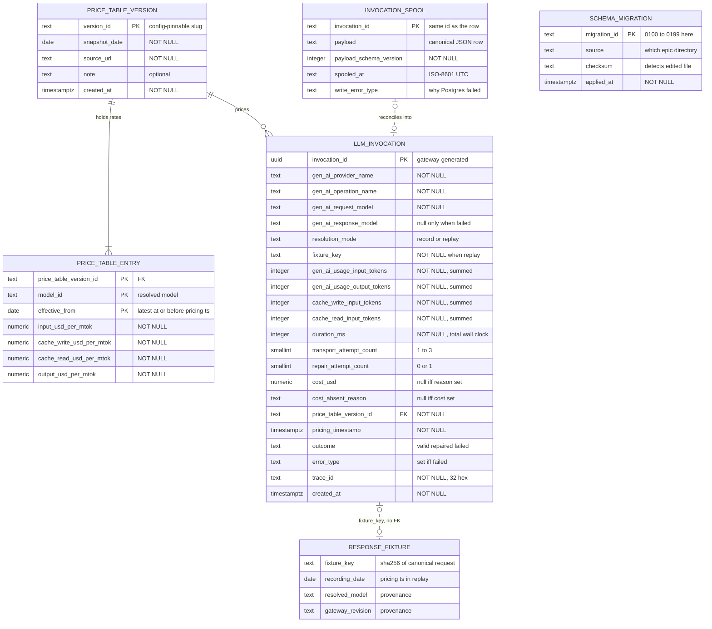

# Data Model — Traced Model Gateway

> Feature: `00004-traced-model-gateway` | Storage: **PostgreSQL 16** (3 tables) + **local SQLite spool** (1 table) | Consumers: E013 (invocation panel, read contract), E003 (shares the runner and the ledger)

## Scope

| Aspect | Position |
|--------|----------|
| Owned by this epic | Exactly three Postgres tables — `llm_invocation`, `price_table_version`, `price_table_entry` — plus one local SQLite table, `invocation_spool`. Nothing else. |
| Out of scope here | **E003 owns the rest of the schema in full** — chunks, procurement records, resolved entities, posterior artifacts. This document defines no column, index, or constraint outside the four tables above, and no migration outside `0100`–`0199`. |
| Owned by E003 | The Alembic configuration, the migration runner, and the revision ledger, all in `/src/model` per {SAD:ADR-0013}. E004 authors revisions into that directory in its reserved `0100`–`0199` prefix block and builds no tooling of its own — see *Migrations*. |
| Not a table | `ResponseFixture` (spec Key Entities) stays a committed on-disk artifact under the gateway's fixture root. It appears in the ER diagram as a non-persisted node because `llm_invocation.fixture_key` joins to it logically and its recording date supplies `pricing_timestamp` in `replay` mode. Its layout is `plan.md`'s to fix, not this document's. |
| Not emitted | No spans, no metrics, and no collector-consumable events (TR-075). The invocation row is this epic's only telemetry sink; the OpenTelemetry convention supplies column *names*, not a pipeline, and no exporter, propagator, or SDK dependency exists. The high-cardinality values — `trace_id` and `fixture_key` as columns, and the schema and template digests, which are fixture-key inputs rather than columns — therefore carry no obligation to appear as metric dimensions, and `span_id` / `parent_span_id` are absent by scope decision rather than by omission. |
| Not computed in the database | Cost is a stored value, never a generated column, and no view performs arithmetic. All cost, duration, and hashing arithmetic lives in pure Python modules behind the computation-boundary contract (TR-028, TR-032, Principle V). The database stores results and enforces shape. |

## Storage Boundaries

| Store | Instance | Holds | Written by | Durability posture |
|-------|----------|-------|-----------|--------------------|
| PostgreSQL 16 | E001's `db` service; one instance, no second datastore | `llm_invocation`, `price_table_version`, `price_table_entry` | The gateway, on its own connection, in a transaction independent of any caller's (TR-035) | Authoritative. A row's presence here is the definition of "recorded". |
| SQLite | One file under the gateway's own root, WAL journal, `synchronous=FULL` | `invocation_spool` | The gateway, only when the Postgres write failed after a provider request was issued (TR-041) | Transient. Holds a record for at most as long as Postgres is unreachable. |
| Filesystem | Gateway fixture root, committed | `ResponseFixture` and its provenance record (TR-033) | `record` mode only | Committed to the repository; not a datastore. |

The SQLite spool is a second *file*, not a second *datastore* in the sense ADR-0002 forbids: it holds no queryable product data, is never read by the application, has no schema E013 or any other epic sees, and is empty in steady state. Its existence is disclosed here rather than treated as an implementation detail, because it is the one place a billed invocation's record can live outside Postgres.

## Entities

| Entity | Attributes (name: type, constraints) | Relationships | State Transitions |
|--------|--------------------------------------|---------------|-------------------|
| **llm_invocation** | `invocation_id: UUID` PK, gateway-generated (never a database default); `gen_ai_provider_name: TEXT` NOT NULL; `gen_ai_operation_name: TEXT` NOT NULL; `gen_ai_request_model: TEXT` NOT NULL; `gen_ai_response_model: TEXT` NULL, `CHECK(outcome='failed' OR gen_ai_response_model IS NOT NULL)`; `resolution_mode: TEXT` NOT NULL `CHECK(IN ('record','replay'))`; `fixture_key: TEXT` NULL, `CHECK(~ '^sha256:[0-9a-f]{64}$')`, `CHECK(resolution_mode<>'replay' OR fixture_key IS NOT NULL)`; `gen_ai_usage_input_tokens: INTEGER` NOT NULL `CHECK(>=0)`; `gen_ai_usage_output_tokens: INTEGER` NOT NULL `CHECK(>=0)`; `cache_write_input_tokens: INTEGER` NOT NULL `CHECK(>=0)`; `cache_read_input_tokens: INTEGER` NOT NULL `CHECK(>=0)`; `duration_ms: INTEGER` NOT NULL `CHECK(>=0)`; `transport_attempt_count: SMALLINT` NOT NULL `CHECK(BETWEEN 1 AND 3)`; `repair_attempt_count: SMALLINT` NOT NULL `CHECK(BETWEEN 0 AND 1)`; `cost_usd: NUMERIC(18,10)` NULL `CHECK(>=0)`; `cost_absent_reason: TEXT` NULL `CHECK(IN ('no_covering_price_entry','model_unresolved','cost_out_of_range'))`, `CHECK((cost_usd IS NULL) <> (cost_absent_reason IS NULL))`; `price_table_version_id: TEXT` NOT NULL FK→`price_table_version.version_id` ON DELETE RESTRICT ON UPDATE RESTRICT; `pricing_timestamp: TIMESTAMPTZ` NOT NULL; `outcome: TEXT` NOT NULL `CHECK(IN ('valid','repaired','failed'))`; `error_type: TEXT` NULL `CHECK((outcome='failed') = (error_type IS NOT NULL))`; `trace_id: TEXT` NOT NULL `CHECK(~ '^[0-9a-f]{32}$')` `CHECK(<> '0'*32)`; `created_at: TIMESTAMPTZ` NOT NULL, gateway-generated | references 1 `price_table_version`; logically joins 0..1 `ResponseFixture` by `fixture_key` (no FK — the fixture is a file); mirrored 1:1 by `invocation_spool` only while a write is outstanding | `(absent) → Committed` — terminal. Never updated, never deleted (TR-055) — **held by convention and code review, not by a database rule**; disclosed here as uncovered rather than presented as enforced. Spool detour: `(absent) → Spooled → Committed`. See *State & Lifecycle*. |
| **price_table_version** | `version_id: TEXT` PK `CHECK(~ '^[a-z0-9]+(-[a-z0-9]+)*$')`; `snapshot_date: DATE` NOT NULL; `source_url: TEXT` NOT NULL; `note: TEXT` NULL; `created_at: TIMESTAMPTZ` NOT NULL | has_many: `price_table_entry` (1:N, ≥1); referenced by every `llm_invocation` (1:N) | `(absent) → Published` — terminal. Append-only: a version is added, never edited or deleted (TR-055). **Enforcement, stated where the claim is made**: convention and code review, plus `ON DELETE RESTRICT ON UPDATE RESTRICT` on both inbound FKs (TR-046). No trigger, rule, or revoked grant — the gateway connects as the schema owner. Disclosed as uncovered, not presented as enforced. |
| **price_table_entry** | PK (`price_table_version_id`, `model_id`, `effective_from`); `price_table_version_id: TEXT` NOT NULL FK→`price_table_version.version_id` ON DELETE RESTRICT ON UPDATE RESTRICT; `model_id: TEXT` NOT NULL; `effective_from: DATE` NOT NULL; `input_usd_per_mtok: NUMERIC(12,6)` NOT NULL `CHECK(>=0)`; `cache_write_usd_per_mtok: NUMERIC(12,6)` NOT NULL `CHECK(>=0)`; `cache_read_usd_per_mtok: NUMERIC(12,6)` NOT NULL `CHECK(>=0)`; `output_usd_per_mtok: NUMERIC(12,6)` NOT NULL `CHECK(>=0)` | belongs_to: `price_table_version`; several entries may share one `model_id` within a version, distinguished by `effective_from` | `(absent) → Published` — terminal. Append-only with its version (TR-055); a rate change is a new version, never an edit to this row. **Enforcement**: as for `price_table_version` — convention, code review, and the restrictive referential actions; disclosed as uncovered. |
| **invocation_spool** *(SQLite, local)* | `invocation_id: TEXT` PK — the same UUID the Postgres row will carry; `payload: TEXT` NOT NULL — canonical JSON of the full `llm_invocation` row; `payload_schema_version: INTEGER` NOT NULL — the shape `payload` was written under; a drain reconciles only versions it understands and **retains** an unrecognised one as a loud error rather than reading it under a different shape or discarding it (TR-054), so a spool written before a gateway upgrade has a defined outcome; `spooled_at: TEXT` NOT NULL — ISO-8601 UTC; `write_error_type: TEXT` NOT NULL — why the Postgres write failed | 1:1 with the `llm_invocation` row it is waiting to become; no foreign keys (different database) | `Spooled → Reconciled → Deleted`. `Reconciled` is not a stored column — see *State & Lifecycle*. |

Indexes on `llm_invocation`: `(created_at DESC)` for E013's panel ordering, `(trace_id)` for trace lookup. No index on `price_table_version_id` — its only purpose would be to accelerate the delete-time and update-time FK checks of TR-046, and neither price table is ever deleted from or re-identified. `price_table_entry`'s primary-key index already serves the TR-039 lookup (`WHERE version = ? AND model_id = ? AND effective_from <= ? ORDER BY effective_from DESC LIMIT 1`), since its leading columns match; no secondary index is added.

`invocation_id` is `uuid4`, not a time-ordered UUID: Python 3.12's standard library has no `uuid7`, and pulling one in would breach SC-013's "exactly one added runtime distribution" budget. Ordering is served by the `created_at` index instead.

## Column Detail — `llm_invocation`

Nullability is the load-bearing part of this table: every `NOT NULL` here is a claim that the value cannot be unknown at write time, and every nullable column is a claim that it can. Both directions are stated.

| Column | Null? | Why | Source |
|--------|-------|-----|--------|
| `invocation_id` | NOT NULL (PK) | The reconcile key **and the uniqueness key behind TR-011**. Must be generated in the gateway process *before* the Postgres write is attempted, so the spooled copy and the eventual row share one identity — a `DEFAULT gen_random_uuid()` would mint a second id at reconcile time and break `ON CONFLICT DO NOTHING` idempotency. A primary key alone would only exclude duplicate *identifiers*; what excludes a second row *describing one invocation* is TR-045's rule that exactly one identifier is minted per invocation and reused unchanged by every write and reconcile of it, so no second identifier exists for a second row to carry. | TR-041, TR-045, SC-021 |
| `gen_ai_provider_name` | NOT NULL | Known from configuration before any request is built; there is no path on which an invocation has no provider. | TR-012 |
| `gen_ai_operation_name` | NOT NULL | Supplied by the caller on the gateway-owned request; the request cannot be constructed without it. Values are drawn from the pinned convention's enumeration and are deliberately **not** `CHECK`-constrained — that value set moves with the pin, and pinning it in DDL would make a pin bump a migration. | TR-012, TR-013 |
| `gen_ai_request_model` | NOT NULL | The requested name is an input, always known. | TR-012 |
| `gen_ai_response_model` | **NULL allowed** | The provider only resolves a model when it answers. An invocation that exhausts its transport budget without a response has no resolved model. Constrained rather than free: `CHECK(outcome='failed' OR gen_ai_response_model IS NOT NULL)` makes absence possible **only** on the failure path, which is exactly what OBJ3 VC8 asserts for successful rows. | TR-012, OBJ3 VC8 |
| `resolution_mode` | NOT NULL | Selected explicitly by configuration with no default (TR-021), so it is known before the first attempt. This column, alone, separates replayed rows from live ones with no inference. | TR-037, OBJ3 VC11 |
| `fixture_key` | **NULL allowed** | Conditional: `NOT NULL` when `resolution_mode='replay'` (a replay resolved *from* a fixture, so a key exists by construction), enforced by `CHECK`. In `record` mode the key is populated once the fixture is written and is NULL when the invocation failed before a fixture existed. | TR-037, OBJ3 VC11 |
| `gen_ai_usage_input_tokens` | NOT NULL | Zero is a meaningful value (no attempt reported usage); unknown is not. Summed across every transport and repair attempt. An attempt that returns no response body contributes zero to the sum rather than leaving the term undefined (TR-056). In `replay` mode the counts come from the fixture's provenance record (TR-033, TR-056), so a replayed cost is reproducible. | TR-012, TR-040, TR-056 |
| `gen_ai_usage_output_tokens` | NOT NULL | Same. | TR-012, TR-040 |
| `cache_write_input_tokens` | NOT NULL | Same. Kept as its own column rather than folded into input tokens, because the provider reports it outside that count and bills it at a different multiplier — folding it in silently corrupts every recomputed cost (research: *Invocation record and cost as versioned code*). | TR-012, TR-015 |
| `cache_read_input_tokens` | NOT NULL | Same. | TR-012, TR-015 |
| `duration_ms` | NOT NULL | Total wall clock across every attempt, measured by the gateway from a monotonic clock. **Interval, fixed by TR-056**: starts when the gateway begins the first attempt, stops when it reaches the terminal outcome. Validation, retry backoff, and repair-prompt construction are therefore *inside* the interval; the record write is *outside* it, and must be, since the value has to be known before the row is written. In `replay` mode it measures the replay execution, not the original recording. Integer milliseconds, not a float second — the value feeds the duration function's property-based tests, and binary float would make equality assertions platform-sensitive. This column is the one the spec calls "latency" in TR-012; `latency_ms` is not a name used anywhere in this schema. | TR-012, TR-040, TR-056 |
| `transport_attempt_count` | NOT NULL | `≥1` because a row exists only if at least one provider request or fixture lookup happened; `≤3` is TR-010's budget (1 attempt + 2 retries). A fixture lookup counts as one transport attempt — carried by TR-056 as a requirement, so the lower bound holds on `replay` rows without inference from the Glossary. | TR-010, TR-012, TR-056 |
| `repair_attempt_count` | NOT NULL | `0` or `1` — TR-007 caps repair at one. Zero is the common case, not an unknown. Together with the transport count this is the *only* per-attempt information stored; no attempt-level row or attempt-level outcome value exists anywhere. | TR-007, TR-042 |
| `cost_usd` | **NULL allowed** | TR-016 requires absence to be representable and forbids substituting zero. `NUMERIC`, never `double precision`: SC-006 asserts that recomputation reproduces the stored cost *exactly*, and binary floating point cannot carry that claim. **Range**: `NUMERIC(18,10)` represents `0` to `99 999 999.999 999 9999` USD. The bound is reachable only from a defective rate or token count (`INTEGER` tokens times a `NUMERIC(12,6)` rate can exceed it arithmetically), so the outcome is defined rather than left to the driver: the cost function raises before the write and the row is recorded with cost absent and reason `cost_out_of_range` (TR-049), never truncated, rounded into range, or stored as a different figure. Currency is USD and is carried by the value's definition rather than a column — see the price-table note on `_usd_per_mtok`. | TR-014, TR-016, TR-049 |
| `cost_absent_reason` | **NULL allowed** | The other half of the same pair. `CHECK((cost_usd IS NULL) <> (cost_absent_reason IS NULL))` makes "absent with a stated reason" the only representable form of absence — a NULL cost with no reason is rejected by the database rather than caught in review. The domain is closed at three values and the set is closed over every path on which a row exists: `no_covering_price_entry`, `model_unresolved`, `cost_out_of_range`. A pinned version that resolves to no row at all is **not** a fourth value — TR-048 refuses it as a configuration error before any request is constructed, so it never reaches a row (see *Row-existence precondition*). | TR-016, TR-048, TR-049, OBJ3 VC3 |
| `price_table_version_id` | NOT NULL | The pinned version is configuration, known before the call, and known even when no entry inside it covers the model. Recording it is what keeps a historical cost recomputable after rates change; without it the stored figure is unauditable. FK with `ON DELETE RESTRICT ON UPDATE RESTRICT` (TR-046) — the price tables are append-only, and `version_id` is a mutable natural key by type, so both actions are stated: deletion and re-identification are each an error rather than a silent orphaning or a silent re-pointing of every historical cost. **Resolvability**: TR-048 requires the pinned version to resolve to an existing row *before* any provider request is constructed, so an unresolvable pin is a configuration error on an invocation that never billed, not a non-null-FK write failure after one did. | TR-012, TR-014, TR-039, TR-046, TR-048 |
| `pricing_timestamp` | NOT NULL | The instant the price entry was resolved against: `created_at` in `record` mode, the fixture's recording date in `replay`. **Widening, fixed by TR-057**: the fixture's recording date is a date, and it is stored as midnight UTC of that date — the conversion is stated rather than left to whatever the driver does with a bare date, so a replayed invocation resolves one entry. The comparison against `effective_from` is made as UTC calendar dates (CD-1). Stored rather than derived, because deriving it in `replay` would require reading the fixture file — which is not "recoverable from the stored row". See *Disclosed Divergences* D-1. | TR-043, TR-057 |
| `outcome` | NOT NULL | Every invocation is classified as exactly one of `valid`, `repaired`, `failed`. `TEXT` with a `CHECK` rather than a native `ENUM`: `CREATE TYPE` has no `IF NOT EXISTS` form in PostgreSQL 16, so an enum type is the one DDL object that resists a re-runnable migration file; and E013 reads the enumeration as a contract, which a `CHECK` exposes without type introspection. | TR-009, TR-042, IP-005 |
| `error_type` | **NULL allowed** | Biconditional with outcome: `CHECK((outcome='failed') = (error_type IS NOT NULL))`. Populated on the failure path, absent otherwise. The stricter biconditional is chosen over a one-way implication so E013 can read "row has an error type" as "invocation failed" with no further predicate; the cost is that a transient transport error on a row that ultimately succeeded is not retained. Nothing in the spec asks for it, and retaining it would make `error_type` mean two different things. Values are the normalized gateway error classes (`validation_failed`, `transport_failed`, `deadline_exceeded`), never a provider exception name or message. | TR-012, TR-025, OBJ3 VC8 |
| `trace_id` | NOT NULL | TR-031 names the non-null column constraint directly: a record must never be untraceable to the request that caused it. The gateway generates one when the caller supplies none, so there is no path on which it is unknown. Format-checked as 32 lowercase hex (W3C trace-context trace-id) and rejected when all-zero, which that specification defines as invalid — a NOT NULL that admits `"0"*32` enforces presence without enforcing meaning. **Refusal point, fixed by TR-047**: the `CHECK` is a backstop, not the primary gate. A caller-supplied identifier is validated against the same domain at the gateway boundary *before any provider request is constructed*, so a caller's malformed identifier is an argument error on an invocation that never billed — rather than a constraint violation on the write path, which would fail-close an invocation after the provider was already paid. **Propagation and its disclosed limit (TR-080)**: the identifier arrives as an explicit optional field on the gateway-owned request — never from ambient context, a context variable, or an inbound header — and the column does **not** distinguish a caller-supplied identifier from a generated one, since distinguishing them by shape would break the single value domain and a provenance flag would sit outside TR-012's closed list. The fact that an invocation joined no external trace is therefore not recoverable from the row; disclosed rather than presented as available, reversible under TR-069. | TR-031, TR-047, TR-080, OBJ3 VC5, SC-015 |
| `created_at` | NOT NULL | Gateway-generated, **not** `DEFAULT now()`. A default would stamp a spooled row with its reconcile time rather than its invocation time, making latency and cost analysis wrong by exactly the length of the outage — and would break TR-043, since `pricing_timestamp` equals `created_at` in `record` mode and pricing was already resolved before the write. | TR-012, TR-041, TR-043 |

**Row-existence precondition.** A row exists if and only if a provider request was issued or a fixture was resolved — TR-011's stated denominator. Invocations that fail earlier write nothing and are outside every 100% claim in this epic: a `replay` miss (TR-022), a `replay` run with a credential present (TR-023), an absent mode selection (TR-021), `record` mode without its separate opt-in or without a credential (TR-027, OBJ6 VC3), a pinned price-table version that resolves to no row (TR-048), and a caller-supplied trace identifier outside its value domain (TR-047). Each of those fails before any request is constructed, so there is no invocation to record. Stating this here keeps SC-005's "100% of invocations produce exactly 1 stored row" from being read as a claim about calls that never happened.

## Column Detail — price tables

| Column | Null? | Why |
|--------|-------|-----|
| `price_table_version.version_id` | NOT NULL (PK) | Human-readable and configuration-pinnable (e.g. `2026-07-25-anthropic-published`). A surrogate integer would make the config pin unreadable and a diff of the pin uninformative. Slug-shaped by `CHECK`. |
| `price_table_version.snapshot_date` | NOT NULL | The date the published rates were captured — required at requirement level by TR-081, not only by this column. Distinct from `price_table_entry.effective_from`: one snapshot can legitimately contain several effective-from rows for one model, including a scheduled future change. Conflating the two would make TR-039's within-version lookup impossible to express, and neither may be substituted for the other. |
| `price_table_version.source_url` | NOT NULL | Provenance for a figure the product publishes, required by TR-081. Principle I forbids an unattributable number; a rate table whose origin is not recorded makes every derived cost unattributable one hop up. A version whose source is unrecorded is neither seeded nor pinnable. |
| `price_table_version.note` | NULL allowed | Free text (what changed and why the snapshot was taken). Genuinely optional; absence carries no meaning. |
| `price_table_version.created_at` | NOT NULL | When the row was inserted, as opposed to when the rates were published. Both are needed to audit a seeded table. |
| `price_table_entry.*` PK triple | NOT NULL | `(version_id, model_id, effective_from)` is the natural key. Making it the primary key is what makes TR-039's selection *deterministic*: two rows for one model on one date inside one version would make "the latest effective-from at or before the timestamp" ambiguous, and no application-side tie-break could be principled. The database refuses to represent the ambiguity. |
| the four rate columns | NOT NULL | All four billing classes are always present in the provider's published table; a missing class is a data error, not a zero rate. `NUMERIC(12,6)` — decimal scale 6, fixed by TR-049 rather than left to this document, per the exactness argument for `cost_usd`. `CHECK(>=0)` because a negative rate is never valid and would silently produce a negative cost. Units and currency are fixed in the column names (`_usd_per_mtok`) rather than a separate currency column; TR-049 carries United States dollars as a requirement-level rule rather than leaving it to the naming, and encoding it in the name additionally means a second currency cannot be added without a visible schema change. |
| `price_table_entry.model_id` | NOT NULL | Matched by exact, case-sensitive equality against `llm_invocation.gen_ai_response_model` (TR-057). No normalization, casefolding, prefix match, or nearest-model fallback exists on the lookup path — the prohibition on nearest-match in TR-016 is the negative half; exact case-sensitive equality is the positive half, and both are needed for the lookup to be decidable. |
| `price_table_entry.effective_from` | NOT NULL | A `DATE`, compared against `pricing_timestamp` as UTC calendar dates (CD-1, TR-057). The zone is stated because it decides which side of a boundary an invocation falls on, and a `TIMESTAMPTZ`-to-`DATE` cast in PostgreSQL otherwise resolves against the session `TimeZone` setting — a value neither this document nor the migration controls. |

## Field Naming Alignment (TR-013)

**Transform, forward-only (TR-073).** An OpenTelemetry generative-AI attribute maps to a column by lowercasing and replacing `.` with `_`: `gen_ai.request.model` → `gen_ai_request_model`. The transform is mechanical so the OBJ3 VC7 check can apply it without a hand-kept list — but it is **not invertible**, because several convention attributes carry underscores inside their own segments (`gen_ai.usage.input_tokens`), so a column name does not determine the attribute it came from. The check therefore runs in one direction only: transform every attribute the pinned version defines and compare the results against the column set; never reconstruct an attribute from a column. Two attributes transforming to one column name is a build failure, not an ambiguous match.

**Pin (TR-070).** The pinned convention version is **`1.37.0`** — a concrete version rather than a configuration key with no value, so OBJ3 VC7 compares against a fixed referent. It is chosen as the version carrying `gen_ai.provider.name` under that spelling. The value is recorded in exactly three places that must agree, and the check asserts their agreement: gateway configuration as `otel_genai_semconv_version`, a `COMMENT ON TABLE llm_invocation` mirror so a database inspected without the repository still states which version its column names follow, and TR-070 itself. The implementing task verifies that the pin is a published release defining every attribute classified Convention-named below, and corrects TR-070 and this table together if it is not. These attributes are not stable, which is why the pin exists at all.

**Correction of 2026-07-26 (T026), recorded rather than applied silently.** The pin read `1.36.0`, and the verification this document demands found that release does **not** define `gen_ai.provider.name` — it defines `gen_ai.system`, which `v1.37.0` marks deprecated and *replaced by* `gen_ai.provider.name`. The pin's own stated selection reason was therefore false of the version it named, and OBJ3 VC7 would have failed against it. Corrected to `1.37.0`, the first release satisfying the criterion; a later release would have been a larger change than the evidence calls for. Verified in the same pass, against the published `v1.37.0` registry:

| Attribute | Present in 1.37.0 | Note |
|---|---|---|
| `gen_ai.provider.name` | yes | The rename this pin exists to resolve |
| `gen_ai.operation.name` | yes | — |
| `gen_ai.request.model` | yes | — |
| `gen_ai.response.model` | yes | — |
| `gen_ai.usage.input_tokens` | yes | — |
| `gen_ai.usage.output_tokens` | yes | — |
| `error.type` | yes, and marked **Stable** | General attribute registry of the same release. Its stability is what TR-072's Stable class for `error_type` rests on, so it was checked rather than assumed |
| *any cached / cache-read input-tokens attribute* | **no** | Checked in both `1.36.0` and `1.37.0`. `cache_read_input_tokens` therefore **stays Gateway-local** — the row below anticipated a move and the move does not happen at this pin |

| Column | Classification | Note |
|--------|----------------|------|
| `gen_ai_provider_name` | Convention-named | The attribute identifying the provider. **Pin-sensitive**: this attribute was renamed across recent convention versions, so the implementing task must read the pinned document and take its spelling — the column name follows the pin, not this document. |
| `gen_ai_operation_name` | Convention-named | — |
| `gen_ai_request_model` | Convention-named | — |
| `gen_ai_response_model` | Convention-named | — |
| `gen_ai_usage_input_tokens` | Convention-named | — |
| `gen_ai_usage_output_tokens` | Convention-named | — |
| `error_type` | Convention-named | From the general (non-gen-AI) attribute registry, `error.type` — **its own pinned source**, the general attribute registry shipped with the same `1.37.0` release, verified present and *Stable* there, named rather than inherited silently from the gen-AI pin (TR-071). |
| `trace_id` | Convention-named | A first-class span field rather than an attribute; spelled as the specification spells it. **Its own pinned source**: W3C Trace Context **Level 1** (W3C Recommendation), which is where both the 32-lowercase-hex domain and the invalidity of the all-zero value come from (TR-071, TR-047). |
| `cache_write_input_tokens` | Gateway-local | The convention has no cache-write token attribute at any version considered; the name mirrors the provider's own reporting. |
| `cache_read_input_tokens` | Gateway-local | **Pin-sensitive in the other direction**: recent convention versions add a cached-input-tokens attribute. If the pinned version defines one, this column MUST take that spelling and move to the convention-named set. The task must check rather than inherit this row. |
| `duration_ms` | Gateway-local | The convention expresses operation duration as a *metric* in seconds, not a span attribute, so there is no attribute spelling to match. Integer milliseconds, per the column-detail rationale. **One name only**: `duration_ms` is the name of TR-012's "latency" field in the schema, in the plan's data-model summary, and in the E013 read contract. `latency_ms` is not a name in this feature; a reference to it is a defect to correct, not a synonym. |
| `invocation_id`, `resolution_mode`, `fixture_key`, `transport_attempt_count`, `repair_attempt_count`, `cost_usd`, `cost_absent_reason`, `price_table_version_id`, `pricing_timestamp`, `outcome`, `created_at` | Gateway-local | No convention attribute covers them; they encode this epic's own semantics. |

**Naming rule, normative (TR-071).** Where the pinned version defines an attribute for a recorded field, the column MUST use that attribute's transformed spelling; where it does not, the column is gateway-local and carries no `gen_ai_` prefix, so the prefix itself is a reliable signal of which set a column belongs to. The classification above records the current determination; the OBJ3 VC7 check is the enforcement, and a mismatch fails the build.

**Stability class (TR-072).** A second, distinct axis: provenance says where a name came from, stability says how likely it is to change and what happens when it does.

| Class | Fields | Meaning |
|-------|--------|---------|
| Stable | every Gateway-local column except `cache_read_input_tokens`, plus `error_type` and `trace_id` | The spelling changes only through the read-contract procedure of TR-069. The two convention-sourced members are here because their own upstream sources carry stability guarantees the gen-AI set does not. |
| Development | every `gen_ai_`-prefixed column, plus `cache_read_input_tokens` | The upstream convention guarantees no attribute-key stability, so a pin bump may rename the field — or, for `cache_read_input_tokens`, move it into the Convention-named set. A consumer must not hard-code one of these names without reading this class first. |

**Pin bump procedure (TR-074).** Since no data exists yet, a pin-driven rename is a cheap edit to migration `0102` rather than a data migration — but only until the first row lands. Once one has, the procedure is: apply the rename as a column rename in a **new higher-numbered migration** (editing an applied file is refused by TR-050's checksum rule and would not migrate rows anyway); update `otel_genai_semconv_version`, the `COMMENT ON TABLE` mirror, and TR-070's recorded version in the same change; update the classification table and the stability class for every field touched; and take the change through TR-069 as a read-contract change, which requires E013's agreement for a rename. Adding the new column and leaving the old one in place is forbidden — it would put a column outside TR-012's closed list (TR-068).

## Cost Determinism

Three rules, all of which the property-based tests behind SC-006 and SC-017 assert directly.

| ID | Rule | Requirement |
|----|------|-------------|
| CD-1 | **Lookup.** Resolve within `price_table_version_id` only. Select the `price_table_entry` whose `model_id` equals `gen_ai_response_model` under exact, case-sensitive equality and whose `effective_from` is the latest at or before `(pricing_timestamp AT TIME ZONE 'UTC')::date`. The zone is named because a bare `pricing_timestamp::date` resolves against the session `TimeZone`, which would let one row price differently on two machines. Never consult another version, never fall back to a nearest or case-normalized model. Determinism rests on `(version, model_id, effective_from)` being unique (VR-010), not on the `ORDER BY … LIMIT 1` — with a duplicate representable, the ordering would break a tie arbitrarily. Zero matching rows → cost absent with reason `no_covering_price_entry`. `gen_ai_response_model IS NULL` → cost absent with reason `model_unresolved`. A `price_table_version_id` that resolves to no version is not a lookup outcome at all — TR-048 refuses it before the request is built. | TR-039, TR-016, TR-048, TR-057 |
| CD-2 | **Arithmetic.** `cost = (in × input_rate + cw × cache_write_rate + cr × cache_read_rate + out × output_rate) / 1 000 000`, evaluated in exact decimal, **summed at full precision and quantized once at the end** to 10 decimal places, `ROUND_HALF_EVEN`. Per-term quantization produces a different figure and is a defect, not a variant — the ordering is part of the contract the tests assert, not an implementation choice. The same ordering governs a multi-attempt invocation: the four token counts are summed across attempts *first*, then priced and quantized once — SC-017's "total spend" is this figure, never a sum of separately quantized per-attempt costs. Scale, rounding mode, and ordering are all carried by TR-049 rather than by this table alone. | TR-014, TR-049, SC-006, SC-017 |
| CD-3 | **Round-trip.** The stored value and the recomputed value are compared as exact decimals at scale 10. Neither the driver's read path nor the test may pass the value through a binary float at any point; `NUMERIC` in, `Decimal` out. This is what makes SC-006's "exactly" decidable rather than a matter of tolerance. | TR-014, TR-049, SC-006 |
| CD-5 | **Range.** A computed cost outside `NUMERIC(18,10)`'s representable range raises in the pure cost function, before the write, and the row is recorded with `cost_usd` NULL and `cost_absent_reason = 'cost_out_of_range'`. It is never truncated, never rounded into range, and never stored as a different figure. Reachable only from a defective rate or token count, but representable, so its outcome is decided rather than left to the driver. | TR-049, TR-016 |

`pricing_timestamp` is set at write time by CD-4: `created_at` in `record` mode, the fixture's recorded recording date in `replay` mode — a `DATE` widened to midnight UTC of that date, so the widening is specified rather than inherited from a driver default (TR-057). This is what makes OBJ3 VC15 hold — one fixture replayed on either side of an `effective_from` boundary inside the pinned version yields one cost, because the replay date never enters the lookup (TR-043).

## Migrations

| Number | File | Applies |
|--------|------|---------|
| — | (E003-owned) | Alembic's own version table, created and maintained by E003's runner. Outside every epic's prefix block. Shape is E003's to fix, not this document's. Original text: `CREATE TABLE IF NOT EXISTS` before any numbered file runs, outside both claimed ranges, because it is shared with E003 and belongs to neither. `source` distinguishes the two migration directories; `checksum` detects a file edited after it was applied, which is how forward-only is enforced rather than merely intended. |
| `0100` | `0100_price_table_version.py` | `price_table_version` |
| `0101` | `0101_price_table_entry.py` | `price_table_entry` (FK target must exist first) |
| `0102` | `0102_llm_invocation.py` | `llm_invocation` and its two indexes (FK target must exist first) |
| `0103` | `0103_seed_price_table.py` | Seed version + entries for the pinned model, inserted with `ON CONFLICT DO NOTHING` |

- **Prefix block.** Every revision this epic authors matches `^01[0-9]{2}_`. Alembic does not enforce block ownership, so a check asserts it (TR-051), together with a single-head assertion: every filename in E003's directory is inside `0001`–`0099`, and no `migration_id` collides across the two configured source directories (TR-018, OBJ3 VC6, SC-015). **Absent directory.** E003's source directory does not exist yet. The check reports it as *not present* and skips that half rather than failing or silently passing, so the `0001`–`0099` enforcement point is named now and engages the moment the directory lands — its absence is visible in the check's own output rather than assumed.
- **SC-015's denominator.** SC-015 counts the revisions this epic authors inside E003's directory. The `schema_migration` ledger is outside it: it carries no migration number, is created by the runner rather than applied as a migration, and belongs to neither epic. E003's `0001`–`0099` sequence is also outside it, recorded in the same ledger under a different `source`. Without the stated denominator, "100% of applied migration numbers fall within `0100`–`0199`" would be false by construction the moment E003 merges.
- **Idempotency.** Defined by an observable postcondition, not by the runner's exit code (TR-050): after a second run, the ledger rows and the information schema are identical to their state after the first. Primary mechanism is the ledger — an applied `migration_id` is skipped. Each file is additionally written to be re-runnable on its own (`CREATE TABLE IF NOT EXISTS`, `CREATE INDEX IF NOT EXISTS`, seed inserts with `ON CONFLICT DO NOTHING`), so a ledger lost or reset does not turn a re-run into a hard failure; TR-050 carries both mechanisms, not just the ledger. This is the reason no native `ENUM` type appears in the schema: `CREATE TYPE` has no `IF NOT EXISTS` form in PostgreSQL 16 and would be the single object that cannot satisfy the second mechanism (TR-017, OBJ3 VC1, SC-007).
- **Forward-only.** No down migrations exist. A mistake is corrected by a new higher-prefixed revision. The property is *detected*, not merely asserted: the ledger's `checksum` is compared against the file on every run and a changed already-applied file fails the runner (TR-050).
- **Seed re-run semantics.** A rate corrected by editing `0103` is **not** applied on re-run, and this is a decided outcome rather than a side effect of `ON CONFLICT DO NOTHING`: the ledger skips the applied `migration_id` before the file is even read, and the checksum comparison fails the run outright once the file's bytes change. A corrected or updated rate is therefore a **new price-table version in a new higher-numbered migration** — the same rule the price tables already carry (TR-055), applied to the seed that populates them.
- **Spool DDL is not in this sequence.** `invocation_spool` is created with `CREATE TABLE IF NOT EXISTS` by the gateway when it opens the SQLite file. It cannot come from the Postgres migration runner, because it is needed at precisely the moment Postgres is unreachable.

## Named Object Inventory

Every database object this epic's revisions create, **by name**. Added 2026-07-26 when E003's TR-083 enforcement was widened to read every epic's data model rather than only its own — the widening moved the duty to document these objects onto their owner, which is this document, and the duty was unmet until now.

The names are the contract. A constraint whose name is not written down cannot be referenced by a later migration's `DROP CONSTRAINT`, and cannot be *expected* by another epic's test — and a test that matches on message text instead is matching on something locale- and version-dependent. Reproduced from the migrated catalog rather than transcribed from the migration source, so this table records what exists rather than what was intended.

### Relations and indexes

| Object | Kind | Revision | Purpose |
|---|---|---|---|
| `price_table_version` | table | `0100` | Sourced, dated header for a set of rates |
| `price_table_entry` | table | `0101` | Four per-million-token rates for one model from one effective date |
| `llm_invocation` | table | `0102` | One row per invocation, never per attempt |
| `pk_price_table_version` | index | `0100` | Primary-key index on `version_id` |
| `pk_price_table_entry` | index | `0101` | Primary-key index; its leading columns also serve the TR-039 lookup, which is why no secondary index exists |
| `pk_llm_invocation` | index | `0102` | Primary-key index on `invocation_id` |
| `ix_llm_invocation__created_at` | index | `0102` | E013's panel orders by recency (`created_at DESC`) |
| `ix_llm_invocation__trace_id` | index | `0102` | Trace lookup — the question the identifier exists to answer |

### Constraints

| Constraint | Kind | Rule |
|---|---|---|
| `pk_price_table_version` | primary key | `(version_id)` |
| `ck_price_table_version__slug` | check | `version_id ~ '^[a-z0-9]+(-[a-z0-9]+)*$'` |
| `ck_price_table_version__source_url_present` | check | `btrim(source_url) <> ''` — a blank URL satisfies `NOT NULL` and carries no provenance |
| `pk_price_table_entry` | primary key | `(price_table_version_id, model_id, effective_from)` — the uniqueness TR-057's determinism rests on |
| `fk_price_table_entry__version` | foreign key | → `price_table_version(version_id)`, `ON DELETE RESTRICT ON UPDATE RESTRICT` |
| `ck_price_table_entry__input_rate_non_negative` | check | `input_usd_per_mtok >= 0` |
| `ck_price_table_entry__cache_write_rate_non_negative` | check | `cache_write_usd_per_mtok >= 0` |
| `ck_price_table_entry__cache_read_rate_non_negative` | check | `cache_read_usd_per_mtok >= 0` |
| `ck_price_table_entry__output_rate_non_negative` | check | `output_usd_per_mtok >= 0` |
| `ck_price_table_entry__model_id_present` | check | `btrim(model_id) <> ''` — a blank identifier matches no response model |
| `pk_llm_invocation` | primary key | `(invocation_id)` |
| `fk_llm_invocation__price_table_version` | foreign key | → `price_table_version(version_id)`, `ON DELETE RESTRICT ON UPDATE RESTRICT` (TR-046) |
| `ck_llm_invocation__response_model_unless_failed` | check | `outcome = 'failed' OR gen_ai_response_model IS NOT NULL` — an implication, not a biconditional (OBJ3 VC8) |
| `ck_llm_invocation__resolution_mode_domain` | check | `resolution_mode IN ('record','replay')` |
| `ck_llm_invocation__fixture_key_shape` | check | `fixture_key IS NULL OR fixture_key ~ '^sha256:[0-9a-f]{64}$'` |
| `ck_llm_invocation__fixture_key_when_replaying` | check | `resolution_mode <> 'replay' OR fixture_key IS NOT NULL` — separate from the shape rule, since neither implies the other |
| `ck_llm_invocation__input_tokens_non_negative` | check | `gen_ai_usage_input_tokens >= 0` |
| `ck_llm_invocation__output_tokens_non_negative` | check | `gen_ai_usage_output_tokens >= 0` |
| `ck_llm_invocation__cache_write_tokens_non_negative` | check | `cache_write_input_tokens >= 0` |
| `ck_llm_invocation__cache_read_tokens_non_negative` | check | `cache_read_input_tokens >= 0` |
| `ck_llm_invocation__duration_non_negative` | check | `duration_ms >= 0` |
| `ck_llm_invocation__transport_attempts_in_budget` | check | `transport_attempt_count BETWEEN 1 AND 3` (TR-010) |
| `ck_llm_invocation__repair_attempts_in_budget` | check | `repair_attempt_count BETWEEN 0 AND 1` (TR-007) |
| `ck_llm_invocation__cost_non_negative` | check | `cost_usd IS NULL OR cost_usd >= 0` |
| `ck_llm_invocation__cost_absent_reason_domain` | check | `cost_absent_reason IN ('no_covering_price_entry','model_unresolved','cost_out_of_range')` |
| `ck_llm_invocation__cost_xor_absent_reason` | check | `(cost_usd IS NULL) <> (cost_absent_reason IS NULL)` — absence is representable only with a stated reason (TR-016) |
| `ck_llm_invocation__outcome_domain` | check | `outcome IN ('valid','repaired','failed')` |
| `ck_llm_invocation__error_type_iff_failed` | check | `(outcome = 'failed') = (error_type IS NOT NULL)` — a biconditional, so E013 reads "has an error type" as "failed" |
| `ck_llm_invocation__error_type_domain` | check | `error_type IN ('validation_failed','transport_failed','deadline_exceeded')` (TR-064) |
| `ck_llm_invocation__trace_id_format` | check | `trace_id ~ '^[0-9a-f]{32}$'` |
| `ck_llm_invocation__trace_id_not_all_zero` | check | `trace_id <> repeat('0', 32)` — not redundant with the format rule, which the all-zero value satisfies |

### Nullable-column checks

**Nullable-column checks** — the complete list of `CHECK` constraints this epic declares that touch a nullable column, with why each one's null branch is closed. A `CHECK` rejects only on *false*, and any comparison against NULL is NULL, which a `CHECK` **accepts** — so a check on a nullable column is vacuous unless it says what it means on a null. That reasoning is the review, which is why it is written here rather than left in the migration.

| Check | Nullable column(s) | Why the null case is closed |
|---|---|---|
| `ck_llm_invocation__cost_non_negative` | `cost_usd` | `cost_usd IS NULL OR cost_usd >= 0` — definitely *true* on a null rather than null-valued. A null cost is admitted **deliberately**: TR-016 requires absence to be representable. Nullability itself is governed by `ck_llm_invocation__cost_xor_absent_reason`, so this check owns the value domain and that one owns whether absence is allowed. |
| `ck_llm_invocation__cost_absent_reason_domain` | `cost_absent_reason` | `cost_absent_reason IS NULL OR cost_absent_reason IN (...)` — the same split. A null reason is correct on every row that *has* a cost; the XOR check below is what forbids a null reason beside a null cost. |
| `ck_llm_invocation__cost_xor_absent_reason` | `cost_usd`, `cost_absent_reason` | `(cost_usd IS NULL) <> (cost_absent_reason IS NULL)` — both references are null *tests*, so the expression is never null-valued. This is the constraint that closes the null branch of the two above, which is why all three exist rather than one. |
| `ck_llm_invocation__fixture_key_shape` | `fixture_key` | `fixture_key IS NULL OR fixture_key ~ '...'` — a `record`-mode row legitimately has no key until a fixture is written, so absence is admitted and only the *shape* of a present key is constrained. |
| `ck_llm_invocation__fixture_key_when_replaying` | `fixture_key` | `resolution_mode <> 'replay' OR fixture_key IS NOT NULL` — `resolution_mode` is `NOT NULL`, so the left operand is never null; the right is a null test. Neither this nor the shape check implies the other: one admits a malformed key on a `record` row, the other admits a missing key on a `replay` row. |
| `ck_llm_invocation__error_type_domain` | `error_type` | `error_type IS NULL OR error_type IN (...)` — null is correct on every row that did not fail. The biconditional below is what ties absence to outcome. |
| `ck_llm_invocation__error_type_iff_failed` | `error_type` | `(outcome = 'failed') = (error_type IS NOT NULL)` — `outcome` is `NOT NULL` and the right operand is a null test, so the expression is definite on every row. This closes the null branch of the domain check above. |
| `ck_llm_invocation__response_model_unless_failed` | `gen_ai_response_model` | `outcome = 'failed' OR gen_ai_response_model IS NOT NULL` — `outcome` is `NOT NULL`, and the second operand is a null test. Deliberately an implication and not a biconditional: an invocation may resolve a model and *then* fail, so the reverse direction would reject a legitimate row. |

The pattern across all eight: a nullable column's **value domain** and its **permitted absence** are separate constraints. Folding them together would produce one check that is either vacuous on a null or forbids an absence the requirements need — and would lose the ability to say, in a failure message, which of the two rules a row broke.

## Validation Rules

| ID | Rule | Applies to | Requirement |
|----|------|-----------|-------------|
| VR-001 | Exactly one row per invocation — never one per attempt. Enforced by construction: the writer is called once, on the terminal outcome, from the orchestration module, and `invocation_id` is the PK. | `llm_invocation` | TR-011, SC-005 |
| VR-002 | `outcome ∈ {valid, repaired, failed}`, database-enforced. No attempt-level outcome value exists in the schema or in the codebase. | `llm_invocation` | TR-009, TR-042, SC-004 |
| VR-003 | A transport failure never yields `repaired`. Not database-expressible — the counts do not determine the outcome — so it is asserted by test over the fixture matrix: `transport_attempt_count > 1` with `repair_attempt_count = 0` must yield `valid` or `failed`, never `repaired`. Recorded here as **enforced by test, not by constraint**. | `llm_invocation` | TR-009, OBJ2 VC3 |
| VR-004 | `trace_id` is non-null, 32 lowercase hex, and not the all-zero value. | `llm_invocation` | TR-031, SC-015 |
| VR-005 | Cost is either a non-negative `NUMERIC` with no reason, or NULL with exactly one of the two enumerated reasons. Never zero-as-unpriced. | `llm_invocation` | TR-016, OBJ3 VC3 |
| VR-006 | Recomputing cost from the stored token counts, `gen_ai_response_model`, `price_table_version_id`, and `pricing_timestamp` under CD-1…CD-3 equals `cost_usd` exactly, for every priced row. Property-based over generated token-count and rate combinations. | `llm_invocation` × `price_table_entry` | TR-014, SC-006, OBJ3 VC2 |
| VR-007 | Token counts and duration are aggregates over every attempt, not the final attempt's. Asserted on a two-attempt fixture: stored input tokens equal the sum of both attempts' reported inputs, and duration covers both. | `llm_invocation` | TR-040, OBJ3 VC4, SC-017 |
| VR-008 | `resolution_mode` is present on every row; `fixture_key` is present on every `replay` row. A replay row is identified by its mode column alone, with no inference from other fields. | `llm_invocation` | TR-037, OBJ3 VC11, SC-005 |
| VR-009 | `gen_ai_response_model` is non-null on every row whose outcome is not `failed`; `error_type` is non-null exactly on rows whose outcome is `failed`. | `llm_invocation` | OBJ3 VC8 |
| VR-010 | Within one version, `(model_id, effective_from)` is unique — guaranteed by the primary key, so the TR-039 lookup can never be ambiguous. | `price_table_entry` | TR-015, TR-039 |
| VR-011 | Every version holds at least one entry. Not expressible as a table constraint without a deferred check; asserted by a test over the seeded data and by the runner's seed file, which inserts a version and its entries in one migration. Recorded as **enforced by test and by seed atomicity**, not by constraint. | `price_table_version` | TR-015 |
| VR-012 | The price lookup never reads a version other than the pinned one. Asserted by a test that seeds two versions with different rates for one model and confirms the unpinned version's rates never appear in a computed cost. | lookup | TR-039, OBJ3 VC10 |
| VR-013 | Every applied migration number is inside `0100`–`0199`, and no `migration_id` is duplicated across the gateway's and E003's source directories. | migration set | TR-018, OBJ3 VC6, SC-015 |
| VR-014 | The runner applies cleanly from an empty database and is a verified no-op on second run — asserted by comparing the ledger and the information schema before and after the second run, not by the runner's own exit code alone. | migration set | TR-017, OBJ3 VC1, SC-007 |
| VR-015 | Every column name classified Convention-named matches the pinned convention version's spelling under the stated transform; every column classified Gateway-local carries no `gen_ai_` prefix. Both halves fail the build on violation. | `llm_invocation` | TR-013, OBJ3 VC7 |
| VR-016 | The gateway's record write commits in its own transaction on its own connection. Asserted by a test that rolls the *caller's* transaction back after the gateway returns and reads the row back. | write path | TR-035, OBJ3 VC13, SC-018 |
| VR-017 | A failed record write returns no validated value. Asserted by a test that makes the Postgres write fail and confirms the caller receives an error, not a value, while the record lands in the spool. | write path | TR-036, TR-041, OBJ3 VC12, SC-021 |
| VR-018 | Spool reconcile is exactly-once **in effect, not in delivery**: replaying a drain over an already-reconciled spool inserts no duplicate and leaves the spool empty. `INSERT … ON CONFLICT (invocation_id) DO NOTHING` supplies the idempotence; the PK supplies the conflict target; TR-045's once-minted identifier supplies the key. A spool row re-inserted after a crash inside the reconcile window is the designed recovery path and is asserted as *conforming*, not as a violation of OBJ3 VC14 — the test drives a second drain over an already-committed row and asserts one row and an empty spool. | `invocation_spool` → `llm_invocation` | TR-041, TR-052, OBJ3 VC14, SC-021 |
| VR-019 | A reconcile that fails a **foreign-key** check surfaces as a logged error, leaves the spool row in place, and does **not** fail the unrelated invocation whose connection triggered the drain; the drain continues with the remaining rows. `ON CONFLICT DO NOTHING` suppresses primary-key conflicts only; it does not suppress an FK violation, and must not be widened to. A spooled row referencing an unknown `price_table_version_id` is a real defect and must be loud, not dropped — and not converted into an outage for healthy invocations either. Asserted by a test that poisons one spool row, drains, and confirms the triggering invocation succeeds, the poisoned row remains, and the remaining rows reconcile. | `invocation_spool` → `llm_invocation` | TR-041, TR-054, Principle III |
| VR-020 | The spool payload carries no prompt content, no completion content, and no credential material — its field list is exactly the `llm_invocation` column set, which contains none of those. The fixture-scan check's credential detectors are run over the spool file as well, so the spool is not an unscanned egress path; the spool is named as sink (4) of TR-059's closed egress inventory, and TR-060 puts it inside the scan's denominator alongside SC-010's. | `invocation_spool` | TR-024, TR-026, TR-030, TR-059, TR-060 |
| VR-021 | Every field in TR-012's list is present on every row except the four conditionally-absent ones, each with its stated condition: `gen_ai_response_model` (absent only when `outcome='failed'`), `fixture_key` (absent only in `record` mode before a fixture existed), the `cost_usd`/`cost_absent_reason` pair (exactly one present), `error_type` (present exactly when `outcome='failed'`). Every one of these is carried by a column constraint, not by writer discipline — asserted by a test that attempts each forbidden combination and expects a named constraint error. | `llm_invocation` | TR-044, TR-012, OBJ3 VC8 |
| VR-022 | One invocation identifier is minted per invocation, in the gateway process, before the first write attempt, and reused unchanged by the spool copy and the reconciled row. Asserted by a test that forces the spool path and confirms the eventual Postgres row carries the identifier the caller's failed write already used. No database default mints one. | `llm_invocation`, `invocation_spool` | TR-045, TR-011, SC-005 |
| VR-023 | Both foreign keys to `price_table_version` are declared `ON DELETE RESTRICT ON UPDATE RESTRICT`. Asserted by a test that attempts a delete and an update of a referenced `version_id` and expects both to be refused. | `llm_invocation`, `price_table_entry` | TR-046 |
| VR-024 | A caller-supplied `trace_id` outside the value domain is refused at the gateway boundary before any provider request is constructed, as an argument error — not at the database after a billed call. Asserted by a test that supplies a malformed and an all-zero identifier and confirms zero provider requests, zero rows, and no spool entry. | write path | TR-047, TR-031 |
| VR-025 | The pinned `price_table_version_id` is verified to resolve before any request is constructed; an unresolvable pin is a configuration error at that point. Asserted by a test that pins a non-existent version and confirms the failure precedes request construction, so no row and no spool entry is produced. | config, lookup | TR-048 |
| VR-026 | Cost is quantized exactly once, at the end, after all four terms are summed at full precision. Asserted by a property-based test comparing sum-then-quantize against per-term-quantize-then-sum over generated inputs and requiring the implementation to match the former; the test is written so that a per-term implementation fails rather than passing within a tolerance. A computed value outside `NUMERIC(18,10)` yields cost absent with reason `cost_out_of_range` (CD-5). | `llm_invocation` | TR-049, SC-006, SC-017 |
| VR-027 | The runner's re-run is a no-op by postcondition and each file is individually re-runnable; an already-applied file whose checksum changed fails the run. Asserted by three tests: ledger-and-information-schema equality across two runs, each file applied twice against a truncated ledger, and a byte-edited applied file expected to fail. | migration set | TR-050, TR-017, SC-007 |
| VR-028 | The range check enumerates every configured source directory, asserts each filename against its epic's claimed range, asserts no duplicate `migration_id` across directories, and reports an absent directory as *not present* rather than passing silently or failing. Asserted by a test running the check with E003's directory absent and with a synthetic out-of-range file present. | migration set | TR-051, TR-018, SC-015 |
| VR-029 | Token counts sum to zero contributions from attempts that reported no usage; `duration_ms` covers first attempt start to terminal outcome and excludes the record write; `replay` rows take token counts from the fixture provenance record and measure their own execution's latency; a fixture lookup increments `transport_attempt_count`. Asserted on a two-attempt fixture where the first attempt returns no body, and on a `replay` row. | `llm_invocation` | TR-056, TR-040, VR-007 |
| VR-030 | The price lookup compares `pricing_timestamp` to `effective_from` as UTC calendar dates and matches `model_id` by exact case-sensitive equality. Asserted by a test that runs the same row under two session time zones straddling the boundary and requires one entry, and by a test that a case-varied model identifier misses rather than matching. | lookup | TR-057, TR-039 |
| VR-031 | Every row written with cost absent emits a warning naming the pinned version identifier, the resolved model, and the reason, so a stale pin is visible when it first bites. Asserted by a test capturing log output on the absent-cost path. | write path | TR-058, TR-016 |
| VR-032 | The column set of `llm_invocation` and TR-012's field list are the *same* set, not one containing the other. Asserted by a test that reads the live column list from the information schema and compares it against the E013 read-contract table, failing on a column outside the list and on a listed field with no column. This is what makes the closure of TR-068 checkable rather than declarative. | `llm_invocation` | TR-068, TR-012, IP-005 |
| VR-033 | Every column carries a provenance classification (Convention-named or Gateway-local) and a stability class (Stable or Development); no Gateway-local column carries the `gen_ai_` prefix; the attribute-to-column transform is applied in the forward direction only; and two pinned attributes transforming to one column name fails the build. Asserted alongside VR-015, extended with a collision case and an unclassified-column case. | `llm_invocation` | TR-070, TR-071, TR-072, TR-073 |
| VR-034 | The outcome mapping is total: every combination of terminal state and attempt counts that can occur maps to exactly one of `valid`, `repaired`, `failed` under TR-078 — including a schema-valid value reached after both transport retries *and* a repair, which is `repaired`. Asserted by a table-driven test enumerating every reachable combination and requiring one expected value for each, so no combination is left to the negative rule alone. | `llm_invocation` | TR-078, TR-009, TR-042 |
| VR-035 | The repaired rate of TR-079 is computable from stored columns alone, and every recorded row classifies as in-numerator, in-denominator-only, or excluded with its stated cause. Asserted by a query over the rows the suite produces, with 0 rows unclassifiable. | `llm_invocation` | TR-079, SC-023 |
| VR-036 | Every price-table version carries a non-null snapshot date and a non-null published source; a version missing either is neither seeded nor pinnable. Asserted by the column constraints plus a test that a version with a null source is rejected. | `price_table_version` | TR-081, TR-015 |
| VR-037 | The not-captured set of TR-076 holds per sink: a test seeds a synthetic prompt marker and a synthetic completion marker through an invocation and asserts they appear in **no** invocation row, **no** spool payload, **no** normalized error payload, and **no** log line at the default toggle setting — and *do* appear in the committed fixture, which is the one sink that deliberately retains them. End-user identity is asserted absent by the same closure VR-032 checks: no column accepts one. | all sinks | TR-076, TR-066, TR-026, VR-020 |
| VR-038 | Log output carries exactly the five events of TR-077 and no others, and every invocation-scoped line carries the invocation identifier — the completion and absent-cost lines additionally carrying the trace identifier. Asserted by a test capturing log output across a successful invocation, an absent-cost invocation, a spool write, a drain, and a reconcile failure, then failing on any unexpected event or any invocation-scoped line missing its correlator. | log output | TR-077, TR-066, TR-045 |

Every constraint violation surfaces as a database error naming the constraint; constraints are named explicitly in the DDL (`llm_invocation_cost_absent_reason_pairing_check` rather than an auto-generated name) so a failure message identifies the rule rather than a column ordinal.

## State & Lifecycle

### `llm_invocation` — written once

| State | Meaning | Exit |
|-------|---------|------|
| `(absent)` | The invocation has not reached a terminal outcome, or it failed before any request or fixture lookup (see *Row-existence precondition*) — in which case it stays absent forever, correctly. | The gateway reaches a terminal outcome after issuing a request or resolving a fixture. |
| `Spooled` | The Postgres write failed after a provider request was issued. The record exists locally only. The invocation has already failed closed and returned no value. | Next successful Postgres connection. |
| `Committed` | The row is in `llm_invocation`. | **Terminal.** |

There is no `Updated` state and no `Deleted` state. Every value on the row is known at write time, so no field is filled in later, and retention is unbounded for this epic — any cap is E013's to propose (spec Technical Constraints).

**How immutability is held**: by convention and code review, not by a database rule. No `UPDATE` or `DELETE` statement against these three tables exists in gateway code, and none is needed. This document does **not** claim database-level enforcement — no trigger, rule, or revoked grant is specified, because the gateway connects as the schema owner and any such control it applied to itself it could also remove. Disclosed as uncovered rather than presented as enforced.

### `invocation_spool` — spooled → reconciled → deleted

| State | Meaning | Exit |
|-------|---------|------|
| `Spooled` | Row committed to the local SQLite file (WAL, `synchronous=FULL`) with the invocation's own `invocation_id`. | A drain attempt opens a working Postgres connection. |
| `Reconciled` | The Postgres transaction has committed; the local row is still present. | The local `DELETE` commits. |
| `Deleted` | Row removed from the spool. | **Terminal.** |

**`Reconciled` is deliberately not a column.** A status flag would have to be updated in place, which contradicts the append-only property TR-041 states, and it would be a second source of truth that can disagree with Postgres after a crash. The authoritative answer to "was this reconciled?" is the existence of the Postgres row, and the drain is written so that asking is unnecessary: insert with `ON CONFLICT DO NOTHING`, commit, then delete locally. A crash in the `Reconciled` window leaves the row spooled; the next drain re-inserts, hits the conflict, does nothing, and deletes. At-least-once delivery into an idempotent sink is what makes the *effect* exactly-once, with no distributed transaction (research: *Local spool for failed record writes*).

**Ordering.** Drain in insertion order (SQLite `rowid`). Order is not correctness-relevant — rows are independent — but it makes the oldest record the first to be recovered.

**Drain trigger (TR-053).** The drain runs at the start of every invocation that successfully opens the gateway's Postgres connection. There is no timer, thread, or background process: the gateway is a library and owns no runtime it could schedule one in. **Disposition when no further invocation occurs after the outage ends**: the records stay spooled, durably, until one does. Nothing is lost and nothing drains unattended — this is the honest reading of "reconciled on the next successful connection", and the alternative (an operator-run drain job) is deliberately not built here, since the spool's steady state is empty and an idle spool is a visible condition rather than a silent one. Spool depth is logged on every spool write and every drain, which is what makes it visible.

**Concurrency (TR-053).** Two gateway processes may drain one spool file at once. Correctness does not depend on preventing it: SQLite's own transactions serialize the row claims, a duplicate reconcile is absorbed by the conflict-ignoring insert, and a `DELETE` of an already-deleted row is a no-op. This is the same at-least-once-into-an-idempotent-sink argument as the crash window above, applied across processes rather than across time.

**Failure isolation (TR-054).** A drain runs on the connection of an *unrelated* invocation. A reconcile that fails — a foreign-key violation (VR-019) or an unrecognised `payload_schema_version` — retains its spool row, is logged as an error naming the constraint and the `invocation_id`, and **does not fail the triggering invocation**; the drain continues with the remaining rows. Propagating it would let one unreconcilable record convert the recovery mechanism into a permanent outage for every subsequent invocation, which is the opposite of what TR-041 exists to do. Loudness is carried by the error log and the non-draining spool depth, not by failing healthy work.

**Two disclosed exposures, neither closed by this epic:**

| Exposure | Consequence | Disposition |
|----------|-------------|-------------|
| Unbounded spool growth while Postgres is down | The file grows for as long as the outage lasts. No cap, no eviction — an eviction policy would delete exactly the records TR-041 exists to preserve. | Accepted. Spool depth is logged at every drain and at every spool write, so the condition is visible rather than silent. Consistent with the unbounded-retention position already taken for `llm_invocation`. |
| Process death between the provider response and the spool commit | A billed call with no record anywhere — in Postgres or in the spool. | Irreducible without a distributed transaction across the provider and the database, which does not exist. The window is narrowed to a single local `synchronous=FULL` commit and is disclosed rather than claimed closed. SC-021's 100% is a claim about writes that were attempted, not about a crash between two uncoordinated systems. |

### `price_table_version` / `price_table_entry` — append-only

`(absent) → Published`, terminal. A rate change is a **new version**, never an edit: editing a rate would silently change what every historical cost recomputes to, which is the precise failure recording the version was meant to prevent. `ON DELETE RESTRICT ON UPDATE RESTRICT` on both FKs makes a deletion attempt *and* a re-identification attempt an error rather than a cascade — `version_id` is a mutable natural key by type, so the update action has to be stated as deliberately as the delete action (TR-046). Enforcement of the wider append-only rule is convention and code review (TR-055); these two referential actions are the only database-level part of it, and that limit is disclosed rather than papered over.

ER Diagram (visual reference)

`RESPONSE_FIXTURE` is a committed file, not a table; `INVOCATION_SPOOL` is local SQLite. Both are drawn with dotted relationships because neither carries a database-enforced foreign key. `SCHEMA_MIGRATION` stands alone with no relationship drawn, because it references no entity — it is the shared ledger, owned by the runner rather than by this epic.

## E013 Read Contract (IP-005)

TR-012's field list, mapped to columns. E013 reads these and no others; anything not listed is not part of the contract.

**Closure and change procedure.** The set below is closed at *requirement* level by TR-068, not merely tabulated here: the columns of `llm_invocation` and the fields of TR-012's list are the same set, and a column present in one and absent from the other is a defect detectable by comparing them (VR-032). The contract is three closed sets plus one condition table — the field list (TR-012), the outcome enumeration (TR-009), the absent-cost reason set (TR-048), and the nullability conditions (TR-044). Any change to any of them follows TR-069: amend the owning requirement, apply it in a new higher-numbered migration, and record it against IP-005 — with E013's agreement required before merge for a removal or a rename, which breaks its queries at query time rather than at build time. A consumer needing a field the list does not carry raises a contract change; it does not read an unlisted column or infer the value from one.

| TR-012 field | Column |
|--------------|--------|
| gateway-generated invocation identifier | `invocation_id` |
| requested model | `gen_ai_request_model` |
| resolved response model | `gen_ai_response_model` |
| operation name | `gen_ai_operation_name` |
| provider name | `gen_ai_provider_name` |
| resolution mode | `resolution_mode` |
| fixture key | `fixture_key` |
| input tokens | `gen_ai_usage_input_tokens` |
| output tokens | `gen_ai_usage_output_tokens` |
| cache-write tokens | `cache_write_input_tokens` |
| cache-read tokens | `cache_read_input_tokens` |
| latency | `duration_ms` |
| transport attempt count | `transport_attempt_count` |
| repair attempt count | `repair_attempt_count` |
| computed cost | `cost_usd` |
| the reason cost is absent where it is | `cost_absent_reason` |
| the pricing timestamp used | `pricing_timestamp` |
| price-table version | `price_table_version_id` |
| outcome | `outcome` |
| trace identifier | `trace_id` |
| creation timestamp | `created_at` |
| error type | `error_type` |

## Disclosed Divergences

**Status: all three closed.** These three columns were recorded here when TR-012's field list did not name them, against TR-012's own claim that its list "MUST be a superset of the fields any other requirement in this spec mandates". TR-012 now names all three — "a gateway-generated invocation identifier", "the reason cost is absent where it is", and "the pricing timestamp used" — so the superset claim holds and the divergence is resolved rather than accepted. Each column is inside the E013 read contract, and the read-contract table above lists all three. The IDs are retained because they are cross-referenced; the rows below record why each column exists, not an outstanding gap.

| ID | Column | Forced by | Why it cannot be dropped | Status |
|----|--------|-----------|--------------------------|--------|
| D-1 | `pricing_timestamp` | TR-043 — "the value used MUST be recoverable from the stored row" | In `record` mode it equals `created_at` and could be derived. In `replay` mode it is the fixture's recording date, derivable only by reading the fixture file — which is not recovery *from the row*. Storing it is the only way TR-043 holds in both modes. | Closed — named by TR-012, in the read contract |
| D-2 | `cost_absent_reason` | TR-016 — "record cost as absent **with a stated reason**" | TR-012 names "computed cost" and "error type where applicable". The reason is neither: a `valid` invocation with no covering price entry has no error type, so folding the reason into `error_type` would break the `outcome='failed'` biconditional and mean two different things in one column. | Closed — named by TR-012, in the read contract |
| D-3 | `invocation_id` | TR-041 / TR-045 — the spool is "keyed on invocation id" and reconciles with `ON CONFLICT DO NOTHING` | The idempotency key for exactly-once reconcile and the uniqueness key behind TR-011. Named here because it must be *gateway-generated before the write*, which TR-045 now carries as a behavioural requirement rather than leaving it a schema detail. | Closed — named by TR-012, in the read contract |

Two further items are noted rather than divergent: the exact spelling of `gen_ai_provider_name` and the classification of `cache_read_input_tokens` both follow the pinned convention version, which the implementing task reads and the OBJ3 VC7 check enforces (see *Field Naming Alignment*).

## Requirement Traceability

| Requirement | Covered by |
|-------------|-----------|
| TR-011 | `llm_invocation` PK and single-writer design; VR-001; Row-existence precondition; spool path under State & Lifecycle |
| TR-012 | `llm_invocation` column set; Column Detail table; E013 Read Contract; Disclosed Divergences D-1…D-3 |
| TR-013 | Field Naming Alignment (transform, pin, classification table, normative naming rule); VR-015; `COMMENT ON TABLE` pin mirror |
| TR-014 | `cost_usd` as `NUMERIC(18,10)`; CD-2, CD-3; VR-006; no generated column |
| TR-015 | `price_table_entry` four rate columns and `(version, model, effective_from)` PK; VR-010; cache-class separation rationale |
| TR-016 | `cost_usd` / `cost_absent_reason` exclusive-or `CHECK`; CD-1; VR-005 |
| TR-017 | Migrations — ledger, `IF NOT EXISTS` DDL, seed `ON CONFLICT DO NOTHING`, no native `ENUM`; VR-014 |
| TR-018 | Migration numbers `0100`–`0103`; range check; VR-013 |
| TR-031 | `trace_id` NOT NULL with hex-format and non-zero `CHECK`; VR-004 |
| TR-035 | Gateway-owned connection under Storage Boundaries; VR-016 |
| TR-036 | VR-017; `(absent) → Spooled` transition returning no value |
| TR-037 | `resolution_mode` NOT NULL, `fixture_key` conditional `CHECK`; VR-008 |
| TR-039 | CD-1; `price_table_entry` PK determinism; VR-010, VR-012 |
| TR-040 | Token and duration columns documented as sums/total wall clock; VR-007 |
| TR-041 | `invocation_spool` entity and column detail; spool DDL outside the Postgres runner; VR-018, VR-019, VR-020; spool state machine and its two disclosed exposures |
| TR-042 | `outcome` `CHECK` over three values; absence of any attempt-level outcome column; VR-002 |
| TR-043 | `pricing_timestamp` column; CD-4; Disclosed Divergence D-1 |
| TR-009 | `outcome` `CHECK`; VR-002, VR-003 |
| TR-010 | `transport_attempt_count` `CHECK(BETWEEN 1 AND 3)` |
| TR-007 | `repair_attempt_count` `CHECK(BETWEEN 0 AND 1)` |
| TR-024, TR-026, TR-030 | VR-020 — spool payload field list and credential scan coverage |
| TR-059, TR-060 | VR-020 — the spool as a named egress sink inside the scan's denominator |
| TR-025, TR-064 | `error_type` value domain restricted to the closed set of normalized gateway error classes, never a provider exception name or message |
| TR-028, TR-032 | Scope — no computation in the database, no generated columns; CD-2 places the arithmetic in a pure module |
| TR-044 | Column Detail nullability table; VR-021; E013 Read Contract |
| TR-045 | `invocation_id` Column Detail; VR-022; Disclosed Divergence D-3 |
| TR-046 | `ON DELETE RESTRICT ON UPDATE RESTRICT` on both FKs; VR-023 |
| TR-047 | `trace_id` Column Detail refusal point; VR-024; Row-existence precondition |
| TR-048 | `price_table_version_id` Column Detail; CD-1; `cost_absent_reason` closed domain; VR-025; Row-existence precondition |
| TR-049 | `cost_usd` range note; the four rate columns; CD-2, CD-3, CD-5; VR-026 |
| TR-050 | Migrations — Idempotency, Forward-only, Seed re-run semantics; VR-027 |
| TR-051 | Migrations — Range, absent-directory behaviour, SC-015's denominator; VR-028 |
| TR-052 | Spool state machine — `Reconciled` is not a column; VR-018 |
| TR-053 | Spool — Drain trigger, Concurrency; two disclosed exposures |
| TR-054 | Spool — Failure isolation; `payload_schema_version` column note; VR-019 |
| TR-055 | State & Lifecycle — how immutability is held; append-only enforcement stated in both price-table entity rows |
| TR-056 | Token column notes; `duration_ms` interval; `transport_attempt_count`; VR-029 |
| TR-057 | CD-1; `effective_from` and `model_id` Column Detail; `pricing_timestamp` widening; VR-010, VR-030 |
| TR-058 | VR-031 |
| TR-068 | E013 Read Contract — closure and change procedure; VR-032 |
| TR-069 | E013 Read Contract — closure and change procedure; Migrations — new higher-numbered file, never an edit; Field Naming Alignment — pin bump procedure |
| TR-070 | Field Naming Alignment — Pin (`1.37.0`, three recording points, corrected from `1.36.0` by T026); VR-033 |
| TR-071 | Field Naming Alignment — classification table with per-field pinned sources for `error_type` and `trace_id`; normative naming rule; VR-015, VR-033 |
| TR-072 | Field Naming Alignment — Stability class table; VR-033 |
| TR-073 | Field Naming Alignment — Transform, forward-only; VR-033 |
| TR-074 | Field Naming Alignment — Pin bump procedure; Migrations — forward-only and checksum rules |
| TR-075 | Scope — *Not emitted*; `trace_id` and `fixture_key` as columns only |
| TR-076 | VR-020, VR-037; Storage Boundaries — fixture store as the one content-retaining sink |
| TR-077 | VR-038; spool depth logging under State & Lifecycle; VR-031 |
| TR-078 | `outcome` Column Detail; VR-002, VR-003, VR-034 |
| TR-079 | `outcome` and `error_type` Column Detail — the two columns the ratio is computed from; VR-035 |
| TR-080 | `trace_id` Column Detail — propagation mechanism and the provenance limit; VR-004, VR-024 |
| TR-081 | Column Detail — price tables (`snapshot_date`, `source_url`); VR-036 |
| SC-005 | VR-001, VR-008; Row-existence precondition |
| SC-006 | CD-2, CD-3, CD-5; VR-006, VR-026 |
| SC-007 | VR-014, VR-027 |
| SC-015 | VR-004, VR-013, VR-028; Migrations — SC-015's denominator |
| SC-017 | VR-006, VR-007, VR-012, VR-026; CD-2's sum-across-attempts-then-quantize-once ordering |
| SC-018 | VR-016 |
| SC-021 | VR-017, VR-018; spool state machine |
| SC-023 | VR-035 |
| IP-005 | E013 Read Contract table |
| IP-008 | Migrations — Alembic's own version table, created and maintained by E003's runner in `/src/model`, outside every epic's prefix block |
