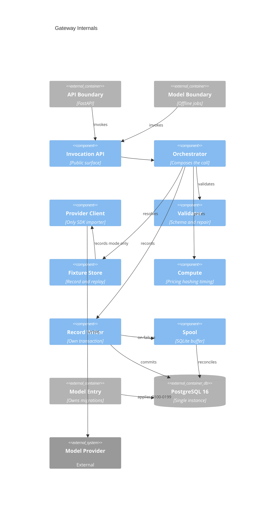

# Implementation Plan: Traced Model Gateway

**Branch**: `00004-traced-model-gateway` | **Date**: 2026-07-25 | **Spec**: [spec.md](spec.md)

## Summary

**Goal**: Build the single traced, schema-validated, cost-accounted path to the model provider, with content-hash fixtures that make model-dependent results reproducible offline.
**Approach**: One orchestration module in `/src/gateway` composes a lazily-imported provider client, a bounded repair loop, pure arithmetic modules, and a gateway-owned record writer; three build-time contracts and a credential-free replay suite make the guarantees structural rather than conventional.
**Key Constraint**: The gateway is a library, not a service — every durability, deadline, and redaction guarantee must hold without a runtime it controls.

## Technical Context

**Language/Version**: Python 3.12 (gateway entry)
**Primary Dependencies**: Pydantic and psycopg (base runtime); Anthropic SDK behind a `provider` optional extra; SQLite from the standard library. No migration tooling — {SAD:ADR-0013} places Alembic and the runner in `/src/model`
**Storage**: PostgreSQL 16, single instance — `llm_invocation`, `price_table_version`, `price_table_entry`; plus a committed on-disk fixture store and a local SQLite spool that is a transient buffer, not a datastore of record ({SAD:ADR-0015})
**Testing**: pytest with Hypothesis for property-based tests over the pure arithmetic modules; `import-linter` for three architecture contracts; cross-entry checks under repository-root `/tests`
**Target Platform**: Linux containers — Docker Compose locally, a CI job carrying the `db` service for the database-backed criteria
**Project Type**: web (four-entry monorepo)
**Project Mode**: brownfield — E001 scaffolded the four entries, the toolchain, and the check harness
**Performance Goals**: Gateway overhead ≤ 50 ms p95 excluding provider time; per-request deadline default 120 s; replay-mode resolution ≤ 10 ms p95
**Constraints**: Exactly one module names the provider distribution; no unvalidated value reaches a caller, storage, or the interface; gateway carries no web framework and no modeling stack; automated checks run credential-free with no provider network; migration numbers confined to `0100`–`0199`
**Scale/Scope**: ~2–5k invocations across the project's lifetime; fixture store soft cap 25 MB; one gateway module, three Postgres tables, three build-time contracts

## Instructions Check

*GATE: Must pass before Phase 0 research. Re-check after Phase 1 design.*

| Principle | Gate | Status |
|---|---|---|
| I. Traceable or It Does Not Ship | Every invocation produces a record; cost recomputable from stored counts, not stored as a derived figure | PASS — `record/writer.py` + `compute/pricing.py`, spool guarantees no billed call is unrecorded |
| II. Uncertainty Is the Product | N/A — this feature publishes measurements, not estimates | N/A |
| III. Precision Over Recall Where a Mistake Is Silent | Fail closed rather than return an unvalidated value; absent rather than wrong | PASS — repair-then-raise, cost absent with a reason, replay miss is an error |
| IV. Agent Output Style | Plan is tables and tagged lists; prose confined to Summary | PASS |
| V. The Model Extracts, Code Computes | Single provider import site **and** a build-failing computation boundary over the new arithmetic | PASS — three `import-linter` contracts in the entry manifest CI already runs, seeded-violation fixtures extending a file that already proves contracts fail, arithmetic isolated in `gateway/compute/` so a violation produces a real import edge. **Residual, disclosed**: a `forbidden` contract catches import edges only, so arithmetic written inline inside `provider.py` produces no edge and no failure. The project plan discloses this at E001 and assigns the enforceable edge to E004; placing the arithmetic in importable `compute/` modules is that discharge, but code review remains the only guard against inlining |
| VI. Evaluate Before You Tune | N/A — E014 owns the frozen evaluation set | N/A |
| VII. Publish the Miss | Deliberate limits carry causes and owners | PASS — see Complexity Tracking and the spec's Excluded section |
| VIII. Honest Opponents | N/A — no model-quality claim made here | N/A |
| Technology Stack | Python 3.12, one Postgres instance, no second datastore of record | PASS with recorded scoping — {SAD:ADR-0015} |
| Testing & Quality Policy | Strict test-first plus property-based tests for deterministic computation; architecture contracts gate the build | PASS — `compute/` is test-first with Hypothesis; three contracts wired to CI |
| Source Code Layout | All source under `/src`; cross-entry verification only under root `/tests` | PASS — see Project Structure |
| Development Workflow | Conventional Commits on `00004-traced-model-gateway`, squash merged | PASS |
| Data Provenance | Committed fixtures carry provenance; no proprietary content | PASS — per-fixture provenance sidecar, redaction before write. The two controls are distinct: redaction is credential-only (TR-059); content exclusion rests on E002's corpus constraint, restated as a boundary rule in TR-067 |
| Governance | Project-wide decisions recorded as ADRs, not buried in the plan | PASS — ADR-0014 and ADR-0015 created during this phase |

## Architecture



## Architecture Decisions

Feature-local tradeoffs only. Project-wide decisions are recorded as standalone ADRs and referenced here.

| ID | Decision | Options Considered | Chosen | Rationale |
|----|----------|--------------------|--------|-----------|
| AD-001 | *(Withdrawn 2026-07-26.)* Which migration runner should this epic build? | yoyo-migrations / Alembic / hand-rolled SQL applier | **None — E004 builds no runner** | {SAD:ADR-0013}, accepted on the default branch while this branch was open, places the Alembic configuration, the runner, and every schema asset in `/src/model` and reserves prefixes `0100`–`0199` for E004. The decision this row recorded is no longer E004's to make. Row retained rather than deleted because tasks referenced it |
| AD-002 | *(Withdrawn 2026-07-26.)* Where does the migration runner's dependency live? | Base runtime / `migrations` optional extra / dev group | **Not applicable** | Follows AD-001's withdrawal: no runner means no runner dependency, and the gateway manifest grows by psycopg alone. This is a simplification — the divergence from the spec's one-added-dependency constraint that this row previously required is gone |
| AD-003 | Is repair a second full request or a continuation of the first? | Second full request / provider-side continuation | Second full request carrying the failing field path and message | Makes the repair attempt independently countable and fixture-keyable, and keeps the transport retry budget cleanly separate from the repair budget |
| AD-004 | How are the schema and prompt-template digests computed, given post-decode validators never reach the provider? | Digest submitted schema only / digest schema + validator source / caller-declared strings | Digest over the canonical JSON schema plus the validator definitions, and over the resolved template text | TR-038 forbids caller-declared strings; digesting only the submitted schema would miss a validator edit, which is the exact staleness path the top risk names |
| AD-005 | Who mints the invocation identifier and creation timestamp — the gateway or the database? | Database defaults / gateway-generated | Gateway-generated before the write | A database default would mint a second identifier at reconcile time, breaking the spool's conflict-ignoring idempotency, and would stamp a spooled row with its reconcile time rather than its invocation time — which also breaks TR-043, since the pricing timestamp is the creation timestamp in `record` mode |
| AD-006 | How is the outcome enumeration represented in Postgres? | Native `ENUM` type / `TEXT` with a named `CHECK` | `TEXT` with a named `CHECK` | `CREATE TYPE` has no `IF NOT EXISTS` form in PostgreSQL 16, so it is the one DDL object that cannot satisfy TR-017's re-runnable idempotency; `TEXT` also exposes the enumeration to E013 without type introspection |
| AD-007 | How does the gateway entry join the repository coverage gate it is currently absent from? | Leave uninstrumented / instrument without exclusions / instrument with a stated exclusion | Instrument with its own `COVERAGE_FILE` and a stated exclusion for the opt-in provider-reaching path | The gateway's test step currently writes its data file inside `src/gateway`, where the root `combine` never sees it. The provider-reaching path cannot execute in a credential-free suite, so excluding it with a reason is more honest than a percentage depressed for a cause unrelated to test quality |
| AD-008 | What non-functional targets does the plan commit to, given the spec states none? | Leave unstated / adopt modest measurable targets | Overhead ≤ 50 ms p95 excluding provider time; deadline default 120 s; fixture store soft cap 25 MB with a warning check | Concrete enough to test and to fail, loose enough not to distort design. Closes the `non_functional: partial` gap carried out of clarification |
| — | Provider SDK as an optional extra | — | See ADR-0014 | Project-wide: changes the dependency shape every consumer of the gateway declares |
| — | Local spool for failed record writes | — | See ADR-0015 | Project-wide: scopes the single-datastore rule to data of record |

## Data Model Summary

| Entity | Key Fields | Relationships | Notes |
|--------|------------|---------------|-------|
| `llm_invocation` | `invocation_id` PK (gateway-generated), requested/resolved model, `resolution_mode`, `fixture_key`, four token-count columns, `duration_ms`, transport/repair attempt counts, `cost_usd`, `cost_absent_reason`, `pricing_timestamp`, `price_table_version_id`, `outcome`, `trace_id`, `created_at`, `error_type` | FK → `price_table_version`, `ON DELETE RESTRICT ON UPDATE RESTRICT` | One row per invocation, never per attempt. `trace_id` NOT NULL. Written once, never updated. Read contract for E013. Indexes on `(created_at DESC)` and `(trace_id)`. **Naming**: the aggregated latency column is `duration_ms` — the single name used in `data-model.md`, the migration, and the E013 read contract; `latency_ms` and a bare `cost` were earlier drafts of this row and are not names in this feature |
| `price_table_version` | `version_id` PK (config-pinnable slug), `snapshot_date`, `source_url` | Referenced by every invocation and every entry | Append-only; never edited. The only scope a price lookup searches |
| `price_table_entry` | Composite PK `(price_table_version_id, model_id, effective_from)`; four `NUMERIC(12,6)` rate columns — base input, cache write, cache read, output | FK → `price_table_version` | Composite PK makes a duplicate `(model, date)` inside one version unrepresentable, so TR-039's lookup is deterministic rather than tie-broken |
| `invocation_spool` *(SQLite, local)* | `invocation_id` PK, JSON payload | None — drains into `llm_invocation` | Transient buffer, not a datastore of record. `Spooled → Reconciled → Deleted`; steady state empty |

**Detail**: `specs/00004-traced-model-gateway/data-model.md`

## API Surface Summary

N/A — no API surface. The gateway is a library consumed in-process by `/src/api` and `/src/model`; no HTTP endpoint, route, or wire contract is added. The spec carries no `NEW-API` implementation signal.

## Testing Strategy

| Tier | Tool | Scope | Mock Boundary | Install |
|------|------|-------|---------------|---------|
| Unit | pytest + Hypothesis | `compute/` arithmetic (pricing, hashing, timing) test-first with property-based tests; validation and repair branching; redaction; config mode selection | Provider and Postgres both absent — fixtures and in-memory doubles | `uv add --dev --directory src/gateway hypothesis` (pytest configured) |
| Integration | pytest against the Compose `db` service | Migration apply-from-empty and re-run idempotency; record write in its own transaction; caller-rollback survival; spool write and exactly-once reconcile; replay end to end | Provider absent — replay mode only; database real | configured |
| Security | `import-linter` contracts + credential scan + network guard + Ruff `S` rules | Three contracts (single provider import, computation boundary over the gateway, public-surface purity); all five sinks of TR-059's closed egress inventory scanned for credential-shaped material, each with a seeded positive case (TR-060); autouse network guard failing any outbound connection from the check process (TR-067) | — | configured (contracts); add `S` to the gateway's Ruff `select` |
| Coverage | coverage.py, combined at the repository root | Gateway entry added to the combined report via its own `COVERAGE_FILE`, `parallel`, `relative_files`, and a root `[paths]` remap; opt-in provider-reaching path excluded with a stated reason | — | configured (version already pinned); CI step change required |

## Error Handling Strategy

| Error Category | Pattern | Response | Retry |
|----------------|---------|----------|-------|
| Schema validation | Repair once, then fail closed | Gateway validation error; record written with outcome `failed` and repair attempt count 1 before raising | yes, exactly 1 repair |
| Transport (rate limit, server error, timeout) | Bounded retry inside an outer deadline | Gateway provider error carrying only status, error type, and request id; record written with the transport attempt count | yes, 2 retries (3 attempts), each inheriting the remaining deadline |
| Deadline expiry | Fail the attempt, count as transport failure | Same as transport; never classified as `repaired` | yes, within the same 3-attempt budget |
| Record write failure | Spool then fail closed | Record appended to the SQLite spool; gateway error raised; no validated value returned | no — reconciliation happens on the next successful connection |
| Fixture miss in `replay` | Fail fast | Gateway miss error naming the derived key; no network request issued | no |
| Configuration (no mode, missing opt-in, missing credential, missing provider extra, unresolvable price pin) | Fail before request construction | Gateway configuration error naming the missing setting or the install command; message bounded by TR-065's exclusion set — the key's *name* is permitted, any credential-derived value (including a truncation, hash, or length) is not | no |
| Unknown request field in hash scope | Fail fast | Key derivation raises rather than hashing a partial request | no |

## Integration Points

| Spec Reference | System/Service | Technical Approach | Contract |
|----------------|----------------|--------------------|----------|
| IP-001 | E001 check harness | Extend `tests/checks/test_single_import_site.py`; add two contracts to `src/gateway/pyproject.toml` and two cross-entry checks under `/tests` | `import-linter` contracts + source scan |
| IP-002 | E001 Compose `db` service | Migrations `0100`–`0199` applied by the gateway-resident runner; new CI job carries the same service | `data-model.md` |
| IP-003 | E006 via `/src/model` | Python package dependency on `gateway[provider]`; calls `gateway.invoke()` | Gateway public surface (`api.py`, `models.py`, `errors.py`) |
| IP-004 | E011 via `/src/api` | Same dependency and entry point | Same |
| IP-005 | E013 invocation panel | Reads `llm_invocation` directly, including the outcome enumeration and cost fields | Table shape in `data-model.md` |
| IP-006 | E014 evaluation harness | `replay` mode resolves every model-dependent step with no network and no credential. **Divergence, disclosed:** the registered project plan scopes E014 to retrieval, identity resolution, and forecast calibration, lists its dependencies as E007/E008/E009, and does not list E004 among them — this edge is a proposal from this feature, not a plan fact (spec OI-1) | Fixture store layout + mode configuration |
| IP-007 | Model provider | Sole egress; reached only from `provider.py` in opted-in `record` mode | ADR-0007, ADR-0014 |
| IP-008 | E003 core schema | E003 owns the Alembic configuration and runner in `/src/model` per {SAD:ADR-0013}; E004 authors revisions into it in the reserved `0100`–`0199` prefix block and builds no runner. Prefix-block and single-head assertions run as a cross-entry check. **Sequencing consequence**: authoring is unblocked, applying waits on E003's arrangement, so every database-backed criterion here is gated on it | Prefix and single-head check under `/tests` |
| IP-009 | E014 replayed-vs-live publication | E004 supplies both modes and the record; comparison is not built here | Recorded divergence from the registered plan |

## Risk Mitigation

| Risk (from spec) | Likelihood | Impact | Mitigation | Owner |
|-------------------|------------|--------|------------|-------|
| Incomplete hash scope produces silent stale replays | L | H | Closed hashed-field list with an unknown field raising rather than being ignored; schema and template versions are gateway-derived digests over the schema *plus its validators* and the resolved template text, so no forgotten bump exists to make | `compute/hashing.py` |
| Migration-number collision with E003 in the same wave | L | M | Prefix block `0100`–`0199` is reserved by {SAD:ADR-0013} rather than negotiated between epics, and asserted by a check over E003's revision directory that fails on an out-of-block prefix, a duplicate prefix, or more than one head. Likelihood lowered from medium: the blocks are now ratified upstream rather than agreed between two in-flight branches | `src/model/migrations/versions/` + `/tests` prefix check |
| Repair rate is misread as a quality signal it is not | M | L | Publish the repaired rate alongside which constraints are enforced by post-decode validators rather than by the submitted schema; transport failures are structurally excluded from the `repaired` classification. Carried by TR-079 (definition, denominator over `outcome`/`error_type`, estimate condition, disclosed constraint-context limit) and SC-023, so the mitigation has a criterion that can fail rather than living only in this table | `validation.py` computes; **E013 publishes** (IP-005) |
| *(plan-identified)* Import contract silently errors when the `provider` extra is absent from the lint environment | M | H | The contract sets `include_external_packages = true`, so an absent distribution makes it error rather than pass. CI syncs the extra before `lint-imports`, and a check asserts the contract reports the seeded violation rather than a graph error | CI + `tests/checks/test_contract_fixtures.py` |
| *(plan-identified)* Spool grows without bound during a prolonged database outage | L | M | Reconcile drains on every successful connection and a size check warns past the stated cap. Disclosed rather than silently bounded, because dropping the oldest record to enforce a cap would reintroduce the untraced-billed-call hole the spool exists to close. **Reversal trigger**: a spool exceeding 10 MB or surviving more than one working day. **Production-scale alternative**: a durable queue with its own retention policy and an alert on depth | `record/spool.py` |

## Requirement Coverage Map

| Req ID | Component(s) | File Path(s) | Notes |
|--------|--------------|--------------|-------|
| TR-001 | Provider Client, contracts | `src/gateway/src/gateway/provider.py`, `src/gateway/pyproject.toml`, `tests/checks/test_single_import_site.py` | Existing `protected` contract; source scan extended to the enlarged package |
| TR-002 | Invocation API, public-surface check | `src/gateway/src/gateway/api.py`, `models.py`, `errors.py`, `src/gateway/tests/test_public_surface.py`, `src/gateway/tests/test_api_surface.py`, `src/gateway/pyproject.toml` | Gateway-owned types only. Two halves: the public-surface-purity `import-linter` contract in the manifest, and the runtime check that satisfies OBJ1 VC3's "report the leaked type by name" — a contract reports module paths, not type names, and E001 already proved re-export laundering passes one. `test_api_surface.py` covers OBJ1 VC5's entry-point enumeration |
| TR-003 | Manifest, Provider Client, cross-entry harness | `src/gateway/pyproject.toml`, `provider.py`, `tests/checks/test_gateway_no_provider_env.py` | `provider` optional extra + function-local import; ADR-0014. The harness resolves a synthetic environment without the extra and satisfies OBJ1 VC1 / SC-002 |
| TR-004 | Invocation API | `src/gateway/src/gateway/provider.py`, `api.py` | `client_type()` removed; one entry point remains |
| TR-005 | Validator | `src/gateway/src/gateway/validation.py` | Native structured-output submission; unsupported keywords become post-decode validators |
| TR-006 | Validator, Orchestrator | `validation.py`, `orchestrator.py` | Validation precedes return, persistence, and logging |
| TR-007 | Validator | `validation.py` | One repair carrying failing field path and message |
| TR-008 | Orchestrator | `orchestrator.py` | Record written, then raise |
| TR-009 | Orchestrator | `orchestrator.py` | Invocation-level classification |
| TR-010 | Provider Client | `provider.py` | 2 retries / 3 attempts; count recorded |
| TR-011 | Record Writer, Spool | `record/writer.py`, `record/spool.py` | Denominator includes spooled records |
| TR-012 | Record Writer, models | `record/writer.py`, `models.py`, `src/model/migrations/versions/0102_llm_invocation.py` | Field list is the E013 read contract |
| TR-013 | models, migrations | `models.py`, `migrations/` | OpenTelemetry gen-AI conventions at a pinned version |
| TR-014 | Compute | `compute/pricing.py` | Pure function over counts, model, version, pricing timestamp |
| TR-015 | Data model | `src/model/migrations/versions/0100_price_table_version.py`, `0101_price_table_entry.sql`, `0103_seed_price_table.sql` | Composite PK `(version, model, effective_from)`, four rate columns, seed data |
| TR-016 | Compute, Record Writer | `compute/pricing.py`, `record/writer.py` | `cost_absent_reason` column |
| TR-017 | E003 runner (consumed) | `src/model/migrations/versions/` | E004 authors revisions only; the runner and Alembic config are E003's per {SAD:ADR-0013} |
| TR-018 | Revisions, prefix check | `src/model/migrations/versions/`, `tests/checks/test_migration_ranges.py` | `0100`–`0199` prefix block plus a single-head assertion, checked not merely claimed |
| TR-019 | Compute | `compute/hashing.py` | Canonical serialization over the closed field list |
| TR-020 | Compute | `compute/hashing.py` | Unknown field raises |
| TR-021 | Config | `config.py` | Two modes, no default, no fallback |
| TR-022 | Fixture Store | `fixtures.py` | Miss raises; no network in `replay` |
| TR-023 | Config, test harness | `config.py`, `src/gateway/tests/conftest.py` | Guard scoped to the gateway process; harness spawns a credential-free child |
| TR-024 | Redaction | `redaction.py`, `fixtures.py` | Logs, exception payloads, committed fixtures |
| TR-025 | Errors | `errors.py`, `provider.py` | Status, error type, request id only |
| TR-026 | Config, Redaction | `config.py`, `redaction.py` | Content capture off by default |
| TR-027 | Config | `config.py` | Opt-in separate from mode selection |
| TR-028 | Compute, contracts | `compute/`, `src/gateway/pyproject.toml` | Property-based tests over all three functions |
| TR-029 | Manifest | `src/gateway/pyproject.toml` | Neither base nor any extra carries a web framework or the modeling stack |
| TR-030 | Fixture scan check | `src/gateway/tests/test_fixture_credential_scan.py` | Reads only this entry's artifacts, so it stays entry-local |
| TR-031 | Record Writer | `record/writer.py`, `src/model/migrations/versions/0102_llm_invocation.py` | `trace_id` NOT NULL; generated when the caller supplies none |
| TR-032 | Contracts | `src/gateway/pyproject.toml`, `tests/checks/test_contract_fixtures.py` | `forbidden` contract, indirect detection on |
| TR-033 | Fixture Store | `fixtures.py` | Provenance sidecar per fixture |
| TR-034 | Provider Client, Config | `provider.py`, `config.py` | Per-attempt timeout inside an outer monotonic deadline |
| TR-035 | Record Writer | `record/writer.py` | Own connection, own transaction |
| TR-036 | Orchestrator | `orchestrator.py` | Fail closed on record-write failure |
| TR-037 | Orchestrator, Record Writer | `orchestrator.py`, `record/writer.py` | `resolution_mode` and `fixture_key` columns |
| TR-038 | Compute | `compute/hashing.py` | Digests over schema-plus-validators and resolved template text |
| TR-039 | Compute | `compute/pricing.py` | Within-pin lookup, latest effective-from at or before the pricing timestamp |
| TR-040 | Compute, Orchestrator | `compute/timing.py`, `orchestrator.py` | Counts summed, latency total wall clock |
| TR-041 | Spool | `record/spool.py`, `record/reconcile.py` | SQLite, keyed on invocation id, delete after commit; ADR-0015 |
| TR-042 | Orchestrator | `orchestrator.py` | No attempt-level outcome value exists |
| TR-043 | Compute, Fixture Store | `compute/pricing.py`, `fixtures.py` | Pricing timestamp recoverable from the stored row |
| TR-044 | Record Writer, migrations | `record/writer.py`, `models.py`, `src/model/migrations/versions/0102_llm_invocation.py` | Nullability contract carried by column constraints, not writer discipline |
| TR-045 | Orchestrator, Record Writer, Spool | `orchestrator.py`, `record/writer.py`, `record/spool.py` | One identifier minted per invocation before the first write; no database default |
| TR-046 | migrations | `src/model/migrations/versions/0101_price_table_entry.py`, `0102_llm_invocation.sql` | `ON DELETE RESTRICT ON UPDATE RESTRICT` on both price-version FKs |
| TR-047 | Invocation API, Record Writer | `api.py`, `models.py`, `record/writer.py` | Trace-id domain validated at the boundary before request construction |
| TR-048 | Config, Compute | `config.py`, `compute/pricing.py` | Pinned version resolved before request construction; absent-cost reason set closed at three |
| TR-049 | Compute, migrations | `compute/pricing.py`, `src/model/migrations/versions/0101_price_table_entry.py`, `0102_llm_invocation.sql` | USD, scale 10 / 6, sum-then-quantize-once, exact-decimal round trip, out-of-range recorded absent (HINT-004) |
| TR-050 | E003 runner (verified against) | `src/model/migrations/versions/`, `src/gateway/tests/test_migrations.py` | Postcondition-defined idempotency verified against E003's runner rather than provided by this epic |
| TR-051 | range check | `tests/checks/test_migration_ranges.py` | Both directories; absent directory reported not-present rather than passing |
| TR-052 | Spool, Reconcile | `record/reconcile.py` | Idempotency key + conflict action; exactly-once effect, not delivery (HINT-005) |
| TR-053 | Reconcile, Spool | `record/reconcile.py`, `record/spool.py` | Invocation-triggered drain, no background process, concurrent-drain safety, depth logged |
| TR-054 | Reconcile | `record/reconcile.py` | Failed reconcile retained and logged; never fails the triggering invocation; payload version compatibility |
| TR-055 | Record Writer, migrations | `record/writer.py`, `migrations/` | No UPDATE/DELETE statements exist; enforcement disclosed as convention plus referential restriction |
| TR-056 | Compute, Orchestrator | `compute/timing.py`, `orchestrator.py`, `fixtures.py` | Zero-usage attempts, latency interval and unit, replay aggregation, fixture lookup as attempt |
| TR-057 | Compute | `compute/pricing.py` | UTC date comparison, recording-date widening, exact case-sensitive model match, uniqueness-backed determinism |
| TR-058 | Record Writer | `record/writer.py` | Absent-cost warning naming pin, model, and reason |
| TR-059 | Redaction, Errors, Spool, Fixture Store | `redaction.py`, `errors.py`, `fixtures.py`, `record/spool.py` | Closed five-sink egress inventory; exception payload includes traceback frames; fail-closed redaction; credential-only scope; ASVS 5.0.0 V16/V14/V13 anchor |
| TR-060 | Fixture scan check | `src/gateway/tests/test_fixture_credential_scan.py` | Two detectors; scan spans the whole TR-059 inventory; one seeded positive case per sink so a zero count is not an inert detector |
| TR-061 | Provider Client, Redaction | `provider.py`, `redaction.py`, `src/gateway/tests/test_redaction.py` | Credential read once at construction, held off every repr'd/serialized object; never enters the committed repository |
| TR-062 | Config | `config.py`, `src/gateway/tests/test_config_modes.py` | Single credential key `ANTHROPIC_API_KEY`; exact-name presence rule; guard's process-environment limit disclosed |
| TR-063 | Config, CI | `config.py`, `.github/workflows/verify.yml`, `tests/checks/test_ci_provider_gate_absent.py` | `GATEWAY_ALLOW_PROVIDER_CALLS` as the named opt-in; asserted absent in CI |
| TR-064 | Errors, Provider Client | `errors.py`, `provider.py` | No chained cause retained; provider-issued request id only; `error_type` domain closed at the normalized classes |
| TR-065 | Config, Errors | `config.py`, `errors.py`, `src/gateway/tests/test_config_modes.py` | Configuration-failure message exclusion set; key name permitted, credential-derived material forbidden |
| TR-066 | Redaction, Config, Record Writer | `redaction.py`, `config.py`, `record/writer.py` | Closed log-output field list; content-capture scoped to logs; fixture retention distinguished; enabled state constrained |
| TR-067 | Provider Client, check harness | `provider.py`, `src/gateway/tests/conftest.py`, `tests/checks/test_no_outbound_egress.py` | Sole-egress requirement; import-edge reach disclosed; network guard is SC-008's observation point; corpus bound on egress |
| TR-068 | Record Writer, migrations, read-contract check | `record/writer.py`, `models.py`, `src/model/migrations/versions/0102_llm_invocation.py`, `src/gateway/tests/test_read_contract.py` | Field list closed at requirement level; information-schema column set compared against the list, failing either way (VR-032) |
| TR-069 | migrations, docs | `migrations/`, `specs/00004-traced-model-gateway/data-model.md` | Read-contract change procedure: amend requirement, new higher-numbered migration, record against IP-005; E013 agreement for a removal or rename |
| TR-070 | Config, migrations, naming check | `config.py`, `src/model/migrations/versions/0102_llm_invocation.py`, `src/gateway/tests/test_field_naming.py` | Pin is `1.36.0`; three recording points must agree — config key, `COMMENT ON TABLE`, requirement. Task verifies the release defines the classified attributes before implementing |
| TR-071 | models, migrations, naming check | `models.py`, `src/model/migrations/versions/0102_llm_invocation.py`, `src/gateway/tests/test_field_naming.py` | Per-field provenance split; no `gen_ai_` prefix on gateway-local columns; `error.type` and W3C Trace Context Level 1 pinned as their own sources |
| TR-072 | models, naming check | `models.py`, `src/gateway/tests/test_field_naming.py` | Stability class per field, distinct from provenance; every column classified Stable or Development |
| TR-073 | naming check | `src/gateway/tests/test_field_naming.py` | Forward-only transform; no inversion; collision between two pinned attributes fails the build |
| TR-074 | migrations, Config | `migrations/`, `config.py` | Pin-bump procedure: rename in a new migration, three recording points updated together, classification refreshed, TR-069 applied |
| TR-075 | Orchestrator, manifest | `orchestrator.py`, `src/gateway/pyproject.toml` | No spans, metrics, exporter, propagator, or OpenTelemetry SDK dependency; high-cardinality values are columns only; span-id absence is a scope decision |
| TR-076 | Redaction, Record Writer, Spool, Errors | `redaction.py`, `record/writer.py`, `record/spool.py`, `errors.py`, `src/gateway/tests/test_not_captured.py` | Closed not-captured set stated per sink; seeded prompt/completion markers asserted absent from record, spool, error, and logs, and present in the fixture (VR-037) |
| TR-077 | Record Writer, Spool, Reconcile | `record/writer.py`, `record/spool.py`, `record/reconcile.py` | Closed five-event log set with the invocation identifier as correlator; TR-066's field list applies over exactly these events (VR-038) |
| TR-078 | Orchestrator | `orchestrator.py`, `src/gateway/tests/test_validation_repair.py` | Total mapping from terminal state and attempt counts onto the three values; table-driven test over every reachable combination (VR-034) |
| TR-079 | Record Writer, read contract | `record/writer.py`, `src/gateway/tests/test_read_contract.py` | Repaired rate computable from `outcome` and `error_type` alone; E004 computes, E013 publishes; constraint-context limit disclosed |
| TR-080 | Invocation API, models | `api.py`, `models.py` | Trace identifier as an explicit request field, no ambient propagation; caller-versus-generated provenance deliberately not stored |
| TR-081 | migrations | `src/model/migrations/versions/0100_price_table_version.py`, `0103_seed_price_table.sql` | Snapshot date and published source mandatory on every version; unsourced version neither seeded nor pinnable |

## Project Structure

### Source Code

```text
+ src/gateway/src/gateway/api.py                       public surface: invoke()
+ src/gateway/src/gateway/models.py                    gateway-owned request/result/record types
+ src/gateway/src/gateway/errors.py                    gateway-owned error hierarchy
+ src/gateway/src/gateway/config.py                    mode, opt-in, deadline, roots, pins
+ src/gateway/src/gateway/orchestrator.py              composes call, validation, computation, record
+ src/gateway/src/gateway/validation.py                schema submission, validators, repair
+ src/gateway/src/gateway/fixtures.py                  record/replay store, provenance sidecar
+ src/gateway/src/gateway/redaction.py                 credential redaction across three egress paths
+ src/gateway/src/gateway/compute/pricing.py           cost function, within-pin price lookup
+ src/gateway/src/gateway/compute/hashing.py           canonical serialization, content hash, digests
+ src/gateway/src/gateway/compute/timing.py            duration arithmetic
+ src/gateway/src/gateway/record/writer.py             own connection, own transaction
+ src/gateway/src/gateway/record/spool.py              SQLite spool
+ src/gateway/src/gateway/record/reconcile.py          exactly-once drain into Postgres
+ src/model/migrations/versions/0100_price_table_version.py    E003 owns the directory
+ src/model/migrations/versions/0101_price_table_entry.py      FK target must exist first
+ src/model/migrations/versions/0102_llm_invocation.py         FK target must exist first
+ src/model/migrations/versions/0103_seed_price_table.py       seed version + entries
~ src/gateway/src/gateway/provider.py                  only SDK importer; lazy import, retries, deadline
~ src/gateway/pyproject.toml                           extras, two new contracts, coverage config
+ src/gateway/tests/test_api_surface.py
+ src/gateway/tests/test_validation_repair.py
+ src/gateway/tests/test_fixtures.py
+ src/gateway/tests/test_redaction.py
+ src/gateway/tests/test_compute_pricing.py            Hypothesis
+ src/gateway/tests/test_compute_hashing.py            Hypothesis
+ src/gateway/tests/test_compute_timing.py             Hypothesis
+ src/gateway/tests/test_record_writer.py              needs db
+ src/gateway/tests/test_spool_reconcile.py            needs db
+ src/gateway/tests/test_migrations.py                 needs db
+ src/gateway/tests/test_config_modes.py
+ src/gateway/tests/test_fixture_credential_scan.py
+ src/gateway/tests/conftest.py                        credential-free child environment; autouse network guard
+ src/gateway/fixtures/                                committed response fixtures + provenance
~ src/gateway/tests/test_provider.py                   extended for lazy import and deadline
+ src/gateway/tests/test_public_surface.py             no SDK type on the public surface
+ tests/checks/test_gateway_no_provider_env.py         imports and type-checks without the extra
+ tests/checks/test_migration_ranges.py                both source dirs, disjoint, no duplicates
+ tests/checks/test_ci_provider_gate_absent.py         opt-in control absent in CI
+ tests/checks/test_no_outbound_egress.py              network guard is SC-008's observation point
~ tests/checks/test_single_import_site.py              scan covers the enlarged package
~ tests/checks/test_contract_fixtures.py               seeded violations for both new contracts
~ .github/workflows/verify.yml                         gateway coverage wiring, db service, extras sync
~ specs/sad.md                                         ADR catalog rows; stale retention open question removed
~ specs/project-plan.md                                ADR-0014/0015, E014 edge, migration arrangement
~ project-instructions.md                              Technology Stack: "no second datastore of record", v1.2.1
```

**Patterns to reuse**: E001's `protected` and `forbidden` `import-linter` contract shapes in each entry's own `pyproject.toml`; the seeded-violation fixture pattern in `tests/checks/test_contract_fixtures.py`, which proves a contract fails rather than assuming it; `tests/checks/helpers/source_scan.py` for naming-site scans; per-entry `COVERAGE_FILE` as already done for the `model` entry.
**Tests to extend**: `src/gateway/tests/test_provider.py`, `tests/checks/test_single_import_site.py`, `tests/checks/test_contract_fixtures.py`.
**Naming conventions**: `uv run --directory src/<entry>` for every Python tool invocation; module-level docstrings stating which requirement a file carries; Ruff line length 100 with `select = ["E","F","I","UP","B","SIM"]`; tests named for the behaviour asserted, not the function called.

## Complexity Tracking

| Violation | Why Needed | Simpler Alternative Rejected Because |
|-----------|------------|--------------------------------------|
| A local SQLite spool exists alongside the single PostgreSQL instance | A provider call that is billed but whose record write fails would otherwise leave no record anywhere, falsifying the 100% tracing claim on exactly the failure the claim exists to exclude | Narrowing the claim's denominator was rejected: it puts an asterisk on the product's loudest guarantee. Inline retry until success was rejected: it converts a trace failure into an unbounded availability failure. Scoped by ADR-0015 — the spool holds only unreconciled records, no consumer queries it, and its steady state is empty, so the single-datastore rule remains a rule about data of record |
| The gateway declares an optional extra rather than a flat dependency set | The provider-type-free surface criterion is vacuous unless an environment can exist without the SDK | A hard provider dependency with a weakened criterion was rejected because the criterion would then assert nothing the import contract does not already cover. {SAD:ADR-0014} |
| The gateway retains a Postgres driver, while {SAD:ADR-0013}'s consequences state that `/src/model` alone "declares the database client" | The gateway must write invocation rows, which {SAD:ADR-0010} lists among its sanctioned contents, and a write needs a driver | ADR-0013's drivers, its Option A, and {SAD:ADR-0004} all have `/src/api` holding a connection too, so the broad reading of that one sentence is inconsistent with the record it appears in. The narrow reading — ADR-0013 fixes schema, DDL, and migration-tooling ownership — is adopted and disclosed as an interpretation in spec OI-7, with a superseding record recommended. Moving invocation recording out of the gateway was rejected: it would reverse the clarified "gateway owns persistence" decision and collapse ADR-0015's premise |
| The opt-in provider-reaching path is excluded from the coverage denominator | The credential-free automated suite cannot execute it, so including it would depress the percentage for a cause unrelated to test quality | Letting it depress the number was rejected as making the gate fail for the wrong reason. **Reversal trigger**: if a recorded-fixture harness is ever able to drive `record` mode end to end without a live credential, the exclusion is removed. **Production-scale alternative**: a scheduled credentialed job outside the merge gate, reporting its own coverage separately |

## Open Items Disposition

Carried in from the spec's `## Compliance Check`, plus items this phase opened.

| ID | Item | Disposition |
|---|---|---|
| OI-1 | E004 ↔ E014 relationship and the shared-runner ownership are not carried by the registered project plan | **Propagated.** `specs/project-plan.md` amended this phase: ADR-0014 and ADR-0015 added to its decision table, E014's dependency edge on E004 recorded, E004's dependency contract restated to name the shared gateway-resident runner. IP-006 and IP-008 retain the disclosure wording so the provenance of each claim stays readable |
| OI-2 | `specs/sad.md` still listed `llm_invocation` retention as an open question while its baseline section recorded the answer | **Closed.** The stale open question removed; the answer stands in the baseline section, with the spool's own growth bound folded into it (ADR-0015) |
| OI-3 | Gateway entry absent from the repository coverage denominator | **Closed by AD-007.** Its test step gains a repo-root `COVERAGE_FILE` and runs under `coverage run`, joining the root `combine`. Gateway entry target: ≥ 85% line coverage, above the repository floor, since it is a small pure-logic package with no framework glue. The opt-in provider-reaching path is excluded with a reversal trigger recorded in Complexity Tracking |
| OI-5 | Fixture store carries per-fixture provenance but no REAL/SYNTHETIC label or datasheet | **Deferred, unchanged.** Fixtures are model output over a corpus E002 already labels; the datasheet and license-separation rules attach only if the store is published as a dataset in its own right, which E014/E015 would own |
| PI-1 | `project-instructions.md` Technology Stack reads "no second datastore" flatly, which QC reads as authoritative and would score the spool against | **Amended this phase** to "no second datastore *of record*", v1.1.4 with an ISO-dated changelog entry citing ADR-0015 — following the same propagation precedent as v1.1.0 and v1.1.3 |

## Implementation Hints

- **[HINT-001]** Order: two things must be written before the code they govern. Extend the manifest and the two new `import-linter` contracts *before* any module they constrain — a contract added after the code it should have blocked cannot prove it would have blocked it, and E001's seeded-violation fixtures are the pattern. And `compute/pricing.py`, `compute/hashing.py`, `compute/timing.py` are deterministic computation modules, so strict red-green-refactor is **mandatory**, not preferred: task generation must emit the failing property-based test task before the implementation task for all three. Every other module here is test-after.
- **[HINT-002]** Gotcha: the `protected` contract sets `include_external_packages = true`, so if CI runs `lint-imports` without syncing the `provider` extra, the contract **errors** with the distribution absent from the graph rather than passing. Sync extras before the architecture-contracts step.
- **[HINT-003]** Gotcha: the gateway's current CI test step runs `uv run --directory src/gateway python -m pytest` with no `COVERAGE_FILE`, so its data file lands inside `src/gateway` where the root `coverage combine` never looks. Match the `model` entry's pattern — set `COVERAGE_FILE` to a repo-root path and run under `coverage run`.
- **[HINT-004]** Constraint: cost quantization order is contractual, not incidental — sum all four billing-class terms at full precision, then quantize once. Per-term rounding produces a different figure and SC-006 requires exact reproduction.
- **[HINT-005]** Gotcha: the spool's exactly-once reconcile relies on conflict-ignoring insert suppressing **primary-key** conflicts only. A spooled row whose `price_table_version_id` no longer resolves must raise, not be silently dropped — do not widen the conflict target. It must also not propagate into the unrelated invocation whose connection triggered the drain (TR-054): log it, keep the row, continue with the rest.
- **[HINT-006]** Gotcha: `pricing_timestamp::date` in PostgreSQL resolves against the session `TimeZone`, so the same row can price differently on two machines. Write the comparison as `(pricing_timestamp AT TIME ZONE 'UTC')::date`, and do the same on the Python side (TR-057, CD-1). Cover it with a test that runs one row under two session zones straddling an `effective_from` boundary.
- **[HINT-007]** Naming: the aggregated latency column is `duration_ms`, not `latency_ms`, and cost is `cost_usd`, not `cost`. `data-model.md` is authoritative; the plan's Data Model Summary carried the earlier draft names and has been corrected. Do not reintroduce them in `models.py` or the migration.
- **[HINT-008]** Order and gotcha: read the pinned convention document *before* writing `0102_llm_invocation.sql`. TR-070 pins `1.36.0`; the task must confirm that release defines every attribute the classification calls convention-named — `gen_ai.provider.name` in particular, which was renamed across recent versions — and must correct TR-070 and `data-model.md` §Field Naming Alignment together if it does not. Write the naming check to transform attributes *into* column names only (TR-073); an inverse transform looks reasonable and is wrong, because attributes carry underscores inside their own segments.
- **[HINT-009]** Gotcha: the read-contract check (VR-032) must compare against the information schema of a migrated database, not against `models.py`. A field list derived from the same source the writer uses cannot detect the drift TR-068 exists to catch.
