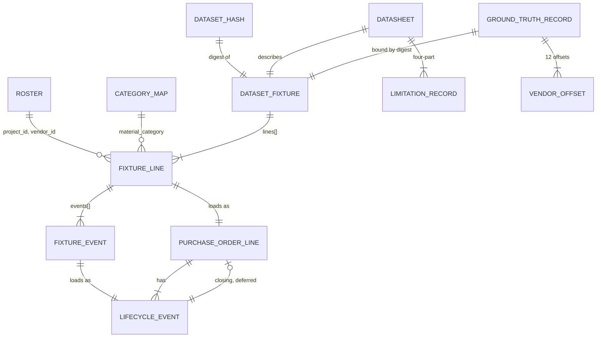

# Data Model — Synthetic Procurement History

> Feature: `00005-synthetic-procurement-history` (E005) | Storage: **no new database objects** | Migrations: **none** — the reserved filename block `0200`–`0299` is claimed and goes unused

**This epic creates no table, column, constraint, index, view, function, or migration.** `purchase_order_line` and `lifecycle_event` were delivered by E003 in migration `0007` and are **fixed input** here: E005 writes rows into them and alters neither. The normative record of those tables is [`specs/00003-core-data-schema/data-model.md`](../00003-core-data-schema/data-model.md) and the live DDL at `src/model/src/model/schema/versions/0007_procurement.py`. Where this document names a column, a type, or a constraint, it is **quoting a contract it does not own**.

What this document *does* own is the shape of the three committed file artifacts, the row-level mapping from fixture field to delivered column, the value domains the delivered `CHECK` constraints will accept, the write order the delivered foreign keys force, and the declared generative constants the datasheet publishes.

## Conventions

| Aspect | Rule |
|--------|------|
| Artifact format | JSON for machine-readable artifacts, Markdown for the datasheet. No new datastore, no second serialization format. |
| Digest form | `sha256:` + 64 lowercase hex, matching `model.corpus.manifest.DIGEST_PATTERN` and the delivered `ck_pol__roster_hash_format`. Uppercase hex and an unprefixed digest are both refused. |
| Canonical serialization | `model.roster.reader.canonical_bytes(payload)` — sorted keys, `separators=(",",":")`, `ensure_ascii=False`, UTF-8, **no indentation, and no trailing newline**. This describes the in-memory byte string the digest is taken over, **not** the committed file. Reused, never re-implemented; `research.md` §Canonical serialization states the same rule set in the same terms. |
| Committed file layout | `json.dumps(payload, indent=2, sort_keys=True, ensure_ascii=False)` + exactly one trailing `\n`, written with `Path.write_bytes` (never text mode). The *hash* is over the compact canonical form of the **parsed** payload, so file layout and git line-ending normalisation cannot move it. |
| Canonical form vs committed file — not a contradiction | The canonical form carries **no trailing newline** and the committed file carries **exactly one**. These are two different byte strings: the file is what a reviewer reads, the canonical re-serialization of the *parsed* payload is what the digest covers (AD-001). Neither value may be changed to match the other; the distinction is the mechanism, because a digest over file bytes would move under git end-of-line normalisation and a digest over parsed content cannot. |
| Real numbers in the fixture | Never a JSON float. `quantity` is a decimal **string**; every other numeric fixture field is an integer. Float repr is removed from the reproducibility oracle entirely. |
| Real numbers elsewhere | Ground-truth record and datasheet emit JSON numbers rounded to 6 decimal places. Neither is the reproducibility oracle. |
| Dates and instants | Calendar anchors as `YYYY-MM-DD`. Event instants as RFC 3339 UTC with a literal `Z`, always at `T00:00:00Z` — durations are whole days, so a time-of-day would be invented precision and a local zone would make "is this line late" depend on the reader. |
| Clock | Nothing in the generation path reads a clock. `generation_date`, `as_of_date` and the order-date window are committed literal constants (FR-009). A run-date default would move the committed content hash the day after generation while the recorded seed still looked honoured. |
| Surrogate keys | `uuid5`, derived from the natural key. Not random: the loader must know a terminal event's `event_id` *before* it inserts the closed line that points at it (see **Write Order**), and a reload must land on the same key on every database. |
| Identifiers not owned here | Every `PRJ-###` and `VND-###` comes from `read_roster()`. No project or vendor identity is restated in E005 source, fixture, or configuration (FR-001). |

## Delivered Schema — Fixed Input

The contract E005 writes against. Full detail is E003's; this is the subset that constrains the fixture.

| Delivered object | What it forces on E005 |
|---|---|
| `uq_purchase_order_line__natural (project_id, po_number, line_number)` | The dataset's natural key. Idempotent reload (FR-025) and divergence detection (FR-026) are both keyed on it. |
| `ck_pol__project_id_format`, `ck_pol__vendor_id_format` | `^PRJ-[0-9]{3}$`, `^VND-[0-9]{3}$` — anchored, so no affix. |
| `ck_pol__roster_hash_format` | `^sha256:[0-9a-f]{64}$`, exactly the form `content_hash()` emits. |
| Six presence checks (`material_category`, `description`, `manufacturer`, `part_number`, `unit_of_measure`, `po_number`) | Non-blank after trimming ` \t\n\r\f`. All six descriptive columns are NOT NULL — FR-031's obligation is structural, not stylistic. |
| `ck_pol__quantity_positive` | `quantity > 0`. `numeric`, so measured quantities are representable. |
| `ck_pol__need_by_not_before_order` | `need_by_date >= order_date`. Same-day is legal. |
| `ck_pol__criticality_band` | `smallint BETWEEN 1 AND 5`, 5 = most critical. |
| `ck_pol__lifecycle_state`, `ck_lifecycle_event__to_state` | The closed seven-state set. Duplicated in the DDL; E005 must satisfy both. |
| `ck_pol__closed_iff_closing_event`, `ck_pol__closed_iff_delivered` | **Immediate.** A closed line must be inserted already naming its closing event *and* already in `delivered`. |
| `fk_purchase_order_line__closing_event` | `MATCH FULL`, **`DEFERRABLE INITIALLY DEFERRED`** — the schema's only deferrable constraint. The pointed-at event may be absent mid-transaction and must exist, belong to this line, and be terminal at COMMIT. |
| `ck_lifecycle_event__terminal_iff_delivered` | `is_terminal = (to_state = 'delivered')`, both directions. |
| `ck_lifecycle_event__first_has_no_predecessor`, `ck_lifecycle_event__first_is_submitted` | Sequence 1 has `from_state IS NULL` and `to_state = 'submitted'`; every later position must state a `from_state`. |
| `fn_is_legal_lifecycle_transition` via `ck_lifecycle_event__legal_transition` | The seven legal ordered pairs. See **State Machine Conformance**. |
| `fk_lifecycle_event__chain` | `MATCH SIMPLE`, **not deferrable**. Event *n* references event *n−1* on the same line, so a line's events insert in ascending `sequence_no` (FR-024). Sequence numbers are contiguous from 1 — a gap is unrepresentable. |
| `uq_lifecycle_event__line_sequence` | One event per position. **Rework repeats states, never positions.** |
| `purchase_order_line.created_at timestamptz NOT NULL DEFAULT now()` — **on that table only**; `lifecycle_event` carries no `created_at` (`0007_procurement.py:210` is its single occurrence) | A load-time fact. **Excluded from every content comparison** — including it would make a reload of identical content look like divergence. |
| `lifecycle_event.note text NULL` | The one uncontrolled column. E005 writes `NULL` on every event; see **Ground-Truth Isolation**. |

**Not used, deliberately**: `ix_purchase_order_line__open` and `v_purchase_order_line_current_state` are read surfaces this epic populates for and never writes to. E003's gaps **G-3** (open-line state agreement) and **G-4** (`occurred_at` monotone with `sequence_no`) are cross-row and uncovered by the schema; E005 satisfies both by construction and re-asserts them as DV-rules below rather than assuming E003's tests cover its data.

## Entities

The compact artifact. Detail follows; a downstream agent that reads only this table has the shape.

| Entity | Attributes (name: type, constraints) | Relationships | State Transitions |
|--------|--------------------------------------|---------------|-------------------|
| **DatasetFixture** *(committed file)* | `dataset_schema_version: int` = 1; `layer: text` = `SYNTHETIC`; `generator_id: text`; `generator_revision: int` ≥1; `root_seed: int` ≥0; `seed_derivation: text`; `generation_date: date`; `as_of_date: date`; `order_date_window: {first: date, last: date}` `CHECK(first <= last < as_of)`; `generation_inputs: [{path: text, digest: text, digest_kind: 'raw_bytes'|'canonical_content'}]` exactly 2 entries; `library_pin: {numpy: text}`; `license_basis: {basis_id='project-generated-no-third-party-rights', generated_by_this_project=true, third_party_rights='NONE', statement: text}`; `lines: FixtureLine[]` 190–210, sorted | has_many: `FixtureLine`; hashed by `DatasetHash`; described by `Datasheet`; bound to `GroundTruthRecord` by digest | — |
| **FixtureLine** *(record)* | `project_id: text` `^PRJ-[0-9]{3}$`; `vendor_id: text` `^VND-[0-9]{3}$`; `po_number: text` `^PO-[0-9]{3}-[0-9]{4}$`; `line_number: int` 1–3; `material_category: text` ∈ 20 map keys; `description: text` non-blank; `manufacturer: text` non-blank; `part_number: text` `^[A-Z]{3}-[0-9]{6}-[0-9]{4}$`; `quantity: decimal-string` >0, **scale exactly 1** (`^(0\|[1-9][0-9]{0,2})\.[0-9]$`); `unit_of_measure: text` ∈ 5 values; `order_date: date`; `need_by_date: date` `CHECK(>= order_date)`; `criticality: int` 1–5; `events: FixtureEvent[]` ≥1 | belongs_to: `DatasetFixture`; has_many: `FixtureEvent`; loads_as: `purchase_order_line`; identity from **Roster**; category from **CategoryMap** | Line state = last event's `to_state`; see **State Machine Conformance** |
| **FixtureEvent** *(record)* | `sequence_no: int` ≥1, contiguous from 1; `to_state: text` ∈ 7 values; `occurred_at: text` RFC 3339 UTC `T00:00:00Z`, strictly increasing with `sequence_no`, ≤ `as_of_date` | belongs_to: `FixtureLine`; loads_as: `lifecycle_event` | 7 states, one rework cycle, `delivered` terminal |
| **DatasetHash** *(committed file, part of the fixture artifact)* | `dataset_schema_version: int`; `dataset_content_hash: text` digest over `canonical_bytes(parsed fixture payload)`; `hashed_object: text` = `canonical_bytes(dataset fixture payload)` | describes: `DatasetFixture` | — |
| **Datasheet** *(committed file)* | Seven named sections; `GenerationDisclosure` rows; `LimitationRecord` rows; realized-vs-intended statistic rows | describes: `DatasetFixture`; publishes σ, τ and the ratio — **never** the per-vendor offsets | — |
| **LimitationRecord** *(row in Datasheet)* | `scope_decision: text`; `supporting_evidence: text`; `reversal_trigger: text`; `production_scale_alternative: text` — all four mandatory | belongs_to: `Datasheet` | — |
| **GroundTruthRecord** *(committed file, isolated)* | `truth_schema_version: int`; `generator_id`, `generator_revision`, `root_seed`, `generation_date`; `dataset_content_hash: text`; `within_vendor_spread_sd_log: number`; `between_vendor_spread_sd_log: number`; `spread_ratio: number`; `spread_ratio_unadjusted: number`; `variance_decomposition: {vendor, material_category, residual}`; `vendor_offsets: VendorOffset[]` **exactly 12**; `material_category_tier_offsets: map<tier, number>` | binds_to: `DatasetFixture` by `dataset_content_hash`; **no relationship to any loaded table** | — |
| **VendorOffset** *(record)* | `vendor_id: text` `^VND-[0-9]{3}$` UNIQUE; `offset_log: number` | belongs_to: `GroundTruthRecord`; covers 100% of roster vendors | — |
| `purchase_order_line` *(delivered — not created here)* | See E003 §`purchase_order_line` | 1:N `lifecycle_event`; deferred N:1 closing event | See E003 §State Machines |
| `lifecycle_event` *(delivered — not created here)* | See E003 §`lifecycle_event` | N:1 `purchase_order_line`; self composite FK chains the sequence | — |

Artifact / table relationships (visual reference)

## Artifact 1 — Dataset Fixture

Two files, one artifact: the payload and its digest sidecar. The digest cannot live inside the payload it covers, and putting it in the datasheet alone would make the reproducibility oracle a markdown parse.

| File | Contents |
|---|---|
| `data/procurement/procurement-history.json` | The envelope and `lines[]`. |
| `data/procurement/procurement-history.hash.json` | `dataset_content_hash` over `canonical_bytes` of the parsed payload, plus the name of what was hashed. |

*Directory is a proposal; FR-018 assigns path selection to planning. The binding constraint is in **Ground-Truth Isolation**.*

### Envelope

| Field | Type | Domain / rule | Source |
|---|---|---|---|
| `dataset_schema_version` | int | `1`. Bumped when a reader would mis-parse an older payload. | declared |
| `layer` | text | `SYNTHETIC`. The label FR-015 requires; also the value E003's `document.source_kind` uses. | declared |
| `generator_id` | text | `model.procurement.generate` | declared |
| `generator_revision` | int | ≥1, hand-incremented when generator behaviour changes. **Not a git commit sha** — writing the fixture changes the commit, so a sha recorded inside it can never be the sha that produced it. | declared |
| `root_seed` | int | Committed literal. Recorded verbatim; per-line streams are spawned, never derived by arithmetic. | declared |
| `seed_derivation` | text | The scheme, stated in full (FR-015). See **Determinism**. | declared |
| `generation_date` | date | Committed constant. No clock is read. | declared |
| `as_of_date` | date | Committed constant. The snapshot; censoring derives from it (FR-009). | declared |
| `order_date_window` | object | `{first, last}`, both committed constants, `first <= last`, `last < as_of_date`. | declared |
| `generation_inputs` | list | **Exactly three entries**, each `{path, digest, digest_kind}`, repository-relative: `data/roster/project-vendor-roster.json` with `digest_kind: canonical_content`, `data/corpus/synthetic/equipment-category-map.json` with `digest_kind: raw_bytes`, and `data/corpus/synthetic/manufacturer-catalog.json` with `digest_kind: raw_bytes` — the catalog joined the set on 2026-07-26 when E002 published it, and both E002 inputs are hashed raw because that is the convention E002's own manifests record for them. The kind is recorded per entry because the two are hashed by different conventions (G-3) and a reader of the committed artifact would otherwise have no way to tell which digest to recompute. A missing entry is an error, never an omission. | computed |
| `library_pin` | object | `{"numpy": "2.4.6"}` — the version the reproducibility claim is scoped to (FR-022). | declared |
| `license_basis` | object | Basis `project-generated-no-third-party-rights`, `generated_by_this_project: true`, `third_party_rights: "NONE"`, plus a statement. Same closed shape E002's `SyntheticLicenseBasis` already publishes. | declared |
| `lines` | array | 190–210 records, sorted by `(project_id, po_number, line_number)`. | generated |

**The envelope's field set is closed.** These thirteen keys, all of them mandatory, and **no others**: `dataset_schema_version`, `layer`, `generator_id`, `generator_revision`, `root_seed`, `seed_derivation`, `generation_date`, `as_of_date`, `order_date_window`, `generation_inputs`, `library_pin`, `license_basis`, `lines`. There is no optional envelope field and no extension point. A key present in one document and absent from another is a defect in one of them, never a field that is optionally inside the hashed payload — and because the digest is over the whole parsed payload, an extra key is not a harmless addition but a different dataset. The same closure applies to the line record and the event record below: **this document's field tables are the normative enumeration of the hashed payload**, and any other artifact that lists these fields is summarising it rather than defining a second shape. Widening any of the three requires a `dataset_schema_version` bump.

`purchase_order_line.roster_hash` is stamped from `generation_inputs["data/roster/project-vendor-roster.json"]`. **The value is not repeated per line record.** FR-002 is an obligation at the storage boundary — the spec's own compliance audit reads it that way — and 199 copies of one constant inside a hashed artifact is a value that can disagree with itself for no gain.

### Line record — generated fields only

Derived values are absent by design: the delivered schema enforces every biconditional that would relate them, so storing them would add a second place for the same fact to be wrong.

| Field | Type | Value domain | How produced |
|---|---|---|---|
| `project_id` | text | The 5 roster project ids | Allocation pass (no RNG) |
| `vendor_id` | text | The 12 roster vendor ids | Allocation pass (no RNG) |
| `po_number` | text | `^PO-[0-9]{3}-[0-9]{4}$` — project digits, then a per-project PO ordinal | Allocation pass |
| `line_number` | int | 1–3, contiguous from 1 within a PO | Allocation pass |
| `material_category` | text | One of the **20 keys** of `equipment-category-map.json`, verbatim (`WATER_CHILLER`, …). Not a label, not a section code — the key is the shared token (FR-031). | Drawn |
| `description` | text | Corpus-overlapping lines: `^<Category Title Case> \(Tag [1-5]0[1-3]-[1-9][0-9]\)$`, E002's own `MaterialItem.description` composition. Non-overlapping lines: `^<Category Title Case> — <descriptor>$`. Non-blank either way. | Drawn |
| `manufacturer` | text | `^[A-Z][a-z]+(vane\|crest\|forge\|helm\|ridge\|stone) (Manufacturing\|Equipment\|Controls\|Electric\|Thermal)$`. Stem suffixes and trade nouns are **disjoint** from E001's vendor convention, so a manufacturer can never be read as a roster vendor. The vocabulary is a closed tuple in generator source, not a data file — otherwise it would be a third generation input and FR-015's enumeration of two would be wrong. | Drawn |
| `part_number` | text | `^[A-Z]{3}-[0-9]{6}-[0-9]{4}$` — a 3-letter manufacturer code, the category's MasterFormat section with spaces removed, a 4-digit suffix. Deterministic in manufacturer + category, so it cannot name a section the category map does not hold. | Derived from manufacturer + category, suffix drawn |
| `quantity` | decimal string | `> 0`, value in `[0.5, 480.0]`, **written at a fixed scale of exactly one digit after the decimal point** — `^(0\|[1-9][0-9]{0,2})\.[0-9]$`, so `6.0` and never `6` or `6.00`. The scale is fixed rather than bounded (AD-004, HINT-005): `numeric` equality ignores trailing zeros, so `12.50 = 12.5` in SQL while the two are different digests, and "at most one decimal place" would leave the loader's comparison and the reproducibility oracle able to disagree on the same value. Integer *value* `1`–`6` on corpus-overlapping lines, still written at scale 1 (`1.0`…`6.0`). | Drawn |
| `unit_of_measure` | text | `EA`, `LOT`, `SET`, `LF`, `M`. `EA` on corpus-overlapping lines. | Drawn |
| `order_date` | date | Inside `order_date_window`, inclusive. Equal to the date part of the sequence-1 event. | Drawn |
| `need_by_date` | date | `order_date + line_expected_total_duration_days + slack_days`, `>= order_date`. | Derived |
| `criticality` | int | 1–5, from the tier × tercile table. All five bands must occur. | Derived |
| `events` | array | ≥1 record, ascending `sequence_no` from 1 | Generated |

### Event record

| Field | Type | Value domain |
|---|---|---|
| `sequence_no` | int | ≥1, contiguous from 1, unique within the line |
| `to_state` | text | One of the seven delivered states |
| `occurred_at` | text | `YYYY-MM-DDT00:00:00Z`. Strictly increasing with `sequence_no`; `<= as_of_date`. Strictness is bought by the 1-day minimum-duration floor, which is why the floor exists rather than being cosmetic. |

`from_state`, `is_terminal` and `prev_sequence_no` are absent: the first is the previous record's `to_state`, the second is `to_state = 'delivered'`, the third is generated by the database. Recording them would give the fixture three ways to contradict constraints that will reject it anyway.

## Row-Level Mapping

| Delivered column | Origin | Rule |
|---|---|---|
| `purchase_order_line.po_line_id` | **derived** | `uuid5(NS_E005, "pol\|" + project_id + "\|" + po_number + "\|" + line_number)` — see **Name construction** below for the exact string |
| `project_id`, `vendor_id`, `po_number`, `line_number` | fixture | verbatim |
| `material_category`, `description`, `manufacturer`, `part_number`, `unit_of_measure` | fixture | verbatim — **the six FR-031 columns, all present, all non-blank** |
| `quantity` | fixture | decimal string cast to `numeric`, never via `float` |
| `order_date`, `need_by_date`, `criticality` | fixture | verbatim |
| `lifecycle_state` | **derived** | last event's `to_state` |
| `is_closed` | **derived** | last event's `to_state = 'delivered'` |
| `closing_event_id` | **derived** | `uuid5` of the terminal event when closed, else `NULL` |
| `closing_event_po_line_id`, `closing_event_terminal` | **database** | `GENERATED … STORED`; the loader must not supply them |
| `roster_hash` | fixture *(envelope)* | `generation_inputs[roster path]` — the one column sourced from the envelope rather than the line record, which is why it is carried once and not per line |
| `created_at` | **database** | `DEFAULT now()`; excluded from every content comparison |
| `lifecycle_event.event_id` | **derived** | `uuid5(NS_E005, "evt\|" + project_id + "\|" + po_number + "\|" + line_number + "\|" + sequence_no)` — see **Name construction** below |
| `lifecycle_event.po_line_id` | **derived** | the line's `uuid5` |
| `sequence_no`, `to_state`, `occurred_at` | fixture | verbatim; `occurred_at` parsed as UTC |
| `from_state` | **derived** | previous record's `to_state`; `NULL` at `sequence_no = 1` |
| `is_terminal` | **derived** | `to_state = 'delivered'` |
| `prev_sequence_no` | **database** | `GENERATED … STORED` |
| `note` | **constant** | always `NULL` |

**Every delivered column of both tables appears in the table above exactly once**, and the four origins are disjoint and exhaustive: **fixture** (copied from a fixture field, or from the envelope in `roster_hash`'s single case), **derived** (computed by the loader from fixture content), **database** (`GENERATED … STORED` or `DEFAULT`), **constant**. `purchase_order_line` has 21 columns and `lifecycle_event` has 9; both are fully enumerated. No column carries two origins and none is unassigned.

**What the loader supplies and what it must not.** Columns marked **fixture**, **derived** and **constant** the loader MUST supply in its `INSERT` column list. Columns marked **database** the loader MUST NOT name in any `INSERT` or `COPY` column list: `closing_event_po_line_id`, `closing_event_terminal` and `prev_sequence_no` are `GENERATED ALWAYS … STORED` and PostgreSQL rejects a supplied value outright, and `created_at` is a `DEFAULT now()` clock read that the loader may not perform if a reload is to compare equal. The distinction is not stylistic: a derived column the loader omits is a NOT NULL violation, and a generated column the loader supplies is a hard error.

**Name construction.** `NS_E005` is the committed UUID constant **`6a5c9561-8a6b-58f7-8fbd-db51856db549`**, pinned here as the single source and imported by the generator rather than restated in it. It is not an arbitrary magic number: it is itself `uuid5(NAMESPACE_URL, "https://github.com/jsh562/Procurement-Risk-Demo/specs/00005-synthetic-procurement-history")`, so any reader can recompute and verify it from a stable string rather than trusting a literal. Fixed once and never changed — changing it re-keys every row on every database and is a regeneration, not an edit. The `uuid5` *name* is the UTF-8 encoding of the components joined by a single `|` (U+007C), in the order shown, with the literal tag (`pol` / `evt`) first. Text components are copied verbatim from the fixture with no case folding, trimming or padding. Integer components — `line_number`, `sequence_no` — are rendered in base-10 ASCII with **no leading zeros and no sign** (`7`, never `07` or `+7`). No trailing separator, no terminating newline. Two readers following this paragraph and holding `NS_E005` compute the same uuid.

Deterministic keys are what let the loader compute a terminal event's `event_id` **before** inserting the closed line that names it, and what make a reload land on the same rows on any database.

## Write Order

Forced by the delivered constraints, not chosen.

1. **One transaction per line** (or per batch of whole lines — never a partial line).
2. `INSERT purchase_order_line` **first**: `fk_lifecycle_event__line` points at it. A delivered line is inserted already carrying `lifecycle_state = 'delivered'`, `is_closed = true`, and `closing_event_id` = the precomputed terminal `uuid5`, because `ck_pol__closed_iff_closing_event` and `ck_pol__closed_iff_delivered` are **immediate**. The pointer dangles; that is what the deferral is for.
3. `INSERT lifecycle_event` in **ascending `sequence_no`** (FR-024). `fk_lifecycle_event__chain` is not deferrable, so event *n* requires event *n−1* to be already visible. No bulk unordered load, no `COPY` into this table without ordering.
4. `COMMIT`. `fk_purchase_order_line__closing_event` is validated here: the named event must exist, belong to this line, and carry `is_terminal = true` (FR-029, SC-011).

Deletion, if ever needed, is the exact reverse: events in descending `sequence_no`, then the line, in one transaction. No `ON DELETE` action can help — `SET NULL` is refused against the generated referencing columns.

## Load Decisions

The loader has **three** outcomes and no fourth. There is no `UPDATE` path: content divergence is refused, never repaired.

| Precondition observed in a read-only pre-flight | Outcome | Requirement |
|---|---|---|
| Database holds a line whose natural key the fixture does not contain | **Refuse**, naming the extra keys | FR-030, SC-022 |
| Natural key present in both, and any compared value differs | **Refuse**, naming the key and the differing fields | FR-026, SC-010 |
| Natural key present in both, all compared values equal | **Skip** — no statement issued | FR-025, SC-009 |
| Natural key absent from the database | **Insert** per **Write Order** | FR-023, SC-008 |
| Any recorded generation-input digest ≠ the input recomputed now | **Refuse**, naming the input | FR-027 |

**Compared content** is defined field by field, positively, so that neither side can be widened by accident.

| Table | Compared (17 + 6 fields) | Excluded, and why |
|---|---|---|
| `purchase_order_line` | `project_id`, `vendor_id`, `po_number`, `line_number`, `material_category`, `description`, `manufacturer`, `part_number`, `quantity`, `unit_of_measure`, `order_date`, `need_by_date`, `criticality`, `lifecycle_state`, `is_closed`, `closing_event_id`, `roster_hash` | `created_at` — a **load-time fact** from `DEFAULT now()`; it differs on every load by construction, so comparing it would make a reload of identical content register as divergence. `closing_event_po_line_id`, `closing_event_terminal` — **`GENERATED ALWAYS … STORED`**, pure functions of `closing_event_id` and `po_line_id`, which are themselves compared or determined by the natural key; they can carry no information the projection does not already hold, and the loader cannot write them (see §Row-Level Mapping). `po_line_id` — `uuid5` of the natural key the comparison is joined on, so it is equal whenever the join matches and carries no independent content. |
| `lifecycle_event`, as the line's full list ordered by `sequence_no` | `sequence_no`, `from_state`, `to_state`, `is_terminal`, `occurred_at`, `note` | `event_id`, `po_line_id` — `uuid5` of the natural key plus `sequence_no`, both already compared. `prev_sequence_no` — **`GENERATED ALWAYS … STORED`** from `sequence_no`. `lifecycle_event` has no `created_at` to exclude. `note` **is** compared, not excluded: DV-022 requires it `NULL` on every E005 event, so comparing it is free, and leaving the one uncontrolled text column out of the projection would give a divergent generation a place to differ without refusing. |

Every exclusion is either a column the database writes and the loader cannot (`GENERATED`, `DEFAULT now()`) or a deterministic function of a compared column. No exclusion is a content field. The superset check (FR-030) is over the **whole** `purchase_order_line` table: E005 is the only writer of it in this project, so "lines the fixture does not contain" needs no scoping predicate.

Row **counts** are never the comparison. A regeneration under the same seed policy produces the same natural keys with different content, which moves no count at all.

## Generation Inputs and Digest Kinds

Three digests, three different things. They are named separately for the reason E002 names its five separately: a reader who assumes two digests are the same kind draws the wrong conclusion from a match.

| Kind | Over what | Produced by | Recorded in |
|---|---|---|---|
| roster digest | The roster's **canonical re-serialized content** | `model.roster.reader.read_roster().content_hash` — consumed verbatim, **never recomputed** | `generation_inputs`, and stamped on every loaded row |
| category-map digest | The category map's **raw committed bytes** | `model.corpus.manifest.sha256_of_file` | `generation_inputs` |
| dataset content hash | `canonical_bytes(parsed fixture payload)` | `model.corpus.manifest.sha256_of_bytes` | `procurement-history.hash.json`, and in the ground-truth record as the binding |

**The category-map digest is `sha256_of_file` over raw bytes, matching the value E002's manifests already record for the same file.** Each generation input is hashed the way its owning epic publishes it: the roster through `roster.reader.content_hash` (canonical content, which is what E001 publishes and what `ck_pol__roster_hash_format` receives), and the category map through `corpus.manifest.sha256_of_file` (raw bytes, which is what E002's `generation_input_digests` records at `manifest.py:253`).

An earlier revision of this document chose canonical content for the category map on the grounds that a raw-byte digest moves when git normalises a line ending. **That reasoning does not apply to this file**: `.gitattributes:13` pins `data/corpus/**/*.json text eol=lf`, so its bytes are stable across checkouts. The cost of the divergence was concrete and was measured — the two digests for the same file are `sha256:9308c206…` (raw) and `sha256:3ba1ea6a…` (canonical), and recording the second while E002 records the first would put two different values for one file into the repository, which a later reader can only read as one of them being wrong.

FR-027 is symmetric across both inputs: an edited category map changes what the dataset *means* exactly as an edited roster does.

## Determinism

| Property | Mechanism |
|---|---|
| Reproducibility oracle (FR-021) | Content equality of `dataset_content_hash`. Never an assertion about random-number streams. |
| Per-line independence (FR-019) | `SeedSequence(entropy=root_seed, spawn_key=(line_stream_key,))`, where `line_stream_key = int.from_bytes(sha256("<project_id>\|<po_number>\|<line_number>".encode("utf-8")).digest()[:8], "big")`. **Content-addressed, not positional** — adding or reordering a line changes no other line's draws. Never `root_seed + i`, which overlaps streams. |
| Allocation is not drawn | Project counts, vendor counts and PO grouping come from declared vectors and a deterministic fill. This is what makes the line keys — and therefore the stream keys — independent of any draw. |
| Output ordering (FR-020) | `lines` sorted by `(project_id, po_number, line_number)`; `events` by `sequence_no`. No iteration over a set or over a dict keyed by a hash-randomised string reaches the write path. |
| Byte stability | `write_bytes`, never text mode. Hash over canonical content, not over file bytes. |
| Scope limit (FR-022) | `numpy==2.4.6`. NumPy reserves the right to change `Generator` streams on a feature release, so the claim is scoped and the scope is reported rather than a false reproduction being claimed. `src/model/pyproject.toml` declares `numpy>=2.4.6` — a floor, not a pin; the lockfile is what pins, and the fixture records the resolved version. |
| Negative control (SC-013) | A different `root_seed` must produce a different `dataset_content_hash`. The check must be able to fail. |

## State Machine Conformance

Legal transitions, exactly as `fn_is_legal_lifecycle_transition` and its two sibling checks admit them:

| From | To | Used by E005 |
|---|---|---|
| *(NULL, sequence 1)* | `submitted` | Every line's opening event |
| `submitted` | `under_review` | Forward |
| `under_review` | `approved` | Forward |
| `under_review` | `revise_and_resubmit` | Rework entry |
| `revise_and_resubmit` | `submitted` | Rework return |
| `approved` | `released_for_fabrication` | Forward |
| `released_for_fabrication` | `shipped` | Forward |
| `shipped` | `delivered` | Terminal |

**Six forward transitions**, counting the opening `(NULL → submitted)`. The opening transition carries no elapsed duration — it *is* the clock start, and `order_date` equals its date — so the aggregate submitted-to-delivered duration is apportioned across the **five inter-event durations** of the clean path. Recorded explicitly because FR-007 says "six forward transitions" and a reader counting durations will find five; the two counts describe the same path and must not be reconciled by inventing a sixth duration.

A line with *L* rework loops has the event sequence
`submitted, under_review, [revise_and_resubmit, submitted, under_review] × L, approved, released_for_fabrication, shipped, delivered`
— `6 + 3L` events on the uncensored path, `L ≤ 3`. Each loop repeats three **states** at three new **positions**; `uq_lifecycle_event__line_sequence` makes repeating a position impossible, and the two `revise_and_resubmit → submitted` pairs of a double loop remain separately recoverable by `sequence_no`.

**Censoring is truncation, not concealment.** Every event whose instant would fall after `as_of_date` is not generated. There is no hidden future in the fixture, and `max(occurred_at) <= as_of_date` is a checkable property rather than a promise.

## Declared Generative Constants

The intended side of every "intended vs realized" pair the datasheet publishes. Values marked **calibrated** are solved numerically at generation and the solved value is recorded; the identity that solves them is stated here so the solve is auditable rather than tuned.

### Allocation

| Vendor | `VND-001` | `002` | `003` | `004` | `005` | `006` | `007` | `008` | `009` | `010` | `011` | `012` | Σ |
|---|---|---|---|---|---|---|---|---|---|---|---|---|---|
| Lines | 35 | 28 | 24 | 21 | 18 | 16 | 14 | 12 | 10 | 9 | 7 | 5 | **199** |
| Implied shrinkage ρ at τ/σ = 0.24 | 0.67 | 0.62 | 0.58 | 0.55 | 0.51 | 0.48 | 0.45 | 0.41 | 0.37 | 0.34 | 0.29 | 0.22 | — |

ρⱼ = τ²/(τ² + σ²/nⱼ). The endpoints reproduce FR-004's claimed 0.22–0.67 span exactly, which is why 5 and 35 are the endpoints — a threefold span in shrinkage is what makes pooling visibly *differential*.

Projects: `PRJ-001…004` = 40 lines each, `PRJ-005` = 39. Allocated by a deterministic greedy fill — vendors in ascending id, each line dealt to the project with the largest remaining quota, ties by ascending `project_id` — so both margins are met **exactly** and the realized cross-tab is recorded. PO grouping follows the cyclic size pattern `(1,1,2,1,3,1,1,2,1,1)` within a `(project, vendor)` group, so every PO's lines share a project *and* a vendor and `line_number >= 2` is exercised.

### Duration model

Lognormal per transition, on the log scale, whole days, `max(1, round(draw))`. The 1-day floor is disclosed and load-bearing (it makes `occurred_at` strictly increasing).

| Transition | Share of the pre-rework aggregate mean |
|---|---|
| `submitted → under_review` | 0.12 |
| `under_review → approved` | 0.20 |
| `approved → released_for_fabrication` | 0.08 |
| `released_for_fabrication → shipped` | 0.46 |
| `shipped → delivered` | 0.14 |
| `under_review → revise_and_resubmit` *(rework)* | 0.16 |
| `revise_and_resubmit → submitted` *(rework)* | 0.12 |

| Symbol | Value | Basis |
|---|---|---|
| Aggregate median target | **61 days** | Product document's published illustration |
| Aggregate P80 target | **94 days** | Same sentence |
| Within-vendor log spread σ_w | **0.51** | Back-solved: ln(94/61) / z₀.₈₀ = 0.4324 / 0.8416 |
| Between-vendor log spread τ | **0.1224** | 0.24 × σ_w |
| Category log spread σ_c | **0.219** | From the tier offsets and their line weights |
| Residual log spread σ_r | **0.4605** | √(σ_w² − σ_c²) |
| Per-transition log scale σ₀ | **0.77** *(calibrated)* | Solved from (e^{σ₀²} − 1)·Σwₜ² = e^{σ_r²} − 1, Σwₜ² = 0.292 over the five forward legs |
| Pre-rework aggregate mean T_pre | *(calibrated)* | Solved so the **rework-inclusive** realized median is 61 ± 5 and P80 is 94 ± 8 (SC-023). Fitting before rework lands near 66 / 104 — STF-005 |

The aggregate target is an **approximation, not an identity**: a sum of independent lognormals is not lognormal. That is itself a disclosed assumption.

Offsets are additive on the log scale and applied to **every** transition of a line, so the line's whole timeline scales by `exp(b_v + c_k)` and the aggregate log-duration shifts by exactly `b_v + c_k`.

### Category tiers and per-category expected duration

Tier offsets are **mean-zero at the declared line weights** — `(8×0.20 + 8×0.00 + 4×(−0.40)) / 20 = 0` — so a category term cannot shift FR-007's aggregate target.

| Tier | Log offset c_k | Categories (of the 20 map keys) |
|---|---|---|
| **T1 — long-lead assembled plant** | +0.20 | `GENERATOR_ASSEMBLY`, `LIQUID_FILLED_TRANSFORMER`, `MEDIUM_VOLTAGE_SWITCHGEAR`, `PRIMARY_UNIT_SUBSTATION`, `SECONDARY_UNIT_SUBSTATION`, `WATER_CHILLER`, `COOLING_TOWER`, `HEATING_BOILER` |
| **T2 — engineered packaged equipment** | 0.00 | `AUTOMATIC_TRANSFER_SWITCH`, `COMPUTER_ROOM_AIR_CONDITIONER`, `ENERGY_RECOVERY_UNIT`, `LOW_VOLTAGE_SWITCHGEAR`, `PAD_MOUNTED_TRANSFORMER`, `STATIC_UNINTERRUPTIBLE_POWER_SUPPLY`, `SWITCHBOARD`, `VARIABLE_FREQUENCY_DRIVE` |
| **T3 — catalogue commodity** | −0.40 | `CIRCUIT_PROTECTIVE_DEVICE`, `HYDRONIC_PUMP`, `LOW_VOLTAGE_TRANSFORMER`, `MEDIUM_VOLTAGE_CABLE` |

**Two distinctly named duration quantities** (FR-035):

- `category_expected_duration_days` — `exp(μ_base + c_k + σ_w²/2)`, a property of the **category**. Intended: T1 ≈ 84.9, T2 ≈ 69.5, T3 ≈ 46.6.
- `line_expected_total_duration_days` — `exp(μ_base + c_k + b_v + σ_w²/2)`, a property of the **line**. Used by FR-011's need-by derivation.

Neither may be written where the other is meant.

### Slack, schedule pressure, criticality

`slack_days = max(0, round(line_expected_total_duration_days × f))`, `f ~ Normal(0.15, 0.10)` truncated at 0. Mean slack ≈ 10.4 days, **calibrated** so 25–35% of *delivered* lines miss their need-by date.

Slack is **multiplicative on the line's expected duration, not additive**, and that is a modelling decision with a data consequence: `schedule_pressure_ratio = slack_days / category_expected_duration_days` then reduces to approximately `f × exp(b_v)`, which is nearly independent of category. An additive slack would make T3's ratio systematically largest, collapsing the tier × tercile table onto its diagonal and leaving cells — and therefore criticality bands — unpopulated.

Terciles are computed over the realized dataset and the cut points are recorded. `TIGHT` = lowest tercile of the ratio (least slack per unit of expected duration).

| Tier \ Pressure | `TIGHT` | `MODERATE` | `RELAXED` |
|---|---|---|---|
| **T1** | 5 | 4 | 3 |
| **T2** | 4 | 3 | 2 |
| **T3** | 3 | 2 | 1 |

Nine cells, five distinct bands, every band reachable. Derivation direction is slack → pressure → band; criticality feeds nothing that produces slack, so there is no cycle (STF-003).

### Calendar and censoring

| Constant | Value | Consequence |
|---|---|---|
| `order_date_window.first` | `2025-06-16` | 289 days before the snapshot |
| `order_date_window.last` | `2026-02-16` | 44 days before the snapshot |
| `as_of_date` | `2026-04-01` | Administrative censoring point |

Intended realized shape at these constants: delivered ≈ **85%** (≈170 of 199), censored ≈ **15%**. That sits inside the band FR-010 forces from both ends — delivered ∈ [80%, 90%], because ≥80% must be delivered *and* ≥10% must be censored — and clears the absolute floor of 160 uncensored delivery events with roughly 10 events of margin.

The censored lines' current states follow the leg shares, so `approved` and `revise_and_resubmit` are the thin ones. FR-010 makes an empty non-terminal state a **hard failure**, not a warning; the remedy is a new seed or a widened window, never emitting the dataset anyway. Recorded here so the boundary is known before it is hit.

### Rework

**Declared, not drawn** — the allocation is an integer vector fixed before generation, exactly as the per-vendor line counts are, and for the same reason: a per-line draw cannot produce an exact realized count, so a criterion over it needs a tolerance, and at this dataset size no honest tolerance exists. The looped-line count is `L = round(0.30 x N)` over the realized line count `N`; at `N = 199` that is `L = 60`. Within `L`, the one/two/three-loop split is the declared vector **`(42, 13, 5)`** — the largest-remainder apportionment of `70 / 22 / 8` over 60, with one line moved into the three-loop stratum so it can never round below five. Largest remainder rather than round-half-up because independent rounding of the three shares does not sum to `L`, and the three-loop stratum is the reason the split exists at all: it is the only stratum small enough for a rounding rule to erase, and erasing it collapses the approval-cycle covariate the downstream forecast consumes from three strata to two. Which specific lines receive loops is still drawn from each line's own stream; only the counts are declared, so the allocation is reproducible **and** exactly assertable. Hard cap 3. Realized counts are recorded beside the declared ones and must equal them. The rate itself is separately *declared, not cited* — no published resubmittal convention was found — which is a statement about provenance, not about the draw.

### Corpus overlap (FR-032)

A line is **corpus-overlapping** when all four clauses hold. The predicate is computable from the two declared generation inputs plus the roster — no corpus document is opened and no foreign key or citation into the corpus exists.

| # | Clause | Corpus counterpart |
|---|---|---|
| 1 | `material_category` ∈ the 20 keys of `equipment-category-map.json` | E002's `equipment_category` field, same token |
| 2 | `description` matches E002's own composition, `<Category Title Case> (Tag <tag>)`, `tag ~ ^[1-5]0[1-3]-[1-9][0-9]$` | E002's `material_item` field |
| 3 | `quantity` an integer *value* in `[1, 6]` — written at the fixed scale of 1, so `1.0`…`6.0` — **and** `unit_of_measure = 'EA'` | E002's published quantity domain |
| 4 | `vendor_id` resolves through the roster to a vendor name | E002's `vendor_name` field |

Target ≥ **60%**; realized share recorded. The complement is genuinely non-overlapping — measured quantities outside `[1,6]`, non-`EA` units, and descriptions in E005's own `<Category> — <descriptor>` grammar — so SC-025 can fail rather than passing by construction.

**What this overlap is and is not.** It is *vocabulary* overlap, which is what FR-032's own text claims ("the four fields E002's published vocabulary already carries") and what the Glossary means by "shared vocabulary, not a document reference". It is **not** instance-level equality against a specific corpus item: E002 publishes no machine-readable item inventory, so the `(Tag …)` component of a description will rarely coincide with a real corpus item's tag. The join surface that does hold exactly is `equipment_category` + `vendor_name` + the **material-item stem**, the description with its parenthetical tag removed. E009 must normalise the tag out, or block on category; recorded as an integration obligation under **Disclosed Gaps** (G-1) and as a datasheet limitation.

### Not achievable — recorded, not designed away

`manufacturer` and `part_number` are **generated and non-blank** because FR-031 requires values in all six descriptive columns and the delivered schema refuses a blank. They are **not** drawn from E002's corpus, because E002's field vocabulary publishes neither field — its synthetic layer is submittal transmittals, whose fields are workflow fields. **FR-034 and SC-026 are therefore unsatisfiable by this epic, are marked pending, and are excluded from this epic's completion denominator.** No model in this document attempts to satisfy them, and nothing here may be read as satisfying them. The corpus-side gap is carried as a four-part limitation in the datasheet with its reversal trigger and production-scale alternative.

## Artifact 2 — Datasheet

`data/procurement/datasheet.md`. **Emitted by the generator**, not hand-written, so every realized figure in it is written by the same run that wrote the fixture and cannot drift from it. Deterministic: no clock read, `generation_date` is the committed constant, so a re-run at an unchanged seed rewrites no byte.

### Seven required sections (FR-014)

| # | Section | Must carry |
|---|---|---|
| 1 | Motivation | Why synthetic; why auditability rather than plausibility; the three P1 epics blocked without it |
| 2 | Composition | Line count, event count, per-project and per-vendor realized counts, the criticality histogram, the state histogram at the as-of date, the corpus-overlap share. No personal data statement. |
| 3 | **Generation Process** *(replaces Collection Process)* | Everything in the disclosure list below |
| 4 | Preprocessing and Labeling | Rounding and floor rules; tercile cut points; the tier assignment; the criticality table in full; that criticality is **derived** and slack is **drawn** |
| 5 | Uses | What the dataset supports; explicitly what it does **not** evidence; that no train/evaluation split is emitted and **ownership of the split is unassigned** (FR-028, FR-033, SC-021) |
| 6 | Distribution | That the fixture is **not a corpus document and carries no corpus manifest entry**; licence basis `project-generated-no-third-party-rights`; generated wholly by this project from a committed seed and the E001 roster; no third-party rights attach (FR-015) |
| 7 | Maintenance | Regeneration procedure; that a roster or category-map edit invalidates the recorded digest and requires regeneration rather than patching |

### Generation Process disclosures (FR-015, SC-018)

| Item | Form |
|---|---|
| Generator identity and revision | `generator_id` + `generator_revision` |
| Root seed and derivation scheme | The integer, and the `SeedSequence` spawn-key scheme in full |
| Generation date | The committed constant |
| Layer label | `SYNTHETIC` |
| **Content hash of every generation input** | **Both named**: the E001 roster fixture and `data/corpus/synthetic/equipment-category-map.json` |
| Per-transition duration assumptions | Family, parameter names and values **in the generator's own parameterization**, time unit, rounding rule, 1-day floor, and the apportionment shares |
| Vendor and category offsets | σ_w, τ, σ_c, σ_r, the **FR-036 variance decomposition** — vendor / material-category / residual, each reported — and **both** ratios: the category-adjusted one asserted against FR-008's band and the unadjusted one beside it, so a ratio inside the band for category reasons is not merely visible but fails |
| As-of date and order-date window | The committed constants |
| Realized vs intended | Censored share, uncensored delivery-event count, per-vendor line-count dispersion, both spread ratios and their absolute spreads, rework share and loop histogram, aggregate median and P80 **over the pre-truncation population** with the **delivered-only** median and P80 beside them, late share **with the count of censored lines already past need-by at the as-of date**, overlap share, realized per-project split |
| Which criterion bounds which figure | For each realized figure, the criterion carrying its bound — SC-006 for censored share and event count, SC-002 for per-vendor line-count spread, SC-007 for the spread ratio, SC-004 for the rework rate, SC-023 for median and P80, SC-024 for the late share, SC-025 for the overlap share. Recorded because SC-016 bounds disclosure only, and a reader must not mistake a recorded value for a checked one |
| Cross-epic assumption | FR-033's **assumed** held-out fraction of 0.25, recorded as an assumption this epic neither performs nor observes |

**The datasheet publishes σ_w, τ and the ratio. It must not publish the per-vendor offset vector.** That vector is the answer a later fit is scored against and it lives only in the isolated ground-truth record. The line is drawn there because the datasheet ships beside the fixture, inside whatever root a fitting job reads.

### Limitation records (FR-016, SC-017)

Every record carries **all four** parts — scope decision, supporting evidence, reversal trigger, production-scale alternative. 100% coverage is asserted, not assumed. The **format rule** and the **minimum set** are separate obligations and are separated here.

| # | Scope decision recorded | Source |
|---|---|---|
| L-1 | Insufficient for validating vendor-level tail behaviour | FR-016 minimum |
| L-2 | Reproducibility claim is scoped to a pinned environment | FR-016 minimum |
| L-3 | Rework rate is declared, not cited | FR-016 minimum |
| L-4 | FR-008's spread-ratio target and band are derived, not cited | FR-016 minimum |
| L-5 | ~~No manufacturer or part-number overlap with E002's corpus~~ — **withdrawn 2026-07-26 by the reversal this record declared**. E002 published both fields and a manufacturer catalog, so the dataset now supports cross-document identity resolution on the key E009 blocks with, at the share FR-034 requires and SC-026 records. Kept as a withdrawn record, not deleted: a datasheet limitation that names its own reversal condition and is then withdrawn by it is the evidence the condition was written to be observable rather than rhetorical | This document, G-1 (closed); FR-034 / SC-026, both live |
| L-6 | The duration model is a stand-in for real lead-time behaviour | FR-016 minimum |
| L-7 | **No row-level generation provenance** — a loaded row carries the roster hash but not the dataset content hash or generator revision, so it is traceable to the roster it was generated against, not to the run that produced it | FR-016 minimum |
| L-8 | The post-split uncensored event count is bounded only through FR-033's **assumed** 0.25; this epic neither performs the split nor observes it | FR-016 minimum |
| L-9 | Corpus overlap is at **vocabulary** level, not instance level; the material-item tag will rarely coincide with a real corpus item | This document, §Corpus overlap |
| L-10 | FR-011's 25–35% late band sits **below** the 38% in the same published sentence FR-007's 61/94 pair comes from; the departure is recorded, not reconciled | FR-011 |

## Artifact 3 — Ground-Truth Record

| Field | Type | Rule |
|---|---|---|
| `truth_schema_version` | int | `1` |
| `generator_id`, `generator_revision`, `root_seed`, `generation_date` | as envelope | Must equal the fixture's |
| `dataset_content_hash` | digest | **The binding.** Equals `procurement-history.hash.json`'s value, so "the offsets recorded are the ones the dataset was actually generated from" is checkable rather than asserted (US5 AS3) |
| `within_vendor_spread_sd_log` | number | Realized σ_w |
| `between_vendor_spread_sd_log` | number | Realized τ |
| `spread_ratio` | number | **The category-adjusted ratio** — the vendor component net of the material-category component, taken from `variance_decomposition`. This is the quantity asserted against `[0.12, 0.49]` (FR-036, SC-027) |
| `spread_ratio_unadjusted` | number | τ / σ_w computed without removing the category component. Recorded beside the adjusted value, never asserted against the band; an unadjusted value inside the band whose adjusted counterpart is outside it is a generation failure (DV-011) |
| `variance_decomposition` | object | `{vendor, material_category, residual}` variance components (FR-036) |
| `vendor_offsets` | array | **Exactly 12** records, `{vendor_id, offset_log}`, `vendor_id` unique and covering 100% of roster vendors (SC-019) |
| `material_category_tier_offsets` | object | `{T1, T2, T3}` → realized log offsets |

### Ground-Truth Isolation (FR-018, SC-020)

Three independent facts, each separately checkable:

1. **No loaded column carries any of it.** `purchase_order_line` and `lifecycle_event` between them have exactly one provenance column, `roster_hash`; `lifecycle_event.note` — the only uncontrolled text column in either table — is written `NULL` on every event. There is no column into which an offset, a seed, a σ or a τ could be placed, and none is placed.
2. **The fixture does not carry it.** No envelope field and no line field is a vendor offset or a function of one alone. Durations are the observable data and are supposed to be readable; the parameters behind them are not in the file.
3. **The file sits outside every fitting input root.** The rule, not a path: the record's directory must not be, and must not be a descendant of, any directory the model-fitting entry point resolves as an input root — and the enforcing check **enumerates those roots from that entry point's own configuration**, never from a hand-maintained exclusion list. Since the dataset fixture is expected to be inside such a root, the ground-truth record must not share the fixture's directory. **The path is planning's to fix and planning has fixed it**: `data/ground-truth/vendor-offsets.json` (plan.md §AD-007 and § Data Model Summary), a separate tree from `data/procurement/`, which satisfies the rule. **The rule is this document's** and is what FR-018 states — FR-018 names no path, so relocating the record is a plan amendment that leaves this rule untouched, and any path stated here is quoting plan.md rather than competing with it.

## Validation Rules

Machine-checkable properties over the emitted artifacts. Each is a build-gating assertion, not a review note.

| # | Rule |
|---|---|
| DV-001 | 190 ≤ `len(lines)` ≤ 210; all 5 projects and all 12 vendors present; every `project_id` / `vendor_id` in `read_roster().identifiers()` |
| DV-002 | Per-vendor counts equal the declared vector exactly; per-project counts equal the declared vector exactly |
| DV-003 | `(project_id, po_number, line_number)` unique; `line_number` contiguous from 1 within a PO; every PO's lines share one `project_id` and one `vendor_id` |
| DV-004 | Every `material_category` is a key of the committed category map; the six descriptive fields are all present and non-blank after trimming ` \t\n\r\f` |
| DV-005 | `quantity` matches `^(0\|[1-9][0-9]{0,2})\.[0-9]$` — a positive decimal at a **fixed scale of exactly 1** — with value in `[0.5, 480.0]`; `unit_of_measure` ∈ the five values |
| DV-006 | `order_date` inside the window; `need_by_date >= order_date`; `criticality ∈ 1..5` and all five bands occur |
| DV-007 | Every line has ≥1 event; `sequence_no` contiguous from 1; event 1 is `submitted`; every adjacent pair is a legal transition; no state repeats a position |
| DV-008 | `occurred_at` strictly increasing with `sequence_no`; date of event 1 equals `order_date`; `max(occurred_at) <= as_of_date` (E003 gaps G-3 and G-4, satisfied by construction and re-asserted here) |
| DV-009 | No line exceeds 3 rework loops; the realized looped-line count **equals** the declared `L = round(0.30 x N)` and the realized one/two/three histogram **equals** the declared `(42, 13, 5)` at `N = 199` — equality, not recording, because FR-006 declares the allocation |
| DV-010 | The realized delivered share lies in the single admissible window `[max(0.80, 160/N), 0.90]` at realized line count *N*: uncensored delivery events ≥ `max(0.80 × N, 160)`, censored share ≥ 10%, and **every** non-terminal state holds ≥1 line at the as-of date. The three bounds are asserted **jointly**, not each alone. **Both binding regimes of the event floor are exercised** — the absolute floor of 160 below *N* = 200, the 80% share at and above it. Failure is a refusal to emit, with the shortfall reported |
| DV-011 | The ratio asserted against `[0.12, 0.49]` is the **vendor component net of the material-category component**; the unadjusted ratio and all three components (vendor / material-category / residual) are recorded alongside; an unadjusted ratio inside the band whose category-adjusted counterpart falls outside it is a **failure**, not a reported observation |
| DV-012 | Aggregate submitted-to-delivered duration **including rework**, measured over the named population — **every generated line's full duration as drawn, before as-of-date truncation**, not the delivered subpopulation: median within 5 days of 61, P80 within 8 days of 94. The delivered-only median and P80 are computed and recorded beside them as a disclosed, untoleranced figure, so the censoring bias is visible. The population exists only pre-truncation, so this is a generation-time assertion and is re-checked by regeneration (DV-015) rather than re-derived from the fixture |
| DV-013 | 25% ≤ share of delivered lines missing need-by ≤ 35%. Denominator is **delivered lines only**: a censored line is excluded from numerator and denominator even when already past its need-by date at the as-of date, and the count of such already-overdue censored lines is recorded |
| DV-014 | Corpus-overlap share ≥ 60% under the four-clause **vocabulary-level** predicate; every line in the non-overlapping complement fails **all four** clauses, so the share can fall below the threshold rather than being satisfied by construction |
| DV-015 | `dataset_content_hash` recomputed from the parsed fixture equals the committed sidecar value; a different `root_seed` yields a different value |
| DV-016 | Both recorded generation-input digests equal the inputs recomputed now, **each under the convention it was recorded with**; a mismatch refuses and names which input moved. **Each input has its own failing case** — a mutated roster and a mutated category map are exercised separately, so the half added by remediation B-5 is evidenced rather than inferred from the other |
| DV-017 | `vendor_offsets` has exactly 12 unique `vendor_id`s covering the roster; the record's `dataset_content_hash` matches the fixture's |
| DV-018 | The ground-truth record's resolved directory is outside every input root enumerated from the fitting entry point's configuration. The enumerated set must be **non-empty** — see DV-026 |
| DV-019 | The datasheet carries all seven named sections and 100% of its limitation records carry all four parts. A limitation record missing any one part **must fail this rule**, demonstrated on a deliberately three-part record, so the 100% is measured by a checker that inspects rather than by one that inspects nothing |
| DV-020 | No train/evaluation split artifact is emitted, where "split artifact" is the checkable condition and not an open negative: the emitted set is exactly the fixture, its digest sidecar, the datasheet and the ground-truth record; no emitted file partitions `lines[]` into named subsets or folds; and no line record and no envelope field carries a split label, fold index or held-out flag. The datasheet states ownership of the split is unassigned |
| DV-021 | No generated `manufacturer` normalizes into `data/roster/real-firm-exclusions.json`; no `manufacturer` matches E001's vendor name pattern. **Required by FR-037**, which states the obligation directly rather than inheriting it: Scope inherits E001's exclusion list for projects and vendors, whose identities are read from the roster, and manufacturer names are a name space this epic invents |
| DV-022 | Every event's `note` is absent from the fixture and written `NULL` at load |
| DV-023 | **Deterministic ordering (FR-020)**: `lines` is sorted ascending by `(project_id, po_number, line_number)` and each line's `events` ascending by `sequence_no`; two runs at the same seed in the pinned environment emit byte-identical payloads. Asserted over the artifact, so hash-ordered iteration reaching the write path fails here rather than surviving as a review note |
| DV-024 | **Per-line independence (FR-019)**: regenerating with one line added to, or moved within, the declared allocation leaves every other line's generated values unchanged. Asserted over the artifact, so a positionally seeded stream fails here rather than being caught only by inspection |
| DV-025 | **Provenance agreement (SC-018, FR-022)**: every provenance value in the datasheet equals its counterpart in the fixture envelope — `generator_id`, `generator_revision`, `root_seed`, `seed_derivation`, `generation_date`, `as_of_date`, `order_date_window`, `library_pin`, and both input digests — and `library_pin` equals the library version **actually resolved in the generating environment**. Presence and well-formedness do not discharge this rule |
| DV-026 | **Non-vacuous isolation (SC-020)**: the root set enumerated for DV-018 is **non-empty** and contains the dataset fixture's directory. An enumeration resolving to nothing fails here rather than satisfying DV-018 over an empty set — no model-fitting entry point exists yet, so the empty enumeration is the expected accident, and a vacuous pass is indistinguishable in a report from a satisfied criterion |
| DV-027 | **Refusal leaves no trace (SC-010, SC-022, FR-024)**: the loader inserts each line's events in ascending `sequence_no`, and every refusal leaves the database **unchanged** — the transaction is rolled back, so no row is inserted, altered or removed before a content-divergence or superset refusal. A partial insert followed by a refusal fails this rule |

### Enforcement point and test tier

Each rule names **where the failure is excluded** and **which tier proves it**. Without the first, a green result leaves "the delivered schema would reject this" indistinguishable from "the generator asserted it" — two different exclusions with two different blast radii. Without the second, a rule has no owner in the test plan. The four tiers are the ones `plan.md` § Testing Strategy declares: **Unit**, **Property**, **Integration**, **Build-gating**. Two tiers on one rule means both are required and neither substitutes for the other.

| Rule | Enforcement point | Tier |
|---|---|---|
| DV-001 | Generator — refusal to emit | Unit |
| DV-002 | Generator — refusal to emit | Property |
| DV-003 | Generator — refusal to emit; uniqueness *also* by the delivered `uq_purchase_order_line__natural`. The one-project-one-vendor clause is **generator-only** (G-2) | Unit + Integration |
| DV-004 | Generator — refusal to emit; non-blankness *also* by the six delivered presence CHECKs at load | Unit + Integration |
| DV-005 | Generator — refusal to emit; positivity *also* by `ck_pol__quantity_positive`. The **fixed scale** is generator-only — `numeric` equality ignores trailing zeros | Unit + Integration |
| DV-006 | Generator — refusal to emit; the two date/band bounds *also* by delivered CHECKs. **All-five-bands-occur is generator-only** | Property + Integration |
| DV-007 | Generator — refusal to emit; legality and first-event shape *also* by `fn_is_legal_lifecycle_transition` and its two sibling CHECKs | Unit + Integration |
| DV-008 | Generator **only** — the delivered schema enforces none of it (E003 G-3, G-4) | Property |
| DV-009 | Generator — refusal to emit | Unit |
| DV-010 | Generator — refusal to emit, before any artifact is written | Property |
| DV-011 | Generator — refusal to emit | Property |
| DV-012 | Generator — refusal to emit; re-checked by regeneration, not re-derivable from the fixture | Property |
| DV-013 | Generator — refusal to emit | Property |
| DV-014 | Generator — refusal to emit | Unit |
| DV-015 | Validator — non-zero exit | Unit + Build-gating |
| DV-016 | Validator and loader — refusal naming the input | Unit + Integration |
| DV-017 | Validator — non-zero exit | Unit |
| DV-018 | Build-gating check over the repository tree | Build-gating |
| DV-019 | Validator — non-zero exit | Unit |
| DV-020 | Build-gating check over the emitted artifact set | Build-gating |
| DV-021 | Generator — refusal to emit | Unit |
| DV-022 | Generator (absent from fixture) and loader (written `NULL`) | Unit + Integration |
| DV-023 | Generator — refusal to emit; asserted over the emitted artifact | Unit + Property |
| DV-024 | Generator — refusal to emit; asserted over the emitted artifact | Property |
| DV-025 | Validator — non-zero exit | Unit |
| DV-026 | Build-gating check | Build-gating |
| DV-027 | Loader — refusal with rollback | Integration |

## Disclosed Gaps

Properties this data model does not enforce structurally, recorded as uncovered rather than claimed.

| # | Gap | Why | Covered by |
|---|---|---|---|
| G-1 | ~~E009's blocking key finds no true pairs on `manufacturer` / `part_number`~~ — **closed 2026-07-26**. Pairs on `material_item` still require the tag normalised out; that half stands | E002 published both fields plus `manufacturer-catalog.json`, so the corpus side of the join now exists | **Closed by the trigger it declared.** The recorded condition was "E002's published field vocabulary contains a manufacturer field *and* a part-number field"; E002 satisfied it, so FR-034 and SC-026 are live and inside the completion denominator, and L-5 no longer discloses them as unachievable. The detector E005 owned has **inverted**: it asserted the fields were absent and failed when they arrived — it has now fired, and T077 rewrites it to assert they are *present* and fail if withdrawn. Recorded rather than deleted because the fired trigger is the evidence that watching a blocked dependency with a check rather than a note is what closed it. The `material_item` leg remains an integration obligation on E009 |
| G-2 | "Every PO's lines share one vendor" is not a database constraint | Cross-row within a natural-key group; the delivered `UNIQUE` does not carry `vendor_id` and E005 may not add one | DV-003 |
| G-3 | Two generation inputs are hashed by **different conventions** — the roster by canonical content, the category map by raw bytes | Each matches the convention its owning epic publishes, so E005's recorded value agrees with E001's and E002's respectively. The alternative, one convention for both, would make one of the two disagree with its owner | Recorded in §Generation Inputs; a test asserts the category-map digest equals `corpus.manifest.sha256_of_file` and the roster digest equals `roster.reader.content_hash` |
| G-4 | A loaded row cannot be traced to the generation run that produced it | The delivered schema has no column for a dataset content hash or generator revision, and E005 may not add one | Datasheet limitation **L-7** |
| G-5 | The realized post-split uncensored count is never observed by this epic | This epic does not perform the split; FR-033's 0.25 is an assumption | Datasheet limitation **L-8**; a divergence is an amendment, never a floor adjustment here |
| G-6 | An empty non-terminal state at the as-of date is possible under an unlucky seed | Censoring is derived from a date, not targeted | DV-010 makes it a loud generation failure; §Calendar records the thin states in advance |

## Scale Assumptions

| Object | Expected volume | Consequence |
|---|---|---|
| `purchase_order_line` rows | ~199 | Matches E003's ~200 assumption. Every delivered index is effectively free. |
| `lifecycle_event` rows | ~1,050–1,250 | Inside E003's ~1,500 assumption. |
| `procurement-history.json` | ~400–600 KB pretty-printed | Reviewable in a diff; the hash is over the compact form, so layout is free to change without moving it. |
| Load duration | one transaction per line, ~200 transactions | No batching optimisation in scope. |

## Requirement Traceability

| Requirement | Carried by |
|---|---|
| FR-001 | §Conventions (identifiers not owned here); §Line record — `project_id` / `vendor_id` from `read_roster()`; DV-001 |
| FR-002 | §Row-Level Mapping — `roster_hash` from `generation_inputs`, stamped on every row; §Envelope records why it is not repeated per line |
| FR-003 | §Allocation — project vector 40/40/40/40/39; DV-001, DV-002 |
| FR-004 | §Allocation — the declared 12-vendor vector and its shrinkage row; DV-002 |
| FR-005 | §State Machine Conformance; DV-007 |
| FR-006 | §Rework; §State Machine Conformance (`6 + 3L` events, `L ≤ 3`); DV-009 |
| FR-007 | §Duration model — family, shares, σ₀ identity, 1-day floor, rounding; DV-012 |
| FR-008 | §Duration model — σ_w, τ, σ_c, σ_r; §Ground-Truth Record; DV-011 |
| FR-009 | §Conventions (clock); §Calendar and censoring — both constants literal, `last < as_of_date` |
| FR-010 | §Calendar and censoring — the derived [80%, 90%] delivered band and the 160 floor; DV-010; G-6 |
| FR-011 | §Slack — multiplicative factor, calibration; DV-013; limitation L-10 |
| FR-012 | §Slack, schedule pressure, criticality — the tier × tercile table and the derivation direction |
| FR-013 | §Conventions (canonical serialization, committed file layout); §Artifact 1 |
| FR-014 | §Artifact 2 — the seven named sections; DV-019 |
| FR-015 | §Generation Process disclosures — both inputs named; §Datasheet section 6 for the Distribution licence-basis line; DV-019, DV-025 (every recorded value equals the one the run used) |
| FR-016 | §Limitation records — four-part format rule and the ten-record minimum set, separated; DV-019 |
| FR-017 | §Artifact 3 — σ_w, τ, 12 vendor offsets; DV-017 |
| FR-018 | §Ground-Truth Isolation — three facts; the boundary rule, not a path; DV-018, DV-022, DV-026 (the enumerated root set is non-empty) |
| FR-019 | §Determinism — content-addressed `spawn_key`; allocation is not drawn; DV-024 |
| FR-020 | §Determinism — sort orders; no set/dict iteration in the write path; DV-023 |
| FR-021 | §Generation Inputs and Digest Kinds — `dataset_content_hash`; DV-015 |
| FR-022 | §Determinism — `numpy==2.4.6`, and the note that pyproject declares a floor; DV-025 (recorded pin equals the resolved version) |
| FR-023 | §Row-Level Mapping; §Write Order — no object altered, none created |
| FR-024 | §Write Order step 3 — ascending `sequence_no`, chain FK not deferrable; DV-027 |
| FR-025 | §Load Decisions — Skip row; content compared, never counts |
| FR-026 | §Load Decisions — Refuse-on-divergence; the compared-content definition; `created_at` excluded |
| FR-027 | §Generation Inputs — symmetric across both inputs; DV-016 |
| FR-028 | §Datasheet section 5; DV-020 |
| FR-029 | §Write Order steps 2 and 4 — immediate closure checks at INSERT, deferred FK at COMMIT |
| FR-030 | §Load Decisions — superset refusal, scoped to the whole table |
| FR-031 | §Line record and §Row-Level Mapping — all six descriptive columns present and non-blank, category from the committed map; §Generation Inputs records the map's digest; DV-004 |
| FR-032 | §Corpus overlap — the four-clause predicate and the falsifiable complement; DV-014 |
| FR-033 | §Generation Process disclosures — the assumed 0.25 as a cross-epic assumption; limitation L-8; gap G-5 |
| FR-034 | §Corpus overlap — manufacturer and part number drawn from `manufacturer-catalog.json`, in the completion denominator; gap G-1 closed, limitation L-5 withdrawn |
| FR-035 | §Category tiers — three tiers over the 20 map keys, mean-zero offsets, and the two distinctly named duration quantities |
| FR-036 | §Duration model and §Ground-Truth Record — the vendor / category / residual decomposition, and the category-adjusted ratio as the quantity asserted against FR-008's band; DV-011 |
| FR-037 | §Line record — `manufacturer` drawn from E002's published catalog rather than invented, asserted disjoint from E001's real-firm exclusion list and from its vendor-name convention; DV-021 |

## Data Model Summary

Paste target for `plan.md`.

| Entity | Key Fields | Relationships | Notes |
|--------|-----------|---------------|-------|
| `DatasetFixture` | natural key per line `(project_id, po_number, line_number)` | 1:N `FixtureLine`; described by `Datasheet`; digested by `DatasetHash` | Committed JSON, 190–210 lines. Envelope carries seed, derivation scheme, as-of date, order-date window, both generation-input digests, NumPy pin and licence basis. Hash is over `canonical_bytes` of the **parsed** payload, so file layout and line endings cannot move it. |
| `FixtureLine` | `(project_id, po_number, line_number)` | 1:N `FixtureEvent`; loads as `purchase_order_line` | 13 **generated** fields only. `lifecycle_state`, `is_closed`, `closing_event_id`, `from_state`, `is_terminal` and both uuid keys are **derived at load**. All six FR-031 descriptive columns present and non-blank. |
| `FixtureEvent` | `(line, sequence_no)` | loads as `lifecycle_event` | `sequence_no` contiguous from 1, `occurred_at` strictly increasing and ≤ as-of. Insert order is ascending `sequence_no` — `fk_lifecycle_event__chain` is not deferrable. |
| `Datasheet` | — | 1:N `LimitationRecord` | Seven named sections, generator-emitted. Publishes σ_w, τ, the ratio and the FR-036 decomposition — **never** the per-vendor offsets. Ten four-part limitation records. |
| `GroundTruthRecord` | `dataset_content_hash` binds it to one fixture | 1:12 `VendorOffset` | Isolated: no loaded column, no fixture field, and no directory inside a fitting input root carries any of it. `lifecycle_event.note` is `NULL` on every event. |
| `purchase_order_line` *(delivered)* | `po_line_id` PK (uuid5 of the natural key); UK `(project_id, po_number, line_number)` | 1:N `lifecycle_event`; deferred N:1 closing event | **Not created here.** Written to only. Closed line inserted already delivered and already naming its precomputed terminal `event_id`; the deferred FK proves the referent at COMMIT. |
| `lifecycle_event` *(delivered)* | `event_id` PK (uuid5); UK `(po_line_id, sequence_no)` | N:1 `purchase_order_line`; self composite FK chains the sequence | **Not created here.** Rework repeats states at new positions, never positions. `note` always `NULL`. |
