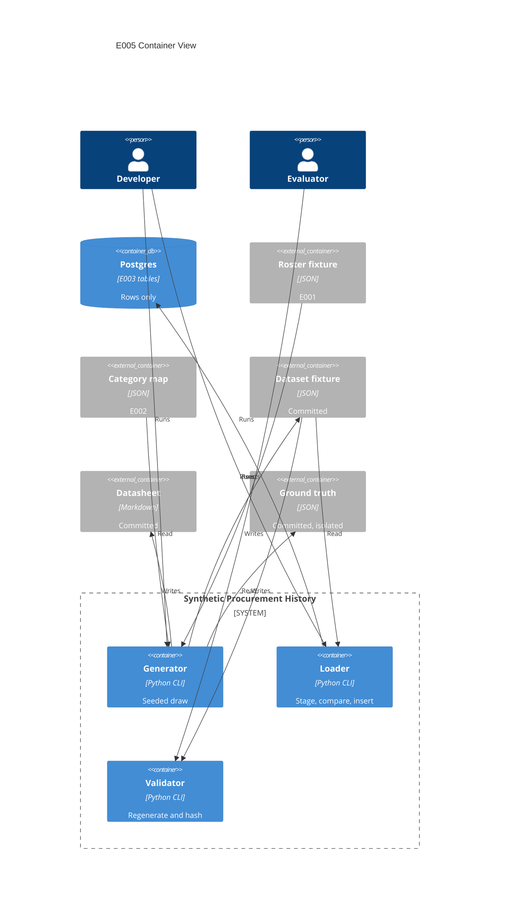

# Implementation Plan: Synthetic Procurement History

**Branch**: `00005-synthetic-procurement-history` | **Epic**: E005 | **Spec**: [spec.md](spec.md) | **Date**: 2026-07-26

## Summary

- **Deliverable**: a seeded generator, a loader, and a validator in the modeling entry, producing three committed artifacts — dataset fixture, datasheet, ground-truth record — and writing rows into the procurement tables E003 already delivered.
- **Shape**: no DDL, no API. One new package `model.procurement`, three console entry points, following the pattern `model.corpus` already established.
- **Hard property**: regeneration from the recorded seed reproduces the committed content hash exactly, and the loader refuses rather than merges when the database disagrees with the fixture.

## Technical Context

| Field | Value |
|---|---|
| Language/Version | Python 3.12 (`src/model` only) |
| Primary Dependencies | NumPy (generator), psycopg 3 + SQLAlchemy (loader), jsonschema (fixture validation) — all already declared |
| Storage | PostgreSQL 16 — rows into `purchase_order_line` and `lifecycle_event`; **no DDL, no migration** |
| Testing | pytest + Hypothesis (property-based, mandatory for the deterministic computation modules) |
| Target Platform | Linux container; local Docker Compose on `${PRC_DB_PORT:-5434}` |
| Project Type | single (this epic touches no web or API surface) |
| Project Mode | brownfield |
| Performance Goals | N/A — offline batch generation, ~200 lines |
| Constraints | Seeded and reproducible; synthetic only; roster and category map read, never redeclared |
| Scale/Scope | 190–210 lines, 5 projects, 12 vendors, ~1,500 lifecycle events |

Baseline from [specs/sad.md](../sad.md), narrowed to what this epic touches. Nothing here departs from the registered stack.

## Instructions Check

| Gate | Status |
|---|---|
| Governing version | `project-instructions.md` **v1.2.3** |
| Spec compliance | **PASS — 0 findings** ([spec.md](spec.md) § Compliance Check). The gate was re-run against the remediated spec during this phase, as the spec required, rather than self-certified there. |
| Plan compliance | See § Compliance Result, populated by the post-design audit. |
| Complexity Tracking | Omitted — no principle violation requires justification. |

## Architecture



## Architecture Decisions

| ID | Question | Options | Decision | Rationale |
|---|---|---|---|---|
| AD-001 | How is the fixture canonicalized and hashed? | New helper / reuse existing / third copy | Reuse `model.roster.reader.canonical_bytes` and `content_hash` | The rule set already exists **twice** identically (`roster/reader.py:55`, `corpus/model.py:255`): sorted keys, compact separators, `ensure_ascii=False`, UTF-8. Its digest covers re-serialized parsed content rather than file bytes, so git end-of-line normalisation cannot move it — the exact property FR-021 needs on a Windows checkout. Writing a third copy would be the defect, not the fix. |
| AD-002 | What format does the committed fixture take? | Single nested JSON / NDJSON / CSV | **One canonical JSON payload**, `procurement-history.json`, with an envelope and nested `lines[].events[]`, plus a `procurement-history.hash.json` sidecar | An earlier draft of this row chose two NDJSON streams for diff readability, which contradicted `data-model.md` in five places and left FR-021's oracle with no defined input — `canonical_bytes` takes *one* payload, so "the payload" must name something. Reconciled toward the data model: a single nested object is what `canonical_bytes` already accepts, and it is the shape E001's roster and E002's manifests both use, so this epic adds no third convention. Cost accepted: a one-record change re-indents its enclosing block in review. CSV stays rejected — it loses the null-versus-empty distinction the nullable `note` and `closing_event_id` need. |
| AD-003 | Where do surrogate keys come from? | `uuid4` / derived `uuid5` in the payload / derived `uuid5` at load | Derive `po_line_id` and `event_id` as `uuid5` over the natural key, **computed at load rather than written into the fixture** | `uuid.uuid4()` reads `os.urandom` and is **unaffected by the seed**, so drawing them that way would change the content hash on every run while the seed still appeared honoured — a silent defeat of FR-021 and SC-012. That is the load-bearing half and it holds either way. On where the value lives: a `uuid5` over a natural key the payload already carries is a pure function of data that is already there, so writing it in would create a second place for one fact to be wrong — the same reasoning that keeps `lifecycle_state`, `from_state` and the closure flags out of the fixture. The loader recomputes it; the comparison projection keys on the same computation. |
| AD-004 | How are numbers serialized? | Native floats / decimal strings / integers | Emit **no floats**: `quantity` as a fixed-scale decimal string, durations as whole-day integers, spreads quantized through `Decimal` | `round()` on a binary float is not a canonical decimal (`round(2.675, 2)` is `2.67`), and `json.dumps` emits non-standard `NaN`/`Infinity` unless `allow_nan=False`. Fixing `quantity`'s scale is separately load-bearing: `numeric` equality ignores trailing zeros, so `12.50 = 12.5` in SQL while the two differ in the digest. |
| AD-005 | How does the loader achieve idempotency and refusal? | `ON CONFLICT DO NOTHING` / `DO UPDATE` / staged comparison | Stage into unlogged `TEMP` tables, compare with `EXCEPT ALL` **in both directions**, then refuse or insert — one `REPEATABLE READ` transaction, `SET LOCAL TimeZone = 'UTC'` | "Equal or refuse" is a set-comparison problem, not a conflict-resolution one. `DO NOTHING` silently tolerates a divergent row under the same natural key — the precise case FR-026 must refuse — and `DO UPDATE` performs the merge FR-030 forbids. The reverse direction gives FR-030's superset check for free. `ON CONFLICT DO NOTHING` survives only as a concurrency guard with a `rowcount` assertion. |
| AD-006 | What satisfies FR-022's "pinned library version"? | Pin in `pyproject.toml` / rely on the lockfile / narrow range | The **`uv.lock` pin**, reproduced by `uv sync --locked` | `src/model` declares `numpy>=2.4.6`, a resolution constraint, while the lockfile carries the exact resolved version and CI already enforces it with `--locked`. The reproducibility claim is therefore already scoped to an exact version without touching the dependency spec or risking the PyMC/ArviZ resolution. The datasheet records the resolved version. |
| AD-007 | Where does the ground-truth record live? | Beside the fixture / separate tree | A separate tree, `data/ground-truth/`, never under `data/procurement/` | FR-018 requires it outside every directory a fitting entry point resolves as an input root. If it sat beside the fixture, any job reading the fixture directory would glob it. Physical separation makes SC-020's build-gating check a directory assertion rather than a filename exclusion list, which is what stops it rotting. |
| AD-008 | How are the gated requirement and criterion reported? | Fail / pass / excluded | **Discharged 2026-07-26.** FR-034 and SC-026 were excluded from the completion denominator and reported as `BLOCKED` while E002 published neither `manufacturer` nor `part_number`. E002 published both, so both are now live and count in the completion denominator: printed and completion denominators are equal at 37 and 33. `WITHDRAWN` was never used and is retired unused | The decision is kept rather than deleted because it is the record of how a blocked cross-epic dependency was reported without either claiming it passed or letting it fail the epic on another team's decision — and because the reversal trigger it carried is what detected the unblock. Counting it failing would have held `.qc-passed` hostage; counting it passing would have been a false claim; `BLOCKED` was the honest third state for as long as it was true |
| AD-009 | Is need-by slack additive or multiplicative on expected duration? | Additive days / multiplicative factor | **Multiplicative** on the line's expected total duration | Additive slack makes the longest-duration tier's pressure ratio systematically smallest and the shortest tier's largest, which collapses the category-tier × pressure-tercile table onto its diagonal and leaves criticality bands unpopulated. Multiplicative slack keeps pressure comparable across tiers, so the table FR-012 defines actually spans five bands. |
| AD-010 | How is each generation input hashed? | One convention for both / per-owner convention | **Per-owner**: roster by `roster.reader.content_hash` (canonical content), category map by `corpus.manifest.sha256_of_file` (raw bytes) | Each input is hashed the way its owning epic already publishes it, so E005's recorded value agrees with E001's and E002's rather than contradicting one of them. A first draft used canonical content for both, reasoning that raw bytes move under git line-ending normalisation — but `.gitattributes:13` pins `data/corpus/**/*.json text eol=lf`, so that risk does not exist for this file, and the two digests were measured as genuinely different (`sha256:9308c206…` raw versus `sha256:3ba1ea6a…` canonical). Recording the second while E002 records the first would put two values for one file in the repository. |

## Data Model Summary

| Artifact | Kind | Contents | Consumers |
|---|---|---|---|
| `procurement-history.json` | Committed fixture | One canonical payload: an envelope carrying `root_seed`, `as_of_date`, `order_date_window`, `generation_inputs` (each `{path, digest, digest_kind}`), `library_pin`, `license_basis`, and the roster hash once rather than per line; then `lines[]`, each with its natural key, the six descriptive columns, dates and criticality, and nested `events[]`. **Generated fields only** — the surrogate uuid keys, `lifecycle_state`, `is_closed`, `closing_event_id`, `from_state` and `is_terminal` are all derived at load and deliberately absent, so no fact has two homes | Loader, validator, E007, E009 |
| `procurement-history.hash.json` | Committed oracle | The `sha256:` digest of `canonical_bytes` over the whole payload above — the object FR-021 compares against | Validator |
| `datasheet.md` | Committed disclosure | Seven named sections; generation-process disclosures per FR-015; four-part limitation records per FR-016 | Evaluator, E015 |
| `vendor-offsets.json` | Ground truth, isolated | Within-vendor spread, between-vendor spread, realized offset per roster vendor | E007, E014 — never the fitting path |
| `purchase_order_line` | E003 table (rows only) | Populated from the fixture; no DDL | E007, E009, E010 |
| `lifecycle_event` | E003 table (rows only) | Populated in ascending `sequence_no`; no DDL | E007 |

Detail: [data-model.md](data-model.md). **No migration** — E005's reserved `0200`–`0299` block is claimed and expected to go unused.

**The hashed object is pinned in one place.** The `procurement-history.json` row above is a summary and is deliberately partial. The **normative** enumeration of the payload FR-021 hashes — its complete envelope, line and event field sets, each declared closed, and the total order of `lines[]` and of `events[]` within a line — is [data-model.md](data-model.md) §Envelope, §Line record, §Event record and §Determinism. Where this plan, `research.md` or any later artifact names those fields, it is quoting that enumeration and defers to it on any difference; none of them may introduce a field, drop one, or state a second ordering. This is the reconciliation AD-002 records, held open: the oracle's input has exactly one definition.

**Design constants, solved in the data model and internally consistent** — the plan records them so tasks do not re-derive them:

| Constant | Value | How it was fixed |
|---|---|---|
| Order-date window | `2025-06-16` … `2026-02-16` | Chosen jointly with the as-of date so the delivered share lands inside the `[80%, 90%]` window FR-010's two floors force |
| As-of date | `2026-04-01` | Yields ≈85% delivered / ≈15% censored, roughly 10 uncensored events of margin over the 160 floor |
| Within-vendor log spread σ_w | 0.51 | Back-solved from FR-007's 61-day median and 94-day P80 |
| Between-vendor spread τ | 0.1224 | σ_w × FR-008's 0.24 target; the **category-adjusted** realized ratio is what is asserted inside 0.12–0.49, with the unadjusted one recorded beside it (FR-036, SC-027) |
| Category tiers | 3, mean-zero log offsets | Mean-zero at the declared weights, so the category term cannot shift FR-007's aggregate target |
| Category / residual spreads | σ_c 0.219, σ_r 0.4605 | Fall out of the decomposition FR-036 requires |
| Per-vendor count vector | 35 … 5 across 12 vendors | Reproduces FR-004's claimed 0.22–0.67 shrinkage span exactly |

Two counting traps the data model names explicitly: the state machine has **six forward transitions but only five durations**, because the opening `NULL → submitted` has `order_date` as its clock start and carries no elapsed time; and the thin non-terminal states (`approved`, `revise_and_resubmit`) are the ones most at risk of holding no line at the as-of date, which FR-010's floor now forbids.

## API Surface Summary

N/A — no API surface. Three console entry points, no HTTP, no RPC. E007 and E009 read the database and the committed artifacts, not an interface this epic exposes.

## Testing Strategy

| Tier | Tool | Scope | Mock Boundary | Install |
|---|---|---|---|---|
| Unit | pytest | Lifecycle walk, equipment labelling and the overlap predicate, datasheet and ground-truth emission, path resolution — the modules the admission rule below leaves **out** of the property tier. `serialize.py` and `allocate.py` were here in an earlier draft and have moved to Property; they keep example-based unit tests as well, since a property tier is not a substitute for a worked case | Pure functions, no database | configured |
| Property | Hypothesis | Every module qualifying as a **deterministic computation module** under the admission rule below — `durations.py`, `censor.py`, `criticality.py`, `allocate.py`, `seeds.py`, `serialize.py`. **Mandatory** under the Testing & Quality Policy, with strict test-first. Six modules, each admitted by the rule rather than by enumeration **Seven** modules qualify, not six: `equipment.py` is admitted by the same three-clause rule — DV-014 is a rule this epic writes rather than a delivered constraint, so it cannot discharge clause 3, and it is a floor, which catches an under-permissive predicate while an over-permissive one inflates the overlap share and passes silently. | Pure functions | configured |
| Build-gating | pytest, run in CI as a release gate | Assertions over the repository tree and the emitted artifact set rather than over a function: ground-truth isolation and its non-empty root enumeration (DV-018, DV-026), the emitted-artifact-set and no-split assertions (DV-020), the reproduction oracle in CI (DV-015), and the FR-034 unblocking trigger (§ Reporting Obligations). Declared as its own tier because these fail the build without exercising any unit under test, and the DV rules need a fourth tier to map onto | Repository tree and committed artifacts; no database | configured |
| Integration | pytest + live PostgreSQL | Loader idempotency, content-divergence refusal, superset refusal, insertion ordering, deferred closure at commit, and **the null-comparison semantics the divergence check rests on** — `EXCEPT`'s not-distinct treatment of NULL, exercised over the nullable columns actually in the comparison projection (`closing_event_id`, `from_state`, `note`), in both the equal-and-null and differ-on-null directions. Recorded as an assumption carrying its own evidence rather than a citation: `research.md` § Idempotent load could not confirm the semantics verbatim from official documentation, and three nullable columns depend on it, so a reload of two identical NULLs must be *proved* not to register as divergence rather than trusted to | Real database on `${PRC_DB_PORT:-5434}`; no fake stands in for a constraint | configured |
| Security | Ruff `S` | `src/model` — already enabled for this entry | N/A | configured |
| Coverage | coverage.py | `src/model/src/model/procurement` added to the root `source` list, or the package lands in the denominator uncounted | N/A | configured |

### What qualifies as a deterministic computation module

The Testing & Quality Policy names "risk arithmetic, fusion ranking, and scoring functions" — a list drawn from the forecasting epics, which does not by itself decide whether a *generator's* allocation fill or canonical serializer is in or out. An enumeration with no admission criterion cannot be checked for completeness, so the rule is stated and then applied to every module in § Project Structure.

**A module qualifies when all three hold:**

1. **Pure** — no I/O, no clock, no database, no environment read; output is a function of its arguments alone.
2. **Computes rather than transcribes** — its output is arithmetic, an ordinal assignment, a derived ordering, or a digest, not a copy of an input under a different name.
3. **Wrong is silent** — an incorrect result is a well-formed value that no delivered constraint, no schema, and no downstream parse rejects. This is the clause that does the work: it is Principle III at module granularity, and it is why `lifecycle.py` is *out* despite being pure arithmetic over a state walk.

| Module | Pure | Computes | Wrong is silent | Qualifies | Tier |
|---|---|---|---|---|---|
| `durations.py` | yes | lognormal draws, the σ₀ solve, the FR-036 decomposition | yes — a mis-apportioned leg still emits legal dates | **yes** | Property (mandatory) |
| `censor.py` | yes | date arithmetic against the as-of cut; the three shape floors | yes — a wrong truncation still emits a valid short line | **yes** | Property (mandatory) |
| `criticality.py` | yes | slack, pressure ratio, terciles, the tier × tercile band | yes — every wrong band is still an integer 1–5 the CHECK accepts | **yes** | Property (mandatory) |
| `allocate.py` | yes | the count vectors, the exact-margin fill, ρⱼ = τ²/(τ² + σ²/nⱼ) | yes — a wrong split still sums to a legal line count | **yes** | Property (mandatory) — **promoted from "optional but cheap"**: the 5-to-35 range and its 0.22–0.67 shrinkage span are *derived from* this identity (FR-004), so the arithmetic is load-bearing for a requirement, not a convenience |
| `seeds.py` | yes | the content-addressed `spawn_key` derivation | yes — an overlapping stream still produces plausible draws | **yes** | Property (mandatory) — **promoted**: SC-014 is universally quantified over every line, and a universal claim tested at a handful of examples is asserted, not shown |
| `serialize.py` | yes | canonical byte ordering, `Decimal` quantization | yes — a non-canonical digest is still 64 hex characters | **yes** | Property (mandatory) — **promoted from Unit**: this is the oracle FR-021 and SC-012 rest on. A serializer that is merely usually canonical makes every reproducibility claim in the epic unfalsifiable |
| `lifecycle.py` | yes | the state walk and rework insertion | **no** — an illegal transition is rejected by `fn_is_legal_lifecycle_transition`, a repeated position by `uq_lifecycle_event__line_sequence` | no | Unit + Integration |
| `equipment.py` | yes | vocabulary labelling and the overlap predicate | **no** — DV-014 is a rule this epic writes, not a delivered constraint, a schema or a downstream parse, so it cannot discharge clause 3; and it is a floor, which catches an *under*-permissive predicate while an *over*-permissive one inflates the realized share and passes silently | yes | **Property (mandatory)** |
| `model.py`, `paths.py` | yes | no — data classes and path resolution | n/a | no | Unit |
| `generate.py`, `load.py`, `validate.py`, `datasheet.py`, `truth.py` | no — file and database I/O | orchestration | n/a | no | Integration / Unit |

**"Date arithmetic" in the mandate resolves to `censor.py` and `criticality.py`** — no module of that name exists, and the arithmetic is split between the as-of truncation and the need-by derivation. Naming both closes the gap the Requirement Coverage Map leaves open.

### Mandated properties: relation class and input domain

Each mandated property declares what kind of relation it asserts and over which domain, so "property-based" names a specific obligation rather than a tool.

| Module | Property | Relation class | Input domain and boundary cases |
|---|---|---|---|
| `durations.py` | Aggregate median and P80 over the pre-truncation population land inside SC-023's 5-day and 8-day tolerances at the calibrated `T_pre` | Invariant | The five forward legs plus the two rework legs; 0–3 loops; draws rounding below the **1-day floor** |
| `durations.py` | Adding δ to a vendor offset shifts every one of that vendor's log durations by exactly δ | Metamorphic | δ across ±3τ; the 5-line vendor and the 35-line vendor |
| `durations.py` | σ_c² + σ_r² = σ_w² to the declared precision, and the components sum to total variance | Invariant (algebraic identity) | Realized category mixes including a vendor carrying one category only |
| `durations.py` | The category-adjusted ratio equals a direct one-way decomposition computed independently | Alternate implementation | Balanced and maximally unbalanced vendor × category cross-tabs |
| `censor.py` | No emitted instant exceeds the as-of date, and event 1's date equals `order_date` | Invariant | As-of dates **outside the order window** — before `first`, equal to `last`, and far after `last` |
| `censor.py` | A later as-of date never removes a line from the delivered set | Metamorphic (monotone) | As-of swept across and beyond the window |
| `criticality.py` | Every band is an integer 1–5 and equals the tier × tercile table cell for its inputs | Invariant | **Tercile ties at a cut point**; `slack_days = 0` at the truncation of `f`; all nine cells |
| `criticality.py` | Scaling a category's expected duration leaves the pressure tercile assignment unchanged (AD-009's reason for multiplicative slack) | Metamorphic | All three tiers; the diagonal-collapse case additive slack would produce |
| `allocate.py` | Per-vendor and per-project margins are met exactly and the totals agree | Invariant | Totals at 190 and at 210; the **five-line vendor**; the *N* = 200 crossover of FR-010's two floors |
| `seeds.py` | Inserting or reordering a line changes no other line's stream key | Metamorphic | Adjacent natural keys; `line_number` 1–3; the same PO across two projects |
| `seeds.py` | The stream key is a pure function of the natural key alone | Invariant | Full key space of the declared allocation |
| `serialize.py` | `parse(canonical_bytes(x))` equals `x` | Round-trip | Non-ASCII in `description`; `quantity` with a trailing zero; absent `note` |
| `serialize.py` | `canonical_bytes` is invariant to input key order and to committed file layout | Metamorphic | Shuffled key order; CRLF and LF checkouts; indented and compact files |

### The test-first observable

Strict red-green-refactor is a process obligation binding **all seven** qualifying modules, `equipment.py` included, and a process obligation no artifact evidences is indistinguishable from one nobody followed. The observable follows E004's precedent (`specs/00004-traced-model-gateway/tasks.md`): `tasks.md` MUST carry an explicit **mandatory red-green pairs** list naming, for each of the six modules above, the property-test task ID that precedes its implementation task ID, and the test task MUST be observed failing before its implementation task begins. The branch history carries a `test:` commit preceding the `feat:` commit for each pair — checkable before the squash merge, which is where a reviewer looks.

## Negative Controls

A refusal that has never refused, and a detector that has never detected, are indistinguishable in a green report from ones that work. SC-013 supplies the pattern for the reproducibility oracle; **the set of claims requiring the same treatment is enumerated here rather than left to the test author**, so completeness can be checked. A claim qualifies when its passing direction is satisfiable without the mechanism under it working — every refusal, every detector, every "none present" assertion, and every 100%-over-a-conforming-set count.

| # | Claim | Failing direction that must be demonstrated | Tier |
|---|---|---|---|
| NC-1 | SC-012 — regeneration reproduces the committed digest | A different `root_seed` yields a different digest (SC-013, already stated) | Build-gating |
| NC-2 | SC-020 / DV-018 — the ground-truth record is outside every fitting input root | A probe copy placed **inside** an enumerated root makes the check fail | Build-gating |
| NC-3 | SC-020 / DV-026 — the enumerated root set is non-empty | An enumeration resolving to the empty set fails rather than passing vacuously | Build-gating |
| NC-4 | SC-033 / FR-027 / DV-016 — generation-input drift is detected | **Two separate cases**: a mutated roster and a mutated category map, each refusing and naming *that* input. The category-map half was added by remediation B-5 and has no acceptance scenario of its own until US1 AS7 | Unit + Integration |
| NC-5 | SC-006 / DV-010 — generation fails loudly on a shape breach | **Three separate cases** — event floor, censoring floor, empty non-terminal state — each exiting non-zero with **no artifact written**. A run that happens to clear all three bounds evidences the passing half only | Property |
| NC-6 | SC-007 / SC-027 / DV-011 — the spread ratio is met for vendor reasons | A constructed dataset whose unadjusted ratio is inside the band and whose category-adjusted ratio is outside it **fails** | Property |
| NC-7 | SC-025 / DV-014 — the corpus-overlap share is real | A line from the non-overlapping complement fails **each** of the four clauses, so the share can fall below 60% | Unit |
| NC-8 | SC-017 / DV-019 — 100% of limitation records carry four parts | A deliberately three-part record fails the checker, so 100% is not achieved by a checker that inspects nothing | Unit |
| NC-9 | SC-010 / SC-022 / DV-027 — a divergent or superset load is refused | Both refusals demonstrated **with the database asserted unchanged afterwards**, not merely with a non-zero exit | Integration |
| NC-10 | SC-032 / FR-022 — an out-of-pin run reports a scope limit | An **injected** observed version outside the pin produces the scope-limit report and no reproduction claim | Unit |
| NC-11a | § Reporting Obligations — SC-026 is never reported as passing | A report rendering SC-026 as `PASS` fails the report-conformance check | Build-gating |
| NC-11b | § Reporting Obligations — FR-034 is never reported as satisfied | A report rendering FR-034 as `PASS` fails the report-conformance check. Split from NC-11a because A1-cont makes the requirement's printed row an obligation of equal standing to the criterion's, and this enumeration exists so completeness can be checked — an enumeration covering one side of a two-sided obligation is the thing it was meant to prevent. `tasks.md` T078 already covers both | Build-gating |
| NC-12 | § Reporting Obligations — the FR-034 blocked state is watched | `data/corpus/synthetic/field-label-vocabulary.json` — the artifact that publishes E002's field set — gaining `manufacturer` and `part_number` fails the unblocking-trigger check | Build-gating |

## Error Handling Strategy

| Error Category | Pattern | Response | Retry |
|---|---|---|---|
| Input validation | Fail-fast before any draw | Non-zero exit naming the offending input; nothing written | no |
| Shape breach (event floor, censoring floor, empty non-terminal state, **category-adjusted** spread ratio outside band, aggregate median or P80 outside SC-023's tolerance, late share outside 25–35%, overlap share below 60%, a manufacturer colliding with the real-firm exclusion list or the roster vendor convention) | Fail-fast after generation, before write | Non-zero exit reporting realized versus required; no artifact emitted | no |
| Generation-input drift (roster or category-map hash mismatch) | Refuse | Non-zero exit naming which input moved and both hashes | no |
| Load divergence (content under an existing natural key, or target rows the fixture lacks) | Refuse, transaction rolled back | Non-zero exit reporting the diverging keys; database unchanged | no |
| Concurrency (`rowcount` below the planned insert count) | Refuse | Non-zero exit; another writer raced the loader | no |

## Risk Mitigation

| Risk (from spec) | Mitigation | Owner |
|---|---|---|
| Vendor effects sized wrong make the dataset unfit for its purpose | Generator asserts the realized ratio inside FR-008's 0.12–0.49 band and fails below it; FR-036's variance decomposition separates vendor from category so the band cannot be met by category heterogeneity; the realized ratio is recorded (SC-007) | `model.procurement.durations` |
| The reproducibility claim silently degrades | The oracle is a committed content hash compared after regeneration, not a stream-identity assertion; the resolved NumPy version is recorded in the datasheet and reproduced by `uv sync --locked`; SC-013 supplies the negative control that the check can fail | `model.procurement.validate` |
| The assumed held-out fraction is never checked against the one actually used | FR-033 records the 0.25 assumption in the datasheet as a cross-epic assumption, so a downstream epic splitting differently is a visible contradiction; the amendment need is recorded in the spec's Risks for the default branch | Recorded, not mitigated in code |

## Requirement Coverage Map

| Requirement | Component | Path |
|---|---|---|
| FR-001, FR-002 | Roster reader reuse | `model/roster/reader.py` (existing), `model/procurement/generate.py` |
| FR-003, FR-004 | Allocation | `model/procurement/allocate.py` |
| FR-005, FR-006 | Lifecycle walk and rework | `model/procurement/lifecycle.py` |
| FR-007, FR-008, FR-036 | Duration draw and variance decomposition | `model/procurement/durations.py` |
| FR-009, FR-010 | Censoring from the as-of date; both floors | `model/procurement/censor.py` |
| FR-011, FR-012, FR-035 | Slack, need-by, schedule pressure, criticality | `model/procurement/criticality.py` |
| FR-013, FR-021 | Canonical serialization and content hash | `model/roster/reader.py` (reused), `model/procurement/serialize.py` |
| FR-014, FR-015, FR-016 | Datasheet emission | `model/procurement/datasheet.py` |
| FR-017, FR-018 | Ground-truth record and its isolation | `model/procurement/truth.py`, `src/model/tests/procurement/test_ground_truth_isolation.py` |
| FR-019, FR-020 | Per-line substreams; deterministic ordering | `model/procurement/seeds.py` |
| FR-022 | Reproducibility scope, and the scope-limit report | `model/procurement/datasheet.py`, `model/procurement/validate.py`, `uv.lock` |
| FR-023, FR-024, FR-025, FR-026, FR-029, FR-030 | Loader: staging, comparison, refusal, ordering, closure | `model/procurement/load.py` |
| FR-027 | Generation-input drift detection | `model/procurement/validate.py` |
| FR-028, FR-033 | No split emitted; assumption recorded | `model/procurement/datasheet.py` |
| FR-031, FR-032, FR-037 | Descriptive columns; corpus vocabulary overlap; the invented manufacturer name space and its real-firm exclusion | `model/procurement/equipment.py`, `model/roster/naming.py` (existing exclusion list reader) |
| FR-034 | **Gated** — manufacturer/part-number overlap | Not implemented; blocked on the E002 amendment (AD-008). The **unblocking trigger** is implemented and is not gated: `src/model/tests/procurement/test_fr034_unblock_trigger.py` (§ Reporting Obligations A4, NC-12) |

## Project Structure

### Source Code

```
+ src/model/src/model/procurement/__init__.py
+ src/model/src/model/procurement/allocate.py
+ src/model/src/model/procurement/censor.py
+ src/model/src/model/procurement/criticality.py
+ src/model/src/model/procurement/datasheet.py
+ src/model/src/model/procurement/durations.py
+ src/model/src/model/procurement/equipment.py
+ src/model/src/model/procurement/generate.py
+ src/model/src/model/procurement/lifecycle.py
+ src/model/src/model/procurement/load.py
+ src/model/src/model/procurement/model.py
+ src/model/src/model/procurement/paths.py
+ src/model/src/model/procurement/seeds.py
+ src/model/src/model/procurement/serialize.py
+ src/model/src/model/procurement/truth.py
+ src/model/src/model/procurement/validate.py
+ src/model/tests/procurement/          (unit, property, integration, build-gating)
+ data/procurement/procurement-history.json
+ data/procurement/procurement-history.hash.json
+ data/procurement/datasheet.md
+ data/ground-truth/vendor-offsets.json
~ src/model/pyproject.toml              (three console entry points)
~ pyproject.toml                        (coverage source + paths)
~ .gitattributes                        (data/procurement JSON eol=lf)
~ .github/workflows/verify.yml          (build-gating release step — required by the Build-gating test tier)
```

### Brownfield Notes

- **Patterns to reuse**: `model.corpus`'s package shape and its `generate` / `validate` / `reverify` entry-point split; `roster.reader.canonical_bytes` and `content_hash`; `corpus.manifest.sha256_of_file` and `DIGEST_PATTERN`; `corpus.paths` for path resolution.
- **Tests to extend**: `tests/checks/test_dependency_isolation.py` if the new package changes the entry's declared dependencies; root coverage config, which E003's QC already proved will silently uncount a new package if `source` is not updated.
- **Naming conventions**: module-per-concern with a long explanatory docstring, as `model.corpus` and `model.schema` both do; console entry points named `<domain>-<verb>`.
- **Not touched**: `docker-compose.yml`, any Alembic migration, any E003 schema asset.

## Implementation Hints

- **[HINT-001]** Gotcha: `uuid.uuid4()` reads `os.urandom` and ignores the seed entirely. Every surrogate key must be derived (AD-003) or the content hash differs on every run while the seed still appears honoured.
- **[HINT-002]** Gotcha: `datetime.isoformat()` at the default `timespec="auto"` omits the fractional part when microsecond is zero, so field width varies row to row and the digest moves. Pin `timespec="seconds"`.
- **[HINT-003]** Constraint: `execute_batch` does not exist in psycopg 3 — it is a psycopg2 `extras` helper. `executemany` already uses pipeline mode internally, and issues individual statements, which is why ascending `sequence_no` is load-bearing rather than tidy.
- **[HINT-004]** Order: `purchase_order_line` rows first (`fk_lifecycle_event__line` is also non-deferrable), then events ascending by `(po_line_id, sequence_no)`, then commit — the deferred closing foreign key validates at commit, so a closed line and its terminal event must share a transaction.
- **[HINT-005]** Gotcha: `numeric` equality ignores trailing zeros, so `12.50 = 12.5` passes the SQL comparison while the two differ in the digest. Fix `quantity`'s decimal scale in the fixture or the comparison and the oracle will disagree.

## Reporting Obligations

Recorded here because they constrain how QC renders results, not how code behaves. **Each is an assertable condition of the QC report, not guidance about it**: a report-conformance check reads `qc-report.md` and fails when any of the conditions below is unmet, because an obligation a run can satisfy by omission is the silent pass the obligations exist to prevent. The four assertable conditions are marked **(A1)**–**(A4)**.

**Counts as of this revision**: the spec carries **37** functional requirements (FR-001…FR-037) and **33** success criteria (SC-001…SC-033). FR-034 and SC-026 are the only excluded pair, so the **completion** denominators are **36** and **32** while the **printed** denominators stay **37** and **33**. Any amendment adding a requirement or a criterion updates these four numbers in the same change, or the report-conformance check fails on an arithmetic mismatch rather than on a missing row.

| Obligation | Requirement |
|---|---|
| **(A1) SC-026 renders normally, and the printed denominator equals the count of `SC-###` IDs defined in `spec.md`** | Superseded in its blocked half on 2026-07-26: SC-026 is live and no longer renders `BLOCKED`. The denominator rule survives and is the part that mattered — the check MUST derive the number by counting IDs rather than asserting a literal, because the counts already moved once from 26 to 33 and a hard-coded literal would have stayed green through exactly that change. |
| **(A2) No report may render SC-026 as passing** | FR-034 forbids the claim and nothing until now observed the prohibition — a forbidden report that nothing reads for is a comment. The report-conformance check fails when SC-026's state is `PASS`, `satisfied`, `covered`, `deferred` or `N/A`, and NC-11 demonstrates the failing direction on a constructed report so the check is known to be able to fail. |
| **(A3) `WITHDRAWN` retired unused** | FR-034 had three exits: satisfied once E002 published the fields, blocked while it had not, or withdrawn if the resolution had been to change E009's blocking key instead. E002 took the first, so `WITHDRAWN` was never printed. Recorded rather than deleted so a later reader sees which of the three actually occurred. |
| **(A4) The blocked state is watched, so it cannot become permanent** | The unblocking condition is observable in a named artifact — `data/corpus/synthetic/field-label-vocabulary.json`, which publishes E002's field set — and owned: **"E002's published field vocabulary contains a manufacturer field *and* a part-number field"**, owned by whoever owns E002, with E006 and E009 as the co-signatories the spec's amendment-need paragraph names. E005 owns the detector, not the amendment — a build-gating check asserts E002's published vocabulary contains **neither** field and **fails when it gains them**, naming FR-034 and SC-026 as the two obligations to re-evaluate (data-model G-1, NC-12). Without it the blocked state persists silently past the moment it stopped being true, which is the failure mode a pending criterion has that a failing one does not. |
| **(A1, cont.) FR-034 renders normally, and its printed denominator equals the count of `FR-###` IDs** | Same reversal: FR-034 is live. The ID-counting rule stands for requirements as it does for criteria. |
| **The FR-022 scope limit must be evidenced, not just claimed** | US3 AS5 and SC-032 require a run outside the pin to *report* the scope limit rather than claim reproduction. `model/procurement/validate.py` compares an **observed version taken as a parameter** against the recorded `library_pin`, defaulting to `numpy.__version__` when not supplied, and reports a scope-limit notice on mismatch instead of asserting a reproduction. The injected parameter is what makes the out-of-pin direction demonstrable: reading `numpy.__version__` directly would put the failing branch behind a second NumPy installation CI does not have, and a branch CI cannot reach is an unevidenced claim (NC-10). Separately, `library_pin` is written from the version **resolved in the generating environment**, and DV-025 asserts the recorded value equals it, so the datasheet cannot record a pin nothing ran under. |
| **The ±4pp coverage convention is reassigned, not dropped** | The spec's compliance block carried "record the coverage level and reference proportion behind the ±4pp bound" into this plan. E005 publishes no interval-bearing estimate and Principle II is N/A here — the bound belongs to whichever epic publishes calibration, which the project plan places at E014. Reassigned to E014 rather than recorded here, and stated so the reassignment is visible rather than looking like an omission. |

## Compliance Result

**Audited against**: `project-instructions.md` v1.2.3 (2026-07-26)
**Audit date**: 2026-07-26 · **Verdict at audit**: **FAIL** — 17 open findings (1 HIGH, 9 MEDIUM, 7 LOW), 1 accepted, 0 CRITICAL
**Scope**: this plan together with its design set — [data-model.md](data-model.md), [research.md](research.md) and [tasks.md](tasks.md) (83 tasks).
**Supersedes**: the `PASS — 0 open findings` block recorded before the Checklist phase and before the analyze remediation. Replaced **wholesale** rather than by patched rows: that block was half-current, and a half-current gate is worse than a uniformly stale one because nothing signals which half a reader can trust (analysis finding A-004, discharged by this replacement).
**Re-run trigger**: an amendment past v1.2.3 obliges this feature to re-run this gate before its next phase gate (Governance, v1.2.0 concurrency clause). v1.2.3 is current, so the trigger has not fired — this re-run was obliged by artifact drift, not by a version bump.

**Counts verified at this audit**: `spec.md` carries **37** requirements (FR-001…FR-037) and **33** criteria (SC-001…SC-033), counted by ID rather than quoted. Printed denominators 37 and 33; completion denominators 36 and 32, FR-034 and SC-026 excluded per AD-008.

| Principle / Section | Verdict | Evidence |
|---|---|---|
| I. Traceable or It Does Not Ship | PASS | One committed payload, one sidecar oracle: `canonical_bytes` over the parsed `procurement-history.json` (AD-001, AD-002), reproduced from the recorded seed and compared against the committed digest (FR-021, SC-012, now including a changed wall-clock date) with SC-013 as the negative control. Every generation input carries its digest and `digest_kind`, each hashed by the convention its owning epic publishes (AD-010, G-3). FR-002 records the storage-boundary reading the design implements — the roster hash carried once in the envelope, stamped per row at load. |
| II. Uncertainty Is the Product | N/A | The epic publishes no estimate. Intended and realized shape reported side by side. The ±4pp coverage convention is reassigned to E014 rather than dropped. |
| III. Precision Over Recall Where a Mistake Is Silent | PASS | Three loader outcomes, no `UPDATE` path; content divergence and superset both refuse with the transaction rolled back and the database asserted unchanged (AD-005, FR-026, FR-030, SC-010, SC-022, DV-027, NC-9). Generation fails loudly on every shape breach (FR-010, DV-010, NC-5). |
| IV. Agent Output Style | PASS | Required sections only, tables throughout, no preamble or epilogue. Inside the size budget. |
| V. The Model Extracts, Code Computes | PASS | No provider reach in `model.procurement`. Three deterministic console entry points through the modeling entry's own environment, per ADR-0011. |
| VI. Evaluate Before You Tune | PASS | Dataset frozen, hashed and committed before any downstream fit; the validator verifies both generation-input digests and exits non-zero rather than warning (FR-027, DV-016, NC-4). Split ownership stays unallocated and recorded as a default-branch amendment need (FR-033). |
| VII. Publish the Miss | PASS — two findings open, neither a MUST breach | FR-034 and SC-026 excluded from the completion denominator and reported as `BLOCKED`, never as passing or failing (AD-008); published, not silent (A1, A1-cont, A2, A3), watched (A4, NC-12), and carried to the datasheet as a four-part limitation. SC-017 carries a completeness leg over FR-016's eight named limitations. **Open**: A-020 — L-4 discloses that FR-008's band is derived rather than cited, but not that the derivation carries no category term while FR-036/SC-007 assert the category-adjusted quantity against it. A-011 — nothing requires all five criticality bands to occur; DV-006 is an obligation with no requirement above it. |
| VIII. Honest Opponents | PASS | The ground-truth record makes a later recovery claim falsifiable; AD-007 keeps it in a separate tree, DV-018 enumerates fitting roots from the entry point's own configuration, DV-026 refuses a vacuous pass over an empty set. |
| Technology Stack | PASS | Nothing departs from the registered stack. FR-022's pin is `uv.lock` at `numpy==2.4.6`, enforced by `uv sync --locked`, recorded as `library_pin`, asserted equal to the resolved version by DV-025, reported as a scope limit against an **injected** observed version (NC-10). No new dependency, no second datastore, no DDL. |
| Testing & Quality Policy | **FAIL at audit — closed in remediation** | The audit found `equipment.py` promoted to the mandatory property tier in the admission table only, absent from the tier row, § Mandated properties, § The test-first observable and `tasks.md`, with T026 implementing before T027 asserted. See the remediation note below: it is now the seventh mandatory module and T026/T027 are a RED/GREEN pair. |
| Source Code Layout | PASS | New package under `src/model/src/model/procurement/`; tests alongside at `src/model/tests/procurement/`, including the ground-truth isolation check — both sides owned by the modeling entry, so the narrow repository-root exception is correctly not claimed. Committed artifacts under `data/`. `.github/workflows/verify.yml` is in the modified-file manifest. |
| Data Provenance | PASS | Wholly SYNTHETIC, no retrieval provenance asserted. Generator identity and revision, seed and derivation scheme, generation date, layer label, and the content hash of **both** generation inputs, each named and drift-checked. Datasheet mandated with seven sections and four-part limitation records. FR-037 owns the invented `manufacturer` name space and its real-firm exclusion (DV-021, SC-029). |
| Governance | PASS | No registered document amended. Both amendment needs — E002's corpus match fields and the unallocated held-out split — recorded and assigned to the default branch. Migration block `0200`–`0299` and decision-record numbers from `0018` claimed at epic start and expected to go unused. Workspace `00005` matches epic E005. |

### Remediation applied after this audit

Recorded beneath the verdict rather than by editing the rows above, so the audit stays a record of what was found.

The HIGH and every propagation residual are closed. **A-005**: `equipment.py` is now named as the **seventh** qualifying module in the Property tier row and bound by § The test-first observable, and `tasks.md` T026/T027 are a RED/GREEN pair with the failing test first. **A-001/A-002**: `tasks.md`'s design-constants table now carries `L = round(0.30 × N)` = 60 and the `(42, 13, 5)` split, and T025 asserts DV-009 as equality rather than a recorded histogram. **A-024**: AD-008 renders `BLOCKED`/`WITHDRAWN` in the uppercase form A1 and A3 make assertable. **A-025**: T078 derives the printed denominators by counting IDs rather than asserting the literals 33 and 37 — the guard that would otherwise have stayed green through exactly the 26 → 33 move that already happened. **A-031**: NC-12 and T077 both name `data/corpus/synthetic/field-label-vocabulary.json` as the observation surface.

**Still open, carried deliberately into implementation** — A-006, A-007, A-009, A-010, A-011, A-019, A-020, A-021, the SC-008 leg of A-029, A-030 and A-032. All ten live in `spec.md` or `data-model.md`; none blocks a task. Definitions are in [analysis-report.md](analysis-report.md).

**A-020 is the one to watch while `durations.py` is calibrated.** At the declared constants the unadjusted ratio τ/σ_w is 0.24 and the category-adjusted ratio τ/σ_r is ≈0.266; both sit inside FR-008's 0.12–0.49 band with margin, so no run fails. The defect is that § Design constants calibrates τ from the *unadjusted* target while SC-007 records 0.24 as the target for the *adjusted* quantity — the artifact will state a target it misses by roughly 11% on the number it asserts. It was not re-derived here because setting τ = 0.24 × σ_r moves the shrinkage row that FR-004's 0.22–0.67 span and the declared 5–35 vendor vector both rest on. If the realized adjusted ratio lands near an edge, that is this finding surfacing — raise it rather than tuning the generator to fit.

**Accepted, not open** — A-012: SC-027's fail-branch is not required by the criterion to be demonstrated, but NC-6 requires it at the Property tier over a constructed dataset and T018 carries it. Recorded so a later pass does not re-file it.
