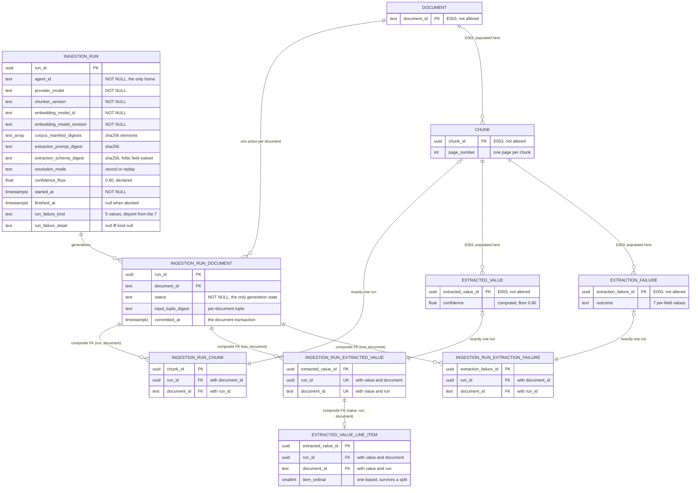

# Data Model — Document Ingestion and Extraction

> Feature: `00006-document-ingestion-and-extraction` (E006) | Storage: **PostgreSQL 16 + `pgvector`**, single instance, schema `public` | Migrations: forward-only Alembic in `/src/model`, filename block **`0300`–`0399`** | Consumers: E008 (retrieval), E009 (identity resolution), E013 (traceability view)

E006 **populates** the corpus and extraction tables E003 owns and **adds six objects of its own**: an ingestion-run record, a per-document generation record, three run-output associations, and a line-item association — plus one view and one privilege revision.

## Scope

| Aspect | Position |
|--------|----------|
| Owned by this epic | `ingestion_run`, `ingestion_run_document`, `ingestion_run_chunk`, `ingestion_run_extracted_value`, `ingestion_run_extraction_failure`, `extracted_value_line_item`, and the view `v_active_ingestion_generation`. Nothing else. |
| **Not** owned, **not** altered | `document`, `chunk`, `field_vocabulary`, `extracted_value`, `extracted_value_contributing_chunk`, `extraction_failure`. E006 adds **zero columns**, **zero constraints**, and **zero indexes** to any of them. `specs/00003-core-data-schema/data-model.md` is normative over this document under {SAD:ADR-0017}; where the two disagree, that one governs and this one is the defect (spec Scope Excluded, FR-039). |
| Why associations rather than a column | FR-039. Three target tables cannot gain a `run_id` column without changing a schema this epic does not own, so run attribution is carried by three association tables whose primary key **is** the target row's identifier — which is what makes "exactly one run per row" (SC-021) a uniqueness fact rather than a convention. |
| Migration block | `0300`–`0399` (FR-040). E003 holds `0001`–`0099`, E004 holds `0100`–`0199`, `0200`–`0299` is left for E005. The current head is `0103`; E006's first revision chains from it by `down_revision`. |
| Not a table | The ingestion report, the deterministic baseline extractor's output, the leaf-length distribution, and every per-field precision/recall figure. These are published artifacts, not rows: nothing downstream queries them, and storing a measurement beside the data it measures invites the measurement to be recomputed from a subset. `BaselineExtraction` in the spec's Key Entities is a committed report artifact, not a relation. |
| Not computed in the database | Confidence, token counts, Wilson intervals, page containment, and the input-tuple digest are all computed in Python behind the computation-boundary contract (FR-048, FR-031, Principle V). The database stores results and enforces shape. No generated column and no trigger is added by this epic. |

## Conventions

Inherited from `specs/00003-core-data-schema/data-model.md` §Conventions without exception. Restated only where this epic must make a choice.

| Aspect | Rule |
|--------|------|
| Constraint names | `pk_<table>`, `uq_<table>__<purpose>`, `ck_<table>__<rule>`, `fk_<table>__<target>`, `ix_<table>__<purpose>`. Every constraint explicitly named — a server-generated name cannot be referenced by a later forward migration's `DROP CONSTRAINT`, and a test asserting *which* rule rejected a row must match on a name, never on message text. Every name below is ≤ 63 bytes, checked; PostgreSQL truncates silently and two truncated names can collide. |
| Migrations | Forward-only. `revision` doubles as the four-digit filename prefix. Ordering is `down_revision` and only `down_revision`. Every `downgrade()` raises `NotImplementedError`. Explicit DDL only — no autogenerate. Style reference: `src/model/src/model/schema/versions/0006_extraction.py`. |
| Trim set in presence checks | `btrim(col, E' \t\n\r\f')`. Spelled ``, **never `\v`** — PostgreSQL's escape-string syntax has no `\v`, so `E'\v'` is the *letter* `v`: the declared form would admit a vertical-tab-only value and reject a legitimate value of `vvv`. E003's `0004` and `0006` record the same correction. |
| Digest format | `^sha256:[0-9a-f]{64}$`, matching `document.roster_hash` and `forecast_run.input_data_hash`. Array-valued digests are validated element-wise by `fn_all_sha256_prefixed`, E003's existing `IMMUTABLE` helper (created in `0003`), **reused rather than re-declared** — a second helper with the same body would be a second answer, and E006 declares no function of its own. |
| Timestamps | `timestamptz`, never `timestamp`. |
| Grants | Explicit. E003's `0009` deliberately declined `ALTER DEFAULT PRIVILEGES`, so a revision that adds a table grants to `procurement_app` explicitly or the role cannot touch it. |

## Entities

The compact artifact. Detail sections follow; downstream agents that read only this table have the shape.

| Entity | Attributes (name: type, constraints) | Relationships | State Transitions |
|--------|--------------------------------------|---------------|-------------------|
| **ingestion_run** | `run_id: uuid` PK; `agent_id: text` NOT NULL non-empty; `provider_model: text` NOT NULL non-empty; `chunker_version: text` NOT NULL non-empty; `embedding_model_id: text` NOT NULL non-empty; `embedding_model_revision: text` NOT NULL non-empty; `corpus_manifest_digests: text[]` NOT NULL `CHECK(cardinality>=1 AND fn_all_sha256_prefixed)`; `extraction_prompt_digest: text` NOT NULL sha256; `extraction_schema_digest: text` NOT NULL sha256; `resolution_mode: text` NOT NULL `CHECK(IN ('record','replay'))`; `confidence_floor: double precision` NOT NULL `CHECK(>=0 AND <=1)`; `started_at: timestamptz` NOT NULL; `finished_at: timestamptz` NULL `CHECK(NULL OR >= started_at)`; `run_failure_kind: text` NULL `CHECK(IN 5 values)`; `run_failure_detail: text` NULL `CHECK((kind IS NULL) = (detail IS NULL))`; `CHECK(run_failure_kind IS NULL OR finished_at IS NULL)` | has_many: `ingestion_run_document` | **No status column** — generation state is per document and lives on `ingestion_run_document` ({SAD:ADR-0019}). A run is *complete* when `finished_at IS NOT NULL AND run_failure_kind IS NULL`; that is a readable condition, not a stored state. |
| **ingestion_run_document** | PK `(run_id, document_id)`; `run_id: uuid` NOT NULL; `document_id: text` NOT NULL; `status: text` NOT NULL `CHECK(IN ('active','superseded'))`; `input_tuple_digest: text` NOT NULL sha256; `committed_at: timestamptz` NOT NULL DEFAULT `now()`; **partial UNIQUE INDEX on `(document_id) WHERE status = 'active'`** | belongs_to: `ingestion_run` (RESTRICT); belongs_to: `document` (RESTRICT); referenced by all three run-output associations via `(run_id, document_id)` | `Active → Superseded` — flipped **before** the successor row is inserted, inside the successor document's transaction. Never back, except as the documented rollback of a bad promotion. |
| **ingestion_run_chunk** | `chunk_id: uuid` PK; `run_id: uuid` NOT NULL; `document_id: text` NOT NULL | belongs_to: `chunk` (RESTRICT, 1:1); belongs_to: `ingestion_run_document` via composite FK `(run_id, document_id)` (RESTRICT) | — (append-only; `UPDATE`/`DELETE` revoked from the application role) |
| **ingestion_run_extracted_value** | `extracted_value_id: uuid` PK; `run_id: uuid` NOT NULL; `document_id: text` NOT NULL; UNIQUE `(extracted_value_id, run_id, document_id)` | belongs_to: `extracted_value` (RESTRICT, 1:1); belongs_to: `ingestion_run_document` via `(run_id, document_id)` (RESTRICT); referenced by `extracted_value_line_item` | — (append-only) |
| **ingestion_run_extraction_failure** | `extraction_failure_id: uuid` PK; `run_id: uuid` NOT NULL; `document_id: text` NOT NULL | belongs_to: `extraction_failure` (RESTRICT, 1:1); belongs_to: `ingestion_run_document` via `(run_id, document_id)` (RESTRICT) | — (append-only) |
| **extracted_value_line_item** | `extracted_value_id: uuid` PK; `run_id: uuid` NOT NULL; `document_id: text` NOT NULL; `item_ordinal: smallint` NOT NULL `CHECK(>=1)` | belongs_to: `ingestion_run_extracted_value` via composite FK `(extracted_value_id, run_id, document_id)` MATCH FULL (RESTRICT); grouping key `(run_id, document_id, item_ordinal)` | — (append-only) |
| **v_active_ingestion_generation** *(view)* | `document_id`, `run_id`, `input_tuple_digest`, `committed_at`, plus the run's `agent_id`, `provider_model`, `chunker_version`, `embedding_model_id`, `embedding_model_revision`, `resolution_mode`, `confidence_floor`, `started_at`, `finished_at` | `ingestion_run_document JOIN ingestion_run` filtered to `status = 'active'` | — |

---

## Table Detail

### `ingestion_run` — FR-038, FR-055, FR-056, SC-022

One row per execution. Every column exists because a requirement names it; nothing here is a count, a rate, or a figure the ingestion report publishes.

| Column | Type | Null | Constraint |
|--------|------|------|-----------|
| `run_id` | `uuid` | NOT NULL | `pk_ingestion_run` PRIMARY KEY. Generated in the job process before the first write, not by a database default — the run row is inserted first and every association resolves to it. |
| `agent_id` | `text` | NOT NULL | `ck_ingestion_run__agent_id_present CHECK (btrim(agent_id, E' \t\n\r\f') <> '')`. **This column is the whole reason the table exists**: E003's TR-082 omits a per-row agent column on the explicit grounds that E006 records agent identity at run granularity. Nothing else in the project holds it. |
| `provider_model` | `text` | NOT NULL | `ck_ingestion_run__provider_model_present`. The model the extraction requests were issued against. Not a foreign key to `llm_invocation.gen_ai_request_model` — E004 owns that table and a run is not an invocation. |
| `chunker_version` | `text` | NOT NULL | `ck_ingestion_run__chunker_version_present`. FR-017: a boundary change must be attributable. A pySBD version bump is a chunker-version bump (research: *Deterministic sentence segmentation*). |
| `embedding_model_id` | `text` | NOT NULL | `ck_ingestion_run__embedding_model_id_present`. Recorded here **as well as** on every chunk (E003's `chunk.embedding_model_id`); the per-chunk copy is what lets retrieval refuse to serve a mixed vector space (G-8 in E003), the per-run copy is what makes the input tuple computable without reading a chunk. |
| `embedding_model_revision` | `text` | NOT NULL | `ck_ingestion_run__embedding_model_revision_present`. FR-019: pinned revision, no network at run time. |
| `corpus_manifest_digests` | `text[]` | NOT NULL | `ck_ingestion_run__corpus_manifest_digests CHECK (coalesce(array_length(corpus_manifest_digests, 1), 0) >= 1 AND fn_all_sha256_prefixed(corpus_manifest_digests))`. `coalesce(array_length(...), 0)`, never the bare call: `array_length('{}', 1)` is **NULL, not 0**, and a `CHECK` accepts NULL — the declared-but-wrong form would admit a run that read no manifest at all. Same trap E003's `0008` and `0010` record. One element per committed manifest (real layer, synthetic layer). |
| `extraction_prompt_digest` | `text` | NOT NULL | `ck_ingestion_run__extraction_prompt_digest_format CHECK (~ '^sha256:[0-9a-f]{64}$')`. FR-043 input-tuple member. |
| `extraction_schema_digest` | `text` | NOT NULL | `ck_ingestion_run__extraction_schema_digest_format`. FR-043 input-tuple member. **The declared transmittal field subset of FR-058 is folded into this digest** rather than given a column or a table: the subset decides which failures exist, so a change to it must invalidate a document's generation exactly as a schema change does, and folding it in gets that for free. |
| `resolution_mode` | `text` | NOT NULL | `ck_ingestion_run__resolution_mode CHECK (resolution_mode IN ('record','replay'))`. Same two values and same spelling as `llm_invocation.resolution_mode`, deliberately — a reader comparing a run against its invocations must not have to translate. FR-045: continuous integration runs `replay`. |
| `confidence_floor` | `double precision` | NOT NULL | `ck_ingestion_run__confidence_floor_range CHECK (confidence_floor >= 0.0 AND confidence_floor <= 1.0)`. FR-032, FR-057: the floor is **0.80**, declared before the run. Stored per run rather than as a schema constant, so "the floor was not moved to fit the distribution" is auditable from the row that used it — a constant would record only the current value and erase the history the requirement is about. |
| `started_at` | `timestamptz` | NOT NULL | — |
| `finished_at` | `timestamptz` | NULL | `ck_ingestion_run__finished_after_started CHECK (finished_at IS NULL OR finished_at >= started_at)`. NULL means the run is in flight or aborted; per-document transactions mean an aborted run's committed documents are still legitimate generations, so NULL here does **not** invalidate them. |
| `run_failure_kind` | `text` | NULL | `ck_ingestion_run__failure_kind_domain CHECK (run_failure_kind IS NULL OR run_failure_kind IN ('corpus_digest_mismatch','document_id_collision','oversized_sentence','fixture_missing','provider_unreachable'))`. **FR-056**: five run-level failures, and the set is disjoint from `extraction_failure`'s seven per-field outcomes by construction — no member is shared, so a missing fixture cannot be recorded as though the model produced something unusable when nothing was ever asked. |
| `run_failure_detail` | `text` | NULL | `ck_ingestion_run__failure_detail_iff_kind CHECK ((run_failure_kind IS NULL) = (run_failure_detail IS NULL))`. Both operands are null *tests*, so the expression is never null-valued. A failure without a stated cause is not representable. |
| — | — | — | `ck_ingestion_run__failed_run_unfinished CHECK (run_failure_kind IS NULL OR finished_at IS NULL)` — **SC-044's "the run does not report completion", as a database fact**. A run that recorded a run-level failure cannot also carry a finish timestamp. |

| Name | Definition | Purpose |
|------|-----------|---------|
| `ix_ingestion_run__started_at` | `(started_at DESC)` | Operational listing only. **Never** the selection mechanism — the active generation is selected through `ingestion_run_document`, not by taking the most recent run. Same discipline E003 fixes for `ix_forecast_run__created_at`. |

**No `status` column, and its absence is the decision rather than an omission ({SAD:ADR-0019}).** FR-055 reads "System MUST mark each ingestion run active or superseded", and taken at the word that would be a column here. It cannot be, because FR-043 requires a run to skip every document whose input tuple is unchanged: a run that reloads 3 of 51 documents leaves the other 48 documents' live rows owned by earlier runs, so a run-level flag would either supersede generations the run never replaced or leave replaced ones active. **The requirement is satisfied at run-document granularity** — every generation is marked, so every run is marked once per document it actually ingested, which is the only granularity at which the statement is true of all its rows. ADR-0019 §Decision Outcome fixes this placement, and under {SAD:ADR-0017} this document is where the column it names is declared.

A derived run-level status was considered and rejected rather than overlooked. It would be a cross-row aggregate (`active` iff at least one generation is active), unenforceable by any `CHECK`, and maintainable only by the retirement procedure — a second answer that can disagree with the generation rows, where the disagreement is invisible and the wrong one is the one an operational listing shows. "Is this run still live?" is one predicate away: `EXISTS (SELECT 1 FROM ingestion_run_document d WHERE d.run_id = r.run_id AND d.status = 'active')`.

**No count columns either.** Chunks written, values stored, failures recorded, repaired rate, confidence distribution: all published by the ingestion report and all recomputable by a query over the associations. Storing them would create a second answer that can disagree with the rows, and the first thing a reader would do on disagreement is trust the smaller number.

**No embedding-runtime column.** ADR-0018 pins the embedding runtime; it is not recorded here because FR-043 closes the input tuple at five members and adding a sixth to the row without adding it to the tuple would record a fact that cannot supersede a generation. If a runtime change is ever shown to move a vector, it becomes a tuple member by amendment, not by a column added quietly here.

### `ingestion_run_document` — the generation record (FR-043, FR-055, SC-025, SC-043, {SAD:ADR-0019})

**This table, not `ingestion_run`, is where both the generation status and the "one active generation per document" invariant live, and the reason is FR-043.** A run skips documents whose input tuple is unchanged and creates no rows for them, so a run that reloads 3 of 51 documents leaves the other 48 documents' live rows owned by earlier runs. A run-level flag would therefore have to be `active` and `superseded` at once. Generation state is per `(run, document)` and nowhere else.

| Column | Type | Null | Constraint |
|--------|------|------|-----------|
| `run_id` | `uuid` | NOT NULL | part of `pk_ingestion_run_document`; `fk_ingestion_run_document__run FOREIGN KEY (run_id) REFERENCES ingestion_run (run_id) ON DELETE RESTRICT ON UPDATE CASCADE` |
| `document_id` | `text` | NOT NULL | part of the PK; `fk_ingestion_run_document__document FOREIGN KEY (document_id) REFERENCES document (document_id) ON DELETE RESTRICT ON UPDATE CASCADE` — `ON UPDATE CASCADE` because `document_id` is a natural text key and E003's G-9 keeps a format correction open as a live possibility |
| `status` | `text` | NOT NULL | `ck_ingestion_run_document__status CHECK (status IN ('active','superseded'))`. **`NOT NULL` and `CHECK` together are what make the state space two.** A `CHECK` rejects only on *false*, so a NULL status passes it; and `status = 'active'` evaluates to NULL for a NULL status, so the row falls out of the partial index predicate as well. A NULL-status generation would be neither active nor superseded — invisible to the invariant and to every reader, a third state arrived at by omission (ADR-0019 §Decision Outcome). |
| `input_tuple_digest` | `text` | NOT NULL | `ck_ingestion_run_document__tuple_digest_format CHECK (~ '^sha256:[0-9a-f]{64}$')`. FR-043's tuple, reduced to one comparison. **Computed over the document's *own* manifest content hash, not the whole-corpus digest** — a corpus-wide digest would make any change to any document reload all 51, which is the opposite of what FR-043 asks for. Members: this document's manifest content hash, `chunker_version`, `embedding_model_id`, `embedding_model_revision`, `extraction_prompt_digest`, `extraction_schema_digest`. |
| `committed_at` | `timestamptz` | NOT NULL | DEFAULT `now()` — the instant the document's single transaction (FR-054) committed. Per-document rather than per-run because that is the granularity at which durability is actually achieved. |

| Name | Definition | Purpose |
|------|-----------|---------|
| `pk_ingestion_run_document` | `PRIMARY KEY (run_id, document_id)` | Also the FK target for all three run-output associations, which is why it is a composite of exactly these two columns and in this order. |
| `ix_ingestion_run_document__single_active` | `CREATE UNIQUE INDEX … ON ingestion_run_document (document_id) WHERE status = 'active'` | **FR-055, SC-043.** At most one active generation per document, as a database guarantee: a second activation fails on write rather than producing two live generations that readers silently union (research: *Generations of derived data*). |
| `ix_ingestion_run_document__document` | `(document_id)` | Full index, not partial. Serves the `RESTRICT` check on a `document` delete and the "every generation of this document" history read; the partial index above sees only active rows and would leave both to a sequential scan. |

**Relationship to `ix_forecast_run__single_active` — the same pattern, a different scope, and the difference is the point.** E003's `0008_forecast.py` already carries `CREATE UNIQUE INDEX ix_forecast_run__single_active ON forecast_run (is_active) WHERE is_active`, paired with `v_active_forecast_run` and no `LIMIT`. This index follows that convention deliberately, so a reviewer meets a mechanism already proved and tested in this repository. **The two are not copies and must not be read as such:**

| | `ix_forecast_run__single_active` (E003, `0008`) | `ix_ingestion_run_document__single_active` (E006, `0301`) |
|---|---|---|
| Scope | **Global** — at most one active forecast run in the database | **Per document** — at most one active generation per `document_id`, 51 independent invariants |
| Indexed column | `(is_active)`, a boolean that is the constant `true` for every row in the index, so the index holds at most one row in total | `(document_id)`, so the index holds at most one row *per document* and legitimately holds up to 51 |
| State representation | `boolean is_active` — two states suffice because a forecast run has no per-document scope to be partly retired | `text status` with a `CHECK` — the same two states, but as a named vocabulary, because a generation is the unit a purge and a rollback both act on and `superseded` must be distinguishable from `never activated` |
| Where the flag lives | On the run row itself | On the run-to-document association, never on the run — FR-043's skip rule is what forces the difference |

**The partial unique index cannot be deferred, and that fixes a write order.** `CREATE UNIQUE INDEX … WHERE` produces an *index*, not a constraint, and PostgreSQL admits `DEFERRABLE` only on constraints — no deferral setting rescues the reverse order. So inside the successor document's transaction the predecessor row must be flipped to `superseded` **before** the new row is inserted as `active`. Insert-then-flip raises a unique violation on the insert; there is no ordering-free form of this transaction. Both statements are in the same transaction, so a crash between them rolls back to the old generation still active — the correct state to fail into (ADR-0019 §Decision Outcome).

### The three run-output associations — FR-039, SC-021

One table per target, each with the **target row's own identifier as its entire primary key**. That single choice carries SC-021's "exactly one ingestion run" half-way with no application discipline: a second association row for one chunk is a primary-key collision. The other half — that an association row exists at all — is cross-table absence and is disclosed as **G-1**.

| Table | PK | Target FK | Generation FK |
|-------|----|-----------|---------------|
| `ingestion_run_chunk` | `pk_ingestion_run_chunk (chunk_id)` | `fk_ingestion_run_chunk__chunk` → `chunk (chunk_id)` RESTRICT / CASCADE | `fk_ingestion_run_chunk__generation` → `ingestion_run_document (run_id, document_id)` MATCH FULL RESTRICT / CASCADE |
| `ingestion_run_extracted_value` | `pk_ingestion_run_extracted_value (extracted_value_id)` | `fk_ingestion_run_extracted_value__value` → `extracted_value (extracted_value_id)` RESTRICT / CASCADE | `fk_ingestion_run_extracted_value__generation` → same target |
| `ingestion_run_extraction_failure` | `pk_ingestion_run_extraction_failure (extraction_failure_id)` | `fk_ingestion_run_extraction_failure__failure` → `extraction_failure (extraction_failure_id)` RESTRICT / CASCADE | `fk_ingestion_run_extraction_failure__generation` → same target |

Each carries exactly three columns — the target identifier, `run_id`, and `document_id` — and one index:

| Name | Definition | Purpose |
|------|-----------|---------|
| `ix_ingestion_run_chunk__generation` | `(run_id, document_id)` | PostgreSQL creates no index on the *referencing* side of a foreign key, so without this every retirement of a generation sequentially scans ~15,000 rows to enforce `RESTRICT`. Also the "all chunks this generation wrote" read. |
| `ix_ingestion_run_extracted_value__generation` | `(run_id, document_id)` | Same, and the join E009 walks from a value to the models that produced it. |
| `ix_ingestion_run_extraction_failure__generation` | `(run_id, document_id)` | Same. |

`ingestion_run_extracted_value` additionally carries `uq_ingestion_run_extracted_value__value_generation UNIQUE (extracted_value_id, run_id, document_id)` — redundant against its primary key by design, exactly as `uq_chunk__chunk_page` is. It exists to be the foreign-key target of `extracted_value_line_item`, which needs all three columns in one referenced key.

**Why `document_id` is on the association at all.** It is derivable — from `chunk.document_id`, or from a value's source chunk two joins away. It is carried anyway because the generation is keyed on `(run_id, document_id)`, and without the column the association could not reference the generation row: retirement of one document's generation would have no way to find the rows it must remove first. The cost is disclosed as **G-2**: `chunk` has no unique key on `(chunk_id, document_id)` and E006 may not add one, so nothing structural stops an association row from naming a different document than its chunk does.

### `extracted_value_line_item` — FR-059, SC-046

The association identity resolution matches on. A transmittal listing five items otherwise yields five manufacturers and five part numbers with nothing joining them.

| Column | Type | Null | Constraint |
|--------|------|------|-----------|
| `extracted_value_id` | `uuid` | NOT NULL | `pk_extracted_value_line_item` PRIMARY KEY. **The value, alone, is the key** — SC-046 requires every value to belong to *exactly one* line item, and a primary key on the value is what makes a second membership unrepresentable rather than merely wrong. |
| `run_id` | `uuid` | NOT NULL | part of `fk_extracted_value_line_item__run_output` |
| `document_id` | `text` | NOT NULL | part of the same FK |
| `item_ordinal` | `smallint` | NOT NULL | `ck_extracted_value_line_item__ordinal_positive CHECK (item_ordinal >= 1)`. One-based, matching the printed item numbering on the transmittal. |

| Name | Definition | Purpose |
|------|-----------|---------|
| `fk_extracted_value_line_item__run_output` | `FOREIGN KEY (extracted_value_id, run_id, document_id) REFERENCES ingestion_run_extracted_value (extracted_value_id, run_id, document_id) MATCH FULL ON DELETE RESTRICT ON UPDATE CASCADE` | References the run-output association rather than `extracted_value` directly. Three things follow, none of them available from a direct FK: a line-item row cannot exist for a value that has no run attribution; its `document_id` and `run_id` **cannot disagree** with the value's own, because they are the same referenced key; and the grouping key is generation-scoped, so two generations of one document do not silently merge their item 3 into one line item. |
| `ix_extracted_value_line_item__item` | `(run_id, document_id, item_ordinal)` | The grouping read — "every value of item 3 of this document in this generation" — and the index the `RESTRICT` retirement check uses. |

**Why the item ordinal and not the source chunk.** The clarification is explicit: keying on the source chunk would make an over-long item entry split across two chunks silently become two line items. The ordinal is assigned by the extractor from the printed item order and survives the split, because both chunks' values carry the same ordinal. That is exactly what SC-046's second clause tests.

**No `field_name` column.** A uniqueness rule of the shape "one manufacturer per line item" would need `field_name` denormalized here and held equal to the value's by composite FK — and `extracted_value` has no unique key on `(extracted_value_id, field_name)` for that FK to reference, which E006 may not add. The rule is also not universally true (an item may legitimately cite two compliance standards). Left unasserted rather than half-enforced; the per-field cardinality of a line item is E009's concern, disclosed as **G-5**.

### `v_active_ingestion_generation` — FR-055, SC-043, {SAD:ADR-0019}

```
CREATE VIEW v_active_ingestion_generation AS
    SELECT d.document_id, d.run_id, d.input_tuple_digest, d.committed_at,
           r.agent_id, r.provider_model, r.chunker_version,
           r.embedding_model_id, r.embedding_model_revision,
           r.resolution_mode, r.confidence_floor, r.started_at, r.finished_at
    FROM ingestion_run_document d
    JOIN ingestion_run r ON r.run_id = d.run_id
    WHERE d.status = 'active'
```

**The view is not a convenience — it is the single place the filtering obligation is discharged.** ADR-0019 records that obligation as falling on **E008** (retrieval and reranking over chunks), **E009** (identity resolution over extracted line items), and **E012** (source-page traceability). An unqualified query against `chunk` now returns superseded rows *silently* — same document, same page, near-identical text — so the view exists so that three epics do not each have to be independently right about one predicate. An epic that joins the base table directly has taken the obligation onto itself.

One view, not three. Every consumer joins its own target table to that table's run-output association and then to this view, so the predicate is written once and a reader that forgets it is visible as a missing join rather than as a missing `WHERE` clause buried in a filter list. Per-target views (`v_active_chunk`, `v_active_extracted_value`, …) were rejected: they would have to select the 384-dimension embedding column or omit it, and either choice is wrong for one of E008's two retrieval arms.

**No `LIMIT`, and no recency fallback — both following `v_active_forecast_run` exactly.** A `LIMIT` would *conceal* a second active generation rather than the index preventing one, and the index is what prevents it. Zero rows for a document is legal and meaningful: it says "this document has not been ingested under the current inputs", and a consumer must be able to tell that apart from "ingested, possibly stale". An `ORDER BY committed_at DESC LIMIT 1` fallback would re-introduce ADR-0019's rejected Option D inside the view itself — "newest" cannot express a rollback, because the generation being abandoned is by definition the newest one.

The view exposes the run's identity columns because FR-038's question — "what produced this number" — is then one read from a document rather than a two-hop join. It exposes no `status` column: every row it returns is active by construction, and carrying the column would invite a reader to filter on it again and conclude the view does not.

## Referential Actions

`RESTRICT` on every edge. Nothing E006 adds cascades on delete, because a cascade is exactly the silent teardown FR-041 forbids: correction is an ordered operator procedure, and an edge that deletes itself when its parent goes hides the ordering the procedure depends on.

| Child → Parent | ON DELETE | ON UPDATE | Rationale |
|---|---|---|---|
| `ingestion_run_document` → `ingestion_run` | RESTRICT | CASCADE | A run cannot be dropped while any generation still points at it — the retirement order is leaf-up and this is what enforces it. |
| `ingestion_run_document` → `document` | RESTRICT | CASCADE | A document with generations is not droppable. `ON UPDATE CASCADE` mirrors `fk_chunk__document`, so E003's G-9 `document_id` correction propagates here too rather than deadlocking. |
| `ingestion_run_chunk` → `chunk` | RESTRICT | CASCADE | Same posture as `extracted_value → chunk`. |
| `ingestion_run_extracted_value` → `extracted_value` | RESTRICT | CASCADE | — |
| `ingestion_run_extraction_failure` → `extraction_failure` | RESTRICT | CASCADE | — |
| all three associations → `ingestion_run_document` | RESTRICT | CASCADE | The leaf-up rule again, at the generation boundary. |
| `extracted_value_line_item` → `ingestion_run_extracted_value` | RESTRICT | CASCADE | The deepest leaf. Line-item rows are the first thing a purge removes. |

**`RESTRICT` cannot be deferred, and `NO ACTION` can** (research: *Generations of derived data*). A retirement or purge therefore cannot delete parents before children inside one transaction and must proceed strictly leaf-up in the order §Operator Procedures fixes. `NO ACTION` was rejected in every position: a deferred check would let a mid-transaction inconsistency exist, and the whole reason these edges restrict is that the ordering is the procedure.

## Write Order and Transaction Boundary — FR-054, FR-042, SC-042

**Not DDL. This is the rule the ingestion job is written against, and every guarantee about a half-ingested document rests on it.**

One **autocommit** connection for the run; each document wrapped in `with conn.transaction():` (research: *Per-document transactional ingestion with psycopg 3*). The default non-autocommit connection begins an implicit transaction on first execute and would silently make the entire run one transaction — a late failure would then discard all 51 documents.

Order inside document *d*'s transaction:

| # | Statement | Why here |
|---|-----------|----------|
| 0a | `UPDATE ingestion_run_document SET status = 'superseded' WHERE document_id = d AND status = 'active'` | Must precede 0b. The partial unique index is not deferrable, so insert-then-flip raises. A no-op on first ingest. |
| 0b | `INSERT ingestion_run_document (run_id, d, 'active', input_tuple_digest)` | Every association FK targets this row, so it is a prologue to FR-054's stated order rather than a member of it. |
| 1 | `INSERT chunk` (via `cursor.copy()`) | FR-054's first named member. `COPY` inside the block is transactional and rolls back with it. |
| 2 | `INSERT extracted_value` | Cited page must resolve to a chunk written at step 1. |
| 3 | `INSERT extracted_value_contributing_chunk` | References the value's `(id, source_chunk_count)` key. |
| 4 | `INSERT extraction_failure` | References chunks from step 1. |
| 5 | `INSERT ingestion_run_chunk`, `ingestion_run_extracted_value`, `ingestion_run_extraction_failure` | FR-054's "run associations", last. Every target exists by now. |
| 6 | `INSERT extracted_value_line_item` | After step 5: its FK references `ingestion_run_extracted_value`, not `extracted_value`. |
| 7 | commit | An abort at document *k* leaves documents 1..*k*−1 committed and durable and document *k* entirely absent — **no deletion privilege is needed to clean up after an abort**, which is the whole point (STF-002). |

**A failure row describing a rolled-back document is written in a fresh transaction, after the rollback.** A row written inside *d*'s transaction to explain why *d* failed is rolled back along with it — the research pitfall, and it is not merely a lost log line here. The post-rollback write is an `UPDATE` on `ingestion_run` setting `run_failure_kind` and `run_failure_detail`, **never** an `extraction_failure` row: `extraction_failure.source_chunk_id` is NOT NULL with a `RESTRICT` foreign key to a chunk the rollback has just removed, so a per-field failure row for a rolled-back document has no referent and cannot be stored at all. That is the structural reason FR-056's run-level failure needs its own home.

Two further consequences of the transaction shape, both load-bearing:

- **The per-document error handler must catch outside the `with` block.** Nested `transaction()` blocks are savepoints; a handler inside the block means the outer rollback never happens.
- **Index building is DDL and must not appear inside the block.** See §Operator Procedures.

## Operator Procedures

Three procedures that are **not** reachable from the ingestion job, because the job connects as the application role and that role holds neither `DELETE` on the provenance tables nor any DDL privilege. Each is executed under the schema-owning role.

### 1. HNSW index drop and rebuild around a full-corpus load

`ix_chunk__embedding_hnsw` is E003's object, declared in migration `0004` as `USING hnsw (embedding vector_cosine_ops) WITH (m = 16, ef_construction = 64)`. pgvector is explicit that indexes should be added *after* the initial data load; building the graph one row-insert at a time costs far more than one bulk build.

| Step | Statement | Note |
|------|-----------|------|
| 1 | `DROP INDEX ix_chunk__embedding_hnsw` | Schema-owning role. `DROP INDEX` requires ownership of the table; `procurement_app` holds table-level DML grants and `USAGE` on the schema and owns nothing, so **the ingestion job cannot do this and is not meant to**. |
| 2 | Run the ingestion job | Ordinary per-document transactions, unchanged. |
| 3 | `SET maintenance_work_mem`, `SET max_parallel_maintenance_workers` (and `max_parallel_workers` to match) | Build speed is dominated by whether the graph fits in `maintenance_work_mem`. |
| 4 | `CREATE INDEX ix_chunk__embedding_hnsw ON chunk USING hnsw (embedding vector_cosine_ops) WITH (m = 16, ef_construction = 64)` | **Verbatim** — same name, same operator class, same `m` and `ef_construction`. Any deviation makes the live schema disagree with `specs/00003-core-data-schema/data-model.md`, which is normative. Not `CREATE INDEX CONCURRENTLY`: slower, and it buys availability an offline job does not need. |

**Two states this opens, both disclosed rather than presented as closed.** Between step 1 and step 4 every similarity query falls back to a sequential scan — acceptable offline, and E003's scale note already records that exact scan is viable at ~15,000 rows, so the window degrades latency and not correctness. And **an aborted run leaves the index absent until the procedure is re-run**: nothing in the database restores it, no migration recreates it on an already-migrated database, and a retrieval consumer would silently get correct-but-slow answers with no signal. Covered as **G-7** — a startup check asserting the index exists in `pg_indexes` before serving.

This procedure is deliberately **not** a migration. A revision that dropped and recreated the index would run on every fresh database, where there is nothing to load and nothing to gain.

### 2. Remove-and-reload correction — FR-041, SC-024

Migration `0009` revoked `UPDATE` and `DELETE` on `extracted_value`, `extracted_value_contributing_chunk`, and `extraction_failure` from `procurement_app`, so **the ingestion job cannot delete what it wrote and no code path in this epic attempts to**. E006's revision `0304` extends the same posture to the four association tables it adds. A correction is therefore: purge the affected document's generation (procedure 3), then re-run ingestion for that document. Zero rows are updated in place at any point, by anyone.

### 3. Generation retirement and purge — FR-055

**Retention bound**: at most **one** superseded generation is retained per document. The immediately previous generation is kept so a bad promotion is reversible by inspection and diff; everything older is purged. The bound is stated because it has to be: a full corpus generation is roughly 15,000 chunks at `EMBEDDING_DIM` × 4 bytes each, so an unbounded set of generations grows the chunk table by a full corpus per chunker revision — which is precisely what STF-003 raised.

Purge of one generation `(run_id, document_id)`, strictly leaf-up, one statement per step because `RESTRICT` cannot be deferred:

1. `extracted_value_line_item` for that generation
2. `ingestion_run_extracted_value`, `ingestion_run_extraction_failure`, `ingestion_run_chunk` for that generation
3. `extraction_failure`, then `extracted_value_contributing_chunk`, then `extracted_value` for those chunks
4. `chunk` for that document written by that run
5. `ingestion_run_document` for that generation
6. `ingestion_run`, **only** once it holds zero generation rows — enforced by `fk_ingestion_run_document__run ON DELETE RESTRICT`, so the ordering is refused rather than trusted. There is no run-level status to update on the way out: a run with no generation rows left is retired by the absence of its generations, not by a flag.

**Retirement is never part of promotion.** Folding it in would put deletion back on the path that promotes, which is the privilege boundary ADR-0019's Option C failed on — the ingestion job holds no `DELETE` on the provenance tables and this epic does not buy it back to save a filter.

Reversal of a bad promotion is a status flip back, not a purge: flip the successor generation to `superseded` and the predecessor to `active`, in that order, for the same non-deferrable-index reason step 0a exists.

## Privileges — revision `0304`

Following E003's `0009` shape exactly: grant the ordinary four verbs, then take two back, so the append-only rule reads as a deliberate revoke rather than as an omission — and an omission is indistinguishable from having forgotten.

| Object | `procurement_app` holds | Why |
|--------|-------------------------|-----|
| `ingestion_run` | `SELECT, INSERT, UPDATE` | `UPDATE` is required and is not a provenance edit: `finished_at` and the two run-failure columns are written after the row is inserted, the last of them in a fresh transaction after a rollback. `DELETE` withheld — purging a run is procedure 3. |
| `ingestion_run_document` | `SELECT, INSERT, UPDATE` | `UPDATE` is the `active → superseded` flip of step 0a, which the ingestion job performs on every re-ingest. `DELETE` withheld. |
| `ingestion_run_chunk`, `ingestion_run_extracted_value`, `ingestion_run_extraction_failure`, `extracted_value_line_item` | `SELECT, INSERT` | Append-only by privilege, matching the three tables `0009` covers. These rows *are* provenance: an association silently repointed at a different run makes SC-021 true and meaningless. |
| `v_active_ingestion_generation` | `SELECT` | — |

`GRANT SELECT ON ALL TABLES IN SCHEMA public` at `0009` covered only the tables existing then, so every object above is granted explicitly. `ALTER DEFAULT PRIVILEGES` remains unused, deliberately, for the reason `0009` records: a future append-only table would otherwise acquire `UPDATE` and `DELETE` silently.

**Reach.** The deployed connection role is the SUPERUSER `procurement`, which bypasses every privilege check, so this guarantee is latent exactly as E003's **G-11** records — real, catalogued, asserted by test under `SET LOCAL ROLE procurement_app`, and not operative against the role the application actually connects as. Restated here rather than inherited silently, because SC-024 is an E006 criterion and must not be reported as fully enforced in the deployed configuration. Carried as **G-6**.

## Migration Sequence

Filename prefixes `0300`–`0399` are E006's reserved block (FR-040). The chain head at authoring time is `0103`; `0300` chains from it by `down_revision`. Every revision is forward-only, authored as explicit DDL, and its `downgrade()` raises.

| Prefix | `down_revision` | Contents | Gate |
|--------|-----------------|----------|------|
| `0300` | `0103` | `ingestion_run`, `ix_ingestion_run__started_at` | **Blocked until FR-047's amendment to TR-081 has landed on the default branch** (SC-034). Writing computed confidences into a column the normative document calls agent-asserted would mislead every reader who trusts that document. The gate is on the epic, recorded on its first revision. |
| `0301` | `0300` | `ingestion_run_document`, `ix_ingestion_run_document__single_active`, `ix_ingestion_run_document__document`, `v_active_ingestion_generation` | After `0300` and after E003's `0003` (`document`). The view reads both tables, so it cannot be split from either. Implements {SAD:ADR-0019}; the identifiers are fixed here rather than in the ADR, per {SAD:ADR-0017}. |
| `0302` | `0301` | `ingestion_run_chunk`, `ingestion_run_extracted_value`, `ingestion_run_extraction_failure` and their three indexes | After `0301`, and after E003's `0004` and `0006`. One revision for all three: they share one FK target and no intermediate head is useful. |
| `0303` | `0302` | `extracted_value_line_item`, `ix_extracted_value_line_item__item` | After `0302` — its FK references `uq_ingestion_run_extracted_value__value_generation`. |
| `0304` | `0303` | Grants to `procurement_app` on all six tables and the view; revoke `UPDATE, DELETE` on the four append-only tables; revoke `DELETE` on the two updatable ones | Last, so the grant-then-revoke reads in one place. Mirrors `0009`. |

Verification this epic ships, mirroring E003's: apply-from-empty against the Compose `db` service; re-apply-at-head is a no-op; `alembic heads` returns exactly one; **every filename prefix falls in `0300`–`0399` and no object is placed in another epic's block** (SC-034); no `downgrade()` carries a body; and every object the chain leaves behind is named in §Named Object Inventory below.

**Block-partition assertion.** The existing check that asserts each epic's prefix range is extended with `0300`–`0399`, and `0200`–`0299` stays unclaimed for E005. Nothing outside this epic's spec ratifies that reservation, so it holds only if E005 reads it — carried forward from the spec's Compliance Check as a sequencing condition, not a defect.

## Named Object Inventory

Every database object E006's revisions create, by name. The names are the contract: a constraint whose name is not written down cannot be referenced by a later migration's `DROP CONSTRAINT`, and cannot be *expected* by another epic's test — and a test that matches on message text instead is matching on something locale- and version-dependent. E003's TR-083 admits no undocumented object in the schema, and that duty falls on the owning document, which for these objects is this one.

### Relations, views, and indexes

| Object | Kind | Revision | Purpose |
|---|---|---|---|
| `ingestion_run` | table | `0300` | One row per execution; the only home of agent identity in the project |
| `ingestion_run_document` | table | `0301` | Per-document generation with active/superseded state |
| `v_active_ingestion_generation` | view | `0301` | The active generation per document, joined to its run's identity |
| `ingestion_run_chunk` | table | `0302` | Run attribution for a chunk |
| `ingestion_run_extracted_value` | table | `0302` | Run attribution for an extracted value |
| `ingestion_run_extraction_failure` | table | `0302` | Run attribution for an extraction failure |
| `extracted_value_line_item` | table | `0303` | Line-item membership of an extracted value |
| `pk_ingestion_run` | index | `0300` | Primary-key index on `run_id` |
| `ix_ingestion_run__started_at` | index | `0300` | Operational listing by recency; never the selection mechanism |
| `pk_ingestion_run_document` | index | `0301` | Primary-key index on `(run_id, document_id)`; the associations' FK target |
| `ix_ingestion_run_document__single_active` | unique index, partial | `0301` | `(document_id) WHERE status = 'active'` — one live generation per document |
| `ix_ingestion_run_document__document` | index | `0301` | Full index for the `document` delete check and the generation history read |
| `pk_ingestion_run_chunk` | index | `0302` | Primary-key index on `chunk_id` |
| `ix_ingestion_run_chunk__generation` | index | `0302` | Referencing-side index for the generation FK |
| `pk_ingestion_run_extracted_value` | index | `0302` | Primary-key index on `extracted_value_id` |
| `uq_ingestion_run_extracted_value__value_generation` | unique index | `0302` | FK target for the line-item association; redundant against the PK by design |
| `ix_ingestion_run_extracted_value__generation` | index | `0302` | Referencing-side index for the generation FK |
| `pk_ingestion_run_extraction_failure` | index | `0302` | Primary-key index on `extraction_failure_id` |
| `ix_ingestion_run_extraction_failure__generation` | index | `0302` | Referencing-side index for the generation FK |
| `pk_extracted_value_line_item` | index | `0303` | Primary-key index on `extracted_value_id` |
| `ix_extracted_value_line_item__item` | index | `0303` | The grouping read `(run_id, document_id, item_ordinal)` |

### Constraints

| Constraint | Kind | Rule |
|---|---|---|
| `pk_ingestion_run` | primary key | `(run_id)` |
| `ck_ingestion_run__agent_id_present` | check | `btrim(agent_id, E' \t\n\r\f') <> ''` |
| `ck_ingestion_run__provider_model_present` | check | same shape on `provider_model` |
| `ck_ingestion_run__chunker_version_present` | check | same shape on `chunker_version` |
| `ck_ingestion_run__embedding_model_id_present` | check | same shape on `embedding_model_id` |
| `ck_ingestion_run__embedding_model_revision_present` | check | same shape on `embedding_model_revision` |
| `ck_ingestion_run__corpus_manifest_digests` | check | `coalesce(array_length(corpus_manifest_digests, 1), 0) >= 1 AND fn_all_sha256_prefixed(corpus_manifest_digests)` |
| `ck_ingestion_run__extraction_prompt_digest_format` | check | `extraction_prompt_digest ~ '^sha256:[0-9a-f]{64}$'` |
| `ck_ingestion_run__extraction_schema_digest_format` | check | `extraction_schema_digest ~ '^sha256:[0-9a-f]{64}$'` |
| `ck_ingestion_run__resolution_mode` | check | `resolution_mode IN ('record','replay')` |
| `ck_ingestion_run__confidence_floor_range` | check | `confidence_floor >= 0.0 AND confidence_floor <= 1.0` |
| `ck_ingestion_run__finished_after_started` | check | `finished_at IS NULL OR finished_at >= started_at` |
| `ck_ingestion_run__failure_kind_domain` | check | `run_failure_kind IS NULL OR run_failure_kind IN ('corpus_digest_mismatch','document_id_collision','oversized_sentence','fixture_missing','provider_unreachable')` |
| `ck_ingestion_run__failure_detail_iff_kind` | check | `(run_failure_kind IS NULL) = (run_failure_detail IS NULL)` |
| `ck_ingestion_run__failed_run_unfinished` | check | `run_failure_kind IS NULL OR finished_at IS NULL` (SC-044) |
| `pk_ingestion_run_document` | primary key | `(run_id, document_id)` |
| `ck_ingestion_run_document__status` | check | `status IN ('active','superseded')` |
| `ck_ingestion_run_document__tuple_digest_format` | check | `input_tuple_digest ~ '^sha256:[0-9a-f]{64}$'` |
| `fk_ingestion_run_document__run` | foreign key | → `ingestion_run (run_id)`, `ON DELETE RESTRICT ON UPDATE CASCADE` |
| `fk_ingestion_run_document__document` | foreign key | → `document (document_id)`, `ON DELETE RESTRICT ON UPDATE CASCADE` |
| `pk_ingestion_run_chunk` | primary key | `(chunk_id)` |
| `fk_ingestion_run_chunk__chunk` | foreign key | → `chunk (chunk_id)`, `ON DELETE RESTRICT ON UPDATE CASCADE` |
| `fk_ingestion_run_chunk__generation` | foreign key | `(run_id, document_id)` → `ingestion_run_document (run_id, document_id)` `MATCH FULL ON DELETE RESTRICT ON UPDATE CASCADE` |
| `pk_ingestion_run_extracted_value` | primary key | `(extracted_value_id)` |
| `uq_ingestion_run_extracted_value__value_generation` | unique | `(extracted_value_id, run_id, document_id)` |
| `fk_ingestion_run_extracted_value__value` | foreign key | → `extracted_value (extracted_value_id)`, `ON DELETE RESTRICT ON UPDATE CASCADE` |
| `fk_ingestion_run_extracted_value__generation` | foreign key | `(run_id, document_id)` → `ingestion_run_document`, `MATCH FULL ON DELETE RESTRICT ON UPDATE CASCADE` |
| `pk_ingestion_run_extraction_failure` | primary key | `(extraction_failure_id)` |
| `fk_ingestion_run_extraction_failure__failure` | foreign key | → `extraction_failure (extraction_failure_id)`, `ON DELETE RESTRICT ON UPDATE CASCADE` |
| `fk_ingestion_run_extraction_failure__generation` | foreign key | `(run_id, document_id)` → `ingestion_run_document`, `MATCH FULL ON DELETE RESTRICT ON UPDATE CASCADE` |
| `pk_extracted_value_line_item` | primary key | `(extracted_value_id)` |
| `ck_extracted_value_line_item__ordinal_positive` | check | `item_ordinal >= 1` |
| `fk_extracted_value_line_item__run_output` | foreign key | `(extracted_value_id, run_id, document_id)` → `ingestion_run_extracted_value (extracted_value_id, run_id, document_id)` `MATCH FULL ON DELETE RESTRICT ON UPDATE CASCADE` |

Every identifier above is under PostgreSQL's 63-byte limit; the longest, `uq_ingestion_run_extracted_value__value_generation`, is 50.

### Range / domain checks and their paired NOT NULL

Every `CHECK` constraining a single column's value domain sits on a `NOT NULL` column, so none can be silently satisfied by a null: `ingestion_run.agent_id`, `.provider_model`, `.chunker_version`, `.embedding_model_id`, `.embedding_model_revision`, `.corpus_manifest_digests`, `.extraction_prompt_digest`, `.extraction_schema_digest`, `.resolution_mode`, `.confidence_floor`; `ingestion_run_document.status`, `.input_tuple_digest`; `extracted_value_line_item.item_ordinal`.

`ingestion_run_document.status` is the load-bearing member of that list: it is the one column whose `CHECK` also governs an index predicate, so a null there would escape both at once.

### Nullable-column checks

The complete list. A `CHECK` rejects only on *false*, and any comparison against NULL is NULL, which a `CHECK` **accepts** — so a check on a nullable column is vacuous unless it says what it means on a null.

| Check | Nullable column(s) | Why the null case is closed |
|---|---|---|
| `ck_ingestion_run__finished_after_started` | `finished_at` | `finished_at IS NULL OR …` — definitely *true* on a null rather than null-valued. Absence is admitted deliberately: an aborted or in-flight run has no finish, and forcing one would fabricate a completion. |
| `ck_ingestion_run__failure_kind_domain` | `run_failure_kind` | `run_failure_kind IS NULL OR run_failure_kind IN (…)` — the same split. Null is correct on every run that did not fail; the pairing check below is what forbids a null kind beside a stated detail. |
| `ck_ingestion_run__failure_detail_iff_kind` | `run_failure_kind`, `run_failure_detail` | Both references are null *tests*, so the expression is never null-valued. This is the constraint that closes the null branch of the domain check above, which is why both exist rather than one. |
| `ck_ingestion_run__failed_run_unfinished` | `run_failure_kind`, `finished_at` | `run_failure_kind IS NULL OR finished_at IS NULL` — a null test on both sides, definite on every row. Deliberately an implication and not a biconditional: a run may finish cleanly with no failure, so the reverse direction would reject every successful run. |

The pattern, following E004: a nullable column's **value domain** and its **permitted absence** are separate constraints. Folding them together produces one check that is either vacuous on a null or forbids an absence the requirements need, and loses the ability to say which of the two rules a row broke.

## Invariant → Mechanism Map

| # | Invariant | Mechanism | Kind |
|---|-----------|-----------|------|
| 1 | A chunk resolves to **at most** one ingestion run | `pk_ingestion_run_chunk (chunk_id)` | primary key |
| 2 | An extracted value resolves to at most one run | `pk_ingestion_run_extracted_value` | primary key |
| 3 | A failure resolves to at most one run | `pk_ingestion_run_extraction_failure` | primary key |
| 4 | Every association names an existing generation | the three `fk_*__generation` composite FKs | composite FK |
| 5 | **At most one active generation per document** | `ix_ingestion_run_document__single_active` — per-document scope, unlike E003's global `ix_forecast_run__single_active` | partial unique index |
| 6 | A generation names an existing run and an existing document | `fk_ingestion_run_document__run`, `…__document` | FK |
| 7 | A value belongs to **exactly one** line item | `pk_extracted_value_line_item (extracted_value_id)` | primary key |
| 8 | A line item's run and document cannot disagree with its value's | `fk_extracted_value_line_item__run_output` against `uq_ingestion_run_extracted_value__value_generation` | composite FK |
| 9 | A line-item row cannot exist for a value with no run attribution | the same composite FK | composite FK |
| 10 | A failed run cannot also report completion | `ck_ingestion_run__failed_run_unfinished` | single-row CHECK |
| 11 | A run-level failure is never one of the seven per-field outcomes | `ck_ingestion_run__failure_kind_domain` over a disjoint five-value set | single-row CHECK |
| 12 | A run-level failure states its cause | `ck_ingestion_run__failure_detail_iff_kind` | single-row CHECK |
| 13 | Run identity fields are all present | `NOT NULL` + presence CHECKs on all eight | column constraints |
| 14 | Digest formats are well-formed | regex CHECKs on NOT NULL columns; `fn_all_sha256_prefixed` for the array | CHECK + IMMUTABLE-function CHECK |
| 15 | Generation status cannot take a third value, including by omission | `ck_ingestion_run_document__status` paired with the column's `NOT NULL` | CHECK paired with NOT NULL |
| 16 | Confidence floor is in `[0,1]` | `ck_ingestion_run__confidence_floor_range` + NOT NULL | CHECK paired with NOT NULL |
| 17 | A generation cannot be dropped while its outputs remain | `RESTRICT` on every association's generation FK | referential action |
| 18 | A run cannot be dropped while any generation remains | `fk_ingestion_run_document__run ON DELETE RESTRICT` | referential action |

**Zero triggers.** E003's schema contains none and E006 adds none. Zero deferrable constraints are added, and the one that could not be deferred even if wanted — the partial unique index — is the reason step 0a of the write order exists.

## Validation Rules

| ID | Rule | Applies to | Requirement |
|----|------|-----------|-------------|
| VR-001 | Every chunk, extracted value, and failure row has exactly one association row. At-most-one is the primary key; at-least-one is asserted by a test over the corpus, anti-joining each target table against its association. | three associations | FR-039, SC-021 |
| VR-002 | Exactly one generation row per document has `status = 'active'` at any instant, and a second activation raises a unique violation naming `ix_ingestion_run_document__single_active`. Asserted by attempting the insert, not by reading the index definition. | `ingestion_run_document` | FR-055, SC-043 |
| VR-003 | Every `ingestion_run` row carries a non-null agent identity, provider model, chunker version, embedding model identity and revision, at least one corpus manifest digest, prompt and schema digests, and a resolution mode; zero fields absent. | `ingestion_run` | FR-038, SC-022 |
| VR-004 | Re-running with every document's `input_tuple_digest` unchanged adds zero chunk, value, failure, and association rows, and creates zero generation rows. A run in which one document's digest differs creates exactly one new generation, for that document alone. | `ingestion_run_document` | FR-043, SC-025 |
| VR-005 | An abort at document *k* leaves documents 1..*k*−1 with a complete row set — chunks, values, contributing chunks, failures, associations, and a generation row — and document *k* with none of them, including no generation row. Asserted by raising inside document *k*'s transaction and counting both sides. | write path | FR-042, FR-054, SC-042 |
| VR-006 | A missing fixture in `replay` produces exactly one `ingestion_run` row with `run_failure_kind = 'fixture_missing'`, `finished_at IS NULL`, and **zero** `extraction_failure` rows for that run. Asserted by removing a fixture and driving the run. | `ingestion_run` | FR-056, SC-044 |
| VR-007 | The five `run_failure_kind` values and the seven `extraction_failure.outcome` values are disjoint sets. Asserted by reading both `CHECK` definitions out of `pg_constraint` and intersecting them, so a later revision that adds an overlapping value fails the build. | both domains | FR-056, SC-016 |
| VR-008 | The failure row explaining a rolled-back document is written after the rollback, in a fresh transaction, and is an `ingestion_run` update — never an `extraction_failure` insert. Asserted by confirming the run-failure columns are populated after an abort while the document's chunk count is zero. | write path | FR-054, FR-056 |
| VR-009 | Every extracted value has exactly one `extracted_value_line_item` row, and a line item whose entry was split across two chunks resolves to one `(run_id, document_id, item_ordinal)` group holding values from both chunks. | `extracted_value_line_item` | FR-059, SC-046 |
| VR-010 | A line-item row cannot be inserted for a value with no run-output row, and cannot name a run or document differing from that row's. Asserted by attempting both and expecting `fk_extracted_value_line_item__run_output`. | `extracted_value_line_item` | FR-059 |
| VR-011 | `procurement_app` holds `SELECT` and `INSERT` and holds neither `UPDATE` nor `DELETE` on `ingestion_run_chunk`, `ingestion_run_extracted_value`, `ingestion_run_extraction_failure`, and `extracted_value_line_item`; holds `SELECT, INSERT, UPDATE` and not `DELETE` on `ingestion_run` and `ingestion_run_document`. Asserted under `SET LOCAL ROLE procurement_app` and read back from `has_table_privilege`, all fourteen refusals. | privileges | FR-041, SC-024 |
| VR-012 | Zero rows in `extracted_value`, `extracted_value_contributing_chunk`, `extraction_failure`, or the four append-only association tables are updated in place across any run or correction, and zero deletions originate from the ingestion job. Asserted by the privilege test plus a source scan for `UPDATE`/`DELETE` statements against those table names in the ingestion package. | write path | FR-041, SC-024 |
| VR-013 | Every migration filename this epic authors matches `^03[0-9]{2}_`, `alembic heads` returns one head, and no object created by an E006 revision falls outside the declared inventory. Asserted by the block-partition check and an object-ownership test comparing the migrated catalog against §Named Object Inventory. | migration set | FR-040, SC-034 |
| VR-014 | Every `downgrade()` in `0300`–`0399` raises `NotImplementedError`, and re-application at head is a no-op verified by comparing `alembic_version` and `information_schema` before and after a second run. | migration set | FR-040 |
| VR-015 | E006's migrations create no column, constraint, or index on `document`, `chunk`, `field_vocabulary`, `extracted_value`, `extracted_value_contributing_chunk`, or `extraction_failure`. Asserted by snapshotting those six tables' catalog entries at revision `0103` and again at head and requiring equality. | migration set | spec Scope Excluded, {SAD:ADR-0017} |
| VR-016 | Purging one generation succeeds when executed leaf-up in the §Operator Procedures order and is **refused** at the first step when executed parent-first. Asserted by running the reverse order and expecting a `RESTRICT` violation naming the constraint. | purge path | FR-055 |
| VR-017 | Promotion flips the predecessor to `superseded` before inserting the successor as `active`; the reverse order raises a unique violation. Asserted by driving both orders. | write path | FR-055 |
| VR-018 | `v_active_ingestion_generation` returns exactly one row per document that has an active generation and zero rows for a document with none — "no live generation" is distinguishable from "stale generation", never silently equal to it. | view | FR-055, SC-043 |
| VR-019 | Every value's `cited_page` equals its source chunk's `page_number` and every failure's `attempted_page` equals its chunk's — carried by E003's `fk_extracted_value__chunk_page` and `fk_extraction_failure__chunk_page` with **no E006 mechanism added**. Recorded here because SC-009 is an E006 criterion and its enforcement is inherited, not built. | inherited | FR-029, SC-009 |
| VR-020 | Every extracted field name is in `field_vocabulary` and every failure outcome is one of seven — carried by E003's `fk_extracted_value__field` and `ck_extraction_failure__outcome`. Recorded as inherited; E006 adds nothing and must not. Additionally, values are drawn only from terms with `retired_at IS NULL`, which is E003's disclosed gap G-7 and is E006's filter to apply. | inherited | FR-024, FR-034, SC-010, SC-016 |
| VR-021 | `ix_chunk__embedding_hnsw` exists, with `m = 16` and `ef_construction = 64`, before any retrieval consumer serves. Asserted by a startup check reading `pg_indexes`, since an aborted run leaves the index absent and nothing restores it. | operator procedure | G-7 |
| VR-022 | `ingestion_run` carries **no** `status` column, and the only active/superseded state in E006's object set is `ingestion_run_document.status`. Asserted by reading the column list out of `information_schema`, so a later revision cannot re-introduce the run-level flag ADR-0019 rejected without failing the build. | `ingestion_run` | FR-055, {SAD:ADR-0019} |
| VR-023 | A generation row with a NULL `status` is rejected by `NOT NULL` rather than slipping past `ck_ingestion_run_document__status` and out of the index predicate. Asserted by attempting the insert. | `ingestion_run_document` | FR-055, {SAD:ADR-0019} |

## Disclosed Gaps

Enforcement this design does **not** carry, recorded as uncovered rather than claimed.

| # | Gap | Why the database cannot carry it | Covered by | Runtime consequence, and what would reverse it |
|---|-----|----------------------------------|-----------|-----------------------------------------------|
| G-1 | An association row **existing** for every chunk, value, and failure (the at-least-one half of SC-021) | Cross-table absence. A primary key excludes a second row; nothing forces a first one without a deferred constraint trigger, which this schema does not use | VR-001, plus the per-document transaction that writes both sides or neither | A row exists with no reachable run, so "what produced this number" returns nothing rather than something wrong. Reversed by a deferred constraint trigger comparing per-document counts at commit, if an unattributed row is ever observed |
| G-2 | An association's `document_id` agreeing with its target row's own document | `chunk` has no unique key on `(chunk_id, document_id)` for a composite FK to reference, and E006 may not add one | Test joining each association to its target and comparing | A generation's retirement misses rows, or sweeps in rows of another document. Reversed by E003 adding `uq_chunk__chunk_document`, which would make the agreement a composite FK exactly as `uq_chunk__chunk_page` does for the page |
| G-3 | `input_tuple_digest` actually being the digest of the run's recorded tuple columns | The digest is computed in Python over a canonical serialization; a `CHECK` cannot recompute it | Test recomputing the digest from the joined `ingestion_run` row for every generation | A document is skipped that should have reloaded, or reloaded that should have been skipped — the SC-025 failure. Reversed by a generated column, which would require the serialization to be an `IMMUTABLE` SQL function and put the arithmetic in the database against Principle V |
| G-4 | A reader **actually filtering** on the active generation | The database can expose the predicate; it cannot make a consumer join through it | `v_active_ingestion_generation` + a test per consuming epic (E008, E009, E012 — the three ADR-0019 names) | Two generations union into one result set and a citation resolves to a superseded chunk, silently, with near-identical text. Reversed by revoking `SELECT` on the base tables from the reading role and granting it only on views, once more than one generation is retained in a served database |
| G-5 | Per-field cardinality within a line item (one manufacturer per item), and contiguity of `item_ordinal` from 1 | Cross-row, and `field_name` cannot be carried into this table without a unique key on `extracted_value` that E006 may not add | Test | A line item reads as holding two manufacturers, which E009 would match as two candidates. Reversed by E003 adding `uq_extracted_value__id_field`, making the cardinality rule a unique constraint here |
| G-6 | The `UPDATE`/`DELETE` revoke binding the connection the application actually opens | The deployed role is the SUPERUSER `procurement`, and a superuser bypasses every privilege check. `DATABASE_URL` is frozen by E001 and `docker-compose.yml` by TR-037 | VR-011 under `SET LOCAL ROLE procurement_app`; E003's G-11 records the same for the three provenance tables | The append-only guarantee is latent, not active: an in-place edit of an association remains possible for the connecting role. SC-024 must not be reported as fully enforced in the deployed configuration. Reversed the day `DATABASE_URL` names a non-superuser — one `GRANT LOGIN` and nothing else moves |
| G-7 | `ix_chunk__embedding_hnsw` existing after a run | The rebuild is an operator step under the schema-owning role; the ingestion job holds no DDL privilege and no migration recreates the index on an already-migrated database | VR-021 startup check | Every similarity query falls back to a sequential scan — correct, slower, and silent. At ~15,000 chunks it is tolerable, which is exactly why it can go unnoticed. Reversed by making the rebuild a step of the same operator runbook that drops it, with the startup check as the backstop |

## Scale Assumptions

| Object | Expected volume | Consequence |
|--------|-----------------|-------------|
| `ingestion_run` | Tens of rows over the project's life | Every index free. |
| `ingestion_run_document` | 51 × generations retained (≈102 at the stated bound of one superseded generation) | Trivial. |
| `ingestion_run_chunk` | ≈15,000 per generation, ≈30,000 retained | The largest object this epic adds, and still three narrow columns. The generation index is what keeps a retirement from scanning it. |
| `ingestion_run_extracted_value` | ≈2,000 per generation (25 transmittals × ~10 items × ~8 fields) | — |
| `ingestion_run_extraction_failure` | Low hundreds per generation — FR-058's per-document recording of a whole-document absence is what keeps this from being 25 × chunks × fields | — |
| `extracted_value_line_item` | ≈2,000 per generation, one per value | — |
| Concurrency | One offline job, one user | No partitioning, no advisory locking, no pool tuning. The partial unique index is the only concurrency control and it is there for correctness under re-run, not under load. |

## Requirement Traceability

| Requirement | Carried by |
|-------------|-----------|
| FR-038 | `ingestion_run` — all eleven identity and configuration columns NOT NULL; VR-003 |
| FR-039 | The three run-output associations, each keyed on its target's identifier; VR-001; G-1 |
| FR-040 | **Migration Sequence** — `0300`–`0304`, block-partition assertion; VR-013 |
| FR-041 | **Operator Procedures** 2 and 3; **Privileges**; VR-011, VR-012, VR-016 |
| FR-042 | **Write Order and Transaction Boundary**; VR-005 |
| FR-043 | `ingestion_run_document.input_tuple_digest`, computed over the document's own manifest hash; VR-004; G-3 |
| FR-047 | Migration Sequence — `0300` gated on the TR-081 amendment landing on the default branch |
| FR-054 | **Write Order and Transaction Boundary** — steps 0a…7, and the post-rollback rule; VR-005, VR-008 |
| FR-055 | `ingestion_run_document.status` — **not** a run-level column ({SAD:ADR-0019}); `ix_ingestion_run_document__single_active`; `v_active_ingestion_generation`; retention bound and leaf-up purge; VR-002, VR-016, VR-017, VR-018, VR-022, VR-023 |
| FR-051 | {SAD:ADR-0019} is the accepted decision this document's generation objects implement; ADR-0018 pins the embedding runtime and is recorded as a deliberate non-column |
| FR-056 | `ingestion_run.run_failure_kind`, `.run_failure_detail`, `ck_ingestion_run__failed_run_unfinished`; VR-006, VR-007, VR-008 |
| FR-057 | `ingestion_run.confidence_floor` (0.80), stored per run so the floor cannot be retroactively moved |
| FR-058 | Folded into `extraction_schema_digest`, so a subset change invalidates a generation |
| FR-059 | `extracted_value_line_item` and `fk_extracted_value_line_item__run_output`; VR-009, VR-010; G-6 |
| FR-002, FR-004, FR-006 | `document` (E003) populated unchanged — no E006 object; VR-015 |
| FR-024, FR-029, FR-030, FR-034, FR-035, FR-036 | E003 constraints, inherited; VR-019, VR-020 |
| SC-021 | Invariant map rows 1–3; VR-001; G-1 |
| SC-022 | VR-003 |
| SC-024 | **Privileges**; VR-011, VR-012; G-6 |
| SC-025 | VR-004 |
| SC-034 | Migration Sequence gate and block assertion; VR-013 |
| SC-042 | VR-005 |
| SC-043 | `ix_ingestion_run_document__single_active`, the view; VR-002, VR-018; G-4 |
| SC-044 | `ck_ingestion_run__failed_run_unfinished`; VR-006 |
| SC-046 | `pk_extracted_value_line_item`; VR-009 |

<details><summary>ER Diagram (visual reference)</summary>



`DOCUMENT`, `CHUNK`, `EXTRACTED_VALUE`, and `EXTRACTION_FAILURE` are drawn with their key columns only: they are E003's tables, populated by this epic and altered by no revision in `0300`–`0399`. `INGESTION_RUN` carries **no** status column — the active/superseded state is on `INGESTION_RUN_DOCUMENT`, one row per document a run actually ingested.

</details>

## Data Model Summary

Paste target for `plan.md`.

| Entity | Key Fields | Relationships | Notes |
|--------|-----------|---------------|-------|
| `ingestion_run` | `run_id` PK | 1:N `ingestion_run_document` | One row per execution. Agent identity, provider model, chunker version, embedding model id + revision, corpus manifest digests, prompt and schema digests, resolution mode, declared confidence floor (0.80), start and finish. **The only home of agent identity in the project** (E003's TR-082 omits it by design). **Carries no `status`** — generation state is per document ({SAD:ADR-0019}). Five run-level failure kinds, disjoint from the seven per-field outcomes; a failed run cannot carry a finish (FR-038, FR-056, SC-022, SC-044). |
| `ingestion_run_document` | PK `(run_id, document_id)`; `status` NOT NULL + CHECK; **partial UNIQUE INDEX `(document_id) WHERE status='active'`** | N:1 `ingestion_run` (RESTRICT); N:1 `document` (RESTRICT); FK target of all three run-output associations | The generation record, and **the only place active/superseded lives**. Per-document, not per-run, because FR-043 skips unchanged documents, so one run owns the live generation of some documents and a retired one of others. Same pattern as E003's `ix_forecast_run__single_active` but **per-document rather than global**. `input_tuple_digest` reduces the re-ingest decision to one equality. The partial unique index is **not deferrable**, which fixes the supersede-then-insert write order (FR-043, FR-055, SC-025, SC-043, {SAD:ADR-0019}). |
| `ingestion_run_chunk` | `chunk_id` PK | 1:1 `chunk` (RESTRICT); N:1 generation via `(run_id, document_id)` | Run attribution as an association, because `chunk` cannot gain a run column. The target's own identifier **is** the primary key, so "at most one run per chunk" is a uniqueness fact (FR-039, SC-021). Append-only by privilege. |
| `ingestion_run_extracted_value` | `extracted_value_id` PK; UK `(extracted_value_id, run_id, document_id)` | 1:1 `extracted_value` (RESTRICT); N:1 generation; 1:0..1 `extracted_value_line_item` | Same shape. The redundant unique key exists to be the line-item association's FK target, so a line item's run and document cannot disagree with its value's (FR-039, SC-021). |
| `ingestion_run_extraction_failure` | `extraction_failure_id` PK | 1:1 `extraction_failure` (RESTRICT); N:1 generation | Same shape (FR-039, SC-021). |
| `extracted_value_line_item` | `extracted_value_id` PK; grouping key `(run_id, document_id, item_ordinal)` | N:1 `ingestion_run_extracted_value` via composite FK `(value, run, document)` MATCH FULL (RESTRICT) | Binds the values read out of one transmittal item entry. Keyed on the value alone, so a value belongs to **exactly one** item; keyed for grouping on the item ordinal rather than the source chunk, so an entry split across two chunks stays one item. Generation-scoped, so two generations do not merge their item 3 (FR-059, SC-046). |
| `v_active_ingestion_generation` | view over `ingestion_run_document JOIN ingestion_run WHERE status='active'` | — | The single place **E008, E009, and E012** discharge the filtering obligation ADR-0019 places on them. Consumers join target → run-output association → this view. No `LIMIT` and no recency fallback, following `v_active_forecast_run`: zero rows for a document with no live generation, so "not ingested under current inputs" is distinguishable from "ingested, possibly stale" (FR-055, SC-043, {SAD:ADR-0019}). |
| **Not altered** | — | — | `document`, `chunk`, `field_vocabulary`, `extracted_value`, `extracted_value_contributing_chunk`, `extraction_failure` — zero columns, constraints, or indexes added. E006 populates them; `specs/00003-core-data-schema/data-model.md` remains normative {SAD:ADR-0017}. |
