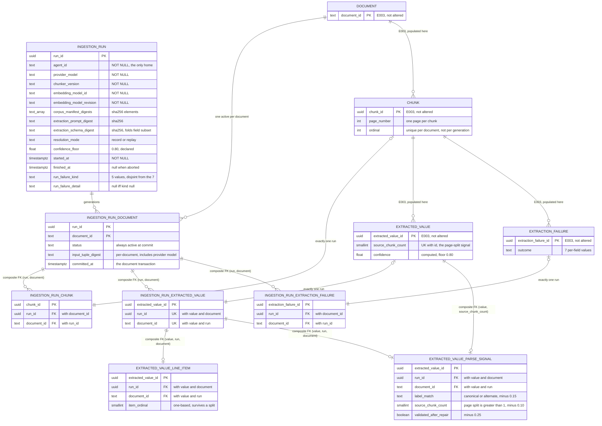

# Data Model — Document Ingestion and Extraction

> Feature: `00006-document-ingestion-and-extraction` (E006) | Storage: **PostgreSQL 16 + `pgvector`**, single instance, schema `public` | Migrations: forward-only Alembic in `/src/model`, filename block **`0300`–`0399`** | Consumers: E008 (retrieval), E009 (identity resolution), E013 (traceability view)

E006 **populates** the corpus and extraction tables E003 owns and **adds seven objects of its own**: an ingestion-run record, a per-document generation record, three run-output associations, a line-item association, and a per-value parse-signal record — plus one view and one privilege revision.

## Scope

| Aspect | Position |
|--------|----------|
| Owned by this epic | `ingestion_run`, `ingestion_run_document`, `ingestion_run_chunk`, `ingestion_run_extracted_value`, `ingestion_run_extraction_failure`, `extracted_value_line_item`, `extracted_value_parse_signal`, and the view `v_active_ingestion_generation`. Nothing else. |
| **Not** owned, **not** altered | `document`, `chunk`, `field_vocabulary`, `extracted_value`, `extracted_value_contributing_chunk`, `extraction_failure`. E006 adds **zero columns**, **zero constraints**, and **zero indexes** to any of them. `specs/00003-core-data-schema/data-model.md` is normative over this document under {SAD:ADR-0017}; where the two disagree, that one governs and this one is the defect (spec Scope Excluded, FR-039). **This is the boundary that decided {SAD:ADR-0020}**: `chunk` already carries `uq_chunk__document_ordinal UNIQUE (document_id, ordinal)` (`src/model/src/model/schema/versions/0004_chunk.py:257`), whose scope is the document and not the generation, so two generations of one document cannot both hold a chunk at ordinal 0 — and widening that constraint is exactly the alteration this row forbids. Retention was therefore not expensive but unstorable, and promotion removes the prior generation instead. |
| Why associations rather than a column | FR-039. Three target tables cannot gain a `run_id` column without changing a schema this epic does not own, so run attribution is carried by three association tables whose primary key **is** the target row's identifier — which is what makes "exactly one run per row" (SC-021) a uniqueness fact rather than a convention. |
| Migration block | `0300`–`0399` (FR-040). E003 holds `0001`–`0099`, E004 holds `0100`–`0199`, `0200`–`0299` is left for E005. The current head is `0103`; E006's first revision chains from it by `down_revision`. |
| Not a table | The ingestion report, the deterministic baseline extractor's output, the leaf-length distribution, and every per-field precision/recall figure. These are published artifacts, not rows: nothing downstream queries them, and storing a measurement beside the data it measures invites the measurement to be recomputed from a subset. `BaselineExtraction` in the spec's Key Entities is a committed report artifact, not a relation. |
| Not computed in the database | Confidence, token counts, Wilson intervals, page containment, and the input-tuple digest are all computed in Python behind the computation-boundary contract (FR-048, FR-031, Principle V). The database stores results and enforces shape. No generated column and no trigger is added by this epic. |

## Conventions

Inherited from `specs/00003-core-data-schema/data-model.md` §Conventions without exception. Restated only where this epic must make a choice.

| Aspect | Rule |
|--------|------|
| Constraint names | `pk_<table>`, `uq_<table>__<purpose>`, `ck_<table>__<rule>`, `fk_<table>__<target>`, `ix_<table>__<purpose>`. Every constraint explicitly named — a server-generated name cannot be referenced by a later forward migration's `DROP CONSTRAINT`, and a test asserting *which* rule rejected a row must match on a name, never on message text. Every name below is ≤ 63 bytes, checked; PostgreSQL truncates silently and two truncated names can collide. |
| Migrations | Forward-only. `revision` doubles as the four-digit filename prefix. Ordering is `down_revision` and only `down_revision`. Every `downgrade()` raises `NotImplementedError`. Explicit DDL only — no autogenerate. Style reference: `src/model/src/model/schema/versions/0006_extraction.py`. |
| Trim set in presence checks | `btrim(col, E' \t\n\r\f')`. Spelled ``, **never `\v`** — PostgreSQL's escape-string syntax has no `\v`, so `E'\v'` is the *letter* `v`: the declared form would admit a vertical-tab-only value and reject a legitimate value of `vvv`. E003's `0004` and `0006` record the same correction. |
| Digest format | `^sha256:[0-9a-f]{64}$`, matching `document.roster_hash` and `forecast_run.input_data_hash`. Array-valued digests are validated element-wise by `fn_all_sha256_prefixed`, E003's existing `IMMUTABLE` helper (created in `0003`), **reused rather than re-declared** — a second helper with the same body would be a second answer, and E006 declares no function of its own. |
| Timestamps | `timestamptz`, never `timestamp`. |
| Grants | Explicit. E003's `0009` deliberately declined `ALTER DEFAULT PRIVILEGES`, so a revision that adds a table grants to `procurement_app` explicitly or the role cannot touch it. |

## Entities

The compact artifact. Detail sections follow; downstream agents that read only this table have the shape.

| Entity | Attributes (name: type, constraints) | Relationships | State Transitions |
|--------|--------------------------------------|---------------|-------------------|
| **ingestion_run** | `run_id: uuid` PK; `agent_id: text` NOT NULL non-empty; `provider_model: text` NOT NULL non-empty; `chunker_version: text` NOT NULL non-empty; `embedding_model_id: text` NOT NULL non-empty; `embedding_model_revision: text` NOT NULL non-empty; `corpus_manifest_digests: text[]` NOT NULL `CHECK(cardinality>=1 AND fn_all_sha256_prefixed)`; `extraction_prompt_digest: text` NOT NULL sha256; `extraction_schema_digest: text` NOT NULL sha256; `resolution_mode: text` NOT NULL `CHECK(IN ('record','replay'))`; `confidence_floor: double precision` NOT NULL `CHECK(>=0 AND <=1)`; `started_at: timestamptz` NOT NULL; `finished_at: timestamptz` NULL `CHECK(NULL OR >= started_at)`; `run_failure_kind: text` NULL `CHECK(IN 5 values)`; `run_failure_detail: text` NULL `CHECK((kind IS NULL) = (detail IS NULL))`; `CHECK(run_failure_kind IS NULL OR finished_at IS NULL)` | has_many: `ingestion_run_document` | **No status column** — generation state is per document and lives on `ingestion_run_document` ({SAD:ADR-0019}). A run is *complete* when `finished_at IS NOT NULL AND run_failure_kind IS NULL`; that is a readable condition, not a stored state. |
| **ingestion_run_document** | PK `(run_id, document_id)`; `run_id: uuid` NOT NULL; `document_id: text` NOT NULL; `status: text` NOT NULL `CHECK(IN ('active','superseded'))`; `input_tuple_digest: text` NOT NULL sha256; `committed_at: timestamptz` NOT NULL DEFAULT `now()`; **partial UNIQUE INDEX on `(document_id) WHERE status = 'active'`** | belongs_to: `ingestion_run` (RESTRICT); belongs_to: `document` (RESTRICT); referenced by all three run-output associations via `(run_id, document_id)` | `Active → Superseded → removed`, all three inside the successor document's transaction ({SAD:ADR-0020}). The mark names the generation the promotion then deletes leaf-up; the row is gone before the successor is inserted, so **every committed row carries `status = 'active'`** and `superseded` is a within-transaction state only. No path back: reverting a promotion is a re-run of the previous chunker version, not a status change. |
| **ingestion_run_chunk** | `chunk_id: uuid` PK; `run_id: uuid` NOT NULL; `document_id: text` NOT NULL | belongs_to: `chunk` (RESTRICT, 1:1); belongs_to: `ingestion_run_document` via composite FK `(run_id, document_id)` (RESTRICT) | — (append-only; `UPDATE`/`DELETE` revoked from the application role) |
| **ingestion_run_extracted_value** | `extracted_value_id: uuid` PK; `run_id: uuid` NOT NULL; `document_id: text` NOT NULL; UNIQUE `(extracted_value_id, run_id, document_id)` | belongs_to: `extracted_value` (RESTRICT, 1:1); belongs_to: `ingestion_run_document` via `(run_id, document_id)` (RESTRICT); referenced by `extracted_value_line_item` | — (append-only) |
| **ingestion_run_extraction_failure** | `extraction_failure_id: uuid` PK; `run_id: uuid` NOT NULL; `document_id: text` NOT NULL | belongs_to: `extraction_failure` (RESTRICT, 1:1); belongs_to: `ingestion_run_document` via `(run_id, document_id)` (RESTRICT) | — (append-only) |
| **extracted_value_line_item** | `extracted_value_id: uuid` PK; `run_id: uuid` NOT NULL; `document_id: text` NOT NULL; `item_ordinal: smallint` NOT NULL `CHECK(>=1)` | belongs_to: `ingestion_run_extracted_value` via composite FK `(extracted_value_id, run_id, document_id)` MATCH FULL (RESTRICT); grouping key `(run_id, document_id, item_ordinal)` | — (append-only) |
| **extracted_value_parse_signal** | `extracted_value_id: uuid` PK; `run_id: uuid` NOT NULL; `document_id: text` NOT NULL; `label_match: text` NOT NULL `CHECK(IN ('canonical','alternate'))`; `source_chunk_count: smallint` NOT NULL `CHECK(>=1)`; `validated_after_repair: boolean` NOT NULL | belongs_to: `ingestion_run_extracted_value` via composite FK `(extracted_value_id, run_id, document_id)` MATCH FULL (RESTRICT); belongs_to: `extracted_value` via composite FK `(extracted_value_id, source_chunk_count)` MATCH FULL (RESTRICT) | — (append-only) |
| **v_active_ingestion_generation** *(view)* | `document_id`, `run_id`, `input_tuple_digest`, `committed_at`, plus the run's `agent_id`, `provider_model`, `chunker_version`, `embedding_model_id`, `embedding_model_revision`, `resolution_mode`, `confidence_floor`, `started_at`, `finished_at` | `ingestion_run_document JOIN ingestion_run` filtered to `status = 'active'` | — |

---

## Table Detail

### `ingestion_run` — FR-038, FR-055, FR-056, SC-022

One row per execution. Every column exists because a requirement names it; nothing here is a count, a rate, or a figure the ingestion report publishes.

| Column | Type | Null | Constraint |
|--------|------|------|-----------|
| `run_id` | `uuid` | NOT NULL | `pk_ingestion_run` PRIMARY KEY. Generated in the job process before the first write, not by a database default — the run row is inserted first and every association resolves to it. |
| `agent_id` | `text` | NOT NULL | `ck_ingestion_run__agent_id_present CHECK (btrim(agent_id, E' \t\n\r\f') <> '')`. **This column is the whole reason the table exists**: E003's TR-082 omits a per-row agent column on the explicit grounds that E006 records agent identity at run granularity. Nothing else in the project holds it. |
| `provider_model` | `text` | NOT NULL | `ck_ingestion_run__provider_model_present`. The model the extraction requests were issued against. Not a foreign key to `llm_invocation.gen_ai_request_model` — E004 owns that table and a run is not an invocation. **An FR-043 input-tuple member**, so a run under a different model reloads every document rather than skipping it: without the model in the tuple a re-run would find every digest unchanged, skip the corpus, and replay fixtures recorded against the previous model. |
| `chunker_version` | `text` | NOT NULL | `ck_ingestion_run__chunker_version_present`. FR-017: a boundary change must be attributable. A pySBD version bump is a chunker-version bump (research: *Deterministic sentence segmentation*). |
| `embedding_model_id` | `text` | NOT NULL | `ck_ingestion_run__embedding_model_id_present`. Recorded here **as well as** on every chunk (E003's `chunk.embedding_model_id`); the per-chunk copy is what lets retrieval refuse to serve a mixed vector space (G-8 in E003), the per-run copy is what makes the input tuple computable without reading a chunk. |
| `embedding_model_revision` | `text` | NOT NULL | `ck_ingestion_run__embedding_model_revision_present`. FR-019: pinned revision, no network at run time. |
| `corpus_manifest_digests` | `text[]` | NOT NULL | `ck_ingestion_run__corpus_manifest_digests CHECK (coalesce(array_length(corpus_manifest_digests, 1), 0) >= 1 AND fn_all_sha256_prefixed(corpus_manifest_digests))`. `coalesce(array_length(...), 0)`, never the bare call: `array_length('{}', 1)` is **NULL, not 0**, and a `CHECK` accepts NULL — the declared-but-wrong form would admit a run that read no manifest at all. Same trap E003's `0008` and `0010` record. One element per committed manifest (real layer, synthetic layer). |
| `extraction_prompt_digest` | `text` | NOT NULL | `ck_ingestion_run__extraction_prompt_digest_format CHECK (~ '^sha256:[0-9a-f]{64}$')`. FR-043 input-tuple member. |
| `extraction_schema_digest` | `text` | NOT NULL | `ck_ingestion_run__extraction_schema_digest_format`. FR-043 input-tuple member. **The declared transmittal field subset of FR-058 is folded into this digest** rather than given a column or a table: the subset decides which failures exist, so a change to it must invalidate a document's generation exactly as a schema change does, and folding it in gets that for free. |
| `resolution_mode` | `text` | NOT NULL | `ck_ingestion_run__resolution_mode CHECK (resolution_mode IN ('record','replay'))`. Same two values and same spelling as `llm_invocation.resolution_mode`, deliberately — a reader comparing a run against its invocations must not have to translate. FR-045: continuous integration runs `replay`. |
| `confidence_floor` | `double precision` | NOT NULL | `ck_ingestion_run__confidence_floor_range CHECK (confidence_floor >= 0.0 AND confidence_floor <= 1.0)`. FR-032, FR-057: the floor is **0.80**, declared before the run. Stored per run rather than as a schema constant, so "the floor was not moved to fit the distribution" is auditable from the row that used it — a constant would record only the current value and erase the history the requirement is about. |
| `started_at` | `timestamptz` | NOT NULL | — |
| `finished_at` | `timestamptz` | NULL | `ck_ingestion_run__finished_after_started CHECK (finished_at IS NULL OR finished_at >= started_at)`. NULL means the run is in flight or aborted; per-document transactions mean an aborted run's committed documents are still legitimate generations, so NULL here does **not** invalidate them. |
| `run_failure_kind` | `text` | NULL | `ck_ingestion_run__failure_kind_domain CHECK (run_failure_kind IS NULL OR run_failure_kind IN ('corpus_digest_mismatch','document_id_collision','oversized_sentence','fixture_missing','provider_unreachable'))`. **FR-056**: five run-level failures, and the set is disjoint from `extraction_failure`'s seven per-field outcomes by construction — no member is shared, so a missing fixture cannot be recorded as though the model produced something unusable when nothing was ever asked. |
| `run_failure_detail` | `text` | NULL | `ck_ingestion_run__failure_detail_iff_kind CHECK ((run_failure_kind IS NULL) = (run_failure_detail IS NULL))`. Both operands are null *tests*, so the expression is never null-valued. A failure without a stated cause is not representable. |
| — | — | — | `ck_ingestion_run__failed_run_unfinished CHECK (run_failure_kind IS NULL OR finished_at IS NULL)` — **SC-044's "the run does not report completion", as a database fact**. A run that recorded a run-level failure cannot also carry a finish timestamp. |

| Name | Definition | Purpose |
|------|-----------|---------|
| `ix_ingestion_run__started_at` | `(started_at DESC)` | Operational listing only. **Never** the selection mechanism — the active generation is selected through `ingestion_run_document`, not by taking the most recent run. Same discipline E003 fixes for `ix_forecast_run__created_at`. |

**No `status` column, and its absence is the decision rather than an omission ({SAD:ADR-0019}).** FR-055 reads "System MUST mark each ingestion run active or superseded", and taken at the word that would be a column here. It cannot be, because FR-043 requires a run to skip every document whose input tuple is unchanged: a run that reloads 3 of 51 documents leaves the other 48 documents' live rows owned by earlier runs, so a run-level flag would either supersede generations the run never replaced or leave replaced ones active. **The requirement is satisfied at run-document granularity** — every generation is marked, so every run is marked once per document it actually ingested, which is the only granularity at which the statement is true of all its rows. ADR-0019 §Decision Outcome fixes this placement, and under {SAD:ADR-0017} this document is where the column it names is declared.

A derived run-level status was considered and rejected rather than overlooked. It would be a cross-row aggregate (`active` iff at least one generation row still names the run), unenforceable by any `CHECK`, and maintainable only by whatever promotion last removed a generation — a second answer that can disagree with the generation rows, where the disagreement is invisible and the wrong one is the one an operational listing shows. "Is this run still live?" is one predicate away: `EXISTS (SELECT 1 FROM ingestion_run_document d WHERE d.run_id = r.run_id)`, since under {SAD:ADR-0020} every committed generation row is active and a run whose rows were all replaced has none left.

**The run row outlives its rows, and that is the point.** Promotion removes a superseded generation's derived rows and its `ingestion_run_document` row, but never the `ingestion_run` row: identity, input tuple configuration, timings, and model identifiers persist whether or not the rows that run produced still do. "What did run X run with" stays answerable after run X's output has been replaced; "what rows did run X produce" does not, and {SAD:ADR-0020} records that as a deliberate loss.

**No count columns either.** Chunks written, values stored, failures recorded, repaired rate, confidence distribution: all published by the ingestion report and all recomputable by a query over the associations. Storing them would create a second answer that can disagree with the rows, and the first thing a reader would do on disagreement is trust the smaller number.

**No embedding-runtime column.** ADR-0018 pins the embedding runtime; it is not recorded here because FR-043 closes the input tuple at the members it names — the document's own content hash, chunker version, embedding model identity and revision, provider model, and the prompt and schema digests — and adding one more to the row without adding it to the tuple would record a fact that cannot supersede a generation. If a runtime change is ever shown to move a vector, it becomes a tuple member by amendment, not by a column added quietly here.

### `ingestion_run_document` — the generation record (FR-043, FR-055, SC-025, SC-043, {SAD:ADR-0019}, {SAD:ADR-0020})

**This table, not `ingestion_run`, is where both the generation status and the "one active generation per document" invariant live, and the reason is FR-043.** A run skips documents whose input tuple is unchanged and creates no rows for them, so a run that reloads 3 of 51 documents leaves the other 48 documents' live rows owned by earlier runs. A run-level flag would therefore have to be `active` and `superseded` at once. Generation state is per `(run, document)` and nowhere else. That placement is {SAD:ADR-0019}'s and is carried forward untouched by {SAD:ADR-0020}.

**Exactly one generation's rows are resident per document, and the enforcing constraint is not one of E006's.** E003's `chunk` carries `uq_chunk__document_ordinal UNIQUE (document_id, ordinal)`, scoped to the document because at the time it was written there was no generation to scope it by. Chunk ordinals are zero-based, so two resident generations of one document both contain `(document_id, 0)` and the second generation's first chunk insert is rejected. E006 may add no constraint to `chunk` and may not widen that one ({SAD:ADR-0017}), so promotion **removes** the prior generation's rows for that document rather than retaining them ({SAD:ADR-0020}). What this table records is which run owns the rows that are here now — not a history of the ones that were.

| Column | Type | Null | Constraint |
|--------|------|------|-----------|
| `run_id` | `uuid` | NOT NULL | part of `pk_ingestion_run_document`; `fk_ingestion_run_document__run FOREIGN KEY (run_id) REFERENCES ingestion_run (run_id) ON DELETE RESTRICT ON UPDATE CASCADE` |
| `document_id` | `text` | NOT NULL | part of the PK; `fk_ingestion_run_document__document FOREIGN KEY (document_id) REFERENCES document (document_id) ON DELETE RESTRICT ON UPDATE CASCADE` — `ON UPDATE CASCADE` because `document_id` is a natural text key and E003's G-9 keeps a format correction open as a live possibility |
| `status` | `text` | NOT NULL | `ck_ingestion_run_document__status CHECK (status IN ('active','superseded'))`. **`NOT NULL` and `CHECK` together are what make the state space two.** A `CHECK` rejects only on *false*, so a NULL status passes it; and `status = 'active'` evaluates to NULL for a NULL status, so the row falls out of the partial index predicate as well. A NULL-status generation would be neither active nor superseded — invisible to the invariant and to every reader, a third state arrived at by omission (ADR-0019 §Decision Outcome, carried forward). **`superseded` is a within-transaction state.** Under {SAD:ADR-0020} the mark and the removal are steps of one promotion transaction, so every *committed* row carries `'active'`. The value is kept in the vocabulary rather than reduced to a boolean because it is what names the generation the promotion is about to delete — the delete statements select on it — and because `superseded` must stay distinguishable from `never activated` if the removal is ever unbundled again. |
| `input_tuple_digest` | `text` | NOT NULL | `ck_ingestion_run_document__tuple_digest_format CHECK (~ '^sha256:[0-9a-f]{64}$')`. FR-043's tuple, reduced to one comparison. **Computed over the document's *own* manifest content hash, not the whole-corpus digest** — a corpus-wide digest would make any change to any document reload all 51, which is the opposite of what FR-043 asks for. Members: this document's manifest content hash, `chunker_version`, `embedding_model_id`, `embedding_model_revision`, **`provider_model`**, `extraction_prompt_digest`, `extraction_schema_digest` — seven values, one per member FR-043 names, counting the embedding model's identity and revision and the prompt and schema digests separately. The provider model is a member because a run under a different model would otherwise find every digest unchanged, skip the whole corpus, and replay fixtures recorded against the previous model. |
| `committed_at` | `timestamptz` | NOT NULL | DEFAULT `now()` — the instant the document's single transaction (FR-054) committed. Per-document rather than per-run because that is the granularity at which durability is actually achieved. |

| Name | Definition | Purpose |
|------|-----------|---------|
| `pk_ingestion_run_document` | `PRIMARY KEY (run_id, document_id)` | Also the FK target for all three run-output associations, which is why it is a composite of exactly these two columns and in this order. |
| `ix_ingestion_run_document__single_active` | `CREATE UNIQUE INDEX … ON ingestion_run_document (document_id) WHERE status = 'active'` | **FR-055, SC-043.** At most one active generation per document, as a database guarantee: a second activation fails on write rather than producing two live generations that readers silently union (research: *Generations of derived data*). Carried forward from {SAD:ADR-0019} unchanged; {SAD:ADR-0020} does not relax it, and it is now the second of two mechanisms saying the same thing — the index forbids two active generations, and one resident generation per document means E003's `uq_chunk__document_ordinal` is never reached. |
| `ix_ingestion_run_document__document` | `(document_id)` | Full index, not partial. Serves the `RESTRICT` check on a `document` delete and the promotion's own lookup of the row it is about to mark and remove. At commit the partial index above covers every row, since every committed row is active — but a row mid-promotion is `superseded` and falls out of that predicate, and it is exactly then that the promotion needs to find it. Both reads are otherwise a sequential scan. |

**Relationship to `ix_forecast_run__single_active` — the same pattern, a different scope, and the difference is the point.** E003's `0008_forecast.py` already carries `CREATE UNIQUE INDEX ix_forecast_run__single_active ON forecast_run (is_active) WHERE is_active`, paired with `v_active_forecast_run` and no `LIMIT`. This index follows that convention deliberately, so a reviewer meets a mechanism already proved and tested in this repository. **The two are not copies and must not be read as such:**

| | `ix_forecast_run__single_active` (E003, `0008`) | `ix_ingestion_run_document__single_active` (E006, `0301`) |
|---|---|---|
| Scope | **Global** — at most one active forecast run in the database | **Per document** — at most one active generation per `document_id`, 51 independent invariants |
| Indexed column | `(is_active)`, a boolean that is the constant `true` for every row in the index, so the index holds at most one row in total | `(document_id)`, so the index holds at most one row *per document* and legitimately holds up to 51 |
| State representation | `boolean is_active` — two states suffice because a forecast run has no per-document scope to be partly retired | `text status` with a `CHECK` — the same two states, but as a named vocabulary, because `superseded` is what names the generation a promotion is removing and must stay distinguishable from `never activated` |
| Where the flag lives | On the run row itself | On the run-to-document association, never on the run — FR-043's skip rule is what forces the difference |
| Lifetime of the retired state | `is_active = false` is durable; a superseded forecast run's row stays | `superseded` is durable only inside the promotion transaction; the row is removed before commit ({SAD:ADR-0020}) |

**The partial unique index cannot be deferred, and that fixes a write order.** `CREATE UNIQUE INDEX … WHERE` produces an *index*, not a constraint, and PostgreSQL admits `DEFERRABLE` only on constraints — no deferral setting rescues the reverse order. So inside the successor document's transaction the predecessor generation must be **marked and removed before** the new row is inserted as `active`. Insert-first raises a unique violation on the insert; there is no ordering-free form of this transaction. Every statement is in the same transaction, so a crash at any point rolls back to the old generation intact and active — the correct state to fail into (ADR-0019 §Decision Outcome, restated at {SAD:ADR-0020} §Decision Outcome). The removal is what releases the index here; the mark that precedes it is FR-055's, not the index's.

### The three run-output associations — FR-039, SC-021

One table per target, each with the **target row's own identifier as its entire primary key**. That single choice carries SC-021's "exactly one ingestion run" half-way with no application discipline: a second association row for one chunk is a primary-key collision. The other half — that an association row exists at all — is cross-table absence and is disclosed as **G-1**.

| Table | PK | Target FK | Generation FK |
|-------|----|-----------|---------------|
| `ingestion_run_chunk` | `pk_ingestion_run_chunk (chunk_id)` | `fk_ingestion_run_chunk__chunk` → `chunk (chunk_id)` RESTRICT / CASCADE | `fk_ingestion_run_chunk__generation` → `ingestion_run_document (run_id, document_id)` MATCH FULL RESTRICT / CASCADE |
| `ingestion_run_extracted_value` | `pk_ingestion_run_extracted_value (extracted_value_id)` | `fk_ingestion_run_extracted_value__value` → `extracted_value (extracted_value_id)` RESTRICT / CASCADE | `fk_ingestion_run_extracted_value__generation` → same target |
| `ingestion_run_extraction_failure` | `pk_ingestion_run_extraction_failure (extraction_failure_id)` | `fk_ingestion_run_extraction_failure__failure` → `extraction_failure (extraction_failure_id)` RESTRICT / CASCADE | `fk_ingestion_run_extraction_failure__generation` → same target |

Each carries exactly three columns — the target identifier, `run_id`, and `document_id` — and one index:

| Name | Definition | Purpose |
|------|-----------|---------|
| `ix_ingestion_run_chunk__generation` | `(run_id, document_id)` | PostgreSQL creates no index on the *referencing* side of a foreign key, so without this every promotion's removal step sequentially scans ~15,000 rows to enforce `RESTRICT` — and under {SAD:ADR-0020} that scan is on the promotion path, not on a background job. Also the "all chunks this generation wrote" read. |
| `ix_ingestion_run_extracted_value__generation` | `(run_id, document_id)` | Same, and the join E009 walks from a value to the models that produced it. |
| `ix_ingestion_run_extraction_failure__generation` | `(run_id, document_id)` | Same. |

`ingestion_run_extracted_value` additionally carries `uq_ingestion_run_extracted_value__value_generation UNIQUE (extracted_value_id, run_id, document_id)` — redundant against its primary key by design, exactly as `uq_chunk__chunk_page` is. It exists to be the foreign-key target of the two value-level associations, `extracted_value_line_item` and `extracted_value_parse_signal`, each of which needs all three columns in one referenced key.

**Why `document_id` is on the association at all.** It is derivable — from `chunk.document_id`, or from a value's source chunk two joins away. It is carried anyway because the generation is keyed on `(run_id, document_id)`, and without the column the association could not reference the generation row: a promotion replacing one document's generation would have no way to find the rows it must remove first. The cost is disclosed as **G-2**: `chunk` has no unique key on `(chunk_id, document_id)` and E006 may not add one, so nothing structural stops an association row from naming a different document than its chunk does — and under {SAD:ADR-0020} a mis-scoped `document_id` now fails or mis-scopes the promotion itself rather than a background job.

### `extracted_value_line_item` — FR-059, SC-046

The association identity resolution matches on. A transmittal listing five items otherwise yields five manufacturers and five part numbers with nothing joining them.

| Column | Type | Null | Constraint |
|--------|------|------|-----------|
| `extracted_value_id` | `uuid` | NOT NULL | `pk_extracted_value_line_item` PRIMARY KEY. **The value, alone, is the key** — SC-046 requires every value to belong to *exactly one* line item, and a primary key on the value is what makes a second membership unrepresentable rather than merely wrong. |
| `run_id` | `uuid` | NOT NULL | part of `fk_extracted_value_line_item__run_output` |
| `document_id` | `text` | NOT NULL | part of the same FK |
| `item_ordinal` | `smallint` | NOT NULL | `ck_extracted_value_line_item__ordinal_positive CHECK (item_ordinal >= 1)`. One-based, matching the printed item numbering on the transmittal. |

| Name | Definition | Purpose |
|------|-----------|---------|
| `fk_extracted_value_line_item__run_output` | `FOREIGN KEY (extracted_value_id, run_id, document_id) REFERENCES ingestion_run_extracted_value (extracted_value_id, run_id, document_id) MATCH FULL ON DELETE RESTRICT ON UPDATE CASCADE` | References the run-output association rather than `extracted_value` directly. Three things follow, none of them available from a direct FK: a line-item row cannot exist for a value that has no run attribution; its `document_id` and `run_id` **cannot disagree** with the value's own, because they are the same referenced key; and the grouping key is generation-scoped, so the promotion's removal step can find every line-item row of the generation it is replacing without joining back through `extracted_value`. Generation scope is retained under {SAD:ADR-0020} even though two generations are no longer resident together: it is what makes the leaf-up delete a keyed lookup rather than a scan. |
| `ix_extracted_value_line_item__item` | `(run_id, document_id, item_ordinal)` | The grouping read — "every value of item 3 of this document" — and the index the promotion's `RESTRICT`-ordered delete uses. |

**Why the item ordinal and not the source chunk.** The clarification is explicit: keying on the source chunk would make an over-long item entry split across two chunks silently become two line items. The ordinal is assigned by the extractor from the printed item order and survives the split, because both chunks' values carry the same ordinal. That is exactly what SC-046's second clause tests.

**No `field_name` column.** A uniqueness rule of the shape "one manufacturer per line item" would need `field_name` denormalized here and held equal to the value's by composite FK — and `extracted_value` has no unique key on `(extracted_value_id, field_name)` for that FK to reference, which E006 may not add. The rule is also not universally true (an item may legitimately cite two compliance standards). Left unasserted rather than half-enforced; the per-field cardinality of a line item is E009's concern, disclosed as **G-5**.

### `extracted_value_parse_signal` — FR-063, FR-057, FR-046, SC-026

**The inputs to a computed confidence, stored where they can be read back.** FR-057 computes confidence as `1.0` less three declared deductions; SC-026 requires that recomputing every stored confidence from the signals recorded with it reproduces the stored value exactly. Two of the three signals exist in no column anywhere: **nothing** records that a printed label matched a known alternate rather than the canonical form, and **nothing** records that an invocation validated only after a repair — `extraction_failure.repair_attempt_count` covers failures, and a value that repaired successfully produces no failure row. Without them, "recompute the confidence from its signals" reduces to reading the confidence and comparing it with itself, and SC-026 passes on a tautology.

`extracted_value` is E003's table and takes no new column (spec Scope Excluded, {SAD:ADR-0017}), so the signals live in a table this epic owns in its own block. One row per value.

| Column | Type | Null | Constraint |
|--------|------|------|-----------|
| `extracted_value_id` | `uuid` | NOT NULL | `pk_extracted_value_parse_signal` PRIMARY KEY. **The value alone is the key**, so a second, disagreeing signal row for one value is unrepresentable rather than merely wrong — the same reason `extracted_value_line_item` is keyed this way. |
| `run_id` | `uuid` | NOT NULL | part of `fk_extracted_value_parse_signal__run_output` |
| `document_id` | `text` | NOT NULL | part of the same FK |
| `label_match` | `text` | NOT NULL | `ck_extracted_value_parse_signal__label_match CHECK (label_match IN ('canonical','alternate'))`. FR-057's 0.15 deduction. A named vocabulary rather than a boolean `was_alternate`, matching the `status` reasoning above: the column says which of two stated things the label was, not whether an unstated default did not hold. Alternates resolve against the field-label vocabulary E002 committed, which is where the closed set lives; this column records only which side of it the printed label fell on. |
| `source_chunk_count` | `smallint` | NOT NULL | `ck_extracted_value_parse_signal__source_count_positive CHECK (source_chunk_count >= 1)`, and part of `fk_extracted_value_parse_signal__value_count`. **This is the page-split signal, and it is deliberately not an independent boolean.** The signal already exists in E003's `extracted_value.source_chunk_count`, so a `page_split boolean` here would be a second answer that can disagree with the value's own provenance — and the disagreement would be invisible, because the recomputation would read the copy and the citation would read the original. Carried as the count and held equal by composite FK, the signal *is* the value's own: page-split is `source_chunk_count > 1`, and it cannot differ from what `extracted_value_contributing_chunk` actually holds. |
| `validated_after_repair` | `boolean` | NOT NULL | FR-057's 0.25 deduction. A boolean and not a count: FR-057 deducts once for "validated only after a repair" regardless of how many attempts were spent, and the spec's own assumption fixes the budget at one attempt. A count here would invite the deduction to be scaled by it, which is arithmetic the requirement does not state. |

| Name | Definition | Purpose |
|------|-----------|---------|
| `fk_extracted_value_parse_signal__run_output` | `FOREIGN KEY (extracted_value_id, run_id, document_id) REFERENCES ingestion_run_extracted_value (extracted_value_id, run_id, document_id) MATCH FULL ON DELETE RESTRICT ON UPDATE CASCADE` | Same target and same three reasons as the line-item association: no signal row without run attribution, no disagreement about which run and document, and a generation-scoped key the promotion's removal step can delete on. |
| `fk_extracted_value_parse_signal__value_count` | `FOREIGN KEY (extracted_value_id, source_chunk_count) REFERENCES extracted_value (extracted_value_id, source_chunk_count) MATCH FULL ON DELETE RESTRICT ON UPDATE CASCADE` | Targets E003's **existing** `uq_extracted_value__id_source_count`, the unique key E003 declared for `extracted_value_contributing_chunk` to reference. **No object is added to `extracted_value`** — this reuses a key that is already there, which is the only reason the page-split signal can be made non-disagreeable without altering a table E006 does not own. |
| `ix_extracted_value_parse_signal__generation` | `(run_id, document_id)` | Referencing-side index for the generation FK; the promotion's leaf-up delete finds this generation's signal rows through it. |

**The floor is not a `CHECK`, and the reason is that the floor is a per-run column.** FR-057 sets the floor at 0.80 and states it as the combinations it excludes: any repaired invocation (0.75), and any value both alternate-labelled and page-split (0.75). Of the eight combinations three survive — `('canonical', 1, false)` = 1.00, `('canonical', >1, false)` = 0.90, `('alternate', 1, false)` = 0.85 — so a stored value's signal row should be one of exactly three shapes and its confidence one of exactly three values. That is a strong assertion and it is still not a `CHECK`, because admissibility depends on `ingestion_run.confidence_floor`, which is a different row: a `CHECK` hard-coding 0.80 would reject a legitimate value under a run that declared a lower floor, and hard-coding nothing enforces nothing. Asserted by **VR-026**, disclosed as **G-9**.

**No `confidence` column here.** The score is `extracted_value.confidence`, E003's, and copying it beside its inputs would create the one thing SC-026 exists to detect — a stored number that can drift from the signals it claims to be computed from. The recomputation reads the signals here and the score there, and they are one join apart.

### `v_active_ingestion_generation` — FR-055, SC-043, {SAD:ADR-0019}

```
CREATE VIEW v_active_ingestion_generation AS
    SELECT d.document_id, d.run_id, d.input_tuple_digest, d.committed_at,
           r.agent_id, r.provider_model, r.chunker_version,
           r.embedding_model_id, r.embedding_model_revision,
           r.resolution_mode, r.confidence_floor, r.started_at, r.finished_at
    FROM ingestion_run_document d
    JOIN ingestion_run r ON r.run_id = d.run_id
    WHERE d.status = 'active'
```

**The view is not a convenience — it is the single place the filtering obligation is discharged.** ADR-0019 records that obligation as falling on **E008** (retrieval and reranking over chunks), **E009** (identity resolution over extracted line items), and **E012** (source-page traceability), and {SAD:ADR-0020} explicitly does not release them from it. What changes is what the predicate is the last line of defence against. Under retention, an unqualified query against `chunk` would have returned superseded rows *silently* — same document, same page, near-identical text. Under removal those rows are gone, so a reader who forgets the filter gets the right rows anyway. The obligation survives for two reasons that removal does not cover: the view is where **run attribution** is obtained at all — which chunker version, which embedding revision, which run produced the row in hand — and it is where "this document has no live generation" is distinguishable from "this document has one". An epic that joins the base table directly has taken both onto itself, and gets no error when it is wrong.

One view, not three. Every consumer joins its own target table to that table's run-output association and then to this view, so the predicate is written once and a reader that forgets it is visible as a missing join rather than as a missing `WHERE` clause buried in a filter list. Per-target views (`v_active_chunk`, `v_active_extracted_value`, …) were rejected: they would have to select the 384-dimension embedding column or omit it, and either choice is wrong for one of E008's two retrieval arms.

**No `LIMIT`, and no recency fallback — both following `v_active_forecast_run` exactly, and both carried forward unchanged by {SAD:ADR-0020}.** A `LIMIT` would *conceal* a second active generation rather than the index preventing one, and the index is what prevents it. Zero rows for a document is legal and meaningful: it says "this document has not been ingested under the current inputs", and a consumer must be able to tell that apart from "ingested under them". It is also, under {SAD:ADR-0020}, the state a document occupies between the removal and the write inside a promotion transaction — invisible outside it, because both are in the same transaction. An `ORDER BY committed_at DESC LIMIT 1` fallback would re-introduce ADR-0019's rejected Option D inside the view itself, and would additionally now be dead code: there is never more than one generation row per document to order.

The view exposes the run's identity columns because FR-038's question — "what produced this number" — is then one read from a document rather than a two-hop join. It exposes no `status` column: every row it returns is active by construction, and carrying the column would invite a reader to filter on it again and conclude the view does not.

## Referential Actions

`RESTRICT` on every edge. Nothing E006 adds cascades on delete, because a cascade is exactly the silent teardown FR-041 forbids: correction is an ordered operator procedure, and an edge that deletes itself when its parent goes hides the ordering the procedure depends on.

| Child → Parent | ON DELETE | ON UPDATE | Rationale |
|---|---|---|---|
| `ingestion_run_document` → `ingestion_run` | RESTRICT | CASCADE | A run cannot be dropped while any generation still points at it — the removal order is leaf-up and this is what enforces it. The promotion's removal stops at the generation row and never touches `ingestion_run`, so a replaced run's configuration record survives its rows. |
| `ingestion_run_document` → `document` | RESTRICT | CASCADE | A document with generations is not droppable. `ON UPDATE CASCADE` mirrors `fk_chunk__document`, so E003's G-9 `document_id` correction propagates here too rather than deadlocking. |
| `ingestion_run_chunk` → `chunk` | RESTRICT | CASCADE | Same posture as `extracted_value → chunk`. |
| `ingestion_run_extracted_value` → `extracted_value` | RESTRICT | CASCADE | — |
| `ingestion_run_extraction_failure` → `extraction_failure` | RESTRICT | CASCADE | — |
| all three associations → `ingestion_run_document` | RESTRICT | CASCADE | The leaf-up rule again, at the generation boundary. |
| `extracted_value_line_item` → `ingestion_run_extracted_value` | RESTRICT | CASCADE | The deepest leaf. Line-item rows are among the first things a promotion's removal step deletes. |
| `extracted_value_parse_signal` → `ingestion_run_extracted_value` | RESTRICT | CASCADE | The other deepest leaf, removed in the same step. |
| `extracted_value_parse_signal` → `extracted_value` | RESTRICT | CASCADE | Against E003's existing `uq_extracted_value__id_source_count`. `RESTRICT` here is also what forces the signal row to be deleted before its value — a `CASCADE` would let a value removal silently take its parse signals with it and hide a mis-ordered removal. |

**`RESTRICT` cannot be deferred, and `NO ACTION` can** (research: *Generations of derived data*). A removal therefore cannot delete parents before children inside one transaction and must proceed strictly leaf-up in the order §Operator Procedures fixes. `NO ACTION` was rejected in every position: a deferred check would let a mid-transaction inconsistency exist, and the whole reason these edges restrict is that the ordering is the procedure. Under {SAD:ADR-0020} that ordering burden moved onto the **promotion path**: a mis-ordered delete now aborts the promotion of a document rather than a background job, which is stricter and is the intended trade.

## Write Order and Transaction Boundary — FR-054, FR-042, SC-042

**Not DDL. This is the rule the ingestion job is written against, and every guarantee about a half-ingested document rests on it.**

One **autocommit** connection for the run; each document wrapped in `with conn.transaction():` (research: *Per-document transactional ingestion with psycopg 3*). The default non-autocommit connection begins an implicit transaction on first execute and would silently make the entire run one transaction — a late failure would then discard all 51 documents.

**Which role opens that connection depends on whether the run replaces anything.** Steps 0c–0g below are deletions, and `procurement_app` holds `DELETE` on none of the tables involved. A run in which every document is a first ingest or a skip therefore runs unattended under the application role and executes no step 0a–0g at all. A run that replaces any existing generation runs under the **schema-owning role** for its whole length, because the removal has to be inside the same transaction as the write that replaces it — {SAD:ADR-0020}. First ingestion and re-ingestion are not the same operation, and this is the line between them.

Order inside document *d*'s transaction:

| # | Statement | Why here |
|---|-----------|----------|
| 0a | `UPDATE ingestion_run_document SET status = 'superseded' WHERE document_id = d AND status = 'active'` | FR-055's mark, and it names the generation steps 0b–0g act on: each of them resolves from the prior `(run_id, document_id)` this statement just marked, so the removal has a stated target rather than a reconstructed one. A no-op on first ingest, and the whole 0b–0g block is skipped when it affects zero rows. |
| 0b | **Materialize the target identifier sets** for the superseded generation — chunk ids from `ingestion_run_chunk`, value ids from `ingestion_run_extracted_value`, failure ids from `ingestion_run_extraction_failure` | **Identification precedes deletion, and this step exists because the leaf-up order would otherwise destroy it.** The associations are the only thing that says which of E003's rows belong to this generation, and leaf-up deletes them *before* the rows they identify. Delete first and the join that would have found the `extracted_value` rows no longer exists. A `WITH … AS (DELETE … RETURNING …)` chain satisfies this in one statement; what is required is the ordering, not two round trips. |
| 0c | `DELETE extracted_value_line_item`, `extracted_value_parse_signal` for the superseded generation | Leaf-up starts here. Both are keyed on `(run_id, document_id)` directly and need no set from 0b. `RESTRICT` is not deferrable, so nothing about this order is negotiable. |
| 0d | `DELETE ingestion_run_extracted_value`, `ingestion_run_extraction_failure`, `ingestion_run_chunk` for it | The run-output associations, once their own children are gone. After this the generation is unresolvable from the database — which is why 0b ran. |
| 0e | `DELETE extraction_failure`, then `extracted_value_contributing_chunk`, then `extracted_value`, by the id sets from 0b | E003's rows. `extracted_value_contributing_chunk → extracted_value` is `ON DELETE CASCADE` in E003, so this step could be shortened — it is spelled out anyway, because a step that relies on a cascade in a table this epic does not own is a step that changes meaning if that table does. |
| 0f | `DELETE chunk`, by the chunk-id set from 0b | **The step the whole record exists for.** Until these rows are gone, `uq_chunk__document_ordinal UNIQUE (document_id, ordinal)` makes step 1 impossible. Deleting by the captured set rather than by `document_id = d` is deliberate: the two are equal only while the one-resident-generation invariant holds, and a step that assumes the invariant it is enforcing cannot detect its breach. |
| 0g | `DELETE ingestion_run_document` for the superseded generation | Last of the removal. Releases `ix_ingestion_run_document__single_active` for *d*, which is what lets 0h insert. |
| 0h | `INSERT ingestion_run_document (run_id, d, 'active', input_tuple_digest)` | Every association FK targets this row, so it is a prologue to FR-054's stated order rather than a member of it. Insert-before-removal raises on the partial unique index; the index is not deferrable and no setting rescues the reverse order. |
| 1 | `INSERT chunk` (via `cursor.copy()`) | FR-054's first named member. `COPY` inside the block is transactional and rolls back with it. Ordinal 0 is now free for *d* because 0f ran. |
| 2 | `INSERT extracted_value` | Cited page must resolve to a chunk written at step 1. |
| 3 | `INSERT extracted_value_contributing_chunk` | References the value's `(id, source_chunk_count)` key. |
| 4 | `INSERT extraction_failure` | References chunks from step 1. |
| 5 | `INSERT ingestion_run_chunk`, `ingestion_run_extracted_value`, `ingestion_run_extraction_failure` | FR-054's "run associations", last. Every target exists by now. |
| 6 | `INSERT extracted_value_line_item`, `extracted_value_parse_signal` | After step 5: both reference `ingestion_run_extracted_value`, not `extracted_value` directly. The parse-signal row additionally references the value's `(id, source_chunk_count)` key from step 2. |
| 7 | commit | An abort at document *k* leaves documents 1..*k*−1 committed and durable and document *k* entirely absent — or, if *k* was a re-ingest, **restored to its prior generation intact**, since the removal rolls back with everything else. **No deletion privilege is needed to clean up after an abort**, which is the whole point (STF-002); the deletion privilege steps 0c–0g need is for the promotion itself, not for recovery from a failed one. |

**Removal precedes the write, and is not merely convenient there.** Deleting after writing would put both generations' ordinal 0 in `chunk` for the length of a statement, which is the exact collision {SAD:ADR-0020} exists to avoid. There is no ordering in which two generations of one document are ever simultaneously resident, not even transiently.

**A failure row describing a rolled-back document is written in a fresh transaction, after the rollback.** A row written inside *d*'s transaction to explain why *d* failed is rolled back along with it — the research pitfall, and it is not merely a lost log line here. The post-rollback write is an `UPDATE` on `ingestion_run` setting `run_failure_kind` and `run_failure_detail`, **never** an `extraction_failure` row: `extraction_failure.source_chunk_id` is NOT NULL with a `RESTRICT` foreign key to a chunk the rollback has just removed, so a per-field failure row for a rolled-back document has no referent and cannot be stored at all. That is the structural reason FR-056's run-level failure needs its own home.

Two further consequences of the transaction shape, both load-bearing:

- **The per-document error handler must catch outside the `with` block.** Nested `transaction()` blocks are savepoints; a handler inside the block means the outer rollback never happens.
- **Index building is DDL and must not appear inside the block.** See §Operator Procedures.

## Operator Procedures

Three procedures that are **not** reachable from the ingestion job, because the job connects as the application role and that role holds neither `DELETE` on the provenance tables nor any DDL privilege. Each is executed under the schema-owning role.

Under {SAD:ADR-0020} the third of these is no longer a separate later job: **promotion of a replacing generation is itself an operator procedure**, because promotion now performs the removal. This is the practical cost of the record and it is stated first rather than discovered: a first-ingest run is unattended, a re-ingest run is not.

### 1. HNSW index drop and rebuild around a full-corpus load

`ix_chunk__embedding_hnsw` is E003's object, declared in migration `0004` as `USING hnsw (embedding vector_cosine_ops) WITH (m = 16, ef_construction = 64)`. pgvector is explicit that indexes should be added *after* the initial data load; building the graph one row-insert at a time costs far more than one bulk build.

| Step | Statement | Note |
|------|-----------|------|
| 1 | `DROP INDEX ix_chunk__embedding_hnsw` | Schema-owning role. `DROP INDEX` requires ownership of the table; `procurement_app` holds table-level DML grants and `USAGE` on the schema and owns nothing, so **the ingestion job cannot do this and is not meant to**. |
| 2 | Run the ingestion job | Ordinary per-document transactions, unchanged. |
| 3 | `SET maintenance_work_mem`, `SET max_parallel_maintenance_workers` (and `max_parallel_workers` to match) | Build speed is dominated by whether the graph fits in `maintenance_work_mem`. |
| 4 | `CREATE INDEX ix_chunk__embedding_hnsw ON chunk USING hnsw (embedding vector_cosine_ops) WITH (m = 16, ef_construction = 64)` | **Verbatim** — same name, same operator class, same `m` and `ef_construction`. Any deviation makes the live schema disagree with `specs/00003-core-data-schema/data-model.md`, which is normative. Not `CREATE INDEX CONCURRENTLY`: slower, and it buys availability an offline job does not need. |

**Two states this opens, both disclosed rather than presented as closed.** Between step 1 and step 4 every similarity query falls back to a sequential scan — acceptable offline, and E003's scale note already records that exact scan is viable at ~15,000 rows, so the window degrades latency and not correctness. And **an aborted run leaves the index absent until the procedure is re-run**: nothing in the database restores it, no migration recreates it on an already-migrated database, and a retrieval consumer would silently get correct-but-slow answers with no signal. Covered as **G-7** — a startup check asserting the index exists in `pg_indexes` before serving.

This procedure is deliberately **not** a migration. A revision that dropped and recreated the index would run on every fresh database, where there is nothing to load and nothing to gain.

### 2. Remove-and-reload correction — FR-041, SC-024

Migration `0009` revoked `UPDATE` and `DELETE` on `extracted_value`, `extracted_value_contributing_chunk`, and `extraction_failure` from `procurement_app`, so **the ingestion job cannot delete what it wrote and no code path in this epic attempts to**. E006's revision `0304` extends the same posture to all six tables it adds beyond `ingestion_run`. A correction is therefore a **re-ingestion of the affected document under the schema-owning role** — procedure 3, which is now the promotion itself rather than a separate purge that precedes it. Zero rows are updated in place at any point, by anyone.

### 3. Promotion of a replacing generation — FR-055, {SAD:ADR-0020}

**Retention bound**: **zero** superseded generations are retained. Promotion removes the prior generation's rows for that document and then writes the new one, so exactly one generation's rows exist per document at any time. The bound is not a policy a purge job is trusted to honour — it is what the delivered schema permits: `uq_chunk__document_ordinal UNIQUE (document_id, ordinal)` is scoped to the document, so a second resident generation's ordinal 0 is rejected on write. Storage is therefore a full corpus, flat, rather than a full corpus per chunker revision — which is what STF-003 raised and what ADR-0019's retention clause could not actually have delivered.

**The removal is a step of the promotion transaction, not a procedure run beside it.** It is listed here because it is executed under the schema-owning role and because its ordering is fixed, but it appears in §Write Order as steps 0b–0g and runs inside document *d*'s single transaction (FR-054). Removal of one generation `(run_id, document_id)`, strictly leaf-up, one statement per step because `RESTRICT` cannot be deferred:

0. **Capture the identifier sets first** — chunk ids, value ids, and failure ids for that generation, read from the three run-output associations while they still exist. Steps 2 and 3 delete the only rows that could answer "which of E003's rows were this generation's", so an implementation that identifies as it goes runs out of ways to say it. This is the step most easily lost when the list is read as an ordering only.
1. `extracted_value_line_item` and `extracted_value_parse_signal` for that generation
2. `ingestion_run_extracted_value`, `ingestion_run_extraction_failure`, `ingestion_run_chunk` for that generation
3. `extraction_failure`, then `extracted_value_contributing_chunk`, then `extracted_value`, by the value and failure id sets from step 0
4. `chunk`, by the chunk-id set from step 0
5. `ingestion_run_document` for that generation
6. **Stop.** `ingestion_run` is *not* removed. It is droppable only once it holds zero generation rows — enforced by `fk_ingestion_run_document__run ON DELETE RESTRICT`, so the ordering is refused rather than trusted — but a replaced run's identity, input tuple configuration, timings, and model identifiers are exactly what makes the surviving history readable, and nothing in promotion drops them. There is no run-level status to update on the way out either: a run with no generation rows left is retired by the absence of its generations, not by a flag.

**The ingestion job holds no `DELETE` privilege and cannot perform any of steps 1–5.** Step 0 is a read and it can do that; every step after it is refused. `procurement_app` was denied `DELETE` on `extracted_value`, `extracted_value_contributing_chunk`, and `extraction_failure` by migration `0009`, and revision `0304` withholds it on every table E006 adds. That is untouched: {SAD:ADR-0020} does not buy the privilege back, and FR-041's commitment not to weaken the revoke stands. What changed is *when* the schema-owning role acts — immediately before the replacing write, in the same transaction, rather than as a separate job at an unspecified later time — not *who* acts. The privilege objection that defeated ADR-0019's own deletion option therefore does not apply here, because the actor was never the ingestion job.

**Reversal of a bad promotion is a re-run, not a flip.** ADR-0019's status-flip rollback is withdrawn: the predecessor's rows are gone and no status change recovers them. Recovery is re-running ingestion for that document at the previous chunker version, which is possible because ingestion is deterministic given its input tuple (FR-043) — the earlier generation is reproducible rather than merely lost. The cost is a full ingestion pass instead of a transaction, and it is disclosed as such.

## Privileges — revision `0304`

Following E003's `0009` shape exactly: grant the ordinary four verbs, then take two back, so the append-only rule reads as a deliberate revoke rather than as an omission — and an omission is indistinguishable from having forgotten.

| Object | `procurement_app` holds | Why |
|--------|-------------------------|-----|
| `ingestion_run` | `SELECT, INSERT, UPDATE` | `UPDATE` is required and is not a provenance edit: `finished_at` and the two run-failure columns are written after the row is inserted, the last of them in a fresh transaction after a rollback. `DELETE` withheld — dropping a run is never part of promotion (procedure 3, step 6). |
| `ingestion_run_document`, `ingestion_run_chunk`, `ingestion_run_extracted_value`, `ingestion_run_extraction_failure`, `extracted_value_line_item`, `extracted_value_parse_signal` | `SELECT, INSERT` | Append-only by privilege, matching the three tables `0009` covers. These rows *are* provenance: an association silently repointed at a different run makes SC-021 true and meaningless. |
| `v_active_ingestion_generation` | `SELECT` | — |

**`ingestion_run_document` lost its `UPDATE`, and the reason is {SAD:ADR-0020}.** The earlier design granted it for step 0a's `active → superseded` flip, on the understanding that the ingestion job performed that flip on every re-ingest. It no longer can: the flip names a generation that steps 0c–0g then delete, and the application role holds `DELETE` on none of those tables, so a re-ingest under `procurement_app` would flip the row and then fail on the first delete — an aborted transaction preceded by a pointless privilege. The flip moved to the schema-owning role together with the removal it names, so the grant follows it. `procurement_app` can create a first generation and never alter one. An unexercised grant is worse than a missing one here, because grant-then-revoke is how this schema says a restriction was meant.

`GRANT SELECT ON ALL TABLES IN SCHEMA public` at `0009` covered only the tables existing then, so every object above is granted explicitly. `ALTER DEFAULT PRIVILEGES` remains unused, deliberately, for the reason `0009` records: a future append-only table would otherwise acquire `UPDATE` and `DELETE` silently.

**Reach.** The deployed connection role is the SUPERUSER `procurement`, which bypasses every privilege check, so this guarantee is latent exactly as E003's **G-11** records — real, catalogued, asserted by test under `SET LOCAL ROLE procurement_app`, and not operative against the role the application actually connects as. Restated here rather than inherited silently, because SC-024 is an E006 criterion and must not be reported as fully enforced in the deployed configuration. Carried as **G-6**.

## Migration Sequence

Filename prefixes `0300`–`0399` are E006's reserved block (FR-040). The chain head at authoring time is `0103`; `0300` chains from it by `down_revision`. Every revision is forward-only, authored as explicit DDL, and its `downgrade()` raises.

| Prefix | `down_revision` | Contents | Gate |
|--------|-----------------|----------|------|
| `0300` | `0103` | `ingestion_run`, `ix_ingestion_run__started_at` | **Blocked until FR-047's amendment to TR-081 has landed on the default branch** (SC-034). Writing computed confidences into a column the normative document calls agent-asserted would mislead every reader who trusts that document. The gate is on the epic, recorded on its first revision. |
| `0301` | `0300` | `ingestion_run_document`, `ix_ingestion_run_document__single_active`, `ix_ingestion_run_document__document`, `v_active_ingestion_generation` | After `0300` and after E003's `0003` (`document`). The view reads both tables, so it cannot be split from either. Implements {SAD:ADR-0019} as amended by {SAD:ADR-0020}; the identifiers are fixed here rather than in either ADR, per {SAD:ADR-0017}. No DDL differs between the two records — {SAD:ADR-0020} changes the promotion procedure, not this revision's objects. |
| `0302` | `0301` | `ingestion_run_chunk`, `ingestion_run_extracted_value`, `ingestion_run_extraction_failure` and their three indexes | After `0301`, and after E003's `0004` and `0006`. One revision for all three: they share one FK target and no intermediate head is useful. |
| `0303` | `0302` | `extracted_value_line_item`, `ix_extracted_value_line_item__item`, `extracted_value_parse_signal`, `ix_extracted_value_parse_signal__generation` | After `0302` — both tables' generation FK references `uq_ingestion_run_extracted_value__value_generation`, and the parse signal's second FK references E003's existing `uq_extracted_value__id_source_count` from `0006`. One revision for both, on the same grounds as `0302`: shared FK target, no useful intermediate head. |
| `0304` | `0303` | Grants to `procurement_app` on all seven tables and the view; revoke `UPDATE, DELETE` on the six append-only tables; revoke `DELETE` on `ingestion_run` | Last, so the grant-then-revoke reads in one place. Mirrors `0009`. |

Verification this epic ships, mirroring E003's: apply-from-empty against the Compose `db` service; re-apply-at-head is a no-op; `alembic heads` returns exactly one; **every filename prefix falls in `0300`–`0399` and no object is placed in another epic's block** (SC-034); no `downgrade()` carries a body; and every object the chain leaves behind is named in §Named Object Inventory below.

**Block-partition assertion.** The existing check that asserts each epic's prefix range is extended with `0300`–`0399`, and `0200`–`0299` stays unclaimed for E005. Nothing outside this epic's spec ratifies that reservation, so it holds only if E005 reads it — carried forward from the spec's Compliance Check as a sequencing condition, not a defect.

## Named Object Inventory

Every database object E006's revisions create, by name. The names are the contract: a constraint whose name is not written down cannot be referenced by a later migration's `DROP CONSTRAINT`, and cannot be *expected* by another epic's test — and a test that matches on message text instead is matching on something locale- and version-dependent. E003's TR-083 admits no undocumented object in the schema, and that duty falls on the owning document, which for these objects is this one.

### Relations, views, and indexes

| Object | Kind | Revision | Purpose |
|---|---|---|---|
| `ingestion_run` | table | `0300` | One row per execution; the only home of agent identity in the project |
| `ingestion_run_document` | table | `0301` | Per-document generation with active/superseded state |
| `v_active_ingestion_generation` | view | `0301` | The active generation per document, joined to its run's identity |
| `ingestion_run_chunk` | table | `0302` | Run attribution for a chunk |
| `ingestion_run_extracted_value` | table | `0302` | Run attribution for an extracted value |
| `ingestion_run_extraction_failure` | table | `0302` | Run attribution for an extraction failure |
| `extracted_value_line_item` | table | `0303` | Line-item membership of an extracted value |
| `extracted_value_parse_signal` | table | `0303` | The parse signals a value's confidence was computed from (FR-063) |
| `pk_ingestion_run` | index | `0300` | Primary-key index on `run_id` |
| `ix_ingestion_run__started_at` | index | `0300` | Operational listing by recency; never the selection mechanism |
| `pk_ingestion_run_document` | index | `0301` | Primary-key index on `(run_id, document_id)`; the associations' FK target |
| `ix_ingestion_run_document__single_active` | unique index, partial | `0301` | `(document_id) WHERE status = 'active'` — one live generation per document |
| `ix_ingestion_run_document__document` | index | `0301` | Full index for the `document` delete check and the generation history read |
| `pk_ingestion_run_chunk` | index | `0302` | Primary-key index on `chunk_id` |
| `ix_ingestion_run_chunk__generation` | index | `0302` | Referencing-side index for the generation FK |
| `pk_ingestion_run_extracted_value` | index | `0302` | Primary-key index on `extracted_value_id` |
| `uq_ingestion_run_extracted_value__value_generation` | unique index | `0302` | FK target for the line-item and parse-signal associations; redundant against the PK by design |
| `ix_ingestion_run_extracted_value__generation` | index | `0302` | Referencing-side index for the generation FK |
| `pk_ingestion_run_extraction_failure` | index | `0302` | Primary-key index on `extraction_failure_id` |
| `ix_ingestion_run_extraction_failure__generation` | index | `0302` | Referencing-side index for the generation FK |
| `pk_extracted_value_line_item` | index | `0303` | Primary-key index on `extracted_value_id` |
| `ix_extracted_value_line_item__item` | index | `0303` | The grouping read `(run_id, document_id, item_ordinal)` |
| `pk_extracted_value_parse_signal` | index | `0303` | Primary-key index on `extracted_value_id`; one signal row per value |
| `ix_extracted_value_parse_signal__generation` | index | `0303` | Referencing-side index for the generation FK; the promotion's removal reads it |

### Constraints

| Constraint | Kind | Rule |
|---|---|---|
| `pk_ingestion_run` | primary key | `(run_id)` |
| `ck_ingestion_run__agent_id_present` | check | `btrim(agent_id, E' \t\n\r\f') <> ''` |
| `ck_ingestion_run__provider_model_present` | check | same shape on `provider_model` |
| `ck_ingestion_run__chunker_version_present` | check | same shape on `chunker_version` |
| `ck_ingestion_run__embedding_model_id_present` | check | same shape on `embedding_model_id` |
| `ck_ingestion_run__embedding_model_revision_present` | check | same shape on `embedding_model_revision` |
| `ck_ingestion_run__corpus_manifest_digests` | check | `coalesce(array_length(corpus_manifest_digests, 1), 0) >= 1 AND fn_all_sha256_prefixed(corpus_manifest_digests)` |
| `ck_ingestion_run__extraction_prompt_digest_format` | check | `extraction_prompt_digest ~ '^sha256:[0-9a-f]{64}$'` |
| `ck_ingestion_run__extraction_schema_digest_format` | check | `extraction_schema_digest ~ '^sha256:[0-9a-f]{64}$'` |
| `ck_ingestion_run__resolution_mode` | check | `resolution_mode IN ('record','replay')` |
| `ck_ingestion_run__confidence_floor_range` | check | `confidence_floor >= 0.0 AND confidence_floor <= 1.0` |
| `ck_ingestion_run__finished_after_started` | check | `finished_at IS NULL OR finished_at >= started_at` |
| `ck_ingestion_run__failure_kind_domain` | check | `run_failure_kind IS NULL OR run_failure_kind IN ('corpus_digest_mismatch','document_id_collision','oversized_sentence','fixture_missing','provider_unreachable')` |
| `ck_ingestion_run__failure_detail_iff_kind` | check | `(run_failure_kind IS NULL) = (run_failure_detail IS NULL)` |
| `ck_ingestion_run__failed_run_unfinished` | check | `run_failure_kind IS NULL OR finished_at IS NULL` (SC-044) |
| `pk_ingestion_run_document` | primary key | `(run_id, document_id)` |
| `ck_ingestion_run_document__status` | check | `status IN ('active','superseded')` |
| `ck_ingestion_run_document__tuple_digest_format` | check | `input_tuple_digest ~ '^sha256:[0-9a-f]{64}$'` |
| `fk_ingestion_run_document__run` | foreign key | → `ingestion_run (run_id)`, `ON DELETE RESTRICT ON UPDATE CASCADE` |
| `fk_ingestion_run_document__document` | foreign key | → `document (document_id)`, `ON DELETE RESTRICT ON UPDATE CASCADE` |
| `pk_ingestion_run_chunk` | primary key | `(chunk_id)` |
| `fk_ingestion_run_chunk__chunk` | foreign key | → `chunk (chunk_id)`, `ON DELETE RESTRICT ON UPDATE CASCADE` |
| `fk_ingestion_run_chunk__generation` | foreign key | `(run_id, document_id)` → `ingestion_run_document (run_id, document_id)` `MATCH FULL ON DELETE RESTRICT ON UPDATE CASCADE` |
| `pk_ingestion_run_extracted_value` | primary key | `(extracted_value_id)` |
| `uq_ingestion_run_extracted_value__value_generation` | unique | `(extracted_value_id, run_id, document_id)` |
| `fk_ingestion_run_extracted_value__value` | foreign key | → `extracted_value (extracted_value_id)`, `ON DELETE RESTRICT ON UPDATE CASCADE` |
| `fk_ingestion_run_extracted_value__generation` | foreign key | `(run_id, document_id)` → `ingestion_run_document`, `MATCH FULL ON DELETE RESTRICT ON UPDATE CASCADE` |
| `pk_ingestion_run_extraction_failure` | primary key | `(extraction_failure_id)` |
| `fk_ingestion_run_extraction_failure__failure` | foreign key | → `extraction_failure (extraction_failure_id)`, `ON DELETE RESTRICT ON UPDATE CASCADE` |
| `fk_ingestion_run_extraction_failure__generation` | foreign key | `(run_id, document_id)` → `ingestion_run_document`, `MATCH FULL ON DELETE RESTRICT ON UPDATE CASCADE` |
| `pk_extracted_value_line_item` | primary key | `(extracted_value_id)` |
| `ck_extracted_value_line_item__ordinal_positive` | check | `item_ordinal >= 1` |
| `fk_extracted_value_line_item__run_output` | foreign key | `(extracted_value_id, run_id, document_id)` → `ingestion_run_extracted_value (extracted_value_id, run_id, document_id)` `MATCH FULL ON DELETE RESTRICT ON UPDATE CASCADE` |
| `pk_extracted_value_parse_signal` | primary key | `(extracted_value_id)` |
| `ck_extracted_value_parse_signal__label_match` | check | `label_match IN ('canonical','alternate')` |
| `ck_extracted_value_parse_signal__source_count_positive` | check | `source_chunk_count >= 1` |
| `fk_extracted_value_parse_signal__run_output` | foreign key | `(extracted_value_id, run_id, document_id)` → `ingestion_run_extracted_value (extracted_value_id, run_id, document_id)` `MATCH FULL ON DELETE RESTRICT ON UPDATE CASCADE` |
| `fk_extracted_value_parse_signal__value_count` | foreign key | `(extracted_value_id, source_chunk_count)` → `extracted_value (extracted_value_id, source_chunk_count)` `MATCH FULL ON DELETE RESTRICT ON UPDATE CASCADE` — targets E003's existing `uq_extracted_value__id_source_count`; adds nothing to `extracted_value` |

Every identifier above is under PostgreSQL's 63-byte limit; the longest, `ck_extracted_value_parse_signal__source_count_positive`, is 54.

### Range / domain checks and their paired NOT NULL

Every `CHECK` constraining a single column's value domain sits on a `NOT NULL` column, so none can be silently satisfied by a null: `ingestion_run.agent_id`, `.provider_model`, `.chunker_version`, `.embedding_model_id`, `.embedding_model_revision`, `.corpus_manifest_digests`, `.extraction_prompt_digest`, `.extraction_schema_digest`, `.resolution_mode`, `.confidence_floor`; `ingestion_run_document.status`, `.input_tuple_digest`; `extracted_value_line_item.item_ordinal`; `extracted_value_parse_signal.label_match`, `.source_chunk_count`. `extracted_value_parse_signal.validated_after_repair` is `boolean NOT NULL` and needs no `CHECK` — the type is the domain, and it is listed here so its absence from the check list reads as decided rather than forgotten.

`ingestion_run_document.status` is the load-bearing member of that list: it is the one column whose `CHECK` also governs an index predicate, so a null there would escape both at once.

### Nullable-column checks

The complete list. A `CHECK` rejects only on *false*, and any comparison against NULL is NULL, which a `CHECK` **accepts** — so a check on a nullable column is vacuous unless it says what it means on a null.

| Check | Nullable column(s) | Why the null case is closed |
|---|---|---|
| `ck_ingestion_run__finished_after_started` | `finished_at` | `finished_at IS NULL OR …` — definitely *true* on a null rather than null-valued. Absence is admitted deliberately: an aborted or in-flight run has no finish, and forcing one would fabricate a completion. |
| `ck_ingestion_run__failure_kind_domain` | `run_failure_kind` | `run_failure_kind IS NULL OR run_failure_kind IN (…)` — the same split. Null is correct on every run that did not fail; the pairing check below is what forbids a null kind beside a stated detail. |
| `ck_ingestion_run__failure_detail_iff_kind` | `run_failure_kind`, `run_failure_detail` | Both references are null *tests*, so the expression is never null-valued. This is the constraint that closes the null branch of the domain check above, which is why both exist rather than one. |
| `ck_ingestion_run__failed_run_unfinished` | `run_failure_kind`, `finished_at` | `run_failure_kind IS NULL OR finished_at IS NULL` — a null test on both sides, definite on every row. Deliberately an implication and not a biconditional: a run may finish cleanly with no failure, so the reverse direction would reject every successful run. |

The pattern, following E004: a nullable column's **value domain** and its **permitted absence** are separate constraints. Folding them together produces one check that is either vacuous on a null or forbids an absence the requirements need, and loses the ability to say which of the two rules a row broke.

## Invariant → Mechanism Map

| # | Invariant | Mechanism | Kind |
|---|-----------|-----------|------|
| 1 | A chunk resolves to **at most** one ingestion run | `pk_ingestion_run_chunk (chunk_id)` | primary key |
| 2 | An extracted value resolves to at most one run | `pk_ingestion_run_extracted_value` | primary key |
| 3 | A failure resolves to at most one run | `pk_ingestion_run_extraction_failure` | primary key |
| 4 | Every association names an existing generation | the three `fk_*__generation` composite FKs | composite FK |
| 5 | **At most one active generation per document** | `ix_ingestion_run_document__single_active` — per-document scope, unlike E003's global `ix_forecast_run__single_active` | partial unique index |
| 5b | **At most one generation's rows resident per document** | E003's `uq_chunk__document_ordinal UNIQUE (document_id, ordinal)` — **inherited, not added**; a second generation's ordinal 0 is rejected on write. This is the constraint that forced {SAD:ADR-0020}, and it is listed as a mechanism because it enforces an E006 invariant that E006 may not itself constrain | inherited unique constraint |
| 6 | A generation names an existing run and an existing document | `fk_ingestion_run_document__run`, `…__document` | FK |
| 7 | A value belongs to **exactly one** line item | `pk_extracted_value_line_item (extracted_value_id)` | primary key |
| 8 | A line item's run and document cannot disagree with its value's | `fk_extracted_value_line_item__run_output` against `uq_ingestion_run_extracted_value__value_generation` | composite FK |
| 9 | A line-item row cannot exist for a value with no run attribution | the same composite FK | composite FK |
| 10 | A failed run cannot also report completion | `ck_ingestion_run__failed_run_unfinished` | single-row CHECK |
| 11 | A run-level failure is never one of the seven per-field outcomes | `ck_ingestion_run__failure_kind_domain` over a disjoint five-value set | single-row CHECK |
| 12 | A run-level failure states its cause | `ck_ingestion_run__failure_detail_iff_kind` | single-row CHECK |
| 13 | Run identity fields are all present | `NOT NULL` + presence CHECKs on all eight | column constraints |
| 14 | Digest formats are well-formed | regex CHECKs on NOT NULL columns; `fn_all_sha256_prefixed` for the array | CHECK + IMMUTABLE-function CHECK |
| 15 | Generation status cannot take a third value, including by omission | `ck_ingestion_run_document__status` paired with the column's `NOT NULL` | CHECK paired with NOT NULL |
| 16 | Confidence floor is in `[0,1]` | `ck_ingestion_run__confidence_floor_range` + NOT NULL | CHECK paired with NOT NULL |
| 17 | A generation cannot be dropped while its outputs remain | `RESTRICT` on every association's generation FK | referential action |
| 18 | A run cannot be dropped while any generation remains | `fk_ingestion_run_document__run ON DELETE RESTRICT` | referential action |
| 19 | A value has **exactly one** parse-signal row | `pk_extracted_value_parse_signal (extracted_value_id)` | primary key |
| 20 | The page-split signal cannot disagree with the value's own provenance | `fk_extracted_value_parse_signal__value_count` against E003's `uq_extracted_value__id_source_count` | composite FK |
| 21 | A signal row cannot exist for a value with no run attribution | `fk_extracted_value_parse_signal__run_output` | composite FK |
| 22 | The label-match signal cannot take a third value | `ck_extracted_value_parse_signal__label_match` paired with `NOT NULL` | CHECK paired with NOT NULL |
| 23 | A parse-signal row cannot survive the value it describes | `fk_extracted_value_parse_signal__value_count ON DELETE RESTRICT` — the removal is refused unless the signal goes first | referential action |

**Zero triggers.** E003's schema contains none and E006 adds none. Zero deferrable constraints are added, and the two that could not be deferred even if wanted — the partial unique index, and every `ON DELETE RESTRICT` edge — are between them the reason the write order's steps 0a–0h are ordered and not merely listed.

## Validation Rules

| ID | Rule | Applies to | Requirement |
|----|------|-----------|-------------|
| VR-001 | Every chunk, extracted value, and failure row has exactly one association row. At-most-one is the primary key; at-least-one is asserted by a test over the corpus, anti-joining each target table against its association. | three associations | FR-039, SC-021 |
| VR-002 | At most one generation row per document has `status = 'active'` at any instant, and a second activation raises a unique violation naming `ix_ingestion_run_document__single_active`. Asserted by attempting the insert, not by reading the index definition. Additionally, **zero committed rows carry `status = 'superseded'`**: the mark and the removal are in one transaction, so the value is observable only from inside it. Asserted by counting superseded rows after every test that promotes. | `ingestion_run_document` | FR-055, SC-043, {SAD:ADR-0020} |
| VR-003 | Every `ingestion_run` row carries a non-null agent identity, provider model, chunker version, embedding model identity and revision, at least one corpus manifest digest, prompt and schema digests, and a resolution mode; zero fields absent. | `ingestion_run` | FR-038, SC-022 |
| VR-004 | Re-running with every document's `input_tuple_digest` unchanged adds zero chunk, value, failure, and association rows, and creates zero generation rows. A run in which one document's digest differs creates exactly one new generation, for that document alone, and removes exactly one — that document's prior one, and no other document's. Asserted for each tuple member independently, **including `provider_model`**: changing only the provider model must reload the corpus rather than skip it and replay fixtures recorded against the previous model. | `ingestion_run_document` | FR-043, SC-025 |
| VR-005 | An abort at document *k* leaves documents 1..*k*−1 with a complete row set — chunks, values, contributing chunks, failures, associations, and a generation row — and document *k* with none of them, including no generation row. Asserted by raising inside document *k*'s transaction and counting both sides. | write path | FR-042, FR-054, SC-042 |
| VR-006 | A missing fixture in `replay` produces exactly one `ingestion_run` row with `run_failure_kind = 'fixture_missing'`, `finished_at IS NULL`, and **zero** `extraction_failure` rows for that run. Asserted by removing a fixture and driving the run. | `ingestion_run` | FR-056, SC-044 |
| VR-007 | The five `run_failure_kind` values and the seven `extraction_failure.outcome` values are disjoint sets. Asserted by reading both `CHECK` definitions out of `pg_constraint` and intersecting them, so a later revision that adds an overlapping value fails the build. | both domains | FR-056, SC-016 |
| VR-008 | The failure row explaining a rolled-back document is written after the rollback, in a fresh transaction, and is an `ingestion_run` update — never an `extraction_failure` insert. Asserted by confirming the run-failure columns are populated after an abort while the document's chunk count is zero. | write path | FR-054, FR-056 |
| VR-009 | Every extracted value has exactly one `extracted_value_line_item` row, and a line item whose entry was split across two chunks resolves to one `(run_id, document_id, item_ordinal)` group holding values from both chunks. | `extracted_value_line_item` | FR-059, SC-046 |
| VR-010 | A line-item row cannot be inserted for a value with no run-output row, and cannot name a run or document differing from that row's. Asserted by attempting both and expecting `fk_extracted_value_line_item__run_output`. | `extracted_value_line_item` | FR-059 |
| VR-011 | `procurement_app` holds `SELECT` and `INSERT` and holds neither `UPDATE` nor `DELETE` on `ingestion_run_document`, `ingestion_run_chunk`, `ingestion_run_extracted_value`, `ingestion_run_extraction_failure`, `extracted_value_line_item`, and `extracted_value_parse_signal`; holds `SELECT, INSERT, UPDATE` and not `DELETE` on `ingestion_run`. Asserted under `SET LOCAL ROLE procurement_app` and read back from `has_table_privilege`: **thirteen refusals**, six tables × two verbs plus `DELETE` on `ingestion_run`. | privileges | FR-041, SC-024 |
| VR-012 | Zero rows in `extracted_value`, `extracted_value_contributing_chunk`, `extraction_failure`, or the six append-only association tables are updated in place across any run or correction, and **zero deletions originate from the ingestion job under the application role** — including the promotion removal, which the role cannot execute at all. Asserted by the privilege test plus a source scan for `UPDATE`/`DELETE` statements against those table names in the ingestion package's application-role code path. | write path | FR-041, SC-024, {SAD:ADR-0020} |
| VR-013 | Every migration filename this epic authors matches `^03[0-9]{2}_`, `alembic heads` returns one head, and no object created by an E006 revision falls outside the declared inventory. Asserted by the block-partition check and an object-ownership test comparing the migrated catalog against §Named Object Inventory. | migration set | FR-040, SC-034 |
| VR-014 | Every `downgrade()` in `0300`–`0399` raises `NotImplementedError`, and re-application at head is a no-op verified by comparing `alembic_version` and `information_schema` before and after a second run. | migration set | FR-040 |
| VR-015 | E006's migrations create no column, constraint, or index on `document`, `chunk`, `field_vocabulary`, `extracted_value`, `extracted_value_contributing_chunk`, or `extraction_failure`. Asserted by snapshotting those six tables' catalog entries at revision `0103` and again at head and requiring equality. | migration set | spec Scope Excluded, {SAD:ADR-0017} |
| VR-016 | Removing one generation succeeds when executed leaf-up in the §Operator Procedures order and is **refused** at the first step when executed parent-first. Asserted by running the reverse order and expecting a `RESTRICT` violation naming the constraint. Because the removal is now inside the promotion transaction, the reverse order must be observed to abort the **promotion**, leaving the prior generation intact and active. Separately asserted: the removal **identifies its target rows before deleting any of them** (write-order step 0b), by driving a promotion of a document whose values and failures are non-empty and requiring VR-024's counts to be zero — an implementation that resolves ids after deleting the associations leaves E003 rows behind and fails there rather than silently. | promotion path | FR-055, {SAD:ADR-0020} |
| VR-017 | Promotion marks the predecessor `superseded`, removes it leaf-up, and only then inserts the successor as `active`; inserting before the removal raises a unique violation naming `ix_ingestion_run_document__single_active`, and writing chunks before the removal raises one naming `uq_chunk__document_ordinal`. Asserted by driving all three orders. | write path | FR-055, {SAD:ADR-0020} |
| VR-018 | `v_active_ingestion_generation` returns exactly one row per document that has an active generation and zero rows for a document with none — "no live generation" is distinguishable from "stale generation", never silently equal to it. | view | FR-055, SC-043 |
| VR-019 | Every value's `cited_page` equals its source chunk's `page_number` and every failure's `attempted_page` equals its chunk's — carried by E003's `fk_extracted_value__chunk_page` and `fk_extraction_failure__chunk_page` with **no E006 mechanism added**. Recorded here because SC-009 is an E006 criterion and its enforcement is inherited, not built. | inherited | FR-029, SC-009 |
| VR-020 | Every extracted field name is in `field_vocabulary` and every failure outcome is one of seven — carried by E003's `fk_extracted_value__field` and `ck_extraction_failure__outcome`. Recorded as inherited; E006 adds nothing and must not. Additionally, values are drawn only from terms with `retired_at IS NULL`, which is E003's disclosed gap G-7 and is E006's filter to apply. | inherited | FR-024, FR-034, SC-010, SC-016 |
| VR-021 | `ix_chunk__embedding_hnsw` exists, with `m = 16` and `ef_construction = 64`, before any retrieval consumer serves. Asserted by a startup check reading `pg_indexes`, since an aborted run leaves the index absent and nothing restores it. | operator procedure | G-7 |
| VR-022 | `ingestion_run` carries **no** `status` column, and the only active/superseded state in E006's object set is `ingestion_run_document.status`. Asserted by reading the column list out of `information_schema`, so a later revision cannot re-introduce the run-level flag ADR-0019 rejected without failing the build. | `ingestion_run` | FR-055, {SAD:ADR-0019} |
| VR-023 | A generation row with a NULL `status` is rejected by `NOT NULL` rather than slipping past `ck_ingestion_run_document__status` and out of the index predicate. Asserted by attempting the insert. | `ingestion_run_document` | FR-055, {SAD:ADR-0019} |
| VR-024 | **After a promotion commits, zero rows remain for any superseded generation of that document.** Asserted by capturing the predecessor `(run_id, document_id)` **and its chunk, value, and failure id sets** before the promotion — the associations that would resolve them are themselves removed, so the test must snapshot for the same reason write-order step 0b must — and counting rows for them afterwards in all ten row-bearing tables: the six E006 owns (`ingestion_run_document`, `ingestion_run_chunk`, `ingestion_run_extracted_value`, `ingestion_run_extraction_failure`, `extracted_value_line_item`, `extracted_value_parse_signal`) and the four E003 tables they attribute, reached through the associations (`chunk`, `extracted_value`, `extracted_value_contributing_chunk`, `extraction_failure`). Every count must be zero. Counted per table rather than by a single join, so a table missed by the removal is named rather than merely making a total non-zero. The predecessor's `ingestion_run` row must **still exist**, with its identity and configuration columns unchanged: the run record outlives its rows deliberately, and a test that deleted it would pass this rule for the wrong reason. | promotion path | FR-055, SC-043, {SAD:ADR-0020} |
| VR-025 | **`uq_chunk__document_ordinal` is satisfiable: no two resident `chunk` rows share `(document_id, ordinal)`.** Asserted twice, because this is the constraint that forced {SAD:ADR-0020} and it must be checked rather than assumed. First, positively — ingest a document, re-ingest it at a changed `chunker_version` producing a different boundary set, and require the second promotion to **commit**, which it can only do if the first generation's chunks are gone. Second, negatively — attempt the write with step 0e suppressed and require an integrity violation naming `uq_chunk__document_ordinal`, so the test fails loudly if E003 ever widens or drops the constraint and the design's premise silently stops holding. A corpus-wide `GROUP BY (document_id, ordinal) HAVING count(*) > 1` returning zero rows closes it out. | `chunk` (inherited), promotion path | FR-055, {SAD:ADR-0020}, {SAD:ADR-0017} |
| VR-026 | Every `extracted_value` row has exactly one `extracted_value_parse_signal` row; the signal row's `source_chunk_count` equals the value's own (guaranteed by `fk_extracted_value_parse_signal__value_count`, asserted by attempting a disagreeing insert); and **recomputing `1.0 − 0.15·[label_match = 'alternate'] − 0.10·[source_chunk_count > 1] − 0.25·[validated_after_repair]` reproduces `extracted_value.confidence` exactly for every stored value** — SC-026, which without this table would compare the score with itself. Additionally, every stored value's signal combination is admissible under its own run's `confidence_floor`: at the declared 0.80 exactly three of the eight combinations survive, so the corpus must contain no stored value that is `validated_after_repair`, and none that is both `'alternate'` and `source_chunk_count > 1`. Asserted by query, not by `CHECK` — the floor is a column on another row (G-9). | `extracted_value_parse_signal` | FR-063, FR-057, FR-046, SC-026 |

## Disclosed Gaps

Enforcement this design does **not** carry, recorded as uncovered rather than claimed.

| # | Gap | Why the database cannot carry it | Covered by | Runtime consequence, and what would reverse it |
|---|-----|----------------------------------|-----------|-----------------------------------------------|
| G-1 | An association row **existing** for every chunk, value, and failure (the at-least-one half of SC-021) | Cross-table absence. A primary key excludes a second row; nothing forces a first one without a deferred constraint trigger, which this schema does not use | VR-001, plus the per-document transaction that writes both sides or neither | A row exists with no reachable run, so "what produced this number" returns nothing rather than something wrong. Reversed by a deferred constraint trigger comparing per-document counts at commit, if an unattributed row is ever observed |
| G-2 | An association's `document_id` agreeing with its target row's own document | `chunk` has no unique key on `(chunk_id, document_id)` for a composite FK to reference, and E006 may not add one | Test joining each association to its target and comparing; VR-024's per-table zero counts | A promotion's removal misses rows or sweeps in rows of another document — and under {SAD:ADR-0020} that happens **on the promotion path**, so a missed chunk row surfaces as a `uq_chunk__document_ordinal` violation aborting the replacing write, and a swept-in row silently removes another document's live generation. The first is loud, the second is not. Reversed by E003 adding `uq_chunk__chunk_document`, which would make the agreement a composite FK exactly as `uq_chunk__chunk_page` does for the page |
| G-3 | `input_tuple_digest` actually being the digest of the run's recorded tuple columns | The digest is computed in Python over a canonical serialization; a `CHECK` cannot recompute it | Test recomputing the digest from the joined `ingestion_run` row for every generation | A document is skipped that should have reloaded, or reloaded that should have been skipped — the SC-025 failure. Reversed by a generated column, which would require the serialization to be an `IMMUTABLE` SQL function and put the arithmetic in the database against Principle V |
| G-4 | A reader **actually filtering** on the active generation, and therefore obtaining run attribution with the rows it reads | The database can expose the predicate; it cannot make a consumer join through it | `v_active_ingestion_generation` + a test per consuming epic (E008, E009, E012 — the three ADR-0019 names, not released by {SAD:ADR-0020}) | **Narrowed, not closed, by {SAD:ADR-0020}.** The duplicate-rows consequence is gone: one generation is resident, so an unqualified query cannot union two and cannot resolve a citation to a superseded chunk. What remains is quieter — a reader that skips the view reads rows with no idea which chunker version, embedding revision, or run produced them, and cannot distinguish "this document has no live generation" from "this document has one", because both look like rows-or-no-rows on the base table. Reversed by revoking `SELECT` on the base tables from the reading role and granting it only on views |
| G-5 | Per-field cardinality within a line item (one manufacturer per item), and contiguity of `item_ordinal` from 1 | Cross-row, and `field_name` cannot be carried into this table without a unique key on `extracted_value` that E006 may not add | Test | A line item reads as holding two manufacturers, which E009 would match as two candidates. Reversed by E003 adding `uq_extracted_value__id_field`, making the cardinality rule a unique constraint here |
| G-6 | The `UPDATE`/`DELETE` revoke binding the connection the application actually opens | The deployed role is the SUPERUSER `procurement`, and a superuser bypasses every privilege check. `DATABASE_URL` is frozen by E001 and `docker-compose.yml` by TR-037 | VR-011 under `SET LOCAL ROLE procurement_app`; E003's G-11 records the same for the three provenance tables | The append-only guarantee is latent, not active: an in-place edit of an association remains possible for the connecting role. SC-024 must not be reported as fully enforced in the deployed configuration. Reversed the day `DATABASE_URL` names a non-superuser — one `GRANT LOGIN` and nothing else moves |
| G-7 | `ix_chunk__embedding_hnsw` existing after a run | The rebuild is an operator step under the schema-owning role; the ingestion job holds no DDL privilege and no migration recreates the index on an already-migrated database | VR-021 startup check | Every similarity query falls back to a sequential scan — correct, slower, and silent. At ~15,000 chunks it is tolerable, which is exactly why it can go unnoticed. Reversed by making the rebuild a step of the same operator runbook that drops it, with the startup check as the backstop |
| G-8 | **Comparing two chunker versions, or two embedding revisions, over one corpus by query** | Not an enforcement gap but a withdrawn capability, and it is disclosed here because {SAD:ADR-0019} implied it and {SAD:ADR-0020} removes it. Two generations of a document cannot be resident together, so there is nothing to compare against: `uq_chunk__document_ordinal` rejects the second before it exists | Nothing in the database. An ablation runs as two databases, or as two sequential runs with the evaluation figures captured between them and compared outside the schema | A chunker or embedding change ships on a before/after comparison of published figures rather than a join, so the two sides are compared through an artifact instead of through the rows, and a discrepancy in how the figures were computed is invisible. Reversed the day `chunk` gains a generation-scoped ordinal key — an E003 amendment E006 may not make — at which point retention becomes storable and {SAD:ADR-0020} becomes revisitable |
| G-9 | The confidence **weights** and the **floor admissibility** of a stored value's signal combination | FR-057's three deductions (0.15, 0.10, 0.25) are policy constants in code, not columns: VR-026 therefore recomputes stored scores against the weights *currently* in force, so a weight changed after a run makes previously stored confidences unrecomputable rather than making the test fail. Admissibility is worse than uncheckable by `CHECK` — it depends on `ingestion_run.confidence_floor`, a column on a different row, so a `CHECK` hard-coding 0.80 would reject a legitimate value under a run that declared a lower floor | VR-026 by query, joining the signal row to its run; FR-046 publishes the weights in the ingestion report | A score recomputes cleanly against today's weights and against nothing else, so "recomputable from the stored row" holds only while the policy is unchanged — the one condition under which nobody would check. Reversed by storing the three weights on `ingestion_run` beside `confidence_floor`, for exactly the reason that column is stored per run: so the policy a row was scored under is auditable from the row rather than from the code that happens to be checked out |

## Scale Assumptions

| Object | Expected volume | Consequence |
|--------|-----------------|-------------|
| `ingestion_run` | Tens of rows over the project's life, and **not reduced by promotion** — a run row survives the removal of every row it wrote | Every index free. The only object here that accumulates across re-runs. |
| `ingestion_run_document` | **51 — exactly one per ingested document.** Under {SAD:ADR-0020} promotion removes the predecessor row, so there is no retained multiplier | Trivial. |
| `ingestion_run_chunk` | ≈15,000, flat, not per generation | The largest object this epic adds, and still three narrow columns. The generation index is what keeps a promotion's removal from scanning it. |
| `ingestion_run_extracted_value` | ≈2,000 (25 transmittals × ~10 items × ~8 fields) | — |
| `ingestion_run_extraction_failure` | Low hundreds — FR-058's per-document recording of a whole-document absence is what keeps this from being 25 × chunks × fields | — |
| `extracted_value_line_item` | ≈2,000, one per value | — |
| `extracted_value_parse_signal` | ≈2,000, one per value; three narrow columns beyond the key | — |
| Growth per re-chunk | **Zero.** Storage is a full corpus, flat, rather than a full corpus per chunker revision | The bound STF-003 asked for, and it holds structurally rather than by a purge job keeping up. What re-chunking costs is time, not space. |
| Concurrency | One offline job, one user | No partitioning, no advisory locking, no pool tuning. The partial unique index is the only concurrency control and it is there for correctness under re-run, not under load. |

## Requirement Traceability

| Requirement | Carried by |
|-------------|-----------|
| FR-038 | `ingestion_run` — all eleven identity and configuration columns NOT NULL; VR-003 |
| FR-039 | The three run-output associations, each keyed on its target's identifier; VR-001; G-1 |
| FR-040 | **Migration Sequence** — `0300`–`0304`, block-partition assertion; VR-013 |
| FR-041 | **Operator Procedures** 2 and 3; **Privileges**; VR-011, VR-012, VR-016 |
| FR-042 | **Write Order and Transaction Boundary**; VR-005 |
| FR-043 | `ingestion_run_document.input_tuple_digest`, computed over the document's own manifest hash and including `provider_model`; VR-004; G-3 |
| FR-046 | `extracted_value_parse_signal` holds the signals; the weights are FR-057 constants published in the ingestion report and deliberately not columns; VR-026; G-9 |
| FR-047 | Migration Sequence — `0300` gated on the TR-081 amendment landing on the default branch |
| FR-054 | **Write Order and Transaction Boundary** — steps 0a…7, the removal-before-write rule, and the post-rollback rule; VR-005, VR-008, VR-017 |
| FR-055 | `ingestion_run_document.status` — **not** a run-level column ({SAD:ADR-0019}); `ix_ingestion_run_document__single_active`; `v_active_ingestion_generation`; **removal at promotion, leaf-up, under the schema-owning role** ({SAD:ADR-0020}); VR-002, VR-016, VR-017, VR-018, VR-022, VR-023, VR-024, VR-025 |
| FR-063 | `extracted_value_parse_signal` — `label_match` and `validated_after_repair`, which exist in no E003 column, plus `source_chunk_count` held equal to the value's own by composite FK; VR-026; G-9 |
| FR-051 | {SAD:ADR-0019} and {SAD:ADR-0020} are the accepted decisions this document's generation objects implement — the second superseding the first on its retention clause only; ADR-0018 pins the embedding runtime and is recorded as a deliberate non-column |
| FR-056 | `ingestion_run.run_failure_kind`, `.run_failure_detail`, `ck_ingestion_run__failed_run_unfinished`; VR-006, VR-007, VR-008 |
| FR-057 | `ingestion_run.confidence_floor` (0.80), stored per run so the floor cannot be retroactively moved |
| FR-058 | Folded into `extraction_schema_digest`, so a subset change invalidates a generation |
| FR-059 | `extracted_value_line_item` and `fk_extracted_value_line_item__run_output`; VR-009, VR-010; G-6 |
| FR-002, FR-004, FR-006 | `document` (E003) populated unchanged — no E006 object; VR-015 |
| FR-024, FR-029, FR-030, FR-034, FR-035, FR-036 | E003 constraints, inherited; VR-019, VR-020 |
| SC-021 | Invariant map rows 1–3; VR-001; G-1 |
| SC-022 | VR-003 |
| SC-024 | **Privileges**; VR-011, VR-012; G-6 |
| SC-025 | VR-004 |
| SC-026 | `extracted_value_parse_signal`; VR-026; G-9 |
| SC-034 | Migration Sequence gate and block assertion; VR-013 |
| SC-042 | VR-005 |
| SC-043 | `ix_ingestion_run_document__single_active`, the view, and the promotion removal that satisfies the criterion's "zero superseded generations' rows remain" clause; VR-002, VR-018, VR-024, VR-025; G-4 |
| SC-044 | `ck_ingestion_run__failed_run_unfinished`; VR-006 |
| SC-046 | `pk_extracted_value_line_item`; VR-009 |

<details><summary>ER Diagram (visual reference)</summary>



`DOCUMENT`, `CHUNK`, `EXTRACTED_VALUE`, and `EXTRACTION_FAILURE` are drawn with their key columns only: they are E003's tables, populated by this epic and altered by no revision in `0300`–`0399`. Two of their columns are drawn because E006's design turns on them and neither is E006's to change — `CHUNK.ordinal`, whose uniqueness is scoped to the document and therefore forces removal at promotion ({SAD:ADR-0020}), and `EXTRACTED_VALUE.source_chunk_count`, whose existing unique key with the value identifier is what lets the parse-signal row carry the page-split signal without duplicating it.

`INGESTION_RUN` carries **no** status column — the active/superseded state is on `INGESTION_RUN_DOCUMENT`, one row per document, and at commit that row is always `active`: the superseded predecessor was removed inside the same transaction that wrote its successor. The `1:1`-optional edges into `EXTRACTED_VALUE_PARSE_SIGNAL` are drawn from both parents because both FKs are real: run attribution comes from the association, the page-split signal from the value itself.

</details>

## Data Model Summary

Paste target for `plan.md`.

| Entity | Key Fields | Relationships | Notes |
|--------|-----------|---------------|-------|
| `ingestion_run` | `run_id` PK | 1:N `ingestion_run_document` | One row per execution. Agent identity, provider model, chunker version, embedding model id + revision, corpus manifest digests, prompt and schema digests, resolution mode, declared confidence floor (0.80), start and finish. **The only home of agent identity in the project** (E003's TR-082 omits it by design). **Carries no `status`** — generation state is per document ({SAD:ADR-0019}). The run row **survives the removal of every row it wrote**, so "what did run X run with" outlives "what rows did run X produce" ({SAD:ADR-0020}). Five run-level failure kinds, disjoint from the seven per-field outcomes; a failed run cannot carry a finish (FR-038, FR-056, SC-022, SC-044). |
| `ingestion_run_document` | PK `(run_id, document_id)`; `status` NOT NULL + CHECK; **partial UNIQUE INDEX `(document_id) WHERE status='active'`** | N:1 `ingestion_run` (RESTRICT); N:1 `document` (RESTRICT); FK target of all three run-output associations | The generation record, and **the only place active/superseded lives**. Per-document, not per-run, because FR-043 skips unchanged documents. Same pattern as E003's `ix_forecast_run__single_active` but **per-document rather than global**. `input_tuple_digest` reduces the re-ingest decision to one equality and now includes `provider_model` (FR-043). **Promotion removes the prior generation's rows for that document, leaf-up, inside the same transaction that writes the successor** — E003's `uq_chunk__document_ordinal` is scoped to the document, so two resident generations are unstorable ({SAD:ADR-0020}). Exactly one generation's rows exist per document; **every committed row is `active`**, `superseded` being a within-transaction state; and reverting a promotion is a re-run, not a flag flip. The partial unique index is **not deferrable**, which fixes the remove-then-insert order (FR-043, FR-055, SC-025, SC-043, {SAD:ADR-0019}, {SAD:ADR-0020}). |
| `ingestion_run_chunk` | `chunk_id` PK | 1:1 `chunk` (RESTRICT); N:1 generation via `(run_id, document_id)` | Run attribution as an association, because `chunk` cannot gain a run column. The target's own identifier **is** the primary key, so "at most one run per chunk" is a uniqueness fact (FR-039, SC-021). Append-only by privilege. |
| `ingestion_run_extracted_value` | `extracted_value_id` PK; UK `(extracted_value_id, run_id, document_id)` | 1:1 `extracted_value` (RESTRICT); N:1 generation; 1:0..1 `extracted_value_line_item`; 1:0..1 `extracted_value_parse_signal` | Same shape. The redundant unique key exists to be the FK target of **both** value-level associations, so neither a line item's nor a parse signal's run and document can disagree with its value's (FR-039, SC-021). |
| `ingestion_run_extraction_failure` | `extraction_failure_id` PK | 1:1 `extraction_failure` (RESTRICT); N:1 generation | Same shape (FR-039, SC-021). |
| `extracted_value_line_item` | `extracted_value_id` PK; grouping key `(run_id, document_id, item_ordinal)` | N:1 `ingestion_run_extracted_value` via composite FK `(value, run, document)` MATCH FULL (RESTRICT) | Binds the values read out of one transmittal item entry. Keyed on the value alone, so a value belongs to **exactly one** item; keyed for grouping on the item ordinal rather than the source chunk, so an entry split across two chunks stays one item. Generation-scoped, which is what lets the promotion's removal delete a generation's line items by key rather than by scan (FR-059, SC-046). |
| `extracted_value_parse_signal` | `extracted_value_id` PK; `label_match` CHECK `IN ('canonical','alternate')`; `source_chunk_count` ≥ 1; `validated_after_repair` boolean | N:1 `ingestion_run_extracted_value` via `(value, run, document)` MATCH FULL (RESTRICT); N:1 `extracted_value` via `(value, source_chunk_count)` MATCH FULL (RESTRICT) | **New (FR-063).** The three FR-057 signals a confidence was computed from. Two exist in no E003 column at all — whether the printed label was a known alternate, and whether the invocation validated only after a repair — and without them SC-026's recomputation compares the stored score with itself. The third is **not** duplicated: `source_chunk_count` is held equal to the value's own through E003's existing `uq_extracted_value__id_source_count`, so page-split cannot disagree with the value's provenance and **no object is added to `extracted_value`**. Keyed on the value alone, so a second, disagreeing signal row is unrepresentable. No `confidence` column and no `CHECK` against the floor — the floor is a column on the run row (VR-026, G-9). Append-only (FR-063, FR-057, FR-046, SC-026). |
| `v_active_ingestion_generation` | view over `ingestion_run_document JOIN ingestion_run WHERE status='active'` | — | The single place **E008, E009, and E012** discharge the filtering obligation ADR-0019 places on them, and {SAD:ADR-0020} does not release them from it. Consumers join target → run-output association → this view. What the predicate now guards is **run attribution** and the zero-rows distinction rather than duplicate rows: with one generation resident, a reader that forgets the filter gets the right rows but learns nothing about which run, chunker version, or embedding revision produced them. No `LIMIT` and no recency fallback, following `v_active_forecast_run` (FR-055, SC-043, {SAD:ADR-0019}, {SAD:ADR-0020}). |
| **Not altered** | — | — | `document`, `chunk`, `field_vocabulary`, `extracted_value`, `extracted_value_contributing_chunk`, `extraction_failure` — zero columns, constraints, or indexes added. E006 populates them; `specs/00003-core-data-schema/data-model.md` remains normative {SAD:ADR-0017}. Two of their existing constraints are load-bearing for E006 and are **used, not changed**: `chunk`'s `uq_chunk__document_ordinal UNIQUE (document_id, ordinal)`, which is why promotion removes rather than retains, and `extracted_value`'s `uq_extracted_value__id_source_count`, which is the parse signal's FK target. |
