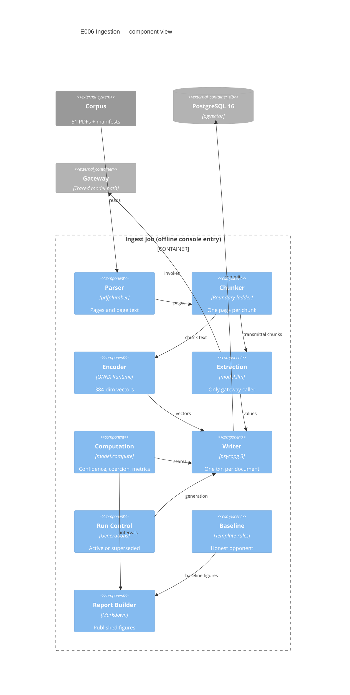

# Implementation Plan: Document Ingestion and Extraction

**Branch**: `00006-document-ingestion-and-extraction` | **Date**: 2026-07-27 | **Spec**: [spec.md](spec.md)

## Summary

**Goal**: Turn 51 corpus documents into citable chunks and schema-validated line items whose page citations come from the parser, never from a model.
**Approach**: An offline console-entry job under `/src/model` that parses with pdfplumber, chunks on a three-class boundary ladder measured in the encoder's own tokenizer, embeds through ONNX Runtime, extracts from the 25 transmittals through the gateway, and commits one document per transaction.
**Key Constraint**: Implementation is blocked until E003's TR-081 amendment lands on `main` (spec FR-047) — computed confidence contradicts what the normative document tells readers the column means.

## Technical Context

**Language/Version**: Python 3.12
**Primary Dependencies**: pdfplumber, ONNX Runtime, `tokenizers`/`transformers` (tokenizer only), pySBD, psycopg 3, Alembic, Pydantic v2, `gateway[provider]`
**Storage**: PostgreSQL 16 + pgvector
**Testing**: pytest, Hypothesis (property-based over the computation modules), coverage.py
**Target Platform**: Offline console entry point under `/src/model`; Linux and Windows development, Linux CI
**Project Type**: single
**Project Mode**: brownfield
**Performance Goals**: None at request time — ingestion is offline. The 400 MB request-time envelope binds E008's reuse of this encoder, not this job ({SAD:ADR-0006}, {SAD:ADR-0012})
**Constraints**: 254 content word-pieces per chunk (256 less two special tokens); exactly one page per chunk; every model response resolved from committed fixtures in CI with no network; append-only provenance tables
**Scale/Scope**: 51 documents (26 real, 25 synthetic), 9,020 measured leaf units in the real layer, ~9–15k chunks, 25 transmittals extracted

## Instructions Check

*GATE: Must pass before Phase 0 research. Re-check after Phase 1 design.*

**Audited against**: `project-instructions.md` **v1.2.4** (last amended 2026-07-26) · **Audit date**: 2026-07-27

| Principle / Section | Gate | Status |
|---|---|---|
| I. Traceable or It Does Not Ship | Page citation derived at ingestion; citation and confidence non-nullable so an unattributable value is unstorable | PASS — `ingest/chunker.py`, `writer.py`; FR-007, FR-029 |
| II. Uncertainty Is the Product | Confidence distribution published, not a mean; every quality figure carries a Wilson interval | PASS — `compute/metrics.py`; FR-033, FR-060 |
| III. Precision Over Recall Where a Mistake Is Silent | Fail closed after one repair; below-floor values absent rather than stored; no identity asserted between manufacturer spellings | PASS — `llm/extraction.py`, `ingest/failures.py`; FR-026, FR-032, FR-028 |
| IV. Agent Output Style | Tables and tagged lists throughout; prose limited to Summary | PASS |
| V. The Model Extracts, Code Computes | Model-facing code confined to `model.llm`, which the forbidden contract already names; confidence, coercion, and metrics live in `model.compute` and are unreachable from it | PASS — see AD-001; FR-031, FR-048, FR-049 |
| VI. Evaluate Before You Tune | Confidence floor declared before the first run and not refitted; the extraction reference is E002's committed generation record, already hash-pinned | PASS — FR-032; SC-013 |
| VII. Publish the Miss | Limitations carry scope decision, evidence, reversal trigger, and production-scale alternative — including G-6, the one shortfall this epic actually expects to publish | PASS — spec Disclosed Limitations, six rows; SC-024 left absolute and the shortfall published beside it rather than the target softened |
| VIII. Honest Opponents | Deterministic template extractor over the same transmittals, labelled strong or weak | PASS — `ingest/baseline.py`; FR-050 |
| Technology Stack | ONNX Runtime already declared for INT8 CPU inference; PostgreSQL 16 + pgvector; no second datastore of record | PASS — see ADR-0018 |
| Testing & Quality Policy | Deterministic computation modules take **both** mandates: strict test-first (red-green-refactor) **and** property-based tests; architecture contracts gate the build; new packages enter the coverage denominator | PASS — see Testing Strategy; the coverage `--source` list is an enumeration that overrides rather than merges, so it is a real change, not "configured" |
| Source Code Layout | All code under `/src/model`; cross-entry checks under `/tests`; no fifth entry | PASS |
| Development Workflow | Branch matches `#####-feature-name`; Conventional Commits; the migration-block partition stays green | PASS — but claiming block `0300`–`0399` is **not** a one-line append; see AD-013 and Complexity Tracking |
| Data Provenance | Layer, license basis, and layer-appropriate provenance carried unchanged; no fabricated retrieval provenance | PASS — FR-004 |
| Governance | Migration block `0300`–`0399` and ADR-0018/0019 claimed at epic start; TR-081 amendment recorded, not performed | PASS — FR-040, FR-051, FR-047 |

**Re-check after design**: PASS. Two boundary crossings are recorded in Complexity Tracking rather than waved through.

## Architecture



**The one edge that is deliberately absent**: `Extraction → Computation`. The forbidden import contract fails the build if it appears. Confidence and coercion are applied by the orchestrator after extraction returns, never inside the module that talks to the provider ({SAD:ADR-0008}).

## Architecture Decisions

Feature-local tradeoffs only. Project-wide decisions are standalone records: **ADR-0018** (embedding runtime) and **ADR-0019** (ingestion generations).

| ID | Decision | Options Considered | Chosen | Rationale |
|----|----------|--------------------|--------|-----------|
| AD-001 | Where does model-facing code live, so the computation contract covers it? | New `model.ingest.extract` + extend contract / place under existing `model.llm` / no enforcement | Place under `model.llm`, add a placement check | E001 created `model.llm` and `model.compute` as empty boundary anchors, and the contract already names `model.llm` as a source module — so placement satisfies FR-048 with no contract edit. A new check asserts every module importing `gateway` under `/src/model` is inside `model.llm`, closing the hole that a module placed elsewhere would escape the contract entirely |
| AD-002 | How are chunk boundaries made legal given four simultaneous constraints? | Fail-closed on over-long leaves / overlapping fixed windows / three named boundary classes | Three classes: structural, page break, sentence | Measured: 476 of 9,020 real-layer leaves exceed the window and 175 pages carry no structural marker, so fail-closed ingests nothing. A fragment keeps its parent's structural identifier, so a page or sentence cut is still not a fixed offset (spec STF-001) |
| AD-003 | Terminal split below a paragraph | Hand-rolled regex / NLTK punkt / spaCy / pySBD | pySBD, version-pinned, `clean=False`, `char_span=True` | Purely rule-based, no model download, deterministic across machines — which a reproducibility gate requires. Regex splitters break on `2.4.7`, `ASTM A653/A653M`, `No.`, `approx.`; punkt and spaCy add a downloaded data artifact |
| AD-004 | How is chunk length measured? | Character budget / word budget / encoder tokenizer | Tokenizer, budget **254** | The tokenizer loads standalone at under a megabyte with no weights, so exact counting is cheaper than any defensible heuristic. **`model_max_length` is 512 and is the wrong field** — the effective cap is 256, and it counts `[CLS]`/`[SEP]`, so content gets 254 |
| AD-005 | Transaction shape | One transaction per run / per row / per document | Autocommit connection, `with conn.transaction()` per document | psycopg's own recommended shape, and the only one giving FR-042's guarantee: an abort at document *k* leaves 1..*k*−1 durable and *k* absent. Corollary tasked explicitly: a failure row describing *k* must be written in a **fresh** transaction after the rollback, or it rolls back with the thing it describes |
| AD-006 | HNSW index during bulk load | Leave in place / drop and rebuild / rebuild only on full re-chunk | Drop and rebuild around a full-corpus load | User decision, overriding the cheaper option. pgvector is explicit that indexes belong after the load. Consequence accepted and recorded: this is DDL on an E003-owned index, so it is an **operator procedure under the schema-owning role**, not part of the job — the ingestion job runs as the application role and holds no DDL privilege |
| AD-007 | Real specifications and the required project id | Fan out per referencing project / one project each / `PRJ-000` sentinel | `PRJ-000` shared-library project | Fits `^PRJ-[0-9]{3}$` with no schema change and chunks each specification once instead of up to five times. Published as a named convention in the ingestion report because a reader filtering on project alone silently misses every governing specification (FR-003) |
| AD-008 | Confidence score shape and floor | Equal weights / three tiers / deductions from 1.0 | Deductions; floor **0.80** | Three binary signals admit eight scores, so the floor is only meaningful stated as what it excludes: any repaired invocation, and any value both alternate-labelled and page-split — each scoring 0.75. **The 0.70 originally proposed admitted both**, so it was raised (spec Clarifications) |
| AD-009 | Which fields are attempted per chunk | All 22 vocabulary terms / declared transmittal subset | Declared transmittal subset; absence recorded once per document | Roughly ten vocabulary terms cannot appear on a transmittal. Attempting all 22 per chunk makes the failure table chunks × 22, dominated by structural absences, and buys ~10 impossible model calls per chunk |
| AD-010 | Line-item grouping | Source chunk as de facto key / association table / header + first item only | Association keyed by value, document, item ordinal | The chunk-as-key option breaks silently the moment an over-long item entry splits into two chunks — one line item becomes two with no symptom, which is the invisible-corruption class Principle III targets |
| AD-011 | Interval method for per-field figures | Wald / bootstrap over documents / Wilson | Wilson 95%, denominator printed | Per-field denominators are frequently under 20. Wald degenerates to [0,0] and [1,1] at the boundaries, so "100% precision" from 7 of 7 reads as certainty; Wilson keeps both bounds inside [0,1] and makes the small denominator visible |
| AD-012 | Baseline extractor design | None / an LLM at lower temperature / template rules | Deterministic per-vendor template rules | The synthetic layer uses a fixed set of per-vendor templates, so a template extractor could plausibly win — the only kind of baseline whose defeat carries information (Principle VIII) |
| AD-013 | How is migration block `0300`–`0399` claimed without turning CI red? | One-line `BLOCKS` append / declare E005's block too / relax the gapless assertion | Declare **both** `(200,299,"E005")` and `(300,399,"E006")`, and amend two assertions | A one-line append fails the gapless-partition assertion, and adding E005's block then fails two more: every declared block must currently hold revisions, and `"0200"` is a parametrized negative control asserting 200 is outside every block. Fix: distinguish *claimed-and-populated* from *reserved-and-empty* — assert every block holding revisions is declared and that at least two are populated — and move the just-past-the-end control from `"0200"` to `"0400"`. Every property the file exists for survives, and the E005 reservation becomes machine-checked instead of a sentence in one spec |
| AD-014 | ONNX export precision | INT8 / FP32 | FP32 | ADR-0012 budgets "roughly 80 MB" for full-precision weights and ADR-0018 preserves 384 dimensions; FP32 keeps ADR-0012's own figure true. INT8 would shrink the session below that budget but changes the vectors every published retrieval number is measured on, which is a quantization ablation, not a packaging choice. Recorded here because ADR-0018 pinned the runtime and artifact without pricing this term, and E008 inherits the resident figure |

## Data Model Summary

| Entity | Key Fields | Relationships | Notes |
|--------|------------|---------------|-------|
| `ingestion_run` | run id, agent identity, provider model, chunker version, embedding model id + revision, corpus manifest digests, prompt/schema digest, resolution mode, started/finished, `run_failure_kind`, `run_failure_detail` | Parent of every run-output association | Carries **no** status — that lives per document, below. The two failure columns are FR-056's home: a run-level failure cannot be an `extraction_failure` row, because that table's source chunk is NOT NULL against a chunk the rollback removed. Its five values are disjoint from the seven per-field outcomes, asserted by intersecting both `CHECK` definitions |
| `ingestion_run_document` | run id, document id, status, `input_tuple_digest` | run → `document` | Where the generation lives (ADR-0019). Status `active` \| `superseded`; partial unique index on document `WHERE status = 'active'` makes two live generations unrepresentable. The digest is over **that document's own** manifest content hash — a corpus-wide digest would reload all 51 on any single change, inverting FR-043 |
| `ingestion_run_chunk` | run id, chunk id | run → `chunk` | Association, not a column — `chunk` belongs to E003 and gains nothing |
| `ingestion_run_extracted_value` | run id, extracted value id | run → `extracted_value` | Same reason |
| `ingestion_run_extraction_failure` | run id, extraction failure id | run → `extraction_failure` | Same reason |
| `extracted_value_line_item` | extracted value id, run id, document id, item ordinal | → the run-output association, not `extracted_value` directly | Targets a deliberately redundant unique key so a line item cannot exist for a value with no run attribution, its run and document cannot disagree with the value's, and the grouping is generation-scoped — two generations never merge their item 3 (AD-010) |
| `v_active_ingestion_generation` | — | view over the associations | The single place E008, E009, and E012 meet ADR-0019's filtering obligation, rather than each reader remembering it |

**Populated but not owned** (E003's, unchanged): `document`, `chunk`, `extracted_value`, `extracted_value_contributing_chunk`, `extraction_failure`, `field_vocabulary`.

**Detail**: [data-model.md](data-model.md)

## API Surface Summary

N/A — no API surface. Ingestion is an offline console entry point; the read path belongs to E008.

## Testing Strategy

| Tier | Tool | Scope | Mock Boundary | Install |
|------|------|-------|---------------|---------|
| Unit | pytest | Chunker ladder, tokenizer budget, segmentation, id minting, failure classification | Filesystem fixtures; no database | configured |
| Property | Hypothesis | `model.compute.confidence`, `coerce`, `metrics` — the policy's "scoring functions", which take **both** mandates: strict test-first (red-green-refactor) **and** property-based tests. Tasks must order the test task before its implementation task for every module under `model/compute/` | Pure functions, nothing mocked | configured |
| Integration | pytest + live PostgreSQL | Per-document transaction boundary, abort leaves earlier documents intact, generation promotion, partial unique index rejects a second active run | Real database; gateway in `replay` from committed fixtures | configured |
| Architecture | import-linter | Computation boundary reaches `model.llm`; new placement check that only `model.llm` imports `gateway` | — | configured |
| Security | committed-fixture credential scan (E004's) + `ruff` | Fixture bodies and committed tree | — | configured |
| Coverage | coverage.py | Combined, 80% floor | — | **not configured** — `verify.yml`'s `--source` is an enumeration that overrides rather than merges, and lists only `roster`, `schema`, `corpus`. `ingest`, `llm`, and `compute` must be appended or every line this epic adds is invisible to the gate |

**New dependencies to add**: `onnxruntime`, `tokenizers`, `pysbd`, `pgvector` (psycopg adapter). No new test tooling — every tier already has a configured tool.

## Error Handling Strategy

| Error Category | Pattern | Response | Retry |
|----------------|---------|----------|-------|
| Corpus integrity (hash mismatch, id collision) | fail-fast before any write | Run aborts naming the file(s); zero rows for that document | no |
| Over-long leaf | descend the ladder; fail only at a single over-long sentence | Run aborts naming the unit | no |
| Schema validation | one repair, then fail closed | Failure record with the closed-set outcome; no value persisted | no — budget is 1, fixed by the gateway |
| Below-floor confidence | reject before persistence | Failure record `confidence_below_threshold` | no |
| Fixture miss / provider unreachable | named run-level failure | Run aborts; distinct from per-field failure; committed documents stay committed | no |
| Database write failure mid-document | per-document transaction rollback | Document *k* absent, 1..*k*−1 durable; failure row written in a **fresh** transaction after rollback | no |

## Risk Mitigation

| Risk (from spec) | Likelihood | Impact | Mitigation | Owner |
|-------------------|------------|--------|------------|-------|
| Parser page attribution is correctness-critical | M | H | Total containment assertion for every chunk against an independent extraction of its named page, under the tolerances and normalization form `corpus/derive.py` already pins — not a sample | `ingest/chunker.py`, `tests/ingest/test_page_attribution.py` |
| Computed confidence may not discriminate | H | M | Floor declared before the run and never refitted; signals and weights recorded so any score recomputes from its row; distribution published rather than a mean | `compute/confidence.py`, `ingest/report.py` |
| Extraction accuracy measured only on generated documents | H | M | Every figure labelled by layer and published beside the template baseline with a Wilson interval; the zero-recognition-error upper bound stated in the report rather than on request | `compute/metrics.py`, `ingest/report.py` |

## Requirement Coverage Map

| Req ID | Component(s) | File Path(s) | Notes |
|--------|--------------|--------------|-------|
| FR-001 | Manifest reader | `model/ingest/manifest_reader.py` | Closes E002's missing public reader; resolves entries through `corpus.paths.resolve_within` |
| FR-002 | Document minting | `model/ingest/documents.py` | Lower-cased file stem; closes E003 gap G-9 |
| FR-003 | Document minting, report | `model/ingest/documents.py`, `report.py` | `PRJ-000` sentinel published as a named convention |
| FR-004 | Document minting | `model/ingest/documents.py` | Layer-appropriate provenance carried unchanged |
| FR-005 | Manifest reader | `model/ingest/manifest_reader.py` | Content-hash verify before parse; abort with zero rows |
| FR-006 | Document minting | `model/ingest/documents.py` | Closed type set: `specification` / `transmittal` |
| FR-007 | Parser | `model/ingest/parse.py` | Page numbers from pdfplumber only |
| FR-008 | Parser | `model/ingest/parse.py` | Reuses `corpus.derive.WORD_EXTRACTION` and `normalize_page_text` |
| FR-009 | Report | `model/ingest/report.py` | Zero-OCR upper bound disclosed |
| FR-010 | Page-attribution check | `tests/ingest/test_page_attribution.py` | Total, not sampled |
| FR-011 | Report | `model/ingest/report.py` | Inspected count, defects, stated bound method |
| FR-012 | Chunker | `model/ingest/chunker.py` | Three boundary classes; fragment keeps structural id |
| FR-013 | Chunker | `model/ingest/chunker.py` | Page split applied before structure |
| FR-014 | Chunker, tokens | `model/ingest/chunker.py`, `tokens.py` | Ladder to sentence; fail only on an over-long sentence |
| FR-015 | Chunker | `model/ingest/chunker.py` | Zero-based ordinal, unique per document |
| FR-016 | Chunker | `model/ingest/chunker.py` | Bracket markup preserved verbatim |
| FR-017 | Chunker, runs | `model/ingest/chunker.py`, `runs.py` | Deterministic boundaries; chunker version recorded |
| FR-018 | Report | `model/ingest/report.py` | Chunk-identity contract for E008 |
| FR-019 | Encoder | `model/ingest/embed.py` | ONNX Runtime, pinned artifact, no network (ADR-0018). Includes attention-masked mean pooling and L2 normalization as repository code, plus the parity assertion against the reference encoder |
| FR-020 | Encoder, writer | `model/ingest/embed.py`, `writer.py` | Model id and revision on every chunk |
| FR-021 | Writer | `model/ingest/writer.py` | Dimension read from `schema_constants` |
| FR-022 | Orchestrator | `model/ingest/cli.py` | Extraction restricted to the synthetic layer |
| FR-023 | Extraction | `model/llm/extraction.py` | Only module importing `gateway` (AD-001) |
| FR-024 | Extraction, schemas | `model/llm/schemas.py` | Field names bounded by the seeded vocabulary |
| FR-025 | Extraction | `model/llm/extraction.py` | `output_schema` supplied to the gateway |
| FR-026 | Extraction | `model/llm/extraction.py` | Repair budget fixed at 1 by the gateway |
| FR-027 | Extraction, writer | `model/llm/extraction.py`, `ingest/writer.py` | Stored exactly as printed; no normalized twin |
| FR-028 | — | — | Prohibition; asserted by `tests/ingest/test_no_identity_claims.py` |
| FR-029 | Writer | `model/ingest/writer.py` | Citation inherited from the chunk; composite FK makes disagreement unstorable |
| FR-030 | Confidence | `model/compute/confidence.py` | Confidence on every value |
| FR-031 | Confidence | `model/compute/confidence.py` | Deterministic from parse signals; property-tested |
| FR-032 | Confidence | `model/compute/confidence.py` | Floor 0.80, declared pre-run |
| FR-033 | Report | `model/ingest/report.py` | Floor plus distribution, not a mean |
| FR-034 | Failures | `model/ingest/failures.py` | Closed set of seven |
| FR-035 | Failures | `model/ingest/failures.py` | Five required fields on every failure |
| FR-036 | Failures | `model/ingest/failures.py` | No value or confidence on a failure |
| FR-037 | Failures | `model/ingest/failures.py` | `no_value_found`, recorded once per document |
| FR-038 | Runs | `model/ingest/runs.py` | Full run record |
| FR-039 | Runs, writer | `model/ingest/runs.py`, `writer.py` | Association tables |
| FR-040 | Migrations, partition check | `model/schema/versions/03*`, `tests/checks/test_migration_ranges.py` | Block claimed. Per AD-013 this is a three-part amendment to the partition check, not a one-line append |
| FR-041 | Operator procedure | `model/ingest/report.py` (documented), runbook | Removal under the schema-owning role, not the job |
| FR-042 | Writer | `model/ingest/writer.py` | Per-document transaction |
| FR-043 | Runs | `model/ingest/runs.py` | Input tuple digest held **per document**, over that document's own content hash — a corpus-wide digest would reload all 51 on any single change |
| FR-044 | Orchestrator | `model/ingest/cli.py` | Console entry only; asserted by a check |
| FR-045 | Orchestrator | `model/ingest/cli.py` | `replay` mode, committed fixtures, no network |
| FR-046 | Report | `model/ingest/report.py` | Signals and weights recorded |
| FR-047 | — | spec Compliance Check | Amendment recorded; blocks implementation |
| FR-048 | Placement check | `tests/checks/test_model_facing_placement.py` | Only `model.llm` may import `gateway` (AD-001) |
| FR-049 | Coercion | `model/compute/coerce.py` | Deterministic; property-tested |
| FR-050 | Baseline, metrics | `model/ingest/baseline.py`, `compute/metrics.py` | Labelled baseline; interval on every figure |
| FR-051 | — | `specs/adrs/0018-*`, `0019-*` | Numbers claimed at epic start |
| FR-052 | Document minting | `model/ingest/documents.py` | Identifier collision aborts naming both files |
| FR-053 | Chunker, report | `model/ingest/chunker.py`, `report.py` | Leaf-length distribution measured and published |
| FR-054 | Writer | `model/ingest/writer.py` | Single transaction, stated write order |
| FR-055 | Runs | `model/ingest/runs.py` | Active/superseded **on the run-to-document association**, not the run row — a run skips unchanged documents, so it replaces only a subset. Partial unique index per document (ADR-0019) |
| FR-056 | Orchestrator, runs | `model/ingest/cli.py`, `runs.py` | Run-level failure on `ingestion_run`; five values disjoint from the seven per-field outcomes. Cannot be an `extraction_failure` row — its source chunk would have no referent after a rollback |
| FR-057 | Confidence | `model/compute/confidence.py` | Deductions 0.15 / 0.10 / 0.25; floor 0.80 |
| FR-058 | Extraction, schemas | `model/llm/schemas.py`, `prompts.py` | Declared transmittal subset only |
| FR-059 | Line items | `model/ingest/lineitems.py` | Association table |
| FR-060 | Metrics | `model/compute/metrics.py` | Precision/recall/F1, Wilson, printed-field denominator |
| FR-061 | Report | `model/ingest/report.py` | Near-duplicate cluster counts by cause |
| FR-062 | Writer, coercion | `model/ingest/writer.py`, `compute/coerce.py` | Printed text is the evidence; coerced form in its own column |

## Project Structure

### Source Code

```text
src/model/src/model/
+ ingest/__init__.py
+ ingest/cli.py                    # console entry: ingest
+ ingest/manifest_reader.py        # closes E002's read gap
+ ingest/documents.py              # id minting, PRJ-000, collision abort
+ ingest/parse.py                  # pdfplumber, reuses corpus.derive tolerances
+ ingest/structure.py              # UFGS ladder + transmittal field blocks
+ ingest/chunker.py                # three boundary classes
+ ingest/tokens.py                 # pinned tokenizer, 254 budget
+ ingest/segment.py                # pySBD terminal split
+ ingest/embed.py                  # ONNX Runtime session
+ ingest/writer.py                 # per-document transaction, COPY
+ ingest/runs.py                   # generations, active/superseded
+ ingest/lineitems.py              # line-item grouping
+ ingest/failures.py               # closed-set classification
+ ingest/baseline.py               # deterministic template extractor
+ ingest/report.py                 # ingestion report
+ llm/extraction.py                # ONLY module importing gateway
+ llm/schemas.py                   # Pydantic output models
+ llm/prompts.py                   # prompt templates
+ compute/confidence.py            # deterministic score
+ compute/coerce.py                # numeric/date coercion
+ compute/metrics.py               # precision/recall/F1 + Wilson
+ schema/versions/0300_*.py … 03NN_*.py   # 6 tables + 1 view; 0300 gated on FR-047
~ pyproject.toml                   # deps + `ingest` console script

src/model/tests/
+ ingest/                          # chunker, tokens, segment, documents, failures
+ llm/test_extraction.py
+ compute/                         # property-based: confidence, coerce, metrics
+ schema/test_ingestion_run.py

tests/checks/
+ test_model_facing_placement.py   # only model.llm imports gateway
~ test_migration_ranges.py         # AD-013: declare E005 + E006 blocks, amend 2 assertions

.github/
~ workflows/verify.yml             # append ingest,llm,compute to coverage --source

specs/00006-document-ingestion-and-extraction/
+ ingestion-report.md              # the published figures (FR-003/009/011/018/033/046/053/061)
```

**Brownfield Notes**
**Patterns to reuse**: `corpus/derive.py`'s pinned `WORD_EXTRACTION` tolerances and `normalize_page_text` — a second normalization would be a second answer; `corpus/paths.resolve_within` for every manifest-relative path; the gateway's `replay` fixture discipline; E003's migration style (explicit DDL, named constraints, forward-only, `downgrade()` raises).
**Tests to extend**: `tests/checks/test_migration_ranges.py` (block partition), `src/model/tests/schema/` (new-object assertions in E003's house style).
**Naming conventions**: constraint prefixes `pk_` / `uq_<table>__` / `ck_<table>__` / `fk_<table>__` / `ix_<table>__`; migration `revision` string equals the four-digit filename prefix; console entries declared in `[project.scripts]`.

## Complexity Tracking

| Violation | Why Needed | Simpler Alternative Rejected Because |
|---|---|---|
| An operator procedure issues DDL against an index E003 owns (AD-006) | Bulk-loading ~9–15k vectors into a live HNSW index is materially slower, and pgvector recommends building after the load | Leaving the index in place was the simpler option and was explicitly overridden. The cost is isolated by keeping the DDL out of the job: the application role holds no DDL privilege, so this cannot leak into the ingestion path |
| E006 amends a build-gating test it does not own (`test_migration_ranges.py`, AD-013) | Claiming any block at all fails the gapless-partition assertion; claiming two more fails the populated-block assertion and a parametrized negative control | A one-line append was the intended change and turns CI red three ways. The amendment is scoped to distinguishing a reserved block from a populated one — no property the file asserts is dropped, and the `0200` negative control moves to `0400` rather than disappearing |
| E006 authors an ONNX export of a model ADR-0012 pinned by class only, **and reimplements its pooling and normalization layers** | E008 embeds queries at request time inside a 400 MB envelope already holding an ONNX session; two runtimes do not fit. A raw export emits token-level hidden states, so mean pooling and L2 normalization become repository code | Using `sentence-transformers` offline and ONNX at request time avoids the export, but produces two vector spaces that must agree to several decimal places with no error when they do not. The added surface is bounded by ADR-0018's mandatory parity assertion against the reference encoder |

## Open Items Disposition

| Item | Disposition |
|---|---|
| **FR-047 — E003's TR-081 amendment** | **Blocks implementation.** Lands on `main`; this branch records the need only. Nothing in this plan can be built until it does |
| Deletion privilege on the provenance tables | Resolved without an amendment. Per-document transactions mean the job never needs `DELETE`; correction is an operator procedure under the schema-owning role |
| `0200`–`0299` reserved for E005 | **Now ratified rather than asserted.** AD-013 declares it in the partition the build checks, so the reservation is machine-enforced. If E005 wants a different block it edits one tuple — a loud, visible conflict rather than a silent collision |
| **FR-047's blocker is stricter than Governance requires** | Worth knowing, since it is this epic's largest schedule cost. TR-081 lives in `specs/00003-core-data-schema/data-model.md`, a *feature* artifact — not one of the three registered documents the serialization clause names. The blocking condition is being applied by analogy through {SAD:ADR-0017}'s normativity grant. That is the conservative reading and it stands, but it is self-imposed, not instruction-mandated |
| E002 has no public manifest reader | E006 writes one (`ingest/manifest_reader.py`) rather than promoting private code out of `corpus/validate.py` |
| `fixture_hashes` mapping for synthetic documents | Fixed here as the four `generation_inputs` digests; `roster_hash` has its own column and is not one of them |
| **G-6 — the append-only revoke is latent in the deployed configuration** | Inherited from E003's G-11: the deployed connection is the SUPERUSER role, which bypasses the `REVOKE`. It applies unchanged to E006's four association tables. **SC-024 must not be reported as fully enforced in the deployed configuration** — record it as enforced by design and latent in deployment, not as passing |
| Migration `0300` is gated, not merely sequenced | The gate is on the first revision itself rather than stated in prose, so the TR-081 amendment cannot be forgotten by someone reading only the migration chain |

## Implementation Hints

- **[HINT-001]** Gotcha: `model_max_length` in the tokenizer config is **512**; the effective cap is **256** and it counts `[CLS]`/`[SEP]`. Budget **254** content pieces. Reading the tokenizer's own field doubles the budget and ships silently truncated vectors that look fine.
- **[HINT-002]** Order: nested `psycopg` `transaction()` blocks are savepoints, so a per-document error handler must catch **outside** the block or the rollback never happens. And what you write afterwards is **not** an `extraction_failure` row — that table's source chunk is NOT NULL against a chunk the rollback just removed, so the row is unstorable. Record it as a run-level failure on `ingestion_run`, in a fresh transaction.
- **[HINT-003]** Constraint: `ON DELETE RESTRICT` cannot be deferred (`NO ACTION` can). Generation retirement must delete strictly leaf-up — contributing chunks, then values and failures, then chunks, then the run.
- **[HINT-004]** Order: split on the page boundary **before** the structural ladder. A structurally clean split applied first will straddle a page and violate the scalar `page_number`.
- **[HINT-005]** Gotcha: a raw ONNX export of a sentence-transformer emits **token-level hidden states and stops**. Attention-masked mean pooling and L2 normalization are separate modules in the reference implementation and become repository code here. Getting the mask wrong — pooling over padding — produces plausible vectors that are quietly wrong, which is exactly why ADR-0018 makes the parity tolerance mandatory rather than diligent.
