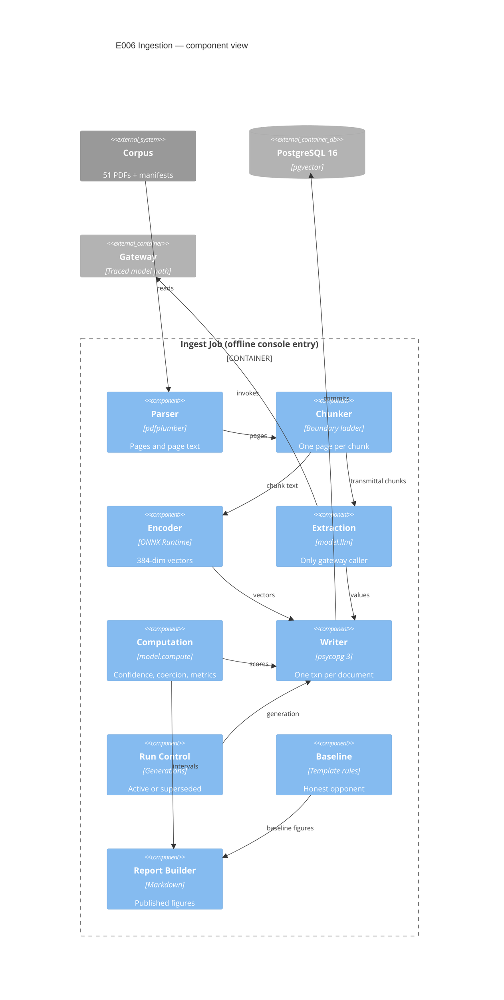

# Implementation Plan: Document Ingestion and Extraction

**Branch**: `00006-document-ingestion-and-extraction` | **Date**: 2026-07-27 | **Spec**: [spec.md](spec.md)

## Summary

**Goal**: Turn 51 corpus documents into citable chunks and schema-validated line items whose page citations come from the parser, never from a model.
**Approach**: An offline console-entry job under `/src/model` that parses with pdfplumber, chunks on a three-class boundary ladder measured in the encoder's own tokenizer, embeds through ONNX Runtime, extracts from the 25 transmittals through the gateway, and commits one document per transaction.
**Key Constraint**: ~~Blocked on E003's TR-081 amendment~~ — **cleared 2026-07-27 by `64911dc` on `main`** (T001, FR-047). TR-081 now reads "a computed score … derived deterministically by the producing epic from parse signals"; the non-calibration half is unchanged. E003's schema suite passes at 457 tests with the amendment.

## Technical Context

**Language/Version**: Python 3.12
**Primary Dependencies**: pdfplumber, ONNX Runtime, `tokenizers`/`transformers` (tokenizer only), pySBD, psycopg 3, Alembic, Pydantic v2, `gateway[provider]`
**Storage**: PostgreSQL 16 + pgvector
**Testing**: pytest, Hypothesis (property-based over the computation modules), coverage.py
**Target Platform**: Offline console entry point under `/src/model`; Linux and Windows development, Linux CI
**Project Type**: single
**Project Mode**: brownfield
**Performance Goals**: None at request time — ingestion is offline. The 400 MB request-time envelope binds E008's reuse of this encoder, not this job ({SAD:ADR-0006}, {SAD:ADR-0012})
**Constraints**: 254 content word-pieces per chunk (256 less two special tokens); exactly one page per chunk; every model response resolved from committed fixtures in CI with no network; append-only provenance tables
**Scale/Scope**: 51 documents (26 real, 25 synthetic), 9,020 measured leaf units in the real layer, ~9–15k chunks, 25 transmittals extracted

## Instructions Check

*GATE: Must pass before Phase 0 research. Re-check after Phase 1 design.*

**Audited against**: `project-instructions.md` **v1.2.5** (last amended 2026-07-28) · **Audit date**: 2026-07-28 · **Re-run**, superseding the v1.2.4 audit recorded here on 2026-07-27

**Why the gate was re-run.** v1.2.5 landed on `main` and merged into this branch at `fead821` while the epic was in flight, adding a **Temporary Files** rule to Development Workflow. Governance requires a feature whose recorded audit names a superseded version to re-run its compliance gate before passing its next phase gate, and this branch's next gate is QC. The table below is the result of re-reading v1.2.5 in full and re-checking every clause against the files — not of applying the diff. **Three sections changed verdict; all three are repaired on this branch** and are marked *repaired at QC* with what was wrong.

| Principle / Section | Gate | Status |
|---|---|---|
| I. Traceable or It Does Not Ship | Page citation derived at ingestion; citation and confidence non-nullable so an unattributable value is unstorable | PASS — `ingest/chunker.py`, `writer.py`; FR-007, FR-029 |
| II. Uncertainty Is the Product | Confidence distribution published, not a mean; every quality figure carries a Wilson interval | PASS — `compute/metrics.py`; FR-033, FR-060 |
| III. Precision Over Recall Where a Mistake Is Silent | Fail closed after one repair; below-floor values absent rather than stored; no identity asserted between manufacturer spellings | PASS — `llm/extraction.py`, `ingest/failures.py`; FR-026, FR-032, FR-028 |
| IV. Agent Output Style | Tables and tagged lists throughout; prose limited to Summary | PASS |
| V. The Model Extracts, Code Computes | Model-facing code confined to `model.llm`, which the forbidden contract already names; confidence, coercion, and metrics live in `model.compute` and are unreachable from it | PASS — see AD-001; FR-031, FR-048, FR-049 |
| VI. Evaluate Before You Tune | Confidence floor declared before the first run and not refitted; the extraction reference is E002's committed generation record, already hash-pinned | PASS — FR-032; SC-013 |
| VII. Publish the Miss | Limitations carry scope decision, evidence, reversal trigger, and production-scale alternative — including G-6, the one shortfall this epic actually expects to publish | PASS — spec Disclosed Limitations, twelve rows since 2026-07-28, and data-model §Disclosed Gaps now carries the reversal trigger and the production-scale alternative as separate columns rather than one merged sentence; SC-024 left absolute and the shortfall published beside it rather than the target softened |
| VIII. Honest Opponents | Deterministic template extractor over the same transmittals, labelled strong or weak | PASS — `ingest/baseline.py`; FR-050 |
| Technology Stack | ONNX Runtime is the stack's declared inference runtime and is what this encoder uses; the precision term is **FP32**, fixed by ADR-0012's ~80 MB full-precision weight budget and by AD-014 — the stack's INT8 clause is ADR-0006's reranker term and is not evidence for this encoder; PostgreSQL 16 + pgvector; no second datastore of record | PASS — see ADR-0018 and AD-014 |
| Testing & Quality Policy | Deterministic computation modules take **both** mandates: strict test-first (red-green-refactor) **and** property-based tests; architecture contracts gate the build; new packages enter the coverage denominator | PASS — see Testing Strategy; the coverage `--source` list is an enumeration that overrides rather than merges, so it is a real change, not "configured" |
| Source Code Layout | All code under `/src/model`; cross-entry checks under `/tests`; no fifth entry | **PASS — repaired at QC.** Was FAIL: `/tools`, this epic's three encoder-provenance scripts, sat at the repository root. `ENFORCE_SRC_ROOT` grants exactly one exception and it is `/tests`, for cross-entry verification no entry owns; these are neither. Moved to `src/model/tools/` — `build_probes.py` imports `model.ingest.documents`, `manifest_reader` and `parse`, so the modelling entry already owned them — and placed beside `src/model/src/`, so `uv_build`'s src layout does not package them, `testpaths` does not collect them, and `import-linter`'s `model` graph never sees them. `git ls-files '*.py' '*.ts' '*.tsx'` now resolves entirely under `/src` and `/tests` |
| Development Workflow | Branch matches `#####-feature-name`; Conventional Commits; the migration-block partition stays green; **Temporary Files (new in v1.2.5)**: scratch into the checkout's gitignored `.tmp/`, `--basetemp` pinned, no environment or build created outside the checkout; CI Requirements: lint clean, no type errors, all tests passing | **PASS — repaired at QC**, on the new clause at two layers and on CI Requirements at a third. (a) The root `pyproject.toml` pinned no `--basetemp` while all three entries did — and the only pytest code in the repository that builds a **virtual environment**, `tests/checks/test_gateway_no_provider_env.py`, runs under it. Live, not theoretical: a `no-provider-env0` directory dated 2026-07-28 was found under `%LOCALAPPDATA%\Temp\pytest-of-<user>/pytest-15`. (b) `verify.yml`'s `verify` job set no `TMPDIR`/`TEMP`/`TMP` while its `reproduce` job set all three, so every `uv sync`, `npm ci`, `docker build` and `tempfile` call in the job that runs the whole suite resolved to the runner's system temp. (c) CI Requirements — the **Unit tests (gateway)** step was red on this branch; see the note below. Claiming block `0300`–`0399` is still **not** a one-line append; see AD-013 and Complexity Tracking |
| Data Provenance | Layer, license basis, and layer-appropriate provenance carried unchanged; no fabricated retrieval provenance | PASS — FR-004 |
| Governance | Migration block `0300`–`0399` and ADR-0018/0019 claimed at epic start; **ADR-0020 claimed during the Checklist phase**, not at epic start — allocated by scanning for the highest number in use, disclosed rather than back-dated; TR-081 amendment recorded, not performed | **DEVIATION (disclosed), and PASS — repaired at QC.** ADR-0020's timing deviates from the claim-at-epic-start clause and is not reversible (FR-051); confirm before merge that no concurrent wave epic allocated 0020. **Separately, and more seriously (A-26):** ADR-0018, ADR-0019, ADR-0020 and their `specs/sad.md` catalog rows were *authored on this feature branch* in `8805498` and `e0d635f`. Governance serializes amendments to the documents it names onto the default branch — a feature branch records the need and does not perform it — and this epic used the correct procedure for the TR-081 amendment and the wrong one here. Repaired by landing them on `main` in `e8bc1ff` and merging back at `7652e9d`; `git diff main HEAD -- specs/adrs specs/sad.md` is now empty. Recorded here because two compliance audits marked this row PASS without checking it: the v1.2.5 re-run checked the clauses the epic cited rather than every clause against the files, which is exactly the gap that let it through |

**Re-check after design**: PASS. Two boundary crossings are recorded in Complexity Tracking rather than waved through.

**Re-run notes (v1.2.5, 2026-07-28)**

- **The gateway test step was red, and had been since `0300` landed.** `src/gateway/tests/test_migrations.py` asserted the Alembic head equals `0103`, E004's final revision, on the reasoning that E004's block is applied last. That reasoning expired the moment this epic chained `0300`–`0304` onto `0103`. The assertion is restated rather than removed — TR-018 confines E004 to `0100`–`0199` and says nothing about being last, so it now asserts E004's four revisions are present in the applied chain, contiguous, and exactly the revisions that chain carries inside the block. **Three negative controls and one positive control** cover it: the three plant a renumbered revision, a dropped one, and a foreign revision inside the block, and require each to be reported; the fourth runs the same assertion over an *undamaged* copy of the revision directory. The positive control is the more valuable of the two kinds here — without it, a copy helper that produced an unreadable directory would make all three damage cases "fail correctly" for the wrong reason, and the negative controls would be evidence about the copier rather than about the block claim.
- **The Temporary Files clause enumerates "each entry's pytest configuration", and the root tier is not an entry.** That is how the root `pyproject.toml` came to be the one Python tier without a pinned `--basetemp` while hosting the only venv-building test in the repository. The general obligation in the same clause — *every command* directs scratch into `.tmp/` — covers it, so this is a wording gap rather than a licence, and it is repaired here by pinning the root anyway. **Recorded as an amendment request, not performed**: Governance serializes amendments onto the default branch and a feature branch records the need.
- **Coverage denominator.** `[tool.coverage.paths]` mapped six packages and not `ingest`, `llm` or `compute`, the three this epic added and the three `verify.yml` asserts an individual 80% floor over. Added, together with the matching `[tool.coverage.run] source` entries, per the "one change, not two" rule already recorded beside `model.procurement`.
- **Unchanged and still deviating**: ADR-0020's Checklist-phase allocation (row above). Nothing in v1.2.5 *changed* Governance — but "the clause is unchanged" is not "the clause is satisfied", and treating the two as the same is why this re-run marked Governance PASS while three ADRs and their catalog rows sat un-landed on a feature branch. QC iteration 2 caught it (A-26, row above). A re-run scoped to the amendment's diff cannot find a violation that predates the amendment.
- **The Technology Stack line says "ONNX Runtime for INT8 CPU inference"; this epic ships an FP32 encoder.** `project-instructions.md:50` and `specs/sad.md:16` both carry the INT8 wording, and the reading taken here — that INT8 is ADR-0006's *reranker* term, which `sad.md` ties to the reranker in three places — is why the row passes. **Recorded as an amendment request, not performed**, on the same footing as the `--basetemp` wording gap above: the repository's precedent for a stack line overtaken by an implementation is to amend it (v1.1.3, Next.js 15→16), and a clause that has to be read narrowly to pass is a clause worth restating.

## Architecture



**The one edge that is deliberately absent**: `Extraction → Computation`. The forbidden import contract fails the build if it appears. Confidence and coercion are applied by the orchestrator after extraction returns, never inside the module that talks to the provider ({SAD:ADR-0008}).

## Architecture Decisions

Feature-local tradeoffs only. Project-wide decisions are standalone records: **ADR-0018** (embedding runtime), **ADR-0019** (ingestion generations, superseded on its retention clause), and **ADR-0020** (superseded generations are removed at promotion).

| ID | Decision | Options Considered | Chosen | Rationale |
|----|----------|--------------------|--------|-----------|
| AD-001 | Where does model-facing code live, so the computation contract covers it? | New `model.ingest.extract` + extend contract / place under existing `model.llm` / no enforcement | Place under `model.llm`, add a placement check | E001 created `model.llm` and `model.compute` as empty boundary anchors, and the contract already names `model.llm` as a source module — so placement satisfies FR-048 with no contract edit. A new check asserts every module importing `gateway` under `/src/model` is inside `model.llm`, closing the hole that a module placed elsewhere would escape the contract entirely |
| AD-002 | How are chunk boundaries made legal given four simultaneous constraints? | Fail-closed on over-long leaves / overlapping fixed windows / three named boundary classes | Three classes: structural, page break, sentence | Measured: 476 of 9,020 real-layer leaves exceed the window and 175 pages carry no structural marker, so fail-closed ingests nothing. A fragment keeps its parent's structural identifier, so a page or sentence cut is still not a fixed offset (spec STF-001) |
| AD-003 | Terminal split below a paragraph | Hand-rolled regex / NLTK punkt / spaCy / pySBD | pySBD, version-pinned, `clean=False`, `char_span=True` | Purely rule-based, no model download, deterministic across machines — which a reproducibility gate requires. Regex splitters break on `2.4.7`, `ASTM A653/A653M`, `No.`, `approx.`; punkt and spaCy add a downloaded data artifact |
| AD-004 | How is chunk length measured? | Character budget / word budget / encoder tokenizer | Tokenizer, budget **254** | The tokenizer loads standalone at under a megabyte with no weights, so exact counting is cheaper than any defensible heuristic. **`model_max_length` is 512 and is the wrong field** — the effective cap is 256, and it counts `[CLS]`/`[SEP]`, so content gets 254 |
| AD-005 | Transaction shape | One transaction per run / per row / per document | Autocommit connection, `with conn.transaction()` per document | psycopg's own recommended shape, and the only one giving FR-042's guarantee: an abort at document *k* leaves 1..*k*−1 durable and *k* absent. Corollary tasked explicitly: a failure row describing *k* must be written in a **fresh** transaction after the rollback, or it rolls back with the thing it describes |
| AD-006 | HNSW index during bulk load | Leave in place / drop and rebuild / rebuild only on full re-chunk | Drop and rebuild around a full-corpus load | User decision, overriding the cheaper option. pgvector is explicit that indexes belong after the load. Consequence accepted and recorded: this is DDL on an E003-owned index, so it is an **operator procedure under the schema-owning role**, not part of the job — the ingestion job runs as the application role and holds no DDL privilege |
| AD-007 | Real specifications and the required project id | Fan out per referencing project / one project each / `PRJ-000` sentinel | `PRJ-000` shared-library project | Fits `^PRJ-[0-9]{3}$` with no schema change and chunks each specification once instead of up to five times. Published as a named convention in the ingestion report because a reader filtering on project alone silently misses every governing specification (FR-003) |
| AD-008 | Confidence score shape and floor | Equal weights / three tiers / deductions from 1.0 | Deductions; floor **0.80** | Three binary signals admit eight scores, so the floor is only meaningful stated as what it excludes: any repaired invocation, and any value both alternate-labelled and page-split — each scoring 0.75. **The 0.70 originally proposed admitted both**, so it was raised (spec Clarifications) |
| AD-009 | Which fields are attempted per chunk | All 22 vocabulary terms / declared transmittal subset | Declared transmittal subset; absence recorded once per document | Roughly ten vocabulary terms cannot appear on a transmittal. Attempting all 22 per chunk makes the failure table chunks × 22, dominated by structural absences, and buys ~10 impossible model calls per chunk |
| AD-010 | Line-item grouping | Source chunk as de facto key / association table / header + first item only | Association keyed by value, document, item ordinal | The chunk-as-key option breaks silently the moment an over-long item entry splits into two chunks — one line item becomes two with no symptom, which is the invisible-corruption class Principle III targets |
| AD-011 | Interval method for per-field figures | Wald / bootstrap over documents / Wilson, corrected or not | **Continuity-corrected** Wilson 95%, denominator printed, variant named with the figures (FR-060) | Per-field denominators are frequently under 20. Wald degenerates to [0,0] and [1,1] at the boundaries, so "100% precision" from 7 of 7 reads as certainty; Wilson keeps both bounds inside [0,1] and makes the small denominator visible. **The continuity correction is applied rather than its absence disclosed**: the research records under-coverage at extreme proportions for very small *n* without it, which is exactly this regime — denominators under 20 with precision expected near 1 — and the corrected form errs toward over-coverage, which is the honest direction under Principle II |
| AD-012 | Baseline extractor design | None / an LLM at lower temperature / template rules **written from the generator's templates** / template rules **re-derived from rendered text** | Deterministic per-vendor template rules, **re-derived from the rendered documents** | The synthetic layer uses a fixed set of per-vendor templates, so a template extractor could plausibly win — the only kind of baseline whose defeat carries information (Principle VIII). Reading the generator's own template definitions was the cheaper option and is rejected: it scores at or near 100% by construction, which makes it the answer key rather than an opponent and makes the model's defeat by it carry no information. Enforced by import contract, not by intent (FR-050) |
| AD-013 | How is migration block `0300`–`0399` claimed without turning CI red? | One-line `BLOCKS` append / declare E005's block too / relax the gapless assertion | Declare **both** `(200,299,"E005")` and `(300,399,"E006")`, and amend two assertions | A one-line append fails the gapless-partition assertion, and adding E005's block then fails two more: every declared block must currently hold revisions, and `"0200"` is a parametrized negative control asserting 200 is outside every block. Fix: distinguish *claimed-and-populated* from *reserved-and-empty* — assert every block holding revisions is declared and that at least two are populated — and move the just-past-the-end control from `"0200"` to `"0400"`. Every property the file exists for survives, and the E005 reservation becomes machine-checked instead of a sentence in one spec |
| AD-014 | ONNX export precision | INT8 / FP32 | FP32 | ADR-0012 budgets "roughly 80 MB" for full-precision weights and ADR-0018 preserves 384 dimensions; FP32 keeps ADR-0012's own figure true. INT8 would shrink the session below that budget but changes the vectors every published retrieval number is measured on, which is a quantization ablation, not a packaging choice. Recorded here because ADR-0018 pinned the runtime and artifact without pricing this term, and E008 inherits the resident figure |

## Data Model Summary

| Entity | Key Fields | Relationships | Notes |
|--------|------------|---------------|-------|
| `ingestion_run` | run id, agent identity, provider model, chunker version, embedding model id + revision, corpus manifest digests, prompt/schema digest, resolution mode, `run_trace_id`, started/finished, `run_failure_kind`, `run_failure_detail` | Parent of every run-output association | Carries **no** status — that lives per document, below. The two failure columns are FR-056's home: a run-level failure cannot be an `extraction_failure` row, because that table's source chunk is NOT NULL against a chunk the rollback removed. Its five values are disjoint from the seven per-field outcomes, asserted by intersecting both `CHECK` definitions |
| `ingestion_run_document` | run id, document id, status, `input_tuple_digest` | run → `document` | Where the generation lives (ADR-0019). Status `active` \| `superseded`; partial unique index on document `WHERE status = 'active'` makes two live generations unrepresentable. The digest is over **that document's own** content hash plus chunker version, encoder revision, provider model, and prompt/schema digest — corpus-wide would reload all 51 on any single change, inverting FR-043. **Promotion removes the prior generation's rows** ({SAD:ADR-0020}): chunk ordinals are unique within a document, not a generation, so retention was unstorable |
| `extracted_value_parse_signal` | extracted value id, run id, document id, label form, source chunk count, repair flag | → the run-output association, and → `extracted_value` on `(id, source_chunk_count)` | FR-063. Two of the three deduction signals exist in no E003 column, so without this the SC-026 recomputation check reduces to comparing the stored score with itself. The third is not duplicated — the page-split signal is the value's own `source_chunk_count`, held equal by composite FK |
| `ingestion_run_chunk` | run id, chunk id | run → `chunk` | Association, not a column — `chunk` belongs to E003 and gains nothing |
| `ingestion_run_extracted_value` | run id, extracted value id | run → `extracted_value` | Same reason |
| `ingestion_run_extraction_failure` | run id, extraction failure id | run → `extraction_failure` | Same reason |
| `extracted_value_line_item` | extracted value id, run id, document id, item ordinal (`>= 0`) | → the run-output association, not `extracted_value` directly | Targets a deliberately redundant unique key so a line item cannot exist for a value with no run attribution, its run and document cannot disagree with the value's, and the grouping is generation-scoped — two generations never merge their item 3 (AD-010). Ordinal **0** is the declared group for document-scoped values (submittal number, submittal date, approval date); real items are numbered from 1 |
| `v_active_ingestion_generation` | — | view over the associations | The single place E008, E009, and E012 meet ADR-0019's filtering obligation, rather than each reader remembering it |

**Populated but not owned** (E003's, unchanged): `document`, `chunk`, `extracted_value`, `extracted_value_contributing_chunk`, `extraction_failure`, `field_vocabulary`.

**Detail**: [data-model.md](data-model.md)

## API Surface Summary

N/A — no API surface. Ingestion is an offline console entry point; the read path belongs to E008.

## Testing Strategy

| Tier | Tool | Scope | Mock Boundary | Install |
|------|------|-------|---------------|---------|
| Unit | pytest | Chunker ladder, tokenizer budget, segmentation, id minting, failure classification | Filesystem fixtures; no database | configured |
| Property | Hypothesis | `model.compute.confidence`, `coerce`, `metrics` — the policy's "scoring functions", which take **both** mandates: strict test-first (red-green-refactor) **and** property-based tests. Tasks must order the test task before its implementation task for every module under `model/compute/`. Relation class declared per module (below); confidence is **enumerated exhaustively, not sampled** | Pure functions, nothing mocked | configured |
| Integration | pytest + live PostgreSQL | Per-document transaction boundary, abort leaves earlier documents intact, generation promotion, partial unique index rejects a second active run | Real database; gateway in `replay` from committed fixtures | configured |
| Architecture | import-linter | Computation boundary reaches `model.llm`; new placement check that only `model.llm` imports `gateway`; **one page reader** — nothing under `model.ingest` declares a second tolerance map, normalization, or page-text assembly (SC-037); **baseline independence** — `model.ingest.baseline` may not import `model.corpus.templates`, `.render`, or `.model` (FR-050) | — | configured |
| Security | committed-fixture credential scan (E004's) + `ruff` | Fixture bodies and committed tree | — | configured |
| Coverage | coverage.py | Combined 80% floor **and a per-package 80% floor on each of the three packages this epic adds** — `ingest`, `llm`, `compute` — asserted per package, not only on the total | — | **not configured** — `verify.yml`'s `--source` is an enumeration that overrides rather than merges, and lists only `roster`, `schema`, `corpus`. `ingest`, `llm`, and `compute` must be appended or every line this epic adds is invisible to the gate. The per-package floor is a second change to the same job: a single combined figure lets `roster`, `schema`, and `corpus` — already covered — carry a newly added package across the threshold with none of its lines exercised, which is the arithmetic that makes a coverage gate agree with adding untested code |

**New dependencies to add**: `onnxruntime`, `tokenizers`, `pysbd`, `pgvector` (psycopg adapter). No new test tooling — every tier already has a configured tool.

### The test-first boundary, and what makes it observable

**Which modules take the strict mandate, and why the chunker does not.** The boundary is package placement — every module under `model/compute/` — and the rule behind the placement is stated so a new module can be classified without a ruling: `model/compute/` holds the **scoring functions** the policy names, the ones whose output is a *number that is stored or published* (a confidence written to a row, a coerced typed value, a precision figure with an interval). The chunker ladder, the tokenizer budget, and the input-tuple digest are equally deterministic and equally pure, and they are deliberately in the test-after unit tier: their output is a boundary, a count, and a digest — ingestion work, which the policy assigns test-after — and their correctness is carried by SC-004, SC-007, and SC-038 as total assertions over the corpus rather than by properties over a generator domain. A module that computes a stored or published number belongs under `model/compute/` and takes both mandates; one that does not, does not.

**The observable artifact for red-green-refactor.** An ordering claim no reviewer can check after a squash merge is not evidence, so two artifacts carry it rather than commit order. First, the **task pair in `tasks.md`**: the test task for each `model/compute/` module precedes its implementation task and names it, so the ordering is readable in a committed artifact and its completion order is visible in checkbox state. Second, the **test task's own completion condition**: it is complete when the module's tests have been run against the absent module and observed to fail for the stated reason — a collection error for the missing module, never a green suite — and that observed failure is recorded on the task line. A test task marked complete beside a passing suite is the defect this condition exists to name.

**Relation class per module**, since "property-based tests over pure functions" states the tool and not what is asserted:

| Module | Relation class | What is asserted |
|---|---|---|
| `compute/confidence.py` | **Alternate implementation over an exhaustively enumerated domain** | FR-057's three binary signals admit exactly eight combinations, so the domain is enumerated in full — a sampled property over an eight-point domain is strictly weaker than covering it, and Hypothesis is used here for the *weights and floor*, which are run-row inputs, not for the signals. Each of the eight is checked against an independently written expression of the same policy, and the left-to-right application order is asserted as **bit equality**, not equality within a tolerance (FR-057, SC-026) |
| `compute/confidence.py` | **Invariant** | Output within `[0,1]`; non-increasing as any deduction is added; equal to `1.0` exactly when no signal fires; the three admissible combinations are at or above the floor and the five excluded ones are below it, for any weight-and-floor triple the run row's own `CHECK`s admit |
| `compute/coerce.py` | **Round-trip and metamorphic** | Round-trip: printed text → typed value → canonical text reproduces the stored canonical form. Metamorphic: whitespace and separator variants of one printed date or quantity coerce to the same typed value; a string outside the accepted forms raises rather than defaulting, for every generated input — the property that keeps FR-037's "absent, not inferred" true at the coercion layer |
| `compute/metrics.py` | **Invariant and metamorphic** | Invariant: `0 ≤ p, r ≤ 1`; the **continuity-corrected** Wilson interval lies inside `[0,1]`, contains its point estimate, and never has zero width at `0` or `n` successes — the Wald failure AD-011 rejects; width is non-increasing in `n` at a fixed proportion, and is **never narrower than the uncorrected Wilson interval on the same input**, which is the property that distinguishes the two implementations and would otherwise let an uncorrected one pass every test here. Metamorphic: permuting field labels permutes the per-field figures and changes none of them; pooling two fields is *not* asserted to preserve either figure, and the absence is deliberate — pooling to manufacture a larger `n` is what the research rejects |

## Error Handling Strategy

| Error Category | Pattern | Response | Retry |
|----------------|---------|----------|-------|
| Corpus integrity (hash mismatch, id collision) | fail-fast before any write | Run aborts naming the file(s); zero rows for that document | no |
| Over-long leaf | descend the ladder; fail only at a single over-long sentence | Run aborts naming the unit | no |
| Schema validation | one repair, then fail closed | Failure record with the closed-set outcome; no value persisted | no — budget is 1, fixed by the gateway |
| Below-floor confidence | reject before persistence | Failure record `confidence_below_threshold` | no |
| Fixture miss / provider unreachable | named run-level failure | Run aborts; distinct from per-field failure; committed documents stay committed | no |
| Database write failure mid-document | per-document transaction rollback | Document *k* absent, 1..*k*−1 durable; failure row written in a **fresh** transaction after rollback | no |

## Risk Mitigation

| Risk (from spec) | Likelihood | Impact | Mitigation | Owner |
|-------------------|------------|--------|------------|-------|
| Parser page attribution is correctness-critical | M | H | Total containment assertion for every chunk against an independent extraction of its named page — a fresh post-run read of the document's bytes addressed by the chunk's recorded page number, never the chunker's cached page text (FR-010) — through the one reader `corpus/derive.py` already pins, not a sample. Independent of the run's own state; **not** independent of the parser, which is disclosed rather than implied | `ingest/chunker.py`, `src/model/tests/ingest/test_page_attribution.py` |
| Computed confidence may not discriminate | H | M | Floor declared before the run and never refitted; signals and weights recorded so any score recomputes from its row; distribution published rather than a mean | `compute/confidence.py`, `ingest/report.py` |
| Extraction accuracy measured only on generated documents | H | M | Every figure labelled by layer and published beside the template baseline with a Wilson interval; the zero-recognition-error upper bound stated in the report rather than on request | `compute/metrics.py`, `ingest/report.py` |

## Requirement Coverage Map

| Req ID | Component(s) | File Path(s) | Notes |
|--------|--------------|--------------|-------|
| FR-001 | Manifest reader | `model/ingest/manifest_reader.py` | Closes E002's missing public reader; resolves entries through `corpus.paths.resolve_within` |
| FR-002 | Document minting | `model/ingest/documents.py` | Lower-cased file stem; closes E003 gap G-9 |
| FR-003 | Document minting, report | `model/ingest/documents.py`, `report.py` | `PRJ-000` sentinel published as a named convention |
| FR-004 | Document minting | `model/ingest/documents.py` | Layer-appropriate provenance carried unchanged |
| FR-005 | Manifest reader | `model/ingest/manifest_reader.py` | Content-hash verify before parse; abort with zero rows |
| FR-006 | Document minting | `model/ingest/documents.py` | Closed type set: `specification` / `transmittal` |
| FR-007 | Parser | `model/ingest/parse.py` | Page numbers from pdfplumber only |
| FR-008 | Parser | `model/ingest/parse.py` | Calls `corpus.derive`'s committed reader — `read_document`, `page_text`, `normalize_page_text` under the pinned `WORD_EXTRACTION` — and assembles no page text of its own. Asserted by `src/model/tests/ingest/test_single_page_reader.py`: no module under `src/model/src/model/ingest` calls `extract_words`, declares a tolerance mapping, or defines a second normalization (SC-037). Entry-local, so it stays inside the model entry rather than claiming the root `/tests` cross-entry exception |
| FR-009 | Report | `model/ingest/report.py` | Zero-OCR upper bound disclosed **per layer** — by construction on the synthetic layer (datasheet), no-recognition-step on the real layer, with the embedded-text-layer residual named |
| FR-010 | Writer (write-time guard) + page-attribution check | `model/ingest/writer.py`, `src/model/tests/ingest/test_page_attribution.py` | Total, not sampled. Two actors, stated: the job re-checks containment inside each document's transaction so an unattributable chunk is never committed; the suite re-asserts corpus-wide against a **fresh post-run extraction** addressed by the recorded page number, and publishes the enumerated population (FR-068). Path is entry-local under `src/model/tests/`, not the root `/tests` cross-entry exception |
| FR-011 | Report | `model/ingest/report.py` | Enumerated claim set, inspected count, defects, and the fixed bound method: rule-of-three `3/n` for zero defects at `n > 30`, Wilson otherwise. The known member is real-layer structure detection |
| FR-012 | Chunker | `model/ingest/chunker.py` | Three boundary classes; fragment keeps structural id |
| FR-013 | Chunker | `model/ingest/chunker.py` | Page split applied before structure |
| FR-014 | Chunker, tokens | `model/ingest/chunker.py`, `tokens.py` | Ladder to sentence; fail only on an over-long sentence |
| FR-015 | Chunker | `model/ingest/chunker.py` | Zero-based ordinal, unique per document |
| FR-016 | Chunker | `model/ingest/chunker.py` | Bracket markup preserved verbatim |
| FR-017 | Chunker, runs | `model/ingest/chunker.py`, `runs.py` | Deterministic boundaries; chunker version recorded |
| FR-018 | Report | `model/ingest/report.py` | Chunk-identity contract for E008 |
| FR-019 | Encoder | `model/ingest/embed.py`, `model/ingest/artifacts.py` | ONNX Runtime, pinned artifact, no network (ADR-0018). Encoder export **and** tokenizer resolve from a repository-committed artifact directory, digest-verified before the session is created; a mismatch or absence fails the run and never falls back to a fetch. Committed rather than fetched because SC-023's window opens before the package is imported. Includes attention-masked mean pooling and L2 normalization as repository code, plus the parity assertion against the reference encoder: bounds **declared before the comparison** (cosine ≥ 0.999999, max absolute per-dimension difference ≤ 1e-5) over a **committed probe set spanning both layers**, with the observed maxima published beside them and a breach failing the run (SC-058) |
| FR-020 | Encoder, writer | `model/ingest/embed.py`, `writer.py` | Model id and revision on every chunk |
| FR-021 | Writer | `model/ingest/writer.py` | Dimension read from `schema_constants` |
| FR-022 | Orchestrator | `model/ingest/cli.py` | Extraction restricted to the synthetic layer |
| FR-023 | Extraction | `model/llm/extraction.py` | Only module importing `gateway` (AD-001) |
| FR-024 | Extraction, schemas | `model/llm/schemas.py` | Field names bounded by the seeded vocabulary |
| FR-025 | Extraction | `model/llm/extraction.py` | `output_schema` supplied to the gateway |
| FR-026 | Extraction | `model/llm/extraction.py` | Repair budget fixed at 1 by the gateway |
| FR-027 | Extraction, writer | `model/llm/extraction.py`, `ingest/writer.py` | Stored exactly as printed; no normalized twin |
| FR-028 | — | — | Prohibition; asserted by `src/model/tests/ingest/test_no_identity_claims.py` (T043) |
| FR-029 | Writer | `model/ingest/writer.py` | Citation inherited from the chunk; composite FK makes disagreement unstorable. A page-split value anchors on the chunk carrying the **printed value**, so its cited page is the later page and any reassembly orders chunks by page, not by contributor ordinal (SC-027) |
| FR-030 | Confidence | `model/compute/confidence.py` | Confidence on every value |
| FR-031 | Confidence | `model/compute/confidence.py` | Deterministic from parse signals; property-tested |
| FR-032 | Confidence | `model/compute/confidence.py` | Floor 0.80, declared pre-run |
| FR-033 | Report | `model/ingest/report.py` | Floor plus distribution, not a mean |
| FR-034 | Failures | `model/ingest/failures.py` | Closed set of seven |
| FR-035 | Failures | `model/ingest/failures.py` | Five required fields on every failure |
| FR-036 | Failures | `model/ingest/failures.py` | No value or confidence on a failure |
| FR-037 | Failures | `model/ingest/failures.py` | `no_value_found`, recorded once per document |
| FR-038 | Runs | `model/ingest/runs.py` | Full run record. Agent identity is the composite `principal=…; build=…` grammar, enforced by `ck_ingestion_run__agent_id_format` rather than by convention — E003's TR-082 made this the project's only record of who ran a thing |
| FR-039 | Runs, writer | `model/ingest/runs.py`, `writer.py` | Association tables |
| FR-040 | Migrations, partition check | `model/schema/versions/03*`, `tests/checks/test_migration_ranges.py` | Block claimed. Per AD-013 this is a three-part amendment to the partition check, not a one-line append |
| FR-041 | Operator procedure | `model/ingest/report.py` (documented), runbook | Removal under the schema-owning role, not the job |
| FR-042 | Writer | `model/ingest/writer.py` | Per-document transaction |
| FR-043 | Runs | `model/ingest/runs.py` | Input tuple digest held **per document**, over that document's own content hash — a corpus-wide digest would reload all 51 on any single change |
| FR-044 | Orchestrator | `model/ingest/cli.py` | Console entry only; asserted by a check |
| FR-045 | Orchestrator | `model/ingest/cli.py` | `replay` mode, committed fixtures, no network |
| FR-046 | Report | `model/ingest/report.py` | Signals and weights recorded |
| FR-047 | — | spec Compliance Check | Amendment recorded; blocks implementation |
| FR-048 | Placement check | `tests/checks/test_model_facing_placement.py` | Only `model.llm` may import `gateway` (AD-001) |
| FR-049 | Coercion | `model/compute/coerce.py` | Deterministic; property-tested |
| FR-050 | Baseline, metrics | `model/ingest/baseline.py`, `compute/metrics.py` | **Two** baseline labels — the declared one recorded before any figure is computed, the observed one read from the published table, with a disagreement published as a finding rather than reconciled; interval on every figure. **Authored from rendered text only**: a `[[tool.importlinter.contracts]]` `forbidden` contract in `src/model/pyproject.toml` (`allow_indirect_imports = false`) forbids `model.ingest.baseline` from reaching `model.corpus.templates`, `model.corpus.render`, and `model.corpus.model`, so `lint-imports` carries it in the Architecture tier and the answer key cannot be read into the opponent. The committed field-label vocabulary is the one shared input and is permitted (AD-012) |
| FR-051 | — | `specs/adrs/0018-*`, `0019-*`, `0020-*` | 0018 and 0019 claimed at epic start; **0020 claimed during the Checklist phase** when ADR-0019's retention clause was superseded, allocated by scanning for the highest number in use. The timing is disclosed rather than back-dated; confirm before merge that no concurrent wave epic allocated 0020 |
| FR-052 | Document minting | `model/ingest/documents.py` | Identifier collision aborts naming both files |
| FR-053 | Chunker, report | `model/ingest/chunker.py`, `report.py` | Leaf-length distribution measured and published |
| FR-054 | Writer | `model/ingest/writer.py` | Single transaction, stated write order |
| FR-055 | Runs | `model/ingest/runs.py` | Active/superseded **on the run-to-document association**, not the run row — a run skips unchanged documents, so it replaces only a subset. Partial unique index per document (ADR-0019) |
| FR-056 | Orchestrator, runs | `model/ingest/cli.py`, `runs.py` | Run-level failure on `ingestion_run`; five values disjoint from the seven per-field outcomes. Cannot be an `extraction_failure` row — its source chunk would have no referent after a rollback |
| FR-057 | Confidence | `model/compute/confidence.py` | Deductions 0.15 / 0.10 / 0.25; floor 0.80 |
| FR-058 | Extraction, schemas | `model/llm/schemas.py`, `prompts.py` | Declared transmittal subset only |
| FR-059 | Line items | `model/ingest/lineitems.py` | Association table. Ordinal 0 is the declared group for values a transmittal prints once for the whole document, real items from 1 — which keeps SC-046 absolute over every value instead of narrowing its population |
| FR-060 | Metrics | `model/compute/metrics.py` | Precision and recall only, Wilson, both denominators printed. **No F1** — a Wilson interval is undefined for a harmonic mean of two proportions with different denominators, and SC-029 admits no figure without one; the omission is published with its reason |
| FR-071 | Report | `model/ingest/report.py` | The report is one committed artifact at `specs/00006-document-ingestion-and-extraction/ingestion-report.md`, regenerated in full; the builder emits the closed content list and fails on a missing item rather than emitting a short report |
| FR-072 | Report, metrics | `model/ingest/report.py`, `compute/metrics.py` | Every figure carries run, generation set, kind (census / sampled / descriptive), unit, and layer — a figure is a labelled record in the builder, not a bare number |
| FR-073 | Orchestrator, report | `model/ingest/cli.py`, `report.py` | Per-document disposition ledger: `ingested`, `skipped_unchanged`, `rolled_back`, `not_reached`, partitioning the enumerated corpus |
| FR-074 | Report, reproduction job | `model/ingest/report.py`, `.github/workflows/` | Replay run against a committed results manifest; exact for counts, encoder parity tolerance for the near-duplicate counts ({SAD:ADR-0009}, {SAD:ADR-0018}) |
| FR-061 | Report | `model/ingest/report.py` | Near-duplicate cluster counts by cause |
| FR-062 | Writer, coercion | `model/ingest/writer.py`, `compute/coerce.py` | Printed text is the evidence; coerced form in its own column |
| FR-063 | Confidence signals | `model/ingest/runs.py`, `compute/confidence.py` | E006-owned signal record; without it SC-026 compares the score with itself |
| FR-064 | Operator procedure | runbook, `model/ingest/report.py` | Index drop/rebuild under the schema-owning role; sequential-scan window and abort recovery stated |
| FR-065 | Migrations, ownership test | `model/schema/versions/03*`, `src/model/tests/schema/test_table_ownership.py` | Catalog snapshot of the six E003-owned tables at `0103` and at head must be equal (VR-015); the boundary covers all six, not only the three the revoke names |
| FR-066 | Privileges migration | `model/schema/versions/0304_*.py`, `src/model/tests/schema/test_privileges.py` | `SELECT, INSERT` only on the six tables this epic adds beyond the run record; `UPDATE` on `ingestion_run` limited to the finish timestamp and the two failure columns; `DELETE` withheld everywhere (VR-011, VR-012) |
| FR-067 | Reference set | `model/ingest/reference.py`, `compute/metrics.py` | The pre-render document model, reproduced from committed generation inputs and checked against the manifest's `document_model_hash` before any figure is computed. Every accuracy comparison takes its expected side from here and never from a parsed chunk (SC-052) |
| FR-068 | Report, verification suite | `model/ingest/report.py`, `src/model/tests/ingest/` | Each total check returns its enumerated population and count; an empty population fails rather than passes (SC-053) |
| FR-069 | Orchestrator, report | `model/ingest/cli.py`, `report.py` | Attempt ledger — attempts reconcile to stored values plus failures with none unaccounted; every published count carries its unit, invocation-level and attempt-level tables kept apart (SC-054) |
| FR-070 | Orchestrator, runs, report | `model/ingest/cli.py`, `runs.py`, `report.py` | One trace identifier per run, recorded on `ingestion_run.run_trace_id`; the report reconciles attempted invocations against `llm_invocation` rows carrying that identifier and requires equality (SC-011, VR-027) |

## Project Structure

### Source Code

```text
src/model/src/model/
+ ingest/__init__.py
+ ingest/cli.py                    # console entry: ingest
+ ingest/manifest_reader.py        # closes E002's read gap
+ ingest/documents.py              # id minting, PRJ-000, collision abort
+ ingest/parse.py                  # pdfplumber, reuses corpus.derive tolerances
+ ingest/structure.py              # UFGS ladder + transmittal field blocks
+ ingest/chunker.py                # three boundary classes
+ ingest/tokens.py                 # pinned tokenizer, 254 budget
+ ingest/segment.py                # pySBD terminal split
+ ingest/artifacts.py              # committed encoder + tokenizer, digest-verified (FR-019)
+ ingest/embed.py                  # ONNX Runtime session
+ ingest/writer.py                 # per-document transaction, COPY
+ ingest/runs.py                   # generations, active/superseded
+ ingest/lineitems.py              # line-item grouping
+ ingest/failures.py               # closed-set classification
+ ingest/baseline.py               # deterministic template extractor — rendered text only (FR-050)
+ ingest/reference.py              # pre-render document model, digest-checked (FR-067)
+ ingest/report.py                 # ingestion report
+ llm/extraction.py                # ONLY module importing gateway
+ llm/schemas.py                   # Pydantic output models
+ llm/prompts.py                   # prompt templates
+ compute/confidence.py            # deterministic score
+ compute/coerce.py                # numeric/date coercion
+ compute/metrics.py               # precision/recall + Wilson; no F1 (FR-060)
+ schema/versions/0300_*.py … 03NN_*.py   # 6 tables + 1 view; 0300 gated on FR-047

src/model/
~ pyproject.toml                   # deps + `ingest` console script (T004); baseline-independence forbidden contract (T008, FR-050)
+ README.md                        # the three operator runbooks: T082 (FR-041), T083 (FR-064), T084 (FR-055) + fixture re-record trigger (T081)
+ fixtures/                        # committed extraction fixtures for `replay` mode (T081, FR-045)
~ tools/                           # fetch_encoder, build_probes, build_reference — the provenance of data/encoder/. Moved here from /tools at QC: the repository root is outside ENFORCE_SRC_ROOT and /tests is its only exception, while build_probes.py imports model.ingest.*. Beside src/, so unpackaged and un-imported

src/model/tests/
+ ingest/                          # chunker, tokens, segment, documents, failures, page split
+ ingest/test_page_attribution.py  # FR-010 total containment, fresh post-run extraction
+ ingest/test_single_page_reader.py    # no second tolerance map, normalization, or assembly (SC-037)
+ llm/test_extraction.py           # gateway invocation path, schemas and prompts (T092, FR-023)
+ compute/                         # property-based: confidence, coerce, metrics
+ schema/test_table_ownership.py       # six E003 tables identical at 0103 and at head (T014, FR-065)
+ schema/test_ingestion_migrations.py  # apply-from-empty, re-apply, single head, 03xx (T015, FR-040)
+ schema/test_parse_signals.py         # every stored confidence recomputes from its row (T060, FR-063)
+ schema/test_run_attribution.py       # anti-join chunks, values, failures against associations (T071, FR-039)
+ schema/test_generations.py           # one active generation per document, none left at promotion (T073, FR-055)
+ schema/test_failure_domains.py       # five run-level kinds disjoint from seven per-field (T078, FR-056)
+ schema/test_privileges.py            # thirteen privilege refusals under the app role (T085, FR-066)

tests/checks/
+ test_model_facing_placement.py   # only model.llm imports gateway
+ test_ingest_offline_only.py      # no ingestion module reachable from a request-serving entry (T080, FR-044)
~ test_migration_ranges.py         # AD-013: declare E005 + E006 blocks, amend 2 assertions

data/encoder/                      # committed ONNX export + tokenizer, digests recorded (FR-019)

.github/
~ workflows/verify.yml             # append ingest,llm,compute to coverage --source; per-package floor

specs/00006-document-ingestion-and-extraction/
+ ingestion-report.md              # the published figures (FR-003/009/011/018/033/046/053/061)
```

**Brownfield Notes**
**Patterns to reuse**: `corpus/derive.py`'s pinned `WORD_EXTRACTION` tolerances and `normalize_page_text` — a second normalization would be a second answer; `corpus/paths.resolve_within` for every manifest-relative path; the gateway's `replay` fixture discipline; E003's migration style (explicit DDL, named constraints, forward-only, `downgrade()` raises).
**Tests to extend**: `tests/checks/test_migration_ranges.py` (block partition), `src/model/tests/schema/` (new-object assertions in E003's house style).
**Naming conventions**: constraint prefixes `pk_` / `uq_<table>__` / `ck_<table>__` / `fk_<table>__` / `ix_<table>__`; migration `revision` string equals the four-digit filename prefix; console entries declared in `[project.scripts]`.

## Complexity Tracking

| Violation | Why Needed | Simpler Alternative Rejected Because |
|---|---|---|
| An operator procedure issues DDL against an index E003 owns (AD-006) | Bulk-loading ~9–15k vectors into a live HNSW index is materially slower, and pgvector recommends building after the load | Leaving the index in place was the simpler option and was explicitly overridden. The cost is isolated by keeping the DDL out of the job: the application role holds no DDL privilege, so this cannot leak into the ingestion path |
| E006 amends a build-gating test it does not own (`test_migration_ranges.py`, AD-013) | Claiming any block at all fails the gapless-partition assertion; claiming two more fails the populated-block assertion and a parametrized negative control | A one-line append was the intended change and turns CI red three ways. The amendment is scoped to distinguishing a reserved block from a populated one — no property the file asserts is dropped, and the `0200` negative control moves to `0400` rather than disappearing |
| E006 authors an ONNX export of a model ADR-0012 pinned by class only, **and reimplements its pooling and normalization layers** | E008 embeds queries at request time inside a 400 MB envelope already holding an ONNX session; two runtimes do not fit. A raw export emits token-level hidden states, so mean pooling and L2 normalization become repository code | Using `sentence-transformers` offline and ONNX at request time avoids the export, but produces two vector spaces that must agree to several decimal places with no error when they do not. The added surface is bounded by ADR-0018's mandatory parity assertion against the reference encoder |

## Open Items Disposition

| Item | Disposition |
|---|---|
| **FR-047 — E003's TR-081 amendment** | **Closed.** Landed on `main` as `64911dc` (2026-07-27), amending E003's `spec.md` TR-081, its normative `data-model.md` entry, and `test_extraction.py`'s `DOCUMENTED_SEMANTICS`, which pinned the old phrases. E003's schema suite: 457 passed. Disclosed and not fixed: the comment at `0006_extraction.py:149` still reads "a self-reported score" — editing an applied revision is forbidden, and `data-model.md` is what is normative |
| **FR-051 / SC-034 — the claim, recorded before implementation (T002)** | **Verified 2026-07-27, before the first module or revision of this epic was written.** All three decision records are committed on this branch and clean in the working tree: `specs/adrs/0018-embedding-runtime-pinned-to-onnx-runtime.md` (`status: accepted`) at `8805498`; `0019-ingested-derived-data-carries-an-active-or-superseded-generation.md` (`status: superseded`, `superseded_by: ADR-0020`) and `0020-superseded-generations-are-removed-at-promotion-not-retained.md` (`status: accepted`, `supersedes: [ADR-0019]`) at `e0d635f`. ADR-0019 is **retained at superseded rather than deleted**, so FR-051's claim on 0018–**0020** covers three records and the supersession is readable from both ends. The migration block claimed is `0300`–`0399`; at the moment of recording `src/model/src/model/schema/versions/` holds `0001`–`0010` and `0100`–`0103` and nothing else, so **zero schema objects sit outside the claimed block**. The claim stops being a sentence in this file at T003, which declares it in `tests/checks/test_migration_ranges.py` where the build reads it |
| **ADR-0020's timing (A-01)** | **Checked at merge, as the finding required.** ADR numbers on `main` stop at 0017, so 0018–0020 collided with nothing. E005 claimed "decision-record numbers from 0018" and created none; both epics claimed the same start and E006 used them. No harm, deviation stands as disclosed |
| **E005's migration block** | **Confirmed, not assumed.** E005 is merged and its spec claims `0200`–`0299` at epic start, expecting it to go unused and stating the claim "stands regardless so a later need cannot collide". E006's `0300`–`0399` is correct, and AD-013's reserved-and-empty versus claimed-and-populated distinction is exactly what E005 requires |
| Deletion privilege on the provenance tables | Resolved without an amendment. Per-document transactions mean the job never needs `DELETE`; correction is an operator procedure under the schema-owning role |
| `0200`–`0299` reserved for E005 | **Now ratified rather than asserted.** AD-013 declares it in the partition the build checks, so the reservation is machine-enforced. If E005 wants a different block it edits one tuple — a loud, visible conflict rather than a silent collision |
| **FR-047's blocker is stricter than Governance requires** | Worth knowing, since it is this epic's largest schedule cost. TR-081 lives in `specs/00003-core-data-schema/data-model.md`, a *feature* artifact — not one of the three registered documents the serialization clause names. The blocking condition is being applied by analogy through {SAD:ADR-0017}'s normativity grant. That is the conservative reading and it stands, but it is self-imposed, not instruction-mandated |
| E002 has no public manifest reader | E006 writes one (`ingest/manifest_reader.py`) rather than promoting private code out of `corpus/validate.py` |
| `fixture_hashes` mapping for synthetic documents | Fixed here as the four `generation_inputs` digests; `roster_hash` has its own column and is not one of them |
| **G-6 — the append-only revoke is latent in the deployed configuration** | Inherited from E003's G-11: the deployed connection is the SUPERUSER role, which bypasses the `REVOKE`. It applies unchanged to E006's four association tables. **SC-024 must not be reported as fully enforced in the deployed configuration** — record it as enforced by design and latent in deployment, not as passing |
| Migration `0300` is gated, not merely sequenced | The gate is on the first revision itself rather than stated in prose, so the TR-081 amendment cannot be forgotten by someone reading only the migration chain |
| **AD-001 — "no contract edit is required" (T006, FR-048)** | **Measured, not reasoned.** The claim was that placing model-facing code under `model.llm` brings it inside the committed computation-boundary contract with no edit to `src/model/pyproject.toml`. Verified by planting `src/model/src/model/llm/_ad001_probe.py` containing `from model import compute`: `lint-imports` reported `Model-facing code does not reach the computation package BROKEN` — `model.llm._ad001_probe -> model.compute (l.1)` — and exited **1**. The probe was removed and the run returned to 3 kept / 0 broken at exit **0**. The contract text is unchanged. What this does *not* cover is a model-facing module placed **outside** `model.llm`, which the contract cannot see and the provider scan misses because it looks for the provider distribution rather than the gateway; `tests/checks/test_model_facing_placement.py` (T007) is that cover |
| **T008's contract needs its source module to exist** | Disclosed, because it moved one file earlier than the task list put it. import-linter validates a forbidden contract's `source_modules` against the import graph *before* checking anything, so a contract naming `model.ingest.baseline` while the module is absent raises `Module 'model.ingest.baseline' does not exist.` and fails the whole run — every other contract with it. T008 therefore lands `ingest/__init__.py` and an **empty, docstring-only** `ingest/baseline.py` alongside the contract; T051 authors the extractor into it. Declaring the contract later instead was rejected for the reason FR-050 gives: the **declared** baseline label is fixed before any figure exists, and a rule written after the code it governs ratifies rather than audits. Both directions evidenced — a direct `from model.corpus import templates` in `baseline.py` broke the contract, and so did the laundered `from model.corpus import generate`, which `allow_indirect_imports = false` traced through to both `render` and `templates` |

## Implementation Hints

- **[HINT-001]** Gotcha: `model_max_length` in the tokenizer config is **512**; the effective cap is **256** and it counts `[CLS]`/`[SEP]`. Budget **254** content pieces. Reading the tokenizer's own field doubles the budget and ships silently truncated vectors that look fine.
- **[HINT-002]** Order: nested `psycopg` `transaction()` blocks are savepoints, so a per-document error handler must catch **outside** the block or the rollback never happens. And what you write afterwards is **not** an `extraction_failure` row — that table's source chunk is NOT NULL against a chunk the rollback just removed, so the row is unstorable. Record it as a run-level failure on `ingestion_run`, in a fresh transaction.
- **[HINT-003]** Constraint: `ON DELETE RESTRICT` cannot be deferred (`NO ACTION` can), so removing a superseded generation must delete strictly leaf-up — contributing chunks, then values and failures, then chunks, then the run-document association. This runs **at promotion**, not as a later retirement job ({SAD:ADR-0020}), because `uq_chunk__document_ordinal` makes two generations of one document unstorable — ordinals are unique within a document, not within a generation.
- **[HINT-004]** Order: split on the page boundary **before** the structural ladder. A structurally clean split applied first will straddle a page and violate the scalar `page_number`.
- **[HINT-005]** Gotcha: a raw ONNX export of a sentence-transformer emits **token-level hidden states and stops**. Attention-masked mean pooling and L2 normalization are separate modules in the reference implementation and become repository code here. Getting the mask wrong — pooling over padding — produces plausible vectors that are quietly wrong, which is exactly why ADR-0018 makes the parity tolerance mandatory rather than diligent.
