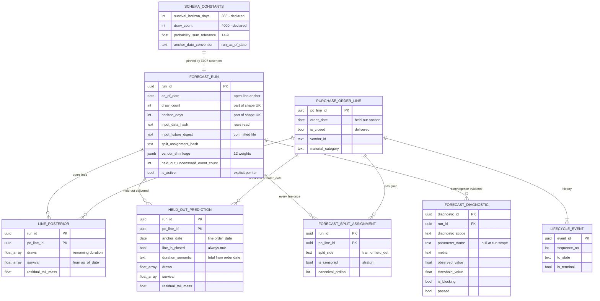

# Data Model — Delivery Forecast Model

> Feature: `00007-delivery-forecast-model` (E007) | Storage: **PostgreSQL 16**, schema `public`, single instance ({SAD:ADR-0002}) | Migrations: forward-only Alembic in `/src/model`, filename block **`0300`–`0399`** | Consumers: E010 (`line_posterior`), E014 (`held_out_prediction`, `forecast_split_assignment`, `forecast_diagnostic`)

E003 delivered the tables that hold a fit. E007 is the first epic that writes one. This document defines **three new tables**, **fourteen additive columns on `forecast_run`**, **one additive unique key on `purchase_order_line`**, and **one immutable helper function** — and nothing else. Every other object it names is quoted from a contract it does not own.

## Scope

| Aspect | Position |
|--------|----------|
| Created here | `held_out_prediction`, `forecast_diagnostic`, `forecast_split_assignment`; `fn_vendor_shrinkage_wellformed`; `uq_purchase_order_line__order_anchor`; fourteen columns added to `forecast_run`. Migrations `0300`–`0303`. |
| Written but not created here | `forecast_run` and `line_posterior` (E003, migration `0008`). E007 inserts rows; it changes no delivered column, no delivered constraint, and no delivered semantic. |
| Read but not written here | `purchase_order_line`, `lifecycle_event` (E003 `0007`, populated by E005), `schema_constants` (E003 `0002`). |
| Not created here | No view. No trigger. No deferrable constraint. No column default. Each of those is a delivered whole-schema audit that E007's objects must pass — see **Delivered Audits This Epic Must Not Break**. |
| Not computed in the database | Every probability, quantile, digest and diagnostic is computed in Python inside the deterministic-computation boundary ({SAD:ADR-0008}, Principle V, FR-024). The database stores results and enforces shape. The one exception is E010's read-side `1 - survival[d - as_of_date]`, which is E010's SQL and not E007's. |
| Not a table | The reproduction report, the ablation report, and the reader-facing limitation set are emitted files, not rows. They carry no forecast draws, so {SAD:ADR-0002} does not reach them. |

## Conventions

| Aspect | Rule |
|--------|------|
| Naming | E003's exactly: `pk_<table>`, `uq_<table>__<purpose>`, `fk_<table>__<purpose>`, `ck_<table>__<rule>`, `ix_<table>__<purpose>`, `fn_<predicate>`. Every constraint explicitly named — an unnamed constraint cannot be referenced by a later forward migration or expected by another epic's test. |
| Types | `double precision` for probabilities and draws; `date` for calendar anchors; `text` + `CHECK` for closed value sets, never a native `ENUM`; `bytea` for digests, never hex text; `jsonb` only where the key space is data rather than schema. |
| Digest form | `sha256:` + 64 lowercase hex in `text` columns (matching the delivered `ck_forecast_run__input_hash_format`); raw 32-byte `bytea` for `draw_digest` and `artifact_hash` (matching the delivered `ck_line_posterior__draw_digest_length`). Both forms already exist in the delivered schema; E007 introduces neither a third form nor a mapping between them. |
| Canonical serialization | `model.roster.reader.canonical_bytes(payload)` — sorted keys, `separators=(",",":")`, `ensure_ascii=False`, UTF-8, no indentation, no trailing newline. Reused from E001/E005, never re-implemented. Labelled on the run row as `canonical-json-sorted-keys-utf8`. |
| Draw serialization | `float64-le-c-contiguous`, the value the delivered `ck_forecast_run__draw_serialization` pins. Digests are taken over those bytes, never over a text rendering. |
| Tolerances | Exactly one numeric tolerance appears in E007's DDL: `1e-9`, the delivered `schema_constants.probability_sum_tolerance`, in the same `abs(a - b) <= 1e-9` form as `ck_line_posterior__residual_matches_grid_tail`. **Never `=`.** E003 records exact equality as a form it explicitly refuses, and inventing a second tolerance for one quantity is how a gate ends up pointing at the wrong number. |
| Reused helpers | `fn_is_sorted_ascending`, `fn_is_non_increasing`, `fn_all_within_unit_interval` are called from E007's checks and not re-declared. A second helper with the same body would be a second thing to keep in step. |
| Defaults | **None.** No E007 column carries a `DEFAULT`, including creation timestamps — see **Delivered Audits This Epic Must Not Break**, row TR-063. |
| Derived values | Not stored twice. Approval-cycle count, days-in-state and a held-out line's observed duration are derived from `lifecycle_event` at read time and have no column here, following E003 §State Machines and E005 §Line record. |

## Delivered Schema — Fixed Input

The contract E007 writes against. Full detail is E003's; this is the subset that decides E007's shape.

| Delivered object | What it forces on E007 |
|---|---|
| `uq_forecast_run__shape UNIQUE (run_id, draw_count, horizon_days)` | The artifact-row FK target. `held_out_prediction` references it exactly as `line_posterior` does, so both arrays' lengths are proved against the run's own values with no cross-row read. |
| `ix_forecast_run__single_active … WHERE is_active` | At most one active run, as a database fact. FR-015's explicit pointer is a flip of `is_active`, never a `created_at DESC LIMIT 1`. |
| `forecast_run.is_active DEFAULT false` | A run publishes nothing on insert. This is what makes "a refused run leaves the pointer unmoved" structural rather than procedural. |
| `forecast_run.input_data_hash text NOT NULL` — **one column** | The row-serialization hash occupies it. FR-042's second digest, over the committed fixture file, therefore needs its own column: `input_fixture_digest`. |
| `forecast_run.as_of_date` + `ck_schema_constants__anchor_convention CHECK (= 'run_as_of_date')` | One anchor per run for `line_posterior`. A per-row anchor is unrepresentable there, which is why the held-out population gets its own table rather than a column. |
| `line_posterior.survival NOT NULL`; `ck_line_posterior__draws_non_negative` | A line that delivered before the as-of date has no meaningful grid position under the run anchor and would carry a negative duration. `line_posterior` cannot hold it. |
| `ck_line_posterior__residual_matches_grid_tail … <= 1e-9` | The tolerance form E007 mirrors, and the reason it mirrors rather than tightens. |
| `fn_is_sorted_ascending`, `fn_is_non_increasing`, `fn_all_within_unit_interval` | Called, not re-declared. |
| `uq_purchase_order_line__natural (project_id, po_number, line_number)` | The canonical order the split assignment is serialized in, and the reason no tie-break is needed: the triple is unique, so the order is total. |
| `ck_pol__closed_iff_delivered CHECK (is_closed = (lifecycle_state = 'delivered'))` | `is_closed` is an unforgeable synonym for delivered, which is what lets `held_out_prediction` carry "this line has an observed outcome" in a foreign key. |
| `ck_pol__need_by_not_before_order`, `order_date NOT NULL` | The held-out anchor exists on every line and is never after its need-by date. |
| Migration `0009` — `GRANT … ON ALL TABLES IN SCHEMA public` was executed **before** E007's tables existed | Tables created after `0009` receive no grant implicitly. E007's migrations grant explicitly, as E003's `0010` had to. |
| Zero triggers, one deferrable constraint, an enumerated default set | Delivered whole-schema audits. E007 adds nothing to any of the three. |

### Delivered Audits This Epic Must Not Break

These run over `pg_catalog` with **no hardcoded table list**, so they audit E007's objects the moment the migrations land. They are constraints on this design, not observations about it.

| Audit | Rule | How E007 satisfies it |
|---|---|---|
| `test_every_relation_is_named_in_the_data_model` (TR-083) | Every table, index and sequence must be named inside a code span in some `specs/*/data-model.md` | **Named Object Inventory** below. The enforcement reads every epic's data model, so E007 documenting its own objects is what keeps E003's suite green. |
| `test_every_constraint_is_named_in_the_data_model` | Same, for every named constraint | Same. |
| `test_every_function_is_named_in_the_data_model` | Same, for every non-extension function | `fn_vendor_shrinkage_wellformed`, below. |
| `test_every_single_column_check_sits_on_a_not_null_column` (TR-039) | A single-column `CHECK` on a nullable column is vacuous | E007 declares exactly one nullable column, `forecast_diagnostic.parameter_name`, and both checks touching it close their null branch with an `IS NULL` test. |
| `test_every_check_touching_a_nullable_column_is_recorded_in_the_data_model` | Every such check must appear in a **Nullable-column checks** table | The section of that name below, in the format the parser expects. |
| `test_no_check_constraint_is_deferrable`, `test_exactly_one_constraint_in_the_schema_is_deferrable` (TR-051) | Exactly one deferrable constraint schema-wide, and it is `fk_purchase_order_line__closing_event` | E007 declares no deferrable constraint. Nothing in the write order needs one: every E007 row is a child of a run that is inserted first. |
| `test_the_schema_carries_no_triggers` | Zero non-internal triggers | E007 declares none. FR-013's atomicity is carried by both arrays being NOT NULL columns of one row, exactly as `line_posterior` carries it. |
| `test_no_column_outside_the_enumerated_set_carries_a_default` (TR-063) | Only `loaded_at`, `created_at`, `extracted_at`, `failed_at`, `added_at`, `is_active` may carry a default | **No E007 column carries a default.** In particular none of the three tables has a `created_at`: adding one *without* `DEFAULT now()` would fail `test_every_enumerated_default_that_can_exist_does_exist`, and adding one *with* it would record a fact `forecast_run.created_at` already holds for the whole run. |
| `test_migration_ranges.py` | The declared prefix blocks tile `0001`–`0199` with no gap and both are populated | **Not satisfied — see G-1.** This is the one delivered check E007 cannot pass without changing it. |

## Entities

The compact artifact. Detail follows; a downstream agent that reads only this table has the shape. **Bold** = created by this epic.

| Entity | Attributes (name: type, constraints) | Relationships | State Transitions |
|--------|--------------------------------------|---------------|-------------------|
| `forecast_run` *(delivered — 14 columns added)* | Delivered: see E003 §`forecast_run`. **Added by E007**: `covariate_names: text[]` NOT NULL non-empty, no null/blank element; `open_line_draw_semantic: text` NOT NULL `CHECK(='conditional_remaining_duration_from_run_as_of_date')`; `input_fixture_digest: text` NOT NULL sha256 form; `input_layer: text` NOT NULL `CHECK(IN ('REAL','SYNTHETIC'))`; `input_datasheet_ref: text` NOT NULL non-blank; `canonical_serialization: text` NOT NULL `CHECK(='canonical-json-sorted-keys-utf8')`; `split_seed_entropy: text` NOT NULL `CHECK(~ '^[0-9]{1,39}$')`; `split_assignment_hash: text` NOT NULL sha256 form; `held_out_fraction_declared: double precision` NOT NULL `CHECK(>0 AND <1)`; `held_out_fraction_realized: double precision` NOT NULL `CHECK(>=0 AND <=1)`; `held_out_uncensored_event_count: integer` NOT NULL `CHECK(>=0)`; `vendor_shrinkage: jsonb` NOT NULL `CHECK(fn_vendor_shrinkage_wellformed(...))`; `open_line_count: integer` NOT NULL `CHECK(>0)`; `training_line_count: integer` NOT NULL `CHECK(>0)` | has_many: `line_posterior` (delivered, CASCADE), **`held_out_prediction`** (CASCADE), **`forecast_diagnostic`** (CASCADE), **`forecast_split_assignment`** (CASCADE) | `Created (is_active=false) → Active → Superseded`. Unchanged by E007; the flip is a separate transaction after every artifact is durable. |
| `line_posterior` *(delivered — unaltered)* | See E003 §`line_posterior` | belongs_to: `forecast_run` via `(run_id, draw_count, horizon_days)`; belongs_to: `purchase_order_line` | — |
| **`held_out_prediction`** | PK `(run_id, po_line_id)`; `run_id: uuid` NOT NULL; `po_line_id: uuid` NOT NULL; `draw_count: integer` NOT NULL; `horizon_days: integer` NOT NULL; `anchor_date: date` NOT NULL; `line_is_closed: boolean` NOT NULL `CHECK(line_is_closed)`; `anchor_convention: text` NOT NULL `CHECK(='line_order_date')`; `duration_semantic: text` NOT NULL `CHECK(='total_duration_from_line_order_date')`; `draws: double precision[]` NOT NULL, 1-D lower bound 1, sorted ascending, `length = draw_count`, `draws[1] >= 0`; `survival: double precision[]` NOT NULL, 1-D lower bound 1, non-increasing, all in `[0,1]`, `length = horizon_days`; `residual_tail_mass: double precision` NOT NULL `CHECK(>=0 AND <=1)` and `= survival[horizon_days] ± 1e-9`; `draw_digest: bytea` NOT NULL `CHECK(octet_length=32)` | belongs_to: `forecast_run` via composite FK `(run_id, draw_count, horizon_days)` CASCADE; belongs_to: `purchase_order_line` via composite FK `(po_line_id, anchor_date, line_is_closed)` → `(po_line_id, order_date, is_closed)` RESTRICT | — (written once inside the run's write transaction; never updated) |
| **`forecast_diagnostic`** | `diagnostic_id: uuid` PK; `run_id: uuid` NOT NULL; `diagnostic_scope: text` NOT NULL `CHECK(IN ('parameter','run'))`; `parameter_name: text` **NULL**, present iff scope is `parameter`, non-blank when present; `metric: text` NOT NULL `CHECK(IN ('r_hat','ess_bulk','ess_tail','divergent_transitions','ebfmi','max_treedepth_hits'))`; `observed_value: double precision` NOT NULL; `threshold_value: double precision` NOT NULL; `threshold_direction: text` NOT NULL `CHECK(IN ('max','min'))`; `is_blocking: boolean` NOT NULL; `passed: boolean` NOT NULL; UNIQUE NULLS NOT DISTINCT `(run_id, metric, parameter_name)`; agreement checks tying scope, metric, direction, blocking and passed to one another | belongs_to: `forecast_run` CASCADE | — (written once; a stored row always reports a *passing* blocking metric, by `ck_forecast_diagnostic__blocking_rows_passed`) |
| **`forecast_split_assignment`** | PK `(run_id, po_line_id)`; `run_id: uuid` NOT NULL; `po_line_id: uuid` NOT NULL; `split_side: text` NOT NULL `CHECK(IN ('train','held_out'))`; `is_censored: boolean` NOT NULL; `canonical_ordinal: integer` NOT NULL `CHECK(>=1)`; UNIQUE `(run_id, canonical_ordinal)` | belongs_to: `forecast_run` CASCADE; belongs_to: `purchase_order_line` RESTRICT | — (written once, before any artifact row) |
| `purchase_order_line` *(delivered — one unique key added)* | See E003 §`purchase_order_line`. **Added by E007**: `uq_purchase_order_line__order_anchor UNIQUE (po_line_id, order_date, is_closed)` — an FK target, redundant against the primary key by design, in the idiom of the delivered `uq_chunk__chunk_page` and `uq_lifecycle_event__id_line_terminal` | referenced_by: **`held_out_prediction`**, **`forecast_split_assignment`**, `line_posterior` | See E003 §State Machines |
| `lifecycle_event` *(delivered — unaltered)* | See E003 §`lifecycle_event` | Read only. Supplies the censoring indicator, days-in-state, approval-cycle count, and a held-out line's observed duration | — |
| `schema_constants` *(delivered — unaltered)* | See E003 §`schema_constants` | Read only. Publishes `survival_horizon_days`, `draw_count`, `probability_sum_tolerance`, `anchor_date_convention`, `percentile_convention` | — |

ER Diagram (visual reference)

## Additions to `forecast_run` (migration `0300`)

Fourteen columns, every one traceable to a requirement the delivered table has no home for. They ride on the run row rather than a 1:1 side table because each is a **single-valued fact about one fit**; a side table would put a run's identity in two places and make every consumer join to read a manifest.

| Column | Type | Null | Constraint | Requirement |
|--------|------|------|-----------|-------------|
| `covariate_names` | `text[]` | NOT NULL | `ck_forecast_run__covariates_non_empty CHECK (cardinality(covariate_names) >= 1 AND array_position(covariate_names, NULL) IS NULL AND btrim(array_to_string(covariate_names, ''), E' \t\n\r\f
') <> '')` | FR-002, SC-006 |
| `open_line_draw_semantic` | `text` | NOT NULL | `ck_forecast_run__open_line_semantic CHECK (open_line_draw_semantic = 'conditional_remaining_duration_from_run_as_of_date')` | FR-029, SC-013 |
| `input_fixture_digest` | `text` | NOT NULL | `ck_forecast_run__fixture_digest_format CHECK (input_fixture_digest ~ '^sha256:[0-9a-f]{64}$')` | FR-042, FR-023, SC-020 |
| `input_layer` | `text` | NOT NULL | `ck_forecast_run__input_layer CHECK (input_layer IN ('REAL','SYNTHETIC'))` | FR-045, SC-020 |
| `input_datasheet_ref` | `text` | NOT NULL | `ck_forecast_run__datasheet_ref_present CHECK (btrim(input_datasheet_ref, E' \t\n\r\f
') <> '')` | FR-045, SC-020 |
| `canonical_serialization` | `text` | NOT NULL | `ck_forecast_run__canonical_serialization CHECK (canonical_serialization = 'canonical-json-sorted-keys-utf8')` | FR-014, FR-005, SC-020 |
| `split_seed_entropy` | `text` | NOT NULL | `ck_forecast_run__split_seed_format CHECK (split_seed_entropy ~ '^[0-9]{1,39}$')` | FR-043, SC-009 |
| `split_assignment_hash` | `text` | NOT NULL | `ck_forecast_run__split_hash_format CHECK (split_assignment_hash ~ '^sha256:[0-9a-f]{64}$')` | FR-005, FR-006, FR-023, SC-012 |
| `held_out_fraction_declared` | `double precision` | NOT NULL | `ck_forecast_run__declared_fraction_range CHECK (held_out_fraction_declared > 0.0 AND held_out_fraction_declared < 1.0)` | FR-005, FR-028 |
| `held_out_fraction_realized` | `double precision` | NOT NULL | `ck_forecast_run__realized_fraction_range CHECK (held_out_fraction_realized >= 0.0 AND held_out_fraction_realized <= 1.0)` | FR-006, SC-012 |
| `held_out_uncensored_event_count` | `integer` | NOT NULL | `ck_forecast_run__held_out_events_non_negative CHECK (held_out_uncensored_event_count >= 0)` | FR-006, FR-028, SC-012, SC-025 |
| `vendor_shrinkage` | `jsonb` | NOT NULL | `ck_forecast_run__vendor_shrinkage_shape CHECK (fn_vendor_shrinkage_wellformed(vendor_shrinkage))` | FR-019, SC-004 |
<!-- PROSE-AFTER-TABLE: the note below must stay outside the table; the two count columns follow it -->

**Why each weight is a triple and not one number.** ρⱼ = τ²/(τ² + σ²/nⱼ) is a plug-in of two *fitted* parameters, so it has a posterior of its own, and FR-019 publishes it to a reader who uses it to decide how much of an estimate is that vendor's data. An earlier revision stored a bare number. Principle II makes uncertainty the product, and a point estimate of a quantity that is itself uncertain — reported at exactly the sparse-vendor end where the uncertainty is largest — is the shape that principle exists to refuse. The median and an HPDI cost two more numbers per vendor in a column read whole, once per run, by a report.
| `open_line_count` | `integer` | NOT NULL | `ck_forecast_run__open_line_count_positive CHECK (open_line_count > 0)` | **FR-021, SC-017** |
| `training_line_count` | `integer` | NOT NULL | `ck_forecast_run__training_line_count_positive CHECK (training_line_count > 0)` | FR-007 |

**`open_line_count > 0` is FR-021 made structural.** "Refuse to emit a run in which no line is open" is the one refusal that does not depend on the job behaving correctly: a run with an empty forecast set cannot be represented. Every other refusal in FR-017 is carried by ordering and by the transaction — see **The Refusal Guarantee**.

**Why `vendor_shrinkage` is one JSONB and not twelve columns or a fourth table.** Twelve columns would make the vendor roster a DDL fact and a thirteenth vendor a migration; E001 owns the roster and E007 may not encode it in a column list. A fourth table would be the relationally correct shape and is rejected only because the value is read whole, per run, by a report — it is never filtered, joined or aggregated, so a child table would buy referential integrity against the roster at the cost of a table nothing queries. The cost of the JSONB is stated rather than hidden: a `CHECK` admits no subquery, so the constraint can enforce *shape* (`{"VND-###": {median, hpdi_low, hpdi_high}}`) and cannot enforce *membership* against the roster's twelve identifiers. SC-004's "all twelve, including any vendor with no training line" is therefore **DV-009**, a test, and **G-9**, a disclosed gap.

**Why `open_line_draw_semantic` sits here and its held-out counterpart does not.** Each population records its semantic where the population lives. The held-out population has its own table, so `held_out_prediction.duration_semantic` carries it per row. The open population lives in the delivered `line_posterior`, which E007 may not alter, so its semantic rides on the run — which is exact, because the semantic is a property of the run's whole open-line set, not of any one row.

**Adding these columns is not free.** `ADD COLUMN … NOT NULL` with no default requires the table to be empty, and the TR-063 defaults audit forbids supplying one. Every `INSERT INTO forecast_run` in the repository names its columns explicitly and would break. Both consequences are recorded, with their remediation, as **G-2**.

## `forecast_split_assignment` — FR-005, FR-006, FR-007 (migration `0301`)

One row per line per run. Written first **within** transaction 1, which is the order the foreign keys force — but that ordering is **not** what makes the split evidence rather than a by-product, and an earlier revision of this line claimed it was. Ordering inside one transaction has no external visibility, and transaction 1 opens only after sampling and after the diagnostics gate; committing the split earlier is not merely unnecessary but **prohibited**, since SC-015 requires a refused run to leave no row in *any* store it writes to, this one included. What actually rules out a split chosen to suit a fit is determinism from inputs fixed beforehand: the assignment is a pure function of `input_data_hash` and two committed configuration constants (`HELD_OUT_FRACTION`, `SPLIT_SEED`), so there is no freedom left to exercise. See `plan.md` AD-011.

| Column | Type | Null | Constraint |
|--------|------|------|-----------|
| `run_id` | `uuid` | NOT NULL | part of PK; `fk_forecast_split_assignment__run` |
| `po_line_id` | `uuid` | NOT NULL | part of PK; `fk_forecast_split_assignment__line` |
| `split_side` | `text` | NOT NULL | `ck_forecast_split_assignment__side CHECK (split_side IN ('train','held_out'))` |
| `is_censored` | `boolean` | NOT NULL | — the stratum, **and** FR-004's stored censoring indicator |
| `canonical_ordinal` | `integer` | NOT NULL | `ck_forecast_split_assignment__ordinal_positive CHECK (canonical_ordinal >= 1)` |

| Name | Definition | Purpose |
|------|-----------|---------|
| `pk_forecast_split_assignment` | `PRIMARY KEY (run_id, po_line_id)` | **"Every line is assigned to exactly one side" is half structural**: a line cannot appear twice under one run. The other half — that every line appears at all — is a count against `purchase_order_line` (DV-006, G-6). |
| `uq_forecast_split_assignment__run_ordinal` | `UNIQUE (run_id, canonical_ordinal)` | Two lines cannot claim one position in the serialized order, so the hash's input is a permutation-free sequence. |
| `fk_forecast_split_assignment__run` | `FOREIGN KEY (run_id) REFERENCES forecast_run (run_id) ON DELETE CASCADE ON UPDATE CASCADE` | An assignment belongs to its run and dies with it. |
| `fk_forecast_split_assignment__line` | `FOREIGN KEY (po_line_id) REFERENCES purchase_order_line (po_line_id) ON DELETE RESTRICT ON UPDATE CASCADE` | A line with a recorded split cannot be deleted out from under it. |
| `ix_forecast_split_assignment__po_line` | `(po_line_id)` | Reverse lookup: which runs held this line out. |

**FR-004's "the as-of date it was derived from" is `forecast_run.as_of_date`, reached through `run_id`.** It is not duplicated onto this row. `run_id` is the run's primary key, so the as-of date is *functionally determined* by a column already on the row — that is storage, not inference, and duplicating it would create a second place for one date to be wrong. What FR-004 forbids is re-deriving censoring at read time, and `is_censored` being a stored `boolean` is exactly that prohibition honoured.

**Canonical order.** Ascending `(project_id, po_number, line_number)` on the referenced line — the natural key `uq_purchase_order_line__natural` makes unique, so **the order is total and no tie-break exists to specify**. `canonical_ordinal` stores the resulting position so the hash is recomputable from the table alone, without re-reading `purchase_order_line`.

## `held_out_prediction` — FR-008, FR-012, FR-029 (migration `0302`)

One row per held-out **delivered** line per run, holding both arrays, anchored at **the line's own order date**. It exists because the delivered schema admits no alternative — `line_posterior.survival` is NOT NULL, `ck_line_posterior__draws_non_negative` rejects the negative duration a pre-as-of delivery would carry, and `ck_schema_constants__anchor_convention` pins the run-level convention that `/src/api` reads. It is a table and not a committed file because {SAD:ADR-0002} keeps posterior draws in the single Postgres instance, and because FR-013's atomicity has no cross-store mechanism.

| Column | Type | Null | Constraint |
|--------|------|------|-----------|
| `run_id` | `uuid` | NOT NULL | part of PK and of `fk_held_out_prediction__run_shape` |
| `po_line_id` | `uuid` | NOT NULL | part of PK and of `fk_held_out_prediction__line_anchor` |
| `draw_count` | `integer` | NOT NULL | part of `fk_held_out_prediction__run_shape` |
| `horizon_days` | `integer` | NOT NULL | part of `fk_held_out_prediction__run_shape` |
| `anchor_date` | `date` | NOT NULL | part of `fk_held_out_prediction__line_anchor` — **the line's `order_date`, proved by the FK, not asserted** |
| `line_is_closed` | `boolean` | NOT NULL | `ck_held_out_prediction__line_delivered CHECK (line_is_closed)`; part of `fk_held_out_prediction__line_anchor` |
| `anchor_convention` | `text` | NOT NULL | `ck_held_out_prediction__anchor_convention CHECK (anchor_convention = 'line_order_date')` |
| `duration_semantic` | `text` | NOT NULL | `ck_held_out_prediction__duration_semantic CHECK (duration_semantic = 'total_duration_from_line_order_date')` |
| `draws` | `double precision[]` | NOT NULL | `ck_held_out_prediction__draws_1d CHECK (array_ndims(draws) = 1 AND array_lower(draws, 1) = 1)`; `ck_held_out_prediction__draws_length CHECK (coalesce(array_length(draws, 1), 0) = draw_count)`; `ck_held_out_prediction__draws_sorted CHECK (fn_is_sorted_ascending(draws))`; `ck_held_out_prediction__draws_non_negative CHECK (draws[1] >= 0.0)` |
| `survival` | `double precision[]` | NOT NULL | `ck_held_out_prediction__survival_1d CHECK (array_ndims(survival) = 1 AND array_lower(survival, 1) = 1)`; `ck_held_out_prediction__survival_length CHECK (coalesce(array_length(survival, 1), 0) = horizon_days)`; `ck_held_out_prediction__survival_monotone CHECK (fn_is_non_increasing(survival))`; `ck_held_out_prediction__survival_unit_interval CHECK (fn_all_within_unit_interval(survival))` |
| `residual_tail_mass` | `double precision` | NOT NULL | `ck_held_out_prediction__residual_range CHECK (residual_tail_mass >= 0.0 AND residual_tail_mass <= 1.0)`; `ck_held_out_prediction__residual_matches_grid_tail CHECK (abs(survival[horizon_days] - residual_tail_mass) <= 1e-9)` |
| `draw_digest` | `bytea` | NOT NULL | `ck_held_out_prediction__draw_digest_length CHECK (octet_length(draw_digest) = 32)` |

| Name | Definition |
|------|-----------|
| `pk_held_out_prediction` | `PRIMARY KEY (run_id, po_line_id)` |
| `fk_held_out_prediction__run_shape` | `FOREIGN KEY (run_id, draw_count, horizon_days) REFERENCES forecast_run (run_id, draw_count, horizon_days) MATCH FULL ON DELETE CASCADE ON UPDATE CASCADE` |
| `fk_held_out_prediction__line_anchor` | `FOREIGN KEY (po_line_id, anchor_date, line_is_closed) REFERENCES purchase_order_line (po_line_id, order_date, is_closed) MATCH FULL ON DELETE RESTRICT ON UPDATE RESTRICT` |
| `ix_held_out_prediction__po_line` | `(po_line_id)` |

**The anchor is a foreign key, not a comment.** `anchor_date` could have been a plain column with a test asserting it equals the line's order date. It is a composite FK instead, in the exact idiom of the delivered `fk_extracted_value__chunk_page` — "a citation whose page differs from its source chunk's page has no referent". A mis-anchored prediction is the silent failure Principle III names: every constraint above passes, E014 grades it against the wrong origin, and nothing anywhere reports a problem. The FK makes it unrepresentable.

**`line_is_closed` carries the delivered `ck_pol__closed_iff_delivered` into the referenced key**, so a prediction row can only name a line that actually delivered. Same idiom as `uq_lifecycle_event__id_line_terminal`, which is where E003 carries a terminal flag into an FK target for the same reason. The consequence is that **the two artifact populations are structurally disjoint on this side**: a still-open line cannot receive a held-out prediction. The other side — an order-date-anchored row written into `line_posterior` — is not structurally excluded, and is **G-5**.

**`ON UPDATE RESTRICT`, departing from E003's convention.** E003 sets `ON UPDATE CASCADE` on composite FKs whose parent key has a mutable column, so a legitimate correction propagates. Here it must not: cascading a corrected `order_date` would silently re-anchor draws that were computed against the old one, producing exactly the mis-anchored row the FK exists to prevent. Refusing forces a refit, which is the correct outcome. `order_date` corrections are in any case unreachable through E005's loader, which refuses on content divergence rather than updating.

**`draws[1] >= 0.0` is sufficient here, unlike in `line_posterior`.** The array is sorted ascending, so its first element is its minimum; a non-negative minimum makes every draw non-negative. FR-029 records this check as *weak* in the open-line case, and it is — but only against a re-based total duration, where clipping a negative value to zero satisfies it. Against a total duration from the line's own order date there is nothing to clip: the quantity is non-negative by construction.

**A held-out delivered line whose total duration exceeds the horizon is representable and expected.** A 380-day delivery under a 365-day grid gives a survival array that never reaches the outcome and a `residual_tail_mass` above zero. The grid cannot express the observation; the draws can, and the draws are what E014 grades. This is the reachable half of the two horizon edge cases the spec separates.

## `forecast_diagnostic` — FR-016, FR-017, FR-018 (migration `0303`)

Both per-parameter and run-level diagnostics, each beside the threshold it was judged against. One table rather than two because every row answers the same question — *what was measured, against what bar, and did it clear* — and splitting it would duplicate five columns to avoid one discriminator.

| Column | Type | Null | Constraint |
|--------|------|------|-----------|
| `diagnostic_id` | `uuid` | NOT NULL | `pk_forecast_diagnostic` PRIMARY KEY |
| `run_id` | `uuid` | NOT NULL | `fk_forecast_diagnostic__run` |
| `diagnostic_scope` | `text` | NOT NULL | `ck_forecast_diagnostic__scope CHECK (diagnostic_scope IN ('parameter','run'))` |
| `parameter_name` | `text` | **NULL** | `ck_forecast_diagnostic__parameter_iff_parameter_scope CHECK ((diagnostic_scope = 'parameter') = (parameter_name IS NOT NULL))`; `ck_forecast_diagnostic__parameter_name_present CHECK (parameter_name IS NULL OR btrim(parameter_name, E' \t\n\r\f
') <> '')` |
| `metric` | `text` | NOT NULL | `ck_forecast_diagnostic__metric CHECK (metric IN ('r_hat','ess_bulk','ess_tail','divergent_transitions','ebfmi','max_treedepth_hits'))` |
| `observed_value` | `double precision` | NOT NULL | `ck_forecast_diagnostic__observed_finite CHECK (observed_value = observed_value AND observed_value <> 'Infinity'::double precision AND observed_value <> '-Infinity'::double precision)` |
| `threshold_value` | `double precision` | NOT NULL | — |
| `threshold_direction` | `text` | NOT NULL | `ck_forecast_diagnostic__direction CHECK (threshold_direction IN ('max','min'))` |
| `is_blocking` | `boolean` | NOT NULL | — |
| `passed` | `boolean` | NOT NULL | — |

| Name | Definition | Purpose |
|------|-----------|---------|
| `pk_forecast_diagnostic` | `PRIMARY KEY (diagnostic_id)` | A surrogate key, because the natural key includes the nullable `parameter_name` and a primary key admits no null. |
| `uq_forecast_diagnostic__run_metric_parameter` | `UNIQUE NULLS NOT DISTINCT (run_id, metric, parameter_name)` | The natural key. **`NULLS NOT DISTINCT` is load-bearing**: under PostgreSQL's default `NULLS DISTINCT` — the behaviour E003 deliberately relies on in `resolved_entity_member` — two run-scope rows for one metric would both be accepted, and a run could record its divergence count twice with two different values. |
| `fk_forecast_diagnostic__run` | `FOREIGN KEY (run_id) REFERENCES forecast_run (run_id) ON DELETE CASCADE ON UPDATE CASCADE` | Evidence belongs to its run. |
| `ck_forecast_diagnostic__metric_matches_scope` | `CHECK ((metric IN ('r_hat','ess_bulk','ess_tail')) = (diagnostic_scope = 'parameter'))` | The three per-parameter metrics occur only at parameter scope and the three run metrics only at run scope. A per-parameter divergence count is not a quantity. |
| `ck_forecast_diagnostic__direction_matches_metric` | `CHECK ((threshold_direction = 'min') = (metric IN ('ess_bulk','ess_tail','ebfmi')))` | Direction is a function of the metric, so a row cannot record E-BFMI as a ceiling and thereby make a breach read as a pass. |
| `ck_forecast_diagnostic__blocking_matches_metric` | `CHECK (is_blocking = (metric <> 'max_treedepth_hits'))` | **FR-018 as a database fact.** Treedepth is reported and never blocking; the other five always block. Neither classification can be edited row by row. |
| `ck_forecast_diagnostic__passed_matches_threshold` | `CHECK (passed = CASE WHEN threshold_direction = 'max' THEN observed_value <= threshold_value ELSE observed_value >= threshold_value END)` | `passed` is arithmetic, not an opinion. A row cannot claim a pass its own two numbers refute. |
| `ck_forecast_diagnostic__blocking_rows_passed` | `CHECK (NOT is_blocking OR passed)` | **A stored run breached no blocking threshold — enforced, not asserted.** Combined with the FK, a non-converged fit has nowhere to put its evidence and no run row to attach it to. The cost is that a *refused* run leaves no diagnostic rows at all; see **G-8**. |

No secondary index: `uq_forecast_diagnostic__run_metric_parameter` leads with `run_id`, which serves every read this table has ("the diagnostics of run X", "the blocking set of run X"). Adding one would be an index nothing uses, and E003's audit would require it documented for that.

**`observed_value` rejects NaN and both infinities.** A diverged sampler can produce a NaN R-hat, and `NaN <= 1.01` is false in PostgreSQL, so `passed` would correctly be false and `ck_forecast_diagnostic__blocking_rows_passed` would refuse the row — which is right but reports the wrong reason. Refusing the non-finite value at its own check names the actual defect. (`observed_value = observed_value` is the standard NaN test; PostgreSQL's `double precision` sorts NaN as largest but compares it unequal to itself.)

**The monitored parameter set is the rows themselves.** FR-016's "name the parameter set they are monitored over" is discharged by the distinct `parameter_name` values at parameter scope for the run — a set that is *enumerated* rather than described. Completeness of that set (three metrics for every monitored parameter, three run-scope rows per run) is cross-row and is **DV-011** / **G-7**.

## Added Object on a Delivered Table

| Object | Definition | Why it is E007's to add |
|---|---|---|
| `uq_purchase_order_line__order_anchor` | `UNIQUE (po_line_id, order_date, is_closed)` on `purchase_order_line`, migration `0302` | It is an **FK target and nothing else**, exactly as `uq_chunk__chunk_page` is ("redundant against the PK by design"). It adds no column, changes no existing constraint, rejects no row that was previously legal — the leading column is already the primary key, so the constraint is satisfied by every existing and future row. What it buys is `fk_held_out_prediction__line_anchor`, and with it the two guarantees above: the anchor is the line's own order date, and the line delivered. Disclosed as a cross-epic addition under **G-14**, with the cheaper alternative (a test in place of the FK) and its cost recorded. |

## Immutable Helper Functions

`IMMUTABLE STRICT PARALLEL SAFE`, arguments only, no lookups, no `current_setting`, no collation-dependent comparison — the properties that make a function sound inside a `CHECK`.

| Function | Signature | Body summary | Status |
|----------|-----------|--------------|--------|
| `fn_vendor_shrinkage_wellformed` | `(jsonb) → boolean` | `true` when the argument is a JSON **object** with at least one member, every key matches `^VND-[0-9]{3}$`, and every value is a JSON **object** carrying exactly `median`, `hpdi_low` and `hpdi_high`, each a JSON number in `[0, 1]`, with `hpdi_low <= median <= hpdi_high`. Created in migration `0300`. | **New.** Exists for the reason `fn_all_sha256_prefixed` exists: a `CHECK` admits no subquery and no set-returning function, so member-wise validation of a container needs an `IMMUTABLE` helper. |
| `fn_is_sorted_ascending` | `(double precision[]) → boolean` | Delivered by E003 `0008` | Reused by `ck_held_out_prediction__draws_sorted`. |
| `fn_is_non_increasing` | `(double precision[]) → boolean` | Delivered by E003 `0008` | Reused by `ck_held_out_prediction__survival_monotone`. |
| `fn_all_within_unit_interval` | `(double precision[]) → boolean` | Delivered by E003 `0008` | Reused by `ck_held_out_prediction__survival_unit_interval`. |

**Restriction, inherited verbatim from E003**: `CREATE OR REPLACE FUNCTION` does not re-validate existing rows. Changing `fn_vendor_shrinkage_wellformed` is a two-step forward migration — new function under a new name, new check, drop the old — never an in-place replace.

**What the helper cannot do**: it validates shape, not membership. It cannot know that the roster holds twelve vendors, because a `CHECK` cannot read `purchase_order_line` and E007 may not hard-code an E001-owned identifier set into DDL. See **G-9**.

## Array and Anchor Semantics (normative)

Two populations, two anchors, two duration semantics. Both are recorded on the row or the run that carries them, so no reader infers either.

| | **Open lines** → `line_posterior` | **Held-out delivered lines** → `held_out_prediction` |
|---|---|---|
| Membership | `is_closed = false` at `forecast_run.as_of_date`. Both split sides appear: a held-out line that is still open is forecast like any other and simply did not train the model. | `split_side = 'held_out'` **and** `is_closed = true`. |
| Anchor | `forecast_run.as_of_date`, one per run (`schema_constants.anchor_date_convention = 'run_as_of_date'`) | `held_out_prediction.anchor_date` = the line's own `order_date`, per row, proved by `fk_held_out_prediction__line_anchor` |
| Anchor recorded as | `schema_constants.anchor_date_convention` (delivered, singleton) | `held_out_prediction.anchor_convention = 'line_order_date'` |
| `draws[i]` | **Remaining** duration in days, *conditional on the line having survived its elapsed time*. Never a total duration re-based by subtracting elapsed days. | **Total** duration in days from the line's order date — the quantity its observed outcome can be graded against. |
| Unit and permitted representation of a draw | **Days, `double precision`, fractional permitted and expected. No rounding is applied at storage.** AD-002's inverse-CDF conditioning returns a continuous value, and AD-004's day tolerance is measured against these unrounded values — a draw rounded to a whole day at storage would quantise the very quantity the tolerance bounds. Whole days appear in exactly two places and neither is the draw: the derived grid's index `k`, and a held-out line's *observed* duration under G-12's `terminal.occurred_at::date - order_date` convention. | Same |
| Draw → day-grid offset, and its rounding convention | **No rounding: a strict threshold count.** `survival[k] = count(draws > k) / draw_count`, so a draw is compared against the integer day boundary rather than mapped onto one. Published identically for both populations by **DV-004**, and `residual_tail_mass = count(draws > horizon_days) / draw_count` by **DV-003** — the same strict `>`, so the grid's last element and the residual are the same comparison at `k = horizon_days`. Stated here rather than left to the implementation on the store no delivered convention reaches. | Same |
| Semantic recorded as | `forecast_run.open_line_draw_semantic` | `held_out_prediction.duration_semantic` |
| `survival[k]`, `k = 1..horizon_days` | `P(not yet delivered at end of day as_of_date + k)` | `P(not yet delivered at end of day anchor_date + k)` |
| `residual_tail_mass` | `P(remaining > horizon_days)` — "this line runs past the horizon" | `P(total > horizon_days)` — reachable, and the case where the grid cannot express an observed outcome |
| Percentile `p` | `draws[ceil(p * draw_count)]` — `schema_constants.percentile_convention`, unchanged | Same |
| Read by | E010, as `1 - survival[d - as_of_date]` | E014 only. **E010 must never read this table** — it has no way to distinguish anchors, which is the entire reason the two populations are apart. |

**The third population: lines that receive no stored forecast.** Stated as its own set rather than left as the complement of the two above, because a population defined only by subtraction is one nobody counts. A line gets **no** artifact row in either store exactly when `split_side = 'train'` **and** `is_closed = true` — a training line that already delivered. It is the largest of the three: roughly 131 of the 199 lines per run, against ~24 open and ~44 held-out delivered. It carries a `forecast_split_assignment` row like every other line and nothing else, and that is correct on both counts: it is not open, so there is nothing to forecast; and it trained the model, so a prediction for it could not be graded. The three sets are exhaustive and pairwise disjoint over `purchase_order_line`, which is what **DV-030** asserts.

**What the split does not carry across — the complete set.** Enumerated here in one place rather than each entry living where it happened to bite. Each is a guarantee that holds on the delivered side and does *not* extend to the E007-owned store, or a published fact that now describes only one of two populations.

| # | Guarantee, on the delivered side | What does not extend, and where it is carried instead |
|---|---|---|
| 1 | Delivered constraint coverage of the array invariants on `line_posterior` | No delivered constraint reaches `held_out_prediction`. Its invariants are re-declared under E007's own constraint names, and their **parity** with the delivered set — so a future strengthening cannot land on one store only — is **DV-027** |
| 2 | `test_published_tolerance_equals_the_literal_inside_the_residual_check`, which names one constraint | `ck_held_out_prediction__residual_matches_grid_tail` is undrifted against nothing until that test is generalised — **G-3** |
| 3 | `schema_constants.anchor_date_convention = 'run_as_of_date'`, published on the singleton row `/src/api` serves | It now describes the open-line population only. The held-out population's anchor is `held_out_prediction.anchor_convention`, per row. The constant is unchanged and its documentation is E003's; disclosing the narrowed scope to its consumers is **P-7** |
| 4 | E010's read contract `1 - survival[d - as_of_date]`, true of every row in the table it reads | It is *not* true of `held_out_prediction`. "The worklist reader must never read the held-out store" is a documented contract with no schema mechanism — ADR-0018 § Consequences/Negative |
| 5 | Structural disjointness of the two populations | Structural on the held-out side only (`ck_held_out_prediction__line_delivered` plus the anchor FK); the reverse direction is **G-5**, covered by DV-001 and DV-030 |
| 6 | One artifact population, so an artifact hash ordered within one table | The hash must order *across* two, which is why § Hashes carries a `population_rank` — and why its recomputability is asserted separately by **DV-031** |
| 7 | One store to enumerate when claiming a refused run wrote nothing | The refusal guarantee must enumerate every store the run writes to — SC-015, STF-002 |

**Canonical draw order and its tie-break (FR-009, SC-022).** The order is ascending numeric value over a `float64` array. The requirement asks for deterministic tie-breaking; the honest answer is that **ties are indistinguishable in the serialized bytes** — two equal `float64` values produce identical eight-byte sequences, so any ordering of them yields the same `float64-le-c-contiguous` buffer and the same digest. The order is therefore total *on the artifact*, which is what a well-defined hash needs, and no secondary sort key could change any byte. Stated rather than satisfied by inventing an index-based tie-break that cannot affect the output. Recorded as **G-13**.

## Hashes and What Each Covers

Four digests, four different things. Named separately for the reason E005 names its four separately: a reader who assumes two digests are the same kind draws the wrong conclusion from a match.

| Digest | Column | Covers | Convention |
|---|---|---|---|
| Input row hash | `forecast_run.input_data_hash` | `canonical_bytes` of the **rows read from the delivered schema**: `{"purchase_order_line": [...], "lifecycle_event": [...]}`, lines ordered by `(project_id, po_number, line_number)` and events by `(line, sequence_no)`, carrying exactly E005 §Load Decisions' **compared-content** field sets — the 17 line fields and the 6 event fields. | `canonical-json-sorted-keys-utf8` |
| Fixture file digest | `forecast_run.input_fixture_digest` | E005's published `dataset_content_hash` from `data/procurement/procurement-history.hash.json` | E005's own convention, copied verbatim |
| Split assignment hash | `forecast_run.split_assignment_hash` | `canonical_bytes` of the array of `{"project_id","po_number","line_number","split_side","is_censored"}`, ordered by `canonical_ordinal` | `canonical-json-sorted-keys-utf8` |
| Artifact hash | `forecast_run.artifact_hash` (delivered, `bytea(32)`) | `sha256` over the concatenation of every artifact row's `draw_digest`, ordered by `(population_rank, canonical_ordinal)` where `population_rank` is `0` for `line_posterior` and `1` for `held_out_prediction` | Raw bytes |

**`created_at` is excluded from the input row hash, and that is the whole point.** E005 defines the compared-content field set positively and excludes `purchase_order_line.created_at` because it is a `DEFAULT now()` load-time fact that differs on every load. Reusing that definition is what makes the input hash stable across a reload of identical content — had it been included, FR-023's refusal would fire on every reproduction attempt against a re-seeded database, and the gate would be noise rather than signal.

**Why the fixture digest is E005's `dataset_content_hash` and not a raw-byte digest of the file.** FR-042 says "the fixture file's own digest", which is ambiguous between the two. E005 publishes `dataset_content_hash` over `canonical_bytes` of the *parsed* payload precisely so git end-of-line normalisation cannot move it, and E005's **G-3** records what happens when one file carries two digest conventions in one repository: a later reader can only read it as one of them being wrong. E007 records the value its owner publishes.

**FR-023's two outcomes, and why the columns are separate.** A moved `input_data_hash` or `split_assignment_hash` is a **refusal** naming which one moved — the rows the fit read are not the rows present. A moved `input_fixture_digest` against an unchanged `input_data_hash` is a **provenance warning**, not a refusal: the reproduction is sound and only the chain back to the upstream artifact has broken. That distinction is expressible only because the two digests are two columns.

**Where the provenance warning is visible to a later reader, and where it is not.** The warning is *not* stored as a flag on the run. What is stored is the evidence it was raised from: `input_fixture_digest` is NOT NULL and records the digest **observed at run time**, so a later reader of the artifact reconstructs the break by comparing that recorded value against E005's currently published `dataset_content_hash`, or against the digest another run recorded for the same `input_data_hash`. A nullable `provenance_warning` column is deliberately not added — it would be a second nullable column against a design that declares exactly one, and it would store a fact the digest pair already carries, which § Conventions/*Derived values* forbids. What is genuinely lost is the **fact that the job raised the warning on that occasion**, which lives only in the job's output and its emitted report. Recorded as **G-16**, in the same form as G-8.

**Recomputing the artifact hash.** The ordering above — `(population_rank, canonical_ordinal)`, `0` for `line_posterior` and `1` for `held_out_prediction` — is fixed here and is recomputable from the stored rows alone: `canonical_ordinal` is reached by joining each artifact row's `(run_id, po_line_id)` to `forecast_split_assignment`, which holds every line under the run. That makes the artifact hash checkable in the same way the split assignment hash is (DV-017), and **DV-031** is the assertion; without it the artifact hash would be a value recorded rather than a value derived, which is the difference between a digest and a label.

## Write Order, Atomicity, and The Refusal Guarantee

### Write order (forced by the foreign keys, not chosen)

**Transaction 1 — the artifact set.**

1. `INSERT forecast_run` with `is_active = false`. Every other row is its child, so nothing can precede it.
2. `INSERT forecast_split_assignment` — every line, in canonical order.
3. `INSERT line_posterior` — one row per open line. Both arrays are columns of the same row, so FR-013 holds by table design, exactly as it does for the delivered table (E003 invariant 21).
4. `INSERT held_out_prediction` — one row per held-out delivered line. Same one-row property.
5. `INSERT forecast_diagnostic` — every monitored parameter and every run-level metric.
6. `COMMIT`.

**Transaction 2 — publication.** `UPDATE forecast_run SET is_active = false WHERE is_active; UPDATE forecast_run SET is_active = true WHERE run_id = :run_id; COMMIT`. Separate from transaction 1 on purpose: a failure during publication leaves a complete-but-unpublished run rather than a half-written one, and `ix_forecast_run__single_active` makes a second active run impossible at either step. FR-015's "explicit, never implied by recency" is the delivered `DEFAULT false` plus this flip.

Deletion, if a run is ever discarded, is a single `DELETE FROM forecast_run WHERE run_id = …`: all four child tables cascade.

### The refusal guarantee (FR-017, SC-014, SC-015)

"A refused run leaves every store untouched" rests on four mechanisms, in order of how early they engage. Only the first is a matter of the job behaving correctly.

| # | Mechanism | Covers |
|---|---|---|
| 1 | **Ordering.** Preconditions are evaluated before sampling and blocking diagnostics before the first `INSERT`. Transaction 1 opens only after every blocking diagnostic has passed. No statement is issued on a refusing path, so there is nothing to roll back. | Chain count below 4 (**blocking precondition** — refuses before sampling); zero open lines at the as-of date; a moved input or split hash; every blocking-diagnostic breach |
| 2 | **One transaction.** Every write of one run — run row, split, both artifact populations, diagnostics — is in transaction 1. A failure at any point inside it rolls back all five tables together. This is what makes SC-015's enumeration *across stores* hold without a per-store mechanism. | Any failure after the first `INSERT` |
| 3 | **Structure.** Even a defective writer cannot leave a non-converged artifact behind: `ck_forecast_diagnostic__blocking_rows_passed` refuses a failing blocking row outright, `ck_forecast_run__open_line_count_positive` refuses an empty forecast set, and every row in all four child tables requires a `run_id` that exists in `forecast_run` — so no orphan can be written into any store without a run to hang it on. | A writer that skips the gate |
| 4 | **The pointer.** `is_active` defaults to `false` and moves only in transaction 2, which runs after transaction 1 commits. A refusal before that point cannot move the pointer because the pointer is only ever written by a statement that has not run. | "The existing active-run pointer is unchanged" |

What is *not* covered: the diagnostics of a refused run are not stored anywhere, by design — SC-015 requires exactly that. They live in the job's non-zero exit message and its emitted report file. **G-8**.

### FR-030's pinning cannot be a schema constraint

E007 pins its runs to 4,000 draws over a 365-day horizon. That pin **must not** be a `CHECK` on `forecast_run`: E003's delivered schema suite inserts runs at a fixture shape of 5 draws over a 3-day horizon — deliberately, so that a transposed `draw_count`/`horizon_days` pair cannot pass — and a `CHECK` pinning either value would fail E003's suite outright. The pin is therefore asserted by E007's own tests over the runs E007 emits (**DV-014**), which is what FR-030 means by "E007 must assert it; the schema will not". Recorded with its documented-versus-delivered wrinkle as **G-4**.

## Named Object Inventory

Every database object E007's revisions create, by name. The names are the contract: an undocumented constraint cannot be dropped by a later migration, cannot be expected by another epic's test, and fails E003's TR-083 enforcement, which reads every epic's data model.

### Relations, indexes and functions

| Object | Kind | Revision | Purpose |
|---|---|---|---|
| `fn_vendor_shrinkage_wellformed` | function | `0300` | Member-wise validation of the shrinkage object inside a `CHECK` |
| `forecast_split_assignment` | table | `0301` | Per-line train/held-out side, in canonical order |
| `pk_forecast_split_assignment` | index | `0301` | Primary-key index |
| `uq_forecast_split_assignment__run_ordinal` | index | `0301` | One line per position in the serialized order |
| `ix_forecast_split_assignment__po_line` | index | `0301` | Which runs held this line out |
| `uq_purchase_order_line__order_anchor` | index | `0302` | FK target carrying the order date and the delivered flag |
| `held_out_prediction` | table | `0302` | Gradeable predictions anchored at each line's own order date |
| `pk_held_out_prediction` | index | `0302` | Primary-key index |
| `ix_held_out_prediction__po_line` | index | `0302` | Reverse lookup from a line |
| `forecast_diagnostic` | table | `0303` | Convergence evidence, each value beside its threshold |
| `pk_forecast_diagnostic` | index | `0303` | Primary-key index on the surrogate key |
| `uq_forecast_diagnostic__run_metric_parameter` | index | `0303` | The natural key, `NULLS NOT DISTINCT`; also serves every per-run read |

### Constraints

| Constraint | Kind | Rule |
|---|---|---|
| `ck_forecast_run__covariates_non_empty` | check | non-empty `text[]`, no NULL element, not all-blank |
| `ck_forecast_run__open_line_semantic` | check | `= 'conditional_remaining_duration_from_run_as_of_date'` |
| `ck_forecast_run__fixture_digest_format` | check | `~ '^sha256:[0-9a-f]{64}$'` |
| `ck_forecast_run__input_layer` | check | `IN ('REAL','SYNTHETIC')` |
| `ck_forecast_run__datasheet_ref_present` | check | non-blank after trimming |
| `ck_forecast_run__canonical_serialization` | check | `= 'canonical-json-sorted-keys-utf8'` |
| `ck_forecast_run__split_seed_format` | check | `~ '^[0-9]{1,39}$'` |
| `ck_forecast_run__split_hash_format` | check | `~ '^sha256:[0-9a-f]{64}$'` |
| `ck_forecast_run__declared_fraction_range` | check | `> 0 AND < 1` |
| `ck_forecast_run__realized_fraction_range` | check | `>= 0 AND <= 1` |
| `ck_forecast_run__held_out_events_non_negative` | check | `>= 0` |
| `ck_forecast_run__vendor_shrinkage_shape` | check | `fn_vendor_shrinkage_wellformed(vendor_shrinkage)` |
| `ck_forecast_run__open_line_count_positive` | check | `> 0` — FR-021 |
| `ck_forecast_run__training_line_count_positive` | check | `> 0` |
| `pk_forecast_split_assignment` | primary key | `(run_id, po_line_id)` |
| `uq_forecast_split_assignment__run_ordinal` | unique | `(run_id, canonical_ordinal)` |
| `fk_forecast_split_assignment__run` | foreign key | → `forecast_run (run_id)`, CASCADE / CASCADE |
| `fk_forecast_split_assignment__line` | foreign key | → `purchase_order_line (po_line_id)`, RESTRICT / CASCADE |
| `ck_forecast_split_assignment__side` | check | `IN ('train','held_out')` |
| `ck_forecast_split_assignment__ordinal_positive` | check | `>= 1` |
| `uq_purchase_order_line__order_anchor` | unique | `(po_line_id, order_date, is_closed)` |
| `pk_held_out_prediction` | primary key | `(run_id, po_line_id)` |
| `fk_held_out_prediction__run_shape` | foreign key | → `forecast_run (run_id, draw_count, horizon_days)` MATCH FULL, CASCADE / CASCADE |
| `fk_held_out_prediction__line_anchor` | foreign key | → `purchase_order_line (po_line_id, order_date, is_closed)` MATCH FULL, RESTRICT / RESTRICT |
| `ck_held_out_prediction__line_delivered` | check | `line_is_closed` |
| `ck_held_out_prediction__anchor_convention` | check | `= 'line_order_date'` |
| `ck_held_out_prediction__duration_semantic` | check | `= 'total_duration_from_line_order_date'` |
| `ck_held_out_prediction__draws_1d` | check | `array_ndims = 1 AND array_lower = 1` |
| `ck_held_out_prediction__draws_length` | check | `coalesce(array_length(draws,1), 0) = draw_count` |
| `ck_held_out_prediction__draws_sorted` | check | `fn_is_sorted_ascending(draws)` |
| `ck_held_out_prediction__draws_non_negative` | check | `draws[1] >= 0.0` |
| `ck_held_out_prediction__survival_1d` | check | `array_ndims = 1 AND array_lower = 1` |
| `ck_held_out_prediction__survival_length` | check | `coalesce(array_length(survival,1), 0) = horizon_days` |
| `ck_held_out_prediction__survival_monotone` | check | `fn_is_non_increasing(survival)` |
| `ck_held_out_prediction__survival_unit_interval` | check | `fn_all_within_unit_interval(survival)` |
| `ck_held_out_prediction__residual_range` | check | `>= 0 AND <= 1` |
| `ck_held_out_prediction__residual_matches_grid_tail` | check | `abs(survival[horizon_days] - residual_tail_mass) <= 1e-9` |
| `ck_held_out_prediction__draw_digest_length` | check | `octet_length(draw_digest) = 32` |
| `pk_forecast_diagnostic` | primary key | `(diagnostic_id)` |
| `uq_forecast_diagnostic__run_metric_parameter` | unique | `NULLS NOT DISTINCT (run_id, metric, parameter_name)` |
| `fk_forecast_diagnostic__run` | foreign key | → `forecast_run (run_id)`, CASCADE / CASCADE |
| `ck_forecast_diagnostic__scope` | check | `IN ('parameter','run')` |
| `ck_forecast_diagnostic__parameter_iff_parameter_scope` | check | `(diagnostic_scope = 'parameter') = (parameter_name IS NOT NULL)` |
| `ck_forecast_diagnostic__parameter_name_present` | check | `parameter_name IS NULL OR btrim(parameter_name, …) <> ''` |
| `ck_forecast_diagnostic__metric` | check | the six-value domain |
| `ck_forecast_diagnostic__observed_finite` | check | not NaN, not ±Infinity |
| `ck_forecast_diagnostic__direction` | check | `IN ('max','min')` |
| `ck_forecast_diagnostic__metric_matches_scope` | check | per-parameter metrics iff parameter scope |
| `ck_forecast_diagnostic__direction_matches_metric` | check | `min` iff the metric is a floor |
| `ck_forecast_diagnostic__blocking_matches_metric` | check | `is_blocking = (metric <> 'max_treedepth_hits')` |
| `ck_forecast_diagnostic__passed_matches_threshold` | check | `passed` equals the comparison it claims |
| `ck_forecast_diagnostic__blocking_rows_passed` | check | `NOT is_blocking OR passed` |

**Nullable-column checks** — the complete list of `CHECK` constraints this epic declares that touch a nullable column, with why each one's null branch is closed. A `CHECK` rejects only on *false*, and any comparison against NULL is NULL, which a `CHECK` **accepts** — so a check on a nullable column is vacuous unless it says what it means on a null.

| Check | Nullable column | Why the null case is closed |
|---|---|---|
| `ck_forecast_diagnostic__parameter_iff_parameter_scope` | `parameter_name` | `(diagnostic_scope = 'parameter') = (parameter_name IS NOT NULL)` — a biconditional against the NOT NULL closed-set `diagnostic_scope`, with the nullable column appearing only inside a null *test*. The expression is definite on every row, and this is the constraint that decides *whether* a null is permitted. |
| `ck_forecast_diagnostic__parameter_name_present` | `parameter_name` | `parameter_name IS NULL OR btrim(parameter_name, …) <> ''` — the `IS NULL` branch short-circuits before the value position is reached, so the expression is `true` on a null rather than NULL-valued. This constraint owns the *value domain* only; permitted absence is owned by the biconditional above. Split for the same reason E004 splits its cost pair: folding them would produce one check that is either vacuous on a null or forbids an absence the requirements need, and would lose the ability to say which of the two rules a row broke. |

`forecast_diagnostic.parameter_name` is the **only** nullable column E007 declares. Every other column in every E007 object is `NOT NULL`, so every other check sits on a column that cannot be null.

## Migration Sequence

Filename prefixes `0300`–`0399` are E007's reserved block, claimed at epic start per Governance. The prefix is a labelling convention over Alembic's own revision identifiers, which remain the ordering mechanism. Forward-only; each `downgrade()` raises. The chain is single-headed, so `0300`'s `down_revision` is the current head — E004's `0103` — **not** E003's `0010`.

| Prefix | Contents | Gate |
|--------|----------|------|
| `0300` | `fn_vendor_shrinkage_wellformed`; fourteen `ALTER TABLE forecast_run ADD COLUMN … NOT NULL` with their checks | **Requires `forecast_run` to be empty** — no default is permitted (TR-063), and `ADD COLUMN NOT NULL` without one fails on a populated table. True today: no run has ever been written. See **G-2** for the guard and the fallback. |
| `0301` | `forecast_split_assignment`, its unique key and its index; `GRANT SELECT, INSERT, DELETE TO procurement_app` | After `0300` |
| `0302` | `uq_purchase_order_line__order_anchor`; `held_out_prediction` and its index; same grant | The unique key must exist before the FK that targets it, so both are in one revision |
| `0303` | `forecast_diagnostic`, its unique key; same grant | After `0300` |

**Grants are explicit because `0009` declined `ALTER DEFAULT PRIVILEGES`.** `0009` ran `GRANT … ON ALL TABLES IN SCHEMA public` against the tables that existed then; a table created later receives nothing, which is why E003's own `0010` had to grant explicitly. E007 grants `SELECT, INSERT, DELETE` and withholds `UPDATE`: an artifact row is written once and never edited, while `DELETE` is retained so discarding a run is a plain operation rather than a reliance on the privilege model of a cascading referential action. E003's **G-11** applies unchanged — the deployed process connects as a superuser, so these grants are latent facts about `procurement_app` rather than active restrictions on the connecting role. **This is `FR-034`, not migration prose**: the requirement states the privilege set, what withholding `UPDATE` is claimed to guarantee, and the limit that claim has under a superuser connection; **DV-032** asserts the grant on each of the three created tables and the absence of any `UPDATE` in the writer.

**No down-path exists on any of the four revisions, by policy, and the recovery procedure is stated rather than left to the operator.** Each `downgrade()` raises `NotImplementedError` and carries no reverse operations, which E003's delivered `test_downgrade_refuses_instead_of_reversing` and `test_downgrade_body_contains_no_operations` assert per revision by *calling* the body and by parsing it. What an operator does in the absence of a down-path is therefore two different procedures for two different situations, and conflating them is how a forward-only chain acquires a hand-edited database:

- **A revision that failed while applying.** Nothing to recover: `env.py` wraps the whole run in one transaction and does not set `transaction_per_migration`, so on PostgreSQL's transactional DDL the run lands entirely or not at all, and `alembic_version` is left agreeing with the objects actually present. The operator removes the cause and re-runs `migrate`; the resumed run executes the tail and only the tail. E003's `test_a_run_that_fails_partway_leaves_none_of_its_own_work_behind` and `test_a_failed_run_leaves_the_version_table_agreeing_with_the_objects_present` assert both halves against a real database, so this is a delivered guarantee E007 inherits rather than a claim it makes.
- **A revision that applied and is no longer wanted.** The recovery is a **new forward revision** in E007's own block that drops the object — never a downgrade, and never DDL issued by hand. This is the same route § Immutable Helper Functions already fixes for replacing `fn_vendor_shrinkage_wellformed` (new function under a new name, new check, drop the old), generalised to the tables and the unique key. For `0300` specifically the data-loss disclosure is explicit: dropping the fourteen columns discards every manifest field E007 added, so the recovery is destructive and a run written under them cannot be reconstructed from the remaining columns.

**The state a partially applied chain leaves, at each boundary — and the fit job refuses against every one of them.** A partial state is reachable only by a *targeted* `migrate <revision>`, since an untargeted run is all-or-nothing; the boundaries are therefore worth declaring rather than assuming unreachable.

| Head sits at | Schema state | What is missing |
|---|---|---|
| `0103` (delivered head) | E003 + E004 only | All fourteen `forecast_run` columns and all three tables |
| `0300` | The fourteen columns and `fn_vendor_shrinkage_wellformed` exist | Every artifact and evidence table |
| `0301` | `forecast_split_assignment` exists | `held_out_prediction`, `uq_purchase_order_line__order_anchor`, `forecast_diagnostic` |
| `0302` | Both artifact stores exist and the anchor FK is enforceable | `forecast_diagnostic` — so a run could sample and write artifacts with nowhere to record the evidence that its diagnostics passed |
| `0303` | Complete | — |

The `0302` row is why this is a refusal and not a warning: at that boundary every write the fit performs would succeed except the one that records why the run was allowed to write at all. **The fit job MUST refuse before reading when the schema head is not `0303`**, naming the observed head and the required one — see `plan.md` § Error Handling Strategy. It does not migrate: `migrate` is a separate console entry point ({SAD:ADR-0011}, E003), and a job that silently advanced the schema it is about to write to would make the run's own provenance depend on a step nothing recorded.

**No E007 revision adds or changes a constraint that existing rows were never validated against.** Stated as a property of the whole chain rather than checked revision by revision, because the three ways it could arise are each closed by construction: `0300` requires an empty `forecast_run`, so there is no row to re-validate; `0301` and `0303` create their tables with every constraint in the same statement, so no row predates any check; and `0302`'s `uq_purchase_order_line__order_anchor` lands on a populated table but is satisfied by every existing and future row because its leading column is already that table's primary key — the proof is § Added Object on a Delivered Table, and it is a proof rather than an assertion. `NOT VALID` is declared nowhere in this epic, so any constraint an E007 revision adds validates every existing row at the moment it lands. A future strengthening of an already-landed constraint follows the two-step forward route above, because `CREATE OR REPLACE FUNCTION` and a re-pointed `CHECK` do not re-validate stored rows.

**Preserving the single head is a separate obligation from claiming the block, and a separate mechanism.** The `0300`–`0399` claim protects **filename prefixes**; it says nothing about Alembic's revision graph, which is ordered by `down_revision` and only by `down_revision`. E007, E008 and E009 all branch from one Wave-4 baseline whose head is E004's `0103`, so if two of them each set `down_revision = "0103"` the prefixes stay disjoint and the graph acquires two heads — `alembic upgrade head` then refuses to choose. Three consequences follow and each is stated because none is implied by the block claim:

- **`0300`'s `down_revision` is the head at the moment `0300` lands, not the literal `0103`.** `0103` is correct only while E007 is the first Wave-4 epic to land. If E008 or E009 lands first, E007 **re-parents `0300` onto that epic's head** rather than keeping the literal — re-parenting, never renumbering, because the prefix block is E007's regardless of chain position.
- **The detection mechanism already exists and is not the block check.** `tests/checks/test_migration_ranges.py::test_the_revision_graph_resolves_to_a_single_head` derives the graph from `down_revision` lines on disk and requires exactly one head and one root, and E003's `src/model/tests/schema/test_migration_chain.py` asserts the same through `ScriptDirectory.get_heads()` plus `test_chain_is_linear`, which fails on a **branch point** — two revisions naming one parent — which is the collision one commit before it becomes a two-head chain. **DV-033** names these as E007's covering assertion.
- **AD-007's remediation must leave them intact.** Four of the five parts touch `test_migration_ranges.py`, the same file the single-head check lives in. None of the five changes the graph checks, and that is a constraint on the change rather than an observation about it.

## Validation Rules

Machine-checkable properties over the emitted artifacts and the stored rows. Each is a build-gating assertion, not a review note. **Enforcement point** names where the failure is excluded; **tier** names which test level proves it. Together those two columns are where the **enforcement class** of every invariant in this document is recorded — declarative when the enforcement point names a constraint, application-side when it names the job, test-only when it names a test — so no reader has to infer a class by reading the constraint inventory against the gap list.

**The write paths an application-side rule must hold on, enumerated rather than assumed.** A declarative constraint is write-path-independent; PostgreSQL raises on violation whatever issued the statement. A rule whose enforcement point is *Job* is not, and it is only as good as the set of writers it covers — so that set is stated rather than resting on an unstated assumption that the fit job is the only one:

| Store | Writers, exhaustively | Why no other exists |
|---|---|---|
| `forecast_run` (E007's fourteen columns), `forecast_split_assignment`, `line_posterior`, `held_out_prediction`, `forecast_diagnostic` | **One**: `model.forecast.write`, inside transaction 1, invoked only from the `forecast-fit` console entry point | Every row is inserted once and never updated (FR-034), so there is no second, later write path to cover. `forecast-reproduce` re-fits and compares; it reaches the database through the same writer or not at all. No request-time entry point can reach the fit (FR-025, DV-022), so no serving path writes. § Scale Assumptions records the same fact from the concurrency side: one writer, offline, never at request time |
| `purchase_order_line`, `lifecycle_event` | **E005's loader only.** E007 reads them and writes neither | The one object E007 adds to `purchase_order_line` is a unique key, not a row |

Any later epic that acquires a second writer of these five stores invalidates every *Job*-enforced rule below, because each is asserted at the point the fit writes and nowhere else. That is the condition under which these rules would have to become constraints or triggers, and it is recorded here so the trigger for that change is visible rather than discovered.

| # | Rule | Enforcement point | Tier |
|---|------|-------------------|------|
| DV-001 | Every line with `is_closed = false` at `forecast_run.as_of_date` has exactly one `line_posterior` row under the run, and `forecast_run.open_line_count` equals that count. | Job — refusal before write; count column is `CHECK(>0)` | Integration |
| DV-002 | Every line with `split_side = 'held_out'` and `is_closed = true` has exactly one `held_out_prediction` row under the run, and no other line does. The "no other line" half is partly structural (`ck_held_out_prediction__line_delivered` plus the anchor FK). | Job + delivered FK/CHECK | Integration |
| DV-003 | For every stored artifact row **in either store**, `residual_tail_mass` recomputed independently from `draws` as `count(draws > horizon_days) / draw_count` agrees with the stored value within `schema_constants.probability_sum_tolerance`. Recomputed by a different path from the one that wrote it, so the check is an agreement test rather than a restatement. | Constraint (`…__residual_matches_grid_tail` in both tables) + test recomputing from draws | Property + Integration |
| DV-004 | For every stored artifact row in either store, `survival[k]` equals `count(draws > k) / draw_count` for every `k`, within the same tolerance — the grid is a pure function of the draws. | Job. **Two halves, two levels**: the identity is asserted at the Property tier over the in-memory grid `posterior.py` produced, never over a database read; the stored rows are asserted at the Integration tier | Property + Integration |
| DV-005 | Open-line draws are conditional remaining durations, demonstrated by three relations rather than one comparison: **every stored draw is strictly positive**; the conditional law equals the truncated law, `count(draws > k)/draw_count` agreeing with `S(e+k)/S(e)`; and **past the P99 of the fitted duration the median stored draw rises with elapsed time**. **Not** an assertion about `S(0)`, which the delivered array does not store. **This rule has now carried two forms that a correct implementation would fail, and both were corrected from spec.md without reaching here.** The first was the between-decile comparison — a decile of ~24 open lines is 2.4 lines, and the two deciles are different lines confounded by vendor and category. The second was a floor "derived from the fitted one-day hazard", which bounds `survival[1]` by a derivation of itself. Both were struck from SC-027 at the Analyze gate; this row kept them until implementation measured the curve. | Job. **Two halves, two levels**: the three relations are asserted at the Property tier over the in-memory draw set the job produced; the same relations over the stored rows are the Integration tier's | Property + Integration |
| DV-040 | The held-out population's **total-duration** semantic is measured, not merely labelled: the aggregate median of the stored held-out draws lands inside a band around the training-split Kaplan–Meier median, **with the band published before any draw is seen**. DV-005's counterpart for the other population. Reuses AD-008's non-parametric estimator, so no new machinery enters. Catches the failure the label cannot: an implementation storing as-of-anchored *remaining* durations under an order-date label satisfies `ck_held_out_prediction__duration_semantic` (a constant), satisfies `fk_held_out_prediction__line_anchor` (which fixes the **anchor**, never the **duration**), and would land far short of the band. Explicitly **not** a comparison against each line's observed outcome — that is grading, and FR-026 reserves the verdict for the evaluation harness. | Job; asserted over stored rows against a pre-published band | Property + Integration |
| DV-006 | `forecast_split_assignment` holds exactly one row per `purchase_order_line` row per run — a count against the whole table, since E005 is the only writer of it. `canonical_ordinal` is contiguous from 1 with no gap, and the order matches ascending `(project_id, po_number, line_number)`. | Test (cross-table count and cross-row contiguity; G-6) | Integration |
| DV-007 | Both strata appear on both sides, and each stratum's realized proportion matches `held_out_fraction_declared` to within one line. | Job — refusal before write, so the split object the property ranges over exists only in memory at the point the rule is evaluated; no database read is involved and the Property tier is the level that proves it | Property |
| DV-008 | No `po_line_id` with `split_side = 'held_out'` contributed to the fitted parameters — asserted over the fit's own input frame, not over the database. | Job — the model's design matrix is built from the `train` side only | Unit + Integration |
| DV-009 | `vendor_shrinkage` holds exactly the twelve `vendor_id` values present in `purchase_order_line`, including any vendor with no training line, each with a median and an interval in `[0,1]` and correctly ordered. The shape half is a constraint; the **membership** half is this rule (G-9). | Constraint (shape) + test (membership) | Unit + Integration |
| DV-010 | The vendor with the fewest training lines has a wider vendor-effect interval than the vendor with the most. | Job; asserted over the fitted posterior **as an in-memory artifact**, never over a database read — the vendor-effect intervals are not a stored quantity, so no Integration half exists | Property |
| DV-011 | For every run: three `parameter`-scope rows (`r_hat`, `ess_bulk`, `ess_tail`) exist for every monitored parameter and no parameter is partially covered; exactly three `run`-scope rows exist (`divergent_transitions`, `ebfmi`, `max_treedepth_hits`). | Test (cross-row completeness; G-7) | Integration |
| DV-012 | Every stored `forecast_diagnostic` row with `is_blocking` has `passed`, and `max_treedepth_hits` is the only row with `is_blocking = false`. | Constraint (`…__blocking_rows_passed`, `…__blocking_matches_metric`) | Integration |
| DV-013 | A forced non-converging configuration writes **no row** in `forecast_run`, `line_posterior`, `held_out_prediction`, `forecast_split_assignment` or `forecast_diagnostic`, leaves `v_active_forecast_run` returning the previously active run unchanged, and exits non-zero naming, **for every breached blocking diagnostic and not merely the first found**, the five fields FR-017 fixes: the metric, its `parameter_name` where the metric is parameter-scoped, its realized value, its threshold, and the **threshold direction** — the direction because `threshold_direction` is a stored NOT NULL column precisely since a value/threshold pair does not resolve to a verdict without it. An earlier revision of this rule read "the breached metric" singular with three fields, and was left unchanged when FR-017 and SC-014 were widened. Asserted by snapshotting all five tables and the pointer before and after. | Job ordering + transaction rollback | Integration |
| DV-014 | Every emitted run records `draw_count = 4000` and `horizon_days = 365`, equal to `schema_constants.draw_count` and `.survival_horizon_days` read over the connection. **E007's assertion, not the schema's** — no delivered constraint binds a run to either value, and one must not be added (G-4). **"Emitted run" is a run row this epic's fit job wrote**, identified by the `run_id` the assertion's own invocation of `forecast-fit` returned — never "every row in `forecast_run`". The distinction is load-bearing rather than pedantic: E003's delivered schema suite inserts fixture runs at 5 draws over a 3-day horizon into the same table, deliberately and legally, and a whole-table assertion would fail on E003's fixtures while a run-scoped one fails only on an E007 run at the wrong shape — which is exactly what NC-10 plants. | Test over the runs the test itself emitted, comparing against the published row rather than a literal | Integration |
| DV-015 | `input_data_hash` recomputed from the rows currently in the database equals the recorded value; a reload of identical content does not move it (`created_at` is outside the serialization). A mismatch refuses and names the input. | Job — refusal before sampling | Unit + Integration |
| DV-016 | A moved `input_fixture_digest` against an unchanged `input_data_hash` produces a **provenance warning naming the break**, never a refusal. Exercised with a mutated fixture file and unchanged rows, so the two outcomes are separately evidenced. | Job | Unit |
| DV-017 | A moved `split_assignment_hash` refuses and names the split as the thing that moved; recomputing the hash from `forecast_split_assignment` under the recorded serialization reproduces the stored value. | Job — refusal before sampling | Unit + Integration |
| DV-018 | Re-running from a recorded manifest agrees with the original on **each line's median and 80th percentile** within the published absolute day tolerance, and every manifest provenance field is exactly equal. Never expressed as bitwise equality of draws, never as an aggregate. | Test (reproduction harness) | Integration |
| DV-019 | A draw-digest mismatch is reported as a scope limit, not a failure, **in every case**, and the reported scope limit names which of two readings produced it: the observed environment differs from `library_versions`, or it matches the whole recorded set and **that set does not determine bitwise numerics**. No disposition of the claim reaches the exit status; SC-018's day tolerance is the only gate. **An earlier revision made the scope limit conditional on a differing library version**, which implies an in-pin mismatch is a failure and is how it was implemented — and that is wrong for the reason **G-21** records: a pin of package versions does not fix BLAS thread count, reduction order, instruction set or scheduling, so an in-pin re-fit on Linux moved all 68 lines' digests while agreeing to 0.12 days against a 5.0-day tolerance. The pin decides the *reading*, never the disposition. | Test | Unit |
| DV-020 | The censoring ablation runs, its floor is derived from a non-parametric survival estimate against a naive completed-duration mean **computed on the training split alone**, and the realized delta is reported with an interval over repeated seeds. The floor never derives from the fitted model. | Job. **Two halves, two levels**: the floor and the realized delta are asserted at the Property tier over the values `ablation.py` returns in memory; the *emitted ablation report* carrying them is asserted at the Unit tier, with the rendered artifacts DV-024 and DV-025 also cover | Property + Unit |
| DV-021 | No emitted artifact — row, report or file — carries a coverage threshold, a calibration verdict or a pass/fail judgement on forecast quality. Checked as an absence over the **enumerated** emitted set of FR-040, by the closed-schema predicate: every field present belongs to the declared set, and no declared field is a threshold or a verdict. **Not** a term search — SC-025 and L-3 require the report to state the registered band, so a deny-list would need a carve-out and a carve-out is a standing hole. | Build-gating check over the enumerated artifact set | Build-gating |
| DV-041 | The emitted set is **exactly** the three files FR-040 names — an equality, not a containment, so a fourth emitted artifact fails rather than escaping DV-021 by not being enumerated — and every field of the run report is a member of its declared schema. | Build-gating check over what the two jobs write | Build-gating |
| DV-022 | No request-time entry point reaches the fit job, and no path of the fit imports the gateway or reaches a model provider. | Architecture contract (`import-linter`) | Build-gating |
| DV-023 | Every `held_out_prediction.anchor_date` equals its line's `order_date` and every referenced line has `is_closed = true`. Structural via `fk_held_out_prediction__line_anchor`; asserted here as a **positive control** that the FK is present and rejects a planted mis-anchored row, so a dropped constraint is a failure rather than a silence. | Constraint + rejection test | Integration |
| DV-024 | Every emitted run's reader-facing limitation set carries all four parts, and states the observation count below which no vendor-level claim is made. | Test over the emitted report | Unit |
| DV-025 | `held_out_uncensored_event_count` is published together with a statement of whether it supports the precision the registered coverage band claims. | Test over the emitted report | Unit |
| DV-026 | E007 declares exactly **one** function, `fn_vendor_shrinkage_wellformed`; `fn_is_sorted_ascending`, `fn_is_non_increasing` and `fn_all_within_unit_interval` are *called* by E007's checks and appear nowhere in E007's revisions as a `CREATE FUNCTION`. Asserted by reading the revision sources for function definitions and by counting non-extension functions in `pg_proc` before and after the chain, so a second definition of one shared invariant is a failure rather than a silence. The convention note in § Conventions is what this rule enforces; delivered audit `test_every_function_is_named_in_the_data_model` does not, because a re-declared helper would satisfy it by being documented. | Test (revision source + `pg_proc`) | Build-gating + Integration |
| DV-027 | The array-invariant check set on `held_out_prediction` corresponds **one for one** with `line_posterior`'s: for each of the seven shared properties — 1-D with lower bound 1 on both arrays, declared length against `draw_count` / `horizon_days`, sorted draws, non-negative first draw, non-increasing survival, unit-interval survival, residual agreement within `probability_sum_tolerance` — a named check exists on both tables and the two definitions are identical modulo the table name. A property strengthened, weakened or added on one store alone fails this rule. It is the mechanism ADR-0018 § Consequences/Negative names and does not supply: "every future strengthening must be applied to both tables or they diverge". | Test enumerating `pg_constraint` definitions for both tables and pairing them | Integration |
| DV-028 | Every scalar on the run row that is derivable from its own child rows agrees with them, obligated **per scalar** rather than for the one that has a rule: `open_line_count` = the `line_posterior` count under the run (DV-001); `training_line_count` = the count of `forecast_split_assignment` rows with `split_side = 'train'`; `held_out_fraction_realized` = the held-out share of that table's rows under the run; `held_out_uncensored_event_count` = the count of rows with `split_side = 'held_out'` joined to a line with `is_closed = true`, which is also the `held_out_prediction` count (DV-002). Each is a single SQL comparison; none is carried by a constraint, because a `CHECK` cannot see sibling rows. | Test (cross-row aggregate against the run row) | Integration |
| DV-029 | Every `forecast_split_assignment.is_censored` agrees with the lifecycle events it was derived from: the value is `true` exactly when the line has no terminal `lifecycle_event` at or before `forecast_run.as_of_date`, reached through `run_id`. FR-004 requires the indicator to be stored and never re-inferred at read time, which leaves the stored value unchecked against its own source unless this rule compares them once, over the stored rows, by a path independent of the one that wrote it. | Test (stored rows against `lifecycle_event`) | Integration |
| DV-030 | The three line populations under a run are exhaustive and pairwise disjoint over `purchase_order_line`: open lines have a `line_posterior` row and no `held_out_prediction` row; held-out delivered lines have a `held_out_prediction` row and no `line_posterior` row; training delivered lines have neither. **No `po_line_id` holds artifact rows in both stores under one run**, and the three counts sum to the split assignment count. Disjointness is structural on the held-out side only (`ck_held_out_prediction__line_delivered` plus the anchor FK); this rule is the other direction, and it is G-5 stated as a cross-store uniqueness property rather than as a single-table one. | Test (cross-store count and anti-join) | Integration |
| DV-031 | `forecast_run.artifact_hash` recomputed from the stored artifact rows reproduces the recorded value: `sha256` over each row's `draw_digest` concatenated in `(population_rank, canonical_ordinal)` order, `population_rank` 0 for `line_posterior` and 1 for `held_out_prediction`, the ordinal reached by joining `(run_id, po_line_id)` to `forecast_split_assignment`. The same obligation DV-017 places on the split assignment hash, placed on the artifact hash — a digest that cannot be recomputed from what it covers is a label. | Test recomputing from the stored rows | Integration |
| DV-032 | FR-034's immutability, in its two halves. **(a)** `forecast_split_assignment`, `held_out_prediction` and `forecast_diagnostic` each carry `SELECT, INSERT, DELETE` for `procurement_app` and **no `UPDATE`**, read from `information_schema.role_table_grants`. **(b)** No `UPDATE` statement against any of the four artifact stores appears anywhere in `model.forecast` — asserted over the source, because under a superuser connection (E003 G-11) half (a) restricts nothing and would otherwise be a guarantee that reads as enforced and is not. `forecast_run.is_active` is the one `UPDATE` the epic issues and it is against the run row, not an artifact row. | Test (`information_schema` grant read + source assertion) | Build-gating + Integration |
| DV-033 | After `0300`–`0303` land, the revision graph still resolves to exactly one head and one root and contains no branch point. Proved by the delivered checks rather than a new one: `tests/checks/test_migration_ranges.py::test_the_revision_graph_resolves_to_a_single_head` from the `down_revision` lines on disk, and E003's `test_chain_resolves_to_exactly_one_head` and `test_chain_is_linear` through `ScriptDirectory`. Named here because the `0300`–`0399` claim protects prefixes and not heads, and because E008 and E009 branch from the same baseline — a sibling landing first obliges E007 to re-parent `0300` onto the new head. AD-007's remediation edits the file these checks live in and must leave them unaltered. | Delivered checks, named as E007's covering assertion | Build-gating |
| DV-034 | The four revisions are proved by **forward application from empty against a real PostgreSQL**, never against a schema built by `create_all`, a dump, or an incrementally migrated developer database. Discharged by E003's delivered `test_chain_applies_to_an_empty_database`, which walks every revision on disk against a throwaway database created for the test and asserts each one executed in chain order — so `0300`–`0303` are covered the moment their files land, provided both hard-coded block tables admit the `0300`–`0399` prefixes (**G-1**). E007 adds no parallel harness; it inherits this one and owns keeping it green. | Delivered integration check against a scratch database | Integration |
| DV-035 | Every emitted run records a `chain_count` equal to the published four-chain minimum. This is FR-016's **first** obligation given its own pass or fail: the other two are DV-011 (the five monitored metrics, each beside its threshold, with no parameter partially covered) and the enumerated `parameter_name` values at parameter scope, which are how the monitored set is *named* (AD-006). Without this rule the chain minimum was carried by a precondition in the job and by no assertion, so a run at two chains would have cited the four-chain convention its thresholds are justified at while satisfying every check. Scoped exactly as DV-014 is — the runs the assertion's own invocation of `forecast-fit` emitted, never every row in `forecast_run` — because E003's delivered fixtures are legally inserted at other shapes. The failing direction is **NC-14**. | Test over the runs the test itself emitted; the pre-sampling refusal itself is the job's (FR-035) | Integration |
| DV-036 | `forecast_run.covariate_names` equals the covariate set the fit's design matrix actually carries, asserted over the fit's own input frame — the same artifact DV-008 asserts over — so the recorded list is a measurement of the fit rather than a label written beside it. `ck_forecast_run__covariates_non_empty` enforces shape only, and three plausible strings satisfy it whatever the fit used; SC-006 would otherwise be discharged by a non-emptiness constraint. | Test (recorded list against the design matrix) | Unit + Integration |
| DV-037 | The emitted limitation set **contains each of `L-1`–`L-5` by identity**, not merely four-part limitations of some kind. **The rule read `L-1`–`L-4` and the table below it declared five**: `L-5` was added under AD-013 and this rule was not widened with it, so the presence check was scoped to exactly the set that was already emitted and could not report the one that was missing. A declared limitation is inside this rule's range by being declared — in particular `L-2`, the horizon's extrapolation past the longest observed duration, with the computed maximum observed duration published beside the horizon (G-10). DV-024 checks that whatever limitations are present carry four parts, so a set omitting one entirely passes it; this rule is the presence half SC-029 needs, and it is the difference between "the limitations that were written are well formed" and "the limitations that were owed were written". | Test over the emitted report | Unit |
| DV-038 | Every refusal emits a **report file**, and that file carries the same field set as the stderr reason: for a post-sampling breach, **every** breached blocking diagnostic with its `parameter_name` where the metric is parameter-scoped, its `observed_value`, its `threshold_value` and its `threshold_direction`; for a pre-sampling refusal (FR-035, FR-021), the precondition and its realized value; for FR-023's refusal, which hash moved and both values. Asserted over the **emitted file** and not over the stream, because the stream is transient while **G-8** makes the pair the only surviving record of a refusal — a disclosure that rests on a file nothing inspects rests on nothing. Writing the file is not a write to any store SC-015 quantifies over, so this rule and DV-013 are compatible by construction rather than by exception: DV-013 snapshots five tables and a pointer, and none of them is a file. | Test over the emitted file (FR-037) | Integration |
| DV-039 | Every measure carried by an emitted report or by a stored diagnostics row **that has a decision criterion** appears as the four-part unit — measure, realized value, criterion **with its direction**, verdict — and no measure reported without a criterion carries a verdict. The **stored** half is already columns and already enforced: `metric`, `observed_value`, `threshold_value` with `threshold_direction`, and `passed`, kept honest by `ck_forecast_diagnostic__direction_matches_metric` and `ck_forecast_diagnostic__passed_matches_threshold`. The **emitted** half is where the parts go missing one at a time and is what this rule adds: the run report's diagnostics, per-vendor shrinkage, ablation, event-count and horizon entries, and the reproduction report's per-line deltas. The criterion-free measures — wall-clock, realized sampling shape — are the rule's other direction: each must appear **without** a verdict. | Test over the emitted reports and the stored rows (FR-038) | Unit + Integration |

**Appended at the Analyze gate (A-007):**

| # | Rule | Enforcement point | Tier |
|---|------|-------------------|------|
| DV-042 | Standard output carries exactly one line on a run that ships — the `run_id` — and nothing on any refusal; every diagnostic reaches standard error; the exit status is zero exactly on completion and one non-zero class otherwise. | Job; asserted over captured streams | Integration |
| DV-043 | The input layer label and the datasheet reference appear in the **reader-facing artifact**, not only in the `forecast_run` row. FR-014's sub-clause exists to say the manifest alone is insufficient. | Test over the emitted report | Unit |

## Disclosed Gaps

Enforcement this data model does **not** carry, recorded as uncovered rather than claimed.

| # | Gap | Why the database cannot carry it | Covered by |
|---|-----|----------------------------------|-----------|
| G-1 | **`tests/checks/test_migration_ranges.py` cannot admit block `0300`–`0399` without being changed.** It hardcodes `BLOCKS = ((1,99,"E003"),(100,199,"E004"))` and asserts three things that adding a block breaks. Adding `0300`–`0399` **alone** fails `test_the_declared_blocks_partition_the_range_without_overlap`, which requires `next_low == high + 1` and so refuses the gap at `0200`–`0299`. Adding E005's unused `0200`–`0299` to close that gap fails **two** further assertions: `test_the_two_epics_blocks_are_both_populated`, because E005 authored no revision, and the parametrized `test_the_check_reports_a_revision_numbered_outside_the_blocks["0200"]`, whose whole purpose is that `0200` sits outside every declared block. | A test file, not a schema object. It lives at `/tests` under the cross-entry exception and is owned by no single epic, which is what makes it E007's to change | **Remediation, all six parts in one change**: (a) declare all four blocks, `(1,99,E003) (100,199,E004) (200,299,E005) (300,399,E007)`; (b) split the block table into *declared* and *populated-expected*, so `test_the_two_epics_blocks_are_both_populated` asserts population only for blocks whose owner authored revisions — E005's block is claimed and deliberately unused, which its own data model states in its first line; (c) move the outside-the-blocks probes from `0200` to `0400`, keeping `0000` and `9999`; (d) rename the two tests whose names now assert "two epics". Each of (a)–(d) is required — doing (a) alone turns one red assertion into two. **(e)** the module docstring describing the directory as split "between two epics" per {SAD:ADR-0013} is corrected in the same change; the ADR itself is registered and is P-6, not an edit. **(f) A second block table exists and must be extended in the same change**: `src/model/tests/schema/test_migration_chain.py` holds its own `DECLARED_BLOCKS = ((1,99,"E003"),(100,199,"E004"))` and parametrizes `test_revision_id_falls_inside_the_reserved_block` over every revision the chain walks, so `0300`–`0303` fail there too — and that file is also where the apply-from-empty and single-head checks live (DV-033, DV-034), which means leaving it unextended makes the chain unverifiable rather than merely mis-labelled. The two tables are deliberately separate — E003's file records that the *partition* claim lives at the repository root and the *membership* claim here — so this is two edits to two files, not one shared constant |
| G-2 | **Adding NOT NULL columns to `forecast_run` breaks delivered artefacts in two ways.** (i) `ADD COLUMN … NOT NULL` with no default requires an empty table, and the TR-063 defaults audit forbids supplying a default on any of the fourteen. (ii) `src/model/tests/schema/test_forecast.py` builds `forecast_run` rows with two explicit-column `INSERT` statements and a `FIXTURE_RUN` mapping; all three omit the new columns and would fail with a not-null violation | PostgreSQL will not invent a value it was not given, and the defaults audit is what stops E007 from asking it to | **Remediation**: migration `0300` guards on `SELECT count(*) FROM forecast_run = 0` and refuses with a named error otherwise; the same change extends E003's two `INSERT` constants and `FIXTURE_RUN` with the fourteen values. **Reversal trigger**: a database that already holds runs, at which point the migration becomes add-nullable → backfill → `SET NOT NULL`. **Production-scale alternative**: a 1:1 `forecast_run_provenance` table keyed on `run_id`, which leaves `forecast_run` untouched and costs one join per manifest read — rejected here only because the run row is where a manifest belongs |
| G-3 | **`1e-9` now appears in the DDL three times for one published constant.** E003's data model states that "only two constants are duplicated as DDL literals", and `test_published_tolerance_equals_the_literal_inside_the_residual_check` reads exactly one constraint by name, `ck_line_posterior__residual_matches_grid_tail`. `ck_held_out_prediction__residual_matches_grid_tail` is undrifted against nothing | The drift test names its subject; a literal in a constraint it does not name is invisible to it | **Remediation**: extend the drift test to enumerate every constraint whose definition carries a double-precision literal and require each to equal `schema_constants.probability_sum_tolerance`, so a fourth occurrence is audited the moment it lands. **Propagation owed**: E003's sentence about "only two" is now false and is E003's to correct |
| G-4 | **Nothing binds a run's shape to the declared constants, and E003's own document says otherwise.** E003 §Drift control states that `SURVIVAL_HORIZON_DAYS` and `DRAW_COUNT` "are asserted against the active run's `horizon_days` and `draw_count` when a run exists"; the delivered `test_constants_agreement.py` contains no such assertion, and the delivered forecast suite passes runs at 5 draws over a 3-day horizon | A `CHECK` pinning either value on `forecast_run` would fail E003's delivered fixture, which uses an unequal pair precisely so a transposition cannot pass | **DV-014**, asserted by E007 over the runs E007 emits, comparing against the published `schema_constants` row rather than a literal. **Propagation owed**: E003's drift-control sentence describes an assertion that does not exist |
| G-5 | **Nothing prevents an order-date-anchored row from being written into `line_posterior`.** The delivered table carries no anchor column and E007 may not add one; E010 computes `1 - survival[d - as_of_date]` and cannot tell the two anchors apart | Altering `line_posterior` is out of scope and would change a contract E010 already reads | **DV-001** — every `line_posterior` row under an E007 run belongs to a line open at the as-of date. The disjointness of the two populations is structural on the held-out side only (`ck_held_out_prediction__line_delivered`) |
| G-6 | **"Every line is assigned to exactly one side" is half enforced.** The primary key gives *at most once per run*; *at least once* is a count against `purchase_order_line`, and `canonical_ordinal` contiguity is a cross-row property | A `CHECK` cannot see sibling rows or another table, and a deferred `CHECK` is impossible | **DV-006** |
| G-7 | **Diagnostics completeness is cross-row.** Nothing stops a run recording R-hat for a parameter and omitting its ESS, or omitting the E-BFMI row entirely | Same reason as G-6 | **DV-011** |
| G-8 | **A refused run leaves no diagnostic record in the database.** By design: SC-015 requires no row in any store. The evidence of *why* a run refused therefore lives only in the job's non-zero exit output and its emitted report file | `ck_forecast_diagnostic__blocking_rows_passed` refuses a failing blocking row, and no run row exists to attach it to | The job's exit message names the breached metric, its realized value and its threshold; the report file is committed alongside. **Reversal trigger**: a requirement to audit refusals historically, at which point a `forecast_run_refusal` table is needed — deliberately not created now, because a table shaped like a run is the easiest way for a refused fit to be mistaken for a published one |
| G-9 | **`vendor_shrinkage` shape is enforced; roster membership is not.** The helper cannot know there are twelve vendors, and a `CHECK` admits no subquery against `purchase_order_line` | Same structural limit that produced E003's `fn_all_sha256_prefixed` and its G-6 | **DV-009**. **Production-scale alternative**: a `forecast_vendor_shrinkage` child table with a real FK, replacing the JSONB — rejected here to hold the table count at three, and because nothing filters or joins the value |
| G-10 | **FR-031's premise is not a published figure.** It requires disclosing that a 365-day grid "extends well past the longest observed duration", but `data/procurement/datasheet.md` publishes the median (58.0), the P80 (90.4) and the delivered-only pair (53.0 / 84.0) — **not a maximum**. The claim is asserted by the spec with no source | The datasheet is E005's artifact and E007 may not add a figure to it | E007 computes the maximum observed duration from the delivered `lifecycle_event` rows and publishes it in its own limitation record beside the horizon, so the comparison is measured rather than assumed. If the maximum turns out *not* to be well inside 365 days, the limitation is restated to what the data supports rather than the claim being kept |
| G-11 | **The database cannot distinguish pre-registration from post-hoc adjustment.** `held_out_fraction_declared` is a value each run writes, so a later run can declare a different fraction and nothing in the schema objects | Pre-registration is a fact about *when* a value was fixed relative to a result, and no column can carry it | The declared fraction is a committed configuration constant under version control, and FR-028's prohibition is enforced by the commit history rather than by the schema. Recorded as uncovered rather than presented as enforced |
| G-12 | **The observed outcome of a held-out line is not stored beside its prediction.** Grading joins `lifecycle_event` for the terminal event; the duration convention — whole days, `terminal.occurred_at::date - order_date` — is stated here and carried by no constraint | Storing it would duplicate a derived fact and would put the graded answer in the row the model wrote, which is the isolation E005's ground-truth record maintains | E014's grading query, plus **DV-023**'s anchor control. **Reversal trigger**: a grading path that cannot reach `lifecycle_event`, at which point the observed duration becomes a column with the derivation asserted against the events |
| G-13 | **FR-009's "deterministic tie-breaking" is vacuous over the delivered representation.** Equal `float64` draws are byte-identical, so no ordering of ties can change the serialized buffer or its digest | There is nothing to break a tie *on*: the array carries values, not the sampler indices they came from | Recorded rather than satisfied by inventing an index-based secondary key. The artifact hash is well defined regardless, which is the property SC-022 actually needs |
| G-14 | **E007 adds a constraint to a delivered table owned by another epic.** `uq_purchase_order_line__order_anchor` is additive, rejects no previously legal row, and exists only as an FK target — but it is still a change to E003's table made from E007's block | Nothing in the schema records table ownership; only the migration prefix does | Documented here, which is what E003's TR-083 enforcement reads. **Cheaper alternative, and its cost**: drop the constraint and the FK, keep `anchor_date` as a plain column, and assert the anchor by test only — rejected because a mis-anchored held-out prediction passes every remaining constraint and is graded silently against the wrong origin, the exact failure Principle III exists to exclude |
| G-15 | **`data/procurement/datasheet.md` still records the split's ownership as unassigned.** E005's §Uses and limitation L-8 both state it, and `specs/project-plan.md` has since assigned construction to E007 and freeze-and-hash to E014 | The datasheet is E005's emitted artifact and is regenerated by E005's generator, not edited | Propagation obligation on E005's generator: L-8's reversal trigger has fired. Recorded here rather than performed, because the artifact belongs to another epic |
| G-16 | **The provenance warning is not stored on the run it qualifies.** FR-023's second outcome — a moved `input_fixture_digest` against an unchanged `input_data_hash` — is reported and the run proceeds, but no column records that it fired. A later reader of the artifact can reconstruct the break by comparing the stored `input_fixture_digest` against E005's published `dataset_content_hash`; what they cannot see is that the job named it at the time | A flag column would be the second nullable column in a design that declares exactly one, and it would store a fact the two digest columns already carry — which § Conventions/*Derived values* refuses. The alternative, a non-nullable "warned" boolean on every run, records an absence on every run that had nothing to say | The digest pair, plus the job's report file and its output, evidenced separately from the refusal path by **DV-016** and NC-4. **Reversal trigger**: a requirement to audit provenance breaks historically — at which point the warning becomes a row in a `forecast_provenance_event` child table rather than a column, for the reason G-8 gives about tables shaped like runs. **Production-scale alternative**: the upstream artifact carries a version the manifest pins, and a moved digest is a pin mismatch rather than a warning |
| G-17 | **The no-provider-call claim is checked over the import graph, not over execution.** SC-021 asserts that no model-provider call occurs on *any path* of the fit and that no request-time entry point can reach it; DV-022's mechanism is `import-linter`'s forbidden contract with indirect detection on. Those are different claims: the contract excludes every provider or gateway path reachable through an **import edge**, transitively, and nothing else. A provider reached without one — a dynamically constructed import, or a raw HTTP call to a provider endpoint through a general-purpose client — is outside what it can see | A static contract reads the import graph; it cannot observe a call no import edge predicts. The alternative, a runtime egress assertion, has no natural home in an offline batch job whose test tiers never open a socket | The residual is bounded by evidence rather than by assertion: `src/model`'s declared dependencies (plan § Technical Context) carry no provider client and no general-purpose HTTP client, so there is nothing present to call, and the epic introduces no dependency (Assumption 5, verified rather than accepted at the Plan audit). **NC-15** demonstrates the contract's failing direction, so the check is not vacuous against a module that does not exist. **Reversal trigger**: a provider client or a general-purpose HTTP client entering `src/model`'s dependency set, at which point the import contract stops being sufficient and a runtime egress assertion is owed. **Production-scale alternative**: network egress denied at the container boundary for the fit job, which makes the claim an operational fact rather than a repository one |
| G-18 | **The active-run pointer records its current value and not its movement.** FR-015 requires the pointer to be set explicitly and transaction 2 does exactly that — `UPDATE forecast_run SET is_active = false WHERE is_active`, then the flip onto the new run. What survives is *which* run is active now. **Which run it moved from, and when, survives nowhere.** The Entities table names three run states, `Created (is_active=false) → Active → Superseded`, and the schema carries a boolean: a superseded run and a written-but-never-published run are the same row shape, distinguishable only by a fact about the past that no column holds | A boolean holds a value, not a history. Recording the movement needs either a nullable `superseded_at` — a second nullable column against a design that declares exactly one, and one that would be null on the run that matters most — or a `forecast_run_pointer_move` child table, which is a table shaped like a run and carries the hazard **G-8** records for the same reason | Recorded as uncovered rather than presented as enforced. What **is** recoverable: every run ever written survives under its own `run_id` with its full artifact set, so a superseded run's forecasts remain readable and joinable; only the order and the timing of the handovers are lost, and `ix_forecast_run__single_active` guarantees the sequence was never ambiguous at any instant. **Reversal trigger**: a requirement to answer "which forecast was live on date D" — at which point the child table is the right shape, because what is wanted is a record of *events* rather than of runs. **Production-scale alternative**: publication is an append-only log and `is_active` becomes a view over its last entry, which makes the history the primary record and the pointer a projection of it |
| G-19 | **Nothing prevents a future worklist reader from reading `held_out_prediction`.** ADR-0018 records the contract that only the evaluation harness reads that store, and the schema cannot carry it: grants are latent because the deployed process connects as a superuser (E003's G-11), and the reader in question is E010, which does not exist yet | A privilege the connecting role already exceeds is not an enforcement, and E007 cannot write a repository check against code no epic has authored — a build-gating contract naming a module that does not exist passes vacuously, which is the "detector that has never detected" this project's negative-control discipline exists to refuse | Disclosed here and carried to the reader as propagation obligation **P-8**: E010's plan owns the read contract and the check that enforces it, at the point where there is something to check. **Reversal trigger**: E010's package landing, at which point the contract becomes an import or query assertion with a real subject |

| G-20 | **A line not yet ordered at the anchor is treated three different ways by three delivered components.** `censoring_indicator` admits it to the *open* population, since it has no terminal event; `training_frame` excludes it from the fit as unstarted; and `_line_posteriors` refuses the **whole run** rather than excluding it. Found during US2 by attempting a retrospective anchor: `--as-of-date 2026-01-01` refuses with `FitError: line … was ordered on 2026-02-10, after the as-of date` | The three treatments are individually defensible and jointly inconsistent, and no criterion in US1 or US2 quantifies over an anchor earlier than the dataset's latest `order_date`, so nothing currently detects the disagreement | Recorded rather than repaired: a line that does not exist at the anchor is arguably outside every population, and making it so is a design change no requirement asks for. **Consequence, stated**: retrospective anchors are unavailable on this dataset at any anchor and any shape, which closed the route to producing a censoring edge case by a second real run — T048 constructs it inside a rolled-back transaction instead. **Reversal trigger**: a requirement for a retrospective anchor, or a dataset whose order window opens before the earliest anchor of interest |
| G-21 | **`forecast_run.library_versions` does not determine bitwise numerics, so the recorded manifest cannot say whether two runs sampled in the same numeric environment.** The pin is the six package versions `ck_forecast_run__library_versions_shape` requires, and it is complete for what it records. What it does not record is what actually decides the low bits of a floating reduction: the BLAS thread count, the reduction order a multi-threaded kernel is free to vary run to run, the processor instruction set the kernel dispatched to, and the scheduling that ordered the partial sums. **Measured rather than argued** — on Linux a re-fit of one recorded run, in the same process, at that run's own seed and shape and under an identical pin, moved every one of 68 lines' `draw_digest` values, while the largest realized median drift was 0.12 days against AD-004's published 5.0-day tolerance | A column can hold a value the job can read; there is no value here to read. `threadpoolctl` would expose today's thread count, but pinning it would still not fix the reduction order a BLAS chooses per call, and a fingerprint that is *incomplete* is worse than none — it would license exactly the inference this gap exists to refuse, that a matching fingerprint means matching bits | Recorded as uncovered rather than presented as enforced, and the requirements corrected to match: **FR-032**, **SC-030** and **DV-019** now make every digest mismatch a reported scope limit and take the claim out of the exit status, so nothing in the epic infers a numeric environment from the pin. The pin keeps its job — it decides which of two *reasons* the scope limit reports, and `library_versions` remains a field FR-022 requires **exactly** equal, so an out-of-pin re-fit still fails the reproduction on the provenance ground. **Reversal trigger**: an environment fingerprint that does determine bitwise numerics — a pinned single-threaded BLAS with a fixed reduction order, or a recorded dispatch target plus thread count that a re-fit can be forced to match — at which point an in-pin digest mismatch becomes a genuine failure and this gap closes. **Production-scale alternative**: the fit runs in an image pinned by digest with `OMP_NUM_THREADS=1` and a fixed BLAS build, and the image digest is recorded on the run beside the versions; reproduction then re-runs *in that image*, which makes the numeric environment an operational fact rather than a claim about a version string |

## Disclosed Limitations (four-part, FR-027)

Recorded here because each one constrains what the stored artifacts *mean*, not merely how the job behaves. The reader-facing artifact restates them; this is the normative form.

| # | Scope decision | Supporting evidence | Reversal trigger | Production-scale alternative |
|---|---|---|---|---|
| L-1 | **The fit's structure matches the structure its input was generated from, and this is disclosed rather than avoided.** E007 fits a hierarchical model over vendor and material category with partial pooling; E005 generated the durations from additive log-scale vendor offsets and three material-category tier offsets. Recovery of those effects is therefore a check that the estimator works on data from its own family — not evidence that the family fits procurement | E005's datasheet publishes σ_w = 0.51, τ = 0.1224, σ_c = 0.219 and the tier offsets; its ground-truth record holds the twelve per-vendor offsets, deliberately isolated from every fitting input root. The generative form is a lognormal per transition, while E007 models total duration — so the match is structural, not exact, and the aggregate is a sum of lognormals rather than a lognormal | A dataset E007 did not have the generative parameters for — real procurement history, or a synthetic set generated from a materially different family | Real purchase history, where no generative truth exists and the only available check is out-of-sample calibration |
| L-2 | **The far tail of every survival curve is extrapolation.** A 365-day forward grid from the committed as-of date runs well past the longest duration the input observes, so beyond that point the curve is the fitted family's shape rather than anything the data supports | Delivered-only P80 is 84 days and the population P80 is 90.4; the maximum observed duration is computed and published beside the horizon (G-10) — **measured at 218 days against the 365-day grid, so 147 days of every curve is extrapolation.** G-10's premise holds, but "well past" is a narrower margin than the phrase implies, which is why FR-031 now requires the figure rather than the adjective. Shortening the horizon is an E003 scope decision with its own reversal trigger and is not E007's to take | `residual_tail_mass` exceeding a reported threshold on any line, or a planning-relevant percentile falling outside the grid — E003's own recorded reversal trigger for the horizon | A per-run horizon chosen from the fitted posterior, or a variable-resolution grid: daily for the first quarter, weekly thereafter |
| L-3 | **The realized held-out uncensored event count does not support the registered coverage band's precision.** A 0.25 held-out split of 175 delivered lines yields roughly 44 gradeable events, at which a 95% interval around 80% coverage is about ±12 points rather than the ±7 the registered 73–87% band implies | `specs/prd.md` states ~120 uncensored events after splitting and derives its band from that; 44 is what the split actually produces. E007 publishes the realized count and states the shortfall; it adjusts no band and asserts no coverage threshold of its own | A held-out set whose realized uncensored event count supports the published band, or a cross-validated coverage estimate that does | At production volume a single split leaves enough events for the band to be measurable, and none of this arises |
| L-4 | **No vendor-level claim is supported below the stated observation count.** The smallest vendor carries five lines and leaves roughly four after the split; its estimate is mostly prior | E005's datasheet publishes shrinkage 0.22 at n = 5 — a property of *that dataset's generative constants*, not of this fit. E007 records its own realized weight per vendor, which is why `vendor_shrinkage` is a stored measurement rather than a borrowed figure | More lines per vendor, or a vendor-level claim that survives at the realized shrinkage | A real vendor population, where every vendor has enough observations to stand on |

| L-5 | **A line's remaining duration does not predict future rework loops.** The conditional draw is taken over the legs remaining in the forward path from the line's current state; a line that will be sent back for rework will take legs the parent distribution never included, so its forecast is biased **short** | AD-013's Fenton–Wilkinson parent is matched over `state_sequence(L)`'s remaining forward legs. The rework sub-model is fitted and gates the diagnostics, but it informs the *likelihood*, not the forward simulation of the remaining path. Measured consequence: an open line at the one two-way decision state carries the forward legs only | A forward simulation that draws the rework branch per decision point and sums the realized path, replacing the closed-form parent — which costs DV-005's exact `S(e+k)/S(e)` identity and would need it restated as a Monte-Carlo tolerance | At production volume, a per-line forward simulation over the fitted transition matrix, with the survival identity checked against the simulation's own empirical CDF rather than a closed form |

## Scale Assumptions

| Object | Expected volume | Consequence |
|--------|-----------------|-------------|
| `forecast_split_assignment` | 199 rows per run | Trivial. The unique key's index is the whole access path. |
| `line_posterior` | **~24 rows per run**, not ~200 | Only open lines are forecast. E003's scale table assumes ~200 rows per run, which overestimates by roughly eightfold — harmless, and recorded so a later reader does not size an index against it. |
| `held_out_prediction` | ~44 rows per run, ~35 KB each | ~1.5 MB per run, compressed and stored out of line. |
| `forecast_diagnostic` | three rows per monitored parameter plus three run-level rows — **on the order of 192 rows per run** | Trivial. **Revised during implementation.** An earlier figure of ~80 assumed AD-006's three scalar groups only. The monitored set was widened to include the per-vendor and per-material-category families, because excluding them would let a vendor whose offset never converged still have its shrinkage weight published under FR-019 — the gate would pass on the population parameters while the per-vendor number a reader acts on was never checked. Realized against the loaded dataset: 19 scalars + 12 vendors + 20 categories = 51 monitored parameters, and **63 after AD-012** — the non-centered vendor hierarchy adds the sampled `vendor_offset_z` family alongside the derived `vendor_offset`, because R-hat on a derived quantity can look healthy while the coordinate it derives from has not mixed. Three revisions of this figure — 80, then 156, then 192 — each because the monitored set grew for a stated reason. |
| `forecast_run` | One row per fit; a handful over the project's life | The fourteen added columns are all scalar except `vendor_shrinkage` (twelve members, three numbers each) and `covariate_names` (three elements). |
| Concurrency | One writer, offline, never at request time | No partitioning, no advisory locking, no connection-pool tuning in scope. |

## Requirement Traceability

Every `FR-###` in `spec.md`, and where this data model satisfies it — or the honest statement that it does not.

| Requirement | Carried by |
|-------------|-----------|
| FR-001 | Reads `purchase_order_line` and `lifecycle_event` directly; **Hashes** — the input hash covers the rows read, so a re-derived copy cannot pass as the schema |
| FR-002 | `forecast_run.covariate_names` + `ck_forecast_run__covariates_non_empty` for shape; **DV-036** for agreement with the covariate set the fit's design matrix actually carries, since the constraint reaches non-emptiness only |
| FR-003 | `forecast_split_assignment.is_censored`; the censored contribution itself is the model, not the schema |
| FR-033 | **No schema surface** — the ablation and its independently derived floor are job outputs; DV-020 |
| FR-004 | `forecast_split_assignment.is_censored` stored, with the as-of date functionally determined through `run_id` → `forecast_run.as_of_date` |
| FR-005 | `forecast_split_assignment` (per-line side, `canonical_ordinal`); `forecast_run.split_assignment_hash`, `.held_out_fraction_declared`, `.canonical_serialization`; §Canonical order |
| FR-006 | `forecast_run.held_out_fraction_realized`, `.held_out_uncensored_event_count`, `.split_assignment_hash` |
| FR-007 | `forecast_split_assignment.split_side`; `forecast_run.training_line_count`; DV-008 |
| FR-008 | `line_posterior.draws` (delivered) for open lines; `held_out_prediction.draws` for held-out delivered lines |
| FR-009 | §Canonical draw order — total order, ties byte-indistinguishable; `forecast_run.draw_serialization` (delivered); G-13 |
| FR-010 | `ck_held_out_prediction__survival_length` + `fk_held_out_prediction__run_shape`, matching the delivered `k = 1..horizon_days` indexing; §Array and Anchor Semantics |
| FR-029 | `forecast_run.open_line_draw_semantic` and `held_out_prediction.duration_semantic`, each a single-value `CHECK`; §Array and Anchor Semantics |
| FR-011 | `held_out_prediction.residual_tail_mass` + `ck_held_out_prediction__residual_matches_grid_tail` (delivered equivalent for `line_posterior`); DV-003 recomputes from draws |
| FR-012 | `held_out_prediction` as a table in the claimed block, anchored by `fk_held_out_prediction__line_anchor`; `anchor_convention` on every row; §Delivered Schema — Fixed Input for why no alternative exists |
| FR-013 | Both arrays are NOT NULL columns of one row in both stores; §Write Order, transaction 1 |
| FR-034 | §Migration Sequence — `SELECT, INSERT, DELETE` granted, `UPDATE` withheld on all three created tables; §Write Order — every artifact row inserted once inside transaction 1 and never revisited; the Entities table's state-transition column records "written once" on each. **The grant is latent, not enforcing** (E003 G-11), so the requirement is carried by the writer and asserted by **DV-032** in two halves |
| FR-036 | §Migration Sequence, the `0300` gate, and **G-2** — the guard reads `SELECT count(*) FROM forecast_run` and raises a named error rather than letting PostgreSQL report a not-null violation on a column the operator has never heard of. **NC-18** is the demonstrated populated-table case, which is what turns the guard from prose into a covered obligation |
| FR-030 | **Deliberately not a constraint** — §FR-030's pinning cannot be a schema constraint; DV-014; G-4 |
| FR-031 | **No schema surface** — limitation L-2, with the missing maximum recorded as G-10; **DV-037** asserts L-2 is *present* in the emitted set, which DV-024's four-part check does not reach |
| FR-014 | `forecast_run.input_data_hash` + `.canonical_serialization`; §Hashes and What Each Covers — the row-serialization hash and its convention label, the pair FR-023 refuses on |
| FR-042 | `forecast_run.input_fixture_digest` + `ck_forecast_run__fixture_digest_format`; §Hashes — a second, distinct digest whose mismatch warns rather than refuses |
| FR-043 | Delivered `forecast_run` provenance columns (code revision, worktree state, library versions, model and artifact schema version, roster hash) plus `split_seed_entropy`; compared for exact equality by DV-018 |
| FR-044 | Delivered `forecast_run.chain_count`, `.draw_count`, `.horizon_days`, `.tuning_count`, `.as_of_date`, `.artifact_hash`, `.artifact_serialization`, `.wall_clock_seconds`; the shape DV-014 pins |
| FR-045 | `forecast_run.input_layer` + `.input_datasheet_ref` for the manifest half; **DV-043** for the reader-facing half, which no column can carry |
| FR-015 | Delivered `is_active DEFAULT false` + `ix_forecast_run__single_active`; §Write Order, transaction 2 |
| FR-016 | `forecast_diagnostic` rows and their `threshold_value` / `threshold_direction`; the monitored parameter set is the enumerated `parameter_name` values; DV-011. The four-chain minimum is a **precondition** in the job, not a column — carried as a requirement by FR-035, asserted over emitted runs by **DV-035**, and demonstrated failing by **NC-14**, so each of FR-016's three obligations resolves to its own pass or fail |
| FR-017 | §The Refusal Guarantee — four mechanisms; `ck_forecast_diagnostic__blocking_rows_passed`, `ck_forecast_run__open_line_count_positive`; DV-013 |
| FR-035 | **No schema surface** — §The Refusal Guarantee mechanism 1: the chain-count precondition is evaluated before sampling, so no statement is ever issued and there is nothing for a constraint to reject. The chain count is recorded on the run (FR-014) and asserted by **DV-035**; the failing direction is **NC-14**, distinguished from NC-1 by leaving no sampler output at all |
| FR-037 | **No schema surface, and that is the point** — a refusal writes no row, which is the whole of G-8. The report file is the durable half of the pair G-8 names, and **DV-038** is what makes its emission and its content checked rather than observed. Writing it is not a write to any store SC-015 or DV-013 ranges over |
| FR-018 | `ck_forecast_diagnostic__blocking_matches_metric` — treedepth is the only non-blocking metric, as a database fact |
| FR-038 | The **stored** half is columns, already enforced: `forecast_diagnostic.metric`, `.observed_value`, `.threshold_value`, `.threshold_direction` and `.passed` *are* the four-part unit, with `ck_forecast_diagnostic__direction_matches_metric` and `ck_forecast_diagnostic__passed_matches_threshold` keeping the criterion and the verdict from drifting off the measure. The **emitted** half has no schema surface — **DV-039** |
| FR-039 | **No schema surface** — a stream contract of the console entry point. The artifact-side half of run identity is already structural: every artifact row carries `run_id` as part of its primary key |
| FR-040 | **No schema surface** — the three files are job outputs; DV-021 and DV-041 carry the enumeration and the closed-schema predicate. Deliberately not a table: an emitted report is not data of record, and giving it one would put a document shaped like a run beside the runs |
| FR-019 | `forecast_run.vendor_shrinkage` + `fn_vendor_shrinkage_wellformed`; DV-009; G-9 |
| FR-020 | **No schema surface** — limitation L-4, stated in the reader-facing artifact; DV-024 |
| FR-021 | `ck_forecast_run__open_line_count_positive` — an empty forecast set is unrepresentable |
| FR-022 | **No schema surface** — DV-018 compares per-line median and 80th percentile within the published tolerance, reading `draws` through the delivered percentile convention |
| FR-032 | `line_posterior.draw_digest` / `held_out_prediction.draw_digest` + `forecast_run.library_versions`; DV-019 degrades to a scope limit |
| FR-023 | Two separate digest columns make the two outcomes expressible: `input_data_hash` / `split_assignment_hash` refuse, `input_fixture_digest` warns; DV-015, DV-016, DV-017 |
| FR-024 | **No schema surface** — §Scope, "not computed in the database"; DV-022 |
| FR-025 | **No schema surface** — offline console entry point ({SAD:ADR-0011}); DV-022 |
| FR-026 | **No column anywhere in this model holds a coverage threshold, a calibration verdict or a quality judgement** — checked as an absence over the emitted set by DV-021 |
| FR-027 | §Disclosed Limitations, four parts each; DV-024 for the form and **DV-037** for the presence of each declared limitation |
| FR-028 | `forecast_run.held_out_fraction_declared` (pre-registered) beside `.held_out_fraction_realized` and `.held_out_uncensored_event_count`; limitation L-3; DV-025. The pre-registration *duty* is uncovered by the schema — G-11 |

## Data Model Summary

Paste target for `plan.md`.

| Entity | Key Fields | Relationships | Notes |
|--------|-----------|---------------|-------|
| `forecast_run` *(delivered, +14 columns)* | `run_id` PK; UK `(run_id, draw_count, horizon_days)`; partial UK on `is_active` | 1:N `line_posterior`, `held_out_prediction`, `forecast_split_assignment`, `forecast_diagnostic` | The manifest. E007 adds the split hash and seed, both held-out fractions, the uncensored event count, the covariate list, per-vendor shrinkage, the fixture digest, the layer and datasheet reference, the serialization label, the open-line draw semantic and two line counts. `open_line_count > 0` makes FR-021 structural. Adding these columns requires an empty table and touches E003's test fixtures — G-2. |
| `line_posterior` *(delivered, unaltered)* | PK `(run_id, po_line_id)` | N:1 run, N:1 line | Open lines only, anchored at the run's as-of date, draws are **conditional remaining** durations. E010's read contract. |
| `held_out_prediction` *(new, `0302`)* | PK `(run_id, po_line_id)` | N:1 run by shape FK; N:1 line by `(po_line_id, order_date, is_closed)` | Held-out **delivered** lines, anchored at each line's own order date, draws are **total** durations. The anchor and the delivered flag are foreign-key facts, not assertions. Residual agreement mirrors the delivered `1e-9` tolerance. |
| `forecast_split_assignment` *(new, `0301`)* | PK `(run_id, po_line_id)`; UK `(run_id, canonical_ordinal)` | N:1 run, N:1 line | Every line once per run, in ascending `(project_id, po_number, line_number)`. Carries the stored censoring indicator. Written before any artifact row. |
| `forecast_diagnostic` *(new, `0303`)* | `diagnostic_id` PK; UK `NULLS NOT DISTINCT (run_id, metric, parameter_name)` | N:1 run | Per-parameter R-hat / bulk ESS / tail ESS and run-level divergences / E-BFMI / treedepth, each beside its threshold. `passed` is arithmetic; treedepth is the only non-blocking metric; a stored blocking row always passed. **The treedepth row stores `threshold_value = 0`, direction `max`** — published in Published Constants precisely because `threshold_value` is NOT NULL and `ck_forecast_diagnostic__passed_matches_threshold` computes a verdict against it, so an unpublished bar would leave the one reported row asserting a verdict nobody stated. `passed = false` there means the sampler hit the cap and the run still ships; `ck_forecast_diagnostic__blocking_rows_passed` permits it by constraining only rows where `is_blocking`. |
| `purchase_order_line` *(delivered, +1 unique key)* | `po_line_id` PK; `uq_purchase_order_line__order_anchor (po_line_id, order_date, is_closed)` | referenced by all three new tables | **Not created here.** The added unique key is an FK target only, in the idiom of `uq_chunk__chunk_page`. G-14. |
