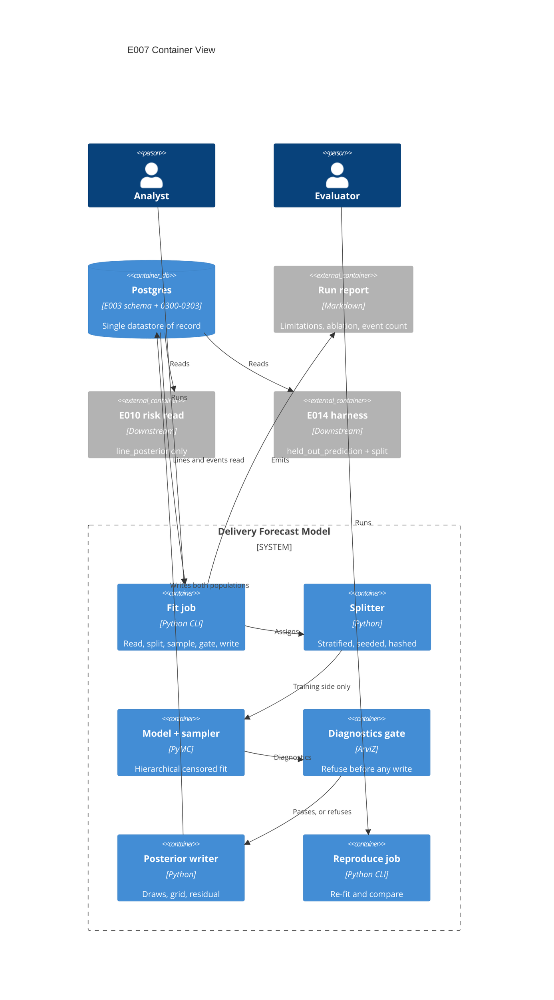

# Implementation Plan: Delivery Forecast Model

**Branch**: `00007-delivery-forecast-model` | **Epic**: E007 | **Spec**: [spec.md](spec.md) | **Date**: 2026-07-27

## Summary

- **Deliverable**: an offline Bayesian fit job in the modeling entry that reads the delivered procurement rows, splits them, fits a hierarchical censored duration model on the training side, and writes per-line posterior draws plus derived day-grid survival arrays into Postgres under a run manifest — or refuses and writes nothing.
- **Shape**: one new package `model.forecast`, two console entry points, four migrations in the claimed `0300`–`0399` block, one five-part remediation to a shared check under `/tests`.
- **Hard property**: a run that breaches any blocking diagnostic leaves all five tables and the active-run pointer exactly as it found them, and a run that passes stores two populations that a reader can tell apart by which table they are in.

## Technical Context

| Field | Value |
|---|---|
| Language/Version | Python 3.12 (`src/model` only) |
| Primary Dependencies | PyMC ≥6.2, ArviZ ≥1.2, NumPy ≥2.4, pandas ≥3.0, SQLAlchemy 2 + psycopg 3, Alembic — **all already declared** in `src/model/pyproject.toml`; this epic adds none |
| Storage | PostgreSQL 16 — four migrations in block `0300`–`0399`; three new tables, fourteen columns on `forecast_run`, and **one additive unique key on E003's `purchase_order_line`** (G-14) |
| Testing | pytest + Hypothesis (property-based, mandatory for the deterministic computation modules) |
| Target Platform | Linux container; local Docker Compose on `${PRC_DB_PORT:-5434}` |
| Project Type | single — no web or API surface is touched |
| Project Mode | brownfield |
| Performance Goals | N/A — offline batch fit; wall-clock is recorded, not bounded |
| Constraints | Offline only, no model-provider call on any path, no request-time entry point reaching the fit; seeded and reproducible within a published tolerance |
| Scale/Scope | 199 lines, ~24 open, ~44 held-out delivered, ~1,500 lifecycle events; 4 chains × 1,000 draws = 4,000 |

Baseline from [specs/sad.md](../sad.md), narrowed to what this epic touches. Nothing here departs from the registered stack; Assumption 5 of the spec is confirmed rather than assumed — PyMC and ArviZ are already dependencies of the modeling entry.

## Instructions Check

| Gate | Status |
|---|---|
| Governing version | `project-instructions.md` **v1.2.4** (2026-07-26). Its mypy obligation is scoped to `/src/gateway` and does not reach this epic. |
| Spec compliance | **PASS, re-audited at this gate.** `spec.md` § Compliance Check was written before the eight clarification answers and the fifteen stress-test resolutions, and STF-014 records a re-audit as owed. It was performed here, not carried forward: nine of its eleven open items are closed, and the two that were not — the stale exact-equality acceptance scenario and the split's pre-commitment — are corrected in `spec.md` and settled by AD-011 respectively. See § Compliance Result. |
| Plan compliance | See § Compliance Result, populated by the post-design audit. |
| Governance — block claims | Migration block `0300`–`0399` and decision records from `0018` were claimed at epic start. **The decision-record claim is now bounded**: `0018` only. E005 made an identical unbounded claim and E008/E009 branch from the same baseline, so leaving it open would let two epics take the same number. |
| Complexity Tracking | Omitted — no principle violation requires justification. |

## Architecture



## Architecture Decisions

Feature-local tradeoffs. The one decision with project-wide reach — storing forecasts as two anchor-distinguished populations in two tables — is registered as **{SAD:ADR-0018}** and referenced here rather than restated.

| ID | Question | Options | Decision | Rationale |
|---|---|---|---|---|
| AD-001 | What does the model put a distribution on — the total line duration, or the individual lifecycle sojourns? | Total-duration AFT with anchor-evaluated covariates / **multi-state sojourn model** | **Sojourn model**: one lognormal per lifecycle transition with a hierarchical vendor and category term, plus a rework-versus-forward sub-model at each decision point | The total-duration route cannot honour FR-002 without either leaking or degenerating. Path covariates — lifecycle state, days in state, approval-cycle count — are evaluated **at the anchor**, and a held-out delivered line's anchor is its own order date, where all three are constant (`submitted`, 0, 0). So they contribute nothing for training lines while being informative for open ones, which is a covariate set that exists only for the population it is not fitted on. Using their *realized totals* for delivered lines instead uses the outcome path to predict the outcome. The sojourn model dissolves the problem: lifecycle state selects the sojourn stratum, days in state is the truncation point of the current sojourn's likelihood, and approval-cycle count is a covariate on the rework probability. It also fits ~1,300 completed sojourns rather than ~155 training totals, which is where the effective sample size for a twelve-vendor hierarchy has to come from. Cost accepted and disclosed: it matches E005's generative structure more closely than a total-duration fit would, which strengthens L-1 rather than avoiding it. |
| AD-002 | How is an open line's **conditional remaining** duration drawn (FR-029)? | Rejection sampling until the draw exceeds elapsed time / **inverse-CDF conditioning** / re-basing a total draw | **Inverse-CDF**: draw `u ~ U(0,1)`, set `F* = F(e) + u·(1 − F(e))`, take `T = F⁻¹(F*)`, store `T − e` | Rejection sampling's acceptance rate is `1 − F(e)`, which collapses exactly on the longest-open lines — the ones the forecast exists for — so the method degrades worst where it matters most, and its runtime depends on the data in a way that makes a seeded run's cost unpredictable. Inverse-CDF is exact, is one evaluation per draw, and is a pure function of `(u, θ, e)`, which is what makes `posterior.py` property-testable. Re-basing is the alternative FR-029 exists to forbid: it passes every delivered constraint and gives the longest-open lines curves reading as already delivered. |
| AD-003 | Where do the fit and the reproduction check live? | Extend `model.procurement` / **new `model.forecast` package** with two console entry points | `forecast-fit` and `forecast-reproduce` in `model.forecast` | {SAD:ADR-0011} makes model-owned jobs console entry points rather than container jobs, and `model.procurement` owns dataset generation — a package that both generated the data and fitted on it would put the generator's constants one import away from the fit. Two entry points rather than one: FR-023's refusal on a moved hash and FR-022's per-line comparison are a *different job* from producing a run, and folding them into a flag on `forecast-fit` would put the reproduction check behind the thing it checks. |
| AD-004 | What absolute day tolerance does FR-022 publish? | 1 day / 3 days / **5 days** / a per-line relative fraction | **5.0 days**, applied to each line's median and 80th percentile, with the derivation and its **basis condition** published beside it | Derived, and the derivation is stated completely enough to be recomputed — an earlier revision of this row gave 3.0 days from an arithmetic that omitted two factors and never named its density, which is the same defect class as STF-001 and the retired flat-10% ablation floor: a published number that would fail a correct implementation. The three ingredients: **(i)** the quantile MCSE is `√(p(1−p)/n_eff) / f(q)`, where `f` is the predictive density at the quantile — taken as lognormal back-solved from the dataset's published median 58.0 and P80 90.4, giving `σ = 0.527`, hence `f(q₅₀) = 0.0130` and `f(q₈₀) = 0.00587`; **(ii)** the comparison is between **two** runs, so the difference carries `√2 ×` that; **(iii)** the claim is a maximum over ~136 per-line comparisons (≈68 lines × 2 quantities), and the maximum of 136 standard normals sits near 2.7σ. At `n_eff = 4,000` this gives 0.61 d and 1.08 d per run, 1.53 d on the two-run difference at the binding P80, and ≈4.1 d at the maximum — so 5.0 days carries ≈3.3σ of headroom and expects ≈0.15 breaches on a correct reproduction. **Basis condition, published with the number**: `n_eff` here is the *predictive* effective sample size, not the parameter ESS the diagnostics gate floors at 400. The two differ because each stored draw carries independent residual and inverse-CDF randomness, which decorrelates the predictive sequence; the reproduction harness therefore **computes the realized per-line predictive ESS** and, where any line falls below `0.5 × draw_count`, reports the comparison as **outside the tolerance's stated basis** rather than passing or failing it — the scope-limit treatment FR-032 already uses for an out-of-pin digest. An absolute tolerance rather than a relative one because a relative tolerance is loosest on the longest lines, which are the ones a reader acts on. **Pre-registered here, before any reproduction result exists**; never widened after seeing a comparison. Distinct from the release gate at `specs/sad.md` § CI Requirements (±0.01 absolute on retrieval metrics, ±2% relative on CRPS skill) — that gate bounds *evaluation metrics* and this bounds *forecast reproduction*; no value is shared and neither is derived from the other. |
| AD-005 | Where do the split fraction **and the split seed** live, given the schema cannot tell pre-registration from post-hoc adjustment (G-11)? | Run flags / **committed configuration constants** | `HELD_OUT_FRACTION = 0.25` **and `SPLIT_SEED`** in `model.forecast.config`, written to `forecast_run.held_out_fraction_declared` and `.split_seed_entropy` on every run | A run flag makes the value a per-invocation choice, which is precisely the move FR-028 prohibits and which the database cannot detect. As committed constants, changing either is a diff with an author and a date, and the prohibition is enforced by review of the commit history — the only mechanism available, and recorded as such rather than presented as a schema guarantee. **The seed is included for the same reason as the fraction, and an earlier revision of this row left it out**: a per-run seed lets a re-fit reshuffle the split until a vendor lands favourably, which is FR-028's prohibition reached by a different route. With both fixed, the split is a pure function of `(input_data_hash, SPLIT_SEED, HELD_OUT_FRACTION)`. |
| AD-011 | What makes the split "committed evidence rather than a by-product" (Principle VI), given SC-015 forbids writing it before the gate? | Commit the split in its own transaction before sampling / **derive it deterministically from pre-registered inputs** | The split is a **pure function of the input hash and two committed constants** (AD-005); a re-fit at the same as-of date against the same input hash must reproduce the same `split_assignment_hash`, asserted as an integration check | Committing the split before sampling is the intuitive reading and it is **prohibited**: SC-015 requires that a refused run leave no row in *any* store it writes to, `forecast_split_assignment` included. So the property cannot come from write ordering, and an earlier draft of `data-model.md` claimed it did — ordering inside one transaction has no external visibility, and that transaction opens only after the gate. What actually rules out a split chosen to suit a fit is determinism from inputs fixed before the fit existed: there is no freedom left to exercise. The re-fit assertion is what makes it checkable rather than argued. |
| AD-006 | Which parameters does the diagnostics gate quantify over? | Every model variable including per-line predictives / **the fitted parameter set only** | The hierarchical location and scale parameters, the transition-level intercepts, the rework sub-model coefficients — **not** the per-line predictive draws | Predictive draws are constructed by transformation from the parameters plus fresh randomness; their R-hat and ESS are diluted by that randomness and would let a genuinely unconverged parameter hide behind ~68 well-behaved derived quantities. FR-016 requires the monitored set to be *named*, which is what makes this checkable — the set is enumerated in `config.py` and written to `forecast_diagnostic.parameter_name`, and DV-011 asserts no parameter is partially covered. |
| AD-007 | How is the shared migration-range check extended (G-1)? | Add `0300`–`0399` only / add E005's block too / **the whole remediation** | **Five parts in one change**: declare four blocks; split *declared* from *populated-expected*; move the outside-the-blocks probes from `0200` to `0400`; rename the two tests asserting "two epics"; and correct the module docstring, which describes the directory as split "between two epics" per {SAD:ADR-0013} | Adding `0300`–`0399` alone fails the partition assertion, which requires `next_low == high + 1` and so refuses the gap at `0200`–`0299`. Adding E005's unused block to close the gap then fails **two** further assertions — the both-blocks-populated test, because E005 authored no revision, and the parametrized outside-the-blocks probe at `0200`, whose entire purpose is that `0200` sits outside every declared block. Doing (a) alone turns one red assertion into two. The file lives at `/tests` under the cross-entry exception and is owned by no single epic, which is what makes it E007's to change. Part (e) is in scope because the docstring is a claim *inside the file being changed*; the corresponding statement in ADR-0013 itself is a registered document and is recorded as **P-6** rather than edited. |
| AD-008 | What derives SC-008's ablation floor (FR-033)? | A flat percentage / from the fitted model / **a non-parametric estimate on the training split** | Kaplan–Meier median over the training lines versus the naive completed-duration mean over the same lines, **computed before and independently of the fit** | The flat 10% an earlier revision carried had nothing deriving it and sat above the one measured analogue available — the upstream dataset's 58.0 population median against a delivered-only 53.0, a gap of 8.6% — so it would have failed a correct implementation. Deriving the floor from the fitted model compares a measurement against a derivation from the same quantity. Kaplan–Meier is the standard estimator that uses censored lines without assuming a family, so the floor comes from the *input's* censoring bias rather than from the model's. |
| AD-009 | Where does FR-030's run-shape pin live, given no delivered constraint binds it (G-4)? | A CHECK on `forecast_run` / **an E007 test over emitted runs** | DV-014: a test asserting every emitted run's `draw_count` and `horizon_days` equal `schema_constants.draw_count` and `.survival_horizon_days` **read over the connection** | A CHECK would fail E003's own delivered fixture, which passes runs at 5 draws over a 3-day horizon using an unequal pair precisely so a transposition cannot pass. Comparing against the published row rather than against literals `4000`/`365` is what keeps the assertion from becoming a fourth copy of a constant that already has a home. |
| AD-010 | What write order gives FR-013 and FR-017 their guarantees? | One transaction for everything / **two transactions, artifacts then pointer** | Transaction 1 writes the run row, split assignments, diagnostics, and both artifact stores; transaction 2 sets `is_active`. Both after the gate, nothing before it | The refusal guarantee is achieved by *ordering* rather than by rollback — the gate runs before any statement is issued, so a refused run has nothing to roll back. Splitting the pointer into its own transaction means a run can be written and reviewed before it becomes the one downstream readers see, which is what makes FR-015's "explicit, not implied by recency" operable rather than nominal. |

## Data Model Summary

| Entity | Key Fields | Relationships | Notes |
|--------|-----------|---------------|-------|
| `forecast_run` *(delivered, +14 columns)* | `run_id` PK; UK `(run_id, draw_count, horizon_days)`; partial UK on `is_active` | 1:N `line_posterior`, `held_out_prediction`, `forecast_split_assignment`, `forecast_diagnostic` | The manifest. E007 adds the split hash and seed, both held-out fractions, the uncensored event count, the covariate list, per-vendor shrinkage, the fixture digest, the layer and datasheet reference, the serialization label, the open-line draw semantic and two line counts. `open_line_count > 0` makes FR-021 structural. Adding these columns requires an empty table and touches E003's test fixtures — **G-2**. |
| `line_posterior` *(delivered, unaltered)* | PK `(run_id, po_line_id)` | N:1 run, N:1 line | Open lines only, anchored at the run's as-of date, draws are **conditional remaining** durations. E010's read contract. |
| `held_out_prediction` *(new, `0302`)* | PK `(run_id, po_line_id)` | N:1 run by shape FK; N:1 line by `(po_line_id, order_date, is_closed)` | Held-out **delivered** lines, anchored at each line's own order date, draws are **total** durations. The anchor and the delivered flag are foreign-key facts, not assertions. Residual agreement mirrors the delivered `1e-9` tolerance. |
| `forecast_split_assignment` *(new, `0301`)* | PK `(run_id, po_line_id)`; UK `(run_id, canonical_ordinal)` | N:1 run, N:1 line | Every line once per run, in ascending `(project_id, po_number, line_number)`. Carries the stored censoring indicator. Written before any artifact row. |
| `forecast_diagnostic` *(new, `0303`)* | `diagnostic_id` PK; UK `NULLS NOT DISTINCT (run_id, metric, parameter_name)` | N:1 run | Per-parameter R-hat / bulk ESS / tail ESS and run-level divergences / E-BFMI / treedepth, each beside its threshold. `passed` is arithmetic; treedepth is the only non-blocking metric; a stored blocking row always passed. |
| `purchase_order_line` *(delivered, +1 unique key)* | `uq_purchase_order_line__order_anchor (po_line_id, order_date, is_closed)` | FK target only | **The one object E007 adds to another epic's delivered table** — additive, rejects no previously legal row, and exists so the held-out anchor is a foreign-key fact rather than an assertion. Surfaced at plan level rather than only in migration prose, because a cross-epic schema change is exactly what a reviewer needs to see without opening the data model — **G-14**. |

**Detail**: [data-model.md](data-model.md) — 25 validation rules (`DV-001`–`DV-025`), 15 disclosed gaps (`G-1`–`G-15`), 4 four-part limitations (`L-1`–`L-4`), and the complete constraint inventory. **That document is normative** on column sets, constraint names, the canonical draw order, the two anchor semantics, and the write order. Where this plan names them it is quoting, and defers on any difference.

**Migration sequence**: `0300` adds the fourteen `forecast_run` columns and the shrinkage helper — it **requires an empty `forecast_run`**, which holds today because no run has ever been written; `0301` creates `forecast_split_assignment`; `0302` creates `uq_purchase_order_line__order_anchor` and `held_out_prediction` in one revision, because the unique key must exist before the FK targeting it; `0303` creates `forecast_diagnostic`. `0300`'s `down_revision` is the current single head, E004's `0103` — **not** E003's `0010`.

**Sampling shape, fixed here so tasks do not re-derive it**:

| Quantity | Value | How it was fixed |
|---|---|---|
| Chains | 4 | The published minimum (blocking precondition); also the basis the R-hat and ESS thresholds are stated at |
| Post-warmup draws per chain | 1,000 | 4 × 1,000 = 4,000, the declared `draw_count` |
| Tuning draws per chain | 1,000 | Recorded in the manifest as `tuning_count`; not a published constant |
| Bulk/tail ESS floor as a fraction | 400 / 4,000 = 10% | Attainable at this shape; a floor of 400 against 4,000 draws is the four-chain convention, not a coincidence |
| Grid horizon | 365 days | E003's constant, read over the connection, never a literal (AD-009) |

## API Surface Summary

N/A — no API surface. Two console entry points, no HTTP, no RPC. E010 and E014 read the database, not an interface this epic exposes. FR-025 makes the absence of a request-time path an enforced property rather than an omission — see DV-022.

## Testing Strategy

| Tier | Tool | Scope | Mock Boundary | Install |
|------|------|-------|---------------|---------|
| Unit | pytest | Manifest assembly, report rendering and its four-part checker, path resolution, config surface, the fixture-digest provenance warning, the out-of-pin scope-limit report — the modules the admission rule below leaves **out** of the property tier | Pure functions, no database | configured |
| Property | Hypothesis | Every module qualifying as a **deterministic computation module** under E005's three-clause admission rule — `split.py`, `serialize.py`, `censoring.py`, `posterior.py`, `diagnostics.py`, `shrinkage.py`, `ablation.py` — **seven**. **Mandatory** under the Testing & Quality Policy, with strict test-first | Pure functions; the sampler is never invoked from this tier | configured |
| Build-gating | pytest, run in CI | Assertions over the emitted artifact set and the repository rather than over a function: the no-verdict absence check (DV-021), the import contract forbidding a request-time or provider path (DV-022), and the five-part migration-range remediation (AD-007) | Repository tree and emitted artifacts; no database | configured |
| Integration | pytest + live PostgreSQL | The write order and its atomicity, the refusal guarantee snapshotted across all five tables and the pointer, both stores' array invariants, split completeness and contiguity against `purchase_order_line`, diagnostics completeness, the anchor FK's rejection of a planted mis-anchored row, the run-shape pin read over the connection, and the reproduction harness | Real database on `${PRC_DB_PORT:-5434}`; no fake stands in for a constraint | configured |
| Security | Ruff `S` | `src/model` — already enabled for this entry | N/A | configured |
| Coverage | coverage.py | `src/model/src/model/forecast` added to the root `source` list **and** given a `[tool.coverage.paths]` entry. E003 and E005 both recorded that these are one change and not two; the `source` half alone leaves the package in the denominator uncounted | N/A | configured |

### What qualifies as a deterministic computation module

E005's three-clause rule is applied here — **pure**, **computes rather than transcribes**, **wrong is silent** — but it is applied as a *widening* filter, not as the definition. The Testing & Quality Policy names "risk arithmetic, fusion ranking, and scoring functions" directly, and a module the policy names is admitted whether or not E005's clause 3 also catches it. Clause 3 is a necessary condition E005 invented and the policy does not contain; using it to *exclude* something the policy names would narrow the mandate under cover of a rule from another epic.

**Two modules exist because of that correction**, and both are extractions rather than additions:

- **`likelihood.py`** — the per-row log-contribution of a duration given its censoring status: a density for a completed line, a log-survival for a censored one. This is the epic's risk arithmetic in the policy's own sense, and a censored line written as a density at its censoring time **builds cleanly and produces a plausible posterior**. The spec says so itself in US2's *Why P1*: "a fit that ignored censoring would satisfy every one of Story 1's assertions". Leaving it inside `model.py` and calling it exempt because "a malformed graph raises at build time" answers a different question — malformed graphs raise; mis-specified ones do not. It is extracted as a pure NumPy function, property-tested directly, and the PyMC graph's `logp` is asserted to agree with it (an alternate-implementation property, which is the only check that reaches the graph at all).
- **`compare.py`** — the nearest-rank percentile lookup and the tolerance comparison behind FR-022, SC-018 and DV-018. Extracted out of `reproduce.py`, which is I/O-bound and therefore unreachable by the property tier. `draws[ceil(p·draw_count)]` off by one yields a plausible day value that no constraint rejects, and this is the oracle the epic's entire reproducibility claim rests on — the same standing `serialize.py` had in E005.

| Module | Pure | Computes | Wrong is silent | Qualifies | Tier |
|---|---|---|---|---|---|
| `split.py` | yes | stratified assignment, canonical ordinal, realized fractions | yes — a mis-stratified split still assigns every line exactly once and still hashes | **yes** | Property (mandatory) |
| `serialize.py` | yes | canonical row serialization and digests | yes — a non-canonical digest is still 64 hex characters | **yes** | Property (mandatory) — this is the oracle FR-023's refusal rests on |
| `censoring.py` | yes | elapsed time and the censoring indicator at the as-of date | yes — a wrong indicator still stores a boolean the schema accepts | **yes** | Property (mandatory) |
| `posterior.py` | yes | inverse-CDF conditioning, canonical sort, survival grid, residual tail mass | **yes** — a wrong grid that is non-increasing, inside `[0,1]` and whose tail matches the stored residual satisfies every delivered constraint | **yes** | Property (mandatory) |
| `diagnostics.py` | yes | threshold comparisons and the pass verdict | **yes** — `ck_forecast_diagnostic__blocking_rows_passed` rejects a *stored failing blocking row*, so a wrongly-**passed** row is exactly what it admits | **yes** | Property (mandatory) |
| `shrinkage.py` | yes | ρⱼ = τ²/(τ² + σ²/nⱼ) per vendor | yes — any value in `[0,1]` satisfies `fn_vendor_shrinkage_wellformed` | **yes** | Property (mandatory) |
| `ablation.py` | yes | the Kaplan–Meier floor and the realized delta with its interval | yes — a wrong floor is a plausible number that makes SC-008 pass or fail silently | **yes** | Property (mandatory) |
| `likelihood.py` | yes | the per-row log-contribution: density if completed, log-survival if censored | **yes** — a censored line written as a density builds cleanly and yields a plausible posterior (spec, US2 *Why P1*) | **yes** | Property (mandatory) — admitted by the policy's own naming, not only by clause 3 |
| `compare.py` | yes | nearest-rank percentile lookup and the day-tolerance comparison | **yes** — an off-by-one yields a plausible day value no constraint rejects | **yes** | Property (mandatory) — the oracle FR-022 and SC-018 rest on |
| `model.py` | yes | PyMC graph wiring around `likelihood.py` | no — with the likelihood extracted, what remains is graph construction, and a malformed graph raises | no | Unit + Integration (its `logp` is asserted against `likelihood.py`) |
| `sample.py` | **no** — invokes the sampler | orchestration | n/a | no | Integration |
| `read.py`, `write.py` | **no** — database I/O | orchestration | n/a | no | Integration |
| `manifest.py`, `report.py` | yes / no — file write | assembly and rendering | partly, and covered by DV-024/DV-025 as unit assertions over the emitted artifact | no | Unit |
| `config.py`, `paths.py` | yes | no — constants and path resolution | n/a | no | Unit |
| `fit.py`, `reproduce.py` | no | orchestration around `compare.py` | n/a | no | Integration |

### Mandated properties: relation class and input domain

| Module | Property | Relation class | Input domain and boundary cases |
|---|---|---|---|
| `split.py` | Every line lands on exactly one side; `canonical_ordinal` is contiguous from 1 and follows ascending `(project_id, po_number, line_number)` | Invariant | Ties impossible by construction — the natural key is unique; strata of size 1; a stratum smaller than `1/0.25` |
| `split.py` | Each stratum's realized proportion matches the declared fraction to within one line, in **both** strata | Invariant | 24 censored against 175 delivered; the degenerate case of zero censored lines |
| `split.py` | Reordering the input rows changes no line's side | Metamorphic | Shuffled input; the same seed across two orderings |
| `split.py` | The assignment is a pure function of `(input_data_hash, SPLIT_SEED, HELD_OUT_FRACTION)` — a re-fit at the same as-of date against the same rows reproduces the same `split_assignment_hash` (AD-011) | Invariant | A second call with identical inputs; one mutated row; a changed fraction |
| `serialize.py` | The digest is invariant to row order and to `created_at`, and moves on any value inside the serialization | Metamorphic | A reload of identical content; a single mutated cell; a NULL against an empty string |
| `censoring.py` | A line is censored exactly when its terminal event is absent at the as-of date, and elapsed time equals `as_of_date − order_date` | Invariant | As-of dates before the order window, on a terminal event's own date, and far after the window |
| `censoring.py` | A later as-of date never moves a line from delivered to censored | Metamorphic (monotone) | As-of swept across and beyond the window |
| `posterior.py` | `survival[k] == count(draws > k)/draw_count` for every `k`, and the array is non-increasing inside `[0,1]` | Invariant (algebraic identity) | `k = 1` and `k = horizon`; every draw beyond the horizon; every draw at zero |
| `posterior.py` | `residual_tail_mass` computed from the draws agrees with `survival[horizon]` within `probability_sum_tolerance`, by a **different code path** than the one that wrote it | Alternate implementation | Residual exactly 0 and exactly 1 |
| `posterior.py` | Conditioning is monotone: for fixed θ, increasing elapsed time never decreases the drawn remaining duration's median (AD-002's inverse-CDF property; the re-based alternative violates it) | Metamorphic | Elapsed time at 0, at the median, and past the P99 |
| `diagnostics.py` | A metric breaching its threshold in the declared direction never yields `passed`, in **both** directions (maxima and minima) | Invariant | Exactly at the threshold; `NaN`; a missing parameter |
| `shrinkage.py` | ρ is monotone increasing in nⱼ and lies in `[0,1]`; a vendor with no training line yields a weight, not an omission | Invariant | nⱼ = 0; nⱼ = 1; the 35-line vendor; τ → 0 and τ → ∞ |
| `shrinkage.py` | The published triple is ordered `hpdi_low ≤ median ≤ hpdi_high`, all inside `[0,1]`, and the interval **widens** as nⱼ falls | Invariant | The 5-line vendor against the 35-line vendor; a vendor with no training line, where the interval must be widest rather than absent |
| `ablation.py` | The Kaplan–Meier floor is computed from the training split alone and is invariant to any held-out row | Invariant | All-censored and all-delivered training sets |
| `likelihood.py` | A censored row's contribution equals `log S(t)` and a completed row's equals `log f(t)`; the two are never interchanged, and the censored contribution is **monotone decreasing** in the censoring time while the density is not | Invariant | `t = 0`; `t` past the P99; a censoring time equal to an observed event time |
| `likelihood.py` | The PyMC graph's `logp` agrees with this pure implementation to floating tolerance over the whole parameter domain | Alternate implementation | Extreme σ, τ; a vendor with one row; a stratum with none |
| `compare.py` | The nearest-rank percentile of a sorted array of length `n` is the element at `ceil(p·n)`, 1-indexed, and equals the value a direct sort-and-index computes | Alternate implementation | `p = 0.5` and `0.8` at `n = 4000`; `n` odd; every draw equal; `p·n` exactly integral — the off-by-one boundary |
| `compare.py` | The comparison passes exactly when every per-line delta is within the tolerance, and a single line outside it fails the whole claim | Invariant | Delta exactly at the tolerance; one outlier among 135 conforming lines |

### The test-first observable

Strict red-green-refactor binds all seven qualifying modules, and a process obligation no artifact evidences is indistinguishable from one nobody followed. Following E004's and E005's precedent, `tasks.md` MUST carry an explicit **mandatory red-green pairs** list naming, for each of the seven modules, the property-test task ID that precedes its implementation task ID, and each test task MUST be observed failing before its implementation task begins. The branch history carries a `test:` commit preceding the `feat:` commit for each pair. **E005 closed at six of seven** because two tasks landed in one commit; the pairs list exists so that is a checkable miss rather than an invisible one.

## Negative Controls

A refusal that has never refused and a detector that has never detected are indistinguishable in a green report from ones that work. A claim qualifies when its passing direction is satisfiable without the mechanism under it working.

| # | Claim | Failing direction that must be demonstrated | Tier |
|---|---|---|---|
| NC-1 | SC-014 / SC-015 / DV-013 — a breaching run writes nothing | A **forced non-converging configuration** (two chains' worth of tuning, a deliberately unidentified parameterisation) exits non-zero and leaves all five tables and `v_active_forecast_run` byte-identical to the snapshot taken before it | Integration |
| NC-2 | SC-017 / FR-021 — a run with no open line refuses | An as-of date past every terminal event refuses rather than writing a run with `open_line_count = 0` | Integration |
| NC-3 | SC-019 / DV-015 / DV-017 — a moved hash refuses and **names which one** | Two separate cases: a mutated row and a mutated split assignment, each naming *that* input. One case cannot show the naming works | Integration |
| NC-4 | FR-023 / DV-016 — a moved fixture digest **warns rather than refuses** | A mutated fixture file against unchanged rows produces a provenance warning and a completed run. The two outcomes must be separately evidenced or the distinction is nominal | Unit |
| NC-5 | SC-002 / DV-023 — the held-out anchor is structural | A planted row whose `anchor_date` differs from its line's `order_date` is **rejected by the FK**, so a dropped constraint fails rather than passing silently | Integration |
| NC-6 | SC-008 / DV-020 — the ablation delta is real | The censoring-ignoring fit's aggregate median is demonstrated **shorter**, and a constructed input with no censoring produces a delta at zero rather than a passing number | Property |
| NC-7 | SC-026 / DV-021 — no emitted artifact carries a verdict | A planted artifact containing a coverage threshold **fails** the absence check, so "none present" is not achieved by a checker that inspects nothing | Build-gating |
| NC-8 | SC-024 / DV-024 — every limitation carries four parts | A deliberately three-part record fails the checker | Unit |
| NC-9 | SC-030 / DV-019 — an out-of-pin digest mismatch reports a scope limit | An **injected** library version outside the recorded pin produces the scope-limit report and no failure; the same mismatch **inside** the pin fails | Unit |
| NC-10 | SC-028 / DV-014 — the run shape is pinned | A run emitted at 5 draws over a 3-day horizon **fails** the assertion, which is the shape E003's own suite passes | Integration |
| NC-11 | SC-005 / DV-010 — the sparse vendor's interval is wider | Asserted as a strict comparison between the extreme vendors, not as a threshold any interval width would satisfy | Property |
| NC-13 | AD-011 — the split is not a by-product of the fit | A second run at the same as-of date against the same rows reproduces the **same** `split_assignment_hash`, and a run against one mutated row reproduces a **different** one. Both directions, or determinism is asserted rather than shown | Integration |
| NC-12 | AD-007 / G-1 — the migration-range remediation | The change is verified by the probes at `0400` failing as outside-the-blocks **and** `0200`–`0299` passing as declared-but-unpopulated. Doing part (a) alone must be shown to leave the suite red | Build-gating |

## Error Handling Strategy

| Error Category | Pattern | Response | Retry |
|---|---|---|---|
| Blocking precondition unmet (fewer than four chains, no open line at the as-of date) | Fail-fast **before sampling** | Non-zero exit naming the precondition and its realized value; nothing sampled, nothing written | no |
| Input hash or split hash moved | Refuse before sampling | Non-zero exit naming **which** hash moved and both values | no |
| Fixture digest moved against unchanged rows | **Warn, do not refuse** | Provenance warning naming the break; the run proceeds, since the rows the fit read are unchanged | n/a |
| Blocking diagnostic breached (R-hat, bulk/tail ESS, divergences, E-BFMI) | Refuse **after sampling, before any write** | Non-zero exit naming the breached diagnostic, its realized value and its threshold; no run row, no posterior, no held-out prediction, no split assignment, no diagnostic row, pointer unmoved | no |
| Maximum treedepth hits | **Record, do not gate** | Written as the single non-blocking diagnostic row | n/a |
| Migration `0300` against a populated `forecast_run` | Refuse with a named error | The `ADD COLUMN … NOT NULL` route requires an empty table and TR-063 forbids a default; the guard makes the precondition explicit rather than letting Postgres report it as a not-null violation | no |
| Draw digest mismatch under a library version outside the recorded pin | **Report a scope limit** | The reproduction claim degrades to "out of pin" rather than failing — the treatment E005 established for the same problem | n/a |
| Per-line median or P80 outside the published tolerance under an **in-pin** environment | Fail | Non-zero exit naming the lines and the realized deltas | no |

## Integration Points

| Spec reference | System | Technical approach | Contract |
|---|---|---|---|
| FR-001, Assumption 1 | E003 delivered schema | Reads `purchase_order_line` and `lifecycle_event` over the connection; the input hash covers the rows read, so a re-derived copy cannot pass as the schema | [00003 data-model.md](../00003-core-data-schema/data-model.md) |
| FR-014 | E005 committed fixture and datasheet | The fixture file's digest and the datasheet reference are recorded beside the row hash, preserving the provenance chain without making the file the hashed object | `data/procurement/` |
| FR-012, {SAD:ADR-0018} | E010 risk read | `line_posterior` stays as-of-anchored and open-line-only; E010's `1 − survival[d − as_of_date]` is unchanged. Disjointness is structural on the held-out side only — **G-5** | [ADR-0018](../adrs/0018-two-anchor-distinguished-posterior-populations-in-two-tables.md) |
| FR-005, FR-006, FR-026 | E014 evaluation harness | E007 constructs the split and publishes the realized uncensored event count; E014 freezes and hashes the evaluation set and owns the calibration verdict. E007 asserts no coverage threshold | `specs/project-plan.md` § E014 |
| G-1 | `/tests` cross-entry checks | `test_migration_ranges.py` is extended under AD-007's four-part remediation | `tests/checks/` |

## Risk Mitigation

| Risk (from spec) | Likelihood | Impact | Mitigation | Owner |
|---|---|---|---|---|
| The registered coverage band is unmeetable at this sample size (Risk 1) | H | H | E007 publishes the realized held-out uncensored event count and states the shortfall as limitation **L-3**; it adjusts no band and asserts no threshold. The PRD amendment need is **recorded, not performed** — a feature branch may not amend a registered document, and may not route the resolution to another feature branch | `model.forecast.report` |
| Twelve vendors weakly identify the between-vendor spread (Risk 2) | H | M | Per-vendor intervals are reported with their realized shrinkage weights; no claim is made about how much vendors differ overall. Limitation **L-4** states the observation count below which no vendor-level claim stands | `model.forecast.shrinkage` |
| The training split leaves the smallest vendor with ~4 observations (Risk 3) | Certain | M | The vendor stays in the model; its shrinkage weight is recorded rather than borrowed from E005's datasheet, whose 0.22-at-n=5 figure is a property of *that* dataset's generative constants | `model.forecast.shrinkage` |
| **The rework sub-model does not converge**, taking the whole fit down with it | M | M | It is inside the monitored parameter set (AD-006), so it refuses rather than publishing quietly. A fallback to an empirical rework-count distribution is **not** taken mid-run: that would be a model change made after seeing a diagnostic, which is the same move FR-028 prohibits for bands | `model.forecast.model` |
| The fit's structure matches the structure its input was generated from | Certain | M | Disclosed as limitation **L-1** rather than avoided. AD-001 makes the match closer than a total-duration fit would, which is why the disclosure is strengthened rather than softened | `model.forecast.report` |
| `0300` runs against a populated `forecast_run` in some later environment | L | H | The migration guards and refuses with a named error; **G-2** records the add-nullable → backfill → `SET NOT NULL` route as the reversal | `0300` |

## Requirement Coverage Map

| Req ID | Component(s) | File Path(s) | Notes |
|---|---|---|---|
| FR-001 | read, model | `forecast/read.py`, `forecast/model.py` | Hierarchical over vendor and material category; reads the schema, never a copy — the input hash covers the rows read |
| FR-002 | model, likelihood, manifest | `forecast/model.py`, `forecast/likelihood.py`, `forecast/manifest.py` | Under AD-001 the three covariates map to the sojourn stratum, the current sojourn's truncation point, and the rework coefficient; `covariate_names` records which entered |
| FR-003 | censoring, **likelihood** | `forecast/censoring.py`, `forecast/likelihood.py` | Right-censored contribution via the survival function, not a density at the censoring time. Extracted as a pure function and property-tested, because a density written where a survival belongs builds cleanly and yields a plausible posterior |
| FR-004 | censoring, write | `forecast/censoring.py`, `forecast/write.py` | Indicator stored on `forecast_split_assignment`; the as-of date is functionally determined through `run_id` |
| FR-005 | split, config | `forecast/split.py`, `forecast/config.py` | Stratified on censoring status at `HELD_OUT_FRACTION = 0.25`, canonical ordinal, hashed. Fraction **and seed** are committed constants (AD-005), which is what makes the split deterministic from pre-registered inputs rather than committed early (AD-011) — SC-015 forbids writing it before the gate |
| FR-006 | split, manifest | `forecast/split.py`, `forecast/manifest.py` | Realized fraction, realized uncensored event count, assignment hash |
| FR-007 | split, model | `forecast/split.py`, `forecast/model.py` | The design matrix is built from the `train` side only — DV-008 asserts over the fit's input frame, not the database |
| FR-008 | posterior, write | `forecast/posterior.py`, `forecast/write.py` | Both populations; two tables per {SAD:ADR-0018} |
| FR-009 | serialize, posterior | `forecast/serialize.py`, `forecast/posterior.py` | Total order with the tie case recorded as vacuous over `float64` — **G-13** |
| FR-010 | posterior | `forecast/posterior.py` | `k = 1..horizon_days`; there is no `S(0)` element and none is asserted |
| FR-011 | posterior | `forecast/posterior.py` | Residual computed from the draws by a different path than the grid tail, so DV-003 is an agreement test |
| FR-012 | write | `forecast/write.py`, `schema/versions/0302_*.py` | Two anchor-distinguished stores; {SAD:ADR-0018} |
| FR-013 | write | `forecast/write.py` | Both arrays are NOT NULL columns of one row; transaction 1 (AD-010) |
| FR-014 | manifest, serialize | `forecast/manifest.py`, `forecast/serialize.py` | Row-serialization hash **plus** the fixture digest beside it; layer label and datasheet reference |
| FR-015 | write | `forecast/write.py` | Transaction 2 sets `is_active` explicitly; never implied by recency |
| FR-016 | diagnostics, config | `forecast/diagnostics.py`, `forecast/config.py` | Four-chain minimum as a precondition; the monitored set is enumerated (AD-006) and named on each row |
| FR-017 | diagnostics, fit | `forecast/diagnostics.py`, `forecast/fit.py` | The gate runs before any statement is issued — refusal by ordering, not by rollback; NC-1 |
| FR-018 | diagnostics | `forecast/diagnostics.py` | Treedepth is the only non-blocking metric, enforced as a database fact by `ck_forecast_diagnostic__blocking_matches_metric` |
| FR-019 | shrinkage | `forecast/shrinkage.py` | Realized ρⱼ per vendor as a **median with an HPDI**, including a vendor with no training line. ρ is a plug-in of two fitted parameters and so has a posterior; publishing it as a bare number is what Principle II refuses, and it is reported to the reader exactly where the uncertainty is largest |
| FR-020 | report | `forecast/report.py` | The observation count is **stated**, not left to the reader; limitation L-4 |
| FR-021 | fit, write | `forecast/fit.py` | `ck_forecast_run__open_line_count_positive` makes an empty forecast set unrepresentable; NC-2 |
| FR-022 | **compare**, reproduce | `forecast/compare.py`, `forecast/reproduce.py` | Per-line median and P80 within **5.0 days** (AD-004), plus exact equality of provenance fields. The percentile lookup and the tolerance test are extracted into a property-tested pure module — they are the oracle the claim rests on |
| FR-023 | reproduce, serialize | `forecast/reproduce.py`, `forecast/serialize.py` | Row hash and split hash **refuse and name**; a moved fixture digest **warns**; NC-3, NC-4 |
| FR-024 | *(package-wide)* | `src/model/pyproject.toml` `[tool.importlinter]` | A forbidden contract from `model.forecast` to `model.llm` and `gateway`, indirect detection on — DV-022 |
| FR-025 | *(package-wide)* | same contract, plus `/src/api` having no import path to `model.forecast` | Offline console entry point per {SAD:ADR-0011} |
| FR-026 | report | `forecast/report.py` | No column and no emitted artifact carries a threshold or verdict; checked as an **absence** by DV-021, NC-7 |
| FR-027 | report | `forecast/report.py` | Four-part form, checked rather than reviewed; DV-024, NC-8 |
| FR-028 | config, report | `forecast/config.py`, `forecast/report.py` | Pre-registration is a committed constant plus commit history (AD-005); the schema cannot carry it — **G-11** |
| FR-029 | posterior | `forecast/posterior.py` | Inverse-CDF conditioning for open lines (AD-002); total duration for held-out lines; both semantics stored as single-value CHECKs |
| FR-030 | *(test)* | `src/model/tests/forecast/test_run_shape.py` | Compared against `schema_constants` read over the connection, never against literals (AD-009); NC-10 |
| FR-031 | report | `forecast/report.py` | Limitation L-2; the maximum observed duration is **computed** from `lifecycle_event` rather than assumed, because the datasheet publishes no maximum — **G-10** |
| FR-032 | reproduce | `forecast/reproduce.py` | The digest claim is scoped to the recorded pin and degrades to a scope limit; NC-9 |
| FR-033 | ablation, report | `forecast/ablation.py`, `forecast/report.py` | Kaplan–Meier floor on the training split alone, independent of the fit (AD-008); delta reported with an interval over repeated seeds. The censoring-ignoring fit is **labelled in the report as an ablation comparator, not a baseline** — Principle VIII's duty attaches to any published comparison, and an ablation beaten by the full model is the weakest comparison available |

All 33 functional requirements appear. Success criteria map through `data-model.md` § Validation Rules (`DV-001`–`DV-025`) and § Negative Controls above.

## Project Structure

### Source Code

```text
+ src/model/src/model/forecast/__init__.py
+ src/model/src/model/forecast/config.py          # published constants: thresholds, chains, fraction, tolerance, monitored set
+ src/model/src/model/forecast/paths.py           # report and artifact path resolution
+ src/model/src/model/forecast/read.py            # lines + lifecycle events from the delivered schema
+ src/model/src/model/forecast/serialize.py       # canonical row serialization and digests        [property, mandatory]
+ src/model/src/model/forecast/censoring.py       # indicator and elapsed time at the as-of date   [property, mandatory]
+ src/model/src/model/forecast/split.py           # stratified split, canonical ordinal, hash      [property, mandatory]
+ src/model/src/model/forecast/likelihood.py      # per-row log-contribution: density or survival  [property, mandatory]
+ src/model/src/model/forecast/compare.py         # nearest-rank percentile + day tolerance         [property, mandatory]
+ src/model/src/model/forecast/model.py           # PyMC graph: sojourns, hierarchy, rework
+ src/model/src/model/forecast/sample.py          # seeds, chains, draws, tuning
+ src/model/src/model/forecast/diagnostics.py     # ArviZ metrics against thresholds              [property, mandatory]
+ src/model/src/model/forecast/posterior.py       # conditioning, canonical sort, grid, residual  [property, mandatory]
+ src/model/src/model/forecast/shrinkage.py       # per-vendor rho                                [property, mandatory]
+ src/model/src/model/forecast/ablation.py        # Kaplan-Meier floor and realized delta         [property, mandatory]
+ src/model/src/model/forecast/manifest.py        # run manifest assembly
+ src/model/src/model/forecast/write.py           # two transactions, both stores, pointer
+ src/model/src/model/forecast/report.py          # reader-facing limitations, event count, ablation
+ src/model/src/model/forecast/fit.py             # console entry point: forecast-fit
+ src/model/src/model/forecast/reproduce.py       # console entry point: forecast-reproduce
+ src/model/src/model/schema/versions/0300_forecast_run_provenance.py
+ src/model/src/model/schema/versions/0301_forecast_split_assignment.py
+ src/model/src/model/schema/versions/0302_held_out_prediction.py
+ src/model/src/model/schema/versions/0303_forecast_diagnostic.py
+ src/model/tests/forecast/                       # unit, property and integration tiers
~ src/model/pyproject.toml                        # two [project.scripts] entries; one importlinter contract
~ src/model/tests/schema/test_forecast.py         # G-2: two INSERT constants and FIXTURE_RUN gain fourteen values
~ src/model/tests/schema/test_constants_agreement.py  # G-3: the drift test enumerates every literal-bearing constraint
~ tests/checks/test_migration_ranges.py           # AD-007: the four-part block remediation
~ pyproject.toml                                  # coverage: BOTH the source list and a [tool.coverage.paths] entry
```

**Patterns to reuse**: `model.roster.reader.canonical_bytes` and `content_hash` for canonical serialization — the rule set already exists identically in two places and E005's AD-001 established that a third copy is the defect, not the fix. `model.procurement.paths` for artifact path resolution. E003's helper constraint functions are **reused** by the new tables rather than re-declared, so the two stores' invariants cannot drift apart.

**Tests to extend**: `src/model/tests/schema/test_forecast.py` (G-2), `src/model/tests/schema/test_constants_agreement.py` (G-3), `tests/checks/test_migration_ranges.py` (G-1/AD-007).

**Naming conventions**: constraint names `ck_<table>__<rule>`, `fk_<table>__<target>`, `uq_<table>__<key>`, `ix_<table>__<purpose>`; migration filenames `<prefix>_<snake_case_subject>.py`; forward-only migrations whose `downgrade()` raises.

## Propagation Obligations

Recorded here because each is a statement in **another epic's** delivered artifact that this epic's design makes false. None is performed on this branch where the artifact belongs elsewhere.

| # | Obligation | Owner | Trigger |
|---|---|---|---|
| P-1 | E003's data model states "only two constants are duplicated as DDL literals". A third and fourth occurrence land in `0302`. The sentence is E003's to correct | E003 | This epic's `0302` |
| P-2 | E003 § Drift control states `SURVIVAL_HORIZON_DAYS` and `DRAW_COUNT` "are asserted against the active run" — `test_constants_agreement.py` contains no such assertion (**G-4**) | E003 | Already false; E007 records it and adds its own assertion (AD-009) rather than editing E003's claim |
| P-3 | `data/procurement/datasheet.md` records the split's ownership as unassigned; `specs/project-plan.md` has since assigned construction to E007 (**G-15**). The datasheet is regenerated by E005's generator, not edited | E005 | The project-plan amendment of 2026-07-27 |
| P-5 | E005's `spec.md` and `tasks.md` state that decision-record numbers from `0018` were claimed by E005 and are "expected to go unused". E007 has taken `0018`, so both statements are now false. E005 is QC-passed, merged and immutable under `specs/project-plan.md`'s legend | E005 / whoever amends a closed epic | ADR-0018 landing on this branch |
| P-6 | {SAD:ADR-0013} records the `/tests` directory as split "between two epics". After AD-007 the declared block table names four. The stale docstring **inside** the file is corrected by AD-007 part (e); the ADR is a registered document and a feature branch may not amend one | Whoever owns the SAD | AD-007 landing |
| P-4 | `specs/prd.md`'s ~120-event assumption and its 73–87% band conflict with the ~44 events a 0.25 split realizes (Risk 1, **L-3**). A feature branch may record the need and may not perform it, and may not route it to another feature branch | Whoever owns the PRD | E007 publishing the realized count |

## Implementation Hints

- **[HINT-001]** Migration order: `0300` must run against an **empty** `forecast_run`, and its guard should read `SELECT count(*)` and raise a named error rather than letting Postgres report a not-null violation. `0302` creates `uq_purchase_order_line__order_anchor` **and** `held_out_prediction` in one revision — the unique key must exist before the FK that targets it, and splitting them leaves a revision that cannot be applied alone.
- **[HINT-002]** The G-2 fixture extension is not optional and is not deferrable: `src/model/tests/schema/test_forecast.py` builds `forecast_run` rows in two explicit-column `INSERT` statements *and* a `FIXTURE_RUN` mapping. All three omit the fourteen new columns and go red the moment `0300` applies. Extend all three in the same change as the migration.
- **[HINT-003]** `test_migration_ranges.py` needs all five parts of AD-007 in one change. Declaring `0300`–`0399` alone converts one red assertion into two, because the partition assertion then refuses the gap at `0200`–`0299` while the outside-the-blocks probe at `0200` still expects that number to be undeclared.
- **[HINT-004]** Draw the conditional remaining duration by inverse-CDF (AD-002), never by rejection: acceptance rate is `1 − F(elapsed)`, so the loop degrades worst on the longest-open lines, which are the ones the forecast exists for. The re-based alternative — subtract elapsed days from a total draw and clip at zero — passes `ck_line_posterior__draws_non_negative` and every other delivered constraint, so nothing downstream will catch it.
- **[HINT-005]** Compare the run shape against `schema_constants` **read over the connection**, not against the literals `4000` and `365` (AD-009). E003's own forecast suite passes runs at 5 draws over a 3-day horizon deliberately, using an unequal pair so a transposition cannot pass — a CHECK pinning either value would fail that fixture.

## Compliance Result

**Audited against**: `project-instructions.md` v1.2.4 (2026-07-26) · **Date**: 2026-07-27 · **Phase**: Plan · **Passes**: 2 · **Verdict**: PASS

Pass 1 returned **FAIL** with 1 CRITICAL, 3 HIGH, 5 MEDIUM and 4 LOW. Every finding was resolved in the artifacts rather than argued away; one was rejected on evidence.

| # | Finding | Resolution |
|---|---|---|
| C-1 | **Testing & Quality Policy — the property mandate was narrowed.** The seven-module set was admitted through E005's three-clause rule, whose clause 3 ("wrong is silent") is a *necessary* condition the policy does not contain. Two modules the policy's own wording names were excluded by it: the censored likelihood contribution, and the percentile arithmetic behind the reproduction claim | § What qualifies now applies E005's rule as a *widening* filter over the policy's naming, never as a ground for exclusion. `likelihood.py` and `compare.py` are extracted as pure modules and admitted — **nine**, not seven. The exclusion of `model.py` answered a different question: malformed graphs raise, mis-specified ones do not, and the spec's own US2 says a censoring-ignoring fit satisfies every Story 1 assertion |
| H-1 | **STF-014 was not discharged** — § Instructions Check claimed § Compliance Result discharged the owed spec re-audit while that section was empty | Performed here. Nine of the spec's eleven open items are closed; the two that were not are M-4 and H-3 below |
| H-2 | **AD-004's 3.0-day tolerance was under-derived** and would have failed a correct reproduction: the MCSE used the raw draw count rather than an effective sample size, omitted the √2 for a two-run difference, and never named the density `f(q)`, so the arithmetic was not recomputable from the text | AD-004 rewritten: `σ = 0.527` back-solved and named, the two-run factor included, the maximum-over-136 factor retained, and the value raised to **5.0 days** with ≈3.3σ of headroom. The predictive-versus-parameter ESS distinction is stated as a **published basis condition** the harness measures, degrading to a reported scope limit rather than passing or failing outside it. Caught the same defect class as STF-001 and the retired flat-10% floor — a published number that a correct implementation would fail |
| H-3 | **The split was neither committed before the fit nor pinned across re-fits.** `data-model.md` claimed write ordering made it "committed evidence"; ordering inside one transaction has no external visibility, and that transaction opens only after the gate | The claim was not merely nominal but, taken literally, prohibited — SC-015 forbids any row in any store after a refusal, `forecast_split_assignment` included. Corrected in `data-model.md` and replaced by **AD-011**: determinism from `(input_data_hash, SPLIT_SEED, HELD_OUT_FRACTION)`, with NC-13 asserting both directions. **AD-005 extended to the seed**, which a per-run value would otherwise have left free to reshuffle |
| M-1 | The `0018` claim was bounded in `plan.md` only; `spec.md` still carried the unbounded form, and E005's artifacts assert `0018` is claimed-and-unused | `spec.md` corrected in both places; E005's now-false statement recorded as **P-5**, since E005 is merged and immutable |
| M-2 | Per-vendor shrinkage was published as a bare number, though ρⱼ is a plug-in of two fitted parameters and is reported to a reader (Principle II) | `vendor_shrinkage` members are now `{median, hpdi_low, hpdi_high}`; the helper, DV-009 and the property list follow |
| M-3 | The coverage change named only the root `source` list | Both halves named — E003 and E005 each recorded that these are one change, not two |
| M-4 | US1 acceptance scenario 2 still asserted **exact equality** between the survival tail and the residual mass, where the delivered mechanism is a `1e-9` tolerance E003 ships a test against | Corrected in `spec.md`. This is the **fourth** appearance of an assertion about the residual/`S(0)` family that a correct implementation would fail; it survived Specify and Clarify inside an acceptance scenario rather than a criterion, which is where nobody was looking |
| M-5 | `uq_purchase_order_line__order_anchor` — the one object E007 adds to another epic's delivered table — was visible only in migration prose | Added to § Data Model Summary and § Technical Context |
| L-1 | Reported the checked-out branch as `main` | **Rejected on evidence.** `git branch --show-current` returns `00007-delivery-forecast-model`; the audit read a stale snapshot |
| L-2 | AD-007 left `test_migration_ranges.py`'s docstring claiming the directory is split "between two epics" per {SAD:ADR-0013} | AD-007 gains a fifth part for the docstring; the ADR itself is registered and is recorded as **P-6** rather than edited from a feature branch |
| L-3 | AD-004's tolerance was not related to the release gate in `specs/sad.md` § CI Requirements | Stated in AD-004: different quantities, no shared value, neither derived from the other |
| L-4 | The censoring-ignoring comparator was not labelled as an ablation | FR-033's coverage row now requires the report to label it, per Principle VIII |

**Per-principle verdicts after remediation**: I PASS · II PASS *(M-2 closed)* · III PASS · IV PASS · V PASS · VI PASS *(H-3 closed by AD-011)* · VII PASS · VIII PASS *(L-4 closed)* · Technology Stack PASS *(the no-new-dependency claim was verified against `src/model/pyproject.toml`, not accepted)* · Testing & Quality Policy PASS *(C-1 closed)* · Source Code Layout PASS · Data Provenance PASS · Development Workflow PASS · Governance PASS.

**Carried forward, disclosed rather than closed**: the fifteen gaps `G-1`–`G-15` in `data-model.md`, and the six propagation obligations `P-1`–`P-6` above — each of which is a statement in a document this branch may not edit.
