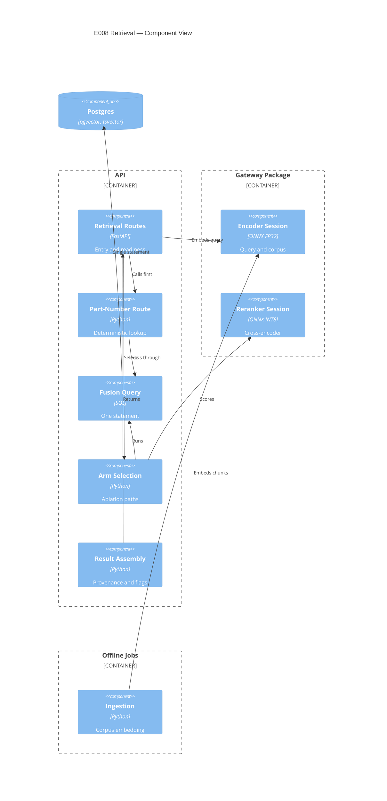

# Implementation Plan: Hybrid Retrieval and Reranking

**Branch**: `00008-hybrid-retrieval-and-reranking` | **Date**: 2026-07-29 | **Spec**: [spec.md](spec.md)

## Summary

**Goal**: A coordinator's question reaches the passage that answers it, with the page it was printed on.
**Approach**: One SQL statement fuses a `tsvector` arm and a `pgvector` arm by reciprocal rank; a deterministic part-number route runs first and falls through; a quantized cross-encoder in the serving process reranks the fused set, and declares itself when it cannot.
**Key Constraint**: Ranking is SQL-resident and single-statement, which removes the pure-function surface the quality policy would normally property-test — the compensating shape is prescribed by `specs/sad.md` and carried in §Testing Strategy.

## Technical Context

**Language/Version**: Python 3.12 (`/src/api`, `/src/gateway`)
**Primary Dependencies**: FastAPI, Pydantic, psycopg 3, ONNX Runtime, `tokenizers`, `pgvector`
**Storage**: PostgreSQL 16 with `pgvector` and native `tsvector` — read-only to this epic; no migration
**Testing**: pytest; `tests/checks` for architecture contracts; `import-linter`; `mypy` (gateway)
**Target Platform**: Linux container, one shared vCPU
**Project Type**: web (serving API consumed by E011 and E014)
**Project Mode**: brownfield
**Performance Goals**: reranking 50 candidates within **150–400 ms** on one shared vCPU (`specs/sad.md`)
**Constraints**: API container steady-state RSS **≤ 400 MB**, of which the reranker session is the dominant line item; no network at query time; fusion executes as **one** statement
**Scale/Scope**: 6,391 chunks over 26 documents today; the design band is 5,000–15,000

## Instructions Check

*GATE: Must pass before Phase 0 research. Re-check after Phase 1 design.*

**Audited against**: `project-instructions.md` **v1.2.8** (last amended 2026-07-29) ·
**Audit date**: 2026-07-29 · **Verdict**: PASS after remediation, with the amendments in
§Pending Amendments outstanding. Recorded because this document moved four times in four days
while this epic was in flight, and a compliance record that names no version cannot detect drift.

| Principle / Section | Verdict | Where |
|---|---|---|
| I. Traceable or It Does Not Ship | PASS | Every result projects document, type, project and page from the chunk row; SC-003 asserts identity with the stored value. The response type has no constructor that accepts a page from anywhere else (AD-004) |
| II. Uncertainty Is the Product | PASS | Recall with a Wilson interval, MRR with a percentile bootstrap, and an explicit unresolvable verdict where intervals overlap |
| III. Precision Over Recall Where a Mistake Is Silent | PASS | FR-007 refuses on encoder-identity mismatch rather than answering; FR-009 returns empty as empty; the route is additive |
| IV. Agent Output Style | PASS | Template sections only |
| V. The Model Extracts, Code Computes | PASS with a scheduled contract change | All ranking arithmetic is in one statement inside the deterministic boundary, and AD-005 settles where reranker score-sorting sits. **`api.retrieval` is the third computation package, so the forbidden contract must name it** — E010 recorded the precedent when it added the second: a boundary that guards one of two is a boundary in name. Scheduled in §Project Structure and mapped at FR-002 |
| VI. Evaluate Before You Tune | PASS with a scheduled deliverable | The fusion constant is already fixed at 60 by `specs/sad.md`'s sequence diagram, so FR-004's pre-registration is discharged against a registered document. **That answered the wrong clause on its own**: the principle governs *evaluation sets*, which must be frozen, hashed and committed before any tuning run, with the harness aborting on mismatch. SC-001 and SC-002 are measured at this epic's own gate on its own query set, so that set is E008's deliverable — see AD-010 and §Project Structure |
| VII. Publish the Miss | PASS | Degraded mode is declared in every response; the sparse arm's contribution is a published row rather than an assumption; three limitations carry reversal triggers |
| VIII. Honest Opponents | PASS | Reranking is reported against the strongest single arm, not only against fusion-only, which the spec itself calls weak |
| Technology Stack | PASS, riding on an unlanded amendment | No new datastore. The stack names "ONNX Runtime **for INT8 CPU inference**"; this epic runs an FP32 encoder and, per FR-025, an FP32 reranker arm beside the INT8 one. E006 already has an amendment outstanding against that same qualifier — recorded in its PR body — and E008 depends on it landing rather than raising a fourth |
| Testing & Quality Policy | PASS with two obligations | The SQL-resident property-test surface is preserved as an oracle (§Testing Strategy). **`metrics.py` is a separate obligation and an easier one** — Wilson intervals, percentile bootstrap and the overlap verdict are pure scoring functions with no SQL obstacle, so they carry the mandatory test-first cycle and property tests directly. Ruff is the named lint and format gate and is in the Testing Strategy table |
| Source Code Layout | **CONDITIONAL — amendment required** | New code under `/src/gateway` and `/src/api`; artifacts under `data/`. **But the clause reads "The gateway package carries neither a web framework nor the modeling stack", and the Technology Stack defines that stack as PyMC, ArviZ, pandas and NumPy.** `onnxruntime` pulls NumPy transitively, so ADR-0022's decision contradicts this clause directly. Recorded as amendment 4 and cited from ADR-0022; the design does not proceed on the strength of an ADR overriding a governing clause |
| Development Workflow | PASS | Branch matches workspace matches epic |
| Data Provenance | PASS | FR-016 requires identity, revision, licence basis, source and digest for the vendored model |
| Governance | **CONDITIONAL** | Three amendments recorded and not performed: the `specs/prd.md` MRR interval (FR-034), the `specs/project-plan.md` `part_numbers` owner (FR-035), and ADR-0022's `specs/sad.md` catalog row. All three land on the default branch |

**Re-check after design**: PASS. The two boundary crossings design introduced — inference in the gateway, and the serving image admitting its runtime — are recorded in ADR-0022 rather than waved through.

## Architecture



The encoder sits in the gateway rather than in either boundary because both call it and neither may
import the other — the property {SAD:ADR-0010} exists to protect. One session type, two callers, one
vector space. See **ADR-0022**.

## Architecture Decisions

Feature-local tradeoffs only. The project-wide decision this epic required is **ADR-0022 — Local
Inference Lives in the Shared Gateway Package, and the Serving Image Admits Its Runtime**.

| ID | Decision | Options Considered | Chosen | Rationale |
|----|----------|--------------------|--------|-----------|
| AD-001 | Where the per-arm tie-break is applied | Final ordering only / per arm and final | **Per arm and final** | A row limit needs a *unique* ordering or the candidate **set** varies between runs, not merely its order. Ties at the fiftieth position would otherwise change which 50 rows the reranker sees. FR-004's key therefore applies inside each arm's CTE |
| AD-002 | How the index search breadth is set | `SET LOCAL` per query / connection `options` | **Connection `options`** | A per-query `SET` is a second statement and collides with FR-002. `specs/00003-core-data-schema/data-model.md` prescribes setting it "at query time", which as written would violate FR-002. Declared normative over that line under {SAD:ADR-0017} and raised as amendment 6, rather than overridden in a table cell |
| AD-003 | Filtered-recall remedy | Relaxed iterative scan / strict iterative scan / partial indexes / wider breadth | **Strict iterative scan, with a version check first** | Relaxed order returns results out of distance order, against FR-020. Partial indexes are a new index, which the spec excludes. Iterative scan needs extension ≥ 0.8.0 — verified against the pinned digest as a task, not assumed |
| AD-004 | How page provenance is enforced | Prohibition plus a test / private factory plus a construction-site scan | **Private factory plus a scan** | Principle I's own enforcement clause is satisfied at the storage boundary by E003's constraints; this is additional. An earlier draft claimed the page was "unrepresentable" — in Python a response model always has a public constructor, so that overclaimed. The honest mechanism is a private factory taking a chunk row plus a source scan asserting no other construction site, the shape E006 used for its single-page-reader guarantee |
| AD-005 | Whether reranker score-sorting is inside the computation boundary | Inside / outside | **Outside, and named** | The contract forbids *model-facing* code reaching computation. Sorting by returned scores is neither ranking arithmetic nor model-facing; it is ordering a list. Stated here because leaving it unstated means the architecture test is later weakened to pass |
| AD-006 | Arm selection surface | Request parameter / service configuration / both | **Request parameter for arms, configuration for the index flag** | E014 must run five arms against one deployment, so arms are per-request. The exact/approximate flag is configuration: letting a caller vary it per request is exactly the drift {SAD:ADR-0005} accepts two paths only on condition of preventing |
| AD-007 | Reranker artifact location | `data/reranker/` / inside the gateway package / a release asset | **`data/reranker/`** | Mirrors `data/encoder/`'s digest-verification path and its exclusion from the package build. A model inside a Python package is shipped by the packaging system, which is not what a digest gate wants to verify. **Correction: an earlier draft claimed this mirrors a licence-basis record at `data/encoder/`. It does not — no such record exists there**, so FR-016 is stricter than the precedent rather than equal to it, and the encoder's own missing record is raised as amendment 5 |
| AD-010 | Where E008's own evaluation query set lives, and how it is frozen | Reuse E014's set / a set owned by this epic / measure without one | **A set owned by this epic, frozen and hashed before any measurement** | SC-001 and SC-002 are measured at this epic's gate, and E014's frozen set does not exist yet. Principle VI requires the set be committed and hashed with the harness aborting on mismatch, so it is a deliverable here rather than a borrowing |
| AD-011 | Whether the reranker ships one graph or two | INT8 only, fp32 measured elsewhere / both committed | **Both** | FR-025 requires a full-precision arm and {SAD:ADR-0006} requires the quantized-versus-full-precision difference measured rather than assumed. Two graphs means two sessions, which the 400 MB envelope must account for — see §Risk Mitigation, which previously described the session in the singular |
| AD-008 | Whether the aggregate metrics get an HTTP surface | Endpoint / library functions | **Library functions** | They compute over a query set, not a query; the spec's one `NEW-API` signal names a retrieval surface. E014 imports and runs them over the frozen set |
| AD-009 | Where SC-005's enumerated part-number set comes from | `chunk.part_numbers` / `extracted_value` / the pre-render document model | **Pre-render document model** | The first is null on every row and the second is empty while extraction is fixture-blocked. The generator's record, already E006's FR-067 reference set, makes the criterion measurable before extraction runs |

## Data Model Summary

N/A — no persistent data. This epic adds no table, column, index or migration; the spec's
Implementation Signals deliberately omit `MIGRATION`. `Chunk` is read-only and owned by E003 (shape)
and E006 (population); `RetrievalResult` is a response shape defined in `contracts/`.

## API Surface Summary

**Detail**: [`contracts/`](contracts/)

| Method | Path | Purpose | Auth | Req/Res Types |
|--------|------|---------|------|---------------|
| GET | `/api/v1/retrieval/search` | Ranked passages for a query, with provenance, the arms that produced them, and the ranking parameters in force | none | query parameters / `RetrievalResponse` |
| GET | `/api/v1/retrieval/diagnostics` | Process-level facts: artifact identity, licence basis and digest, memory against budget, thread counts, the fixed ranking parameters, the declared part-number pattern | none | — / `RerankingReport`, `ModelIdentity`, `VectorSearchSettings`, `LexicalArmSettings` |
| GET | `/readyz` | Ready, ready-degraded, or not ready — deliberately outside `/api/v1`, since a probe should not be version-bound | none | — / `Mode` |

Errors use one `Problem` shape throughout. `MatchKind` carries FR-013's deterministic-versus-ranked
distinction on every result; `WeightedFields` carries FR-005's empty-weighted-field disclosure;
`DeterministicRoute` reports whether the route fired and whether it fell through.

`GET` rather than `POST` for search, because a retrieval query is a read with no side effect and
E014 must be able to replay an exact request from a manifest. Diagnostics is separated from search
so a per-query response is not carrying process-level facts that do not vary per query — FR-019 and
FR-033's figures live there, and FR-029's per-result parameters stay on the search response.

No authentication tier: this is a single-user local demonstration and `specs/sad.md`'s deployment
view has none. Stated rather than omitted, so its absence is a decision.

## Testing Strategy

| Tier | Tool | Scope | Mock Boundary | Install |
|------|------|-------|---------------|---------|
| Unit | pytest + Hypothesis | Route recognition, arm selection, result assembly, degraded-flag propagation, the fusion oracle, and **`metrics.py`'s pure scoring functions** — Wilson interval, percentile bootstrap, overlap verdict — which carry the mandatory test-first cycle and property tests directly, having no SQL obstacle | ONNX sessions substituted; no database | configured |
| Integration | pytest + live Postgres | The fusion statement against real chunks: golden orderings, determinism across plan flips and rebuilds, filtered-recall counts, per-arm independence | none — real database, real index | configured |
| Lint / static analysis | Ruff, `import-linter`, `mypy` | `ruff check` and `ruff format --check` as separate gates; the forbidden contract extended to `api.retrieval`; `mypy` over the gateway's new inference package | — | configured |
| Security | `tests/checks` | Licence basis, source, quantization record and digest for both vendored graphs; no network at query time; no credential material | — | configured |
| Coverage | `coverage` | `api.retrieval` and `gateway.inference` against the 80% floor | — | configured |

**The property-test obligation is met by an oracle, not abandoned.** The quality policy names fusion
ranking as requiring property-based tests over pure functions, and FR-002 puts all ranking in one SQL
statement, leaving no such function. `specs/sad.md` prescribes the resolution and this plan carries
it: property tests recompute the fusion arithmetic in Python from the same per-arm rank vectors and
assert it matches the emitted order. That tests the formula without moving ranking out of SQL.

**Determinism is asserted three ways** (FR-020, SC-012): the same statement twice; again with planner
settings flipped, since an ordering that survives a plan change is defined by the query rather than
the plan; and again after a rebuild — but **only on the exact path**.

This narrows an unqualified requirement, so it is recorded as a limitation in the mandated format
rather than as a testing note, and it invokes {SAD:ADR-0017}, which exists precisely to let a
plan-phase artifact be declared normative over a specify-phase requirement.

- **Scope decision**: FR-020's identical-ordering guarantee is asserted across index rebuilds on the
  exact path only. The approximate path is asserted by candidate overlap and recall delta instead.
- **Supporting evidence**: graph construction is randomized by insertion order and parallel build
  workers, which {SAD:ADR-0005} records as the reason evaluation runs exact at all. The spec's own
  Edge Cases anticipate two paths differing after a rebuild; its requirement text does not qualify it.
- **Reversal trigger**: a build reproducible from a fixed seed with a single build worker, which
  would make the approximate path's ordering stable and the guarantee assertable on both paths.
- **Production-scale alternative**: publish the served path's ordering variance across rebuilds as a
  measured figure, so approximation's cost to stability is reported rather than excluded from the
  claim.

## Error Handling Strategy

| Error Category | Pattern | Response | Retry |
|----------------|---------|----------|-------|
| Encoder identity mismatch (FR-007) | **Refuse** | Error, naming both identities | no — a retry cannot change it |
| Reranker unavailable (FR-021) | **Degrade** | Success, fusion-only ordering, degraded flag set | no |
| Malformed or empty query | Fail fast | Error, field-level detail | no |
| Database unavailable | Fail fast | Error, no partial result | caller's choice |
| No matching passages (FR-009) | Not an error | Success, empty result reported as empty | no |

**Refuse and degrade are different shapes and must not be conflated.** A mismatched encoder produces
vectors in the wrong space and every ranking derived from them is meaningless, so the answer is
withheld. A missing reranker produces a worse ordering that is still an ordering, so it is served and
labelled. Collapsing the two would either refuse a serviceable request or serve a meaningless one.

## Integration Points

| Spec Reference | System/Service | Technical Approach | Contract |
|----------------|----------------|--------------------|----------|
| Chunk store (E003 shape, E006 population) | PostgreSQL | Read-only; no write, no migration | `0004_chunk.py` |
| Encoder identity (E006) | `data/encoder/` | Same pinned identity and revision as the chunks; asserted before search | ADR-0019 |
| Retrieval module (E011) | Grounded answering | Consumes `SearchResponse` including the degraded flag | `contracts/` |
| Ablation arms (E014) | Evaluation harness | Per-request arm selection; ranking parameters emitted for the manifest | `contracts/` |
| Shared inference (this epic) | `/src/gateway` | Encoder and reranker sessions, one implementation, two callers | ADR-0022 |

## Risk Mitigation

| Risk (from spec) | Likelihood | Impact | Mitigation | Owner |
|-------------------|------------|--------|------------|-------|
| The lexical arm contributes little or nothing | M | H | The sparse-only arm is a published row, not an assumed positive, so its contribution is measured before anything depends on it. FR-035 raises the `part_numbers` population gap where it can be fixed; FR-005 publishes the proportion of retrieved chunks whose weighted fields are all empty, so the inert weighting is visible rather than inferred | `api.retrieval.arms` |
| The reranker does not fit the compute envelope | M | H | Candidate truncation and batching; explicit thread counts because the runtime reads the host's core count and not the container's quota; FR-033 reports latency and resident memory against the declared budgets, and publishes an overage rather than omitting it | `gateway.inference` |
| The frozen set is too small to resolve the differences published | H | M | Intervals on every figure and an explicit unresolvable verdict, so a difference the set cannot support is never claimed. Owned jointly with E014, which owns the set | `api.retrieval` / E014 |

## Requirement Coverage Map

| Req ID | Component(s) | File Path(s) | Notes |
|--------|--------------|--------------|-------|
| FR-001, FR-002 | Fusion query | `src/api/src/api/retrieval/fusion.py` | Two CTEs, one full outer join, one statement |
| FR-003 | Fusion query | `src/api/src/api/retrieval/fusion.py` | Fetch depth 50, a ranking constant not a knob |
| FR-004 | Fusion query, parameters | `retrieval/fusion.py`, `retrieval/parameters.py` | Constant fixed at 60 by `sad.md`; tie-break per arm (AD-001) |
| FR-005 | Lexical arm, reporting | `retrieval/arms.py`, `retrieval/report.py` | Publishes the empty-weighted-field proportion per layer |
| FR-006 | Reporting | `retrieval/report.py` | Assertion over emitted artifacts, not over intent |
| FR-007 | Encoder guard | `src/gateway/src/gateway/inference/encoder.py` | Refuse on identity mismatch, before any search |
| FR-008, FR-013 | Result assembly | `retrieval/results.py` | Projection-only construction (AD-004); match kind on every result |
| FR-009 | Result assembly | `retrieval/results.py` | Empty is empty; no padding |
| FR-010, FR-014 | Part-number route | `retrieval/router.py` | Declared pattern, verified against the enumerated corpus set |
| FR-011, FR-012 | Part-number route | `retrieval/router.py` | Fall-through; additive union asserted against the route-disabled result |
| FR-015, FR-017, FR-018 | Reranker session | `gateway/inference/reranker.py` | Load once, warm at max batch and sequence shape, rerank exactly the fused set |
| FR-016 | Artifact verification | `gateway/inference/artifacts.py`, `data/reranker/` | Identity, revision, licence basis, source, digest — verified before session creation |
| FR-019 | Reranker session, reporting | `gateway/inference/reranker.py`, `retrieval/report.py` | Truncation fraction with the length distribution |
| FR-020 | Fusion query, tests | `retrieval/fusion.py`, `src/api/tests/retrieval/test_determinism.py` | Exact path only; approximate path gets an overlap assertion |
| FR-021 | Readiness | `src/api/src/api/retrieval/readiness.py` | Ready-degraded on load failure, never not-ready; caught inside lifespan (HINT-005) |
| FR-022 | Routes, readiness | `retrieval/routes.py`, `retrieval/readiness.py` | Fusion-only stated in every response body and at the readiness endpoint |
| FR-023 | Reporting | `retrieval/report.py` | Every evaluation-facing output records the mode it ran in |
| FR-024 | Tests | `src/api/tests/retrieval/test_degraded.py` | Forces load failure; asserts the flag is set **and** results still return |
| FR-025 | Arm selection | `retrieval/arms.py` | Six arms including full precision, each independently runnable |
| FR-036 | Comparison and reporting | `retrieval/metrics.py`, `retrieval/report.py` | Selects the strongest single arm, computes the paired per-query difference against it, and labels fusion-only as the weak comparator. **Not `arms.py`** — that makes arms runnable and computes nothing, which is how this obligation went unowned once already |
| FR-026 | Configuration | `src/api/src/api/config.py` | Index usage only; shared-path equality asserted by test |
| FR-027, FR-028 | Connection, arms | `src/api/src/api/db.py`, `retrieval/arms.py` | Breadth on the connection (AD-002); strict iterative scan (AD-003) |
| FR-029 | Parameters | `retrieval/parameters.py` | Emitted with any result an evaluation consumes |
| FR-030, FR-031, FR-032 | Metrics | `src/api/src/api/retrieval/metrics.py` | Wilson for recall, bootstrap for MRR, unresolvable verdict on overlap |
| FR-033 | Reranker session | `gateway/inference/reranker.py` | Latency and resident memory against the declared budgets |
| FR-034, FR-035 | Recorded amendments | `spec.md` §Requirements | Performed on the default branch, not here |

## Project Structure

### Source Code

```text
+ src/gateway/src/gateway/inference/__init__.py
+ src/gateway/src/gateway/inference/encoder.py        query and corpus embedding, one implementation
+ src/gateway/src/gateway/inference/reranker.py       cross-encoder session, load-warm-score
+ src/gateway/src/gateway/inference/artifacts.py      digest and licence verification before load
+ src/api/src/api/retrieval/__init__.py
+ src/api/src/api/retrieval/routes.py                 entry points and readiness
+ src/api/src/api/retrieval/fusion.py                 the single ranking statement
+ src/api/src/api/retrieval/router.py                 part-number route, additive
+ src/api/src/api/retrieval/arms.py                   arm selection, six paths
+ src/api/src/api/retrieval/results.py                projection-only result construction
+ src/api/src/api/retrieval/parameters.py             ranking parameters in force
+ src/api/src/api/retrieval/metrics.py                recall, MRR, intervals, verdicts
+ src/api/src/api/retrieval/report.py                 published figures and disclosures
+ src/api/src/api/retrieval/readiness.py              ready / ready-degraded / not ready
+ data/reranker/                                      INT8 and FP32 graphs, tokenizer, digests,
+                                                      licence basis, source, and the quantization
+                                                      record: generator identity, seed, date, and
+                                                      the source graph's hash (Data Provenance)
+ src/model/tools/quantize_reranker.py                 the one-off quantization, beside the existing
+                                                      provenance scripts; runs under `.tmp/`
+ src/api/tests/retrieval/evaluation_set/              E008's own query set, frozen and hashed
+                                                      before any measurement, with the harness
+                                                      aborting on digest mismatch (Principle VI)
+ src/api/tests/retrieval/                            unit and integration tiers
+ src/gateway/tests/test_inference.py
~ src/gateway/pyproject.toml                          declares onnxruntime, tokenizers
~ src/model/pyproject.toml                            stops declaring them; inherits via gateway
~ src/api/pyproject.toml                              retrieval dependencies, and the forbidden
~                                                      contract extended to name `api.retrieval`
~                                                      as the third computation package
~ tests/checks/helpers/image_contents.py              SHARED_INFRASTRUCTURE extension
~ tests/checks/test_dependency_isolation.py           the mirrored copy, and the heavy set
~ src/api/src/api/config.py                           index flag, thread counts, breadth
~ src/api/src/api/db.py                               connection options carrying the breadth
```

**Brownfield Notes**

**Patterns to reuse**: `model.ingest.artifacts` for digest-verified artifact loading — the reranker's
verification is the same shape and should not be re-invented. `model.ingest.embed`'s masked mean
pooling and L2 normalization move into the gateway rather than being rewritten. E004's
`Resolution.from_environment` is the precedent for configuration read once at the top of an
invocation.

**Tests to extend**: `tests/checks/test_dependency_isolation.py` and
`tests/checks/helpers/image_contents.py` both hold a `SHARED_INFRASTRUCTURE` constant with the same
value; ADR-0022 requires them to move together. `tests/checks/test_image_contents.py` asserts the
serving image's contents and will need the admitted runtime reflected.

**Naming conventions**: modules are nouns, functions are verbs, and every non-obvious constant
carries the reason it holds that value at its declaration site rather than in a commit message.

## Implementation Hints

- **[HINT-001]** Order-sensitive: the per-arm tie-break must be inside each arm's CTE, not only in
  the final ordering. Without it a tie at the fiftieth position changes the candidate **set**, so the
  reranker scores a different 50 rows between runs and every downstream figure moves.
- **[HINT-002]** Verify the `pgvector` extension version against the pinned image digest **before**
  designing on iterative scan. Below 0.8.0 the setting does not exist and the only in-scope remedy
  for filtered recall is a wider search breadth. This is a task, not an assumption.
- **[HINT-003]** **Admit only `numpy` to `SHARED_INFRASTRUCTURE` — not the runtime, not the
  tokenizer.** ADR-0022 says "the inference runtime, its tokenizer, and NumPy", and implemented
  literally that fails the build. The denylist derives from `model`'s **direct** declarations, so
  once those move to the gateway `onnxruntime` and `tokenizers` leave it on their own; adding them
  to the exclusion then trips `stale = SHARED_INFRASTRUCTURE - declared`, which asserts every member
  is still declared by `model`. `numpy` stays declared for PyMC and pandas, so it is the only one
  that needs admitting — and the `heavy` set narrows to `{pymc, arviz, pandas}` to clear the
  smuggling assertion. Both guards are working correctly and neither is silenced. Note also that the
  two `SHARED_INFRASTRUCTURE` constants are independent copies serving different requirements —
  TR-013 for the image, TR-003/TR-004 for the gateway — and extending one and not the other fails in
  a way that reads as unrelated.
- **[HINT-004]** Feed the encoder session from the **truncating** tokenizer instance. The repository
  keeps a second, non-truncating instance for counting word pieces; using it here changes nothing
  visible on short queries and silently changes long ones.
- **[HINT-005]** Catch reranker load failure **inside** the lifespan hook and still yield. Raising
  produces not-ready, which FR-021 forbids — ready-degraded is a success response carrying a state
  field, never a status code.

## Checklist Queue

Three domains queued at `checklists/.checklists`, ranked by the signals this plan actually carries
rather than by convention:

| ID | Domain | Why it ranked |
|----|--------|---------------|
| CHL001 | Performance | The hardest numeric constraints in the epic: reranking 50 candidates in 150–400 ms on one shared vCPU, and a 400 MB container budget whose dominant line item is the model session. The runtime reads the host's core count rather than the container's quota, so a thread misconfiguration degrades latency silently |
| CHL002 | Testing | Ranking is SQL-resident and single-statement, so the property-test surface the quality policy mandates does not exist naturally and is reconstructed as an oracle. Determinism has to hold across plan flips and index rebuilds, and holds across rebuilds only on the exact path |
| CHL003 | API Quality | Three endpoints with a refuse-versus-degrade distinction that must not be conflated, per-request arm selection that E014 depends on, and a degraded state with no standard machine-readable representation |

Not queued: Security (no authentication tier, no credential handling, and the vendored artifact's
licence and digest are already requirements), Data Integrity (no schema, no migration, read-only
access to the chunk store), Observability (the published-figure and degraded-flag requirements
already carry it).

## Pending Amendments — recorded here, performed on the default branch

Governance serializes amendments to registered documents onto the default branch; a feature branch
records the need. **Recording is not performing, and "one in flight" governs performing — so six
recorded needs queue rather than breach the clause.** What follows is the queue *with its order*,
because an ungated amendment is a need nobody is obliged to meet.

**Blocking — implementation does not begin until these land** (spec SC-015 gates 1 and 2; this plan
extends the gate to 3 and 4):

1. **`specs/prd.md`** — the retrieval MRR row specifies a Wilson 95% interval for a statistic that is
   not a proportion (spec FR-034).
2. **`specs/project-plan.md`** — no epic owns the population of `chunk.part_numbers`, so the lexical
   arm's field weighting is inert (spec FR-035).
3. **`project-instructions.md` §Source Code Layout** — **new at Plan, and the one this design cannot
   proceed without.** The clause reads *"The gateway package carries neither a web framework nor the
   modeling stack"*, and the Technology Stack defines that stack as PyMC, ArviZ, pandas and NumPy.
   ADR-0022 places inference in the gateway, and `onnxruntime` pulls NumPy transitively — so the
   decision contradicts the governing document. An ADR cannot override a `project-instructions.md`
   clause; the clause is amended to except a shared inference runtime, or the decision is wrong.
   ADR-0022's related artifacts must cite it.
4. **`specs/sad.md`** — the ADR catalog needs ADR-0022's row, appended after ADR-0021. Gated because
   merging with the catalog missing an `accepted` record is the registered index disagreeing with
   the record set it indexes:

   ```
   | ADR-0022 | Local Inference Lives in the Shared Gateway Package, and the Serving Image Admits Its Runtime | accepted | 2026-07-29 | — | [0022-local-inference-in-the-shared-gateway-package.md](adrs/0022-local-inference-in-the-shared-gateway-package.md) |
   ```

**Non-blocking — raised here, fixable by whichever epic next touches the file:**

5. **`data/encoder/README.md`** — records no licence basis for a vendored third-party model, which
   Data Provenance requires of every artifact. Found because AD-007 claimed to mirror a precedent
   that turned out not to exist.
6. **`specs/00003-core-data-schema/data-model.md`** — prescribes setting the index search breadth
   "at query time", which as written is a second statement and violates this epic's FR-002. AD-002
   declares the plan normative over that line under {SAD:ADR-0017}.

**Sequencing.** E006 holds at least one amendment outstanding ahead of these, so the queue is
E006's, then 1–4 in the order above, then 5 and 6 whenever. This plan does not assert they will
land; it asserts implementation does not begin until 1–4 have, and names the verifier: the amending
revision on the default branch, cited in the task that closes each.

**On the workflow's own shared-document steps.** Steps 4.3 and 5.6 instruct an epic to write the
`specs/sad.md` catalog row and to rewrite its managed baseline section directly. Those steps and the
Governance clause disagree, and the clause wins — Governance clause 1 and `AGENTS.md` both place
`project-instructions.md` above a workflow skill. The row above is the whole of the intended
amendment, left unwritten.

## Contract Decisions Confirmed at Plan

The contract raised five points that needed a plan answer rather than a designer's judgement. All
five are settled here.

**FR-030, FR-031, FR-032 and FR-036 get no HTTP surface, and that is correct.** They compute over a
query *set*, not a query — recall, mean reciprocal rank, intervals, the unresolvable verdict, the
comparison against the strongest single arm. The coverage map already routes them to
`api/retrieval/metrics.py` as library functions, and the spec's `NEW-API` signal names exactly one
surface: "a retrieval surface consumed by E011 and E014". E014 imports the functions and runs them
over the frozen set; E008 does not ship an evaluation endpoint. **AD-008.**

**SC-005's enumeration source is the generator's pre-render document model, not the database.** The
designer flagged that they could not find where "the enumerated set of part numbers the corpus
contains" comes from, and they were right to: `chunk.part_numbers` is null on every row and
`extracted_value` is empty while E006's extraction is fixture-blocked. Neither can supply it. The
source is the same one E006's FR-067 already uses as its reference set — the per-document record
composed before rendering, reproducible from the committed seed and verified against each synthetic
manifest's document-model digest. This makes SC-005 measurable today, before extraction ever runs.
**AD-009**, and it is the answer to the one gap the designer said they most wanted looked at.

**The deterministic route does not fire on the lexical-only and dense-only arms.** Those arms exist
to measure one arm's contribution in isolation; an identifier hit is a contribution of neither, and
letting the route fire would attribute it to whichever arm was under measurement. That matters
because the spec makes the sparse-only figure a first-class published row rather than an assumption.
Confirmed as designed.

**`limit` bounds the ranked-relevance portion only; deterministic matches are additional.** This
resolves a real collision the designer surfaced only when writing the counting invariants: bounding
the whole list would let a route hit at position one push a fused candidate out of the response,
violating FR-012's "MUST NOT remove" through an *interaction* rather than through any rule. Confirmed.

**The exact/approximate flag stays service configuration, and E014 pays for it in process count.**
Recorded plainly because it is a real cost: SC-012's sixth arm is built by running two differently
configured processes, not two requests. A request field would let the served response and the
measured response differ in vector-search strategy while every other observable stayed equal, which
is the drift {SAD:ADR-0005} accepts two paths only on condition of preventing. The cost is E014's to
carry and it should not discover it at implementation.

### A defect in existing code, found while designing this contract

`src/api/src/api/risk_read/failures.py`'s `problem()` emits `type`, `title`, `detail` and
`correlation_id` but **not `status`**, while E010's own contract declares `status` required on the
`Problem` schema — and `worklist.py`'s 422 path bypasses the helper entirely and builds a
differently shaped body. E008's contract follows the declaration rather than the helper. Either the
shared helper is corrected or two epics' error bodies diverge from the contracts that describe them.
Recorded against E010; not fixed here, because it is not this epic's file.
