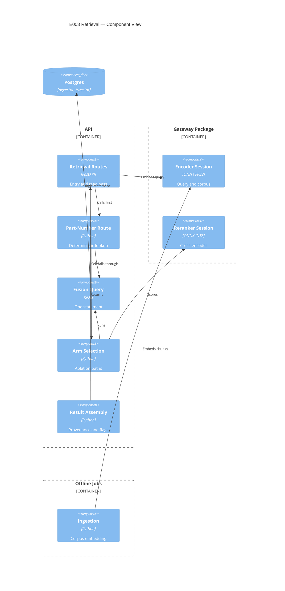

# Implementation Plan: Hybrid Retrieval and Reranking

**Branch**: `00008-hybrid-retrieval-and-reranking` | **Date**: 2026-07-29 | **Spec**: [spec.md](spec.md)

## Summary

**Goal**: A coordinator's question reaches the passage that answers it, with the page it was printed on.
**Approach**: One SQL statement fuses a `tsvector` arm and a `pgvector` arm by reciprocal rank; a deterministic part-number route runs first and falls through; a quantized cross-encoder in the serving process reranks the fused set, and declares itself when it cannot.
**Key Constraint**: Ranking is SQL-resident and single-statement, which removes the pure-function surface the quality policy would normally property-test — the compensating shape is prescribed by `specs/sad.md` and carried in §Testing Strategy.

## Technical Context

**Language/Version**: Python 3.12 (`/src/api`, `/src/gateway`)
**Primary Dependencies**: FastAPI, Pydantic, psycopg 3, ONNX Runtime, `tokenizers`, `pgvector`
**Storage**: PostgreSQL 16 with `pgvector` and native `tsvector` — read-only to this epic; no migration
**Testing**: pytest; `tests/checks` for architecture contracts; `import-linter`; `mypy` (gateway)
**Target Platform**: Linux container, one shared vCPU
**Project Type**: web (serving API consumed by E011 and E014)
**Project Mode**: brownfield
**Performance Goals**: reranking 50 candidates within **150–400 ms** on one shared vCPU (`specs/sad.md`) — taken as spec FR-033 prescribes: one query at a time, 50 candidates (FR-037), an enforced CPU quota of one vCPU, timed across the reranker component's scoring call, after readiness. **The statistic is unresolved and this plan does not resolve it**: `specs/sad.md` states a range and names no mean, percentile or never-exceed, so as written any observation inside a 250 ms band satisfies it and no observation falsifies it. Raised as amendment 7 in §Pending Amendments
**Constraints**: API container steady-state RSS **≤ 400 MB**, covering **every model session the serving process holds — the query encoder plus the two reranker graphs AD-011 commits to** (restated 2026-07-29; this line previously read "of which the reranker session is the dominant line item", written for a single-session configuration that AD-011 no longer ships). "Steady state" is defined: read after readiness and again after the run's queries have been served, as the serving process's resident set size, with the peak observed during the run reported beside it — `specs/sad.md`'s benchmark job prints peak RSS while its target names steady state, and the two are different readings of the same run. The 400 MB is **not apportioned** between sessions and the rest of the process; spec FR-033 requires the report itemize them against the one total instead. No network at query time; fusion executes as **one** statement
**Owner of the numeric envelope**: `specs/sad.md` owns both values — §Technical Context "Performance Goals" (150–400 ms) and §Quality Attributes "Compute envelope" (≤ 400 MB, measured by a container benchmark job). Neither may be relaxed here: `project-instructions.md` §Governance names the request-time compute envelope an **architectural constraint** that a feature-level decision MUST NOT relax, and requires a **superseding decision record** to change one. Sharpening how a figure is *taken* is this plan's to do; changing what it must reach is not, which is why amendment 7 is raised rather than answered
**Scale/Scope**: 6,391 chunks over 26 documents today; the design band is 5,000–15,000. Every performance figure carries the corpus size it was measured at (spec FR-033), so a number taken at 6,391 chunks is not read as holding across the band

## Instructions Check

*GATE: Must pass before Phase 0 research. Re-check after Phase 1 design.*

**Audited against**: `project-instructions.md` **v1.2.8** (last amended 2026-07-29) ·
**Audit date**: 2026-07-29 · **Verdict**: PASS after remediation, with the amendments in
§Pending Amendments outstanding. Recorded because this document moved four times in four days
while this epic was in flight, and a compliance record that names no version cannot detect drift.

| Principle / Section | Verdict | Where |
|---|---|---|
| I. Traceable or It Does Not Ship | PASS | Every result projects document, type, project and page from the chunk row; SC-003 asserts identity with the stored value. The response type has no constructor that accepts a page from anywhere else (AD-004) |
| II. Uncertainty Is the Product | PASS | Recall with a Wilson interval, MRR with a percentile bootstrap, and an explicit unresolvable verdict where intervals overlap |
| III. Precision Over Recall Where a Mistake Is Silent | PASS | FR-007 refuses on encoder-identity mismatch rather than answering; FR-009 returns empty as empty; the route is additive |
| IV. Agent Output Style | PASS | Template sections only |
| V. The Model Extracts, Code Computes | PASS with a scheduled contract change | All ranking arithmetic is in one statement inside the deterministic boundary, and AD-005 settles where reranker score-sorting sits. **`api.retrieval` is the third computation package, so the forbidden contract must name it** — E010 recorded the precedent when it added the second: a boundary that guards one of two is a boundary in name. Scheduled in §Project Structure and mapped at FR-002 |
| VI. Evaluate Before You Tune | PASS with a scheduled deliverable | The fusion constant is already fixed at 60 by `specs/sad.md`'s sequence diagram, so FR-004's pre-registration is discharged against a registered document. **That answered the wrong clause on its own**: the principle governs *evaluation sets*, which must be frozen, hashed and committed before any tuning run, with the harness aborting on mismatch. SC-001 and SC-002 are measured at this epic's own gate on its own query set, so that set is E008's deliverable — see AD-010 and §Project Structure |
| VII. Publish the Miss | PASS | Degraded mode is declared in every response; the sparse arm's contribution is a published row rather than an assumption; three limitations carry reversal triggers |
| VIII. Honest Opponents | PASS | Reranking is reported against the strongest single arm, not only against fusion-only, which the spec itself calls weak |
| Technology Stack | PASS, riding on an unlanded amendment | No new datastore. The stack names "ONNX Runtime **for INT8 CPU inference**"; this epic runs an FP32 encoder and, per FR-025, an FP32 reranker arm beside the INT8 one. E006 already has an amendment outstanding against that same qualifier — recorded in its PR body — and E008 depends on it landing rather than raising a fourth |
| Testing & Quality Policy | PASS with two obligations | The SQL-resident property-test surface is preserved as a **pseudo-oracle**, recorded in §VII's four-part limitation format with its independence assumption stated as empirically falsified rather than assumed (§Testing Strategy). **`metrics.py` is a separate obligation and an easier one** — Wilson intervals, percentile bootstrap and the overlap verdict are pure scoring functions with no SQL obstacle, so they carry the mandatory test-first cycle and property tests directly. **That obligation is now carried by spec FR-042**, which names the properties and the generated input domains, rather than by this row and a table cell: a policy obligation recorded only in a plan has no verifier, and nothing fails when it is skipped. Ruff is the named lint and format gate and is in the Testing Strategy table |
| Source Code Layout | **CONDITIONAL — amendment required** | New code under `/src/gateway` and `/src/api`; artifacts under `data/`. **But the clause reads "The gateway package carries neither a web framework nor the modeling stack", and the Technology Stack defines that stack as PyMC, ArviZ, pandas and NumPy.** `onnxruntime` pulls NumPy transitively, so ADR-0022's decision contradicts this clause directly. Recorded as amendment 4 and cited from ADR-0022; the design does not proceed on the strength of an ADR overriding a governing clause |
| Development Workflow | PASS | Branch matches workspace matches epic |
| Data Provenance | PASS | FR-016 requires identity, revision, licence basis, source and digest for the vendored model |
| Governance | **CONDITIONAL** | Three amendments recorded and not performed: the `specs/prd.md` MRR interval (FR-034), the `specs/project-plan.md` `part_numbers` owner (FR-035), and ADR-0022's `specs/sad.md` catalog row. All three land on the default branch |

**Re-check after design**: PASS. The two boundary crossings design introduced — inference in the gateway, and the serving image admitting its runtime — are recorded in ADR-0022 rather than waved through.

## Architecture



The encoder sits in the gateway rather than in either boundary because both call it and neither may
import the other — the property {SAD:ADR-0010} exists to protect. One session type, two callers, one
vector space. See **ADR-0022**.

## Architecture Decisions

Feature-local tradeoffs only. The project-wide decision this epic required is **ADR-0022 — Local
Inference Lives in the Shared Gateway Package, and the Serving Image Admits Its Runtime**.

| ID | Decision | Options Considered | Chosen | Rationale |
|----|----------|--------------------|--------|-----------|
| AD-001 | Where the per-arm tie-break is applied | Final ordering only / per arm and final | **Per arm and final** | A row limit needs a *unique* ordering or the candidate **set** varies between runs, not merely its order. Ties at the fiftieth position would otherwise change which 50 rows the reranker sees. FR-004's key therefore applies inside each arm's CTE |
| AD-002 | How the index search breadth is set | `SET LOCAL` per query / connection `options` | **Connection `options`** | A per-query `SET` is a second statement and collides with FR-002. `specs/00003-core-data-schema/data-model.md` prescribes setting it "at query time", which as written would violate FR-002. Declared normative over that line under {SAD:ADR-0017} and raised as amendment 6, rather than overridden in a table cell |
| AD-003 | Filtered-recall remedy | Relaxed iterative scan / strict iterative scan / partial indexes / wider breadth | **Strict iterative scan, with a version check first** | Relaxed order returns results out of distance order, against FR-020. Partial indexes are a new index, which the spec excludes. Iterative scan needs extension ≥ 0.8.0 — verified against the pinned digest as a task, not assumed |
| AD-004 | How page provenance is enforced | Prohibition plus a test / private factory plus a construction-site scan | **Private factory plus a scan** | Principle I's own enforcement clause is satisfied at the storage boundary by E003's constraints; this is additional. An earlier draft claimed the page was "unrepresentable" — in Python a response model always has a public constructor, so that overclaimed. The honest mechanism is a private factory taking a chunk row plus a source scan asserting no other construction site, the shape E006 used for its single-page-reader guarantee |
| AD-005 | Whether reranker score-sorting is inside the computation boundary | Inside / outside | **Outside, and named** | The contract forbids *model-facing* code reaching computation. Sorting by returned scores is neither ranking arithmetic nor model-facing; it is ordering a list. Stated here because leaving it unstated means the architecture test is later weakened to pass |
| AD-006 | Arm selection surface | Request parameter / service configuration / both | **Request parameter for arms, configuration for the index flag** | E014 must run five arms against one deployment, so arms are per-request. The exact/approximate flag is configuration: letting a caller vary it per request is exactly the drift {SAD:ADR-0005} accepts two paths only on condition of preventing |
| AD-007 | Reranker artifact location | `data/reranker/` / inside the gateway package / a release asset | **`data/reranker/`** | Mirrors `data/encoder/`'s digest-verification path and its exclusion from the package build. A model inside a Python package is shipped by the packaging system, which is not what a digest gate wants to verify. **Correction: an earlier draft claimed this mirrors a licence-basis record at `data/encoder/`. It does not — no such record exists there**, so FR-016 is stricter than the precedent rather than equal to it, and the encoder's own missing record is raised as amendment 5 |
| AD-010 | Where E008's own evaluation query set lives, and how it is frozen | Reuse E014's set / a set owned by this epic / measure without one | **A set owned by this epic, frozen and hashed before any measurement** | SC-001 and SC-002 are measured at this epic's gate, and E014's frozen set does not exist yet. Principle VI requires the set be committed and hashed with the harness aborting on mismatch, so it is a deliverable here rather than a borrowing |
| AD-011 | Whether the reranker ships one graph or two | INT8 only, fp32 measured elsewhere / both committed | **Both** | FR-025 requires a full-precision arm and {SAD:ADR-0006} requires the quantized-versus-full-precision difference measured rather than assumed. Two graphs means two sessions, which the 400 MB envelope must account for — see §Risk Mitigation, which previously described the session in the singular |
| AD-008 | Whether the aggregate metrics get an HTTP surface | Endpoint / library functions | **Library functions** | They compute over a query set, not a query; the spec's one `NEW-API` signal names a retrieval surface. E014 imports and runs them over the frozen set |
| AD-009 | Where SC-005's enumerated part-number set comes from | `chunk.part_numbers` / `extracted_value` / the pre-render document model | **Pre-render document model** | The first is null on every row and the second is empty while extraction is fixture-blocked. The generator's record, already E006's FR-067 reference set, makes the criterion measurable before extraction runs |
| AD-012 | Where the method for taking the performance figures is fixed | Left to implementation / a benchmark-job README / stated in the requirement itself | **Stated in the requirement (spec FR-033)** | A budget with no workload, environment, measurement point, occasion or counter is satisfied by whichever reading the implementer happens to take, and two runs can then disagree with neither being wrong. The four parts recognised practice asks of a performance statement (`research-quality.md` §Performance-requirement quality) belong in the text that is adjudicated, not in a document nobody adjudicates. **The one part this plan cannot supply is the statistic** — that is `specs/sad.md`'s to declare, and amendment 7 raises it |
| AD-013 | Whether both reranker graphs are resident at once or loaded per arm | Both resident / FP32 loaded on demand / FP32 only in a separate evaluation process | **Both resident in the one serving process** | AD-006 makes arm selection a *request* parameter and FR-025 makes full precision an arm, so a per-arm load would be a load on a request path — exactly what FR-017 forbids, and it would put the cost SC-007 exists to exclude back into a served query. A separate FP32 process was rejected for the same reason it was accepted for the exact/approximate flag and no further: that flag is configuration, arms are not. The consequence is that the 400 MB envelope covers two reranker sessions, which §Technical Context now states and spec FR-033 requires itemized |
| AD-014 | Contract conformance for E008's own surface | Extend E010's module / follow it with a second / rely on hand-written assertions | **Follow it with a second** | E010's module names one contract by path, so E008's would be unvalidated. Extending it would make one test own two epics' contracts and fail for reasons belonging to the other; hand-written assertions are what E010 records as bad at asserting closure, because the keys nobody wrote are the ones that drift |

**AD-010 stated further: what the freeze settles, and what it does not** *(added 2026-07-29)*. The
digest check is the whole of the discipline recorded until now, and it detects **modification** of
the set. It does not detect **repeated measurement against it**, which is the mechanism that converts
a frozen set into a training set — the failure Principle VI exists to close, and one a hash cannot
see by construction. Three things about this set are therefore undecided, and are recorded as
decisions rather than filled in here:

- **A consultation budget** — how many measurement runs against the set are permitted before a figure
  taken from it stops being evidence, and who is entitled to run them. No number is chosen here;
  inventing one would be a decision wearing an amendment's clothes.
- **The set's composition** — its size, how queries are drawn and from what (the generator's document
  model, the corpus's own text, or written by hand), and **which difference it must be able to
  resolve**. The spec's own risk records that fifty queries cannot separate arms differing by a few
  points, and SC-001 and SC-002 are measured on this set, so a size chosen without stating the
  difference it must resolve reproduces that risk silently.
- **The source of the relevance judgements** — SC-001's recall at five needs a per-query
  relevant-passage set, and no requirement names who produces it or against what evidence. AD-009's
  precedent, the generator's pre-render document model, is the obvious candidate and is deliberately
  **not** adopted by default: judgements derived from the generator make every query answerable by
  construction and may measure an easier task than a coordinator's. That is a product decision, not a
  drafting one.

**What is settled.** *(a)* The harness's abort on digest mismatch is a **checkable obligation, not a
description of a deliverable**: a test perturbs a copy of the committed set, runs the harness against
it, and asserts it exits non-zero **before any measurement is emitted**
(`src/api/tests/retrieval/test_evaluation_set.py`). Principle VI's own wording is "an exit code
rather than a promise", and an exit code nothing observes is a promise. *(b)* The relationship to
E014's frozen set: **they are two sets and two figures**. A figure measured here is a **gate** figure,
reported with the set and digest it was taken on, and it is never published as this epic's result;
E014 **re-measures** the same criteria on its own frozen set and its figure is the published one.
Neither is offered as confirmation of the other — two measurements on two sets are two facts, and
presenting one as corroborating the other would claim a reproduction nobody performed.

## Data Model Summary

N/A — no persistent data. This epic adds no table, column, index or migration; the spec's
Implementation Signals deliberately omit `MIGRATION`. `Chunk` is read-only and owned by E003 (shape)
and E006 (population); `RetrievalResult` is a response shape defined in `contracts/`.

## API Surface Summary

**Detail**: [`contracts/`](contracts/)

| Method | Path | Purpose | Auth | Req/Res Types |
|--------|------|---------|------|---------------|
| GET | `/api/v1/retrieval/search` | Ranked passages for a query, with provenance, the arms that produced them, and the ranking parameters in force | none | query parameters / `RetrievalResponse` |
| GET | `/api/v1/retrieval/diagnostics` | Process-level facts: artifact identity, licence basis and digest, memory against budget, thread counts, the fixed ranking parameters, the declared part-number pattern | none | — / `DiagnosticsResponse` |
| GET | `/readyz` | Ready, ready-degraded, or not ready — deliberately outside `/api/v1`, since a probe should not be version-bound | none | — / `ReadinessResponse` |

*(Response types corrected 2026-07-29.)* This column named `Mode` for `/readyz` and a list of four
component schemas for diagnostics; the contract defines neither as a response body. `Mode` is a member
of the **search** response, not the readiness document — `ReadinessResponse` carries `status`,
`degraded`, `statement`, the per-session reranker block and the encoder identities, and a consumer
written against `Mode` would have found none of them. `RerankingReport`, `ModelIdentity`,
`VectorSearchSettings` and `LexicalArmSettings` are components `DiagnosticsResponse` and
`RetrievalResponse` compose from, and `RerankingReport` is a **per-query** object that diagnostics does
not carry at all. A table that names a schema the contract does not return is the same defect as an
endpoint nobody implements, found one document earlier.

Errors use one `Problem` shape throughout. `MatchKind` carries FR-013's deterministic-versus-ranked
distinction on every result; `WeightedFields` carries FR-005's empty-weighted-field disclosure;
`DeterministicRoute` reports whether the route fired and whether it fell through.

`GET` rather than `POST` for search, because a retrieval query is a read with no side effect and
E014 must be able to replay an exact request from a manifest. Diagnostics is separated from search
so a per-query response is not carrying process-level facts that do not vary per query.

**Which figures live where** *(corrected 2026-07-29)*. This line previously read "FR-019 and FR-033's
figures live there", which disagreed with `contracts/openapi.yaml` — and the contract is right,
because the two requirements each have a per-query half and a per-process half:

- **On the search response**: FR-019's truncation count and candidate-length distribution, FR-033's
  per-query reranking latency together with the fusion-statement and query-encoder times FR-033 now
  requires beside it, the precision the arm ran at, and FR-029's per-result ranking parameters. These
  are true only of the query that carries them, and emitting them here is what lets E014 build a
  census by summing what it already receives, with no second call and no sampling.
- **On `GET /api/v1/retrieval/diagnostics`**: FR-033's memory-against-budget half itemized per
  session, the sequence limit FR-019 publishes as a number, FR-038's intra-op and inter-op thread
  counts, FR-016's artifact identities and digests, FR-039's observed `pgvector` version, and the
  fixed ranking parameters. None of these varies per query, and repeating a constant on fifty
  responses makes a mid-run change fifty times harder to notice.

`contracts/openapi.yaml` §"Which figures live where, and why" is normative on the split. **The gap the
split exposed is now closed in the contract** *(performed 2026-07-29; recorded above as pending on the
same day)*. The diagnostics schema carried a single `reranker_artifact` and a single `reranker_session`,
written for the one-session configuration AD-011 superseded, so the FP32 graph's FR-016 licence basis,
source and digest and its FR-033 resident memory had nowhere to be reported from. The contract now
carries `reranker_artifacts` and `reranker_sessions` as collections of at most two, an `encoder_session`
so FR-033's counter is itemized over all three sessions the process holds, and a `process_memory` object
that states the counter, the occasion, the container-total budget and the corpus-size qualifier — the
budget being a container total that FR-033 explicitly does not apportion, which the previous
per-session `memory_budget_bytes` implied it did. `ReadinessResponse.reranker` became per-session for
the same reason: a single `precision` and a single `warmup` could report that one graph warmed while
saying nothing about the graph FR-025's full-precision arm needs, and FR-017 warms both before
readiness. Edited rather than recorded because the contract is this epic's own artifact, nothing is
implemented against it yet, and a recorded correction that implementation must remember to apply is a
correction with no verifier.

No authentication tier: this is a single-user local demonstration and `specs/sad.md`'s deployment
view has none. Stated rather than omitted, so its absence is a decision.

## Testing Strategy

| Tier | Tool | Scope | Mock Boundary | Install |
|------|------|-------|---------------|---------|
| Unit | pytest + Hypothesis | Route recognition, arm selection, result assembly, degraded-flag propagation, the fusion oracle, and **`metrics.py`'s pure scoring functions** — Wilson interval, percentile bootstrap, overlap verdict — which carry the mandatory test-first cycle and property tests directly, having no SQL obstacle. **Spec FR-042 now carries that obligation and names the properties**, so it is a requirement with a verifier rather than a table cell | ONNX sessions substituted; no database | configured |
| Integration | pytest + live Postgres | The fusion statement against real chunks: golden orderings, determinism across plan flips and rebuilds, filtered-recall counts, per-arm independence, **the candidate set at the 50-row cut and a tie engineered at the last in-window position**, **a plan-shape assertion that each arm's `LIMIT` survives CTE inlining**, and **a capture asserting one ranking statement executed** — the three things the oracle cannot see (see below) | none — real database, real index | configured |
| Lint / static analysis | Ruff, `import-linter`, `mypy` | `ruff check` and `ruff format --check` as separate gates; the forbidden contract extended to `api.retrieval`; `mypy` over the gateway's new inference package | — | configured |
| Security | `tests/checks` | Licence basis, source, quantization record and digest for both vendored graphs; no network at query time; no credential material | — | configured |
| Coverage | `coverage` | **80% of what, stated**: the project-wide floor over the combined data — `coverage combine` then `coverage report --fail-under=80`, branch coverage, over the root manifest's `[tool.coverage.run] source` list, which already contains `src/api/src/api` and `src/gateway/src/gateway` so both new packages enter the denominator on their own — **plus `api.retrieval` and `gateway.inference` each asserted alone at 80%** through `coverage report --include=…` against that same combined data. The per-package floor is E006's precedent and the reason is arithmetic: an aggregate lets already-covered packages carry a new one across the threshold. Two new lines in the workflow's Coverage gate step, not a new tool | — | **configured for the aggregate; the two per-package lines are a workflow edit** — see the merge-gate note below |

**The property-test obligation is met by a substituted oracle, and the substitution is named for
what it is.** The quality policy names fusion ranking as requiring property-based tests over pure
functions, and FR-002 puts all ranking in one SQL statement, leaving no such function.
`specs/sad.md` prescribes the resolution and this plan carries it: property tests recompute the
fusion arithmetic in Python and assert it matches the emitted order. The technique has a name and a
known limit. It is a **pseudo-oracle** (`research-quality.md` §Test-strategy), and its founding
assumption — that two independent implementations of one specification fail independently — **has
been empirically falsified**: 27 independently written versions of one specification produced
coincident failures far above the independence prediction, because the correlated fault is *shared
misreading of the specification*, which a pseudo-oracle cannot detect by construction. So "the oracle
and the SQL agree" is a claim about **consistency**; it becomes a claim about **correctness** only
under an assumption known to be false in the tail. Independence of derivation is therefore
**necessary and not sufficient**, and that is stated here rather than left implied, because a
substitution whose limit is unwritten reads as a substitution with no limit.

Four conditions make it as sound as it can be. Each is an authoring constraint on whoever writes the
two sides, not advice:

1. **Derived, not transcribed.** The Python side is written from the **published definition** — the
   reciprocal-rank formula in spec §Glossary, the constant fixed at 60 by `specs/sad.md`'s sequence
   diagram, and FR-004's tie-break key and missing-arm convention — and **not** by reading
   `retrieval/fusion.py`. A Python side transcribed from the SQL reproduces that statement's
   misreadings, and the agreement it then asserts is vacuous. Separately from the arithmetic, the
   three ranking parameters are **read from the single source in force**, `retrieval/parameters.py`,
   the same object FR-029 emits — not re-declared as literals in the test, which would make the
   oracle a second place they can drift, exactly what FR-004 forbids. What must be independent is
   the arithmetic; the constants must be shared.
2. **Generated inputs, not read-back ones.** The oracle's inputs are **generated per-arm rank
   vectors** (Hypothesis), supplied to both sides. Feeding it the per-arm ranks read back from the
   same query under test would make the equality assertion an identity that no defect can falsify.
   The generated domain is stated so the cases the properties are about are reached rather than
   assumed exercised: per-arm list lengths from 0 to the fetch depth **including both endpoints**;
   tie multiplicity from all-distinct to all-tied, **including ties straddling the last in-window
   position**; and candidate sets ranging from **disjoint to identical**, so FR-004's missing-arm
   convention and the tie-break key are reached by generated cases rather than by hope.
3. **What it does not cover is enumerated**, in the table below, rather than left to a reader's
   inference.
4. **Disagreement is adjudicated, not presumed.** A failing equality assertion locates a discrepancy
   and not its origin, so **neither side is presumed correct**. Both are re-derived against the
   published definition; where they then agree, the side that moved was wrong; where the definition
   does not decide the case, the disagreement is a defect in the **definition** and is raised as an
   amendment rather than settled in favour of whichever side is cheaper to change. The
   shared-misreading fault is checked first, precisely because it is the one failure this technique
   cannot report on its own.

**What the oracle does not cover, and what covers it instead.** The oracle recomputes arithmetic over
rank vectors it is handed; it never chooses which rows those vectors describe. Three things sit
outside its reach, and each is assigned a check rather than named as a caveat:

| Uncovered by the oracle | Why it is out of reach | What covers it |
|---|---|---|
| **Candidate-set selection at the 50-row cut** (FR-003, FR-037) | The oracle receives the vectors *after* the cut and cannot observe the rows that were dropped | Integration: a live-corpus fixture asserting each arm yields exactly the fetch depth where that many rows match, and that the golden candidate **set** — not merely its order — is stable across repeated runs, across a planner flip, and across a rebuild on the exact path |
| **The per-arm tie-break** (AD-001, HINT-001) | A rank-vector recomputation cannot see rows cut at the fiftieth position, which is exactly where the per-arm key does its work — it fixes which rows the reranker ever sees | Integration: a fixture engineered to tie at the last in-window position of each arm, asserting the candidate set is identical across runs and unchanged by a planner flip. With no key inside the arm's CTE this fails; with the key in the final ordering only, it still fails — which is the property worth having |
| **Limit semantics under CTE inlining** | Nothing documents that an inlined CTE honours its `LIMIT`; it follows from semantics rather than from text (`research-implementation.md` §Reciprocal rank fusion as one statement), and an inference is not an assertion | Integration: a **plan-shape assertion** over `EXPLAIN` of the emitted statement — each arm's limit survives inlining and each arm's node reports the fetch depth as its row limit. Prescribed by the research and previously absent from every tier listed above |

**FR-002 itself is verified, not only its output.** Every tier asserts over the statement's *results*,
and none of them would notice a ranking assembled by two statements that happened to produce the same
rows. The one-statement property is therefore asserted directly: the statements executed on the
connection during one search are captured and asserted to be **exactly one ranking statement**, with
no accompanying `SET` — AD-002 puts the search breadth on the connection precisely so none is needed,
so a `SET` appearing here is a regression against both requirements at once. SC-004's "zero ranked
results produced by arithmetic outside the deterministic computation boundary" is discharged by that
capture **together with** the `import-linter` forbidden contract extended to name `api.retrieval` as
the third computation package (§Project Structure), and **AD-005's carve-out is the one named
exception**: sorting a list by scores the reranker already returned is ordering, not ranking
arithmetic. Naming the exception here is what stops the architecture test being quietly weakened to
accommodate it later.

**The substitution is recorded in the mandated limitation format** (`project-instructions.md` §VII),
not as a testing note — the same treatment the determinism narrowing below receives, and the
asymmetry between the two was visible inside this one section:

- **Scope decision**: the property-based tests the quality policy mandates for fusion ranking are run
  against a Python pseudo-oracle asserted equal to the SQL statement's output, rather than against a
  pure fusion function in application code, which FR-002 forbids existing.
- **Supporting evidence**: `specs/sad.md` §302 prescribes this compensating shape for SQL-resident
  logic; `research-quality.md` §Test-strategy records the technique as recognised **and its
  independence assumption as empirically falsified**, which is why the four conditions above are
  constraints rather than suggestions.
- **Reversal trigger**: the fusion arithmetic becoming reachable as a pure function without a second
  statement — a deterministic database-side function the one statement calls and a test can call
  directly — at which point the property tests run against that function and the oracle stops being
  a substitute.
- **Production-scale alternative**: an oracle written by a **different author from an independent
  reading** of the definition, plus metamorphic relations that need no second implementation at all
  (invariance of the fused order under a permutation of the input rows; monotonicity of a
  candidate's fused rank when its rank in one arm improves). Neither is available here — one author
  writes both sides — so the shared-misreading fault is **disclosed rather than mitigated**.

**Determinism is asserted three ways** (FR-020, SC-012): the same statement twice; again with planner
settings flipped, since an ordering that survives a plan change is defined by the query rather than
the plan; and again after a rebuild — but **only on the exact path**. **"Flipped" is specified
concretely**, because a flip that does not change the chosen plan asserts nothing while appearing to
assert something: `enable_seqscan`, `enable_indexscan`, `enable_indexonlyscan`, `enable_bitmapscan`,
`enable_sort`, `enable_hashjoin` and `enable_mergejoin` are each set `off` for the flipped run, via
`SET LOCAL` inside the *test's* own transaction — which is not the query under FR-002; the fusion
statement remains one statement — and **the test asserts the `EXPLAIN` plan actually differs between
the two runs while the returned ordering does not**. A flipped run whose plan is unchanged fails the
test rather than passing it. That is the difference between asserting plan-independence and asserting
nothing.

This narrows an unqualified requirement, so it is recorded as a limitation in the mandated format
rather than as a testing note, and it is **declared normative over FR-020** under {SAD:ADR-0017} —
the record that exists precisely to let a plan-phase artifact override a specify-phase requirement.
Spec FR-020 now carries the narrowing on its own side as well, so a reader of the spec alone does not
read a guarantee this plan does not assert.

- **Scope decision**: FR-020's identical-ordering guarantee is asserted across index rebuilds on the
  exact path only. The approximate path is asserted by candidate overlap and recall delta instead.
  **Unresolved and recorded rather than papered over**: that substitute names two quantities and no
  threshold — how much candidate overlap between two rebuilds counts as a pass, and what recall delta
  counts as a pass — so as written it is reportable but not adjudicable, in exactly the way SC-016's
  latency half is not. Both numbers are choices nobody has made; until they are made, the approximate
  arm's rebuild behaviour is a published figure and not a criterion anything can fail.
- **Supporting evidence**: graph construction is randomized by insertion order and parallel build
  workers, which {SAD:ADR-0005} records as the reason evaluation runs exact at all. The spec's own
  Edge Cases anticipate two paths differing after a rebuild; its requirement text did not qualify it
  until this narrowing was carried back into it.
- **Reversal trigger**: a build reproducible from a fixed seed with a single build worker, which
  would make the approximate path's ordering stable and the guarantee assertable on both paths.
  **The observation has an owner and an occasion**, rather than being a condition nobody is obliged
  to make: it is checked at the same point spec FR-039's `pgvector` version check runs — before any
  figure is published, and again whenever the pinned image digest or the extension version moves —
  by whoever performs that check, and the answer is recorded beside the index settings FR-029 emits.
  A reversal trigger nobody is scheduled to look at is a limitation with no exit.
- **Production-scale alternative**: publish the served path's ordering variance across rebuilds as a
  measured figure, so approximation's cost to stability is reported rather than excluded from the
  claim.

**What runs in the merge gate today, and what needs a new step.** Every tier above is marked
"configured", which is true of the tooling and not of the workflow, and the difference is where a
check silently runs nowhere. Read against `.github/workflows/verify.yml` as it stands:

- **Runs automatically, no workflow edit.** A new `src/api/tests/retrieval/` package is collected by
  the `Unit tests (api)` step, which runs `pytest tests -m "not benchmark"` from `src/api` with
  `DATABASE_URL` pointing at the job's digest-pinned pgvector service — so the unit *and* integration
  tiers execute there. A new `src/gateway/tests/` module is collected by `Unit tests (gateway)`.
  Ruff's lint and format steps each loop every entry plus the root. The extended `import-linter`
  contract runs under `Architecture contracts`, which reads each entry's own manifest. Additions
  under `tests/checks` run under `Cross-entry checks, image assertions, and supply chain`.
- **Needs a new line, named here so it is not discovered at implementation.**
  1. **The two per-package coverage floors** — `coverage report --include='*/api/retrieval/*'` and
     `--include='*/gateway/inference/*'`, each `--fail-under=80`, appended to the `Coverage gate`
     step beside the four E006 and E007 already carry.
  2. **The benchmark tier.** The api step excludes `-m "not benchmark"`, and `Performance benchmark
     (api)` names one file explicitly under `taskset -c 0`. FR-033 requires its figures taken under a
     one-vCPU quota, so E008's benchmark module belongs in *that* step; a file marked `benchmark` and
     not added there runs nowhere at all, which is the failure mode the api step's own comment
     records.
  3. **A populated chunk store for the integration tier.** The gate applies the migration chain and
     never ingests a corpus — the `reproduce` job aborts before writing chunks by design, E006's
     provider fixtures being unavailable — so the merge gate has an **empty `chunk` table**. The
     fusion statement's integration tier therefore commits and seeds its own fixture, the shape the
     `Seed the frozen fixture` step already uses for the web end-to-end tier, rather than assuming
     rows CI never creates.
  4. **The evaluation set's digest check** runs inside the api tier once the harness exists and needs
     no step of its own. Listed so its absence from the previous item is a decision rather than an
     omission.

## Error Handling Strategy

| Error Category | Pattern | Response | Retry |
|----------------|---------|----------|-------|
| Encoder identity mismatch (FR-007) | **Refuse** | Error, naming both identities | no — a retry cannot change it |
| Reranker unavailable (FR-021) | **Degrade** | Success, fusion-only ordering, degraded flag set | no |
| Malformed or empty query | Fail fast | Error, field-level detail | no |
| Database unavailable | Fail fast | Error, no partial result | caller's choice |
| No matching passages (FR-009) | Not an error | Success, empty result reported as empty | no |

**Refuse and degrade are different shapes and must not be conflated.** A mismatched encoder produces
vectors in the wrong space and every ranking derived from them is meaningless, so the answer is
withheld. A missing reranker produces a worse ordering that is still an ordering, so it is served and
labelled. Collapsing the two would either refuse a serviceable request or serve a meaningless one.

## Integration Points

| Spec Reference | System/Service | Technical Approach | Contract |
|----------------|----------------|--------------------|----------|
| Chunk store (E003 shape, E006 population) | PostgreSQL | Read-only; no write, no migration | `0004_chunk.py` |
| Encoder identity (E006) | `data/encoder/` | Same pinned identity and revision as the chunks; asserted before search | ADR-0019 |
| Retrieval module (E011) | Grounded answering | Consumes `SearchResponse` including the degraded flag | `contracts/` |
| Ablation arms (E014) | Evaluation harness | Per-request arm selection; ranking parameters emitted for the manifest | `contracts/` |
| Shared inference (this epic) | `/src/gateway` | Encoder and reranker sessions, one implementation, two callers | ADR-0022 |

## Risk Mitigation

| Risk (from spec) | Likelihood | Impact | Mitigation | Owner |
|-------------------|------------|--------|------------|-------|
| The lexical arm contributes little or nothing | M | H | The sparse-only arm is a published row, not an assumed positive, so its contribution is measured before anything depends on it. FR-035 raises the `part_numbers` population gap where it can be fixed; FR-005 publishes the proportion of retrieved chunks whose weighted fields are all empty, so the inert weighting is visible rather than inferred | `api.retrieval.arms` |
| The reranker does not fit the compute envelope — **two sessions, not one** (AD-011, AD-013) | M | H | Each mitigation is bounded rather than named: truncation at the model's declared sequence limit with the truncated fraction published (FR-019); batching at a fixed shape equal to the reranked count, the same shape warm-up runs at (FR-017), so batch size is not a per-run knob; thread counts set from a derivation rule rather than left to a runtime that reads the host's core count and not the container's quota (FR-038); FR-033 reports latency and per-session resident memory against the declared budgets by a fixed method, and publishes an overage rather than omitting it, while SC-016 makes the overage a **failure** rather than a satisfied criterion. The threshold these are held to is FR-033's budgets — an unbounded mitigation is an activity, and an activity cannot fail | `gateway.inference` |
| The frozen set is too small to resolve the differences published | H | M | Intervals on every figure and an explicit unresolvable verdict, so a difference the set cannot support is never claimed. Owned jointly with E014, which owns the set | `api.retrieval` / E014 |

## Requirement Coverage Map

| Req ID | Component(s) | File Path(s) | Notes |
|--------|--------------|--------------|-------|
| FR-001, FR-002 | Fusion query | `src/api/src/api/retrieval/fusion.py`; **verification**: `src/api/tests/retrieval/test_fusion_oracle.py` (the pseudo-oracle property tests), `test_fusion_plan_shape.py` (`EXPLAIN`: each arm's `LIMIT` survives inlining), `test_single_statement.py` (statement capture: exactly one ranking statement, no accompanying `SET`) | Two CTEs, one full outer join, one statement. The one-statement property is asserted directly, not inferred from the output |
| FR-003 | Fusion query | `src/api/src/api/retrieval/fusion.py`; **verification**: `src/api/tests/retrieval/test_candidate_set.py`, `test_fusion_plan_shape.py` | Fetch depth 50, a ranking constant not a knob. The candidate **set** at the cut is what is asserted, not only its order |
| FR-004 | Fusion query, parameters | `retrieval/fusion.py`, `retrieval/parameters.py`; **verification**: `src/api/tests/retrieval/test_fusion_oracle.py` (all three parameters read from `parameters.py`, never re-declared in the test), `test_candidate_set.py` (a tie engineered at the last in-window position), `test_parameters.py` | Constant fixed at 60 by `sad.md`; tie-break per arm (AD-001) |
| FR-005 | Lexical arm, reporting | `retrieval/arms.py`, `retrieval/report.py`; **verification**: `src/api/tests/retrieval/test_report.py` | Publishes the empty-weighted-field proportion per layer |
| FR-006 | Reporting | `retrieval/report.py`; **verification**: `src/api/tests/retrieval/test_report.py` | Assertion over emitted artifacts, not over intent |
| FR-007 | Encoder guard | `src/gateway/src/gateway/inference/encoder.py`; **verification**: `src/gateway/tests/test_inference.py` | Refuse on identity mismatch, before any search |
| FR-008, FR-013 | Result assembly | `retrieval/results.py`; **verification**: `src/api/tests/retrieval/test_results.py`, plus `test_page_provenance.py` — the construction-site scan AD-004 requires, which is the half a unit test cannot express | Projection-only construction (AD-004); match kind on every result |
| FR-009 | Result assembly | `retrieval/results.py`; **verification**: `src/api/tests/retrieval/test_results.py` | Empty is empty; no padding |
| FR-010, FR-014, **SC-005** | Part-number route | `retrieval/router.py`; **verification**: `src/api/tests/retrieval/test_router.py` (tokens anywhere in the query) and `test_part_number_coverage.py`, which reads the enumeration from the source AD-009 fixes — the generator's pre-render document model, E006's FR-067 reference set — rather than from `chunk.part_numbers` or `extracted_value`, neither of which can supply it | Declared pattern, verified against the enumerated corpus set. The verification and its enumeration source are named together, because either alone is unrunnable |
| FR-011, FR-012 | Part-number route | `retrieval/router.py`; **verification**: `src/api/tests/retrieval/test_router.py` | Fall-through; additive union asserted against the route-disabled result |
| FR-015, FR-017, FR-018 | Reranker session | `gateway/inference/reranker.py`; **verification**: `src/gateway/tests/test_inference.py` (load once, warm at the fixed shape, rerank exactly the fused set) and `src/api/tests/retrieval/test_readiness.py` (SC-007's three zero-counters after readiness) | Load once, warm at max batch and sequence shape, rerank exactly the fused set |
| FR-016 | Artifact verification | `gateway/inference/artifacts.py`, `data/reranker/`; **verification**: `tests/checks/test_vendored_model_provenance.py` — the Security tier's cross-entry check, since the obligation is about what entered the repository rather than about a runtime path | Identity, revision, licence basis, source, digest — verified before session creation |
| FR-019 | Reranker session, reporting | `gateway/inference/reranker.py`, `retrieval/report.py`; **verification**: `src/gateway/tests/test_inference.py` (truncation counted, not silent), `src/api/tests/retrieval/test_report.py` (fraction and distribution emitted, limit published as a number) | Truncation fraction with the length distribution |
| FR-020 | Fusion query, tests | `retrieval/fusion.py`, `src/api/tests/retrieval/test_determinism.py` | Exact path only; approximate path gets an overlap assertion |
| FR-021 | Readiness | `src/api/src/api/retrieval/readiness.py`; **verification**: `src/api/tests/retrieval/test_degraded.py`, `test_readiness.py` | Ready-degraded on load failure, never not-ready; caught inside lifespan (HINT-005) |
| FR-022 | Routes, readiness | `retrieval/routes.py`, `retrieval/readiness.py`; **verification**: `src/api/tests/retrieval/test_degraded.py` | *(corrected 2026-07-29 with FR-022's amendment)* Fusion-only stated in every **degraded** response body and at the readiness endpoint; every other unreranked response carries its own machine-readable reason (`arm_excludes_reranking`, `no_candidates_to_score`) and a statement that does not claim fusion-only, because a `lexical` or `dense` response is unreranked and is not fusion-only |
| FR-023 | Reporting | `retrieval/report.py`; **verification**: `src/api/tests/retrieval/test_degraded.py`, `test_report.py` | Every evaluation-facing output records the mode it ran in |
| FR-024, **SC-011** | Tests | `src/api/tests/retrieval/test_degraded.py` | Forces the failure **at the artifact-loading boundary** — an absent, unreadable or digest-mismatched graph, so the exception arises where FR-016's verification runs — and asserts all three observables FR-024 enumerates: ready-degraded, the fusion-only statement with results still returned, and the mode on the evaluation-facing output. Setting the flag directly does not discharge it |
| FR-025 | Arm selection | `retrieval/arms.py`; **verification**: `src/api/tests/retrieval/test_arms.py` | **Five request-selectable arms** including full precision, each independently runnable. *(Corrected 2026-07-29: this cell read "six", which agreed with SC-012 and disagreed with FR-025 and with the contract's closed five-value enum.)* SC-012's sixth is the FR-026 configuration flag, not a sixth value this module selects — `test_flag_parity.py` builds the two configured processes AD-006 requires |
| FR-036 | Comparison and reporting | `retrieval/metrics.py`, `retrieval/report.py`; **verification**: `src/api/tests/retrieval/test_metrics.py` — the selection rule asserted over constructed figures, including the case where the two candidate arms' intervals overlap and both must be reported | Selects the strongest single arm by the rule FR-036 now fixes (per statistic, higher point estimate, both where unresolvable), computes the paired per-query difference against it, and labels fusion-only as the weak comparator. **Not `arms.py`** — that makes arms runnable and computes nothing, which is how this obligation went unowned once already |
| FR-026, **SC-013** | Configuration | `src/api/src/api/config.py`; **verification**: `src/api/tests/retrieval/test_flag_parity.py`, which builds **two differently configured application instances** — the only shape in which the two settings can be observed at once, since the flag is service configuration (AD-006) — and compares the observable set FR-026 enumerates | Index usage only; shared-path equality asserted by test over a named observable set, with the dense candidate set and what follows from it as the one permitted difference |
| FR-027, FR-028 | Connection, arms | `src/api/src/api/db.py`, `retrieval/arms.py`; **verification**: `src/api/tests/retrieval/test_vector_settings.py` (integration, live index) | Breadth on the connection (AD-002); strict iterative scan (AD-003) |
| FR-029 | Parameters | `retrieval/parameters.py`; **verification**: `src/api/tests/retrieval/test_parameters.py` | Emitted with any result an evaluation consumes |
| FR-030, FR-031, FR-032, **FR-042** | Metrics | `src/api/src/api/retrieval/metrics.py`; **verification**: `src/api/tests/retrieval/test_metrics.py` — property tests written **first** (FR-042), over the properties FR-042 names and the input domains it fixes, plus the emitted-artifact assertion FR-031 requires: no non-proportion statistic carries an interval recorded as `wilson` | Wilson for recall, bootstrap for MRR, unresolvable verdict on overlap by FR-032's closed-interval rule. These are the pure functions the quality policy's mandate applies to directly — no SQL obstacle, so no oracle |
| AD-010's frozen set | Evaluation set and harness | `src/api/tests/retrieval/evaluation_set/`; **verification**: `src/api/tests/retrieval/test_evaluation_set.py` — perturbs a copy and asserts the harness exits non-zero **before emitting any measurement** | Derived from Principle VI rather than from a spec requirement, and listed as derived so it is not an orphan. Its three open decisions — consultation budget, composition, judgement source — are recorded under §Architecture Decisions |
| FR-033, **SC-016** | Reranker session, reporting, container benchmark | `gateway/inference/reranker.py`, `retrieval/report.py`, **verification**: `src/api/tests/retrieval/test_performance_report.py` plus the container benchmark job `specs/sad.md` §Quality Attributes names, run under the one-vCPU quota | Latency and per-session resident memory against the declared budgets, taken by FR-033's fixed method. The row previously named a component and no verification, which left the one requirement whose whole content is *measurement* with nothing that measures it. The test asserts the report carries workload, environment, measurement point, occasion, counter, arm and corpus size; the benchmark job produces the figures. SC-016's memory half is adjudicable at ≤ 400 MB today; its latency half waits on amendment 7 |
| FR-037 | Fusion query, arm selection, reranker session | `retrieval/fusion.py`, `retrieval/arms.py`, `src/api/tests/retrieval/test_workload.py` | The derived constraint: depth 50 → reranked count 50 → breadth ≥ 50, and the top 50 of the fused ordering are what the reranker scores when the fused set holds up to 100 |
| FR-038 | Configuration, reranker session | `src/api/src/api/config.py`, `gateway/inference/reranker.py`, `src/gateway/tests/test_inference.py` | Intra-op from the container's CPU quota, inter-op one; asserted set rather than defaulted |
| FR-039 | Connection, vector settings | `src/api/src/api/db.py`, `src/api/tests/retrieval/test_vector_settings.py` | Extension version verified against the pinned digest before iterative scan is relied on; version recorded with the settings |
| FR-040 | Connection, parameters | `src/api/src/api/db.py`, `retrieval/parameters.py`, `src/api/tests/retrieval/test_vector_settings.py` | Breadth recorded; any value above FR-027's floor is a recorded change carrying a re-measured latency figure |
| FR-041 | Readiness, reporting | `retrieval/readiness.py`, `retrieval/report.py`, `src/api/tests/retrieval/test_degraded.py` | Degraded-path latency reported on FR-033's terms and asserted not slower than the reranked path |
| FR-034, FR-035, **SC-015** | Recorded amendments | `spec.md` §Requirements; **verification**: the amending revision on the default branch, cited in the task that closes each — the four blocking items in §Pending Amendments, which SC-015 now gates in full rather than gating two of four | Performed on the default branch, not here. The check is decidable at this epic's boundary: read the default branch for the revision, cite it in the closing task |

## Project Structure

### Source Code

```text
+ src/gateway/src/gateway/inference/__init__.py
+ src/gateway/src/gateway/inference/encoder.py        query and corpus embedding, one implementation
+ src/gateway/src/gateway/inference/reranker.py       cross-encoder session, load-warm-score
+ src/gateway/src/gateway/inference/artifacts.py      digest and licence verification before load
+ src/api/src/api/retrieval/__init__.py
+ src/api/src/api/retrieval/routes.py                 entry points and readiness
+ src/api/src/api/retrieval/fusion.py                 the single ranking statement
+ src/api/src/api/retrieval/router.py                 part-number route, additive
+ src/api/src/api/retrieval/arms.py                   arm selection, six paths
+ src/api/src/api/retrieval/results.py                projection-only result construction
+ src/api/src/api/retrieval/parameters.py             ranking parameters in force
+ src/api/src/api/retrieval/metrics.py                recall, MRR, intervals, verdicts
+ src/api/src/api/retrieval/report.py                 published figures and disclosures
+ src/api/src/api/retrieval/readiness.py              ready / ready-degraded / not ready
+ data/reranker/                                      INT8 and FP32 graphs, tokenizer, digests,
+                                                      licence basis, source, and the quantization
+                                                      record: generator identity, seed, date, and
+                                                      the source graph's hash (Data Provenance)
+ src/model/tools/quantize_reranker.py                 the one-off quantization, beside the existing
+                                                      provenance scripts; runs under `.tmp/`
+ src/api/tests/retrieval/evaluation_set/              E008's own query set, frozen and hashed
+                                                      before any measurement, with the harness
+                                                      aborting on digest mismatch (Principle VI)
+ src/api/tests/retrieval/                            unit and integration tiers, named in the
+                                                      Requirement Coverage Map so every requirement
+                                                      reaches a verification and not only a
+                                                      component: test_fusion_oracle.py,
+                                                      test_fusion_plan_shape.py,
+                                                      test_single_statement.py,
+                                                      test_candidate_set.py, test_determinism.py,
+                                                      test_parameters.py, test_router.py,
+                                                      test_part_number_coverage.py,
+                                                      test_results.py, test_page_provenance.py,
+                                                      test_arms.py, test_flag_parity.py,
+                                                      test_vector_settings.py, test_report.py,
+                                                      test_metrics.py, test_readiness.py,
+                                                      test_degraded.py, test_evaluation_set.py,
+                                                      test_workload.py,
+                                                      test_performance_report.py
+ tests/checks/test_vendored_model_provenance.py      licence basis, source, quantization record
+                                                      and digest for both graphs — cross-entry,
+                                                      because it asserts on what entered the
+                                                      repository rather than on a runtime path
+ src/gateway/tests/test_inference.py
~ src/gateway/pyproject.toml                          declares onnxruntime, tokenizers
~ src/model/pyproject.toml                            stops declaring them; inherits via gateway
~ src/api/pyproject.toml                              retrieval dependencies, and the forbidden
~                                                      contract extended to name `api.retrieval`
~                                                      as the third computation package
~ tests/checks/helpers/image_contents.py              SHARED_INFRASTRUCTURE extension
~ tests/checks/test_dependency_isolation.py           the mirrored copy, and the heavy set
~ src/api/src/api/config.py                           index flag, thread counts, breadth
~ src/api/src/api/db.py                               connection options carrying the breadth
```

**Brownfield Notes**

**Patterns to reuse**: `model.ingest.artifacts` for digest-verified artifact loading — the reranker's
verification is the same shape and should not be re-invented. `model.ingest.embed`'s masked mean
pooling and L2 normalization move into the gateway rather than being rewritten. E004's
`Resolution.from_environment` is the precedent for configuration read once at the top of an
invocation.

**Tests to extend**: `tests/checks/test_dependency_isolation.py` and
`tests/checks/helpers/image_contents.py` both hold a `SHARED_INFRASTRUCTURE` constant with the same
value; ADR-0022 requires them to move together. `tests/checks/test_image_contents.py` asserts the
serving image's contents and will need the admitted runtime reflected.

**Naming conventions**: modules are nouns, functions are verbs, and every non-obvious constant
carries the reason it holds that value at its declaration site rather than in a commit message.

## Implementation Hints

- **[HINT-001]** Order-sensitive: the per-arm tie-break must be inside each arm's CTE, not only in
  the final ordering. Without it a tie at the fiftieth position changes the candidate **set**, so the
  reranker scores a different 50 rows between runs and every downstream figure moves.
- **[HINT-002]** Verify the `pgvector` extension version against the pinned image digest **before**
  designing on iterative scan. Below 0.8.0 the setting does not exist and the only in-scope remedy
  for filtered recall is a wider search breadth. This is a task, not an assumption — **and as of
  2026-07-29 it is a requirement, spec FR-039**, with the fallback's tradeoff bounded by FR-040. A
  precondition that AD-003's whole filtered-recall design rests on cannot live only in a hint,
  because a hint has no verifier and nothing fails when it is skipped.
- **[HINT-003]** **Admit only `numpy` to `SHARED_INFRASTRUCTURE` — not the runtime, not the
  tokenizer.** ADR-0022 says "the inference runtime, its tokenizer, and NumPy", and implemented
  literally that fails the build. The denylist derives from `model`'s **direct** declarations, so
  once those move to the gateway `onnxruntime` and `tokenizers` leave it on their own; adding them
  to the exclusion then trips `stale = SHARED_INFRASTRUCTURE - declared`, which asserts every member
  is still declared by `model`. `numpy` stays declared for PyMC and pandas, so it is the only one
  that needs admitting — and the `heavy` set narrows to `{pymc, arviz, pandas}` to clear the
  smuggling assertion. Both guards are working correctly and neither is silenced. Note also that the
  two `SHARED_INFRASTRUCTURE` constants are independent copies serving different requirements —
  TR-013 for the image, TR-003/TR-004 for the gateway — and extending one and not the other fails in
  a way that reads as unrelated.
- **[HINT-004]** Feed the encoder session from the **truncating** tokenizer instance. The repository
  keeps a second, non-truncating instance for counting word pieces; using it here changes nothing
  visible on short queries and silently changes long ones.
- **[HINT-005]** Catch reranker load failure **inside** the lifespan hook and still yield. Raising
  produces not-ready, which FR-021 forbids — ready-degraded is a success response carrying a state
  field, never a status code.

## Checklist Queue

Three domains queued at `checklists/.checklists`, ranked by the signals this plan actually carries
rather than by convention:

| ID | Domain | Why it ranked |
|----|--------|---------------|
| CHL001 | Performance | The hardest numeric constraints in the epic: reranking 50 candidates in 150–400 ms on one shared vCPU, and a 400 MB container budget whose dominant line items are the **two** model sessions AD-011 and AD-013 keep resident. The runtime reads the host's core count rather than the container's quota, so a thread misconfiguration degrades latency silently. **Evaluated 2026-07-29**: 33 of 39 items closed by amendment; the six that remain all need a number nobody has chosen — the latency statistic (amendment 7), a query-level budget, a memory apportionment, and a load-and-warm bound |
| CHL002 | Testing | Ranking is SQL-resident and single-statement, so the property-test surface the quality policy mandates does not exist naturally and is reconstructed as an oracle. Determinism has to hold across plan flips and index rebuilds, and holds across rebuilds only on the exact path. **Evaluated 2026-07-29**: 36 of 40 items closed by amendment; the central finding was that the substitution is a **pseudo-oracle** whose independence assumption is empirically falsified, which is now stated with its four soundness conditions, its uncovered surface, and §VII's limitation format. The four that remain need a number or a source nobody has chosen — the approximate path's overlap and recall-delta thresholds, and AD-010's consultation budget, set composition and relevance-judgement source |
| CHL003 | API Quality | Three endpoints with a refuse-versus-degrade distinction that must not be conflated, per-request arm selection that E014 depends on, and a degraded state with no standard machine-readable representation. **Evaluated 2026-07-29**: 39 of 40 items closed, 27 already covered and 12 by amendment; the corrections landed mostly in the contract itself, which is this epic's own artifact and not yet implemented against — a deferral section four requirements pointed at while it did not exist, the two singular reranker structures AD-011 superseded, FR-007's refusal detail declared instead of exemplified, and FR-022's over-claim that every unreranked response is fusion-only. The one item left open needs a bound nobody has chosen — see §Contract Decisions Confirmed at Plan, "Two contract points still open" |

Not queued: Security (no authentication tier, no credential handling, and the vendored artifact's
licence and digest are already requirements), Data Integrity (no schema, no migration, read-only
access to the chunk store), Observability (the published-figure and degraded-flag requirements
already carry it).

## Pending Amendments — recorded here, performed on the default branch

Governance serializes amendments to registered documents onto the default branch; a feature branch
records the need. **Recording is not performing, and "one in flight" governs performing — so six
recorded needs queue rather than breach the clause.** What follows is the queue *with its order*,
because an ungated amendment is a need nobody is obliged to meet.

**Blocking — implementation does not begin until these land** (spec SC-015 gates 1 and 2; this plan
extends the gate to 3 and 4):

1. **`specs/prd.md`** — the retrieval MRR row specifies a Wilson 95% interval for a statistic that is
   not a proportion (spec FR-034).
2. **`specs/project-plan.md`** — no epic owns the population of `chunk.part_numbers`, so the lexical
   arm's field weighting is inert (spec FR-035).
3. **`project-instructions.md` §Source Code Layout** — **new at Plan, and the one this design cannot
   proceed without.** The clause reads *"The gateway package carries neither a web framework nor the
   modeling stack"*, and the Technology Stack defines that stack as PyMC, ArviZ, pandas and NumPy.
   ADR-0022 places inference in the gateway, and `onnxruntime` pulls NumPy transitively — so the
   decision contradicts the governing document. An ADR cannot override a `project-instructions.md`
   clause; the clause is amended to except a shared inference runtime, or the decision is wrong.
   ADR-0022's related artifacts must cite it.
4. **`specs/sad.md`** — the ADR catalog needs ADR-0022's row, appended after ADR-0021. Gated because
   merging with the catalog missing an `accepted` record is the registered index disagreeing with
   the record set it indexes:

   ```
   | ADR-0022 | Local Inference Lives in the Shared Gateway Package, and the Serving Image Admits Its Runtime | accepted | 2026-07-29 | — | [0022-local-inference-in-the-shared-gateway-package.md](adrs/0022-local-inference-in-the-shared-gateway-package.md) |
   ```

**Non-blocking — raised here, fixable by whichever epic next touches the file:**

5. **`data/encoder/README.md`** — records no licence basis for a vendored third-party model, which
   Data Provenance requires of every artifact. Found because AD-007 claimed to mirror a precedent
   that turned out not to exist.
6. **`specs/00003-core-data-schema/data-model.md`** — prescribes setting the index search breadth
   "at query time", which as written is a second statement and violates this epic's FR-002. AD-002
   declares the plan normative over that line under {SAD:ADR-0017}.

**Gating a criterion rather than implementation — raised 2026-07-29 by the Performance checklist:**

7. **`specs/sad.md` §Technical Context "Performance Goals"** — **the reranking latency budget names
   no statistic.** "Reranking of 50 candidates within 150–400 ms" is a range, and a range is not a
   statistic: it does not say whether 400 ms is a p95, a mean or a never-exceed, nor what the other
   400-odd milliseconds of the band are for. Any observation inside a 250 ms-wide band satisfies the
   sentence and **no observation falsifies it**, which makes the one architectural constraint this
   epic is most exposed to the one constraint it cannot fail. The same line states the worklist and
   grounded-answer goals as p95 and then does not, so the omission is deliberate-looking rather than
   an obvious oversight, and inferring p95 from its neighbours would be a guess with a pass/fail
   consequence. Spec FR-033 fixes everything else about the measurement — workload, environment,
   measurement point, occasion, counter, arm, corpus-size qualifier — so this amendment needs only
   the statistic and whether 400 ms is its threshold. **Not blocking implementation**: FR-033 is
   implementable today. It blocks the *latency half* of SC-016, which cannot be adjudicated until it
   lands. The envelope is architectural under `project-instructions.md` §Governance, so this plan
   raises it rather than choosing.
8. **`specs/sad.md` §Quality Attributes, "Compute envelope" row** — its note reads "Reranker session
   is the dominant memory line item", singular, and §Risks repeats it. AD-011 commits to two graphs
   and AD-013 keeps both resident, so the 400 MB covers two reranker sessions plus the query encoder.
   The 400 MB itself is unchanged and is **not** relaxed by this: only the note describing what
   occupies it is wrong. Non-blocking, but it should land before any figure is published against the
   row, or the published figure will be read against a configuration that does not ship.

**Sequencing.** E006 holds at least one amendment outstanding ahead of these, so the queue is
E006's, then 1–4 in the order above, then 7 and 8, then 5 and 6 whenever. This plan does not assert
they will land; it asserts implementation does not begin until 1–4 have, that SC-016's latency half
is not adjudicated until 7 has, and it names the verifier: the amending revision on the default
branch, cited in the task that closes each.

**On the workflow's own shared-document steps.** Steps 4.3 and 5.6 instruct an epic to write the
`specs/sad.md` catalog row and to rewrite its managed baseline section directly. Those steps and the
Governance clause disagree, and the clause wins — Governance clause 1 and `AGENTS.md` both place
`project-instructions.md` above a workflow skill. The row above is the whole of the intended
amendment, left unwritten.

## Contract Decisions Confirmed at Plan

The contract raised five points that needed a plan answer rather than a designer's judgement. All
five are settled here.

**FR-030, FR-031, FR-032 and FR-036 get no HTTP surface, and that is correct.** They compute over a
query *set*, not a query — recall, mean reciprocal rank, intervals, the unresolvable verdict, the
comparison against the strongest single arm. The coverage map already routes them to
`api/retrieval/metrics.py` as library functions, and the spec's `NEW-API` signal names exactly one
surface: "a retrieval surface consumed by E011 and E014". E014 imports the functions and runs them
over the frozen set; E008 does not ship an evaluation endpoint. **AD-008.**

**SC-005's enumeration source is the generator's pre-render document model, not the database.** The
designer flagged that they could not find where "the enumerated set of part numbers the corpus
contains" comes from, and they were right to: `chunk.part_numbers` is null on every row and
`extracted_value` is empty while E006's extraction is fixture-blocked. Neither can supply it. The
source is the same one E006's FR-067 already uses as its reference set — the per-document record
composed before rendering, reproducible from the committed seed and verified against each synthetic
manifest's document-model digest. This makes SC-005 measurable today, before extraction ever runs.
**AD-009**, and it is the answer to the one gap the designer said they most wanted looked at.

**The deterministic route does not fire on the lexical-only and dense-only arms.** Those arms exist
to measure one arm's contribution in isolation; an identifier hit is a contribution of neither, and
letting the route fire would attribute it to whichever arm was under measurement. That matters
because the spec makes the sparse-only figure a first-class published row rather than an assumption.
Confirmed as designed.

**And it narrows two unqualified requirements, so it is recorded in the mandated limitation format**
*(added 2026-07-29)*. FR-010 says the system MUST recognise part-number-shaped tokens and resolve them
before hybrid retrieval runs, and FR-014 applies the pattern to tokens anywhere in the query; neither
is qualified by arm. Until now this narrowing lived as an interface decision with a rationale — which
is how the determinism narrowing began, and the asymmetry between them was the finding. Spec FR-010
now carries the narrowing on its own side as well, so a reader of the spec alone does not read the
route as unconditional.

- **Scope decision**: FR-010's and FR-014's deterministic route is asserted on the `fused`,
  `fused_reranked` and `fused_reranked_full_precision` arms only. On `lexical` and `dense` the route
  does not run, and the response says so rather than being silent about it
  (`deterministic_route.fired` false, `skipped_reason` = `arm_excludes_route`).
- **Supporting evidence**: those two arms exist to measure one retrieval arm's contribution in
  isolation, and spec §Risks makes the sparse-only figure a first-class published row precisely because
  the lexical arm's field weighting is inert on the synthetic layer. A deterministic identifier hit is
  produced by neither the `tsvector` ranking nor the vector search, so a route hit landing in a
  single-arm result set would be counted as that arm's contribution and would inflate exactly the
  figure the risk exists to keep honest.
- **Reversal trigger**: a consumer or a measurement that needs identifier lookup on a single-arm path.
  The response already reports `deterministic_route.added_count` and marks every route addition with a
  null `fused_rank`, so the route's contribution is *subtractable* — at which point the route can fire
  on every arm and single-arm figures are computed net of it rather than protected by suppressing it.
  That is the better design and it is not adopted now only because nothing needs it yet.
- **Production-scale alternative**: run the route on every arm and publish its contribution as a
  separate reported component of each arm's figure, so the identifier path's value is measured rather
  than excluded from measurement — which is what an ablation table would want if the route were ever a
  candidate for removal.

**`limit` bounds the ranked-relevance portion only; deterministic matches are additional.** This
resolves a real collision the designer surfaced only when writing the counting invariants: bounding
the whole list would let a route hit at position one push a fused candidate out of the response,
violating FR-012's "MUST NOT remove" through an *interaction* rather than through any rule. Confirmed.

**The exact/approximate flag stays service configuration, and E014 pays for it in process count.**
Recorded plainly because it is a real cost: SC-012's sixth arm is built by running two differently
configured processes, not two requests. A request field would let the served response and the
measured response differ in vector-search strategy while every other observable stayed equal, which
is the drift {SAD:ADR-0005} accepts two paths only on condition of preventing. The cost is E014's to
carry and it should not discover it at implementation.

**And that cost is a resource cost, not only a process count** *(added 2026-07-29)*. The 400 MB
envelope is written for **one** serving container, and SC-012's sixth arm needs a second differently
configured process — which is a second container-sized footprint, each holding the query encoder and
both reranker graphs AD-013 keeps resident. Recorded plainly: **each process is bound by the 400 MB
envelope individually**, and where the two run concurrently the combined resident set is recorded
beside the per-process figures, so a run that fits twice over is distinguishable from one that fits
once. The envelope is not restated as 800 MB and nothing here relaxes it — it is an architectural
constraint (`project-instructions.md` §Governance) and a plan may not double it. If the two processes
cannot run concurrently inside the deployment's memory, they run in sequence, which costs wall-clock
time and no correctness.

### Two contract points still open — recorded, not decided *(added 2026-07-29)*

Both surfaced while evaluating the API Quality checklist. Neither is a drafting gap that a careful
reading closes: each needs a choice nobody has made, and inventing one here would be a decision wearing
an amendment's clothes.

1. **The upper bound on `results`.** `contracts/openapi.yaml` declares `maxItems: 100` and only half of
   that number is derived. The ranked-relevance portion is bounded at 50 by `limit`. FR-037 bounds the
   *fused candidate set* at 100 — two arms of 50 fuse to at most 100 distinct candidates — but that is
   not the returned array: `limit` cuts the ranked portion first, and the deterministic route's
   additions are counted **outside** `limit` by design, so the array is 50 ranked results plus however
   many chunks the route resolved. **No requirement bounds the route's match count**, and it is a
   corpus property rather than a designed one: a query may name several part numbers and each may be
   printed on several chunks. The choice is between giving the route's contribution a stated ceiling
   with a stated behaviour when it is reached — which risks FR-012's "MUST NOT remove" if the ceiling
   ever binds — and dropping the bound so the array is declared unbounded above `limit`. Recorded on
   the member itself so a consumer sizing a buffer against `maxItems` reads why it is there.
2. **Which readiness status a partially loaded reranker reports.** AD-011 ships two graphs and AD-013
   keeps both resident, so one graph loading while the other fails is reachable — and FR-021 speaks of
   "the reranker" being unavailable, in the singular that AD-011 superseded. A process that can serve
   `fused_reranked` but not `fused_reranked_full_precision` is neither plainly `ready` (an arm FR-025
   requires runnable cannot run) nor plainly `ready_degraded` (the served path is fully reranked and no
   response is fusion-only). The contract now **represents** the state — `reranker.state` admits
   `partially_available` and each session carries its own `loaded`, `warmup` and `failure` — and
   deliberately does not map it to a `status` or to `mode.degraded`, because that mapping decides
   whether an orchestrator takes the instance out of service and whether E014's full-precision arm
   silently disappears from an ablation table. It needs an answer before implementation.

### A defect in existing code, found while designing this contract

`src/api/src/api/risk_read/failures.py`'s `problem()` emits `type`, `title`, `detail` and
`correlation_id` but **not `status`**, while E010's own contract declares `status` required on the
`Problem` schema — and `worklist.py`'s 422 path bypasses the helper entirely and builds a
differently shaped body. E008's contract follows the declaration rather than the helper. Either the
shared helper is corrected or two epics' error bodies diverge from the contracts that describe them.
Recorded against E010; not fixed here, because it is not this epic's file.

## Checklist Outcome

Three checklists, 119 items, 100% carrying traceability references. **108 closed** — 28 already
answered by the artifacts, 80 closed by amending them. The spec grew from 36 requirements to 42 and
the contract was corrected rather than annotated.

Four decisions went to the user and are recorded in `spec.md` §Decisions Taken at Checklist: the
latency statistic (never-exceed, not a percentile), the source of relevance judgements
(generator-derived, published as a ceiling), the freeze discipline (unlimited measurement, disciplined
tuning), and partial reranker load (ready, naming the failed arm).

### The seven that remain open, and why none is invented here

Every one is a **number nobody has chosen**. Recording an unchosen number as a requirement is how a
budget comes to exist that no one agreed to, so each carries the occasion on which it will be set.

| Item | What is missing | When it gets set |
|---|---|---|
| CHK010, CHK029 (Performance) | No budget for a retrieval query *as a whole*. `specs/sad.md` budgets the reranking step, the worklist and the grounded answer — the fusion statement and the exact scan are unbudgeted, so "fast enough" has a band and no threshold | With the first measured figure, as an amendment to `specs/sad.md`. The compute envelope is architectural, so this plan may sharpen how a figure is taken and may not set what it must reach |
| CHK015 (Performance) | The 400 MB is not apportioned between the encoder session, the two reranker graphs, and the rest of the process | Deliberately left unapportioned. FR-033 requires the report itemize them against the one total, which makes the number attributable without inventing four sub-budgets |
| CHK031 (Performance) | No bound on load-plus-warm-up duration, though readiness is withheld until it completes | FR-017 now requires the duration be reported, so a startup-probe threshold is chosen from evidence rather than guessed before the first run |
| CHK017 (Testing) | The approximate path's substitute for determinism — minimum candidate overlap between rebuilds, maximum recall delta — has no pass threshold | From the first measured rebuild pair. A threshold set before any measurement would either pass everything or fail a working index |
| CHK027 (Testing) | The evaluation set's size and draw method are unspecified, against a spec risk that says fifty queries cannot separate close arms | Owned jointly with E014, which owns the frozen set. E008 builds its own set to measure at its gate; the sizing question belongs where the published figures are produced |
| CHK028 (API Quality) | `results.maxItems: 100` is underived. FR-037 bounds the *fused* set at 100, but `limit` cuts the ranked portion to 50 before return and route additions are counted outside `limit`, so the cap assumes the route contributes at most 50 — which nothing states | Resolved by rule rather than number: the array is bounded by `limit` plus one result per part-number token recognised in the query, and the query is capped at 1,000 characters. Stating the rule is honest where a round number was not |

### Two findings from the checklists that were not checklist items

**The merge gate runs against an empty chunk table.** `.github/workflows/verify.yml` applies the
migration chain but never ingests a corpus — the `reproduce` job aborts before writing chunks by
design. The fusion statement's integration tier must therefore commit and seed its own fixture, or
it passes against zero rows. Separately, the api step runs `-m "not benchmark"` while naming one
benchmark file explicitly, so an E008 benchmark module not added to that list **runs nowhere**.
Four workflow edits are named in §Testing Strategy.

**The plan's own oracle wording was the defect it existed to prevent.** It said the Python side
recomputes "from the same per-arm rank vectors" — reading inputs back from the query under test,
which makes the comparison prove only that the copy was faithful. The substitution is now named a
pseudo-oracle, its independence assumption is stated as empirically falsified, and four soundness
conditions and three uncovered surfaces are enumerated.

## Inherited from E010, checked after its merge

E010 merged (PR #17) while this epic was in planning. All four surfaces that collided with E007 were
checked and none collided here: decision-record numbers still top out at 0021 so ADR-0022 stands,
`specs/sad.md` still lacks the ADR-0022 row so amendment 4 is still owed, `project-instructions.md`
is still v1.2.8 so this plan's compliance audit names the current version, and none of
`pyproject.toml`, `image_contents.py`, `test_dependency_isolation.py` or `verify.yml` was touched.
First clean merge with a sibling epic.

**One gap, of the class that does not announce itself.** E010 added
`src/api/tests/test_contract_conformance.py`, which validates a served response against its committed
contract — and it names one contract by path:

```
CONTRACT = … / "00010-risk-ranked-coordinator-worklist" / … / "openapi.yaml"
```

So it covers E010's contract and nothing else. **E008's contract would ship unvalidated**, which is
the same shape as the benchmark module that runs nowhere and the merge gate that runs against an
empty chunk table: a check that exists, passes, and does not cover the thing you assumed it did.

E010's own reasoning is the argument for closing it — *"Hand-written key sets are … a bad way to
assert closure over a whole document, because the ones nobody wrote are exactly the ones that
drift."* E008's contract is closed throughout (`additionalProperties: false`) and its response
carries members no hand-written assertion is likely to enumerate: `weighted_fields.all_empty`,
`match_kind`, `deterministic_route`, per-session memory, `ordering_digest`.

**AD-014**: E008 adds contract conformance for its own surface, following E010's module rather than
extending it. Extending would make one test own two epics' contracts and fail for reasons belonging
to the other; following keeps each contract's authority with its own epic. Recorded in §Testing
Strategy's Integration tier and in the Requirement Coverage Map against FR-008, FR-013, FR-022 and
FR-029, whose response members it is the only mechanical check over.

**Not inherited, checked and ruled out**: E010's FR-057 makes its response contract read-only for
later epics, but names E012, E017 and E019 as the bound consumers. E008 adds its own retrieval
surface and does not extend the worklist response, so FR-057 does not reach it. Recorded because the
conformance module's docstring says the contract "binds three later epics", which reads as though it
might.

**Still open and not this epic's to fix**: `src/api/src/api/risk_read/failures.py`'s `problem()` emits
no `status` while E010's contract declares it required, and `worklist.py`'s 422 path bypasses the
helper. E010 merged without correcting it. E008's contract follows its own declaration, so the two
epics' error bodies now differ in shape from each other and one of them differs from its contract.
