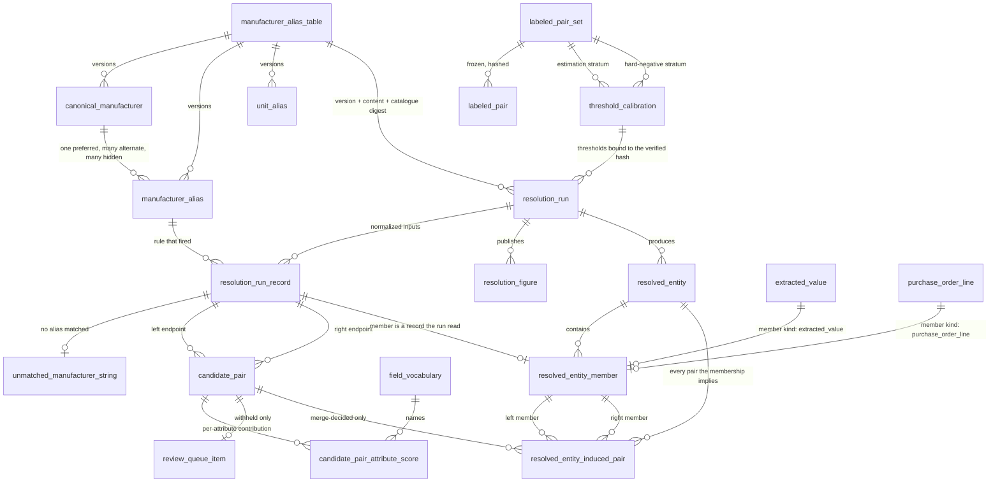

# Data Model — Cross-Document Identity Resolution

> Feature: `00009-cross-document-identity-resolution` (E009) | Storage: **PostgreSQL 16 + `pgvector`**, single instance, schema `public` | Migrations: forward-only Alembic in `/src/model`, filename block **`0500`–`0599`** | Consumers: E012 (traceability), E014 (evaluation harness), E016 (review workspace)

E009 **populates** `resolved_entity` and `resolved_entity_member`, which E003 owns; **extends** both under FR-045's recorded governance exception; and **adds thirteen relations and two views of its own** — a versioned alias artifact in four tables, a frozen labeled set in two, a threshold calibration, a run manifest, the run's normalized input records, the candidate pairs and their per-attribute scores, the induced-pair clique record, the review queue, the unmatched-alias record, and the published figures.

## Scope

| Aspect | Position |
|--------|----------|
| Owned by this epic | `manufacturer_alias_table`, `canonical_manufacturer`, `manufacturer_alias`, `unit_alias`, `labeled_pair_set`, `labeled_pair`, `threshold_calibration`, `resolution_run`, `resolution_run_record`, `unmatched_manufacturer_string`, `candidate_pair`, `candidate_pair_attribute_score`, `resolved_entity_induced_pair`, `review_queue_item`, `resolution_figure`, and the views `v_active_resolution_run` and `v_open_review_item`. Nothing else. |
| **Altered, by recorded exception** | `resolved_entity` and `resolved_entity_member` — E003's tables, extended with project and run columns and re-scoped uniqueness under **FR-045**. See §The FR-045 Extension below; it is the first section of this document for a reason. |
| **Not** owned, **not** altered | `document`, `chunk`, `field_vocabulary`, `extracted_value`, `extracted_value_contributing_chunk`, `extraction_failure`, `purchase_order_line`, `lifecycle_event`, and every E004/E006/E007 relation. E009 adds **zero columns, zero constraints, zero indexes** to any of them. `specs/00003-core-data-schema/data-model.md` is normative over this document under {SAD:ADR-0017} for everything except the two tables FR-045 names; where the two disagree elsewhere, that one governs and this one is the defect. |
| Migration block | `0500`–`0599`, claimed at epic start by scanning the highest block in use (spec Implementation Signals). E003 holds `0001`–`0099`, E004 `0100`–`0199`, E005 `0200`–`0299` (reserved, empty), E007 `0300`–`0399`, **E006 `0400`–`0499`** with five shipped revisions. The chain head is `0404`; E009's first revision chains from it by `down_revision`. |
| Not a table | The quality **report** itself — the prose artifact a reader opens. `resolution_figure` holds the figures as rows because FR-025, FR-037a and FR-038 are single-row rules once a figure is a row (see §`resolution_figure`); the report is the rendering of those rows plus the manifest, and it stores nothing the rows do not. Also not tables: the blocking key index (a transient join structure), the alias-table source file (E002's committed catalogue, hashed into the manifest), and the pair-completeness arithmetic. |
| Not computed in the database | Every score, every interval, every hash, every unit conversion factor's application, and the alias-table content digest are computed in Python behind the computation-boundary contract (Principle V, {SAD:ADR-0008}). The database stores results and enforces shape. **No generated column beyond one** (`resolved_entity_member.member_record_id`, which is a `coalesce` over two columns of its own row and performs no arithmetic) and **no trigger** is added by this epic. |

## The FR-045 Extension — E009 alters two tables E003 owns

**Read this before anything else in the document.** A later reader will find an E009 migration issuing `ALTER TABLE` against `resolved_entity` and `resolved_entity_member`, and must be able to see that it was chosen, why, and what it cost. E006's FR-065 forbids a later epic altering E003's tables; `specs/project-plan.md` registers ownership as "ResolvedEntity | E003 (schema), E009 (populated)". This epic alters them anyway, by explicit decision recorded in spec §Risks and mandated by FR-045.

**What is unbuildable against the tables as delivered.** `0010_resolved_entity.py` declares:

- `uq_rem__extracted_value UNIQUE (extracted_value_id)`
- `uq_rem__po_line UNIQUE (po_line_id)`
- `uq_resolved_entity__normalized_identity UNIQUE (normalized_manufacturer, normalized_part_number)`

None carries a run column, and neither table carries a project column. Three consequences, each of which defeats a requirement:

| Delivered constraint | What it makes impossible | Requirement defeated |
|---|---|---|
| `uq_rem__extracted_value` | A record that was a member of run 1's entity cannot be a member of run 2's — the second run's insert collides. Append-only runs cannot coexist. | **FR-039**, SC-033 |
| `uq_rem__po_line` | Same, on the line side. | **FR-039**, SC-033 |
| `uq_resolved_entity__normalized_identity` | Two runs cannot both emit an entity for `('square d', 'nq442l2c')` — and neither can two projects. Re-running resolution collides on its own previous output. | **FR-039** and **FR-020** |
| No `project_id` on `resolved_entity` | "No cluster spans projects" is not expressible and not readable from the row. | **FR-020**, SC-006 |
| No `resolution_run_id` on either table | An entity cannot be attributed to the run that produced it, so the active-run pointer selects nothing. | **FR-039**, FR-034, SC-033 |

**FR-045 names only the first two.** `uq_resolved_entity__normalized_identity` is equally unbuildable and is re-scoped here on the same authority — recorded as ambiguity **A-2**, not resolved silently.

**What the extension does, exactly.** Migration `0505`:

| Object | Action | Result |
|---|---|---|
| `resolved_entity.resolution_run_id` | `ADD COLUMN uuid NOT NULL` | The run that produced the entity |
| `resolved_entity.project_id` | `ADD COLUMN text NOT NULL` | FR-020, readable on the row |
| `uq_resolved_entity__normalized_identity` | **DROP**, then `ADD uq_resolved_entity__run_identity UNIQUE (resolution_run_id, normalized_manufacturer, normalized_part_number)` | Run-scoped identity; two runs may each emit the entity, one run may not emit it twice |
| `uq_resolved_entity__id_run` | `ADD UNIQUE (resolved_entity_id, resolution_run_id)` | Redundant against the primary key **by design** — the FK target `resolved_entity_induced_pair` needs, so an induced pair cannot name an entity from a different run |
| `fk_resolved_entity__run_project` | `ADD FOREIGN KEY (resolution_run_id, project_id) REFERENCES resolution_run (resolution_run_id, project_id) MATCH FULL ON DELETE RESTRICT ON UPDATE CASCADE` | The entity's project **cannot disagree** with its run's; FR-020 becomes referential rather than tested |
| `resolved_entity_member.resolution_run_id` | `ADD COLUMN uuid NOT NULL` | FR-039 |
| `resolved_entity_member.member_role` | `ADD COLUMN text NOT NULL` + `ck_rem__member_role`, `ck_rem__role_agrees_with_kind` | FR-041's three roles |
| `resolved_entity_member.member_record_id` | `ADD COLUMN uuid GENERATED ALWAYS AS (coalesce(extracted_value_id, po_line_id)) STORED NOT NULL` | The XOR's populated side as one column, so a composite FK can reference it |
| `uq_rem__extracted_value` | **DROP**, then `ADD uq_rem__run_extracted_value UNIQUE (resolution_run_id, extracted_value_id)` | A record belongs to at most one entity **per run**, and to a different entity in a later run |
| `uq_rem__po_line` | **DROP**, then `ADD uq_rem__run_po_line UNIQUE (resolution_run_id, po_line_id)` | Same, line side |
| `uq_rem__entity_kind_record` | `ADD UNIQUE (resolved_entity_id, member_kind, member_record_id)` | FK target for the induced-pair endpoints |
| `fk_rem__entity_run` | `ADD FOREIGN KEY (resolved_entity_id, resolution_run_id) REFERENCES resolved_entity (resolved_entity_id, resolution_run_id) MATCH FULL ON DELETE CASCADE ON UPDATE CASCADE` | A member's run cannot disagree with its entity's |
| `fk_rem__run_record` | `ADD FOREIGN KEY (resolution_run_id, member_kind, member_record_id) REFERENCES resolution_run_record (resolution_run_id, record_kind, record_id) MATCH FULL ON DELETE RESTRICT ON UPDATE CASCADE` | A member must be a record **the run actually read** — and therefore carries the run's project |
| `ix_rem__single_specification_section` | `CREATE UNIQUE INDEX … ON resolved_entity_member (resolved_entity_id) WHERE member_role = 'specification_section'` | **FR-041, SC-041** — at most one specification section per cluster, as a write-time rejection |
| `ix_rem__run` | `CREATE INDEX … (resolution_run_id)` | Referencing-side index for the new run edges |

**The re-scoped uniqueness still depends on `NULLS DISTINCT`, and adding a NOT NULL leading column does not change that.** `0010`'s module docstring records that `uq_rem__extracted_value` works only because PostgreSQL's default `NULLS DISTINCT` lets the many line members' NULL `extracted_value_id` coexist. Under `UNIQUE (resolution_run_id, extracted_value_id)` the rule is unchanged: a unique index treats a row with a NULL in **any** indexed column as distinct from every other row, so every line member of a run — each with `resolution_run_id` populated and `extracted_value_id` NULL — still coexists freely, while two rows naming the same run *and* the same extracted value still collide immediately. Written `UNIQUE NULLS NOT DISTINCT`, this schema would hold at most one line member per run. The two new indexes are asserted to carry `indnullsnotdistinct = false` exactly as the two they replace were.

**Why extend rather than duplicate.** A parallel `e009_resolved_entity` would split the join surface E012, E014 and E016 all read, and would leave `resolved_entity` in the schema as a table nothing writes — a second answer to "what merged" that is always empty and therefore always agrees. Recorded as the scope decision in spec §Risks.

**The cost, stated rather than discovered.**

1. **`specs/00003-core-data-schema/data-model.md` §`resolved_entity` / `resolved_entity_member` becomes false** in its column lists, in its three unique-constraint declarations, and — separately, and **not recorded in the spec's Risks** — in its privilege rationale. `0010` grants all four verbs on both tables "because a resolved entity is a revisable judgement about identity, and E009 must be able to withdraw a merge it later finds unsupported". FR-039 says the opposite: a later run must not alter or delete an earlier run's entities. E009's `0509` therefore **revokes `UPDATE` and `DELETE`** on both tables, and E003's stated reason for granting them is withdrawn. This is a second amendment need against E003's document and is recorded in §Amendment Needs.
2. **E003's own test suite breaks.** `src/model/tests/schema/test_resolved_entity.py` matches on `uq_rem__extracted_value` and `uq_rem__po_line` by name at seven sites, parametrizes the `indnullsnotdistinct` assertion over both names, and asserts that `resolved_entity_member` carries *exactly three* foreign keys. All of those are falsified. E009 updates them; the change is recorded rather than performed quietly.
3. **E006's FR-065 ownership guard does not cover this.** `E003_OWNED_TABLES` in `src/model/tests/schema/test_table_ownership.py` names six tables — `chunk`, `document`, `extracted_value`, `extracted_value_contributing_chunk`, `extraction_failure`, `field_vocabulary` — and **neither `resolved_entity` nor `resolved_entity_member` is among them**. So the snapshot comparison that would have caught an alteration is blind to this one. That is not a licence; it is the reason the exception has to be caught by review and by this section, and it is recorded in §Disclosed Gaps as **G-9**.
4. **`specs/project-plan.md`'s schema-ownership row** must admit the extension. Governance reserves it to the default branch; recorded, not performed.

**The ALTER is affordable because both tables are empty.** `resolved_entity` and `resolved_entity_member` are P2 objects E003 created and nothing has ever populated — E009 is their first writer. `ADD COLUMN … NOT NULL` without a default, and `ADD COLUMN … GENERATED … NOT NULL`, both succeed on a table with zero rows and would both fail on a populated one. This is stated because it is the whole reason the extension is one migration rather than a backfill: it is true today and stops being true the moment E009 runs once.

## Conventions

Inherited from `specs/00003-core-data-schema/data-model.md` §Conventions without exception. Restated only where this epic must make a choice.

| Aspect | Rule |
|--------|------|
| Constraint names | `pk_<table>`, `uq_<table>__<purpose>`, `fk_<table>__<target>`, `ck_<table>__<rule>`, `ix_<table>__<purpose>`. Every constraint explicitly named — a server-generated name cannot be referenced by a later forward migration's `DROP CONSTRAINT` (which this epic performs three times), and a test asserting *which* rule rejected a row matches on a name, never on message text. `rem` is E003's declared short form for `resolved_entity_member` and is used for every constraint E009 adds to it. Every name below is ≤ 63 bytes; the longest, `ck_resolution_run_record__base_quantity_iff_dimensional`, is 55. |
| Migrations | Forward-only. `revision` doubles as the four-digit filename prefix. Ordering is `down_revision` and only `down_revision`. Every `downgrade()` raises `NotImplementedError`. Explicit DDL only — no autogenerate. Style reference: `src/model/src/model/schema/versions/0006_extraction.py`. |
| Trim set in presence checks | `btrim(col, E' \t\n\r\f')`. Spelled ``, **never `\v`** — PostgreSQL's escape-string syntax has no `\v`, so `E'\v'` is the *letter* `v`: the wrong form both admits a vertical-tab-only value and rejects a legitimate value of `vvv`. E003's `0004`, `0006`, `0007`, `0010` and E006's `0400` all record the same correction. |
| Digest format | `^sha256:[0-9a-f]{64}$`, matching `document.roster_hash`, `forecast_run.input_data_hash` and `ingestion_run.extraction_prompt_digest`. |
| Timestamps | `timestamptz`, never `timestamp`. Calendar anchors are `date`. |
| **Column defaults** | **E009 adds exactly one**: `resolution_run.is_active DEFAULT false`. `src/model/tests/schema/test_constraint_audit.py` parses the permitted set out of every data model's TR-063 traceability row and asserts it in **both directions** — a default on an unenumerated column fails, *and* an enumerated name that exists as a column and carries no default fails. So no table here names a column `created_at`, `added_at`, `loaded_at`, `extracted_at` or `failed_at`, and `is_active` carries `DEFAULT false` because the enumeration requires it to. Child rows carry no per-row timestamp at all: the whole run is one transaction (§Write Order), so `resolution_run.started_at`/`.finished_at` bound every row it wrote, and a per-row timestamp would be a second answer within microseconds of itself. |
| Nullable columns | A `CHECK` touching one is written `col IS NULL OR …`, `(col IS NULL) = …`, `coalesce(col, …)`, or `num_nonnulls(…)`. `IS NOT DISTINCT FROM` is **not** used: it is null-safe in SQL but is not one of the three constructs the constraint audit recognises, so a check written that way is reported as unguarded. Every such check is registered in §Nullable-column checks. |
| Composite FKs | Declared `MATCH FULL` unless a deliberate all-null case is documented. E009 declares no partially-null referencing tuple. |
| Deferrability | E009 adds **zero** deferrable constraints. `fk_purchase_order_line__closing_event` remains the schema's only one. |
| Grants | Explicit. E003's `0009` declined `ALTER DEFAULT PRIVILEGES`, so a revision that adds a table grants to `procurement_app` explicitly or the role cannot touch it. |
| Vocabulary spelling | `'extracted_value'` and `'purchase_order_line'` are the two record kinds, spelled exactly as `ck_rem__member_kind` spells them. A reader comparing a candidate pair against a resolved-entity member must not have to translate. |

## Entities

The compact artifact. Detail sections follow; downstream agents that read only this table have the shape.

| Entity | Attributes (name: type, constraints) | Relationships | State Transitions |
|--------|--------------------------------------|---------------|-------------------|
| **manufacturer_alias_table** | `alias_table_version: text` PK `CHECK(~ '^v[0-9]{3}$')`; `content_digest: text` NOT NULL sha256; `catalogue_digest: text` NOT NULL sha256 (E002's manufacturer catalogue, FR-040); `base_unit_system: text` NOT NULL non-empty (FR-005's declared base form); `committed_at: timestamptz` NOT NULL; UNIQUE `(alias_table_version, content_digest, catalogue_digest)` | has_many: `canonical_manufacturer`, `manufacturer_alias`, `unit_alias`; referenced_by: `resolution_run` | — (immutable once written; `UPDATE`/`DELETE` revoked) |
| **canonical_manufacturer** | PK `(alias_table_version, canonical_manufacturer_key)`; `canonical_manufacturer_key: text` NOT NULL `CHECK(~ '^[a-z0-9]+(-[a-z0-9]+)*$')`; `preferred_label: text` NOT NULL non-empty; `part_number_prefix: text` NOT NULL non-empty `CHECK(= upper(...))`; UNIQUE `(alias_table_version, preferred_label)` | belongs_to: `manufacturer_alias_table` (CASCADE); has_many: `manufacturer_alias` | — |
| **manufacturer_alias** | `alias_rule_id: uuid` PK; `alias_table_version: text` NOT NULL; `canonical_manufacturer_key: text` NOT NULL; `raw_alias: text` NOT NULL non-empty (FR-003); `normalized_alias: text` NOT NULL `CHECK(= lower(...) AND btrim<>'')`; `label_class: text` NOT NULL `CHECK(IN ('preferred','alternate','hidden'))`; **UNIQUE `(alias_table_version, normalized_alias)`** — FR-002/SC-028, the whole mechanism; partial UNIQUE INDEX `(alias_table_version, canonical_manufacturer_key) WHERE label_class = 'preferred'` | belongs_to: `canonical_manufacturer` via composite FK (CASCADE); referenced_by: `resolution_run_record.alias_rule_id` | — |
| **unit_alias** | PK `(alias_table_version, normalized_raw_unit)`; `raw_unit: text` NOT NULL non-empty; `normalized_raw_unit: text` NOT NULL `CHECK(= lower(...) AND btrim<>'')`; `unit_class: text` NOT NULL `CHECK(IN ('dimensional','arbitrary'))`; `dimension: text` NULL `CHECK((unit_class='dimensional') = (dimension IS NOT NULL))`; `base_unit: text` NULL, same biconditional; `factor_to_base: numeric` NULL `CHECK((base_unit IS NULL) = (factor_to_base IS NULL))` and `CHECK(NULL OR > 0)` | belongs_to: `manufacturer_alias_table` (CASCADE) | — |
| **labeled_pair_set** | `set_hash: text` PK sha256; `stratum: text` NOT NULL `CHECK(IN ('estimation','hard_negative'))`; `sampling_frame: text` NOT NULL `CHECK(IN ('within_project_pair_space','blocking_key_agreement'))` `CHECK((stratum='estimation') = (sampling_frame='within_project_pair_space'))`; `pair_count: int` NOT NULL `CHECK(>0)`; `true_pair_count: int` NOT NULL `CHECK(>=0 AND <= pair_count)`; `annotator_count: int` NOT NULL `CHECK(>=1)`; `frozen_at: timestamptz` NOT NULL; UNIQUE `(set_hash, stratum)` | has_many: `labeled_pair`; referenced_by: `threshold_calibration` twice | — (frozen; FR-017 verifies the hash on every run) |
| **labeled_pair** | `labeled_pair_id: uuid` PK; `set_hash: text` NOT NULL; `stratum: text` NOT NULL; `project_id: text` NOT NULL `CHECK(~ '^PRJ-[0-9]{3}$')`; `left_record_kind`, `right_record_kind: text` NOT NULL `CHECK(IN 2 values)`; `left_record_id`, `right_record_id: uuid` NOT NULL; `CHECK((left_record_kind,left_record_id) < (right_record_kind,right_record_id))`; `is_true_pair: boolean` NOT NULL; `annotator_id: text` NOT NULL non-empty (FR-036); `annotation_basis: text` NOT NULL non-empty; `annotated_at: timestamptz` NOT NULL; UNIQUE `(set_hash, left_record_kind, left_record_id, right_record_kind, right_record_id)` | belongs_to: `labeled_pair_set` via composite FK `(set_hash, stratum)` (RESTRICT); **no FK to `extracted_value` / `purchase_order_line`** — see §`labeled_pair` | — |
| **threshold_calibration** | `calibration_id: uuid` PK; `estimation_stratum_hash: text` NOT NULL sha256; `estimation_stratum_kind: text` NOT NULL `CHECK(='estimation')`; `hard_negative_stratum_hash: text` NOT NULL sha256; `hard_negative_stratum_kind: text` NOT NULL `CHECK(='hard_negative')`; `CHECK(estimation_stratum_hash <> hard_negative_stratum_hash)`; `merge_threshold`, `reject_threshold: double precision` NOT NULL `CHECK(>=0 AND <=1)` each; `CHECK(reject_threshold < merge_threshold)`; `weight_manufacturer`, `weight_part_number`, `weight_description`, `weight_unit_of_measure: double precision` NOT NULL `CHECK(>=0 AND <=1)` each, `CHECK(sum <= 1)` (FR-047); `calibrated_at: timestamptz` NOT NULL; **UNIQUE `(estimation_stratum_hash, hard_negative_stratum_hash)`**; UNIQUE `(both hashes, both thresholds, all four weights)` | belongs_to: `labeled_pair_set` twice via composite FKs carrying the pinned stratum literals (RESTRICT); referenced_by: `resolution_run` | — (written once, before any run; `UPDATE`/`DELETE` revoked) |
| **resolution_run** | `resolution_run_id: uuid` PK; `project_id: text` NOT NULL `CHECK(~ '^PRJ-[0-9]{3}$')`; `alias_table_version: text` NOT NULL; `alias_table_content_digest`, `catalogue_digest: text` NOT NULL sha256; `estimation_stratum_hash`, `hard_negative_stratum_hash: text` NOT NULL sha256; `merge_threshold`, `reject_threshold: double precision` NOT NULL `CHECK(>=0 AND <=1)`, `CHECK(reject < merge)`; the four weight columns NOT NULL with the same range checks and `CHECK(sum <= 1)` (FR-047); `input_extracted_value_count`, `input_po_line_count: int` NOT NULL `CHECK(>=0)`; `started_at: timestamptz` NOT NULL; `finished_at: timestamptz` **NOT NULL** `CHECK(>= started_at)`; `is_active: boolean` NOT NULL DEFAULT `false`; UNIQUE `(resolution_run_id, project_id)`; UNIQUE `(resolution_run_id, project_id, merge_threshold, reject_threshold)`; UNIQUE `(resolution_run_id, alias_table_version)`; partial UNIQUE INDEX `(project_id) WHERE is_active` | belongs_to: `manufacturer_alias_table` via composite FK `(version, content_digest, catalogue_digest)` (RESTRICT); belongs_to: `threshold_calibration` via composite FK on both hashes, **both thresholds and all four weights** (RESTRICT) — FR-044, FR-047; has_many: everything below | `Created (is_active=false) → Active → Superseded`. The flip of `is_active` is the **only** `UPDATE` E009 grants on any table. At most one active run **per project**. |
| **resolution_run_record** | PK `(resolution_run_id, record_kind, record_id)`; `record_kind: text` NOT NULL `CHECK(IN 2 values)`; `record_id: uuid` NOT NULL; `project_id: text` NOT NULL; `alias_table_version: text` NOT NULL; `raw_manufacturer`, `normalized_manufacturer: text` NULL (paired); `canonical_manufacturer_key: text` NULL; `alias_rule_id: uuid` NULL `CHECK((canonical_manufacturer_key IS NULL) = (alias_rule_id IS NULL))`; `raw_part_number`, `normalized_part_number: text` NULL (paired); `part_number_prefix: text` NULL; `raw_unit_of_measure`, `normalized_unit: text` NULL (paired); `unit_class: text` NULL; `quantity_raw`, `quantity_base: numeric` NULL `CHECK((quantity_base IS NOT NULL) = (coalesce(unit_class,'')='dimensional' AND quantity_raw IS NOT NULL))`; `specification_section: text` NULL | belongs_to: `resolution_run` via composite FK `(run_id, project_id)` (RESTRICT); belongs_to: `manufacturer_alias` via `(alias_table_version, alias_rule_id)` (RESTRICT); referenced_by: `candidate_pair` twice, `resolved_entity_member` | — (append-only) |
| **unmatched_manufacturer_string** | PK `(resolution_run_id, source_record_kind, source_record_id)`; `project_id: text` NOT NULL; `alias_table_version: text` NOT NULL; `raw_value: text` NOT NULL non-empty; `normalized_value: text` NOT NULL `CHECK(= lower(...) AND btrim<>'')` | belongs_to: `resolution_run_record` via composite FK (RESTRICT); belongs_to: `resolution_run` via `(run_id, alias_table_version)` (RESTRICT) | — (append-only; FR-013's negative evidence) |
| **candidate_pair** | `candidate_pair_id: uuid` PK; `resolution_run_id: uuid` NOT NULL; `project_id: text` NOT NULL; `left_record_kind`, `right_record_kind: text` NOT NULL; `left_record_id`, `right_record_id: uuid` NOT NULL; `CHECK((left_kind,left_id) < (right_kind,right_id))`; `blocking_key_kinds: text[]` NOT NULL `CHECK(cardinality>=1 AND no NULL element AND <@ ARRAY['canonical_manufacturer','part_number_prefix'])`; `total_score: double precision` NOT NULL `CHECK(>=0 AND <=1)`; `merge_threshold`, `reject_threshold: double precision` NOT NULL; `decision: text` NOT NULL `CHECK(IN ('merge','withhold','reject'))` **and** `CHECK(decision = CASE WHEN total_score > merge_threshold THEN 'merge' WHEN total_score < reject_threshold THEN 'reject' ELSE 'withhold' END)`; **UNIQUE `(resolution_run_id, left_kind, left_id, right_kind, right_id)`**; UNIQUE `(… , decision)`; UNIQUE `(candidate_pair_id, resolution_run_id, project_id, left_kind, left_id, right_kind, right_id, decision)` | belongs_to: `resolution_run` via composite FK `(run_id, project_id, merge_threshold, reject_threshold)` (RESTRICT); belongs_to: `resolution_run_record` twice (RESTRICT); has_many: `candidate_pair_attribute_score`; referenced_by: `review_queue_item`, `resolved_entity_induced_pair` | — (append-only; the decision is a function of the score and the run's thresholds, enforced by `CHECK`) |
| **candidate_pair_attribute_score** | PK `(candidate_pair_id, attribute_name)`; `attribute_name: text` NOT NULL; `comparison_kind: text` NOT NULL `CHECK(IN ('normalized_equality','string_similarity','unit_canonical_equality','unit_equality','absent'))`; `agreement: double precision` NOT NULL `CHECK(>=0 AND <=1)`; `weight: double precision` NOT NULL `CHECK(>=0 AND <=1)`; `contribution: double precision` NOT NULL `CHECK(>=0 AND <=1)`; `left_raw_value`, `left_normalized_value`, `right_raw_value`, `right_normalized_value: text` NULL, no check | belongs_to: `candidate_pair` (CASCADE); belongs_to: **`field_vocabulary (field_name)`** (RESTRICT / CASCADE) | — (append-only) |
| **resolved_entity** *(E003's, extended)* | E003's five columns unchanged, plus `resolution_run_id: uuid` NOT NULL and `project_id: text` NOT NULL `CHECK(~ '^PRJ-[0-9]{3}$')`; `uq_resolved_entity__normalized_identity` **dropped** and replaced by UNIQUE `(resolution_run_id, normalized_manufacturer, normalized_part_number)`; UNIQUE `(resolved_entity_id, resolution_run_id)` added | belongs_to: `resolution_run` via composite FK `(run_id, project_id)` (RESTRICT) — FR-020; has_many: `resolved_entity_member`, `resolved_entity_induced_pair` | — (append-only once written; `UPDATE`/`DELETE` revoked by `0509`, reversing `0010`'s grant) |
| **resolved_entity_member** *(E003's, extended)* | E003's seven columns unchanged, plus `resolution_run_id: uuid` NOT NULL; `member_role: text` NOT NULL `CHECK(IN ('specification_section','submittal_line_item','purchase_order_line'))` and `CHECK((role='purchase_order_line') = (kind='purchase_order_line'))`; `member_record_id: uuid` NOT NULL GENERATED ALWAYS AS `coalesce(extracted_value_id, po_line_id)` STORED; `uq_rem__extracted_value` and `uq_rem__po_line` **dropped** and replaced by UNIQUE `(resolution_run_id, extracted_value_id)` and UNIQUE `(resolution_run_id, po_line_id)`; UNIQUE `(resolved_entity_id, member_kind, member_record_id)` added; partial UNIQUE INDEX `(resolved_entity_id) WHERE member_role = 'specification_section'` | belongs_to: `resolved_entity` (CASCADE, and the new run-carrying edge); belongs_to: `resolution_run_record` via `(run_id, member_kind, member_record_id)` (RESTRICT); belongs_to: `extracted_value` XOR `purchase_order_line` (E003's, unchanged); referenced_by: `resolved_entity_induced_pair` twice | — (append-only; `UPDATE`/`DELETE` revoked by `0509`) |
| **resolved_entity_induced_pair** | PK `(resolved_entity_id, left_record_kind, left_record_id, right_record_kind, right_record_id)`; `resolution_run_id: uuid` NOT NULL; `decision: text` NOT NULL `CHECK(= 'merge')`; `CHECK((left_kind,left_id) < (right_kind,right_id))` | belongs_to: `resolved_entity` via `(entity_id, run_id)` (CASCADE); belongs_to: `candidate_pair` via `(run_id, left_kind, left_id, right_kind, right_id, decision)` (RESTRICT) — **FR-018**; belongs_to: `resolved_entity_member` **twice**, via `(entity_id, kind, record_id)` (RESTRICT) | — (append-only) |
| **review_queue_item** | `candidate_pair_id: uuid` PK; `resolution_run_id: uuid` NOT NULL; `project_id: text` NOT NULL; `left_record_kind`, `right_record_kind: text` NOT NULL; `left_record_id`, `right_record_id: uuid` NOT NULL; `decision: text` NOT NULL `CHECK(= 'withhold')` | belongs_to: `candidate_pair` via the eight-column composite FK against `uq_candidate_pair__review_identity` (RESTRICT) | — **No adjudication column.** FR-023: E016 adds adjudication state as its own table keyed on the stable pair identity, altering nothing here. |
| **resolution_figure** | PK `(resolution_run_id, figure_name)`; `figure_name: text` NOT NULL `CHECK(IN 8 values — the six resolver figures plus `baseline_merge_precision` and `baseline_recall`)`; `figure_kind: text` NOT NULL `CHECK(IN ('estimate','census'))` and `CHECK((kind='census') = (name IN ('coverage','reduction_ratio','withheld_share')))`; `stratum: text` NOT NULL `CHECK(IN ('estimation','run_candidate_set'))` — **`hard_negative` is deliberately absent** (FR-037); `numerator`, `denominator: int` NOT NULL `CHECK(>=0)`, `CHECK(numerator <= denominator)`; `point_estimate: double precision` NULL `CHECK((denominator=0) = (point_estimate IS NULL))`; `interval_method: text` NULL; `interval_sidedness: text` NULL; `interval_lower`, `interval_upper: double precision` NULL; `no_interval_reason: text` NULL `CHECK(num_nonnulls(interval_method, no_interval_reason) = 1)`; `observed_error_count: int` NULL; `small_sample_disclosed: boolean` NOT NULL; `target_value: double precision` NULL; `meets_target: boolean` NULL; `shortfall_cause: text` NULL | belongs_to: `resolution_run` (RESTRICT) | — (append-only) |
| **v_active_resolution_run** *(view)* | `SELECT * FROM resolution_run WHERE is_active` | — | — |
| **v_open_review_item** *(view)* | Every `review_queue_item` of an active run, joined to its run's project and thresholds | `review_queue_item JOIN v_active_resolution_run` | — |

<details><summary>ER diagram (visual reference)</summary>



</details>

---

## Table Detail

### The alias artifact — `manufacturer_alias_table`, `canonical_manufacturer`, `manufacturer_alias`, `unit_alias` (FR-001 … FR-006, FR-040)

**Four tables, one versioned artifact.** FR-004 requires an alias-table version identifier on every run; FR-005 requires a declared base-unit form. Nothing in the spec says whether the unit half is versioned by the same identifier as the manufacturer half — recorded as ambiguity **A-10**, resolved here by making it one artifact: `unit_alias` is scoped by `alias_table_version` and the base-unit system is declared on the header row. A run therefore names one version and gets both halves, and a unit-rule change is a version bump exactly as an alias change is.

#### `manufacturer_alias_table`

| Column | Type | Null | Constraint |
|--------|------|------|-----------|
| `alias_table_version` | `text` | NOT NULL | `pk_manufacturer_alias_table` PRIMARY KEY; `ck_manufacturer_alias_table__version_format CHECK (alias_table_version ~ '^v[0-9]{3}$')`. A natural text key, following E003's rule that an upstream artifact owning the identifier keeps it. Zero-padded and monotone so a directory listing sorts; the ordering carries no semantics and nothing compares two versions. |
| `content_digest` | `text` | NOT NULL | `ck_manufacturer_alias_table__content_digest_format CHECK (~ '^sha256:[0-9a-f]{64}$')`. The digest of the artifact's **own** contents — every canonical manufacturer, alias and unit row, canonically serialized. **Not the same as the version identifier, and the difference is the point**: a version identifier can be reused for changed contents by a careless edit, and the manifest would then record a version that no longer describes what fired. FR-004's guarantee — "know which alias-table version produced any historical resolution" — is only worth something if the version is pinned to contents. |
| `catalogue_digest` | `text` | NOT NULL | `ck_manufacturer_alias_table__catalogue_digest_format CHECK (~ '^sha256:[0-9a-f]{64}$')`. **FR-040, SC-036**: E002's committed manufacturer catalogue, the source the table's initial contents derive from. Recorded here rather than only on the run, so a second run under the same alias version cannot claim a different catalogue. |
| `base_unit_system` | `text` | NOT NULL | `ck_manufacturer_alias_table__base_unit_system_present CHECK (btrim(base_unit_system, E' \t\n\r\f') <> '')`. **FR-005's "declared base-unit form"**, declared as data rather than as a code constant, for the reason `ingestion_run.confidence_floor` is a column: a base system left in code is whatever happens to be checked out, and a quantity converted under one and compared under another produces a wrong answer with no symptom. |
| `committed_at` | `timestamptz` | NOT NULL | No default — a default would let a writer omit the fact (TR-063). |

| Name | Definition | Purpose |
|------|-----------|---------|
| `uq_manufacturer_alias_table__version_content_catalogue` | `UNIQUE (alias_table_version, content_digest, catalogue_digest)` | Redundant against the primary key **by design**, exactly as `uq_extracted_value__id_source_count` is. It is the foreign-key target `resolution_run` references, and referencing all three columns at once is what makes the run's recorded content digest and catalogue digest **unable to disagree** with the artifact's own. Without it, SC-036 would be a convention; with it, a run naming a catalogue digest the alias table does not carry has no referent. |

#### `canonical_manufacturer`

The SKOS concept. One row per canonical manufacturer per alias-table version.

| Column | Type | Null | Constraint |
|--------|------|------|-----------|
| `alias_table_version` | `text` | NOT NULL | part of `pk_canonical_manufacturer`; part of `fk_canonical_manufacturer__table` |
| `canonical_manufacturer_key` | `text` | NOT NULL | part of the PK; `ck_canonical_manufacturer__key_format CHECK (canonical_manufacturer_key ~ '^[a-z0-9]+(-[a-z0-9]+)*$')`. A stable slug, the same shape `document.document_id` uses. It is the identity a merge records, and it is deliberately **not** the display name: a preferred label corrected for punctuation would otherwise rewrite every historical merge's identity. |
| `preferred_label` | `text` | NOT NULL | `ck_canonical_manufacturer__preferred_label_present CHECK (btrim(preferred_label, E' \t\n\r\f') <> '')`. **SKOS's "exactly one preferred label per concept", as a column rather than as a row class.** A second preferred label is not forbidden by a rule — it is unrepresentable, because there is one column to hold it. That is strictly stronger than modelling preferred labels as rows of `manufacturer_alias` and constraining the count, and it costs nothing. |
| `part_number_prefix` | `text` | NOT NULL | `ck_canonical_manufacturer__prefix_present CHECK (btrim(part_number_prefix, E' \t\n\r\f') <> '')` and `ck_canonical_manufacturer__prefix_upper CHECK (part_number_prefix = upper(part_number_prefix))`. E002's catalogue guarantees one prefix per manufacturer (spec §Assumptions), so `NOT NULL` is a fact about the source rather than a hope. Upper-cased rather than lower-cased, unlike every other normalized column here, because a catalogue prefix is printed upper-case and the blocking key is compared against a printed value; the case rule is asserted so the blocking key cannot silently be built from two conventions. |

| Name | Definition | Purpose |
|------|-----------|---------|
| `pk_canonical_manufacturer` | `PRIMARY KEY (alias_table_version, canonical_manufacturer_key)` | Also the FK target `manufacturer_alias` references, which is why the version leads. |
| `uq_canonical_manufacturer__version_label` | `UNIQUE (alias_table_version, preferred_label)` | Two concepts cannot share a display name. SKOS's disjointness read the other way: the preferred label identifies the concept to a human, and two concepts answering to one label makes a review-queue item unreadable. |
| `fk_canonical_manufacturer__table` | `(alias_table_version) → manufacturer_alias_table (alias_table_version)` `ON DELETE CASCADE ON UPDATE CASCADE` | The one `CASCADE` in the alias artifact: a version has no meaning without its header row, and dropping an unpublished draft version should be one statement. A published version is protected instead by `fk_resolution_run__alias_table`'s `RESTRICT`. |

#### `manufacturer_alias`

The alias rows, and the table FR-002 is about.

| Column | Type | Null | Constraint |
|--------|------|------|-----------|
| `alias_rule_id` | `uuid` | NOT NULL | `pk_manufacturer_alias` PRIMARY KEY. **FR-001 requires recording "which alias rule fired"**, so a rule needs an identity to be recorded *by*. A surrogate rather than the alias string itself, because the string is the thing that changes between versions while the rule's referent does not. |
| `alias_table_version` | `text` | NOT NULL | part of `fk_manufacturer_alias__canonical` and of the two unique keys below |
| `canonical_manufacturer_key` | `text` | NOT NULL | part of the same FK — the target of the mapping |
| `raw_alias` | `text` | NOT NULL | `ck_manufacturer_alias__raw_alias_present CHECK (btrim(raw_alias, E' \t\n\r\f') <> '')`. **FR-003's additivity at the artifact boundary**: the alias as E002's catalogue prints it, retained beside the normalized form and never discarded. Two spellings that normalize to one key are two rows here, and the second's insert is what SC-028 rejects. |
| `normalized_alias` | `text` | NOT NULL | `ck_manufacturer_alias__normalized_alias_normalized CHECK (normalized_alias = lower(normalized_alias) AND btrim(normalized_alias, E' \t\n\r\f') <> '')`. The matching key. `lower()` rather than a collation-dependent fold, for E003's reason: a `CHECK` must stay true across an ICU upgrade and existing rows are never rechecked. |
| `label_class` | `text` | NOT NULL | `ck_manufacturer_alias__label_class CHECK (label_class IN ('preferred','alternate','hidden'))`. **SKOS's three pairwise-disjoint label properties.** Disjointness is structural: a row has one class because the column holds one value. `hidden` is the match-only class — known misspellings and OCR variants that must match and must never be displayed — and separating it is what lets the match surface grow while the display name stays stable. E002's catalogue guarantees a canonical name and at least one alternate; **a misspelling class is not guaranteed and is not required to exist** (SC-002), so a version with zero `hidden` rows is legal. |

| Name | Definition | Purpose |
|------|-----------|---------|
| `uq_manufacturer_alias__version_alias` | `UNIQUE (alias_table_version, normalized_alias)` | **FR-002 and SC-028, and the whole of them.** Alias-to-canonical is a *function*: an alias resolving to two canonical manufacturers is a duplicate key, so table load fails on the insert with a `UniqueViolation` naming this constraint and carrying the offending alias in its detail line. There is no runtime tie-break to write, no first-match rule to specify, and no score to compute — the ambiguity cannot reach match time because the table cannot be loaded. |
| `ix_manufacturer_alias__single_preferred` | `CREATE UNIQUE INDEX … ON manufacturer_alias (alias_table_version, canonical_manufacturer_key) WHERE label_class = 'preferred'` | At most one `preferred`-class alias row per concept per version, so the alias row that corresponds to `canonical_manufacturer.preferred_label` is unique. Partial, because `alternate` and `hidden` are unbounded. The pattern is E003's `ix_forecast_run__single_active` and E006's `ix_ingestion_run_document__single_active`, at concept scope. |
| `fk_manufacturer_alias__canonical` | `(alias_table_version, canonical_manufacturer_key) → canonical_manufacturer` `MATCH FULL ON DELETE CASCADE ON UPDATE CASCADE` | An alias cannot name a concept that does not exist in its own version. The version travels in the key, so an alias cannot be borrowed across versions. |
| `uq_manufacturer_alias__version_rule` | `UNIQUE (alias_table_version, alias_rule_id)` | Redundant against the primary key by design. `resolution_run_record.alias_rule_id` references it rather than the bare primary key, so a recorded rule cannot belong to a version other than the one the run declared — a composite foreign key must reference a unique key carrying every column it compares, and `pk_manufacturer_alias` alone cannot carry the version. |
| `ix_manufacturer_alias__canonical` | `(alias_table_version, canonical_manufacturer_key)` | "Every spelling of this manufacturer" — the read US4's diff of two versions performs. Not redundant against the partial index above, which covers one row per concept. |

#### `unit_alias`

**FR-005 and FR-006, and the reason arbitrary units are safe here.**

| Column | Type | Null | Constraint |
|--------|------|------|-----------|
| `alias_table_version` | `text` | NOT NULL | part of `pk_unit_alias`; `fk_unit_alias__table` `ON DELETE CASCADE` |
| `normalized_raw_unit` | `text` | NOT NULL | part of the PK; `ck_unit_alias__normalized_raw_unit_normalized CHECK (= lower(...) AND btrim(...) <> '')`. The primary key on `(version, normalized_raw_unit)` makes **unit alias mapping a function too**, by the same mechanism FR-002 uses for manufacturers: `EA` and `ea` normalize to one key and cannot map to two classes. |
| `raw_unit` | `text` | NOT NULL | `ck_unit_alias__raw_unit_present`. FR-003 again: the printed form retained. |
| `unit_class` | `text` | NOT NULL | `ck_unit_alias__unit_class CHECK (unit_class IN ('dimensional','arbitrary'))`. UCUM's distinction, as a closed set. |
| `dimension` | `text` | NULL | `ck_unit_alias__dimension_iff_dimensional CHECK ((unit_class = 'dimensional') = (dimension IS NOT NULL))`. `length`, `mass`, `count`, and the rest. |
| `base_unit` | `text` | NULL | `ck_unit_alias__base_iff_dimensional CHECK ((unit_class = 'dimensional') = (base_unit IS NOT NULL))` and `ck_unit_alias__base_unit_present CHECK (base_unit IS NULL OR btrim(base_unit, E' \t\n\r\f') <> '')`. |
| `factor_to_base` | `numeric` | NULL | `ck_unit_alias__factor_iff_base CHECK ((base_unit IS NULL) = (factor_to_base IS NULL))` and `ck_unit_alias__factor_positive CHECK (factor_to_base IS NULL OR factor_to_base > 0)`. `numeric`, never `double precision`: a conversion factor is an exact declared ratio, and E003's convention puts measured quantities in `numeric`. |

**An arbitrary unit carries no base unit and no factor, and that is what makes FR-005's "never converting them" structural rather than a policy.** `EA`, `LOT` and `LS` have `unit_class = 'arbitrary'`, `base_unit IS NULL` and `factor_to_base IS NULL`. There is no factor to apply, so an implementation that tried to convert one would have nothing to multiply by — the failure is a null, not a wrong number. SC-009's "no conversion factor is applied between them" is therefore observable from the artifact rather than from the code that read it, and `resolution_run_record`'s `ck_resolution_run_record__base_quantity_iff_dimensional` closes the other end by refusing a base quantity on an arbitrarily-united record.

**Unit agreement is never a hard filter, and no object here could make it one (FR-006).** Nothing in the schema lets a unit disagreement suppress a candidate pair: blocking keys are manufacturer and part-number prefix only (`ck_candidate_pair__blocking_keys`'s two-value domain), and the unit comparison appears as a row of `candidate_pair_attribute_score` with `attribute_name = 'unit_of_measure'` — a scored component with a weight, alongside the others. A pair whose units disagree is a pair with a lower total, not an absent pair.

### `labeled_pair_set` and `labeled_pair` — the frozen set (FR-017, FR-036, FR-037, FR-037a)

**Two strata, two rows of `labeled_pair_set`, two hashes, and no way to publish across them.** FR-037 declares an estimation stratum sampled from the within-project pair space independently of the blocking keys, and a hard-negative stratum chosen for blocking-key agreement and excluded from every published denominator. The exclusion is not enforced here — it is enforced on `resolution_figure`, whose `stratum` domain is `('estimation','run_candidate_set')` and contains no `hard_negative` member. This table's job is to make the two strata separable and their provenance verifiable.

#### `labeled_pair_set`

| Column | Type | Null | Constraint |
|--------|------|------|-----------|
| `set_hash` | `text` | NOT NULL | `pk_labeled_pair_set` PRIMARY KEY; `ck_labeled_pair_set__hash_format CHECK (~ '^sha256:[0-9a-f]{64}$')`. **The hash is the key.** FR-017 requires the set frozen and hashed before calibration and the hash verified on every run that reports against it; making the hash the primary key means a set whose contents changed is a *different row*, not the same row with a stale digest. **The canonical serialization the hash is computed over is declared here rather than left to the code that computes it**: one committed file per stratum under `data/identity/`, UTF-8, LF endings, no BOM, a header row naming the columns in the order `project_id, left_record_kind, left_record_id, right_record_kind, right_record_id, is_true_pair, annotator_id, annotation_basis, annotated_at`, and rows sorted ascending by `(left_record_kind, left_record_id, right_record_kind, right_record_id)` — the same total order `ck_labeled_pair__canonical_order` imposes *within* a row, so the artifact needs no second ordering convention. Every content column is in the digest, including the annotation provenance FR-036 requires, so a re-annotation is a new hash. The surrogate `labeled_pair_id` is **not**: it is minted at load, and including it would make the digest depend on the loader rather than on the contents. This mirrors the alias artifact's declared form (plan §Project Structure); without it FR-017's verification is a digest over an editor-dependent byte stream. *(Declared at requirements-quality review. The serialization was named — VR-005 and tasks T023 both said "canonical serialization" — and defined nowhere, so two implementations could freeze the same pairs to two different hashes and neither would be wrong.)* |
| `stratum` | `text` | NOT NULL | `ck_labeled_pair_set__stratum CHECK (stratum IN ('estimation','hard_negative'))` |
| `sampling_frame` | `text` | NOT NULL | `ck_labeled_pair_set__sampling_frame CHECK (sampling_frame IN ('within_project_pair_space','blocking_key_agreement'))`, **and** `ck_labeled_pair_set__frame_agrees_with_stratum CHECK ((stratum = 'estimation') = (sampling_frame = 'within_project_pair_space'))`. **FR-010 and SC-032 as a database fact**: the estimation stratum cannot be recorded as blocking-derived, and the hard-negative stratum cannot be recorded as independently sampled. Without the second check the frame column would be a label anyone could write, and blocking pair completeness measured over a blocking-derived frame is 1.0 by construction — the research pitfall this feature was warned about. |
| `pair_count` | `integer` | NOT NULL | `ck_labeled_pair_set__pair_count_positive CHECK (pair_count > 0)`. The declared size. |
| `true_pair_count` | `integer` | NOT NULL | `ck_labeled_pair_set__true_count_range CHECK (true_pair_count >= 0 AND true_pair_count <= pair_count)`. **SC-032's "balance of true to false pairs", recorded rather than counted at read time** — and reconciled against the rows by VR-005, so the declaration and the observation are two answers that are asserted to agree rather than one answer nobody can check. This is the same posture `resolution_run`'s input counts take, for the same reason. |
| `annotator_count` | `integer` | NOT NULL | `ck_labeled_pair_set__annotator_count_positive CHECK (annotator_count >= 1)`. The spec's assumption is a single annotator and no inter-annotator agreement measured; the column records what was true of *this* set rather than restating the assumption, so a later set annotated by two is storable and distinguishable. |
| `frozen_at` | `timestamptz` | NOT NULL | No default. FR-016's ordering — frozen before calibration — is readable as `frozen_at <= threshold_calibration.calibrated_at` and asserted by VR-006; it is not a `CHECK`, because the two facts are on different rows. |

| Name | Definition | Purpose |
|------|-----------|---------|
| `uq_labeled_pair_set__hash_stratum` | `UNIQUE (set_hash, stratum)` | Redundant against the primary key by design. The FK target `labeled_pair` references, so **a pair's stratum cannot disagree with its set's** — and the target `threshold_calibration` references twice, with the stratum literal pinned on the referencing side. |

#### `labeled_pair`

| Column | Type | Null | Constraint |
|--------|------|------|-----------|
| `labeled_pair_id` | `uuid` | NOT NULL | `pk_labeled_pair` PRIMARY KEY |
| `set_hash`, `stratum` | `text` | NOT NULL | `fk_labeled_pair__set FOREIGN KEY (set_hash, stratum) REFERENCES labeled_pair_set (set_hash, stratum) MATCH FULL ON DELETE RESTRICT ON UPDATE CASCADE`. The stratum is carried on the pair as well as on the set — denormalized on purpose and unable to drift, because it is the same referenced key. **FR-036's "the stratum it belongs to is verifiable rather than asserted"** is this FK. |
| `project_id` | `text` | NOT NULL | `ck_labeled_pair__project_id_format CHECK (~ '^PRJ-[0-9]{3}$')`. FR-037's estimation frame is the *within-project* pair space, so a labeled pair spanning projects is not a hard negative — it is a sampling defect, and the column is what makes it visible. |
| `left_record_kind`, `right_record_kind` | `text` | NOT NULL | `ck_labeled_pair__left_record_kind`, `ck_labeled_pair__right_record_kind`, each `CHECK (… IN ('extracted_value','purchase_order_line'))` |
| `left_record_id`, `right_record_id` | `uuid` | NOT NULL | — |
| — | — | — | `ck_labeled_pair__canonical_order CHECK ((left_record_kind, left_record_id) < (right_record_kind, right_record_id))`. **One constraint doing two jobs**: it canonicalizes the unordered pair into a stored order, so `(A,B)` and `(B,A)` are the same row rather than two, *and* it forbids a self-pair, since a row-value comparison with itself is not strictly less. This is the same identity FR-009 gives a candidate pair, declared here so a labeled pair and a candidate pair are joinable on four columns with no ordering convention to remember. |
| `is_true_pair` | `boolean` | NOT NULL | Annotator judgment. `boolean NOT NULL` needs no `CHECK` — the type is the domain. |
| `annotator_id` | `text` | NOT NULL | `ck_labeled_pair__annotator_present CHECK (btrim(annotator_id, E' \t\n\r\f') <> '')`. **FR-036's annotation provenance.** |
| `annotation_basis` | `text` | NOT NULL | `ck_labeled_pair__basis_present CHECK (btrim(annotation_basis, E' \t\n\r\f') <> '')`. What the annotator judged from — the printed strings compared, the catalogue entry consulted. Provenance means the judgment is re-examinable, not merely attributed. |
| `annotated_at` | `timestamptz` | NOT NULL | No default. |

| Name | Definition | Purpose |
|------|-----------|---------|
| `uq_labeled_pair__set_pair` | `UNIQUE (set_hash, left_record_kind, left_record_id, right_record_kind, right_record_id)` | One row per pair per stratum. A pair labeled twice inside one stratum would be counted twice in a denominator. |
| `ix_labeled_pair__pair_identity` | `(left_record_kind, left_record_id, right_record_kind, right_record_id)` | The join every published estimate performs: labeled pairs against the run's candidate pairs and induced pairs. Not led by `set_hash`, deliberately — the join is on the pair identity and the stratum filter is a second predicate. |

**No foreign key to `extracted_value` or `purchase_order_line`, and its absence is the decision.** The obvious shape would be a member-style XOR with two `RESTRICT` foreign keys. It is rejected because **the labeled set is a hashed, frozen artifact**: `ON UPDATE CASCADE` on such a key would let a legitimate upstream correction silently rewrite a row inside a hashed artifact, so the stored contents would no longer be what the hash was computed over and FR-017's verification would fail for a reason that had nothing to do with tampering — while `ON UPDATE RESTRICT` would make the upstream correction impossible instead. Referential integrity of the labeled set's endpoints is therefore **G-4**, covered by a test that anti-joins both kinds against their tables. The frozen artifact's independence from the live corpus is the property being bought.

### `threshold_calibration` — the committed constants (FR-016, FR-044, SC-040)

**This table is why post-hoc tuning is detectable rather than merely forbidden.** FR-016 requires both thresholds calibrated against the frozen set before any run is published, recorded as committed constants, and unchanged after observing precision or recall. STF-008 recorded that nothing verified it: SC-027 checks only that the manifest *records* the thresholds, which a post-hoc-tuned run satisfies equally well. FR-044 closes it, and the mechanism is a foreign key.

| Column | Type | Null | Constraint |
|--------|------|------|-----------|
| `calibration_id` | `uuid` | NOT NULL | `pk_threshold_calibration` PRIMARY KEY |
| `estimation_stratum_hash` | `text` | NOT NULL | `ck_threshold_calibration__estimation_hash_format CHECK (~ '^sha256:[0-9a-f]{64}$')`; part of `fk_threshold_calibration__estimation_set` |
| `estimation_stratum_kind` | `text` | NOT NULL | `ck_threshold_calibration__estimation_kind CHECK (estimation_stratum_kind = 'estimation')`. **A pinned literal, and it is doing referential work.** A foreign key can only compare columns, so "the hash I am calling the estimation hash names a set whose stratum is `estimation`" needs the word `estimation` to *be* a column. Pinned by a single-value `CHECK`, it cannot say anything else. This is `schema_constants.singleton boolean PRIMARY KEY CHECK (singleton)`'s idiom, reused: a column whose domain is one value, existing so a key can carry it. |
| `hard_negative_stratum_hash` | `text` | NOT NULL | same format check; part of `fk_threshold_calibration__hard_negative_set` |
| `hard_negative_stratum_kind` | `text` | NOT NULL | `ck_threshold_calibration__hard_negative_kind CHECK (hard_negative_stratum_kind = 'hard_negative')` |
| — | — | — | `ck_threshold_calibration__strata_distinct CHECK (estimation_stratum_hash <> hard_negative_stratum_hash)`. **FR-037's "separate hashes" as a database fact.** Without it a calibration could name one set twice and every figure would be computed over the union the requirement prohibits — and the prohibition would have been enforced nowhere, because `resolution_figure`'s stratum domain would still read `estimation`. |
| `merge_threshold` | `double precision` | NOT NULL | `ck_threshold_calibration__merge_range CHECK (merge_threshold >= 0.0 AND merge_threshold <= 1.0)` |
| `reject_threshold` | `double precision` | NOT NULL | `ck_threshold_calibration__reject_range CHECK (reject_threshold >= 0.0 AND reject_threshold <= 1.0)` |
| — | — | — | `ck_threshold_calibration__bands_ordered CHECK (reject_threshold < merge_threshold)`. **Strict, and the strictness is a decision the spec does not state** — recorded as ambiguity **A-5**. At equality the withhold band collapses to the single point `score = t`, coverage is 1.0 for every score but one, and FR-029's requirement that precision never be read without its abstention rate becomes vacuous. Refused on write rather than reported afterwards. |
| `weight_manufacturer` | `double precision` | NOT NULL | `ck_threshold_calibration__weight_manufacturer_range CHECK (>= 0.0 AND <= 1.0)`. **FR-047.** Four named columns rather than one `double precision[]`, following this schema's posture everywhere else a cardinality is fixed: the attribute set is closed by `candidate_pair_attribute_score`'s vocabulary FK, an array admits no per-element range `CHECK` without a subquery, and a fifth attribute changes what the score *means* and should cost a migration. |
| `weight_part_number` | `double precision` | NOT NULL | `ck_threshold_calibration__weight_part_number_range CHECK (>= 0.0 AND <= 1.0)` |
| `weight_description` | `double precision` | NOT NULL | `ck_threshold_calibration__weight_description_range CHECK (>= 0.0 AND <= 1.0)` |
| `weight_unit_of_measure` | `double precision` | NOT NULL | `ck_threshold_calibration__weight_unit_range CHECK (>= 0.0 AND <= 1.0)` |
| — | — | — | `ck_threshold_calibration__weights_bounded CHECK (weight_manufacturer + weight_part_number + weight_description + weight_unit_of_measure <= 1.0)`. **Bounded, not pinned to exactly 1.0**, and the difference is deliberate: `double precision` addition of four calibrated constants will not reproduce `1.0` bit-exactly, so an equality check would refuse legitimate calibrations for a floating-point reason. `<= 1.0` is what A-6 actually needs — it is the precondition for `candidate_pair.total_score <= 1.0` holding for every attribute agreement in `[0,1]`, since each contribution is `agreement × weight`. The column order here is the **ascending `attribute_name` order VR-009 already declares** for summation, so the vector's order is not a second convention. |
| `calibrated_at` | `timestamptz` | NOT NULL | No default. |

| Name | Definition | Purpose |
|------|-----------|---------|
| `uq_threshold_calibration__strata` | `UNIQUE (estimation_stratum_hash, hard_negative_stratum_hash)` | **One calibration per frozen set, ever.** Re-tuning against the same frozen set is a unique violation, not a second row — which is FR-016's "MUST NOT be changed after observing a run's precision or recall" made unrepresentable. Combined with the `UPDATE`/`DELETE` revoke of `0509`, the only way to change a calibrated threshold is to freeze a *new* labeled set with a different hash, which is visible on every manifest that names it. |
| `uq_threshold_calibration__strata_thresholds` | `UNIQUE (estimation_stratum_hash, hard_negative_stratum_hash, merge_threshold, reject_threshold, weight_manufacturer, weight_part_number, weight_description, weight_unit_of_measure)` | Redundant against the key above by design. It is `resolution_run`'s FK target, and it is the eight columns that make **SC-040 and SC-043** structural: a run declares its two stratum hashes, its two thresholds **and its four weights** in one referencing tuple, and a run whose thresholds *or weights* differ from the calibrated set for those hashes **has no referent and cannot be inserted**. The run refuses rather than publishing, and it refuses at the first write. **Widened from four columns to eight by FR-047**, which is the whole mechanism: freezing the cutoffs while leaving the weights suppliable at runtime would have left the score's scale tunable after observing precision, and the referencing tuple is the only place that is caught rather than merely forbidden. |
| `fk_threshold_calibration__estimation_set` | `(estimation_stratum_hash, estimation_stratum_kind) → labeled_pair_set (set_hash, stratum)` `MATCH FULL ON DELETE RESTRICT ON UPDATE CASCADE` | The estimation hash names a set that exists **and** whose stratum is `estimation`. |
| `fk_threshold_calibration__hard_negative_set` | `(hard_negative_stratum_hash, hard_negative_stratum_kind) → labeled_pair_set (set_hash, stratum)` `MATCH FULL ON DELETE RESTRICT ON UPDATE CASCADE` | The same, for the hard-negative side. Two foreign keys onto one unique key, distinguished only by the pinned literal each carries. |

### `resolution_run` — the manifest (FR-034, FR-039, FR-040, FR-044)

One row per published run. **A run resolves exactly one project** — recorded as ambiguity **A-3**: the spec never states whether a run covers one project or all five, and US1's Independent Test ("Run resolution over a project's records") is the wording taken. The consequence is that FR-020 is carried by the run's own scope rather than by a per-entity rule, and that resolving five projects is five runs with five active pointers.

| Column | Type | Null | Constraint |
|--------|------|------|-----------|
| `resolution_run_id` | `uuid` | NOT NULL | `pk_resolution_run` PRIMARY KEY. Generated in the job process before the first write, never by a database default — the run row is inserted first and every other row resolves to it. |
| `project_id` | `text` | NOT NULL | `ck_resolution_run__project_id_format CHECK (project_id ~ '^PRJ-[0-9]{3}$')`. Frozen by E001 and adopted verbatim, the same literal `document`, `chunk` and `purchase_order_line` carry. |
| `alias_table_version` | `text` | NOT NULL | part of `fk_resolution_run__alias_table`. **FR-004**: recorded on every run, and every merge references it by resolving through the run. |
| `alias_table_content_digest` | `text` | NOT NULL | `ck_resolution_run__alias_content_digest_format CHECK (~ '^sha256:[0-9a-f]{64}$')`; part of the same FK, so it **cannot disagree** with the artifact's own digest. A run naming version `v001` with the digest `v001` carried before an edit has no referent. |
| `catalogue_digest` | `text` | NOT NULL | `ck_resolution_run__catalogue_digest_format`; part of the same FK. **SC-036** is therefore a referential fact, not a convention: the E002 manufacturer-catalogue digest on the run is the one the alias table it names actually derives from. |
| `estimation_stratum_hash` | `text` | NOT NULL | `ck_resolution_run__estimation_hash_format`; part of `fk_resolution_run__calibration` |
| `hard_negative_stratum_hash` | `text` | NOT NULL | `ck_resolution_run__hard_negative_hash_format`; part of the same FK |
| `merge_threshold` | `double precision` | NOT NULL | `ck_resolution_run__merge_range CHECK (>= 0.0 AND <= 1.0)`; part of `fk_resolution_run__calibration` |
| `reject_threshold` | `double precision` | NOT NULL | `ck_resolution_run__reject_range CHECK (>= 0.0 AND <= 1.0)`; part of the same FK |
| — | — | — | `ck_resolution_run__bands_ordered CHECK (reject_threshold < merge_threshold)`. Restated here as well as on the calibration, and not merely redundant: it is the constraint `candidate_pair`'s band `CHECK` reasons against once the thresholds are denormalized one more hop. |
| `weight_manufacturer`, `weight_part_number`, `weight_description`, `weight_unit_of_measure` | `double precision` | NOT NULL | Four range `CHECK`s mirroring the calibration's, plus `ck_resolution_run__weights_bounded`; all four are part of `fk_resolution_run__calibration`. **FR-047 and SC-043**: the manifest records the weight vector beside the threshold constants, and it cannot disagree with the calibrated one. |
| `input_extracted_value_count` | `integer` | NOT NULL | `ck_resolution_run__input_value_count_non_negative CHECK (>= 0)`. **FR-034's "input record counts".** |
| `input_po_line_count` | `integer` | NOT NULL | `ck_resolution_run__input_line_count_non_negative CHECK (>= 0)` |
| `started_at` | `timestamptz` | NOT NULL | No default. |
| `finished_at` | `timestamptz` | **NOT NULL** | `ck_resolution_run__finished_after_started CHECK (finished_at >= started_at)`. **`NOT NULL`, unlike `ingestion_run.finished_at`, and the difference is FR-035.** A run that could not satisfy the collision guard or the hash verification writes no manifest at all, and the whole run is one transaction (§Write Order), so **there is no in-flight or aborted run row to represent**: a committed `resolution_run` row is by construction a run that finished. That also removes a nullable-column check E006 needed and this schema does not. |
| `is_active` | `boolean` | NOT NULL | `DEFAULT false` — the epic's only column default, and it is required to carry one because `is_active` is in the TR-063 enumeration the constraint audit reads. False at insert because publication is a later, separate, atomic flip, exactly as `forecast_run.is_active` is. |

| Name | Definition | Purpose |
|------|-----------|---------|
| `uq_resolution_run__id_project` | `UNIQUE (resolution_run_id, project_id)` | Redundant against the primary key by design. FK target for `resolution_run_record` and for **`resolved_entity`** — which is what makes FR-020 referential: an entity's project is its run's project, and there is no second place for it to come from. |
| `uq_resolution_run__id_project_thresholds` | `UNIQUE (resolution_run_id, project_id, merge_threshold, reject_threshold)` | Redundant by design. FK target for `candidate_pair`, so a pair's denormalized thresholds and project cannot disagree with its run's — the precondition for `ck_candidate_pair__decision_matches_band` being a *single-row* check. |
| `uq_resolution_run__id_alias_version` | `UNIQUE (resolution_run_id, alias_table_version)` | Redundant by design. FK target for `resolution_run_record` and `unmatched_manufacturer_string`, so an alias rule recorded against a record belongs to the version the run declared. |
| `fk_resolution_run__alias_table` | `(alias_table_version, alias_table_content_digest, catalogue_digest) → manufacturer_alias_table` `MATCH FULL ON DELETE RESTRICT ON UPDATE CASCADE` | Three columns, three facts, one key. `RESTRICT` so a published alias version cannot be dropped while any run cites it. |
| `fk_resolution_run__calibration` | `(estimation_stratum_hash, hard_negative_stratum_hash, merge_threshold, reject_threshold, weight_manufacturer, weight_part_number, weight_description, weight_unit_of_measure) → threshold_calibration` `MATCH FULL ON DELETE RESTRICT ON UPDATE CASCADE` | **FR-044, FR-047, SC-040 and SC-043.** The run's thresholds **and weights** must be the ones calibrated against the labeled-set hashes it names. Post-hoc tuning is not detected by an audit afterwards — it fails on the first `INSERT`, before a single candidate pair exists. Eight columns rather than four: a weight raised after observing precision moves every score rather than the line through them, so leaving the weights out of this tuple would have made the refusal cover the visible half of the tuning surface and not the larger half. |
| `ix_resolution_run__single_active` | `CREATE UNIQUE INDEX … ON resolution_run (project_id) WHERE is_active` | **FR-039's active-run pointer**, at project scope. At most one active run per project; five active runs across the five projects is the ordinary state. Per-project rather than global, following E006's `ix_ingestion_run_document__single_active` rather than E003's global `ix_forecast_run__single_active`, because a run's scope is a project. Zero active runs for a project is legal and meaningful — "this project has not been resolved" — and is distinguishable from "resolved, possibly stale". |
| `ix_resolution_run__started_at` | `(started_at DESC)` | Operational listing only. **Never the selection mechanism.** FR-039 says consumers select through the active-run pointer rather than by recency; a query reading `ORDER BY started_at DESC LIMIT 1` to decide what is current is the defect, not this index. Same discipline E003 fixes for `ix_forecast_run__created_at` and E006 for `ix_ingestion_run__started_at`. |

**The input counts are stored, and that departs from E006's posture deliberately.** E006's data model refuses count columns on `ingestion_run` on the ground that a stored count is a second answer that can disagree with the rows. FR-034 nevertheless requires the manifest to record input record counts, and the reason the two positions are compatible here is FR-035: the counts are the run's **declaration** of what it read, `resolution_run_record`'s rows are the **observation**, and VR-004 asserts they agree. A disagreement is exactly the symptom of a partially-written run, which is the state FR-035 exists to make impossible — so the redundancy is the audit, not a liability. Recorded as ambiguity **A-8** because the two epics' documents now say different things about count columns and a reader deserves to see that it was noticed.

**No agent identity column, and its absence is decided.** `ingestion_run.agent_id` is the only home of agent identity in the project, and E003's TR-082 records that placement. E009's spec asks for no equivalent, and adding one would put a second, differently-governed agent record in the schema whose grammar nothing else compares. What "produced this number" resolves to here is the manifest's inputs — alias version and content digest, catalogue digest, both stratum hashes, both thresholds — every one of which is bound by a foreign key to the artifact it names. Reversal trigger: a second resolution job, or a run issued by something other than the offline batch job, at which point the identity of the invoker stops being inferable from the manifest.

**No status column.** A run is complete by existing (see `finished_at` above) and current by `is_active`. There is no third state, and a `status` column would invite one.

### `resolution_run_record` — the run's normalized inputs (FR-001, FR-003, FR-005, FR-012, FR-013, FR-034)

One row per record the run read, per run. This is the table FR-003's additivity lives on: the raw string as the source printed it and the normalized form sit on **one row**, so "the raw value was retained" is a property of the row rather than a claim about a pipeline. It is also the run's input census — FR-034's counts reconcile against it, FR-012's candidate set resolves its endpoints to it, and the reduction ratio's denominator is computed from it.

| Column | Type | Null | Constraint |
|--------|------|------|-----------|
| `resolution_run_id` | `uuid` | NOT NULL | part of `pk_resolution_run_record` |
| `record_kind` | `text` | NOT NULL | part of the PK; `ck_resolution_run_record__record_kind CHECK (record_kind IN ('extracted_value','purchase_order_line'))`. The same two literals `ck_rem__member_kind` uses, spelled identically. |
| `record_id` | `uuid` | NOT NULL | part of the PK. **Not a foreign key**, for the reason §`labeled_pair` gives and one more: the two kinds would need the same nullable-XOR shape `resolved_entity_member` carries, which would make the primary key a pair of nullable columns. Referential integrity of the endpoints is **G-3**. |
| `project_id` | `text` | NOT NULL | `ck_resolution_run_record__project_id_format`; part of `fk_resolution_run_record__run_project`, so it cannot disagree with the run's. |
| `alias_table_version` | `text` | NOT NULL | part of `fk_resolution_run_record__run_alias_version` and of `fk_resolution_run_record__alias_rule` |
| `raw_manufacturer` | `text` | NULL | Nullable because **FR-008 admits a record missing either key**: "a record missing either a canonical manufacturer or a part number still enters comparison". A record missing both is legitimately unblockable and must still be counted in the reduction ratio's denominator, so no check requires either to be present. |
| `normalized_manufacturer` | `text` | NULL | `ck_resolution_run_record__manufacturer_pair CHECK ((raw_manufacturer IS NULL) = (normalized_manufacturer IS NULL))` — **FR-003's "no stage may discard the raw value", as a database fact**: a normalized manufacturer without its raw string is unrepresentable. And `ck_resolution_run_record__manufacturer_normalized CHECK (normalized_manufacturer IS NULL OR (normalized_manufacturer = lower(normalized_manufacturer) AND btrim(normalized_manufacturer, E' \t\n\r\f') <> ''))`. |
| `canonical_manufacturer_key` | `text` | NULL | NULL means the alias table matched nothing — the case FR-013 records in `unmatched_manufacturer_string`. `ck_resolution_run_record__canonical_needs_manufacturer CHECK (canonical_manufacturer_key IS NULL OR normalized_manufacturer IS NOT NULL)`. |
| `alias_rule_id` | `uuid` | NULL | `ck_resolution_run_record__alias_rule_iff_canonical CHECK ((canonical_manufacturer_key IS NULL) = (alias_rule_id IS NULL))`. **FR-001 and SC-029**: a canonical resolution names the rule that produced it, and a rule cannot be recorded without a resolution. Every merge records the alias rule that fired by resolving through its members' run records — the rule is stored once per record per run rather than once per merge, so two merges involving one record cannot disagree about which rule fired. |
| `raw_part_number` | `text` | NULL | — |
| `normalized_part_number` | `text` | NULL | `ck_resolution_run_record__part_number_pair CHECK ((raw_part_number IS NULL) = (normalized_part_number IS NULL))` and `ck_resolution_run_record__part_number_normalized CHECK (normalized_part_number IS NULL OR (= lower(...) AND btrim(...) <> ''))`. **This is the column the suffix hazard lives on.** The research warning is explicit that case-folding, hyphen-stripping and suffix-trimming collapse catalogue numbers whose suffix encodes voltage, enclosure rating or handing. Nothing here trims a suffix: the normalization is a case fold and a whitespace trim, the raw string is beside it, and SC-003's "the differing attribute is recorded on the pair" is served by `candidate_pair_attribute_score` carrying **both** forms of both sides. |
| `part_number_prefix` | `text` | NULL | The blocking key. `ck_resolution_run_record__prefix_needs_part_number CHECK (part_number_prefix IS NULL OR normalized_part_number IS NOT NULL)`. |
| `raw_unit_of_measure` | `text` | NULL | — |
| `normalized_unit` | `text` | NULL | `ck_resolution_run_record__unit_pair CHECK ((raw_unit_of_measure IS NULL) = (normalized_unit IS NULL))` |
| `unit_class` | `text` | NULL | `ck_resolution_run_record__unit_class CHECK (unit_class IS NULL OR unit_class IN ('dimensional','arbitrary'))` and `ck_resolution_run_record__unit_class_iff_unit CHECK ((normalized_unit IS NULL) = (unit_class IS NULL))`. Carried from `unit_alias` rather than joined at read time, so the base-quantity rule below can be a single-row check. |
| `quantity_raw` | `numeric` | NULL | As printed. |
| `quantity_base` | `numeric` | NULL | `ck_resolution_run_record__base_quantity_iff_dimensional CHECK ((quantity_base IS NOT NULL) = (coalesce(unit_class, '') = 'dimensional' AND quantity_raw IS NOT NULL))`. **FR-005's "never converting them", as a database fact.** An arbitrary-unit record cannot carry a base quantity — the row is refused — so "EA" and "LS" have nothing to compare dimensionally and SC-009's equality-only comparison is the only comparison available. A dimensional record with a quantity must carry its base form, so a conversion cannot be silently skipped either. Both directions, one biconditional. |
| `specification_section` | `text` | NULL | The extracted `specification_section` value, where E006 produced one. **FR-041 and SC-001's source**: the specification member of a cluster is an extracted value of this field, not an inference from a manufacturer's product range. NULL on every purchase-order line and on every submittal line item that carried none. |

| Name | Definition | Purpose |
|------|-----------|---------|
| `pk_resolution_run_record` | `PRIMARY KEY (resolution_run_id, record_kind, record_id)` | **A record appears once per run**, so its normalized form is single-valued and a candidate pair's two endpoints resolve to exactly one row each. Also the FK target `candidate_pair` and `resolved_entity_member` both reference. |
| `fk_resolution_run_record__run_project` | `(resolution_run_id, project_id) → resolution_run` `MATCH FULL ON DELETE RESTRICT ON UPDATE CASCADE` | The record's project is the run's. Every project agreement downstream flows from this edge. |
| `fk_resolution_run_record__run_alias_version` | `(resolution_run_id, alias_table_version) → resolution_run` `MATCH FULL ON DELETE RESTRICT ON UPDATE CASCADE` | The normalization was performed under the version the manifest declares. |
| `fk_resolution_run_record__alias_rule` | `(alias_table_version, alias_rule_id) → manufacturer_alias (alias_table_version, alias_rule_id)` `MATCH SIMPLE ON DELETE RESTRICT ON UPDATE CASCADE` | Targets `uq_manufacturer_alias__version_rule`, a unique key declared on `manufacturer_alias` for this. **`MATCH SIMPLE`, and it is the one place this epic uses it** — `alias_table_version` is `NOT NULL` while `alias_rule_id` is nullable, so an unmatched record's referencing pair is *partially* null. `MATCH FULL` refuses a partially-null pair outright and would make an unmatched manufacturer unstorable, which is precisely the row FR-013 exists to record. The skip `MATCH SIMPLE` introduces is confined by `ck_resolution_run_record__alias_rule_iff_canonical`: the null pattern is a function of whether a canonical key was resolved, and a writer cannot produce a null `alias_rule_id` on a row that claims one. The same reasoning, and the same confinement-by-constraint, that `fk_lifecycle_event__chain` records. |
| `ix_resolution_run_record__manufacturer_block` | `(resolution_run_id, canonical_manufacturer_key)` | Blocking key 1. Also the index the candidate generator's self-join reads. |
| `ix_resolution_run_record__prefix_block` | `(resolution_run_id, part_number_prefix)` | Blocking key 2. **Two indexes and not one composite**, because FR-008 requires the keys to be *independent*: a record with only a manufacturer must enter a block, and a composite `(manufacturer, prefix)` index would serve only the conjunction. This is the schema-level form of the research finding that a single conjunctive key is the standard way pair completeness is lost. |
| `ix_resolution_run_record__alias_rule` | `(alias_rule_id)` | Referencing-side index for the alias-rule FK, and the US4 read: "which merges would this alias change". |

### `unmatched_manufacturer_string` — negative evidence (FR-013, SC-030)

**Gaps in the alias table are data, not an inference from absent merges.** A manufacturer string matching no alias produces a row here, so "the table has no entry for this vendor" is answerable by query rather than by noticing that two records that should have merged did not.

| Column | Type | Null | Constraint |
|--------|------|------|-----------|
| `resolution_run_id` | `uuid` | NOT NULL | part of `pk_unmatched_manufacturer_string` |
| `source_record_kind` | `text` | NOT NULL | part of the PK; `ck_unmatched_manufacturer_string__record_kind CHECK (IN ('extracted_value','purchase_order_line'))` |
| `source_record_id` | `uuid` | NOT NULL | part of the PK |
| `project_id` | `text` | NOT NULL | `ck_unmatched_manufacturer_string__project_id_format` |
| `alias_table_version` | `text` | NOT NULL | part of `fk_unmatched_manufacturer_string__run_alias_version`. The version whose gap this is — which is what makes "adding this alias to v002 closes this row" a checkable claim. |
| `raw_value` | `text` | NOT NULL | `ck_unmatched_manufacturer_string__raw_present CHECK (btrim(raw_value, E' \t\n\r\f') <> '')`. FR-003: the string as printed. |
| `normalized_value` | `text` | NOT NULL | `ck_unmatched_manufacturer_string__normalized CHECK (= lower(...) AND btrim(...) <> '')`. The key that failed to match, so the gap is groupable across records. |

| Name | Definition | Purpose |
|------|-----------|---------|
| `pk_unmatched_manufacturer_string` | `PRIMARY KEY (resolution_run_id, source_record_kind, source_record_id)` | One row per record per run. **Not keyed on the string**, because two records printing the same unmatched spelling are two pieces of evidence and collapsing them would understate the gap; grouping by `normalized_value` is a query, and a stored count would be a second answer. |
| `fk_unmatched_manufacturer_string__record` | `(resolution_run_id, source_record_kind, source_record_id) → resolution_run_record (resolution_run_id, record_kind, record_id)` `MATCH FULL ON DELETE RESTRICT ON UPDATE CASCADE` | The unmatched string belongs to a record the run actually read. Its `raw_value` is therefore joinable to that record's own `raw_manufacturer`, and VR-008 asserts they are equal — the residual is **G-5**. |
| `fk_unmatched_manufacturer_string__run_alias_version` | `(resolution_run_id, alias_table_version) → resolution_run` `MATCH FULL ON DELETE RESTRICT ON UPDATE CASCADE` | The gap is recorded against the version that had it. |
| `ix_unmatched_manufacturer_string__value` | `(alias_table_version, normalized_value)` | "Every gap in v001, most frequent first" — the read that drives the next alias-table version. Led by the version rather than the run, because the gap is a property of the artifact and not of an execution. |

### `candidate_pair` — the generated set, the score, and the decision (FR-009, FR-012, FR-015, FR-042)

**Every candidate pair the run generated is a row (FR-012), so a true pair absent from the candidate set is attributable to blocking rather than inferred from a missing merge.** The table is also where the two-threshold decision is made unfakeable.

| Column | Type | Null | Constraint |
|--------|------|------|-----------|
| `candidate_pair_id` | `uuid` | NOT NULL | `pk_candidate_pair` PRIMARY KEY. A surrogate, so `candidate_pair_attribute_score` and `review_queue_item` key on one column rather than on five. |
| `resolution_run_id` | `uuid` | NOT NULL | part of `fk_candidate_pair__run_policy` and of both endpoint FKs |
| `project_id` | `text` | NOT NULL | `ck_candidate_pair__project_id_format`; part of `fk_candidate_pair__run_policy`, so it is the run's project and cannot be anything else. |
| `left_record_kind` | `text` | NOT NULL | `ck_candidate_pair__left_record_kind CHECK (IN ('extracted_value','purchase_order_line'))` |
| `left_record_id` | `uuid` | NOT NULL | part of `fk_candidate_pair__left_record` |
| `right_record_kind` | `text` | NOT NULL | `ck_candidate_pair__right_record_kind CHECK (IN (…))` |
| `right_record_id` | `uuid` | NOT NULL | part of `fk_candidate_pair__right_record` |
| — | — | — | `ck_candidate_pair__canonical_order CHECK ((left_record_kind, left_record_id) < (right_record_kind, right_record_id))`. **FR-009's unordered identity, and FR-043's stability across runs, both from one row-value comparison.** The pair `(A, B)` and the pair `(B, A)` canonicalize to the same stored tuple, so they are one row and not two; and because the ordering is a total order on `(kind, id)` and nothing else, the tuple a pair canonicalizes to is **the same in every run** — which is what makes a pair withheld by two successive runs groupable (SC-039). The same comparison forbids a self-pair: a row value is not strictly less than itself. |
| `blocking_key_kinds` | `text[]` | NOT NULL | `ck_candidate_pair__blocking_keys CHECK (cardinality(blocking_key_kinds) >= 1 AND array_position(blocking_key_kinds, NULL) IS NULL AND blocking_key_kinds <@ ARRAY['canonical_manufacturer','part_number_prefix'])`. **FR-009's "one candidate pair, not two", made storable rather than merely stated**: a pair generated by both keys is one row whose array holds both members. Counting `candidate_pair` rows is therefore the published denominator with no de-duplication step to get wrong. `cardinality`, never `array_length(…, 1)` — the latter is NULL on an empty array and a `CHECK` accepts NULL, so the natural-looking form would admit a pair generated by no key at all; the same trap E003's `0008` and `0010` record. `array_position(…, NULL) IS NULL` refuses a NULL element, and `<@` refuses a key kind outside the declared two. |
| `total_score` | `double precision` | NOT NULL | `ck_candidate_pair__score_range CHECK (total_score >= 0.0 AND total_score <= 1.0)`. Inclusive at both ends, matching `extracted_value.confidence`: a pair agreeing on everything scores 1.0 and one agreeing on nothing scores 0.0, and excluding either end would force a writer to fabricate an epsilon. The `[0,1]` range is an assumption the spec does not state — recorded as ambiguity **A-6**. |
| `merge_threshold` | `double precision` | NOT NULL | part of `fk_candidate_pair__run_policy`. Denormalized from the run **and unable to drift**, because it is the same referenced key. |
| `reject_threshold` | `double precision` | NOT NULL | part of the same FK |
| `decision` | `text` | NOT NULL | `ck_candidate_pair__decision CHECK (decision IN ('merge','withhold','reject'))`, **and** `ck_candidate_pair__decision_matches_band` below. |
| — | — | — | `ck_candidate_pair__decision_matches_band CHECK (decision = CASE WHEN total_score > merge_threshold THEN 'merge' WHEN total_score < reject_threshold THEN 'reject' ELSE 'withhold' END)` |

**The band `CHECK` is the load-bearing object in this epic, and it is worth reading twice.**

- **FR-015's three disjoint outcomes.** The `CASE` is total: every `double precision` in `[0,1]` falls into exactly one arm, because the arms are `> merge`, `< reject`, and everything else. There is no score the expression leaves undecided and none it decides twice. **SC-016** is therefore not a test over sampled scores — it is a property of an expression a reader can check by eye.
- **FR-042 and SC-035 — both cutoffs withhold.** `>` and `<` are strict, so `total_score = merge_threshold` fails the first arm, fails the second, and falls to `ELSE 'withhold'`; `total_score = reject_threshold` does the same. Both boundaries belong to the band that routes to human judgment, which is what STF-005 restated the requirement to say: rejection is automatic and writes no review record, so a false rejection is exactly the invisible outcome Principle III forbids. **The Clarifications log still carries the superseded answer** ("a score exactly at the reject threshold rejects") — recorded as ambiguity **A-4**; FR-042 and SC-035 are the restated requirement and are what this check implements.
- **It could not have been written before the thresholds were columns on this row.** A `CHECK` sees one row. With the thresholds only on `resolution_run` this rule would need a trigger — disableable, skippable by a bulk-load path, and invisible to a restore — or it would have to hard-code two literals, which would reject every legitimate pair scored under a differently calibrated run. Denormalizing them and pinning them by composite foreign key is the same move E006 makes with `ingestion_run`'s deduction weights, and it buys the same thing: the stored decision is checkable against **the policy that produced it**.
- **A silently wrong decision is unstorable.** A merge-everything resolver — US2's named failure mode, the one nothing in the interface would reveal — cannot write `decision = 'merge'` on a pair scoring below the threshold. It has to lie about the score instead, which the per-attribute rows then contradict.

| Name | Definition | Purpose |
|------|-----------|---------|
| `uq_candidate_pair__run_pair` | `UNIQUE (resolution_run_id, left_record_kind, left_record_id, right_record_kind, right_record_id)` | **FR-009 in one constraint.** One candidate pair per unordered record pair per run, however many blocking keys generated it — a second insert for a pair already generated by the other key is a unique violation, not a second row. Every published denominator counts rows of this table, so the double-counted denominator the spec's edge case names is unrepresentable. |
| `uq_candidate_pair__run_pair_decision` | `UNIQUE (resolution_run_id, left_record_kind, left_record_id, right_record_kind, right_record_id, decision)` | Redundant by design. FK target for `resolved_entity_induced_pair`, which pins `decision = 'merge'` on the referencing side — see FR-018 below. |
| `uq_candidate_pair__review_identity` | `UNIQUE (candidate_pair_id, resolution_run_id, project_id, left_record_kind, left_record_id, right_record_kind, right_record_id, decision)` | Redundant by design, and the widest key in the schema. FK target for `review_queue_item`, which denormalizes all eight columns and therefore cannot disagree with the pair about any of them — including that the pair was **withheld**. The width is a recorded cost: eight columns to make seven facts non-disagreeable, against one join and seven facts nothing compares. |
| `fk_candidate_pair__run_policy` | `(resolution_run_id, project_id, merge_threshold, reject_threshold) → resolution_run` `MATCH FULL ON DELETE RESTRICT ON UPDATE CASCADE` | The precondition for the band check. Also FR-020 at the pair level: the pair's project is the run's. |
| `fk_candidate_pair__left_record` | `(resolution_run_id, left_record_kind, left_record_id) → resolution_run_record (resolution_run_id, record_kind, record_id)` `MATCH FULL ON DELETE RESTRICT ON UPDATE CASCADE` | **A candidate pair cannot name a record the run did not read.** With the run-record's project pinned to the run's, and the pair's project pinned to the run's, both endpoints and the pair are the same project — FR-020 and SC-006 with no cross-row check anywhere. |
| `fk_candidate_pair__right_record` | `(resolution_run_id, right_record_kind, right_record_id) → resolution_run_record` `MATCH FULL ON DELETE RESTRICT ON UPDATE CASCADE` | The same, right side. |
| `ix_candidate_pair__run_decision` | `(resolution_run_id, decision)` | The three census figures' population reads — "every withheld pair of this run", "every merge of this run" — and the review queue's own write. |
| `ix_candidate_pair__pair_identity` | `(left_record_kind, left_record_id, right_record_kind, right_record_id)` | The join against `labeled_pair`, which is how every estimate is computed, and FR-043's cross-run grouping. Not led by the run, deliberately: the identity is run-independent and that is the point of it. |
| `ix_candidate_pair__right_record` | `(resolution_run_id, right_record_kind, right_record_id)` | Referencing-side index for the right endpoint. The left endpoint is covered by the leading columns of `uq_candidate_pair__run_pair`. |

### `candidate_pair_attribute_score` — the components (FR-014, SC-003)

**FR-014 requires each component's contribution recorded, not just the total.** One row per attribute per pair.

| Column | Type | Null | Constraint |
|--------|------|------|-----------|
| `candidate_pair_id` | `uuid` | NOT NULL | part of `pk_candidate_pair_attribute_score`; `fk_candidate_pair_attribute_score__pair … ON DELETE CASCADE` |
| `attribute_name` | `text` | NOT NULL | part of the PK; `fk_candidate_pair_attribute_score__field FOREIGN KEY (attribute_name) REFERENCES field_vocabulary (field_name) ON DELETE RESTRICT ON UPDATE CASCADE`. **A real foreign key, and this is the one place in the project where an agreement attribute has one.** **The four values E009 writes are `field_vocabulary` terms spelled exactly as E003's `0005_field_vocabulary.py` seeds them — `manufacturer`, `part_number`, `product_description`, `unit_of_measure`** — and `threshold_calibration.weight_description` is the weight of `product_description`, the one place where the weight column's name is shortened and the attribute's is not. No row is added to `field_vocabulary` and no term is retired: all four are already seeded, which is what makes the foreign key declarable at `0504`. *(Named at requirements-quality review. Prose in §Scale Assumptions and the spec's Glossary calls the fourth attribute "description", which is **not** a seeded term; a row written with that value fails the foreign key, and the failure would surface as an insert error in step 5 of the write order rather than as a design question.)* E003's `resolved_entity.agreement_attribute_names` is a `text[]` whose elements are meant to be `field_vocabulary` terms, and PostgreSQL has no array-element foreign key — E003 discloses that as its **G-6** and names "a child table with a real FK" as the production-scale alternative. This table is that shape, arrived at independently because FR-014 needs a per-attribute contribution the array could never carry. The gap is not closed for `agreement_attribute_names` (E009 populates that column and adds nothing to `resolved_entity` beyond FR-045's columns) but the pair-level attribution it was a proxy for now has one. |
| `comparison_kind` | `text` | NOT NULL | `ck_candidate_pair_attribute_score__comparison_kind CHECK (comparison_kind IN ('normalized_equality','string_similarity','unit_canonical_equality','unit_equality','absent'))`. **`unit_equality` versus `unit_canonical_equality` is FR-005 and SC-009 made readable from the row**: an arbitrary-unit comparison records `unit_equality` and a dimensional one records `unit_canonical_equality`, so "no conversion factor was applied between EA and LS" is a stored fact rather than a claim about the code. `absent` is the fifth member and is not a sentinel: FR-008 admits a record missing an attribute, and "the attribute was missing on one side" must stay distinguishable from "the attribute was present on both sides and disagreed". |
| `agreement` | `double precision` | NOT NULL | `ck_candidate_pair_attribute_score__agreement_range CHECK (>= 0.0 AND <= 1.0)`. The comparison's own outcome, before weighting. |
| `weight` | `double precision` | NOT NULL | `ck_candidate_pair_attribute_score__weight_range CHECK (>= 0.0 AND <= 1.0)`. Stored per row for exactly the reason `ingestion_run`'s deduction weights are stored per run: a weight left in code is whatever happens to be checked out, and recomputing a score after a weight change succeeds and quietly agrees with a policy the row was never scored under. |
| `contribution` | `double precision` | NOT NULL | `ck_candidate_pair_attribute_score__contribution_range CHECK (>= 0.0 AND <= 1.0)`. The component's contribution to the total. That the contributions **sum** to `candidate_pair.total_score` is cross-row and is **G-1**, covered by VR-009; the order of summation is declared there so "exactly" means bit equality. |
| `left_raw_value` | `text` | NULL | No check, and the absence is decided. A NULL means the record carried no such attribute; a presence check would force a writer to choose between a NULL and a blank string for the same fact, and the two would then be indistinguishable downstream. FR-003's raw-beside-normalized, at the point of comparison. |
| `left_normalized_value` | `text` | NULL | The same. Pairing `left_raw_value` with `left_normalized_value` by a biconditional was considered and rejected: `comparison_kind = 'absent'` already says the attribute was missing, and a second mechanism saying it would be a rule that can disagree with the discriminator. |
| `right_raw_value` | `text` | NULL | — |
| `right_normalized_value` | `text` | NULL | — |

**SC-003 is served here, and the four value columns are why.** Two records whose part numbers differ only in a suffix encoding enclosure rating produce a `part_number` row with a low `agreement`, `comparison_kind = 'string_similarity'`, and **both raw and both normalized forms stored side by side** — so "the differing attribute is recorded on the pair" is literally a row, and a reviewer can see the suffix that separated them rather than being told a number.

| Name | Definition | Purpose |
|------|-----------|---------|
| `pk_candidate_pair_attribute_score` | `PRIMARY KEY (candidate_pair_id, attribute_name)` | One score per attribute per pair. A second, disagreeing row for the same attribute is unrepresentable rather than merely wrong. |
| `fk_candidate_pair_attribute_score__pair` | `(candidate_pair_id) → candidate_pair` `ON DELETE CASCADE ON UPDATE CASCADE` | **The one `CASCADE` among E009's own tables**: a component score has no meaning without the pair it decomposes, exactly as `extracted_value_contributing_chunk` has none without its value. |
| `ix_candidate_pair_attribute_score__attribute` | `(attribute_name)` | Referencing-side index for the vocabulary FK — PostgreSQL indexes neither side of a foreign key automatically, so without it a `field_vocabulary` delete sequentially scans the largest table this epic adds. Also the "which attribute separates pairs most often" diagnostic. |

### `resolved_entity_induced_pair` — the clique constraint (FR-018, SC-005, SC-014)

**Plain transitive closure is forbidden, and this table is what forbids it.** FR-018: every pair *induced* by a resolved entity's membership must carry a recorded score exceeding the merge threshold. The research warning is that "merge precision on the hand-labeled pair set" does not bound cluster precision under closure — a system can score 100% on every labeled pair and still emit a cluster containing two different pumps, and the published criterion would not detect it.

| Column | Type | Null | Constraint |
|--------|------|------|-----------|
| `resolved_entity_id` | `uuid` | NOT NULL | part of `pk_resolved_entity_induced_pair`, of `fk_resolved_entity_induced_pair__entity_run`, and of both member FKs |
| `resolution_run_id` | `uuid` | NOT NULL | part of `fk_resolved_entity_induced_pair__entity_run` and of `fk_resolved_entity_induced_pair__merged_pair` |
| `left_record_kind`, `right_record_kind` | `text` | NOT NULL | `ck_resolved_entity_induced_pair__left_kind`, `…__right_kind`, each over the two record kinds |
| `left_record_id`, `right_record_id` | `uuid` | NOT NULL | — |
| — | — | — | `ck_resolved_entity_induced_pair__canonical_order CHECK ((left_record_kind, left_record_id) < (right_record_kind, right_record_id))`. The same canonicalization the candidate pair carries, so the two are joinable with no ordering convention and so a cluster cannot record one induced pair twice under two orderings. |
| `decision` | `text` | NOT NULL | `ck_resolved_entity_induced_pair__decision_is_merge CHECK (decision = 'merge')`. **A pinned literal doing referential work**, the same idiom `threshold_calibration`'s two stratum-kind columns use. It exists so the foreign key below can carry the word `merge` into the referenced key. |

| Name | Definition | Purpose |
|------|-----------|---------|
| `pk_resolved_entity_induced_pair` | `PRIMARY KEY (resolved_entity_id, left_record_kind, left_record_id, right_record_kind, right_record_id)` | One row per induced pair per entity. |
| `fk_resolved_entity_induced_pair__merged_pair` | `(resolution_run_id, left_record_kind, left_record_id, right_record_kind, right_record_id, decision) → candidate_pair (resolution_run_id, left_record_kind, left_record_id, right_record_kind, right_record_id, decision)` `MATCH FULL ON DELETE RESTRICT ON UPDATE CASCADE` | **FR-018 and SC-005, as a referential fact.** An induced pair must reference a candidate pair of the same run whose `decision` is `merge` — and by `ck_candidate_pair__decision_matches_band`, a `merge` decision means the score exceeded the merge threshold. So "a pair joined into a cluster without having been scored" is not a defect to detect; it has **no referent** and the row cannot be written. Two records that were never compared cannot be joined by closure, because the candidate pair that closure would have skipped does not exist. |
| `fk_resolved_entity_induced_pair__left_member` | `(resolved_entity_id, left_record_kind, left_record_id) → resolved_entity_member (resolved_entity_id, member_kind, member_record_id)` `MATCH FULL ON DELETE RESTRICT ON UPDATE CASCADE` | An induced pair is between two records that are **actually members of that entity**. Targets `uq_rem__entity_kind_record`, which `0505` adds; `member_record_id` is the generated `coalesce` over the XOR's two columns, and it exists so this key can be referenced at all. |
| `fk_resolved_entity_induced_pair__right_member` | `(resolved_entity_id, right_record_kind, right_record_id) → resolved_entity_member` `MATCH FULL ON DELETE RESTRICT ON UPDATE CASCADE` | The same, right side. |
| `fk_resolved_entity_induced_pair__entity_run` | `(resolved_entity_id, resolution_run_id) → resolved_entity (resolved_entity_id, resolution_run_id)` `MATCH FULL ON DELETE CASCADE ON UPDATE CASCADE` | The induced pair's run is its entity's run, so it cannot reference a merge decided by a different run. `CASCADE`, because an induced pair has no meaning without the cluster that induced it — the same posture `resolved_entity_member` already takes. |
| `ix_resolved_entity_induced_pair__pair` | `(resolution_run_id, left_record_kind, left_record_id, right_record_kind, right_record_id)` | Referencing-side index for the merged-pair FK, and the population **FR-019 and SC-021** measure merge precision over: the labeled pairs of the *estimation stratum* that the emitted clusters induce. |

**SC-014 falls out of this and needs no rule of its own.** A withheld pair has no `decision = 'merge'` candidate row, so if its two records were members of one entity the induced-pair row joining them would have no referent, and the entity would be unstorable — provided the induced-pair set is *complete*. Completeness is the one half a foreign key cannot carry: that an entity with *n* members has all *n*(*n*−1)/2 rows is a cross-row count, disclosed as **G-2** and covered by VR-010. The direction that matters most is nonetheless structural: **every induced-pair row that exists is a scored merge between two real members**, so the schema cannot be made to *claim* a clique it does not have. What it can fail to do is *notice* a missing row, and that is what the test is for.

**A singleton cluster induces no pairs and is legal.** The spec's edge case — a purchase-order line covering a material never specified, or a specification item never ordered — produces an entity with one member and zero rows here. FR-018 holds vacuously and nothing requires a row to exist.

### `review_queue_item` — the queue E016 builds on (FR-021, FR-022, FR-023, FR-043)

| Column | Type | Null | Constraint |
|--------|------|------|-----------|
| `candidate_pair_id` | `uuid` | NOT NULL | `pk_review_queue_item` PRIMARY KEY. **The primary key is the whole of FR-021 and SC-011.** A candidate pair is already run-scoped, so keying the review item on the pair gives "exactly one review item per withheld candidate pair **per run**" as a primary-key fact — a second item for the same pair in the same run is a collision, and an item for the same pair in a *different* run is a different pair id and therefore a different row. FR-043 and SC-039 need both halves, and one key carries them. |
| `resolution_run_id` | `uuid` | NOT NULL | **FR-043's "each review item MUST carry its run identifier"**, denormalized and pinned by the FK below. |
| `project_id` | `text` | NOT NULL | `ck_review_queue_item__project_id_format`; pinned by the same FK. |
| `left_record_kind`, `right_record_kind` | `text` | NOT NULL | `ck_review_queue_item__left_kind`, `…__right_kind` |
| `left_record_id`, `right_record_id` | `uuid` | NOT NULL | — |
| — | — | — | `ck_review_queue_item__canonical_order CHECK ((left_record_kind, left_record_id) < (right_record_kind, right_record_id))`. **FR-043's "the stable unordered-pair identity"**, carried on the item as four columns. Two runs that both withhold one pair write two items carrying the same four values, so grouping them is a `GROUP BY` and an adjudication anchors to the pair rather than to the item. |
| `decision` | `text` | NOT NULL | `ck_review_queue_item__decision_is_withhold CHECK (decision = 'withhold')`. The third pinned literal. It is what makes **"no review item for a merged or rejected pair"** referential: the FK carries `withhold` into the referenced key, so an item for a merged pair has no referent. FR-021's other half — that a withheld pair is never merged under any subsequent stage — is carried by `resolved_entity_induced_pair`, whose FK requires `merge`. |

| Name | Definition | Purpose |
|------|-----------|---------|
| `fk_review_queue_item__withheld_pair` | `(candidate_pair_id, resolution_run_id, project_id, left_record_kind, left_record_id, right_record_kind, right_record_id, decision) → candidate_pair` against `uq_candidate_pair__review_identity`, `MATCH FULL ON DELETE RESTRICT ON UPDATE CASCADE` | Eight columns, and every one of them a fact the item states that its pair also states. None can disagree, because they are the same referenced key. |
| `ix_review_queue_item__run` | `(resolution_run_id)` | "This run's open queue" — the read `v_open_review_item` performs, and the referencing-side index the pair FK needs beyond its leading column. |
| `ix_review_queue_item__pair_identity` | `(project_id, left_record_kind, left_record_id, right_record_kind, right_record_id)` | **FR-043's cross-run grouping, and the join surface E016 adjudicates against.** A pair withheld by three successive runs is three rows found by one index lookup. |

**What FR-022 requires, and why five of its six items are not columns here.** FR-022 says a review item must carry both source records, the pair's score, the band it fell in, the per-attribute agreements, and the alias-table version. The per-attribute agreements are unarguably a join — there are several of them and they have their own table — so "carry" already means "reachable" rather than "copied" for at least one item on the list. This document reads it that way for five: the two source records are the four identity columns (copied, because FR-043 names them explicitly), the band is `decision` (copied, because the FK needs it), and the score, the attribute agreements and the alias-table version are **one keyed join away through a foreign key that cannot point anywhere else**. Copying the score onto the item would create a second answer that can disagree with the pair's, which is the failure this schema refuses everywhere. Recorded as ambiguity **A-9**.

**FR-023 — how E016 extends this without altering it.** E016 adds an adjudication table of its own, in its own migration block, keyed on the **stable pair identity** — `(project_id, left_record_kind, left_record_id, right_record_kind, right_record_id)` — and not on `candidate_pair_id`. That placement is what FR-043 asks for: "an adjudication made against one run is attributable to the pair rather than to the item". `ix_review_queue_item__pair_identity` is declared on exactly those five columns so the join exists before the consumer does. **Nothing E009 writes changes**: no column here is nullable-for-later, no `status` column is reserved, and no enumeration has a `pending` member waiting to be filled in. An adjudication state added as a column here would have to be nullable on every row E009 writes, and a nullable column with no writer is indistinguishable from a forgotten one.

### `resolution_figure` — the published figures (FR-025 … FR-032, FR-037a, FR-038)

**A departure from E006's posture, taken deliberately.** E006's data model refuses to store published figures, on the ground that storing a measurement beside the data it measures invites the measurement to be recomputed from a subset. That reasoning still holds for the *report* — the prose artifact — and this table does not hold it. What it holds is the six figures as rows, because **FR-025, FR-027, FR-037a and FR-038 are single-row rules once a figure is a row**, and unenforceable prose otherwise. A figure published without its interval, or with an interval its estimator does not license, or computed across the union of the two strata, is the class of error this feature is least able to notice at read time.

| Column | Type | Null | Constraint |
|--------|------|------|-----------|
| `resolution_run_id` | `uuid` | NOT NULL | part of `pk_resolution_figure`; `fk_resolution_figure__run … ON DELETE RESTRICT` |
| `figure_name` | `text` | NOT NULL | part of the PK; `ck_resolution_figure__name CHECK (figure_name IN ('merge_precision','recall','blocking_pair_completeness','coverage','reduction_ratio','withheld_share','baseline_merge_precision','baseline_recall'))`. **Eight figures, as a closed set** — so **SC-027's "every published figure resolves to the manifest"** is the primary key, and a ninth figure invented at report time has nowhere to live. *(Widened from six at checklist evaluation, by owner decision on observability CHK020. FR-046 and SC-042 require the exact-match baseline's merge precision and recall to be published on every run, and the six-value domain had nowhere to put them: task T066 rendered them into the report only, so two published figures resolved to no manifest row — against SC-027 and Principle I, on precisely the two figures Principle VIII exists to make comparable. They are manifest rows now, not report-only.)* |
| `figure_kind` | `text` | NOT NULL | `ck_resolution_figure__kind CHECK (figure_kind IN ('estimate','census'))`, **and** `ck_resolution_figure__kind_matches_name CHECK ((figure_kind = 'census') = (figure_name IN ('coverage','reduction_ratio','withheld_share')))`. **FR-038's classification as a database fact.** The three census figures cannot be recorded as estimates and the five estimates cannot be recorded as censuses, so the interval rules below cannot be routed around by mislabelling a figure. **The check needed no edit when the domain widened to eight**: it names the three census figures positively, so `baseline_merge_precision` and `baseline_recall` fall to `estimate` by construction — which is what FR-046 requires, since a baseline figure is an estimate over the estimation stratum and carries an interval by FR-027's rule applied to its own arm. `ck_resolution_figure__stratum_matches_kind` then forces both to `stratum = 'estimation'`, so neither is admissible as a census and neither can decline an interval under `…__census_declares_no_interval`. |
| `stratum` | `text` | NOT NULL | `ck_resolution_figure__stratum CHECK (stratum IN ('estimation','run_candidate_set'))`, **and** `ck_resolution_figure__stratum_matches_kind CHECK ((figure_kind = 'census') = (stratum = 'run_candidate_set'))`. **FR-037a: every published figure names the stratum it draws on.** And `hard_negative` is **deliberately absent from the domain** — FR-037 excludes the hard-negative stratum from every published denominator and prohibits publishing over the union, and the shortest way to enforce both is to make the value unwritable. There is no `union` member either. **FR-019 and SC-021** — merge precision measured over the estimation stratum and never across the union — is therefore the column's domain rather than a rule someone remembered. |
| `numerator` | `integer` | NOT NULL | `ck_resolution_figure__numerator_non_negative CHECK (numerator >= 0)` |
| `denominator` | `integer` | NOT NULL | `ck_resolution_figure__denominator_non_negative CHECK (denominator >= 0)`, and `ck_resolution_figure__numerator_within CHECK (numerator <= denominator)`. **Both counts are stored, always**, because FR-025 requires a denominator on every figure whether or not it carries an interval, and FR-027 is specific about which denominator merge precision takes: the number of merges made among labeled pairs, not the size of the labeled set and not the run's total merge count. |
| `point_estimate` | `double precision` | NULL | `ck_resolution_figure__estimate_iff_denominator CHECK ((denominator = 0) = (point_estimate IS NULL))`. **FR-028 and SC-013 as a database fact**: where the merge count among labeled pairs is zero, merge precision is *undefined with its denominator shown* — not zero, not omitted. A run in which every candidate pair was withheld writes `merge_precision` with `denominator = 0` and a NULL estimate, and the row is what makes SC-013's "reports merge precision as undefined with its zero denominator" a stored fact. The biconditional also refuses the reverse: a figure with a real denominator cannot be published as undefined. |
| `interval_method` | `text` | NULL | `ck_resolution_figure__interval_method CHECK (interval_method IS NULL OR interval_method IN ('rule_of_three','exact_binomial_one_sided','wilson'))`. FR-026, FR-027, FR-038's three named estimators and no others. |
| `interval_sidedness` | `text` | NULL | `ck_resolution_figure__sidedness_domain CHECK (interval_sidedness IS NULL OR interval_sidedness IN ('one_sided','two_sided'))` and `ck_resolution_figure__sidedness_iff_method CHECK ((interval_method IS NULL) = (interval_sidedness IS NULL))`. **FR-026 requires the method *and its sidedness* named**, and two columns rather than one compound value so a report cannot state a method and leave the sidedness to be inferred. |
| `interval_lower` | `double precision` | NULL | `ck_resolution_figure__bounds_iff_defined CHECK ((interval_lower IS NOT NULL) = (interval_method IS NOT NULL AND point_estimate IS NOT NULL))`. **FR-025's last clause**: a figure whose interval is undefined at the realized sample size is reported as undefined, never as a bare point estimate — so a method with no estimate to bound carries no bounds, and the row says so rather than showing a number with nothing around it. |
| `interval_upper` | `double precision` | NULL | `ck_resolution_figure__bounds_paired CHECK ((interval_lower IS NULL) = (interval_upper IS NULL))` and `ck_resolution_figure__bounds_ordered CHECK (interval_lower IS NULL OR interval_upper IS NULL OR point_estimate IS NULL OR (interval_lower <= point_estimate AND point_estimate <= interval_upper))`. |
| `no_interval_reason` | `text` | NULL | `ck_resolution_figure__interval_xor_reason CHECK (num_nonnulls(interval_method, no_interval_reason) = 1)`, `ck_resolution_figure__census_declares_no_interval CHECK ((figure_kind = 'census') = (no_interval_reason IS NOT NULL))`, and **`ck_resolution_figure__no_interval_reason_domain CHECK (no_interval_reason IS NULL OR no_interval_reason = 'census_over_run_candidate_set')`** — *(added at requirements-quality review.)* **A one-value domain, following the pinned-literal idiom this schema uses four times over**, because under `…__census_declares_no_interval` there is exactly one licensed reason to decline an interval and free text would let an implementation satisfy FR-025 with `'n/a'`. The declaration is the published artifact under AD-008, and a declaration whose content is unconstrained does not distinguish a census from an estimate whose interval was quietly dropped — which is the only failure the classification exists to prevent. The report renders the prose; the column carries the reason class. **STF-001's resolution, as two constraints.** The first is FR-025 restated: every figure carries an interval **or** an explicit no-interval declaration, never both and never neither — `num_nonnulls` returns 2 for both and 0 for neither, and both are definite integers, so the check *refuses* rather than accepting. The second is FR-038 and SC-031: a census figure over the run's own candidate set carries no interval because there is no sampling uncertainty to express, and an estimate cannot decline one. |
| `observed_error_count` | `integer` | NULL | `ck_resolution_figure__error_count_non_negative CHECK (observed_error_count IS NULL OR observed_error_count >= 0)` and `ck_resolution_figure__rule_of_three_needs_zero_errors CHECK (coalesce(interval_method, '') <> 'rule_of_three' OR coalesce(observed_error_count, -1) = 0)`. **FR-027 and SC-019's branch rule, refused on write.** The rule of three applies only at zero observed errors; a single false merge makes it inapplicable, and a run that took the rule-of-three branch anyway would publish a bound its own error count contradicts. The `coalesce(…, -1)` is load-bearing: without it a NULL error count beside a rule-of-three method yields NULL and the `CHECK` accepts exactly the row it exists to refuse. |
| `small_sample_disclosed` | `boolean` | NOT NULL | `ck_resolution_figure__small_sample_disclosure CHECK (coalesce(interval_method, '') <> 'rule_of_three' OR denominator >= 30 OR small_sample_disclosed)`. **SC-020 and FR-027's last sentence**: where the merge count among labeled pairs is below 30 the run must disclose that the rule-of-three approximation is outside its reliable range. Not a report convention — a row that fails to disclose it cannot be written. `boolean NOT NULL` needs no domain check; the type is the domain. |
| `target_value` | `double precision` | NULL | NULL where no target is registered. Merge precision's 0.95 and recall's 0.80 come from `specs/prd.md`; the other **six** have none — including both baseline figures, which are the opponent the targets are judged against and carry no target of their own. A baseline figure with a `target_value` would assert a registered target that does not exist. |
| `meets_target` | `boolean` | NULL | `ck_resolution_figure__meets_iff_target CHECK ((target_value IS NULL) = (meets_target IS NULL))` |
| `shortfall_cause` | `text` | NULL | `ck_resolution_figure__cause_iff_shortfall CHECK ((coalesce(meets_target, true) = false) = (shortfall_cause IS NOT NULL))`. **FR-032 and SC-026 as a database fact**: a figure below its registered target cannot be stored without its cause, and a figure that met its target cannot carry one. The `coalesce(meets_target, true)` maps "no registered target" onto "not a shortfall", which is the only reading under which the four untargeted figures are storable. What the schema cannot carry is FR-032's other half — that the *target* was not adjusted to match the result — because the target is registered in a document the database cannot read; that is **G-6**. |

| Name | Definition | Purpose |
|------|-----------|---------|
| `pk_resolution_figure` | `PRIMARY KEY (resolution_run_id, figure_name)` | One value per figure per run. A figure published twice for one run — the shape a "recomputed from a subset" figure would take — is a collision. |
| `fk_resolution_figure__run` | `(resolution_run_id) → resolution_run` `ON DELETE RESTRICT ON UPDATE CASCADE` | SC-027: every published figure resolves to the manifest that produced it. |

**FR-029's "coverage in the same statement as merge precision" is not a constraint, and cannot be.** It is a rule about a *published statement*, and the database can hold both rows but cannot make a report render them together. What it does do is make both rows mandatory for a completed run (VR-013 asserts all eight exist) and make coverage's census shape unfakeable. The residual — that the report actually prints them together — is **G-7**.

### The two views

```
CREATE VIEW v_active_resolution_run AS SELECT * FROM resolution_run WHERE is_active
```

`SELECT *` is what E003's `v_active_forecast_run` declares and is safe for a mechanical reason: PostgreSQL expands the star at `CREATE VIEW` time and stores the expanded column list, so a column added by a later revision does not silently appear here. `WHERE is_active` rather than `WHERE is_active = true` — the column is a `NOT NULL` boolean, so the two are identical, and the bare form is the one the index predicate uses; written differently a reader would wonder whether the view and the index filter the same set.

**No `LIMIT`, and no recency fallback.** A `LIMIT` would *conceal* a second active run rather than the index preventing one, and the index is what prevents it. Zero rows for a project is legal and meaningful — "this project has not been resolved" — and a consumer must be able to tell that apart from "resolved, possibly stale". An `ORDER BY started_at DESC LIMIT 1` fallback would re-introduce exactly the selection-by-recency FR-039 forbids, inside the object that exists to prevent it.

```
CREATE VIEW v_open_review_item AS
    SELECT i.candidate_pair_id, i.resolution_run_id, i.project_id,
           i.left_record_kind, i.left_record_id,
           i.right_record_kind, i.right_record_id,
           p.total_score, p.merge_threshold, p.reject_threshold,
           r.alias_table_version, r.started_at AS run_started_at
    FROM review_queue_item i
    JOIN candidate_pair p ON p.candidate_pair_id = i.candidate_pair_id
    JOIN resolution_run r ON r.resolution_run_id = i.resolution_run_id
    WHERE r.is_active
```

**FR-043's last sentence, discharged in one place: "the active-run pointer of FR-039 selects which run's review items are open".** Under append-only runs the queue grows without bound across runs — that is STF-004's finding, and the answer is not to prune it but to make *open* a filtered read. An item of a superseded run is history, not work. The view also exposes the score, both thresholds and the alias-table version, so FR-022's list is one read from an item rather than a three-hop join; it exposes no `decision` column, because every row it returns is withheld by construction and carrying the column would invite a reader to filter on it again and conclude the view does not.

**The filtering obligation survives the view, and is disclosed as G-8.** The database can expose the predicate; it cannot make E016 join through it. A consumer that reads `review_queue_item` directly gets every run's items with no signal that most of them are closed.

### `resolved_entity` and `resolved_entity_member` as extended — revision `0505`

E003's column lists stand; §The FR-045 Extension gives the DDL and the cost. This section states what the two tables *mean* once extended, and what E009 writes into the columns E003 already declared.

**`resolved_entity` after `0505`:**

| Column | Type | Null | Origin | Note |
|--------|------|------|--------|------|
| `resolved_entity_id` | `uuid` | NOT NULL | E003 | unchanged |
| `resolution_run_id` | `uuid` | NOT NULL | **E009** | FR-039. The run that emitted this cluster. |
| `project_id` | `text` | NOT NULL | **E009** | FR-020, pinned to the run's by `fk_resolved_entity__run_project`. |
| `normalized_manufacturer` | `text` | NOT NULL | E003 | Written as the **canonical manufacturer's key**, lower-cased — `canonical_manufacturer.canonical_manufacturer_key` already satisfies `= lower(...)` and the slug format, so E003's normalization check passes on the value E009 has. **No foreign key to `canonical_manufacturer`**: E009 adds no constraint to `resolved_entity` beyond FR-045's, and the version scope would need a fourth column. Disclosed as **G-11**. |
| `normalized_part_number` | `text` | NOT NULL | E003 | The merged members' normalized part number. `NOT NULL` and non-blank, which is a real constraint on what E009 may cluster: **a cluster all of whose members lack a part number is unstorable**. FR-008 admits such records into *comparison*, and E003's column admits no such entity. Disclosed as **G-12** with its reversal trigger. |
| `agreement_attribute_names` | `text[]` | NOT NULL | E003 | The attributes the members were found to agree on — written from the `candidate_pair_attribute_score` rows of the cluster's induced pairs. E003's **G-6** stands: the elements are `field_vocabulary` terms and PostgreSQL has no array-element foreign key. E009 does not close it and adds no child table, because `candidate_pair_attribute_score` already carries the per-attribute detail with a real FK at pair granularity, and a second child table at entity granularity would be a second answer. |
| `added_at` / `created_at` | `timestamptz` | NOT NULL | E003 | unchanged, `DEFAULT now()` |

**`resolved_entity_member` after `0505`:**

| Column | Type | Null | Origin | Note |
|--------|------|------|--------|------|
| `member_id` | `uuid` | NOT NULL | E003 | unchanged |
| `resolved_entity_id` | `uuid` | NOT NULL | E003 | now also part of `fk_rem__entity_run` and `uq_rem__entity_kind_record` |
| `resolution_run_id` | `uuid` | NOT NULL | **E009** | The run. Leads both re-scoped unique keys. |
| `member_kind` | `text` | NOT NULL | E003 | unchanged; the two literals every E009 table reuses |
| `member_role` | `text` | NOT NULL | **E009** | `ck_rem__member_role CHECK (member_role IN ('specification_section','submittal_line_item','purchase_order_line'))` and `ck_rem__role_agrees_with_kind CHECK ((member_role = 'purchase_order_line') = (member_kind = 'purchase_order_line'))`. **FR-041's cardinality needs a role to count**, and the role also distinguishes the two things an `extracted_value` member can be: the specification section a transmittal printed, and the submittal line item itself. Both operands `NOT NULL`, so the biconditional is never vacuous. |
| `extracted_value_id` | `uuid` | NULL | E003 | unchanged; still one half of the XOR |
| `po_line_id` | `uuid` | NULL | E003 | unchanged |
| `member_record_id` | `uuid` | NOT NULL | **E009** | `GENERATED ALWAYS AS (coalesce(extracted_value_id, po_line_id)) STORED`. **The XOR's populated side, as one column, and it exists so a composite foreign key can reference it.** `ck_rem__exactly_one_target` guarantees exactly one of the two is non-null, so the `coalesce` is total and `NOT NULL` is provable rather than hoped for — which is why it is declared. Generated rather than written, for the reason `lifecycle_event.prev_sequence_no` is: a writer who could set it could point a member's induced pairs at a record it does not hold. |
| `added_at` | `timestamptz` | NOT NULL | E003 | unchanged, `DEFAULT now()` |

**FR-041 and SC-041 — at most one specification section per cluster, and it is a write-time rejection.**

`ix_rem__single_specification_section` is `CREATE UNIQUE INDEX … ON resolved_entity_member (resolved_entity_id) WHERE member_role = 'specification_section'`. A second specification-section member of one entity is a unique violation naming that index, and the row being inserted **is** the offending record FR-041 requires named — the application reports it from the failed statement rather than reconstructing it.

**What happens to the rejected record: nothing further is written for it, and that is the decision.** FR-041 as amended leaves it **unclustered** — it becomes a member of no `resolved_entity` in that run. The writer catches the unique violation on that one statement, names the record, and continues; the receiving cluster keeps its first specification-section member and all its other members. Because the whole run is one transaction (§Write Order), the rejection is handled inside it and does **not** abort it: this is the one anticipated constraint violation the job recovers from rather than failing closed on, and it is safe to recover from because a `SAVEPOINT` around step 8's member inserts confines the rollback to the single refused row. Nothing else changes: the record's `resolution_run_record` row, its `candidate_pair` rows and any `review_queue_item` those pairs produced all stand, because those are per-record and per-pair facts and cluster admission is neither. **The cost is that the event is invisible to a query** — "member of no entity because it was rejected" and "member of no entity because nothing merged with it" are the same absence — and the report is the only surface that distinguishes them, which is **G-14**. *(Owner decision at checklist evaluation, data-integrity CHK021: the requirement specified the rejection and not the disposition, and dropping, queueing and leaving unclustered were all consistent with it. Queueing was not available in any case — `review_queue_item` requires a `candidate_pair` whose score-derived `decision` is `withhold` — and a singleton entity is often unstorable for such a record under G-12's `NOT NULL` part number.)* Purchase-order lines are unbounded (**SC-034**): no index restricts `member_role = 'purchase_order_line'`, because partial shipments and change orders legitimately produce several against one specified material. Submittal line items are likewise unbounded.

Partial, and unique on `resolved_entity_id` alone rather than on `(resolved_entity_id, member_role)`: the latter would forbid a second purchase-order line as firmly as a second specification, which is the opposite of what the requirement says.

**The specification member's source is `specification_section`, and the schema does not require one to exist.** SC-001 requires a triple in which the specification member is sourced from an extracted `specification_section` value; US1's acceptance scenario 7 requires that a resolved entity assert **no** association to a specification section. Those cannot both be satisfied by one run — recorded as ambiguity **A-1**. The schema admits both: a cluster with a `specification_section` member is storable and a cluster without one is storable, because the partial index bounds the count at one and requires none. Which of the two a run should produce is not a schema question, and this document does not decide it.

## Referential Actions

`RESTRICT` on every edge except three. `CASCADE` appears only where the child is definitionally owned by its parent, following E003's rule.

| Child → Parent | ON DELETE | ON UPDATE | Rationale |
|---|---|---|---|
| `canonical_manufacturer` → `manufacturer_alias_table` | **CASCADE** | CASCADE | A concept has no meaning outside its version. Dropping an unpublished draft version is one statement; a *published* version is protected by `fk_resolution_run__alias_table`'s `RESTRICT` instead. |
| `manufacturer_alias` → `canonical_manufacturer` | **CASCADE** | CASCADE | The same, one level down. |
| `unit_alias` → `manufacturer_alias_table` | **CASCADE** | CASCADE | The same. |
| `labeled_pair` → `labeled_pair_set` | RESTRICT | CASCADE | A frozen set is not droppable while its pairs exist. Deleting a labeled set is a deliberate, ordered operation, because the hash of a set with rows removed is not the hash any run verified. |
| `threshold_calibration` → `labeled_pair_set` (×2) | RESTRICT | CASCADE | A calibration outlives nothing; the set it was calibrated against must remain. |
| `resolution_run` → `manufacturer_alias_table` | RESTRICT | CASCADE | A cited alias version cannot be dropped. |
| `resolution_run` → `threshold_calibration` | RESTRICT | CASCADE | A cited calibration cannot be dropped — which is also what stops a re-calibration being made to look like the original by deleting it first. |
| `resolution_run_record` → `resolution_run` (×2) | RESTRICT | CASCADE | Leaf-up removal, and the run row is the last thing to go. |
| `resolution_run_record` → `manufacturer_alias` | RESTRICT | CASCADE | An alias rule with resolutions against it cannot be deleted. `MATCH SIMPLE`; see §`resolution_run_record`. |
| `unmatched_manufacturer_string` → `resolution_run_record`, `resolution_run` | RESTRICT | CASCADE | — |
| `candidate_pair` → `resolution_run`, `resolution_run_record` (×2) | RESTRICT | CASCADE | — |
| `candidate_pair_attribute_score` → `candidate_pair` | **CASCADE** | CASCADE | A component score has no meaning without the pair it decomposes — the same posture `extracted_value_contributing_chunk` takes toward its value. |
| `candidate_pair_attribute_score` → `field_vocabulary` | RESTRICT | CASCADE | Vocabulary terms are *retired*, never deleted (E003's TR-079), and this is what keeps that a rule rather than a habit. |
| `review_queue_item` → `candidate_pair` | RESTRICT | CASCADE | **Deliberately not `CASCADE`, unlike the attribute scores.** A review item is a work record a human may have acted on; deleting the pair beneath it must be refused rather than silently taking the queue entry with it. |
| `resolved_entity_induced_pair` → `candidate_pair` | RESTRICT | CASCADE | Deleting a merge-decided pair out from under a cluster would leave the cluster asserting a clique it can no longer evidence. |
| `resolved_entity_induced_pair` → `resolved_entity` | **CASCADE** | CASCADE | An induced pair has no meaning without the cluster that induced it, exactly as membership has none — E003's `fk_rem__entity` already takes this position. |
| `resolved_entity_induced_pair` → `resolved_entity_member` (×2) | RESTRICT | CASCADE | **This is what forces the removal order inside a cluster**: a member cannot be removed while an induced pair names it, so a cluster is dismantled induced-pairs-first. Withdrawing a merge is an ordered operation, not one statement. |
| `resolved_entity_member` → `resolved_entity` (existing, and the new `fk_rem__entity_run`) | **CASCADE** | CASCADE | E003's position, unchanged. |
| `resolved_entity_member` → `extracted_value` / `purchase_order_line` (existing) | RESTRICT | — | E003's position, unchanged. |
| `resolved_entity_member` → `resolution_run_record` | RESTRICT | CASCADE | A member must be a record the run read, and the run's record set cannot be dismantled while a cluster depends on it. |
| `resolved_entity` → `resolution_run` | RESTRICT | CASCADE | A run cannot be dropped while any entity it produced remains — the leaf-up rule at the top of the chain. |
| `resolution_figure` → `resolution_run` | RESTRICT | CASCADE | A manifest cannot be dropped while a figure resolves to it. |

**`RESTRICT` cannot be deferred, and `NO ACTION` can.** That is why every edge here is `RESTRICT`: a deferred check would let a mid-transaction inconsistency exist, and the whole reason these edges restrict is that the removal *ordering* is the procedure. `ON UPDATE CASCADE` is set throughout so a legitimate parent-side correction propagates rather than deadlocking against its own children — the exception being `resolved_entity_member`'s two pre-existing edges to `extracted_value` and `purchase_order_line`, which E003 declares without an update action and which E009 does not touch.

## Write Order and Transaction Boundary — FR-035, SC-015

**Not DDL. This is the rule the resolution job is written against, and FR-035's all-or-nothing guarantee rests entirely on it.**

**One transaction per run**, and the contrast with E006 is the design decision. E006 wraps each *document* so a late failure does not discard fifty earlier ones; ingestion is fifty-one independent units of work. A resolution run is **one** unit of publication: every census figure is computed over the run's own candidate set, so a run that wrote 60% of its candidate pairs would publish a coverage and a reduction ratio over a denominator that is not the one it claims. FR-035 makes that explicit for two named failures; the transaction makes it true for all of them.

The two guards run **before the first write**, so a failing run never opens the transaction at all:

| # | Step | Why here |
|---|------|----------|
| G1 | **FR-017 hash verification** — recompute each stratum's hash from `labeled_pair` and compare against `labeled_pair_set.set_hash` | Before anything, because the thresholds the run is about to declare are bound to these hashes by `fk_resolution_run__calibration`. A tampered set would otherwise be detected only by the FK failing for a confusing reason two statements later. |
| G2 | **FR-007 collision guard** — assert no normalization rule maps two records of the **hard-negative stratum's** labeled negative pairs onto the same key | The stratum FR-037 built for exactly this and for nothing else. Run before the transaction because a breach means the run emits nothing, and the cheapest way to emit nothing is not to start. |
| — | *If either guard fails: stop.* No manifest, no records, no pairs, no entities, no review items, no figures. **SC-015 holds because nothing was opened**, not because something was rolled back — and the difference matters, since a rollback needs a `DELETE` privilege the application role does not hold. | |

Order inside the run's single transaction:

| # | Statement | Why here |
|---|-----------|----------|
| 1 | `INSERT resolution_run` (`is_active = false`) | Every other row references it. `fk_resolution_run__calibration` fires here: **a run whose thresholds were not calibrated against the verified hashes fails at this statement** (FR-044, SC-040), before a single pair exists. So does `fk_resolution_run__alias_table`, which is where a mismatched catalogue digest is caught. |
| 2 | `INSERT resolution_run_record` for every input record | The normalized projection. FR-001's alias rule and FR-003's raw-beside-normalized both land here. |
| 3 | `INSERT unmatched_manufacturer_string` | FR-013. After step 2, because each row references the run record it belongs to. |
| 4 | `INSERT candidate_pair` | Both endpoint FKs resolve to step 2. `ck_candidate_pair__decision_matches_band` fires per row: a decision inconsistent with the score and the run's thresholds is refused here. |
| 5 | `INSERT candidate_pair_attribute_score` | After the pair. FR-014's components. |
| 6 | `INSERT review_queue_item` for every withheld pair | After step 4, because the eight-column FK requires the pair to exist and to be `withhold`. |
| 7 | `INSERT resolved_entity` | The clusters. `fk_resolved_entity__run_project` fires. |
| 8 | `INSERT resolved_entity_member` | After 7 and after 2 — the member FK targets both the entity and the run record. |
| 9 | `INSERT resolved_entity_induced_pair` | **Last of the entity writes, and it cannot move earlier.** It references the merge-decided candidate pair from step 4 *and* both member rows from step 8, so the clique is proved against rows that already exist rather than asserted and checked later. |
| 10 | `INSERT resolution_figure` — all eight, the six resolver figures and the two baseline figures | After every population they are computed over exists, and after the baseline arm has run — `identity/baseline.py` reads the same normalized records and the same estimation stratum, so it needs step 2's rows and the frozen set, not the resolver's decisions. **Eight rows, always**: VR-013 asserts the count. |
| 11 | `UPDATE resolution_run SET finished_at = …` | The one non-`is_active` `UPDATE` in the epic, and it is inside the same transaction — `finished_at` is `NOT NULL`, so it is written as part of the insert at step 1 in practice and this row exists only to make the ordering explicit for an implementation that prefers to stamp it at the end. Either is legal; what is not legal is a committed run with no finish. |
| 12 | commit | An abort at any point leaves **nothing**: no manifest, no entities, no review items, no figures. SC-015's three absences are one property of the transaction rather than three things to remember. |
| 13 | `UPDATE resolution_run SET is_active = false WHERE project_id = :p AND is_active`, then `SET is_active = true` on the new run — **in a separate transaction**, after the run's figures have been read | **Publication is a later, separate, atomic flip**, exactly as `forecast_run.is_active` is. Separate because activating a run whose figures nobody has read is what the pointer exists to prevent, and because doing it inside the writing transaction would make a failed publication roll back a correct run. |

**The deactivate-then-activate order is fixed and cannot be inverted.** `CREATE UNIQUE INDEX … WHERE` produces an *index*, not a constraint, and PostgreSQL admits `DEFERRABLE` only on constraints — so no deferral setting rescues the reverse order. `UPDATE resolution_run SET is_active = false WHERE project_id = :p AND is_active` runs first; the activation second; both in one transaction, so a crash between them leaves the previous run active, which is the correct state to fail into.

**Nothing is ever deleted or updated in place**, other than the `is_active` flip. A run that turns out to be wrong is superseded by a later run, not corrected — FR-039, and the privilege revoke of `0509` is what makes it a fact rather than a discipline.

## State Transitions

Only one object in this epic has a lifecycle, and it has three states.

### `resolution_run`

| From | To | Trigger | Mechanism |
|------|----|---------|-----------|
| *(none)* | **Written** (`is_active = false`, `finished_at` set) | The run's single transaction commits | `DEFAULT false` on insert. A run that did not finish has no row at all — there is no *In flight* state, because FR-035 makes a partial run unwritable. |
| Written | **Active** | Publication flip, in its own transaction, after the previous active run for that project is deactivated in the same one | `ix_resolution_run__single_active` refuses a second active run for a project |
| Active | **Superseded** (`is_active = false`) | A later run for that project is published | The deactivating `UPDATE` of step 13 |
| Superseded | *(terminal)* | — | No path back and no path to deletion: `UPDATE` is granted only on `is_active`, `DELETE` on nothing. Reviving a superseded run would make "which run is current" a question with two answers over time and no record of the switch. |

**Superseded is durable, unlike E006's.** E006's `superseded` is a within-transaction state because promotion removes the generation it names. Here nothing is removed: a superseded run keeps every entity, review item and figure it wrote, which is the whole of FR-039's append-only contract and what makes SC-033 checkable — the first run's rows are still there to be compared against.

Every other table in this epic is append-only with no state column. `candidate_pair.decision` looks like a state and is not: it is a function of the score and the thresholds, fixed at insert by `ck_candidate_pair__decision_matches_band`, and there is no transition between its three values. A withheld pair does not become merged when a reviewer adjudicates it — E016's adjudication is a different row in a different table, which is what FR-023 asks for.

## Privileges — revision `0509`

Following E003's `0009` and E006's `0404` shape exactly: grant the ordinary four verbs, then take back what must not be exercised, so the append-only rule reads as a deliberate revoke rather than as an omission — and an omission is indistinguishable from having forgotten.

| Object | `procurement_app` holds | Why |
|--------|-------------------------|-----|
| `resolution_run` | `SELECT, INSERT, UPDATE` | `UPDATE` is required for exactly one column: the `is_active` publication flip, which is a pointer move and not a provenance edit. `DELETE` withheld — a run is superseded, never dropped. **Column-level `GRANT UPDATE (is_active)` was considered and not taken**: it would be a fourth grant mechanism in a schema that uses three, and `finished_at` is legitimately written at step 11. The residual — that `UPDATE` reaches columns it need not — is **G-10**. |
| `manufacturer_alias_table`, `canonical_manufacturer`, `manufacturer_alias`, `unit_alias` | `SELECT, INSERT` | The alias artifact is versioned, not edited. FR-004's guarantee that a historical run's decisions are reconstructible depends on the version's contents being immutable, and `content_digest` would otherwise be a digest of something that has since changed. |
| `labeled_pair_set`, `labeled_pair` | `SELECT, INSERT` | **FR-017's freeze, as a privilege.** A labeled set whose rows can be edited is not frozen, whatever its hash says. |
| `threshold_calibration` | `SELECT, INSERT` | **FR-016's "MUST NOT be changed after observing a run's precision or recall", as a privilege.** With `uq_threshold_calibration__strata` forbidding a second calibration for one frozen set and `UPDATE`/`DELETE` withheld, a calibrated threshold cannot be moved at all — only a new frozen set can carry a new one, and that is visible on every manifest. |
| `resolution_run_record`, `unmatched_manufacturer_string`, `candidate_pair`, `candidate_pair_attribute_score`, `review_queue_item`, `resolved_entity_induced_pair`, `resolution_figure` | `SELECT, INSERT` | Append-only by privilege. These rows *are* the evidence: a candidate pair silently repointed at a different record, or a figure edited after the fact, makes every published number true and meaningless. |
| **`resolved_entity`, `resolved_entity_member`** | `SELECT, INSERT` — **`UPDATE` and `DELETE` revoked** | **This is a change to a grant E003's `0010` made, and it contradicts E003's stated reason for making it.** `0010` grants all four verbs on both tables on the ground that "a resolved entity is a revisable judgement about identity, and E009 must be able to withdraw a merge it later finds unsupported". FR-039 says the opposite: a later run must not alter or delete an earlier run's resolved entities. Withdrawing a merge is now a *new run* that does not emit it, not an edit to the old one — which is what makes SC-033 checkable at all. Recorded as an amendment need against E003's data model. |
| `v_active_resolution_run`, `v_open_review_item` | `SELECT` | — |

`GRANT SELECT ON ALL TABLES IN SCHEMA public` at `0009` covered only the tables existing then, so every object above is granted explicitly. `ALTER DEFAULT PRIVILEGES` remains unused, deliberately, for the reason `0009` records: a future append-only table would otherwise acquire `UPDATE` and `DELETE` silently.

**Reach.** The deployed connection role is the SUPERUSER `procurement`, which bypasses every privilege check, so this guarantee is latent exactly as E003's **G-11** and E006's **G-6** record. Real, catalogued, asserted by test under `SET LOCAL ROLE procurement_app`, and not operative against the role the application actually connects as. Restated here rather than inherited silently, because SC-033 is an E009 criterion and must not be reported as fully enforced in the deployed configuration. Carried as **G-13**.

## Migration Sequence

Filename prefixes `0500`–`0599` are E009's reserved block, claimed at epic start. The chain head is `0404`, E006's last revision; `0500` chains from it by `down_revision`. Ordering is `down_revision` and only `down_revision`, so the jump from `0404` to `0500` is the naming convention working rather than a gap. Every revision is forward-only, authored as explicit DDL, and its `downgrade()` raises `NotImplementedError`.

| Prefix | Filename | `down_revision` | Contents | Gate |
|--------|----------|-----------------|----------|------|
| `0500` | `0500_alias_artifact.py` | `0404` | `manufacturer_alias_table`, `canonical_manufacturer`, `manufacturer_alias`, `unit_alias`, and their indexes: `uq_manufacturer_alias_table__version_content_catalogue`, `uq_canonical_manufacturer__version_label`, `uq_manufacturer_alias__version_alias`, `uq_manufacturer_alias__version_rule`, `ix_manufacturer_alias__single_preferred`, `ix_manufacturer_alias__canonical` | First in the block. Depends on nothing outside it — the alias artifact references no E003 table. One revision for all four because `unit_alias` and `canonical_manufacturer` both reference the header and no intermediate head is useful. |
| `0501` | `0501_labeled_set.py` | `0500` | `labeled_pair_set`, `labeled_pair`, `threshold_calibration`, and `uq_labeled_pair_set__hash_stratum`, `uq_labeled_pair__set_pair`, `ix_labeled_pair__pair_identity`, `uq_threshold_calibration__strata`, `uq_threshold_calibration__strata_thresholds` | Independent of `0500`; ordered after it only to keep one linear chain. **`threshold_calibration` carries the four FR-047 weight columns and `uq_threshold_calibration__strata_thresholds` is eight columns wide, not four** — `0501` and `0502` are both touched by FR-047, and the plan's coverage-map row names only `0502` because that is where the referencing side lives. The referenced unique key is authored here, and a four-column key here would make the eight-column foreign key in `0502` undeclarable. `threshold_calibration` cannot be split from `labeled_pair_set` — its two foreign keys reference `uq_labeled_pair_set__hash_stratum`, and a split leaves an intermediate head at which the calibration has no referent. |
| `0502` | `0502_resolution_run.py` | `0501` | `resolution_run` **including the four FR-047 weight columns and the eight-column `fk_resolution_run__calibration`**, its three redundant unique keys, `ix_resolution_run__single_active`, `ix_resolution_run__started_at`, and `v_active_resolution_run` | After `0500` and `0501` — both foreign keys resolve there, and the calibration edge now compares eight columns rather than four, so it depends on `0501`'s widened unique key. The view reads the table, so it cannot be split from it. |
| `0503` | `0503_run_records.py` | `0502` | `resolution_run_record`, `unmatched_manufacturer_string`, `ix_resolution_run_record__manufacturer_block`, `ix_resolution_run_record__prefix_block`, `ix_resolution_run_record__alias_rule`, `ix_unmatched_manufacturer_string__value` | After `0502` and `0500`. One revision for both: the unmatched-string table's primary FK targets `pk_resolution_run_record` and no intermediate head is useful. |
| `0504` | `0504_candidate_pair.py` | `0503` | `candidate_pair`, `candidate_pair_attribute_score`, `uq_candidate_pair__run_pair`, `uq_candidate_pair__run_pair_decision`, `uq_candidate_pair__review_identity`, `ix_candidate_pair__run_decision`, `ix_candidate_pair__pair_identity`, `ix_candidate_pair__right_record`, `ix_candidate_pair_attribute_score__attribute` | After `0503`, and after **E003's `0005`** — the attribute-score table's FK targets `field_vocabulary (field_name)`. One revision for both, on the same grounds. |
| `0505` | `0505_resolved_entity_extension.py` | `0504` | **The FR-045 `ALTER`s.** Adds `resolution_run_id` and `project_id` to `resolved_entity`; drops `uq_resolved_entity__normalized_identity` and adds `uq_resolved_entity__run_identity`; adds `uq_resolved_entity__id_run` and `fk_resolved_entity__run_project`. Adds `resolution_run_id`, `member_role`, `member_record_id` (generated) to `resolved_entity_member`; drops `uq_rem__extracted_value` and `uq_rem__po_line` and adds the two run-scoped replacements; adds `uq_rem__entity_kind_record`, `fk_rem__entity_run`, `fk_rem__run_record`, `ck_rem__member_role`, `ck_rem__role_agrees_with_kind`, `ix_rem__single_specification_section`, `ix_rem__run` | **The governance-exception revision.** After `0502` (the run FK) and `0503` (the run-record FK), and after E003's `0010`. Its module docstring must carry §The FR-045 Extension's reasoning verbatim, because a reader who meets this file first has to see that it was chosen. **Safe only while both tables are empty** — `ADD COLUMN … NOT NULL` without a default and `ADD COLUMN … GENERATED … NOT NULL` both require it. E009 is their first writer, so the window is now. |
| `0506` | `0506_induced_pair.py` | `0505` | `resolved_entity_induced_pair`, `pk_resolved_entity_induced_pair`, `ix_resolved_entity_induced_pair__pair` | After `0504` (the merged-pair FK) **and** `0505` (both member FKs target `uq_rem__entity_kind_record`, which `0505` creates). Cannot precede `0505` under any ordering. |
| `0507` | `0507_review_queue.py` | `0506` | `review_queue_item`, `ix_review_queue_item__run`, `ix_review_queue_item__pair_identity`, and `v_open_review_item` | After `0504` (the eight-column FK) and `0502` (the view joins the run). Independent of `0505` and `0506`; ordered here to keep one linear chain. |
| `0508` | `0508_resolution_figure.py` | `0507` | `resolution_figure` and its checks, **`ck_resolution_figure__name` carrying all eight figure names** — the six resolver figures plus `baseline_merge_precision` and `baseline_recall` — and `ck_resolution_figure__no_interval_reason_domain` | After `0502`. Last of the object revisions. **Both the eight-value name domain and the no-interval-reason domain were added at checklist evaluation and land in this revision rather than a later one**: Alembic is forward-only, so a six-value domain authored here would cost a second revision to widen, and `0508` has not shipped. |
| `0509` | `0509_resolution_privileges.py` | `0508` | Grants to `procurement_app` on all thirteen E009 tables and both views; revoke `UPDATE, DELETE` on the twelve append-only ones; revoke `DELETE` on `resolution_run`; **revoke `UPDATE, DELETE` on `resolved_entity` and `resolved_entity_member`** | Last, so the grant-then-revoke reads in one place. Mirrors `0009` and `0404`. The last clause is the second half of the FR-045 exception and reverses a grant E003's `0010` made deliberately. |

**Three `DROP CONSTRAINT` statements, and they are the only ones in the delivered chain.** Every other revision in this repository is purely additive. `0505` drops `uq_resolved_entity__normalized_identity`, `uq_rem__extracted_value` and `uq_rem__po_line` because each is *replaced* by a wider key rather than removed — the rule survives, its scope changes. Each drop names the constraint explicitly, which is possible only because E003 named all three rather than letting the server generate them; that is the mechanical payoff of the naming convention, cashed here for the first time.

**Verification this epic ships**, mirroring E003's and E006's: apply-from-empty against the Compose `db` service; re-apply-at-head is a no-op; `alembic heads` returns exactly one; **every filename prefix falls in `0500`–`0599` and no object is placed in another epic's block**; no `downgrade()` carries a body; and every object the chain leaves behind is named in §Named Object Inventory below.

**Block-partition assertion — three edits to `tests/checks/test_migration_ranges.py`, and the third is the one that is easy to miss.**

1. `DECLARED_BLOCKS` gains `(500, 599, "E009")`. Without it `test_every_revision_falls_inside_a_declared_block` reports ten unclaimed files.
2. `OWNERS_EXPECTED_TO_HAVE_REVISIONS` gains `"E009"`. `test_every_block_whose_owner_authored_revisions_is_populated` asserts an **equality** between the populated set and this one, so a declared-but-unlisted E009 with revisions on disk fails it — the "extra one means a block recorded as claimed-but-unused has acquired revisions" branch.
3. **The negative control at `"0500"` must move to `"0600"`.** `test_the_check_reports_a_revision_numbered_outside_the_blocks` is parametrized over `["0000", "0500", "9999"]`, and `0500` is its "just past the last declared block" probe. Left where it is, it asserts that a now-declared number is undeclared — which is the same off-by-one it exists to catch, pointed at the test instead of at the table. That file's own docstring records the probe moving twice before, for exactly this reason; this is the third move.

These are changes to a *check*, so nothing in the suite turns red when they are done and nothing turns red when they are done wrongly either. The NC-12 counterfactual block at the foot of that file is the pattern for evidencing them.

## Named Object Inventory

Every database object E009's revisions create, by name. The names are the contract: a constraint whose name is not written down cannot be referenced by a later migration's `DROP CONSTRAINT` — which this epic performs three times — and cannot be *expected* by another epic's test, and a test that matches on message text instead is matching on something locale- and version-dependent. E003's TR-083 admits no undocumented object in the schema, and `src/model/tests/schema/test_table_ownership.py` reads every `specs/*/data-model.md` concatenated, so this section is where E009's objects become documented.

### Relations, views, and indexes

| Object | Kind | Revision | Purpose |
|---|---|---|---|
| `manufacturer_alias_table` | table | `0500` | The versioned alias artifact's header; version, content digest, E002 catalogue digest, base-unit system |
| `canonical_manufacturer` | table | `0500` | One SKOS concept per canonical manufacturer per version; exactly one preferred label, as a column |
| `manufacturer_alias` | table | `0500` | Alias rows; preferred / alternate / hidden; alias→canonical as a function |
| `unit_alias` | table | `0500` | Unit alias mapping; dimensional units carry a base and a factor, arbitrary units carry neither |
| `labeled_pair_set` | table | `0501` | One row per frozen stratum: hash, sampling frame, size, true/false balance |
| `labeled_pair` | table | `0501` | The frozen labeled pairs with their annotation provenance |
| `threshold_calibration` | table | `0501` | The committed thresholds **and the four attribute weights**, bound to the two stratum hashes they were calibrated against |
| `resolution_run` | table | `0502` | The run manifest and the active-run pointer |
| `v_active_resolution_run` | view | `0502` | The active run per project; zero rows means unresolved |
| `resolution_run_record` | table | `0503` | One normalized projection per input record per run; raw beside normalized |
| `unmatched_manufacturer_string` | table | `0503` | FR-013's negative evidence: strings that matched no alias |
| `candidate_pair` | table | `0504` | Every generated pair, its score, its per-run thresholds, and its decision |
| `candidate_pair_attribute_score` | table | `0504` | FR-014's per-attribute contributions, with a real vocabulary foreign key |
| `resolved_entity_induced_pair` | table | `0506` | FR-018's clique record: every pair a cluster's membership induces |
| `review_queue_item` | table | `0507` | One item per withheld pair per run, carrying the run and the stable pair identity |
| `v_open_review_item` | view | `0507` | Review items of the active run, with the score, thresholds and alias version |
| `resolution_figure` | table | `0508` | The eight published figures — six resolver, two baseline — with the interval rules as row constraints |
| `pk_manufacturer_alias_table` | index | `0500` | `(alias_table_version)` |
| `uq_manufacturer_alias_table__version_content_catalogue` | unique index | `0500` | FK target pinning a run's two digests to the artifact's own |
| `pk_canonical_manufacturer` | index | `0500` | `(alias_table_version, canonical_manufacturer_key)`; the alias FK's target |
| `uq_canonical_manufacturer__version_label` | unique index | `0500` | One preferred label per version |
| `pk_manufacturer_alias` | index | `0500` | `(alias_rule_id)` |
| `uq_manufacturer_alias__version_alias` | unique index | `0500` | **FR-002 / SC-028** — alias→canonical is a function |
| `uq_manufacturer_alias__version_rule` | unique index | `0500` | FK target carrying the version with the rule |
| `ix_manufacturer_alias__single_preferred` | unique index, partial | `0500` | `(version, canonical_key) WHERE label_class = 'preferred'` |
| `ix_manufacturer_alias__canonical` | index | `0500` | Every spelling of one manufacturer |
| `pk_unit_alias` | index | `0500` | `(alias_table_version, normalized_raw_unit)`; unit mapping as a function |
| `pk_labeled_pair_set` | index | `0501` | `(set_hash)` — the hash is the key |
| `uq_labeled_pair_set__hash_stratum` | unique index | `0501` | FK target for `labeled_pair` and both calibration edges |
| `pk_labeled_pair` | index | `0501` | `(labeled_pair_id)` |
| `uq_labeled_pair__set_pair` | unique index | `0501` | One row per pair per stratum |
| `ix_labeled_pair__pair_identity` | index | `0501` | The join every published estimate performs |
| `pk_threshold_calibration` | index | `0501` | `(calibration_id)` |
| `uq_threshold_calibration__strata` | unique index | `0501` | **One calibration per frozen set, ever** (FR-016) |
| `uq_threshold_calibration__strata_thresholds` | unique index | `0501` | Eight columns — both hashes, both cutoffs, all four weights. FK target making SC-040 **and SC-043** structural |
| `pk_resolution_run` | index | `0502` | `(resolution_run_id)` |
| `uq_resolution_run__id_project` | unique index | `0502` | FK target for run records and `resolved_entity` |
| `uq_resolution_run__id_project_thresholds` | unique index | `0502` | FK target for `candidate_pair`; the band check's precondition |
| `uq_resolution_run__id_alias_version` | unique index | `0502` | FK target for run records and unmatched strings |
| `ix_resolution_run__single_active` | unique index, partial | `0502` | `(project_id) WHERE is_active` — **FR-039's pointer** |
| `ix_resolution_run__started_at` | index | `0502` | Operational listing; **never** the selection mechanism |
| `pk_resolution_run_record` | index | `0503` | `(resolution_run_id, record_kind, record_id)` |
| `ix_resolution_run_record__manufacturer_block` | index | `0503` | Blocking key 1 |
| `ix_resolution_run_record__prefix_block` | index | `0503` | Blocking key 2 — separate, because FR-008 needs them independent |
| `ix_resolution_run_record__alias_rule` | index | `0503` | Referencing-side index; the US4 diff read |
| `pk_unmatched_manufacturer_string` | index | `0503` | `(resolution_run_id, source_record_kind, source_record_id)` |
| `ix_unmatched_manufacturer_string__value` | index | `0503` | Gaps by alias version |
| `pk_candidate_pair` | index | `0504` | `(candidate_pair_id)` |
| `uq_candidate_pair__run_pair` | unique index | `0504` | **FR-009** — one pair per unordered record pair per run |
| `uq_candidate_pair__run_pair_decision` | unique index | `0504` | FK target for the induced pair, carrying `merge` |
| `uq_candidate_pair__review_identity` | unique index | `0504` | Eight-column FK target for the review item |
| `ix_candidate_pair__run_decision` | index | `0504` | The census figures' population reads |
| `ix_candidate_pair__pair_identity` | index | `0504` | Labeled-pair join and cross-run grouping |
| `ix_candidate_pair__right_record` | index | `0504` | Referencing-side index for the right endpoint |
| `pk_candidate_pair_attribute_score` | index | `0504` | `(candidate_pair_id, attribute_name)` |
| `ix_candidate_pair_attribute_score__attribute` | index | `0504` | Referencing-side index for the vocabulary FK |
| `uq_resolved_entity__run_identity` | unique index | `0505` | **Replaces** `uq_resolved_entity__normalized_identity`; run-scoped |
| `uq_resolved_entity__id_run` | unique index | `0505` | FK target for the induced pair |
| `uq_rem__run_extracted_value` | unique index | `0505` | **Replaces** `uq_rem__extracted_value`; run-scoped, still `NULLS DISTINCT` |
| `uq_rem__run_po_line` | unique index | `0505` | **Replaces** `uq_rem__po_line`; run-scoped, still `NULLS DISTINCT` |
| `uq_rem__entity_kind_record` | unique index | `0505` | FK target for both induced-pair endpoints |
| `ix_rem__single_specification_section` | unique index, partial | `0505` | **FR-041 / SC-041** — at most one specification section per cluster |
| `ix_rem__run` | index | `0505` | Referencing-side index for the new run edges |
| `pk_resolved_entity_induced_pair` | index | `0506` | `(resolved_entity_id, left_kind, left_id, right_kind, right_id)` |
| `ix_resolved_entity_induced_pair__pair` | index | `0506` | Referencing-side index; the population FR-019 measures precision over |
| `pk_review_queue_item` | index | `0507` | `(candidate_pair_id)` — **FR-021 / FR-043 as a primary key** |
| `ix_review_queue_item__run` | index | `0507` | The open queue |
| `ix_review_queue_item__pair_identity` | index | `0507` | Cross-run grouping; E016's adjudication join surface |
| `pk_resolution_figure` | index | `0508` | `(resolution_run_id, figure_name)` |

**Dropped by `0505`, and named here so the removal is documented rather than inferred**: `uq_resolved_entity__normalized_identity`, `uq_rem__extracted_value`, `uq_rem__po_line` — all three E003's, all three replaced by a run-scoped key of the same rule.

### Constraints

| Constraint | Kind | Rule |
|---|---|---|
| `pk_manufacturer_alias_table` | primary key | `(alias_table_version)` |
| `ck_manufacturer_alias_table__version_format` | check | `alias_table_version ~ '^v[0-9]{3}$'` |
| `ck_manufacturer_alias_table__content_digest_format` | check | `~ '^sha256:[0-9a-f]{64}$'` |
| `ck_manufacturer_alias_table__catalogue_digest_format` | check | `~ '^sha256:[0-9a-f]{64}$'` (FR-040, SC-036) |
| `ck_manufacturer_alias_table__base_unit_system_present` | check | `btrim(base_unit_system, E' \t\n\r\f') <> ''` |
| `uq_manufacturer_alias_table__version_content_catalogue` | unique | `(alias_table_version, content_digest, catalogue_digest)` |
| `pk_canonical_manufacturer` | primary key | `(alias_table_version, canonical_manufacturer_key)` |
| `ck_canonical_manufacturer__key_format` | check | `~ '^[a-z0-9]+(-[a-z0-9]+)*$'` |
| `ck_canonical_manufacturer__preferred_label_present` | check | `btrim(preferred_label, …) <> ''` |
| `ck_canonical_manufacturer__prefix_present` | check | `btrim(part_number_prefix, …) <> ''` |
| `ck_canonical_manufacturer__prefix_upper` | check | `part_number_prefix = upper(part_number_prefix)` |
| `uq_canonical_manufacturer__version_label` | unique | `(alias_table_version, preferred_label)` |
| `fk_canonical_manufacturer__table` | foreign key | → `manufacturer_alias_table (alias_table_version)`, `ON DELETE CASCADE ON UPDATE CASCADE` |
| `pk_manufacturer_alias` | primary key | `(alias_rule_id)` |
| `ck_manufacturer_alias__raw_alias_present` | check | `btrim(raw_alias, …) <> ''` (FR-003) |
| `ck_manufacturer_alias__normalized_alias_normalized` | check | `normalized_alias = lower(normalized_alias) AND btrim(normalized_alias, …) <> ''` |
| `ck_manufacturer_alias__label_class` | check | `label_class IN ('preferred','alternate','hidden')` |
| `uq_manufacturer_alias__version_alias` | unique | `(alias_table_version, normalized_alias)` — **FR-002, SC-028** |
| `uq_manufacturer_alias__version_rule` | unique | `(alias_table_version, alias_rule_id)` |
| `fk_manufacturer_alias__canonical` | foreign key | `(alias_table_version, canonical_manufacturer_key)` → `canonical_manufacturer`, `MATCH FULL ON DELETE CASCADE ON UPDATE CASCADE` |
| `pk_unit_alias` | primary key | `(alias_table_version, normalized_raw_unit)` |
| `ck_unit_alias__raw_unit_present` | check | `btrim(raw_unit, …) <> ''` |
| `ck_unit_alias__normalized_raw_unit_normalized` | check | `= lower(…) AND btrim(…) <> ''` |
| `ck_unit_alias__unit_class` | check | `unit_class IN ('dimensional','arbitrary')` |
| `ck_unit_alias__dimension_iff_dimensional` | check | `(unit_class = 'dimensional') = (dimension IS NOT NULL)` |
| `ck_unit_alias__base_iff_dimensional` | check | `(unit_class = 'dimensional') = (base_unit IS NOT NULL)` |
| `ck_unit_alias__base_unit_present` | check | `base_unit IS NULL OR btrim(base_unit, …) <> ''` |
| `ck_unit_alias__factor_iff_base` | check | `(base_unit IS NULL) = (factor_to_base IS NULL)` |
| `ck_unit_alias__factor_positive` | check | `factor_to_base IS NULL OR factor_to_base > 0` |
| `fk_unit_alias__table` | foreign key | → `manufacturer_alias_table (alias_table_version)`, `ON DELETE CASCADE ON UPDATE CASCADE` |
| `pk_labeled_pair_set` | primary key | `(set_hash)` |
| `ck_labeled_pair_set__hash_format` | check | `~ '^sha256:[0-9a-f]{64}$'` |
| `ck_labeled_pair_set__stratum` | check | `stratum IN ('estimation','hard_negative')` |
| `ck_labeled_pair_set__sampling_frame` | check | `sampling_frame IN ('within_project_pair_space','blocking_key_agreement')` |
| `ck_labeled_pair_set__frame_agrees_with_stratum` | check | `(stratum = 'estimation') = (sampling_frame = 'within_project_pair_space')` — FR-010, SC-032 |
| `ck_labeled_pair_set__pair_count_positive` | check | `pair_count > 0` |
| `ck_labeled_pair_set__true_count_range` | check | `true_pair_count >= 0 AND true_pair_count <= pair_count` |
| `ck_labeled_pair_set__annotator_count_positive` | check | `annotator_count >= 1` |
| `uq_labeled_pair_set__hash_stratum` | unique | `(set_hash, stratum)` |
| `pk_labeled_pair` | primary key | `(labeled_pair_id)` |
| `ck_labeled_pair__project_id_format` | check | `~ '^PRJ-[0-9]{3}$'` |
| `ck_labeled_pair__left_record_kind` | check | `left_record_kind IN ('extracted_value','purchase_order_line')` |
| `ck_labeled_pair__right_record_kind` | check | same on `right_record_kind` |
| `ck_labeled_pair__canonical_order` | check | `(left_record_kind, left_record_id) < (right_record_kind, right_record_id)` |
| `ck_labeled_pair__annotator_present` | check | `btrim(annotator_id, …) <> ''` (FR-036) |
| `ck_labeled_pair__basis_present` | check | `btrim(annotation_basis, …) <> ''` |
| `uq_labeled_pair__set_pair` | unique | `(set_hash, left_record_kind, left_record_id, right_record_kind, right_record_id)` |
| `fk_labeled_pair__set` | foreign key | `(set_hash, stratum)` → `labeled_pair_set (set_hash, stratum)`, `MATCH FULL ON DELETE RESTRICT ON UPDATE CASCADE` |
| `pk_threshold_calibration` | primary key | `(calibration_id)` |
| `ck_threshold_calibration__estimation_hash_format` | check | `~ '^sha256:[0-9a-f]{64}$'` |
| `ck_threshold_calibration__hard_negative_hash_format` | check | same |
| `ck_threshold_calibration__estimation_kind` | check | `estimation_stratum_kind = 'estimation'` — pinned literal |
| `ck_threshold_calibration__hard_negative_kind` | check | `hard_negative_stratum_kind = 'hard_negative'` — pinned literal |
| `ck_threshold_calibration__strata_distinct` | check | `estimation_stratum_hash <> hard_negative_stratum_hash` — FR-037 |
| `ck_threshold_calibration__merge_range` | check | `merge_threshold >= 0.0 AND merge_threshold <= 1.0` |
| `ck_threshold_calibration__reject_range` | check | `reject_threshold >= 0.0 AND reject_threshold <= 1.0` |
| `ck_threshold_calibration__bands_ordered` | check | `reject_threshold < merge_threshold` |
| `uq_threshold_calibration__strata` | unique | `(estimation_stratum_hash, hard_negative_stratum_hash)` — FR-016 |
| `uq_threshold_calibration__strata_thresholds` | unique | `(estimation_stratum_hash, hard_negative_stratum_hash, merge_threshold, reject_threshold, weight_manufacturer, weight_part_number, weight_description, weight_unit_of_measure)` — **eight columns**, SC-040's *and* SC-043's FK target. *(Corrected at requirements-quality review: this row still declared the pre-FR-047 four-column key, contradicting §`threshold_calibration`, §Migration Sequence `0501`, the object inventory and invariant 12, all of which say eight. A four-column key here makes `0502`'s eight-column edge undeclarable.)* |
| `fk_threshold_calibration__estimation_set` | foreign key | `(estimation_stratum_hash, estimation_stratum_kind)` → `labeled_pair_set (set_hash, stratum)`, `MATCH FULL ON DELETE RESTRICT ON UPDATE CASCADE` |
| `fk_threshold_calibration__hard_negative_set` | foreign key | `(hard_negative_stratum_hash, hard_negative_stratum_kind)` → same target, same actions |
| `pk_resolution_run` | primary key | `(resolution_run_id)` |
| `ck_resolution_run__project_id_format` | check | `~ '^PRJ-[0-9]{3}$'` |
| `ck_resolution_run__alias_content_digest_format` | check | `~ '^sha256:[0-9a-f]{64}$'` |
| `ck_resolution_run__catalogue_digest_format` | check | same |
| `ck_resolution_run__estimation_hash_format` | check | same |
| `ck_resolution_run__hard_negative_hash_format` | check | same |
| `ck_resolution_run__merge_range` | check | `merge_threshold >= 0.0 AND merge_threshold <= 1.0` |
| `ck_resolution_run__reject_range` | check | `reject_threshold >= 0.0 AND reject_threshold <= 1.0` |
| `ck_resolution_run__bands_ordered` | check | `reject_threshold < merge_threshold` |
| `ck_resolution_run__input_value_count_non_negative` | check | `input_extracted_value_count >= 0` (FR-034) |
| `ck_resolution_run__input_line_count_non_negative` | check | `input_po_line_count >= 0` |
| `ck_resolution_run__finished_after_started` | check | `finished_at >= started_at` — both `NOT NULL`, so not a nullable-column check |
| `uq_resolution_run__id_project` | unique | `(resolution_run_id, project_id)` |
| `uq_resolution_run__id_project_thresholds` | unique | `(resolution_run_id, project_id, merge_threshold, reject_threshold)` |
| `uq_resolution_run__id_alias_version` | unique | `(resolution_run_id, alias_table_version)` |
| `fk_resolution_run__alias_table` | foreign key | `(alias_table_version, alias_table_content_digest, catalogue_digest)` → `manufacturer_alias_table`, `MATCH FULL ON DELETE RESTRICT ON UPDATE CASCADE` |
| `fk_resolution_run__calibration` | foreign key | `(estimation_stratum_hash, hard_negative_stratum_hash, merge_threshold, reject_threshold, weight_manufacturer, weight_part_number, weight_description, weight_unit_of_measure)` → `threshold_calibration (uq_threshold_calibration__strata_thresholds)`, `MATCH FULL ON DELETE RESTRICT ON UPDATE CASCADE` — **FR-044, FR-047, SC-040, SC-043**. *(Corrected at requirements-quality review with the row above: this entry still compared four columns, which would leave the weight vector suppliable at runtime — the exact hole FR-047 was added to close.)* |
| `pk_resolution_run_record` | primary key | `(resolution_run_id, record_kind, record_id)` |
| `ck_resolution_run_record__record_kind` | check | `record_kind IN ('extracted_value','purchase_order_line')` |
| `ck_resolution_run_record__project_id_format` | check | `~ '^PRJ-[0-9]{3}$'` |
| `ck_resolution_run_record__manufacturer_pair` | check | `(raw_manufacturer IS NULL) = (normalized_manufacturer IS NULL)` — FR-003 |
| `ck_resolution_run_record__manufacturer_normalized` | check | `normalized_manufacturer IS NULL OR (= lower(…) AND btrim(…) <> '')` |
| `ck_resolution_run_record__canonical_needs_manufacturer` | check | `canonical_manufacturer_key IS NULL OR normalized_manufacturer IS NOT NULL` |
| `ck_resolution_run_record__alias_rule_iff_canonical` | check | `(canonical_manufacturer_key IS NULL) = (alias_rule_id IS NULL)` — FR-001, SC-029 |
| `ck_resolution_run_record__part_number_pair` | check | `(raw_part_number IS NULL) = (normalized_part_number IS NULL)` |
| `ck_resolution_run_record__part_number_normalized` | check | `normalized_part_number IS NULL OR (= lower(…) AND btrim(…) <> '')` |
| `ck_resolution_run_record__prefix_needs_part_number` | check | `part_number_prefix IS NULL OR normalized_part_number IS NOT NULL` |
| `ck_resolution_run_record__unit_pair` | check | `(raw_unit_of_measure IS NULL) = (normalized_unit IS NULL)` |
| `ck_resolution_run_record__unit_class` | check | `unit_class IS NULL OR unit_class IN ('dimensional','arbitrary')` |
| `ck_resolution_run_record__unit_class_iff_unit` | check | `(normalized_unit IS NULL) = (unit_class IS NULL)` |
| `ck_resolution_run_record__base_quantity_iff_dimensional` | check | `(quantity_base IS NOT NULL) = (coalesce(unit_class, '') = 'dimensional' AND quantity_raw IS NOT NULL)` — **FR-005** |
| `fk_resolution_run_record__run_project` | foreign key | `(resolution_run_id, project_id)` → `resolution_run`, `MATCH FULL ON DELETE RESTRICT ON UPDATE CASCADE` |
| `fk_resolution_run_record__run_alias_version` | foreign key | `(resolution_run_id, alias_table_version)` → `resolution_run`, `MATCH FULL ON DELETE RESTRICT ON UPDATE CASCADE` |
| `fk_resolution_run_record__alias_rule` | foreign key | `(alias_table_version, alias_rule_id)` → `manufacturer_alias`, **`MATCH SIMPLE`** `ON DELETE RESTRICT ON UPDATE CASCADE` — the one deliberate partially-null referencing pair |
| `pk_unmatched_manufacturer_string` | primary key | `(resolution_run_id, source_record_kind, source_record_id)` |
| `ck_unmatched_manufacturer_string__record_kind` | check | `IN ('extracted_value','purchase_order_line')` |
| `ck_unmatched_manufacturer_string__project_id_format` | check | `~ '^PRJ-[0-9]{3}$'` |
| `ck_unmatched_manufacturer_string__raw_present` | check | `btrim(raw_value, …) <> ''` |
| `ck_unmatched_manufacturer_string__normalized` | check | `= lower(…) AND btrim(…) <> ''` |
| `fk_unmatched_manufacturer_string__record` | foreign key | `(resolution_run_id, source_record_kind, source_record_id)` → `resolution_run_record`, `MATCH FULL ON DELETE RESTRICT ON UPDATE CASCADE` |
| `fk_unmatched_manufacturer_string__run_alias_version` | foreign key | `(resolution_run_id, alias_table_version)` → `resolution_run`, `MATCH FULL ON DELETE RESTRICT ON UPDATE CASCADE` |
| `pk_candidate_pair` | primary key | `(candidate_pair_id)` |
| `ck_candidate_pair__project_id_format` | check | `~ '^PRJ-[0-9]{3}$'` |
| `ck_candidate_pair__left_record_kind` | check | `IN ('extracted_value','purchase_order_line')` |
| `ck_candidate_pair__right_record_kind` | check | same |
| `ck_candidate_pair__canonical_order` | check | `(left_record_kind, left_record_id) < (right_record_kind, right_record_id)` — **FR-009, FR-043** |
| `ck_candidate_pair__blocking_keys` | check | `cardinality(blocking_key_kinds) >= 1 AND array_position(blocking_key_kinds, NULL) IS NULL AND blocking_key_kinds <@ ARRAY['canonical_manufacturer','part_number_prefix']` |
| `ck_candidate_pair__score_range` | check | `total_score >= 0.0 AND total_score <= 1.0` |
| `ck_candidate_pair__decision` | check | `decision IN ('merge','withhold','reject')` |
| `ck_candidate_pair__decision_matches_band` | check | `decision = CASE WHEN total_score > merge_threshold THEN 'merge' WHEN total_score < reject_threshold THEN 'reject' ELSE 'withhold' END` — **FR-015, FR-042, SC-016, SC-035** |
| `uq_candidate_pair__run_pair` | unique | `(resolution_run_id, left_record_kind, left_record_id, right_record_kind, right_record_id)` |
| `uq_candidate_pair__run_pair_decision` | unique | `(…, decision)` |
| `uq_candidate_pair__review_identity` | unique | `(candidate_pair_id, resolution_run_id, project_id, left_record_kind, left_record_id, right_record_kind, right_record_id, decision)` |
| `fk_candidate_pair__run_policy` | foreign key | `(resolution_run_id, project_id, merge_threshold, reject_threshold)` → `resolution_run`, `MATCH FULL ON DELETE RESTRICT ON UPDATE CASCADE` |
| `fk_candidate_pair__left_record` | foreign key | `(resolution_run_id, left_record_kind, left_record_id)` → `resolution_run_record`, `MATCH FULL ON DELETE RESTRICT ON UPDATE CASCADE` |
| `fk_candidate_pair__right_record` | foreign key | `(resolution_run_id, right_record_kind, right_record_id)` → same, same actions |
| `pk_candidate_pair_attribute_score` | primary key | `(candidate_pair_id, attribute_name)` |
| `ck_candidate_pair_attribute_score__comparison_kind` | check | `IN ('normalized_equality','string_similarity','unit_canonical_equality','unit_equality','absent')` |
| `ck_candidate_pair_attribute_score__agreement_range` | check | `agreement >= 0.0 AND agreement <= 1.0` |
| `ck_candidate_pair_attribute_score__weight_range` | check | `weight >= 0.0 AND weight <= 1.0` |
| `ck_candidate_pair_attribute_score__contribution_range` | check | `contribution >= 0.0 AND contribution <= 1.0` |
| `fk_candidate_pair_attribute_score__pair` | foreign key | → `candidate_pair (candidate_pair_id)`, `ON DELETE CASCADE ON UPDATE CASCADE` |
| `fk_candidate_pair_attribute_score__field` | foreign key | → `field_vocabulary (field_name)`, `ON DELETE RESTRICT ON UPDATE CASCADE` |
| `ck_rem__member_role` | check | `member_role IN ('specification_section','submittal_line_item','purchase_order_line')` — added by `0505` |
| `ck_rem__role_agrees_with_kind` | check | `(member_role = 'purchase_order_line') = (member_kind = 'purchase_order_line')` — added by `0505` |
| `uq_rem__run_extracted_value` | unique | `(resolution_run_id, extracted_value_id)` — replaces `uq_rem__extracted_value` |
| `uq_rem__run_po_line` | unique | `(resolution_run_id, po_line_id)` — replaces `uq_rem__po_line` |
| `uq_rem__entity_kind_record` | unique | `(resolved_entity_id, member_kind, member_record_id)` |
| `fk_rem__entity_run` | foreign key | `(resolved_entity_id, resolution_run_id)` → `resolved_entity`, `MATCH FULL ON DELETE CASCADE ON UPDATE CASCADE` |
| `fk_rem__run_record` | foreign key | `(resolution_run_id, member_kind, member_record_id)` → `resolution_run_record (resolution_run_id, record_kind, record_id)`, `MATCH FULL ON DELETE RESTRICT ON UPDATE CASCADE` |
| `uq_resolved_entity__run_identity` | unique | `(resolution_run_id, normalized_manufacturer, normalized_part_number)` — replaces `uq_resolved_entity__normalized_identity` |
| `uq_resolved_entity__id_run` | unique | `(resolved_entity_id, resolution_run_id)` |
| `fk_resolved_entity__run_project` | foreign key | `(resolution_run_id, project_id)` → `resolution_run`, `MATCH FULL ON DELETE RESTRICT ON UPDATE CASCADE` — **FR-020** |
| `pk_resolved_entity_induced_pair` | primary key | `(resolved_entity_id, left_record_kind, left_record_id, right_record_kind, right_record_id)` |
| `ck_resolved_entity_induced_pair__left_kind` | check | `IN ('extracted_value','purchase_order_line')` |
| `ck_resolved_entity_induced_pair__right_kind` | check | same |
| `ck_resolved_entity_induced_pair__canonical_order` | check | `(left_record_kind, left_record_id) < (right_record_kind, right_record_id)` |
| `ck_resolved_entity_induced_pair__decision_is_merge` | check | `decision = 'merge'` — pinned literal |
| `fk_resolved_entity_induced_pair__merged_pair` | foreign key | `(resolution_run_id, left_record_kind, left_record_id, right_record_kind, right_record_id, decision)` → `candidate_pair`, `MATCH FULL ON DELETE RESTRICT ON UPDATE CASCADE` — **FR-018, SC-005** |
| `fk_resolved_entity_induced_pair__left_member` | foreign key | `(resolved_entity_id, left_record_kind, left_record_id)` → `resolved_entity_member (resolved_entity_id, member_kind, member_record_id)`, `MATCH FULL ON DELETE RESTRICT ON UPDATE CASCADE` |
| `fk_resolved_entity_induced_pair__right_member` | foreign key | `(resolved_entity_id, right_record_kind, right_record_id)` → same, same actions |
| `fk_resolved_entity_induced_pair__entity_run` | foreign key | `(resolved_entity_id, resolution_run_id)` → `resolved_entity`, `MATCH FULL ON DELETE CASCADE ON UPDATE CASCADE` |
| `pk_review_queue_item` | primary key | `(candidate_pair_id)` — **FR-021, SC-011, SC-039** |
| `ck_review_queue_item__project_id_format` | check | `~ '^PRJ-[0-9]{3}$'` |
| `ck_review_queue_item__left_kind` | check | `IN ('extracted_value','purchase_order_line')` |
| `ck_review_queue_item__right_kind` | check | same |
| `ck_review_queue_item__canonical_order` | check | `(left_record_kind, left_record_id) < (right_record_kind, right_record_id)` — **FR-043** |
| `ck_review_queue_item__decision_is_withhold` | check | `decision = 'withhold'` — pinned literal |
| `fk_review_queue_item__withheld_pair` | foreign key | eight columns → `uq_candidate_pair__review_identity`, `MATCH FULL ON DELETE RESTRICT ON UPDATE CASCADE` |
| `pk_resolution_figure` | primary key | `(resolution_run_id, figure_name)` |
| `ck_resolution_figure__name` | check | `figure_name IN ('merge_precision','recall','blocking_pair_completeness','coverage','reduction_ratio','withheld_share','baseline_merge_precision','baseline_recall')` — **eight**, widened by owner decision at checklist evaluation so FR-046's two figures are manifest rows (SC-027, Principle I) |
| `ck_resolution_figure__kind` | check | `figure_kind IN ('estimate','census')` |
| `ck_resolution_figure__kind_matches_name` | check | `(figure_kind = 'census') = (figure_name IN ('coverage','reduction_ratio','withheld_share'))` — **FR-038** |
| `ck_resolution_figure__stratum` | check | `stratum IN ('estimation','run_candidate_set')` — **FR-037, FR-037a**; `hard_negative` deliberately absent |
| `ck_resolution_figure__stratum_matches_kind` | check | `(figure_kind = 'census') = (stratum = 'run_candidate_set')` |
| `ck_resolution_figure__numerator_non_negative` | check | `numerator >= 0` |
| `ck_resolution_figure__denominator_non_negative` | check | `denominator >= 0` |
| `ck_resolution_figure__numerator_within` | check | `numerator <= denominator` |
| `ck_resolution_figure__estimate_iff_denominator` | check | `(denominator = 0) = (point_estimate IS NULL)` — **FR-028, SC-013** |
| `ck_resolution_figure__interval_method` | check | `interval_method IS NULL OR interval_method IN ('rule_of_three','exact_binomial_one_sided','wilson')` |
| `ck_resolution_figure__sidedness_domain` | check | `interval_sidedness IS NULL OR interval_sidedness IN ('one_sided','two_sided')` |
| `ck_resolution_figure__sidedness_iff_method` | check | `(interval_method IS NULL) = (interval_sidedness IS NULL)` — FR-026 |
| `ck_resolution_figure__bounds_iff_defined` | check | `(interval_lower IS NOT NULL) = (interval_method IS NOT NULL AND point_estimate IS NOT NULL)` |
| `ck_resolution_figure__bounds_paired` | check | `(interval_lower IS NULL) = (interval_upper IS NULL)` |
| `ck_resolution_figure__bounds_ordered` | check | `interval_lower IS NULL OR interval_upper IS NULL OR point_estimate IS NULL OR (interval_lower <= point_estimate AND point_estimate <= interval_upper)` |
| `ck_resolution_figure__interval_xor_reason` | check | `num_nonnulls(interval_method, no_interval_reason) = 1` — **FR-025, STF-001** |
| `ck_resolution_figure__census_declares_no_interval` | check | `(figure_kind = 'census') = (no_interval_reason IS NOT NULL)` — **FR-038, SC-031** |
| `ck_resolution_figure__no_interval_reason_domain` | check | `no_interval_reason IS NULL OR no_interval_reason = 'census_over_run_candidate_set'` — **FR-025**, one licensed reason as a pinned literal rather than free text |
| `ck_resolution_figure__error_count_non_negative` | check | `observed_error_count IS NULL OR observed_error_count >= 0` |
| `ck_resolution_figure__rule_of_three_needs_zero_errors` | check | `coalesce(interval_method, '') <> 'rule_of_three' OR coalesce(observed_error_count, -1) = 0` — **FR-027, SC-019** |
| `ck_resolution_figure__small_sample_disclosure` | check | `coalesce(interval_method, '') <> 'rule_of_three' OR denominator >= 30 OR small_sample_disclosed` — **SC-020** |
| `ck_resolution_figure__meets_iff_target` | check | `(target_value IS NULL) = (meets_target IS NULL)` |
| `ck_resolution_figure__cause_iff_shortfall` | check | `(coalesce(meets_target, true) = false) = (shortfall_cause IS NOT NULL)` — **FR-032, SC-026** |
| `fk_resolution_figure__run` | foreign key | → `resolution_run (resolution_run_id)`, `ON DELETE RESTRICT ON UPDATE CASCADE` |

Every identifier above is under PostgreSQL's 63-byte limit; the longest, `ck_resolution_run_record__base_quantity_iff_dimensional`, is 55.

### Range / domain checks and their paired NOT NULL

Every `CHECK` constraining a single column's value domain sits on a `NOT NULL` column, so none can be silently satisfied by a null: `manufacturer_alias_table.alias_table_version`, `.content_digest`, `.catalogue_digest`, `.base_unit_system`; `canonical_manufacturer.canonical_manufacturer_key`, `.preferred_label`, `.part_number_prefix`; `manufacturer_alias.raw_alias`, `.normalized_alias`, `.label_class`; `unit_alias.raw_unit`, `.normalized_raw_unit`, `.unit_class`; `labeled_pair_set.set_hash`, `.stratum`, `.sampling_frame`, `.pair_count`, `.annotator_count`; `labeled_pair.project_id`, `.left_record_kind`, `.right_record_kind`, `.annotator_id`, `.annotation_basis`; `threshold_calibration.estimation_stratum_hash`, `.estimation_stratum_kind`, `.hard_negative_stratum_hash`, `.hard_negative_stratum_kind`, `.merge_threshold`, `.reject_threshold`; `resolution_run.project_id`, `.alias_table_content_digest`, `.catalogue_digest`, `.estimation_stratum_hash`, `.hard_negative_stratum_hash`, `.merge_threshold`, `.reject_threshold`, `.input_extracted_value_count`, `.input_po_line_count`; `resolution_run_record.record_kind`, `.project_id`; `unmatched_manufacturer_string.source_record_kind`, `.project_id`, `.raw_value`, `.normalized_value`; `candidate_pair.project_id`, `.left_record_kind`, `.right_record_kind`, `.blocking_key_kinds`, `.total_score`, `.decision`; `candidate_pair_attribute_score.comparison_kind`, `.agreement`, `.weight`, `.contribution`; `resolved_entity_member.member_role`; `resolved_entity_induced_pair.left_record_kind`, `.right_record_kind`, `.decision`; `review_queue_item.project_id`, `.left_record_kind`, `.right_record_kind`, `.decision`; `resolution_figure.figure_name`, `.figure_kind`, `.stratum`, `.numerator`, `.denominator`.

`labeled_pair.is_true_pair`, `resolution_run.is_active` and `resolution_figure.small_sample_disclosed` are `boolean NOT NULL` and carry no domain `CHECK` — the type is the domain, and they are listed here so their absence from the list above reads as decided rather than forgotten.

### Nullable-column checks

**Nullable-column checks** — the complete list. A `CHECK` rejects only on *false*, and any comparison against NULL is NULL, which a `CHECK` **accepts** — so a check on a nullable column is vacuous unless it says what it means on a null.

The heading is repeated in bold on the line above the table because E003's whole-schema audit (`src/model/tests/schema/test_constraint_audit.py`, TR-039) enumerates every check touching a nullable column out of `pg_constraint` and requires each to be named in a table it locates by exactly that marker, in *any* epic's data model. Written as a heading alone, this epic's table is invisible to it and E009's twenty-one nullable-column checks read as unreviewed exceptions. Same wording as E004's and E006's documents, for the same reason.

| Check | Nullable column(s) | Why the null case is closed |
|---|---|---|
| `ck_unit_alias__dimension_iff_dimensional` | `dimension` | `(unit_class = 'dimensional') = (dimension IS NOT NULL)` — a null *test* on the nullable side and a `NOT NULL` column on the other, so the equality is never NULL. Absence is admitted deliberately: an arbitrary unit has no dimension. |
| `ck_unit_alias__base_iff_dimensional` | `base_unit` | The same shape. **This is the check that makes "arbitrary units are never converted" structural** — an arbitrary unit cannot carry a base. |
| `ck_unit_alias__base_unit_present` | `base_unit` | `base_unit IS NULL OR btrim(base_unit, …) <> ''` — definitely *true* on a null, and the null case is governed by the check above rather than here. Value domain and permitted absence are separate rules, following E004's pattern. |
| `ck_unit_alias__factor_iff_base` | `base_unit`, `factor_to_base` | Both references are null tests. A factor without a base, or a base without a factor, is unrepresentable. |
| `ck_unit_alias__factor_positive` | `factor_to_base` | `factor_to_base IS NULL OR factor_to_base > 0` — the same split as `…__base_unit_present`. |
| `ck_resolution_run_record__manufacturer_pair` | `raw_manufacturer`, `normalized_manufacturer` | Both null tests. **FR-003's "no stage may discard the raw value"**: a normalized manufacturer with no raw string beside it cannot be written. |
| `ck_resolution_run_record__manufacturer_normalized` | `normalized_manufacturer` | `normalized_manufacturer IS NULL OR (…)` — the null branch is explicit and the value branch is reached only on a present value. |
| `ck_resolution_run_record__canonical_needs_manufacturer` | `canonical_manufacturer_key`, `normalized_manufacturer` | Both null tests. An implication and **not** a biconditional, deliberately: a manufacturer that matched no alias has a normalized form and no canonical key, which is the row FR-013 exists to record. |
| `ck_resolution_run_record__alias_rule_iff_canonical` | `canonical_manufacturer_key`, `alias_rule_id` | Both null tests. **FR-001, SC-029**: a canonical resolution names the rule that fired, and a rule cannot be recorded without one. It is also what confines `fk_resolution_run_record__alias_rule`'s `MATCH SIMPLE` skip to exactly the rows with no rule. |
| `ck_resolution_run_record__part_number_pair` | `raw_part_number`, `normalized_part_number` | Both null tests; FR-003 on the part-number side. |
| `ck_resolution_run_record__part_number_normalized` | `normalized_part_number` | Explicit null branch, as above. |
| `ck_resolution_run_record__prefix_needs_part_number` | `part_number_prefix`, `normalized_part_number` | Both null tests. An implication: a blocking prefix requires a part number, but a part number need not yield one. |
| `ck_resolution_run_record__unit_pair` | `raw_unit_of_measure`, `normalized_unit` | Both null tests; FR-003 on the unit side. |
| `ck_resolution_run_record__unit_class` | `unit_class` | `unit_class IS NULL OR unit_class IN (…)` — value domain, with absence governed by the next check. |
| `ck_resolution_run_record__unit_class_iff_unit` | `normalized_unit`, `unit_class` | Both null tests. A unit's class is present exactly when the unit is. |
| `ck_resolution_run_record__base_quantity_iff_dimensional` | `quantity_base`, `unit_class`, `quantity_raw` | `(quantity_base IS NOT NULL) = (coalesce(unit_class, '') = 'dimensional' AND quantity_raw IS NOT NULL)` — two null tests and one `coalesce`, so every operand is definite. `coalesce(unit_class, '')` rather than a bare comparison: on a NULL class the bare form yields NULL and the check would *accept* a base quantity on a record with no unit at all. **FR-005 in both directions.** |
| `ck_resolution_figure__estimate_iff_denominator` | `point_estimate` | `(denominator = 0) = (point_estimate IS NULL)` — `denominator` is `NOT NULL` and the other side is a null test. **FR-028**: a zero denominator means undefined, and a real denominator forbids it. |
| `ck_resolution_figure__interval_method` | `interval_method` | `interval_method IS NULL OR interval_method IN (…)` — value domain; the presence rule is `…__interval_xor_reason`'s. |
| `ck_resolution_figure__sidedness_domain` | `interval_sidedness` | The same split. |
| `ck_resolution_figure__sidedness_iff_method` | `interval_method`, `interval_sidedness` | Both null tests. FR-026 requires the method **and** its sidedness, so one without the other is unrepresentable. |
| `ck_resolution_figure__bounds_iff_defined` | `interval_lower`, `interval_method`, `point_estimate` | Three null tests. A bound with no method or no estimate behind it cannot be stored, which is FR-025's "never as a bare point estimate" read from the other side. |
| `ck_resolution_figure__bounds_paired` | `interval_lower`, `interval_upper` | Both null tests. |
| `ck_resolution_figure__bounds_ordered` | `interval_lower`, `interval_upper`, `point_estimate` | Every operand is null-tested in the leading disjuncts before it is used as a value, so the comparison arm is reached only when all three are present. |
| `ck_resolution_figure__interval_xor_reason` | `interval_method`, `no_interval_reason` | `num_nonnulls(…) = 1` — null-safe by definition: it *counts* nulls and never returns one, so both the two-value and the zero-value row are a definite *false* and the check refuses both. **FR-025 and STF-001's resolution, in one constraint.** |
| `ck_resolution_figure__census_declares_no_interval` | `no_interval_reason` | `(figure_kind = 'census') = (no_interval_reason IS NOT NULL)` — `figure_kind` is `NOT NULL`, the other side is a null test. **FR-038**: a census figure declines an interval and an estimate cannot. |
| `ck_resolution_figure__no_interval_reason_domain` | `no_interval_reason` | `no_interval_reason IS NULL OR no_interval_reason = 'census_over_run_candidate_set'` — value domain with an explicit null branch, the presence rule being `…__census_declares_no_interval`'s. The same value-domain / permitted-absence split this section's closing paragraph describes. **FR-025's declaration content**; added at requirements-quality review. |
| `ck_resolution_figure__error_count_non_negative` | `observed_error_count` | `observed_error_count IS NULL OR observed_error_count >= 0` — value domain with an explicit null branch. |
| `ck_resolution_figure__rule_of_three_needs_zero_errors` | `interval_method`, `observed_error_count` | Two `coalesce`s, and both are load-bearing. `coalesce(observed_error_count, -1) = 0` maps "no error count recorded" onto a definite *false*, so a rule-of-three interval published without an error count is refused; the natural `observed_error_count = 0` would yield NULL there and the check would accept exactly the row FR-027 exists to refuse. |
| `ck_resolution_figure__small_sample_disclosure` | `interval_method` | `coalesce(interval_method, '') <> 'rule_of_three' OR …` — the coalesce makes the first disjunct definite on a null method. `denominator` and `small_sample_disclosed` are both `NOT NULL`. |
| `ck_resolution_figure__meets_iff_target` | `target_value`, `meets_target` | Both null tests. **Six of the eight** figures have no registered target and carry NULL in both — the four untargeted resolver figures and both baseline figures. |
| `ck_resolution_figure__cause_iff_shortfall` | `meets_target`, `shortfall_cause` | `(coalesce(meets_target, true) = false) = (shortfall_cause IS NOT NULL)` — the coalesce maps "no registered target" onto "not a shortfall", which is the only reading under which the four untargeted figures are storable, and the right-hand side is a null test. **FR-032**: a figure below its target cannot be stored without its cause, and one that met its target cannot carry one. |

The pattern, following E004 and E006: a nullable column's **value domain** and its **permitted absence** are separate constraints. Folding them together produces one check that is either vacuous on a null or forbids an absence the requirements need, and loses the ability to say which of the two rules a row broke. `ck_unit_alias__base_unit_present` beside `ck_unit_alias__base_iff_dimensional`, and `ck_resolution_figure__interval_method` beside `ck_resolution_figure__interval_xor_reason`, are the two clearest pairs.

**`resolved_entity_member`'s two pre-existing nullable-column checks** — `ck_rem__exactly_one_target` and `ck_rem__kind_agrees` — are registered in E003's document and are unchanged by `0505`. E009's `ck_rem__role_agrees_with_kind` touches no nullable column: `member_role` and `member_kind` are both `NOT NULL`.

## Invariant → Mechanism Map

| # | Invariant | Mechanism | Kind |
|---|-----------|-----------|------|
| 1 | **An alias resolves to at most one canonical manufacturer** | `uq_manufacturer_alias__version_alias` — table load fails on the duplicate, naming the alias (FR-002, SC-028) | unique constraint |
| 2 | A canonical manufacturer has **exactly one** preferred label | `canonical_manufacturer.preferred_label` is a column; a second is unrepresentable | column, not a rule |
| 3 | At most one `preferred`-class alias row per concept | `ix_manufacturer_alias__single_preferred` | partial unique index |
| 4 | The raw alias is retained beside the normalized one | `manufacturer_alias.raw_alias NOT NULL` + presence check (FR-003) | column constraint |
| 5 | A unit alias maps to at most one class | `pk_unit_alias (alias_table_version, normalized_raw_unit)` | primary key |
| 6 | **An arbitrary unit carries no conversion** | `ck_unit_alias__base_iff_dimensional`, `ck_unit_alias__factor_iff_base` — there is nothing to multiply by (FR-005, SC-009) | paired biconditional CHECKs |
| 7 | **An arbitrarily-united record carries no base quantity** | `ck_resolution_run_record__base_quantity_iff_dimensional` — the other end of invariant 6 | multi-column CHECK |
| 8 | Unit agreement never suppresses a pair | No mechanism, and that is the mechanism: `ck_candidate_pair__blocking_keys`'s domain has two members and neither is a unit (FR-006) | absence of an object |
| 9 | The estimation stratum is not blocking-derived | `ck_labeled_pair_set__frame_agrees_with_stratum` (FR-010, SC-032) | multi-column CHECK |
| 10 | A labeled pair's stratum cannot disagree with its set's | `fk_labeled_pair__set` against `uq_labeled_pair_set__hash_stratum` (FR-036) | composite FK |
| 11 | **The two strata are two distinct sets** | `ck_threshold_calibration__strata_distinct`, plus the two pinned stratum-kind columns in the calibration's FKs (FR-037) | CHECK + composite FKs |
| 12 | **A run's thresholds *and weights* are the ones calibrated against the hashes it names** | `fk_resolution_run__calibration` against `uq_threshold_calibration__strata_thresholds`, eight columns — a tuned run has no referent, whether the tuning moved a cutoff or the scale beneath it (FR-044, FR-047, SC-040, SC-043) | composite FK |
| 13 | A frozen set is calibrated **once** | `uq_threshold_calibration__strata` + the `UPDATE`/`DELETE` revoke of `0509` (FR-016) | unique constraint + privilege |
| 14 | A run's catalogue digest is the alias table's own | `fk_resolution_run__alias_table`, three columns (FR-040, SC-036) | composite FK |
| 15 | **At most one active run per project** | `ix_resolution_run__single_active` (FR-039, SC-033) | partial unique index |
| 16 | A committed run is a finished run | `resolution_run.finished_at NOT NULL` — FR-035 showing up in a nullability | column constraint |
| 17 | A record appears once per run | `pk_resolution_run_record` | primary key |
| 18 | A canonical resolution names the rule that fired | `ck_resolution_run_record__alias_rule_iff_canonical` (FR-001, SC-029) | multi-column CHECK |
| 19 | A normalized value never exists without its raw | the three `…_pair` biconditionals on `resolution_run_record` (FR-003, SC-010) | multi-column CHECKs |
| 20 | **One candidate pair per unordered record pair per run** | `uq_candidate_pair__run_pair` + `ck_candidate_pair__canonical_order` — the identity is canonical, so `(A,B)` and `(B,A)` collide (FR-009) | unique constraint + CHECK |
| 21 | **The pair identity is stable across runs** | `ck_candidate_pair__canonical_order` is a total order on `(kind, id)` and mentions no run (FR-043, SC-039) | CHECK |
| 22 | A pair is never a record with itself | the same row-value comparison — a row value is not strictly less than itself | CHECK |
| 23 | A candidate pair names records the run read | `fk_candidate_pair__left_record`, `…__right_record` (FR-012) | composite FKs |
| 24 | **No pair, cluster, or member spans projects** | `fk_candidate_pair__run_policy`, `fk_resolution_run_record__run_project`, `fk_resolved_entity__run_project`, `fk_rem__run_record` — every project flows from the run's, and there is no second source (FR-020, SC-006) | composite FKs |
| 25 | **The decision is a function of the score and the run's thresholds** | `ck_candidate_pair__decision_matches_band` (FR-015, SC-016) | single-row CHECK |
| 26 | **Both cutoffs withhold** | the same `CASE`: `>` and `<` are strict, so equality falls to `ELSE` (FR-042, SC-035) | single-row CHECK |
| 27 | The thresholds a pair was decided under are the run's | `fk_candidate_pair__run_policy` — the precondition for 25 and 26 being single-row | composite FK |
| 28 | Every scored attribute names a vocabulary term | `fk_candidate_pair_attribute_score__field` — a real FK, unlike E003's `agreement_attribute_names` array (FR-014) | FK |
| 29 | One score per attribute per pair | `pk_candidate_pair_attribute_score` | primary key |
| 30 | **Every induced pair carries a merge-decided score** | `fk_resolved_entity_induced_pair__merged_pair`, carrying the pinned `decision = 'merge'` (FR-018, SC-005) | composite FK + pinned literal |
| 31 | **An induced pair is between two actual members** | `…__left_member`, `…__right_member` against `uq_rem__entity_kind_record` | composite FKs |
| 32 | A withheld pair's records are in separate clusters | Follows from 30 and 31: no `merge` row exists to license the induced pair (SC-014) | derived from 30, 31 |
| 33 | **Exactly one review item per withheld pair per run** | `pk_review_queue_item (candidate_pair_id)`, and the pair is already run-scoped (FR-021, FR-043, SC-011, SC-039) | primary key |
| 34 | A review item exists only for a withheld pair | `fk_review_queue_item__withheld_pair` carrying the pinned `decision = 'withhold'` | composite FK + pinned literal |
| 35 | A review item's run and pair identity cannot disagree with its pair's | the same eight-column FK (FR-043) | composite FK |
| 36 | **At most one specification section per cluster** | `ix_rem__single_specification_section` (FR-041, SC-041) | partial unique index |
| 37 | Purchase-order lines are unbounded within a cluster | No index restricts them (SC-034) | absence of an object |
| 38 | A record belongs to at most one entity **per run**, and may belong to a different one in a later run | `uq_rem__run_extracted_value`, `uq_rem__run_po_line` — `NULLS DISTINCT` still carries the XOR (FR-039, FR-045) | unique constraints |
| 39 | Two runs may each emit an entity for one material | `uq_resolved_entity__run_identity` replaces the unscoped key (FR-039, FR-045) | unique constraint |
| 40 | **A published figure never names the hard-negative stratum, and never a union** | `ck_resolution_figure__stratum`'s two-value domain (FR-037, FR-019, SC-021, SC-037) | CHECK, by omission from a domain |
| 41 | Every figure carries an interval **or** a no-interval declaration | `ck_resolution_figure__interval_xor_reason` (FR-025, STF-001) | `num_nonnulls` CHECK |
| 42 | Census figures carry no interval; estimates cannot decline one | `ck_resolution_figure__census_declares_no_interval` + `…__kind_matches_name` (FR-038, SC-031) | paired CHECKs |
| 43 | A zero denominator is published as undefined, not as zero | `ck_resolution_figure__estimate_iff_denominator` (FR-028, SC-013) | biconditional CHECK |
| 44 | The rule of three is used only at zero observed errors | `ck_resolution_figure__rule_of_three_needs_zero_errors` (FR-027, SC-019) | CHECK with two coalesces |
| 45 | Below 30 merges, the approximation's limit is disclosed | `ck_resolution_figure__small_sample_disclosure` (SC-020) | CHECK |
| 46 | A shortfall cannot be published without its cause | `ck_resolution_figure__cause_iff_shortfall` (FR-032, SC-026) | biconditional CHECK |
| 47 | Every figure resolves to a manifest | `pk_resolution_figure` + `fk_resolution_figure__run` (SC-027) | primary key + FK |
| 48 | **A failed run writes nothing** | The two guards run before the transaction opens; the run is one transaction (FR-035, SC-015) | write-order discipline, not a constraint |
| 49 | Nothing E009 writes is edited or deleted | Revision `0509`'s revokes, including on E003's two tables (FR-039) | privilege |

**Zero triggers.** E003's schema contains none, E004, E006 and E007 add none, and E009 adds none. **Zero deferrable constraints** are added; `fk_purchase_order_line__closing_event` remains the only one. **One generated column** is added, `resolved_entity_member.member_record_id`, and it performs a `coalesce` and no arithmetic.

## Validation Rules

| ID | Rule | Applies to | Requirement |
|----|------|-----------|-------------|
| VR-001 | An alias table in which one normalized alias maps to two canonical manufacturers **fails to load**, and the failure names `uq_manufacturer_alias__version_alias` and carries the offending alias. Asserted by attempting the insert under two distinct `canonical_manufacturer_key` values and matching the constraint name — never the message text. Separately asserted: the *raw* alias may legitimately repeat across versions, so the test also loads two versions carrying the same spelling and requires both. | `manufacturer_alias` | FR-002, SC-028 |
| VR-002 | Every canonical manufacturer has exactly one preferred label and at least one alias row; a second `preferred`-class alias row for one concept is refused by `ix_manufacturer_alias__single_preferred`. **A version with zero `hidden`-class rows passes** — E002's catalogue does not guarantee a misspelling class and SC-002 does not require one. Asserted in both directions. | `canonical_manufacturer`, `manufacturer_alias` | FR-001, SC-002 |
| VR-003 | A `unit_alias` row of class `arbitrary` carrying a `base_unit` or a `factor_to_base` is refused, and a `dimensional` row missing either is refused. Asserted by attempting all four violating combinations. Separately: a `resolution_run_record` whose `unit_class` is `arbitrary` and whose `quantity_base` is non-null is refused by `ck_resolution_run_record__base_quantity_iff_dimensional`, **and** a record with a NULL `unit_class` and a non-null `quantity_base` is refused — the case the `coalesce` exists for, and the one a bare comparison would have accepted. | `unit_alias`, `resolution_run_record` | FR-005, SC-009 |
| VR-004 | The run's declared `input_extracted_value_count` and `input_po_line_count` **equal** the `resolution_run_record` rows of each kind for that run. Asserted per run by count comparison, per kind rather than in total, so a run that read the right number of rows of the wrong kinds is named rather than merely summing correctly. This is the reconciliation that makes the stored counts an audit of FR-035 rather than a second answer. | `resolution_run` | FR-034, FR-035 |
| VR-005 | `labeled_pair_set.pair_count` equals the `labeled_pair` rows of that set, and `true_pair_count` equals those with `is_true_pair`. Asserted per stratum. Separately: **recomputing each stratum's hash from its rows reproduces `set_hash` exactly**, over the canonical serialization **declared in §`labeled_pair_set`** — column order, row order, encoding and the exclusion of the surrogate key — so the test asserts a declaration this document carries rather than defining one of its own. FR-017's verification, run against the artifact rather than trusted from it. | `labeled_pair_set`, `labeled_pair` | FR-017, SC-032 |
| VR-006 | `labeled_pair_set.frozen_at <= threshold_calibration.calibrated_at` for both strata the calibration names. **FR-016's ordering — frozen before calibrated — asserted by query, because the two facts are on different rows and no `CHECK` can see across them.** Separately asserted: a second calibration row for the same pair of hashes is refused by `uq_threshold_calibration__strata`, and `procurement_app` can neither `UPDATE` nor `DELETE` the first. | `threshold_calibration` | FR-016, STF-008 |
| VR-007 | A `resolution_run` whose `merge_threshold` or `reject_threshold` differs from the calibrated pair for its two stratum hashes is **refused on insert** by `fk_resolution_run__calibration`, and the run publishes nothing. Asserted by attempting the insert with each threshold perturbed independently, expecting a `ForeignKeyViolation` naming the constraint. A test that perturbed both together would pass against an implementation that compared only their sum. | `resolution_run` | FR-044, SC-040 |
| VR-030 | The same, for the **four attribute weights**: a run whose weight vector differs from the calibrated one is refused on insert by the same eight-column foreign key. Asserted by perturbing **each weight alone**, four insertions, each expecting a `ForeignKeyViolation` naming `fk_resolution_run__calibration` — perturbing the vector wholesale would pass an implementation that compared only its sum, which is the same defect VR-007 guards against one column over. Separately asserted: `ck_threshold_calibration__weights_bounded` refuses a calibration whose four weights exceed 1.0, since that is the precondition for `ck_candidate_pair__total_score_range` holding for every attribute agreement. | `resolution_run`, `threshold_calibration` | FR-047, SC-043 |
| VR-008 | Every `unmatched_manufacturer_string` row's `raw_value` equals its run record's `raw_manufacturer`, and every run record with a non-null `normalized_manufacturer` and a null `canonical_manufacturer_key` has exactly one unmatched row. Asserted by anti-join in both directions: an unmatched string with a resolved record, and a resolved-nothing record with no unmatched row, are both failures. | `unmatched_manufacturer_string` | FR-013, SC-030 |
| VR-009 | For every candidate pair, the `contribution` values of its attribute-score rows **sum to `total_score` exactly**, applied in ascending `attribute_name` order. `double precision` addition is not associative, so the order is declared here and "exactly" means bit equality rather than equality within a tolerance nobody stated — the same discipline E006 fixes for its confidence recomputation. Cross-row, and therefore **G-1**. | `candidate_pair_attribute_score` | FR-014 |
| VR-010 | For every resolved entity with *n* members, `resolved_entity_induced_pair` holds exactly *n*(*n*−1)/2 rows, and every one references a candidate pair whose `decision` is `merge`. The second half is guaranteed by `fk_resolved_entity_induced_pair__merged_pair` and is asserted anyway by attempting to insert an induced pair for a withheld pair and expecting the violation. **The first half is the one the test carries**: a cluster with a missing induced-pair row is a transitive closure wearing a clique's clothes, and no foreign key can see the absence. Cross-row, and therefore **G-2**. A singleton cluster is asserted to hold zero rows and to pass. | `resolved_entity_induced_pair` | FR-018, SC-005 |
| VR-011 | Every candidate pair scoring **exactly at** the merge threshold, and every one scoring **exactly at** the reject threshold, carries `decision = 'withhold'` and produces a review item. Asserted at both cutoffs by inserting a pair at each exact value, and asserted negatively by attempting `decision = 'merge'` at the merge cutoff and `'reject'` at the reject cutoff and expecting `ck_candidate_pair__decision_matches_band`. **Both directions, because a criterion that only checks the accepting side passes an implementation that assigns either boundary to the wrong band** — STF-005's finding. | `candidate_pair` | FR-042, SC-035 |
| VR-012 | Every score across `[0,1]` maps to exactly one of the three decisions. Asserted by inserting one pair at each of nine positions — below reject, at reject, between, at merge, above merge, and the three endpoints and midpoint — and requiring each to be storable with exactly one decision value and unstorable with the other two. **Disjoint and exhaustive as a property of the expression**, not as a sample. | `candidate_pair` | FR-015, SC-016 |
| VR-013 | A completed run has **all eight** `resolution_figure` rows — the six resolver figures and `baseline_merge_precision` and `baseline_recall`. Asserted by counting against the `ck_resolution_figure__name` domain read out of `pg_constraint` rather than against a literal, so **the count and the domain cannot drift apart**: adding a ninth figure to the vocabulary without publishing it fails the build rather than being silently unpublished, and this widening from six to eight needs no edit to the counting method. Separately asserted: both baseline rows carry `figure_kind = 'estimate'` and `stratum = 'estimation'`, and an attempt to write either as a census is refused by `ck_resolution_figure__stratum_matches_kind` — the mislabelling that would let a baseline figure decline its interval. Separately: no figure carries `stratum = 'hard_negative'` — asserted by attempting the insert and expecting `ck_resolution_figure__stratum`, since a domain member that is absent by omission needs a test that observes the omission. | `resolution_figure` | FR-025, FR-037a, FR-046, SC-027, SC-037, SC-042 |
| VR-014 | A run in which **every** candidate pair is withheld completes and commits; it writes zero resolved entities, one review item per pair, and a `merge_precision` row with `denominator = 0`, a NULL `point_estimate`, a NULL `interval_method` and a non-null `no_interval_reason`. Asserted end to end, because SC-013 declares this a *successful* outcome and the failure mode is a job that treats zero merges as an error. | run path | FR-024, FR-028, SC-013 |
| VR-015 | A run whose collision guard or whose labeled-set hash verification fails writes **zero** rows in all thirteen E009 tables and in `resolved_entity` and `resolved_entity_member`. Counted per table rather than in total, so a table the abort missed is named. Asserted by planting a normalization collision over the hard-negative stratum and, separately, by mutating one `labeled_pair` row so its stratum hash no longer reproduces. | run path | FR-007, FR-035, SC-015 |
| VR-016 | A second run over the same project leaves the first run's resolved entities, members, induced pairs, review items and figures **byte-identical**, and the active-run pointer identifies exactly one of the two. Asserted by snapshotting the first run's rows, publishing the second, and comparing. Separately: both runs' review items for a pair both withheld carry **the same four identity columns and different run ids**, which is SC-039 and is what makes an adjudication anchorable to the pair. | run path | FR-039, FR-043, SC-033, SC-039 |
| VR-017 | `v_active_resolution_run` returns exactly one row per project with an active run and **zero** rows for a project with none — "unresolved" is distinguishable from "resolved", never silently equal to it. Asserted with zero, one and five active runs. Separately: activating a second run for one project raises a unique violation naming `ix_resolution_run__single_active`. | `resolution_run`, view | FR-039, SC-033 |
| VR-018 | `v_open_review_item` returns the active run's items and no others. Asserted by publishing a second run and requiring the first run's items to leave the view while remaining in the table. | view | FR-043 |
| VR-019 | A resolved entity with two `specification_section`-role members is refused by `ix_rem__single_specification_section`, and the violation names the index. A cluster with three purchase-order-line members is **accepted**. Both asserted, because FR-041's bound and SC-034's non-bound are one index apart and a test of only the first would pass an implementation that bounded everything. **Also asserted, all four outcomes of the rejected admission** (FR-041's disposition, SC-041): the rejected record is a member of **no** `resolved_entity` in that run; the receiving cluster still holds its first specification-section member and its other members unchanged; the run **commits** rather than aborting, so the recovery is confined to the refused row and does not defeat FR-035's atomicity for the rest of the run; and the record's own `resolution_run_record`, `candidate_pair` and any `review_queue_item` rows survive. The last is what distinguishes "left unclustered" from "dropped from the run", and it is the half a test of the refusal alone would miss. | `resolved_entity_member` | FR-041, SC-034, SC-041 |
| VR-020 | `uq_rem__run_extracted_value` and `uq_rem__run_po_line` carry `indnullsnotdistinct = false`, read from `pg_index`. Asserted rather than inferred from the many-line-members case passing — E003's `0010` records why, and re-scoping the constraints does not change the mechanism, only its leading column. Separately: three line members of one entity under one run coexist, and two members naming the same `po_line_id` under one run collide. | `resolved_entity_member` | FR-039, FR-045 |
| VR-021 | `resolved_entity.project_id` equals its run's for every entity, and every member's `resolution_run_record` carries the same project. Guaranteed by `fk_resolved_entity__run_project` and `fk_rem__run_record` and asserted anyway by attempting a disagreeing insert. **No resolved entity contains records from more than one project**, asserted by grouping members through their run records. | `resolved_entity` | FR-020, SC-006 |
| VR-022 | Every resolved-entity member resolves to its source document and location: an `extracted_value` member through `extracted_value.source_chunk_id` and `cited_page` to `chunk` and `document`; a `purchase_order_line` member through `po_number` and `line_number`. Asserted by joining every member of every entity and requiring a non-null document identifier and page, or a non-null purchase-order identity. **Inherited enforcement** — E003's `fk_extracted_value__chunk_page` carries it and E009 adds nothing. | `resolved_entity_member` | FR-033, SC-007 |
| VR-023 | A candidate pair generated by both blocking keys is **one row** whose `blocking_key_kinds` holds both members, and the published candidate count equals the `candidate_pair` row count with no de-duplication step. Asserted by constructing a record pair that agrees on manufacturer *and* part-number prefix and requiring exactly one row. | `candidate_pair` | FR-009, SC-011 |
| VR-024 | A record carrying no part number, where at least one other record shares its canonical manufacturer, appears in at least one candidate pair. Asserted directly, and asserted for the mirror case — no manufacturer, shared prefix — because FR-008's two keys are independent and a test of one direction passes a conjunctive implementation. | `candidate_pair` | FR-008, SC-004 |
| VR-025 | `procurement_app` holds `SELECT` and `INSERT` and holds neither `UPDATE` nor `DELETE` on the twelve append-only E009 tables **and on `resolved_entity` and `resolved_entity_member`**; holds `SELECT, INSERT, UPDATE` and not `DELETE` on `resolution_run`. Asserted under `SET LOCAL ROLE procurement_app` and read back from `has_table_privilege`: **twenty-nine refusals**, fourteen tables × two verbs plus `DELETE` on `resolution_run`. The two E003 tables are named explicitly in the assertion, so the reversal of `0010`'s grant is evidenced rather than incidental. | privileges | FR-039 |
| VR-026 | Every migration filename E009 authors matches `^05[0-9]{2}_`, `alembic heads` returns one head, and no object created by an E009 revision falls outside §Named Object Inventory. Additionally: `DECLARED_BLOCKS` contains `(500, 599, "E009")`, `OWNERS_EXPECTED_TO_HAVE_REVISIONS` contains `"E009"`, and the negative-control probe in `test_the_check_reports_a_revision_numbered_outside_the_blocks` is `"0600"` and not `"0500"`. | migration set | spec Implementation Signals |
| VR-027 | Every `downgrade()` in `0500`–`0509` raises `NotImplementedError`, and re-application at head is a no-op verified by comparing `alembic_version` and `information_schema` before and after a second run. | migration set | — |
| VR-028 | **`0505` alters `resolved_entity` and `resolved_entity_member` and nothing else.** Asserted by snapshotting the columns, constraints and indexes of E003's six FR-065-protected tables — `chunk`, `document`, `extracted_value`, `extracted_value_contributing_chunk`, `extraction_failure`, `field_vocabulary` — at revision `0404` and again at head, and requiring equality. E006's own guard already does this and its boundary revision is `0303`; E009 adds a second window starting at `0404`, so a difference this test finds was introduced by an E009 revision and by nothing else. Extended to `purchase_order_line` and `lifecycle_event`, which E006's list omits and which E009 also may not touch. | migration set | FR-045, spec Scope Excluded |
| VR-029 | E009's revisions create **no** column, constraint or index on `resolved_entity` or `resolved_entity_member` beyond the exact set §The FR-045 Extension enumerates, and drop exactly the three constraints it names. Asserted by the same snapshot method against a hardcoded expected diff — the one place in this suite where a hardcoded catalog is right, because the diff *is* the recorded exception and a test that derived it would agree with whatever the migration happened to do. | `resolved_entity`, `resolved_entity_member` | FR-045 |

## Disclosed Gaps

Enforcement this design does **not** carry, recorded as uncovered rather than claimed. Recorded in the four-part form Principle VII fixes — scope decision, supporting evidence, reversal trigger, production-scale alternative — with the runtime consequence beside them.

| # | Gap (scope decision) | Why the database cannot carry it (evidence) | Covered by | Runtime consequence | Reversal trigger | Production-scale alternative |
|---|-----|----------------------------------|-----------|--------------------|------------------|------------------------------|
| G-1 | Per-attribute contributions **summing** to `candidate_pair.total_score` | Cross-row aggregate. A `CHECK` sees one row, and there is no deferred `CHECK` in PostgreSQL | VR-009, with the summation order declared so "exactly" is bit equality | A published total disagrees with the components a reviewer is shown, so the review item's evidence does not explain its own score — the failure a reviewer is least able to detect, because both numbers look reasonable | A stored total is found disagreeing with its components' sum | A generated `total_score` over an aggregate — impossible in PostgreSQL — or a deferred constraint trigger comparing the two at commit, so the disagreement is refused on write rather than found by a test |
| G-2 | The induced-pair set being **complete**: an entity with *n* members holding all *n*(*n*−1)/2 rows | Cross-row count. Foreign keys constrain the rows that exist and can say nothing about a row that does not | VR-010, per entity | **A cluster produced by plain transitive closure with the closure-only pairs simply omitted.** Every row present is a genuine scored merge, so the schema's positive claims all hold; what is missing is the claim that nothing is missing. This is the one path by which FR-018 can be defeated | A cluster is found whose induced-pair count is below the binomial coefficient of its membership | A deferred constraint trigger comparing the two counts at commit; or materializing membership as an ordered list so the induced set is computable in the same row and checkable against a generated count |
| G-3 | `resolution_run_record.record_id` naming a row that exists in `extracted_value` or `purchase_order_line` | The two kinds would need the nullable-XOR shape `resolved_entity_member` carries, which would make the primary key a pair of nullable columns — and `NULLS DISTINCT` would then admit two rows for one record | Test anti-joining each kind against its table; and `fk_rem__run_record` transitively, since a member's own `RESTRICT` FKs to E003's tables are unchanged | A run reads a record identifier that resolves to nothing, so a candidate pair cites a record no reader can open | A run record is found whose `record_id` has no row of its kind | A single polymorphic target table — a `resolvable_record` registry E003 owns, with one identifier space — so one non-nullable foreign key replaces the XOR everywhere it appears |
| G-4 | `labeled_pair`'s endpoints naming rows that exist | **Deliberate**, and the strongest gap here. A foreign key with `ON UPDATE CASCADE` would let an upstream correction silently rewrite a row inside a hashed artifact, so the stored contents would stop being what the hash was computed over and FR-017's verification would fail for a reason unrelated to tampering; `ON UPDATE RESTRICT` would make the correction impossible instead | Test anti-joining both kinds; VR-005's hash recomputation, which detects any change to the rows whatever its cause | A labeled pair references a record that no longer exists, so its contribution to a denominator cannot be audited | A labeled endpoint is found with no row, or an upstream correction is proposed that would move one | Freeze the labeled set as an immutable content-addressed artifact outside the transactional schema and load it read-only, so the independence is structural rather than a declined foreign key |
| G-5 | `unmatched_manufacturer_string.raw_value` equalling its run record's `raw_manufacturer` | Cross-row equality between a child and a parent. Holding it structurally would need `raw_manufacturer` in a unique key on `resolution_run_record`, which would forbid two records printing the same manufacturer — every record of one vendor | VR-008, both directions | A recorded gap names a spelling the record does not carry, so the next alias-table version adds an alias for a string that was never printed | The anti-join finds a disagreement | Denormalize under a composite foreign key against `uq_resolution_run_record__record_manufacturer`, a key this design does not add because it would have to include the record identifier and would then buy nothing a join does not |
| G-6 | **FR-032's other half — that the registered *target* was not adjusted to match the result** | The target lives in `specs/prd.md`, which the database cannot read. `resolution_figure.target_value` records what the run believed the target was, and a run that believed a lowered one stores it without contradiction | Test comparing `target_value` against the value parsed from `specs/prd.md`, so a moved target is a build failure rather than a stored number | A run publishes "target met" against a target that was moved to meet it — precisely the adjustment FR-032 forbids, and invisible from the row alone | `target_value` is found disagreeing with the registered document | Targets registered as data in a governed, versioned table with its own digest on the manifest, so "which target was this run judged against" is a foreign key rather than a transcription |
| G-7 | FR-029's "coverage published **in the same statement** as merge precision" | A rule about a rendered artifact. The database can hold both rows and make both mandatory; it cannot make a report print them together | VR-013 (both rows exist); a report-content test asserting the two appear in one statement | Precision is read without the abstention rate that produced it — the research pitfall, since precision alone is trivially gamed by withholding almost everything | A published report is found stating precision without coverage | A report generator driven from the figure rows with the pairing declared in its template contract, so omitting one is a template validation error |
| G-8 | A consumer **actually filtering** on the active run | The database can expose the predicate; it cannot make E016 or E014 join through it | `v_active_resolution_run`, `v_open_review_item`, plus a test per consuming epic | A reader gets every run's entities and review items unioned, with no signal that most are superseded — and unlike E006's promotion, nothing here removes the superseded rows, so the union is large and plausible | A consuming epic is found joining `resolved_entity` or `review_queue_item` directly | Revoke `SELECT` on the base tables from the reading role and grant it only on the views, so filtering on the active run is a privilege the database enforces rather than a convention each consumer remembers |
| G-9 | **The FR-045 alteration being caught by an ownership guard** | E006's FR-065 snapshot names six tables and neither `resolved_entity` nor `resolved_entity_member` is among them, so the guard that would have reported the alteration is blind to it. This is a fact about the existing test, not a choice E009 made | VR-028 and VR-029, which E009 adds — VR-029 asserts the diff against a hardcoded expected set, so an alteration beyond the recorded exception fails | An epic after E009 alters those two tables citing E009's precedent, and nothing reports it | Any epic after E009 proposes a change to either table | Ownership declared as data — an owning-epic column in a governed registry the snapshot test reads — rather than as a hand-maintained tuple in one epic's test module |
| G-10 | `UPDATE` on `resolution_run` reaching columns other than `is_active` and `finished_at` | Table-level grants are the only mechanism this schema uses. `GRANT UPDATE (is_active)` exists and is not taken, because it would be a fourth grant mechanism in a schema that uses three and `finished_at` is legitimately written | Test asserting no code path issues an `UPDATE` on `resolution_run` naming any other column, plus VR-016's byte-identical snapshot | A manifest's thresholds or digests are edited after publication, and every figure that resolved to them silently describes a different run | A run row is found whose manifest columns changed after `finished_at` was set | Column-level `GRANT UPDATE (is_active)`, or an `is_active` pointer moved out of the run row into a one-row pointer table so the manifest is append-only without qualification |
| G-11 | `resolved_entity.normalized_manufacturer` naming a `canonical_manufacturer` that exists in the run's alias version | E009 adds no constraint to `resolved_entity` beyond FR-045's, and the key would need a fourth column (the version) that FR-045 does not authorize adding | Test joining every entity through its run's `alias_table_version` to `canonical_manufacturer` | A cluster asserts a canonical manufacturer the alias table does not contain, so the merge names an identity nothing defines | An entity is found whose normalized manufacturer resolves to no concept | Add `alias_table_version` to `resolved_entity` and a composite foreign key — a fifth column on an E003 table, which is exactly the widening this epic is already an exception for and should not compound |
| G-12 | **A cluster all of whose members lack a part number** | `resolved_entity.normalized_part_number` is `NOT NULL` and non-blank, E003's declaration. FR-008 admits such records into *comparison* but E003's column admits no such entity, so they can be scored and withheld but not merged | Test asserting that a run producing such a candidate pair emits a review item and no entity — the correct behaviour under Principle III, arrived at by a column constraint rather than by decision | Two records that genuinely name one material by manufacturer alone are never merged, and the miss counts against recall with no visible cause other than the review item | A true pair is found to be unmergeable for this reason rather than for a scoring reason | Relax `normalized_part_number` to nullable on `resolved_entity` with a paired presence check — an E003 amendment, deliberately not taken here, because widening a column's nullability is a larger change than adding one and the review item already routes the case to a person |
| G-13 | The `UPDATE`/`DELETE` revoke binding the connection the application actually opens | The deployed role is the SUPERUSER `procurement` and a superuser bypasses every privilege check. `DATABASE_URL` is frozen by E001 and `docker-compose.yml` by TR-037 | VR-025 under `SET LOCAL ROLE procurement_app`; E003's G-11 and E006's G-6 record the same for their tables | FR-039's append-only guarantee is latent, not active: an in-place edit of a resolved entity or a review item remains possible for the connecting role. **SC-033 must not be reported as fully enforced in the deployed configuration** | `DATABASE_URL` names a non-superuser role — one `GRANT LOGIN` and nothing else moves | The application connects as a least-privilege role, so append-only is enforced by the engine rather than demonstrated by a test that grants itself the right role first |
| G-14 | **A rejected specification-section admission being visible on any queryable surface.** FR-041's chosen disposition leaves the record unclustered and writes nothing that records the rejection | Not that the database *cannot* — that the chosen option declines to. Recording the event needs a relation this design does not add, and the alternatives were worse: the review queue admits only withheld candidate pairs, and a singleton entity is unstorable for such a record whenever it carries no part number (G-12). So the only trace is the report | FR-049(h), which requires every rejected admission named in the run report with the offending record, the refusing cluster and the section it kept; VR-019's four assertions; a report-content test | A coordinator querying resolved entities sees the specification association simply absent, and "rejected" is indistinguishable from "nothing merged with it". A run that dropped a real specification link reads exactly like a run that never met one, and unlike every other absence in this schema no row anywhere says otherwise | A second specification section is observed in real data more than rarely, or E016 needs rejected admissions as work items | An append-only `cluster_admission_rejection` relation keyed on `(resolution_run_id, resolved_entity_id, member_record_id)` recording the refusing index, so the event is queryable and routable to review rather than legible only to a reader who opens that run's report |
| G-15 | **Distinguishing a run that *refused* from one that never started.** Both leave no manifest and no rows anywhere | Deliberate, and the price of FR-035: the two guards run before the transaction opens — "the cheapest way to emit nothing is not to start" — so a refusal record would be a write on the one path the requirement says writes nothing. `resolution_run.finished_at` is `NOT NULL` precisely so no in-flight or aborted run row can exist, and there is no `status` column to hold a fourth state | FR-035's structured machine-readable refusal line on the non-zero exit, naming the failing guard and, on a divergence, both values; plan §Error Handling Strategy; whatever record the invoking job keeps of the exit | To anyone reading only the database a guard breach and a scheduling gap are the same observation — no active run for that project. The refusal is the event most worth finding later, since it means a guard caught something, and it survives only in the process's captured output, which is not queryable and may not be retained | A refusal is missed in operation because nobody read the exit output, or a second consumer needs refusal history | An append-only refusal relation outside the run's own write path, or the exit line emitted to the same durable surface the rest of the system's job outcomes land on, so "did it refuse or did it never run" is answerable without the console session that produced it |

## Recorded Ambiguities

Where the spec is silent, self-contradictory, or under-specified on a schema point, the ambiguity is recorded here and the reading this document takes is stated. None is resolved silently.

| # | Where | The ambiguity | Reading taken here | What would change |
|---|---|---|---|---|
| **A-1** | ~~US1 acceptance scenario 7 vs SC-001, US1's narrative, FR-041, and the fourth-pass clarification~~ | ~~Scenario 7 requires that a resolved entity "asserts no association to a specification section". SC-001 requires a triple whose specification member is "sourced from an extracted `specification_section` value". **These cannot both be satisfied by one run.**~~ **RESOLVED in `spec.md`, sixth pass.** Scenario 7 was third-pass residue that the fourth pass reversed in one place and left standing in another; it has been restated as the positive bound and now agrees with SC-001, SC-041 and FR-041. FR-041's annotation was corrected in the same pass: it still recorded the withdrawal on the claim that E006's seeded field vocabulary holds only `manufacturer`, `part_number` and `quantity`, which is **false** — `specification_section` is seeded in E003's `0005_field_vocabulary.py`, E006's extraction is vocabulary-driven over `VOCABULARY.field_keys`, and `baseline.py` names the field explicitly | **SC-001 governs, and the schema was already built for it.** `ix_rem__single_specification_section` bounds the count at one and requires none, which is exactly the positive bound the restated scenario asserts. `member_role`'s `'specification_section'` value is **exercised**, not dead, and the partial index is a live guard rather than an unexercised one | Nothing further. The reversal trigger recorded here previously — "if scenario 7 governs, the partial index becomes an unexercised guard worth deleting" — is withdrawn, because the evidence that settled it is a file that can be read rather than a judgment that could swing back |
| **A-2** | FR-045 | FR-045 names `uq_rem__extracted_value` and `uq_rem__po_line` as the constraints needing run scope, and does not mention `uq_resolved_entity__normalized_identity` — which is equally unbuildable under FR-039, because run 2 emitting an entity for the same manufacturer and part number collides with run 1's | Re-scoped on the same authority, to `uq_resolved_entity__run_identity (resolution_run_id, normalized_manufacturer, normalized_part_number)`. The requirement's enumeration is read as incomplete rather than as exhaustive | **RESOLVED in `spec.md` at requirements-quality review.** FR-045 now names all three constraints and declares its enumeration exhaustive, so the reading this document took is the requirement rather than an inference from it. Nothing in the schema changes: `0505` already dropped and replaced all three. The reading was forced anyway — if the enumeration had been exhaustive at two, FR-039 would be unbuildable and the epic could not ship |
| **A-3** | Throughout | Whether one resolution run covers one project or all five is never stated. FR-020 forbids cross-project clusters either way | **One project per run.** US1's Independent Test says "Run resolution over a project's records", and per-project runs make FR-020 flow from the run's own scope rather than from a per-entity rule | A multi-project run would move `project_id` off `resolution_run`, make `fk_resolved_entity__run_project` unbuildable, and turn FR-020 into a cross-row check between an entity and its members' records — a disclosed gap rather than a foreign key. The active-run pointer would also become global rather than per project |
| **A-4** | Clarifications session 2026-07-29, last entry, vs FR-042 and SC-035 | The clarification log records "a score exactly at the merge threshold withholds, a score exactly at the reject threshold **rejects**". FR-042 and SC-035 — both restated at STF-005 — say **both** cutoffs withhold. The superseded answer was never struck from the log | **FR-042 and SC-035 govern**: `ck_candidate_pair__decision_matches_band` withholds at both. The requirement and the criterion are the restated pair; the clarification entry is the record of a decision that was later reversed | If the clarification governs, the `CASE`'s second arm becomes `<=` and a false rejection at the cutoff writes no review record — the invisible outcome STF-005 identified and Principle III forbids |
| **A-5** | FR-015 | FR-015 requires three *disjoint* outcomes and assigns each threshold's exact value to exactly one band, but nothing forbids `reject_threshold = merge_threshold` — under which the withhold band collapses to a single point and coverage is 1.0 for every score but one | **Strict ordering required**, by `ck_threshold_calibration__bands_ordered` and `ck_resolution_run__bands_ordered`. A degenerate band makes FR-029's coverage figure vacuous | If equality is intended, both checks become `<=` and the withhold band may legitimately be empty — in which case FR-029 and the whole abstention-rate argument need restating |
| **A-6** | FR-014, FR-015 | The score's range is never stated, and the relation between the per-attribute contributions and the total is never stated beyond "record each component's contribution to the total" | **`[0,1]` inclusive at both ends**, matching `extracted_value.confidence`; **contributions sum to the total**, asserted by VR-009 in ascending attribute order and disclosed as G-1 | A different range moves five `CHECK`s. A non-additive combination — a product, a maximum — makes VR-009 wrong and G-1 unnecessary, and the attribute rows become explanatory rather than reconstitutive |
| **A-7** | FR-034 vs E006's data model | FR-034 requires the manifest to record input record counts. E006's data model refuses count columns on `ingestion_run`, on the ground that a stored count is a second answer that can disagree with the rows | **Stored, and reconciled** by VR-004. The counts are the run's *declaration*; the run-record rows are the *observation*; their agreement is the audit FR-035 needs. The redundancy is the mechanism, not a liability | If E006's posture governs, the two columns go and FR-034's counts become a query — at the cost of losing the only readable symptom of a partially-written run |
| **A-8** | FR-022 vs FR-043 | FR-022 says a review item "MUST carry" five things; FR-043 names two. `carry` is not defined, and one of FR-022's five (the per-attribute agreements) is unarguably a join | **Carry = a column for the two FR-043 names and the band the FK needs; a keyed join that cannot point elsewhere for the rest.** Copying the score onto the item would create a second answer that can disagree | If `carry` means "a column", the review item gains `total_score` and `alias_table_version` and the FK widens to ten columns — and the two new columns must be pinned by that FK or they are exactly the second answer this schema refuses |
| **A-9** | FR-004 vs FR-005 | FR-004 requires an "alias-table version identifier"; FR-005 requires a declared base-unit form with no version attached. Whether the unit rules are versioned by the same identifier is not stated | **One versioned artifact.** `unit_alias` is scoped by `alias_table_version` and `base_unit_system` sits on the header, so a unit-rule change is a version bump exactly as an alias change is | Separate versioning adds a second version column to `resolution_run` and a second digest to the manifest, and makes "which rules produced this merge" two questions |
| **A-10** | FR-041 | "at most one specification section" — a *member* cap or an *association* cap. STF-006 re-pointed it from a member cap to an association cap; the fourth pass restored the specification as a **member** without restoring the wording | **A member cap**, via `member_role` and a partial unique index. The association reading has no object to attach to once the specification is a member | An association reading would need a nullable `specification_section` column on `resolved_entity` — an additional E003 alteration FR-045 does not authorize |

## Amendment Needs

Recorded, not performed. `project-instructions.md` § Governance reserves amendments to registered documents to the default branch; a feature branch records the need and may not route it elsewhere.

| # | Document | Need | Status |
|---|---|---|---|
| AN-1 | `specs/00003-core-data-schema/data-model.md` | §`resolved_entity` / `resolved_entity_member`'s column lists, its three unique-constraint declarations, and its "exactly three foreign keys" shape all become false at `0505`. The document is normative under {SAD:ADR-0017} and must admit the extension | **Already recorded in spec §Risks** for the columns; confirmed here with the exact object list |
| AN-2 | `specs/00003-core-data-schema/data-model.md` §Migration Sequence, `0010` row | `0010`'s recorded rationale — "All four verbs, and nothing revoked afterwards: a resolved entity is a revisable judgement about identity" — is **reversed** by `0509`'s revoke, which FR-039 requires. This half is **not** recorded in the spec's Risks | **New, found during data-model design.** The privilege change was not anticipated when the FR-045 exception was recorded |
| AN-3 | `specs/project-plan.md` §schema ownership | The row `ResolvedEntity` — owned by `E003 (schema), E009 (populated)` — must admit the extension | Already recorded in spec §Risks |
| AN-4 | `specs/project-plan.md` §E014 key entities and the E009/E014 dependency contract | `LabeledPair` is registered as an E014 entity; E009 authors and freezes it (`labeled_pair`, `labeled_pair_set`) and E014 consumes the hash | Already recorded in spec §Risks |
| AN-5 | `specs/project-plan.md` §E009 dependencies | E002 is a real dependency (FR-040, the manufacturer catalogue digest) and is not in the registered edge list | Already recorded in spec §Risks |
| AN-6 | `specs/project-plan.md` §E009 key entities | Registered as "ResolvedEntity, CandidatePair, ReviewQueueItem". The delivered set adds ManufacturerAlias, ResolutionRun, and the labeled-set and figure entities | **New.** Minor, but the entity row is what a later reader scans |
| AN-7 | `specs/prd.md`, `specs/sad.md` | Whether merge precision's 0.95 and recall's 0.80 are point estimates or interval lower bounds; and an estimator for the non-zero-error case, which the rule of three cannot serve | Already recorded in spec §Risks, both parts |

**Not amendment needs — changes to checks and tests, which this branch performs:**

| # | File | Change |
|---|---|---|
| T-1 | `tests/checks/test_migration_ranges.py` | `DECLARED_BLOCKS` gains `(500, 599, "E009")`; `OWNERS_EXPECTED_TO_HAVE_REVISIONS` gains `"E009"`; the negative-control probe moves from `"0500"` to `"0600"`. All three, or the suite either fails or asserts something false |
| T-2 | `src/model/tests/schema/test_resolved_entity.py` | Seven assertions match `uq_rem__extracted_value` / `uq_rem__po_line` by name; the `indnullsnotdistinct` test is parametrized over both; one assertion requires **exactly three** foreign keys on `resolved_entity_member`. All are falsified by `0505` and are updated to the re-scoped names and the new edge count |
| T-3 | `src/model/tests/schema/test_migration_chain.py` | `RELATION_CREATED_BY` may gain E009's revisions if the stop-at-revision coverage is extended to the `05xx` block. Optional — the map is E003-scoped and the chain tests pass without it |

## Scale Assumptions

| Object | Expected volume | Consequence |
|--------|-----------------|-------------|
| `manufacturer_alias_table` | Single digits over the project's life | Free. |
| `canonical_manufacturer`, `manufacturer_alias` | Tens and low hundreds per version | Free. |
| `unit_alias` | Tens per version | Free. |
| `labeled_pair_set` | Two rows per freeze | Free. |
| `labeled_pair` | ~40 in the estimation stratum plus the hard-negative stratum's own count | Free. Both indexes exist for correctness of the join, not for speed. |
| `resolution_run` | Tens over the project's life, five active at a time | Free. **Never reduced** — a superseded run keeps every row it wrote, which is the storage cost of FR-039 and is stated rather than discovered. |
| `resolution_run_record` | ~2,000 extracted values plus ~200 purchase-order lines, **per run** | The multiplier is the thing to watch: ten runs is ~22,000 rows. Still trivial, and the two blocking indexes are what keep candidate generation from a nested scan. |
| `candidate_pair` | Bounded by the blocks, not by *n*²: with ~2,200 records per project the full pair space is ~2.4 million and blocking is expected to reduce it by three orders of magnitude, to low thousands **per run** | The reduction ratio is a published figure precisely because this number is the whole point of blocking. Worst case — every record sharing one manufacturer — is ~2.4 million rows for one run, which is storable and slow, and is exactly the outcome the reduction-ratio figure would report. |
| `candidate_pair_attribute_score` | ~4 rows per pair — manufacturer, part number, description, unit | **The largest object this epic adds.** Four narrow columns beyond the key and two nullable text pairs. |
| `resolved_entity`, `resolved_entity_member` | Low hundreds and low thousands per run | Free. |
| `resolved_entity_induced_pair` | *n*(*n*−1)/2 per cluster, and clusters are small — a specification, a submittal line, and a handful of purchase-order lines is *n* ≈ 5, so ten rows | Quadratic in cluster size and therefore worth watching, but the domain bounds cluster size: FR-041 caps specification members at one and a material is not ordered a hundred times. |
| `review_queue_item` | The withheld share of the candidate pairs, per run, **and never pruned** | FR-039's cost lands here most visibly. `v_open_review_item` is what keeps the queue readable — without the active-run filter a reviewer sees every run's items at once. |
| `resolution_figure` | Exactly eight per run | Free. |
| Concurrency | One offline batch job, one user | No partitioning, no advisory locking, no pool tuning. The two partial unique indexes are the only concurrency control and they are there for correctness under re-run, not under load. |

## Requirement Traceability

| Requirement | Carried by |
|-------------|-----------|
| FR-001 | `manufacturer_alias` (the rule, with an identity); `resolution_run_record.alias_rule_id` + `ck_resolution_run_record__alias_rule_iff_canonical`; `fk_resolution_run_record__alias_rule`; VR-002 |
| FR-002 | `uq_manufacturer_alias__version_alias` — a duplicate alias is a load-time unique violation, not a runtime tie-break; VR-001 |
| FR-003 | `manufacturer_alias.raw_alias`; `unit_alias.raw_unit`; `resolution_run_record`'s three raw/normalized biconditionals; `candidate_pair_attribute_score`'s four value columns; `unmatched_manufacturer_string.raw_value` |
| FR-004 | `manufacturer_alias_table.alias_table_version` + `content_digest`; `resolution_run.alias_table_version`; `fk_resolution_run__alias_table` |
| FR-005 | `unit_alias.unit_class` with its four paired checks; `manufacturer_alias_table.base_unit_system`; `ck_resolution_run_record__base_quantity_iff_dimensional`; VR-003 |
| FR-006 | `candidate_pair_attribute_score` with `attribute_name = 'unit_of_measure'`; and the **absence** of any unit member from `ck_candidate_pair__blocking_keys`'s domain |
| FR-007 | Guard G2 of §Write Order, run over the hard-negative stratum before the transaction opens; VR-015 |
| FR-008 | `ix_resolution_run_record__manufacturer_block` and `ix_resolution_run_record__prefix_block` — **two indexes, not one composite**; the nullable key columns on `resolution_run_record`; VR-024 |
| FR-009 | `ck_candidate_pair__canonical_order` + `uq_candidate_pair__run_pair`; `blocking_key_kinds` as an array so a two-key pair is one row; VR-023 |
| FR-010 | `labeled_pair_set.sampling_frame` + `ck_labeled_pair_set__frame_agrees_with_stratum` |
| FR-011 | `resolution_figure` rows `blocking_pair_completeness` and `reduction_ratio`, distinct primary keys from `merge_precision`; `ck_resolution_figure__kind_matches_name` |
| FR-012 | `candidate_pair` — every generated pair is a row; `fk_candidate_pair__left_record` / `__right_record` |
| FR-013 | `unmatched_manufacturer_string`; VR-008 |
| FR-014 | `candidate_pair_attribute_score` with `contribution` per row and a real vocabulary FK; VR-009; G-1 |
| FR-015 | `ck_candidate_pair__decision_matches_band` — disjoint and exhaustive as a property of the expression; VR-012 |
| FR-016 | `threshold_calibration` + `uq_threshold_calibration__strata` + `0509`'s revoke; VR-006 |
| FR-017 | `labeled_pair_set.set_hash` as the primary key; guard G1 of §Write Order; VR-005 |
| FR-018 | `resolved_entity_induced_pair` + `fk_…__merged_pair` carrying the pinned `merge`, + the two member FKs; VR-010; G-2 |
| FR-019 | `ck_resolution_figure__stratum`'s two-value domain — merge precision cannot name the union or the hard-negative stratum; `ix_resolved_entity_induced_pair__pair` serves the population |
| FR-020 | `fk_resolved_entity__run_project`, `fk_candidate_pair__run_policy`, `fk_resolution_run_record__run_project`, `fk_rem__run_record`; VR-021 |
| FR-021 | `pk_review_queue_item (candidate_pair_id)` over a run-scoped pair; `ck_review_queue_item__decision_is_withhold`; and `fk_resolved_entity_induced_pair__merged_pair`'s `merge` requirement, which is what stops clustering merging a withheld pair |
| FR-022 | The four identity columns and `decision` as columns; score, attribute agreements and alias version through `fk_review_queue_item__withheld_pair` and `v_open_review_item`; A-8 |
| FR-023 | **No adjudication column, no reserved status, no `pending` enum member.** `ix_review_queue_item__pair_identity` is the join surface E016 keys its own table on |
| FR-024 | Nothing requires a `resolved_entity` row to exist; `ck_resolution_figure__estimate_iff_denominator` admits the zero-denominator precision row; VR-014 |
| FR-025 | `ck_resolution_figure__interval_xor_reason`; `ck_resolution_figure__bounds_iff_defined` |
| FR-026 | `interval_method` + `interval_sidedness` + `ck_resolution_figure__sidedness_iff_method` |
| FR-027 | `ck_resolution_figure__rule_of_three_needs_zero_errors`; `ck_resolution_figure__small_sample_disclosure`; `numerator`/`denominator` stored per figure |
| FR-028 | `ck_resolution_figure__estimate_iff_denominator`; VR-014 |
| FR-029 | Both rows mandatory (VR-013); the same-statement rendering is **G-7** |
| FR-030 | `resolution_figure` row `recall`, `stratum = 'estimation'`, `figure_kind = 'estimate'` |
| FR-031 | `resolution_figure` row `withheld_share`, census; the count is `ix_candidate_pair__run_decision`'s read |
| FR-032 | `target_value`, `meets_target`, `shortfall_cause` + `ck_resolution_figure__cause_iff_shortfall`; the target's own integrity is **G-6** |
| FR-033 | `resolved_entity_member`'s two existing `RESTRICT` FKs to `extracted_value` and `purchase_order_line`, and E003's `fk_extracted_value__chunk_page` beneath them; VR-022 |
| FR-034 | `resolution_run` — alias version and content digest, catalogue digest, both thresholds, both stratum hashes, both input counts; VR-004 |
| FR-035 | §Write Order: two guards before the transaction, one transaction per run; `resolution_run.finished_at NOT NULL`; VR-015 |
| FR-036 | `labeled_pair.annotator_id`, `.annotation_basis`, `.annotated_at`; `fk_labeled_pair__set` carrying the stratum |
| FR-037 | Two `labeled_pair_set` rows with separate hashes; `ck_threshold_calibration__strata_distinct`; the two pinned stratum-kind columns; **`hard_negative` absent from `ck_resolution_figure__stratum`** |
| FR-037a | `resolution_figure.stratum NOT NULL` with its two-value domain; `ck_resolution_figure__estimate_iff_denominator` for the too-small case; VR-013 |
| FR-038 | `ck_resolution_figure__kind_matches_name`; `ck_resolution_figure__census_declares_no_interval`; `ck_resolution_figure__stratum_matches_kind` |
| FR-039 | `resolution_run.is_active` + `ix_resolution_run__single_active` + `v_active_resolution_run`; the run-scoped uniqueness of `0505`; `0509`'s revokes on all fifteen tables; VR-016, VR-017, VR-025; G-13 |
| FR-040 | `manufacturer_alias_table.catalogue_digest`; `fk_resolution_run__alias_table`'s three columns |
| FR-041 | `resolved_entity_member.member_role` + `ix_rem__single_specification_section`; `resolution_run_record.specification_section` as the source; VR-019; A-1, A-10 |
| FR-042 | `ck_candidate_pair__decision_matches_band`'s strict `>` and `<`; VR-011; A-4 |
| FR-043 | `pk_review_queue_item`; the four identity columns on the item; `ck_candidate_pair__canonical_order`'s run-independence; `ix_review_queue_item__pair_identity`; `v_open_review_item`; VR-016 |
| FR-044 | `fk_resolution_run__calibration` against `uq_threshold_calibration__strata_thresholds` — the run refuses at its first `INSERT`; VR-007 |
| FR-046 | `ck_resolution_figure__name`'s `baseline_merge_precision` and `baseline_recall` members — the baseline's two figures are **manifest rows**, not report-only, so SC-027 and Principle I hold for them; `ck_resolution_figure__stratum_matches_kind` pins both to the estimation stratum as estimates; VR-013. *(Row added at checklist evaluation: FR-046 was absent from this table altogether, which is how the figures it requires came to have no home in `resolution_figure`.)* |
| FR-047 | `threshold_calibration`'s four weight columns + `ck_threshold_calibration__weights_bounded`; `resolution_run`'s four mirrored columns; the widened eight-column `uq_threshold_calibration__strata_thresholds` and `fk_resolution_run__calibration`; `0509`'s `UPDATE`/`DELETE` revoke on both tables; VR-030 |
| FR-045 | §The FR-045 Extension; revision `0505`; `0509`'s revoke on the two tables; VR-020, VR-028, VR-029; G-9, G-11, G-12; AN-1, AN-2, AN-3 |
| TR-063 | **E009 adds one column default: `resolution_run.is_active`, `DEFAULT false`.** `is_active` is already enumerated in E003's TR-063 traceability row, which the constraint audit reads across every epic's data model, so this epic adds no name to the enumeration and none of its tables carries a column named `created_at`, `added_at`, `loaded_at`, `extracted_at` or `failed_at` |

## Data Model Summary

| Entity | Purpose | Migration | Owned |
|--------|---------|-----------|-------|
| `manufacturer_alias_table` | The versioned alias artifact's header: version, content digest, E002 catalogue digest, base-unit system | `0500` | E009 |
| `canonical_manufacturer` | One concept per manufacturer per version; exactly one preferred label, as a column | `0500` | E009 |
| `manufacturer_alias` | Alias rows in three SKOS classes; alias→canonical is a function, enforced at load | `0500` | E009 |
| `unit_alias` | Unit mapping; dimensional units carry a base and a factor, arbitrary units carry neither | `0500` | E009 |
| `labeled_pair_set` | One row per frozen stratum: hash, sampling frame, size, true/false balance | `0501` | E009 |
| `labeled_pair` | The frozen labeled pairs, each with its annotation provenance | `0501` | E009 |
| `threshold_calibration` | The committed thresholds **and attribute weights**, bound to the two stratum hashes they were calibrated against | `0501` | E009 |
| `resolution_run` | The run manifest and the per-project active-run pointer | `0502` | E009 |
| `v_active_resolution_run` | The active run per project; zero rows means unresolved | `0502` | E009 |
| `resolution_run_record` | One normalized projection per input record per run, raw beside normalized | `0503` | E009 |
| `unmatched_manufacturer_string` | Manufacturer strings that matched no alias, as data rather than as an inference | `0503` | E009 |
| `candidate_pair` | Every generated pair, its score, its thresholds, and a decision the schema derives | `0504` | E009 |
| `candidate_pair_attribute_score` | Per-attribute contributions, with a real `field_vocabulary` foreign key | `0504` | E009 |
| `resolved_entity` | The emitted cluster — **E003's table, extended with run and project** | `0010` + `0505` | E003, extended by E009 |
| `resolved_entity_member` | Cluster membership — **E003's table, extended with run, role and a generated record id** | `0010` + `0505` | E003, extended by E009 |
| `resolved_entity_induced_pair` | Every pair a cluster's membership induces, each a recorded merge | `0506` | E009 |
| `review_queue_item` | One item per withheld pair per run, carrying the run and the stable pair identity | `0507` | E009 |
| `v_open_review_item` | The active run's review items, with score, thresholds and alias version | `0507` | E009 |
| `resolution_figure` | The eight published figures — six resolver, two baseline — with FR-025/FR-027/FR-038's rules as row constraints | `0508` | E009 |
