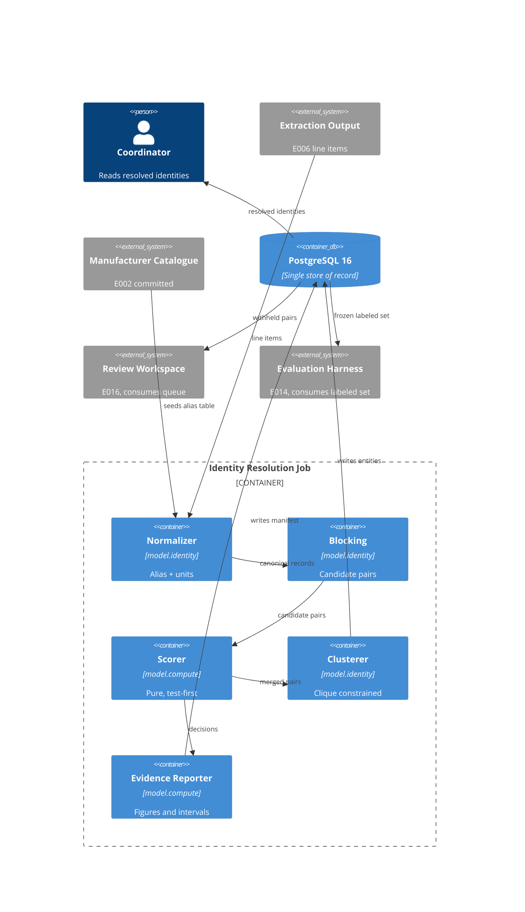

# Implementation Plan: Cross-Document Identity Resolution

**Branch**: `00009-cross-document-identity-resolution` | **Date**: 2026-07-29 | **Spec**: [spec.md](spec.md)

## Summary

**Goal**: Resolve submittal and purchase-order records that name one material three different ways into a single identity per project, withholding every pair the evidence does not settle.
**Approach**: A deterministic offline console job — normalize through a versioned alias table, block on a union of keys, score in `model.compute`, decide on two frozen thresholds, cluster under a clique constraint, and publish the run's own quality evidence with intervals.
**Key Constraint**: All three legs of the join are deliverable, and the specification leg's route is narrow: E006 extracts zero values from the 26 real UFGS documents, so a specification *document* is never a candidate record, and the specification reaches a cluster **only** through the `specification_section` a vendor printed on a submittal transmittal. The residual — a transmittal that printed no section number, leaving nothing to link — is published on every run under FR-049(g) rather than papered over. *(Rewritten at analysis remediation, A-4: this read "the specification leg of the three-way join is not deliverable", which the fourth pass reversed when it restored the specification as a third cluster member on evidence from `0005_field_vocabulary.py` and `baseline.py`. SC-001 requires all three members present; the sentence was wrong, not merely loose.)*

## Technical Context

**Language/Version**: Python 3.12
**Primary Dependencies**: psycopg 3, SQLAlchemy 2, Alembic, stdlib `difflib`/`unicodedata` for string comparison. **No new runtime dependency** — see AD-006
**Storage**: PostgreSQL 16 (no pgvector use; blocking is deterministic by decision — spec Scope > Excluded)
**Testing**: pytest, Hypothesis (property-based over the `model.compute` additions), coverage.py, import-linter
**Target Platform**: Offline console entry point under `/src/model`; Linux and Windows development, Linux CI
**Project Type**: single
**Project Mode**: brownfield
**Performance Goals**: None at request time — resolution is an offline batch job over one project's records. Reduction ratio is a *published figure*, not a latency target (FR-011)
**Constraints**: Append-only runs with an explicit active-run pointer; thresholds committed as constants and bound to the labeled-set hash; all-or-nothing write on guard failure; migration block `0500`–`0599`; no cross-project merge
**Scale/Scope**: 5 projects; extracted line items from 25 submittal transmittals plus their purchase-order lines; a frozen labeled set of ~40 pairs across two declared strata

## Instructions Check

*GATE: Must pass before Phase 0 research. Re-check after Phase 1 design.*

**Audited against**: `project-instructions.md` **v1.2.8** (current head) · **Audit date**: 2026-07-29 · First audit for this feature.

| Principle / Section | Gate | Status |
|---|---|---|
| I. Traceable or It Does Not Ship | Every member resolves to its source record and document location; every merge records the alias rule and alias-table version that produced it; every published figure resolves to a run manifest | PASS — FR-033, FR-001, FR-004, FR-034; `identity/writer.py`, `identity/runs.py` |
| II. Uncertainty Is the Product | No bare point estimate is publishable: an estimated proportion carries a Wilson interval, a census carries its exact denominator and an explicit no-interval declaration, and a figure undefined at the realized size is published as undefined with its denominator | **DEVIATION (disclosed).** FR-025, FR-026, FR-028 and the Wilson half of FR-038 pass. But the principle is written unconditionally — *"every reported metric MUST be published together with its interval"* — and coverage, reduction ratio and the withheld share are reported metrics published **without** one. AD-008's reasoning is sound and is not an exemption claim, but it *narrows a Core Principle*, which only an amendment to `project-instructions.md` can do. Recorded as **P-11**, which is **still owed and unperformed**. **OWNER-AUTHORIZED 2026-07-29** — the project owner has explicitly authorized proceeding with this deviation, on the same footing as the FR-045 boundary crossing. **The row stays `DEVIATION (disclosed)` and is NOT upgraded to PASS**: the deviation is real on the merits, the authorization is permission to proceed with it rather than a finding that it does not exist, and the whole of analysis finding **A-5** was that a self-granted roll-up to PASS concealed a deviation nobody had authorized. **Precedent claim corrected**: v1.2.1 is cited above as precedent, and it cuts the other way — that narrowing **landed on `main`** before any dependent work shipped, so it is precedent for *landing* an amendment, not for implementing through an unlanded one. What authorizes this row is the owner's decision, not the precedent |
| III. Precision Over Recall Where a Mistake Is Silent | This principle names cross-document identity merges explicitly, and this is that feature. Two thresholds with a withhold band; **both cutoffs withhold** so no pair is auto-rejected invisibly; clique constraint forbids transitive joining; a run failing a guard writes nothing | PASS — FR-015, FR-042, FR-018, FR-035; SC-035, SC-005, SC-015 |
| IV. Agent Output Style | The document's **structure** is tabular: every gate, decision, requirement mapping, risk, obligation and test tier is a table row, and no section presents structured data as narrative. Prose appears where Principle IV permits it — a decision's *rationale*, a registration's *justification*, and a disclosed deviation's *reasoning*, none of which is expressible as a cell without losing the argument a later reader has to audit | PASS — evidence restated at analysis remediation (A-28). ~~"Tables and tagged lists throughout; prose confined to Summary"~~ **Struck: false as stated.** Prose appears in the three audit notes below this table, in both Complexity Tracking cells, in the Propagation Obligations preamble, in the standalone paragraph after that table, and in §Project Structure's trailing notes. The *judgment* is arguable and is kept; the *evidence* was not, and a gate row whose evidence can be falsified by scrolling is the pattern rows II and VIII were already corrected for |
| V. The Model Extracts, Code Computes | **No language model is invoked by this feature at all.** Scoring, thresholding, interval arithmetic and clustering are deterministic code under `model.compute` and `model.identity`; a new import contract forbids `model.identity` reaching `model.llm` or `gateway` | PASS — AD-001, AD-009; see Testing Strategy > Architecture |
| VI. Evaluate Before You Tune | The labeled set is frozen and hashed *before* threshold calibration, the hash is verified on every reporting run, and a run whose thresholds diverge from those calibrated against the verified hash **refuses rather than publishes** | PASS — FR-016, FR-017, FR-044; SC-040. The mechanical hole this principle exists to close is that E009 both authors and consumes the set — see Complexity Tracking |
| VII. Publish the Miss | The specification-leg shortfall, the precision-target reading, the recall-target reading, and the E003 table extension are each recorded as scope decision / supporting evidence / reversal trigger / production-scale alternative. Targets are not adjusted to match results | PASS — spec Risks (four-part limitations); FR-032, SC-026 |
| VIII. Honest Opponents | Merge precision and recall are published against a deterministic **exact-match baseline** — normalized manufacturer plus part number, with no alias expansion and no fuzzy scoring — labeled per the principle | **PASS — corrected during the compliance gate.** This row previously read `N/A` on the claim that "`specs/project-plan.md` scopes identity-resolution baseline comparison to E014." **That citation is false.** `project-plan.md:477` gives E014 a harness *covering* identity resolution, but the only baselines it registers are forecast (`:488`, naive and marginal) and retrieval ablation arms (`:487`); no clause assigns an identity-resolution baseline anywhere. The registered PRD wins and points the other way — `prd.md:219` gates P1 release on every result being published "with its interval **and its baseline**", and `:156–157` register merge precision and recall as P1 metrics of CAP-004, this feature's own capability. See AD-012 |
| Technology Stack | PostgreSQL 16 as the single datastore of record; no second store; no new framework; the resolution job is a console entry point under the modeling entry's own environment per ADR-0011 | PASS — AD-006, AD-010 |
| Testing & Quality Policy | The pair scorer, the band decision, and the interval estimators are **scoring functions** — their output is a number that is stored or published — so they take **both** mandates: strict test-first (red-green-refactor) **and** property-based tests. Placement under `model/compute/` is what makes the classification mechanical | PASS — AD-001; see Testing Strategy |
| Source Code Layout | All new code under `/src/model`; tests alongside within the entry; no fifth entry; no root-level scripts | PASS |
| Development Workflow | Branch matches `#####-feature-name`; Conventional Commits; migration block `0500`–`0599` claimed at epic start against the *delivered* revision chain, not against the plan. **Temporary Files, both halves.** *(i)* Scratch confined to the checkout's own gitignored `.tmp/` — `TMPDIR`/`TEMP`/`TMP` and pytest's `--basetemp` pinned there, and no environment or package build created outside the checkout. *(ii)* **The half the rule adds about the tool harness, addressed here for the first time**: a command that is backgrounded, or that reaches its execution timeout and is backgrounded automatically, has its output captured by the harness to a path outside the checkout, and redirecting output *within* the command does not prevent it. So **commands MUST be sized to finish inside their timeout** and **background execution MUST NOT be used for work whose output matters**. This plan adds six test tiers and `data-model.md` **G-15 makes a refusing run's captured command output the only trace the refusal leaves** — the two together are exactly the case the rule addresses. **Consequences for this feature, stated rather than assumed**: the suite is run **per tier** and never as one full-suite invocation (unit; property; integration; architecture; security; coverage — six calls, not one), the integration tier is further split per test module because it stands up a live database, and **no refusal-path test and no `resolve-identity` invocation is ever backgrounded**, because its refusal line is the artifact under test and a backgrounded refusal is an untraceable one. A genuine full-suite run belongs in CI, which runs on a disposable machine where no path is shared | PASS — see Implementation Signals in spec, and HINT-002. ~~cites HINT-002~~ for the scratch half: **corrected at analysis remediation, A-42.** HINT-002 is about coverage `--source` enumerations overriding rather than merging and has nothing to do with temporary files, so the row cited a hint that does not support it. The harness clause was addressed nowhere in this document. *(Version attribution: the finding dated the harness clause to v1.2.8; the changelog dates it to **v1.2.7**, and v1.2.8 withdrew v1.2.6's `PYTENSOR_FLAGS` requirement. The substance of the finding stands — the clause was unaddressed — and the version is corrected here.)* |
| Data Provenance | This feature ingests no new corpus documents and fabricates no provenance. **It authors three committed synthetic datasets and each ships a datasheet** — the alias table derived from E002's committed manufacturer catalogue, and the **two labeled strata**, `labeled-pairs-estimation.csv` and `labeled-pairs-hard-negative.csv`. The run manifest records the catalogue digest and both stratum hashes, so which bytes a run used is reproducible; the datasheets are what disclose how those bytes came to be | **PASS — closed in two steps.** During the compliance gate: FR-040/SC-036 cover reproducibility, and the audit correctly found that is a different clause from *"Every synthetic dataset MUST ship a datasheet disclosing its generative assumptions."* At **analysis remediation (A-20)** the gate was found **half-closed**: the datasheet was required for the alias table only, while both labeled strata are equally committed synthetic datasets with explicit generative assumptions — sampling frame, balance, a single annotator, and for the hard-negative stratum a *selection* rule that makes it chosen rather than sampled. **And the one datasheet that was required was ungraded and droppable**: T074 carried no `{FR-###}` tag and sat in Phase 6, which `tasks.md` declares omittable. Closed by **FR-052**, which makes all three datasheets a requirement, and by moving T074 into Foundational with the tag |
| Governance | Migration block `0500`–`0599` claimed at epic start and still uncollided. Decision-record number ~~`0022`~~ **`0023`** — **the `0022` claim collided and E009 lost it**: `main` landed ADR-0022 ("Interval Method Is Selected Per Estimator, Not Per Document", accepted 2026-07-29, cataloged against E014/E015) while this branch held `0022` claimed and unauthored. Numbers are monotonic and never reused, so the landed record wins and E009 rescans to `0023`. **Twelve amendment needs recorded and not performed** — eleven, plus **P-12** for ADR-0023 at owner decision on A-21 — see Propagation Obligations. No ADR is authored on this branch: E006's QC established (its A-26) that authoring an ADR or a `specs/sad.md` catalog row on a feature branch is itself the Governance violation. ~~so `0022` stays claimed and unused~~ **Struck at owner decision on analysis finding A-21: `0022` is claimed and *owed*.** FR-045 sets a precedent a later epic can cite — a consuming epic additively extending another epic's tables under a recorded exception — and `data-model.md` **G-9** states the hazard in project-level terms: *"An epic after E009 alters those two tables citing E009's precedent, and nothing reports it."* Governance puts project-level decisions under `specs/adrs/`, so the need is real and is now recorded as **P-12**. The ADR is **not authored here**; recording the need is what a feature branch may do | PASS — with two disclosed deviations: the FR-045 boundary crossing, justified in Complexity Tracking rather than waved through, and the Principle II narrowing of row II, proceeding under the owner override recorded there |

**Re-check after design**: **NOT a clean PASS, and the roll-up that said otherwise is withdrawn.** ~~PASS with two disclosed deviations~~ **Row II is FAIL on the merits** — coverage, reduction ratio and the withheld share are reported metrics published without intervals, and Principle II is written unconditionally, so AD-008 *narrows a Core Principle*, which only an amendment to `project-instructions.md` can do. **Work proceeds under an explicit project-owner override dated 2026-07-29, and P-11 remains owed and unperformed.** Every other row passes; the FR-045 boundary crossing is a second disclosed deviation, authorized by the owner during clarification and priced in Complexity Tracking. **Twelve** amendment needs are recorded as obligations, **none performed**. *(Restated at owner decision on analysis finding A-5. The previous line rolled a row whose status is literally `DEVIATION (disclosed)` up to "PASS with two disclosed deviations" — Governance requires implementations to **pass** the gate, `AGENTS.md` makes any `project-instructions.md` violation CRITICAL, and unlike FR-045 no owner decision authorized this one at the time. The authorization now exists; the arithmetic that turned a FAIL row into a PASS verdict does not return with it.)* The first pass of this gate self-reported PASS on all fourteen rows, and **four rows have since been corrected, not two**. A delegated compliance audit returned FAIL and corrected two — Principle VIII rested on a citation that does not exist in the document it named, and Principle II claimed a strengthening where the honest reading is a narrowing. **Checklist evaluation corrected a third**: CHK017 found that two of the four limitations row VII claimed were recorded in four-part Principle VII form **were not**, and row VII reads true today only because spec §Risks was amended afterward to add them — the row was not right all along, and presenting it that way is the same self-grading this paragraph exists to disclose. **Analysis remediation corrected a fourth**: row IV's stated evidence, "prose confined to Summary", is falsified by six passages in this document; the judgment is kept and the evidence is restated. All four are repaired above. *(Third and fourth rows added at analysis remediation, A-41 and A-28: this paragraph recorded two corrections and omitted the checklist-corrected one, so the audit history under-reported itself by half.)* Recorded rather than quietly fixed, because a gate that grades its own homework is the failure mode E006's QC documented at its A-26.

**Audit notes**

- **Principle II is not weakened by FR-038's census/estimate split, and the distinction is worth stating because it reads like an exemption.** Coverage, reduction ratio and the withheld share are computed over the run's *own* candidate set — every element is observed, nothing is sampled — so there is no sampling uncertainty for an interval to express, and attaching one would assert a population the figure does not generalize to. The principle forbids a point estimate that hides uncertainty; it does not require manufacturing uncertainty that does not exist. The obligation FR-025 keeps in force is the one that matters: a census figure must still carry an *explicit* no-interval declaration with its denominator, so a reader can tell a census from an estimate that quietly dropped its interval.
- **Principle VIII is passed, and the note that stood here was the refuted rationale for declaring it N/A.** ~~A feature that publishes precision and recall and reports no baseline could plausibly be read as violating it. It is not: the registered project plan assigns baseline comparison to E014's frozen harness, and standing up a second, unfrozen comparison here would compete with the harness rather than satisfy the principle.~~ **Struck at analysis remediation, A-19: the cited clause does not exist.** Reconfirmed against `specs/project-plan.md` — `:477` gives E014 a harness *covering* identity resolution, and the only baselines that document registers are the forecast's naive and marginal arms (`:488`) and the retrieval ablation arms (`:487`). No clause assigns an identity-resolution baseline to E014 or to anyone. `prd.md:219` gates P1 release on publishing one and `:156–157` register merge precision and recall as P1 metrics of CAP-004, this feature's own capability, so the registered PRD wins under Governance. **The corrected row VIII above is the position**: an exact-match baseline is published, labeled strong, under FR-046 and AD-012. This note is kept struck rather than deleted so a reader who finds the argument elsewhere — it was also in spec §Excluded, corrected at the sixth pass — can see it was checked and refuted rather than merely dropped. It sat eleven lines below the row that contradicts it for one full pass.
- **Principle VI's exposure is structural, not mechanical.** E009 freezes the labeled set *and* calibrates against it, which is the arrangement the principle exists to prevent. FR-044 closes the mechanical hole — thresholds are bound to the verified hash and a divergent run refuses. What it cannot close is that the same epic chose the sample. That is why the amendment need moving `LabeledPair` from E014 is recorded (P-5) rather than treated as settled, and why the stratum frames are published (SC-032, SC-037) rather than merely honored.

## Architecture



## Architecture Decisions

Feature-local tradeoffs only. Project-wide architectural decisions belong in standalone ADRs under `specs/adrs/` — referenced by ID, never copied. Number `0022` is claimed and is **owed rather than unused** — see the Governance row and **P-12**. It is still not authored on this branch. *(Rows reordered numerically at analysis remediation, A-44: AD-012 sat before AD-011 because AD-012 was added during the compliance gate and AD-011 during task decomposition, so a reader scanning for a decision by number had to search. **No identifier changed.**)*

| ID | Decision | Options Considered | Chosen | Rationale |
|----|----------|--------------------|--------|-----------|
| AD-001 | Where does the pair scorer live? | `model.identity.score` beside the rest of the job / `model.compute.pair_score` | `model.compute.pair_score` | The Testing & Quality Policy binds "scoring functions" to both the test-first and property-based mandates, and E006 fixed the classification rule by package placement: a module whose output is *a number that is stored or published* belongs under `model/compute/`. The pair score is written to a row and gates every merge. Placing it anywhere else would make the mandate a matter of argument rather than of path |
| AD-002 | How are merged pairs clustered? | Transitive closure (connected components) / correlation clustering / clique-constrained agglomeration | Clique-constrained agglomeration | FR-018 forbids a cluster inducing an unscored pair, which rules out closure outright — closure's whole behavior is joining records never compared. Correlation clustering is the principled optimum and is NP-hard, so every implementation is an approximation whose error would need its own published figure. The clique constraint is exact, cheap at this scale, and is itself the acceptance criterion (SC-005) |
| AD-003 | How does E009 get project and run columns onto E003's `resolved_entity`? | Parallel E009-owned entity tables / ALTER E003's tables in the `0500` block / block on the E003 amendment | ALTER in the `0500` block | Recorded in the spec as a deliberate governance exception with its cost, not as an oversight. A parallel table would split the join surface E012, E014 and E016 all read, and duplicating an entity to avoid touching it is the worse coupling. See Complexity Tracking and P-6 |
| AD-004 | Where does the alias table live? | Committed data file only / database table only / committed file loaded into a versioned table | Committed file loaded into a versioned table | The file is the reviewable source of truth and the thing a diff shows; the table is what a run joins against and what carries the version a merge cites (FR-004). One without the other loses either auditability or queryability |
| AD-005 | How are the two thresholds **and the scorer's attribute weights** carried? | Runtime configuration / environment variables / committed constants module | Committed constants module, both the cutoffs **and the weight vector**, bound to the labeled-set hash in the manifest | Principle VI plus FR-044 and FR-047. A threshold that can be supplied at runtime cannot be shown not to have been tuned after seeing a result. Committing them makes a change a reviewable diff, and binding them to the verified hash makes a divergent run *refuse* rather than merely be forbidden. **Extended to the weights during task decomposition**, which found that FR-016 and FR-044 froze the two cutoffs and said nothing about the weights producing the score they cut — a weight raised after observing precision moves every score rather than the line through them, which is the same hole one step earlier and harder to see. **Schema consequence**: `threshold_calibration` and `resolution_run` carry the weight vector alongside the two cutoffs, and `0502` must reflect it |
| AD-006 | What computes string similarity? | `rapidfuzz` / `jellyfish` (Jaro-Winkler) / stdlib `difflib` + explicit part-number segmentation | stdlib `difflib` + explicit segmentation | No new runtime dependency, and the decisive comparison here is not fuzzy distance at all. The failure this feature must avoid is merging two catalog numbers whose *suffix* encodes voltage, enclosure rating or handing (SC-003) — a case where Jaro-Winkler scores near 1.0 and is actively wrong. Segment-aware comparison with an explicit suffix rule is the correct tool; a general edit-distance library would be a dependency bought to solve the easier half |
| AD-007 | How is the active run selected? | Highest run id / a `latest` boolean / most recent timestamp / partial unique index over an `is_active` flag | Partial unique index | Reuses E006's delivered pattern for the same problem. FR-039 forbids selection by recency; an index is what makes "exactly one active run" a database-enforced fact rather than a query convention that a second reader gets wrong |
| AD-008 | How is "every figure carries an interval" reconciled with census figures? | Attach a Wilson interval to everything / attach nothing to census figures / classify each figure and require an explicit declaration either way | Classify, and require the declaration either way | Attaching an interval to a census asserts a sampling frame that does not exist. Attaching nothing makes a census indistinguishable from an estimate whose interval was dropped. FR-025 and FR-038 together make the *classification* the published artifact |
| AD-009 | Is a new import contract needed? | Rely on the existing computation-boundary contract / add a contract forbidding `model.identity` → `model.llm`/`gateway` | Add the contract | The existing contracts run the other direction (`model.llm` may not reach `model.compute`). Nothing today would fail the build if a future edit reached the provider from the resolution job. The claim "this feature invokes no language model" is exactly the kind fixed in advance and checked by nobody — the shape E006's baseline contract was written to prevent |
| AD-010 | How is the job invoked? | Container job under a Compose profile / console entry point in the modeling entry | Console entry point `resolve-identity` | ADR-0011: a job owned by the modeling boundary cannot share the serving build context without defeating the contracts that keep the two apart. Follows the established `<domain>-<verb>` convention — one verb per job, no subcommand dispatcher |
| AD-011 | What is scored when an attribute is missing on one side? | Treat as disagreement / treat as agreement / a third "absent" state contributing neither | A third "absent" state | FR-008 requires a record with no part number to still enter comparison. Scoring absence as disagreement would make every part-number-less record unmergeable, converting a blocking guarantee into a scoring veto; scoring it as agreement would invent evidence. The component records `absent` and contributes zero, and that contribution is visible per FR-014 |
| AD-012 | What is the honest opponent for merge precision and recall? | No baseline (deferred to E014) / a random pairing / **exact match on normalized manufacturer + part number** / a second scorer with different weights | Exact match on normalized manufacturer + part number, **labeled strong** | Principle VIII requires a baseline strong enough that beating it means something, and `prd.md:219` gates P1 release on publishing one. Exact match is the resolver *minus the two things whose complexity is on trial* — alias expansion and fuzzy scoring — so beating it is precisely the evidence that those two earned their place. It is also plausibly winning **on precision**, which is the metric this feature optimizes: exact match almost never merges wrongly. Random pairing would be a rhetorical opponent the principle names as worthless. Following E006's `ingest/baseline.py` precedent, an import contract keeps it independent: `model.identity.baseline` may not reach `identity.alias` or `compute.pair_score` — a baseline that reads the alias table is not a baseline, it is the system under test with a smaller threshold. **It does reach `identity.normalize`, and must.** An earlier draft forbade that too; task decomposition caught the contradiction — FR-046 requires agreement on *normalized* values, so a baseline carrying its own private normalization would compare different strings than the resolver and the two figures would not be over the same values. Normalization is not what is on trial. This requires `normalize.py` to hold **only** syntactic transforms — case folding, whitespace, part-number segmentation — with every alias-dependent step in `alias.py`, which is the correct split regardless |

## Data Model Summary

15 new tables and 2 views, plus an extension of two E003 tables. **Column names below are the data model's own**, verbatim: `data-model.md` §Conventions makes the name the contract, and a summary that paraphrases a column name is a second name for one object. *(Seven names were renamed in paraphrase and are corrected at analysis remediation, A-26: `alias_class`→`label_class`, `field_key`→`attribute_name`, `e002_catalogue_digest`→`catalogue_digest`, `score`→`total_score`, `size`/`true_count`→`pair_count`/`true_pair_count`, `symbol`/`factor`→`normalized_raw_unit`/`factor_to_base`, and `is_true`/`annotator`/`annotation_provenance`→`is_true_pair`/`annotator_id`/`annotation_basis`. Four more were abbreviated — `version`→`alias_table_version`, `canonical_key`→`canonical_manufacturer_key`, `alias_rule_fired`→`alias_rule_id`, `figure`→`figure_name` — and are corrected on the same grounds.)* The parenthetical that stood here — "`data-model.md` says thirteen in its summary prose while enumerating fifteen; the enumeration is correct" — is withdrawn: **the stale count is corrected in `data-model.md` itself** (A-24), so there is no discrepancy left to warn about. The design's method is to make each criterion **unrepresentable to violate** rather than checked after the fact — the notes column records which constraint carries which requirement.

| Entity | Key Fields | Relationships | Notes |
|--------|------------|---------------|-------|
| `manufacturer_alias_table` | `alias_table_version`, `content_digest`, `catalogue_digest`, `base_unit_system` | parent of the two alias tables | FR-004, FR-040 — the digest is what makes the seed reproducible. `base_unit_system` is FR-005's declared base form, on the header rather than per run |
| `canonical_manufacturer` | `alias_table_version`, `canonical_manufacturer_key`, `preferred_label`, `part_number_prefix` | ← `manufacturer_alias` | Preferred label is a **column, not a row**, so a second preferred label is unrepresentable (SKOS integrity condition) |
| `manufacturer_alias` | `alias_table_version`, `normalized_alias`, `label_class`, `raw_alias` | → `canonical_manufacturer` | `UNIQUE (alias_table_version, normalized_alias)` **is** FR-002 — alias→canonical is a function, and a duplicate fails table load rather than tie-breaking at runtime. Three disjoint classes: preferred / alternate / hidden — **FR-050** |
| `unit_alias` | `alias_table_version`, `normalized_raw_unit`, `unit_class`, `base_unit`, `factor_to_base` | → alias table | Dimensional units carry a base and a factor; **arbitrary units carry neither**, so FR-005's "never converted" has nothing to multiply by. FR-005 as amended mandates this table and its single versioning; SC-045 grades it |
| `labeled_pair_set` | `stratum`, `set_hash`, `sampling_frame`, `pair_count`, `true_pair_count` | ← `labeled_pair` | One row **per stratum** with its own hash and frame — FR-037's separation is structural, not a convention. FR-051's declared size and FR-010's frame content read off these columns |
| `labeled_pair` | `set_hash`, canonical pair identity, `is_true_pair`, `annotator_id`, `annotation_basis`, `annotated_at` | → `labeled_pair_set` | FR-036 — provenance makes the stratum verifiable from the artifact, in the five elements FR-036 now enumerates |
| `threshold_calibration` | `merge_threshold`, `reject_threshold`, the four attribute weights, both stratum hashes | ← `resolution_run`, `candidate_pair` | One calibration per frozen set, ever. FR-044 and FR-047 fall out: a run whose thresholds **or weights** differ from a calibrated set has **no referent** and fails at its first insert |
| `resolution_run` | `project_id`, `alias_table_version`, `is_active`, both stratum hashes, both cutoffs, the four weight columns, `input_extracted_value_count`/`input_po_line_count`, `started_at`/`finished_at` | → calibration, alias table | FR-039 — `is_active` under a **per-project partial unique index** (AD-007), so the pointer is a database fact, not a query convention. FR-047 — the weights sit beside the cutoffs in the manifest |
| `resolution_run_record` | raw + normalized value, `alias_rule_id`, `unit_class`, `specification_section` | → run, → source record | FR-003's additivity — the raw string sits beside the normalized one in the same row, so no stage can discard it |
| `unmatched_manufacturer_string` | `raw_value`, `normalized_value`, `alias_table_version`, keyed on (run, source record) | → run, → run record | FR-013 — alias-table gaps as data, not as absent merges. *(Corrected at requirements-quality review: this row named an `occurrence_count` column, which `data-model.md` deliberately does not have — "two records printing the same unmatched spelling are two pieces of evidence and collapsing them would understate the gap; grouping by `normalized_value` is a query, and a stored count would be a second answer".)* |
| `candidate_pair` | canonical unordered identity, `total_score`, denormalized thresholds, `decision`, `blocking_key_kinds` | → run; ← attribute scores | `(left_kind,left_id) < (right_kind,right_id)` gives FR-009's identity and forbids self-pairs in one constraint. **FR-015/FR-042/SC-035 is a single-row `CHECK`** deriving `decision` from the score and the two cutoffs with strict comparisons, so both cutoffs land in `withhold` by arithmetic |
| `candidate_pair_attribute_score` | `attribute_name`, `agreement`, `weight`, `contribution` | → pair, → `field_vocabulary` | FR-014 — real FK to E003's vocabulary, not a free-text field name. **Exactly four rows per pair**, the four attributes FR-014 now enumerates normatively, so FR-047's four frozen weights are each exercised |
| `resolved_entity_induced_pair` | entity, candidate pair, both member rows | → entity, → pair (FK pins `decision='merge'`) | FR-018 — **transitive closure cannot write these rows**, because an unscored pair has no candidate row to reference |
| `review_queue_item` | `candidate_pair_id`, `resolution_run_id`, `project_id`, the four pair-identity columns, `decision` pinned to `'withhold'` | → run, → pair | FR-043 — one per withheld pair *per run*; FR-021 supplies the no-merge half. **Score, band and alias version are reached through the eight-column FK and `v_open_review_item`, not copied onto the row** — `data-model.md` ambiguity A-8's reading, because a copied score is a second answer that can disagree. **No adjudication column, no status column, no `pending` enum member**: FR-023 as amended, graded by SC-044. *(Key-field list corrected at analysis remediation, A-26: it read "score, band, alias version" as if they were columns here, which contradicts A-8's recorded reading and the schema.)* |
| `resolution_figure` | `figure_name`, `figure_kind`, `stratum`, `numerator`/`denominator`, `point_estimate`, interval columns or `no_interval_reason` | → run | FR-037a/FR-038 — `stratum` domain is `('estimation','run_candidate_set')`, so `hard_negative` and any union value are **unwritable**. **`figure_name`'s domain is eight**, the six resolver figures plus `baseline_merge_precision` and `baseline_recall`, so FR-046's figures are manifest rows rather than report-only — owner decision at checklist evaluation, observability CHK020 |
| `resolved_entity` *(E003, extended)* | +`resolution_run_id`, +`project_id` | → run | FR-045/FR-020. `uq_resolved_entity__normalized_identity` re-scoped to the run |
| `resolved_entity_member` *(E003, extended)* | +`resolution_run_id`, +`specification_section`, +generated `member_record_id` | → run, → run record | FR-045. `uq_rem__extracted_value` / `uq_rem__po_line` → `uq_rem__run_*`, both still relying on `NULLS DISTINCT`. **`specification_section` replaces `member_role`** at owner decision on A-6: the section is an attribute every submittal member inherits from its transmittal, so a specification-section *member* no longer exists and the role became derivable from E003's own `member_kind`. Pinned to the member's run record by `fk_rem__run_record_section`; FR-041's cap is now over distinct section **values** and is a cross-row rule — **G-16** |

**Migration chain** (from E006's `0404`): `0500_alias_artifact` → `0501_labeled_set` → `0502_resolution_run` → `0503_run_records` → `0504_candidate_pair` → `0505_resolved_entity_extension` → `0506_induced_pair` → `0507_review_queue` → `0508_resolution_figure` → `0509_resolution_privileges`. `0505` must follow `0503`; `0506` cannot precede `0505`.

**Detail**: [data-model.md](data-model.md) — including ten recorded ambiguities (A-1…A-10) and the disclosed gaps.

## API Surface Summary

N/A — no API surface. The feature is an offline console job writing to PostgreSQL. `specs/00009-cross-document-identity-resolution/spec.md` Implementation Signals declares `NEW-WORKER` and `NEW-ENTITY`/`MIGRATION`/`NEW-CONFIG`, and no `NEW-API`. Consumers — E012, E014, E016 — read the tables; the read surface each needs is that epic's to design, and pre-declaring it here would fix a contract against requirements that do not yet exist.

## Testing Strategy

| Tier | Tool | Scope | Mock Boundary | Install |
|------|------|-------|---------------|---------|
| Unit | pytest | Alias-table load and duplicate-alias rejection, unit classification, blocking key derivation, unordered-pair identity, clique admission, manifest assembly, all-or-nothing abort | Fixtures only; no database | configured |
| Property | Hypothesis | **All four `model.compute` additions**, each taking **both** mandates — strict test-first and property-based. The set is defined by AD-001's placement rule, not enumerated by hand: every module computing a number that is stored or published. **Relation class per module**: `pair_score` — *boundedness and monotonicity* (score stays in range; raising one component's agreement never lowers the total); `decide` — *totality and disjointness*, enumerated exhaustively at and around both cutoffs rather than sampled, because the criterion (SC-016, SC-035) is about exact boundary values and a sampler will miss them; `metrics` — *interval containment and estimator selection* (the published interval contains the point estimate; zero errors selects the rule of three, one or more selects the exact binomial, zero denominator selects undefined), covering **every** published figure including pair completeness, coverage, the withheld share, the stratum argument, **and both baseline figures, whose estimator is selected from their own arm's error count** (FR-046 as amended — the two arms may legitimately land on different interval methods); `calibrate` — *determinism and frozen-set dependence* over **all six committed constants — both cutoffs and the four attribute weights** (the same frozen set yields the same six; a perturbed set yields a detectably different constant vector). *(Widened at requirements-quality review: this read "the same two constants … a detectably different pair", which predates FR-047 and is falsified by a perturbation that moves only the weights — the relation as written would then fail to hold while the implementation was correct, and a weight-only calibration change would go unexercised. T025 already covers "cutoffs and weights".)* | Pure functions, nothing mocked | configured |
| Integration | pytest + live PostgreSQL | Append-only across two runs, active-run pointer under the partial unique index, run-scoped uniqueness on the extended E003 tables, guard failure leaving no partial write, one review item per withheld pair per run, cross-project isolation | Real database; no gateway involvement — this feature invokes no model | configured |
| Architecture | import-linter | **Two** new contracts, both with indirect detection ON: (a) `model.identity` may not reach `model.llm` or `gateway` (AD-009); (b) `model.identity.baseline` may not reach `identity.alias` or `compute.pair_score` (AD-012) — a baseline that reads the alias table is the system under test, not an opponent. It **may** reach `identity.normalize`, which must therefore hold only syntactic transforms. Existing computation-boundary and provider contracts remain green | — | **not configured** — two new contracts to add to `src/model/pyproject.toml` |
| Security | committed-fixture credential scan (E004's) + `ruff` | Committed tree, including the new committed alias table — it is vendor data and must carry no contact or account detail | — | configured |
| Coverage | coverage.py | Combined 80% floor **and a per-package 80% floor on `model.identity`**, asserted separately | — | **not configured** — `verify.yml`'s `--source` and `[tool.coverage.paths]` are enumerations that override rather than merge. `identity` must be appended to both or every line this epic adds is invisible to the gate. This is the same trap E006 documented, and it recurs because the lists are enumerations |

**New dependencies to add**: none. Every tier already has a configured tool, and AD-006 declines the one runtime dependency that was a candidate.

## Error Handling Strategy

**Every refusal path below emits one structured, machine-readable refusal line on a non-zero exit** — project, failing guard or check, and both values where the failure is a hash mismatch or a constant divergence (FR-035, owner decision at checklist evaluation, observability CHK032). That line is the **only** trace a refusal leaves: no relation records it, so from the database a refused run and a run that never started are indistinguishable, disclosed as `data-model.md` G-15 rather than closed by writing a row on the one path FR-035 says writes nothing.

| Error Category | Pattern | Response | Retry |
|----------------|---------|----------|-------|
| Alias table invalid (duplicate alias → two canonicals) | fail-fast at load, before any run row is written | Non-zero exit naming the offending alias; nothing written (FR-002, SC-028) | no |
| Normalization collision guard breached | fail-closed, whole run | No resolved entities, no review items, **no manifest** — the run leaves no trace to be mistaken for a result (FR-035, SC-015) | no |
| Labeled-set hash mismatch | fail-closed, whole run | Same as above; the mismatch and both hashes are reported (FR-017) | no |
| Threshold constants **or attribute weights** diverge from those calibrated against the verified hashes | refuse before publishing, at the manifest insert | Non-zero exit naming **both constant sets — the run's and the calibrated one — and which of the six constants diverged**, so post-hoc tuning is diagnosable and not merely blocked; nothing published (FR-044, FR-047, SC-040, SC-043). *(Weights added at requirements-quality review: the row named only the thresholds, which is the half of the tuning surface FR-047 was written because it does **not** cover.)* | no |
| Manufacturer string matches no alias | record, continue | Written to the unmatched-alias record; the run completes and the gap is visible as data (FR-013, SC-030) | no |
| Every candidate pair withheld | complete normally | Zero merges, full review queue, precision reported **undefined with its zero denominator** — not a failure and not reported as one (FR-024, SC-013) | no |
| Attempt to admit a member whose specification section **differs** from the one the cluster already holds | **refuse the admission before issuing the insert**, continue — an application admission check at `data-model.md` §Write Order step 8, reading `ix_rem__entity_section`. **No constraint violation occurs and no `SAVEPOINT` is used.** ~~**the one anticipated constraint violation the job recovers from**, under a `SAVEPOINT` around the member insert~~ *(Struck at owner decision on analysis finding **A-6**. The savepoint was added at analysis remediation for A-22 because the refusal arrived as a unique violation of `ix_rem__single_specification_section` that would otherwise abort the transaction. A-6 replaced that index: the cap is over distinct section **values**, which no PostgreSQL constraint expresses, so nothing fails and there is nothing to roll back to — the writer declines the insert. **A-22 stays closed**: what it required was that this row and §Write Order stop disagreeing about a refused admission, and they now agree on the pre-check. The cost of losing the constraint is `data-model.md` **G-16**.)* **A refusal is now rare and meaningful** rather than routine: it fires only when two transmittals covering one material printed different sections, not whenever two transmittals cover one material | The offending record is named and **left unclustered** — a member of no entity in that run; the cluster keeps its section attribution and **all** its other members; the record's run record, candidate pairs and any review item stand; the refusal is named in the run report with **both** sections — the one kept and the conflicting one — which is the only surface that shows it (FR-041, SC-041, FR-049(h), G-14). *(Disposition set by owner decision at checklist evaluation, data-integrity CHK021; the cap's shape by owner decision on A-6.)* | no |
| Database unavailable / transaction aborts mid-write | fail-fast, single transaction per run | Run rolls back whole; no partial run is observable (FR-035) | no |

## Integration Points

| Spec Reference | System/Service | Technical Approach | Contract |
|----------------|----------------|--------------------|----------|
| E006 extraction output | Delivered ingestion tables | Read `extracted_value` line items from the 25 submittal transmittals, stored exactly as printed. **The read set is exactly six `field_vocabulary` terms, enumerated here so an upstream change breaks visibly rather than quietly changing a score**: `manufacturer` and `part_number` (normalized, blocked on, and scored), `unit_of_measure` and `quantity` (classified and canonicalized, FR-005), `product_description` (scored only, never blocked on), and `specification_section` (the specification member's only source, FR-041). Purchase-order lines are read from `purchase_order_line`'s own columns, not through `extracted_value`. Every term lands in a named `resolution_run_record` column or a `candidate_pair_attribute_score` row, so a term E006 stops populating shows up as a NULL column and an `absent` comparison rather than as a silently shifted total. E006 asserts no identity between two spellings (its FR-028), so normalization is wholly E009's. *(Enumerated at requirements-quality review: spec §Assumptions named three of the six, and the other three — unit of measure, product description, specification section — were each introduced separately elsewhere, so no one place said what this feature reads.)* | E006 `data-model.md`; the seam is named in spec Assumptions |
| E006 `specification_section` | Delivered extraction field | The only route by which a specification reaches a cluster. Not inferred — a direct reference a vendor printed on a transmittal. **Document-scoped, not per-item**: `baseline.py` places it in `DOCUMENT_SCOPED_TERMS`, printed once per transmittal at item ordinal 0, while `material_category` and `product_description` are per-item. Every line item from a transmittal therefore inherits its section, which is why FR-041 makes it a cluster **attribution** rather than a member {A-6}. **This is the fact three revisions of the specification leg failed to check**, and it is stated here so an integration change to that field's granularity breaks visibly | FR-041, SC-001, SC-041 |
| E002 manufacturer catalogue | Committed generator artifact | Seeds the alias table's initial contents; its digest is recorded in the run manifest so the seed is reproducible | FR-040, SC-036 |
| E003 `resolved_entity` / `resolved_entity_member` | Delivered schema | **Extended, not replaced** — additive ALTER in the `0500` block adding project and run columns and re-scoping uniqueness. Disclosed exception; see Complexity Tracking | FR-045, AD-003, P-6 |
| E016 review workspace | Downstream, not yet built | E009 emits `ReviewQueueItem` rows shaped so adjudication state can be added **additively**, without altering a field E009 writes | FR-023 |
| E014 evaluation harness | Downstream, not yet built | E009 authors and freezes the labeled set E014 consumes. This inverts the registered ownership; recorded as P-5 | FR-017, spec Risks |

## Risk Mitigation

| Risk (from spec) | Likelihood | Impact | Mitigation | Owner |
|-------------------|------------|--------|------------|-------|
| The published precision criterion may be unreachable as written, and this branch may not correct it | H | H | Implement the point-estimate reading (FR-026) and make the interval a *mandatory* published disclosure with its method and sidedness named, so the reading taken is visible in the output rather than buried in a spec. Record the amendment need (P-1, P-2); do not adjust the target | `model.compute.metrics`, Evidence Reporter |
| E009 alters tables E003 owns, and E006 forbids it | H | H | Additive ALTER only, and the DDL is exactly what `data-model.md` §The FR-045 Extension enumerates: new `NOT NULL` columns **without defaults**, one `GENERATED … STORED NOT NULL` column, and three unique constraints dropped and re-created run-scoped — no column dropped, no type narrowed, **and no backfill, because there are no rows to backfill.** Both tables are still empty and E009 is their first writer, which is the only condition under which `ADD COLUMN … NOT NULL` without a default succeeds; the window closes the first time E009 runs. *(Corrected at requirements-quality review: this row read "nullable-then-backfilled columns", which is a different and now-unavailable migration strategy and contradicted the data model's stated DDL.)* In E009's own `0500` block. Integration test asserts E003's existing constraints still reject what they rejected before. Recorded as P-6 and in Complexity Tracking | Migration `0500` series |
| The registered recall target has the same interval problem as precision, and it is not recorded upstream | M | M | Same treatment: point-estimate reading (SC-018), Wilson interval published beside it, denominator stated. Recorded as P-3 | `model.compute.metrics` |
| E009 takes the frozen labeled set from E014, and that is a scope change | H | M | Close the mechanical hole rather than the structural one, and say which is which: FR-044 binds thresholds to the verified labeled-set hash and a divergent run refuses (SC-040), so tuning-against-the-test-set is detectable. The structural separation stays removed; recorded as P-5 | `identity/labeled.py`, `identity/thresholds.py` |
| This feature depends on E002 and the registered plan does not say so | H | L | Make the dependency explicit in code and in the manifest — the E002 catalogue digest is recorded on every run (FR-040), so the undeclared edge is at least visible in the artifact. Recorded as P-4 | `identity/alias.py`, `identity/runs.py` |
| The MVP slice did not carry the registered gate's evidence — resolved at clarification | M | M | Already resolved in the spec by raising US3 to P1; the plan carries it by placing the evidence reporter and its metrics in the P1 task set rather than deferring them. No further mitigation needed | Task sequencing |

## Requirement Coverage Map

| Req ID | Component(s) | File Path(s) | Notes |
|--------|--------------|--------------|-------|
| FR-001 | Normalizer | `src/model/src/model/identity/alias.py` | Resolution records the firing rule |
| FR-002 | Normalizer | `identity/alias.py` | Duplicate alias fails load; no runtime tie-break |
| FR-003 | Normalizer, Writer | `identity/normalize.py`, `identity/writer.py` | Raw retained beside normalized |
| FR-004 | Normalizer, Run manifest | `identity/alias.py`, `identity/runs.py` | Version on run and on every merge |
| FR-005 | Normalizer | `identity/units.py` | Dimensional canonical form; arbitrary units classified |
| FR-006 | Scorer | `compute/pair_score.py` | Scored attribute, never a filter |
| FR-007 | Guard | `identity/guard.py` | Collision guard over hard-negative stratum |
| FR-008 | Blocking | `identity/block.py` | Union of keys, not conjunction |
| FR-009 | Blocking | `identity/pairs.py` | Unordered-pair identity, counted once |
| FR-010 | Labeled set, Evidence | `identity/labeled.py`, `identity/report.py` | Frame independent of blocking keys |
| FR-011 | Metrics, Evidence | `compute/metrics.py`, `identity/report.py` | PC and RR separate from precision. PC is an *estimated* proportion with a Wilson interval, so its arithmetic is a `compute` module {AD-001} |
| FR-012 | Writer | `identity/writer.py` | Full candidate set persisted |
| FR-013 | Normalizer, Writer | `identity/alias.py`, `identity/writer.py` | Unmatched strings as data |
| FR-014 | Scorer, Writer | `compute/pair_score.py`, `identity/writer.py` | Per-component contributions stored |
| FR-015 | Decision | `compute/decide.py` | Three disjoint bands |
| FR-016 | Thresholds, Calibration | `identity/thresholds.py`, `compute/calibrate.py` | Committed constants, calibrated pre-publication. Calibration derives a stored, hash-bound number, so it is a `compute` module {AD-001} |
| FR-017 | Labeled set | `identity/labeled.py` | Freeze, hash, verify per run |
| FR-018 | Clusterer | `identity/cluster.py` | Clique constraint |
| FR-019 | Metrics, Evidence | `compute/metrics.py`, `identity/report.py` | Estimation stratum only; the population is an argument to the estimator, not a reporting convention |
| FR-020 | Blocking, Clusterer | `identity/block.py`, `identity/cluster.py` | Project scope enforced twice |
| FR-021 | Review queue | `identity/review.py` | One item per withheld pair per run |
| FR-022 | Review queue | `identity/review.py` | Records, score, band, agreements, alias version |
| FR-023 | Review queue, Schema | `identity/review.py`, migration `0500` series | Additive shape for E016 |
| FR-024 | CLI, Evidence | `identity/cli.py`, `identity/report.py` | All-withheld run succeeds |
| FR-025 | Evidence, Metrics | `identity/report.py`, `compute/metrics.py` | Interval or explicit declaration |
| FR-026 | Metrics | `compute/metrics.py` | Point estimate + 95% interval, method and sidedness named |
| FR-027 | Metrics | `compute/metrics.py` | Rule of three at zero errors, exact binomial otherwise, n<30 disclosure |
| FR-028 | Metrics | `compute/metrics.py` | Zero denominator → undefined, never zero |
| FR-029 | Metrics, Evidence | `compute/metrics.py`, `identity/report.py` | Coverage in the same statement as precision |
| FR-030 | Evidence, Metrics | `identity/report.py`, `compute/metrics.py` | Withheld/rejected/unblocked all count as misses |
| FR-031 | Metrics, Evidence | `compute/metrics.py`, `identity/report.py` | Withheld count, share, and yield |
| FR-032 | Evidence | `identity/report.py` | Shortfall with cause; target unmoved |
| FR-033 | Writer, Schema | `identity/writer.py`, migration `0500` series | Member → source record → document location |
| FR-034 | Run manifest | `identity/runs.py` | Alias version, thresholds, hashes, input counts |
| FR-035 | Writer, CLI | `identity/writer.py`, `identity/cli.py` | Single transaction; nothing partial. **Plus the structured machine-readable refusal line on the non-zero exit** — the only trace a refusal leaves, since no relation records one: G-15 |
| FR-036 | Labeled set | `identity/labeled.py` | Annotator judgment with provenance |
| FR-037 | Labeled set | `identity/labeled.py` | Two strata, separate frames, separate hashes |
| FR-037a | Metrics, Evidence | `compute/metrics.py`, `identity/report.py` | Each figure names its stratum; the stratum is an estimator argument |
| FR-038 | Metrics, Evidence | `compute/metrics.py`, `identity/report.py` | Wilson for estimates; census exact, no interval |
| FR-039 | Run manifest, Schema | `identity/runs.py`, migration `0500` series | Append-only; active-run pointer via partial unique index (AD-007) |
| FR-040 | Normalizer, Run manifest | `identity/alias.py`, `identity/runs.py` | E002 catalogue digest recorded |
| FR-041 | Clusterer, Evidence, Schema | `identity/cluster.py`, `identity/report.py`, migration `0503` **and** `0505` | **At most one distinct specification-section *value*** — a cluster attribution inherited by every submittal member from its transmittal, because the field is document-scoped {A-6}. Submittal line items **and** purchase-order lines are both unbounded. The offending record is named and **left unclustered** — owner decision at checklist evaluation — and the refusal is reported with **both** sections (FR-049(h)) because no relation records it: G-14. **The cap is an application admission rule, not a constraint**: `count(DISTINCT …) <= 1` over a group is inexpressible in PostgreSQL and the parent-side column that would fix it is a sixth column on an E003 table that G-11 rules out — disclosed as **G-16**. `0503` adds `uq_resolution_run_record__record_section`; `0505` adds `resolved_entity_member.specification_section`, `fk_rem__run_record_section` and `ix_rem__entity_section`, and **no longer adds `member_role`** |
| FR-042 | Decision | `compute/decide.py` | **Both** cutoffs withhold |
| FR-043 | Review queue | `identity/review.py`, `identity/pairs.py` | Run id + stable pair identity |
| FR-044 | Thresholds, Run manifest | `identity/thresholds.py`, `identity/runs.py` | Refuse on divergence from the calibrated hash |
| FR-045 | Schema | migration `0500` series | Extends E003's tables — disclosed exception, AD-003. **Five added columns**, and after A-6 the fifth is `resolved_entity_member.specification_section` rather than `member_role`, which the attribute model made derivable from E003's own `member_kind`. Two checks fall away with it, so the crossing is **one object narrower** than before A-6 — the only finding in this pass that reduced it |
| FR-046 | Baseline, Metrics, Evidence, Schema | `identity/baseline.py`, `compute/metrics.py`, `identity/report.py`, migration `0508` | Exact-match honest opponent {AD-012}; same stratum, and the same estimator **rule** applied per arm, so the two arms may select different interval methods. Labeled strong, ahead of the run. **The two figures are `resolution_figure` rows — `baseline_merge_precision` and `baseline_recall`, the domain widened six → eight by owner decision at checklist evaluation** — so each resolves to the manifest (SC-027, Principle I) rather than living only in the report. Import contract keeps it from reading `alias.py` or `compute.pair_score` — it **shares** `normalize.py`, see AD-012 |
| FR-048 | Schema privileges | migration `0509` | Append-only enforced by privilege — `SELECT`/`INSERT` only, no `UPDATE`/`DELETE`, on the **fourteen** append-only E009 tables and on E003's two. Single exception: the active-run pointer flip and finish stamp on the manifest, where `UPDATE` is held and `DELETE` is not. Soft-delete columns, status columns and per-row active flags forbidden as alternate routes to the same effect. **Thirty-three refusals** asserted by VR-025; latent against the deployed superuser (G-13). Carries the E003 reversal (P-9). **Tagged on tasks T017 and T058**, and carried by `data-model.md` §Requirement Traceability — *(both added at analysis remediation, A-7: the work existed and carried only `{FR-039}`, and the data model had no FR-048 row at all, so an implemented requirement was untraceable in both directions)* |
| FR-049 | Evidence | `identity/report.py`, `specs/00009-cross-document-identity-resolution/resolution-report.md` | The run report's **eight** required content parts *(a)*–*(h)* — added at checklist evaluation, which found the report's existence specified and its content not. *(Count corrected at analysis remediation, A-8: this row said "seven" while FR-049 enumerates (a) through (h). The undercount was not cosmetic — part **(h)**, every rejected specification-section admission named in the report, is the one part no task wrote, and it is the **sole** observable behind the owner's CHK021 disposition and `data-model.md` G-14. Tasks T064–T067 are now tagged `{FR-049}`, **T085** renders part (h), and **T086** asserts all eight parts present.)* |
| FR-047 | Thresholds, Calibration, Run manifest | `identity/thresholds.py`, `compute/calibrate.py`, `identity/runs.py`, migrations `0501` **and** `0502` | Attribute weights are committed constants under the same freeze-hash-refuse discipline as the cutoffs {AD-005}. **Both revisions, not only `0502`**: the refusal is a foreign key, so `0501` must widen `uq_threshold_calibration__strata_thresholds` from four columns to eight before `0502` can declare the referencing side. Corrected during task decomposition; see `data-model.md` §Migration Sequence |
| FR-050 | Normalizer, Schema | `identity/alias.py`, migration `0500` | Three closed alias classes — preferred / alternate / hidden — with `manufacturer_alias.label_class`'s `CHECK` and `ix_manufacturer_alias__single_preferred` as the exactly-one-preferred guarantee, so a class outside the domain fails table load rather than being coerced. Graded by SC-002 and VR-002. *(Added at analysis remediation, A-30: Key Entities introduced the class and no requirement mandated it, while SC-002 graded it and the schema implemented it.)* |
| FR-051 | Labeled set | `identity/labeled.py`, `data/identity/labeled-pairs-estimation.csv` | The declared estimation-stratum size of **40** and the interval half-width it was derived from, recorded on the frozen artifact beside its realized `pair_count` and `true_pair_count`. Graded by SC-032 and SC-037. **Changes no registered target** — P-1 and P-3 reserve the target readings to the default branch; this fixes only the sample size every attainability argument already assumed. *(Added at analysis remediation, A-31.)* |
| FR-052 | Committed data | `data/identity/datasheet.md` | A datasheet section per committed synthetic dataset — the alias table and both labeled strata — disclosing derivation, the assumptions construction makes, and the assumptions it does not license. Graded by task **T074**, moved out of the omittable Phase 6 into Foundational and tagged. *(Added at analysis remediation, A-20: Data Provenance was half-closed and the one datasheet that was required was both ungraded and droppable.)* |

## Project Structure

### Source Code

```text
src/model/
  pyproject.toml                       ~ add `resolve-identity` entry point; add the model.identity import contract; add `identity` to coverage source and paths
  src/model/
    identity/                          + new package — the resolution job
      __init__.py                      +
      cli.py                           + `resolve-identity` console entry, single transaction
      alias.py                         + alias table load, function check, versioning, unmatched recording
      normalize.py                     + additive normalization, part-number segmentation. **Syntactic transforms only** — case folding, whitespace, segmentation. Every alias-dependent step lives in `alias.py`, because `baseline.py` shares this module and must not reach the alias table through it {AD-012}
      units.py                         + dimensional canonicalization; arbitrary-unit classification
      block.py                         + union-key candidate generation, project scoping
      pairs.py                         + stable unordered-pair identity
      guard.py                         + normalization collision guard
      cluster.py                       + clique-constrained agglomeration, cardinality bounds
      review.py                        + review queue items, per run
      labeled.py                       + frozen labeled set, two strata, hashing and verification
      thresholds.py                    + committed threshold constants **and the committed attribute weight vector** {FR-047, AD-005}
      baseline.py                      + exact-match honest opponent {AD-012}; isolated from `alias.py` and `compute.pair_score`, and **shares `normalize.py`** so both figures are over the same normalized values
      runs.py                          + run manifest, active-run pointer
      writer.py                        + all-or-nothing persistence
      report.py                        + published figures with their classifications
    compute/
      pair_score.py                    + pure scoring function {AD-001}
      decide.py                        + pure two-threshold band decision {AD-001}
      calibrate.py                     + threshold **and attribute-weight** calibration against the frozen set {AD-001, FR-047}
      metrics.py                       ~ add rule-of-three, one-sided exact binomial, undefined branch, and the arithmetic for every published figure — pair completeness, coverage, reduction ratio, withheld share {AD-001}
    schema/versions/
      0500_*.py .. 0599_*.py           + migration block claimed at epic start
  tests/
    identity/                          + unit and integration tests for the package above
    compute/                           ~ extend with property tests for **all four** `model.compute` additions — `pair_score`, `decide`, `calibrate`, and the `metrics` additions. *(Corrected at analysis remediation, A-27: this read "the three additions" while §Testing Strategy's Property tier says "all four" and `tasks.md` names four red-green pairs — T025→T026, T033→T034, T035→T036, T059→T060. The set is defined by AD-001's placement rule rather than enumerated by hand, so an undercount here reads as a fourth module exempt from a mandate the Testing & Quality Policy makes unconditional.)*
specs/00009-cross-document-identity-resolution/
  resolution-report.md                 + the rendered run report, following E006's `ingestion-report.md` convention — reports live in the feature workspace, not under data/
data/
  identity/manufacturer-aliases.csv    + committed alias table, seeded from E002's catalogue {AD-004}. **CSV**, and the content digest is computed over a declared canonical serialization — sorted by (`canonical_manufacturer_key`, `label_class`, `normalized_alias`), LF endings, no BOM — so the digest is stable across editors, or FR-004's version identifier is not reproducible. **Authored in Foundational, not in US4.** *(Moved at analysis remediation, A-25: T073 authored this file in Phase 6 at P3, while T028 loads it and T038 digests it in the P1 slice — so P1 depended on a P3 artifact and FR-040 was tagged on a P1 task whose input did not exist until an omittable phase. T073 and T074 are now Foundational, T073's edge is inverted to `T028 after:T073`, and the P1 boundary statement in `tasks.md` §Dependencies is restated to match.)*
  identity/labeled-pairs-estimation.csv    + committed estimation stratum {FR-017, FR-037}; hashed over the canonical serialization **declared in `data-model.md` §`labeled_pair_set`** — column order, ascending pair-identity row order, UTF-8/LF/no BOM, surrogate key excluded
  identity/labeled-pairs-hard-negative.csv + committed hard-negative stratum, same serialization, **its own separate hash** {FR-037}. *(Both files added at requirements-quality review. T024 already commits both strata under `data/identity/` and this section listed neither; the same review corrected the claim previously made here that "the labeled set declares its canonical form already" — it did not, and now does.)*
  identity/datasheet.md                + REQUIRED, and it covers **all three** committed datasets — the alias table and **both labeled strata** {FR-052}. Data Provenance mandates a datasheet for every synthetic dataset: the alias table is derived from E002's synthetic catalogue, and the two labeled strata are equally committed synthetic datasets with explicit generative assumptions — sampling frame, balance, a single annotator, and for the hard-negative stratum a *selection* rule that makes it chosen rather than sampled, which is the fact FR-037 relies on when it bars that stratum from every published denominator. Follows `data/roster/roster-datasheet.md`, `data/corpus/synthetic/datasheet.md`, `data/procurement/datasheet.md`. *(Widened at analysis remediation, A-20: the obligation was recorded for the alias table only, leaving the two artifacts whose generative assumptions are actually load-bearing undisclosed. One file rather than three, because the three datasets share a derivation chain and a reader comparing their assumptions should not have to open three documents — but each dataset gets its own named section, or the disclosure is not per-dataset and FR-052 is not satisfied.)*
pyproject.toml                         ~ **root manifest** — append `identity` to `[tool.coverage.run] source` and `[tool.coverage.paths]`. Both live at the root (lines ~65–163), not in `src/model/pyproject.toml`; `src/model`'s own `[tool.coverage.run] source = ["src/model"]` is a directory and needs no append
.github/workflows/verify.yml           ~ append `identity` to the coverage --source enumeration
```

**Patterns to reuse**: E006's partial unique index for the active-run pointer; E006's per-document transaction boundary, applied here as one transaction per *run* since FR-035 makes the run the atomic unit; the `<domain>-<verb>` console entry convention; `model.compute`'s existing Wilson interval implementation in `metrics.py`.
**Tests to extend**: `src/model/tests/compute/` (property tiers), `src/gateway/tests/test_migrations.py` — its Alembic-head assertion is block-scoped after E006's repair and must gain E009's block the same way rather than being re-pinned to a new head.
**Naming conventions**: revision files `NNNN_snake_case.py`; constraint prefixes as E003 uses them (`uq_`, `fk_`, `ix_`); one job per console entry point, no subcommand dispatcher.

## Complexity Tracking

| Violation | Why Needed | Simpler Alternative Rejected Because |
|-----------|------------|--------------------------------------|
| **E009 alters tables E003 owns (FR-045), and the alteration is larger than "additive".** `specs/project-plan.md:678` registers "ResolvedEntity \| E003 (schema), E009 (populated)" and E006's FR-065 enforces that E003's tables are not altered by a later epic. The compliance audit judged this should **block**, and the honest statement of the crossing is wider than an earlier draft of this row admitted: `0505` issues **three `DROP CONSTRAINT`s**, re-scopes `uq_resolved_entity__normalized_identity` on the same authority though FR-045 enumerates only the two member constraints (data-model A-2), and `0509` **revokes `UPDATE` and `DELETE`**, reversing E003's `0010` recorded rationale that "a resolved entity is a revisable judgement about identity". No column is dropped and no type narrowed, but "additive" was the wrong word and is withdrawn | The committed tables carry `uq_rem__extracted_value UNIQUE (extracted_value_id)` and `uq_rem__po_line UNIQUE (po_line_id)` with no run column. A record therefore cannot belong to two entities across runs, which makes FR-039's append-only contract and FR-020's per-project isolation both unbuildable against the schema as delivered. This is not a preference — the requirements cannot be satisfied without it | **Parallel E009-owned entity tables**: splits the join surface E012, E014 and E016 all read, and duplicating an entity to avoid touching it produces worse coupling than the extension does. **Blocking on the E003 amendment**: Governance serializes amendments onto the default branch and this epic cannot perform one; waiting would stall E009 behind a queue it does not control. **The extension is taken by an explicit decision the project owner made when the choice was put to them during clarification — "record an E003 schema amendment need, and E009 adds the columns itself."** That is what distinguishes this from a self-granted exception, and it is the reason the audit's recommendation to block is not followed. What the audit is right about is the framing, now corrected above, and the scope: the privilege revocation (P-9) reverses a *recorded E003 decision*, not just a column list, and is the part most likely to surprise a later reader. Disclosed here, in the spec's Risks, and as obligations P-6 and P-9 |
| **E009 both freezes and calibrates against the labeled set (FR-016, FR-017).** `specs/project-plan.md` assigns `LabeledPair` to E014 precisely to separate construction from calibration | The registered plan's own ordering is circular: it gives E014 the entity while making E014 depend on E009. One of the two has to move, and the set has to exist before thresholds can be calibrated at all | **Leaving it with E014**: E009 would have no set to calibrate against and could not satisfy FR-016 within its own scope. The mechanical guarantee the separation existed to provide is reconstructed by FR-044 — thresholds bound to the verified hash, divergent run refuses — so tuning to the test set is *detectable* rather than merely forbidden. The structural separation stays removed and is recorded as P-5 |

## Propagation Obligations

`project-instructions.md` § Governance: *"Amendments to the documents named in this section are serialized. At most one amendment is in flight at a time, it is performed on the default branch, and it lands before the next begins. A feature branch records the need for an amendment and does not perform it."* This branch is `00009-cross-document-identity-resolution`, not the default branch, so `AMEND_MODE = record`. **Nothing below has been written to any registered document.**

| # | Obligation | Owner | Trigger |
|---|---|---|---|
| P-1 | State whether the identity-resolution merge-precision target of **0.95 is a point estimate or the lower bound of its interval**. Read as a bound it is arithmetically unreachable at this sample size — the rule of three gives 3/40 = 0.075 even at the theoretical maximum denominator with zero errors, so the bound is 0.925. Belongs in `specs/prd.md` and `specs/sad.md` | Whoever owns `specs/prd.md` and `specs/sad.md` | Planning adopted the point-estimate reading (FR-026, SC-017) and must record that it diverges from a criterion the registered documents leave ambiguous |
| P-2 | The registered criterion names **only the rule of three**, which is inapplicable the moment one false merge is observed. Name an estimator for the non-zero-error case. FR-027 adopts a one-sided exact binomial (Clopper–Pearson) interval. Belongs in `specs/prd.md` and `specs/sad.md` | Whoever owns `specs/prd.md` and `specs/sad.md` | The plan implements a second estimator that neither registered document names |
| P-3 | State whether the identity-resolution **recall target of 0.80** is a point estimate or an interval lower bound. At ~20 true pairs a 95% Wilson interval around 0.80 spans roughly 0.58–0.92, so the bound reading is unreachable exactly as precision's is. Belongs in `specs/prd.md` and `specs/sad.md` | Whoever owns `specs/prd.md` and `specs/sad.md` | SC-018 takes the point-estimate reading on the same basis as P-1 |
| P-4 | Add the **E002 dependency edge** to E009's dependency contract. `specs/project-plan.md` records E009 as depending on E005 and E006; FR-040 derives the alias table from E002's committed manufacturer catalogue, which makes E002 a real dependency | Whoever owns `specs/project-plan.md` | AD-004 and FR-040 make the dependency structural — the run manifest records the catalogue digest |
| P-5 | Move **`LabeledPair` ownership from E014 to E009**, and correct the E009/E014 dependency contract to match. The plan's current ordering is circular: it assigns E014 the entity while making E014 depend on E009 | Whoever owns `specs/project-plan.md` | FR-016 and FR-017 place construction, freezing and calibration in E009; Complexity Tracking records why |
| P-6 | Admit E009's **extension of `resolved_entity` and `resolved_entity_member`** — project and run columns, three dropped constraints re-created run-scoped, and `uq_resolved_entity__normalized_identity` re-scoped on the same authority though FR-045 enumerates only the two member constraints. Belongs in `specs/project-plan.md` (the "ResolvedEntity \| E003 (schema), E009 (populated)" ownership row), in `specs/00003-core-data-schema/data-model.md`, which is declared normative over Specify-phase requirements by ADR-0017, **and in `specs/00003-core-data-schema/spec.md` — its TR-083**. *(Widened at analysis remediation, A-29. ADR-0017's condition 3 forbids an amendment to E003's normative `data-model.md` that adds or removes a named object or constraint; `0505` performs **three `DROP CONSTRAINT`s** and roughly **fourteen `ADD`s**, which is squarely inside condition 3, so the change does not stop at the data model. **TR-083 admits no undocumented object in E003's schema**, and after `0505` E003's own spec-level inventory of `resolved_entity` and `resolved_entity_member` is incomplete by five columns and wrong by three constraint names — so the requirement that forbids undocumented objects is itself falsified until it admits them. Nothing recorded that. **Recorded, not performed**: this branch writes nothing to E003's workspace, and the widening is a change to the obligation's scope, not an action taken against it.)* | Whoever owns `specs/project-plan.md`; E003's workspace for **both** its data model and its `spec.md` | FR-045 performs the extension on this branch by explicit decision (AD-003). The obligation records the ownership change the migration has already made real |
| P-7 | Record in `specs/sad.md` that the **identity-resolution job is a fourth model-owned console entry point** (`resolve-identity`) under ADR-0011's pattern, and that a new import contract forbids `model.identity` reaching `model.llm` or `gateway`. Both are reusable project-level context: the entry-point inventory and the set of build-gating architecture contracts are cross-cutting, not feature-local | Whoever owns `specs/sad.md` | §5.6.2 — AD-009 and AD-010 add a system boundary and a build-gating contract, which are exactly the categories the managed section promotes |
| P-8 | Record in `specs/sad.md` the **census-versus-estimate classification** for published figures: a proportion estimated from a sample carries a Wilson interval; a census over a run's own population carries an exact denominator and an explicit no-interval declaration. Secondary to P-11 — `sad.md` cannot narrow a Core Principle, so this records the engineering convention only, after the principle itself is amended | Whoever owns `specs/sad.md` | AD-008 resolves an apparent Principle II conflict in a way later epics will re-derive independently unless it is recorded once |
| P-9 | Admit that E009 **revokes `UPDATE` and `DELETE` on `resolved_entity` and `resolved_entity_member`** (migration `0509`). E003's `0010` grants all four verbs with an explicit stated rationale — *"a resolved entity is a revisable judgement about identity"* — and FR-039's append-only contract requires the opposite. Belongs in `specs/00003-core-data-schema/data-model.md`, which ADR-0017 declares normative | E003's workspace for its data model | Design surfaced it. This is a **second, distinct** amendment need against E003 — P-6 covers the column lists; this one reverses a documented E003 *decision* and its rationale, which is the more serious of the two |
| P-10 | Correct E009's **key-entity list** in `specs/project-plan.md`. It records ResolvedEntity, CandidatePair and ReviewQueueItem; the delivered design adds the alias artifact, the labeled-pair set, the threshold calibration, the run manifest, the induced-pair record and the published-figure table | Whoever owns `specs/project-plan.md` | The plan's entity roster is the input other epics scope against, and it now understates E009 by six entities |
| P-11 | Amend **`project-instructions.md` § Principle II** to distinguish an estimated proportion from a census. The principle is written unconditionally — *"every reported metric MUST be published together with its interval"* — and coverage, reduction ratio and the withheld share are reported metrics this feature publishes **without** intervals. AD-008's reasoning is sound but it *narrows a Core Principle*, and Governance's first bullet is that project instructions supersede all other documentation: `specs/sad.md` cannot carry this, which is why P-8 is secondary to it. **Precedent**: v1.2.1 narrowed "No second datastore" to "no second datastore **of record**" after E004 planning raised exactly this shape, and it landed as an amendment to this document | Whoever owns `project-instructions.md` | The compliance audit found the Principle II row claimed a *strengthening* when it is a disclosed deviation. Recorded as the deviation it is |

| P-12 | **Author ADR-0023 on the default branch** (renumbered from `0022`, which `main` took on 2026-07-29), recording the project-level decision that *a consuming epic may additively extend another epic's tables under a recorded exception* — the precedent FR-045 sets. The ADR must state the conditions under which the extension is admissible (the owning epic's tables empty, the extension additive, the diff enumerated and asserted against a hardcoded expected set, the ownership change recorded as an obligation) and the conditions under which it is not, so a later epic citing E009 cites a rule rather than an instance. Belongs in `specs/adrs/` on `main`, and a `specs/sad.md` catalog row goes with it | Whoever owns `specs/adrs/` and `specs/sad.md`, on the default branch | `data-model.md` **G-9** states the hazard in project-level terms — *"An epic after E009 alters those two tables citing E009's precedent, and nothing reports it"* — and E006's FR-065 ownership guard is blind to exactly the alteration FR-045 performs, so the precedent is real and unreported. Number `0022` was claimed at epic start and is **owed, not unused** |

Numbering is monotonic within this file. No obligation is routed to another feature branch. **P-12 was added at owner decision on analysis finding A-21**; no existing obligation was renumbered. Authoring the ADR on this branch would itself be the Governance violation E006's QC documented at its A-26, which is why the need is recorded and the file is not written — the same posture P-1 through P-11 take toward the documents they name.

**One finding that is not an amendment need.** E006's FR-065 ownership guard — `E003_OWNED_TABLES` in `src/model/tests/schema/test_table_ownership.py:518` — enumerates six tables (`chunk`, `document`, `extracted_value`, `extracted_value_contributing_chunk`, `extraction_failure`, `field_vocabulary`), and **neither `resolved_entity` nor `resolved_entity_member` is among them.** The test that exists to report exactly the alteration FR-045 performs is blind to it. This is not recorded as an obligation because the file is an ordinary test on this branch's own side of the line: E009 adds VR-028/VR-029 to close it. Recorded here because a reader who finds the guard green will otherwise conclude no ownership boundary was crossed, when the truth is that the guard never looked.

## Implementation Hints

- **[HINT-001]** Order: **freeze and hash the labeled set before writing `thresholds.py`.** FR-016 and FR-044 are not merely sequencing advice — a threshold constant committed before the set is frozen cannot be shown to predate it, and the hash binding in the manifest is what makes the claim checkable. Build `labeled.py` and its two strata first, commit the frozen artifact, then calibrate.
- **[HINT-002]** Gotcha: `verify.yml`'s coverage `--source` and `[tool.coverage.paths]` are **enumerations that override rather than merge**. Adding `model.identity` without appending to both leaves every line this epic writes outside the coverage denominator while the gate still reports green. E006 hit this exact trap; it recurs because the lists are enumerations, not globs.
- **[HINT-003]** Constraint: `0505` re-scopes `uq_rem__extracted_value` and `uq_rem__po_line` to include the run column — **drop and recreate, not an in-place widening** — and assert in an integration test that the *old* guarantee still holds within a single run, since the change permits a record in two entities across runs and never within one. It also **falsifies eight existing assertions** in `src/model/tests/schema/test_resolved_entity.py`: seven match the dropped constraints by name, and one asserts `resolved_entity_member` has *exactly three* foreign keys. Restate them against the new constraints rather than deleting them — a name-matched assertion that is simply removed leaves the re-scoping unasserted.
- **[HINT-004]** Gotcha: a record pair matching on **both** blocking keys must be one candidate pair, not two (FR-009). Deduplicate at the point of generation, on the unordered identity, before anything counts a denominator. Every published share is wrong by a silent factor if this is deferred to reporting.
- **[HINT-005]** Compatibility: three test files must move with the block, and one of them is a trap. `tests/checks/test_migration_ranges.py` needs `DECLARED_BLOCKS += (500, 599, "E009")` and `OWNERS_EXPECTED_TO_HAVE_REVISIONS += "E009"` — **and its negative-control probe must move from `"0500"` to `"0600"`**, because that probe is parametrized on `["0000", "0500", "9999"]` where `0500` is the just-past-the-last-block case. Left alone it becomes a real revision number and the control silently stops controlling for anything. `src/gateway/tests/test_migrations.py` asserts on block membership rather than a fixed head (E006 repaired it that way); extend it with E009's block and keep its positive control over an *undamaged* revision directory, so a broken fixture cannot make the negative controls pass for the wrong reason.
