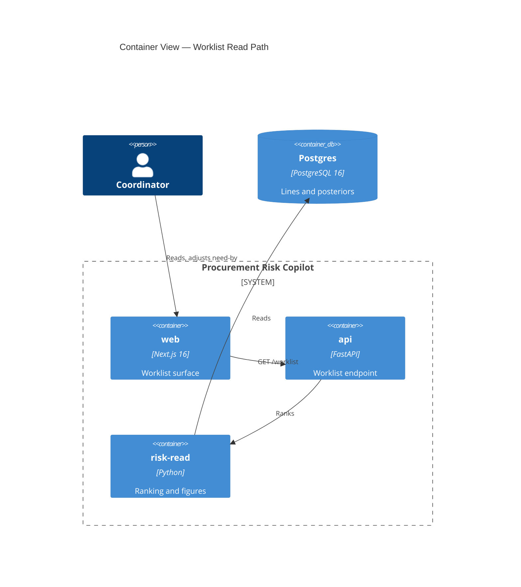

# Implementation Plan: Risk-Ranked Coordinator Worklist

**Branch**: `00010-risk-ranked-coordinator-worklist` | **Date**: 2026-07-28 | **Spec**: [spec.md](spec.md)

## Summary

**Goal**: Ship the product's primary screen — open lines ranked by expected schedule harm, every figure read from stored forecast artifacts with no model call.
**Approach**: One read-only endpoint returns a fully resolved ranking; the interface renders it and never computes a risk figure or reaches the datastore.
**Key Constraint**: Uncertainty is the product. Every shape here is chosen so a point estimate has no route to the screen — including through a sort control, a rounding boundary, or a client-side recompute.

## Technical Context

**Language/Version**: TypeScript 5.x on Node 22 (web); Python 3.12 (api)
**Primary Dependencies**: Next.js 16 App Router, React; FastAPI, Pydantic, psycopg
**Storage**: PostgreSQL 16 — read-only in this feature; every table it reads was committed by E003
**Testing**: Vitest and Playwright (web); pytest with Hypothesis (api); frozen posterior fixtures for deterministic read-path assertions
**Target Platform**: Linux containers under Docker Compose locally
**Project Type**: web
**Project Mode**: brownfield — four entries exist; this adds the first interface surface and the first API route
**Performance Goals**: Worklist p95 ≤ 1.5 s on one shared vCPU, adopted from `specs/sad.md` rather than chosen here
**Constraints**: No request-time model call; no write path; the interface tier opens no datastore connection; probabilities never render as 0% or 100%
**Scale/Scope**: ~200 open lines across 5 projects, 59 requirements, 4 user stories

## Instructions Check

*GATE: Must pass before Phase 0 research. Re-check after Phase 1 design.*

| Principle / Section | Gate | Status |
|---|---|---|
| *Audited against* | `project-instructions.md` **v1.2.7** — re-audited 2026-07-29 (QC iteration 2, T074) | — |
| *Prior audit* | v1.2.4, superseded while this branch was in flight by v1.2.5, v1.2.6 and v1.2.7 — three revisions of one new **Temporary Files** rule. Governance requires a feature whose recorded audit names a superseded version to re-run its compliance gate before its next phase gate, because "an amendment moves the ground under every epic already in flight, and their branches keep validating against the version they were cut from". Every row below was re-checked; only the new rule changed a verdict | — |
| I. Traceable or It Does Not Ship | Every figure carries the run it came from; `as_of_date` on every row, roster mismatch surfaced | PASS |
| II. Uncertainty Is the Product | No delivery-date field; quantile pair inseparable; bounded forms unrepresentable as 0/100; probability excluded from sort keys. The expected-harm score is **not published on the row** — an earlier contract revision emitted it with a mean overrun, which were bare point estimates and whose sum with the need-by date reconstructed a mean delivery date. That removal now rests on FR-041 rather than on this row alone: FR-041 forbids the derivable date as well as the rendered one, and states why the as-of date plus a labelled quantile pair is the permitted case while a date plus a mean overrun is not | PASS |
| III. Precision Over Recall | Eight degraded states refuse rather than degrade; `UnrankedPrimary` has no property that could hold a zero | PASS |
| IV. Agent Output Style | N/A — governs agent communication | N/A |
| V. The Model Extracts, Code Computes | All arithmetic in the serving boundary; no model call on the read path; override is a server re-query, not a client recompute | PASS |
| VI. Evaluate Before You Tune | N/A — no evaluation set in this feature | N/A |
| VII. Publish the Miss | Staleness basis travels in the payload; STF-001 recorded and dated. The adopted p95 is verified by a benchmark tier rather than asserted — with fixed measurement conditions, a named `Performance benchmark (api)` execution site, and SC-017 / SC-018 as the criteria that fail when it is missed — and both recorded limitations carry their four parts: security scanning reported rather than gated, and the contract's absence of a deprecation mechanism, each with its reversal trigger and production-scale alternative | PASS |
| VIII. Honest Opponents | N/A — no model claim or baseline | N/A |
| Technology Stack | Matches `specs/sad.md` exactly; no field overridden | PASS |
| Testing & Quality Policy | Strict test-first is mandatory for `compute/ranking.py` and `compute/probability.py`, carried as FR-039 rather than as a hint alone and sequenced in HINT-005. The 80% gate does **not** currently measure `/src/api` or `/src/web` — extending it is scoped work in this plan, not an assumption, and FR-040 is what makes it gating | DEVIATION (owned — closes with T-tasks below) |
| Source Code Layout | `/src/web` and `/src/api` only, no new entry. Entry-local tests live in `src/api/tests/` and `src/web/__tests__/` — never under root `/tests`, which is reserved for cross-entry verification and whose committed checks reject an `api.*` import outright | PASS |
| Development Workflow / CI | `verify.yml` has no `Unit tests (api)` step, runs no Playwright, and has no benchmark step, so as it stands **none of this feature's api tests, rendered-page tests, or performance measurements would execute**. Adding all three is scoped work in this plan; FR-040 states that a check which does not run in the merge gate evidences nothing, and the Check inventory below names which six of ten obligations need a new step | DEVIATION (owned — closes with T-tasks below) |
| Development Workflow / Temporary Files | **New since the prior audit** (v1.2.5, tightened by v1.2.6 and v1.2.7). Scratch belongs in the checkout's gitignored `.tmp/`, with `--basetemp` pinned in each entry's pytest configuration. `src/api` — the entry E010 owns and whose pytest configuration it wrote — did not pin it, and was writing to the machine's shared temp directory. Now pinned, and *measured* rather than declared: `tests/test_scratch_location.py` resolves `tmp_path` at runtime and fails if it lands outside `.tmp/`, which is the check the rule's own history argues for — v1.2.5 was declared proven and was false for two libraries, and v1.2.6 was false for the tool harness. The root and the `model` and `gateway` entries have the same gap and are **not** E010's to change; recorded in the QC report rather than fixed here | PASS (for `/src/api`; reported for the rest) |
| Data Provenance | Reads synthetic data E005 generated; adds none | PASS |
| Governance | AD-001…AD-006 feature-local; no ADR required. One registered-document conflict: `specs/sad.md:124` sketches `GET /lines?project=…`, the contract defines `/worklist`. Recorded as an amendment this branch does **not** perform, per the governance rule that the registered document wins. **Release-gating**: the deviation closes only when the SAD's primary flow names the same address the contract does, and this feature is not release-ready while three artifacts name three addresses — QC checks the condition, and HINT-003 states it | DEVIATION (recorded, not performed — gates release) |
| Security / access | No authentication, **inherited** from `specs/sad.md` § Security, which records the absence as a deliberate project-level scope decision with its reversal condition and production-scale alternative. FR-056 states what the inheritance obliges of this surface — no scheme, no coordinator identity, no per-reader rule — so the contract no longer leaves it as an open decision for this plan | PASS (inherited, not decided here) |

## Architecture



The interface holds no risk logic and opens no datastore connection. `risk-read` is a module inside the
serving boundary rather than a container — drawn separately because it is where every figure is
computed and therefore where the honesty rules are enforced.

## Architecture Decisions

| ID | Decision | Options Considered | Chosen | Rationale |
|----|----------|--------------------|--------|-----------|
| AD-001 | Probability wire format | float / integer / integer + display string | Integer + display string, both null when bounded | FR-008 fixes half-up whole-percent rounding and computes the complement from the displayed integer. A float lets the client re-round, and two independent roundings of 0.4951 and 0.5049 produce an FR-006 pair summing to 101%. The schema makes `0%` and `100%` unrepresentable, so an FR-008 regression fails validation rather than reaching a screen. |
| AD-002 | Ranked and unranked as separate arrays | one list with an `is_ranked` flag / two arrays with disjoint state enums | Two arrays | FR-016 and FR-021 exclude lines; FR-017 and FR-030 keep them. A type-level partition means no client can sort an excluded line into the ranking, and `UnrankedPrimary` carries no property a renderer could fill with a zero. |
| AD-003 | One `state` per row, no also-applicable list | independent booleans / single resolved state | Single resolved state | FR-018a says losing states contribute no behaviour. A surviving `calendar_passed` flag would annotate a row the precedence says shows only its beyond-horizon label. |
| AD-004 | Need-by what-if is a server re-query | client-side recompute / server re-query with an override parameter | Server re-query | A client recompute needs the draw and survival arrays in the browser — handing the interface exactly the data FR-007 exists to keep away, and moving FR-008's rounding into the tier that must not compute. The re-query is the same query with a substituted date: no model call, same row count, same array offsets, inside the p95 budget. |
| AD-005 | No sort direction parameter | direction parameter / server-fixed direction per key | Server-fixed | An admitted direction permits `expected_harm` ascending — a least-harmful-first primary surface that inverts SC-001. |
| AD-006 | Ordering digest in the response | client re-derives equality / server sends a digest | Server digest | FR-012 and SC-015 require "applied, order unchanged" to be stated. A digest makes it a constant-time comparison rather than the interface re-deriving an equality the server already computed. |

## Data Model Summary

N/A — no persistent data. This feature reads `purchase_order_line`, `forecast_run` and `line_posterior`, all committed by E003, and writes nothing. FR-031 makes the only mutation-shaped interaction a session-scoped what-if that never persists.

## API Surface Summary

| Endpoint | Method | Purpose | Contract |
|---|---|---|---|
| `/worklist` | GET | Ranked open lines with figures, degraded states, and page-scope status | [contracts/openapi.yaml](contracts/openapi.yaml) |

One operation, GET only — so FR-031's "no write path" is a property of the document rather than a
convention. Parameters: `project_id` (FR-025), `sort` (FR-026's four keys), `need_by_override`
(repeatable, capped at 25 — FR-055 owns the admissibility rules), `If-None-Match`. Errors are RFC 9457
`application/problem+json`.

**Access**: none required. The absence of authentication is inherited from `specs/sad.md` § Security,
where it is a registered scope decision; FR-056 carries the inheritance into this feature. This plan
decides nothing about it, and the contract no longer records it as an open decision awaiting this plan.

**Three counters, three jobs** — stated here because the contract, the path and the artifacts each
carry one and nothing previously related them. The path segment `/api/v1` is the interface version a
consumer binds to; `info.version` is the contract document's own revision and is what the ETag means by
"this contract's version"; `artifact_schema_version` is E003's forecast-artifact schema, a property of
the data read, whose unrecognised value is a fault under FR-043 rather than an interface mismatch. The
compatibility rule, what counts as breaking, and why no deprecation mechanism exists are stated in the
contract's `info` § Versioning and § Compatibility, and bound for later epics by FR-057.

## Testing Strategy

| Tier | Tool | Scope | Mock Boundary | Install |
|---|---|---|---|---|
| Unit (api) | pytest + Hypothesis | Ranking, harm score, rounding, complement, precedence resolution — **written test-first** | None — pure functions over fixtures | configured; needs a `Unit tests (api)` CI step |
| Integration (api) | pytest + psycopg | Endpoint against a seeded database, all eight degraded states; asserts the interface tier opens no datastore connection (FR-024) | Real Postgres, frozen posterior fixture | configured; CI already provides the `db` service |
| Unit (web) | Vitest | Row composition, region assignment, sort-key set | API response fixtures | configured |
| End-to-end | Playwright | Presentation contract of FR-032, live-region acknowledgement for both outcomes (FR-012, FR-046), no-hover as-of date, and the accessibility obligations FR-048–FR-051 — row position as text, the quantile pair under one accessible name, text-carried state and unsaved mark, keyboard operation of the three controls, and the spoken bounded forms | Stubbed API | `npm install -D @playwright/test`; needs its own script and CI step — `vitest run` does not collect Playwright specs |
| Performance | pytest-benchmark against the seeded database | Worklist p95 ≤ 1.5 s on one shared vCPU, the registered target (SC-017, SC-018) | Real Postgres, ~200 lines | `uv add --dev pytest-benchmark`; needs a `Performance benchmark (api)` CI step |
| Security | pip-audit, npm audit | Dependency advisories | — | reported, not gated — see the limitation record below |
| Coverage | coverage.py (api), Vitest v8 (web) | Two independent floors, each ≥ 80% — see below | — | api: extend the root source list and run the new step under `coverage run`; web: `--coverage` is not enabled today |

Read-path criteria are deterministic by construction: the page performs no model call, so its output is
a pure function of stored artifacts plus operator input. Every figure assertion runs against a frozen
posterior fixture with exact expected strings. Distributional quality is E014's gate, not this screen's.

Property tests carry the monotonicity invariants, which are testable without knowing the numbers: an
earlier need-by never decreases the miss probability inside FR-013's interval `as_of < d <= as_of + horizon_days`;
a higher criticality never moves a line further from the top of the harm-ordered sequence under the default
key; and **where both directions of a pair render as integers**, the two sum to 100.

That third invariant holds only under its condition and is false as an unconditional claim — an earlier
revision of this plan stated it unconditionally and was wrong at exactly the boundaries FR-008 exists to
govern. At `<1%` / `>99%` both integers are null, so there is nothing to sum; and FR-017's "at most N% late,
at least (100 − N)% on time" is one bound stated in two directions rather than two point values. The
generator is therefore filtered to `bounded: false` with `measure: point`, and the bounded and upper-bound
forms carry their own named tests (SC-021) instead of being swept into a property that cannot hold there.

Generated inputs are drawn from the domain the storage layer can produce rather than from the type, so a
property is never reported as falsified by an input E003's constraints reject (FR-039): survival arrays
non-increasing, within [0,1], of length `horizon_days`, with the last element equal to `residual_tail_mass`
within `PROB_SUM_TOLERANCE`; draws ascending, non-negative, of length `draw_count`; criticality an integer
from 1 to 5; need-by dates drawn across the three date-derived state regions rather than uniformly.

### The frozen fixture

One committed fixture is the acceptance evidence for every populated state (FR-036, FR-037), because E007 has
not landed and `no_active_run` is the only state with real data behind it today.

**Construction.** It is produced by a committed generator under a recorded seed and inserted through the
migrated schema rather than written as literal rows, so every artifact it holds has already satisfied E003's
constraints — `draws` ascending and non-negative at length `draw_count`, `survival` non-increasing and within
[0,1] at length `horizon_days`, `residual_tail_mass` equal to `survival[horizon_days]` within
`PROB_SUM_TOLERANCE`. A fixture that cannot be inserted is a fixture describing a state the storage layer
forbids, and asserting against one proves nothing about the running system.

**Provenance.** The generator module, the seed, the generation date, and the command that regenerates it
byte-identically travel with the fixture, and a digest over the emitted rows makes regeneration checkable.
It is a test fixture rather than a corpus document or a published dataset, so it takes generator provenance
and carries no retrieval provenance it does not have (FR-037).

**The rounding boundary is constructible at exactly four values.** `survival[k]` is `double precision`, and a
half-percent target is `(2n+1)/200` — exactly representable in binary only where 25 divides the numerator,
which leaves `0.125`, `0.375`, `0.625` and `0.875`. Every other x.5% value lands *near* the boundary rather
than on it, and a test asserting half-up rounding there is asserting the direction of a representation error.
The fixture carries `0.125` and `0.875` as its half-up cases (12.5% → 13%, 87.5% → 88%) and the rounding
function is asserted at those exact stored doubles. The same fact forbids implementing FR-008 with Python's
built-in `round`, which is half-to-**even**: `round(12.5)` is 12.

**The roster-mismatch line is a deliberate perturbation.** The schema constrains both
`purchase_order_line.roster_hash` and `forecast_run.roster_hash` to `sha256:` plus 64 hex characters and
constrains neither to agree with the other, so the state exists only where a fixture sets one line's hash to a
well-formed digest that differs. That line is named in the fixture rather than arrived at by chance.

**Inventory.** One line per boundary case FR-036 enumerates, each named in the test that reads it, including
the two staleness cases — `age_days == staleness_threshold_days`, which is **not** stale under FR-029's
"exceeds" and the contract's strict `age_days > staleness_threshold_days`, and `age_days` one greater, which is.

### Performance measurement conditions

The target is the registered one — worklist p95 ≤ 1.5 s on one shared vCPU (`specs/sad.md` § Compute
envelope) — and SC-017 and SC-018 are what make it gating rather than merely recorded. Two runs are
comparable only if the conditions are fixed, so they are fixed here.

| Condition | Value |
|---|---|
| Hardware | One vCPU, applied as a container CPU limit of 1.0 on the api service, so a runner with more cores cannot silently pass a single-vCPU target |
| Line population | **The frozen fixture's 16 lines**, not the E005 seeded set. This row originally recorded "the E005 seeded set — ~200 open lines across 5 projects" and the benchmark never used it: `test_worklist_benchmark.py` takes the `frozen_run` fixture, which truncates and seeds 16 lines with a posterior each at `draw_count` 4000 and `horizon_days` 365. QC found the mismatch after two iterations had reported SC-017 and SC-018 as met "under the plan's recorded conditions". Corrected to the population actually measured rather than left as an aspiration the figures do not support. The measured p95 is roughly 30x under budget, so the criteria very likely hold at 200 lines — but "very likely holds" is a different claim from the one that was published, and Principle VII is about that difference. Widening the benchmark to the E005 set is recorded as follow-up work rather than performed here, because it needs the two datasets to coexist and T057 has just separated them. |
| Cache state | Warm: 20 discarded warm-up requests, connection pool established, no restart between samples. A cold-start figure is reported alongside and is explicitly not the gated number |
| Sample count | 200 timed requests per variant; p95 by nearest rank over the sample |
| Measurement point | Server-side at `GET /api/v1/worklist`, from request receipt to the last byte of the serialized response. The interface tier is excluded, because the registered envelope is a container benchmark over the serving boundary — no criterion claims the rendered page is inside this budget |
| Variants | Two: the unmodified worklist under the default sort (SC-017), and the same request carrying one `need_by_override` (SC-018). Both gated at 1.5 s, reported separately |

Execution site: a `Performance benchmark (api)` step in `verify.yml` against the same `db` service the other
steps use, publishing the p95 of both variants. Principle VII governs the result — a miss is published with
its cause, and the target is not moved to meet it.

### Observation procedures for the absence criteria

Three obligations are stated as absences, and an absence needs a window and an observation point or it is not
checkable at all.

| Obligation | Window | Procedure |
|---|---|---|
| SC-005, FR-011 — no row in the model-invocation record | From immediately before the request carrying the adjustment to immediately after its response is fully read, covering the whole interaction rather than a sampled instant | Count rows in the invocation record before and after and assert equality. The count is unfiltered, so a row written under an unexpected identity still fails it |
| SC-003, FR-035 — no provider reach on the read path | Build time | `import-linter` contract forbidding `api.risk_read`, `api.routes.worklist` and `api.compute` from importing `gateway` or the provider client, run by the existing `Architecture contracts` step |
| FR-024 — the interface tier opens no datastore connection | Build time, plus one rendered page load | Two sites. Static: `src/web`'s manifest and lockfile declare no database driver — a comparison of one entry's dependency set against another's, so it lives under root `/tests/checks/` as the Source Code Layout exception provides, not inside either entry. Runtime: **not implemented as recorded.** This entry described recording every outbound request during a Playwright page load and asserting each targets the worklist endpoint. No such spec exists. What discharges the runtime half instead is a source assertion over the one module that fetches — `src/api/tests/test_read_path_isolation.py` checks that `worklist.ts` reaches the endpoint over HTTP and names no driver, connection string or `DATABASE_URL`. That is weaker: it observes the code rather than the traffic. The manifest and lockfile halves are stronger and unaffected — no database driver is installed in the interface tier at all, so there is nothing for a request to be made *with*. Recorded here as the actual observable rather than leaving the stronger claim standing |

Each of the three fails for a reason it names. An absence asserted by inspection alone is the failure mode
this table exists to remove.

### Coverage — two floors, not one aggregate

The row above previously read "aggregated ≥ 80%". That was not defined: coverage.py and Vitest v8 write
different data formats, `coverage combine` rejects anything that is not a coverage.py data file, and the
`Unit tests (web)` step runs `npm test` with no coverage collection at all — so no artifact exists for an
aggregate to be computed over. The gate is two floors that fail independently.

- **coverage.py combined ≥ 80%**, with `src/api/src/api` added to `[tool.coverage.run] source` and a matching
  `[tool.coverage.paths]` entry. Both settings are one change, following the precedent E005 set for
  `model.procurement`: a package that reaches the denominator through a step's own data file without being in
  `source` lands there with zero hits and drags the combined figure down while measuring nothing. The new
  `Unit tests (api)` step runs under `coverage run` with its own `COVERAGE_FILE`, like every other entry.
- **Vitest v8 ≥ 80% over `src/web/app/worklist`**, enabled by adding `--coverage` and a threshold to the web
  test script. Scoped to this feature's route rather than to all of `/src/web`, because the Next.js starter
  page is still in the tree and averaging it in would measure the scaffold rather than the feature.

`/src/web` is deliberately **not** added to coverage.py's source list: coverage.py measures Python, and a
TypeScript directory there contributes nothing to the denominator while reading as though it were covered.

### Check inventory — what runs today, what this feature must add

| Obligation | Check | Workflow step | Status |
|---|---|---|---|
| Ranking, harm score, rounding, complement, precedence (FR-001, FR-008, FR-010, FR-018a) | `test_ranking.py`, `test_probability.py`, `test_states.py` | `Unit tests (api)` | **new step** — `verify.yml` has none |
| Endpoint across all eight states (FR-015…FR-021, FR-029, FR-030, FR-042, FR-045) | `test_worklist_endpoint.py` | `Unit tests (api)` | **new step**; the `db` service it needs already exists |
| Response contract: validator two-sided over every admitted input including the line set, problem shape and its correlation id, admissibility refusals and unapplied reports (FR-020a, FR-043, FR-052…FR-055, SC-027) | `test_worklist_endpoint.py` | `Unit tests (api)` | **new step** — same one; the validator check needs a line opened, made terminal and re-prioritised between two requests |
| Presentation contract and accessibility (FR-032, FR-041, FR-046…FR-051, SC-014, SC-016, SC-022, SC-024, SC-025, SC-026) | `e2e/worklist.spec.ts` | `E2E (web)` | **new step and new script** — `vitest run` does not collect Playwright specs |
| Row composition, region assignment, sort-key set, state copy distinctness (FR-026, FR-027, FR-044) | `__tests__/worklist.test.tsx` | `Unit tests (web)` | runs today |
| No provider reach on the read path (FR-035, SC-003) | `import-linter` contract | `Architecture contracts` | step runs today per entry, but the **contract must be extended**: `src/api/pyproject.toml` forbids only `api.llm -> api.compute`, so the new `api.risk_read` package sits outside every declared contract (HINT-005) |
| Interface tier opens no datastore connection (FR-024) | `test_no_datastore_from_web.py` + the web manifest assertion | `Unit tests (api)`, `Unit tests (web)` | **new step** for the first half |
| Worklist and override p95 (SC-017, SC-018) | `test_worklist_benchmark.py` | `Performance benchmark (api)` | **new step**; `pytest-benchmark` is a new dev dependency |
| Coverage ≥ 80% over this feature's code (FR-040) | `coverage report --fail-under=80`; Vitest v8 threshold | `Coverage gate`, `Unit tests (web)` | step runs today but measures neither `/src/api` nor `/src/web` |
| Lint, format, type check, lock verification | unchanged | existing steps | runs today |

Six of the ten need a workflow change, across three new steps — `Unit tests (api)`, `E2E (web)` and
`Performance benchmark (api)`. Until those land, every criterion resting on them is unevidenced rather
than met (FR-040).

### Recorded limitation — security scanning is reported, not gated

**Corrected 2026-07-29 (QC iteration 1, T053).** The first revision of this record stated two things
that were not true, and its own reversal trigger had already fired when it was written. Principle VII
forbids leaving a shortfall unpublished; it equally forbids publishing one inaccurately. What the
first revision claimed, and what is actually the case:

| Claimed | Measured |
|---|---|
| "dependency advisories are surfaced in CI" | No `pip-audit` or `npm audit` step existed anywhere in `verify.yml`. They were surfaced nowhere. |
| "12 high advisories that all chain from `brace-expansion` through ESLint — dev-only" | 12 high in total, of which **3 are production dependencies of `/src/web`**: `next` (direct), and `postcss` and `sharp` transitively. |

- **Scope decision**: dependency advisories are surfaced in CI and do not fail the build. This is now
  true rather than aspirational — a `Dependency advisories (reported, not gated)` step runs
  `npm audit` and `pip-audit` with `continue-on-error: true`, so the figures appear in every run's
  log and no advisory blocks a merge.
- **Supporting evidence**: the project's required QC categories are linting and coverage; security is
  deliberately not among them. `npm audit --omit=dev` reports **3 high advisories on production
  dependencies of `/src/web`** — `next` depends on vulnerable `postcss` (path traversal and arbitrary
  file read via `sourceMappingURL`) and `sharp` (libvips CVE-2026-33327 / 33328 / 35590 / 35591).
  The remaining 9 chain from `brace-expansion` through ESLint and are dev-only. `pip-audit` cannot
  run in the development environment at all: local TLS interception re-signs the connection and
  `pip-audit` ships its own CA bundle, so it fails certificate verification rather than reporting.
  It runs in CI, where no interception exists.
- **Reversal trigger**: any advisory affecting a runtime dependency of `/src/api` or `/src/web`, or the
  first advisory reachable from the serving image. **This trigger has FIRED** — see the three above.
  It has fired for `/src/web` only, on the evidence that exists. **`pip-audit` has produced no result
  at all**, so the Python side is unmeasured rather than clean: it cannot run in the development
  environment (local TLS interception, above), and the CI step that would run it was added in the same
  change as this correction and has not executed yet. Recorded as absent rather than as a null result,
  because "names nothing" and "has not been asked" are different statements and only one of them is
  true here — the same distinction this record was rewritten to fix in its first clause. What *is*
  measured is narrower and still worth stating: the image assertions in `tests/checks/` confirm no
  modeling or web distribution reaches the api container, so nothing in `/src/web`'s advisory set is
  reachable from the serving image whatever `pip-audit` later reports about `/src/api`'s own tree. The
  reversal is therefore scoped to the interface tier and is recorded here rather than acted on inside
  this epic, because upgrading `next` across a major is a change to E001's scaffold with its own
  verification surface, not a worklist change. It is carried forward as an explicit obligation rather
  than closed.
- **Production-scale alternative**: gate on critical and high severity for runtime dependencies with a
  documented waiver path, and pin transitive resolutions rather than accepting whatever the tree yields.

### Recorded limitation — the worklist contract has no deprecation or sunset mechanism

- **Scope decision**: the contract defines no `Deprecation` or `Sunset` signalling and no withdrawal
  window. A change is announced by bumping `info.version` and landing every consumer's update in the
  same commit; a member is withdrawn by removing it from the contract and its consumers together.
- **Supporting evidence**: every consumer the project plan records for this surface — E012, E017,
  E019 — is in this repository and ships from the same commit as the endpoint, and no external client
  exists. There is no window in which an old and a new consumer both call it, so a deprecation header
  would announce a change to nobody. The response object and every object inside it are closed
  (`additionalProperties: false`), which is deliberate under FR-027 and makes almost any payload change
  breaking for a strict consumer — the same-commit rule is what makes that cost affordable.
- **Reversal trigger**: the first consumer outside this repository, or any consumer that ships on its
  own release cadence. Either introduces the window this decision assumes away.
- **Production-scale alternative**: a published deprecation policy with `Deprecation` and `Sunset`
  headers, a minimum notice period, and at least one release in which the old and new shapes are both
  served — which requires the response objects to stop being closed, or a second path version.

## Error Handling Strategy

| Condition | Response | `type` | Interface treatment |
|---|---|---|---|
| Malformed `project_id`, `sort`, or override | 422 problem+json | `invalid-parameter` | Field-level message naming the parameter and reason (FR-055); prior list retained |
| Override list beyond 25 entries | 422 problem+json | `invalid-parameter` | States the cap; the set is refused, never truncated (FR-055) |
| Database unavailable | 503 problem+json | `datastore-unavailable` | FR-043 page-level failure state; no rows, no figures, wording distinct from `no_active_run` |
| Active run's `artifact_schema_version` unrecognised | 500 problem+json | `unsupported-artifact-schema` | FR-043 page-level failure state; a deliberate loud refusal per `specs/sad.md` § Data Management, not a retryable outage |
| Unexpected server fault | 500 problem+json | `internal-error` | FR-043 page-level failure state, correlation id |
| No active forecast run | **200** with `no_active_run` page state | — | FR-015 — a normal response, not an error; every open line still listed with identity and need-by |
| Filter matches nothing | **200** with `empty_filter` | — | FR-042 — distinct wording from `no_active_run`, scoping control retained |

The last two are the load-bearing rows: an absent forecast is a state the product is *about*, not a
fault, and returning 404 or 500 for it would make the honest empty state look like a broken page. FR-018
now carries that as an obligation — each of the eight states is reported as a successful outcome — so
the choice is a requirement rather than a plan preference. FastAPI's default `RequestValidationError`
body does not match the problem schema, so a handler is required rather than assumed.

**The convention this feature establishes**, which the endpoints E012 and E013 add to the same boundary
adopt rather than re-choose:

- every fault is RFC 9457 `application/problem+json`, never a framework default body;
- `422` for a malformed **or** semantically inadmissible parameter, so a consumer needs one branch and
  not a `400`/`422` split whose boundary nobody can state;
- `type` is a stable identifier from a closed, enumerated set; adding one is the only compatible change
  to the vocabulary, and an identifier is never reused for a different condition;
- `correlation_id` is **required on every problem response**, including `422`. The identifier is the
  trace identifier `specs/sad.md` § Observability propagates from web through API — this row previously
  promised one that the `Problem` schema did not define, which is now closed in the contract.

## Integration Points

| Integration | Direction | Technical approach |
|---|---|---|
| E003 schema | Reads | `purchase_order_line`, `forecast_run` (`is_active`), `line_posterior` (`draws`, `survival`, `residual_tail_mass`) |
| E005 data | Reads | ~200 seeded lines with criticality and lifecycle state |
| E007 forecasts | Reads | Populates `forecast_run` and `line_posterior`; until it lands, every response is `no_active_run` — which is a testable state, not a blocker |
| E012 detail view | Provides | Row identity and the ranking inputs a detail view will expand |
| E017 criticality override | Provides | The ranking module E017 will make override-aware |

## Risk Mitigation

| Risk (from spec) | Mitigation |
|---|---|
| Harm definition unvalidated | FR-009's per-row decomposition ships in `secondary`, so a wrong ranking is visibly wrong rather than silently wrong |
| Row density pushes users back to one number | FR-032's `primary`/`secondary` split is enforced in the payload shape, not left to CSS; `PrimaryFigures` is closed over exactly four quantities |
| ~~E007 artifacts do not exist yet~~ **Closed 2026-07-28** | E007 merged, so every populated state now has real data behind it and the risk is retired. What survives is a task-ordering note rather than a risk — see HINT-001. |

## Requirement Coverage Map

| Requirement | Component | Path |
|---|---|---|
| FR-001, FR-010, FR-013a | Harm score and ordering | `src/api/src/api/compute/ranking.py` |
| FR-002, FR-020, FR-020a | Read-time computation, as-of frame | `src/api/src/api/risk_read/query.py` |
| FR-003, FR-004, FR-005, FR-006 | Row figure assembly | `src/api/src/api/risk_read/rows.py` |
| FR-007, FR-008 | Rounding, bounded forms, complement | `src/api/src/api/compute/probability.py` |
| FR-009, FR-027, FR-032 | Primary/secondary partition | `src/api/src/api/risk_read/rows.py`, `src/web/app/worklist/Row.tsx` |
| FR-011, FR-012, FR-031 | Override re-query, acknowledgement | `src/web/app/worklist/useWorklist.ts` |
| FR-013, FR-017, FR-030 | Miss probability, bounds, already-late | `src/api/src/api/compute/probability.py` |
| FR-015, FR-016, FR-018, FR-018a, FR-021 | Degraded-state resolution | `src/api/src/api/risk_read/states.py` |
| FR-019, FR-029 | As-of date, staleness and its basis | `src/api/src/api/risk_read/query.py` |
| FR-022 | Open-line filter | `src/api/src/api/risk_read/query.py` |
| FR-023, FR-024 | No provider dependency; boundary respected | `src/web/app/worklist/page.tsx` |
| FR-025, FR-026 | Scoping and sort keys | `src/api/src/api/routes/worklist.py` |
| FR-028 | No criticality write path | absence — asserted by the contract test |
| FR-033 | Constructible state co-occurrences | `src/api/tests/test_states.py` |
| FR-034 | Observables discharging the capability-phrased criteria | `src/api/tests/test_worklist_endpoint.py`, `src/web/e2e/worklist.spec.ts` |
| FR-035 | No provider reach on the read path | `src/api/pyproject.toml` (import contract), `src/api/tests/test_worklist_endpoint.py` |
| FR-036, FR-037 | Frozen fixture: boundary coverage, schema validity, provenance | `src/api/tests/fixtures/frozen_run/` |
| FR-038 | Injectable `today` | `src/api/src/api/risk_read/query.py`, `src/api/src/api/routes/worklist.py` |
| FR-039 | Test-first sequencing and property tests over pure functions | `src/api/tests/test_ranking.py`, `src/api/tests/test_probability.py` |
| FR-040 | Merge-gate reachability and coverage scope | `.github/workflows/verify.yml`, `pyproject.toml` (root), `src/web/package.json` |
| FR-041 | No derivable delivery date across the displayed set | `src/api/src/api/risk_read/rows.py`, `src/web/e2e/worklist.spec.ts` |
| FR-042, FR-043 | Empty-filter state; unreadable-artifact failure state | `src/api/src/api/routes/worklist.py`, `src/web/app/worklist/page.tsx` |
| FR-044 | Committed degraded-state copy table and its distinctness | `src/web/app/worklist/stateCopy.ts`, `src/web/__tests__/worklist.test.tsx` |
| FR-045 | Excluded-group order, scope and sort invariance | `src/api/src/api/risk_read/query.py` |
| FR-046 | Acknowledgement of an ordering-changing adjustment | `src/web/app/worklist/useWorklist.ts` |
| FR-047 | Tiebreak rule stated on screen | `src/web/app/worklist/page.tsx` |
| FR-048, FR-049, FR-050, FR-051 | Accessibility: position, pair as one unit, text carriers, keyboard and spoken forms | `src/web/app/worklist/Row.tsx`, `src/web/e2e/worklist.spec.ts` |
| FR-052 | Run, model and artifact-schema identification in the response | `src/api/src/api/risk_read/query.py` |
| FR-053 | Finished figures on the wire: no arrays, no raw probability, no numeral in the bounded form | `src/api/src/api/risk_read/rows.py`, `src/api/src/api/compute/probability.py` |
| FR-054 | Encoding of a withheld figure — structural absence or explicit empty, never a placeholder | `src/api/src/api/risk_read/rows.py`, `src/api/src/api/risk_read/states.py` |
| FR-055 | Adjustment-set admissibility and unapplied reporting | `src/api/src/api/routes/worklist.py` |
| FR-056 | No authentication, inherited — absence asserted by the contract test | `src/api/tests/test_worklist_endpoint.py` |
| FR-057 | Response contract read-only for later epics | `contracts/openapi.yaml` (`info` § Compatibility) — a review obligation, not a runtime one |
| SC-027 | Validator covers the reported line set | `src/api/tests/test_worklist_endpoint.py` |

## Recorded Amendment Request — endpoint address

**Raised by**: E010, 2026-07-28. **Target**: `specs/sad.md:124`. **Status**: recorded, not performed.

`specs/sad.md:124` sketches the worklist read as `W->>A: GET /lines?project=…`. This feature's contract
defines `GET /api/v1/worklist`. Governance says the registered document wins and a feature branch
records the need for an amendment rather than performing it, so this branch does neither of the two
things that would settle it: it does not rename the endpoint to match the sketch, and it does not edit
`specs/sad.md`.

**The case for `/worklist`**, for whoever resolves it: the resource is a ranked projection carrying
page-scope state and two disjoint groups — not a collection of lines. A caller asking for `/lines`
would reasonably expect line resources back, and would not expect `no_active_run` to be a successful
response. E010's own Implementation Signals call it "a worklist endpoint". Against it: `/lines` is
what the architecture document says today, and the sketch predates the contract.

**Consequence if unresolved**: the two documents disagree in writing, and E012, E013 and E017 all build
against this surface. Whichever name survives, it should be settled before the endpoint ships rather
than discovered by the first consumer.

## Story Phasing Note

`SC-009` and US3's Independent Test are P1 and require all eight degraded states, but `empty_filter`
only arises when a scope filter matches nothing — and scoping is FR-025 under US4 at P2. Resolved by
splitting FR-025 across the two stories rather than moving either:

- **P1** — the `project_id` **query parameter** on the endpoint, with its validator and the `WHERE`
  clause. This makes `empty_filter` reachable, so US3's eighth state is demonstrable at P1 and SC-009
  is not weakened.
- **P2** — the on-screen scoping control, `available_projects` in the interface, and SC-011.

FR-025's text is unchanged; only the delivery of its two halves is sequenced. The alternative — scoping
US3's test to seven states — would have let a degraded state ship unevidenced on the surface whose
entire purpose is refusing to show figures it cannot stand behind.

## Implementation Hints

- **[HINT-001]** Order: build the `no_active_run` path first, even though E007 has now landed and every other state is demonstrable against real artifacts. It is a P1 acceptance scenario in its own right, it is the only state reachable with an empty `forecast_run` table, and building it first forces the absent-figure path to exist before any code can assume figures are present — which is the failure Principle III names.
- **[HINT-002]** `survival` is one-based over `k = 1..horizon_days` with no `k = 0`, so `need_by == as_of_date` has no offset to read and resolves to already-late. E003's clamp says `d <= as_of_date`, and FR-030 now says the same in its own words — the earlier divergence, where the requirement's prose read "earlier than" while the clamp read `<=`, is closed in the spec rather than only here.
  Also: The probability of lateness is `survival[k]` with **no complement**. E003's data model carried the inverted form until 2026-07-28 (STF-001); if a stale copy is consulted, the worklist will rank the safest lines first and look plausible doing it.
- **[HINT-004]** Round once, in `probability.py`, and derive the complement as `100 − displayed`; rounding both directions independently produces pairs summing to 101%. The same rule is why the expected-harm score is not published on the row at all — a second figure from the same draws, rounded by the interface, is the defect AD-001 exists to prevent.
- **[HINT-003]** `specs/sad.md:124` sketches the flow as `GET /lines?project=…` while the contract defines `/worklist` under `/api/v1`, and the plan's API Surface Summary names a third form. Governance says the registered document wins and a feature branch records the amendment without performing it — so this plan records it here and the endpoint name is **not** settled by implementation. The gate is stated rather than implied: this feature does not pass QC while the registered primary flow and this contract name different addresses. The closing condition is a single comparison — `specs/sad.md`'s primary flow, this plan's summary table and `contracts/openapi.yaml`'s `servers` plus path all resolve to one address — and the SAD amendment lands on the default branch, not here.
- **[HINT-005]** Two boundary obligations this feature inherits and must not skip. `compute/ranking.py` and `compute/probability.py` are deterministic computation modules, so strict test-first is mandatory rather than preferred: the failing property test first, then the function, sequenced before their consumers. FR-039 carries it as a requirement so the obligation is gated by an artifact rather than by this hint. And `src/api/pyproject.toml` forbids only `api.llm -> api.compute` — the new `api.risk_read` package holds date arithmetic and state logic, so it must be added to `forbidden_modules`, alongside the contract FR-035 needs keeping `api.risk_read`, `api.routes.worklist` and `api.compute` away from `gateway`. Without both, the boundary this project exists to enforce gains a hole the size of the package this feature adds.
- **[HINT-006]** `today` is a request-scoped input, never a `date.today()` call inside `risk_read` or `compute` (FR-038). Resolve it once at the boundary from the configured time zone, pass it down, and echo that same value in `meta.today`. A frozen fixture is stated in absolute dates, so a clock read inside the computation makes FR-029's age, FR-030's calendar-passed flag and the staleness banner drift as wall-clock time advances — an acceptance run that passed in July fails in August with no change to the code or the fixture. Tests supply the value; production supplies the configured clock.

## Project Structure

```
src/api/src/api/
+   routes/worklist.py          # endpoint, parameter validation
+   risk_read/query.py          # active run, open lines, staleness
+   risk_read/rows.py           # primary/secondary partition
+   risk_read/states.py         # FR-018a precedence resolution
+   compute/ranking.py          # expected harm, tiebreak
+   compute/probability.py      # rounding, bounds, complement
src/web/app/
+   worklist/page.tsx           # server component, fetch
+   worklist/Row.tsx            # primary/secondary regions
+   worklist/useWorklist.ts     # override state, acknowledgement
src/api/tests/                  # entry-local, NOT root /tests
+   test_ranking.py             # harm score, tiebreak — test-first
+   test_probability.py         # rounding, complement, bounds — test-first
+   test_states.py              # FR-018a precedence, FR-033 co-occurrence
+   test_worklist_endpoint.py   # integration, all eight states
+   test_no_datastore_from_web.py  # FR-024, runtime half
+   test_worklist_benchmark.py  # SC-017 / SC-018 p95, both variants
+   fixtures/frozen_run/        # FR-036 / FR-037: generator, seed, digest, inserted via the schema
src/web/
+   __tests__/worklist.test.tsx # row composition, region assignment
+   e2e/worklist.spec.ts        # Playwright: FR-032 presentation contract
~   package.json                # + test:e2e script, + --coverage on test
tests/checks/                   # cross-entry only, per the Source Code Layout exception
+   test_web_has_no_db_driver.py  # FR-024, static half: src/web declares no database driver
~ pyproject.toml (root)         # coverage source += src/api/src/api, + [tool.coverage.paths] entry
~ .github/workflows/verify.yml  # + Unit tests (api), + E2E (web), + Performance benchmark (api)
~ src/api/pyproject.toml        # forbidden_modules += api.risk_read; + no-gateway contract (FR-035)
```

**Brownfield notes**: `src/api` currently ships only the reserved `compute/` and `llm/` packages from
E001 — this is the first code to populate `compute/`, and the computation-boundary contract already
guards it. `src/web` still carries the Next.js starter page; `app/worklist/` is the first real route.
