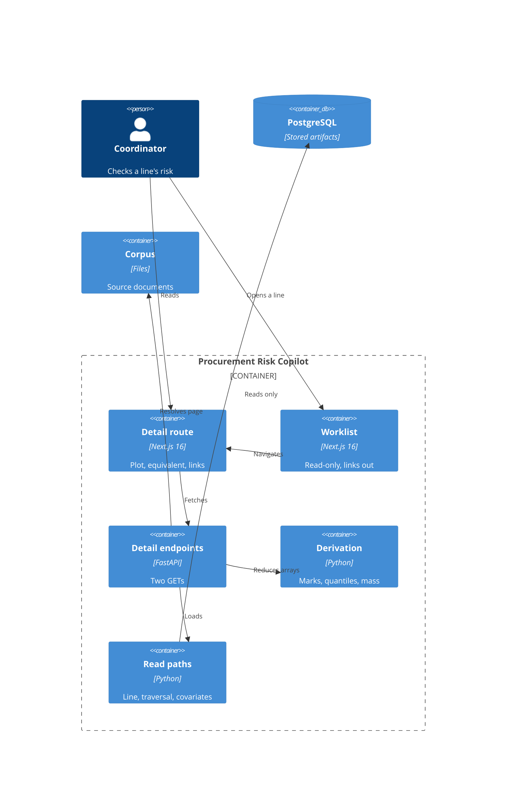

# Implementation Plan: Line Detail and Traceability

**Branch**: `00012-line-detail-and-traceability` | **Date**: 2026-07-30 | **Spec**: [spec.md](spec.md)

## Summary

**Goal**: One purchase-order line's posterior, plotted and inspectable, with every linked record resolving to the document page it was extracted from.
**Approach**: Two read-only endpoints on the delivered serving boundary; fifty marks and a banded cumulative series derived server-side; the identity traversal isolated behind one narrow read path.
**Key Constraint**: No stored array and no central summary may cross the serving boundary — see ADR-0025.

## Technical Context

**Language/Version**: Python 3.12 (`/src/api`); TypeScript 5 / React 19 (`/src/web`)
**Primary Dependencies**: FastAPI, psycopg 3 (serving); Next.js 16 App Router (interface)
**Storage**: PostgreSQL — **read-only for this feature**; no migration, no new table
**Testing**: pytest + Hypothesis (property-based, mandatory for the derivation module); Vitest + Testing Library; Playwright
**Target Platform**: Linux container, one shared vCPU
**Project Type**: web
**Project Mode**: brownfield
**Performance Goals**: p95 ≤ 1.5 s on one shared vCPU, adopted from `specs/sad.md` rather than chosen here
**Constraints**: API container steady-state RSS ≤ 400 MB (registered envelope); the delivered import contract forbids `api.risk_read`, `api.routes` and `api.compute` from reaching `gateway` **at all**, indirect imports included (`allow_indirect_imports = false`), and `/src/api` does not declare `/src/model`; the interface shell is read-only after E010
**Scale/Scope**: ~200 open lines; one line per request; several thousand draws per line reduced to 50 marks + banded series before serialisation

## Instructions Check

*GATE: Must pass before Phase 0 research. Re-check after Phase 1 design.*

| Gate | Status | Evidence |
|---|---|---|
| I. Traceable or It Does Not Ship | PASS | FR-013/SC-017 carry run id, model version, array schema version, as-of date; FR-018 carries document, page, span, per-field confidence; FR-021 reads chunks only through the active ingestion generation |
| II. Uncertainty Is the Product | PASS | ADR-0025 keeps arrays server-side; FR-003/FR-012/FR-037 forbid a point estimate; FR-038 closes the stated scalar figures in five classes; FR-041 reuses the delivered bounded percentage form |
| III. Precision Over Recall | PASS | FR-031 withholds an unreconciled covariate; FR-023/FR-032/FR-044 refuse rather than render |
| IV. Agent Output Style | PASS | Tables throughout; Summary is three key-value lines |
| V. The Model Extracts, Code Computes | PASS | All derivation is deterministic Python in `api.compute.distribution`; no model invocation on this surface |
| VI. Evaluate Before You Tune | N/A | No evaluation set, no tuning run |
| VII. Publish the Miss | PASS | FR-025 fixes the census target at 100% before first measurement; two Recorded Limitations carry all four fields; FR-012 concedes the guarantee that cannot be kept |
| VIII. Honest Opponents | N/A | No model claim, no baseline |
| Governance | **FAIL until ADR-0025 lands on `main`** | Workspace number 00012 is on `origin/main`. ADR-0025 is **not** claimed: the record exists only on this feature branch, and v1.2.11 holds that "a claim recorded only in a feature workspace is not a claim" — a concurrent allocator scanning `specs/adrs/` on the default branch finds 0025 free and is correct to take it. The ADR Author is the authoring channel, not the claiming mechanism. Discharged by committing the record to `main`; the gate re-runs after |
| Source Layout / Testing Policy | PASS | New code lands under existing `/src/api` and `/src/web` entries; FR-046 puts the derivation under test-first property-based tests in the merge gate |

**Re-check after design**: see [§ Post-Design Compliance](#post-design-compliance).

**Version audited**: `project-instructions.md` **v1.2.11** (2026-07-29).

## Architecture



## Architecture Decisions

Feature-local tradeoffs only. Project-wide architectural decisions belong in standalone ADRs under `specs/adrs/` — referenced by ID, not duplicated here.

| ID | Decision | Options Considered | Chosen | Rationale |
|----|----------|--------------------|--------|-----------|
| AD-001 | What crosses the boundary for the distribution | raw draws / bin edges+counts / fixed quantile set | Fifty quantile marks + banded cumulative series | See **ADR-0025**. Fifty is the largest mark count with comprehension evidence (research.md) and is not extrapolated past it |
| AD-002 | Where the derivation runs | client / route handler / `api.compute` | `api.compute.distribution` | Keeps arithmetic out of the handler and inside the module the import contracts reason about, matching the delivered `api.compute.probability` |
| AD-003 | How the identity traversal is isolated | inline in the route / shared query module / one narrow read path | One narrow read path, `risk_read.traceability` | E009's `0500` ALTER adds `resolution_run_id`, `project_id`, `specification_section` and re-scopes three uniqueness constraints; the spec's stated mitigation is that the change lands in one place |
| AD-004 | Covariate values, given they are stored nowhere | read from artifact (impossible) / reconstruct and display / reconstruct and reconcile | Reconstruct, reconcile, withhold on mismatch | FR-031. The walk lives in `/src/model`, which serving may not import, so agreement must be evidenced rather than assumed |
| AD-005 | Reference class wording | mint "comparable orders" / reuse the committed constant | Reuse `api.compute.probability.REFERENCE_CLASS` | The delivered constant reads `out of 100 lines like this one`; a second phrasing on a second surface is two claims about one denominator. **Flagged**: spec and research say "comparable orders" — reconciled in favour of the committed constant, and the divergence is recorded in [§ Open Items](#open-items) |
| AD-006 | Day-grid band boundaries | fixed calendar grid / posterior quantiles | Posterior quantiles | FR-016 already decides this; research.md carried it as open and the spec closed it. Recorded so the plan does not reopen a settled question |
| AD-007 | Source-page binding location | storage / configuration | Configuration | The identifier is minted by a lossy transform that cannot be reversed; storage has no path column. Carried as a Recorded Limitation with its reversal trigger, not presented as free |
| AD-008 | Whether the detail endpoint accepts the worklist's need-by what-if | reject (Scope excludes editing) / accept as pass-through | Accept as a pass-through query parameter | FR-005 marks the **effective** need-by date and Key Entities names "its recorded *and* effective need-by dates", while FR-010 requires the two surfaces be "incapable of disagreeing". A coordinator with an adjustment active on the worklist who opened the line would meet exactly that disagreement. Scope's exclusion binds the **control** — E012 offers no way to set an adjustment — not the pass-through of one already made |
| AD-010 | How FR-024's *second* condition — the extracted span is present on the cited page — is measured | against `chunk.body_text` / against the corpus PDF page / not measured | **Both, at different times**: `chunk.body_text` at request time, the corpus page at acceptance | The serving boundary declares no PDF library, so the corpus-page check cannot run per request. Checking only `chunk.body_text` is cheap and available but near-tautological — the extractor read the value out of that chunk, so it measures database self-consistency rather than link correctness, which is precisely what FR-024 exists to catch (*"a link that looks right is frequently not"*). So the runtime figure uses the chunk-text check and is **declared a proxy**, and SC-010's "measured over real corpus documents" is discharged by an acceptance check that re-measures the same condition against real corpus pages where `pdfplumber` is available. The proxy's validity is *established* by that agreement rather than assumed, and disagreement is published |
| AD-009 | The census denominator | records rendered on this view / every linked record the active run carries | The active run's whole linked-record set | FR-024 states the denominator in terms. The rendered subset is cheaper and is a *different claim* — a per-view sample reported in the grammar of a census. The envelope is met by the shape of the work instead: resolution is a property of the **document**, not of each record, so the figure is one aggregate grouped by document identifier with each distinct identifier resolved once and memoised for the process lifetime |

## Data Model Summary

N/A — no persistent data. E012 adds no table, no column, and no migration.

Determined from the spec's `## Implementation Signals`, which carry two `NEW-API`, two `NEW-UI` and one `NEW-CONFIG` tag and **no** `NEW-ENTITY` or `MIGRATION`. The spec's `### Key Entities` section is non-empty but every entity is consumed read-only — the spec states `ResolvedEntity` is "read here, never written", and SC-022 forbids any identity write under any interaction. Entities read: `PurchaseOrderLine`, `ForecastRun`, `PosteriorDraws`/`SurvivalArray`, `ResolvedEntity`, `ResolvedEntityMember`, `ExtractedValue`, `Chunk`, `Document`.

## API Surface Summary

*Populated from `contracts/openapi.yaml`.*

| Method | Path | Purpose | Auth | Req/Res Types |
|--------|------|---------|------|---------------|
| GET | `/api/v1/lines/{po_line_id}` | One line's distribution, covariates, linked records and resolved state | none — inherited from `specs/sad.md` § Security via E010 FR-056, not decided here | path `PoLineId` (uuid), query `need_by_override` (date, optional, AD-008), header `If-None-Match` → `LineDetailResponse`; 304/422/500/503 → `Problem` |
| GET | `/api/v1/documents/{document_id}/source` | Resolve a document identifier to a readable source, streamed inline for display at a page | none, same inheritance | path `DocumentId` (kebab slug), header `If-None-Match` → `application/pdf` binary + `Content-Disposition: inline`, `X-Source-Kind`, `X-Ingestion-Generation`; 404/422/500/503 → `Problem` |

Both are `GET`-only and there is no `POST`/`PUT`/`PATCH`/`DELETE` anywhere on this surface, which makes FR-029's "writes no identity-resolution record" a property of the operation table rather than a convention.

**No `TextualEquivalent` schema.** FR-014's structured equivalent renders in the web layer from the *same* response members the figures render from. A free-text summary field would be a second copy of every figure and the one unconstrained place a point estimate could re-enter — and FR-016's guarantee that both readings yield the same figures only holds if both read the same members. `criticality` is likewise absent: it is scalar and stated, and belongs to none of FR-038's five closed classes, so carrying it would open a sixth.

E012 **introduces** this surface — `specs/project-plan.md` § API Surfaces records `Line detail endpoint | Introduced by E012 | Consumed by —`, and no repository-level OpenAPI document exists; each epic contracts the endpoints it adds. E001's "Contracts" are `import-linter` architecture contracts, not API contracts (its Scope excludes "any application behaviour — no routes, no schema").

The worklist contract is **not** touched. FR-035 makes an already-present identity field navigable in the web layer, adding no row element, so E010 FR-057's same-commit consumer rule is not triggered.

**Source endpoint scope, stated rather than implied**: the serving boundary declares no PDF library — `pdfplumber` belongs to `/src/model`, which serving may not import — so the document is streamed `inline` and the caller opens it at `#page=N` using the page number the detail response already carries. The reader arrives at the page; the byte range is not narrowed.

**Detail**: `contracts/openapi.yaml`

## Testing Strategy

| Tier | Tool | Scope | Mock Boundary | Install |
|------|------|-------|---------------|---------|
| Unit | pytest + Hypothesis | `api.compute.distribution` pure functions — mark allocation, quantile extraction, mass derivation, band alignment. **Test-first, property-based, mandatory** per FR-046 | No database; arrays as fixtures | configured |
| Unit (web) | Vitest + Testing Library | Copy tables, state resolution, figure rendering, textual equivalent | `fetch` stubbed | configured |
| Integration | pytest | Both endpoints against a seeded database; identity traversal against frozen fixtures; problem shapes and ETag/304 | Real Postgres, frozen clock | configured |
| Contract validator extension | pytest | **Prerequisite work, not optional.** `src/api/tests/conformance.py` is hand-written — `jsonschema` is a `/src/model` distribution and the dependency-isolation check forbids it in the serving boundary's resolution — and its `SUPPORTED_KEYWORDS` implements none of `allOf`, `anyOf`, `not`, `if`/`then`, `contains`, `maxLength`. E012's contract uses **all** of them, including the four root conditionals that carry FR-006's withholding rule. Pointed at this contract unextended, those conditionals go unvalidated and `additionalProperties: false` is never *reached* through `allOf`-wrapped members — so the "enforced structurally" claim above would rest on checks that do not run. The module's own `test_the_checker_covers_every_construct_the_contract_uses` fails loudly rather than passing silently, which is why this is scheduled rather than discovered | — | configured (extend existing module) |
| Contract conformance | pytest | Live response bodies validated against `contracts/openapi.yaml`, following `src/api/tests/test_contract_conformance.py`'s pattern and its stated direction of authority — *"the contract is the authority here, not this test"*. **Closes a live gap**: the existing check validates payloads only, and nothing validates the served OpenAPI *document* (paths, operations, parameters) against any committed contract, so an endpoint shipped with no contract fails no build today | Real Postgres | configured (new test file) |
| E2E | Playwright | Worklist → detail navigation, accessibility-tree assertions (SC-018, SC-031), no-central-estimate assertions (SC-001, SC-026, SC-032) | None | configured |
| Security | pip-audit, npm audit | Dependency advisories, reported not gated | — | configured |
| Coverage | pytest-cov, Vitest v8 | Target 80 per the derived QC policy | — | configured |

## Error Handling Strategy

Adopted from the delivered boundary (E010 FR-043 / `api.risk_read.failures`), not re-chosen. RFC 9457 `application/problem+json`, closed `type` set, `correlation_id` on every problem including 422.

| Error Category | Pattern | Response | Retry |
|----------------|---------|----------|-------|
| Absent line / closed line | fail-soft, named state | 200 + resolution state (FR-044) — **never** 404, which would render an honest outcome as a fault | no |
| No posterior (no run / not covered / roster mismatch) | fail-soft, named state | 200 + resolution state (FR-042) | no |
| Unresolvable source page | fail-fast, scoped to the section | 200 + section state (FR-023); page request itself → 404 problem naming the cause | no |
| Covariate reconciliation mismatch | withhold | 200 + section state (FR-031) — value absent, never zero or dash | no |
| Unrecognised artifact schema version | fail-fast | 500 problem `unsupported-artifact-schema` | no |
| Datastore unreachable | fail-fast | 503 problem `datastore-unavailable` | client may retry |
| Malformed line identifier | fail-fast | 422 problem naming the parameter, with `correlation_id` | no |

## Integration Points

| Spec Reference | System/Service | Technical Approach | Contract |
|----------------|----------------|--------------------|----------|
| FR-010, FR-013 | E007 forecast artifacts | Read the same `forecast_run` row and per-line arrays the worklist reads; schema version checked before use | `api.risk_read` |
| FR-018–FR-023 | E006 chunks and documents | Read via the active ingestion generation view (E006 FR-055) | `v_active_ingestion_generation` |
| FR-026–FR-029 | E009 identity resolution | Read-only traversal through `resolved_entity_member`; **table is empty until E009 runs**, so the unresolved state is the common path | `risk_read.traceability` |
| FR-035 | E010 worklist | Existing line identity becomes the navigation target; no new row element (would breach E010's three closed content classes) | E010 FR-027 |
| NEW-CONFIG | Corpus location | Configuration binding from document identifier to readable source; resolution rate measured, not assumed | AD-007 |

## Risk Mitigation

| Risk (from spec) | Likelihood | Impact | Mitigation | Owner |
|-------------------|------------|--------|------------|-------|
| The identity schema moves underneath this feature | H | M | AD-003 — the traversal lives in `risk_read/traceability.py` and nowhere else, so E009's `0500` ALTER (`resolution_run_id`, `project_id`, `specification_section`, generated `member_record_id`, three re-scoped uniqueness constraints) lands in one file. Frozen fixtures pin today's shape; E009's ALTER is the stated re-verify trigger | `risk_read.traceability` |
| A displayed covariate value drifts from the value the fit used | M | H | AD-004 — reconcile every reconstructed value against the fit's recorded conditioning before display; withhold under a named state on mismatch (FR-031), never display unreconciled. SC-023 asserts no covariate appears that the run does not record | `risk_read.covariates` |
| Source pages resolve for the fixture and not for the corpus | M | M | FR-024's census measured over **real corpus documents**, not fixtures, published as an exact count with its denominator against the 100% target fixed before first measurement (FR-025) | `risk_read.source_binding` |

## Requirement Coverage Map

| Req ID | Component(s) | File Path(s) | Notes |
|--------|--------------|--------------|-------|
| FR-001, FR-002 | Derivation | `src/api/src/api/compute/distribution.py` | Fifty marks, count fixed independent of line/run/draw count |
| FR-003, FR-012 | Derivation, contract | `compute/distribution.py`, `contracts/openapi.yaml` | No central summary is computed or serialisable |
| FR-004 | Derivation | `compute/distribution.py` | Same two quantiles the worklist publishes; nearest-rank, one-based, no interpolation |
| FR-005, FR-006 | Derivation | `compute/distribution.py` | Need-by mark, shaded mass, frequency both directions; bound beyond horizon; withheld at/before anchor |
| FR-007, FR-008 | Derivation, UI | `compute/distribution.py`, `src/web/app/lines/[poLineId]/Cumulative.tsx` | Increasing cumulative view after the distribution in reading order; residual mass labelled |
| FR-009 | UI | `Distribution.tsx`, `Cumulative.tsx` | Axis in days from as-of; no calendar date as axis, tick, or title |
| FR-010, FR-013 | Read path | `src/api/src/api/risk_read/line_query.py` | Same stored row as the worklist; artifact identification carried |
| FR-011, FR-012, FR-037, FR-038, FR-039 | Contract, route, conformance test | `contracts/openapi.yaml`, `routes/line_detail.py`, `src/api/tests/test_detail_conformance.py` | Arrays never serialised and no central-summary member — enforced structurally: every object in the 200 response tree is `additionalProperties: false` (`Problem` is deliberately open per RFC 9457 and carries no figure), `percent` is bounded 1..99 so `0%`/`100%` are unrepresentable, marks are pinned at exactly 50, `QuantilePair` requires both members so a lone quantile cannot be expressed, and withheld miss mass is absence rather than a nullable field |
| FR-014, FR-015, FR-016 | UI | `TextualEquivalent.tsx` | Five items; same region as the figures; bands bounded by the labelled quantiles (AD-006) |
| FR-017 | Derivation, UI | `compute/distribution.py`, `Distribution.tsx` | — |
| FR-018, FR-019, FR-020 | Read path, UI | `risk_read/traceability.py`, `LinkedRecords.tsx` | Document title, page, span, per-field confidence; page displayed, not merely cited |
| FR-021 | Read path | `risk_read/traceability.py` | Chunk reads filtered through the active ingestion generation |
| FR-022 | Read path, UI | `risk_read/traceability.py`, `LinkedRecords.tsx` | REAL/SYNTHETIC distinction preserved at display |
| FR-023 | Read path, UI | `risk_read/source_binding.py`, `LinkedRecords.tsx` | Named, resolvable failure; never an empty frame |
| FR-024, FR-025 | Read path | `risk_read/source_binding.py` | Census with denominator, no-interval declaration travelling with the figure, licensed reason from E009's closed set; 100% target fixed before first measurement |
| FR-026, FR-027, FR-028, FR-029 | Read path, copy | `risk_read/traceability.py`, `src/web/app/lines/[poLineId]/detailCopy.ts` | Unresolved identity as committed copy; the two identity states distinguished; no write path |
| FR-030, FR-031, FR-032, FR-033, FR-034 | Read path, UI | `risk_read/covariates.py`, `Covariates.tsx` | Reconstructed, reconciled, withheld on mismatch; association wording, no contribution figures |
| FR-035 | UI | `src/web/app/worklist/Row.tsx` (`~`) | Existing identity becomes the link; no new row element |
| FR-036 | Failures | `risk_read/failures.py` (reused) | Correlation identifier and closed-set cause, in the delivered form |
| FR-040, FR-043 | Copy, UI | `detailCopy.ts` | Every state carried by accessibility-tree text; wording distinct by a decidable property |
| FR-041 | Derivation | `compute/probability.py` (reused) | `PercentFigure` bounded form; residual mass, beyond-horizon bound, per-mark share |
| FR-042 | State resolution | `risk_read/detail_states.py` | Three scopes: resolution (one of five, stated precedence adopting E010 FR-018a), annotation (zero or more of three), section-scoped (one per section, each with a nominal member) |
| FR-044 | State resolution | `risk_read/detail_states.py` | Absent or closed line → named outcome |
| FR-045 | State resolution, UI | `risk_read/detail_states.py`, `page.tsx` | Stale run marks its own figures; no reliance on a banner elsewhere |
| FR-046 | Derivation, tests | `compute/distribution.py`, `src/api/tests/test_distribution.py` | Test-first, property-based, in the merge gate |

## Project Structure

### Source Code

```text
+ src/api/src/api/compute/distribution.py        # marks, quantiles, mass, bands (pure)
+ src/api/src/api/risk_read/line_query.py        # one line + its artifact
+ src/api/src/api/risk_read/traceability.py      # THE identity traversal (AD-003)
+ src/api/src/api/risk_read/covariates.py        # reconstruct + reconcile + withhold
+ src/api/src/api/risk_read/detail_states.py     # FR-042's three scopes
+ src/api/src/api/risk_read/source_binding.py    # document id -> readable source
+ src/api/src/api/routes/line_detail.py          # the two GETs
~ src/api/src/api/main.py                        # register the new router
+ src/api/tests/test_distribution.py             # property-based, written first
+ src/api/tests/test_line_detail.py
+ src/api/tests/test_traceability.py

+ src/web/app/lines/[poLineId]/page.tsx
+ src/web/app/lines/[poLineId]/Distribution.tsx  # fifty marks
+ src/web/app/lines/[poLineId]/Cumulative.tsx
+ src/web/app/lines/[poLineId]/TextualEquivalent.tsx
+ src/web/app/lines/[poLineId]/LinkedRecords.tsx
+ src/web/app/lines/[poLineId]/Covariates.tsx
+ src/web/app/lines/[poLineId]/detailCopy.ts     # committed state copy
+ src/web/app/lines/[poLineId]/useLineDetail.ts
+ src/web/app/lines/[poLineId]/page.module.css
~ src/web/app/worklist/Row.tsx                   # identity becomes the link (FR-035)
+ src/web/e2e/line-detail.spec.ts
```

**Patterns to reuse**: `routes/worklist.py`'s compose-only handler with `get_connection` dependency; `risk_read/failures.py` for problems and correlation identifiers; `compute/probability.py`'s `PercentFigure`/`complement`; `worklist/stateCopy.ts` for a committed copy table; `worklist/useWorklist.ts` for the fetch convention; `worklist/Explain.tsx` for the popup transparency panels.
**Tests to extend**: `src/api/tests/` integration patterns with a frozen clock; `src/web/app/worklist/*.test.tsx` rendering conventions.
**Naming conventions**: snake_case modules under `api/`; PascalCase components colocated with their route; `*.test.ts(x)` beside the unit; copy tables as `*Copy.ts`.

## Implementation Hints

- **[HINT-001]** Order: write `compute/distribution.py`'s property-based tests **before** its implementation. FR-046 makes test-first mandatory for this module, and QC checks the commit order, not just the presence of tests.
- **[HINT-002]** Gotcha: `REFERENCE_CLASS` in `compute/probability.py` reads `out of 100 lines like this one`, not the spec's "comparable orders". Reuse the constant (AD-005); do not mint a second phrasing, and do not silently reword the delivered one — that would change the worklist's committed copy.
- **[HINT-003]** Constraint: `resolved_entity_member` is **empty** until E009 runs. Every traversal test needs frozen fixtures, and the unresolved state is the path that actually renders today — build and test it first, not last.
- **[HINT-004]** Gotcha: the miss mass at or before the anchor is **withheld**, which must be structural absence in the payload. A `null`, `0`, or `"—"` is one renderer away from a screen reading `0%` — the same defect E010's FR-054 names.
- **[HINT-005]** Compatibility: E010's row content is closed in three classes. Making identity navigate must not add an element to the row; change the existing identity into the link (FR-035) or it breaches another epic's committed contract.

### Recorded Limitation — the source endpoint serves a document, not a page

*Scope decision*: resolve a document identifier to its source and stream the whole document inline, positioning the reader with a `#page=N` fragment composed server-side from the record's stored page number, rather than extracting and serving the cited page.

*Supporting evidence*: `src/api/pyproject.toml` declares `fastapi`, `gateway`, `psycopg[binary]` and `uvicorn` and no PDF library; `pdfplumber` belongs to `/src/model`, and neither Python boundary may declare the other. Extracting a page server-side would add a distribution to the request-serving image that the image-contents assertions and the 400 MB envelope both push against.

*Reversal trigger*: a corpus document large enough that inline streaming breaks the 1.5 s envelope, or any viewer in the supported set that ignores the `#page=` fragment — either means the reader no longer lands on the cited page, which is the outcome FR-020 exists for.

*Production-scale alternative*: the ingestion boundary emits a per-page artifact at ingest time, where `pdfplumber` already runs, so the serving boundary streams a page rather than a document and the byte range is narrowed at source.

## Open Items

| Item | Status | Resolution path |
|---|---|---|
| Spec and research say "comparable orders"; the delivered `REFERENCE_CLASS` says "out of 100 lines like this one" | Reconciled in favour of the committed constant (AD-005) | If the wording should change, it changes on the worklist too and is an E010 contract change, not an E012 choice |
| `spec_maturity` is `draft` — Clarify never ran | Accepted, non-blocking | Spec carries zero clarification markers and both validators ran at Specify; Clarify would add no open question |
| The spec's Compliance Check records the number-claim CRITICAL as `Open` | Stale text | Discharged: `specs/00012-line-detail-and-traceability/` is on `origin/main`. A compliance record states what was true when made; the discharge is recorded here instead |
| **E010 FR-055's non-application reporting is not fully adopted.** A `need_by_override` supplied against a line resolving to `absent_or_closed_line` is silently not applied — the root conditional forbids every member that could say so | Open, LOW | E010 FR-055 requires "every refusal and every **non-application** MUST reach the coordinator with its cause". Either admit a minimal report member in that state or state why the case needs none. Decide at Tasks, before the state table is implemented |
| **ADR-0025 has no repository-wide check.** Its rule is stated at ADR level and asserted per surface (E010 FR-053, E012 FR-011/SC-007); nothing scans every response schema for an array-shaped posterior field | Open — obligation established, not check established | A surface that simply omits its own assertion is not caught. E019 is the next posterior-reading surface and the natural place to either add the scan or inherit the assertion explicitly. Recorded rather than glossed, per Principle VII |
| **Two registered-document amendments outstanding**: the ADR-0025 catalog row in `specs/sad.md`, and its row in `specs/project-plan.md` § Architecture Decisions | Recorded, not performed on this branch | Governance serializes amendments to registered documents on the default branch; a feature branch records the need. Both land as one amendment alongside the ADR file itself, since under v1.2.11 the number claim is only a claim once visible on the default branch |
