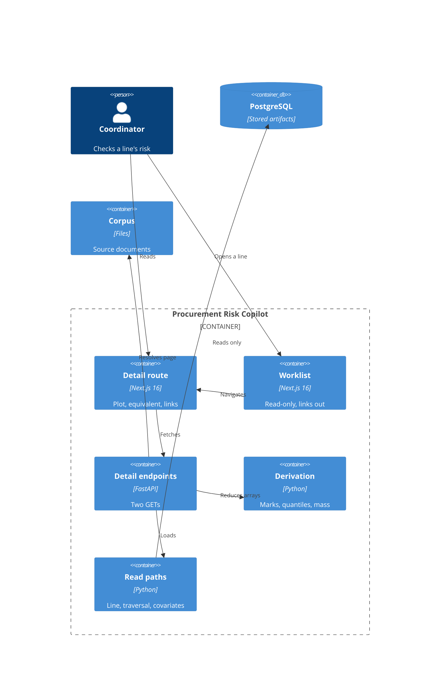

# Implementation Plan: Line Detail and Traceability

**Branch**: `00012-line-detail-and-traceability` | **Date**: 2026-07-30 | **Spec**: [spec.md](spec.md)

## Summary

**Goal**: One purchase-order line's posterior, plotted and inspectable, with every linked record resolving to the document page it was extracted from.
**Approach**: Two read-only endpoints on the delivered serving boundary; fifty marks and a banded cumulative series derived server-side; the identity traversal isolated behind one narrow read path.
**Key Constraint**: No stored array and no central summary may cross the serving boundary — see ADR-0025.

## Technical Context

**Language/Version**: Python 3.12 (`/src/api`); TypeScript 5 / React 19 (`/src/web`)
**Primary Dependencies**: FastAPI, psycopg 3 (serving); Next.js 16 App Router (interface)
**Storage**: PostgreSQL — **read-only for this feature**; no migration, no new table
**Testing**: pytest + Hypothesis (property-based, mandatory for the derivation module); Vitest + Testing Library; Playwright
**Target Platform**: Linux container, one shared vCPU
**Project Type**: web
**Project Mode**: brownfield
**Performance Goals**: p95 ≤ 1.5 s on one shared vCPU, adopted from `specs/sad.md` rather than chosen here
**Constraints**: API container steady-state RSS ≤ 400 MB (registered envelope); the delivered import contract forbids `api.risk_read`, `api.routes` and `api.compute` from reaching `gateway` **at all**, indirect imports included (`allow_indirect_imports = false`), and `/src/api` does not declare `/src/model`; the interface shell is read-only after E010
**Scale/Scope**: ~200 open lines; one line per request; several thousand draws per line reduced to 50 marks + banded series before serialisation

## Instructions Check

*GATE: Must pass before Phase 0 research. Re-check after Phase 1 design.*

| Gate | Status | Evidence |
|---|---|---|
| I. Traceable or It Does Not Ship | PASS | FR-013/SC-017 carry run id, model version, array schema version, as-of date; FR-018 carries document, page, span, per-field confidence; FR-021 reads chunks only through the active ingestion generation |
| II. Uncertainty Is the Product | PASS | ADR-0025 keeps arrays server-side; FR-003/FR-012/FR-037 forbid a point estimate; FR-038 closes the stated scalar figures in five classes; FR-041 reuses the delivered bounded percentage form |
| III. Precision Over Recall | PASS | FR-031 withholds an unreconciled covariate; FR-023/FR-032/FR-044 refuse rather than render |
| IV. Agent Output Style | PASS | Tables throughout; Summary is three key-value lines |
| V. The Model Extracts, Code Computes | PASS | All derivation is deterministic Python in `api.compute.distribution`; no model invocation on this surface |
| VI. Evaluate Before You Tune | N/A | No evaluation set, no tuning run |
| VII. Publish the Miss | PASS | FR-025 fixes the census target at 100% before first measurement; **three** Recorded Limitations in the spec and one in this plan carry all four fields — the third records that the ordering evidence behind FR-046's test-first obligation does not survive the squash merge, which was an implementation hint until it was written down; FR-058 requires a disagreement between the request-time proxy and the corpus measurement published beside the figure rather than reconciled away, with the figure still published; FR-012 concedes the guarantee that cannot be kept |
| VIII. Honest Opponents | N/A | No model claim, no baseline |
| Governance | PASS | Workspace number 00012 is on `origin/main`. **ADR-0025 is now claimed where the allocator looks** — `specs/adrs/0025-stored-posterior-arrays-do-not-cross-the-serving-boundary.md` is on `origin/main` at `f6e363f`, with its catalog rows in `specs/sad.md` and `specs/project-plan.md`, both of which now hold 25 records with no drift. This row read FAIL until that merge; the discharge is recorded rather than backdated |
| Source Layout / Testing Policy | PASS | Code lands in four locations, each on stated ground: `/src/api` and `/src/web` (the feature's own entries), `/tests` (cross-entry verification with no single owning entry — the layout rule's own exception), and `/src/model` (a test beside the extraction output it covers). No new `/src` entry; FR-046 puts the derivation under test-first property-based tests in the merge gate, **FR-070 fixes what "in the merge gate" means** — a step of the `verify` job read from the parsed workflow, with a deselected, skipped or expected-to-fail check reported as unrun rather than passed — and FR-071 fixes what evidences test-first |

**Version audited**: `project-instructions.md` **v1.2.11** (2026-07-29). Re-checked after design — see § Post-Design Compliance at the end of this plan.

## Architecture



## Architecture Decisions

Feature-local tradeoffs only. Project-wide architectural decisions belong in standalone ADRs under `specs/adrs/` — referenced by ID, not duplicated here.

| ID | Decision | Options Considered | Chosen | Rationale |
|----|----------|--------------------|--------|-----------|
| AD-001 | What crosses the boundary for the distribution | raw draws / bin edges+counts / fixed quantile set | Fifty quantile marks + banded cumulative series | See **ADR-0025**. Fifty is the largest mark count with comprehension evidence (research.md) and is not extrapolated past it |
| AD-002 | Where the derivation runs | client / route handler / `api.compute` | `api.compute.distribution` | Keeps arithmetic out of the handler and inside the module the import contracts reason about, matching the delivered `api.compute.probability` |
| AD-003 | How the identity traversal is isolated | inline in the route / shared query module / one narrow read path | One narrow read path, `risk_read.traceability` | E009's `0500` ALTER adds `resolution_run_id`, `project_id`, `specification_section` and re-scopes three uniqueness constraints; the spec's stated mitigation is that the change lands in one place |
| AD-004 | Covariate values, given they are stored nowhere | read from artifact (impossible) / reconstruct and display / reconstruct and reconcile | Reconstruct, reconcile, withhold on mismatch | FR-031. The walk lives in `/src/model`, which serving may not import, so agreement must be evidenced rather than assumed |
| AD-005 | Reference class wording | mint "comparable orders" / reuse the committed constant | Reuse `api.compute.probability.REFERENCE_CLASS` | The delivered constant reads `out of 100 lines like this one`; a second phrasing on a second surface is two claims about one denominator. **Flagged**: spec and research say "comparable orders" — reconciled in favour of the committed constant, and the divergence is recorded in [§ Open Items](#open-items) |
| AD-006 | Day-grid band boundaries | fixed calendar grid / posterior quantiles | Posterior quantiles | FR-016 already decides this; research.md carried it as open and the spec closed it. Recorded so the plan does not reopen a settled question |
| AD-007 | Source-page binding location | storage / configuration | Configuration | The identifier is minted by a lossy transform that cannot be reversed; storage has no path column. Carried as a Recorded Limitation with its reversal trigger, not presented as free |
| AD-008 | Whether the detail endpoint accepts the worklist's need-by what-if | reject (Scope excludes editing) / accept as pass-through | Accept as a pass-through query parameter | FR-005 marks the **effective** need-by date and Key Entities names "its recorded *and* effective need-by dates", while FR-010 requires the two surfaces be "incapable of disagreeing". A coordinator with an adjustment active on the worklist who opened the line would meet exactly that disagreement. Scope's exclusion binds the **control** — E012 offers no way to set an adjustment — not the pass-through of one already made |
| AD-009 | The census denominator | records rendered on this view / every linked record the active run carries | The active run's whole linked-record set | FR-024 states the denominator in terms. The rendered subset is cheaper and is a *different claim* — a per-view sample reported in the grammar of a census. The envelope is met by the shape of the work instead: resolution is a property of the **document**, not of each record, so the figure is one aggregate grouped by document identifier with each distinct identifier resolved once and memoised for the process lifetime |
| AD-010 | {SAD:ADR-0017} How FR-024's *second* condition — the extracted span is present on the cited page — is measured | against `chunk.body_text` / against the corpus PDF page / not measured | **Both, at different times**: `chunk.body_text` at request time, the corpus page at acceptance | The serving boundary declares no PDF library, so the corpus-page check cannot run per request. Checking only `chunk.body_text` is cheap and available but near-tautological — the extractor read the value out of that chunk, so it measures database self-consistency rather than link correctness, which is precisely what FR-024 exists to catch (*"a link that looks right is frequently not"*). So the runtime figure uses the chunk-text check and is **declared a proxy**, and SC-010's "measured over real corpus documents" is discharged by an acceptance check that re-measures the same condition against real corpus pages where `pdfplumber` is available. The proxy's validity is *established* by that agreement rather than assumed, and disagreement is published — **FR-058 now fixes what publication means and what a disagreement obliges**, and SC-010a names the artifact: both counts with their denominators, the corpus and resolution run each was taken over, and the records the two decide differently are written to `specs/00012-line-detail-and-traceability/evidence/span-check-agreement.md`; the request-time figure keeps being published with its basis declared and its proxy status intact rather than being withheld, and a disagreement of any size is the recorded reversal trigger for the request-time basis chosen here, because two censuses over the same records differing is a defect and not noise. Invokes **ADR-0017**, which this project holds for exactly this shape — a plan-phase artifact normative over a specify-phase requirement — rather than leaving SC-010 quietly divergent |

## Data Model Summary

N/A — no persistent data. E012 adds no table, no column, and no migration.

Determined from the spec's `## Implementation Signals`, which carry two `NEW-API`, two `NEW-UI` and one `NEW-CONFIG` tag and **no** `NEW-ENTITY` or `MIGRATION`. The spec's `### Key Entities` section is non-empty but every entity is consumed read-only — the spec states `ResolvedEntity` is "read here, never written", and SC-022 forbids any identity write under any interaction. Entities read: `PurchaseOrderLine`, `ForecastRun`, `PosteriorDraws`/`SurvivalArray`, `ResolvedEntity`, `ResolvedEntityMember`, `ExtractedValue`, `Chunk`, `Document`.

## API Surface Summary

*Populated from `contracts/openapi.yaml`.*

| Method | Path | Purpose | Auth | Req/Res Types |
|--------|------|---------|------|---------------|
| GET | `/api/v1/lines/{po_line_id}` | One line's distribution, covariates, linked records and resolved state | none — inherited from `specs/sad.md` § Security via E010 FR-056, not decided here | path `PoLineId` (uuid), query `need_by_override` (date, optional, AD-008), header `If-None-Match` → `LineDetailResponse`; 304/422/500/503 → `Problem` |
| GET | `/api/v1/documents/{document_id}/source` | Resolve a document identifier to a readable source, streamed inline for display at a page | none, same inheritance | path `DocumentId` (kebab slug), header `If-None-Match` → `application/pdf` binary + `Content-Disposition: inline`, `X-Source-Kind`, `X-Ingestion-Generation`; 404/422/500/503 → `Problem` |

Both are `GET`-only and there is no `POST`/`PUT`/`PATCH`/`DELETE` anywhere on this surface, which makes FR-029's "writes no identity-resolution record" a property of the operation table rather than a convention — and FR-069 requires the whole surface to be that way, so the property is one a later revision has to keep rather than one that holds while nobody adds a verb.

**No `TextualEquivalent` schema.** FR-014's structured equivalent renders in the web layer from the *same* response members the figures render from. A free-text summary field would be a second copy of every figure and the one unconstrained place a point estimate could re-enter — and FR-016's guarantee that both readings yield the same figures only holds if both read the same members. `criticality` is likewise absent, and **FR-060 now owns that absence** rather than it resting on a reading of FR-038 the requirement itself disclaims — FR-038's domain is a locus, not an adjective, so a scalar rendered outside the four figure regions is not a sixth class by being scalar. FR-060 states the ground instead: no requirement here puts criticality on this view, E017 owns the override and E010 renders it on the worklist as explanatory context. The same requirement owns the two members that *are* present for no figure-related reason — `manufacturer` and `part_number`, the fields identity resolution matches on.

E012 **introduces** this surface — `specs/project-plan.md` § API Surfaces records `Line detail endpoint | Introduced by E012 | Consumed by —`, and no repository-level OpenAPI document exists; each epic contracts the endpoints it adds. E001's "Contracts" are `import-linter` architecture contracts, not API contracts (its Scope excludes "any application behaviour — no routes, no schema").

The worklist contract is **not** touched. FR-035 makes an already-present identity field navigable in the web layer, adding no row element, so E010 FR-057's same-commit consumer rule is not triggered.

**Source endpoint scope, stated rather than implied**: the serving boundary declares no PDF library — `pdfplumber` belongs to `/src/model`, which serving may not import — so the document is streamed `inline` and the caller opens it at `#page=N` using the page number the detail response already carries. The reader arrives at the page; the byte range is not narrowed.

**Detail**: `contracts/openapi.yaml`

## Testing Strategy

| Tier | Tool | Scope | Mock Boundary | Install |
|------|------|-------|---------------|---------|
| Unit | pytest + Hypothesis | `api.compute.distribution` pure functions — mark allocation, quantile extraction, mass derivation, band alignment. **Test-first, property-based, mandatory** per FR-046 | No database; arrays as fixtures | configured |
| Unit (web) | Vitest + Testing Library | Copy tables, state resolution, figure rendering, textual equivalent | `fetch` stubbed | configured |
| Integration | pytest | Both endpoints against a seeded database; identity traversal against frozen fixtures; problem shapes and ETag/304, including FR-068's two-sided validator check — every enumerated input held fixed leaves the validator unchanged, and each changed in turn moves it, the active resolution run included, which is the case SC-033 names and the one a per-line input list misses | Real Postgres, frozen clock | configured |
| Contract validator extension | pytest | **Prerequisite work, not optional.** `src/api/tests/conformance.py` is hand-written — `jsonschema` is a `/src/model` distribution and the dependency-isolation check forbids it in the serving boundary's resolution — and its `SUPPORTED_KEYWORDS` implements none of `allOf`, `anyOf`, `not`, `if`/`then`, `contains`, `maxLength`. E012's contract uses **all** of them, including the four root conditionals that carry FR-006's withholding rule. Pointed at this contract unextended, those conditionals go unvalidated and `additionalProperties: false` is never *reached* through `allOf`-wrapped members — so the "enforced structurally" claim above would rest on checks that do not run. The module's own `test_the_checker_covers_every_construct_the_contract_uses` fails loudly rather than passing silently, which is why this is scheduled rather than discovered | — | configured (extend existing module) |
| Contract conformance | pytest | Live response bodies validated against `contracts/openapi.yaml`, following `src/api/tests/test_contract_conformance.py`'s pattern and its stated direction of authority — *"the contract is the authority here, not this test"*. **Closes a live gap**: the existing check validates payloads only, and nothing validates the served OpenAPI *document* (paths, operations, parameters) against any committed contract, so an endpoint shipped with no contract fails no build today | Real Postgres | configured (new test file) |
| E2E | Playwright | Worklist → detail navigation, accessibility-tree assertions (SC-018, SC-031), no-central-estimate assertions (SC-001, SC-026, SC-032) | None | configured |
| Security | pip-audit, npm audit | Dependency advisories, reported not gated | — | configured |
| Coverage | pytest-cov, Vitest v8 | Target 80 per the derived QC policy | — | configured |

**Gate membership, stated as a property rather than assumed (FR-070, SC-034).** Every tier above except the corpus-page acceptance check runs as a step of the `verify` job in `.github/workflows/verify.yml`, and T043 asserts that over the **parsed** workflow rather than over its text, following the delivered `tests/checks/test_worklist_checks_run_in_the_gate.py`. A check that is deselected, filtered out by a marker expression, skipped for a missing environment dependency, or marked expected-to-fail has not executed: it is reported as unrun and fails the gate rather than reporting green. The one exception is `src/model/tests/test_corpus_span_acceptance.py`, which needs `pdfplumber` and is therefore an **acceptance-tier** check by AD-010's construction — it is recorded as one and counted as no part of the gated evidence, which is the distinction the map below carries in its own column.

### Criterion Coverage Map

Every criterion, the check that owns it, and whether that check discharges it inside the gate or only at acceptance (FR-070). A criterion with no owning check is recorded as **unevidenced** here rather than assumed covered — that visibility is the point of the table, and five criteria are in that state today.

| Criterion | Tier / owning check | Gate? | Task |
|---|---|---|---|
| SC-001 | E2E no-central-estimate assertions; contract conformance over the payload | gate | T025, T017 |
| SC-002 | Integration — the miss pair carried in both directions. The **shaded region has no owning check** | gate (payload half) | T018 |
| SC-003 | **Unevidenced** — nothing compares this view's figures against the worklist's for one line under one run | — | — |
| SC-004 | Integration over the five resolution states and their precedence ranks | gate | T018 |
| SC-005 | Unit (web) — the five contents, asserted conjunct by conjunct under FR-075 | gate | T023 |
| SC-006 | Contract conformance — `residual` required. The rendered naming has no owning check | gate (payload half) | T017 |
| SC-007 | Contract conformance plus the figure-class assertions | gate | T017, T044 |
| SC-008 | Integration — problem shapes for the source endpoint. Fixture-evidenced and **unjudged at an empty record set** (FR-076); the 200 stream itself has no owning check | gate | T018 |
| SC-009 | **Unevidenced** — no check asserts a citation's label, page and confidence before opening. Fixture-evidenced when one exists (FR-076) | — | — |
| SC-010 | Contract conformance — census counts, target, declaration, licensed reason, unjudged verdict | gate | T044 |
| SC-010a | Corpus-page re-measurement and the committed agreement artifact | **acceptance — not gated** | T034 |
| SC-011 | Integration against frozen fixtures plus the copy distinctness test | gate | T009, T010 |
| SC-012 | Integration — both identity states and the absent-or-closed line | gate | T018, T009 |
| SC-013 | Contract conformance — `Covariate` closed, so no share member is representable | gate | T017, T041 |
| SC-014 | Contract conformance — absence rather than a sentinel | gate | T017, T040 |
| SC-015 | E2E accessibility-tree assertions | gate | T045 |
| SC-016 | Unit (web) row test, counted by E010 FR-027's three-class procedure | gate | T024 |
| SC-017 | Contract conformance — `meta` and its run identification required | gate | T017 |
| SC-018 | Integration plus the cross-scope distinctness test | gate | T018, T010 |
| SC-019 | E2E state text plus the route shell's stale mark | gate | T045, T019 |
| SC-020 | Contract conformance — bounded form at every published percentage, bands included | gate | T044 |
| SC-021 | Integration against frozen fixtures. Fixture-evidenced and **unjudged at an empty record set** (FR-076) | gate | T009, T030 |
| SC-022 | Integration — no write under any interaction, no verb but GET | gate | T038 |
| SC-023 | **Unevidenced** — no check asserts that a displayed covariate is one the run records | — | — |
| SC-024 | Integration problem shapes plus the untruncated rendering assertion | gate | T018, T045 |
| SC-025 | Property tests plus the gate-membership check | gate | T012, T043 |
| SC-026 | E2E no-combination assertions plus figure-class closure. **Arity bound open** — see checklist CHK014 | gate | T025, T044 |
| SC-027 | Property tests plus the schema's fifty-mark bounds | gate | T012, T017 |
| SC-028 | Integration annotation sets plus the two root conditionals | gate | T018, T017 |
| SC-029 | **Unevidenced** — nothing asserts document order, or that the visual order agrees with it | — | — |
| SC-030 | Contract conformance — the payload carries no date an axis could lift. The rendered half has no owning check | gate (payload half) | T017 |
| SC-031 | E2E accessibility assertions on the equivalent | gate | T025, T045 |
| SC-032 | E2E plus contract conformance | gate | T025, T017 |
| SC-033 | Integration two-sided validator check, the resolution run included | gate | T018 |
| SC-034 | Gate-membership check over the parsed workflow | gate | T043 |
| SC-035 | The committed red-run record, checked for the module, the failed properties and the commit | gate | T012 |
| SC-036 | Rejection cases and clause-exercise coverage in the conformance test | gate | T017 |
| SC-037 | The validator's own construct-coverage assertion against this contract | gate | T003 |
| SC-038 | Identifier naming asserted across the check set | gate | T047 |

## Error Handling Strategy

Adopted from the delivered boundary (E010 FR-043 / `api.risk_read.failures`), not re-chosen. RFC 9457 `application/problem+json`, closed `type` set, `correlation_id` on every problem including 422.

| Error Category | Pattern | Response | Retry |
|----------------|---------|----------|-------|
| Absent line / closed line | fail-soft, named state | 200 + resolution state (FR-044) — **never** 404, which would render an honest outcome as a fault | no |
| No posterior (no run / not covered / roster mismatch) | fail-soft, named state | 200 + resolution state (FR-042) | no |
| Unresolvable source page | fail-fast, scoped to the section | 200 + section state (FR-023); page request itself → 404 problem naming the cause | no |
| Covariate reconciliation mismatch | withhold | 200 + section state (FR-031) — value absent, never zero or dash | no |
| Unrecognised artifact schema version | fail-fast | 500 problem `unsupported-artifact-schema` | no |
| Datastore unreachable | fail-fast | 503 problem `datastore-unavailable` | client may retry |
| Malformed line identifier | fail-fast | 422 problem naming the parameter, with `correlation_id` | no |

## Integration Points

| Spec Reference | System/Service | Technical Approach | Contract |
|----------------|----------------|--------------------|----------|
| FR-010, FR-013 | E007 forecast artifacts | Read the same `forecast_run` row and per-line arrays the worklist reads; schema version checked before use | `api.risk_read` |
| FR-018–FR-023 | E006 chunks and documents | Read via the active ingestion generation view (E006 FR-055) | `v_active_ingestion_generation` |
| FR-026–FR-029 | E009 identity resolution | Read-only traversal through `resolved_entity_member`; **table is empty until E009 runs**, so the unresolved state is the common path | `risk_read.traceability` |
| FR-035 | E010 worklist | Existing line identity becomes the navigation target; no new row element (would breach E010's three closed content classes) | E010 FR-027 |
| NEW-CONFIG | Corpus location | Configuration binding from document identifier to readable source; resolution rate measured, not assumed | AD-007 |

## Risk Mitigation

| Risk (from spec) | Likelihood | Impact | Mitigation | Owner |
|-------------------|------------|--------|------------|-------|
| The identity schema moves underneath this feature | H | M | AD-003 — the traversal lives in `risk_read/traceability.py` and nowhere else, so E009's `0500` ALTER (`resolution_run_id`, `project_id`, `specification_section`, generated `member_record_id`, three re-scoped uniqueness constraints) lands in one file. Frozen fixtures pin today's shape; E009's ALTER is the stated re-verify trigger | `risk_read.traceability` |
| A displayed covariate value drifts from the value the fit used | M | H | AD-004 — reconcile every reconstructed value against the fit's recorded conditioning before display; withhold under a named state on mismatch (FR-031), never display unreconciled. SC-023 asserts no covariate appears that the run does not record | `risk_read.covariates` |
| Source pages resolve for the fixture and not for the corpus | M | M | FR-024's census measured over **real corpus documents**, not fixtures, published as an exact count with its denominator against the 100% target fixed before first measurement (FR-025) | `risk_read.source_binding` |

## Requirement Coverage Map

| Req ID | Component(s) | File Path(s) | Notes |
|--------|--------------|--------------|-------|
| FR-001, FR-002 | Derivation | `src/api/src/api/compute/distribution.py` | Fifty marks, count fixed independent of line/run/draw count |
| FR-003, FR-012 | Derivation, contract | `compute/distribution.py`, `contracts/openapi.yaml` | No central summary is computed or serialisable |
| FR-004 | Derivation | `compute/distribution.py` | Same two quantiles the worklist publishes; nearest-rank, one-based, no interpolation |
| FR-005, FR-006 | Derivation | `compute/distribution.py` | Need-by mark, shaded mass, frequency both directions; bound beyond horizon; withheld at/before anchor |
| FR-007, FR-008 | Derivation, UI | `compute/distribution.py`, `src/web/app/lines/[poLineId]/Cumulative.tsx` | Increasing cumulative view after the distribution in reading order; residual mass labelled |
| FR-009 | UI | `Distribution.tsx`, `Cumulative.tsx` | Axis in days from as-of; no calendar date as axis, tick, or title |
| FR-010, FR-013 | Read path | `src/api/src/api/risk_read/line_query.py` | Same stored row as the worklist; artifact identification carried |
| FR-011, FR-012, FR-037, FR-038, FR-039 | Contract, route, conformance test | `contracts/openapi.yaml`, `routes/line_detail.py`, `src/api/tests/test_detail_conformance.py` | Arrays never serialised and no central-summary member — enforced structurally: every object in the 200 response tree is `additionalProperties: false` (`Problem` is deliberately open per RFC 9457 and carries no figure), `percent` is bounded 1..99 so `0%`/`100%` are unrepresentable, marks are pinned at exactly 50, `QuantilePair` requires both members so a lone quantile cannot be expressed, and withheld miss mass is absence rather than a nullable field |
| FR-014, FR-015, FR-016 | UI | `TextualEquivalent.tsx` | Five items; same region as the figures; bands bounded by the labelled quantiles (AD-006) |
| FR-017 | Derivation, UI | `compute/distribution.py`, `Distribution.tsx` | — |
| FR-018, FR-019, FR-020 | Read path, UI | `risk_read/traceability.py`, `LinkedRecords.tsx` | Document title, page, span, per-field confidence; page displayed, not merely cited |
| FR-021 | Read path | `risk_read/traceability.py` | Chunk reads filtered through the active ingestion generation |
| FR-022 | Read path, UI | `risk_read/traceability.py`, `LinkedRecords.tsx` | REAL/SYNTHETIC distinction preserved at display |
| FR-023 | Read path, UI | `risk_read/source_binding.py`, `LinkedRecords.tsx` | Named, resolvable failure; never an empty frame |
| FR-024, FR-025 | Read path | `risk_read/source_binding.py` | Census with denominator, no-interval declaration travelling with the figure, licensed reason whose **name** is shared with E009's set and whose **availability is stated locally** (E009 closes its set at three named figures; this share is a fourth); 100% target fixed before first measurement, unjudged at a zero denominator with its cause in the same member a shortfall's causes travel in |
| FR-026, FR-027, FR-028, FR-029 | Read path, copy | `risk_read/traceability.py`, `src/web/app/lines/[poLineId]/detailCopy.ts` | Unresolved identity as committed copy; the two identity states distinguished; no write path |
| FR-030, FR-031, FR-032, FR-033, FR-034 | Read path, UI | `risk_read/covariates.py`, `Covariates.tsx` | Reconstructed, reconciled, withheld on mismatch; association wording, no contribution figures |
| FR-035 | UI | `src/web/app/worklist/Row.tsx` (`~`) | Existing identity becomes the link; no new row element |
| FR-036 | Failures | `risk_read/failures.py` (reused) | Correlation identifier and closed-set cause, in the delivered form |
| FR-040, FR-043 | Copy, UI | `detailCopy.ts` | Every state carried by accessibility-tree text; wording distinct by a decidable property |
| FR-041 | Derivation | `compute/probability.py` (reused) | `PercentFigure` bounded form; residual mass, beyond-horizon bound, per-mark share |
| FR-042 | State resolution | `risk_read/detail_states.py` | Three scopes: resolution (one of five, stated precedence adopting E010 FR-018a), annotation (zero or more of four, incl. calendar-passed), section-scoped (one per section, each with a nominal member) |
| FR-044 | State resolution | `risk_read/detail_states.py` | Absent or closed line → named outcome |
| FR-045 | State resolution, UI | `risk_read/detail_states.py`, `page.tsx` | Stale run marks its own figures; no reliance on a banner elsewhere |
| FR-046 | Derivation, tests | `compute/distribution.py`, `src/api/tests/test_distribution.py` | Test-first, property-based, in the merge gate |
| FR-047 | UI, copy | `Distribution.tsx`, `Cumulative.tsx`, `detailCopy.ts` | Population and denominator named at each share; rendered reference-class wording is the delivered `REFERENCE_CLASS` constant, not a second phrasing (AD-005, HINT-002); no reliance on the spec's own technical vocabulary |
| FR-048, FR-049 | UI, tests | `TextualEquivalent.tsx`, `src/web/app/lines/[poLineId]/*.test.tsx`, `src/web/e2e/line-detail.spec.ts` | Equivalent renders from the *same* response members the figures render from — the reason there is no `TextualEquivalent` schema; no value stated without its proportion; both readings served by one carrier; the agreement between the two renderings is checked in the gate |
| FR-050 | UI | `LinkedRecords.tsx` | The offer carries title, arrival page and layer marking and states that the whole document is served positioned at that page (FR-020a); the listed span, title, page and confidence read the cited value without opening the source |
| FR-051 | UI | `LinkedRecords.tsx` | Census population, no-interval declaration and licensed reason rendered as words; confidence rendered as a self-reported extraction score and never as a percentage |
| FR-052 | Derivation, UI | `compute/probability.py` (reused), `Distribution.tsx` | Bounded form binds the two figures shared with the worklist as well as the three FR-041 names; bounded forms announced as words, adopting E010 FR-051 |
| FR-053 | Copy | `detailCopy.ts` | Every state's wording committed at all three scopes, each entry naming what it withholds or bounds; FR-043's "phrase" and the cross-scope reach of its rules fixed |
| FR-054 | UI | `page.tsx`, `Distribution.tsx` | Session what-if stated, the recorded date shown beside it, unsaved mark in E010's form (AD-008) |
| FR-055 | UI | `page.tsx` | One stale mark inside the region holding the figures, naming the as-of date and the threshold |
| FR-056 | UI | `src/web/app/worklist/Row.tsx` (`~`) | The link's accessible name identifies the line; still no row element added |
| FR-057 | Failures, UI | `risk_read/failures.py` (reused), `LinkedRecords.tsx`, `page.tsx` | Correlation identifier and cause rendered as complete, untruncated accessibility-tree text |
| FR-058 | Read path, acceptance test | `risk_read/source_binding.py`, `src/model/tests/test_corpus_span_acceptance.py` | The span-check basis declared beside the figure on every instance and the runtime figure published as a proxy; the same condition re-measured against real corpus pages, both measurements and any disagreement published (AD-010) |
| FR-059 | Read path, contract, UI | `risk_read/source_binding.py`, `contracts/openapi.yaml`, `LinkedRecords.tsx` | One `SourceUnresolvableReason` enumeration serving both the failure met on opening and the citation marked in advance as unopenable; per-record `page_state` |
| FR-060 | Read path, contract | `risk_read/line_query.py`, `contracts/openapi.yaml` | `manufacturer` and `part_number` carried on the line's identity; `criticality` not carried |
| FR-061 | State resolution, route | `risk_read/detail_states.py`, `routes/line_detail.py` | Exactly one resolution state, reported inside a success with its precedence rank; the two conditions that are faults stay in FR-036's vocabulary and out of FR-042's five |
| FR-062 | Route, derivation | `routes/line_detail.py`, `compute/distribution.py` | A carried session adjustment sets the effective need-by date the figures answer (AD-008); nothing written |
| FR-063 | Contract, route, conformance test | `contracts/openapi.yaml`, `routes/line_detail.py`, `src/api/tests/test_detail_conformance.py` | `StatedFigures` closed at the same five classes with each class's members at stated response locations (`x-figure-classes`), so the payload cap discharges FR-038 rather than extending it |
| FR-064 | Contract, conformance test, gate check | `contracts/openapi.yaml`, `src/api/tests/test_detail_conformance.py`, `tests/checks/test_detail_checks_run_in_the_gate.py` | Closed objects make the prohibited quantities unrepresentable; `x-prohibited-members` is the assertion's aid, not the mechanism; `Problem` is the one open object and carries no figure |
| FR-065 | Derivation, contract | `compute/distribution.py`, `contracts/openapi.yaml` | `QuantilePair` requires both quantiles **and** `LabelledQuantile` requires its share — both readings of "the member that pairs with it" required, not either |
| FR-066 | Derivation, read path, contract | `compute/distribution.py`, `risk_read/covariates.py`, `contracts/openapi.yaml` | Withholding is structural absence — never null, zero, empty or a dash — with the naming state carried as text (HINT-004) |
| FR-067 | Route, failures | `routes/line_detail.py`, `risk_read/failures.py` (reused) | The whole boundary convention adopted from E010, not the error shape alone; the run-metadata envelope is the extent of FR-013's identification; a refused request carries a correlation identifier; the condition carries the cause and `reason` refines it |
| FR-068 | Route, read path, tests | `routes/line_detail.py`, `risk_read/line_query.py`, `src/api/tests/test_line_detail.py` | Validator over exactly the enumerated inputs — the active resolution run included, so a census that moved is never withheld as unchanged — 304 on a match, `private, no-cache` |
| FR-069 | Route, tests | `routes/line_detail.py`, `src/api/tests/test_line_detail.py` | Two GETs and no write verb anywhere, asserted rather than assumed |
| FR-070 | Gate check, workflow | `tests/checks/test_detail_checks_run_in_the_gate.py`, `.github/workflows/verify.yml` | "Executes in the gate" read from the parsed `verify` job; a deselected, skipped or expected-to-fail check reported as unrun; the corpus-page check recorded as acceptance-tier and excluded from gated evidence |
| FR-071 | Tests, evidence artifact | `src/api/tests/test_distribution.py`, `specs/00012-line-detail-and-traceability/evidence/test-first-red-run.md` | The red run recorded before the derivation module exists, with the failed properties and the commit it was taken at |
| FR-072 | Tests | `src/api/tests/test_distribution.py` | The four invariant families the property tests must hold, so a trivially-holding property is distinguishable from a constraining one |
| FR-073 | Conformance test | `src/api/tests/test_detail_conformance.py` | A rejection case beside every acceptance case; every root conditional and `allOf`-reached member shown to have been evaluated |
| FR-074 | Validator | `src/api/tests/conformance.py` | Construct coverage asserted against the contract itself, so a keyword added later fails rather than goes unevaluated |
| FR-075 | Tests, all tiers | `src/api/tests/`, `src/web/app/lines/[poLineId]/`, `tests/checks/` | Every check names the identifier it discharges; SC-005, SC-010 and SC-018 asserted conjunct by conjunct |
| FR-076 | Read path, tests | `risk_read/traceability.py`, `src/api/tests/test_traceability.py` | Claims over linked records report unjudged at an empty population and are recorded as fixture-evidenced |
| FR-077 | Fixtures, read path | `src/api/tests/fixtures/frozen_run/`, `risk_read/traceability.py` | E009's `0500` ALTER is the re-verification trigger, `risk_read.traceability` the owner — a requirement rather than a risk-table cell |
| FR-078 | Copy, UI | `src/web/app/lines/[poLineId]/detailCopy.ts`, `Covariates.tsx` | Association wording drawn from a closed set of three forms keyed by covariate name, so a causal claim is caught by set membership rather than by reading |

### Requirement Coverage Map — the check that fails, and the criterion that measures

The table above names what implements each requirement. This one names **what fails when it regresses** and **which criterion measures it**, because a file path is not a check and a requirement carrying task coverage with no criterion is unmeasured rather than covered. Rows marked **unevidenced** or **unmeasured** are recorded rather than filled: making them visible is what this table is for.

| Req ID(s) | Check that fails on regression | Criterion |
|---|---|---|
| FR-001, FR-002 | T012 property tests; T017 schema bounds | SC-001, SC-027 |
| FR-003, FR-012 | T017 conformance; T044 figure classes | SC-001, SC-007 |
| FR-004 | T012; T017 | SC-005; SC-003 **unevidenced** |
| FR-005, FR-006 | T012; T018 annotation sets; T017 root conditionals | SC-002, SC-028 |
| FR-007, FR-008 | T012 band invariants. Rendered order **unevidenced** | SC-006, SC-029 |
| FR-009 | T017 — the payload carries no other date. Rendered axis **unevidenced** | SC-030 |
| FR-010, FR-013 | T018; T017 | SC-017; SC-003 **unevidenced** |
| FR-011, FR-037, FR-038, FR-039 | T017, T044 | SC-007, SC-026, SC-032 |
| FR-014, FR-015, FR-016 | T023 | SC-005, SC-031 |
| FR-017 | T023, through FR-048's agreement test | SC-005 |
| FR-018, FR-019, FR-020 | **Unevidenced**; fixture-evidenced when a record exists (FR-076) | SC-008, SC-009 |
| FR-020a | **Unevidenced** — neither limb of the reversal trigger is measured (checklist CHK018) | — **unmeasured** |
| FR-021 | T009, T030 | SC-021 |
| FR-022 | T009; T032 | SC-009 **unevidenced** |
| FR-023 | T018 problem shapes | SC-024 |
| FR-024, FR-025 | T044 census assertions | SC-010 |
| FR-026, FR-027, FR-028 | T009, T010 | SC-011, SC-012 |
| FR-029 | T038 | SC-022 |
| FR-030, FR-032 | **Unevidenced** — no check asserts the displayed set against the run's record | SC-023 **unevidenced** |
| FR-031, FR-033, FR-034, FR-034a | T017 structural absence; T040 | SC-013, SC-014 |
| FR-035 | T024 | SC-016 |
| FR-036 | T018; T045 | SC-024 |
| FR-040, FR-043 | T045; T010 distinctness | SC-015, SC-018 |
| FR-041 | T044 | SC-020 |
| FR-042 | T018 | SC-004, SC-018 |
| FR-044 | T018 | SC-012 |
| FR-045 | T045 | SC-019 |
| FR-046 | T012, T043 | SC-025 |
| FR-047 | **Unevidenced** — the comprehension question is recorded in § Open Items | — **unmeasured** |
| FR-048, FR-049 | T023; T045 | SC-005, SC-015 |
| FR-050 | **Unevidenced** | — **unmeasured** |
| FR-051 | **Unevidenced** | — **unmeasured** |
| FR-052 | T044 | SC-020 |
| FR-053 | T010 | SC-018 |
| FR-054 | **Unevidenced** | — **unmeasured** |
| FR-055 | T045 | SC-019 |
| FR-056 | T024 | SC-016 |
| FR-057 | T045 | SC-024 |
| FR-058 | T029; T034 | SC-010a (acceptance) |
| FR-059 | T018; T033 | SC-024 |
| FR-060 | T017 — `LineIdentity` closed over the six members | — **unmeasured** |
| FR-061 | T018 | SC-018 |
| FR-062 | T018 | SC-003 **unevidenced** |
| FR-063 | T044 | SC-007, SC-026 |
| FR-064 | T017, T043 | SC-007, SC-036 |
| FR-065 | T012; T017 | SC-001 |
| FR-066 | T014; T017 | SC-014, SC-028 |
| FR-067 | T018 | SC-024 |
| FR-068 | T018 | SC-033 |
| FR-069 | T038 | SC-022 |
| FR-070 | T043 | SC-034 |
| FR-071 | T012 | SC-035 |
| FR-072 | T012 | SC-025 |
| FR-073 | T017 | SC-036 |
| FR-074 | T003 | SC-037 |
| FR-075 | T047 | SC-038 |
| FR-076 | T009; T044 | SC-008, SC-009, SC-021 |
| FR-077 | T004 | — trigger-borne, deliberately uncriterioned: nothing observable today, the trigger is a migration on another branch |
| FR-078 | T042 | SC-013 |

**Seven requirements reach no criterion** — FR-020a, FR-047, FR-050, FR-051, FR-054, FR-060 and FR-077 — and **five criteria have no owning check**: SC-003, SC-009, SC-023, SC-029 and the rendered halves of SC-002, SC-006 and SC-030. Both lists are recorded rather than closed here: closing them adds test scope and, for FR-020a and FR-047, needs the display and comprehension decisions § Open Items already carries.

## Project Structure

### Source Code

```text
+ src/api/src/api/compute/distribution.py        # marks, quantiles, mass, bands (pure)
+ src/api/src/api/risk_read/line_query.py        # one line + its artifact
+ src/api/src/api/risk_read/traceability.py      # THE identity traversal (AD-003)
+ src/api/src/api/risk_read/covariates.py        # reconstruct + reconcile + withhold
+ src/api/src/api/risk_read/detail_states.py     # FR-042's three scopes
+ src/api/src/api/risk_read/source_binding.py    # document id -> readable source
+ src/api/src/api/routes/line_detail.py          # the two GETs
~ src/api/src/api/main.py                        # register the new router
+ src/api/tests/test_distribution.py             # property-based, written first
+ src/api/tests/test_line_detail.py
+ src/api/tests/test_traceability.py

+ src/web/app/lines/[poLineId]/page.tsx
+ src/web/app/lines/[poLineId]/Distribution.tsx  # fifty marks
+ src/web/app/lines/[poLineId]/Cumulative.tsx
+ src/web/app/lines/[poLineId]/TextualEquivalent.tsx
+ src/web/app/lines/[poLineId]/TextualEquivalent.test.tsx  # equivalent vs plot agreement (FR-048)
+ src/web/app/lines/[poLineId]/LinkedRecords.tsx
+ src/web/app/lines/[poLineId]/Covariates.tsx
+ src/web/app/lines/[poLineId]/detailCopy.ts     # committed state copy
+ src/web/app/lines/[poLineId]/useLineDetail.ts
+ src/web/app/lines/[poLineId]/page.module.css
~ src/web/app/worklist/Row.tsx                   # identity becomes the link (FR-035)
+ src/web/e2e/line-detail.spec.ts

# repository tooling and cross-entry verification
~ scripts/dev.py                                 # corpus root -> api (NEW-CONFIG, AD-007)
~ scripts/e2e.py                                 # same, for the suite
~ .github/workflows/verify.yml                   # same, for the e2e step
~ src/api/tests/conformance.py                   # + allOf/anyOf/not/if/then/contains/maxLength
~ src/api/tests/fixtures/frozen_run/seed.py      # detail scenarios, all three identity states
+ src/api/tests/test_detail_conformance.py       # live bodies vs contracts/openapi.yaml
+ tests/checks/test_detail_checks_run_in_the_gate.py   # root: cross-entry, no single owner
+ tests/checks/test_detail_checks_name_what_they_discharge.py  # FR-075: a failing run names an identifier
+ src/model/tests/test_corpus_span_acceptance.py       # AD-010's corpus half

# committed evidence, under the feature workspace rather than under /src
+ specs/00012-line-detail-and-traceability/evidence/test-first-red-run.md    # FR-071, SC-035
+ specs/00012-line-detail-and-traceability/evidence/span-check-agreement.md  # FR-058, SC-010a
```

Two placements sit outside `/src/api` and `/src/web` on purpose. `tests/checks/…` is cross-entry verification with no single owning entry — the layout rule's stated exception, and the delivered precedent is `tests/checks/test_worklist_checks_run_in_the_gate.py`. `src/model/tests/…` covers a property of the extraction record `/src/model` produced, so it sits beside the output it verifies; that `pdfplumber` is only declared there is a consequence of that ownership, not the reason for it.

**Patterns to reuse**: `routes/worklist.py`'s compose-only handler with `get_connection` dependency; `risk_read/failures.py` for problems and correlation identifiers; `compute/probability.py`'s `PercentFigure`/`complement`; `worklist/stateCopy.ts` for a committed copy table; `worklist/useWorklist.ts` for the fetch convention; `worklist/Explain.tsx` for the popup transparency panels.
**Tests to extend**: `src/api/tests/` integration patterns with a frozen clock; `src/web/app/worklist/*.test.tsx` rendering conventions.
**Naming conventions**: snake_case modules under `api/`; PascalCase components colocated with their route; `*.test.ts(x)` beside the unit; copy tables as `*Copy.ts`.

## Implementation Hints

- **[HINT-001]** Order: write `compute/distribution.py`'s property-based tests **before** its implementation. FR-046 makes test-first mandatory for this module, and QC checks the commit order, not just the presence of tests. Disclosed limit: feature branches are squash merged, so the ordering evidence exists only on the branch — this is a pre-merge review, not a gate a later auditor can re-run. **What now carries that is stated rather than hinted**: FR-071 requires a recorded red run over `src/api/tests/test_distribution.py`, taken before `compute/distribution.py` exists and committed to `specs/00012-line-detail-and-traceability/evidence/test-first-red-run.md` with the properties that failed and the commit it was taken at (SC-035), and the squash-merge limit itself is a Recorded Limitation in `spec.md` § Recorded Limitations with its scope decision, supporting evidence, reversal trigger and production-scale alternative. A hint is advice to whoever reads it; a Recorded Limitation is a disclosure Principle VII binds and a later reader can hold the feature to.
- **[HINT-002]** Gotcha: `REFERENCE_CLASS` in `compute/probability.py` reads `out of 100 lines like this one`, not the spec's "comparable orders". Reuse the constant (AD-005); do not mint a second phrasing, and do not silently reword the delivered one — that would change the worklist's committed copy.
- **[HINT-003]** Constraint: `resolved_entity_member` is **empty** until E009 runs. Every traversal test needs frozen fixtures, and the unresolved state is the path that actually renders today — build and test it first, not last.
- **[HINT-004]** Gotcha: the miss mass at or before the anchor is **withheld**, which must be structural absence in the payload. A `null`, `0`, or `"—"` is one renderer away from a screen reading `0%` — the same defect E010's FR-054 names.
- **[HINT-005]** Compatibility: E010's row content is closed in three classes. Making identity navigate must not add an element to the row; change the existing identity into the link (FR-035) or it breaches another epic's committed contract.

### Recorded Limitation — the source endpoint serves a document, not a page

*Scope decision*: resolve a document identifier to its source and stream the whole document inline, positioning the reader with a `#page=N` fragment composed server-side from the record's stored page number, rather than extracting and serving the cited page.

*Supporting evidence*: `src/api/pyproject.toml` declares `fastapi`, `gateway`, `psycopg[binary]` and `uvicorn` and no PDF library; `pdfplumber` belongs to `/src/model`, and neither Python boundary may declare the other. Extracting a page server-side would add a distribution to the request-serving image that the image-contents assertions and the 400 MB envelope both push against.

*Reversal trigger*: a corpus document large enough that inline streaming breaks the 1.5 s envelope, or any viewer in the supported set that ignores the `#page=` fragment — either means the reader no longer lands on the cited page, which is the outcome FR-020 exists for.

*Production-scale alternative*: the ingestion boundary emits a per-page artifact at ingest time, where `pdfplumber` already runs, so the serving boundary streams a page rather than a document and the byte range is narrowed at source.

## Post-Design Compliance

Re-run after Phase 1, against **v1.2.11**, on stable artifacts. An earlier run was discarded rather than reported: it began while the contract was being rewritten underneath it, and a gate evaluated against a moving target evidences nothing.

**Verdict: FAIL** at the time of the audit, carried by one CRITICAL of repository state. **Verdict after discharge: PASS (v1.2.11)** — stated here as well as below, because a reader scanning for "Verdict" should not have to travel fourteen rows to learn it was closed. Every principle bearing on the artifact's substance passed — I, III, IV, V and VII clean; II passed with the two MEDIUMs below, since its structural claims were verified against the schema rather than the prose.

| Finding | Severity | Status |
|---|---|---|
| ADR-0025 is not claimed on the default branch; a concurrent allocator scanning `specs/adrs/` on `main` finds 0025 free and is correct to take it | CRITICAL | **Discharged 2026-07-30.** Merged to `main` at `f6e363f`; verified present in `specs/adrs/` on `origin/main` and in both catalogs. Gate re-run below |
| The census correction reached `population` and nothing else — the schema's own description and both examples still encoded the per-view denominator, giving one census three denominators | MEDIUM | Resolved — description and both examples now run-scoped, and `total_count` records that the figure is identical on every line's response |
| FR-024's second condition had no stated mechanism, and it is the expensive half | MEDIUM | Resolved — AD-010 measures it twice: a chunk-text proxy at request time, the corpus-page check at acceptance, with the proxy *established* by their agreement rather than assumed |
| `conformance.py` implements none of `allOf`, `not`, `if`/`then`, `contains`; this contract uses all of them, so the conditionals carrying FR-006 would not run | MEDIUM | Resolved as scheduled work — listed in Testing Strategy as prerequisite, sequenced before any conformance task |
| "Every object schema is `additionalProperties: false`" overstated by one — `Problem` is deliberately open per RFC 9457 | LOW | Resolved in both plan and contract |
| `MissMass.need_by_offset_days` lacked `minimum: 1`, leaving FR-006's rule half-structural and documenting an unreachable negative case | LOW | Resolved |
| The contract miscited E010 FR-027, which classifies criticality as *explanatory context*, not a comparison quantity | LOW | Resolved |
| E010 FR-055's non-application reporting not adopted | LOW | Open — carried to Tasks, see Open Items |
| The project-plan E009-dependency amendment appeared undischarged | LOW | Verified discharged: `df26303` is an ancestor of `main` |

**Gate closed after discharge.** Stated precisely, because a compliance record should not overstate its own evidence: the full audit was **not** re-executed. The verdict above was FAIL carried by exactly one finding, that finding was verified discharged by inspection — `specs/adrs/0025-*.md` present on `origin/main` at `f6e363f`, both catalogs at 25 records with no drift — and every other finding was already resolved within the same audit. On that basis the Plan phase's Instructions Check stands at **PASS** against v1.2.11. The two items still open are carried deliberately and neither is a violation: E010 FR-055's non-application case is assigned to a task (T005, sequenced before the state table), and ADR-0025's lack of a repository-wide check is recorded as an obligation established rather than a check established.

The auditor examined the FR-012 / FR-038 / FR-039 triple for a Principle II regression and found none, on a ground none of the three artifacts had stated: the value recoverable by counting to the twenty-fifth mark is one the response **already publishes** — `quantiles.median`, with its proportion and reference class attached. The marks add spread, not a new central summary, so the disclosed limit recovers nothing withheld.

## Open Items

| Item | Status | Resolution path |
|---|---|---|
| Spec and research say "comparable orders"; the delivered `REFERENCE_CLASS` says "out of 100 lines like this one" | Reconciled in favour of the committed constant (AD-005) | If the wording should change, it changes on the worklist too and is an E010 contract change, not an E012 choice |
| `spec_maturity` is `draft` — Clarify never ran | Accepted, non-blocking | Spec carries zero clarification markers and both validators ran at Specify; Clarify would add no open question |
| The spec's Compliance Check records the number-claim CRITICAL as `Open` | Stale text | Discharged: `specs/00012-line-detail-and-traceability/` is on `origin/main`. A compliance record states what was true when made; the discharge is recorded here instead |
| **E010 FR-055's non-application reporting is not fully adopted.** A `need_by_override` supplied against a line resolving to `absent_or_closed_line` is silently not applied — the root conditional forbids every member that could say so | **Resolved** — FR-086 | E010 FR-055 requires "every refusal and every **non-application** MUST reach the coordinator with its cause". Either admit a minimal report member in that state or state why the case needs none. Decide at Tasks, before the state table is implemented |
| **Two registered-document amendments outstanding**: the ADR-0025 catalog row in `specs/sad.md`, and its row in `specs/project-plan.md` § Architecture Decisions | **Discharged** | Both landed on `main` at `f6e363f` as one serialized amendment alongside the record itself; the catalogs agree at 25 |
| **ADR-0025 has no repository-wide check.** Its rule is stated at ADR level and asserted per surface (E010 FR-053, E012 FR-011/SC-007); nothing scans every response schema for an array-shaped posterior field | Open — obligation established, not check established | A surface that simply omits its own assertion is not caught. E019 is the next posterior-reading surface and the natural place to either add the scan or inherit the assertion explicitly. Recorded rather than glossed, per Principle VII |
| **How a source is displayed and returned from** (UX checklist CHK004, CHK007). Whether the source opens in a new browsing context, replaces this view, or is framed inside a surface this feature renders is undecided, and two obligations hang on it: how a reader is told a displayed source is synthesized at the moment the page is shown (FR-022's second clause, currently discharged only by `X-Source-Kind`, which no reader sees), and the keyboard return path to the line | **Resolved** — FR-079 | Three options: a new browsing context (return path is the browser's, layer marking unreachable at display); same context (return is the back button, which Scope's navigation-chrome exclusion arguably covers); an in-app frame carrying the marking and an explicit return (new UI, largest cost). Whichever is chosen, FR-022's display-time half either lands or becomes a Recorded Limitation in FR-020a's shape |
| **Does the reference class attach to every frequency or to the labelled quantiles alone?** (CHK021). FR-004 says "adjacent to each frequency"; the contract carries `reference_class` on the quantiles, the per-mark share, the miss pair and the residual, and **not** on `CumulativeBand.delivered_by` | **Resolved** — FR-004 cites FR-047 | Either add `reference_class` to `CumulativeBand` (breaking against a closed object, but the contract records no consumer, so it lands with its implementation) — recommended, since the Assumptions say the reader will not supply a missing class from context; or scope FR-004's adjacency to the frequencies it names and rest the bands on `bounded_by` pointing at a quantile that carries the class |
| **Which regions the view has** (CHK024). The Glossary now fixes how a region's boundary is decided (containment); it does not fix the partition, and FR-038's *mass* figures render on the distribution plot rather than in a region of their own | **Resolved** — FR-082 | E010 FR-032's device is the natural vehicle: a presentation contract naming the regions, asserted by tests that run in the gate. Until the partition exists, FR-015's "the same region as the figures it describes" and FR-038's locus are decidable in form only |
| **No accessibility standard or conformance level is named** (CHK008). FR-015, FR-040, FR-043, FR-049 and FR-057 are the whole of the obligation this view is judged against | **Resolved** — FR-081 | E010 reached the same point: its `manual-test.md` cites WCAG 2.x AA success criteria while its QC report records that `axe-core`, `pa11y` and `lighthouse` are all uninstalled and no general audit ran. Naming a standard binds both surfaces and buys tooling; it belongs in `project-instructions.md` or `specs/dod.md`, not in one feature spec |
| **The equivalent's coverage of tail length** (CHK002). US1 promises the reader can see how long the tail runs; FR-014's five contents reach the eightieth percentile and the residual mass, and the third band's upper bound is the horizon rather than the tail | **Resolved** — FR-083 | Either accept the third band plus the residual mass as the tail statement (no change, cheapest), or state a further tail figure in the equivalent — which needs a home, since FR-004 closes the labelled quantiles at the two the worklist publishes and `LabelledQuantile.percentile` is `enum: [50, 80]` |
| **Nothing measures that the denominator is read as intended** (CHK034). SC-005 and SC-020 measure presence and boundedness; the field failure this design answers was a comprehension failure | **Recorded** as a limitation | Either commit a comprehension check with real readers and a criterion to carry it, or record the absence as a Recorded Limitation citing the research the encoding rests on and add a surrogate criterion over the rendered output (every frequency rendered with its population named). The surrogate is cheap and does not answer the question asked |

**Shared-document amendment recorded, not performed**: FR-081 adopts WCAG 2.2 Level AA for this view. Adopting it product-wide binds E010's delivered surface equally and is an amendment to a registered document — recorded on this branch, performed on the default branch.
