# Project Implementation Plan

**Product**: Procurement Risk Copilot | **Created**: 2026-07-25 | **Status**: Draft
**Total Epics**: 19 (P1: 15 · P2: 3 · P3: 1) | **Waves**: 9

## Epic Checklist

### Wave 1 — Foundation

> One epic, and everything waits on it. The scaffold's real payload is the enforcement machinery — import contracts, architecture tests, and the image package assertion — because those turn later constraints into build failures rather than review comments. It also declares the project and vendor roster, the shared fixture both synthetic-data epics read.

- [ ] E001 [P1] [TECHNICAL] {SAD:ADR-0010}{SAD:ADR-0003}{SAD:ADR-0007}{SAD:ADR-0008} Monorepo Scaffold and Contracts — four-entry layout, one-shot job profile, enforcement tests, shared roster

### Wave 2 — Data Layer, Model Boundary, and Corpus

> The first parallel band. E003 and E004 both add migrations and are parallel-safe only because they own disjoint tables and pre-claimed prefix blocks — `0001`–`0099` and `0100`–`0199` ({SAD:ADR-0013}). One asymmetry, recorded during E004 planning: E003 owns the Alembic configuration and the runner in `/src/model`, so E004 authors revisions in its block but cannot apply them until that arrangement exists. The two remain parallel because authoring does not wait, only applying does. E002 adds no schema, so it is unconditionally parallel with both.

- [ ] E002 [P1] [PRODUCT] [P] {PRD:CAP-001} Public Corpus and Manifest — real public-domain specs plus synthesized project documents, with provenance
- [ ] E003 [P1] [TECHNICAL] [P] {SAD:ADR-0002}{SAD:ADR-0004}{SAD:ADR-0008} Core Data Schema — single-store schema with traceability enforced by constraints
- [ ] E004 [P1] [TECHNICAL] [P] {SAD:ADR-0007} Traced Model Gateway — sole provider path, validation, invocation record, response fixtures

### Wave 3 — Inputs

> Synthetic history and document ingestion are fully independent: one produces procurement records, the other produces chunks and extracted line items.

- [ ] E005 [P1] [PRODUCT] [P] {PRD:CAP-001} Synthetic Procurement History — 200 lines with lifecycle events and disclosed assumptions
- [ ] E006 [P1] [PRODUCT] [P] {PRD:CAP-002}{SAD:ADR-0008} Document Ingestion and Extraction — structure-aware chunking with deterministic page provenance

### Wave 4 — Core Capabilities

> The three hardest epics, and all three are independent. This is the widest parallel band in the plan.

- [ ] E007 [P1] [PRODUCT] [P] {PRD:CAP-005}{SAD:ADR-0004} Delivery Forecast Model — hierarchical censored model producing stored draws
- [ ] E008 [P1] [PRODUCT] [P] {PRD:CAP-003}{SAD:ADR-0005}{SAD:ADR-0006} Hybrid Retrieval and Reranking — fused sparse and dense search with local reranking
- [ ] E009 [P1] [PRODUCT] [P] {PRD:CAP-004} Cross-Document Identity Resolution — precision-biased linking with review routing

### Wave 5 — Primary Surfaces

- [ ] E010 [P1] [PRODUCT] [P] {PRD:CAP-006}{SAD:ADR-0004} Risk-Ranked Coordinator Worklist — lines ordered by expected schedule harm
- [ ] E011 [P1] [PRODUCT] [P] {PRD:CAP-008} Grounded Chat with Citations — answers carrying inline page references

### Wave 6 — Evidence Surfaces

> Everything here makes a prior claim inspectable rather than adding new capability.

- [ ] E012 [P1] [PRODUCT] [P] {PRD:CAP-007} Line Detail and Traceability — posterior plot and source-page navigation
- [ ] E013 [P1] [PRODUCT] [P] {PRD:CAP-009}{SAD:ADR-0007} Model Invocation Panel — per-call cost, latency, and validation outcome
- [ ] E014 [P1] [PRODUCT] [P] {PRD:CAP-009}{SAD:ADR-0009} Evaluation Harness and Ablations — frozen sets, published metrics, reproduction job

### Wave 7 — Publication

> Gated on evaluation results; the calibration plot and limitations entries cannot be written before the numbers exist.

- [ ] E015 [P1] [PRODUCT] {PRD:CAP-010} Rigor Documentation and README — model card, limitations as decision records, architecture diagram

### Wave 8 — Post-MVP Capabilities

- [ ] E016 [P2] [PRODUCT] [P] {PRD:CAP-011} Uncertain-Match Review Workspace — human resolution of withheld links
- [ ] E017 [P2] [PRODUCT] [P] {PRD:CAP-012} Criticality Override — coordinator-adjustable line criticality
- [ ] E018 [P2] [PRODUCT] [P] {PRD:CAP-013} Public Hosted Deployment — reachable instance behaviourally identical to local

### Wave 9 — Extensions

- [ ] E019 [P3] [PRODUCT] {PRD:CAP-014} Vendor Lead-Time Scorecards — vendor summaries derived from posteriors

## Dependency Diagram

Nodes are milestones; arrows are epics.

```mermaid
graph LR
    S(( Start )) -->|E001 Scaffold| F[Foundation]
    F -->|E002 Corpus| D[Data layer]
    F -->|E003 Schema| D
    F -->|E004 Gateway| D
    D -->|E005 History| I[Inputs ready]
    D -->|E006 Ingestion| I
    I -->|E007 Forecast| C[Core capabilities]
    I -->|E008 Retrieval| C
    I -->|E009 Identity| C
    C -->|E010 Worklist| U[Surfaces]
    C -->|E011 Chat| U
    U -->|E012 Detail| V[Evidence complete]
    U -->|E013 Trace panel| V
    C -->|E014 Evaluation| V
    V -->|E015 Documentation| M(( P1 MVP ))
    M -->|E016 Review queue| X[P2 complete]
    M -->|E017 Override| X
    M -->|E018 Deployment| X
    X -->|E019 Scorecards| Z(( Complete ))
```

## Execution Wave Summary

| Wave | Epics | All Parallel? | Notes |
|------|-------|---------------|-------|
| 1 | E001 | N/A | Single epic; everything downstream waits on the scaffold and the shared roster |
| 2 | E002, E003, E004 | Yes, with care | E003 and E004 both add migrations; disjoint table ownership and pre-claimed migration numbers required. E002 adds no schema and is unconditionally parallel with both |
| 3 | E005, E006 | Yes | Disjoint tables and disjoint inputs |
| 4 | E007, E008, E009 | Yes | Widest parallel band; E007 touches only procurement data, E008 only chunks, E009 both read-only |
| 5 | E010, E011 | Yes | Both add interface routes; shared application shell is the only contact point |
| 6 | E012, E013, E014 | Yes | E014 is a job, not a surface — no interface contention with E012/E013 |
| 7 | E015 | N/A | Single epic, gated on published evaluation results |
| 8 | E016, E017, E018 | Yes | E018 touches deployment configuration only |
| 9 | E019 | N/A | Single epic |

## Parallel Execution Guidance

### Independent Epics

Wave 4 is the most valuable parallel band: the forecast model, retrieval stack, and identity resolution share no code and read disjoint data. Wave 2 is the first parallel band and the widest early one, since E002 shares nothing with the two schema epics. Waves 3 and 8 are unconditionally parallel — no shared mutable resource at all. Wave 1 is a single epic by construction.

### Integration Risks

- **Migration collisions (E003, E004; also E005, E006).** Two epics adding schema migrations in the same wave will conflict on migration ordering. Mitigation: each epic claims its migration numbers at start and owns a disjoint table set.
- **Interface shell contention (E010, E011; later E012, E013).** Parallel interface epics both modify routing and layout. Mitigation: the shell — navigation, layout, data-fetching conventions — is established once in E010 and treated as read-only by later interface epics.
- **Retrieval configuration surface (E008 vs E014).** E014 exercises the exact-search path while E008 owns the configuration flag. Mitigation: the flag controls index usage only; filters, fusion, fetch depth, and reranking are shared code, per ADR-0005.
- **Draw-array contract (E007 vs E010).** E007 writes both the canonical draw array and the derived survival array; E010 reads the latter. Mitigation: schema version on the forecast run, checked by the reader.
- **Amendment during flight (any wave with more than one epic).** The contended resource is not two epics amending at once — it is one epic amending while the others are mid-flight. The amendment procedure re-derives whole managed sections rather than patching lines, this plan is rewritten by every amendment and holds every epic's entry, and unchecked epics are precisely the ones another epic's amendment may adjust. Meanwhile the in-flight branches keep validating against the instruction version they were cut from, and quality control treats any violation as critical — so an epic can pass its gate against a rule that no longer exists. Mitigation: amendments serialize on the default branch, and every feature records the instruction version its compliance audit ran against, so drift is detectable at the next gate rather than at merge.

### Shared Resource Conflicts

| Resource | Contending epics | Resolution |
|---|---|---|
| Governance documents | Any epic raising an amendment | Single writer: one amendment in flight at a time, performed on the default branch and landed before the next begins. A feature branch records the need and does not perform it. Every in-flight epic rebases and re-runs its compliance gate afterwards |
| Decision record numbers | Any epic creating an ADR | Number claimed at epic start, as migration numbers are |
| Migration sequence | E003, E004, E005, E006 | Numbers claimed at epic start; disjoint table ownership |
| Interface shell | E010, E011, E012, E013 | Established in E010, read-only thereafter |
| Retrieval configuration | E008, E014 | Flag scope limited to index usage |
| Model gateway module | E006, E011 | Introduced in E004; both consume, neither modifies |
| Results manifest | E014, E015 | E014 writes, E015 reads |

## Epic Details

### E001 — Monorepo Scaffold and Contracts

- **Category**: TECHNICAL · **Priority**: P1
- **Source**: {SAD:ADR-0010}{SAD:ADR-0003}{SAD:ADR-0007}{SAD:ADR-0008}
- **Scope**: Establish the four-entry layout under `/src` — three source boundaries plus a shared gateway package — with an independent dependency manifest per entry, the quality toolchain every later epic inherits, container orchestration with a non-default profile for one-shot jobs, and the enforcement machinery that makes later architectural rules mechanical. Also declares the synthetic project and vendor roster as a committed data fixture with its datasheet — the shared constant both synthetic-data epics read. Cross-cutting: this epic carries the enforcement half of four separate decision records, which is why it is technical rather than incidental setup.
- **Actors**: Developer, build system
- **Key entities**: ProjectVendorRoster
- **Depends on**: —
- **Dependency contracts**: —
- **Depended on by**: E002, E003, E004 (all subsequent epics transitively)
- **Produces (shared)**: Repository layout, per-entry dependency manifests, shared gateway package, quality toolchain, container definitions, architecture-test harness, project/vendor roster fixture and datasheet
- **Constraints**: All source under `/src`; job containers must not start by default; the request-serving image must not install the modeling stack; the roster is declared once and read, never redefined by a consumer
- **Acceptance criteria**:
  - [ ] Four entries exist under `/src` — three boundaries plus a shared gateway package — each with an independent dependency manifest, and the serving image builds without any modeling-stack package
  - [ ] An import contract fails the build when any module outside the designated gateway imports the model provider client
  - [ ] An architecture test fails the build when a model-facing module imports the reserved computation package, directly or indirectly. Computation written inline rather than imported produces no edge and is a disclosed limit; converting the convention into an enforceable edge is E004's to carry forward as later epics place logic in those packages
  - [ ] Ordinary local startup brings up only persistent services; job containers require explicit invocation
  - [ ] A committed roster fixture declares the five projects and twelve vendors, and is readable by both the corpus and procurement-history generators
- **Specify input**:
  - Description: Scaffold the four-entry monorepo — three source boundaries plus a shared gateway package — and the build-time contracts that enforce source layout, serving/modeling isolation, single-gateway model access, and the deterministic-computation boundary. Establish the quality toolchain every later epic inherits. Declare the shared project and vendor roster, with its datasheet, that both synthetic-data epics read.
  - Actors: Developer, build system
  - Key entities: ProjectVendorRoster
  - Depends on artifacts: `specs/sad.md`, `specs/adrs/0010-*`, `specs/adrs/0003-*`, `specs/adrs/0007-*`, `specs/adrs/0008-*`
  - Constraints: Source under `/src`; jobs never start by default; serving image free of the modeling stack; roster declared once and read, never redefined downstream
- **Pipeline hints**: `skip_clarify`, `skip_checklist`

### E002 — Public Corpus and Manifest

- **Category**: PRODUCT · **Priority**: P1
- **Source**: {PRD:CAP-001}
- **Scope**: Assemble the document corpus as a real public-domain base of federal specification sections plus a synthesized project-document layer of submittals and transmittals tied to the planned projects and vendors. Every document is recorded in a manifest with its license basis, a REAL or SYNTHETIC label, and the provenance its layer actually has — source, issuing body, and retrieval date when retrieved; generator identity, seed, generation date, and fixture hashes when generated.
- **Actors**: Developer, evaluator
- **Key entities**: Document, CorpusManifestEntry, ProjectVendorRoster
- **Depends on**: E001
- **Dependency contracts**: E002 needs the project/vendor roster fixture from E001 before authoring the synthesized project-document layer. The dependency is partial — sourcing and manifesting the public-domain documents has no dependency on E001 and can proceed immediately.
- **Depended on by**: E006
- **Also owns**: Adding the `pull_request` trigger to the verification workflow. E001 originally deferred all automatic triggering to this epic, then closed the `push` half during its own analyze phase once the cost was visible — it was one line — so contract violations already fail the build. What remains is the merge gate: a pull request is not verified unless someone pushes its head. Branch protection stays out of scope for both epics, being a hosting-platform setting no committed artifact can assert.
- **Produces (shared)**: Vendored document set, corpus manifest
- **Constraints**: Public domain or synthetic only; copyrighted reference standards cited, never included; licenses not mixed within a corpus location
- **Acceptance criteria**:
  - [ ] The corpus spans the planned long-lead specification divisions and totals within the target document count
  - [ ] Every document carries a manifest entry with its license basis and its layer's provenance — source, issuing body, and retrieval date when retrieved; generator identity, seed, generation date, and fixture hashes when generated — with a generated document carrying no retrieval fields at all
  - [ ] Every document is labeled REAL or SYNTHETIC, and the counts match the intended composition
  - [ ] Synthesized project documents reference the same projects and vendors the procurement history will use, recording the roster content hash they were generated from
  - [ ] The verification workflow carries a `pull_request` trigger alongside the `push` trigger E001 landed, so a pull request is verified without anyone pushing its head
- **Specify input**:
  - Description: Assemble and document a legally clean corpus combining verbatim public-domain federal specifications with synthesized project submittals, each carrying auditable provenance.
  - Actors: Developer, evaluator
  - Key entities: Document, CorpusManifestEntry, ProjectVendorRoster
  - Depends on artifacts: `specs/prd.md` (CAP-001, Constraints), E001 roster fixture
  - Constraints: Public-domain or synthetic only; per-document provenance mandatory; the synthesized layer reads the E001 roster rather than naming projects or vendors itself

### E003 — Core Data Schema

- **Category**: TECHNICAL · **Priority**: P1
- **Source**: {SAD:ADR-0002}{SAD:ADR-0004}{SAD:ADR-0008}
- **Scope**: Define the single-store schema covering chunks with full-text and vector columns, procurement lines and lifecycle events, resolved entities, posterior draw and survival arrays, and forecast run metadata. Traceability is enforced by non-null citation and confidence columns rather than by convention.
- **Actors**: Developer, database
- **Key entities**: Chunk, ExtractedValue, PurchaseOrderLine, LifecycleEvent, ResolvedEntity, ForecastRun, PosteriorDraws, SurvivalArray
- **Depends on**: E001
- **Dependency contracts**: E003 needs the repository layout and container definitions from E001. It owns the Alembic configuration, the migration runner, and every schema asset in `/src/model` per {SAD:ADR-0013}, and E004 contributes migration files into that arrangement rather than building a second runner. E003 confines itself to prefixes `0001`–`0099`.
- **Depended on by**: E004, E005, E006, E007
- **Produces (shared)**: Database schema, migration sequence, forecast-run contract with active-run pointer
- **Constraints**: One instance, no second datastore of record ({SAD:ADR-0015}); citation and confidence columns non-null; forecast artifacts carry a schema version; forward-only migrations
- **Acceptance criteria**:
  - [ ] Vector and full-text search both operate against the chunk table with field weighting applied
  - [ ] An extracted value without a page citation and a confidence cannot be inserted
  - [ ] The forecast run table records code revision, input hash, seeds, library versions, artifact hash, and schema version, with an explicit active-run pointer
  - [ ] Migrations apply cleanly from empty and are forward-only
- **Specify input**:
  - Description: Define and migrate the single-datastore schema, with traceability guarantees expressed as constraints and a versioned forecast-run contract between the offline and serving boundaries.
  - Actors: Developer, database
  - Key entities: Chunk, ExtractedValue, PurchaseOrderLine, LifecycleEvent, ResolvedEntity, ForecastRun, PosteriorDraws, SurvivalArray
  - Depends on artifacts: `specs/adrs/0002-*`, `specs/adrs/0004-*`, `specs/adrs/0008-*`
  - Constraints: Non-null citation and confidence; schema-versioned forecast artifacts; disjoint table ownership from E004
- **Pipeline hints**: `skip_clarify`, `skip_checklist`

### E004 — Traced Model Gateway

- **Category**: TECHNICAL · **Priority**: P1
- **Source**: {SAD:ADR-0007}{SAD:ADR-0010}
- **Scope**: Build the single module permitted to import the model provider client, living in the shared gateway package so both Python boundaries reach it without depending on each other, recording every invocation with model identity, token counts, latency, computed cost, price-table version, and a validation outcome. Outputs are schema-validated with one repair attempt before failing closed, and responses are cached by content hash so evaluation can replay them without network access.
- **Actors**: Developer, model provider
- **Key entities**: ModelInvocation, ResponseFixture, PriceTableVersion
- **Depends on**: E001
- **Dependency contracts**: E004 needs the import-contract harness from E001; owns its own invocation table migration, contributed as Alembic revisions in its claimed `0100`–`0199` prefix block into the arrangement E003 owns in `/src/model` per {SAD:ADR-0013}. E004 builds no migration runner of its own. The gateway retains a database client for the sole purpose of writing invocation records, which {SAD:ADR-0010} lists among its sanctioned contents.
- **Depended on by**: E006, E011, E013, E014
- **Produces (shared)**: Gateway module, invocation table, fixture cache
- **Constraints**: Exactly one module may import the provider client; no unvalidated value reaches storage or interface; the credential is redacted by the gateway itself
- **Acceptance criteria**:
  - [ ] Adding a provider import outside the gateway fails the build
  - [ ] Every invocation produces a record with token counts, latency, cost, price-table version, and an outcome of valid, repaired, or failed
  - [ ] A malformed response is repaired at most once and then fails closed, with the failure recorded
  - [ ] The evaluation path resolves cached responses by content hash with no network access and no credential
- **Specify input**:
  - Description: Implement the sole traced and schema-validated path to the model provider, with content-hash response caching that makes model-dependent results reproducible offline.
  - Actors: Developer, model provider
  - Key entities: ModelInvocation, ResponseFixture, PriceTableVersion
  - Depends on artifacts: `specs/adrs/0007-*`, `specs/adrs/0010-*`, `specs/sad.md` (Observability)
  - Constraints: Single import point enforced in the build; repair-or-fail; credential redaction inside the boundary
- **Pipeline hints**: `skip_clarify`, `skip_checklist`

### E005 — Synthetic Procurement History

- **Category**: PRODUCT · **Priority**: P1
- **Source**: {PRD:CAP-001}
- **Scope**: Generate the procurement lifecycle dataset — roughly 200 purchase-order lines across five projects and twelve vendors, with lifecycle event histories, right-skewed durations, occasional rework loops, need-by dates, and a criticality value. Every generative assumption is documented in a datasheet so the dataset is auditable rather than merely plausible.
- **Actors**: Developer, evaluator
- **Key entities**: Project, Vendor, PurchaseOrderLine, LifecycleEvent, Criticality
- **Depends on**: E001, E003
- **Dependency contracts**: E005 needs the procurement tables from E003 and the project/vendor roster fixture from E001. The E001 edge is transitively satisfied through E003, so E005 remains in Wave 3.
- **Depended on by**: E007, E009
- **Produces (shared)**: Seeded procurement dataset, generator with fixed seed, datasheet
- **Constraints**: Synthetic only; every assumption disclosed; generation reproducible from a recorded seed
- **Acceptance criteria**:
  - [ ] The dataset matches the intended shape across projects, vendors, and open versus closed lines, with a realistic share still censored
  - [ ] Durations are right-skewed and rework loops occur at a documented rate
  - [ ] A datasheet documents every generative assumption, including how criticality is assigned
  - [ ] Regeneration from the recorded seed reproduces the dataset exactly
- **Specify input**:
  - Description: Generate an auditable synthetic procurement lifecycle dataset with disclosed generative assumptions, sized and shaped to exercise hierarchical structure and right-censoring.
  - Actors: Developer, evaluator
  - Key entities: Project, Vendor, PurchaseOrderLine, LifecycleEvent, Criticality
  - Depends on artifacts: `specs/prd.md` (CAP-001, Assumptions), E001 roster fixture, E003 schema
  - Constraints: Seeded and reproducible; assumptions documented as a shipped artifact; projects and vendors read from the E001 roster, never redeclared

### E006 — Document Ingestion and Extraction

- **Category**: PRODUCT · **Priority**: P1
- **Source**: {PRD:CAP-002}{SAD:ADR-0008}
- **Scope**: Parse corpus documents with a layout-aware parser, chunk on document structure rather than fixed size, and persist chunks with project, document type, specification section, and page metadata. Extract structured line items against a strict schema, with each value inheriting its page citation deterministically from the chunk it came from and carrying a per-field confidence.
- **Actors**: Developer, coordinator (downstream), model provider
- **Key entities**: Chunk, ExtractedValue, ExtractionFailure
- **Depends on**: E002, E003, E004
- **Dependency contracts**: E006 needs the vendored documents and manifest from E002; the chunk and extraction tables from E003; the gateway module from E004
- **Depended on by**: E008, E009, E012
- **Produces (shared)**: Populated chunk table with page provenance, extracted line items, extraction-failure records
- **Constraints**: Chunk boundaries follow document structure; page provenance comes from the parser, never from model output; unvalidated values are never persisted
- **Acceptance criteria**:
  - [ ] Chunks align to specification section boundaries and carry project, document type, section, and page metadata
  - [ ] Every extracted value resolves to a page citation derived from its source chunk and carries a per-field confidence
  - [ ] Values failing validation after one repair attempt are routed to a failure record and left absent rather than stored wrong
  - [ ] Spot-checked page attributions match the source documents
- **Specify input**:
  - Description: Turn corpus documents into structure-aligned chunks and schema-validated line items, with page provenance derived deterministically from parsing rather than from model output.
  - Actors: Developer, model provider
  - Key entities: Chunk, ExtractedValue, ExtractionFailure
  - Depends on artifacts: `specs/adrs/0008-*`, E002 corpus, E003 schema, E004 gateway
  - Constraints: Structure-aware chunking; deterministic page provenance; absent beats wrong

### E007 — Delivery Forecast Model

- **Category**: PRODUCT · **Priority**: P1
- **Source**: {PRD:CAP-005}{SAD:ADR-0004}
- **Scope**: Fit a hierarchical model over vendor and category with partial pooling, right-censoring for still-open orders, and covariates for lifecycle state, days in state, and approval-cycle count. The fit job writes the canonical sorted draw array and the derived day-grid survival array for each open line, plus a run manifest, in a single transaction.
- **Actors**: Developer, coordinator (downstream)
- **Key entities**: ForecastRun, PosteriorDraws, SurvivalArray
- **Depends on**: E003, E005
- **Dependency contracts**: E007 needs procurement lines and lifecycle events from E005; the forecast tables and run contract from E003. **E007 performs the train/held-out split of E005's lines and publishes the realized fraction.** E005 emits no split and names no owner for one — it recorded the gap rather than settling another epic's scope — and this plan previously allocated the split to nobody while assigning frozen, hashed evaluation sets to E014. The split is constructed here and **frozen and hashed by E014**, which keeps E014's freeze-before-tuning discipline intact while putting construction in the epic that reads the lines. E005's FR-033 assumes a held-out fraction of 0.25 to bound its post-split uncensored event count and never observes one; E007 publishing the realized fraction is what turns that assumption into a checked value.
- **Depended on by**: E010, E012, E014, E019
- **Produces (shared)**: Fitted posteriors, survival arrays, run manifest, active-run pointer, the train/held-out split and its realized fraction
- **Constraints**: Fitting is offline only, never at request time; both array representations written in one transaction; seeds recorded in the manifest
- **Acceptance criteria**:
  - [ ] The model fits with partial pooling across vendor and category and handles right-censored open orders
  - [ ] Each open line has both a canonical draw array and a derived survival array, written together and mutually consistent
  - [ ] The run manifest records code revision, input hash, all seeds, and library versions, and the active-run pointer is set explicitly
  - [ ] Sampling diagnostics are recorded and within acceptable bounds
  - [ ] The train/held-out split is performed and its realized fraction recorded, so E005's assumed 0.25 is replaced by an observed value rather than carried forward
- **Specify input**:
  - Description: Fit the hierarchical censored delivery-duration model offline and materialize per-line posterior draws and survival arrays with a complete, hashable run manifest.
  - Actors: Developer
  - Key entities: ForecastRun, PosteriorDraws, SurvivalArray
  - Depends on artifacts: `specs/adrs/0003-*`, `specs/adrs/0004-*`, E003 schema, E005 dataset
  - Constraints: Offline only; single-transaction dual write; seeds and versions recorded

### E008 — Hybrid Retrieval and Reranking

- **Category**: PRODUCT · **Priority**: P1
- **Source**: {PRD:CAP-003}{SAD:ADR-0005}{SAD:ADR-0006}
- **Scope**: Implement fused retrieval as a single database statement combining a weighted full-text arm and a dense vector arm by reciprocal rank fusion, then rerank the fused candidates with a locally loaded quantized cross-encoder. A regex router sends part-number-shaped queries to a deterministic lookup that falls through to hybrid retrieval rather than replacing it.
- **Actors**: Coordinator, developer
- **Key entities**: Chunk, RetrievalResult
- **Depends on**: E006
- **Dependency contracts**: E008 needs the populated chunk table with vectors and page metadata from E006
- **Depended on by**: E011, E014
- **Produces (shared)**: Retrieval module, fusion statement, reranker session, retrieval configuration flag
- **Constraints**: Fusion executes as one statement inside the deterministic boundary; the configuration flag controls index usage only; reranker runs within the container's memory budget
- **Acceptance criteria**:
  - [ ] Sparse and dense arms fuse in a single statement with field weighting on the sparse arm
  - [ ] The part-number router falls through to hybrid retrieval on a miss and never excludes a correct result
  - [ ] The reranker loads once at startup, warms before readiness, and reranks within the latency budget on constrained CPU
  - [ ] A reranker load failure degrades to fusion-only ordering with the degraded mode flagged in the response
- **Specify input**:
  - Description: Build fused sparse and dense retrieval with a deterministic part-number route and local quantized cross-encoder reranking, configurable between exact and approximate vector search.
  - Actors: Coordinator, developer
  - Key entities: Chunk, RetrievalResult
  - Depends on artifacts: `specs/adrs/0005-*`, `specs/adrs/0006-*`, E006 chunks
  - Constraints: Single-statement fusion; router is additive; explicit runtime thread configuration

### E009 — Cross-Document Identity Resolution

- **Category**: PRODUCT · **Priority**: P1
- **Source**: {PRD:CAP-004}
- **Scope**: Link the same material across specification, submittal, and purchase-order records by normalizing manufacturer aliases and units, blocking on manufacturer and part-number prefix, scoring candidate pairs on string similarity and attribute agreement, and clustering. Pairs below the confidence threshold are withheld and routed to a review queue rather than merged.
- **Actors**: Coordinator, developer
- **Key entities**: ResolvedEntity, CandidatePair, ReviewQueueItem
- **Depends on**: E005, E006
- **Dependency contracts**: E009 needs extracted line items from E006 and procurement lines from E005
- **Depended on by**: E014, E016
- **Produces (shared)**: Resolved entity clusters, review-queue records, alias normalization tables
- **Constraints**: Tuned for merge precision over recall; uncertain pairs withheld, never merged; the review-queue record shape must let a later workspace be additive
- **Acceptance criteria**:
  - [ ] Manufacturer aliases and units normalize consistently across the three document types
  - [ ] Blocking reduces the candidate space without dropping true pairs present in the labeled set
  - [ ] Pairs below threshold are withheld and recorded as review items rather than merged
  - [ ] Merge precision on the hand-labeled pair set meets target, with recall reported as secondary
- **Specify input**:
  - Description: Resolve material identity across specification, submittal, and purchase-order records with precision-biased scoring and explicit routing of uncertain pairs to human review.
  - Actors: Coordinator, developer
  - Key entities: ResolvedEntity, CandidatePair, ReviewQueueItem
  - Depends on artifacts: `specs/prd.md` (CAP-004, Product Principles), E005 lines, E006 extractions
  - Constraints: Precision over recall; refusal over incorrect merge; review-queue contract stable for later workspace

### E010 — Risk-Ranked Coordinator Worklist

- **Category**: PRODUCT · **Priority**: P1
- **Source**: {PRD:CAP-006}{SAD:ADR-0004}
- **Scope**: Present open lines ordered by expected schedule harm, showing median and eightieth-percentile delivery durations and the probability of missing the need-by date. All risk figures are computed at read time from stored survival arrays, so a changed need-by date or criticality reorders the list without any model run.
- **Actors**: Coordinator
- **Key entities**: PurchaseOrderLine, SurvivalArray, RiskRanking
- **Depends on**: E007
- **Dependency contracts**: E010 needs survival arrays and the active-run pointer from E007
- **Depended on by**: E012, E013, E016, E017, E019
- **Produces (shared)**: Interface shell, risk-read module, worklist endpoint
- **Constraints**: No request-time model dependency; probability and ranking computed in deterministic code; the interface tier never queries the datastore directly
- **Acceptance criteria**:
  - [ ] Open lines display median, eightieth-percentile, and probability of lateness, ranked by expected schedule harm
  - [ ] Changing a need-by date reorders the list immediately with no model run
  - [ ] The worklist renders correctly when the model provider is unreachable
  - [ ] With no active forecast run the interface states that plainly rather than showing stale figures
- **Specify input**:
  - Description: Build the coordinator's ranked worklist, computing all risk figures at read time from stored posterior artifacts so the primary surface has no request-time model dependency.
  - Actors: Coordinator
  - Key entities: PurchaseOrderLine, SurvivalArray, RiskRanking
  - Depends on artifacts: `specs/adrs/0004-*`, `specs/sad.md` (Primary Flow), E007 forecasts
  - Constraints: Deterministic computation; no direct datastore access from the interface tier

### E011 — Grounded Chat with Citations

- **Category**: PRODUCT · **Priority**: P1
- **Source**: {PRD:CAP-008}
- **Scope**: Answer procurement questions from retrieved passages with inline citations to specific source pages. Answering runs through the traced gateway with schema-validated output, and every citation resolves to a real chunk and page rather than to model-asserted provenance.
- **Actors**: Coordinator
- **Key entities**: RetrievalResult, Answer, Citation
- **Depends on**: E004, E008
- **Dependency contracts**: E011 needs the retrieval module from E008 and the gateway module from E004
- **Depended on by**: —
- **Produces (shared)**: Chat endpoint, answer-composition module
- **Constraints**: All model calls through the gateway; citations resolve to stored chunks; no date arithmetic performed by the model
- **Acceptance criteria**:
  - [ ] Answers carry inline citations that resolve to a specific stored chunk and page
  - [ ] A question with no supporting passage yields an explicit no-answer rather than an unsupported one
  - [ ] Provider unavailability degrades chat only, leaving the worklist and detail views fully functional
  - [ ] Every chat invocation appears in the invocation record with tokens, latency, and cost
- **Specify input**:
  - Description: Answer procurement questions from retrieved passages with inline, resolvable page citations, routed entirely through the traced and validated model gateway.
  - Actors: Coordinator
  - Key entities: RetrievalResult, Answer, Citation
  - Depends on artifacts: `specs/prd.md` (CAP-008), E004 gateway, E008 retrieval
  - Constraints: Citations must resolve to stored chunks; graceful degradation on provider outage

### E012 — Line Detail and Traceability

- **Category**: PRODUCT · **Priority**: P1
- **Source**: {PRD:CAP-007}
- **Scope**: Give the coordinator a detail view for a single line showing the plotted posterior distribution, the covariates driving the forecast, and links back to the originating document page for each linked specification, submittal, and purchase-order record.
- **Actors**: Coordinator
- **Key entities**: PurchaseOrderLine, PosteriorDraws, ResolvedEntity, Chunk
- **Depends on**: E006, E007, E010
- **Dependency contracts**: E012 needs the interface shell and risk-read module from E010, draw arrays from E007, and chunk page metadata from E006
- **Depended on by**: —
- **Produces (shared)**: Detail view, source-navigation component
- **Constraints**: The plotted distribution reads the same artifact the risk figures derive from; the interface shell is consumed read-only
- **Acceptance criteria**:
  - [ ] The detail view plots the posterior from the same stored artifact the worklist figures derive from
  - [ ] Each linked record navigates to its originating document page
  - [ ] A line whose cross-document identity is unresolved is shown as such rather than silently incomplete
  - [ ] Covariate values driving the forecast are displayed alongside the distribution
- **Specify input**:
  - Description: Build the single-line detail view with a plotted posterior distribution and navigation back to every originating source document page.
  - Actors: Coordinator
  - Key entities: PurchaseOrderLine, PosteriorDraws, ResolvedEntity, Chunk
  - Depends on artifacts: `specs/prd.md` (CAP-007), E006 chunks, E007 draws, E010 shell
  - Constraints: Single source of truth for distribution and summary figures

### E013 — Model Invocation Panel

- **Category**: PRODUCT · **Priority**: P1
- **Source**: {PRD:CAP-009}{SAD:ADR-0007}
- **Scope**: Surface the model-invocation record in the interface — per-call model, token counts, latency, cost, and validation outcome — with a trace identifier propagated from the interface through the backend to the invocation. Cross-cutting: the tracing requirement originates in the product document while the decision to render it rather than log it originates in system design.
- **Actors**: Coordinator, evaluator
- **Key entities**: ModelInvocation, TraceIdentifier
- **Depends on**: E004, E010
- **Dependency contracts**: E013 needs the invocation table from E004 and the interface shell from E010
- **Depended on by**: —
- **Produces (shared)**: Observability panel, trace propagation
- **Constraints**: Costs recomputable from stored token counts and price-table version; no credential ever rendered
- **Acceptance criteria**:
  - [ ] The panel lists invocations with model, token counts, latency, cost, and outcome of valid, repaired, or failed
  - [ ] A trace identifier links an interface action to its resulting invocations
  - [ ] The repaired-response rate is displayed as a standing quality signal
  - [ ] No credential or secret appears in any rendered field
- **Specify input**:
  - Description: Render the model-invocation trace as a product surface, with end-to-end trace identifiers and recomputable cost, so a stated constraint is demonstrated rather than asserted.
  - Actors: Coordinator, evaluator
  - Key entities: ModelInvocation, TraceIdentifier
  - Depends on artifacts: `specs/adrs/0007-*`, `specs/adrs/0010-*`, `specs/sad.md` (Observability), E004 gateway, E010 shell
  - Constraints: Credential redaction; cost recomputable rather than stored as a fixed figure

### E014 — Evaluation Harness and Ablations

- **Category**: PRODUCT · **Priority**: P1
- **Source**: {PRD:CAP-009}{SAD:ADR-0009}
- **Scope**: Build the evaluation harness covering retrieval, identity resolution, and forecast calibration. Evaluation sets are canonicalized, hashed, and committed before any tuning; the harness verifies the hash and aborts on mismatch. **E007 performs the train/held-out split of E005's lines; E014 freezes and hashes the resulting set.** The two are deliberately separated: construction belongs with the epic that reads the lines, and the freeze-before-tuning guarantee belongs with the harness that would otherwise be tuning against its own evaluation set. Results are written to a committed manifest that a reproduction job diffs against within the published tolerance.
- **Actors**: Developer, evaluator
- **Key entities**: GoldenSetItem, LabeledPair, ResultsManifest
- **Depends on**: E004, E007, E008, E009
- **Dependency contracts**: E014 needs retrieval from E008, resolved entities from E009, and forecasts from E007. It also needs E004's `replay` mode to resolve every model-dependent step with no network and no credential, and owns publishing replayed and live numbers side by side — the decoding-variance disclosure {SAD:ADR-0007} commits to, which E004 supplies the modes and the invocation record for but does not perform. Edge added during E004 planning.
- **Depended on by**: E015
- **Produces (shared)**: Frozen evaluation sets with hashes, evaluation harness, results manifest, reproduction job
- **Constraints**: Sets frozen and hashed before tuning; retrieval evaluation runs the exact-search path; a missed target is published, never suppressed
- **Acceptance criteria**:
  - [ ] Evaluation sets are canonicalized, hashed, and committed, and the harness aborts before running on a hash mismatch
  - [ ] The retrieval ablation publishes all arms including the approximate-versus-exact recall difference and the quantized-versus-full-precision reranking difference
  - [ ] Forecast evaluation publishes a skill score against both the naive and marginal baselines, interval coverage, a reliability diagram, and a calibration histogram
  - [ ] The reproduction job rebuilds from pinned inputs and confirms published metrics within the stated tolerance
  - [ ] Every metric is published with its confidence interval, and any missed target appears with its cause
- **Specify input**:
  - Description: Build the frozen-set evaluation harness and reproduction job covering retrieval, identity resolution, and forecast calibration, publishing every metric with its interval and baseline.
  - Actors: Developer, evaluator
  - Key entities: GoldenSetItem, LabeledPair, ResultsManifest
  - Depends on artifacts: `specs/adrs/0005-*`, `specs/adrs/0006-*`, `specs/adrs/0009-*`, E007, E008, E009
  - Constraints: Hash-gated execution; exact-search evaluation path; published-miss rule

### E015 — Rigor Documentation and README

- **Category**: PRODUCT · **Priority**: P1
- **Source**: {PRD:CAP-010}
- **Scope**: Produce the reader-facing documentation set: a model card covering intended use, factors, metrics, and caveats; the limitations section written as decision records; the architecture diagram; the calibration plot; and reproduction instructions. Consolidates the corpus manifest from E002 and the datasheet from E005 into one navigable account.
- **Actors**: Evaluator
- **Key entities**: ModelCard, LimitationRecord
- **Depends on**: E014
- **Dependency contracts**: E015 needs the results manifest and calibration artifacts from E014
- **Depended on by**: E018
- **Produces (shared)**: README, model card, limitations record set
- **Constraints**: Limitations address epistemic validity only — deliberately excluded features belong in scope, not limitations; every published figure traceable to the results manifest
- **Acceptance criteria**:
  - [ ] A model card documents intended use, factors, metrics, evaluation data, and caveats
  - [ ] Each limitation is written as scope decision, supporting evidence, reversal trigger, and production-scale alternative
  - [ ] No deliberately excluded feature appears as a limitation
  - [ ] The README carries the architecture diagram, the evaluation results, the calibration plot, and reproduction steps that work from a clean checkout
- **Specify input**:
  - Description: Write the model card, limitations-as-decision-records, architecture diagram, and calibration reporting that let a skeptical reader audit the system without reading code.
  - Actors: Evaluator
  - Key entities: ModelCard, LimitationRecord
  - Depends on artifacts: `specs/prd.md` (CAP-010, Handoff Guidance), E002 manifest, E005 datasheet, E014 results
  - Constraints: Epistemic limitations only; every figure traceable to the results manifest

### E016 — Uncertain-Match Review Workspace

- **Category**: PRODUCT · **Priority**: P2
- **Source**: {PRD:CAP-011}
- **Scope**: Give a human a workspace to resolve cross-document links the system declined to merge, showing both candidate records side by side with their scoring evidence and recording the resolution.
- **Actors**: Coordinator
- **Key entities**: ReviewQueueItem, ResolutionRecord
- **Depends on**: E009, E010
- **Dependency contracts**: E016 needs review-queue records from E009 and the interface shell from E010
- **Depended on by**: —
- **Produces (shared)**: Review workspace, resolution records
- **Constraints**: Additive to the review-queue contract established in E009, requiring no schema change to it
- **Acceptance criteria**:
  - [ ] Withheld pairs are listed with both records and the evidence behind the score
  - [ ] A reviewer can confirm or reject a link, and the resolution is recorded with its actor
  - [ ] Resolved links propagate to the detail view's cross-document navigation
- **Specify input**:
  - Description: Build the workspace for resolving cross-document links the system withheld, presenting scoring evidence and recording each resolution.
  - Actors: Coordinator
  - Key entities: ReviewQueueItem, ResolutionRecord
  - Depends on artifacts: `specs/prd.md` (CAP-011), E009 queue, E010 shell
  - Constraints: Purely additive to the existing review-queue contract

### E017 — Criticality Override

- **Category**: PRODUCT · **Priority**: P2
- **Source**: {PRD:CAP-012}
- **Scope**: Let a coordinator adjust a line's criticality when their judgment differs from the generated value, with the override reordering the worklist immediately and remaining visibly distinct from the generated value.
- **Actors**: Coordinator
- **Key entities**: PurchaseOrderLine, CriticalityOverride
- **Depends on**: E010
- **Dependency contracts**: E017 needs the worklist and risk-read module from E010
- **Depended on by**: —
- **Produces (shared)**: Override persistence, override-aware ranking
- **Constraints**: Reordering must occur without any model run; the generated value remains inspectable alongside the override
- **Acceptance criteria**:
  - [ ] A coordinator can override criticality on a line and the worklist reorders immediately
  - [ ] The generated value stays visible and distinguishable from the override
  - [ ] Overrides persist across sessions and are reversible
- **Specify input**:
  - Description: Allow coordinator overrides of generated line criticality, reordering the worklist immediately while preserving the generated value for comparison.
  - Actors: Coordinator
  - Key entities: PurchaseOrderLine, CriticalityOverride
  - Depends on artifacts: `specs/prd.md` (CAP-012), E010 worklist
  - Constraints: No refit on override; generated value preserved

### E018 — Public Hosted Deployment

- **Category**: PRODUCT · **Priority**: P2
- **Source**: {PRD:CAP-013}
- **Scope**: Deploy a publicly reachable instance behaviourally identical to the local one — interface, backend, managed datastore, and a one-time seed and fit job — with no change to how forecasts are produced or served.
- **Actors**: Evaluator, developer
- **Key entities**: None
- **Depends on**: E015
- **Dependency contracts**: E018 needs the documented reproduction path from E015
- **Depended on by**: —
- **Produces (shared)**: Deployment configuration, hosted instance
- **Constraints**: No change to forecast production or serving; the datastore is never publicly exposed; the compute envelope holds on the target instance size
- **Acceptance criteria**:
  - [ ] An evaluator reaches a working instance by URL with no local setup
  - [ ] Hosted behaviour matches local behaviour on the worklist, detail view, and chat
  - [ ] Deployment required no change to how forecasts are produced or served
  - [ ] Steady-state memory and worklist latency stay within the stated envelope on the target instance
- **Specify input**:
  - Description: Deploy a publicly reachable instance behaviourally identical to local, proving the compute-envelope and offline-forecast constraints were honored from the start.
  - Actors: Evaluator, developer
  - Key entities: None
  - Depends on artifacts: `specs/sad.md` (Deployment view), `specs/prd.md` (CAP-013), E015 documentation
  - Constraints: Behavioural parity; datastore never publicly exposed

### E019 — Vendor Lead-Time Scorecards

- **Category**: PRODUCT · **Priority**: P3
- **Source**: {PRD:CAP-014}
- **Scope**: Derive vendor-level performance summaries from the fitted posteriors, showing each vendor's lead-time distribution and how far it departs from the pooled population estimate.
- **Actors**: Coordinator
- **Key entities**: Vendor, VendorScorecard
- **Depends on**: E007, E010
- **Dependency contracts**: E019 needs posteriors from E007 and the interface shell from E010
- **Depended on by**: —
- **Produces (shared)**: Vendor scorecard view
- **Constraints**: Derived from existing posteriors only, with no additional fitting; shrinkage from partial pooling must be visible rather than hidden
- **Acceptance criteria**:
  - [ ] Each vendor shows a lead-time distribution derived from the fitted posteriors
  - [ ] Departure from the pooled estimate is displayed, with vendors having few observations visibly shrunk toward the population
  - [ ] No additional model fitting is required to produce the view
- **Specify input**:
  - Description: Present vendor-level lead-time summaries derived from existing posteriors, making partial-pooling shrinkage visible rather than obscured.
  - Actors: Coordinator
  - Key entities: Vendor, VendorScorecard
  - Depends on artifacts: `specs/prd.md` (CAP-014), E007 posteriors, E010 shell
  - Constraints: No refitting; shrinkage made explicit

## Coverage Validation

### Product Capabilities

| Capability | Epic(s) |
|---|---|
| CAP-001 Auditable Data Foundation | E002, E005 |
| CAP-002 Document Understanding & Extraction | E006 |
| CAP-003 Evidence Retrieval | E008 |
| CAP-004 Cross-Document Identity Resolution | E009 |
| CAP-005 Probabilistic Delivery Forecast | E007 |
| CAP-006 Risk-Ranked Coordinator Worklist | E010 |
| CAP-007 Forecast Explanation & Source Traceability | E012 |
| CAP-008 Grounded Question Answering | E011 |
| CAP-009 Evaluation & Calibration Evidence | E013, E014 |
| CAP-010 Rigor & Limitations Documentation | E015 |
| CAP-011 Uncertain-Match Review Workspace | E016 |
| CAP-012 Criticality Override | E017 |
| CAP-013 Publicly Hosted Demonstration | E018 |
| CAP-014 Vendor Lead-Time Scorecards | E019 |

### Architecture Decisions

| ADR | Status | Epic(s) |
|---|---|---|
| ADR-0001 Monorepo Source Layout Under /src | superseded by ADR-0010 | E001 |
| ADR-0002 Postgres as the Single Datastore | accepted | E003 |
| ADR-0003 Offline Modeling Package Instead of a Model Service | accepted | E001, E007 |
| ADR-0004 Materialized Posterior Draws with SQL-Side Risk Computation | accepted | E003, E007, E010 |
| ADR-0005 Exact Vector Search for Evaluation, Approximate for Serving | accepted | E008, E014 |
| ADR-0006 Local Quantized Cross-Encoder Reranker | accepted | E008, E014 |
| ADR-0007 Single Traced Language-Model Invocation Boundary | accepted | E001, E004, E013 |
| ADR-0008 Deterministic Provenance and Computation Boundary | accepted | E001, E003, E006 |
| ADR-0009 Reproducibility Gate as a Published Tolerance | accepted | E014 |
| ADR-0010 Source Layout with a Shared Gateway Package | accepted | E001, E004 |
| ADR-0011 Model-Owned One-Shot Jobs Invoked as Console Entry Points | accepted | E001, E005, E006, E007 |
| ADR-0012 Embedding Model and Vector Dimension | accepted | E003, E006, E008 |
| ADR-0013 Schema Ownership in the Modeling Entry | superseded by ADR-0016 | E003, E004, E005, E006, E007 |
| ADR-0014 Provider SDK as an Optional Extra of the Gateway Package | accepted | E004, E006, E011 |
| ADR-0015 Local Spool for Invocation Records Whose Database Write Fails | accepted | E004, E013 |
| ADR-0016 Database-Client Access Is Not Restricted by Schema Ownership | accepted | E003, E004, E005, E006, E007 |

### Deployment Decisions

No Deployment & Operations Document exists, so no operational epics were extracted. Deployment work appears as E018, sourced from the product capability rather than from operational decision records.

### Uncovered Items

None. All 14 capabilities and all 9 accepted architecture decisions map to at least one epic.

## Shared Artifact Surface

### Shared Data Entities

| Entity | Introduced by | Consumed by |
|---|---|---|
| ProjectVendorRoster | E001 | E002, E005 |
| Chunk | E003 (schema), E006 (populated) | E008, E012 |
| ExtractedValue | E003, E006 | E009, E012 |
| PurchaseOrderLine | E003, E005 | E007, E009, E010, E017, E019 |
| LifecycleEvent | E003, E005 | E007 |
| ResolvedEntity | E003 (schema), E009 (populated) | E012, E014, E016 |
| ReviewQueueItem | E009 | E016 |
| ForecastRun | E003, E007 | E010, E012, E014 |
| PosteriorDraws / SurvivalArray | E003 (schema), E007 (populated) | E010, E012, E019 |
| ModelInvocation | E004 | E013, E014 |
| CriticalityOverride | E017 | E010 (ranking) |

### API Surfaces

| Surface | Introduced by | Consumed by |
|---|---|---|
| Worklist read endpoint | E010 | E012, E017, E019 |
| Line detail endpoint | E012 | — |
| Chat endpoint | E011 | — |
| Invocation trace endpoint | E013 | — |
| Review queue endpoints | E016 | — |

### Libraries and Modules

| Module | Introduced by | Consumed by |
|---|---|---|
| Model gateway | E004 | E006, E011, E013, E014 |
| Retrieval module and fusion statement | E008 | E011, E014 |
| Reranker session | E008 | E014 |
| Risk-read module | E010 | E012, E017, E019 |
| Architecture-test harness | E001 | All epics (build gate) |
| Project/vendor roster fixture | E001 | E002, E005 |
| Train/held-out split and its realized fraction | E007 | E014 |
| Evaluation harness and reproduction job | E014 | E015 |
| Corpus manifest | E002 | E015 |
| Generator datasheet | E005 | E015 |

## Wave Transition Protocol

Before starting any epic in Wave N+1, verify:

1. Every Wave N epic has passed its quality gate, including the architecture-test and image-package assertions introduced in E001.
2. The technical context document reflects any decision made or changed during Wave N; a material change means a superseding decision record, not an edit.
3. Every shared artifact listed for Wave N under Shared Artifact Surface exists and is reachable by its declared consumers.
4. Every dependency contract declared by a Wave N+1 epic is satisfiable against what Wave N actually produced — in particular the forecast-run schema version, the review-queue record shape, and the retrieval configuration flag's scope.
5. Migration numbers and decision-record numbers for the next wave are claimed before any parallel epic begins, so concurrent schema work cannot collide and two epics cannot allocate the same ADR number.
6. No epic enters the wave carrying a compliance audit against a superseded version of the project instructions. Any amendment landed during Wave N is picked up by rebasing, and the affected epics re-run their compliance gate before starting Wave N+1 work.
