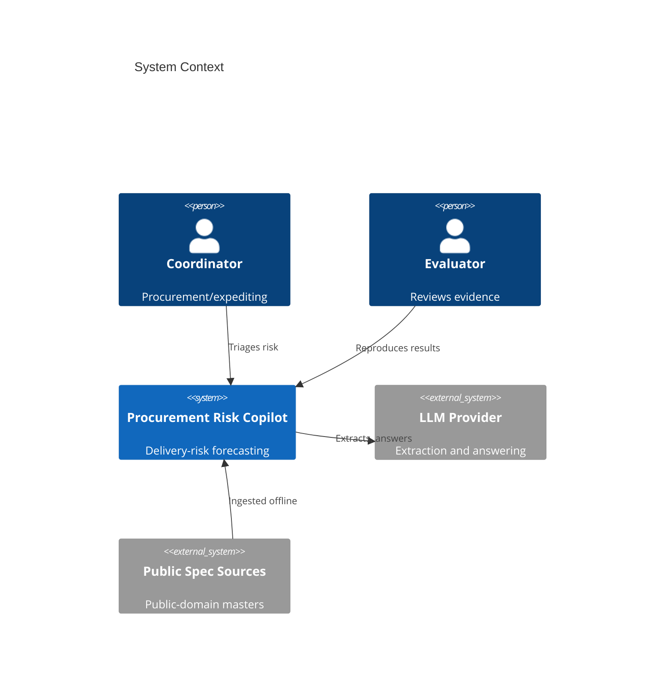
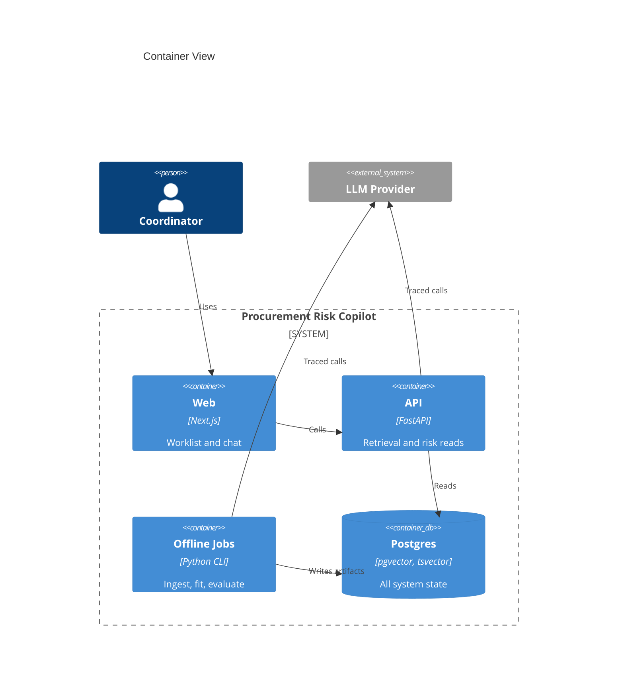
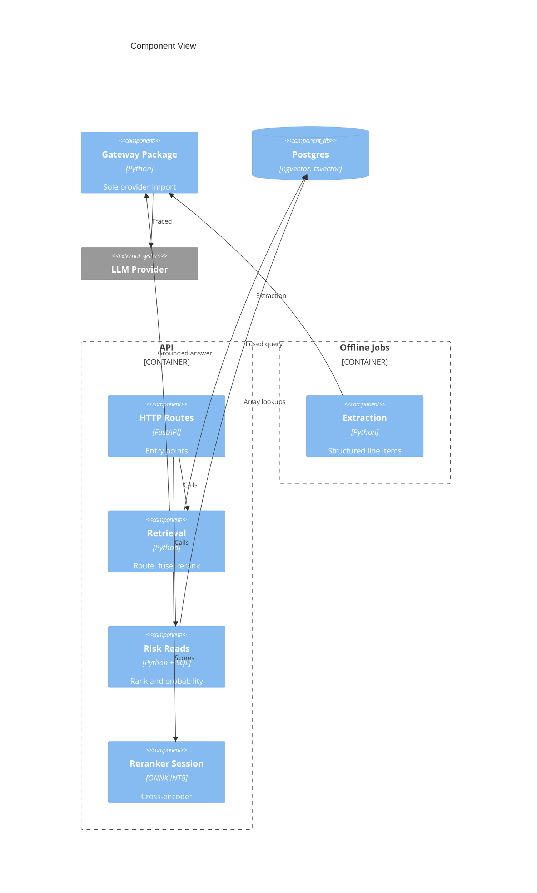
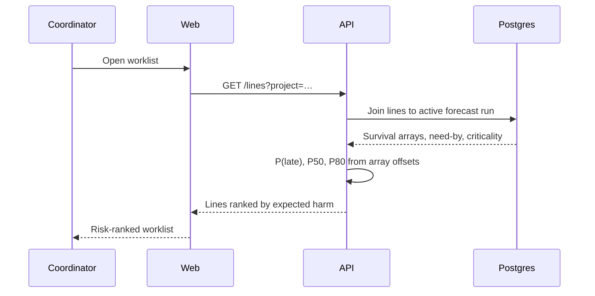
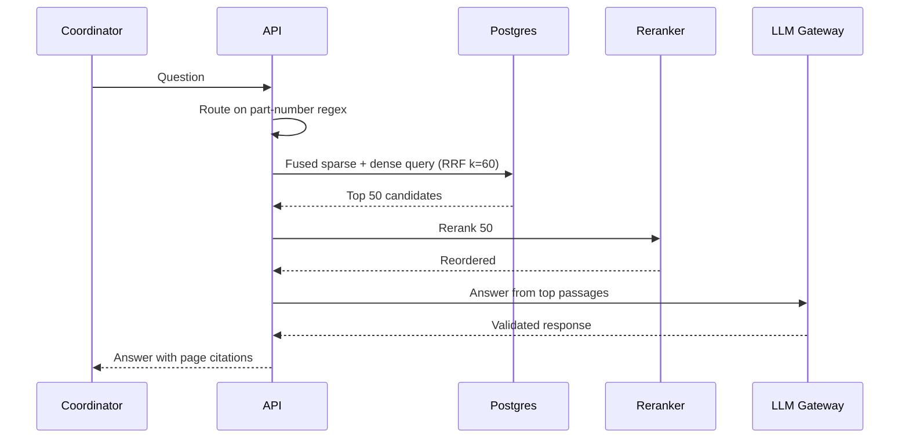
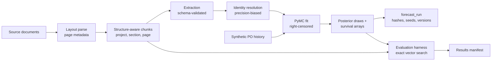
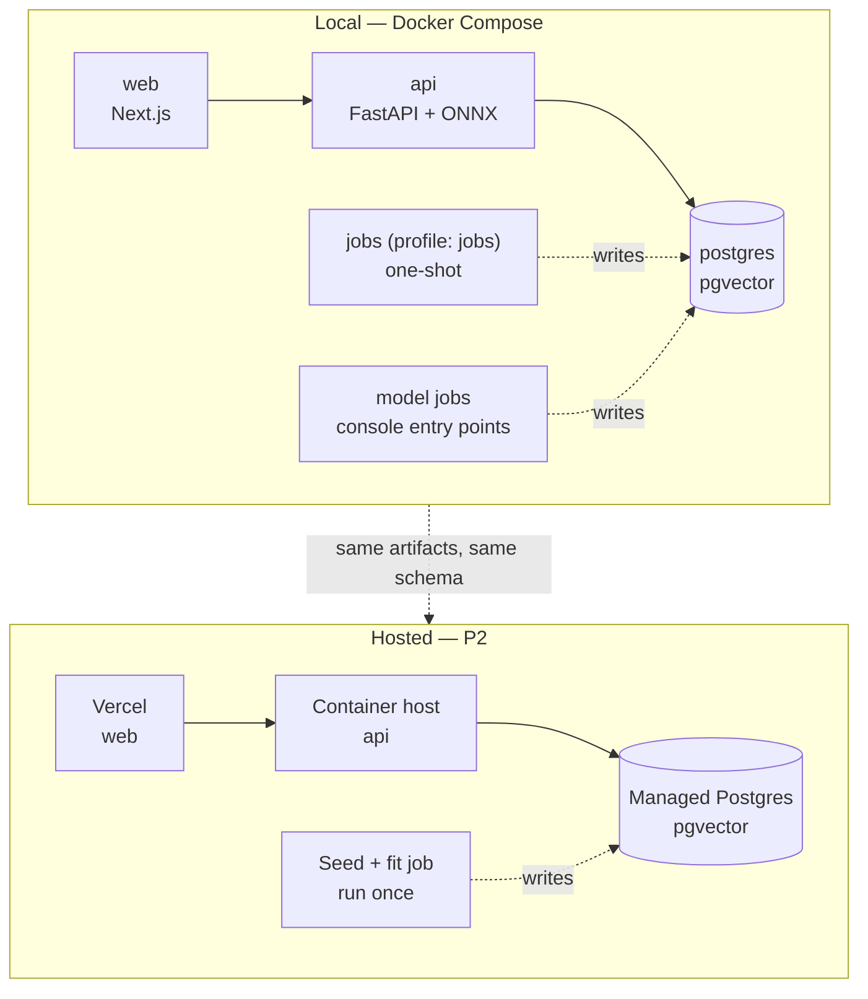

# Software Architecture Document: Procurement Risk Copilot

> Date: 2026-07-25 | Status: Draft

## Purpose and Scope

Procurement Risk Copilot turns construction specification and submittal documents plus procurement lifecycle history into a calibrated, traceable delivery-risk forecast for open material orders. This document defines the project-level technical context: the system boundary, the container topology, the runtime and failure paths, the cross-cutting rules that constrain implementation, and the measurable quality attributes that gate release.

The system boundary covers document ingestion, evidence retrieval, cross-document identity resolution, offline probabilistic forecasting, and a coordinator-facing interface. Outside the boundary: authentication and multi-tenancy, integration with any construction system of record, real-time data feeds, and automated outbound action of any kind. The product's grounding is `specs/prd.md`; the design decisions summarized here have full records under `specs/adrs/`.

Two constraints shape nearly every decision below and are treated as architecture, not policy: **no posterior is ever sampled at request time**, and **request-time components must fit a small hosted instance's compute budget**. Both hold from the first release so that public hosting is a deployment exercise rather than a rewrite.

## Technical Context

**Language/Version**: TypeScript 5.x on Node 22 (web); Python 3.12 (api, model, gateway)
**Primary Dependencies**: Next.js 16 App Router, React; FastAPI, Pydantic, psycopg; PyMC, ArviZ, pandas, NumPy; ONNX Runtime (INT8 CPU inference); Anthropic SDK (`claude-opus-5`) 
**Storage**: PostgreSQL 16 with `pgvector` (HNSW) and native `tsvector` full-text — single instance, no second datastore of record ({SAD:ADR-0015})
**Testing**: pytest with Hypothesis for property-based tests over pure scoring functions; Vitest and Playwright for the web tier; `import-linter` for architecture contracts; a `reproduce` job that re-runs the evaluation harness and diffs against a committed results manifest 
**Target Platform**: Linux containers under Docker Compose for local development; Vercel (web) plus a container host with managed Postgres for the hosted demo
**Project Type**: web (four-entry monorepo — interface, request-serving API, offline modeling package, shared provider gateway) 
**Project Mode**: greenfield
**Performance Goals**: Worklist p95 ≤ 1.5 s and grounded-answer p95 ≤ 4 s on one shared vCPU; reranking of 50 candidates within 150–400 ms; API container steady-state resident memory ≤ 400 MB
**Constraints**: No request-time posterior sampling; request-time components bounded by a small hosted instance; all data public-domain or synthetic; every model invocation traced and schema-validated; all date, ranking, and probability arithmetic in deterministic code; evaluation sets hashed before tuning
**Scale/Scope**: 30–60 source documents, ~5–15k chunks, ~200 purchase-order lines across 5 projects and 12 vendors, ~120 uncensored delivery events; effectively single-user; no multi-tenancy

## System Scope and Context

The coordinator is the only designed-for actor. A technical evaluator is a distinct stakeholder who reads published evidence and reproduces it, and whose needs shape the evaluation harness and the observability surface rather than the worklist. The only external runtime dependency is the language-model provider; everything else is local to the deployment.

Public-domain federal specifications and a synthesized project-document layer enter the system offline through an ingestion job, never through a request path. There is no inbound integration and no outbound action — the system reads documents and data, and renders judgments.

### C4 System Context

### C4 Container View

The three persistent containers are the interface, the API, and the datastore. The modeling boundary is deliberately **not** a service — it is a set of one-shot jobs that write artifacts the API reads ({SAD:ADR-0003}). The reranker is a model session inside the API process rather than a container of its own ({SAD:ADR-0006}).

The web tier never reaches the datastore directly. That rule exists so the hosted split cannot tempt a reimplementation of probability or ranking logic in TypeScript, which would break the single deterministic-computation boundary ({SAD:ADR-0008}).

### C4 Component View

Shown because this is where the cross-cutting rules are enforced, and that is not visible from the container view. The gateway sits outside both Python boundaries deliberately: it is a shared package, not a module of either, which is what lets one importing module serve both without the boundaries depending on each other ({SAD:ADR-0010}).

The gateway package is the only module permitted to import the provider client; an `import-linter` contract fails the build otherwise ({SAD:ADR-0007}). Both consumers reach it as a dependency, and neither Python boundary depends on the other — the property that makes a single import site achievable at all ({SAD:ADR-0010}). `Risk Reads` and the retrieval fusion query contain no model-facing imports, asserted by an architecture test ({SAD:ADR-0008}).

## Solution Strategy and Architecture Style

- **Architecture Style**: Modular monolith for request serving, paired with an offline batch pipeline. Two persistent processes, one datastore, a set of one-shot jobs, and one shared package that both Python entries depend on.
- **Source Code Location**: All project source code must reside in the `/src` directory — organized as `/src/web`, `/src/api`, `/src/model`, and `/src/gateway` ({SAD:ADR-0010}). The gateway is a shared package rather than a fourth boundary: both Python boundaries depend on it and neither depends on the other, which is what keeps exactly one module in the repository importing the provider client.
- **Why this style fits**: Scale is small and fixed, concurrency is effectively one user, and delivery capacity is one developer. The genuine architectural pressure is not throughput but *boundary discipline* — keeping the modeling toolchain out of the serving image, keeping ranking deterministic and testable, and keeping model invocation on exactly one path. A monolith with hard internal contracts enforces those better than distributed services would, because the contracts become import rules and schema constraints rather than network hops. Making the modeling boundary a batch pipeline rather than a service is what converts "never sample at request time" from a rule into a structural fact.
- **Alternatives considered**: A service-per-concern topology was rejected — a model service would idle at request time doing nothing while creating exactly the on-demand sampling endpoint the constraints exist to prevent. A dedicated vector database and separate search engine were rejected; at ~15k chunks one Postgres serves all three roles, and fusing in SQL keeps ranking as a single testable artifact inside the deterministic boundary ({SAD:ADR-0002}).

## Key Runtime Flows and Failure Paths

### Primary Flow — Coordinator Worklist

The worklist is the product's primary surface, and it has **zero request-time model dependency**. Every number it shows is an array lookup against a precomputed artifact.

### Secondary Flow — Grounded Answer

### Offline Flow — Ingest, Fit, Evaluate

### Failure Paths

Several of these are architectural strengths rather than gaps, and are stated as such.

- **Language-model provider unavailable** → the worklist, all risk figures, and the detail view are **completely unaffected**, because precomputation removes every request-time model dependency from the primary surface. Only chat degrades, and it degrades to unavailable rather than to a wrong answer.
- **Model output fails schema validation after one repair attempt** → the record is routed to an extraction-failure table and the field is left **absent rather than wrong**, consistent with preferring a visible gap to a silent mistake.
- **Reranker session fails to load** → retrieval degrades to fusion-only ordering, and the response and interface both flag the degraded mode. The system never silently serves worse results under published reranked numbers.
- **Embedding model or revision mismatch** → retrieval refuses to serve rather than mixing vector spaces; the harness aborts rather than producing a number nobody could reproduce.
- **No active forecast run** → the interface shows "no current forecast" rather than a stale one; run selection uses an explicit active-run pointer, never most-recent-timestamp ordering.
- **Part-number router false positive** → the deterministic lookup **falls through** to hybrid retrieval, so the router is strictly additive and can never exclude a correct answer.
- **Evaluation-set hash mismatch** → the harness exits non-zero before running anything ({SAD:ADR-0009}).
- **Stale schema version on a forecast artifact** → the API fails loudly rather than misreading array offsets.

## Deployment and Infrastructure View

Local development is the release target; the hosted demo is the same topology with the interface and API split across providers. Nothing about how forecasts are produced or served changes between them — that is the test of whether the two architecture constraints were honored.

Jobs reach their runtime one of two ways ({SAD:ADR-0011}). Containerized jobs are declared under a non-default profile so ordinary startup brings up only the three persistent services, and the API never declares a startup dependency on a job; their base image is pinned by digest and dependencies by hash. A job owned by the modeling boundary is invoked instead as a console entry point through that entry's own environment, because the modeling boundary cannot share the serving build context without defeating the contracts that keep the two apart — its determinism is bound by the entry's lockfile rather than by an image digest. Either way environment drift is not an admissible source of variance in published numbers; the mechanism differs, the guarantee does not.

Host port bindings are parameterised rather than fixed. Each published port carries an override variable with a non-conventional default — the database on 5434, the API on 8001, the interface on 3000 — so the documented value is a **default, not an address**. Several checkouts of this repository can share one machine, and a literal binding is one no second copy can move without editing committed state; a consumer that hardcodes a documented port rather than reading its own environment will therefore be wrong on every machine but the first. Before the stack starts, a preflight resolves each port by asking Docker's published-port list *and* attempting a real socket bind, because neither is sufficient alone: on Docker Desktop a published port lives in the virtual machine's namespace and a host bind on an occupied port succeeds, while Docker cannot see a port held by an unrelated process. When a default is held the preflight substitutes the next free port, never a conventional one, and **announces the substitution** naming the default, the substitute, and the holder — a run that quietly bound elsewhere would report a green result for a topology it did not exercise.

## Cross-Cutting Concerns

### Security

There is no authentication, and that is a deliberate scope decision rather than an oversight — but three trust boundaries still exist and are designed for.

**Untrusted document content is a prompt-injection vector** into extraction and grounded answering. The mitigation is structural rather than filter-based: model output can never trigger an action (the system takes no outbound action at all), is constrained to a schema with closed enumerations, and is validated before persistence. A successful injection can at worst produce a rejected extraction.

**The model provider is the sole egress boundary.** Document text is the data that crosses it. The provider credential is redacted by the traced invocation path itself, making redaction a property of the boundary rather than each caller's responsibility ({SAD:ADR-0007}).

**Postgres is never publicly exposed**, in either topology. In the hosted split, the API is the only client.

Absence of authentication is recorded in the product document as a scope decision with its reversal condition and production-scale alternative, not as a limitation.

### Reliability

No availability target, no on-call, no backup and restore — appropriate to a demonstration and stated plainly rather than implied. What the design does guarantee is **graceful, visible degradation**: every failure path above either preserves correctness or announces the degraded mode. The specific reliability property worth naming is that the primary surface has no request-time dependency on the one external service, so the most likely outage cannot affect the product's core claim.

### Observability

No observability stack is deployed. Structured JSON to stdout, one `llm_invocation` table in the Postgres already running, and a trace identifier propagated from web through API to invocation.

The distinguishing choice is that **the trace is surfaced in the interface**, not buried in logs. For a demonstration whose audience is a technical evaluator, a tracing record hidden in a table demonstrates nothing; a panel showing per-call model, token counts, latency, cost, and validation outcome demonstrates a stated constraint being met. Invocation records store token counts, model identity, and a price-table version rather than only a derived cost, so cost is recomputable when pricing changes. Standard generative-AI telemetry attribute names are adopted even though the exporter is a Postgres table — it costs nothing and keeps the record exportable later; the semantic-convention version followed is pinned, since those attributes are not yet stable.

### Data Management

All data is public-domain or synthetic. Every corpus document is labeled `REAL` or `SYNTHETIC` in a shipped manifest carrying its license basis and layer-appropriate provenance — source, issuing body, and retrieval date when retrieved; generator identity, seed, generation date, and fixture hashes when generated. A generated document carries no retrieval provenance, because recording one would be a fabrication rather than a harmless placeholder. Copyrighted reference standards are cited, never included. Licenses are not mixed within a corpus location, compared over the governing basis identifier rather than over per-document components.

Retention, backup, and restore are out of scope — the entire dataset is regenerable from the repository plus the ingestion and generation jobs, which is a stronger property than a backup for this system. Schema evolution uses forward-only migrations. Forecast artifacts carry a `schema_version` so a stale reader fails loudly rather than misreading array offsets. Citation and confidence columns are `NOT NULL`, which makes an unattributed extracted value impossible to store rather than merely detectable ({SAD:ADR-0008}).

### Integration Strategy

Exactly one external integration: the language-model provider, reached only through the traced gateway package. Everything else is intra-deployment. The interface tier communicates solely with the API over HTTP and never with the datastore, preserving one data-access boundary and one place where deterministic computation lives.

The contract between the offline modeling boundary and the request-serving boundary is **the database, not a Python interface**: a `forecast_run` row carrying run identifier, model version, code revision, input data hash, seeds, library versions, artifact hash, schema version, and creation time, plus an explicit active-run pointer ({SAD:ADR-0003}).

### Operations

Single-developer ownership. Two environments: local and, at P2, hosted. Release is a tag on a repository state whose evaluation harness reproduces the published results manifest within the stated tolerance. Job invocation — generate, ingest, fit, evaluate, seed — is documented as the operational surface; there is no self-service refresh through the interface, by design.

## Quality Attributes

Generic scalability and availability rows are deliberately absent: at one concurrent user they would be unexamined boilerplate. These attributes are the ones this system is actually accountable for, and each has a measurement method rather than an aspiration.

| Attribute | Target | Measurement | Notes |
|-----------|--------|-------------|-------|
| Evaluation reproducibility | Published metrics reproduce within ±0.01 absolute (recall, MRR, precision) and ±2% relative (CRPS skill) from a clean checkout | `reproduce` job rebuilds from digest-pinned image and hash-pinned deps, re-runs the harness, diffs against the committed results manifest | Tolerance published with its cause; bitwise equality is unachievable for MCMC ({SAD:ADR-0009}) |
| Evaluation-set integrity | 100% of runs verify the SHA-256 manifest before executing | Harness exit code; verified hash printed into published results | Converts freeze-before-tuning from policy into an exit code |
| Traceability completeness | 100% of extracted values carry a page citation and per-field confidence | `NOT NULL` constraints at the storage boundary | Violation is impossible, not merely detected ({SAD:ADR-0008}) |
| Model-output validity | 100% schema-validated pre-persist; ≤1 repair attempt then fail closed | Outcome counter over `{valid, repaired, failed}`; repaired-rate published | Repaired rate is itself a published quality signal |
| Invocation observability | 100% of model calls traced | `import-linter` contract: exactly one module may import the provider client; build fails otherwise | Measured by construction, not by discipline ({SAD:ADR-0007}) |
| Determinism boundary | Zero date, ranking, or probability computation in model-facing modules | Architecture test plus property-based tests over pure scoring functions | Model extracts parameters; code computes ({SAD:ADR-0008}) |
| Compute envelope | API container steady-state RSS ≤ 400 MB; worklist p95 ≤ 1.5 s on 1 shared vCPU | Container benchmark job printing peak RSS and p95 | Reranker session is the dominant memory line item ({SAD:ADR-0006}) |
| Serving/modeling isolation | API image contains zero modeling-stack packages | Assertion over the built image's package list | Enforces the boundary that keeps the envelope reachable ({SAD:ADR-0003}) |
| Retrieval quality | recall@5 ≥ 0.85, MRR ≥ 0.70 on the frozen 50-item set, with Wilson 95% CIs | Evaluation harness over exact vector search; 5-arm ablation published | Exact path removes ANN variance from published numbers ({SAD:ADR-0005}) |
| Forecast calibration | twCRPS skill ≥ 20% over Kaplan-Meier; 80% PI coverage within 73–87% | Held-out evaluation with reliability diagram and PIT histogram | Kaplan-Meier is the honest opponent; quoted lead time reported for context |
| Merge precision | ≥ 0.95 on 40 hand-labeled pairs, published with rule-of-three bound | Identity-resolution evaluation against the frozen labeled set | Precision is primary; recall ≥ 0.80 is secondary by design |

## Architecture Decision Records

Project-level architectural decisions are maintained as standalone MADR files under `specs/adrs/`. This table is a navigational index — full decision records live in the linked files.

| ADR ID | Title | Status | Date | Supersedes | File |
|--------|-------|--------|------|------------|------|
| ADR-0001 | Monorepo Source Layout Under /src | superseded | 2026-07-25 | — | [0001-monorepo-source-layout-under-src.md](adrs/0001-monorepo-source-layout-under-src.md) |
| ADR-0002 | Postgres as the Single Datastore | accepted | 2026-07-25 | — | [0002-postgres-as-the-single-datastore.md](adrs/0002-postgres-as-the-single-datastore.md) |
| ADR-0003 | Offline Modeling Package Instead of a Model Service | superseded | 2026-07-25 | — | [0003-offline-modeling-package-instead-of-a-model-service.md](adrs/0003-offline-modeling-package-instead-of-a-model-service.md) |
| ADR-0004 | Materialized Posterior Draws with SQL-Side Risk Computation | accepted | 2026-07-25 | — | [0004-materialized-posterior-draws-with-sql-side-risk-computation.md](adrs/0004-materialized-posterior-draws-with-sql-side-risk-computation.md) |
| ADR-0005 | Exact Vector Search for Evaluation, Approximate for Serving | accepted | 2026-07-25 | — | [0005-exact-vector-search-for-evaluation-approximate-for-serving.md](adrs/0005-exact-vector-search-for-evaluation-approximate-for-serving.md) |
| ADR-0006 | Local Quantized Cross-Encoder Reranker in the Serving Container | accepted | 2026-07-25 | — | [0006-local-quantized-cross-encoder-reranker.md](adrs/0006-local-quantized-cross-encoder-reranker.md) |
| ADR-0007 | Single Traced Language-Model Invocation Boundary | accepted | 2026-07-25 | — | [0007-single-traced-language-model-invocation-boundary.md](adrs/0007-single-traced-language-model-invocation-boundary.md) |
| ADR-0008 | Deterministic Provenance and Computation Boundary | accepted | 2026-07-25 | — | [0008-deterministic-provenance-and-computation-boundary.md](adrs/0008-deterministic-provenance-and-computation-boundary.md) |
| ADR-0009 | Reproducibility Gate as a Published Tolerance | accepted | 2026-07-25 | — | [0009-reproducibility-gate-as-a-published-tolerance.md](adrs/0009-reproducibility-gate-as-a-published-tolerance.md) |
| ADR-0010 | Source Layout with a Shared Gateway Package | accepted | 2026-07-25 | ADR-0001 | [0010-source-layout-with-a-shared-gateway-package.md](adrs/0010-source-layout-with-a-shared-gateway-package.md) |
| ADR-0011 | Model-Owned One-Shot Jobs Invoked as Console Entry Points | accepted | 2026-07-25 | ADR-0003 | [0011-model-owned-one-shot-jobs-invoked-as-console-entry-points.md](adrs/0011-model-owned-one-shot-jobs-invoked-as-console-entry-points.md) |
| ADR-0012 | Embedding Model and Vector Dimension | accepted | 2026-07-25 | — | [0012-embedding-model-and-vector-dimension.md](adrs/0012-embedding-model-and-vector-dimension.md) |
| ADR-0013 | Schema Ownership in the Modeling Entry with Constants Published Through the Database | superseded | 2026-07-25 | — | [0013-schema-ownership-in-the-modeling-entry.md](adrs/0013-schema-ownership-in-the-modeling-entry.md) |
| ADR-0014 | Provider SDK as an Optional Extra of the Gateway Package | accepted | 2026-07-25 | — | [0014-provider-sdk-as-an-optional-extra-of-the-gateway-package.md](adrs/0014-provider-sdk-as-an-optional-extra-of-the-gateway-package.md) |
| ADR-0015 | Local Spool for Invocation Records Whose Database Write Fails | accepted | 2026-07-25 | — | [0015-local-spool-for-invocation-records-whose-database-write-fails.md](adrs/0015-local-spool-for-invocation-records-whose-database-write-fails.md) |
| ADR-0016 | Database-Client Access Is Not Restricted by Schema Ownership | accepted | 2026-07-26 | ADR-0013 | [0016-database-client-access-is-not-restricted-by-schema-ownership.md](adrs/0016-database-client-access-is-not-restricted-by-schema-ownership.md) |
| ADR-0017 | A Plan-Phase Artifact May Be Declared Normative Over a Specify-Phase Requirement | accepted | 2026-07-26 | — | [0017-plan-phase-artifact-normative-over-a-specify-phase-requirement.md](adrs/0017-plan-phase-artifact-normative-over-a-specify-phase-requirement.md) |
| ADR-0018 | Embedding Runtime Pinned to ONNX Runtime for Corpus and Query Embedding | accepted | 2026-07-27 | — | [0018-embedding-runtime-pinned-to-onnx-runtime.md](adrs/0018-embedding-runtime-pinned-to-onnx-runtime.md) |
| ADR-0019 | Ingested Derived Data Carries an Active or Superseded Generation | accepted | 2026-07-27 | — | [0019-ingested-derived-data-carries-an-active-or-superseded-generation.md](adrs/0019-ingested-derived-data-carries-an-active-or-superseded-generation.md) |

<!-- Rows are managed by the ADR Author subagent. Do not embed full decision prose here. -->

## Risks, Assumptions, Constraints, and Open Questions

### Risks

- **The dual posterior representation can drift.** The canonical draw array and the derived day-grid survival array must be written by the same job in the same transaction, or risk figures will disagree with the plotted distribution. Mitigation: single-transaction write plus a consistency assertion in the fit job.
- **Two retrieval configurations can diverge.** If the exact/approximate flag comes to control anything beyond index usage, the evaluation path stops measuring the served path. Mitigation: the flag is constrained to index usage; filters, fusion, fetch depth, and reranking are shared code.
- **The reranker session dominates the API memory budget.** A model larger than planned, or multiple worker processes each loading a copy, breaches the compute envelope. Mitigation: single worker, INT8 quantization, benchmark job asserting peak RSS.
- **Stale response fixtures can silently serve old model output.** Mitigation: cache keys include a prompt hash, so a changed prompt misses rather than serving stale content.
- **SQL-resident ranking and probability logic can go undertested.** It gets less natural coverage than application-language code. Mitigation: property-based tests over the pure scoring functions plus fixed-input regression tests over the fusion query.
- **Parser page attribution becomes correctness-critical.** Deterministic provenance is only as trustworthy as the parser's page mapping. Mitigation: spot-validation of page attribution as part of ingestion evaluation.
- **Runtime thread defaults will oversubscribe the container.** The inference runtime derives thread counts from the host rather than the cgroup allocation. Mitigation: explicit thread configuration and disabled spin-waiting.

### Assumptions

- One Postgres instance is sufficient for full-text, vector, analytical, and trace workloads at this corpus size — a scale-bound assumption that would fail above roughly 100k chunks.
- Exact vector search stays within latency budget at the planned corpus size, keeping the evaluation path practical.
- A quantized cross-encoder's quality loss versus full precision is small; this is measured and published rather than assumed.
- The synthetic procurement generator produces lifecycle distributions realistic enough that model structure is exercised, though it cannot validate real-world accuracy.
- Federal specification sources remain publicly retrievable; documents are vendored with their manifest at retrieval time against this.

### Constraints

- All project source under `/src`, in four entries — three boundaries plus a shared gateway package ({SAD:ADR-0010}).
- No request-time posterior sampling, in this release or any later one ({SAD:ADR-0003}).
- Request-time components bounded by a small hosted instance's CPU and memory.
- Exactly one module may import the model provider client, enforced in the build ({SAD:ADR-0007}).
- Every model output schema-validated with repair-or-fail before persistence.
- Every extracted value carries a page citation and per-field confidence, enforced by `NOT NULL`.
- Cross-document merging biases toward refusal; uncertain pairs are withheld, not merged.
- Evaluation sets frozen and hashed before any tuning run ({SAD:ADR-0009}).
- The web tier never queries the datastore directly.
- All data public-domain or synthetic, with per-document `REAL`/`SYNTHETIC` provenance.

### Open Questions

- Should the extraction-failure table be exposed in the interface as a data-quality surface, or remain an internal diagnostic?
- What is the refresh cadence and trigger for the forecast run in the hosted deployment — manual only, or scheduled?
- Does the review-queue data contract need a decision or resolution audit trail in P1 so the P2 workspace is purely additive?
- Should the survival-array day grid be truncated at a fixed horizon, and if so what happens to probability mass beyond it?

## Project Context Baseline Updates

- Source layout fixed to four entries under `/src` — `/src/web`, `/src/api`, `/src/model`, and a shared `/src/gateway` package — resolving both the product brief's root-level monorepo against the `/src` convention, and the later conflict between one repository-wide provider import site and two Python boundaries that may not depend on each other.
- Architecture style fixed: modular monolith for serving plus an offline batch pipeline; the modeling boundary is a package with CLI jobs, never a service.
- Storage topology fixed: a single Postgres instance for full-text, vector, relational, posterior, and trace data, with Reciprocal Rank Fusion executed as one SQL statement.
- Forecast serving contract fixed: sorted posterior draws as the canonical hashable artifact, day-grid survival arrays as the read path, risk arithmetic in SQL at read time.
- Vector search split fixed: exact for evaluation, tuned HNSW for serving, with the recall delta published as an ablation arm.
- Reranking fixed to a local INT8 ONNX cross-encoder inside the API container, chosen for reproducibility rather than latency.
- Model provider and tier fixed to `claude-opus-5` for offline extraction and grounded answering, with hash-keyed embedding and response caches closing the remaining reproducibility loopholes.
- Page provenance fixed as a deterministic parser output rather than model output, resolving the incompatibility between provider-native citations and schema-constrained extraction.
- Reproducibility gate fixed as a published tolerance (±0.01 absolute, ±2% relative) with hash-pinned inputs and a harness that aborts on evaluation-set mismatch.
- Observability fixed as a product surface: the model-invocation trace is rendered in the interface, not confined to logs.
- Python toolchain fixed to `uv` with one standalone project per entry — three `pyproject.toml` and `uv.lock` pairs, never a shared workspace, whose single resolution cannot stop one member reaching another's dependencies. Every Python tool runs as `uv run --directory src/<entry>`; a bare invocation from the repository root resolves against whichever environment is active and silently crosses the boundary the contracts exist to enforce.
- Import contracts are configured per entry rather than repository-wide, because the tool requires an importable root package and a single root configuration would need every stack installed together — defeating the isolation being proved. The single-provider-import rule uses an allowlist contract checking direct imports only; the computation boundary uses a forbidden contract with indirect detection on.
- Coverage aggregates to one report at the repository root and gates only there; per-entry runners report without gating, because two entries have an empty denominator. Distinct per-entry data files are the mechanism, since the test plugin overrides the library's own parallel setting.
- Image content is verified from inside the built image rather than by an external assertion binary, so the checks survive a multi-stage build and remain inside the measured coverage denominator.
- Shared synthetic fixtures carry integrity as a reader-computed content hash over a canonical serialization, never a stored version field: a forgotten bump makes drift recordable but not detectable.
- Recording a fixture's content hash is only half the contract — the comparison against the reader's current value is a validation step that runs in the verification workflow, so drift surfaces on the next push rather than by hand. Any consumer generating artifacts from a shared fixture owns both halves.
- Provenance records are layer-dependent, not uniform. A generated artifact has no issuing body and no retrieval date, so required-field validation is defined per layer, and a synthetic record carrying retrieval provenance is a falsehood rather than a harmless placeholder.
- License segregation is expressed structurally: one license basis per corpus location, one manifest per location. A mixed-license directory is a validation failure, not a documentation gap.
- Branch protection on the default branch remains an open deviation from the CI requirement that checks pass before merge — it is a hosting-platform setting no committed artifact can assert, owned by the repository administrator, closing when the verification check is marked required and that state is evidenced in a release record.
- Reproducibility of a *rendered* artifact is asserted over its pre-render model, never over its file bytes: a renderer stamps timestamps, a document identifier, and a producer string into the output, so byte comparison fails for reasons unrelated to content and a routine dependency bump would read as drift. Byte-identity is retained as a secondary check under a lockfile-pinned renderer, and a pin change is a regeneration event rather than a validation failure.
- Synthesized documents that must look scanned keep a complete machine-readable text layer beneath the degraded page image, with the citation anchor held outside the degraded region as real text. No document in this project requires optical character recognition to read, and the absence of genuine recognition error is disclosed as a limitation rather than left implied.
- Provenance validation is a build-gating step, not an on-demand tool: the corpus validator runs inside the verification workflow on every triggering push and every pull request. Checks that must reach the network are separated into opt-in jobs, because a required check may not depend on an external host.
- Distinct digests are kept distinct and never conflated — bytes as committed, bytes as retrieved, and a canonical serialization of a pre-render model each answer a different question, and collapsing any two turns a real check into a tautology.
- Model-owned one-shot jobs are invoked as console entry points through the modeling entry's own environment rather than as container jobs behind the Compose profile ({SAD:ADR-0011}, superseding {SAD:ADR-0003} on that clause only). The modeling boundary remains an offline package of discrete commands and never a service; what changed is the invocation path, because a model job image cannot share the serving build context without deleting the two contracts that keep the modeling boundary out of it.
- Survival-grid bound fixed: a uniform fixed day horizon measured from a stated anchor date, with probability mass beyond the horizon stored as an explicit residual rather than truncated — resolving the open question on grid truncation.
- Embedding column contract fixed: one vector dimension declared once for the whole corpus, with embedding model identity and revision recorded per chunk, so a mismatch refuses to serve rather than mixing vector spaces.
- Schema-change coordination fixed: each epic reserves a migration-number block at its start and owns a disjoint table set, so parallel epics adding schema within one wave cannot collide. Alembic is the migration tool; the block is a filename prefix over its revision identifiers, and continuous integration asserts a single head ({SAD:ADR-0013}).
- Schema ownership fixed: `/src/model` owns all migrations and the migration tooling, while shared constants are published in a single-row table the serving boundary reads over the connection rather than importing — keeping the four-entry rule and ADR-0010 intact ({SAD:ADR-0013}). Ownership of the schema does not extend to exclusive possession of a database client; that clause is superseded by {SAD:ADR-0016}.
- Embedding model fixed to a compact 384-dimension open sentence-embedding model generated locally, chosen against the 400 MB serving envelope already dominated by the reranker session; pgvector's 2000-dimension index ceiling stands as a constraint on any future change ({SAD:ADR-0012}).
- Constraint style fixed: cross-table invariants are carried by composite foreign keys or by collapsing one-to-one tables, never by triggers where a declarative form exists; exactly one deferrable foreign key is sanctioned, and check and non-null constraints are never deferred because PostgreSQL does not permit it.
- A local durable buffer holding only unreconciled writes is not a second datastore, because nothing queries it and its steady state is empty. The single-instance rule binds stores of data of record ({SAD:ADR-0015}); `project-instructions.md` v1.2.1 carries the same narrowing.
- **Schema ownership does not restrict database-client access** ({SAD:ADR-0016}, superseding {SAD:ADR-0013} on that clause only). Ownership of the schema, the DDL, the migration tooling, and the migration job image is exclusive to `/src/model`; possession of a Postgres driver is not. Any entry may hold a driver for a purpose an accepted record already sanctions — `/src/api` to read `schema_constants` and to compute risk in SQL ({SAD:ADR-0004}), `/src/gateway` to write invocation records ({SAD:ADR-0010}). Migration tooling, ORMs, and schema assets remain exclusive to `/src/model`, which is the constraint that was actually load-bearing.
- Provider resolution fixed to exactly two modes with no default — `record`, the only path that reaches the provider and gated behind an opt-in separate from mode selection, and `replay`, which resolves from committed fixtures alone. A record-on-miss default would let an offline claim be satisfied by a live call nobody noticed.
- The gateway's public surface is provider-type-free: gateway-owned request, result, and error types only. The import contract constrains imports and would stay green while a returned provider type coupled both boundaries to the SDK, so the boundary is created by the return type, not the contract ({SAD:ADR-0014}).
- Cost is versioned deterministic code, not a constant: a price table keyed by model and effective-from date with separate base-input, cache-write, cache-read, and output rates, and every invocation storing token counts plus the price-table version so a historical figure stays recomputable after rates change.
- Fixture keys hash a canonical serialization of the whole request over a closed field list, including the submitted schema and its version; a field outside that list is an error rather than an omission, because anything left out of hash scope produces a silent stale replay.
- Credential redaction is a closed inventory of egress sinks — log output, exception payloads including traceback-rendered local frames, committed fixtures and their provenance sidecars, the local spool, and check output — not one logging filter. Provider exceptions are normalized at the boundary into an error carrying only status, error type, and request identifier, with no chained cause retained.
- Invocation-record retention fixed as unbounded for the demonstration, resolving the open question at the epic that creates the table; any cap is proposed by the surface that reads it. The same answer covers the local spool, which is bounded by draining to empty rather than by a policy, and whose growth during a prolonged outage is disclosed rather than capped.
- Embedding *runtime* fixed to ONNX Runtime for both corpus embedding and request-time query embedding ({SAD:ADR-0018}), completing {SAD:ADR-0012}, which pinned the model and dimension but named no runtime. One inference runtime loads in the serving container, which already carries the INT8 reranker session inside the 400 MB envelope. The cost is that a raw export emits token-level hidden states only — attention-masked mean pooling and L2 normalization become repository code — so parity against the reference encoder is an asserted numeric tolerance rather than an assumption.
- Derived ingested data carries a generation that is active or superseded, held per document rather than per run because a run re-ingests only the documents whose inputs changed ({SAD:ADR-0019}). At most one active generation per document is a partial unique index rather than application discipline, so two live generations are unrepresentable; downstream readers filter through a view rather than each remembering to. Retirement deletes strictly leaf-up, because `ON DELETE RESTRICT` cannot be deferred the way `NO ACTION` can.
- Outbound calls carry a per-attempt timeout inside an outer monotonic deadline, and a timeout expiry counts against the transport retry budget rather than any semantic retry budget. Per-operation timeouts multiplied by attempts are unbounded without that ceiling.
- Telemetry field naming follows the OpenTelemetry generative-AI semantic conventions at a pinned version recorded alongside the data, because that convention set carries no attribute-key stability guarantee and an unpinned field name is an unfalsifiable requirement.
- The computation-boundary contract extends to the gateway entry, where the project's first real arithmetic lands — cost, content hashing, duration. The provider-facing module must not reach it; an orchestration module above both composes the call, the validation, the computation, and the record. A forbidden contract catches import edges only, so arithmetic inlined into the provider module produces no edge and remains a review concern.
- The provider SDK is an optional extra of the gateway package rather than a base dependency ({SAD:ADR-0014}), so a consumer declares `gateway[provider]` and an environment can exist in which the gateway imports and type-checks with no provider package present. Any environment running the single-provider-import contract must install the extra, because the contract graphs external packages and an absent distribution makes it error rather than pass.
- Coverage is instrumented per entry with its own data file under a repository-root path, run in parallel mode with relative files, and combined at the root against a path-remapping section. An entry whose test step writes its data file inside its own directory is silently absent from the gate rather than failing it.
- Host port bindings are parameterised with non-conventional defaults, and a preflight substitutes the next free non-conventional port when a default is held, announcing the substitution with its holder. A documented port is a default rather than a fixed address: several checkouts of this repository share one machine, so a consumer that hardcodes one will be wrong everywhere but the first. No decision record covers this — it refines TR-015's original port choice rather than superseding a decision, and the Deployment and Infrastructure view above is its statement of record.
- Feature workspace numbers were not allocated the way decision-record numbers are, and two workspaces both took `00002` — E003's and `00002-public-corpus-and-manifest` (E002). **Resolved**: E003's was renamed to `00003-core-data-schema`, so numbering is now one-to-one with epic numbers (`00001`→E001, `00002`→E002, `00003`→E003, `00004`→E004), and `project-instructions.md` v1.2.2 made claiming a workspace number at epic start a rule, with v1.2.3 recording the convention.

  An earlier revision of this entry said both were "left as they are" because E003's number was referenced by merged history and a pull request. That was wrong, and the reason is worth keeping: merged commit messages cite the old path, but they are *historical records of what the path was* and do not need to change. What actually constrains a rename is live references — 51 of them across 16 files, including five test modules that read `data-model.md` through a hard-coded path — and those are finite, enumerable, and provable by running the suite. Mid-flight the same rename is genuinely expensive, because the reference set is still growing.
